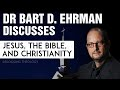

# @bartdehrman  discusses Jesus, the Bible, and Christianity (2021-12-19)

## Description

You Can Support My Work on Patreon:
https://www.patreon.com/Bloggingtheology

My Paypal Link: 
https://www.paypal.com/paypalme/bloggingtheology?locale.x=en_GB

## Summary of [@bartdehrman discusses Jesus, the Bible, and Christianity](https://www.youtube.com/watch?v=oeZrdgxi9bY)

This summary is AI generated - there are inaccuracies

### [00:00:00](https://www.youtube.com/watch?v=oeZrdgxi9bY&t=0) - [01:00:00](https://www.youtube.com/watch?v=oeZrdgxi9bY&t=3600)

In this YouTube video, Bart Dehrman discusses his view of Jesus, the Bible, and Christianity. He argues that early Christians believed that Jesus was a divine being, and that this idea may have originated with the Gospel of John. He also suggests that there may have been conflicts between early disciples of Jesus and those who followed Paul.

**[00:00:00](https://www.youtube.com/watch?v=oeZrdgxi9bY&t=0)** Dr. Bart Dehrman discusses the origins and development of early Christianities in his latest book, "Jesus and the Gospels." He notes that there is much speculation involved in dating the four canonical gospels, but most scholars agree that Mark was the first gospel, Matthew and Luke were written around or after the year 70, and John was written around or after 95. Paul's high theology is not a reliable indicator of chronology, as both John and Paul have opposite views on Christ's incarnation.
* **[00:05:00](https://www.youtube.com/watch?v=oeZrdgxi9bY&t=300)** This YouTube video discusses how scholars believe that the predictions about Jesus' death and resurrection were specific to His time and were not inserted into the gospel narratives later on. The video also discusses the astonishment that the disciples showed when Jesus did not appear after His resurrection.
* **[00:10:00](https://www.youtube.com/watch?v=oeZrdgxi9bY&t=600)** The author discusses evidence that suggests that Jesus may have thought of himself as a divine being, and that the idea may have originated with the Gospel of John. He says that most historians think that the first three gospels – Matthew, Mark, and Luke – are based on older sources, and that Matthew and Luke both have sources that date back to before Mark. None of the gospels mention Jesus calling himself "god." This may be evidence that the idea of Jesus being a divine being developed later, after he had died.
* **[00:15:00](https://www.youtube.com/watch?v=oeZrdgxi9bY&t=900)** In this YouTube video, Bart Dehrman discusses the passage found in Mark 10:17-19, in which a man comes to Jesus asking what he needs to do to inherit eternal life. Dehrman points out that this passage is historically reliable and that, in Matthew, Jesus changes the words from "what good thing must I do" to "only God is good." Dehrman goes on to say that, because Matthew has a problem with this statement, he changes it to "why do you call me good, there is no one good but God alone."
* **[00:20:00](https://www.youtube.com/watch?v=oeZrdgxi9bY&t=1200)** In Bart Dehrman's video, he discusses the various views on divinity among various ancient cultures and religions. He argues that the earliest belief among Christians was that Jesus was a divine being who ascended into heaven after his resurrection.
* **[00:25:00](https://www.youtube.com/watch?v=oeZrdgxi9bY&t=1500)**  Bart Dehrman discusses Jesus, the Bible, and Christianity. He notes that there is no incarnation in Luke, and that the virgin birth is found in Matthew and Luke, while the crucifixion is found only in Luke. Dehrman also discusses textual criticism of the Bible, in which he suggests that there may have been conflicts between early disciples of Jesus and those who followed Paul.
* **[00:30:00](https://www.youtube.com/watch?v=oeZrdgxi9bY&t=1800)**  Bart Dehrman discusses his view of Jesus, the Bible, and Christianity. He states that Paul did not think that following the Torah would make a jew right with God, and that jews were still welcome in his church while they followed customs.
* **[00:35:00](https://www.youtube.com/watch?v=oeZrdgxi9bY&t=2100)** The author discusses textual criticism of the Bible, explaining that we have more copies of the New Testament than any other book from the ancient world. He points out that most of these copies are from a thousand years later, and that we don't have any copies of Paul's letter to the Galatians from the original.
* **[00:40:00](https://www.youtube.com/watch?v=oeZrdgxi9bY&t=2400)** The Dead Sea Scrolls are a collection of manuscripts that date back to the 2nd century BCE and are a valuable source of information about early Christianity. The scrolls contain copies of the Hebrew Bible, and they help to clarify certain biblical passages that have been disputed by orthodox Christians.
* **[00:45:00](https://www.youtube.com/watch?v=oeZrdgxi9bY&t=2700)** The transcript excerpt discusses the accuracy of biblical manuscripts, specifically the Isaias scroll. It is important to keep in mind that even if a manuscript is accurate, it does not necessarily mean that the author wrote what is inside it. There are multiple sources of error that can occur over a period of 700 years.
* **[00:50:00](https://www.youtube.com/watch?v=oeZrdgxi9bY&t=3000)** Walter Bauer argued that early Christianity was riddled with heresy, much of which resembled later Gnostic beliefs.
* **[00:55:00](https://www.youtube.com/watch?v=oeZrdgxi9bY&t=3300)** Bart Dehrman discusses the view that there were multiple groups of Christians throughout history, with one group eventually winning out and rewriting history. He presents Bauer's view, which argues that there was diversity among early Christians. Bauer's book, which was not translated into English until the late 1970s, has become a very popular critical opinion among critical historians.
### [01:00:00](https://www.youtube.com/watch?v=oeZrdgxi9bY&t=3600) - [01:25:00](https://www.youtube.com/watch?v=oeZrdgxi9bY&t=5100)

In this YouTube video, Bart Dehrman discusses the history of Jesus and how he was misinterpreted by later historians. He also recommends two books for those interested in further exploring these topics.

**[01:00:00](https://www.youtube.com/watch?v=oeZrdgxi9bY&t=3600)** In @bartdehrman's book, "Two Peters: Forgery and the Case for Peter of Rome," he argues that ancient people accepted literary conventions of writing in other people's names, and that this was not condemned as a practice. He provides evidence from ancient sources to support his argument.
* **[01:05:00](https://www.youtube.com/watch?v=oeZrdgxi9bY&t=3900)** Author Bart Dehrman discusses how, in his book "The Letter Carrier: The Secret History of the New Testament's Secretaries," he argues that the New Testament was not written by its purported authors, Jesus and Paul, but instead by secretaries. He provides evidence from ancient literature to support this claim. Dehrman concludes that, because Christian scholars are still largely influenced by Christian beliefs, his book has been largely ignored.
* **[01:10:00](https://www.youtube.com/watch?v=oeZrdgxi9bY&t=4200)** In his book Constructing Jesus, Dale Allison argues that the criterion-based historical Jesus approach is problematic because it relies too much on subjective criteria. He instead advocates a generalist approach, which considers an element as probably authentic if it is present in multiple genres. Some people object to this approach because it relies on subjective criteria.
* **[01:15:00](https://www.youtube.com/watch?v=oeZrdgxi9bY&t=4500)** In this YouTube video, Bart Dehrman discusses the criteria for determining if a biblical passage is embarrassing or not, and how it can be used to reconstruct historical events. He argues that the criteria are an unavoidable part of doing history, and that they always involve a probability judgment.
* **[01:20:00](https://www.youtube.com/watch?v=oeZrdgxi9bY&t=4800)** The video discusses the differences between scholars who assert certainty about certain aspects of Jesus' life and teachings, and those who disagree. Bart Dehrman discusses how, as a historian, he believes it is important to use probabilities when assessing historical events. He discusses the example of Jesus being an apocalypticist, and how even though most scholars agree on this, they often do not detail how they arrived at this conclusion.
* **[01:25:00](https://www.youtube.com/watch?v=oeZrdgxi9bY&t=5100)** This YouTube video discusses the history of Jesus, the Bible, and Christianity with Bart Dehrman, a 66-year-old historian. Dehrman discusses how Jesus was a countercultural figure who ended up being misinterpreted by later historians. He also recommends two books - the New Testament and Historical Introduction to Early Christian Writings - for those interested in further exploring these topics.

## Full transcript with timestamps

[0:00:02](https://youtu.be/oeZrdgxi9bY?t=2) good evening or good morning wherever  
[0:00:03](https://youtu.be/oeZrdgxi9bY?t=3) you are in the world hello and welcome  
[0:00:05](https://youtu.be/oeZrdgxi9bY?t=5) to blogging theology um i'm sure most of  
[0:00:08](https://youtu.be/oeZrdgxi9bY?t=8) our viewers will know who dr ehrman is  
[0:00:12](https://youtu.be/oeZrdgxi9bY?t=12) but in case some do not i'll just  
[0:00:14](https://youtu.be/oeZrdgxi9bY?t=14) mention that dr bye ehrman is an  
[0:00:16](https://youtu.be/oeZrdgxi9bY?t=16) american new testament scholar focusing  
[0:00:18](https://youtu.be/oeZrdgxi9bY?t=18) on textual criticism of the new  
[0:00:20](https://youtu.be/oeZrdgxi9bY?t=20) testament the historical jesus and the  
[0:00:22](https://youtu.be/oeZrdgxi9bY?t=22) origins and development of early  
[0:00:24](https://youtu.be/oeZrdgxi9bY?t=24) christianities written and edited over  
[0:00:27](https://youtu.be/oeZrdgxi9bY?t=27) 30 books including three college  
[0:00:29](https://youtu.be/oeZrdgxi9bY?t=29) textbooks  
[0:00:30](https://youtu.be/oeZrdgxi9bY?t=30) and is currently the james a grade  
[0:00:32](https://youtu.be/oeZrdgxi9bY?t=32) distinguished professor of religious  
[0:00:33](https://youtu.be/oeZrdgxi9bY?t=33) studies at the university of north  
[0:00:35](https://youtu.be/oeZrdgxi9bY?t=35) carolina at chapel hill in the usa  
[0:00:38](https://youtu.be/oeZrdgxi9bY?t=38) you are most welcome to blogging  
[0:00:40](https://youtu.be/oeZrdgxi9bY?t=40) theology dr urman  
[0:00:42](https://youtu.be/oeZrdgxi9bY?t=42) thank you thanks for having me  
[0:00:44](https://youtu.be/oeZrdgxi9bY?t=44) pleasure and i understand i can call you  
[0:00:46](https://youtu.be/oeZrdgxi9bY?t=46) bart from here on so i will uh thank you  
[0:00:50](https://youtu.be/oeZrdgxi9bY?t=50) um now ba has kindly uh agreed to  
[0:00:52](https://youtu.be/oeZrdgxi9bY?t=52) discuss uh with us three areas first is  
[0:00:55](https://youtu.be/oeZrdgxi9bY?t=55) jesus and the gospels secondly textual  
[0:00:58](https://youtu.be/oeZrdgxi9bY?t=58) criticism of the bible and thirdly the  
[0:01:00](https://youtu.be/oeZrdgxi9bY?t=60) christianities after the new testament  
[0:01:04](https://youtu.be/oeZrdgxi9bY?t=64) so without any more ado we'll jump into  
[0:01:06](https://youtu.be/oeZrdgxi9bY?t=66) the first subject which is jesus and the  
[0:01:08](https://youtu.be/oeZrdgxi9bY?t=68) gospels and i would like to ask you  
[0:01:09](https://youtu.be/oeZrdgxi9bY?t=69) about if i can one of the reasons most  
[0:01:12](https://youtu.be/oeZrdgxi9bY?t=72) scholars  
[0:01:13](https://youtu.be/oeZrdgxi9bY?t=73) date the four canonical gospels matthew  
[0:01:15](https://youtu.be/oeZrdgxi9bY?t=75) martin luke and john to about 80 70 to  
[0:01:18](https://youtu.be/oeZrdgxi9bY?t=78) 100. what are the reasons they have for  
[0:01:20](https://youtu.be/oeZrdgxi9bY?t=80) that well you have for that  
[0:01:23](https://youtu.be/oeZrdgxi9bY?t=83) yeah well uh it's  
[0:01:25](https://youtu.be/oeZrdgxi9bY?t=85) those are those are pretty much the  
[0:01:26](https://youtu.be/oeZrdgxi9bY?t=86) accepted dates the um  
[0:01:29](https://youtu.be/oeZrdgxi9bY?t=89) i think um  
[0:01:31](https://youtu.be/oeZrdgxi9bY?t=91) there there are different scholars have  
[0:01:32](https://youtu.be/oeZrdgxi9bY?t=92) different views of course and uh there  
[0:01:34](https://youtu.be/oeZrdgxi9bY?t=94) are there are some people who uh i would  
[0:01:36](https://youtu.be/oeZrdgxi9bY?t=96) say conservative evangelicals tend to  
[0:01:38](https://youtu.be/oeZrdgxi9bY?t=98) date them earlier maybe before 70 and  
[0:01:40](https://youtu.be/oeZrdgxi9bY?t=100) and there's a big movement now to think  
[0:01:42](https://youtu.be/oeZrdgxi9bY?t=102) about the gospel of luke as much later  
[0:01:43](https://youtu.be/oeZrdgxi9bY?t=103) like in the 120s or something so so  
[0:01:46](https://youtu.be/oeZrdgxi9bY?t=106) there there are a variety of opinions  
[0:01:48](https://youtu.be/oeZrdgxi9bY?t=108) but the reason for uh the dates is  
[0:01:50](https://youtu.be/oeZrdgxi9bY?t=110) almost everybody agrees that mark  
[0:01:52](https://youtu.be/oeZrdgxi9bY?t=112) was the first gospel  
[0:01:54](https://youtu.be/oeZrdgxi9bY?t=114) because it's if you actually do a  
[0:01:56](https://youtu.be/oeZrdgxi9bY?t=116) careful linguistic analysis of matthew  
[0:01:59](https://youtu.be/oeZrdgxi9bY?t=119) mark and luke it's pretty clear that  
[0:02:01](https://youtu.be/oeZrdgxi9bY?t=121) matthew luke both used mark as one of  
[0:02:03](https://youtu.be/oeZrdgxi9bY?t=123) their sources  
[0:02:05](https://youtu.be/oeZrdgxi9bY?t=125) and so and almost everybody has always  
[0:02:07](https://youtu.be/oeZrdgxi9bY?t=127) agreed that john is the last gospel and  
[0:02:09](https://youtu.be/oeZrdgxi9bY?t=129) so usually mark's thought to be first  
[0:02:11](https://youtu.be/oeZrdgxi9bY?t=131) john's thought to be last  
[0:02:13](https://youtu.be/oeZrdgxi9bY?t=133) um  
[0:02:14](https://youtu.be/oeZrdgxi9bY?t=134) scholars for a very long time i thought  
[0:02:16](https://youtu.be/oeZrdgxi9bY?t=136) that mark was written around or just  
[0:02:18](https://youtu.be/oeZrdgxi9bY?t=138) after the year 70.  
[0:02:20](https://youtu.be/oeZrdgxi9bY?t=140) and in part that's because  
[0:02:23](https://youtu.be/oeZrdgxi9bY?t=143) um he he appears to know that uh the  
[0:02:25](https://youtu.be/oeZrdgxi9bY?t=145) city of jerusalem has fallen and that  
[0:02:27](https://youtu.be/oeZrdgxi9bY?t=147) the temple has been destroyed um  
[0:02:30](https://youtu.be/oeZrdgxi9bY?t=150) because of because of the contents of  
[0:02:32](https://youtu.be/oeZrdgxi9bY?t=152) especially mark chapter 13  
[0:02:34](https://youtu.be/oeZrdgxi9bY?t=154) but for other reasons as well i mean for  
[0:02:36](https://youtu.be/oeZrdgxi9bY?t=156) one thing  
[0:02:37](https://youtu.be/oeZrdgxi9bY?t=157) the the only earlier writings we have of  
[0:02:40](https://youtu.be/oeZrdgxi9bY?t=160) that from mark would be the writings of  
[0:02:42](https://youtu.be/oeZrdgxi9bY?t=162) paul and paul who's well traveled  
[0:02:44](https://youtu.be/oeZrdgxi9bY?t=164) doesn't seem to know anything about  
[0:02:46](https://youtu.be/oeZrdgxi9bY?t=166) existing gospels and doesn't say  
[0:02:48](https://youtu.be/oeZrdgxi9bY?t=168) anything about them and so it looks like  
[0:02:49](https://youtu.be/oeZrdgxi9bY?t=169) maybe he didn't know about these gospels  
[0:02:51](https://youtu.be/oeZrdgxi9bY?t=171) and so uh usually it's not these things  
[0:02:53](https://youtu.be/oeZrdgxi9bY?t=173) are later it's around 70 makes sense  
[0:02:56](https://youtu.be/oeZrdgxi9bY?t=176) matthew and luke dated somewhat later  
[0:02:58](https://youtu.be/oeZrdgxi9bY?t=178) because they both used mark  
[0:03:00](https://youtu.be/oeZrdgxi9bY?t=180) and they show even clearer knowledge of  
[0:03:02](https://youtu.be/oeZrdgxi9bY?t=182) knowing about the destruction of  
[0:03:03](https://youtu.be/oeZrdgxi9bY?t=183) jerusalem  
[0:03:04](https://youtu.be/oeZrdgxi9bY?t=184) and then john is the last gospel it's  
[0:03:06](https://youtu.be/oeZrdgxi9bY?t=186) the most theologically developed gospel  
[0:03:09](https://youtu.be/oeZrdgxi9bY?t=189) uh it appears to many people to have uh  
[0:03:11](https://youtu.be/oeZrdgxi9bY?t=191) originated in some kind of different  
[0:03:13](https://youtu.be/oeZrdgxi9bY?t=193) community with them with different  
[0:03:14](https://youtu.be/oeZrdgxi9bY?t=194) christological views it seems to  
[0:03:16](https://youtu.be/oeZrdgxi9bY?t=196) presuppose situations later in the first  
[0:03:18](https://youtu.be/oeZrdgxi9bY?t=198) century and so it's usually dated to  
[0:03:20](https://youtu.be/oeZrdgxi9bY?t=200) around 90 or or 95. and so these things  
[0:03:24](https://youtu.be/oeZrdgxi9bY?t=204) are you know that it there's some  
[0:03:26](https://youtu.be/oeZrdgxi9bY?t=206) speculation involved but it's a lot of  
[0:03:27](https://youtu.be/oeZrdgxi9bY?t=207) educated guessing and it's it's where  
[0:03:29](https://youtu.be/oeZrdgxi9bY?t=209) most people come down  
[0:03:31](https://youtu.be/oeZrdgxi9bY?t=211) yeah you mentioned the highly developed  
[0:03:33](https://youtu.be/oeZrdgxi9bY?t=213) uh theology of the last gospel and  
[0:03:35](https://youtu.be/oeZrdgxi9bY?t=215) that's dating it quite late but is it  
[0:03:37](https://youtu.be/oeZrdgxi9bY?t=217) not the case that paul also has quite  
[0:03:39](https://youtu.be/oeZrdgxi9bY?t=219) highly developed theology or christology  
[0:03:41](https://youtu.be/oeZrdgxi9bY?t=221) and understanding who jesus was and he's  
[0:03:43](https://youtu.be/oeZrdgxi9bY?t=223) really early i mean you say he predates  
[0:03:45](https://youtu.be/oeZrdgxi9bY?t=225) the gospel so how much is a reliable  
[0:03:47](https://youtu.be/oeZrdgxi9bY?t=227) indicator of chronology uh given paul's  
[0:03:50](https://youtu.be/oeZrdgxi9bY?t=230) high theology and john's theology both  
[0:03:53](https://youtu.be/oeZrdgxi9bY?t=233) opposite ends of the scale  
[0:03:54](https://youtu.be/oeZrdgxi9bY?t=234) yeah it's not i wouldn't say it's a  
[0:03:56](https://youtu.be/oeZrdgxi9bY?t=236) decisive indicator at all  
[0:03:58](https://youtu.be/oeZrdgxi9bY?t=238) um  
[0:04:00](https://youtu.be/oeZrdgxi9bY?t=240) you know  
[0:04:01](https://youtu.be/oeZrdgxi9bY?t=241) even even in the early church going back  
[0:04:03](https://youtu.be/oeZrdgxi9bY?t=243) to clement of alexandria people talked  
[0:04:05](https://youtu.be/oeZrdgxi9bY?t=245) about john as being the last gospel to  
[0:04:06](https://youtu.be/oeZrdgxi9bY?t=246) be written right  
[0:04:08](https://youtu.be/oeZrdgxi9bY?t=248) and it is more theologically developed  
[0:04:10](https://youtu.be/oeZrdgxi9bY?t=250) john it's paul is a very interesting  
[0:04:12](https://youtu.be/oeZrdgxi9bY?t=252) case in point because paul of course is  
[0:04:13](https://youtu.be/oeZrdgxi9bY?t=253) writing earlier and especially in his uh  
[0:04:17](https://youtu.be/oeZrdgxi9bY?t=257) letter to the philippians in chapter two  
[0:04:19](https://youtu.be/oeZrdgxi9bY?t=259) where he quotes that that  
[0:04:22](https://youtu.be/oeZrdgxi9bY?t=262) poetic section about christ who uh he he  
[0:04:25](https://youtu.be/oeZrdgxi9bY?t=265) portrays christ as a pre-existent divine  
[0:04:27](https://youtu.be/oeZrdgxi9bY?t=267) being  
[0:04:28](https://youtu.be/oeZrdgxi9bY?t=268) who comes down in my reading of it's the  
[0:04:30](https://youtu.be/oeZrdgxi9bY?t=270) typical rehab who pre-exists in divine  
[0:04:33](https://youtu.be/oeZrdgxi9bY?t=273) being who who comes to earth as a human  
[0:04:36](https://youtu.be/oeZrdgxi9bY?t=276) and then gets exalted back up into  
[0:04:38](https://youtu.be/oeZrdgxi9bY?t=278) heaven the interesting thing about  
[0:04:40](https://youtu.be/oeZrdgxi9bY?t=280) paul's christology is that he  
[0:04:42](https://youtu.be/oeZrdgxi9bY?t=282) understands christ both to be somebody  
[0:04:44](https://youtu.be/oeZrdgxi9bY?t=284) who became a human but then also who is  
[0:04:47](https://youtu.be/oeZrdgxi9bY?t=287) exalted more highly after his  
[0:04:48](https://youtu.be/oeZrdgxi9bY?t=288) resurrection  
[0:04:50](https://youtu.be/oeZrdgxi9bY?t=290) and john doesn't have it that way  
[0:04:53](https://youtu.be/oeZrdgxi9bY?t=293) john is more strictly an incarnational  
[0:04:55](https://youtu.be/oeZrdgxi9bY?t=295) understanding that that uh that christ  
[0:04:58](https://youtu.be/oeZrdgxi9bY?t=298) is a pre-existent divine being came down  
[0:05:00](https://youtu.be/oeZrdgxi9bY?t=300) and then just returned to what he was  
[0:05:02](https://youtu.be/oeZrdgxi9bY?t=302) before uh  
[0:05:05](https://youtu.be/oeZrdgxi9bY?t=305) but it's no i said you mentioned about  
[0:05:07](https://youtu.be/oeZrdgxi9bY?t=307) philippians it's slightly off topic but  
[0:05:08](https://youtu.be/oeZrdgxi9bY?t=308) john uh philippians chapter two uh about  
[0:05:11](https://youtu.be/oeZrdgxi9bY?t=311) this uh uh the the jesus becoming uh  
[0:05:14](https://youtu.be/oeZrdgxi9bY?t=314) human and so on but is it not the case  
[0:05:16](https://youtu.be/oeZrdgxi9bY?t=316) at the very end uh paul kind of ends it  
[0:05:18](https://youtu.be/oeZrdgxi9bY?t=318) with the glo the doxology with the with  
[0:05:20](https://youtu.be/oeZrdgxi9bY?t=320) to the glory of god the father so is it  
[0:05:22](https://youtu.be/oeZrdgxi9bY?t=322) not the case that god still remains god  
[0:05:24](https://youtu.be/oeZrdgxi9bY?t=324) yahweh if you like and uh so jesus isn't  
[0:05:27](https://youtu.be/oeZrdgxi9bY?t=327) identified as god in that sense although  
[0:05:30](https://youtu.be/oeZrdgxi9bY?t=330) he is exalted to the highest possible  
[0:05:32](https://youtu.be/oeZrdgxi9bY?t=332) level maybe even equality with god but  
[0:05:34](https://youtu.be/oeZrdgxi9bY?t=334) ontologically he's not identified as  
[0:05:37](https://youtu.be/oeZrdgxi9bY?t=337) that being would that be  
[0:05:38](https://youtu.be/oeZrdgxi9bY?t=338) i would say that's right that he's not  
[0:05:40](https://youtu.be/oeZrdgxi9bY?t=340) so  
[0:05:41](https://youtu.be/oeZrdgxi9bY?t=341) for some reason people have started i  
[0:05:43](https://youtu.be/oeZrdgxi9bY?t=343) don't know how far back this goes i've  
[0:05:45](https://youtu.be/oeZrdgxi9bY?t=345) just recently heard of people saying  
[0:05:46](https://youtu.be/oeZrdgxi9bY?t=346) that jesus is yahweh and i don't know no  
[0:05:49](https://youtu.be/oeZrdgxi9bY?t=349) not in the new testament no not the  
[0:05:50](https://youtu.be/oeZrdgxi9bY?t=350) bible but certainly not here because god  
[0:05:54](https://youtu.be/oeZrdgxi9bY?t=354) so he he he's a separate being from god  
[0:05:56](https://youtu.be/oeZrdgxi9bY?t=356) he to begin with he's equal  
[0:05:59](https://youtu.be/oeZrdgxi9bY?t=359) it's he so to begin with jesus is in the  
[0:06:02](https://youtu.be/oeZrdgxi9bY?t=362) form of god even though he was in the  
[0:06:04](https://youtu.be/oeZrdgxi9bY?t=364) form of god he did not regard equality  
[0:06:07](https://youtu.be/oeZrdgxi9bY?t=367) with god something to be grasped this is  
[0:06:09](https://youtu.be/oeZrdgxi9bY?t=369) a very complicated verse because of the  
[0:06:11](https://youtu.be/oeZrdgxi9bY?t=371) greek yeah and it's not clear  
[0:06:14](https://youtu.be/oeZrdgxi9bY?t=374) whether it means it's not something he  
[0:06:15](https://youtu.be/oeZrdgxi9bY?t=375) wanted to hold on to or if it wasn't  
[0:06:18](https://youtu.be/oeZrdgxi9bY?t=378) something he wanted to reach for and i  
[0:06:20](https://youtu.be/oeZrdgxi9bY?t=380) think i think the word the greek word  
[0:06:22](https://youtu.be/oeZrdgxi9bY?t=382) mortality  
[0:06:24](https://youtu.be/oeZrdgxi9bY?t=384) to read is it more that means form  
[0:06:27](https://youtu.be/oeZrdgxi9bY?t=387) he's in the more faith  
[0:06:30](https://youtu.be/oeZrdgxi9bY?t=390) and he didn't regard equality with god  
[0:06:33](https://youtu.be/oeZrdgxi9bY?t=393) the esau  
[0:06:35](https://youtu.be/oeZrdgxi9bY?t=395) something to be grasped with grasp is  
[0:06:36](https://youtu.be/oeZrdgxi9bY?t=396) harpazzo which means to  
[0:06:38](https://youtu.be/oeZrdgxi9bY?t=398) like to you know grab something and i  
[0:06:40](https://youtu.be/oeZrdgxi9bY?t=400) think what it's saying is that before he  
[0:06:42](https://youtu.be/oeZrdgxi9bY?t=402) became a human  
[0:06:44](https://youtu.be/oeZrdgxi9bY?t=404) he was he was in a divine form he's a  
[0:06:46](https://youtu.be/oeZrdgxi9bY?t=406) divine being  
[0:06:47](https://youtu.be/oeZrdgxi9bY?t=407) but he wasn't equal with god  
[0:06:49](https://youtu.be/oeZrdgxi9bY?t=409) but at the end god highly exalts him and  
[0:06:52](https://youtu.be/oeZrdgxi9bY?t=412) gives him the name above every name  
[0:06:55](https://youtu.be/oeZrdgxi9bY?t=415) so that at the name of jesus every knee  
[0:06:57](https://youtu.be/oeZrdgxi9bY?t=417) shall bow and tongue pass that's taken  
[0:07:01](https://youtu.be/oeZrdgxi9bY?t=421) out of isaiah which said this is about  
[0:07:03](https://youtu.be/oeZrdgxi9bY?t=423) yahweh that to him only will every knee  
[0:07:06](https://youtu.be/oeZrdgxi9bY?t=426) bow and every time confess so it looks  
[0:07:07](https://youtu.be/oeZrdgxi9bY?t=427) like he's made him on it on a some kind  
[0:07:09](https://youtu.be/oeZrdgxi9bY?t=429) of equal level but but  
[0:07:12](https://youtu.be/oeZrdgxi9bY?t=432) is it  
[0:07:13](https://youtu.be/oeZrdgxi9bY?t=433) more honorary than for paul than logical  
[0:07:15](https://youtu.be/oeZrdgxi9bY?t=435) it's not like a metaphysical reality  
[0:07:17](https://youtu.be/oeZrdgxi9bY?t=437) it's kind of yeah he's his exalted  
[0:07:19](https://youtu.be/oeZrdgxi9bY?t=439) proposition rather than having that by  
[0:07:21](https://youtu.be/oeZrdgxi9bY?t=441) right all eternity yeah that's right  
[0:07:23](https://youtu.be/oeZrdgxi9bY?t=443) he's not he's not metaphysically i mean  
[0:07:26](https://youtu.be/oeZrdgxi9bY?t=446) paul wouldn't use these terms of course  
[0:07:27](https://youtu.be/oeZrdgxi9bY?t=447) not  
[0:07:28](https://youtu.be/oeZrdgxi9bY?t=448) physically god but he but god has has  
[0:07:31](https://youtu.be/oeZrdgxi9bY?t=451) has made him an equal at least in terms  
[0:07:34](https://youtu.be/oeZrdgxi9bY?t=454) of human worship goes uh for paul and  
[0:07:36](https://youtu.be/oeZrdgxi9bY?t=456) that coincides with what you get  
[0:07:38](https://youtu.be/oeZrdgxi9bY?t=458) elsewhere in paul like in first  
[0:07:39](https://youtu.be/oeZrdgxi9bY?t=459) corinthians 15 where where christ  
[0:07:43](https://youtu.be/oeZrdgxi9bY?t=463) everything is subject to christ and then  
[0:07:44](https://youtu.be/oeZrdgxi9bY?t=464) he subjects everything to god you know  
[0:07:46](https://youtu.be/oeZrdgxi9bY?t=466) and so it's there's still this kind of  
[0:07:49](https://youtu.be/oeZrdgxi9bY?t=469) almost a subordination and later later  
[0:07:52](https://youtu.be/oeZrdgxi9bY?t=472) you know theologians wouldn't talk about  
[0:07:53](https://youtu.be/oeZrdgxi9bY?t=473) subordinationism but but there is that  
[0:07:55](https://youtu.be/oeZrdgxi9bY?t=475) kind of leveling i think so pauline uh  
[0:07:58](https://youtu.be/oeZrdgxi9bY?t=478) well okay that's very helpful thank you  
[0:08:00](https://youtu.be/oeZrdgxi9bY?t=480) for the clarification just jumping back  
[0:08:01](https://youtu.be/oeZrdgxi9bY?t=481) coming back to earth a bit more my my  
[0:08:03](https://youtu.be/oeZrdgxi9bY?t=483) next question was  
[0:08:04](https://youtu.be/oeZrdgxi9bY?t=484) about the the many predictions we read  
[0:08:07](https://youtu.be/oeZrdgxi9bY?t=487) in the particularly the earlier gospels  
[0:08:08](https://youtu.be/oeZrdgxi9bY?t=488) the matthew mark and luke of jesus's uh  
[0:08:11](https://youtu.be/oeZrdgxi9bY?t=491) death and resurrection and almost at  
[0:08:13](https://youtu.be/oeZrdgxi9bY?t=493) random there's a a very uh clear example  
[0:08:16](https://youtu.be/oeZrdgxi9bY?t=496) in luke chapter 8 verses 31 where jesus  
[0:08:18](https://youtu.be/oeZrdgxi9bY?t=498) says you know he tells his disciples  
[0:08:21](https://youtu.be/oeZrdgxi9bY?t=501) that everything written about the son of  
[0:08:23](https://youtu.be/oeZrdgxi9bY?t=503) man by the prophets will be accomplished  
[0:08:25](https://youtu.be/oeZrdgxi9bY?t=505) he'd be handed over to the gentiles they  
[0:08:27](https://youtu.be/oeZrdgxi9bY?t=507) will mock him and insult him and spat on  
[0:08:29](https://youtu.be/oeZrdgxi9bY?t=509) him uh then they'll flog him and after  
[0:08:31](https://youtu.be/oeZrdgxi9bY?t=511) they've killed him on the third day he  
[0:08:33](https://youtu.be/oeZrdgxi9bY?t=513) will rise again and it's this is one  
[0:08:35](https://youtu.be/oeZrdgxi9bY?t=515) example and some very sometimes very  
[0:08:38](https://youtu.be/oeZrdgxi9bY?t=518) detailed predictions and and  
[0:08:40](https://youtu.be/oeZrdgxi9bY?t=520) but the question is um in terms of uh  
[0:08:45](https://youtu.be/oeZrdgxi9bY?t=525) the astonishment that is then shown by  
[0:08:48](https://youtu.be/oeZrdgxi9bY?t=528) the disciples the very same people in  
[0:08:50](https://youtu.be/oeZrdgxi9bY?t=530) luke 24 when the women come back from  
[0:08:53](https://youtu.be/oeZrdgxi9bY?t=533) the tomb they say look he's not there  
[0:08:54](https://youtu.be/oeZrdgxi9bY?t=534) he's risen and peter uh i forget the  
[0:08:57](https://youtu.be/oeZrdgxi9bY?t=537) greek word but it seems to be saying you  
[0:08:59](https://youtu.be/oeZrdgxi9bY?t=539) don't talk nonsense you're talking  
[0:09:00](https://youtu.be/oeZrdgxi9bY?t=540) nonsense  
[0:09:02](https://youtu.be/oeZrdgxi9bY?t=542) um  
[0:09:03](https://youtu.be/oeZrdgxi9bY?t=543) i mean did the historical jesus my  
[0:09:05](https://youtu.be/oeZrdgxi9bY?t=545) question is did the historical jesus  
[0:09:07](https://youtu.be/oeZrdgxi9bY?t=547) therefore really i mean supernaturalist  
[0:09:10](https://youtu.be/oeZrdgxi9bY?t=550) issues apart because you can still  
[0:09:11](https://youtu.be/oeZrdgxi9bY?t=551) predict your death and  
[0:09:12](https://youtu.be/oeZrdgxi9bY?t=552) you know just be human if you like you  
[0:09:14](https://youtu.be/oeZrdgxi9bY?t=554) don't have to have supernatural  
[0:09:15](https://youtu.be/oeZrdgxi9bY?t=555) anointing did jesus really predict his  
[0:09:18](https://youtu.be/oeZrdgxi9bY?t=558) death and resurrection or is this a a  
[0:09:20](https://youtu.be/oeZrdgxi9bY?t=560) retrospectively  
[0:09:21](https://youtu.be/oeZrdgxi9bY?t=561) inserted idea put in the gospels to tidy  
[0:09:25](https://youtu.be/oeZrdgxi9bY?t=565) up a narrative which otherwise would be  
[0:09:26](https://youtu.be/oeZrdgxi9bY?t=566) a bit unprovidential shall we say  
[0:09:29](https://youtu.be/oeZrdgxi9bY?t=569) yeah right yeah exactly that's exactly  
[0:09:31](https://youtu.be/oeZrdgxi9bY?t=571) the issue and it's um i think you  
[0:09:34](https://youtu.be/oeZrdgxi9bY?t=574) usually scholars look at the specificity  
[0:09:36](https://youtu.be/oeZrdgxi9bY?t=576) of those predictions  
[0:09:38](https://youtu.be/oeZrdgxi9bY?t=578) and and say you know this really you  
[0:09:41](https://youtu.be/oeZrdgxi9bY?t=581) know if if you  
[0:09:42](https://youtu.be/oeZrdgxi9bY?t=582) if you're pretty sure that early  
[0:09:44](https://youtu.be/oeZrdgxi9bY?t=584) christians are telling stories about  
[0:09:46](https://youtu.be/oeZrdgxi9bY?t=586) jesus and sometimes changing stories and  
[0:09:48](https://youtu.be/oeZrdgxi9bY?t=588) sometimes changing the way he says  
[0:09:50](https://youtu.be/oeZrdgxi9bY?t=590) things and sounds like putting words on  
[0:09:51](https://youtu.be/oeZrdgxi9bY?t=591) his lips which christians definitely are  
[0:09:53](https://youtu.be/oeZrdgxi9bY?t=593) putting words on his lips and we have  
[0:09:55](https://youtu.be/oeZrdgxi9bY?t=595) gospels from early christianity where  
[0:09:57](https://youtu.be/oeZrdgxi9bY?t=597) jesus says all sorts of things that  
[0:09:58](https://youtu.be/oeZrdgxi9bY?t=598) nobody thinks he really said i mean  
[0:10:00](https://youtu.be/oeZrdgxi9bY?t=600) christians aren't doing this  
[0:10:02](https://youtu.be/oeZrdgxi9bY?t=602) and so the question is which things are  
[0:10:04](https://youtu.be/oeZrdgxi9bY?t=604) they putting on his lips this is one of  
[0:10:06](https://youtu.be/oeZrdgxi9bY?t=606) the first things to go i think from the  
[0:10:07](https://youtu.be/oeZrdgxi9bY?t=607) gospel because the specificity of this  
[0:10:10](https://youtu.be/oeZrdgxi9bY?t=610) and especially predicting his own  
[0:10:11](https://youtu.be/oeZrdgxi9bY?t=611) resurrection i think is a clear  
[0:10:13](https://youtu.be/oeZrdgxi9bY?t=613) indication that this is something that  
[0:10:15](https://youtu.be/oeZrdgxi9bY?t=615) later put on his lips it does create  
[0:10:17](https://youtu.be/oeZrdgxi9bY?t=617) this delicious irony though that um you  
[0:10:19](https://youtu.be/oeZrdgxi9bY?t=619) first get it you actually get it first  
[0:10:21](https://youtu.be/oeZrdgxi9bY?t=621) in mark of course the first gospel where  
[0:10:23](https://youtu.be/oeZrdgxi9bY?t=623) jesus makes three explicit passion  
[0:10:26](https://youtu.be/oeZrdgxi9bY?t=626) predictions  
[0:10:27](https://youtu.be/oeZrdgxi9bY?t=627) and the disciples simply don't get it  
[0:10:32](https://youtu.be/oeZrdgxi9bY?t=632) and  
[0:10:32](https://youtu.be/oeZrdgxi9bY?t=632) a lot of that not getting its stuff gets  
[0:10:35](https://youtu.be/oeZrdgxi9bY?t=635) um  
[0:10:36](https://youtu.be/oeZrdgxi9bY?t=636) gets mitigated a bit in matthew and luke  
[0:10:40](https://youtu.be/oeZrdgxi9bY?t=640) but there are elements of it still  
[0:10:41](https://youtu.be/oeZrdgxi9bY?t=641) remaining where they just don't you know  
[0:10:43](https://youtu.be/oeZrdgxi9bY?t=643) they they're not expecting the  
[0:10:45](https://youtu.be/oeZrdgxi9bY?t=645) resurrection even though jesus is  
[0:10:46](https://youtu.be/oeZrdgxi9bY?t=646) spending his in luke he makes four of  
[0:10:48](https://youtu.be/oeZrdgxi9bY?t=648) these predictions  
[0:10:50](https://youtu.be/oeZrdgxi9bY?t=650) and then he's they still think that the  
[0:10:52](https://youtu.be/oeZrdgxi9bY?t=652) women are crazy because what are you  
[0:10:54](https://youtu.be/oeZrdgxi9bY?t=654) talking about  
[0:10:55](https://youtu.be/oeZrdgxi9bY?t=655) and the reader of course is saying yeah  
[0:10:57](https://youtu.be/oeZrdgxi9bY?t=657) well he's been saying it all along but  
[0:10:59](https://youtu.be/oeZrdgxi9bY?t=659) so  
[0:10:59](https://youtu.be/oeZrdgxi9bY?t=659) to clarify the reason that people are  
[0:11:01](https://youtu.be/oeZrdgxi9bY?t=661) historians are skeptical it's not  
[0:11:03](https://youtu.be/oeZrdgxi9bY?t=663) because of some alleged  
[0:11:05](https://youtu.be/oeZrdgxi9bY?t=665) anti-supernaturalist liberal bias it's  
[0:11:07](https://youtu.be/oeZrdgxi9bY?t=667) because the story doesn't make sense uh  
[0:11:10](https://youtu.be/oeZrdgxi9bY?t=670) and so it looks as if you know there may  
[0:11:12](https://youtu.be/oeZrdgxi9bY?t=672) have been tampering with the story is  
[0:11:14](https://youtu.be/oeZrdgxi9bY?t=674) that is that fair assessment i'd say  
[0:11:16](https://youtu.be/oeZrdgxi9bY?t=676) it's i say it's a combination of things  
[0:11:18](https://youtu.be/oeZrdgxi9bY?t=678) i think it's that you we we know  
[0:11:21](https://youtu.be/oeZrdgxi9bY?t=681) look we know that the christians are  
[0:11:22](https://youtu.be/oeZrdgxi9bY?t=682) putting things on jesus lips there are  
[0:11:24](https://youtu.be/oeZrdgxi9bY?t=684) things that christians want that what  
[0:11:25](https://youtu.be/oeZrdgxi9bY?t=685) would like jesus to say  
[0:11:27](https://youtu.be/oeZrdgxi9bY?t=687) we know we've got these very very  
[0:11:30](https://youtu.be/oeZrdgxi9bY?t=690) specific predictions you can imagine  
[0:11:32](https://youtu.be/oeZrdgxi9bY?t=692) jesus knowing that his time was up and  
[0:11:34](https://youtu.be/oeZrdgxi9bY?t=694) saying you know i'm going to be arrested  
[0:11:36](https://youtu.be/oeZrdgxi9bY?t=696) and killed but when you look at what  
[0:11:38](https://youtu.be/oeZrdgxi9bY?t=698) specifically and then and then you're  
[0:11:40](https://youtu.be/oeZrdgxi9bY?t=700) right the story doesn't the whole story  
[0:11:42](https://youtu.be/oeZrdgxi9bY?t=702) doesn't make sense anymore then uh  
[0:11:44](https://youtu.be/oeZrdgxi9bY?t=704) because  
[0:11:45](https://youtu.be/oeZrdgxi9bY?t=705) he keeps telling the disciples this and  
[0:11:47](https://youtu.be/oeZrdgxi9bY?t=707) you know either they were idiots or they  
[0:11:49](https://youtu.be/oeZrdgxi9bY?t=709) weren't listening or somebody's like you  
[0:11:51](https://youtu.be/oeZrdgxi9bY?t=711) know  
[0:11:52](https://youtu.be/oeZrdgxi9bY?t=712) or luca luke says and not just lucas oh  
[0:11:55](https://youtu.be/oeZrdgxi9bY?t=715) their understanding they were kept from  
[0:11:56](https://youtu.be/oeZrdgxi9bY?t=716) understanding as if jesus told them this  
[0:11:59](https://youtu.be/oeZrdgxi9bY?t=719) and then that they were prevented by god  
[0:12:01](https://youtu.be/oeZrdgxi9bY?t=721) or someone from understanding what was  
[0:12:02](https://youtu.be/oeZrdgxi9bY?t=722) the whole point of them telling them in  
[0:12:03](https://youtu.be/oeZrdgxi9bY?t=723) the first place that they're going to  
[0:12:04](https://youtu.be/oeZrdgxi9bY?t=724) have the understanding taken away from  
[0:12:06](https://youtu.be/oeZrdgxi9bY?t=726) them  
[0:12:12](https://youtu.be/oeZrdgxi9bY?t=732) now there's a big question did jesus  
[0:12:14](https://youtu.be/oeZrdgxi9bY?t=734) think he was god and how do we establish  
[0:12:17](https://youtu.be/oeZrdgxi9bY?t=737) this on an historical basis because i'm  
[0:12:19](https://youtu.be/oeZrdgxi9bY?t=739) not asking historians to look inside the  
[0:12:22](https://youtu.be/oeZrdgxi9bY?t=742) mind of a man from 2000 years ago in  
[0:12:25](https://youtu.be/oeZrdgxi9bY?t=745) downtown palestine but in terms of the  
[0:12:28](https://youtu.be/oeZrdgxi9bY?t=748) evidence how could we possibly know uh  
[0:12:31](https://youtu.be/oeZrdgxi9bY?t=751) if jesus thought he was god or not what  
[0:12:33](https://youtu.be/oeZrdgxi9bY?t=753) were the indicators do you think well i  
[0:12:35](https://youtu.be/oeZrdgxi9bY?t=755) would say you know technically of course  
[0:12:37](https://youtu.be/oeZrdgxi9bY?t=757) you can't know you you can't know what  
[0:12:39](https://youtu.be/oeZrdgxi9bY?t=759) anybody thinks you know i don't know  
[0:12:41](https://youtu.be/oeZrdgxi9bY?t=761) what you think about yourself you don't  
[0:12:42](https://youtu.be/oeZrdgxi9bY?t=762) know what i think when we're talking to  
[0:12:43](https://youtu.be/oeZrdgxi9bY?t=763) each other so and you know with jesus  
[0:12:46](https://youtu.be/oeZrdgxi9bY?t=766) we're we're speaking of somebody's you  
[0:12:47](https://youtu.be/oeZrdgxi9bY?t=767) know 2 000 years ago we don't have any  
[0:12:49](https://youtu.be/oeZrdgxi9bY?t=769) recorded words from him that he wrote  
[0:12:52](https://youtu.be/oeZrdgxi9bY?t=772) and so we only have later and so we have  
[0:12:54](https://youtu.be/oeZrdgxi9bY?t=774) to base it on what he's recorded as  
[0:12:56](https://youtu.be/oeZrdgxi9bY?t=776) saying  
[0:12:57](https://youtu.be/oeZrdgxi9bY?t=777) and determining what the things that  
[0:12:59](https://youtu.be/oeZrdgxi9bY?t=779) he's recorded to say are things that he  
[0:13:00](https://youtu.be/oeZrdgxi9bY?t=780) probably really said  
[0:13:03](https://youtu.be/oeZrdgxi9bY?t=783) so  
[0:13:03](https://youtu.be/oeZrdgxi9bY?t=783) most historians think that matthew mark  
[0:13:06](https://youtu.be/oeZrdgxi9bY?t=786) and luke  
[0:13:07](https://youtu.be/oeZrdgxi9bY?t=787) as our earliest gospels are um  
[0:13:10](https://youtu.be/oeZrdgxi9bY?t=790) they're closer to the time uh they're  
[0:13:12](https://youtu.be/oeZrdgxi9bY?t=792) based on older sources um  
[0:13:16](https://youtu.be/oeZrdgxi9bY?t=796) matthew and luke both had some other  
[0:13:18](https://youtu.be/oeZrdgxi9bY?t=798) sources  
[0:13:19](https://youtu.be/oeZrdgxi9bY?t=799) your readers your hearers might know  
[0:13:21](https://youtu.be/oeZrdgxi9bY?t=801) about the q source which is a source of  
[0:13:24](https://youtu.be/oeZrdgxi9bY?t=804) sayings of jesus that would have been  
[0:13:25](https://youtu.be/oeZrdgxi9bY?t=805) available to matthew luke that  
[0:13:27](https://youtu.be/oeZrdgxi9bY?t=807) dates before them pro maybe before mark  
[0:13:30](https://youtu.be/oeZrdgxi9bY?t=810) i don't know they have other sources of  
[0:13:32](https://youtu.be/oeZrdgxi9bY?t=812) information matthew has some of his own  
[0:13:34](https://youtu.be/oeZrdgxi9bY?t=814) sources for sayings that he are only in  
[0:13:36](https://youtu.be/oeZrdgxi9bY?t=816) matthew luke has sources for other  
[0:13:38](https://youtu.be/oeZrdgxi9bY?t=818) sayings in in luke and so you've got at  
[0:13:40](https://youtu.be/oeZrdgxi9bY?t=820) least for the matthew mark and luke you  
[0:13:42](https://youtu.be/oeZrdgxi9bY?t=822) at least you've got mark q m l which are  
[0:13:45](https://youtu.be/oeZrdgxi9bY?t=825) these four sources  
[0:13:47](https://youtu.be/oeZrdgxi9bY?t=827) it's really interesting when you read  
[0:13:48](https://youtu.be/oeZrdgxi9bY?t=828) these four sources  
[0:13:50](https://youtu.be/oeZrdgxi9bY?t=830) jesus never calls himself god  
[0:13:54](https://youtu.be/oeZrdgxi9bY?t=834) in matthew mark and luke and so it means  
[0:13:56](https://youtu.be/oeZrdgxi9bY?t=836) he never calls himself a god and mark q  
[0:13:58](https://youtu.be/oeZrdgxi9bY?t=838) morel  
[0:14:00](https://youtu.be/oeZrdgxi9bY?t=840) um people say well yeah he does things  
[0:14:01](https://youtu.be/oeZrdgxi9bY?t=841) that show that he's god and that you  
[0:14:03](https://youtu.be/oeZrdgxi9bY?t=843) know so yeah you do get these stories  
[0:14:05](https://youtu.be/oeZrdgxi9bY?t=845) and the gospels that you have to take  
[0:14:06](https://youtu.be/oeZrdgxi9bY?t=846) into account but if you ask did what did  
[0:14:09](https://youtu.be/oeZrdgxi9bY?t=849) he say about himself  
[0:14:11](https://youtu.be/oeZrdgxi9bY?t=851) the only place he calls himself or  
[0:14:14](https://youtu.be/oeZrdgxi9bY?t=854) he doesn't actually quite call himself  
[0:14:16](https://youtu.be/oeZrdgxi9bY?t=856) god but he he he describes himself as a  
[0:14:18](https://youtu.be/oeZrdgxi9bY?t=858) divine being only in the gospel of john  
[0:14:21](https://youtu.be/oeZrdgxi9bY?t=861) our last gospel  
[0:14:23](https://youtu.be/oeZrdgxi9bY?t=863) and i think historically that's very  
[0:14:25](https://youtu.be/oeZrdgxi9bY?t=865) interesting because um  
[0:14:28](https://youtu.be/oeZrdgxi9bY?t=868) if it's true that jesus was going around  
[0:14:31](https://youtu.be/oeZrdgxi9bY?t=871) saying that he was god he was telling  
[0:14:33](https://youtu.be/oeZrdgxi9bY?t=873) his disciples he's telling people that  
[0:14:34](https://youtu.be/oeZrdgxi9bY?t=874) he he actually is god come to earth if  
[0:14:36](https://youtu.be/oeZrdgxi9bY?t=876) that were the case how is it  
[0:14:39](https://youtu.be/oeZrdgxi9bY?t=879) that three of our gospels don't mention  
[0:14:41](https://youtu.be/oeZrdgxi9bY?t=881) it  
[0:14:42](https://youtu.be/oeZrdgxi9bY?t=882) i mean you you would think this would be  
[0:14:44](https://youtu.be/oeZrdgxi9bY?t=884) a rather important point  
[0:14:47](https://youtu.be/oeZrdgxi9bY?t=887) of all of us  
[0:14:48](https://youtu.be/oeZrdgxi9bY?t=888) this would be the one you'd want it but  
[0:14:50](https://youtu.be/oeZrdgxi9bY?t=890) they don't say it so that's why that's  
[0:14:52](https://youtu.be/oeZrdgxi9bY?t=892) why  
[0:14:53](https://youtu.be/oeZrdgxi9bY?t=893) most critical scholars suspect that this  
[0:14:56](https://youtu.be/oeZrdgxi9bY?t=896) is a view that develops later  
[0:14:58](https://youtu.be/oeZrdgxi9bY?t=898) and that uh that you find in the gospel  
[0:15:00](https://youtu.be/oeZrdgxi9bY?t=900) of john but it's not historically  
[0:15:02](https://youtu.be/oeZrdgxi9bY?t=902) something that jesus himself was saying  
[0:15:04](https://youtu.be/oeZrdgxi9bY?t=904) okay that's very clear  
[0:15:06](https://youtu.be/oeZrdgxi9bY?t=906) dr um dale martin who i've had the  
[0:15:08](https://youtu.be/oeZrdgxi9bY?t=908) privilege of speaking to on several  
[0:15:10](https://youtu.be/oeZrdgxi9bY?t=910) occasions i know he's a friend of yours  
[0:15:12](https://youtu.be/oeZrdgxi9bY?t=912) um  
[0:15:12](https://youtu.be/oeZrdgxi9bY?t=912) [Music]  
[0:15:13](https://youtu.be/oeZrdgxi9bY?t=913) has said in his view one of the most  
[0:15:15](https://youtu.be/oeZrdgxi9bY?t=915) securely historically reliable passages  
[0:15:17](https://youtu.be/oeZrdgxi9bY?t=917) in these synoptic gospels is the passage  
[0:15:19](https://youtu.be/oeZrdgxi9bY?t=919) found in mark 10 verses 17 18 and 19 a  
[0:15:22](https://youtu.be/oeZrdgxi9bY?t=922) man comes to jesus says good teacher  
[0:15:25](https://youtu.be/oeZrdgxi9bY?t=925) what must i do to inherit eternal life  
[0:15:26](https://youtu.be/oeZrdgxi9bY?t=926) jesus says why do you call me good  
[0:15:28](https://youtu.be/oeZrdgxi9bY?t=928) there's no one good but god alone obey  
[0:15:30](https://youtu.be/oeZrdgxi9bY?t=930) the commandments etc  
[0:15:32](https://youtu.be/oeZrdgxi9bY?t=932) and the reason seems to be that here we  
[0:15:34](https://youtu.be/oeZrdgxi9bY?t=934) have an apparent denial by jesus on the  
[0:15:36](https://youtu.be/oeZrdgxi9bY?t=936) lips of jesus in mark i know it's  
[0:15:38](https://youtu.be/oeZrdgxi9bY?t=938) slightly different in matthew um that he  
[0:15:40](https://youtu.be/oeZrdgxi9bY?t=940) is in any way identifying himself as god  
[0:15:43](https://youtu.be/oeZrdgxi9bY?t=943) or the divine being you know why do you  
[0:15:45](https://youtu.be/oeZrdgxi9bY?t=945) call me good there's no one good but god  
[0:15:47](https://youtu.be/oeZrdgxi9bY?t=947) alone now did you share uh if i can put  
[0:15:49](https://youtu.be/oeZrdgxi9bY?t=949) it in this personal way do you share  
[0:15:51](https://youtu.be/oeZrdgxi9bY?t=951) dale's uh  
[0:15:52](https://youtu.be/oeZrdgxi9bY?t=952) um the confidence that this is a a very  
[0:15:54](https://youtu.be/oeZrdgxi9bY?t=954) reliable  
[0:15:55](https://youtu.be/oeZrdgxi9bY?t=955) episode in the gospels  
[0:15:57](https://youtu.be/oeZrdgxi9bY?t=957) yeah we've had a number of arguments  
[0:15:58](https://youtu.be/oeZrdgxi9bY?t=958) about these verses  
[0:16:03](https://youtu.be/oeZrdgxi9bY?t=963) we do we do agree we both agree that  
[0:16:05](https://youtu.be/oeZrdgxi9bY?t=965) this this does look like something  
[0:16:07](https://youtu.be/oeZrdgxi9bY?t=967) that's historical that jesus said right  
[0:16:09](https://youtu.be/oeZrdgxi9bY?t=969) and it actually is important that  
[0:16:10](https://youtu.be/oeZrdgxi9bY?t=970) matthew changes it yes because matthew  
[0:16:13](https://youtu.be/oeZrdgxi9bY?t=973) changes it so jesus no longer says what  
[0:16:16](https://youtu.be/oeZrdgxi9bY?t=976) he says in mark  
[0:16:17](https://youtu.be/oeZrdgxi9bY?t=977) so in mark the man comes up and says a  
[0:16:20](https://youtu.be/oeZrdgxi9bY?t=980) good teacher what must i have for you to  
[0:16:22](https://youtu.be/oeZrdgxi9bY?t=982) do for eternal life and why do you call  
[0:16:24](https://youtu.be/oeZrdgxi9bY?t=984) me good  
[0:16:25](https://youtu.be/oeZrdgxi9bY?t=985) god alone is good in matthew  
[0:16:28](https://youtu.be/oeZrdgxi9bY?t=988) you have the word good still but it puts  
[0:16:30](https://youtu.be/oeZrdgxi9bY?t=990) in a different place in matthew  
[0:16:33](https://youtu.be/oeZrdgxi9bY?t=993) um  
[0:16:34](https://youtu.be/oeZrdgxi9bY?t=994) uh  
[0:16:34](https://youtu.be/oeZrdgxi9bY?t=994) matthew the man comes up to jesus and  
[0:16:36](https://youtu.be/oeZrdgxi9bY?t=996) says teacher  
[0:16:38](https://youtu.be/oeZrdgxi9bY?t=998) what good thing must i do for eternal  
[0:16:41](https://youtu.be/oeZrdgxi9bY?t=1001) life so he is good but now it's not  
[0:16:43](https://youtu.be/oeZrdgxi9bY?t=1003) applied to jesus it's applied to the  
[0:16:45](https://youtu.be/oeZrdgxi9bY?t=1005) thing he has to do yep and it ends up  
[0:16:47](https://youtu.be/oeZrdgxi9bY?t=1007) making nonsense of what jesus replies  
[0:16:49](https://youtu.be/oeZrdgxi9bY?t=1009) because then jesus replies why do you  
[0:16:51](https://youtu.be/oeZrdgxi9bY?t=1011) ask me about the good well you're the  
[0:16:53](https://youtu.be/oeZrdgxi9bY?t=1013) messiah you should know about these  
[0:16:54](https://youtu.be/oeZrdgxi9bY?t=1014) things  
[0:16:56](https://youtu.be/oeZrdgxi9bY?t=1016) but in in in mark he does say this the  
[0:16:58](https://youtu.be/oeZrdgxi9bY?t=1018) argument that dale martin and i have had  
[0:17:00](https://youtu.be/oeZrdgxi9bY?t=1020) about it is what is jesus denying  
[0:17:03](https://youtu.be/oeZrdgxi9bY?t=1023) he says why do you ask why do you call  
[0:17:05](https://youtu.be/oeZrdgxi9bY?t=1025) me good god alone is good dale thinks  
[0:17:08](https://youtu.be/oeZrdgxi9bY?t=1028) that's a denial that he's god and i  
[0:17:10](https://youtu.be/oeZrdgxi9bY?t=1030) think he might he might be right about  
[0:17:12](https://youtu.be/oeZrdgxi9bY?t=1032) that he i think that's a perfect that's  
[0:17:14](https://youtu.be/oeZrdgxi9bY?t=1034) a very good way of reading it but  
[0:17:17](https://youtu.be/oeZrdgxi9bY?t=1037) another way of reading is that he's  
[0:17:18](https://youtu.be/oeZrdgxi9bY?t=1038) denying being good  
[0:17:20](https://youtu.be/oeZrdgxi9bY?t=1040) why do you call me good  
[0:17:23](https://youtu.be/oeZrdgxi9bY?t=1043) only god is good  
[0:17:25](https://youtu.be/oeZrdgxi9bY?t=1045) so it might those two things might kind  
[0:17:27](https://youtu.be/oeZrdgxi9bY?t=1047) of gel together  
[0:17:29](https://youtu.be/oeZrdgxi9bY?t=1049) yeah  
[0:17:31](https://youtu.be/oeZrdgxi9bY?t=1051) there's um humble jew you know he's not  
[0:17:33](https://youtu.be/oeZrdgxi9bY?t=1053) glorifying himself he's saying look why  
[0:17:35](https://youtu.be/oeZrdgxi9bY?t=1055) do you this word only really belongs and  
[0:17:38](https://youtu.be/oeZrdgxi9bY?t=1058) it's true significance with god himself  
[0:17:40](https://youtu.be/oeZrdgxi9bY?t=1060) he's being very humble doesn't mean that  
[0:17:41](https://youtu.be/oeZrdgxi9bY?t=1061) he's a a terrible sinner or he's saying  
[0:17:43](https://youtu.be/oeZrdgxi9bY?t=1063) oh i'm a bad person he's just saying use  
[0:17:46](https://youtu.be/oeZrdgxi9bY?t=1066) that language of god maybe some  
[0:17:47](https://youtu.be/oeZrdgxi9bY?t=1067) spiritual pious motif there or something  
[0:17:50](https://youtu.be/oeZrdgxi9bY?t=1070) yeah it could be and it's so but so i  
[0:17:53](https://youtu.be/oeZrdgxi9bY?t=1073) think it might be a denial that he's god  
[0:17:55](https://youtu.be/oeZrdgxi9bY?t=1075) but but it's not a it's not a uh  
[0:17:58](https://youtu.be/oeZrdgxi9bY?t=1078) cut right case for for me  
[0:18:01](https://youtu.be/oeZrdgxi9bY?t=1081) so if if um if jesus is not denying he's  
[0:18:04](https://youtu.be/oeZrdgxi9bY?t=1084) god that what would be the motive in  
[0:18:05](https://youtu.be/oeZrdgxi9bY?t=1085) matthew changing the words of jesus uh  
[0:18:08](https://youtu.be/oeZrdgxi9bY?t=1088) then to remove that what's matthew  
[0:18:10](https://youtu.be/oeZrdgxi9bY?t=1090) removing is it just the sense that jesus  
[0:18:11](https://youtu.be/oeZrdgxi9bY?t=1091) is being denying he's good then i  
[0:18:13](https://youtu.be/oeZrdgxi9bY?t=1093) suppose  
[0:18:14](https://youtu.be/oeZrdgxi9bY?t=1094) yeah it's it's one or the other it's  
[0:18:16](https://youtu.be/oeZrdgxi9bY?t=1096) either that matthew's  
[0:18:18](https://youtu.be/oeZrdgxi9bY?t=1098) or both but uh but matthew doesn't like  
[0:18:20](https://youtu.be/oeZrdgxi9bY?t=1100) the idea that jesus is somehow claiming  
[0:18:23](https://youtu.be/oeZrdgxi9bY?t=1103) either not to be good or not to be god  
[0:18:25](https://youtu.be/oeZrdgxi9bY?t=1105) or possibly both  
[0:18:27](https://youtu.be/oeZrdgxi9bY?t=1107) and so uh so he changes it uh luke keeps  
[0:18:30](https://youtu.be/oeZrdgxi9bY?t=1110) it uh but you know matthew had a problem  
[0:18:33](https://youtu.be/oeZrdgxi9bY?t=1113) with  
[0:18:34](https://youtu.be/oeZrdgxi9bY?t=1114) matthew one of things you have said i've  
[0:18:36](https://youtu.be/oeZrdgxi9bY?t=1116) noticed uh if i've understood you  
[0:18:37](https://youtu.be/oeZrdgxi9bY?t=1117) correctly on on videos i've seen is that  
[0:18:40](https://youtu.be/oeZrdgxi9bY?t=1120) you you state that um yeah in john's  
[0:18:43](https://youtu.be/oeZrdgxi9bY?t=1123) gospel jesus clearly called god in some  
[0:18:45](https://youtu.be/oeZrdgxi9bY?t=1125) sense uh but he's also called god in  
[0:18:47](https://youtu.be/oeZrdgxi9bY?t=1127) some sense in matthew mark and luke as  
[0:18:49](https://youtu.be/oeZrdgxi9bY?t=1129) well and that i suspect is often  
[0:18:52](https://youtu.be/oeZrdgxi9bY?t=1132) misunderstood by some people um to mean  
[0:18:55](https://youtu.be/oeZrdgxi9bY?t=1135) that uh matthew martin luke and john are  
[0:18:57](https://youtu.be/oeZrdgxi9bY?t=1137) all saying jesus is god in the christian  
[0:18:59](https://youtu.be/oeZrdgxi9bY?t=1139) sense and um is it but maybe you want to  
[0:19:01](https://youtu.be/oeZrdgxi9bY?t=1141) say something about the the way language  
[0:19:04](https://youtu.be/oeZrdgxi9bY?t=1144) of divinity is used in that was used in  
[0:19:06](https://youtu.be/oeZrdgxi9bY?t=1146) the ancient greco-roman world and even  
[0:19:07](https://youtu.be/oeZrdgxi9bY?t=1147) within judaism when even human beings  
[0:19:10](https://youtu.be/oeZrdgxi9bY?t=1150) can be addressed as theos for example  
[0:19:12](https://youtu.be/oeZrdgxi9bY?t=1152) psalm 45 as you know  
[0:19:15](https://youtu.be/oeZrdgxi9bY?t=1155) the dead sea scrolls and in other places  
[0:19:17](https://youtu.be/oeZrdgxi9bY?t=1157) in the bible that this was a title could  
[0:19:19](https://youtu.be/oeZrdgxi9bY?t=1159) be used perhaps in a more honorific  
[0:19:20](https://youtu.be/oeZrdgxi9bY?t=1160) sense or symbolic or figurative it  
[0:19:22](https://youtu.be/oeZrdgxi9bY?t=1162) wasn't necessarily in the harder  
[0:19:24](https://youtu.be/oeZrdgxi9bY?t=1164) metaphysical sense of this person is  
[0:19:26](https://youtu.be/oeZrdgxi9bY?t=1166) yahweh if you saw what i mean  
[0:19:30](https://youtu.be/oeZrdgxi9bY?t=1170) when we map our own preconceptions on  
[0:19:32](https://youtu.be/oeZrdgxi9bY?t=1172) this terrain we end up thinking that  
[0:19:34](https://youtu.be/oeZrdgxi9bY?t=1174) you're saying that mark for example  
[0:19:36](https://youtu.be/oeZrdgxi9bY?t=1176) who's just had jesus deny that he's good  
[0:19:38](https://youtu.be/oeZrdgxi9bY?t=1178) or god nevertheless mark also believing  
[0:19:41](https://youtu.be/oeZrdgxi9bY?t=1181) that he is yahweh and you're not quite  
[0:19:43](https://youtu.be/oeZrdgxi9bY?t=1183) saying that are you  
[0:19:45](https://youtu.be/oeZrdgxi9bY?t=1185) no i'm definitely not saying that i  
[0:19:46](https://youtu.be/oeZrdgxi9bY?t=1186) don't think any i don't think any early  
[0:19:48](https://youtu.be/oeZrdgxi9bY?t=1188) christian thought jesus was yahweh i  
[0:19:50](https://youtu.be/oeZrdgxi9bY?t=1190) mean i think i think you know this is a  
[0:19:52](https://youtu.be/oeZrdgxi9bY?t=1192) smart concern i'm not sure where people  
[0:19:53](https://youtu.be/oeZrdgxi9bY?t=1193) come up with this but it's not it's not  
[0:19:55](https://youtu.be/oeZrdgxi9bY?t=1195) in the bible i just but but he i also so  
[0:19:59](https://youtu.be/oeZrdgxi9bY?t=1199) it's a very complicated question because  
[0:20:02](https://youtu.be/oeZrdgxi9bY?t=1202) i do think that matthew mark and luke do  
[0:20:04](https://youtu.be/oeZrdgxi9bY?t=1204) think that jesus is god in some sense  
[0:20:06](https://youtu.be/oeZrdgxi9bY?t=1206) but  
[0:20:07](https://youtu.be/oeZrdgxi9bY?t=1207) the the issue is in what sense um  
[0:20:10](https://youtu.be/oeZrdgxi9bY?t=1210) exactly and the problem we have so you  
[0:20:12](https://youtu.be/oeZrdgxi9bY?t=1212) know i wrote a book called how  
[0:20:15](https://youtu.be/oeZrdgxi9bY?t=1215) how jesus became god where i had to deal  
[0:20:18](https://youtu.be/oeZrdgxi9bY?t=1218) with this whole thing it took a long  
[0:20:19](https://youtu.be/oeZrdgxi9bY?t=1219) time to deal with this question because  
[0:20:20](https://youtu.be/oeZrdgxi9bY?t=1220) it's there it is okay  
[0:20:23](https://youtu.be/oeZrdgxi9bY?t=1223) you can buy now through amazon worth a  
[0:20:24](https://youtu.be/oeZrdgxi9bY?t=1224) read yeah  
[0:20:26](https://youtu.be/oeZrdgxi9bY?t=1226) so  
[0:20:27](https://youtu.be/oeZrdgxi9bY?t=1227) part so there are several things going  
[0:20:29](https://youtu.be/oeZrdgxi9bY?t=1229) on here and so let me just talk about  
[0:20:30](https://youtu.be/oeZrdgxi9bY?t=1230) two kind of things that are going on one  
[0:20:32](https://youtu.be/oeZrdgxi9bY?t=1232) is in in antiquity generally among uh  
[0:20:37](https://youtu.be/oeZrdgxi9bY?t=1237) greeks romans jews christians  
[0:20:41](https://youtu.be/oeZrdgxi9bY?t=1241) in the kind of western world their  
[0:20:42](https://youtu.be/oeZrdgxi9bY?t=1242) understandings that divinity and  
[0:20:46](https://youtu.be/oeZrdgxi9bY?t=1246) understandings of what divinity is that  
[0:20:47](https://youtu.be/oeZrdgxi9bY?t=1247) are different from today's  
[0:20:48](https://youtu.be/oeZrdgxi9bY?t=1248) understandings  
[0:20:50](https://youtu.be/oeZrdgxi9bY?t=1250) today when people think about god they  
[0:20:52](https://youtu.be/oeZrdgxi9bY?t=1252) think about this transcendent being who  
[0:20:54](https://youtu.be/oeZrdgxi9bY?t=1254) is so far beyond anything for us that  
[0:20:58](https://youtu.be/oeZrdgxi9bY?t=1258) there's god up here and there's us down  
[0:21:00](https://youtu.be/oeZrdgxi9bY?t=1260) here and there's this chasm and there's  
[0:21:02](https://youtu.be/oeZrdgxi9bY?t=1262) no like you know it's like  
[0:21:04](https://youtu.be/oeZrdgxi9bY?t=1264) we're just beyond that god is god but in  
[0:21:07](https://youtu.be/oeZrdgxi9bY?t=1267) the ancient world in all these in all  
[0:21:09](https://youtu.be/oeZrdgxi9bY?t=1269) these  
[0:21:10](https://youtu.be/oeZrdgxi9bY?t=1270) belief systems it was the divine world  
[0:21:13](https://youtu.be/oeZrdgxi9bY?t=1273) was more like a pyramid where you you  
[0:21:15](https://youtu.be/oeZrdgxi9bY?t=1275) have different levels of divinity and so  
[0:21:19](https://youtu.be/oeZrdgxi9bY?t=1279) in in greek and roman religion for  
[0:21:20](https://youtu.be/oeZrdgxi9bY?t=1280) example often there will be some kind of  
[0:21:22](https://youtu.be/oeZrdgxi9bY?t=1282) head god who's the head person but then  
[0:21:24](https://youtu.be/oeZrdgxi9bY?t=1284) below that god would be like the gods of  
[0:21:25](https://youtu.be/oeZrdgxi9bY?t=1285) mount olympus very famous gods of the  
[0:21:27](https://youtu.be/oeZrdgxi9bY?t=1287) myths and below them will be the gods of  
[0:21:29](https://youtu.be/oeZrdgxi9bY?t=1289) the cities and the and the towns and the  
[0:21:31](https://youtu.be/oeZrdgxi9bY?t=1291) streams and the forests and the meadows  
[0:21:33](https://youtu.be/oeZrdgxi9bY?t=1293) and then below them there will be these  
[0:21:34](https://youtu.be/oeZrdgxi9bY?t=1294) these other lower level dynamonia and  
[0:21:36](https://youtu.be/oeZrdgxi9bY?t=1296) there  
[0:21:37](https://youtu.be/oeZrdgxi9bY?t=1297) there's this level and there can even be  
[0:21:39](https://youtu.be/oeZrdgxi9bY?t=1299) humans that are kind of semi-divine with  
[0:21:41](https://youtu.be/oeZrdgxi9bY?t=1301) the very bottom of this pyramid and so  
[0:21:44](https://youtu.be/oeZrdgxi9bY?t=1304) um  
[0:21:45](https://youtu.be/oeZrdgxi9bY?t=1305) uh jews held that view view as well so  
[0:21:48](https://youtu.be/oeZrdgxi9bY?t=1308) that in judaism you have you know you  
[0:21:50](https://youtu.be/oeZrdgxi9bY?t=1310) have yahweh but then below yahweh you've  
[0:21:52](https://youtu.be/oeZrdgxi9bY?t=1312) got you've got angels and archangels and  
[0:21:54](https://youtu.be/oeZrdgxi9bY?t=1314) principalities powers and cherubim and  
[0:21:56](https://youtu.be/oeZrdgxi9bY?t=1316) seraphim you got these other things and  
[0:21:58](https://youtu.be/oeZrdgxi9bY?t=1318) and so  
[0:21:59](https://youtu.be/oeZrdgxi9bY?t=1319) um and christianity also had that view  
[0:22:03](https://youtu.be/oeZrdgxi9bY?t=1323) that there are other divine beings  
[0:22:06](https://youtu.be/oeZrdgxi9bY?t=1326) god i mean god is god  
[0:22:09](https://youtu.be/oeZrdgxi9bY?t=1329) but it's possible for a human being to  
[0:22:11](https://youtu.be/oeZrdgxi9bY?t=1331) be made into a superhuman being into a  
[0:22:14](https://youtu.be/oeZrdgxi9bY?t=1334) divine being in all of these religions  
[0:22:16](https://youtu.be/oeZrdgxi9bY?t=1336) and the way the way it typically works  
[0:22:18](https://youtu.be/oeZrdgxi9bY?t=1338) in greek actually greek roman and jewish  
[0:22:20](https://youtu.be/oeZrdgxi9bY?t=1340) faiths is that a per a person who's a  
[0:22:23](https://youtu.be/oeZrdgxi9bY?t=1343) really really righteous or there's  
[0:22:26](https://youtu.be/oeZrdgxi9bY?t=1346) something special about them uh like in  
[0:22:28](https://youtu.be/oeZrdgxi9bY?t=1348) greek in greek religion it's because the  
[0:22:30](https://youtu.be/oeZrdgxi9bY?t=1350) person is like so incredibly powerful or  
[0:22:32](https://youtu.be/oeZrdgxi9bY?t=1352) so unbelievably beautiful or so  
[0:22:35](https://youtu.be/oeZrdgxi9bY?t=1355) incredibly smart like there's something  
[0:22:37](https://youtu.be/oeZrdgxi9bY?t=1357) like not human about them  
[0:22:39](https://youtu.be/oeZrdgxi9bY?t=1359) they can be taken up to heaven at the  
[0:22:40](https://youtu.be/oeZrdgxi9bY?t=1360) end of their life to live with the gods  
[0:22:42](https://youtu.be/oeZrdgxi9bY?t=1362) so they never die  
[0:22:44](https://youtu.be/oeZrdgxi9bY?t=1364) they  
[0:22:45](https://youtu.be/oeZrdgxi9bY?t=1365) they are made immortal and in greek and  
[0:22:48](https://youtu.be/oeZrdgxi9bY?t=1368) roman religions immortals just another  
[0:22:50](https://youtu.be/oeZrdgxi9bY?t=1370) word for the gods and so humans can be  
[0:22:52](https://youtu.be/oeZrdgxi9bY?t=1372) made divine beings and even in judaism  
[0:22:56](https://youtu.be/oeZrdgxi9bY?t=1376) uh you get this uh  
[0:22:58](https://youtu.be/oeZrdgxi9bY?t=1378) not in the not in the old testament  
[0:23:01](https://youtu.be/oeZrdgxi9bY?t=1381) per se but some passages might suggest  
[0:23:03](https://youtu.be/oeZrdgxi9bY?t=1383) this but but in other in apocryphal  
[0:23:05](https://youtu.be/oeZrdgxi9bY?t=1385) writings you have beings who can be made  
[0:23:08](https://youtu.be/oeZrdgxi9bY?t=1388) into a divine like enoch can be made  
[0:23:10](https://youtu.be/oeZrdgxi9bY?t=1390) into a divine or elijah so  
[0:23:13](https://youtu.be/oeZrdgxi9bY?t=1393) um when christ the early matthew  
[0:23:15](https://youtu.be/oeZrdgxi9bY?t=1395) mark and luke believed that jesus got  
[0:23:17](https://youtu.be/oeZrdgxi9bY?t=1397) raised from the dead  
[0:23:18](https://youtu.be/oeZrdgxi9bY?t=1398) and when he got raised from the dead he  
[0:23:20](https://youtu.be/oeZrdgxi9bY?t=1400) didn't have a near-death experience you  
[0:23:22](https://youtu.be/oeZrdgxi9bY?t=1402) know he didn't just kind of come back  
[0:23:23](https://youtu.be/oeZrdgxi9bY?t=1403) for a few years and die again he he was  
[0:23:26](https://youtu.be/oeZrdgxi9bY?t=1406) raised and taken up into heaven  
[0:23:28](https://youtu.be/oeZrdgxi9bY?t=1408) which means he was made an immortal  
[0:23:30](https://youtu.be/oeZrdgxi9bY?t=1410) right for them so  
[0:23:32](https://youtu.be/oeZrdgxi9bY?t=1412) for you that's the crucial point the  
[0:23:34](https://youtu.be/oeZrdgxi9bY?t=1414) christian belief in the resurrection  
[0:23:35](https://youtu.be/oeZrdgxi9bY?t=1415) when he  
[0:23:36](https://youtu.be/oeZrdgxi9bY?t=1416) uh  
[0:23:37](https://youtu.be/oeZrdgxi9bY?t=1417) rose from the dead ascended into heaven  
[0:23:39](https://youtu.be/oeZrdgxi9bY?t=1419) at that point and indeed paul seems to  
[0:23:41](https://youtu.be/oeZrdgxi9bY?t=1421) suggest this perhaps the beginning of  
[0:23:42](https://youtu.be/oeZrdgxi9bY?t=1422) romans at that point he was designated  
[0:23:44](https://youtu.be/oeZrdgxi9bY?t=1424) or became divine  
[0:23:46](https://youtu.be/oeZrdgxi9bY?t=1426) is that what you're arguing yeah i think  
[0:23:48](https://youtu.be/oeZrdgxi9bY?t=1428) that's the earliest christian belief and  
[0:23:50](https://youtu.be/oeZrdgxi9bY?t=1430) i think it predates paul i think the  
[0:23:53](https://youtu.be/oeZrdgxi9bY?t=1433) earliest disciples of jesus when they  
[0:23:55](https://youtu.be/oeZrdgxi9bY?t=1435) believed in the resurrection  
[0:23:57](https://youtu.be/oeZrdgxi9bY?t=1437) they didn't have you know in our minds  
[0:23:59](https://youtu.be/oeZrdgxi9bY?t=1439) we have jesus getting raised and then 40  
[0:24:02](https://youtu.be/oeZrdgxi9bY?t=1442) days later going up to heaven and we  
[0:24:04](https://youtu.be/oeZrdgxi9bY?t=1444) have that because of the book of acts  
[0:24:06](https://youtu.be/oeZrdgxi9bY?t=1446) the only place that narrates that the  
[0:24:08](https://youtu.be/oeZrdgxi9bY?t=1448) earliest christians appear to have  
[0:24:09](https://youtu.be/oeZrdgxi9bY?t=1449) thought that jesus was raised but he  
[0:24:11](https://youtu.be/oeZrdgxi9bY?t=1451) wasn't raised back to earth he's he went  
[0:24:14](https://youtu.be/oeZrdgxi9bY?t=1454) up to heaven and then he would come down  
[0:24:16](https://youtu.be/oeZrdgxi9bY?t=1456) you know make some appearances to show  
[0:24:17](https://youtu.be/oeZrdgxi9bY?t=1457) that it happened but he he was in heaven  
[0:24:20](https://youtu.be/oeZrdgxi9bY?t=1460) and so he's the divine being and so mark  
[0:24:23](https://youtu.be/oeZrdgxi9bY?t=1463) would have no problem saying that jesus  
[0:24:24](https://youtu.be/oeZrdgxi9bY?t=1464) is the son of god and mean that he's  
[0:24:26](https://youtu.be/oeZrdgxi9bY?t=1466) actually in some sense the divine being  
[0:24:28](https://youtu.be/oeZrdgxi9bY?t=1468) but it's not that he pre-existed you  
[0:24:31](https://youtu.be/oeZrdgxi9bY?t=1471) know and it's not that he was god become  
[0:24:33](https://youtu.be/oeZrdgxi9bY?t=1473) flesh  
[0:24:34](https://youtu.be/oeZrdgxi9bY?t=1474) there's no incarnation in these books  
[0:24:37](https://youtu.be/oeZrdgxi9bY?t=1477) it's that he was a human who was exalted  
[0:24:39](https://youtu.be/oeZrdgxi9bY?t=1479) and became a divine being i think it's a  
[0:24:41](https://youtu.be/oeZrdgxi9bY?t=1481) very important point  
[0:24:42](https://youtu.be/oeZrdgxi9bY?t=1482) many scholars have noticed this in  
[0:24:43](https://youtu.be/oeZrdgxi9bY?t=1483) luke's gospel chapter 1 verse 35 where  
[0:24:47](https://youtu.be/oeZrdgxi9bY?t=1487) the language in the greek seems to just  
[0:24:49](https://youtu.be/oeZrdgxi9bY?t=1489) or seems to exclude i should say any  
[0:24:51](https://youtu.be/oeZrdgxi9bY?t=1491) understanding this is the uh the virgin  
[0:24:53](https://youtu.be/oeZrdgxi9bY?t=1493) so-called virgin birth story of jesus in  
[0:24:55](https://youtu.be/oeZrdgxi9bY?t=1495) the womb of mary of course it seems to  
[0:24:57](https://youtu.be/oeZrdgxi9bY?t=1497) exclude any understanding of incarnation  
[0:24:59](https://youtu.be/oeZrdgxi9bY?t=1499) it seems to be that the son jesus this  
[0:25:01](https://youtu.be/oeZrdgxi9bY?t=1501) being  
[0:25:02](https://youtu.be/oeZrdgxi9bY?t=1502) came into existence not incarnation but  
[0:25:05](https://youtu.be/oeZrdgxi9bY?t=1505) came into being itself  
[0:25:07](https://youtu.be/oeZrdgxi9bY?t=1507) in the womb the mary at that conception  
[0:25:09](https://youtu.be/oeZrdgxi9bY?t=1509) um there's no pre-existence no  
[0:25:11](https://youtu.be/oeZrdgxi9bY?t=1511) incarnation in luke of all places and  
[0:25:14](https://youtu.be/oeZrdgxi9bY?t=1514) luke's identified particularly in  
[0:25:15](https://youtu.be/oeZrdgxi9bY?t=1515) catholic spirituality is you know the  
[0:25:17](https://youtu.be/oeZrdgxi9bY?t=1517) gospel about mary you know the  
[0:25:20](https://youtu.be/oeZrdgxi9bY?t=1520) great disciples so is that do do you go  
[0:25:22](https://youtu.be/oeZrdgxi9bY?t=1522) along with that there's no incarnation  
[0:25:24](https://youtu.be/oeZrdgxi9bY?t=1524) in luke and in matthew and i do i do  
[0:25:27](https://youtu.be/oeZrdgxi9bY?t=1527) agree with that and i think that's the  
[0:25:28](https://youtu.be/oeZrdgxi9bY?t=1528) right reading of it i think people get a  
[0:25:30](https://youtu.be/oeZrdgxi9bY?t=1530) little bit confused because if they're  
[0:25:31](https://youtu.be/oeZrdgxi9bY?t=1531) if they're raised christian you know if  
[0:25:33](https://youtu.be/oeZrdgxi9bY?t=1533) they're in the anglican church or the  
[0:25:34](https://youtu.be/oeZrdgxi9bY?t=1534) catholic church and they say a creed you  
[0:25:37](https://youtu.be/oeZrdgxi9bY?t=1537) know and it talks about uh christ coming  
[0:25:39](https://youtu.be/oeZrdgxi9bY?t=1539) down from heaven being made incarnate  
[0:25:41](https://youtu.be/oeZrdgxi9bY?t=1541) through the virgin mary  
[0:25:44](https://youtu.be/oeZrdgxi9bY?t=1544) you know it sounds like it's all like  
[0:25:45](https://youtu.be/oeZrdgxi9bY?t=1545) the same thing  
[0:25:46](https://youtu.be/oeZrdgxi9bY?t=1546) but when you but the incarnation is a  
[0:25:49](https://youtu.be/oeZrdgxi9bY?t=1549) doctrine found in john's gospel where  
[0:25:51](https://youtu.be/oeZrdgxi9bY?t=1551) there's no virgin birth  
[0:25:53](https://youtu.be/oeZrdgxi9bY?t=1553) and the virgin birth is found in matthew  
[0:25:55](https://youtu.be/oeZrdgxi9bY?t=1555) and luke where there's no  
[0:25:56](https://youtu.be/oeZrdgxi9bY?t=1556) concussion  
[0:25:57](https://youtu.be/oeZrdgxi9bY?t=1557) so it's like it's combined these two but  
[0:25:59](https://youtu.be/oeZrdgxi9bY?t=1559) yeah the luke passage is especially  
[0:26:01](https://youtu.be/oeZrdgxi9bY?t=1561) interesting it's during the annunciation  
[0:26:03](https://youtu.be/oeZrdgxi9bY?t=1563) the angel gabriel comes to mary  
[0:26:06](https://youtu.be/oeZrdgxi9bY?t=1566) and he says you know you're going to  
[0:26:07](https://youtu.be/oeZrdgxi9bY?t=1567) conceive and she says how i've never had  
[0:26:09](https://youtu.be/oeZrdgxi9bY?t=1569) sex and he says the holy spirit  
[0:26:12](https://youtu.be/oeZrdgxi9bY?t=1572) shall come upon you the power of the  
[0:26:13](https://youtu.be/oeZrdgxi9bY?t=1573) most high shall overshadow you  
[0:26:16](https://youtu.be/oeZrdgxi9bY?t=1576) so that the one born of you shall be  
[0:26:18](https://youtu.be/oeZrdgxi9bY?t=1578) called holy the son of god  
[0:26:21](https://youtu.be/oeZrdgxi9bY?t=1581) in other words the reason jesus is the  
[0:26:23](https://youtu.be/oeZrdgxi9bY?t=1583) son of god is because his mother's a  
[0:26:25](https://youtu.be/oeZrdgxi9bY?t=1585) virgin and god is the one through the  
[0:26:27](https://youtu.be/oeZrdgxi9bY?t=1587) spirit who gets her pregnant so he's  
[0:26:29](https://youtu.be/oeZrdgxi9bY?t=1589) literally the son of god and so  
[0:26:32](https://youtu.be/oeZrdgxi9bY?t=1592) that so there's no incarnation here this  
[0:26:34](https://youtu.be/oeZrdgxi9bY?t=1594) is him coming into being as the son of  
[0:26:36](https://youtu.be/oeZrdgxi9bY?t=1596) god  
[0:26:37](https://youtu.be/oeZrdgxi9bY?t=1597) that's remarkable okay um if we could  
[0:26:40](https://youtu.be/oeZrdgxi9bY?t=1600) just uh we're still on jesus in the  
[0:26:42](https://youtu.be/oeZrdgxi9bY?t=1602) gospels uh our next subject would be uh  
[0:26:44](https://youtu.be/oeZrdgxi9bY?t=1604) textual criticism of the bible the last  
[0:26:46](https://youtu.be/oeZrdgxi9bY?t=1606) one with uh jesus in the gospels um is  
[0:26:49](https://youtu.be/oeZrdgxi9bY?t=1609) to do with jesus  
[0:26:51](https://youtu.be/oeZrdgxi9bY?t=1611) are the followers of jesus we've  
[0:26:52](https://youtu.be/oeZrdgxi9bY?t=1612) mentioned these already and paul i mean  
[0:26:55](https://youtu.be/oeZrdgxi9bY?t=1615) it seems to me if you look at say um the  
[0:26:57](https://youtu.be/oeZrdgxi9bY?t=1617) earliest disciples family members like  
[0:27:00](https://youtu.be/oeZrdgxi9bY?t=1620) james the brother of jesus jesus had a  
[0:27:02](https://youtu.be/oeZrdgxi9bY?t=1622) brother according to our records and he  
[0:27:04](https://youtu.be/oeZrdgxi9bY?t=1624) ended up heading up the church in  
[0:27:05](https://youtu.be/oeZrdgxi9bY?t=1625) jerusalem the jerusalem church  
[0:27:07](https://youtu.be/oeZrdgxi9bY?t=1627) um axe mentions him in passing it seems  
[0:27:10](https://youtu.be/oeZrdgxi9bY?t=1630) to me that these folk  
[0:27:12](https://youtu.be/oeZrdgxi9bY?t=1632) were jewish christians obviously they  
[0:27:14](https://youtu.be/oeZrdgxi9bY?t=1634) were jews  
[0:27:15](https://youtu.be/oeZrdgxi9bY?t=1635) who were tall observant who were good  
[0:27:17](https://youtu.be/oeZrdgxi9bY?t=1637) jews basically you know what we  
[0:27:19](https://youtu.be/oeZrdgxi9bY?t=1639) understand today by jews the temples  
[0:27:21](https://youtu.be/oeZrdgxi9bY?t=1641) existed and they went to the temple and  
[0:27:23](https://youtu.be/oeZrdgxi9bY?t=1643) it says in acts that they went to the  
[0:27:24](https://youtu.be/oeZrdgxi9bY?t=1644) the temple at the hour prayer to pray  
[0:27:26](https://youtu.be/oeZrdgxi9bY?t=1646) which was the hour of sacrifice it  
[0:27:28](https://youtu.be/oeZrdgxi9bY?t=1648) wasn't like a church where you go and  
[0:27:30](https://youtu.be/oeZrdgxi9bY?t=1650) just pray it was had a function as a  
[0:27:33](https://youtu.be/oeZrdgxi9bY?t=1653) sacrificing temple um but to juxtapose  
[0:27:36](https://youtu.be/oeZrdgxi9bY?t=1656) that or contrast that it seems to me  
[0:27:39](https://youtu.be/oeZrdgxi9bY?t=1659) with paul and and the kind of  
[0:27:41](https://youtu.be/oeZrdgxi9bY?t=1661) hellenistic christian gentiles perhaps  
[0:27:44](https://youtu.be/oeZrdgxi9bY?t=1664) associated with the churches he founded  
[0:27:46](https://youtu.be/oeZrdgxi9bY?t=1666) um were there any conflicts between  
[0:27:49](https://youtu.be/oeZrdgxi9bY?t=1669) these two that we can see historically  
[0:27:51](https://youtu.be/oeZrdgxi9bY?t=1671) or they all agreed about jesus mission  
[0:27:54](https://youtu.be/oeZrdgxi9bY?t=1674) christology law observance and the whole  
[0:27:56](https://youtu.be/oeZrdgxi9bY?t=1676) the whole thing do you think  
[0:27:58](https://youtu.be/oeZrdgxi9bY?t=1678) you know it completely depends on  
[0:27:59](https://youtu.be/oeZrdgxi9bY?t=1679) whether you uh read the book of acts or  
[0:28:01](https://youtu.be/oeZrdgxi9bY?t=1681) if you read the letters of paul  
[0:28:04](https://youtu.be/oeZrdgxi9bY?t=1684) because in the book of acts they are  
[0:28:06](https://youtu.be/oeZrdgxi9bY?t=1686) completely simpatico they agree on  
[0:28:08](https://youtu.be/oeZrdgxi9bY?t=1688) everything  
[0:28:09](https://youtu.be/oeZrdgxi9bY?t=1689) they have a council to decide everything  
[0:28:11](https://youtu.be/oeZrdgxi9bY?t=1691) there's nothing to decide they all agree  
[0:28:13](https://youtu.be/oeZrdgxi9bY?t=1693) and so like and so um in acts is really  
[0:28:17](https://youtu.be/oeZrdgxi9bY?t=1697) very trying very hard to show that they  
[0:28:18](https://youtu.be/oeZrdgxi9bY?t=1698) are in agreement on on everything  
[0:28:21](https://youtu.be/oeZrdgxi9bY?t=1701) paul tells a very different story  
[0:28:23](https://youtu.be/oeZrdgxi9bY?t=1703) especially in his uh letter to the  
[0:28:24](https://youtu.be/oeZrdgxi9bY?t=1704) galatians  
[0:28:26](https://youtu.be/oeZrdgxi9bY?t=1706) where it's quite clear that he has uh  
[0:28:28](https://youtu.be/oeZrdgxi9bY?t=1708) disagreements  
[0:28:29](https://youtu.be/oeZrdgxi9bY?t=1709) with uh with james and peter the  
[0:28:32](https://youtu.be/oeZrdgxi9bY?t=1712) disagreement is not about christology  
[0:28:34](https://youtu.be/oeZrdgxi9bY?t=1714) and it's um  
[0:28:36](https://youtu.be/oeZrdgxi9bY?t=1716) it's  
[0:28:38](https://youtu.be/oeZrdgxi9bY?t=1718) in one sense it's not really about  
[0:28:39](https://youtu.be/oeZrdgxi9bY?t=1719) soteriology it's not about salvation per  
[0:28:41](https://youtu.be/oeZrdgxi9bY?t=1721) se they all agree that jesus death and  
[0:28:43](https://youtu.be/oeZrdgxi9bY?t=1723) resurrection is what puts a person into  
[0:28:45](https://youtu.be/oeZrdgxi9bY?t=1725) a right standing before god  
[0:28:47](https://youtu.be/oeZrdgxi9bY?t=1727) yeah they'll agree on that what peter  
[0:28:50](https://youtu.be/oeZrdgxi9bY?t=1730) and james think though  
[0:28:51](https://youtu.be/oeZrdgxi9bY?t=1731) is that for a person to be a follower of  
[0:28:53](https://youtu.be/oeZrdgxi9bY?t=1733) the jewish messiah  
[0:28:55](https://youtu.be/oeZrdgxi9bY?t=1735) they have to be jewish  
[0:28:57](https://youtu.be/oeZrdgxi9bY?t=1737) that in other words i mean  
[0:29:00](https://youtu.be/oeZrdgxi9bY?t=1740) christ is the jewish messiah he was sent  
[0:29:02](https://youtu.be/oeZrdgxi9bY?t=1742) from the jewish god  
[0:29:03](https://youtu.be/oeZrdgxi9bY?t=1743) in fulfillment of the jewish law to the  
[0:29:05](https://youtu.be/oeZrdgxi9bY?t=1745) jewish people  
[0:29:07](https://youtu.be/oeZrdgxi9bY?t=1747) and so if you're going to be a follower  
[0:29:08](https://youtu.be/oeZrdgxi9bY?t=1748) of the jewish messiah you've got you got  
[0:29:10](https://youtu.be/oeZrdgxi9bY?t=1750) to become a jew which means you've got  
[0:29:12](https://youtu.be/oeZrdgxi9bY?t=1752) to be a male has to be circumcised they  
[0:29:14](https://youtu.be/oeZrdgxi9bY?t=1754) have to they have to um they need kosher  
[0:29:16](https://youtu.be/oeZrdgxi9bY?t=1756) foods  
[0:29:18](https://youtu.be/oeZrdgxi9bY?t=1758) and there there was a range of opinions  
[0:29:20](https://youtu.be/oeZrdgxi9bY?t=1760) about this  
[0:29:21](https://youtu.be/oeZrdgxi9bY?t=1761) um paul paul  
[0:29:24](https://youtu.be/oeZrdgxi9bY?t=1764) paul may have come up with this idea  
[0:29:26](https://youtu.be/oeZrdgxi9bY?t=1766) that you know he says that he was given  
[0:29:28](https://youtu.be/oeZrdgxi9bY?t=1768) his gospel by christ  
[0:29:31](https://youtu.be/oeZrdgxi9bY?t=1771) uh and i don't think he means by that  
[0:29:32](https://youtu.be/oeZrdgxi9bY?t=1772) that he was given the idea that jesus  
[0:29:34](https://youtu.be/oeZrdgxi9bY?t=1774) died and was raised from the dead people  
[0:29:36](https://youtu.be/oeZrdgxi9bY?t=1776) were saying that already that's why paul  
[0:29:38](https://youtu.be/oeZrdgxi9bY?t=1778) was persecuting people is because the  
[0:29:40](https://youtu.be/oeZrdgxi9bY?t=1780) christians are saying the messiah has  
[0:29:42](https://youtu.be/oeZrdgxi9bY?t=1782) been crucified and raised from the dead  
[0:29:44](https://youtu.be/oeZrdgxi9bY?t=1784) and paul thought they were nuts so he he  
[0:29:46](https://youtu.be/oeZrdgxi9bY?t=1786) he got that but at when he when he had  
[0:29:49](https://youtu.be/oeZrdgxi9bY?t=1789) his vision of christ whatever that was  
[0:29:52](https://youtu.be/oeZrdgxi9bY?t=1792) the gospel that was  
[0:29:53](https://youtu.be/oeZrdgxi9bY?t=1793) revealed to him is that jews and  
[0:29:55](https://youtu.be/oeZrdgxi9bY?t=1795) gentiles can both be saved by the death  
[0:29:57](https://youtu.be/oeZrdgxi9bY?t=1797) or resurrection of jesus and they don't  
[0:30:00](https://youtu.be/oeZrdgxi9bY?t=1800) the gentiles don't have to be jews  
[0:30:02](https://youtu.be/oeZrdgxi9bY?t=1802) this is this was the revelation paul got  
[0:30:05](https://youtu.be/oeZrdgxi9bY?t=1805) and so paul was quite insistent  
[0:30:07](https://youtu.be/oeZrdgxi9bY?t=1807) gentiles do not have to follow the  
[0:30:10](https://youtu.be/oeZrdgxi9bY?t=1810) jewish law i mean he  
[0:30:12](https://youtu.be/oeZrdgxi9bY?t=1812) he says he says that repeatedly in  
[0:30:14](https://youtu.be/oeZrdgxi9bY?t=1814) romans and galatians but what he means  
[0:30:16](https://youtu.be/oeZrdgxi9bY?t=1816) by that apparently is that there there  
[0:30:19](https://youtu.be/oeZrdgxi9bY?t=1819) are some things in the jewish law that  
[0:30:20](https://youtu.be/oeZrdgxi9bY?t=1820) make jews jewish like circumcision and  
[0:30:22](https://youtu.be/oeZrdgxi9bY?t=1822) kosher and sabbath and things  
[0:30:24](https://youtu.be/oeZrdgxi9bY?t=1824) there are other things that are just  
[0:30:25](https://youtu.be/oeZrdgxi9bY?t=1825) like you know you're not supposed to  
[0:30:26](https://youtu.be/oeZrdgxi9bY?t=1826) murder people you're not supposed to  
[0:30:28](https://youtu.be/oeZrdgxi9bY?t=1828) become an adult  
[0:30:29](https://youtu.be/oeZrdgxi9bY?t=1829) all that still applies  
[0:30:31](https://youtu.be/oeZrdgxi9bY?t=1831) but  
[0:30:32](https://youtu.be/oeZrdgxi9bY?t=1832) gentiles did not have to convert to  
[0:30:34](https://youtu.be/oeZrdgxi9bY?t=1834) judaism  
[0:30:35](https://youtu.be/oeZrdgxi9bY?t=1835) the issue came up comes up that then are  
[0:30:38](https://youtu.be/oeZrdgxi9bY?t=1838) jews and gentiles really the same they  
[0:30:41](https://youtu.be/oeZrdgxi9bY?t=1841) are they equal are jews superior or can  
[0:30:44](https://youtu.be/oeZrdgxi9bY?t=1844) they really fellowship together because  
[0:30:46](https://youtu.be/oeZrdgxi9bY?t=1846) if they fellowship together if jews are  
[0:30:48](https://youtu.be/oeZrdgxi9bY?t=1848) hanging out with gentiles that means  
[0:30:50](https://youtu.be/oeZrdgxi9bY?t=1850) they're gonna have to break their kosher  
[0:30:51](https://youtu.be/oeZrdgxi9bY?t=1851) laws and so the jews shouldn't associate  
[0:30:54](https://youtu.be/oeZrdgxi9bY?t=1854) in the church that was pete  
[0:30:56](https://youtu.be/oeZrdgxi9bY?t=1856) james and peter's view apparently yeah  
[0:30:58](https://youtu.be/oeZrdgxi9bY?t=1858) uh paul really rejected that so it's all  
[0:31:02](https://youtu.be/oeZrdgxi9bY?t=1862) about whether jews and gentiles are  
[0:31:03](https://youtu.be/oeZrdgxi9bY?t=1863) completely equal in christ or not but  
[0:31:05](https://youtu.be/oeZrdgxi9bY?t=1865) what role does torah observant then play  
[0:31:08](https://youtu.be/oeZrdgxi9bY?t=1868) for jewish christians in paul's thought  
[0:31:10](https://youtu.be/oeZrdgxi9bY?t=1870) it seems i mean i'm not an expert at the  
[0:31:11](https://youtu.be/oeZrdgxi9bY?t=1871) end of galatians it looks like the torah  
[0:31:14](https://youtu.be/oeZrdgxi9bY?t=1874) has been replaced by  
[0:31:15](https://youtu.be/oeZrdgxi9bY?t=1875) living according to the spirit or  
[0:31:17](https://youtu.be/oeZrdgxi9bY?t=1877) following christ or something it doesn't  
[0:31:18](https://youtu.be/oeZrdgxi9bY?t=1878) seem that torah observant is central  
[0:31:20](https://youtu.be/oeZrdgxi9bY?t=1880) anymore and and indeed was it not the  
[0:31:22](https://youtu.be/oeZrdgxi9bY?t=1882) case that later on that century in a  
[0:31:24](https://youtu.be/oeZrdgxi9bY?t=1884) gentile-dominated church anyway after  
[0:31:26](https://youtu.be/oeZrdgxi9bY?t=1886) the fall of jerusalem that tour  
[0:31:28](https://youtu.be/oeZrdgxi9bY?t=1888) observance really became something of an  
[0:31:30](https://youtu.be/oeZrdgxi9bY?t=1890) anachronism and now it was just focused  
[0:31:33](https://youtu.be/oeZrdgxi9bY?t=1893) on other things  
[0:31:35](https://youtu.be/oeZrdgxi9bY?t=1895) um it's a complicated question because  
[0:31:37](https://youtu.be/oeZrdgxi9bY?t=1897) paul never never says  
[0:31:39](https://youtu.be/oeZrdgxi9bY?t=1899) um  
[0:31:40](https://youtu.be/oeZrdgxi9bY?t=1900) he he never tells jews to stop keeping  
[0:31:43](https://youtu.be/oeZrdgxi9bY?t=1903) the torah  
[0:31:45](https://youtu.be/oeZrdgxi9bY?t=1905) and he does say that he himself lived  
[0:31:47](https://youtu.be/oeZrdgxi9bY?t=1907) like a jew when he was among jews  
[0:31:49](https://youtu.be/oeZrdgxi9bY?t=1909) which means  
[0:31:50](https://youtu.be/oeZrdgxi9bY?t=1910) he wasn't though there's no that's the  
[0:31:51](https://youtu.be/oeZrdgxi9bY?t=1911) point is that sorry just interrupted  
[0:31:54](https://youtu.be/oeZrdgxi9bY?t=1914) wasn't it he didn't follow it now what  
[0:31:56](https://youtu.be/oeZrdgxi9bY?t=1916) jew would not follow the torah  
[0:31:59](https://youtu.be/oeZrdgxi9bY?t=1919) that's right paul does when paul so he's  
[0:32:02](https://youtu.be/oeZrdgxi9bY?t=1922) a jew among jews and a gentile among  
[0:32:03](https://youtu.be/oeZrdgxi9bY?t=1923) gentiles as he said first yesterday  
[0:32:06](https://youtu.be/oeZrdgxi9bY?t=1926) and that that means that he's not torah  
[0:32:08](https://youtu.be/oeZrdgxi9bY?t=1928) observant in the way that most jews  
[0:32:09](https://youtu.be/oeZrdgxi9bY?t=1929) would think of torah observance but it  
[0:32:11](https://youtu.be/oeZrdgxi9bY?t=1931) does mean that when he's among jews he  
[0:32:13](https://youtu.be/oeZrdgxi9bY?t=1933) is he is for observant which makes me  
[0:32:15](https://youtu.be/oeZrdgxi9bY?t=1935) think that he thinks that jews who are  
[0:32:17](https://youtu.be/oeZrdgxi9bY?t=1937) believers in jesus they're perfectly  
[0:32:18](https://youtu.be/oeZrdgxi9bY?t=1938) welcome to keep following the torah you  
[0:32:20](https://youtu.be/oeZrdgxi9bY?t=1940) know if you're if your ox gore is the  
[0:32:22](https://youtu.be/oeZrdgxi9bY?t=1942) next door neighbor you still have to do  
[0:32:24](https://youtu.be/oeZrdgxi9bY?t=1944) what the torah says about it but but for  
[0:32:27](https://youtu.be/oeZrdgxi9bY?t=1947) the jews and it's i don't think he  
[0:32:29](https://youtu.be/oeZrdgxi9bY?t=1949) condem he doesn't condemn circumcision  
[0:32:31](https://youtu.be/oeZrdgxi9bY?t=1951) for jews or kosher food laws for jews he  
[0:32:34](https://youtu.be/oeZrdgxi9bY?t=1954) says some do some some chris apologies  
[0:32:36](https://youtu.be/oeZrdgxi9bY?t=1956) some do some don't i think he was fine  
[0:32:38](https://youtu.be/oeZrdgxi9bY?t=1958) with jews keeping the torah  
[0:32:40](https://youtu.be/oeZrdgxi9bY?t=1960) but he did not think that put a jew in a  
[0:32:42](https://youtu.be/oeZrdgxi9bY?t=1962) better standing with god  
[0:32:44](https://youtu.be/oeZrdgxi9bY?t=1964) keeping the torah is not going to help  
[0:32:46](https://youtu.be/oeZrdgxi9bY?t=1966) your standing with god if it did you  
[0:32:48](https://youtu.be/oeZrdgxi9bY?t=1968) wouldn't need jesus and so since you got  
[0:32:50](https://youtu.be/oeZrdgxi9bY?t=1970) jesus you know so so i so i don't think  
[0:32:53](https://youtu.be/oeZrdgxi9bY?t=1973) that paul was opposed to torah  
[0:32:54](https://youtu.be/oeZrdgxi9bY?t=1974) observance he was opposed to thinking  
[0:32:56](https://youtu.be/oeZrdgxi9bY?t=1976) the torah observance mattered for  
[0:32:58](https://youtu.be/oeZrdgxi9bY?t=1978) salvation that's right which is a  
[0:33:00](https://youtu.be/oeZrdgxi9bY?t=1980) different thing you know at one point a  
[0:33:02](https://youtu.be/oeZrdgxi9bY?t=1982) couple points in his letters he says it  
[0:33:04](https://youtu.be/oeZrdgxi9bY?t=1984) tells us gentile fathers including  
[0:33:05](https://youtu.be/oeZrdgxi9bY?t=1985) galatians that you should love your  
[0:33:07](https://youtu.be/oeZrdgxi9bY?t=1987) neighbor as yourself because love  
[0:33:10](https://youtu.be/oeZrdgxi9bY?t=1990) fulfills the law  
[0:33:13](https://youtu.be/oeZrdgxi9bY?t=1993) that indicates that the law should needs  
[0:33:15](https://youtu.be/oeZrdgxi9bY?t=1995) to be fulfilled  
[0:33:17](https://youtu.be/oeZrdgxi9bY?t=1997) that's why you have to love one another  
[0:33:18](https://youtu.be/oeZrdgxi9bY?t=1998) but but it's not by doing these things  
[0:33:21](https://youtu.be/oeZrdgxi9bY?t=2001) that jews do as their you know they're  
[0:33:24](https://youtu.be/oeZrdgxi9bY?t=2004) observant customs  
[0:33:25](https://youtu.be/oeZrdgxi9bY?t=2005) but there are a couple of pastors surely  
[0:33:27](https://youtu.be/oeZrdgxi9bY?t=2007) on there in the in his letters which  
[0:33:29](https://youtu.be/oeZrdgxi9bY?t=2009) suggests that for example the kosher  
[0:33:30](https://youtu.be/oeZrdgxi9bY?t=2010) laws the food laws this whole thing of  
[0:33:32](https://youtu.be/oeZrdgxi9bY?t=2012) clean and unclean food that distinction  
[0:33:34](https://youtu.be/oeZrdgxi9bY?t=2014) has just  
[0:33:35](https://youtu.be/oeZrdgxi9bY?t=2015) been done away with now that no food is  
[0:33:38](https://youtu.be/oeZrdgxi9bY?t=2018) unclean in itself unless you can eat it  
[0:33:41](https://youtu.be/oeZrdgxi9bY?t=2021) and that would surely wouldn't that be a  
[0:33:42](https://youtu.be/oeZrdgxi9bY?t=2022) direct abrogation of at least some parts  
[0:33:45](https://youtu.be/oeZrdgxi9bY?t=2025) of the levitical laws and in that sense  
[0:33:47](https://youtu.be/oeZrdgxi9bY?t=2027) he was  
[0:33:48](https://youtu.be/oeZrdgxi9bY?t=2028) not upholding the torah for everyone  
[0:33:50](https://youtu.be/oeZrdgxi9bY?t=2030) because in christ there is no clean or  
[0:33:52](https://youtu.be/oeZrdgxi9bY?t=2032) you know that all these things are now  
[0:33:54](https://youtu.be/oeZrdgxi9bY?t=2034) possible  
[0:33:55](https://youtu.be/oeZrdgxi9bY?t=2035) without the idea of this yeah i mean  
[0:33:58](https://youtu.be/oeZrdgxi9bY?t=2038) it's hard you know as you know there are  
[0:34:00](https://youtu.be/oeZrdgxi9bY?t=2040) very big books written on paul in the  
[0:34:01](https://youtu.be/oeZrdgxi9bY?t=2041) law by scholars who spent 30 years  
[0:34:08](https://youtu.be/oeZrdgxi9bY?t=2048) i was studying this i was getting a long  
[0:34:10](https://youtu.be/oeZrdgxi9bY?t=2050) bibliography about this very issue and  
[0:34:12](https://youtu.be/oeZrdgxi9bY?t=2052) you had all the views on the spectrum i  
[0:34:14](https://youtu.be/oeZrdgxi9bY?t=2054) said well i'm supposed to make up my own  
[0:34:15](https://youtu.be/oeZrdgxi9bY?t=2055) mind what's what's the answer please oh  
[0:34:17](https://youtu.be/oeZrdgxi9bY?t=2057) no no you gotta write the essay okay so  
[0:34:20](https://youtu.be/oeZrdgxi9bY?t=2060) i'll tell you my answer to it is that  
[0:34:22](https://youtu.be/oeZrdgxi9bY?t=2062) that paul did not think that torah  
[0:34:24](https://youtu.be/oeZrdgxi9bY?t=2064) observance would make a jew right with  
[0:34:26](https://youtu.be/oeZrdgxi9bY?t=2066) god or would make a gentile wrath god  
[0:34:29](https://youtu.be/oeZrdgxi9bY?t=2069) and if the gentiles started following  
[0:34:30](https://youtu.be/oeZrdgxi9bY?t=2070) the torah that meant that they thought  
[0:34:32](https://youtu.be/oeZrdgxi9bY?t=2072) that would make them right with god  
[0:34:34](https://youtu.be/oeZrdgxi9bY?t=2074) means they completely misunderstood that  
[0:34:36](https://youtu.be/oeZrdgxi9bY?t=2076) the god that that salvation comes only  
[0:34:38](https://youtu.be/oeZrdgxi9bY?t=2078) through christ  
[0:34:39](https://youtu.be/oeZrdgxi9bY?t=2079) but i think that paul had no problem  
[0:34:42](https://youtu.be/oeZrdgxi9bY?t=2082) with jews keeping their customs  
[0:34:44](https://youtu.be/oeZrdgxi9bY?t=2084) and then he saw torah observance as a  
[0:34:47](https://youtu.be/oeZrdgxi9bY?t=2087) jewish custom to make jews jewish  
[0:34:48](https://youtu.be/oeZrdgxi9bY?t=2088) they're the chosen people god gave them  
[0:34:50](https://youtu.be/oeZrdgxi9bY?t=2090) these rules these of course they should  
[0:34:52](https://youtu.be/oeZrdgxi9bY?t=2092) follow those but you know it's got  
[0:34:53](https://youtu.be/oeZrdgxi9bY?t=2093) nothing to do with your salvation so  
[0:34:55](https://youtu.be/oeZrdgxi9bY?t=2095) when he says that all things are you  
[0:34:57](https://youtu.be/oeZrdgxi9bY?t=2097) know if he says it's okay you know some  
[0:34:58](https://youtu.be/oeZrdgxi9bY?t=2098) people observe us today and other people  
[0:35:00](https://youtu.be/oeZrdgxi9bY?t=2100) don't some people say it's okay to eat  
[0:35:02](https://youtu.be/oeZrdgxi9bY?t=2102) things other people don't you know like  
[0:35:03](https://youtu.be/oeZrdgxi9bY?t=2103) that's not what really matters i think  
[0:35:05](https://youtu.be/oeZrdgxi9bY?t=2105) it means for salvation uh but it's  
[0:35:08](https://youtu.be/oeZrdgxi9bY?t=2108) perfectly fine for jews to keep kosher i  
[0:35:10](https://youtu.be/oeZrdgxi9bY?t=2110) mean i think i think that's his view  
[0:35:12](https://youtu.be/oeZrdgxi9bY?t=2112) yeah okay and uh and jesus himself of  
[0:35:14](https://youtu.be/oeZrdgxi9bY?t=2114) course uh according to matthew anyway  
[0:35:17](https://youtu.be/oeZrdgxi9bY?t=2117) his reading of the situation didn't  
[0:35:19](https://youtu.be/oeZrdgxi9bY?t=2119) really abrogate or abolish the laws he  
[0:35:21](https://youtu.be/oeZrdgxi9bY?t=2121) has jesus saying i've not come to  
[0:35:22](https://youtu.be/oeZrdgxi9bY?t=2122) abolish the law  
[0:35:24](https://youtu.be/oeZrdgxi9bY?t=2124) and you know not one jostle tittle of  
[0:35:26](https://youtu.be/oeZrdgxi9bY?t=2126) the law has been done away with and  
[0:35:28](https://youtu.be/oeZrdgxi9bY?t=2128) initial righteousness exceeds that of  
[0:35:29](https://youtu.be/oeZrdgxi9bY?t=2129) the other pharisees and the scribes you  
[0:35:31](https://youtu.be/oeZrdgxi9bY?t=2131) will not blah blah blah  
[0:35:33](https://youtu.be/oeZrdgxi9bY?t=2133) in matthew 23 you know he says the  
[0:35:35](https://youtu.be/oeZrdgxi9bY?t=2135) pharisees sit on moses see do whatever  
[0:35:37](https://youtu.be/oeZrdgxi9bY?t=2137) they tell you and obey but don't do what  
[0:35:39](https://youtu.be/oeZrdgxi9bY?t=2139) they do because a bunch of hypocrites  
[0:35:40](https://youtu.be/oeZrdgxi9bY?t=2140) that's not exactly he's not on message  
[0:35:42](https://youtu.be/oeZrdgxi9bY?t=2142) is he really matthew when it comes to  
[0:35:44](https://youtu.be/oeZrdgxi9bY?t=2144) the gospel if you compare him at all  
[0:35:47](https://youtu.be/oeZrdgxi9bY?t=2147) well yeah he's not a message with paul  
[0:35:49](https://youtu.be/oeZrdgxi9bY?t=2149) that's for sure i tell him  
[0:35:51](https://youtu.be/oeZrdgxi9bY?t=2151) i sometimes have told my students that  
[0:35:53](https://youtu.be/oeZrdgxi9bY?t=2153) you know i would be interested in having  
[0:35:54](https://youtu.be/oeZrdgxi9bY?t=2154) paul and  
[0:35:56](https://youtu.be/oeZrdgxi9bY?t=2156) matthew locked up in a room and not be  
[0:35:58](https://youtu.be/oeZrdgxi9bY?t=2158) allowed to emerge until they come up  
[0:35:59](https://youtu.be/oeZrdgxi9bY?t=2159) with a consensus view of the law  
[0:36:02](https://youtu.be/oeZrdgxi9bY?t=2162) i think i think you'd find their  
[0:36:03](https://youtu.be/oeZrdgxi9bY?t=2163) skeletons in the death grip because i  
[0:36:05](https://youtu.be/oeZrdgxi9bY?t=2165) don't i just think  
[0:36:07](https://youtu.be/oeZrdgxi9bY?t=2167) but it's very interesting though because  
[0:36:09](https://youtu.be/oeZrdgxi9bY?t=2169) matthew matthew's a complicated case  
[0:36:11](https://youtu.be/oeZrdgxi9bY?t=2171) because um  
[0:36:13](https://youtu.be/oeZrdgxi9bY?t=2173) you know it's people always think of  
[0:36:14](https://youtu.be/oeZrdgxi9bY?t=2174) matthew as jewish and that he's talking  
[0:36:17](https://youtu.be/oeZrdgxi9bY?t=2177) to and  
[0:36:18](https://youtu.be/oeZrdgxi9bY?t=2178) i don't know  
[0:36:19](https://youtu.be/oeZrdgxi9bY?t=2179) but you know when when he does say you  
[0:36:21](https://youtu.be/oeZrdgxi9bY?t=2181) have to keep the law better than the  
[0:36:23](https://youtu.be/oeZrdgxi9bY?t=2183) scribes and the pharisees and you have  
[0:36:24](https://youtu.be/oeZrdgxi9bY?t=2184) to keep  
[0:36:25](https://youtu.be/oeZrdgxi9bY?t=2185) jot and tittle and all of that he goes  
[0:36:28](https://youtu.be/oeZrdgxi9bY?t=2188) on then to explain what it means in the  
[0:36:30](https://youtu.be/oeZrdgxi9bY?t=2190) uh antithesis yeah and the way he  
[0:36:32](https://youtu.be/oeZrdgxi9bY?t=2192) explains it he has he has a number of  
[0:36:34](https://youtu.be/oeZrdgxi9bY?t=2194) these  
[0:36:35](https://youtu.be/oeZrdgxi9bY?t=2195) six of these antithesis where he'll say  
[0:36:37](https://youtu.be/oeZrdgxi9bY?t=2197) you know you've heard it said you shall  
[0:36:38](https://youtu.be/oeZrdgxi9bY?t=2198) not murder but i say don't get angry  
[0:36:40](https://youtu.be/oeZrdgxi9bY?t=2200) with somebody you've heard it said don't  
[0:36:42](https://youtu.be/oeZrdgxi9bY?t=2202) commit adultery i say don't don't even  
[0:36:44](https://youtu.be/oeZrdgxi9bY?t=2204) lust after a woman in your heart  
[0:36:46](https://youtu.be/oeZrdgxi9bY?t=2206) the things that he specifies are all  
[0:36:48](https://youtu.be/oeZrdgxi9bY?t=2208) things that that are not these things  
[0:36:50](https://youtu.be/oeZrdgxi9bY?t=2210) i'm talking about kosher and festivals  
[0:36:53](https://youtu.be/oeZrdgxi9bY?t=2213) and your ox goring somebody so he  
[0:36:55](https://youtu.be/oeZrdgxi9bY?t=2215) doesn't  
[0:36:56](https://youtu.be/oeZrdgxi9bY?t=2216) you know for example he doesn't say you  
[0:36:58](https://youtu.be/oeZrdgxi9bY?t=2218) know you've heard it said uh you shall  
[0:37:00](https://youtu.be/oeZrdgxi9bY?t=2220) be circumcised but i say to you he  
[0:37:02](https://youtu.be/oeZrdgxi9bY?t=2222) doesn't like make that more extreme and  
[0:37:04](https://youtu.be/oeZrdgxi9bY?t=2224) so like he's not he's not taking these  
[0:37:06](https://youtu.be/oeZrdgxi9bY?t=2226) things and just saying you know  
[0:37:08](https://youtu.be/oeZrdgxi9bY?t=2228) and so  
[0:37:09](https://youtu.be/oeZrdgxi9bY?t=2229) so i don't i don't really  
[0:37:11](https://youtu.be/oeZrdgxi9bY?t=2231) i mean i've thought about for years and  
[0:37:13](https://youtu.be/oeZrdgxi9bY?t=2233) years and years and i don't know whether  
[0:37:16](https://youtu.be/oeZrdgxi9bY?t=2236) matthew wants his gentile followers  
[0:37:19](https://youtu.be/oeZrdgxi9bY?t=2239) to keep uh kosher and to keep um  
[0:37:22](https://youtu.be/oeZrdgxi9bY?t=2242) um  
[0:37:23](https://youtu.be/oeZrdgxi9bY?t=2243) to keep sabbath and i don't know uh  
[0:37:27](https://youtu.be/oeZrdgxi9bY?t=2247) i could see it either way  
[0:37:29](https://youtu.be/oeZrdgxi9bY?t=2249) yeah i know dale martin has the view  
[0:37:30](https://youtu.be/oeZrdgxi9bY?t=2250) that uh you know uh matthew is in fact  
[0:37:32](https://youtu.be/oeZrdgxi9bY?t=2252) probably suggesting the gentiles also  
[0:37:35](https://youtu.be/oeZrdgxi9bY?t=2255) follow god as well okay that's fine  
[0:37:37](https://youtu.be/oeZrdgxi9bY?t=2257) moving on to textual criticism of the  
[0:37:39](https://youtu.be/oeZrdgxi9bY?t=2259) bible if we may thank you um do we have  
[0:37:42](https://youtu.be/oeZrdgxi9bY?t=2262) the original  
[0:37:43](https://youtu.be/oeZrdgxi9bY?t=2263) surely we must have let me refer you  
[0:37:45](https://youtu.be/oeZrdgxi9bY?t=2265) this way the written manuscripts of the  
[0:37:47](https://youtu.be/oeZrdgxi9bY?t=2267) gospels the letters of the apostles paul  
[0:37:50](https://youtu.be/oeZrdgxi9bY?t=2270) peter and john we have them i've got a  
[0:37:52](https://youtu.be/oeZrdgxi9bY?t=2272) bible here that  
[0:37:54](https://youtu.be/oeZrdgxi9bY?t=2274) shows me the letters that they wrote  
[0:37:56](https://youtu.be/oeZrdgxi9bY?t=2276) yeah one and two peter so we must have  
[0:37:58](https://youtu.be/oeZrdgxi9bY?t=2278) them surely  
[0:38:00](https://youtu.be/oeZrdgxi9bY?t=2280) yeah  
[0:38:01](https://youtu.be/oeZrdgxi9bY?t=2281) i wish we did  
[0:38:02](https://youtu.be/oeZrdgxi9bY?t=2282) i wish we had any original writings from  
[0:38:04](https://youtu.be/oeZrdgxi9bY?t=2284) the ancient world uh we don't have the  
[0:38:06](https://youtu.be/oeZrdgxi9bY?t=2286) original so who  
[0:38:09](https://youtu.be/oeZrdgxi9bY?t=2289) whoever wrote the book of amos sat down  
[0:38:11](https://youtu.be/oeZrdgxi9bY?t=2291) one day and still wrote things we don't  
[0:38:13](https://youtu.be/oeZrdgxi9bY?t=2293) have that thing that he wrote  
[0:38:14](https://youtu.be/oeZrdgxi9bY?t=2294) and whoever wrote the gospel of mark sat  
[0:38:16](https://youtu.be/oeZrdgxi9bY?t=2296) down one day he had sources available to  
[0:38:18](https://youtu.be/oeZrdgxi9bY?t=2298) him and he heard stories and he sat down  
[0:38:20](https://youtu.be/oeZrdgxi9bY?t=2300) and he wrote something we don't have  
[0:38:22](https://youtu.be/oeZrdgxi9bY?t=2302) that thing he wrote  
[0:38:23](https://youtu.be/oeZrdgxi9bY?t=2303) um  
[0:38:24](https://youtu.be/oeZrdgxi9bY?t=2304) but the things were books were not  
[0:38:27](https://youtu.be/oeZrdgxi9bY?t=2307) mass-produced  
[0:38:28](https://youtu.be/oeZrdgxi9bY?t=2308) uh there was no mechanical ways of  
[0:38:30](https://youtu.be/oeZrdgxi9bY?t=2310) reproducing them books to be  
[0:38:33](https://youtu.be/oeZrdgxi9bY?t=2313) circulated had to be copied by hand  
[0:38:36](https://youtu.be/oeZrdgxi9bY?t=2316) uh  
[0:38:36](https://youtu.be/oeZrdgxi9bY?t=2316) until the invention of the printing  
[0:38:38](https://youtu.be/oeZrdgxi9bY?t=2318) press in the 15th century and so  
[0:38:41](https://youtu.be/oeZrdgxi9bY?t=2321) throughout throughout all of antiquity  
[0:38:43](https://youtu.be/oeZrdgxi9bY?t=2323) down to the 15th century copies were  
[0:38:45](https://youtu.be/oeZrdgxi9bY?t=2325) made of books  
[0:38:46](https://youtu.be/oeZrdgxi9bY?t=2326) and different people would make  
[0:38:48](https://youtu.be/oeZrdgxi9bY?t=2328) different copies and that's true the new  
[0:38:50](https://youtu.be/oeZrdgxi9bY?t=2330) testament  
[0:38:51](https://youtu.be/oeZrdgxi9bY?t=2331) and so we don't have we don't have we  
[0:38:53](https://youtu.be/oeZrdgxi9bY?t=2333) don't have paul's letter to the  
[0:38:54](https://youtu.be/oeZrdgxi9bY?t=2334) galatians  
[0:38:56](https://youtu.be/oeZrdgxi9bY?t=2336) that he wrote we don't have a cop the  
[0:38:58](https://youtu.be/oeZrdgxi9bY?t=2338) first copy made of it we don't have the  
[0:38:59](https://youtu.be/oeZrdgxi9bY?t=2339) copy of the copy made of it we don't  
[0:39:01](https://youtu.be/oeZrdgxi9bY?t=2341) have copies for you know for a very long  
[0:39:03](https://youtu.be/oeZrdgxi9bY?t=2343) time  
[0:39:04](https://youtu.be/oeZrdgxi9bY?t=2344) our um  
[0:39:07](https://youtu.be/oeZrdgxi9bY?t=2347) the we have more copies of the books of  
[0:39:09](https://youtu.be/oeZrdgxi9bY?t=2349) the new testament than for any other  
[0:39:10](https://youtu.be/oeZrdgxi9bY?t=2350) book from the ancient world  
[0:39:12](https://youtu.be/oeZrdgxi9bY?t=2352) it's not even close uh we have lots more  
[0:39:16](https://youtu.be/oeZrdgxi9bY?t=2356) but most of these copies of the new  
[0:39:17](https://youtu.be/oeZrdgxi9bY?t=2357) testament  
[0:39:19](https://youtu.be/oeZrdgxi9bY?t=2359) that we have are from century many  
[0:39:21](https://youtu.be/oeZrdgxi9bY?t=2361) centuries later most of them are from a  
[0:39:23](https://youtu.be/oeZrdgxi9bY?t=2363) thousand years later and later so that  
[0:39:25](https://youtu.be/oeZrdgxi9bY?t=2365) um we don't have any if you just take  
[0:39:28](https://youtu.be/oeZrdgxi9bY?t=2368) with mark for example  
[0:39:29](https://youtu.be/oeZrdgxi9bY?t=2369) our earliest our earliest copy of mark  
[0:39:32](https://youtu.be/oeZrdgxi9bY?t=2372) if mark was written in the year 70  
[0:39:34](https://youtu.be/oeZrdgxi9bY?t=2374) the earliest surviving copy we have of  
[0:39:36](https://youtu.be/oeZrdgxi9bY?t=2376) mark is not a complete copy it has  
[0:39:39](https://youtu.be/oeZrdgxi9bY?t=2379) portions of eight of the 16 chapters  
[0:39:42](https://youtu.be/oeZrdgxi9bY?t=2382) just portions of these eight chapters  
[0:39:44](https://youtu.be/oeZrdgxi9bY?t=2384) and none the other eight and it dates  
[0:39:46](https://youtu.be/oeZrdgxi9bY?t=2386) from around the year 200.  
[0:39:48](https://youtu.be/oeZrdgxi9bY?t=2388) so it's about 130 years 130 years okay  
[0:39:52](https://youtu.be/oeZrdgxi9bY?t=2392) okay we've got 50 of that gospel about  
[0:39:55](https://youtu.be/oeZrdgxi9bY?t=2395) enough eight or so  
[0:39:58](https://youtu.be/oeZrdgxi9bY?t=2398) no we've got about a third  
[0:40:01](https://youtu.be/oeZrdgxi9bY?t=2401) at what point then in history do we have  
[0:40:03](https://youtu.be/oeZrdgxi9bY?t=2403) a hundred percent of the gospel of mark  
[0:40:05](https://youtu.be/oeZrdgxi9bY?t=2405) extant today that we can say there it is  
[0:40:08](https://youtu.be/oeZrdgxi9bY?t=2408) first copy is the uh in the middle of  
[0:40:10](https://youtu.be/oeZrdgxi9bY?t=2410) the fourth century it's a either codex  
[0:40:12](https://youtu.be/oeZrdgxi9bY?t=2412) sinaiticus or codex vaticanus from  
[0:40:14](https://youtu.be/oeZrdgxi9bY?t=2414) around the year 370. so the first  
[0:40:17](https://youtu.be/oeZrdgxi9bY?t=2417) complete copy we have of mark is 300  
[0:40:19](https://youtu.be/oeZrdgxi9bY?t=2419) years  
[0:40:20](https://youtu.be/oeZrdgxi9bY?t=2420) after mark so after that we start  
[0:40:23](https://youtu.be/oeZrdgxi9bY?t=2423) getting copies and we get more and more  
[0:40:24](https://youtu.be/oeZrdgxi9bY?t=2424) copies in the middle ages so when you  
[0:40:27](https://youtu.be/oeZrdgxi9bY?t=2427) get to the middle ages you know pretty  
[0:40:29](https://youtu.be/oeZrdgxi9bY?t=2429) well what people are reading when  
[0:40:30](https://youtu.be/oeZrdgxi9bY?t=2430) they're reading the gospel of mark  
[0:40:32](https://youtu.be/oeZrdgxi9bY?t=2432) because you've got all these copies  
[0:40:34](https://youtu.be/oeZrdgxi9bY?t=2434) but what did mark look like before 370.  
[0:40:38](https://youtu.be/oeZrdgxi9bY?t=2438) or what did it look like in the year 150  
[0:40:41](https://youtu.be/oeZrdgxi9bY?t=2441) well it's complicate it's complicated  
[0:40:43](https://youtu.be/oeZrdgxi9bY?t=2443) but this is what textual critics do  
[0:40:45](https://youtu.be/oeZrdgxi9bY?t=2445) they they try to figure out what the  
[0:40:48](https://youtu.be/oeZrdgxi9bY?t=2448) what the author wrote  
[0:40:50](https://youtu.be/oeZrdgxi9bY?t=2450) based on surviving copies that are all  
[0:40:53](https://youtu.be/oeZrdgxi9bY?t=2453) different from each other so when i say  
[0:40:55](https://youtu.be/oeZrdgxi9bY?t=2455) they're all different from each other  
[0:40:57](https://youtu.be/oeZrdgxi9bY?t=2457) mark has  
[0:40:58](https://youtu.be/oeZrdgxi9bY?t=2458) the mark that comes down to us has 16  
[0:41:00](https://youtu.be/oeZrdgxi9bY?t=2460) chapters in it  
[0:41:01](https://youtu.be/oeZrdgxi9bY?t=2461) um  
[0:41:02](https://youtu.be/oeZrdgxi9bY?t=2462) and  
[0:41:03](https://youtu.be/oeZrdgxi9bY?t=2463) it's not that some gospels of mark have  
[0:41:06](https://youtu.be/oeZrdgxi9bY?t=2466) 24 chapters would have had 24 chapters  
[0:41:08](https://youtu.be/oeZrdgxi9bY?t=2468) you know we're not thinking that  
[0:41:08](https://youtu.be/oeZrdgxi9bY?t=2468) somebody added  
[0:41:10](https://youtu.be/oeZrdgxi9bY?t=2470) eight chapters or somebody took out you  
[0:41:12](https://youtu.be/oeZrdgxi9bY?t=2472) know three chapters or anything like  
[0:41:13](https://youtu.be/oeZrdgxi9bY?t=2473) that  
[0:41:14](https://youtu.be/oeZrdgxi9bY?t=2474) but there are  
[0:41:15](https://youtu.be/oeZrdgxi9bY?t=2475) you know the last 12 verses in most  
[0:41:18](https://youtu.be/oeZrdgxi9bY?t=2478) bibles of mark  
[0:41:20](https://youtu.be/oeZrdgxi9bY?t=2480) were almost certainly added later by a  
[0:41:22](https://youtu.be/oeZrdgxi9bY?t=2482) scribe  
[0:41:24](https://youtu.be/oeZrdgxi9bY?t=2484) the two the two manuscripts i just  
[0:41:26](https://youtu.be/oeZrdgxi9bY?t=2486) mentioned the two oldest manuscripts we  
[0:41:28](https://youtu.be/oeZrdgxi9bY?t=2488) have don't have the last 12 verses  
[0:41:30](https://youtu.be/oeZrdgxi9bY?t=2490) and neither do others sir then so uh so  
[0:41:33](https://youtu.be/oeZrdgxi9bY?t=2493) that's a big chunk but most of the time  
[0:41:35](https://youtu.be/oeZrdgxi9bY?t=2495) we're talking about wording getting  
[0:41:37](https://youtu.be/oeZrdgxi9bY?t=2497) changed  
[0:41:38](https://youtu.be/oeZrdgxi9bY?t=2498) um so that somebody's copying galatians  
[0:41:41](https://youtu.be/oeZrdgxi9bY?t=2501) 3 3 and he miscopies a word or he thinks  
[0:41:44](https://youtu.be/oeZrdgxi9bY?t=2504) like ah that word's wrong and it changes  
[0:41:46](https://youtu.be/oeZrdgxi9bY?t=2506) the word or he adds a line or he takes  
[0:41:48](https://youtu.be/oeZrdgxi9bY?t=2508) out a line and you get you get lots and  
[0:41:51](https://youtu.be/oeZrdgxi9bY?t=2511) lots of that lots of it i just want to  
[0:41:53](https://youtu.be/oeZrdgxi9bY?t=2513) say for the viewers uh this is a one of  
[0:41:56](https://youtu.be/oeZrdgxi9bY?t=2516) my favorite books by  
[0:41:57](https://youtu.be/oeZrdgxi9bY?t=2517) the orthodox corruption of scripture the  
[0:41:59](https://youtu.be/oeZrdgxi9bY?t=2519) effect of early christological  
[0:42:01](https://youtu.be/oeZrdgxi9bY?t=2521) controversies on the text of the new  
[0:42:03](https://youtu.be/oeZrdgxi9bY?t=2523) testament this is actually different  
[0:42:04](https://youtu.be/oeZrdgxi9bY?t=2524) from the point you're making you're  
[0:42:05](https://youtu.be/oeZrdgxi9bY?t=2525) talking about describable errors copying  
[0:42:07](https://youtu.be/oeZrdgxi9bY?t=2527) and whatever here you're talking about  
[0:42:09](https://youtu.be/oeZrdgxi9bY?t=2529) deliberate theologically motivated  
[0:42:11](https://youtu.be/oeZrdgxi9bY?t=2531) changes to the new testament itself to  
[0:42:14](https://youtu.be/oeZrdgxi9bY?t=2534) the manuscripts anyway to further  
[0:42:16](https://youtu.be/oeZrdgxi9bY?t=2536) particular oh  
[0:42:18](https://youtu.be/oeZrdgxi9bY?t=2538) jesus couldn't have said that he must  
[0:42:19](https://youtu.be/oeZrdgxi9bY?t=2539) have meant that i'll change it here or  
[0:42:21](https://youtu.be/oeZrdgxi9bY?t=2541) paul couldn't have said that it must  
[0:42:22](https://youtu.be/oeZrdgxi9bY?t=2542) have made something different and you  
[0:42:24](https://youtu.be/oeZrdgxi9bY?t=2544) you identify uh quite a few uh orthodox  
[0:42:27](https://youtu.be/oeZrdgxi9bY?t=2547) in other words this is what we would  
[0:42:28](https://youtu.be/oeZrdgxi9bY?t=2548) call the christian church today  
[0:42:30](https://youtu.be/oeZrdgxi9bY?t=2550) when they uh changed the manuscript  
[0:42:33](https://youtu.be/oeZrdgxi9bY?t=2553) yeah you know that  
[0:42:35](https://youtu.be/oeZrdgxi9bY?t=2555) we obviously we can't get into a  
[0:42:36](https://youtu.be/oeZrdgxi9bY?t=2556) scribe's mind to know what he was  
[0:42:38](https://youtu.be/oeZrdgxi9bY?t=2558) thinking uh they're all he's by the way  
[0:42:41](https://youtu.be/oeZrdgxi9bY?t=2561) throughout the that we know of it there  
[0:42:42](https://youtu.be/oeZrdgxi9bY?t=2562) might have been some female scribes but  
[0:42:44](https://youtu.be/oeZrdgxi9bY?t=2564) it's hard to tell but the we don't know  
[0:42:46](https://youtu.be/oeZrdgxi9bY?t=2566) what they were thinking but there are  
[0:42:48](https://youtu.be/oeZrdgxi9bY?t=2568) some changes uh of our manuscripts that  
[0:42:51](https://youtu.be/oeZrdgxi9bY?t=2571) that almost certainly are intentional i  
[0:42:54](https://youtu.be/oeZrdgxi9bY?t=2574) mean who added whoever added the last 12  
[0:42:56](https://youtu.be/oeZrdgxi9bY?t=2576) verses of mark it wasn't by a slip of  
[0:42:58](https://youtu.be/oeZrdgxi9bY?t=2578) the pen  
[0:42:59](https://youtu.be/oeZrdgxi9bY?t=2579) but somebody thought oh i need to add  
[0:43:01](https://youtu.be/oeZrdgxi9bY?t=2581) this and so we get things we get things  
[0:43:03](https://youtu.be/oeZrdgxi9bY?t=2583) like that my book the orthodox  
[0:43:05](https://youtu.be/oeZrdgxi9bY?t=2585) corruption of scripture is about changes  
[0:43:07](https://youtu.be/oeZrdgxi9bY?t=2587) that affect  
[0:43:09](https://youtu.be/oeZrdgxi9bY?t=2589) how  
[0:43:10](https://youtu.be/oeZrdgxi9bY?t=2590) how the bible how different passages of  
[0:43:12](https://youtu.be/oeZrdgxi9bY?t=2592) the bible understand christ and so they  
[0:43:15](https://youtu.be/oeZrdgxi9bY?t=2595) involved with the christological  
[0:43:16](https://youtu.be/oeZrdgxi9bY?t=2596) controversies of the second and third  
[0:43:18](https://youtu.be/oeZrdgxi9bY?t=2598) centuries when you have um  
[0:43:22](https://youtu.be/oeZrdgxi9bY?t=2602) you have controversies about is jesus is  
[0:43:24](https://youtu.be/oeZrdgxi9bY?t=2604) he human and then he became god or was  
[0:43:27](https://youtu.be/oeZrdgxi9bY?t=2607) he like all human the whole time or was  
[0:43:29](https://youtu.be/oeZrdgxi9bY?t=2609) it god did he become a human is he god  
[0:43:31](https://youtu.be/oeZrdgxi9bY?t=2611) and not human is he human not god is he  
[0:43:32](https://youtu.be/oeZrdgxi9bY?t=2612) like somehow two things if he's two  
[0:43:34](https://youtu.be/oeZrdgxi9bY?t=2614) things is he like 50 of each what is he  
[0:43:37](https://youtu.be/oeZrdgxi9bY?t=2617) and so these debates are going on and  
[0:43:39](https://youtu.be/oeZrdgxi9bY?t=2619) it's it's interesting that scribes  
[0:43:42](https://youtu.be/oeZrdgxi9bY?t=2622) change their manuscripts and places that  
[0:43:44](https://youtu.be/oeZrdgxi9bY?t=2624) really affect the controversies and that  
[0:43:47](https://youtu.be/oeZrdgxi9bY?t=2627) seem to that appear to reflect the  
[0:43:48](https://youtu.be/oeZrdgxi9bY?t=2628) controversies and so that's what my book  
[0:43:50](https://youtu.be/oeZrdgxi9bY?t=2630) is about is how scribes would sometimes  
[0:43:52](https://youtu.be/oeZrdgxi9bY?t=2632) change the text to make it more amenable  
[0:43:55](https://youtu.be/oeZrdgxi9bY?t=2635) to the orthodox understanding of jesus  
[0:43:58](https://youtu.be/oeZrdgxi9bY?t=2638) okay um just moving on if i just change  
[0:44:00](https://youtu.be/oeZrdgxi9bY?t=2640) the subject slightly um the significance  
[0:44:02](https://youtu.be/oeZrdgxi9bY?t=2642) of the dead sea scrolls now i'm often  
[0:44:05](https://youtu.be/oeZrdgxi9bY?t=2645) told often hear from christians who say  
[0:44:07](https://youtu.be/oeZrdgxi9bY?t=2647) the dead sea scrolls they really took us  
[0:44:10](https://youtu.be/oeZrdgxi9bY?t=2650) much further back in time you know got  
[0:44:11](https://youtu.be/oeZrdgxi9bY?t=2651) much earlier manuscripts and it confirms  
[0:44:14](https://youtu.be/oeZrdgxi9bY?t=2654) the old testament we always had it's the  
[0:44:16](https://youtu.be/oeZrdgxi9bY?t=2656) same books the same content isaiah is  
[0:44:19](https://youtu.be/oeZrdgxi9bY?t=2659) just the same jeremiah's just the same  
[0:44:21](https://youtu.be/oeZrdgxi9bY?t=2661) um  
[0:44:23](https://youtu.be/oeZrdgxi9bY?t=2663) is a is this true or not i mean what  
[0:44:25](https://youtu.be/oeZrdgxi9bY?t=2665) what's really going on here is it more  
[0:44:27](https://youtu.be/oeZrdgxi9bY?t=2667) complicated than that yeah no it's a  
[0:44:28](https://youtu.be/oeZrdgxi9bY?t=2668) very important it's a very important  
[0:44:30](https://youtu.be/oeZrdgxi9bY?t=2670) thing uh the dead sea scrolls are huge  
[0:44:32](https://youtu.be/oeZrdgxi9bY?t=2672) hugely important for all sorts of  
[0:44:33](https://youtu.be/oeZrdgxi9bY?t=2673) reasons um not just not just the copies  
[0:44:36](https://youtu.be/oeZrdgxi9bY?t=2676) of the bible by the way but also the  
[0:44:39](https://youtu.be/oeZrdgxi9bY?t=2679) that tells us a lot about this group of  
[0:44:41](https://youtu.be/oeZrdgxi9bY?t=2681) jews who were in these kind of monastic  
[0:44:43](https://youtu.be/oeZrdgxi9bY?t=2683) like communities uh these they have  
[0:44:46](https://youtu.be/oeZrdgxi9bY?t=2686) scenes um but some some of the dead sea  
[0:44:48](https://youtu.be/oeZrdgxi9bY?t=2688) scrolls are biblical manuscripts and  
[0:44:49](https://youtu.be/oeZrdgxi9bY?t=2689) they were a huge find  
[0:44:51](https://youtu.be/oeZrdgxi9bY?t=2691) the reason is because the hebrew bible  
[0:44:54](https://youtu.be/oeZrdgxi9bY?t=2694) that we use today the people who use the  
[0:44:57](https://youtu.be/oeZrdgxi9bY?t=2697) hebrew bible actually in hebrew and that  
[0:44:59](https://youtu.be/oeZrdgxi9bY?t=2699) are translating the hebrew bible  
[0:45:01](https://youtu.be/oeZrdgxi9bY?t=2701) are basing  
[0:45:03](https://youtu.be/oeZrdgxi9bY?t=2703) their uh their translations on a  
[0:45:05](https://youtu.be/oeZrdgxi9bY?t=2705) manuscript that was written around the  
[0:45:07](https://youtu.be/oeZrdgxi9bY?t=2707) year one thousand of the common era  
[0:45:09](https://youtu.be/oeZrdgxi9bY?t=2709) around one thousand of the common era  
[0:45:11](https://youtu.be/oeZrdgxi9bY?t=2711) it's uh it  
[0:45:13](https://youtu.be/oeZrdgxi9bY?t=2713) came from leningrad and so it's called  
[0:45:14](https://youtu.be/oeZrdgxi9bY?t=2714) codexes  
[0:45:17](https://youtu.be/oeZrdgxi9bY?t=2717) um jewish scribes in the middle ages  
[0:45:19](https://youtu.be/oeZrdgxi9bY?t=2719) when they copied a manuscript  
[0:45:22](https://youtu.be/oeZrdgxi9bY?t=2722) they would destroy it  
[0:45:24](https://youtu.be/oeZrdgxi9bY?t=2724) because now they had a perfect copy of  
[0:45:26](https://youtu.be/oeZrdgxi9bY?t=2726) it and they made sure the copy was  
[0:45:27](https://youtu.be/oeZrdgxi9bY?t=2727) perfect  
[0:45:29](https://youtu.be/oeZrdgxi9bY?t=2729) they had ways of doing that through the  
[0:45:31](https://youtu.be/oeZrdgxi9bY?t=2731) middle ages  
[0:45:33](https://youtu.be/oeZrdgxi9bY?t=2733) the problem is what were scribes doing  
[0:45:35](https://youtu.be/oeZrdgxi9bY?t=2735) before the middle ages before they had  
[0:45:36](https://youtu.be/oeZrdgxi9bY?t=2736) these rules  
[0:45:38](https://youtu.be/oeZrdgxi9bY?t=2738) well we had to guess they were getting  
[0:45:40](https://youtu.be/oeZrdgxi9bY?t=2740) it right and so  
[0:45:42](https://youtu.be/oeZrdgxi9bY?t=2742) the dead sea scrolls were discovered in  
[0:45:43](https://youtu.be/oeZrdgxi9bY?t=2743) 1947  
[0:45:45](https://youtu.be/oeZrdgxi9bY?t=2745) and they have  
[0:45:46](https://youtu.be/oeZrdgxi9bY?t=2746) they include  
[0:45:48](https://youtu.be/oeZrdgxi9bY?t=2748) portions of every book of the hebrew  
[0:45:50](https://youtu.be/oeZrdgxi9bY?t=2750) bible except for  
[0:45:52](https://youtu.be/oeZrdgxi9bY?t=2752) except for the book of uh esther esther  
[0:45:56](https://youtu.be/oeZrdgxi9bY?t=2756) yeah um because yeah it turns out god is  
[0:45:59](https://youtu.be/oeZrdgxi9bY?t=2759) not named in esther and so that for some  
[0:46:01](https://youtu.be/oeZrdgxi9bY?t=2761) reason that book's not among the dead  
[0:46:02](https://youtu.be/oeZrdgxi9bY?t=2762) sea scrolls most of the scrolls we have  
[0:46:04](https://youtu.be/oeZrdgxi9bY?t=2764) are not complete scrolls  
[0:46:06](https://youtu.be/oeZrdgxi9bY?t=2766) the isaiah scroll is a virtually  
[0:46:08](https://youtu.be/oeZrdgxi9bY?t=2768) complete scroll and it is very very  
[0:46:12](https://youtu.be/oeZrdgxi9bY?t=2772) close in wording to the codex blending  
[0:46:14](https://youtu.be/oeZrdgxi9bY?t=2774) groudensis  
[0:46:15](https://youtu.be/oeZrdgxi9bY?t=2775) right so that concept  
[0:46:17](https://youtu.be/oeZrdgxi9bY?t=2777) but that confirms the bible we have  
[0:46:18](https://youtu.be/oeZrdgxi9bY?t=2778) today was historically accurate it was  
[0:46:21](https://youtu.be/oeZrdgxi9bY?t=2781) accurately  
[0:46:22](https://youtu.be/oeZrdgxi9bY?t=2782) transmitted no no it's got nothing to do  
[0:46:23](https://youtu.be/oeZrdgxi9bY?t=2783) with it and so so i need to explain  
[0:46:25](https://youtu.be/oeZrdgxi9bY?t=2785) several things here because there's  
[0:46:26](https://youtu.be/oeZrdgxi9bY?t=2786) several points that some people like  
[0:46:27](https://youtu.be/oeZrdgxi9bY?t=2787) overlook  
[0:46:29](https://youtu.be/oeZrdgxi9bY?t=2789) which is the first one people overlook  
[0:46:31](https://youtu.be/oeZrdgxi9bY?t=2791) that's true the isaiah scroll but it's  
[0:46:33](https://youtu.be/oeZrdgxi9bY?t=2793) not true of other dead sea scrolls  
[0:46:36](https://youtu.be/oeZrdgxi9bY?t=2796) there are other dead sea scrolls the the  
[0:46:38](https://youtu.be/oeZrdgxi9bY?t=2798) scroll of jeremiah that we have  
[0:46:40](https://youtu.be/oeZrdgxi9bY?t=2800) is  
[0:46:42](https://youtu.be/oeZrdgxi9bY?t=2802) has a has differences from our jeremiah  
[0:46:45](https://youtu.be/oeZrdgxi9bY?t=2805) and the differences  
[0:46:47](https://youtu.be/oeZrdgxi9bY?t=2807) from our jeremiah are like the  
[0:46:49](https://youtu.be/oeZrdgxi9bY?t=2809) differences that come to us from the  
[0:46:50](https://youtu.be/oeZrdgxi9bY?t=2810) greek translation of jeremiah in the  
[0:46:53](https://youtu.be/oeZrdgxi9bY?t=2813) septuagint in the greek greek bible that  
[0:46:56](https://youtu.be/oeZrdgxi9bY?t=2816) version of jeremiah is 15  
[0:47:01](https://youtu.be/oeZrdgxi9bY?t=2821) shorter  
[0:47:02](https://youtu.be/oeZrdgxi9bY?t=2822) than the leningrads  
[0:47:04](https://youtu.be/oeZrdgxi9bY?t=2824) 15  
[0:47:06](https://youtu.be/oeZrdgxi9bY?t=2826) uh so that's not very accurate  
[0:47:09](https://youtu.be/oeZrdgxi9bY?t=2829) and so so it's not that everything is  
[0:47:11](https://youtu.be/oeZrdgxi9bY?t=2831) like the isaiah scroll the isaiah  
[0:47:13](https://youtu.be/oeZrdgxi9bY?t=2833) scrolls like the isaiah scroll it  
[0:47:14](https://youtu.be/oeZrdgxi9bY?t=2834) doesn't prove that's why he's mentioned  
[0:47:16](https://youtu.be/oeZrdgxi9bY?t=2836) showcase oh look at isaiah is exactly  
[0:47:18](https://youtu.be/oeZrdgxi9bY?t=2838) the same look at the perfection of  
[0:47:20](https://youtu.be/oeZrdgxi9bY?t=2840) transformation  
[0:47:22](https://youtu.be/oeZrdgxi9bY?t=2842) that's my first point that this this  
[0:47:24](https://youtu.be/oeZrdgxi9bY?t=2844) manuscript by isaiah was written a  
[0:47:25](https://youtu.be/oeZrdgxi9bY?t=2845) thousand years before leningrad says  
[0:47:27](https://youtu.be/oeZrdgxi9bY?t=2847) it's accurate but the others are not the  
[0:47:28](https://youtu.be/oeZrdgxi9bY?t=2848) same second point  
[0:47:30](https://youtu.be/oeZrdgxi9bY?t=2850) um  
[0:47:32](https://youtu.be/oeZrdgxi9bY?t=2852) isaiah the prophet  
[0:47:33](https://youtu.be/oeZrdgxi9bY?t=2853) was writing isaiah jerusalem was living  
[0:47:35](https://youtu.be/oeZrdgxi9bY?t=2855) in the 8th century bce  
[0:47:38](https://youtu.be/oeZrdgxi9bY?t=2858) so  
[0:47:40](https://youtu.be/oeZrdgxi9bY?t=2860) that means we don't have any manuscripts  
[0:47:42](https://youtu.be/oeZrdgxi9bY?t=2862) for the first over 700 years  
[0:47:46](https://youtu.be/oeZrdgxi9bY?t=2866) so the fact that you have a manuscript  
[0:47:48](https://youtu.be/oeZrdgxi9bY?t=2868) that from say say the year one  
[0:47:51](https://youtu.be/oeZrdgxi9bY?t=2871) to the year 1000 you can show that  
[0:47:53](https://youtu.be/oeZrdgxi9bY?t=2873) isaiah was copied accurately but our  
[0:47:55](https://youtu.be/oeZrdgxi9bY?t=2875) question is what about between the year  
[0:47:57](https://youtu.be/oeZrdgxi9bY?t=2877) 700 bce and one  
[0:48:00](https://youtu.be/oeZrdgxi9bY?t=2880) now there's 700 years we have no  
[0:48:02](https://youtu.be/oeZrdgxi9bY?t=2882) evidence  
[0:48:04](https://youtu.be/oeZrdgxi9bY?t=2884) in hebrew no hebrew text so you can't  
[0:48:06](https://youtu.be/oeZrdgxi9bY?t=2886) say this is exactly what isaiah wrote  
[0:48:09](https://youtu.be/oeZrdgxi9bY?t=2889) how would you know how much it got  
[0:48:10](https://youtu.be/oeZrdgxi9bY?t=2890) changed between 700 and the the dead sea  
[0:48:13](https://youtu.be/oeZrdgxi9bY?t=2893) scroll copy there's no way to know  
[0:48:15](https://youtu.be/oeZrdgxi9bY?t=2895) there are ways not good ways no no um so  
[0:48:19](https://youtu.be/oeZrdgxi9bY?t=2899) that's that's second third thing  
[0:48:23](https://youtu.be/oeZrdgxi9bY?t=2903) even if even if we had  
[0:48:26](https://youtu.be/oeZrdgxi9bY?t=2906) everything that was accurate in either  
[0:48:28](https://youtu.be/oeZrdgxi9bY?t=2908) any book the new testament or the new  
[0:48:30](https://youtu.be/oeZrdgxi9bY?t=2910) testament or old testament even if we  
[0:48:32](https://youtu.be/oeZrdgxi9bY?t=2912) had a manuscript even we had the  
[0:48:33](https://youtu.be/oeZrdgxi9bY?t=2913) original suppose we had the original of  
[0:48:36](https://youtu.be/oeZrdgxi9bY?t=2916) mark or suppose we have the original of  
[0:48:39](https://youtu.be/oeZrdgxi9bY?t=2919) joshua we have the original  
[0:48:41](https://youtu.be/oeZrdgxi9bY?t=2921) that would have no bearing on the  
[0:48:44](https://youtu.be/oeZrdgxi9bY?t=2924) question of whether it's accurate or not  
[0:48:48](https://youtu.be/oeZrdgxi9bY?t=2928) it would only have a bearing on whether  
[0:48:50](https://youtu.be/oeZrdgxi9bY?t=2930) we know what the author wrote  
[0:48:52](https://youtu.be/oeZrdgxi9bY?t=2932) so the way i usually illustrate this is  
[0:48:55](https://youtu.be/oeZrdgxi9bY?t=2935) we have we have  
[0:48:57](https://youtu.be/oeZrdgxi9bY?t=2937) millions of copies  
[0:48:59](https://youtu.be/oeZrdgxi9bY?t=2939) of mineconf  
[0:49:02](https://youtu.be/oeZrdgxi9bY?t=2942) and they are accurate  
[0:49:05](https://youtu.be/oeZrdgxi9bY?t=2945) they i mean  
[0:49:07](https://youtu.be/oeZrdgxi9bY?t=2947) they might not be active with what  
[0:49:08](https://youtu.be/oeZrdgxi9bY?t=2948) hitler actually wrote but they don't  
[0:49:10](https://youtu.be/oeZrdgxi9bY?t=2950) they don't have any differences we know  
[0:49:12](https://youtu.be/oeZrdgxi9bY?t=2952) what the first printed copy looked like  
[0:49:15](https://youtu.be/oeZrdgxi9bY?t=2955) does that mean that it's accurate no  
[0:49:19](https://youtu.be/oeZrdgxi9bY?t=2959) it doesn't mean that it's right it just  
[0:49:20](https://youtu.be/oeZrdgxi9bY?t=2960) means you know what he wrote  
[0:49:22](https://youtu.be/oeZrdgxi9bY?t=2962) the fact you know what somebody wrote  
[0:49:24](https://youtu.be/oeZrdgxi9bY?t=2964) doesn't mean that what they wrote is  
[0:49:25](https://youtu.be/oeZrdgxi9bY?t=2965) right that's a different thing so those  
[0:49:27](https://youtu.be/oeZrdgxi9bY?t=2967) are three really big points that shows  
[0:49:29](https://youtu.be/oeZrdgxi9bY?t=2969) that this argument just doesn't hold and  
[0:49:30](https://youtu.be/oeZrdgxi9bY?t=2970) any one of those three shows that  
[0:49:32](https://youtu.be/oeZrdgxi9bY?t=2972) they've been hold three together forget  
[0:49:34](https://youtu.be/oeZrdgxi9bY?t=2974) it  
[0:49:34](https://youtu.be/oeZrdgxi9bY?t=2974) [Music]  
[0:49:37](https://youtu.be/oeZrdgxi9bY?t=2977) yeah it's not worse than that because a  
[0:49:38](https://youtu.be/oeZrdgxi9bY?t=2978) good example of eyesight is now commonly  
[0:49:40](https://youtu.be/oeZrdgxi9bY?t=2980) accepted that yeah maybe the first 39  
[0:49:43](https://youtu.be/oeZrdgxi9bY?t=2983) chapters of isaiah were written by this  
[0:49:45](https://youtu.be/oeZrdgxi9bY?t=2985) prophet  
[0:49:46](https://youtu.be/oeZrdgxi9bY?t=2986) in isaiah from downtown jerusalem but it  
[0:49:49](https://youtu.be/oeZrdgxi9bY?t=2989) was added to by maybe a second scribe or  
[0:49:52](https://youtu.be/oeZrdgxi9bY?t=2992) maybe a third scribe or scribes so we  
[0:49:54](https://youtu.be/oeZrdgxi9bY?t=2994) don't even even if you dig up  
[0:49:56](https://youtu.be/oeZrdgxi9bY?t=2996) the book of isaiah that we have it today  
[0:49:58](https://youtu.be/oeZrdgxi9bY?t=2998) from 500 years ago 600 years ago it  
[0:50:01](https://youtu.be/oeZrdgxi9bY?t=3001) doesn't mean we had the prophet isaiah's  
[0:50:03](https://youtu.be/oeZrdgxi9bY?t=3003) own words which many scholars were added  
[0:50:05](https://youtu.be/oeZrdgxi9bY?t=3005) to anyway yeah yeah no it's very common  
[0:50:08](https://youtu.be/oeZrdgxi9bY?t=3008) to think that i isaiah  
[0:50:10](https://youtu.be/oeZrdgxi9bY?t=3010) and if there's really good reason for  
[0:50:12](https://youtu.be/oeZrdgxi9bY?t=3012) this isaiah jerusalem wrote most of  
[0:50:13](https://youtu.be/oeZrdgxi9bY?t=3013) chapter 1 to 39 and then someone 150  
[0:50:16](https://youtu.be/oeZrdgxi9bY?t=3016) years later wrote 40 to 50 55  
[0:50:19](https://youtu.be/oeZrdgxi9bY?t=3019) 50 yeah 55 then the other 56 and on and  
[0:50:22](https://youtu.be/oeZrdgxi9bY?t=3022) so you know it's a compilation uh no  
[0:50:24](https://youtu.be/oeZrdgxi9bY?t=3024) matter what but even if you have  
[0:50:26](https://youtu.be/oeZrdgxi9bY?t=3026) isaiah's words again it doesn't it  
[0:50:29](https://youtu.be/oeZrdgxi9bY?t=3029) doesn't mean that he's right he might be  
[0:50:31](https://youtu.be/oeZrdgxi9bY?t=3031) right i mean  
[0:50:33](https://youtu.be/oeZrdgxi9bY?t=3033) but that's a different it's a different  
[0:50:34](https://youtu.be/oeZrdgxi9bY?t=3034) question the fact you have an accurate  
[0:50:36](https://youtu.be/oeZrdgxi9bY?t=3036) manuscript is not evidence that what the  
[0:50:38](https://youtu.be/oeZrdgxi9bY?t=3038) person said is accurate  
[0:50:41](https://youtu.be/oeZrdgxi9bY?t=3041) okay that's fine um let's move on to the  
[0:50:43](https://youtu.be/oeZrdgxi9bY?t=3043) last part then uh christianity after the  
[0:50:47](https://youtu.be/oeZrdgxi9bY?t=3047) new testament or christianities after  
[0:50:49](https://youtu.be/oeZrdgxi9bY?t=3049) the uh new testament you've written a  
[0:50:51](https://youtu.be/oeZrdgxi9bY?t=3051) superb um book here after the new  
[0:50:53](https://youtu.be/oeZrdgxi9bY?t=3053) testament a reader in early christianity  
[0:50:56](https://youtu.be/oeZrdgxi9bY?t=3056) published by oxford university press uh  
[0:50:58](https://youtu.be/oeZrdgxi9bY?t=3058) which is a wonderful anthology of uh  
[0:51:00](https://youtu.be/oeZrdgxi9bY?t=3060) texts from the early centuries of uh the  
[0:51:04](https://youtu.be/oeZrdgxi9bY?t=3064) church or the church is i suppose um  
[0:51:07](https://youtu.be/oeZrdgxi9bY?t=3067) just to clarify a few things uh the  
[0:51:09](https://youtu.be/oeZrdgxi9bY?t=3069) traditional picture one we get from the  
[0:51:11](https://youtu.be/oeZrdgxi9bY?t=3071) church historian eusebius for example is  
[0:51:13](https://youtu.be/oeZrdgxi9bY?t=3073) that jesus founded the church  
[0:51:15](https://youtu.be/oeZrdgxi9bY?t=3075) his disciples were the pillars of the  
[0:51:17](https://youtu.be/oeZrdgxi9bY?t=3077) church they went out preach the message  
[0:51:18](https://youtu.be/oeZrdgxi9bY?t=3078) with paul and and you know yeah the  
[0:51:21](https://youtu.be/oeZrdgxi9bY?t=3081) church encountered heretics and uh and  
[0:51:23](https://youtu.be/oeZrdgxi9bY?t=3083) problem groups and so on what you might  
[0:51:26](https://youtu.be/oeZrdgxi9bY?t=3086) call the ebionites or the martianites or  
[0:51:28](https://youtu.be/oeZrdgxi9bY?t=3088) the gnostic or whatever you want to call  
[0:51:29](https://youtu.be/oeZrdgxi9bY?t=3089) them but basically  
[0:51:31](https://youtu.be/oeZrdgxi9bY?t=3091) christ founded the church and it went  
[0:51:33](https://youtu.be/oeZrdgxi9bY?t=3093) through time through history right up to  
[0:51:35](https://youtu.be/oeZrdgxi9bY?t=3095) uh the present day but  
[0:51:37](https://youtu.be/oeZrdgxi9bY?t=3097) do we not now know that we see jewish  
[0:51:40](https://youtu.be/oeZrdgxi9bY?t=3100) christianity we've got churches founded  
[0:51:41](https://youtu.be/oeZrdgxi9bY?t=3101) by paul we've got the ebionites we've  
[0:51:43](https://youtu.be/oeZrdgxi9bY?t=3103) got martian in the second century  
[0:51:45](https://youtu.be/oeZrdgxi9bY?t=3105) uh and and these are quite quite a wide  
[0:51:47](https://youtu.be/oeZrdgxi9bY?t=3107) spectrum of different christian groups  
[0:51:49](https://youtu.be/oeZrdgxi9bY?t=3109) all identifying as  
[0:51:52](https://youtu.be/oeZrdgxi9bY?t=3112) christian you know these are people who  
[0:51:54](https://youtu.be/oeZrdgxi9bY?t=3114) believe what they believe is true  
[0:51:56](https://youtu.be/oeZrdgxi9bY?t=3116) um firstly this is astonishing isn't it  
[0:51:58](https://youtu.be/oeZrdgxi9bY?t=3118) when you really get the sense of the  
[0:51:59](https://youtu.be/oeZrdgxi9bY?t=3119) diversity uh the big differences between  
[0:52:02](https://youtu.be/oeZrdgxi9bY?t=3122) these christian groups and my second  
[0:52:03](https://youtu.be/oeZrdgxi9bY?t=3123) question connects to that which of these  
[0:52:05](https://youtu.be/oeZrdgxi9bY?t=3125) early movements most closely resembles  
[0:52:07](https://youtu.be/oeZrdgxi9bY?t=3127) do you think the faith of jesus own  
[0:52:10](https://youtu.be/oeZrdgxi9bY?t=3130) disciples if it's possible to make that  
[0:52:12](https://youtu.be/oeZrdgxi9bY?t=3132) connection  
[0:52:14](https://youtu.be/oeZrdgxi9bY?t=3134) yeah so again it's it's a very  
[0:52:15](https://youtu.be/oeZrdgxi9bY?t=3135) complicated issue and it's um  
[0:52:18](https://youtu.be/oeZrdgxi9bY?t=3138) so  
[0:52:19](https://youtu.be/oeZrdgxi9bY?t=3139) eusebius so eusebius uh as many of your  
[0:52:23](https://youtu.be/oeZrdgxi9bY?t=3143) heroes will know is was is called the  
[0:52:26](https://youtu.be/oeZrdgxi9bY?t=3146) known as the father of church history  
[0:52:28](https://youtu.be/oeZrdgxi9bY?t=3148) he's the first one to write a sketch of  
[0:52:29](https://youtu.be/oeZrdgxi9bY?t=3149) the history of christianity from the  
[0:52:31](https://youtu.be/oeZrdgxi9bY?t=3151) time of jesus up to his own day around  
[0:52:33](https://youtu.be/oeZrdgxi9bY?t=3153) the year 300 so the first 300 years of  
[0:52:35](https://youtu.be/oeZrdgxi9bY?t=3155) christianity  
[0:52:36](https://youtu.be/oeZrdgxi9bY?t=3156) and  
[0:52:37](https://youtu.be/oeZrdgxi9bY?t=3157) one of his he's got a lot of he's he has  
[0:52:39](https://youtu.be/oeZrdgxi9bY?t=3159) a lot of motifs driving  
[0:52:42](https://youtu.be/oeZrdgxi9bY?t=3162) his work as he describes a lot of  
[0:52:43](https://youtu.be/oeZrdgxi9bY?t=3163) earlier authors a lot of earlier views  
[0:52:46](https://youtu.be/oeZrdgxi9bY?t=3166) he talks about persecutions and  
[0:52:47](https://youtu.be/oeZrdgxi9bY?t=3167) martyrdoms and heresies and he you know  
[0:52:49](https://youtu.be/oeZrdgxi9bY?t=3169) he gives the history of the church  
[0:52:51](https://youtu.be/oeZrdgxi9bY?t=3171) church leaders  
[0:52:52](https://youtu.be/oeZrdgxi9bY?t=3172) his view of the relationship of heresy  
[0:52:54](https://youtu.be/oeZrdgxi9bY?t=3174) and orthodoxy  
[0:52:56](https://youtu.be/oeZrdgxi9bY?t=3176) so orthodoxy for him would mean the  
[0:52:58](https://youtu.be/oeZrdgxi9bY?t=3178) correct belief the the the true faith  
[0:53:01](https://youtu.be/oeZrdgxi9bY?t=3181) that that that people in his day had  
[0:53:04](https://youtu.be/oeZrdgxi9bY?t=3184) uh and heresy would be a false teaching  
[0:53:06](https://youtu.be/oeZrdgxi9bY?t=3186) of some kind his view was that jesus  
[0:53:08](https://youtu.be/oeZrdgxi9bY?t=3188) taught orthodoxy to his disciples taught  
[0:53:11](https://youtu.be/oeZrdgxi9bY?t=3191) taught them basically what we would  
[0:53:13](https://youtu.be/oeZrdgxi9bY?t=3193) think of as the nicene creed or the  
[0:53:15](https://youtu.be/oeZrdgxi9bY?t=3195) apostles creed he taught and taught the  
[0:53:16](https://youtu.be/oeZrdgxi9bY?t=3196) truth to his disciples who passed it  
[0:53:18](https://youtu.be/oeZrdgxi9bY?t=3198) down to their successors and passed down  
[0:53:20](https://youtu.be/oeZrdgxi9bY?t=3200) their successors and there's always been  
[0:53:22](https://youtu.be/oeZrdgxi9bY?t=3202) this main body of truth  
[0:53:24](https://youtu.be/oeZrdgxi9bY?t=3204) it has held  
[0:53:25](https://youtu.be/oeZrdgxi9bY?t=3205) been the mainstream the whole time it's  
[0:53:27](https://youtu.be/oeZrdgxi9bY?t=3207) always been the majority opinion and  
[0:53:29](https://youtu.be/oeZrdgxi9bY?t=3209) every now and then you get some heretic  
[0:53:30](https://youtu.be/oeZrdgxi9bY?t=3210) coming along  
[0:53:31](https://youtu.be/oeZrdgxi9bY?t=3211) who is willful or mean-spirited or  
[0:53:34](https://youtu.be/oeZrdgxi9bY?t=3214) inspired by a devil  
[0:53:36](https://youtu.be/oeZrdgxi9bY?t=3216) is motivated by bad intentions  
[0:53:39](https://youtu.be/oeZrdgxi9bY?t=3219) good girls just got a different idea  
[0:53:40](https://youtu.be/oeZrdgxi9bY?t=3220) they're always malicious individuals  
[0:53:42](https://youtu.be/oeZrdgxi9bY?t=3222) i've never seen they're malicious and  
[0:53:44](https://youtu.be/oeZrdgxi9bY?t=3224) demon inspired and they come up with  
[0:53:46](https://youtu.be/oeZrdgxi9bY?t=3226) something like they'll say oh actually  
[0:53:48](https://youtu.be/oeZrdgxi9bY?t=3228) there are two gods there's not one god  
[0:53:49](https://youtu.be/oeZrdgxi9bY?t=3229) you know or or there are 36 gods or  
[0:53:52](https://youtu.be/oeZrdgxi9bY?t=3232) salvation isn't by christ's death jesus  
[0:53:54](https://youtu.be/oeZrdgxi9bY?t=3234) didn't even die you know  
[0:53:56](https://youtu.be/oeZrdgxi9bY?t=3236) they  
[0:53:57](https://youtu.be/oeZrdgxi9bY?t=3237) and these are all offshoots they're  
[0:53:59](https://youtu.be/oeZrdgxi9bY?t=3239) secondary offshoots from the mainstream  
[0:54:01](https://youtu.be/oeZrdgxi9bY?t=3241) that's always been there in eusebius's  
[0:54:04](https://youtu.be/oeZrdgxi9bY?t=3244) presentation  
[0:54:05](https://youtu.be/oeZrdgxi9bY?t=3245) that view of eusebius held  
[0:54:09](https://youtu.be/oeZrdgxi9bY?t=3249) all the way up to the beginning of the  
[0:54:11](https://youtu.be/oeZrdgxi9bY?t=3251) 20th century uh this is just what church  
[0:54:13](https://youtu.be/oeZrdgxi9bY?t=3253) historian said so if you read a church  
[0:54:15](https://youtu.be/oeZrdgxi9bY?t=3255) historian from the 19th century this is  
[0:54:17](https://youtu.be/oeZrdgxi9bY?t=3257) how they'll paint what happened in early  
[0:54:19](https://youtu.be/oeZrdgxi9bY?t=3259) christianity it all changed in uh in the  
[0:54:22](https://youtu.be/oeZrdgxi9bY?t=3262) 1930s with the publication by a german  
[0:54:26](https://youtu.be/oeZrdgxi9bY?t=3266) scholar walter bauer who wrote a book  
[0:54:28](https://youtu.be/oeZrdgxi9bY?t=3268) that his english translation is called  
[0:54:30](https://youtu.be/oeZrdgxi9bY?t=3270) orthodoxy and heresy in earliest  
[0:54:32](https://youtu.be/oeZrdgxi9bY?t=3272) christianity  
[0:54:34](https://youtu.be/oeZrdgxi9bY?t=3274) bower argued that if you actually look  
[0:54:37](https://youtu.be/oeZrdgxi9bY?t=3277) at the surviving evidence  
[0:54:38](https://youtu.be/oeZrdgxi9bY?t=3278) region by region so you look you go to  
[0:54:41](https://youtu.be/oeZrdgxi9bY?t=3281) egypt and you look at our oldest records  
[0:54:43](https://youtu.be/oeZrdgxi9bY?t=3283) of what christianity was like in egypt  
[0:54:45](https://youtu.be/oeZrdgxi9bY?t=3285) or you go to antioch up in syria or you  
[0:54:48](https://youtu.be/oeZrdgxi9bY?t=3288) go to asia minor you go to these places  
[0:54:51](https://youtu.be/oeZrdgxi9bY?t=3291) where we actually have records the  
[0:54:53](https://youtu.be/oeZrdgxi9bY?t=3293) earliest records in almost every place  
[0:54:55](https://youtu.be/oeZrdgxi9bY?t=3295) is something that later was called a  
[0:54:56](https://youtu.be/oeZrdgxi9bY?t=3296) heresy  
[0:54:58](https://youtu.be/oeZrdgxi9bY?t=3298) bauer argued that in fact it wasn't that  
[0:55:00](https://youtu.be/oeZrdgxi9bY?t=3300) there was like this mainstream orthodoxy  
[0:55:02](https://youtu.be/oeZrdgxi9bY?t=3302) with heretics coming off everywhere that  
[0:55:04](https://youtu.be/oeZrdgxi9bY?t=3304) in fact there were lots of different  
[0:55:06](https://youtu.be/oeZrdgxi9bY?t=3306) groups of christians as far back as we  
[0:55:08](https://youtu.be/oeZrdgxi9bY?t=3308) have records and they were fighting for  
[0:55:10](https://youtu.be/oeZrdgxi9bY?t=3310) converts and eventually one of the  
[0:55:12](https://youtu.be/oeZrdgxi9bY?t=3312) groups ended up winning out  
[0:55:15](https://youtu.be/oeZrdgxi9bY?t=3315) and it got more converts and it wiped  
[0:55:18](https://youtu.be/oeZrdgxi9bY?t=3318) out the opposition and then it rewrote  
[0:55:20](https://youtu.be/oeZrdgxi9bY?t=3320) the history  
[0:55:21](https://youtu.be/oeZrdgxi9bY?t=3321) and you you see this as a rewritten  
[0:55:23](https://youtu.be/oeZrdgxi9bY?t=3323) version of what actually was the truth  
[0:55:25](https://youtu.be/oeZrdgxi9bY?t=3325) which is that there was a wide diversity  
[0:55:28](https://youtu.be/oeZrdgxi9bY?t=3328) so bauer so that's bauer's that's  
[0:55:30](https://youtu.be/oeZrdgxi9bY?t=3330) bauer's view  
[0:55:31](https://youtu.be/oeZrdgxi9bY?t=3331) he came out with this in 1934  
[0:55:34](https://youtu.be/oeZrdgxi9bY?t=3334) um unfortunately it wasn't translated  
[0:55:36](https://youtu.be/oeZrdgxi9bY?t=3336) into english into the late 1970s  
[0:55:40](https://youtu.be/oeZrdgxi9bY?t=3340) and american scholars didn't pay enough  
[0:55:42](https://youtu.be/oeZrdgxi9bY?t=3342) attention to it but it has it has become  
[0:55:45](https://youtu.be/oeZrdgxi9bY?t=3345) a very much the critical opinion of the  
[0:55:47](https://youtu.be/oeZrdgxi9bY?t=3347) critical historians today  
[0:55:49](https://youtu.be/oeZrdgxi9bY?t=3349) and it's interesting  
[0:55:51](https://youtu.be/oeZrdgxi9bY?t=3351) that archaeological discoveries have in  
[0:55:53](https://youtu.be/oeZrdgxi9bY?t=3353) almost every instance verified what he  
[0:55:56](https://youtu.be/oeZrdgxi9bY?t=3356) had to say before so i mean for example  
[0:55:58](https://youtu.be/oeZrdgxi9bY?t=3358) the discovery of the nag hamadi library  
[0:56:01](https://youtu.be/oeZrdgxi9bY?t=3361) in 1945  
[0:56:03](https://youtu.be/oeZrdgxi9bY?t=3363) just a year and a half before the  
[0:56:04](https://youtu.be/oeZrdgxi9bY?t=3364) discovery of the dead sea scrolls the  
[0:56:06](https://youtu.be/oeZrdgxi9bY?t=3366) nakamadi library are the gnostic gospels  
[0:56:08](https://youtu.be/oeZrdgxi9bY?t=3368) as they're sometimes called which  
[0:56:10](https://youtu.be/oeZrdgxi9bY?t=3370) you know every time there's some kind of  
[0:56:12](https://youtu.be/oeZrdgxi9bY?t=3372) gospel that shows up it's always  
[0:56:14](https://youtu.be/oeZrdgxi9bY?t=3374) something that is not orthodox you know  
[0:56:17](https://youtu.be/oeZrdgxi9bY?t=3377) more recent example of the gospel of  
[0:56:19](https://youtu.be/oeZrdgxi9bY?t=3379) judas yeah and so  
[0:56:21](https://youtu.be/oeZrdgxi9bY?t=3381) it looks like in early christianity  
[0:56:23](https://youtu.be/oeZrdgxi9bY?t=3383) there were these various views of things  
[0:56:25](https://youtu.be/oeZrdgxi9bY?t=3385) and you can trace the diversity actually  
[0:56:27](https://youtu.be/oeZrdgxi9bY?t=3387) back into the new testament just as you  
[0:56:29](https://youtu.be/oeZrdgxi9bY?t=3389) were talking earlier about matthew and  
[0:56:31](https://youtu.be/oeZrdgxi9bY?t=3391) paul having different views of the law  
[0:56:33](https://youtu.be/oeZrdgxi9bY?t=3393) that's a pretty significant difference  
[0:56:35](https://youtu.be/oeZrdgxi9bY?t=3395) and there and everywhere you know almost  
[0:56:38](https://youtu.be/oeZrdgxi9bY?t=3398) every time paul writes a letter he's got  
[0:56:39](https://youtu.be/oeZrdgxi9bY?t=3399) these christian enemies  
[0:56:41](https://youtu.be/oeZrdgxi9bY?t=3401) you know he has more enemies than  
[0:56:43](https://youtu.be/oeZrdgxi9bY?t=3403) friends and that's in his day we don't  
[0:56:45](https://youtu.be/oeZrdgxi9bY?t=3405) have the writings of his enemies  
[0:56:47](https://youtu.be/oeZrdgxi9bY?t=3407) we wish we did so the idea is it's very  
[0:56:49](https://youtu.be/oeZrdgxi9bY?t=3409) diverse all the way back  
[0:56:51](https://youtu.be/oeZrdgxi9bY?t=3411) what would be the form that would be  
[0:56:52](https://youtu.be/oeZrdgxi9bY?t=3412) most like the view of jesus  
[0:56:54](https://youtu.be/oeZrdgxi9bY?t=3414) well uh i suppose you mentioned the  
[0:56:56](https://youtu.be/oeZrdgxi9bY?t=3416) ebinites the ebinites are there there  
[0:56:59](https://youtu.be/oeZrdgxi9bY?t=3419) might be several groups of jewish  
[0:57:01](https://youtu.be/oeZrdgxi9bY?t=3421) christians who remain torah uh faithful  
[0:57:04](https://youtu.be/oeZrdgxi9bY?t=3424) they they keep the torah they're jewish  
[0:57:07](https://youtu.be/oeZrdgxi9bY?t=3427) or they're jewish converts in converts  
[0:57:09](https://youtu.be/oeZrdgxi9bY?t=3429) to judaism and they believe in in being  
[0:57:12](https://youtu.be/oeZrdgxi9bY?t=3432) jewish keeping the torah and believing  
[0:57:14](https://youtu.be/oeZrdgxi9bY?t=3434) that jesus is the jewish messiah and  
[0:57:17](https://youtu.be/oeZrdgxi9bY?t=3437) that would that would be much closer to  
[0:57:19](https://youtu.be/oeZrdgxi9bY?t=3439) what jesus himself said than uh what the  
[0:57:22](https://youtu.be/oeZrdgxi9bY?t=3442) gnostics were saying or what martian was  
[0:57:24](https://youtu.be/oeZrdgxi9bY?t=3444) saying or what the what the orthodox  
[0:57:26](https://youtu.be/oeZrdgxi9bY?t=3446) people ended up saying uh so the irony  
[0:57:29](https://youtu.be/oeZrdgxi9bY?t=3449) is that the the group that's probably  
[0:57:30](https://youtu.be/oeZrdgxi9bY?t=3450) most in alignment with say the teachings  
[0:57:33](https://youtu.be/oeZrdgxi9bY?t=3453) of peter and james and then jesus  
[0:57:35](https://youtu.be/oeZrdgxi9bY?t=3455) himself is the group they got declared a  
[0:57:37](https://youtu.be/oeZrdgxi9bY?t=3457) heretic heresy  
[0:57:39](https://youtu.be/oeZrdgxi9bY?t=3459) right so the irony is the the the faith  
[0:57:41](https://youtu.be/oeZrdgxi9bY?t=3461) of the original disciples ultimately got  
[0:57:43](https://youtu.be/oeZrdgxi9bY?t=3463) branded as a heresy in the christian  
[0:57:46](https://youtu.be/oeZrdgxi9bY?t=3466) church this is the irony of history  
[0:57:48](https://youtu.be/oeZrdgxi9bY?t=3468) surely  
[0:57:49](https://youtu.be/oeZrdgxi9bY?t=3469) it's an irony of history that keeps  
[0:57:50](https://youtu.be/oeZrdgxi9bY?t=3470) replicating itself because as time goes  
[0:57:53](https://youtu.be/oeZrdgxi9bY?t=3473) on uh in the second century you have  
[0:57:55](https://youtu.be/oeZrdgxi9bY?t=3475) orthodox theologians who have views that  
[0:57:57](https://youtu.be/oeZrdgxi9bY?t=3477) become the standard view that later  
[0:57:59](https://youtu.be/oeZrdgxi9bY?t=3479) centuries later become declared heresy  
[0:58:02](https://youtu.be/oeZrdgxi9bY?t=3482) origin in the third century is a  
[0:58:04](https://youtu.be/oeZrdgxi9bY?t=3484) component of orthodoxy it's declared  
[0:58:06](https://youtu.be/oeZrdgxi9bY?t=3486) heretic and it's just it's it's it's how  
[0:58:09](https://youtu.be/oeZrdgxi9bY?t=3489) christianity developed over time  
[0:58:11](https://youtu.be/oeZrdgxi9bY?t=3491) to clarify one point which some some may  
[0:58:14](https://youtu.be/oeZrdgxi9bY?t=3494) be confused about  
[0:58:15](https://youtu.be/oeZrdgxi9bY?t=3495) surely we can just look at the letters  
[0:58:17](https://youtu.be/oeZrdgxi9bY?t=3497) that peter himself wrote one and two  
[0:58:18](https://youtu.be/oeZrdgxi9bY?t=3498) peter in the bible surely we can just  
[0:58:20](https://youtu.be/oeZrdgxi9bY?t=3500) look at one two three  
[0:58:21](https://youtu.be/oeZrdgxi9bY?t=3501) letters of john look there by john the  
[0:58:23](https://youtu.be/oeZrdgxi9bY?t=3503) apostle john my bible says there by the  
[0:58:25](https://youtu.be/oeZrdgxi9bY?t=3505) apostle john so what why you know and  
[0:58:27](https://youtu.be/oeZrdgxi9bY?t=3507) these are christians as mainstream uh  
[0:58:29](https://youtu.be/oeZrdgxi9bY?t=3509) orthodox eusebian views you know the  
[0:58:32](https://youtu.be/oeZrdgxi9bY?t=3512) views that eusebius would have improved  
[0:58:34](https://youtu.be/oeZrdgxi9bY?t=3514) so surely this this is a problem for  
[0:58:36](https://youtu.be/oeZrdgxi9bY?t=3516) your thesis  
[0:58:37](https://youtu.be/oeZrdgxi9bY?t=3517) yeah yeah right so yeah here's another  
[0:58:40](https://youtu.be/oeZrdgxi9bY?t=3520) thing about critical scholars in the new  
[0:58:41](https://youtu.be/oeZrdgxi9bY?t=3521) testament  
[0:58:43](https://youtu.be/oeZrdgxi9bY?t=3523) um we have we haven't you know most of  
[0:58:45](https://youtu.be/oeZrdgxi9bY?t=3525) the books in the new testament are named  
[0:58:47](https://youtu.be/oeZrdgxi9bY?t=3527) after an apostle in one way or another  
[0:58:50](https://youtu.be/oeZrdgxi9bY?t=3530) uh some of those books are not are  
[0:58:51](https://youtu.be/oeZrdgxi9bY?t=3531) actually anonymous matthew mark luke and  
[0:58:53](https://youtu.be/oeZrdgxi9bY?t=3533) john don't claim to be written by people  
[0:58:55](https://youtu.be/oeZrdgxi9bY?t=3535) named matthew mark luke and john they're  
[0:58:57](https://youtu.be/oeZrdgxi9bY?t=3537) they're anonymous the authors don't tell  
[0:58:58](https://youtu.be/oeZrdgxi9bY?t=3538) us who they are but later people said  
[0:59:00](https://youtu.be/oeZrdgxi9bY?t=3540) they're written by matthew mark luke and  
[0:59:01](https://youtu.be/oeZrdgxi9bY?t=3541) john uh there are other books that claim  
[0:59:03](https://youtu.be/oeZrdgxi9bY?t=3543) to be written by people first peter  
[0:59:05](https://youtu.be/oeZrdgxi9bY?t=3545) claims to be written by peter  
[0:59:06](https://youtu.be/oeZrdgxi9bY?t=3546) second peter claims to be written by  
[0:59:08](https://youtu.be/oeZrdgxi9bY?t=3548) peter  
[0:59:09](https://youtu.be/oeZrdgxi9bY?t=3549) an eyewitness that two peter actually  
[0:59:10](https://youtu.be/oeZrdgxi9bY?t=3550) says he actually says in chapter two i  
[0:59:12](https://youtu.be/oeZrdgxi9bY?t=3552) think i was there i witnessed these  
[0:59:14](https://youtu.be/oeZrdgxi9bY?t=3554) things i saw them the life of jesus the  
[0:59:16](https://youtu.be/oeZrdgxi9bY?t=3556) transfiguration so clearly  
[0:59:21](https://youtu.be/oeZrdgxi9bY?t=3561) um scholars are pretty convinced and uh  
[0:59:24](https://youtu.be/oeZrdgxi9bY?t=3564) except for very conservative evangelical  
[0:59:27](https://youtu.be/oeZrdgxi9bY?t=3567) christian scholars uh scholars as a rule  
[0:59:30](https://youtu.be/oeZrdgxi9bY?t=3570) are convinced that second peter was not  
[0:59:32](https://youtu.be/oeZrdgxi9bY?t=3572) written by the same person as wrote  
[0:59:33](https://youtu.be/oeZrdgxi9bY?t=3573) first peter  
[0:59:35](https://youtu.be/oeZrdgxi9bY?t=3575) and the reason is because the writing  
[0:59:36](https://youtu.be/oeZrdgxi9bY?t=3576) style is extremely different not  
[0:59:39](https://youtu.be/oeZrdgxi9bY?t=3579) different in the way that you and i  
[0:59:40](https://youtu.be/oeZrdgxi9bY?t=3580) might write you know one letter one way  
[0:59:42](https://youtu.be/oeZrdgxi9bY?t=3582) and write a different letter but  
[0:59:44](https://youtu.be/oeZrdgxi9bY?t=3584) different in a way this is not the same  
[0:59:45](https://youtu.be/oeZrdgxi9bY?t=3585) author um it'd be kind of like reading  
[0:59:48](https://youtu.be/oeZrdgxi9bY?t=3588) uh you know james joyce and mark twain  
[0:59:50](https://youtu.be/oeZrdgxi9bY?t=3590) and thinking yeah okay he's probably not  
[0:59:52](https://youtu.be/oeZrdgxi9bY?t=3592) the same guy  
[0:59:53](https://youtu.be/oeZrdgxi9bY?t=3593) but and there are there are lots of  
[0:59:55](https://youtu.be/oeZrdgxi9bY?t=3595) other reasons uh whoever wrote second  
[0:59:57](https://youtu.be/oeZrdgxi9bY?t=3597) peter was claiming to be peter even  
[0:59:59](https://youtu.be/oeZrdgxi9bY?t=3599) though he wasn't  
[1:00:00](https://youtu.be/oeZrdgxi9bY?t=3600) you're saying this is a forgery are you  
[1:00:03](https://youtu.be/oeZrdgxi9bY?t=3603) saying two peters of forgery i call it a  
[1:00:05](https://youtu.be/oeZrdgxi9bY?t=3605) forgery i mean because that's what it is  
[1:00:07](https://youtu.be/oeZrdgxi9bY?t=3607) ancient people debated about it by the  
[1:00:09](https://youtu.be/oeZrdgxi9bY?t=3609) way  
[1:00:18](https://youtu.be/oeZrdgxi9bY?t=3618) which is much better much better book  
[1:00:20](https://youtu.be/oeZrdgxi9bY?t=3620) this the other one uh the rise of the  
[1:00:22](https://youtu.be/oeZrdgxi9bY?t=3622) use of literary deceit in early  
[1:00:24](https://youtu.be/oeZrdgxi9bY?t=3624) christian polemics and what i found  
[1:00:26](https://youtu.be/oeZrdgxi9bY?t=3626) interesting um is that until well maybe  
[1:00:29](https://youtu.be/oeZrdgxi9bY?t=3629) it's still the case maybe you can  
[1:00:30](https://youtu.be/oeZrdgxi9bY?t=3630) clarify it was a popular view at least  
[1:00:32](https://youtu.be/oeZrdgxi9bY?t=3632) an english speaking scholarship that  
[1:00:34](https://youtu.be/oeZrdgxi9bY?t=3634) i've read that look this is not a  
[1:00:35](https://youtu.be/oeZrdgxi9bY?t=3635) problem look peter people were honoring  
[1:00:38](https://youtu.be/oeZrdgxi9bY?t=3638) peter's memory they were writing in his  
[1:00:40](https://youtu.be/oeZrdgxi9bY?t=3640) tradition like a school of petra a  
[1:00:42](https://youtu.be/oeZrdgxi9bY?t=3642) petrine school they weren't falsifying  
[1:00:45](https://youtu.be/oeZrdgxi9bY?t=3645) his name they weren't writing forgery oh  
[1:00:48](https://youtu.be/oeZrdgxi9bY?t=3648) no no no no no this was a recognized  
[1:00:50](https://youtu.be/oeZrdgxi9bY?t=3650) literary convention in the ancient world  
[1:00:53](https://youtu.be/oeZrdgxi9bY?t=3653) now what you've done in this critically  
[1:00:55](https://youtu.be/oeZrdgxi9bY?t=3655) acclaimed book the reviews on the back  
[1:00:57](https://youtu.be/oeZrdgxi9bY?t=3657) uh from top scholars who specialize in  
[1:00:59](https://youtu.be/oeZrdgxi9bY?t=3659) this area speak for themselves including  
[1:01:01](https://youtu.be/oeZrdgxi9bY?t=3661) someone called dale martin i think he's  
[1:01:02](https://youtu.be/oeZrdgxi9bY?t=3662) a a mate but anyway well apart from one  
[1:01:04](https://youtu.be/oeZrdgxi9bY?t=3664) mate of course no he's also a specialist  
[1:01:07](https://youtu.be/oeZrdgxi9bY?t=3667) no is that this clearly debunks the  
[1:01:08](https://youtu.be/oeZrdgxi9bY?t=3668) whole idea doesn't it there's absolutely  
[1:01:10](https://youtu.be/oeZrdgxi9bY?t=3670) no evidence that this was a an accepted  
[1:01:12](https://youtu.be/oeZrdgxi9bY?t=3672) literary convention that you could write  
[1:01:14](https://youtu.be/oeZrdgxi9bY?t=3674) you could in write in someone else's  
[1:01:16](https://youtu.be/oeZrdgxi9bY?t=3676) name a famous person that was perfectly  
[1:01:18](https://youtu.be/oeZrdgxi9bY?t=3678) okay  
[1:01:20](https://youtu.be/oeZrdgxi9bY?t=3680) yeah yeah well we we all learned that  
[1:01:22](https://youtu.be/oeZrdgxi9bY?t=3682) when we were in graduate school or  
[1:01:23](https://youtu.be/oeZrdgxi9bY?t=3683) seminary that that was okay  
[1:01:25](https://youtu.be/oeZrdgxi9bY?t=3685) and that yeah uh you know you as an act  
[1:01:28](https://youtu.be/oeZrdgxi9bY?t=3688) of humility you know  
[1:01:30](https://youtu.be/oeZrdgxi9bY?t=3690) i'm not you know i'm not the great  
[1:01:32](https://youtu.be/oeZrdgxi9bY?t=3692) apostle paul you know but this is what  
[1:01:34](https://youtu.be/oeZrdgxi9bY?t=3694) he would have said if he were alive now  
[1:01:35](https://youtu.be/oeZrdgxi9bY?t=3695) so i'll put it in his name because i  
[1:01:37](https://youtu.be/oeZrdgxi9bY?t=3697) don't want to claim any credit for that  
[1:01:38](https://youtu.be/oeZrdgxi9bY?t=3698) you know and so we we all learned that  
[1:01:40](https://youtu.be/oeZrdgxi9bY?t=3700) we learned that in philosophical schools  
[1:01:42](https://youtu.be/oeZrdgxi9bY?t=3702) they would do that that if you're not if  
[1:01:44](https://youtu.be/oeZrdgxi9bY?t=3704) you're not really socrates you know you  
[1:01:46](https://youtu.be/oeZrdgxi9bY?t=3706) claim to be socrates or whatever and um  
[1:01:49](https://youtu.be/oeZrdgxi9bY?t=3709) yeah so i looked into it at uh  
[1:01:52](https://youtu.be/oeZrdgxi9bY?t=3712) it's been a long time i looked up every  
[1:01:54](https://youtu.be/oeZrdgxi9bY?t=3714) reference i could find in every greek  
[1:01:56](https://youtu.be/oeZrdgxi9bY?t=3716) and every greek latin reference i could  
[1:01:59](https://youtu.be/oeZrdgxi9bY?t=3719) find to this phenomenon and there's a  
[1:02:01](https://youtu.be/oeZrdgxi9bY?t=3721) lot of evidence there's a lot of  
[1:02:02](https://youtu.be/oeZrdgxi9bY?t=3722) discussion of it in the ancient world  
[1:02:04](https://youtu.be/oeZrdgxi9bY?t=3724) and it is not approved  
[1:02:06](https://youtu.be/oeZrdgxi9bY?t=3726) it is there's no there are no  
[1:02:09](https://youtu.be/oeZrdgxi9bY?t=3729) the  
[1:02:10](https://youtu.be/oeZrdgxi9bY?t=3730) yeah so i go i talked for a very long  
[1:02:12](https://youtu.be/oeZrdgxi9bY?t=3732) time about this to show that in fact  
[1:02:14](https://youtu.be/oeZrdgxi9bY?t=3734) ancient people condemned this as a  
[1:02:15](https://youtu.be/oeZrdgxi9bY?t=3735) practice  
[1:02:17](https://youtu.be/oeZrdgxi9bY?t=3737) i have a lot of people even scholar and  
[1:02:19](https://youtu.be/oeZrdgxi9bY?t=3739) every time they talk every time they  
[1:02:20](https://youtu.be/oeZrdgxi9bY?t=3740) evaluate it they condemn it  
[1:02:22](https://youtu.be/oeZrdgxi9bY?t=3742) i've had a lot of people tell me even  
[1:02:23](https://youtu.be/oeZrdgxi9bY?t=3743) scholars tell me well you know people  
[1:02:26](https://youtu.be/oeZrdgxi9bY?t=3746) wouldn't do it if it was condemned  
[1:02:29](https://youtu.be/oeZrdgxi9bY?t=3749) okay  
[1:02:30](https://youtu.be/oeZrdgxi9bY?t=3750) how how well do you know that human  
[1:02:32](https://youtu.be/oeZrdgxi9bY?t=3752) nature are you kidding me you mean  
[1:02:34](https://youtu.be/oeZrdgxi9bY?t=3754) people don't do things that other people  
[1:02:35](https://youtu.be/oeZrdgxi9bY?t=3755) say you shouldn't do  
[1:02:37](https://youtu.be/oeZrdgxi9bY?t=3757) what beautifully it's a beautifully  
[1:02:39](https://youtu.be/oeZrdgxi9bY?t=3759) naive argument  
[1:02:41](https://youtu.be/oeZrdgxi9bY?t=3761) it's almost touching  
[1:02:43](https://youtu.be/oeZrdgxi9bY?t=3763) oh it was critical no no you see why  
[1:02:45](https://youtu.be/oeZrdgxi9bY?t=3765) because  
[1:02:46](https://youtu.be/oeZrdgxi9bY?t=3766) i get this  
[1:02:47](https://youtu.be/oeZrdgxi9bY?t=3767) these are christians they're good folk  
[1:02:49](https://youtu.be/oeZrdgxi9bY?t=3769) they would never do it that's the kind  
[1:02:50](https://youtu.be/oeZrdgxi9bY?t=3770) of the logic we're thinking do you know  
[1:02:52](https://youtu.be/oeZrdgxi9bY?t=3772) any christians i mean do you know about  
[1:02:53](https://youtu.be/oeZrdgxi9bY?t=3773) human nature  
[1:02:55](https://youtu.be/oeZrdgxi9bY?t=3775) well i actually you know at the end of  
[1:02:56](https://youtu.be/oeZrdgxi9bY?t=3776) my book i do explain how i how i imagine  
[1:02:59](https://youtu.be/oeZrdgxi9bY?t=3779) they rationalize it to themselves  
[1:03:00](https://youtu.be/oeZrdgxi9bY?t=3780) because i think you know it's the  
[1:03:02](https://youtu.be/oeZrdgxi9bY?t=3782) ancient world in the ancient world when  
[1:03:04](https://youtu.be/oeZrdgxi9bY?t=3784) they took called this when they talked  
[1:03:06](https://youtu.be/oeZrdgxi9bY?t=3786) about this practice  
[1:03:07](https://youtu.be/oeZrdgxi9bY?t=3787) of writing a book they weren't speaking  
[1:03:09](https://youtu.be/oeZrdgxi9bY?t=3789) english so they didn't use the word  
[1:03:11](https://youtu.be/oeZrdgxi9bY?t=3791) forgery but they did use other words  
[1:03:13](https://youtu.be/oeZrdgxi9bY?t=3793) that were that are similarly condemning  
[1:03:17](https://youtu.be/oeZrdgxi9bY?t=3797) most commonly they were called they were  
[1:03:18](https://youtu.be/oeZrdgxi9bY?t=3798) just called pseudo which means lies  
[1:03:21](https://youtu.be/oeZrdgxi9bY?t=3801) a book like that was called a lie  
[1:03:24](https://youtu.be/oeZrdgxi9bY?t=3804) or they were called nother  
[1:03:26](https://youtu.be/oeZrdgxi9bY?t=3806) uh no no thon was an illegitimate child  
[1:03:30](https://youtu.be/oeZrdgxi9bY?t=3810) um that uh and it's because the author  
[1:03:32](https://youtu.be/oeZrdgxi9bY?t=3812) is not who you think he is and so it's  
[1:03:34](https://youtu.be/oeZrdgxi9bY?t=3814) an illegiti so the father isn't who you  
[1:03:36](https://youtu.be/oeZrdgxi9bY?t=3816) think it is and so it's an illegitimate  
[1:03:38](https://youtu.be/oeZrdgxi9bY?t=3818) child and it has all the conversations  
[1:03:40](https://youtu.be/oeZrdgxi9bY?t=3820) of like nasty words meaning illegitimate  
[1:03:42](https://youtu.be/oeZrdgxi9bY?t=3822) children in english and so they were not  
[1:03:43](https://youtu.be/oeZrdgxi9bY?t=3823) one of these nice things the second  
[1:03:46](https://youtu.be/oeZrdgxi9bY?t=3826) peter even  
[1:03:47](https://youtu.be/oeZrdgxi9bY?t=3827) uh even the fourth century  
[1:03:50](https://youtu.be/oeZrdgxi9bY?t=3830) a a a  
[1:03:51](https://youtu.be/oeZrdgxi9bY?t=3831) famous church teacher named didymus the  
[1:03:54](https://youtu.be/oeZrdgxi9bY?t=3834) blind in alexandria said that it was an  
[1:03:56](https://youtu.be/oeZrdgxi9bY?t=3836) othon on it it was uh it's really  
[1:03:59](https://youtu.be/oeZrdgxi9bY?t=3839) it wasn't written by peter  
[1:04:01](https://youtu.be/oeZrdgxi9bY?t=3841) and so you get a lot of that and the  
[1:04:03](https://youtu.be/oeZrdgxi9bY?t=3843) thing is in the new testament their  
[1:04:05](https://youtu.be/oeZrdgxi9bY?t=3845) scholars today are pretty much agreed  
[1:04:07](https://youtu.be/oeZrdgxi9bY?t=3847) that the first second peter certainly  
[1:04:09](https://youtu.be/oeZrdgxi9bY?t=3849) not but um there are a lot of you know i  
[1:04:12](https://youtu.be/oeZrdgxi9bY?t=3852) go through my book you know six letters  
[1:04:14](https://youtu.be/oeZrdgxi9bY?t=3854) of paul are doubted by most scholars  
[1:04:16](https://youtu.be/oeZrdgxi9bY?t=3856) today it's not being by paul even though  
[1:04:17](https://youtu.be/oeZrdgxi9bY?t=3857) they claim to be written by paul and  
[1:04:19](https://youtu.be/oeZrdgxi9bY?t=3859) first second third john are probably not  
[1:04:21](https://youtu.be/oeZrdgxi9bY?t=3861) written by and so and so on and so on  
[1:04:23](https://youtu.be/oeZrdgxi9bY?t=3863) just a quick point i mean it's not  
[1:04:25](https://youtu.be/oeZrdgxi9bY?t=3865) really an issue though  
[1:04:26](https://youtu.be/oeZrdgxi9bY?t=3866) just for the sake of the record really  
[1:04:28](https://youtu.be/oeZrdgxi9bY?t=3868) uh christians often say that two peter  
[1:04:30](https://youtu.be/oeZrdgxi9bY?t=3870) uh explicitly used the author says that  
[1:04:33](https://youtu.be/oeZrdgxi9bY?t=3873) there was a secretary uh involved so it  
[1:04:36](https://youtu.be/oeZrdgxi9bY?t=3876) could not be like an analogy was given  
[1:04:38](https://youtu.be/oeZrdgxi9bY?t=3878) to me once by a catholic priest like  
[1:04:40](https://youtu.be/oeZrdgxi9bY?t=3880) contemporary pa as anachronistic i know  
[1:04:42](https://youtu.be/oeZrdgxi9bY?t=3882) but contemporary papal encyclicals the  
[1:04:45](https://youtu.be/oeZrdgxi9bY?t=3885) pope riots and encyclical really well  
[1:04:48](https://youtu.be/oeZrdgxi9bY?t=3888) perhaps ratzinger might be an exception  
[1:04:50](https://youtu.be/oeZrdgxi9bY?t=3890) rarely do popes actually write these  
[1:04:51](https://youtu.be/oeZrdgxi9bY?t=3891) things themselves because they're just  
[1:04:54](https://youtu.be/oeZrdgxi9bY?t=3894) they have the time or whatever whatever  
[1:04:56](https://youtu.be/oeZrdgxi9bY?t=3896) so why can't it be like a papal  
[1:04:58](https://youtu.be/oeZrdgxi9bY?t=3898) encyclical written in his name with his  
[1:05:01](https://youtu.be/oeZrdgxi9bY?t=3901) authorization but someone else wrote it  
[1:05:03](https://youtu.be/oeZrdgxi9bY?t=3903) yeah  
[1:05:04](https://youtu.be/oeZrdgxi9bY?t=3904) so the the line is um  
[1:05:07](https://youtu.be/oeZrdgxi9bY?t=3907) it might be first peter  
[1:05:08](https://youtu.be/oeZrdgxi9bY?t=3908) i think it's maybe first peter five but  
[1:05:10](https://youtu.be/oeZrdgxi9bY?t=3910) but he says that he's writing this  
[1:05:12](https://youtu.be/oeZrdgxi9bY?t=3912) letter through sylvanas  
[1:05:14](https://youtu.be/oeZrdgxi9bY?t=3914) uh dia  
[1:05:16](https://youtu.be/oeZrdgxi9bY?t=3916) then the names sylvanas so through  
[1:05:18](https://youtu.be/oeZrdgxi9bY?t=3918) sylvanas and people say see so he's  
[1:05:20](https://youtu.be/oeZrdgxi9bY?t=3920) riding through somebody which means he's  
[1:05:21](https://youtu.be/oeZrdgxi9bY?t=3921) using the secretary yeah  
[1:05:23](https://youtu.be/oeZrdgxi9bY?t=3923) actually when you see how that phrase  
[1:05:26](https://youtu.be/oeZrdgxi9bY?t=3926) gets used when somebody's writing a book  
[1:05:28](https://youtu.be/oeZrdgxi9bY?t=3928) diaz somebody it means through  
[1:05:31](https://youtu.be/oeZrdgxi9bY?t=3931) you you can you can trace this through a  
[1:05:34](https://youtu.be/oeZrdgxi9bY?t=3934) lot of literature which i talk about in  
[1:05:36](https://youtu.be/oeZrdgxi9bY?t=3936) my book and it always means that that's  
[1:05:38](https://youtu.be/oeZrdgxi9bY?t=3938) the person who's the letter carrier  
[1:05:41](https://youtu.be/oeZrdgxi9bY?t=3941) he's the person who's taking the letter  
[1:05:43](https://youtu.be/oeZrdgxi9bY?t=3943) so you're writing it through another i'm  
[1:05:45](https://youtu.be/oeZrdgxi9bY?t=3945) communicating through sylvanus who's  
[1:05:47](https://youtu.be/oeZrdgxi9bY?t=3947) taking you the letter  
[1:05:49](https://youtu.be/oeZrdgxi9bY?t=3949) um  
[1:05:50](https://youtu.be/oeZrdgxi9bY?t=3950) i spend a lot of time not a lot of time  
[1:05:52](https://youtu.be/oeZrdgxi9bY?t=3952) i spend a number of pages talking about  
[1:05:54](https://youtu.be/oeZrdgxi9bY?t=3954) whether it's plausible that secretaries  
[1:05:57](https://youtu.be/oeZrdgxi9bY?t=3957) wrote first and second peter or other  
[1:05:59](https://youtu.be/oeZrdgxi9bY?t=3959) books  
[1:06:00](https://youtu.be/oeZrdgxi9bY?t=3960) and so you know the idea would be that  
[1:06:02](https://youtu.be/oeZrdgxi9bY?t=3962) peter like dictated something to a  
[1:06:05](https://youtu.be/oeZrdgxi9bY?t=3965) secretary who wrote it down or peter  
[1:06:08](https://youtu.be/oeZrdgxi9bY?t=3968) said uh yeah just you know this is what  
[1:06:10](https://youtu.be/oeZrdgxi9bY?t=3970) i want to say just you know come up with  
[1:06:11](https://youtu.be/oeZrdgxi9bY?t=3971) something that's send it off  
[1:06:13](https://youtu.be/oeZrdgxi9bY?t=3973) something like that  
[1:06:14](https://youtu.be/oeZrdgxi9bY?t=3974) so i i go through all of the evidence we  
[1:06:17](https://youtu.be/oeZrdgxi9bY?t=3977) have for secretaries in the ancient  
[1:06:19](https://youtu.be/oeZrdgxi9bY?t=3979) world and how secretaries functioned and  
[1:06:21](https://youtu.be/oeZrdgxi9bY?t=3981) i show that they never function that way  
[1:06:24](https://youtu.be/oeZrdgxi9bY?t=3984) we have no instance we have discussions  
[1:06:26](https://youtu.be/oeZrdgxi9bY?t=3986) of secretaries in the age we have people  
[1:06:28](https://youtu.be/oeZrdgxi9bY?t=3988) talk about their own secretaries um and  
[1:06:31](https://youtu.be/oeZrdgxi9bY?t=3991) and secretary's talking about things and  
[1:06:32](https://youtu.be/oeZrdgxi9bY?t=3992) people taking dictation talking about  
[1:06:34](https://youtu.be/oeZrdgxi9bY?t=3994) things and it is never the case that  
[1:06:36](https://youtu.be/oeZrdgxi9bY?t=3996) somebody is um  
[1:06:39](https://youtu.be/oeZrdgxi9bY?t=3999) is right composing a treatise in  
[1:06:43](https://youtu.be/oeZrdgxi9bY?t=4003) somebody else's name as the secretary  
[1:06:45](https://youtu.be/oeZrdgxi9bY?t=4005) right the way secretaries worked was by  
[1:06:47](https://youtu.be/oeZrdgxi9bY?t=4007) dictation  
[1:06:48](https://youtu.be/oeZrdgxi9bY?t=4008) and um  
[1:06:50](https://youtu.be/oeZrdgxi9bY?t=4010) part of my argument in this book is that  
[1:06:52](https://youtu.be/oeZrdgxi9bY?t=4012) peter almost certainly didn't know greek  
[1:06:54](https://youtu.be/oeZrdgxi9bY?t=4014) if he didn't know greek he didn't know  
[1:06:56](https://youtu.be/oeZrdgxi9bY?t=4016) how to compose in greek let alone you  
[1:06:58](https://youtu.be/oeZrdgxi9bY?t=4018) know dictate composition in greek and so  
[1:07:01](https://youtu.be/oeZrdgxi9bY?t=4021) you know this is not written by people  
[1:07:02](https://youtu.be/oeZrdgxi9bY?t=4022) another way i think it talks about  
[1:07:04](https://youtu.be/oeZrdgxi9bY?t=4024) participating in the divine nature which  
[1:07:06](https://youtu.be/oeZrdgxi9bY?t=4026) is a lovely hellenistic metaphysical  
[1:07:09](https://youtu.be/oeZrdgxi9bY?t=4029) philosophical term very commonly used by  
[1:07:11](https://youtu.be/oeZrdgxi9bY?t=4031) galilean fishermen in first century  
[1:07:13](https://youtu.be/oeZrdgxi9bY?t=4033) exactly  
[1:07:14](https://youtu.be/oeZrdgxi9bY?t=4034) uneducated galleries  
[1:07:19](https://youtu.be/oeZrdgxi9bY?t=4039) just to conclude that point uh just my  
[1:07:21](https://youtu.be/oeZrdgxi9bY?t=4041) personal interest  
[1:07:23](https://youtu.be/oeZrdgxi9bY?t=4043) your research is  
[1:07:24](https://youtu.be/oeZrdgxi9bY?t=4044) i do commend you for this this  
[1:07:26](https://youtu.be/oeZrdgxi9bY?t=4046) particularly for this book i i think is  
[1:07:28](https://youtu.be/oeZrdgxi9bY?t=4048) a model a fantastic scholarship how what  
[1:07:30](https://youtu.be/oeZrdgxi9bY?t=4050) how has it been i know it's been  
[1:07:32](https://youtu.be/oeZrdgxi9bY?t=4052) reviewed by some scholars but has it  
[1:07:34](https://youtu.be/oeZrdgxi9bY?t=4054) been a game changer in the  
[1:07:35](https://youtu.be/oeZrdgxi9bY?t=4055) english-speaking world of scholarship or  
[1:07:36](https://youtu.be/oeZrdgxi9bY?t=4056) has it just been ignored or what was it  
[1:07:38](https://youtu.be/oeZrdgxi9bY?t=4058) still too early to gauge the effect of  
[1:07:40](https://youtu.be/oeZrdgxi9bY?t=4060) this i know the german scholarship you  
[1:07:41](https://youtu.be/oeZrdgxi9bY?t=4061) say  
[1:07:42](https://youtu.be/oeZrdgxi9bY?t=4062) this is this is accepted but in the  
[1:07:44](https://youtu.be/oeZrdgxi9bY?t=4064) english speaking world it hasn't been  
[1:07:46](https://youtu.be/oeZrdgxi9bY?t=4066) hitherto before at least  
[1:07:48](https://youtu.be/oeZrdgxi9bY?t=4068) so i'll tell you i've you know i've  
[1:07:49](https://youtu.be/oeZrdgxi9bY?t=4069) written um i've written a number book  
[1:07:51](https://youtu.be/oeZrdgxi9bY?t=4071) for scholars and um  
[1:07:54](https://youtu.be/oeZrdgxi9bY?t=4074) they've all had gratifying uh receptions  
[1:07:57](https://youtu.be/oeZrdgxi9bY?t=4077) um  
[1:07:59](https://youtu.be/oeZrdgxi9bY?t=4079) i'm perplexed by this book um  
[1:08:02](https://youtu.be/oeZrdgxi9bY?t=4082) this this is the only book in english  
[1:08:05](https://youtu.be/oeZrdgxi9bY?t=4085) that gives a full analysis of the  
[1:08:07](https://youtu.be/oeZrdgxi9bY?t=4087) phenomenon of pseudopigraphy in early  
[1:08:09](https://youtu.be/oeZrdgxi9bY?t=4089) christianity yeah  
[1:08:11](https://youtu.be/oeZrdgxi9bY?t=4091) the only one ever written  
[1:08:13](https://youtu.be/oeZrdgxi9bY?t=4093) there are lots of people who write an  
[1:08:14](https://youtu.be/oeZrdgxi9bY?t=4094) entire book on the authorship of  
[1:08:16](https://youtu.be/oeZrdgxi9bY?t=4096) colossians or the authorship of  
[1:08:19](https://youtu.be/oeZrdgxi9bY?t=4099) ephesians or the authorship whatever  
[1:08:21](https://youtu.be/oeZrdgxi9bY?t=4101) i covered that like as you can see it's  
[1:08:23](https://youtu.be/oeZrdgxi9bY?t=4103) a very big book and um  
[1:08:26](https://youtu.be/oeZrdgxi9bY?t=4106) i it doesn't seem people i don't know  
[1:08:29](https://youtu.be/oeZrdgxi9bY?t=4109) people aren't reading it or they're not  
[1:08:31](https://youtu.be/oeZrdgxi9bY?t=4111) they're not it's like they're ignoring  
[1:08:33](https://youtu.be/oeZrdgxi9bY?t=4113) it i don't know why uh  
[1:08:35](https://youtu.be/oeZrdgxi9bY?t=4115) could it be then if they are ignoring it  
[1:08:37](https://youtu.be/oeZrdgxi9bY?t=4117) then i'm very i'm generally disappointed  
[1:08:39](https://youtu.be/oeZrdgxi9bY?t=4119) and sorry to hear that they are because  
[1:08:41](https://youtu.be/oeZrdgxi9bY?t=4121) it's good scholarship uh the the only  
[1:08:43](https://youtu.be/oeZrdgxi9bY?t=4123) conclusion i can guess is that christian  
[1:08:46](https://youtu.be/oeZrdgxi9bY?t=4126) um new testament scholars is still  
[1:08:48](https://youtu.be/oeZrdgxi9bY?t=4128) dominated mostly i think by christian  
[1:08:49](https://youtu.be/oeZrdgxi9bY?t=4129) believers  
[1:08:51](https://youtu.be/oeZrdgxi9bY?t=4131) and your scholarship really doesn't fit  
[1:08:53](https://youtu.be/oeZrdgxi9bY?t=4133) with their world view and it's not  
[1:08:54](https://youtu.be/oeZrdgxi9bY?t=4134) really welcomed so maybe it's just been  
[1:08:56](https://youtu.be/oeZrdgxi9bY?t=4136) quietly ignored  
[1:08:58](https://youtu.be/oeZrdgxi9bY?t=4138) it's again that could be that could be  
[1:09:00](https://youtu.be/oeZrdgxi9bY?t=4140) it but you know liberal christians would  
[1:09:01](https://youtu.be/oeZrdgxi9bY?t=4141) have no problem with this i mean i  
[1:09:03](https://youtu.be/oeZrdgxi9bY?t=4143) believed a lot of this when i was still  
[1:09:05](https://youtu.be/oeZrdgxi9bY?t=4145) a christian and um you know you  
[1:09:07](https://youtu.be/oeZrdgxi9bY?t=4147) mentioned dale martin he's a he's a  
[1:09:09](https://youtu.be/oeZrdgxi9bY?t=4149) practicing yeah  
[1:09:10](https://youtu.be/oeZrdgxi9bY?t=4150) no i don't know i had lots of friends  
[1:09:12](https://youtu.be/oeZrdgxi9bY?t=4152) who who you know who are christians i  
[1:09:14](https://youtu.be/oeZrdgxi9bY?t=4154) think i think people don't want to be  
[1:09:16](https://youtu.be/oeZrdgxi9bY?t=4156) bothered with actually getting down into  
[1:09:17](https://youtu.be/oeZrdgxi9bY?t=4157) the weeds this book does get into the  
[1:09:19](https://youtu.be/oeZrdgxi9bY?t=4159) weeds i mean this book gets into the  
[1:09:21](https://youtu.be/oeZrdgxi9bY?t=4161) weeds more than any book i've ever  
[1:09:22](https://youtu.be/oeZrdgxi9bY?t=4162) written it's the book i'm proud of stuff  
[1:09:24](https://youtu.be/oeZrdgxi9bY?t=4164) i mean this is like really interesting  
[1:09:26](https://youtu.be/oeZrdgxi9bY?t=4166) oh my god and it's like it's like there  
[1:09:29](https://youtu.be/oeZrdgxi9bY?t=4169) was so much work  
[1:09:31](https://youtu.be/oeZrdgxi9bY?t=4171) it is i mean i i will tell you i'm so  
[1:09:33](https://youtu.be/oeZrdgxi9bY?t=4173) privileged i i have actually read every  
[1:09:35](https://youtu.be/oeZrdgxi9bY?t=4175) word of this book i'm wow i'm not aimed  
[1:09:38](https://youtu.be/oeZrdgxi9bY?t=4178) to boast okay i haven't read the the  
[1:09:40](https://youtu.be/oeZrdgxi9bY?t=4180) index i didn't read every word at the  
[1:09:41](https://youtu.be/oeZrdgxi9bY?t=4181) end  
[1:09:42](https://youtu.be/oeZrdgxi9bY?t=4182) but all of the narrative every single  
[1:09:44](https://youtu.be/oeZrdgxi9bY?t=4184) note i read it all because i really  
[1:09:46](https://youtu.be/oeZrdgxi9bY?t=4186) wanted to suck the juice the marrow out  
[1:09:48](https://youtu.be/oeZrdgxi9bY?t=4188) of this subject so um and it is an  
[1:09:50](https://youtu.be/oeZrdgxi9bY?t=4190) academic book and i do nevertheless  
[1:09:52](https://youtu.be/oeZrdgxi9bY?t=4192) recommend it extremely highly it  
[1:09:55](https://youtu.be/oeZrdgxi9bY?t=4195) it also presents really uncomfortable  
[1:09:57](https://youtu.be/oeZrdgxi9bY?t=4197) questions perhaps not for liberal  
[1:09:58](https://youtu.be/oeZrdgxi9bY?t=4198) christians but for more traditional  
[1:10:00](https://youtu.be/oeZrdgxi9bY?t=4200) christians about you know why are there  
[1:10:02](https://youtu.be/oeZrdgxi9bY?t=4202) forgeries in my new testament you know i  
[1:10:04](https://youtu.be/oeZrdgxi9bY?t=4204) mean what do we do with that uh it's  
[1:10:06](https://youtu.be/oeZrdgxi9bY?t=4206) it's a a real  
[1:10:08](https://youtu.be/oeZrdgxi9bY?t=4208) explosive issue uh perhaps as you say  
[1:10:10](https://youtu.be/oeZrdgxi9bY?t=4210) not for dale martin and uh like-minded  
[1:10:12](https://youtu.be/oeZrdgxi9bY?t=4212) people but for others it certainly is  
[1:10:14](https://youtu.be/oeZrdgxi9bY?t=4214) you know i do but you know i do deal  
[1:10:16](https://youtu.be/oeZrdgxi9bY?t=4216) with it at the end as you know because i  
[1:10:18](https://youtu.be/oeZrdgxi9bY?t=4218) i try to show that you know we  
[1:10:21](https://youtu.be/oeZrdgxi9bY?t=4221) we have this idea that lying is always  
[1:10:23](https://youtu.be/oeZrdgxi9bY?t=4223) wrong  
[1:10:24](https://youtu.be/oeZrdgxi9bY?t=4224) and what i show in this book is that  
[1:10:26](https://youtu.be/oeZrdgxi9bY?t=4226) that that idea weirdly to most people  
[1:10:28](https://youtu.be/oeZrdgxi9bY?t=4228) that idea did not come about until  
[1:10:30](https://youtu.be/oeZrdgxi9bY?t=4230) augustine  
[1:10:31](https://youtu.be/oeZrdgxi9bY?t=4231) i was going to say augustine is really  
[1:10:33](https://youtu.be/oeZrdgxi9bY?t=4233) hot on lies he goes on and on about it  
[1:10:35](https://youtu.be/oeZrdgxi9bY?t=4235) he said he cannot lie under any  
[1:10:36](https://youtu.be/oeZrdgxi9bY?t=4236) circumstances you can't lie you could  
[1:10:39](https://youtu.be/oeZrdgxi9bY?t=4239) if if you're going to save your your  
[1:10:42](https://youtu.be/oeZrdgxi9bY?t=4242) child from torture  
[1:10:44](https://youtu.be/oeZrdgxi9bY?t=4244) you cannot lie in order to make it  
[1:10:46](https://youtu.be/oeZrdgxi9bY?t=4246) happen you can't do it  
[1:10:48](https://youtu.be/oeZrdgxi9bY?t=4248) and so like oh my god really and he  
[1:10:50](https://youtu.be/oeZrdgxi9bY?t=4250) wrote two treatises on this he's very  
[1:10:51](https://youtu.be/oeZrdgxi9bY?t=4251) strong on this and yeah  
[1:10:53](https://youtu.be/oeZrdgxi9bY?t=4253) i know it's quite extraordinary because  
[1:10:55](https://youtu.be/oeZrdgxi9bY?t=4255) anyway we're going to augustine's  
[1:10:56](https://youtu.be/oeZrdgxi9bY?t=4256) viewers online that was augustine the  
[1:10:58](https://youtu.be/oeZrdgxi9bY?t=4258) reason he had to come out so strongly is  
[1:11:00](https://youtu.be/oeZrdgxi9bY?t=4260) because most christians didn't think  
[1:11:01](https://youtu.be/oeZrdgxi9bY?t=4261) that  
[1:11:02](https://youtu.be/oeZrdgxi9bY?t=4262) most christians and we have account of  
[1:11:04](https://youtu.be/oeZrdgxi9bY?t=4264) course christians think it's okay to lie  
[1:11:06](https://youtu.be/oeZrdgxi9bY?t=4266) sometimes if you have to lie to save  
[1:11:08](https://youtu.be/oeZrdgxi9bY?t=4268) somebody's life of course you're going  
[1:11:09](https://youtu.be/oeZrdgxi9bY?t=4269) to lie and there are there are a lot of  
[1:11:11](https://youtu.be/oeZrdgxi9bY?t=4271) advice your wife says is my you know  
[1:11:13](https://youtu.be/oeZrdgxi9bY?t=4273) does my ex look big in this no dear it  
[1:11:15](https://youtu.be/oeZrdgxi9bY?t=4275) looks lovely you you usually exactly  
[1:11:17](https://youtu.be/oeZrdgxi9bY?t=4277) okay  
[1:11:20](https://youtu.be/oeZrdgxi9bY?t=4280) dear take it off and put a sack on you  
[1:11:22](https://youtu.be/oeZrdgxi9bY?t=4282) don't say that you say yeah you look  
[1:11:24](https://youtu.be/oeZrdgxi9bY?t=4284) lovely dear right exactly no people and  
[1:11:28](https://youtu.be/oeZrdgxi9bY?t=4288) and in the bible there are lies and  
[1:11:30](https://youtu.be/oeZrdgxi9bY?t=4290) people justified lying in early  
[1:11:31](https://youtu.be/oeZrdgxi9bY?t=4291) christianity and there are sometimes  
[1:11:33](https://youtu.be/oeZrdgxi9bY?t=4293) reasons to lie and for for most people  
[1:11:37](https://youtu.be/oeZrdgxi9bY?t=4297) who lie the means  
[1:11:39](https://youtu.be/oeZrdgxi9bY?t=4299) just  
[1:11:39](https://youtu.be/oeZrdgxi9bY?t=4299) the the ends just by the means  
[1:11:42](https://youtu.be/oeZrdgxi9bY?t=4302) yeah and if you've got if you've got a  
[1:11:43](https://youtu.be/oeZrdgxi9bY?t=4303) truth that is really really important  
[1:11:46](https://youtu.be/oeZrdgxi9bY?t=4306) that you want to convey and you want  
[1:11:47](https://youtu.be/oeZrdgxi9bY?t=4307) people to read it  
[1:11:48](https://youtu.be/oeZrdgxi9bY?t=4308) uh then you um  
[1:11:50](https://youtu.be/oeZrdgxi9bY?t=4310) you know then you sign that  
[1:11:53](https://youtu.be/oeZrdgxi9bY?t=4313) you know you write in somebody else's  
[1:11:54](https://youtu.be/oeZrdgxi9bY?t=4314) name  
[1:11:55](https://youtu.be/oeZrdgxi9bY?t=4315) and so that's that's why i you know  
[1:11:57](https://youtu.be/oeZrdgxi9bY?t=4317) wrote this book and uh signed it richard  
[1:11:59](https://youtu.be/oeZrdgxi9bY?t=4319) dawkins  
[1:12:02](https://youtu.be/oeZrdgxi9bY?t=4322) oh controversial  
[1:12:04](https://youtu.be/oeZrdgxi9bY?t=4324) bringing  
[1:12:05](https://youtu.be/oeZrdgxi9bY?t=4325) the final question we got um 15 minutes  
[1:12:07](https://youtu.be/oeZrdgxi9bY?t=4327) left um is actually an academic question  
[1:12:10](https://youtu.be/oeZrdgxi9bY?t=4330) um so and i've written it down because  
[1:12:12](https://youtu.be/oeZrdgxi9bY?t=4332) uh it's i want to get the the nuance  
[1:12:14](https://youtu.be/oeZrdgxi9bY?t=4334) right so forgive me but um over the past  
[1:12:17](https://youtu.be/oeZrdgxi9bY?t=4337) two decades or so the criteria approach  
[1:12:20](https://youtu.be/oeZrdgxi9bY?t=4340) to the historical jesus has increasingly  
[1:12:22](https://youtu.be/oeZrdgxi9bY?t=4342) been seen as problematic you know this  
[1:12:24](https://youtu.be/oeZrdgxi9bY?t=4344) is a criteria multiple association and  
[1:12:26](https://youtu.be/oeZrdgxi9bY?t=4346) so on you know what the criteria  
[1:12:28](https://youtu.be/oeZrdgxi9bY?t=4348) obviously dale allison a fellow american  
[1:12:31](https://youtu.be/oeZrdgxi9bY?t=4351) uh academic uh in new testament studies  
[1:12:33](https://youtu.be/oeZrdgxi9bY?t=4353) in his book constructing jesus also  
[1:12:36](https://youtu.be/oeZrdgxi9bY?t=4356) expresses dissatisfaction with the  
[1:12:38](https://youtu.be/oeZrdgxi9bY?t=4358) criteria approach arguing that many  
[1:12:41](https://youtu.be/oeZrdgxi9bY?t=4361) times good arguments can be made for and  
[1:12:44](https://youtu.be/oeZrdgxi9bY?t=4364) against authenticity of a particular  
[1:12:46](https://youtu.be/oeZrdgxi9bY?t=4366) passage using the criteria approach he  
[1:12:50](https://youtu.be/oeZrdgxi9bY?t=4370) argues instead he advocates a more  
[1:12:53](https://youtu.be/oeZrdgxi9bY?t=4373) generalist approach whereby we consider  
[1:12:55](https://youtu.be/oeZrdgxi9bY?t=4375) an element as probably authentic  
[1:12:58](https://youtu.be/oeZrdgxi9bY?t=4378) if it is present in multiple genres by  
[1:13:01](https://youtu.be/oeZrdgxi9bY?t=4381) parables narrative miracle stories  
[1:13:03](https://youtu.be/oeZrdgxi9bY?t=4383) apocalyptic material etc  
[1:13:05](https://youtu.be/oeZrdgxi9bY?t=4385) it seems the main objection is that the  
[1:13:07](https://youtu.be/oeZrdgxi9bY?t=4387) problem of sub the problem of  
[1:13:10](https://youtu.be/oeZrdgxi9bY?t=4390) subjectivity with the criteria  
[1:13:12](https://youtu.be/oeZrdgxi9bY?t=4392) only the criterion of multiple  
[1:13:15](https://youtu.be/oeZrdgxi9bY?t=4395) independent attestation seems to escape  
[1:13:17](https://youtu.be/oeZrdgxi9bY?t=4397) the clutches of subjectivity  
[1:13:20](https://youtu.be/oeZrdgxi9bY?t=4400) but it does not necessarily indicate  
[1:13:22](https://youtu.be/oeZrdgxi9bY?t=4402) authenticity of material and we are not  
[1:13:25](https://youtu.be/oeZrdgxi9bY?t=4405) always confident in knowing whether or  
[1:13:27](https://youtu.be/oeZrdgxi9bY?t=4407) not we are indeed dealing with  
[1:13:29](https://youtu.be/oeZrdgxi9bY?t=4409) independent sources anyway  
[1:13:31](https://youtu.be/oeZrdgxi9bY?t=4411) the question is  
[1:13:33](https://youtu.be/oeZrdgxi9bY?t=4413) what is your assessment of this  
[1:13:35](https://youtu.be/oeZrdgxi9bY?t=4415) situation today and is there really a  
[1:13:37](https://youtu.be/oeZrdgxi9bY?t=4417) better way forward to venture behind the  
[1:13:40](https://youtu.be/oeZrdgxi9bY?t=4420) gospels so this is a purely a scholarly  
[1:13:42](https://youtu.be/oeZrdgxi9bY?t=4422) question yeah well as you might imagine  
[1:13:44](https://youtu.be/oeZrdgxi9bY?t=4424) i have a lot to say about it  
[1:13:46](https://youtu.be/oeZrdgxi9bY?t=4426) and  
[1:13:47](https://youtu.be/oeZrdgxi9bY?t=4427) um so i don't know if your listeners  
[1:13:49](https://youtu.be/oeZrdgxi9bY?t=4429) will know what the criteria are should i  
[1:13:51](https://youtu.be/oeZrdgxi9bY?t=4431) explain them briefly yeah perhaps  
[1:13:52](https://youtu.be/oeZrdgxi9bY?t=4432) briefly yes sorry  
[1:13:54](https://youtu.be/oeZrdgxi9bY?t=4434) um  
[1:13:55](https://youtu.be/oeZrdgxi9bY?t=4435) so the criteria so different different  
[1:13:57](https://youtu.be/oeZrdgxi9bY?t=4437) historians of the historical jesus have  
[1:14:00](https://youtu.be/oeZrdgxi9bY?t=4440) different criteria they use two of the  
[1:14:02](https://youtu.be/oeZrdgxi9bY?t=4442) most common are what you say multiple  
[1:14:04](https://youtu.be/oeZrdgxi9bY?t=4444) independent attestation  
[1:14:06](https://youtu.be/oeZrdgxi9bY?t=4446) the idea is that if you've got multiple  
[1:14:08](https://youtu.be/oeZrdgxi9bY?t=4448) sources that say something similar about  
[1:14:11](https://youtu.be/oeZrdgxi9bY?t=4451) jesus independently of one another so  
[1:14:13](https://youtu.be/oeZrdgxi9bY?t=4453) they haven't gotten it from each other  
[1:14:14](https://youtu.be/oeZrdgxi9bY?t=4454) um so for example that jesus has  
[1:14:16](https://youtu.be/oeZrdgxi9bY?t=4456) brothers  
[1:14:17](https://youtu.be/oeZrdgxi9bY?t=4457) you know you get jesus brothers and mark  
[1:14:20](https://youtu.be/oeZrdgxi9bY?t=4460) and john doesn't seem to use mark and so  
[1:14:22](https://youtu.be/oeZrdgxi9bY?t=4462) he also has the brothers and  
[1:14:25](https://youtu.be/oeZrdgxi9bY?t=4465) paul mentions the brothers and you get  
[1:14:27](https://youtu.be/oeZrdgxi9bY?t=4467) the brothers and acts and so you know so  
[1:14:28](https://youtu.be/oeZrdgxi9bY?t=4468) these are independent they all mention  
[1:14:30](https://youtu.be/oeZrdgxi9bY?t=4470) brothers well that makes it more likely  
[1:14:32](https://youtu.be/oeZrdgxi9bY?t=4472) jesus had brothers whereas if you've got  
[1:14:34](https://youtu.be/oeZrdgxi9bY?t=4474) if you've got something that's found in  
[1:14:35](https://youtu.be/oeZrdgxi9bY?t=4475) only one source  
[1:14:37](https://youtu.be/oeZrdgxi9bY?t=4477) it may be authentic but you don't really  
[1:14:39](https://youtu.be/oeZrdgxi9bY?t=4479) you know there's no it's not good  
[1:14:40](https://youtu.be/oeZrdgxi9bY?t=4480) evidence if it's only one source like  
[1:14:42](https://youtu.be/oeZrdgxi9bY?t=4482) the parable of the good samaritan it's  
[1:14:44](https://youtu.be/oeZrdgxi9bY?t=4484) in luke  
[1:14:45](https://youtu.be/oeZrdgxi9bY?t=4485) and so well you know maybe jesus said  
[1:14:47](https://youtu.be/oeZrdgxi9bY?t=4487) but you can't prove he said you don't  
[1:14:49](https://youtu.be/oeZrdgxi9bY?t=4489) have much evidence because  
[1:14:50](https://youtu.be/oeZrdgxi9bY?t=4490) maybe luke made it up you know or  
[1:14:52](https://youtu.be/oeZrdgxi9bY?t=4492) something like so multiple independent  
[1:14:54](https://youtu.be/oeZrdgxi9bY?t=4494) helps establish what probably happened  
[1:14:56](https://youtu.be/oeZrdgxi9bY?t=4496) the second one people call by various  
[1:14:58](https://youtu.be/oeZrdgxi9bY?t=4498) things and sometimes they differentiate  
[1:15:00](https://youtu.be/oeZrdgxi9bY?t=4500) but sometimes it's called the criterion  
[1:15:02](https://youtu.be/oeZrdgxi9bY?t=4502) of dissimilarity sometimes it's called  
[1:15:03](https://youtu.be/oeZrdgxi9bY?t=4503) the criterion of embarrassment sometimes  
[1:15:05](https://youtu.be/oeZrdgxi9bY?t=4505) people differentiate between those two  
[1:15:07](https://youtu.be/oeZrdgxi9bY?t=4507) but the basic idea is  
[1:15:09](https://youtu.be/oeZrdgxi9bY?t=4509) that if you've got if you've got  
[1:15:10](https://youtu.be/oeZrdgxi9bY?t=4510) something in the gospels that sure looks  
[1:15:12](https://youtu.be/oeZrdgxi9bY?t=4512) like something a christian writer would  
[1:15:14](https://youtu.be/oeZrdgxi9bY?t=4514) not want to say about jesus  
[1:15:17](https://youtu.be/oeZrdgxi9bY?t=4517) then probably he's saying it because  
[1:15:19](https://youtu.be/oeZrdgxi9bY?t=4519) it's something that happened rather than  
[1:15:20](https://youtu.be/oeZrdgxi9bY?t=4520) something that he made up  
[1:15:22](https://youtu.be/oeZrdgxi9bY?t=4522) we mentioned mark 10 earlier on mark 10  
[1:15:25](https://youtu.be/oeZrdgxi9bY?t=4525) 17 18 where jesus apparently denies  
[1:15:27](https://youtu.be/oeZrdgxi9bY?t=4527) either he's god or he's good and this  
[1:15:29](https://youtu.be/oeZrdgxi9bY?t=4529) was so embarrassing to their later uh  
[1:15:31](https://youtu.be/oeZrdgxi9bY?t=4531) evangelist matthew that he changed the  
[1:15:33](https://youtu.be/oeZrdgxi9bY?t=4533) words of jesus to remove that problem so  
[1:15:37](https://youtu.be/oeZrdgxi9bY?t=4537) yeah so there we have an example of  
[1:15:38](https://youtu.be/oeZrdgxi9bY?t=4538) embarrassment be an example that's a  
[1:15:40](https://youtu.be/oeZrdgxi9bY?t=4540) good example it's a good example or even  
[1:15:42](https://youtu.be/oeZrdgxi9bY?t=4542) something like jesus being baptized  
[1:15:43](https://youtu.be/oeZrdgxi9bY?t=4543) people say well you know in early  
[1:15:45](https://youtu.be/oeZrdgxi9bY?t=4545) christianity the person who's the  
[1:15:47](https://youtu.be/oeZrdgxi9bY?t=4547) spiritual superior baptized the inferior  
[1:15:50](https://youtu.be/oeZrdgxi9bY?t=4550) so who would come up with it  
[1:15:52](https://youtu.be/oeZrdgxi9bY?t=4552) with us who would make the story that  
[1:15:54](https://youtu.be/oeZrdgxi9bY?t=4554) john the baptist baptized jesus that  
[1:15:56](https://youtu.be/oeZrdgxi9bY?t=4556) showed that john batman superior did you  
[1:15:58](https://youtu.be/oeZrdgxi9bY?t=4558) nobody's gonna make that up you know so  
[1:16:00](https://youtu.be/oeZrdgxi9bY?t=4560) all right so  
[1:16:02](https://youtu.be/oeZrdgxi9bY?t=4562) um  
[1:16:02](https://youtu.be/oeZrdgxi9bY?t=4562) and so there are so those are the two  
[1:16:04](https://youtu.be/oeZrdgxi9bY?t=4564) ones that people mainly talk about but  
[1:16:06](https://youtu.be/oeZrdgxi9bY?t=4566) there's also things but it has to fit  
[1:16:07](https://youtu.be/oeZrdgxi9bY?t=4567) into this historical context and there  
[1:16:09](https://youtu.be/oeZrdgxi9bY?t=4569) are various things people have gotten  
[1:16:13](https://youtu.be/oeZrdgxi9bY?t=4573) people have tried to um  
[1:16:17](https://youtu.be/oeZrdgxi9bY?t=4577) they've argued against these criteria uh  
[1:16:20](https://youtu.be/oeZrdgxi9bY?t=4580) and so they're saying that they're  
[1:16:22](https://youtu.be/oeZrdgxi9bY?t=4582) unsatisfactory  
[1:16:24](https://youtu.be/oeZrdgxi9bY?t=4584) and so let me tell you my  
[1:16:26](https://youtu.be/oeZrdgxi9bY?t=4586) point about that my view of this and  
[1:16:27](https://youtu.be/oeZrdgxi9bY?t=4587) then i'll tell you what i think about  
[1:16:28](https://youtu.be/oeZrdgxi9bY?t=4588) dale allison's view um dale allison by  
[1:16:31](https://youtu.be/oeZrdgxi9bY?t=4591) the way is one of the truly fine new  
[1:16:33](https://youtu.be/oeZrdgxi9bY?t=4593) testament scholars in the world he's  
[1:16:34](https://youtu.be/oeZrdgxi9bY?t=4594) extraordinary extraordinary  
[1:16:37](https://youtu.be/oeZrdgxi9bY?t=4597) on this channel and he's a a lovely  
[1:16:39](https://youtu.be/oeZrdgxi9bY?t=4599) human being as well to be honest he's  
[1:16:41](https://youtu.be/oeZrdgxi9bY?t=4601) the real deal so i'm not going to  
[1:16:42](https://youtu.be/oeZrdgxi9bY?t=4602) disagree with him down the line but i do  
[1:16:44](https://youtu.be/oeZrdgxi9bY?t=4604) have some basic disagreements my my  
[1:16:49](https://youtu.be/oeZrdgxi9bY?t=4609) my view of this is that people have  
[1:16:51](https://youtu.be/oeZrdgxi9bY?t=4611) fetishized  
[1:16:52](https://youtu.be/oeZrdgxi9bY?t=4612) the criteria  
[1:16:54](https://youtu.be/oeZrdgxi9bY?t=4614) right in ways that have become  
[1:16:56](https://youtu.be/oeZrdgxi9bY?t=4616) problematic and people have recognized  
[1:16:59](https://youtu.be/oeZrdgxi9bY?t=4619) that they're problematic  
[1:17:01](https://youtu.be/oeZrdgxi9bY?t=4621) but  
[1:17:03](https://youtu.be/oeZrdgxi9bY?t=4623) if you're going to do history  
[1:17:06](https://youtu.be/oeZrdgxi9bY?t=4626) there is no objective method  
[1:17:09](https://youtu.be/oeZrdgxi9bY?t=4629) and so you shouldn't say these are  
[1:17:10](https://youtu.be/oeZrdgxi9bY?t=4630) subjective as if there's some  
[1:17:12](https://youtu.be/oeZrdgxi9bY?t=4632) alternative there is no alternative  
[1:17:14](https://youtu.be/oeZrdgxi9bY?t=4634) because history is a subject  
[1:17:16](https://youtu.be/oeZrdgxi9bY?t=4636) all of the humanities are subjective  
[1:17:18](https://youtu.be/oeZrdgxi9bY?t=4638) professions  
[1:17:20](https://youtu.be/oeZrdgxi9bY?t=4640) my view of the criteria are  
[1:17:23](https://youtu.be/oeZrdgxi9bY?t=4643) i don't know why more people haven't  
[1:17:24](https://youtu.be/oeZrdgxi9bY?t=4644) pointed this out  
[1:17:25](https://youtu.be/oeZrdgxi9bY?t=4645) these criteria  
[1:17:27](https://youtu.be/oeZrdgxi9bY?t=4647) are how everybody figures out what  
[1:17:30](https://youtu.be/oeZrdgxi9bY?t=4650) happened in the past  
[1:17:31](https://youtu.be/oeZrdgxi9bY?t=4651) it's just they don't call them these  
[1:17:33](https://youtu.be/oeZrdgxi9bY?t=4653) names  
[1:17:34](https://youtu.be/oeZrdgxi9bY?t=4654) suppose you're suppose you're a criminal  
[1:17:36](https://youtu.be/oeZrdgxi9bY?t=4656) investigator suppose you're  
[1:17:38](https://youtu.be/oeZrdgxi9bY?t=4658) you're in a court case  
[1:17:40](https://youtu.be/oeZrdgxi9bY?t=4660) you've got a court case and somebody's  
[1:17:42](https://youtu.be/oeZrdgxi9bY?t=4662) on trial for you know stealing something  
[1:17:45](https://youtu.be/oeZrdgxi9bY?t=4665) from a store  
[1:17:47](https://youtu.be/oeZrdgxi9bY?t=4667) and you've got five people who  
[1:17:49](https://youtu.be/oeZrdgxi9bY?t=4669) independently say i saw him do it  
[1:17:52](https://youtu.be/oeZrdgxi9bY?t=4672) that's good evidence  
[1:17:54](https://youtu.be/oeZrdgxi9bY?t=4674) if you've got one person who said he did  
[1:17:56](https://youtu.be/oeZrdgxi9bY?t=4676) it that's not as good  
[1:17:59](https://youtu.be/oeZrdgxi9bY?t=4679) so you look for independent you look for  
[1:18:01](https://youtu.be/oeZrdgxi9bY?t=4681) independent evidence witness is saying  
[1:18:03](https://youtu.be/oeZrdgxi9bY?t=4683) something right  
[1:18:05](https://youtu.be/oeZrdgxi9bY?t=4685) or suppose you've got somebody on the  
[1:18:07](https://youtu.be/oeZrdgxi9bY?t=4687) witness stand  
[1:18:09](https://youtu.be/oeZrdgxi9bY?t=4689) who  
[1:18:10](https://youtu.be/oeZrdgxi9bY?t=4690) who's been questioned about the guy's  
[1:18:11](https://youtu.be/oeZrdgxi9bY?t=4691) alibi  
[1:18:13](https://youtu.be/oeZrdgxi9bY?t=4693) and the guy and the person the witness  
[1:18:14](https://youtu.be/oeZrdgxi9bY?t=4694) stand being questioned about the alibi  
[1:18:16](https://youtu.be/oeZrdgxi9bY?t=4696) is the guy's mother his beloved mother  
[1:18:19](https://youtu.be/oeZrdgxi9bY?t=4699) who would do anything for him and their  
[1:18:21](https://youtu.be/oeZrdgxi9bY?t=4701) cross-examination she had missed the  
[1:18:23](https://youtu.be/oeZrdgxi9bY?t=4703) alibi doesn't hold up that's what you  
[1:18:26](https://youtu.be/oeZrdgxi9bY?t=4706) would want to say  
[1:18:28](https://youtu.be/oeZrdgxi9bY?t=4708) that means that probably the alba does  
[1:18:30](https://youtu.be/oeZrdgxi9bY?t=4710) not hold up  
[1:18:32](https://youtu.be/oeZrdgxi9bY?t=4712) that's the criterion of dissimilarity  
[1:18:34](https://youtu.be/oeZrdgxi9bY?t=4714) and so this is just how we figure out  
[1:18:36](https://youtu.be/oeZrdgxi9bY?t=4716) what happened in the past it doesn't  
[1:18:38](https://youtu.be/oeZrdgxi9bY?t=4718) matter if you talk about abraham lincoln  
[1:18:40](https://youtu.be/oeZrdgxi9bY?t=4720) or winston churchill or julius caesar  
[1:18:43](https://youtu.be/oeZrdgxi9bY?t=4723) you look from multiple sources  
[1:18:45](https://youtu.be/oeZrdgxi9bY?t=4725) you hope that they're near the time  
[1:18:47](https://youtu.be/oeZrdgxi9bY?t=4727) you hope they're independent of one  
[1:18:49](https://youtu.be/oeZrdgxi9bY?t=4729) another  
[1:18:50](https://youtu.be/oeZrdgxi9bY?t=4730) they say if they collapse if they  
[1:18:52](https://youtu.be/oeZrdgxi9bY?t=4732) corroborate each other's stories without  
[1:18:54](https://youtu.be/oeZrdgxi9bY?t=4734) collaborating  
[1:18:56](https://youtu.be/oeZrdgxi9bY?t=4736) and if sometimes they say stuff is  
[1:18:58](https://youtu.be/oeZrdgxi9bY?t=4738) absolutely not what the author would  
[1:18:59](https://youtu.be/oeZrdgxi9bY?t=4739) wanted to say or anybody who's then  
[1:19:02](https://youtu.be/oeZrdgxi9bY?t=4742) that's more likely historical  
[1:19:04](https://youtu.be/oeZrdgxi9bY?t=4744) but i do not think you can throw out the  
[1:19:06](https://youtu.be/oeZrdgxi9bY?t=4746) criteria without throwing out the  
[1:19:07](https://youtu.be/oeZrdgxi9bY?t=4747) possibility of doing history period  
[1:19:11](https://youtu.be/oeZrdgxi9bY?t=4751) don't agree that multiple attestation is  
[1:19:13](https://youtu.be/oeZrdgxi9bY?t=4753) not subjective it also subjective for  
[1:19:16](https://youtu.be/oeZrdgxi9bY?t=4756) the reason that you mentioned  
[1:19:18](https://youtu.be/oeZrdgxi9bY?t=4758) how do you know these sources are  
[1:19:20](https://youtu.be/oeZrdgxi9bY?t=4760) independent  
[1:19:21](https://youtu.be/oeZrdgxi9bY?t=4761) you have to make evaluation evaluation  
[1:19:23](https://youtu.be/oeZrdgxi9bY?t=4763) means subjectivity  
[1:19:25](https://youtu.be/oeZrdgxi9bY?t=4765) so dale allison's approach  
[1:19:28](https://youtu.be/oeZrdgxi9bY?t=4768) i like very much  
[1:19:29](https://youtu.be/oeZrdgxi9bY?t=4769) i think that is i think that it does get  
[1:19:32](https://youtu.be/oeZrdgxi9bY?t=4772) you to many of the very important things  
[1:19:35](https://youtu.be/oeZrdgxi9bY?t=4775) about jesus but i don't think that you  
[1:19:38](https://youtu.be/oeZrdgxi9bY?t=4778) can throw out the criteria that you need  
[1:19:40](https://youtu.be/oeZrdgxi9bY?t=4780) to throughout the criteria  
[1:19:41](https://youtu.be/oeZrdgxi9bY?t=4781) but people need because you you can get  
[1:19:43](https://youtu.be/oeZrdgxi9bY?t=4783) more than dale allison gets  
[1:19:46](https://youtu.be/oeZrdgxi9bY?t=4786) and i think  
[1:19:48](https://youtu.be/oeZrdgxi9bY?t=4788) i think the deal is this  
[1:19:50](https://youtu.be/oeZrdgxi9bY?t=4790) doing history involves a probability  
[1:19:54](https://youtu.be/oeZrdgxi9bY?t=4794) judgment  
[1:19:56](https://youtu.be/oeZrdgxi9bY?t=4796) always involves a probability judgment  
[1:19:59](https://youtu.be/oeZrdgxi9bY?t=4799) i  
[1:20:00](https://youtu.be/oeZrdgxi9bY?t=4800) i  
[1:20:01](https://youtu.be/oeZrdgxi9bY?t=4801) i think that it is virtually certain  
[1:20:04](https://youtu.be/oeZrdgxi9bY?t=4804) that joseph biden won the election  
[1:20:07](https://youtu.be/oeZrdgxi9bY?t=4807) well i know that these americans who  
[1:20:09](https://youtu.be/oeZrdgxi9bY?t=4809) would not agree with you i'm afraid  
[1:20:11](https://youtu.be/oeZrdgxi9bY?t=4811) exactly it's a probability and the fact  
[1:20:14](https://youtu.be/oeZrdgxi9bY?t=4814) is you can show it i think obama was  
[1:20:16](https://youtu.be/oeZrdgxi9bY?t=4816) born in america  
[1:20:19](https://youtu.be/oeZrdgxi9bY?t=4819) i think i think that i think that  
[1:20:21](https://youtu.be/oeZrdgxi9bY?t=4821) abraham lincoln was assassinated i think  
[1:20:24](https://youtu.be/oeZrdgxi9bY?t=4824) that julius caesar was assassinated i  
[1:20:26](https://youtu.be/oeZrdgxi9bY?t=4826) mean i think  
[1:20:28](https://youtu.be/oeZrdgxi9bY?t=4828) these are probability judgments i think  
[1:20:29](https://youtu.be/oeZrdgxi9bY?t=4829) we landed on the moon but you can find  
[1:20:32](https://youtu.be/oeZrdgxi9bY?t=4832) people who say no  
[1:20:34](https://youtu.be/oeZrdgxi9bY?t=4834) and it's because you can't prove it you  
[1:20:36](https://youtu.be/oeZrdgxi9bY?t=4836) can't prove it because history is not  
[1:20:39](https://youtu.be/oeZrdgxi9bY?t=4839) like chemistry  
[1:20:40](https://youtu.be/oeZrdgxi9bY?t=4840) chemistry  
[1:20:42](https://youtu.be/oeZrdgxi9bY?t=4842) you can repeat the experiment over and  
[1:20:43](https://youtu.be/oeZrdgxi9bY?t=4843) over again you didn't get the same  
[1:20:45](https://youtu.be/oeZrdgxi9bY?t=4845) result if you control the variables  
[1:20:47](https://youtu.be/oeZrdgxi9bY?t=4847) you'll get the same result what that  
[1:20:49](https://youtu.be/oeZrdgxi9bY?t=4849) does in chemistry is it allows you then  
[1:20:51](https://youtu.be/oeZrdgxi9bY?t=4851) to predict what will happen next  
[1:20:54](https://youtu.be/oeZrdgxi9bY?t=4854) in history we're not predicting what's  
[1:20:56](https://youtu.be/oeZrdgxi9bY?t=4856) going to happen next we're trying to  
[1:20:57](https://youtu.be/oeZrdgxi9bY?t=4857) figure out what happened before and you  
[1:20:59](https://youtu.be/oeZrdgxi9bY?t=4859) can't repeat the experiment  
[1:21:02](https://youtu.be/oeZrdgxi9bY?t=4862) so you have other kinds of evaluation  
[1:21:05](https://youtu.be/oeZrdgxi9bY?t=4865) the evaluations are not meant to prove  
[1:21:08](https://youtu.be/oeZrdgxi9bY?t=4868) in a scientific way they are meant to  
[1:21:10](https://youtu.be/oeZrdgxi9bY?t=4870) establish more probability  
[1:21:12](https://youtu.be/oeZrdgxi9bY?t=4872) and some things are more probable than  
[1:21:15](https://youtu.be/oeZrdgxi9bY?t=4875) others  
[1:21:16](https://youtu.be/oeZrdgxi9bY?t=4876) and so that's what you do and you can't  
[1:21:18](https://youtu.be/oeZrdgxi9bY?t=4878) do it statistically you can't say that  
[1:21:20](https://youtu.be/oeZrdgxi9bY?t=4880) this is 93  
[1:21:21](https://youtu.be/oeZrdgxi9bY?t=4881) probable it's just like you know it's  
[1:21:24](https://youtu.be/oeZrdgxi9bY?t=4884) it's fuzzier than that but there are a  
[1:21:26](https://youtu.be/oeZrdgxi9bY?t=4886) lot of things about jesus that you could  
[1:21:27](https://youtu.be/oeZrdgxi9bY?t=4887) say that are really highly probable and  
[1:21:30](https://youtu.be/oeZrdgxi9bY?t=4890) other things that are pretty probable  
[1:21:31](https://youtu.be/oeZrdgxi9bY?t=4891) and  
[1:21:32](https://youtu.be/oeZrdgxi9bY?t=4892) some things i think you can say for  
[1:21:34](https://youtu.be/oeZrdgxi9bY?t=4894) certain highly probable probable kind of  
[1:21:36](https://youtu.be/oeZrdgxi9bY?t=4896) probable yeah not so probable possible  
[1:21:38](https://youtu.be/oeZrdgxi9bY?t=4898) yeah maybe yeah not so much so you kind  
[1:21:40](https://youtu.be/oeZrdgxi9bY?t=4900) of you know you got to scale and that's  
[1:21:43](https://youtu.be/oeZrdgxi9bY?t=4903) how i think you have to do it i think  
[1:21:45](https://youtu.be/oeZrdgxi9bY?t=4905) that's very helpful thank you for that i  
[1:21:46](https://youtu.be/oeZrdgxi9bY?t=4906) i think one of the things i've noticed  
[1:21:48](https://youtu.be/oeZrdgxi9bY?t=4908) when i you read different biblical  
[1:21:50](https://youtu.be/oeZrdgxi9bY?t=4910) scholars so you read  
[1:21:51](https://youtu.be/oeZrdgxi9bY?t=4911) i don't know tom wright and then you  
[1:21:53](https://youtu.be/oeZrdgxi9bY?t=4913) read jimmy dumb and then you read you or  
[1:21:55](https://youtu.be/oeZrdgxi9bY?t=4915) dale martin or the list goes on and on  
[1:21:57](https://youtu.be/oeZrdgxi9bY?t=4917) and on is it very often scholars uh  
[1:22:00](https://youtu.be/oeZrdgxi9bY?t=4920) assert their confidence that this is the  
[1:22:02](https://youtu.be/oeZrdgxi9bY?t=4922) case that this particular passage is  
[1:22:04](https://youtu.be/oeZrdgxi9bY?t=4924) authentic you know that passage now this  
[1:22:06](https://youtu.be/oeZrdgxi9bY?t=4926) is how we this is the correct historical  
[1:22:08](https://youtu.be/oeZrdgxi9bY?t=4928) regret no this is what jesus really this  
[1:22:10](https://youtu.be/oeZrdgxi9bY?t=4930) and they say it was such absolute  
[1:22:12](https://youtu.be/oeZrdgxi9bY?t=4932) confidence and yet this is the kicker  
[1:22:15](https://youtu.be/oeZrdgxi9bY?t=4935) they all disagree with each other i mean  
[1:22:16](https://youtu.be/oeZrdgxi9bY?t=4936) on everything but on very often on key  
[1:22:19](https://youtu.be/oeZrdgxi9bY?t=4939) passages and i think maybe what  
[1:22:21](https://youtu.be/oeZrdgxi9bY?t=4941) um  
[1:22:24](https://youtu.be/oeZrdgxi9bY?t=4944) um is reacting against this over  
[1:22:26](https://youtu.be/oeZrdgxi9bY?t=4946) competence dare i see yeah  
[1:22:28](https://youtu.be/oeZrdgxi9bY?t=4948) on behalf of historians who confidently  
[1:22:30](https://youtu.be/oeZrdgxi9bY?t=4950) assert and yet they're all disagreeing  
[1:22:32](https://youtu.be/oeZrdgxi9bY?t=4952) with each other where is the layman  
[1:22:34](https://youtu.be/oeZrdgxi9bY?t=4954) where the layman's left with bewildering  
[1:22:36](https://youtu.be/oeZrdgxi9bY?t=4956) range of christologies and  
[1:22:37](https://youtu.be/oeZrdgxi9bY?t=4957) reconstruction of the historical jesus  
[1:22:39](https://youtu.be/oeZrdgxi9bY?t=4959) using criteria which is supposed to give  
[1:22:41](https://youtu.be/oeZrdgxi9bY?t=4961) us results how can this be the case so  
[1:22:43](https://youtu.be/oeZrdgxi9bY?t=4963) you're using advocating a much more  
[1:22:45](https://youtu.be/oeZrdgxi9bY?t=4965) humble uh  
[1:22:47](https://youtu.be/oeZrdgxi9bY?t=4967) keep the criteria don't throw the baby  
[1:22:48](https://youtu.be/oeZrdgxi9bY?t=4968) out with the bath water you know we've  
[1:22:50](https://youtu.be/oeZrdgxi9bY?t=4970) got to have something we've got to do  
[1:22:51](https://youtu.be/oeZrdgxi9bY?t=4971) history  
[1:22:52](https://youtu.be/oeZrdgxi9bY?t=4972) but we're dealing with probabilities  
[1:22:54](https://youtu.be/oeZrdgxi9bY?t=4974) rather than this is the case and this is  
[1:22:56](https://youtu.be/oeZrdgxi9bY?t=4976) the case and everyone disagrees with  
[1:22:57](https://youtu.be/oeZrdgxi9bY?t=4977) what is the case  
[1:22:58](https://youtu.be/oeZrdgxi9bY?t=4978) yeah  
[1:22:59](https://youtu.be/oeZrdgxi9bY?t=4979) i i completely agree and dale allison is  
[1:23:01](https://youtu.be/oeZrdgxi9bY?t=4981) very good with that you know he he  
[1:23:03](https://youtu.be/oeZrdgxi9bY?t=4983) admits what he doesn't know and he  
[1:23:04](https://youtu.be/oeZrdgxi9bY?t=4984) admits what the problems are he's very  
[1:23:06](https://youtu.be/oeZrdgxi9bY?t=4986) good with that you know and i i wrote a  
[1:23:08](https://youtu.be/oeZrdgxi9bY?t=4988) book on the historical jesus  
[1:23:10](https://youtu.be/oeZrdgxi9bY?t=4990) um too in my movements my first general  
[1:23:13](https://youtu.be/oeZrdgxi9bY?t=4993) audience book and basically i i tried  
[1:23:16](https://youtu.be/oeZrdgxi9bY?t=4996) what upsets me about what most of the  
[1:23:18](https://youtu.be/oeZrdgxi9bY?t=4998) authors do is they lay this stuff out  
[1:23:20](https://youtu.be/oeZrdgxi9bY?t=5000) and they say these certainty things but  
[1:23:22](https://youtu.be/oeZrdgxi9bY?t=5002) they don't show you how they got there  
[1:23:24](https://youtu.be/oeZrdgxi9bY?t=5004) yeah yeah yeah and you know i i tried to  
[1:23:27](https://youtu.be/oeZrdgxi9bY?t=5007) show like how i got there and my view of  
[1:23:28](https://youtu.be/oeZrdgxi9bY?t=5008) jesus is really very close to dale  
[1:23:31](https://youtu.be/oeZrdgxi9bY?t=5011) allison's view  
[1:23:32](https://youtu.be/oeZrdgxi9bY?t=5012) we we both understand jesus is an  
[1:23:34](https://youtu.be/oeZrdgxi9bY?t=5014) apocalypticist  
[1:23:36](https://youtu.be/oeZrdgxi9bY?t=5016) uh and um you know it's very similar  
[1:23:39](https://youtu.be/oeZrdgxi9bY?t=5019) even though we we take slightly  
[1:23:40](https://youtu.be/oeZrdgxi9bY?t=5020) different paths but i think that he's a  
[1:23:42](https://youtu.be/oeZrdgxi9bY?t=5022) you know a lot of a lot of the a lot of  
[1:23:44](https://youtu.be/oeZrdgxi9bY?t=5024) the jesus scholars they just throw stuff  
[1:23:46](https://youtu.be/oeZrdgxi9bY?t=5026) off and you just you know where are they  
[1:23:48](https://youtu.be/oeZrdgxi9bY?t=5028) coming up with that you know  
[1:23:51](https://youtu.be/oeZrdgxi9bY?t=5031) what  
[1:23:52](https://youtu.be/oeZrdgxi9bY?t=5032) there was an uncanny tendency for the uh  
[1:23:54](https://youtu.be/oeZrdgxi9bY?t=5034) the religious convictions and the  
[1:23:56](https://youtu.be/oeZrdgxi9bY?t=5036) christology of the writer to end up in  
[1:23:58](https://youtu.be/oeZrdgxi9bY?t=5038) the pages of the book they're writing  
[1:24:00](https://youtu.be/oeZrdgxi9bY?t=5040) about the historical jesus and jesus  
[1:24:02](https://youtu.be/oeZrdgxi9bY?t=5042) ends up being pretty much in alignment  
[1:24:04](https://youtu.be/oeZrdgxi9bY?t=5044) with what the the author himself  
[1:24:05](https://youtu.be/oeZrdgxi9bY?t=5045) actually believes about jesus in the  
[1:24:06](https://youtu.be/oeZrdgxi9bY?t=5046) first place  
[1:24:09](https://youtu.be/oeZrdgxi9bY?t=5049) it's quite amazing and he has spiritual  
[1:24:11](https://youtu.be/oeZrdgxi9bY?t=5051) instances what a coincidence so tom  
[1:24:12](https://youtu.be/oeZrdgxi9bY?t=5052) writes jesus looks remarkably like the  
[1:24:14](https://youtu.be/oeZrdgxi9bY?t=5054) sort of jesus an anglican christian  
[1:24:16](https://youtu.be/oeZrdgxi9bY?t=5056) theologian we're quite happily believing  
[1:24:18](https://youtu.be/oeZrdgxi9bY?t=5058) but it's not the case with allison  
[1:24:20](https://youtu.be/oeZrdgxi9bY?t=5060) actually he he mentions this point that  
[1:24:22](https://youtu.be/oeZrdgxi9bY?t=5062) his jesus is not the kind of jesus  
[1:24:24](https://youtu.be/oeZrdgxi9bY?t=5064) perhaps that he would have wished to  
[1:24:26](https://youtu.be/oeZrdgxi9bY?t=5066) have been the case uh if he had believed  
[1:24:33](https://youtu.be/oeZrdgxi9bY?t=5073) the jesus that i think is historical is  
[1:24:35](https://youtu.be/oeZrdgxi9bY?t=5075) not not the one i would want it's very  
[1:24:37](https://youtu.be/oeZrdgxi9bY?t=5077) interesting though you know because what  
[1:24:38](https://youtu.be/oeZrdgxi9bY?t=5078) what people typically do is they start  
[1:24:40](https://youtu.be/oeZrdgxi9bY?t=5080) off describing jesus by talking about  
[1:24:42](https://youtu.be/oeZrdgxi9bY?t=5082) albert schweitzer who says that  
[1:24:44](https://youtu.be/oeZrdgxi9bY?t=5084) every generation of scholars paints  
[1:24:46](https://youtu.be/oeZrdgxi9bY?t=5086) jesus in its own image and then they  
[1:24:48](https://youtu.be/oeZrdgxi9bY?t=5088) then they say so we don't want to do  
[1:24:50](https://youtu.be/oeZrdgxi9bY?t=5090) that but then by the time you get to the  
[1:24:51](https://youtu.be/oeZrdgxi9bY?t=5091) end of the book  
[1:24:57](https://youtu.be/oeZrdgxi9bY?t=5097) especially in the 80s it was so funny in  
[1:24:59](https://youtu.be/oeZrdgxi9bY?t=5099) the 80s and 90s get all these jesus  
[1:25:01](https://youtu.be/oeZrdgxi9bY?t=5101) books by these guys who grew up in this  
[1:25:02](https://youtu.be/oeZrdgxi9bY?t=5102) they're all guys who grew up these guys  
[1:25:04](https://youtu.be/oeZrdgxi9bY?t=5104) i'm talking about who all grew up in the  
[1:25:05](https://youtu.be/oeZrdgxi9bY?t=5105) 60s and were counter cultural types and  
[1:25:08](https://youtu.be/oeZrdgxi9bY?t=5108) jesus ends up doing this counter  
[1:25:09](https://youtu.be/oeZrdgxi9bY?t=5109) cultural types  
[1:25:11](https://youtu.be/oeZrdgxi9bY?t=5111) yeah yeah and guess what marxist  
[1:25:13](https://youtu.be/oeZrdgxi9bY?t=5113) historians ended up with the jesus who  
[1:25:14](https://youtu.be/oeZrdgxi9bY?t=5114) was a counter-revolutionary who was  
[1:25:16](https://youtu.be/oeZrdgxi9bY?t=5116) remarking like che guevara actually hmm  
[1:25:19](https://youtu.be/oeZrdgxi9bY?t=5119) what are the chances of that  
[1:25:20](https://youtu.be/oeZrdgxi9bY?t=5120) and uh and and giza vermish the the  
[1:25:23](https://youtu.be/oeZrdgxi9bY?t=5123) great jewish historian uh at  
[1:25:25](https://youtu.be/oeZrdgxi9bY?t=5125) oxford here his jesus ended up being  
[1:25:27](https://youtu.be/oeZrdgxi9bY?t=5127) pretty like a sage charismatic rav  
[1:25:29](https://youtu.be/oeZrdgxi9bY?t=5129) rabbinical teacher figure pretty much  
[1:25:32](https://youtu.be/oeZrdgxi9bY?t=5132) like giza vermish himself actually  
[1:25:35](https://youtu.be/oeZrdgxi9bY?t=5135) um anyway  
[1:25:36](https://youtu.be/oeZrdgxi9bY?t=5136) gitovo did some amazing work on jesus  
[1:25:38](https://youtu.be/oeZrdgxi9bY?t=5138) the jewish um  
[1:25:40](https://youtu.be/oeZrdgxi9bY?t=5140) okay well we're running out of time now  
[1:25:42](https://youtu.be/oeZrdgxi9bY?t=5142) so um  
[1:25:43](https://youtu.be/oeZrdgxi9bY?t=5143) do you any i don't cut you short but in  
[1:25:45](https://youtu.be/oeZrdgxi9bY?t=5145) the remaining few minutes do you have  
[1:25:47](https://youtu.be/oeZrdgxi9bY?t=5147) anything you just wanted to add or  
[1:25:48](https://youtu.be/oeZrdgxi9bY?t=5148) elaborate on what you said so far  
[1:25:51](https://youtu.be/oeZrdgxi9bY?t=5151) um well no these are really interesting  
[1:25:54](https://youtu.be/oeZrdgxi9bY?t=5154) topics and i was thinking you know my  
[1:25:56](https://youtu.be/oeZrdgxi9bY?t=5156) i you know i'm 66 now i'm kind of  
[1:25:58](https://youtu.be/oeZrdgxi9bY?t=5158) thinking back with my stuff and  
[1:26:00](https://youtu.be/oeZrdgxi9bY?t=5160) i've been  
[1:26:01](https://youtu.be/oeZrdgxi9bY?t=5161) yeah so the stuff i've been interested  
[1:26:04](https://youtu.be/oeZrdgxi9bY?t=5164) in are things we've covered you know my  
[1:26:05](https://youtu.be/oeZrdgxi9bY?t=5165) i think my whole career has really been  
[1:26:07](https://youtu.be/oeZrdgxi9bY?t=5167) about the text the manuscripts of the  
[1:26:09](https://youtu.be/oeZrdgxi9bY?t=5169) new testament and how they're varied  
[1:26:10](https://youtu.be/oeZrdgxi9bY?t=5170) from each other and jesus is an  
[1:26:12](https://youtu.be/oeZrdgxi9bY?t=5172) apocalyptic prophet and how you use the  
[1:26:14](https://youtu.be/oeZrdgxi9bY?t=5174) gospels to get to the apocalypse and the  
[1:26:16](https://youtu.be/oeZrdgxi9bY?t=5176) diversity of early christianity those  
[1:26:18](https://youtu.be/oeZrdgxi9bY?t=5178) are all things that were so this it's  
[1:26:20](https://youtu.be/oeZrdgxi9bY?t=5180) right on for me i would like to say for  
[1:26:22](https://youtu.be/oeZrdgxi9bY?t=5182) your hearers though that if they don't  
[1:26:23](https://youtu.be/oeZrdgxi9bY?t=5183) if they don't know that i have a blog  
[1:26:26](https://youtu.be/oeZrdgxi9bY?t=5186) where i talk about all this stuff all  
[1:26:27](https://youtu.be/oeZrdgxi9bY?t=5187) the time  
[1:26:28](https://youtu.be/oeZrdgxi9bY?t=5188) so just look up the bart urban blog it's  
[1:26:30](https://youtu.be/oeZrdgxi9bY?t=5190) a it's a it's i raise money for charity  
[1:26:33](https://youtu.be/oeZrdgxi9bY?t=5193) people have to pay a small  
[1:26:34](https://youtu.be/oeZrdgxi9bY?t=5194) membership fee to be honest but i get  
[1:26:36](https://youtu.be/oeZrdgxi9bY?t=5196) i'd only die myself  
[1:26:38](https://youtu.be/oeZrdgxi9bY?t=5198) i give it all the way to charity the  
[1:26:40](https://youtu.be/oeZrdgxi9bY?t=5200) dealing with hunger and homelessness but  
[1:26:42](https://youtu.be/oeZrdgxi9bY?t=5202) i post five times a week like a thousand  
[1:26:44](https://youtu.be/oeZrdgxi9bY?t=5204) twelve fourteen hundred words a day five  
[1:26:46](https://youtu.be/oeZrdgxi9bY?t=5206) times a week and i've been doing it  
[1:26:48](https://youtu.be/oeZrdgxi9bY?t=5208) since  
[1:26:48](https://youtu.be/oeZrdgxi9bY?t=5208) 2012. with archives people can see so  
[1:26:51](https://youtu.be/oeZrdgxi9bY?t=5211) like if people are interested in this  
[1:26:52](https://youtu.be/oeZrdgxi9bY?t=5212) stuff uh you know they should they  
[1:26:54](https://youtu.be/oeZrdgxi9bY?t=5214) should think about just look up  
[1:26:55](https://youtu.be/oeZrdgxi9bY?t=5215) barterman blog and they'll see what's  
[1:26:57](https://youtu.be/oeZrdgxi9bY?t=5217) available there's a good idea so i meant  
[1:26:59](https://youtu.be/oeZrdgxi9bY?t=5219) to ask you i forgot are you working on  
[1:27:00](https://youtu.be/oeZrdgxi9bY?t=5220) any projects now in terms of books that  
[1:27:02](https://youtu.be/oeZrdgxi9bY?t=5222) you're writing i just finished a uh so  
[1:27:04](https://youtu.be/oeZrdgxi9bY?t=5224) i've got it so you know i tend to have  
[1:27:07](https://youtu.be/oeZrdgxi9bY?t=5227) multiple things going on i've got a book  
[1:27:09](https://youtu.be/oeZrdgxi9bY?t=5229) coming out in april from yale university  
[1:27:11](https://youtu.be/oeZrdgxi9bY?t=5231) press  
[1:27:12](https://youtu.be/oeZrdgxi9bY?t=5232) that deals with journeys to the  
[1:27:15](https://youtu.be/oeZrdgxi9bY?t=5235) afterlife  
[1:27:16](https://youtu.be/oeZrdgxi9bY?t=5236) uh so people pre in the christian  
[1:27:18](https://youtu.be/oeZrdgxi9bY?t=5238) tradition people being given guided  
[1:27:20](https://youtu.be/oeZrdgxi9bY?t=5240) tours of heaven and hell starting the  
[1:27:22](https://youtu.be/oeZrdgxi9bY?t=5242) apocalypse of peter outside the new  
[1:27:24](https://youtu.be/oeZrdgxi9bY?t=5244) testament almost made it in the new  
[1:27:25](https://youtu.be/oeZrdgxi9bY?t=5245) testament going up through the fifth and  
[1:27:27](https://youtu.be/oeZrdgxi9bY?t=5247) sixth centuries and what these tell us  
[1:27:29](https://youtu.be/oeZrdgxi9bY?t=5249) about  
[1:27:29](https://youtu.be/oeZrdgxi9bY?t=5249) what  
[1:27:30](https://youtu.be/oeZrdgxi9bY?t=5250) how people understood not just heaven  
[1:27:32](https://youtu.be/oeZrdgxi9bY?t=5252) and hell but how they understood their  
[1:27:33](https://youtu.be/oeZrdgxi9bY?t=5253) world and what was important in life and  
[1:27:35](https://youtu.be/oeZrdgxi9bY?t=5255) so  
[1:27:36](https://youtu.be/oeZrdgxi9bY?t=5256) so but i just finished a trade book uh a  
[1:27:39](https://youtu.be/oeZrdgxi9bY?t=5259) week ago  
[1:27:40](https://youtu.be/oeZrdgxi9bY?t=5260) uh for a broad audience on the book of  
[1:27:42](https://youtu.be/oeZrdgxi9bY?t=5262) revelation  
[1:27:44](https://youtu.be/oeZrdgxi9bY?t=5264) and uh and uh and how people  
[1:27:47](https://youtu.be/oeZrdgxi9bY?t=5267) most people avoid revelation  
[1:27:49](https://youtu.be/oeZrdgxi9bY?t=5269) uh  
[1:27:50](https://youtu.be/oeZrdgxi9bY?t=5270) uh because it's too weird and bizarre  
[1:27:52](https://youtu.be/oeZrdgxi9bY?t=5272) and they can't figure it out the only  
[1:27:54](https://youtu.be/oeZrdgxi9bY?t=5274) people who really pay attention to  
[1:27:56](https://youtu.be/oeZrdgxi9bY?t=5276) revelation most most of people pay  
[1:27:58](https://youtu.be/oeZrdgxi9bY?t=5278) attention to it are people think it's  
[1:27:59](https://youtu.be/oeZrdgxi9bY?t=5279) predicting our near future that's a  
[1:28:01](https://youtu.be/oeZrdgxi9bY?t=5281) blueprint for what's going to happen  
[1:28:02](https://youtu.be/oeZrdgxi9bY?t=5282) americans seem to quite like it yeah  
[1:28:06](https://youtu.be/oeZrdgxi9bY?t=5286) and but even the brits who read it tend  
[1:28:08](https://youtu.be/oeZrdgxi9bY?t=5288) to like attend like this and so  
[1:28:11](https://youtu.be/oeZrdgxi9bY?t=5291) and i show my book why that that is  
[1:28:13](https://youtu.be/oeZrdgxi9bY?t=5293) completely what the problem is with that  
[1:28:15](https://youtu.be/oeZrdgxi9bY?t=5295) reading that that reading is not the way  
[1:28:16](https://youtu.be/oeZrdgxi9bY?t=5296) to read revelation and then i spend a  
[1:28:19](https://youtu.be/oeZrdgxi9bY?t=5299) good part of the book talking about what  
[1:28:20](https://youtu.be/oeZrdgxi9bY?t=5300) revelation really does tell us  
[1:28:22](https://youtu.be/oeZrdgxi9bY?t=5302) and um  
[1:28:24](https://youtu.be/oeZrdgxi9bY?t=5304) uh even about i mean about important  
[1:28:26](https://youtu.be/oeZrdgxi9bY?t=5306) things not just like what it's just not  
[1:28:28](https://youtu.be/oeZrdgxi9bY?t=5308) like not technical interpretation  
[1:28:30](https://youtu.be/oeZrdgxi9bY?t=5310) but like what its view of god in the  
[1:28:32](https://youtu.be/oeZrdgxi9bY?t=5312) world in humans is and it's actually  
[1:28:34](https://youtu.be/oeZrdgxi9bY?t=5314) rather disturbing it is it's a  
[1:28:36](https://youtu.be/oeZrdgxi9bY?t=5316) fascinating text great well that's very  
[1:28:38](https://youtu.be/oeZrdgxi9bY?t=5318) i look forward to reading that well  
[1:28:40](https://youtu.be/oeZrdgxi9bY?t=5320) thank you very much indeed dr bart  
[1:28:42](https://youtu.be/oeZrdgxi9bY?t=5322) ehrman for your time and i i'm sure the  
[1:28:45](https://youtu.be/oeZrdgxi9bY?t=5325) audience uh will have learned a great  
[1:28:46](https://youtu.be/oeZrdgxi9bY?t=5326) deal i do uh recommend um just a quick  
[1:28:49](https://youtu.be/oeZrdgxi9bY?t=5329) couple of recommendations there's not  
[1:28:51](https://youtu.be/oeZrdgxi9bY?t=5331) the latest edition but but new testament  
[1:28:53](https://youtu.be/oeZrdgxi9bY?t=5333) the new testament and historical  
[1:28:54](https://youtu.be/oeZrdgxi9bY?t=5334) introduction to the early christian  
[1:28:57](https://youtu.be/oeZrdgxi9bY?t=5337) writings uh is uh i think it's one of  
[1:28:59](https://youtu.be/oeZrdgxi9bY?t=5339) the uh the textbooks that are used in  
[1:29:02](https://youtu.be/oeZrdgxi9bY?t=5342) university i do uh recommend that along  
[1:29:04](https://youtu.be/oeZrdgxi9bY?t=5344) with forgery counter forgery and um the  
[1:29:08](https://youtu.be/oeZrdgxi9bY?t=5348) orthodox corruption of scripture these  
[1:29:10](https://youtu.be/oeZrdgxi9bY?t=5350) are more scholarly works i know there  
[1:29:12](https://youtu.be/oeZrdgxi9bY?t=5352) are other more popular ones but i'm not  
[1:29:13](https://youtu.be/oeZrdgxi9bY?t=5353) going to mention them because they  
[1:29:15](https://youtu.be/oeZrdgxi9bY?t=5355) always get mentioned  
[1:29:15](https://youtu.be/oeZrdgxi9bY?t=5355) [Music]  
[1:29:17](https://youtu.be/oeZrdgxi9bY?t=5357) i want to mention something else for a  
[1:29:19](https://youtu.be/oeZrdgxi9bY?t=5359) change um so thank you very much indeed  
[1:29:21](https://youtu.be/oeZrdgxi9bY?t=5361) but for your time enjoy your time in  
[1:29:23](https://youtu.be/oeZrdgxi9bY?t=5363) london um  
[1:29:25](https://youtu.be/oeZrdgxi9bY?t=5365) uh because i know you're here in london  
[1:29:26](https://youtu.be/oeZrdgxi9bY?t=5366) uh with us and um happy happy holidays  
[1:29:29](https://youtu.be/oeZrdgxi9bY?t=5369) as they say okay thanks you too thanks  
[1:29:31](https://youtu.be/oeZrdgxi9bY?t=5371) thank you too until next time  
