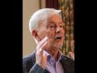

# AMAZING! Revd Professor Keith Ward on Muhammad as a Prophet of God (2021-05-02)

## Description

I have added subtitles in 60 languages.
Not only does he say Muhammad was a genuine prophet of God but nearly all of his Christian theologian colleagues think so too!

Keith Ward is an English Anglican priest, philosopher, and theologian. He is a fellow of the British Academy, a priest of the Church of England, and was Regius Professor of Divinity at the University of Oxford from 1991 to 2004.

## Summary of [AMAZING! Revd Professor Keith Ward on Muhammad as a Prophet of God](https://www.youtube.com/watch?v=FkeoGRT_ATE)

This summary is AI generated - there are inaccuracies *

### [00:00:00](https://www.youtube.com/watch?v=FkeoGRT_ATE&t=0) - [00:10:00](https://www.youtube.com/watch?v=FkeoGRT_ATE&t=600)

Rev. Keith Ward discusses his belief that Muhammad was a genuine prophet of God. He emphasizes the need for all the major spiritual faiths to come to a greater understanding of their own traditions before they can adequately perceive the truth of their own.

**[00:00:00](https://www.youtube.com/watch?v=FkeoGRT_ATE&t=0)** Rev. Keith Ward discusses his view on the prophethood of Muhammad and how it differs from that of other Christians. He also discusses the high regard Muslims have for Jesus and how their admiration for him is shared by Christians.
* **[00:05:00](https://www.youtube.com/watch?v=FkeoGRT_ATE&t=300)** Rev. Keith Ward discusses how he came to believe in Jesus Christ as the only way to be saved, and how his academic colleagues would most likely view Prophet Muhammad as a prophet of God. Ward says that this demonstrates a growing openness among theologians to other faiths, and an understanding that there is more than one way to approach God.
* **[00:10:00](https://www.youtube.com/watch?v=FkeoGRT_ATE&t=600)** Rev. Keith Ward discusses his belief that Muhammad was a genuine Prophet of God, and he emphasizes the need for all the major spiritual faiths to come to a greater understanding of their own traditions before they can adequately perceive the truth of their own.

<h2>Full transcript with timestamps: CLICK TO EXPAND</h2>

[0:00:00](https://youtu.be/FkeoGRT_ATE?t=0) What do you as a Christian theologian 
make of the prophethood of Muhammad?    
[0:00:05](https://youtu.be/FkeoGRT_ATE?t=5) Do you have any thoughts about that?  
[0:00:10](https://youtu.be/FkeoGRT_ATE?t=10) I do think Muhammad was a genuine 
Prophet of God and that he was raised up by God    
[0:00:18](https://youtu.be/FkeoGRT_ATE?t=18) and that the Quran is in some way an expression 
of God's Revelation. So I do think that  
[0:00:33](https://youtu.be/FkeoGRT_ATE?t=33) I am a Christian, I'm a follower of Jesus, 
so clearly I'm not a Muslim but    
[0:00:39](https://youtu.be/FkeoGRT_ATE?t=39) I would I think I'm totally opposed to people who 
misunderstand Islam as a rejection of Christianity.    
[0:00:49](https://youtu.be/FkeoGRT_ATE?t=49) I think that is not true. I think Islam would as 
I see it and Muhammad I don't think he knew much    
[0:00:56](https://youtu.be/FkeoGRT_ATE?t=56) about Christianity. I would have thought he was 
opposed to some of the views of Christians that he    
[0:01:02](https://youtu.be/FkeoGRT_ATE?t=62) knew about and I think that's true, but I don't 
hold any of those views. In fact and none of my    
[0:01:08](https://youtu.be/FkeoGRT_ATE?t=68) colleagues do. So there are differences, 
I mean there are clear differences but I   
[0:01:16](https://youtu.be/FkeoGRT_ATE?t=76) think he was a genuine, Muhammed was a genuine Prophet 
of one God who stand against a sort of    
[0:01:27](https://youtu.be/FkeoGRT_ATE?t=87) popularized Christian version of there being three    
[0:01:31](https://youtu.be/FkeoGRT_ATE?t=91) gods or let's see three different things in god, 
was correct he was justified in this so I    
[0:01:39](https://youtu.be/FkeoGRT_ATE?t=99) see the difference between 
a school of Islam and a school of Christianity has    
[0:01:47](https://youtu.be/FkeoGRT_ATE?t=107) about the same sort of difference as a difference 
between me and conservative Evangelical Christians.    
[0:01:57](https://youtu.be/FkeoGRT_ATE?t=117) That there are differences I can live with those 
I can respect those who differ from me and I    
[0:02:04](https://youtu.be/FkeoGRT_ATE?t=124) think we have so I am not infallible so I'm 
not saying that I know that I'm right, to use    
[0:02:11](https://youtu.be/FkeoGRT_ATE?t=131) an expression from the Quran 'God will decide 
who is right' but you have to go along with your    
[0:02:17](https://youtu.be/FkeoGRT_ATE?t=137) own feelings so I follow Jesus because I 
think he was a human expression of the wisdom    
[0:02:26](https://youtu.be/FkeoGRT_ATE?t=146) and love of God and the main message of that 
is that God loves without exception everyone.    
[0:02:34](https://youtu.be/FkeoGRT_ATE?t=154) There are Christians who don't believe that, there 
are Muslims who do believe that, right but wouldn't    
[0:02:41](https://youtu.be/FkeoGRT_ATE?t=161) use words like Incarnation or the Trinity etc some 
certain forbidden terms but if you accept that    
[0:02:50](https://youtu.be/FkeoGRT_ATE?t=170) religious language is fluid and that all of us are 
unable to comprehend the nature of God precisely    
[0:02:59](https://youtu.be/FkeoGRT_ATE?t=179) I think islam and Christianity shouldn't 
really be regarded as two different religions. I    
[0:03:05](https://youtu.be/FkeoGRT_ATE?t=185) think they're two different ways of approaching 
God and I'm nearer to many Muslims than I am    
[0:03:13](https://youtu.be/FkeoGRT_ATE?t=193) to many Christians. So that's a very interesting 
answer can I ask this question it's really    
[0:03:20](https://youtu.be/FkeoGRT_ATE?t=200) really on behalf of i know some of the muslim 
viewers audience will want me to ask this.    
[0:03:26](https://youtu.be/FkeoGRT_ATE?t=206) Muslims also have a very high regard for Jesus 
clearly yes and see him as a an incredibly    
[0:03:34](https://youtu.be/FkeoGRT_ATE?t=214) wonderful human being who expressed the love of 
God to the outcasts and the sinners and so on and    
[0:03:39](https://youtu.be/FkeoGRT_ATE?t=219) and that's all wonderful, so your admiration for 
Jesus is shared by Muslims too, or they may be    
[0:03:47](https://youtu.be/FkeoGRT_ATE?t=227) expressed slightly differently of course. He's 
not seen as an Icon into God that we pray through    
[0:03:52](https://youtu.be/FkeoGRT_ATE?t=232) of course but they would wonder the question 
would be 'Why aren't you a Muslim?' If you accept it    
[0:04:00](https://youtu.be/FkeoGRT_ATE?t=240) in that mindset if you accept that Muhammad 
is a prophet of God and you believe in one god    
[0:04:05](https://youtu.be/FkeoGRT_ATE?t=245) god sent jesus that is virtually a definition of 
what a muslim believes anyway um so they would    
[0:04:12](https://youtu.be/FkeoGRT_ATE?t=252) ask why aren't you a muslim and and saying 
you're a christian is not an answer because    
[0:04:17](https://youtu.be/FkeoGRT_ATE?t=257) for the reasons you mentioned muslims can already 
encompass that understanding as well that he    
[0:04:21](https://youtu.be/FkeoGRT_ATE?t=261) is someone who expresses the love of God to 
you and the wisdom of God in a    
[0:04:25](https://youtu.be/FkeoGRT_ATE?t=265) very special way, you know many sufi muslims could 
say yeah absolutely we agree with you but we're    
[0:04:30](https://youtu.be/FkeoGRT_ATE?t=270) muslims so the question is 'Why are you not 
a Muslim?' That's the question. Well it's like    
[0:04:36](https://youtu.be/FkeoGRT_ATE?t=276) asking me why i'm an Anglican or an Episcopalian 
rather than a Methodist um because that's the way    
[0:04:47](https://youtu.be/FkeoGRT_ATE?t=287) of thinking of God which has i feel demanded 
my loyalty. So it's a bit like saying why    
[0:04:59](https://youtu.be/FkeoGRT_ATE?t=299) do you uh prefer one view of philosophy to another 
view of philosophy and you say well because    
[0:05:08](https://youtu.be/FkeoGRT_ATE?t=308) that that's the way that seems right to me that 
attracts me to demands my loyalty and once your    
[0:05:15](https://youtu.be/FkeoGRT_ATE?t=315) loyalty is demanded well i said this for a muslim 
too of course you stay true to what has revealed    
[0:05:22](https://youtu.be/FkeoGRT_ATE?t=322) god to you so i say all right the end why i'm a 
christian is because i have personally experienced    
[0:05:29](https://youtu.be/FkeoGRT_ATE?t=329) i believe that i have personally experienced 
the presence of jesus christ actually um    
[0:05:37](https://youtu.be/FkeoGRT_ATE?t=337) affecting what i feel and think. And 
so i have no alternative you know this is    
[0:05:45](https://youtu.be/FkeoGRT_ATE?t=345) this is the this is the person who has revealed 
god to me personally but i so i'm not denying    
[0:05:50](https://youtu.be/FkeoGRT_ATE?t=350) that muslims can have god revealed to them 
in a different way and i honor that way    
[0:05:56](https://youtu.be/FkeoGRT_ATE?t=356) but it's not my way that's not i would like 
to try to understand it more that's true    
[0:06:01](https://youtu.be/FkeoGRT_ATE?t=361) and be much in affinity with the Muslim 
world of thought but it's just not the way    
[0:06:11](https://youtu.be/FkeoGRT_ATE?t=371) that it's happened for me it's not my it's not 
my not part of my autobiography. A    
[0:06:19](https://youtu.be/FkeoGRT_ATE?t=379) supplementary question to that it just occurred 
to me you acknowledged that Muhammad is    
[0:06:24](https://youtu.be/FkeoGRT_ATE?t=384) a prophet, in your in your knowledge of your 
colleagues in in Christian theology globally    
[0:06:29](https://youtu.be/FkeoGRT_ATE?t=389) how widespread is that view do you think 
that Mohammed was a prophet of God amongst your    
[0:06:37](https://youtu.be/FkeoGRT_ATE?t=397) academic colleagues who are christian theologians? 
I think it's almost universally accepted, I mean as    
[0:06:43](https://youtu.be/FkeoGRT_ATE?t=403) you know even I suppose Roman Catholics are 
on the whole more conservative than i would be    
[0:06:49](https://youtu.be/FkeoGRT_ATE?t=409) as an episcopalian but they now officially 
believe that uh islam is a revelation of god and    
[0:06:57](https://youtu.be/FkeoGRT_ATE?t=417) that that's Vatican II, official electoration so 
i think it was my colleagues would undoubtedly    
[0:07:06](https://youtu.be/FkeoGRT_ATE?t=426) say that. I mean I know lots of 
Christians wouldn't. But no well that's    
[0:07:11](https://youtu.be/FkeoGRT_ATE?t=431) why i meant theologians, particularly those 
who know theologians would all accept  
[0:07:22](https://youtu.be/FkeoGRT_ATE?t=442) but you know the truth yeah well if you're 
asking the question how influential are    
[0:07:28](https://youtu.be/FkeoGRT_ATE?t=448) theologians on most christians 
the answer is not in this matter  
[0:07:34](https://youtu.be/FkeoGRT_ATE?t=454) yeah, no I there's some of you input 
yeah anyway but that's interesting that    
[0:07:39](https://youtu.be/FkeoGRT_ATE?t=459) that will come as quite a a revelation 
and a quite a shocking thing to say that    
[0:07:44](https://youtu.be/FkeoGRT_ATE?t=464) uh in your experience most of your academic 
christian theological colleagues who are    
[0:07:49](https://youtu.be/FkeoGRT_ATE?t=469) not catholics would actually see muhammad as a 
Prophet of God. Yes, yes, I think that's true. That's    
[0:07:56](https://youtu.be/FkeoGRT_ATE?t=476) remarkable! That I didn't know actually it was 
a genuine question of mine um that's interesting    
[0:08:01](https://youtu.be/FkeoGRT_ATE?t=481) so that that suggests a certain openness to other 
faiths and and overcoming these cultural barriers    
[0:08:06](https://youtu.be/FkeoGRT_ATE?t=486) and looking beyond our own comfort zones and and 
recognizing patterns of commonality and similar    
[0:08:12](https://youtu.be/FkeoGRT_ATE?t=492) spiritual dynamics and spiritual realities across 
the boundaries between religions and theologians    
[0:08:18](https://youtu.be/FkeoGRT_ATE?t=498) today are well equipped to do that in 
our world in our global village perhaps.  
[0:08:27](https://youtu.be/FkeoGRT_ATE?t=507) I know you will know the work of Wilfred Cantwell Smith 
who was the founder of Harvard University's Center for the Study of World Religions,    
[0:08:33](https://youtu.be/FkeoGRT_ATE?t=513) and he was an expert on islam that was his scholarly    
[0:08:39](https://youtu.be/FkeoGRT_ATE?t=519) field uh and he he actually recommended 
that we should stop using the word religion    
[0:08:45](https://youtu.be/FkeoGRT_ATE?t=525) as though there were different blocks of huge 
beliefs which everybody who's a christian has this    
[0:08:52](https://youtu.be/FkeoGRT_ATE?t=532) block and everybody who's a muslim has that block 
and we just should talk about ways of faith and    
[0:08:58](https://youtu.be/FkeoGRT_ATE?t=538) ways of approaching god and um i mean sympathy 
with that i think talking about a religion    
[0:09:06](https://youtu.be/FkeoGRT_ATE?t=546) you know some of my some of the christians 
i know don't believe anything that i believe    
[0:09:12](https://youtu.be/FkeoGRT_ATE?t=552) except they use the word jesus but 
they're talking about somebody else.    
[0:09:17](https://youtu.be/FkeoGRT_ATE?t=557) I think that this speaks of a yawning chasm shall 
we say between your world in that sense uh of the    
[0:09:24](https://youtu.be/FkeoGRT_ATE?t=564) academic theologians and certainly many in the 
pew say in the united states and and um africa    
[0:09:29](https://youtu.be/FkeoGRT_ATE?t=569) and other parts of the world where that they 
are exclusivists to the absolute you know only    
[0:09:35](https://youtu.be/FkeoGRT_ATE?t=575) i hear this all the time, only jesus will lead 
you to god and i say well okay so moses didn't    
[0:09:41](https://youtu.be/FkeoGRT_ATE?t=581) know jesus is he damned because you've got to 
believe in jesus to be saved well what about all    
[0:09:44](https://youtu.be/FkeoGRT_ATE?t=584) the prophets they didn't know and i'm not quite 
sure what the answer they give to that but it's    
[0:09:48](https://youtu.be/FkeoGRT_ATE?t=588) a very uh binary absolutist exclusive world view 
which is a million miles from your own of course    
[0:09:56](https://youtu.be/FkeoGRT_ATE?t=596) and it's a million miles away from uh saying that 
jesus is the savior of the world not of one little    
[0:10:06](https://youtu.be/FkeoGRT_ATE?t=606) group within the world and of course people like 
ME and again most most of my academic colleagues    
[0:10:14](https://youtu.be/FkeoGRT_ATE?t=614) would in general agree with this we would say 
that the savior of the world is of course god    
[0:10:21](https://youtu.be/FkeoGRT_ATE?t=621) and it's only insofar as jesus mediates god that 
jesus is the savior of the world and we believe    
[0:10:26](https://youtu.be/FkeoGRT_ATE?t=626) he does mediate god so we can say that but we're 
not excluding everybody else because god wants to    
[0:10:32](https://youtu.be/FkeoGRT_ATE?t=632) save the whole world and i'm very clear about that 
and i think some of my muslim friends and i have    
[0:10:42](https://youtu.be/FkeoGRT_ATE?t=642) been have a close association with 
the Oxford Islamic Centre and i think  
[0:10:51](https://youtu.be/FkeoGRT_ATE?t=651) most of them i think believe that too.    
[0:10:55](https://youtu.be/FkeoGRT_ATE?t=655) I just want to say thank you 
very much indeed for your time and um  
[0:11:03](https://youtu.be/FkeoGRT_ATE?t=663) it was really really fascinating and i know 
uh many muslims um will be very interested    
[0:11:09](https://youtu.be/FkeoGRT_ATE?t=669) in what you've said but in clarifying because 
we're often used to uh fundamentalist christians    
[0:11:14](https://youtu.be/FkeoGRT_ATE?t=674) having a go and to hear an alternative 
voice of which your voice is certainly    
[0:11:21](https://youtu.be/FkeoGRT_ATE?t=681) more more representative of 
christianity i think than the harsh extremism    
[0:11:28](https://youtu.be/FkeoGRT_ATE?t=688) that we hear of it's good that muslims 
hear this and you're more openness to    
[0:11:35](https://youtu.be/FkeoGRT_ATE?t=695) islam as well to be frank so um yeah thank you 
so much. I actually think Paul that until    
[0:11:43](https://youtu.be/FkeoGRT_ATE?t=703) all the the major developed spiritual faiths 
of the world i include india and buddhism    
[0:11:51](https://youtu.be/FkeoGRT_ATE?t=711) and forms of hinduism in this too until they come 
to a greater understanding of their own historical    
[0:11:59](https://youtu.be/FkeoGRT_ATE?t=719) perspective and development and and shared 
goals and their differences as well and but    
[0:12:06](https://youtu.be/FkeoGRT_ATE?t=726) have a sympathetic appreciation of that until that 
happens uh we're not going to adequately perceive    
[0:12:14](https://youtu.be/FkeoGRT_ATE?t=734) the truth of our own tradition that we belong 
to. Yes, excellent. Well thank you very much and    
[0:12:21](https://youtu.be/FkeoGRT_ATE?t=741) i'm going to end the discussion now and 
and thank you everyone for listening in and    
[0:12:27](https://youtu.be/FkeoGRT_ATE?t=747) please leave your comments and your thoughts as well. Until next time. Thank you. I do think    
[0:12:34](https://youtu.be/FkeoGRT_ATE?t=754) that Muhammad was a genuine Prophet of God. I do 
think that Muhammad was a genuine Prophet of God.  

