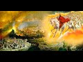

# A God who refused to disclose the fullness of salvation until the very last fragment of time? (2020-12-20 17:13:31+00:00)

## Description

For Christianity in terms of the parousia, there have been too many years of grace. In terms of salvation history, there have not been enough. 

The Jesus of the gospels seems to expect the imminent end-times: Mark 13:30-33. Paul predicts the Second Coming (parousia) in his lifetime: 1 Thessalonians 4:16-17 and 5:2-11. But the wait has been extended for almost two millennia.  

'Christmas: 1924' by English poet Thomas Hardy

"Peace upon earth!" was said. We sing it,
And pay a million priests to bring it.
After two thousand years of mass
We've got as far as poison-gas.

Two millennia, however, do not seem to be enough. If humans appeared about 200,000 years ago, how can one admire a God who refused to disclose the fullness of truth and salvation until the very last fragment of time? 

Interestingly in the Qur’an we read:

‘We have surely sent you with the truth as a deliverer of good news and a warner. There is no community that has not had a Warner.'

According to a Prophetic narration collected by Ibn Ḥibbân, the total number of prophets sent around the world, from Adam (ﷺ) to Muḥammad (ﷺ), is 124 000—of which only twenty-five are mentioned in the Quran.

## Summary of [A God who refused to disclose the fullness of salvation until the very last fragment of time?](https://www.youtube.com/watch?v=j5-OShW1_Zs)

*This is an AI generated summary. There may be inaccuracies. *

### [00:00:00](https://www.youtube.com/watch?v=j5-OShW1_Zs&t=0) - [00:05:00](https://www.youtube.com/watch?v=j5-OShW1_Zs&t=300)

in this YouTube video discusses the idea that God may have withheld salvation from humanity for over two thousand years in order to teach them a lesson. references a Christmas poem by Thomas Hardy which speaks to this issue. also mentions that Christianity expected the world to be converted within a few years, and that they had no concept of deep time before that.

**[00:00:00](https://www.youtube.com/watch?v=j5-OShW1_Zs&t=0)** ponders how a god who has withheld salvation from humanity for over two thousand years can be admired. references a Christmas poem by Thomas Hardy which speaks to this issue.
* **[00:05:00](https://www.youtube.com/watch?v=j5-OShW1_Zs&t=300)** In this YouTube video, the speaker discusses why God left salvation until the very last millisecond, and how this might be related to deep time and humanity's existence on Earth. also mentions that Christianity expected the world to be converted within a few years, and that they had no concept of deep time before that.

## Full transcript with timestamps

[0:00:01](https://youtu.be/j5-OShW1_Zs?t=1) hello i've been pondering this  
[0:00:03](https://youtu.be/j5-OShW1_Zs?t=3) question how can one admire a god  
[0:00:07](https://youtu.be/j5-OShW1_Zs?t=7) who refused to disclose the fullness of  
[0:00:10](https://youtu.be/j5-OShW1_Zs?t=10) truth  
[0:00:11](https://youtu.be/j5-OShW1_Zs?t=11) and salvation until the very last  
[0:00:15](https://youtu.be/j5-OShW1_Zs?t=15) fragment of time now explain  
[0:00:18](https://youtu.be/j5-OShW1_Zs?t=18) what i mean by this in christianity for  
[0:00:21](https://youtu.be/j5-OShW1_Zs?t=21) christianity in terms of the parousia  
[0:00:23](https://youtu.be/j5-OShW1_Zs?t=23) that's the technical term uh some people  
[0:00:26](https://youtu.be/j5-OShW1_Zs?t=26) use for the second coming of jesus  
[0:00:30](https://youtu.be/j5-OShW1_Zs?t=30) for christianity there have been too  
[0:00:32](https://youtu.be/j5-OShW1_Zs?t=32) many years of grace  
[0:00:35](https://youtu.be/j5-OShW1_Zs?t=35) in terms of salvation history there have  
[0:00:37](https://youtu.be/j5-OShW1_Zs?t=37) not  
[0:00:38](https://youtu.be/j5-OShW1_Zs?t=38) been enough let me explain what i mean  
[0:00:41](https://youtu.be/j5-OShW1_Zs?t=41) jesus uh the jesus of the four gospels  
[0:00:44](https://youtu.be/j5-OShW1_Zs?t=44) in the new testament seems to expect the  
[0:00:46](https://youtu.be/j5-OShW1_Zs?t=46) imminent  
[0:00:47](https://youtu.be/j5-OShW1_Zs?t=47) end times so uh in  
[0:00:50](https://youtu.be/j5-OShW1_Zs?t=50) mark's gospel for example in chapter 13  
[0:00:53](https://youtu.be/j5-OShW1_Zs?t=53) verse 30 it reads  
[0:00:55](https://youtu.be/j5-OShW1_Zs?t=55) and this is about the destruction of the  
[0:00:56](https://youtu.be/j5-OShW1_Zs?t=56) temple the whole chapter's about the  
[0:00:58](https://youtu.be/j5-OShW1_Zs?t=58) the signs of the end the destruction of  
[0:01:00](https://youtu.be/j5-OShW1_Zs?t=60) the temple and the return of the son of  
[0:01:02](https://youtu.be/j5-OShW1_Zs?t=62) man  
[0:01:03](https://youtu.be/j5-OShW1_Zs?t=63) who comes in glory and great power  
[0:01:07](https://youtu.be/j5-OShW1_Zs?t=67) and then after this jesus says truly i  
[0:01:09](https://youtu.be/j5-OShW1_Zs?t=69) tell you  
[0:01:10](https://youtu.be/j5-OShW1_Zs?t=70) this generation the generation of people  
[0:01:12](https://youtu.be/j5-OShW1_Zs?t=72) then living  
[0:01:13](https://youtu.be/j5-OShW1_Zs?t=73) will not pass away until all these  
[0:01:16](https://youtu.be/j5-OShW1_Zs?t=76) things  
[0:01:16](https://youtu.be/j5-OShW1_Zs?t=76) have taken place heaven and earth will  
[0:01:18](https://youtu.be/j5-OShW1_Zs?t=78) pass away  
[0:01:20](https://youtu.be/j5-OShW1_Zs?t=80) but my words will not pass away but of  
[0:01:23](https://youtu.be/j5-OShW1_Zs?t=83) that day or hour no one knows  
[0:01:25](https://youtu.be/j5-OShW1_Zs?t=85) neither the angels in heaven nor the son  
[0:01:28](https://youtu.be/j5-OShW1_Zs?t=88) but only the father so the precise  
[0:01:30](https://youtu.be/j5-OShW1_Zs?t=90) timing is unknown  
[0:01:32](https://youtu.be/j5-OShW1_Zs?t=92) but this generation truly i tell you  
[0:01:35](https://youtu.be/j5-OShW1_Zs?t=95) will not pass away until the second  
[0:01:38](https://youtu.be/j5-OShW1_Zs?t=98) coming  
[0:01:39](https://youtu.be/j5-OShW1_Zs?t=99) uh occurs and that's uh imminence or  
[0:01:41](https://youtu.be/j5-OShW1_Zs?t=101) imminence means  
[0:01:42](https://youtu.be/j5-OShW1_Zs?t=102) and just to back up this uh reading uh  
[0:01:46](https://youtu.be/j5-OShW1_Zs?t=106) here is um a huge  
[0:01:49](https://youtu.be/j5-OShW1_Zs?t=109) copy of the oxford bible commentary uh  
[0:01:52](https://youtu.be/j5-OShW1_Zs?t=112) published by ox university press it's  
[0:01:54](https://youtu.be/j5-OShW1_Zs?t=114) one of the  
[0:01:55](https://youtu.be/j5-OShW1_Zs?t=115) the standard reference works uh for  
[0:01:57](https://youtu.be/j5-OShW1_Zs?t=117) academics and students  
[0:01:59](https://youtu.be/j5-OShW1_Zs?t=119) of the new testament and the whole bible  
[0:02:01](https://youtu.be/j5-OShW1_Zs?t=121) and if you look up the passage i've just  
[0:02:03](https://youtu.be/j5-OShW1_Zs?t=123) read  
[0:02:04](https://youtu.be/j5-OShW1_Zs?t=124) in here um it says i'll just quote one  
[0:02:06](https://youtu.be/j5-OShW1_Zs?t=126) sentence  
[0:02:07](https://youtu.be/j5-OShW1_Zs?t=127) the end will come within the lifetime of  
[0:02:10](https://youtu.be/j5-OShW1_Zs?t=130) the present generation  
[0:02:12](https://youtu.be/j5-OShW1_Zs?t=132) um it's just interpreting that so the  
[0:02:14](https://youtu.be/j5-OShW1_Zs?t=134) end will come the end of the world the  
[0:02:16](https://youtu.be/j5-OShW1_Zs?t=136) second coming will come within the  
[0:02:17](https://youtu.be/j5-OShW1_Zs?t=137) lifetime  
[0:02:18](https://youtu.be/j5-OShW1_Zs?t=138) of the present generation meaning the  
[0:02:19](https://youtu.be/j5-OShW1_Zs?t=139) generation of course  
[0:02:21](https://youtu.be/j5-OShW1_Zs?t=141) of those living at that time um  
[0:02:25](https://youtu.be/j5-OShW1_Zs?t=145) and it's not just the jesus of the  
[0:02:27](https://youtu.be/j5-OShW1_Zs?t=147) gospels who uh  
[0:02:28](https://youtu.be/j5-OShW1_Zs?t=148) speaks this way paul the apostle paul  
[0:02:31](https://youtu.be/j5-OShW1_Zs?t=151) predicts the second coming  
[0:02:32](https://youtu.be/j5-OShW1_Zs?t=152) the parousia in his lifetime as well  
[0:02:36](https://youtu.be/j5-OShW1_Zs?t=156) and uh if we look at the bible again to  
[0:02:39](https://youtu.be/j5-OShW1_Zs?t=159) a passage in his first letter to the  
[0:02:43](https://youtu.be/j5-OShW1_Zs?t=163) thessalonians  
[0:02:44](https://youtu.be/j5-OShW1_Zs?t=164) chapter 4 verse 16 um  
[0:02:48](https://youtu.be/j5-OShW1_Zs?t=168) in fact i'll read back to verse 13 but i  
[0:02:50](https://youtu.be/j5-OShW1_Zs?t=170) but we do not want you so he's writing  
[0:02:52](https://youtu.be/j5-OShW1_Zs?t=172) to the thessalonians there's a  
[0:02:53](https://youtu.be/j5-OShW1_Zs?t=173) a small group of gentile christians in  
[0:02:56](https://youtu.be/j5-OShW1_Zs?t=176) thessalonica in  
[0:02:57](https://youtu.be/j5-OShW1_Zs?t=177) what we call greece today and he said he  
[0:03:00](https://youtu.be/j5-OShW1_Zs?t=180) writes to them  
[0:03:00](https://youtu.be/j5-OShW1_Zs?t=180) saying but we do not want you to be  
[0:03:03](https://youtu.be/j5-OShW1_Zs?t=183) uninformed brothers and sisters about  
[0:03:05](https://youtu.be/j5-OShW1_Zs?t=185) those who have died  
[0:03:06](https://youtu.be/j5-OShW1_Zs?t=186) so that you may not grieve as others do  
[0:03:09](https://youtu.be/j5-OShW1_Zs?t=189) i have  
[0:03:10](https://youtu.be/j5-OShW1_Zs?t=190) no hope we who are alive  
[0:03:14](https://youtu.be/j5-OShW1_Zs?t=194) who are left until the coming of jesus  
[0:03:16](https://youtu.be/j5-OShW1_Zs?t=196) will by no means precede those  
[0:03:18](https://youtu.be/j5-OShW1_Zs?t=198) who have died for the lord himself with  
[0:03:21](https://youtu.be/j5-OShW1_Zs?t=201) a cry of command and with the arch  
[0:03:23](https://youtu.be/j5-OShW1_Zs?t=203) angels calling but the sound of god's  
[0:03:25](https://youtu.be/j5-OShW1_Zs?t=205) trumpet will descend from heaven  
[0:03:27](https://youtu.be/j5-OShW1_Zs?t=207) and the dead in christ will rise first  
[0:03:31](https://youtu.be/j5-OShW1_Zs?t=211) so uh we who are alive so we who are  
[0:03:34](https://youtu.be/j5-OShW1_Zs?t=214) left alive  
[0:03:35](https://youtu.be/j5-OShW1_Zs?t=215) uh so so no need to grieve even those  
[0:03:37](https://youtu.be/j5-OShW1_Zs?t=217) who will  
[0:03:38](https://youtu.be/j5-OShW1_Zs?t=218) you know pre-decease them uh when that  
[0:03:41](https://youtu.be/j5-OShW1_Zs?t=221) when the uh when the second coming  
[0:03:43](https://youtu.be/j5-OShW1_Zs?t=223) occurs uh we will all be raised uh  
[0:03:46](https://youtu.be/j5-OShW1_Zs?t=226) from the dead and the dead in christ  
[0:03:48](https://youtu.be/j5-OShW1_Zs?t=228) will rise  
[0:03:49](https://youtu.be/j5-OShW1_Zs?t=229) first so but clearly there's an  
[0:03:52](https://youtu.be/j5-OShW1_Zs?t=232) expectation there  
[0:03:53](https://youtu.be/j5-OShW1_Zs?t=233) that he will be alive at the second  
[0:03:55](https://youtu.be/j5-OShW1_Zs?t=235) coming that will happen in his  
[0:03:57](https://youtu.be/j5-OShW1_Zs?t=237) generation  
[0:03:58](https://youtu.be/j5-OShW1_Zs?t=238) and the following the following chapter  
[0:04:00](https://youtu.be/j5-OShW1_Zs?t=240) verse chapter 5 verse 211  
[0:04:02](https://youtu.be/j5-OShW1_Zs?t=242) also says the same thing  
[0:04:06](https://youtu.be/j5-OShW1_Zs?t=246) but the weight has been extended  
[0:04:09](https://youtu.be/j5-OShW1_Zs?t=249) for almost 2 000 years or over 2 000  
[0:04:12](https://youtu.be/j5-OShW1_Zs?t=252) years now  
[0:04:13](https://youtu.be/j5-OShW1_Zs?t=253) so as i said for christianity in terms  
[0:04:15](https://youtu.be/j5-OShW1_Zs?t=255) of the prusia  
[0:04:16](https://youtu.be/j5-OShW1_Zs?t=256) there have been too many years of grace  
[0:04:18](https://youtu.be/j5-OShW1_Zs?t=258) because it should have happened the end  
[0:04:20](https://youtu.be/j5-OShW1_Zs?t=260) already but in terms of salvation  
[0:04:23](https://youtu.be/j5-OShW1_Zs?t=263) history  
[0:04:23](https://youtu.be/j5-OShW1_Zs?t=263) there have not been enough years now if  
[0:04:28](https://youtu.be/j5-OShW1_Zs?t=268) humans  
[0:04:29](https://youtu.be/j5-OShW1_Zs?t=269) appeared as we are told by the most  
[0:04:32](https://youtu.be/j5-OShW1_Zs?t=272) recent science and i just checked this  
[0:04:33](https://youtu.be/j5-OShW1_Zs?t=273) out  
[0:04:34](https://youtu.be/j5-OShW1_Zs?t=274) if we humans appeared about 200 000  
[0:04:36](https://youtu.be/j5-OShW1_Zs?t=276) years ago  
[0:04:38](https://youtu.be/j5-OShW1_Zs?t=278) how can one admire a god who refused to  
[0:04:40](https://youtu.be/j5-OShW1_Zs?t=280) disclose the fullness of truth and  
[0:04:43](https://youtu.be/j5-OShW1_Zs?t=283) salvation  
[0:04:44](https://youtu.be/j5-OShW1_Zs?t=284) until the larry at the very last  
[0:04:46](https://youtu.be/j5-OShW1_Zs?t=286) fragment of time  
[0:04:47](https://youtu.be/j5-OShW1_Zs?t=287) i two thousand years ago  
[0:04:50](https://youtu.be/j5-OShW1_Zs?t=290) i mean it's much less than one percent  
[0:04:53](https://youtu.be/j5-OShW1_Zs?t=293) of recorded human history  
[0:04:56](https://youtu.be/j5-OShW1_Zs?t=296) i'm reminded of a christmas poem by  
[0:04:58](https://youtu.be/j5-OShW1_Zs?t=298) thomas hardy the great english poet  
[0:05:00](https://youtu.be/j5-OShW1_Zs?t=300) who wrote he lived during the first  
[0:05:02](https://youtu.be/j5-OShW1_Zs?t=302) world war survived it  
[0:05:04](https://youtu.be/j5-OShW1_Zs?t=304) and after the first world war he wrote  
[0:05:08](https://youtu.be/j5-OShW1_Zs?t=308) at christmas time peace upon earth was  
[0:05:11](https://youtu.be/j5-OShW1_Zs?t=311) said  
[0:05:12](https://youtu.be/j5-OShW1_Zs?t=312) we sing it and pay a million priests to  
[0:05:15](https://youtu.be/j5-OShW1_Zs?t=315) bring it  
[0:05:16](https://youtu.be/j5-OShW1_Zs?t=316) after 2 000 years of mass we've got as  
[0:05:20](https://youtu.be/j5-OShW1_Zs?t=320) far as  
[0:05:21](https://youtu.be/j5-OShW1_Zs?t=321) poison gas so you know we've had that  
[0:05:25](https://youtu.be/j5-OShW1_Zs?t=325) we've had this  
[0:05:26](https://youtu.be/j5-OShW1_Zs?t=326) salvation for 2000 years and we're still  
[0:05:29](https://youtu.be/j5-OShW1_Zs?t=329) guessing each other  
[0:05:30](https://youtu.be/j5-OShW1_Zs?t=330) on an industrial scale so two millennia  
[0:05:33](https://youtu.be/j5-OShW1_Zs?t=333) it  
[0:05:34](https://youtu.be/j5-OShW1_Zs?t=334) does not seem uh to be enough if we've  
[0:05:37](https://youtu.be/j5-OShW1_Zs?t=337) been around for over 200 000  
[0:05:39](https://youtu.be/j5-OShW1_Zs?t=339) years why did god leave this fullness of  
[0:05:43](https://youtu.be/j5-OShW1_Zs?t=343) of truth and salvation uh that they  
[0:05:45](https://youtu.be/j5-OShW1_Zs?t=345) claim  
[0:05:46](https://youtu.be/j5-OShW1_Zs?t=346) until the very last last millisecond  
[0:05:49](https://youtu.be/j5-OShW1_Zs?t=349) that is something uh that we there's not  
[0:05:51](https://youtu.be/j5-OShW1_Zs?t=351) been enough time we should have been  
[0:05:53](https://youtu.be/j5-OShW1_Zs?t=353) extended  
[0:05:54](https://youtu.be/j5-OShW1_Zs?t=354) backwards to 200 000 years  
[0:05:58](https://youtu.be/j5-OShW1_Zs?t=358) interestingly in the quran we read  
[0:06:02](https://youtu.be/j5-OShW1_Zs?t=362) we have surely sent you presumably  
[0:06:04](https://youtu.be/j5-OShW1_Zs?t=364) muhammad  
[0:06:05](https://youtu.be/j5-OShW1_Zs?t=365) with the truth as a deliverer of good  
[0:06:07](https://youtu.be/j5-OShW1_Zs?t=367) news and a warner  
[0:06:09](https://youtu.be/j5-OShW1_Zs?t=369) there is no community that was not that  
[0:06:12](https://youtu.be/j5-OShW1_Zs?t=372) has not  
[0:06:13](https://youtu.be/j5-OShW1_Zs?t=373) had a warner and that's the  
[0:06:16](https://youtu.be/j5-OShW1_Zs?t=376) uh the 35th chapter verse  
[0:06:21](https://youtu.be/j5-OShW1_Zs?t=381) 24 and there's a footnote in this  
[0:06:24](https://youtu.be/j5-OShW1_Zs?t=384) translation according to  
[0:06:25](https://youtu.be/j5-OShW1_Zs?t=385) a prophetic narration the total number  
[0:06:28](https://youtu.be/j5-OShW1_Zs?t=388) of prophets sent around the world  
[0:06:30](https://youtu.be/j5-OShW1_Zs?t=390) from adam to muhammad is 124 000  
[0:06:34](https://youtu.be/j5-OShW1_Zs?t=394) of which only 25 are mentioned in the  
[0:06:38](https://youtu.be/j5-OShW1_Zs?t=398) quran  
[0:06:39](https://youtu.be/j5-OShW1_Zs?t=399) so that's fascinating it seems  
[0:06:42](https://youtu.be/j5-OShW1_Zs?t=402) by accident design that that particular  
[0:06:45](https://youtu.be/j5-OShW1_Zs?t=405) understanding of salvation  
[0:06:47](https://youtu.be/j5-OShW1_Zs?t=407) can encompass what we now know from  
[0:06:49](https://youtu.be/j5-OShW1_Zs?t=409) science  
[0:06:50](https://youtu.be/j5-OShW1_Zs?t=410) to be the true age of humans humanity  
[0:06:53](https://youtu.be/j5-OShW1_Zs?t=413) having been around for  
[0:06:55](https://youtu.be/j5-OShW1_Zs?t=415) just under a quarter of a million years  
[0:06:57](https://youtu.be/j5-OShW1_Zs?t=417) um  
[0:06:58](https://youtu.be/j5-OShW1_Zs?t=418) and christianity expected in terms of  
[0:07:01](https://youtu.be/j5-OShW1_Zs?t=421) its foundation documents the world  
[0:07:02](https://youtu.be/j5-OShW1_Zs?t=422) and pretty much within a few years and  
[0:07:05](https://youtu.be/j5-OShW1_Zs?t=425) had no  
[0:07:06](https://youtu.be/j5-OShW1_Zs?t=426) concept of a deep time before that  
[0:07:09](https://youtu.be/j5-OShW1_Zs?t=429) uh so that that's uh that's what i was  
[0:07:12](https://youtu.be/j5-OShW1_Zs?t=432) thinking i don't know what uh  
[0:07:14](https://youtu.be/j5-OShW1_Zs?t=434) you think but um so time matters  
[0:07:17](https://youtu.be/j5-OShW1_Zs?t=437) at the end of the day  
