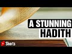

# A Stunning Hadith | #shorts by Paul Williams (2021-10-21 14:08:13+00:00)

## Description

A Stunning Hadith | #shorts by Paul Williams

## Summary of [A Stunning Hadith | #shorts by Paul Williams](https://www.youtube.com/watch?v=rhQ9SaQSO8A)

*This is an AI generated summary. There may be inaccuracies. *

### [00:00:00](https://www.youtube.com/watch?v=rhQ9SaQSO8A&t=0) - [00:00:00](https://www.youtube.com/watch?v=rhQ9SaQSO8A&t=0)

In this video, Paul Williams discusses a Hadith that talks about the importance of Allah's sleep and how it does not fit him. He also explains how Allah sends down and raises up actions in just measure. If Allah were to remove his veil, his majesty would burn up everything.

**[00:00:00](https://www.youtube.com/watch?v=rhQ9SaQSO8A&t=0)** This Hadith discusses the importance of Allah's sleep and how it does not fit him. Allah also sends down and raises up actions in just measure. If Allah were to remove his veil, his majesty would burn up everything.

## Full transcript with timestamps

[0:00:00](https://youtu.be/rhQ9SaQSO8A?t=0) the prophet upon whom bp said  
[0:00:03](https://youtu.be/rhQ9SaQSO8A?t=3) allah does not sleep  
[0:00:05](https://youtu.be/rhQ9SaQSO8A?t=5) nor does sleep befit him  
[0:00:08](https://youtu.be/rhQ9SaQSO8A?t=8) he sends down and raises up in just  
[0:00:12](https://youtu.be/rhQ9SaQSO8A?t=12) measure  
[0:00:13](https://youtu.be/rhQ9SaQSO8A?t=13) and all actions by night or day ascend  
[0:00:16](https://youtu.be/rhQ9SaQSO8A?t=16) to him  
[0:00:18](https://youtu.be/rhQ9SaQSO8A?t=18) his veil is light  
[0:00:20](https://youtu.be/rhQ9SaQSO8A?t=20) if he were to remove it the majesty of  
[0:00:23](https://youtu.be/rhQ9SaQSO8A?t=23) his countenance would burn up all of his  
[0:00:26](https://youtu.be/rhQ9SaQSO8A?t=26) creation  
[0:00:28](https://youtu.be/rhQ9SaQSO8A?t=28) hadith from muslim  
