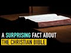

# A Surprising Fact about the Christian Bible (2022-02-17)

## Description

You Can Support My Work on Patreon:
https://www.patreon.com/Bloggingtheology

My Paypal Link: 
https://www.paypal.com/paypalme/bloggingtheology?locale.x=en_GB

## Summary of [A Surprising Fact about the Christian Bible](https://www.youtube.com/watch?v=rQIgCtMcoEo)

*This summary is AI generated - there may be inaccuracies. *

### [00:00:00](https://www.youtube.com/watch?v=rQIgCtMcoEo&t=0) - [00:10:00](https://www.youtube.com/watch?v=rQIgCtMcoEo&t=600)

Discusses how the early Christians did not view the New Testament as the word of God, due to the fact that it was not originally seen as inspired by God. He points to chapter 10 of his book, A History of the Bible, which discusses how the books in the Hebrew Bible had acquired an official status for Jews by the end of the first century. Christians, whether Jews or not, took for granted this status when quoting from the Bible. The New Testament began life as occasional literature, rather than being sacrosanct like the Hebrew Bible.

**[00:00:00](https://www.youtube.com/watch?v=rQIgCtMcoEo&t=0) Discusses how the early Christians did not view the New Testament as the word of God, due to the fact that it was not originally seen as inspired by God. He points to chapter 10 of his book, A History of the Bible, which discusses how the books in the Hebrew Bible had acquired an official status for Jews by the end of the first century. Christians, whether Jews or not, took for granted this status when quoting from the Bible. The New Testament began life as occasional literature, rather than being sacrosanct like the Hebrew Bible.
* **[00:05:00](https://www.youtube.com/watch?v=rQIgCtMcoEo&t=300)** discusses how the attitude of early Christians to the Old and New Testament differed, and how over time the texts came to be seen as equal components of the Bible.
* **[00:10:00](https://www.youtube.com/watch?v=rQIgCtMcoEo&t=600)** This video explains that the Christian Bible was not created as a canon until later in the following centuries, and that this can change one's mind and perception of the historical truths and facts of the case. It invites viewers to do the same journey of discovery by listening to scholars reading their works, rather than uncritically accepting them.

<h2>Full transcript with timestamps: CLICK TO EXPAND</h2>

[0:00:02](https://youtu.be/rQIgCtMcoEo?t=2) one of the very surprising things one  
[0:00:04](https://youtu.be/rQIgCtMcoEo?t=4) learns when one studies history and  
[0:00:06](https://youtu.be/rQIgCtMcoEo?t=6) reads the works of scholars  
[0:00:09](https://youtu.be/rQIgCtMcoEo?t=9) is that the new testament was not  
[0:00:11](https://youtu.be/rQIgCtMcoEo?t=11) originally seen by christians as  
[0:00:15](https://youtu.be/rQIgCtMcoEo?t=15) inspired by god or the word of god or on  
[0:00:18](https://youtu.be/rQIgCtMcoEo?t=18) an equal footing with the jewish  
[0:00:20](https://youtu.be/rQIgCtMcoEo?t=20) scriptures and this is quite remarkable  
[0:00:23](https://youtu.be/rQIgCtMcoEo?t=23) because today we have the holy bible the  
[0:00:25](https://youtu.be/rQIgCtMcoEo?t=25) christian bible with the old and the new  
[0:00:27](https://youtu.be/rQIgCtMcoEo?t=27) testament and these are seen as equal  
[0:00:30](https://youtu.be/rQIgCtMcoEo?t=30) and both authoritative word of god but  
[0:00:33](https://youtu.be/rQIgCtMcoEo?t=33) they weren't originally seen that way  
[0:00:36](https://youtu.be/rQIgCtMcoEo?t=36) now i want to discuss very briefly why  
[0:00:38](https://youtu.be/rQIgCtMcoEo?t=38) this might be the case i'm going to read  
[0:00:39](https://youtu.be/rQIgCtMcoEo?t=39) just a few uh paragraphs from this  
[0:00:42](https://youtu.be/rQIgCtMcoEo?t=42) excellent book a history of the bible  
[0:00:44](https://youtu.be/rQIgCtMcoEo?t=44) the book and its faiths  
[0:00:47](https://youtu.be/rQIgCtMcoEo?t=47) by john barton who had the privilege of  
[0:00:50](https://youtu.be/rQIgCtMcoEo?t=50) interviewing on this very channel who is  
[0:00:52](https://youtu.be/rQIgCtMcoEo?t=52) john barton well the back cover tells us  
[0:00:55](https://youtu.be/rQIgCtMcoEo?t=55) he's the professor of the interpretation  
[0:00:57](https://youtu.be/rQIgCtMcoEo?t=57) of holy scripture at the university of  
[0:01:00](https://youtu.be/rQIgCtMcoEo?t=60) oxford in other words he's a biblical  
[0:01:02](https://youtu.be/rQIgCtMcoEo?t=62) scholar and he has been a priest in the  
[0:01:05](https://youtu.be/rQIgCtMcoEo?t=65) church of england so he's a committed  
[0:01:07](https://youtu.be/rQIgCtMcoEo?t=67) christian uh but also one of the world's  
[0:01:09](https://youtu.be/rQIgCtMcoEo?t=69) leading biblical scholars and this book  
[0:01:12](https://youtu.be/rQIgCtMcoEo?t=72) was published just a couple of years ago  
[0:01:13](https://youtu.be/rQIgCtMcoEo?t=73) and i highly recommend it if you want a  
[0:01:16](https://youtu.be/rQIgCtMcoEo?t=76) really good thorough scholarly  
[0:01:18](https://youtu.be/rQIgCtMcoEo?t=78) understanding of the history and the  
[0:01:20](https://youtu.be/rQIgCtMcoEo?t=80) origins and the interpretation of the  
[0:01:23](https://youtu.be/rQIgCtMcoEo?t=83) bible  
[0:01:24](https://youtu.be/rQIgCtMcoEo?t=84) so in chapter 10 just just a few  
[0:01:26](https://youtu.be/rQIgCtMcoEo?t=86) paragraphs just to show  
[0:01:28](https://youtu.be/rQIgCtMcoEo?t=88) why  
[0:01:28](https://youtu.be/rQIgCtMcoEo?t=88) the early the early christians the early  
[0:01:30](https://youtu.be/rQIgCtMcoEo?t=90) church did not view the new testament as  
[0:01:33](https://youtu.be/rQIgCtMcoEo?t=93) the word of god remarkable because today  
[0:01:35](https://youtu.be/rQIgCtMcoEo?t=95) christians do so what happened when did  
[0:01:38](https://youtu.be/rQIgCtMcoEo?t=98) it happen  
[0:01:39](https://youtu.be/rQIgCtMcoEo?t=99) um what are the facts so john barton  
[0:01:42](https://youtu.be/rQIgCtMcoEo?t=102) will be our guide and he says  
[0:01:44](https://youtu.be/rQIgCtMcoEo?t=104) in chapter 10 headed christians and  
[0:01:47](https://youtu.be/rQIgCtMcoEo?t=107) their books  
[0:01:49](https://youtu.be/rQIgCtMcoEo?t=109) by the end of the first century ce at  
[0:01:52](https://youtu.be/rQIgCtMcoEo?t=112) the end of the first century a.d the  
[0:01:54](https://youtu.be/rQIgCtMcoEo?t=114) books now in the hebrew bible  
[0:01:57](https://youtu.be/rQIgCtMcoEo?t=117) the accumulated literature of ancient  
[0:01:59](https://youtu.be/rQIgCtMcoEo?t=119) israel had acquired an official status  
[0:02:02](https://youtu.be/rQIgCtMcoEo?t=122) for jews  
[0:02:04](https://youtu.be/rQIgCtMcoEo?t=124) which christians whether jews or  
[0:02:06](https://youtu.be/rQIgCtMcoEo?t=126) non-jews took for granted  
[0:02:09](https://youtu.be/rQIgCtMcoEo?t=129) when they are quoted in either christian  
[0:02:12](https://youtu.be/rQIgCtMcoEo?t=132) or jewish sources it is with formulas  
[0:02:16](https://youtu.be/rQIgCtMcoEo?t=136) such as it is written or as scripture  
[0:02:20](https://youtu.be/rQIgCtMcoEo?t=140) says there is a certain formality and  
[0:02:24](https://youtu.be/rQIgCtMcoEo?t=144) weight about these books  
[0:02:26](https://youtu.be/rQIgCtMcoEo?t=146) many of which even from the start claim  
[0:02:30](https://youtu.be/rQIgCtMcoEo?t=150) authority as a word from god  
[0:02:34](https://youtu.be/rQIgCtMcoEo?t=154) this is particularly clear for example  
[0:02:36](https://youtu.be/rQIgCtMcoEo?t=156) in deuteronomy it's one of the earlier  
[0:02:38](https://youtu.be/rQIgCtMcoEo?t=158) books of the bible and he quotes a few  
[0:02:40](https://youtu.be/rQIgCtMcoEo?t=160) lines from deuteronomy chapter 30 to  
[0:02:42](https://youtu.be/rQIgCtMcoEo?t=162) give you a flavor of how  
[0:02:45](https://youtu.be/rQIgCtMcoEo?t=165) this sounds  
[0:02:46](https://youtu.be/rQIgCtMcoEo?t=166) see i have set before you today life and  
[0:02:50](https://youtu.be/rQIgCtMcoEo?t=170) prosperity death and adversity if you  
[0:02:53](https://youtu.be/rQIgCtMcoEo?t=173) obey the commandments of the lord your  
[0:02:55](https://youtu.be/rQIgCtMcoEo?t=175) god that i am commanding you today  
[0:02:57](https://youtu.be/rQIgCtMcoEo?t=177) by loving the lord your god walking in  
[0:03:00](https://youtu.be/rQIgCtMcoEo?t=180) his ways observing his commandments  
[0:03:03](https://youtu.be/rQIgCtMcoEo?t=183) decrees and ordinances then you shall  
[0:03:06](https://youtu.be/rQIgCtMcoEo?t=186) live and become numerous and the lord  
[0:03:08](https://youtu.be/rQIgCtMcoEo?t=188) your god will bless you in the land you  
[0:03:10](https://youtu.be/rQIgCtMcoEo?t=190) are entering to possess  
[0:03:13](https://youtu.be/rQIgCtMcoEo?t=193) but if your heart turns away and you do  
[0:03:16](https://youtu.be/rQIgCtMcoEo?t=196) not hear but are led astray to bow down  
[0:03:19](https://youtu.be/rQIgCtMcoEo?t=199) to other gods and serve them  
[0:03:22](https://youtu.be/rQIgCtMcoEo?t=202) i declare to you today that you shall  
[0:03:25](https://youtu.be/rQIgCtMcoEo?t=205) perish  
[0:03:26](https://youtu.be/rQIgCtMcoEo?t=206) end quote deuteronomy 30  
[0:03:28](https://youtu.be/rQIgCtMcoEo?t=208) 15 onwards so you get a really strong  
[0:03:32](https://youtu.be/rQIgCtMcoEo?t=212) claim to be a word of god god himself is  
[0:03:34](https://youtu.be/rQIgCtMcoEo?t=214) speaking  
[0:03:36](https://youtu.be/rQIgCtMcoEo?t=216) uh this is formal you know this these  
[0:03:38](https://youtu.be/rQIgCtMcoEo?t=218) are the scriptures absolutely  
[0:03:41](https://youtu.be/rQIgCtMcoEo?t=221) john barton continues the possibility  
[0:03:43](https://youtu.be/rQIgCtMcoEo?t=223) that further books might still be added  
[0:03:46](https://youtu.be/rQIgCtMcoEo?t=226) to the collection was not yet fully  
[0:03:48](https://youtu.be/rQIgCtMcoEo?t=228) excluded  
[0:03:49](https://youtu.be/rQIgCtMcoEo?t=229) but there is no doubt about the status  
[0:03:51](https://youtu.be/rQIgCtMcoEo?t=231) of the books that have come down to us  
[0:03:54](https://youtu.be/rQIgCtMcoEo?t=234) as the hebrew bible so they're basically  
[0:03:57](https://youtu.be/rQIgCtMcoEo?t=237) a word of god they claim to be the word  
[0:03:59](https://youtu.be/rQIgCtMcoEo?t=239) of god very clearly spoke with that  
[0:04:01](https://youtu.be/rQIgCtMcoEo?t=241) authority  
[0:04:02](https://youtu.be/rQIgCtMcoEo?t=242) barton continues  
[0:04:05](https://youtu.be/rQIgCtMcoEo?t=245) the new testament on the other hand did  
[0:04:08](https://youtu.be/rQIgCtMcoEo?t=248) not  
[0:04:09](https://youtu.be/rQIgCtMcoEo?t=249) begin life as a collection of sacred  
[0:04:12](https://youtu.be/rQIgCtMcoEo?t=252) writings at all  
[0:04:15](https://youtu.be/rQIgCtMcoEo?t=255) but as occasional literature  
[0:04:18](https://youtu.be/rQIgCtMcoEo?t=258) highly important but not sacrosanct wow  
[0:04:22](https://youtu.be/rQIgCtMcoEo?t=262) i mean that's quite shocking when you  
[0:04:23](https://youtu.be/rQIgCtMcoEo?t=263) think about it what's occasional  
[0:04:25](https://youtu.be/rQIgCtMcoEo?t=265) literature well it's like a letter so  
[0:04:27](https://youtu.be/rQIgCtMcoEo?t=267) paul writes a letter to the corinthians  
[0:04:29](https://youtu.be/rQIgCtMcoEo?t=269) an actual letter so it's not god  
[0:04:32](https://youtu.be/rQIgCtMcoEo?t=272) speaking like in that amazing quote from  
[0:04:34](https://youtu.be/rQIgCtMcoEo?t=274) deuteronomy  
[0:04:36](https://youtu.be/rQIgCtMcoEo?t=276) each of paul's letters john barton says  
[0:04:39](https://youtu.be/rQIgCtMcoEo?t=279) is addressed to a specific situation in  
[0:04:42](https://youtu.be/rQIgCtMcoEo?t=282) one of the local churches  
[0:04:45](https://youtu.be/rQIgCtMcoEo?t=285) and though he no doubt intended his  
[0:04:47](https://youtu.be/rQIgCtMcoEo?t=287) letters to be kept and re-read they were  
[0:04:50](https://youtu.be/rQIgCtMcoEo?t=290) not holy in the way that the hebrew  
[0:04:53](https://youtu.be/rQIgCtMcoEo?t=293) scriptures unequivocally were now i'm  
[0:04:56](https://youtu.be/rQIgCtMcoEo?t=296) going to give an example here which john  
[0:04:58](https://youtu.be/rQIgCtMcoEo?t=298) barton doesn't give but just to really  
[0:05:00](https://youtu.be/rQIgCtMcoEo?t=300) drive that point home  
[0:05:02](https://youtu.be/rQIgCtMcoEo?t=302) i want to read from  
[0:05:04](https://youtu.be/rQIgCtMcoEo?t=304) paul's letter uh to the corinthians  
[0:05:06](https://youtu.be/rQIgCtMcoEo?t=306) called in our bibles i'm going to read  
[0:05:08](https://youtu.be/rQIgCtMcoEo?t=308) here from harpercollins study bible  
[0:05:11](https://youtu.be/rQIgCtMcoEo?t=311) uh what we now call first corinthians  
[0:05:14](https://youtu.be/rQIgCtMcoEo?t=314) chapter seven and it's just a verse and  
[0:05:17](https://youtu.be/rQIgCtMcoEo?t=317) he's talking in this letter about his  
[0:05:19](https://youtu.be/rQIgCtMcoEo?t=319) directions for marriage so it's very  
[0:05:22](https://youtu.be/rQIgCtMcoEo?t=322) much you know how to live as a good  
[0:05:23](https://youtu.be/rQIgCtMcoEo?t=323) christian in corinth  
[0:05:25](https://youtu.be/rQIgCtMcoEo?t=325) and then he says in verse 12 something  
[0:05:27](https://youtu.be/rQIgCtMcoEo?t=327) very interesting paul is writing this  
[0:05:30](https://youtu.be/rQIgCtMcoEo?t=330) to the rest i say i and not the lord  
[0:05:34](https://youtu.be/rQIgCtMcoEo?t=334) that if any believer has a wife who is  
[0:05:36](https://youtu.be/rQIgCtMcoEo?t=336) an unbeliever and that she can sense to  
[0:05:39](https://youtu.be/rQIgCtMcoEo?t=339) live with him he should not divorce her  
[0:05:42](https://youtu.be/rQIgCtMcoEo?t=342) so paul's giving instructions about how  
[0:05:44](https://youtu.be/rQIgCtMcoEo?t=344) to live  
[0:05:45](https://youtu.be/rQIgCtMcoEo?t=345) as a christian concerning marriage but  
[0:05:48](https://youtu.be/rQIgCtMcoEo?t=348) know what he says  
[0:05:49](https://youtu.be/rQIgCtMcoEo?t=349) to the rest i say i paul  
[0:05:52](https://youtu.be/rQIgCtMcoEo?t=352) i am not the lord  
[0:05:54](https://youtu.be/rQIgCtMcoEo?t=354) so his teaching is not from god this is  
[0:05:57](https://youtu.be/rQIgCtMcoEo?t=357) not revelation these are not  
[0:05:58](https://youtu.be/rQIgCtMcoEo?t=358) commandments ordinances and god he's  
[0:06:01](https://youtu.be/rQIgCtMcoEo?t=361) giving his view his opinion  
[0:06:04](https://youtu.be/rQIgCtMcoEo?t=364) he you know this is a church that he  
[0:06:05](https://youtu.be/rQIgCtMcoEo?t=365) founded in corinth how different from  
[0:06:08](https://youtu.be/rQIgCtMcoEo?t=368) the uh the jewish scriptures uh  
[0:06:11](https://youtu.be/rQIgCtMcoEo?t=371) particularly that deuteronomy passage i  
[0:06:13](https://youtu.be/rQIgCtMcoEo?t=373) declare to you and i speak and i declare  
[0:06:17](https://youtu.be/rQIgCtMcoEo?t=377) fascinating  
[0:06:18](https://youtu.be/rQIgCtMcoEo?t=378) so the gospels because what about the  
[0:06:20](https://youtu.be/rQIgCtMcoEo?t=380) gospels the gospels treated so solemnly  
[0:06:24](https://youtu.be/rQIgCtMcoEo?t=384) in later christian life and liturgy  
[0:06:26](https://youtu.be/rQIgCtMcoEo?t=386) because by the way if you go to um a  
[0:06:28](https://youtu.be/rQIgCtMcoEo?t=388) typical catholic service on a sunday and  
[0:06:30](https://youtu.be/rQIgCtMcoEo?t=390) i've seen this many times you'll often  
[0:06:32](https://youtu.be/rQIgCtMcoEo?t=392) see the scriptures the bible brought uh  
[0:06:35](https://youtu.be/rQIgCtMcoEo?t=395) held aloft particularly very high mass  
[0:06:38](https://youtu.be/rQIgCtMcoEo?t=398) the scriptures are carried forward to  
[0:06:40](https://youtu.be/rQIgCtMcoEo?t=400) the front maybe the priests would be  
[0:06:42](https://youtu.be/rQIgCtMcoEo?t=402) carrying them to the altar so they're  
[0:06:44](https://youtu.be/rQIgCtMcoEo?t=404) highly regarded uh and treated the great  
[0:06:47](https://youtu.be/rQIgCtMcoEo?t=407) solemnity in ritual and liturgy that's  
[0:06:50](https://youtu.be/rQIgCtMcoEo?t=410) today  
[0:06:52](https://youtu.be/rQIgCtMcoEo?t=412) but john barton says the gospels that's  
[0:06:54](https://youtu.be/rQIgCtMcoEo?t=414) matthew mark luke and john  
[0:06:56](https://youtu.be/rQIgCtMcoEo?t=416) treated so solemnly in later christian  
[0:06:58](https://youtu.be/rQIgCtMcoEo?t=418) life  
[0:06:59](https://youtu.be/rQIgCtMcoEo?t=419) are the distillation of traditions about  
[0:07:03](https://youtu.be/rQIgCtMcoEo?t=423) jesus  
[0:07:04](https://youtu.be/rQIgCtMcoEo?t=424) and as such  
[0:07:06](https://youtu.be/rQIgCtMcoEo?t=426) were also naturally highly regarded and  
[0:07:09](https://youtu.be/rQIgCtMcoEo?t=429) copied for subsequent generations but  
[0:07:12](https://youtu.be/rQIgCtMcoEo?t=432) they were not seen  
[0:07:14](https://youtu.be/rQIgCtMcoEo?t=434) by the first christians as verbally  
[0:07:17](https://youtu.be/rQIgCtMcoEo?t=437) exact  
[0:07:18](https://youtu.be/rQIgCtMcoEo?t=438) there was no tradition as there was in  
[0:07:21](https://youtu.be/rQIgCtMcoEo?t=441) judaism of precise copying of the text  
[0:07:25](https://youtu.be/rQIgCtMcoEo?t=445) with the consequence that the new  
[0:07:28](https://youtu.be/rQIgCtMcoEo?t=448) testament manuscripts vary greatly  
[0:07:31](https://youtu.be/rQIgCtMcoEo?t=451) and none is authoritative  
[0:07:35](https://youtu.be/rQIgCtMcoEo?t=455) so this tells us a lot the fact that  
[0:07:37](https://youtu.be/rQIgCtMcoEo?t=457) they were not seen by early christians  
[0:07:39](https://youtu.be/rQIgCtMcoEo?t=459) as verbally exact they weren't that  
[0:07:41](https://youtu.be/rQIgCtMcoEo?t=461) concerned with the precise wording it  
[0:07:43](https://youtu.be/rQIgCtMcoEo?t=463) was not like  
[0:07:44](https://youtu.be/rQIgCtMcoEo?t=464) how muslims view the quran or how jews  
[0:07:48](https://youtu.be/rQIgCtMcoEo?t=468) view the words of moses actual  
[0:07:50](https://youtu.be/rQIgCtMcoEo?t=470) revelation  
[0:07:52](https://youtu.be/rQIgCtMcoEo?t=472) so that meant consequently in the early  
[0:07:55](https://youtu.be/rQIgCtMcoEo?t=475) times  
[0:07:56](https://youtu.be/rQIgCtMcoEo?t=476) that there were many divergences and  
[0:07:57](https://youtu.be/rQIgCtMcoEo?t=477) differences between the texts  
[0:07:59](https://youtu.be/rQIgCtMcoEo?t=479) because they were not verbally carefully  
[0:08:02](https://youtu.be/rQIgCtMcoEo?t=482) copied  
[0:08:03](https://youtu.be/rQIgCtMcoEo?t=483) john barton continues yet eventually  
[0:08:06](https://youtu.be/rQIgCtMcoEo?t=486) what we call the new testament books did  
[0:08:10](https://youtu.be/rQIgCtMcoEo?t=490) become scripture in much the same sense  
[0:08:12](https://youtu.be/rQIgCtMcoEo?t=492) as the old testament that is after all  
[0:08:16](https://youtu.be/rQIgCtMcoEo?t=496) how most christians see them today  
[0:08:20](https://youtu.be/rQIgCtMcoEo?t=500) and in this chapter uh he goes on to  
[0:08:22](https://youtu.be/rQIgCtMcoEo?t=502) talk about when that happened  
[0:08:24](https://youtu.be/rQIgCtMcoEo?t=504) why that happened uh and the whole  
[0:08:27](https://youtu.be/rQIgCtMcoEo?t=507) historical process which i won't go into  
[0:08:29](https://youtu.be/rQIgCtMcoEo?t=509) now  
[0:08:30](https://youtu.be/rQIgCtMcoEo?t=510) and just to summarize he says thus the  
[0:08:32](https://youtu.be/rQIgCtMcoEo?t=512) attitude of early christians to what we  
[0:08:35](https://youtu.be/rQIgCtMcoEo?t=515) call the old and new testaments was in  
[0:08:38](https://youtu.be/rQIgCtMcoEo?t=518) the beginning radically different  
[0:08:41](https://youtu.be/rQIgCtMcoEo?t=521) and only over time did the collections  
[0:08:44](https://youtu.be/rQIgCtMcoEo?t=524) even out and come to be seen as two  
[0:08:47](https://youtu.be/rQIgCtMcoEo?t=527) components on an equal level  
[0:08:50](https://youtu.be/rQIgCtMcoEo?t=530) of a holy bible  
[0:08:53](https://youtu.be/rQIgCtMcoEo?t=533) isn't that interesting  
[0:08:55](https://youtu.be/rQIgCtMcoEo?t=535) and he compares again you compare it  
[0:08:56](https://youtu.be/rQIgCtMcoEo?t=536) with judaism and islam right from the  
[0:08:58](https://youtu.be/rQIgCtMcoEo?t=538) beginning as soon as the words came out  
[0:09:00](https://youtu.be/rQIgCtMcoEo?t=540) uh were given to the prophet muhammad  
[0:09:03](https://youtu.be/rQIgCtMcoEo?t=543) upon bihis they were understood to be  
[0:09:05](https://youtu.be/rQIgCtMcoEo?t=545) revelation and were treasured as such  
[0:09:07](https://youtu.be/rQIgCtMcoEo?t=547) and memorized and eventually written  
[0:09:09](https://youtu.be/rQIgCtMcoEo?t=549) down as scripture right from the very  
[0:09:12](https://youtu.be/rQIgCtMcoEo?t=552) very beginning and the same in the  
[0:09:13](https://youtu.be/rQIgCtMcoEo?t=553) jewish scriptures the particularly the  
[0:09:15](https://youtu.be/rQIgCtMcoEo?t=555) pentateuch and the torah is the scene as  
[0:09:18](https://youtu.be/rQIgCtMcoEo?t=558) the word of god but the early christian  
[0:09:21](https://youtu.be/rQIgCtMcoEo?t=561) writings were not  
[0:09:23](https://youtu.be/rQIgCtMcoEo?t=563) uh they were not seen as inspired yes  
[0:09:25](https://youtu.be/rQIgCtMcoEo?t=565) they contain extremely important  
[0:09:27](https://youtu.be/rQIgCtMcoEo?t=567) material and yes it must be preserved  
[0:09:30](https://youtu.be/rQIgCtMcoEo?t=570) but it wasn't on the same level at that  
[0:09:32](https://youtu.be/rQIgCtMcoEo?t=572) time as the jewish scriptures only much  
[0:09:35](https://youtu.be/rQIgCtMcoEo?t=575) later in later centuries  
[0:09:38](https://youtu.be/rQIgCtMcoEo?t=578) did the two come together to form what  
[0:09:40](https://youtu.be/rQIgCtMcoEo?t=580) we call today a holy bible and the irony  
[0:09:43](https://youtu.be/rQIgCtMcoEo?t=583) here is that when very conservative  
[0:09:45](https://youtu.be/rQIgCtMcoEo?t=585) christians or fundamentalist christians  
[0:09:47](https://youtu.be/rQIgCtMcoEo?t=587) particularly talk about well let's go  
[0:09:48](https://youtu.be/rQIgCtMcoEo?t=588) back to the beliefs of the first  
[0:09:50](https://youtu.be/rQIgCtMcoEo?t=590) christians let's purify our faith and  
[0:09:52](https://youtu.be/rQIgCtMcoEo?t=592) reform it and go back to the beliefs of  
[0:09:54](https://youtu.be/rQIgCtMcoEo?t=594) the early christians if they did that  
[0:09:58](https://youtu.be/rQIgCtMcoEo?t=598) they would stop believing that the new  
[0:09:59](https://youtu.be/rQIgCtMcoEo?t=599) testament was the word of god because  
[0:10:02](https://youtu.be/rQIgCtMcoEo?t=602) the early christians didn't believe that  
[0:10:05](https://youtu.be/rQIgCtMcoEo?t=605) there's a huge irony and of course in  
[0:10:07](https://youtu.be/rQIgCtMcoEo?t=607) the for the early christians there was  
[0:10:08](https://youtu.be/rQIgCtMcoEo?t=608) no new testament anyway and no one in  
[0:10:10](https://youtu.be/rQIgCtMcoEo?t=610) the first century had the new testament  
[0:10:12](https://youtu.be/rQIgCtMcoEo?t=612) it hadn't been put together as a canon  
[0:10:15](https://youtu.be/rQIgCtMcoEo?t=615) and that came  
[0:10:16](https://youtu.be/rQIgCtMcoEo?t=616) much later in the following centuries  
[0:10:19](https://youtu.be/rQIgCtMcoEo?t=619) so  
[0:10:20](https://youtu.be/rQIgCtMcoEo?t=620) the whole point of this very brief video  
[0:10:21](https://youtu.be/rQIgCtMcoEo?t=621) is just to show you that  
[0:10:23](https://youtu.be/rQIgCtMcoEo?t=623) learning uh the truths about one's faith  
[0:10:27](https://youtu.be/rQIgCtMcoEo?t=627) as a christian or a jew or muslim can  
[0:10:29](https://youtu.be/rQIgCtMcoEo?t=629) actually change  
[0:10:31](https://youtu.be/rQIgCtMcoEo?t=631) one's mind and change one's perceptions  
[0:10:34](https://youtu.be/rQIgCtMcoEo?t=634) of the historical truths and facts of  
[0:10:36](https://youtu.be/rQIgCtMcoEo?t=636) the case i certainly found that to be  
[0:10:38](https://youtu.be/rQIgCtMcoEo?t=638) true for myself  
[0:10:39](https://youtu.be/rQIgCtMcoEo?t=639) and i invite you to go on the same  
[0:10:42](https://youtu.be/rQIgCtMcoEo?t=642) journey of discovery by listening to  
[0:10:44](https://youtu.be/rQIgCtMcoEo?t=644) scholars reading their works  
[0:10:46](https://youtu.be/rQIgCtMcoEo?t=646) not uncritically accepting it but  
[0:10:48](https://youtu.be/rQIgCtMcoEo?t=648) nevertheless attending to what they have  
[0:10:49](https://youtu.be/rQIgCtMcoEo?t=649) discovered what they have uncovered for  
[0:10:52](https://youtu.be/rQIgCtMcoEo?t=652) us  
[0:10:53](https://youtu.be/rQIgCtMcoEo?t=653) and that can change our world view and  
[0:10:55](https://youtu.be/rQIgCtMcoEo?t=655) that's and that can be for the better  
[0:10:57](https://youtu.be/rQIgCtMcoEo?t=657) anyway till next time  

