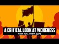

# A critical look at Wokeness with Abu Amina Elias (2022-08-21)

## Description

Read The False Promise Of Identitarianism: https://muslimmatters.org/2022/07/29/the-false-promise-of-identitarianism/

You Can Support My Work on Patreon:
https://www.patreon.com/Bloggingtheology

My Paypal Link: 
https://www.paypal.com/paypalme/bloggingtheology?locale.x=en_GB

## Summary of [A critical look at Wokeness with Abu Amina Elias](https://www.youtube.com/watch?v=37K1mPnMIeE)

*This summary is AI generated - there may be inaccuracies. *

### [00:00:00](https://www.youtube.com/watch?v=37K1mPnMIeE&t=0) - [01:00:00](https://www.youtube.com/watch?v=37K1mPnMIeE&t=3600)

 discusses the dangers of post-modernism and its effects on society. It argues that the philosophy is irrational and self-refuting, and that it leads to the rationalization of atrocities.  also discusses how post-modernism has infiltrated Christianity, and how this could harm the tradition.

**[00:00:00](https://www.youtube.com/watch?v=37K1mPnMIeE&t=0)** Sheikh Abu Amina Elias discusses the ideological basis of left-wing extremism, its negative effects on society, and the need for people to be aware of the dangers it poses.
* **[00:05:00](https://www.youtube.com/watch?v=37K1mPnMIeE&t=300)**  the author discusses post-modernism and its effects on the political movement known as "wokeness." The movement is characterized by skepticism of reason, a general suspicion of ideology, and an acute sensitivity to the role of ideology in asserting and maintaining power. Post-modernism was a reaction to the modernist movement, which was based on the idea that reason and science could solve all problems. Despite this, post-modernists observed that there were still injustices in society, and that the modernist vision had not yet achieved its full potential.
* **[00:10:00](https://www.youtube.com/watch?v=37K1mPnMIeE&t=600)** Post-modernism is a philosophical movement that rejects objective reality, moral values, and reason. It is opposed to how Muslims are supposed to be as rational beings. One of the problems with post-modernism is that it is irrational and self-refuting. It also resembles a sect from Islam called the Jabria.
* **[00:15:00](https://www.youtube.com/watch?v=37K1mPnMIeE&t=900)* Discusses the problems with post-modernism, which is a philosophy that holds that language does not accurately represent reality. This leads to problems with politics and public discourse, as postmodernists often manipulate language to achieve their political goals without the general population being aware of it.
* **[00:20:00](https://www.youtube.com/watch?v=37K1mPnMIeE&t=1200)** Post-modernism denies that there are aspects of reality that are objectively true, and it denies that there are absolute moral values. This leads to the rationalization of atrocities, and the academia of post-modernists is a significant threat to religion.
* **[00:25:00](https://www.youtube.com/watch?v=37K1mPnMIeE&t=1500)** This 1-paragraph summary of the video discusses the origins of critical theory, its application to society and culture, and its potential dangers.
* **[00:30:00](https://www.youtube.com/watch?v=37K1mPnMIeE&t=1800)* Discusses how Marxism, an atheistic ideology, has been used to oppress people. It points to the blending of critical theory and post-modernism in academia, which has led to the emergence of modern critical theories, such as the identitarians. These theories are problematic because they require people to believe in a transcendent "truth," which many critical theorists do not believe in.
* **[00:35:00](https://www.youtube.com/watch?v=37K1mPnMIeE&t=2100)* Discusses the concept of intersectionality, which is a methodology used to analyze different social justice issues. He points out that, while intersectionality is an important concept in academia, it has escaped the laboratory and has been applied to identity politics to the detriment of society as a whole. argues that identitarianism, or the application of critical theory to identity issues, is unhealthy and sets people against each other. He also mentions that the concept of intersectionality is not limited to the six identity issues commonly discussed in the media, and that it has been used to deconstruct religious beliefs.
* **[00:40:00](https://www.youtube.com/watch?v=37K1mPnMIeE&t=2400)* Discusses the idea that humans are social constructs, and that this idea is empirically false. It also discusses the infiltration of Christianity by these ideas, and how it could harm the tradition.
* **[00:45:00](https://www.youtube.com/watch?v=37K1mPnMIeE&t=2700)**  explains that there is a natural reality, which opposes the false "blank slate" ideology. Stephen Pinker, an atheist, provides evidence that this ideology is not scientific. Abu Amina Elias, a Muslim, argues that this ideology harms teenagers, by teaching them that they do not need to follow traditional values.
* **[00:50:00](https://www.youtube.com/watch?v=37K1mPnMIeE&t=3000)* Discusses parallels between Islam and Tesla technology, noting that while Tesla's theories were flawed, they were still muslims. He also points out that there is no precedent for the ideas Tesla promoted in Islamic history.
* **[00:55:00](https://www.youtube.com/watch?v=37K1mPnMIeE&t=3300)** The narrator discusses how a foreign philosophy, in this case, greek philosophy, can influence Muslims to commit atrocities against their own Muslim brothers and sisters. He also warns that if the Muslims do not have a relationship with their religious leaders, they will turn to political leaders who will also be influenced by the non-muslim academics in the field. The narrator cites examples of this trend in the United States, such as Joe Biden and Alexandria Castillo Cortez, and how it can have negative consequences for Muslim children.
### [01:00:00](https://www.youtube.com/watch?v=37K1mPnMIeE&t=3600) - [01:20:00](https://www.youtube.com/watch?v=37K1mPnMIeE&t=4800)

 discusses the concept of "wokeness" and how it is used to manipulate people. It covers the double standards that identitarians adhere to, as well as their obsession with power dynamics.  also points out the worldliness of the "Woke" movement and how it is incompatible with true activism.

**[01:00:00](https://www.youtube.com/watch?v=37K1mPnMIeE&t=3600)** of the article discusses how the news has become more biased and sensationalized, with a focus on the current war in Ukraine. They argue that this is due to the dominance of critical theory in the news industry, which has led to a lack of diversity in reporting. also points out how the government, corporations, and new media personalities all share a similar perspective, indicating that they may be receiving propaganda instead of factual information.
* **[01:05:00](https://www.youtube.com/watch?v=37K1mPnMIeE&t=3900)* Discusses the widespread use of propaganda and how it can be used to manipulate the public. It also points out how journalists are not always devoted to uncovering wrongdoing, and instead often serve the interests of their own parties. This can have negative consequences, such as the spread of false information.
* **[01:10:00](https://www.youtube.com/watch?v=37K1mPnMIeE&t=4200)* Discusses the concept of "wokeness" and how it is used to manipulate people. It covers the double standards that identitarians adhere to, as well as their obsession with power dynamics.  also points out the worldliness of the "Woke" movement and how it is incompatible with true activism.
* **[01:15:00](https://www.youtube.com/watch?v=37K1mPnMIeE&t=4500)* Discusses the phenomenon of "wokeness," or the trend among some people to identify as "black," "woman," or "gay" in order to gain political power and support for their ideological goals.  provides a brief summary of the article it is referencing, which discusses the false promise of identitarianism and how it can be harmful to groups of identity.
* **[01:20:00](https://www.youtube.com/watch?v=37K1mPnMIeE&t=4800)* Discusses the concept of 'wokeness' and how it is important to discuss and think about it. He asks for forgiveness from his listeners for any mistakes he may have made, and also asks for Allah's forgiveness. He encourages people to read the article and think about it further.

<h2>Full transcript with timestamps: CLICK TO EXPAND</h2>

[0:00:02](https://youtu.be/37K1mPnMIeE?t=2) hello everyone and welcome to blogging  
[0:00:04](https://youtu.be/37K1mPnMIeE?t=4) theology today i'm delighted to talk  
[0:00:06](https://youtu.be/37K1mPnMIeE?t=6) again to sheikh abu amina ilyas you're  
[0:00:09](https://youtu.be/37K1mPnMIeE?t=9) most welcome sir  
[0:00:11](https://youtu.be/37K1mPnMIeE?t=11) assalamu alaikum thank you for having me  
[0:00:13](https://youtu.be/37K1mPnMIeE?t=13) welcome  
[0:00:15](https://youtu.be/37K1mPnMIeE?t=15) um for those who don't know uh abu amina  
[0:00:17](https://youtu.be/37K1mPnMIeE?t=17) elias is currently a research librarian  
[0:00:19](https://youtu.be/37K1mPnMIeE?t=19) for middle east studies at new york  
[0:00:22](https://youtu.be/37K1mPnMIeE?t=22) university in abu dhabi  
[0:00:24](https://youtu.be/37K1mPnMIeE?t=24) and research fellow for the akin  
[0:00:26](https://youtu.be/37K1mPnMIeE?t=26) institute for islamic research and he  
[0:00:28](https://youtu.be/37K1mPnMIeE?t=28) embraced islam in  
[0:00:30](https://youtu.be/37K1mPnMIeE?t=30) 2004 at the age of 20.  
[0:00:33](https://youtu.be/37K1mPnMIeE?t=33) he studied islam from a traditional  
[0:00:35](https://youtu.be/37K1mPnMIeE?t=35) perspective with local scholars and  
[0:00:38](https://youtu.be/37K1mPnMIeE?t=38) imams  
[0:00:40](https://youtu.be/37K1mPnMIeE?t=40) he's the author of the recently  
[0:00:42](https://youtu.be/37K1mPnMIeE?t=42) published article entitled  
[0:00:44](https://youtu.be/37K1mPnMIeE?t=44) the false promise of identitarianism  
[0:00:48](https://youtu.be/37K1mPnMIeE?t=48) which looks at how certain postmodernist  
[0:00:50](https://youtu.be/37K1mPnMIeE?t=50) ideas have influenced some muslim  
[0:00:52](https://youtu.be/37K1mPnMIeE?t=52) scholars and leaders especially in the  
[0:00:55](https://youtu.be/37K1mPnMIeE?t=55) west and is published on uh the muslim  
[0:00:58](https://youtu.be/37K1mPnMIeE?t=58) matters website and i'll link to in the  
[0:01:01](https://youtu.be/37K1mPnMIeE?t=61) description below  
[0:01:03](https://youtu.be/37K1mPnMIeE?t=63) so would you like to introduce us to the  
[0:01:05](https://youtu.be/37K1mPnMIeE?t=65) main themes of your paper  
[0:01:09](https://youtu.be/37K1mPnMIeE?t=69) yes  
[0:01:25](https://youtu.be/37K1mPnMIeE?t=85) peace and blessings upon his messenger  
[0:01:28](https://youtu.be/37K1mPnMIeE?t=88) i ask a lot to guide me in our  
[0:01:29](https://youtu.be/37K1mPnMIeE?t=89) discussion  
[0:01:30](https://youtu.be/37K1mPnMIeE?t=90) because it's a difficult topic  
[0:01:33](https://youtu.be/37K1mPnMIeE?t=93) and i was not um  
[0:01:35](https://youtu.be/37K1mPnMIeE?t=95) i was not very eager to write about it  
[0:01:37](https://youtu.be/37K1mPnMIeE?t=97) but i was asked to do so by  
[0:01:40](https://youtu.be/37K1mPnMIeE?t=100) some of my colleagues and that's what um  
[0:01:44](https://youtu.be/37K1mPnMIeE?t=104) was the origin of the essay and why i  
[0:01:46](https://youtu.be/37K1mPnMIeE?t=106) wrote it  
[0:01:48](https://youtu.be/37K1mPnMIeE?t=108) and basically  
[0:01:49](https://youtu.be/37K1mPnMIeE?t=109) um  
[0:01:52](https://youtu.be/37K1mPnMIeE?t=112) to summarize the themes of  
[0:01:55](https://youtu.be/37K1mPnMIeE?t=115) the  
[0:01:56](https://youtu.be/37K1mPnMIeE?t=116) the essay and what we will go into more  
[0:01:58](https://youtu.be/37K1mPnMIeE?t=118) detail  
[0:02:00](https://youtu.be/37K1mPnMIeE?t=120) today  
[0:02:01](https://youtu.be/37K1mPnMIeE?t=121) um  
[0:02:02](https://youtu.be/37K1mPnMIeE?t=122) is uh  
[0:02:04](https://youtu.be/37K1mPnMIeE?t=124) understanding the ideological basis of  
[0:02:08](https://youtu.be/37K1mPnMIeE?t=128) left-wing extremism in particular in the  
[0:02:11](https://youtu.be/37K1mPnMIeE?t=131) united states but it's a global  
[0:02:13](https://youtu.be/37K1mPnMIeE?t=133) phenomenon at this point  
[0:02:15](https://youtu.be/37K1mPnMIeE?t=135) and how it contradicts our  
[0:02:19](https://youtu.be/37K1mPnMIeE?t=139) islamic beliefs  
[0:02:21](https://youtu.be/37K1mPnMIeE?t=141) why it's a big problem  
[0:02:23](https://youtu.be/37K1mPnMIeE?t=143) it's having influence on our young  
[0:02:25](https://youtu.be/37K1mPnMIeE?t=145) people  
[0:02:26](https://youtu.be/37K1mPnMIeE?t=146) um  
[0:02:27](https://youtu.be/37K1mPnMIeE?t=147) and all of the various flaws that we can  
[0:02:30](https://youtu.be/37K1mPnMIeE?t=150) see  
[0:02:31](https://youtu.be/37K1mPnMIeE?t=151) in regards to it um  
[0:02:34](https://youtu.be/37K1mPnMIeE?t=154) the fact that it has a bad relationship  
[0:02:36](https://youtu.be/37K1mPnMIeE?t=156) with the truth  
[0:02:38](https://youtu.be/37K1mPnMIeE?t=158) um that it's a form of tribalism  
[0:02:41](https://youtu.be/37K1mPnMIeE?t=161) um that is is worldliness  
[0:02:44](https://youtu.be/37K1mPnMIeE?t=164) uh it is based on the pursuit of power  
[0:02:46](https://youtu.be/37K1mPnMIeE?t=166) and not the pursuit of truth  
[0:02:49](https://youtu.be/37K1mPnMIeE?t=169) um it's causing divisions within  
[0:02:51](https://youtu.be/37K1mPnMIeE?t=171) families it's causing divisions within  
[0:02:53](https://youtu.be/37K1mPnMIeE?t=173) generations it's causing the younger  
[0:02:56](https://youtu.be/37K1mPnMIeE?t=176) generations to disrespect the older  
[0:02:58](https://youtu.be/37K1mPnMIeE?t=178) generations  
[0:02:59](https://youtu.be/37K1mPnMIeE?t=179) um and  
[0:03:01](https://youtu.be/37K1mPnMIeE?t=181) it  
[0:03:02](https://youtu.be/37K1mPnMIeE?t=182) has always alarmed me and i have always  
[0:03:04](https://youtu.be/37K1mPnMIeE?t=184) and we have discussed this among myself  
[0:03:07](https://youtu.be/37K1mPnMIeE?t=187) and  
[0:03:08](https://youtu.be/37K1mPnMIeE?t=188) my various colleagues at different  
[0:03:09](https://youtu.be/37K1mPnMIeE?t=189) places  
[0:03:11](https://youtu.be/37K1mPnMIeE?t=191) um but it really is  
[0:03:13](https://youtu.be/37K1mPnMIeE?t=193) um  
[0:03:14](https://youtu.be/37K1mPnMIeE?t=194) we can't really ignore it anymore i  
[0:03:16](https://youtu.be/37K1mPnMIeE?t=196) don't believe  
[0:03:17](https://youtu.be/37K1mPnMIeE?t=197) and um  
[0:03:20](https://youtu.be/37K1mPnMIeE?t=200) it's uh it's having such an influence on  
[0:03:22](https://youtu.be/37K1mPnMIeE?t=202) people that  
[0:03:24](https://youtu.be/37K1mPnMIeE?t=204) it's i feel like it's threatening our  
[0:03:26](https://youtu.be/37K1mPnMIeE?t=206) theology  
[0:03:27](https://youtu.be/37K1mPnMIeE?t=207) that uh there are muslims who are trying  
[0:03:30](https://youtu.be/37K1mPnMIeE?t=210) to inject  
[0:03:32](https://youtu.be/37K1mPnMIeE?t=212) foreign non-islamic ideas  
[0:03:35](https://youtu.be/37K1mPnMIeE?t=215) into the islamic tradition that are  
[0:03:37](https://youtu.be/37K1mPnMIeE?t=217) divisive that are harmful  
[0:03:40](https://youtu.be/37K1mPnMIeE?t=220) and i felt like i had to speak about  
[0:03:42](https://youtu.be/37K1mPnMIeE?t=222) that  
[0:03:43](https://youtu.be/37K1mPnMIeE?t=223) and i didn't really want to because this  
[0:03:45](https://youtu.be/37K1mPnMIeE?t=225) isn't something that i  
[0:03:46](https://youtu.be/37K1mPnMIeE?t=226) usually speak upon it's something that i  
[0:03:49](https://youtu.be/37K1mPnMIeE?t=229) observe in society and i'm concerned  
[0:03:51](https://youtu.be/37K1mPnMIeE?t=231) with and that i have read  
[0:03:54](https://youtu.be/37K1mPnMIeE?t=234) relevant literature upon  
[0:03:56](https://youtu.be/37K1mPnMIeE?t=236) and viewed debates upon  
[0:03:59](https://youtu.be/37K1mPnMIeE?t=239) um but you know usually i would just  
[0:04:01](https://youtu.be/37K1mPnMIeE?t=241) talk about theology and i wouldn't talk  
[0:04:03](https://youtu.be/37K1mPnMIeE?t=243) about politics i would talk about  
[0:04:05](https://youtu.be/37K1mPnMIeE?t=245) psychology and spirituality and these  
[0:04:07](https://youtu.be/37K1mPnMIeE?t=247) things  
[0:04:08](https://youtu.be/37K1mPnMIeE?t=248) or what i would like to research and  
[0:04:09](https://youtu.be/37K1mPnMIeE?t=249) talk about most  
[0:04:11](https://youtu.be/37K1mPnMIeE?t=251) but i felt compelled to talk about this  
[0:04:14](https://youtu.be/37K1mPnMIeE?t=254) topic so that was the  
[0:04:16](https://youtu.be/37K1mPnMIeE?t=256) that was the summary of the essay and um  
[0:04:19](https://youtu.be/37K1mPnMIeE?t=259) you know i didn't want to write it but i  
[0:04:21](https://youtu.be/37K1mPnMIeE?t=261) felt like i had to  
[0:04:23](https://youtu.be/37K1mPnMIeE?t=263) and i'm glad you did i've read the essay  
[0:04:25](https://youtu.be/37K1mPnMIeE?t=265) i'll say a link to it in description  
[0:04:26](https://youtu.be/37K1mPnMIeE?t=266) below i think it's definitely uh worth  
[0:04:28](https://youtu.be/37K1mPnMIeE?t=268) reading and i encourage people to look  
[0:04:30](https://youtu.be/37K1mPnMIeE?t=270) at it it's not very long i think it's uh  
[0:04:32](https://youtu.be/37K1mPnMIeE?t=272) readily understandable and quite punchy  
[0:04:35](https://youtu.be/37K1mPnMIeE?t=275) in parts it doesn't uh  
[0:04:37](https://youtu.be/37K1mPnMIeE?t=277) you know you're not uh hiding your your  
[0:04:39](https://youtu.be/37K1mPnMIeE?t=279) views uh which is fine um but i just  
[0:04:41](https://youtu.be/37K1mPnMIeE?t=281) like to ask before we go any further  
[0:04:43](https://youtu.be/37K1mPnMIeE?t=283) because we're using terms like  
[0:04:44](https://youtu.be/37K1mPnMIeE?t=284) identitarianism and post-modernism and  
[0:04:47](https://youtu.be/37K1mPnMIeE?t=287) so on but just as a kind of the  
[0:04:49](https://youtu.be/37K1mPnMIeE?t=289) antecedent ideology behind  
[0:04:51](https://youtu.be/37K1mPnMIeE?t=291) identitarianism which of yet you've yet  
[0:04:53](https://youtu.be/37K1mPnMIeE?t=293) to do fine what is post-modernism  
[0:04:55](https://youtu.be/37K1mPnMIeE?t=295) because that's been around for quite a  
[0:04:56](https://youtu.be/37K1mPnMIeE?t=296) while now hasn't it it's not just a  
[0:04:58](https://youtu.be/37K1mPnMIeE?t=298) recent phenomena affecting social media  
[0:05:00](https://youtu.be/37K1mPnMIeE?t=300) we're  
[0:05:00](https://youtu.be/37K1mPnMIeE?t=300) we're going back decades here aren't we  
[0:05:02](https://youtu.be/37K1mPnMIeE?t=302) i think  
[0:05:03](https://youtu.be/37K1mPnMIeE?t=303) right um so  
[0:05:07](https://youtu.be/37K1mPnMIeE?t=307) let's talk about  
[0:05:08](https://youtu.be/37K1mPnMIeE?t=308) post-modernism so well let me let me uh  
[0:05:13](https://youtu.be/37K1mPnMIeE?t=313) explain why i use the term post-modern  
[0:05:15](https://youtu.be/37K1mPnMIeE?t=315) identitarianism identitarianism because  
[0:05:17](https://youtu.be/37K1mPnMIeE?t=317) that's not a common uh way to analyze  
[0:05:21](https://youtu.be/37K1mPnMIeE?t=321) this phenomenon that we're talking about  
[0:05:23](https://youtu.be/37K1mPnMIeE?t=323) um i use post-modernism because the  
[0:05:26](https://youtu.be/37K1mPnMIeE?t=326) effect the influence of post-modern  
[0:05:28](https://youtu.be/37K1mPnMIeE?t=328) philosophy which we will discuss shortly  
[0:05:30](https://youtu.be/37K1mPnMIeE?t=330) um is the influence on this political  
[0:05:32](https://youtu.be/37K1mPnMIeE?t=332) movement is obvious and i use  
[0:05:34](https://youtu.be/37K1mPnMIeE?t=334) identitarianism because of the way that  
[0:05:36](https://youtu.be/37K1mPnMIeE?t=336) this ideology  
[0:05:39](https://youtu.be/37K1mPnMIeE?t=339) constructs discourse in order to divide  
[0:05:41](https://youtu.be/37K1mPnMIeE?t=341) people by identity groups and then to  
[0:05:43](https://youtu.be/37K1mPnMIeE?t=343) set them against each other and that is  
[0:05:46](https://youtu.be/37K1mPnMIeE?t=346) used as a means for politicians to get  
[0:05:48](https://youtu.be/37K1mPnMIeE?t=348) power and it's used by activists for  
[0:05:51](https://youtu.be/37K1mPnMIeE?t=351) their for their agendas and so on  
[0:05:54](https://youtu.be/37K1mPnMIeE?t=354) um and the  
[0:05:57](https://youtu.be/37K1mPnMIeE?t=357) the  
[0:05:58](https://youtu.be/37K1mPnMIeE?t=358) the challenge of of  
[0:06:00](https://youtu.be/37K1mPnMIeE?t=360) confronting this political movement is  
[0:06:02](https://youtu.be/37K1mPnMIeE?t=362) that they don't  
[0:06:04](https://youtu.be/37K1mPnMIeE?t=364) have an a label that they attach to  
[0:06:08](https://youtu.be/37K1mPnMIeE?t=368) themselves  
[0:06:09](https://youtu.be/37K1mPnMIeE?t=369) okay so they will call themselves  
[0:06:11](https://youtu.be/37K1mPnMIeE?t=371) democrats but not all the democrats are  
[0:06:13](https://youtu.be/37K1mPnMIeE?t=373) on board with them they will call them  
[0:06:15](https://youtu.be/37K1mPnMIeE?t=375) they might call themselves progressives  
[0:06:16](https://youtu.be/37K1mPnMIeE?t=376) but progressivism is a different  
[0:06:19](https://youtu.be/37K1mPnMIeE?t=379) idea  
[0:06:20](https://youtu.be/37K1mPnMIeE?t=380) they might call themselves liberals but  
[0:06:22](https://youtu.be/37K1mPnMIeE?t=382) it's definitely not liberalism where i'm  
[0:06:24](https://youtu.be/37K1mPnMIeE?t=384) not talking about liberalism  
[0:06:26](https://youtu.be/37K1mPnMIeE?t=386) today especially not in the classical  
[0:06:28](https://youtu.be/37K1mPnMIeE?t=388) sense of  
[0:06:30](https://youtu.be/37K1mPnMIeE?t=390) all the freedom of speech and all of  
[0:06:32](https://youtu.be/37K1mPnMIeE?t=392) those things  
[0:06:33](https://youtu.be/37K1mPnMIeE?t=393) you know this is a movement that  
[0:06:36](https://youtu.be/37K1mPnMIeE?t=396) it has been in the shadows and only has  
[0:06:37](https://youtu.be/37K1mPnMIeE?t=397) recently  
[0:06:39](https://youtu.be/37K1mPnMIeE?t=399) uh come  
[0:06:41](https://youtu.be/37K1mPnMIeE?t=401) has appeared in very public ways  
[0:06:44](https://youtu.be/37K1mPnMIeE?t=404) and  
[0:06:46](https://youtu.be/37K1mPnMIeE?t=406) they have been obscure in academia  
[0:06:49](https://youtu.be/37K1mPnMIeE?t=409) and um  
[0:06:50](https://youtu.be/37K1mPnMIeE?t=410) we're going to talk about all the terms  
[0:06:52](https://youtu.be/37K1mPnMIeE?t=412) that we can use to identify them but  
[0:06:54](https://youtu.be/37K1mPnMIeE?t=414) this was the term that i wanted to use  
[0:06:56](https://youtu.be/37K1mPnMIeE?t=416) because i feel that they need to be  
[0:06:58](https://youtu.be/37K1mPnMIeE?t=418) labeled  
[0:06:59](https://youtu.be/37K1mPnMIeE?t=419) and they won't label themselves right  
[0:07:01](https://youtu.be/37K1mPnMIeE?t=421) they will call themselves democrats or  
[0:07:03](https://youtu.be/37K1mPnMIeE?t=423) liberals or whatever but those aren't  
[0:07:05](https://youtu.be/37K1mPnMIeE?t=425) accurate labels there's those are labels  
[0:07:07](https://youtu.be/37K1mPnMIeE?t=427) that they hide behind  
[0:07:08](https://youtu.be/37K1mPnMIeE?t=428) we want to understand what are their  
[0:07:10](https://youtu.be/37K1mPnMIeE?t=430) ideas and what makes their ideas  
[0:07:12](https://youtu.be/37K1mPnMIeE?t=432) distinct from the democratic party and  
[0:07:15](https://youtu.be/37K1mPnMIeE?t=435) make their ideas distinct from  
[0:07:17](https://youtu.be/37K1mPnMIeE?t=437) liberalism or progressivism or all of  
[0:07:20](https://youtu.be/37K1mPnMIeE?t=440) these other groups that they are  
[0:07:22](https://youtu.be/37K1mPnMIeE?t=442) uh allied with and and mixed with  
[0:07:26](https://youtu.be/37K1mPnMIeE?t=446) so that's the reason why i chose those  
[0:07:28](https://youtu.be/37K1mPnMIeE?t=448) terms right  
[0:07:29](https://youtu.be/37K1mPnMIeE?t=449) and as muslims  
[0:07:32](https://youtu.be/37K1mPnMIeE?t=452) we  
[0:07:33](https://youtu.be/37K1mPnMIeE?t=453) we have labeled sex in ways that they  
[0:07:35](https://youtu.be/37K1mPnMIeE?t=455) haven't labeled themselves right because  
[0:07:37](https://youtu.be/37K1mPnMIeE?t=457) they didn't label themselves and we have  
[0:07:39](https://youtu.be/37K1mPnMIeE?t=459) to label that idea in order to  
[0:07:41](https://youtu.be/37K1mPnMIeE?t=461) distinguish it from our beliefs right so  
[0:07:43](https://youtu.be/37K1mPnMIeE?t=463) this is the label that i chose  
[0:07:46](https://youtu.be/37K1mPnMIeE?t=466) and it may not necessarily stick and it  
[0:07:48](https://youtu.be/37K1mPnMIeE?t=468) may not be the best one um  
[0:07:50](https://youtu.be/37K1mPnMIeE?t=470) and i'll i'll explain a little bit more  
[0:07:52](https://youtu.be/37K1mPnMIeE?t=472) about why i chose that term uh but that  
[0:07:55](https://youtu.be/37K1mPnMIeE?t=475) was my rationale for the whole  
[0:07:59](https://youtu.be/37K1mPnMIeE?t=479) for the title of the article basically  
[0:08:02](https://youtu.be/37K1mPnMIeE?t=482) so modernism or post-modernism i'm sorry  
[0:08:06](https://youtu.be/37K1mPnMIeE?t=486) right  
[0:08:09](https://youtu.be/37K1mPnMIeE?t=489) so we need to define post-modernism  
[0:08:12](https://youtu.be/37K1mPnMIeE?t=492) so what i'm going to do is i'm going to  
[0:08:14](https://youtu.be/37K1mPnMIeE?t=494) read from my notes  
[0:08:16](https://youtu.be/37K1mPnMIeE?t=496) i'm going to read from scholarly  
[0:08:17](https://youtu.be/37K1mPnMIeE?t=497) reference  
[0:08:18](https://youtu.be/37K1mPnMIeE?t=498) sources in particular the encyclopedia  
[0:08:20](https://youtu.be/37K1mPnMIeE?t=500) britannica and they have two articles  
[0:08:23](https://youtu.be/37K1mPnMIeE?t=503) that i'm going to be citing  
[0:08:25](https://youtu.be/37K1mPnMIeE?t=505) these are scholarly peer-reviewed  
[0:08:26](https://youtu.be/37K1mPnMIeE?t=506) articles they're open source articles so  
[0:08:28](https://youtu.be/37K1mPnMIeE?t=508) you can get them on google  
[0:08:30](https://youtu.be/37K1mPnMIeE?t=510) they're easy to understand they're  
[0:08:32](https://youtu.be/37K1mPnMIeE?t=512) concise summaries of the scholarship  
[0:08:34](https://youtu.be/37K1mPnMIeE?t=514) that i'm going to be  
[0:08:36](https://youtu.be/37K1mPnMIeE?t=516) reading from directly so that people  
[0:08:38](https://youtu.be/37K1mPnMIeE?t=518) know  
[0:08:39](https://youtu.be/37K1mPnMIeE?t=519) that i'm not making this up  
[0:08:41](https://youtu.be/37K1mPnMIeE?t=521) i'm not  
[0:08:43](https://youtu.be/37K1mPnMIeE?t=523) uh taking this from a white right-wing  
[0:08:45](https://youtu.be/37K1mPnMIeE?t=525) provocateur on twitter or wherever this  
[0:08:48](https://youtu.be/37K1mPnMIeE?t=528) is from the scholarly sources okay so  
[0:08:50](https://youtu.be/37K1mPnMIeE?t=530) let's just  
[0:08:52](https://youtu.be/37K1mPnMIeE?t=532) yeah  
[0:08:53](https://youtu.be/37K1mPnMIeE?t=533) so let's define postmodernism  
[0:08:55](https://youtu.be/37K1mPnMIeE?t=535) from this encyclopedia article  
[0:08:58](https://youtu.be/37K1mPnMIeE?t=538) the authors write quote post-modernism  
[0:09:02](https://youtu.be/37K1mPnMIeE?t=542) in western philosophy  
[0:09:03](https://youtu.be/37K1mPnMIeE?t=543) is a late 20th century movement  
[0:09:05](https://youtu.be/37K1mPnMIeE?t=545) characterized by broad skepticism  
[0:09:08](https://youtu.be/37K1mPnMIeE?t=548) subjectivism or relativism  
[0:09:11](https://youtu.be/37K1mPnMIeE?t=551) a general suspicion of reason  
[0:09:14](https://youtu.be/37K1mPnMIeE?t=554) and an acute sensitivity to the role of  
[0:09:16](https://youtu.be/37K1mPnMIeE?t=556) ideology in asserting and maintaining  
[0:09:18](https://youtu.be/37K1mPnMIeE?t=558) political and economic  
[0:09:20](https://youtu.be/37K1mPnMIeE?t=560) power okay  
[0:09:22](https://youtu.be/37K1mPnMIeE?t=562) so that's the definition of  
[0:09:24](https://youtu.be/37K1mPnMIeE?t=564) post-modernism okay  
[0:09:26](https://youtu.be/37K1mPnMIeE?t=566) and post-modernism was a reaction to  
[0:09:28](https://youtu.be/37K1mPnMIeE?t=568) basically the western enlightenment  
[0:09:30](https://youtu.be/37K1mPnMIeE?t=570) values so you had the modernist movement  
[0:09:33](https://youtu.be/37K1mPnMIeE?t=573) and everything was supposed to be  
[0:09:34](https://youtu.be/37K1mPnMIeE?t=574) scientific and rational  
[0:09:36](https://youtu.be/37K1mPnMIeE?t=576) um and despite that scientific and and  
[0:09:39](https://youtu.be/37K1mPnMIeE?t=579) rational basis that  
[0:09:41](https://youtu.be/37K1mPnMIeE?t=581) people  
[0:09:42](https://youtu.be/37K1mPnMIeE?t=582) imagined that the society was moving  
[0:09:44](https://youtu.be/37K1mPnMIeE?t=584) towards  
[0:09:45](https://youtu.be/37K1mPnMIeE?t=585) uh there were still obvious injustices  
[0:09:47](https://youtu.be/37K1mPnMIeE?t=587) in in the in the society there were  
[0:09:49](https://youtu.be/37K1mPnMIeE?t=589) still obvious problems  
[0:09:50](https://youtu.be/37K1mPnMIeE?t=590) and for whatever reason this movement of  
[0:09:53](https://youtu.be/37K1mPnMIeE?t=593) philosophy developed and i'm not saying  
[0:09:56](https://youtu.be/37K1mPnMIeE?t=596) that i'm an expert on  
[0:09:58](https://youtu.be/37K1mPnMIeE?t=598) this philosophy and all of its thinkers  
[0:10:00](https://youtu.be/37K1mPnMIeE?t=600) because they have a lot of different  
[0:10:01](https://youtu.be/37K1mPnMIeE?t=601) thinkers that  
[0:10:02](https://youtu.be/37K1mPnMIeE?t=602) even disagree amongst themselves it's a  
[0:10:04](https://youtu.be/37K1mPnMIeE?t=604) broad trend  
[0:10:05](https://youtu.be/37K1mPnMIeE?t=605) okay but they are  
[0:10:07](https://youtu.be/37K1mPnMIeE?t=607) united mostly in  
[0:10:09](https://youtu.be/37K1mPnMIeE?t=609) uh uh skepticism  
[0:10:12](https://youtu.be/37K1mPnMIeE?t=612) right so they're they're not they're  
[0:10:13](https://youtu.be/37K1mPnMIeE?t=613) skeptical of truth claims uh  
[0:10:16](https://youtu.be/37K1mPnMIeE?t=616) subjectivism so they don't believe uh in  
[0:10:18](https://youtu.be/37K1mPnMIeE?t=618) objective reality they don't believe  
[0:10:21](https://youtu.be/37K1mPnMIeE?t=621) there's an objective truth  
[0:10:23](https://youtu.be/37K1mPnMIeE?t=623) and relativism  
[0:10:24](https://youtu.be/37K1mPnMIeE?t=624) so they don't believe that uh moral  
[0:10:26](https://youtu.be/37K1mPnMIeE?t=626) values for example can be absolute that  
[0:10:29](https://youtu.be/37K1mPnMIeE?t=629) morals are relative and and so on uh  
[0:10:32](https://youtu.be/37K1mPnMIeE?t=632) they have a suspicion of reason so  
[0:10:34](https://youtu.be/37K1mPnMIeE?t=634) they're suspicious of the scientific  
[0:10:36](https://youtu.be/37K1mPnMIeE?t=636) method when it's properly applied  
[0:10:39](https://youtu.be/37K1mPnMIeE?t=639) um  
[0:10:39](https://youtu.be/37K1mPnMIeE?t=639) and they are  
[0:10:41](https://youtu.be/37K1mPnMIeE?t=641) concerned with ideology with  
[0:10:44](https://youtu.be/37K1mPnMIeE?t=644) political power basically so  
[0:10:46](https://youtu.be/37K1mPnMIeE?t=646) so this was the  
[0:10:48](https://youtu.be/37K1mPnMIeE?t=648) the the post-modern  
[0:10:50](https://youtu.be/37K1mPnMIeE?t=650) philosophical movement okay and it  
[0:10:52](https://youtu.be/37K1mPnMIeE?t=652) merged with another movement  
[0:10:54](https://youtu.be/37K1mPnMIeE?t=654) that  
[0:10:55](https://youtu.be/37K1mPnMIeE?t=655) we will discuss after this that is  
[0:10:58](https://youtu.be/37K1mPnMIeE?t=658) called critical theory which is in an  
[0:11:00](https://youtu.be/37K1mPnMIeE?t=660) academic movement  
[0:11:02](https://youtu.be/37K1mPnMIeE?t=662) um and they they kind of draw off of  
[0:11:04](https://youtu.be/37K1mPnMIeE?t=664) each other to create these um academics  
[0:11:07](https://youtu.be/37K1mPnMIeE?t=667) and activists who are out there and and  
[0:11:09](https://youtu.be/37K1mPnMIeE?t=669) and harming a lot of people with their  
[0:11:11](https://youtu.be/37K1mPnMIeE?t=671) ideas  
[0:11:12](https://youtu.be/37K1mPnMIeE?t=672) in society um  
[0:11:14](https://youtu.be/37K1mPnMIeE?t=674) so what are the problems the main  
[0:11:16](https://youtu.be/37K1mPnMIeE?t=676) problems with uh post-modernism  
[0:11:22](https://youtu.be/37K1mPnMIeE?t=682) the first is that post-modernism is  
[0:11:24](https://youtu.be/37K1mPnMIeE?t=684) irrational  
[0:11:26](https://youtu.be/37K1mPnMIeE?t=686) it is an anti-rational  
[0:11:29](https://youtu.be/37K1mPnMIeE?t=689) philosophy  
[0:11:30](https://youtu.be/37K1mPnMIeE?t=690) okay and that's that is opposed to how  
[0:11:32](https://youtu.be/37K1mPnMIeE?t=692) we are supposed to be as muslims because  
[0:11:34](https://youtu.be/37K1mPnMIeE?t=694) we as muslims are supposed to be  
[0:11:36](https://youtu.be/37K1mPnMIeE?t=696) rational evidence-based people  
[0:11:38](https://youtu.be/37K1mPnMIeE?t=698) and post-modernists believe that  
[0:11:40](https://youtu.be/37K1mPnMIeE?t=700) rational  
[0:11:41](https://youtu.be/37K1mPnMIeE?t=701) and evidence-based claims and  
[0:11:42](https://youtu.be/37K1mPnMIeE?t=702) truth-based claims are functions of  
[0:11:44](https://youtu.be/37K1mPnMIeE?t=704) power and not natural or objective truth  
[0:11:47](https://youtu.be/37K1mPnMIeE?t=707) or reality no because the crowd the  
[0:11:49](https://youtu.be/37K1mPnMIeE?t=709) crime doesn't  
[0:11:50](https://youtu.be/37K1mPnMIeE?t=710) crime exhorts humankind to uh have you  
[0:11:53](https://youtu.be/37K1mPnMIeE?t=713) not thought you know to use their reason  
[0:11:54](https://youtu.be/37K1mPnMIeE?t=714) to actually reflect  
[0:11:56](https://youtu.be/37K1mPnMIeE?t=716) and if you if you if you rob us  
[0:11:58](https://youtu.be/37K1mPnMIeE?t=718) then you are taking away uh our  
[0:12:00](https://youtu.be/37K1mPnMIeE?t=720) god-given faculties to and intelligently  
[0:12:03](https://youtu.be/37K1mPnMIeE?t=723) understand reality well it's very  
[0:12:05](https://youtu.be/37K1mPnMIeE?t=725) subversive of uh  
[0:12:07](https://youtu.be/37K1mPnMIeE?t=727) us in that sense  
[0:12:09](https://youtu.be/37K1mPnMIeE?t=729) yes absolutely and that's that that  
[0:12:11](https://youtu.be/37K1mPnMIeE?t=731) makes it very problematic  
[0:12:13](https://youtu.be/37K1mPnMIeE?t=733) and i'm going to quote again from the  
[0:12:15](https://youtu.be/37K1mPnMIeE?t=735) encyclopedia of britannica just so that  
[0:12:17](https://youtu.be/37K1mPnMIeE?t=737) you everyone is clear that  
[0:12:18](https://youtu.be/37K1mPnMIeE?t=738) post-modernism is quote the rejection of  
[0:12:22](https://youtu.be/37K1mPnMIeE?t=742) an objective natural reality which is  
[0:12:24](https://youtu.be/37K1mPnMIeE?t=744) sometimes expressed by saying that there  
[0:12:26](https://youtu.be/37K1mPnMIeE?t=746) is no such thing as truth  
[0:12:29](https://youtu.be/37K1mPnMIeE?t=749) end quote but i love that quote by the  
[0:12:31](https://youtu.be/37K1mPnMIeE?t=751) way because this this is you know  
[0:12:33](https://youtu.be/37K1mPnMIeE?t=753) philosophy 101 in making that statement  
[0:12:35](https://youtu.be/37K1mPnMIeE?t=755) they are making an objective truth claim  
[0:12:40](https://youtu.be/37K1mPnMIeE?t=760) it's it's self-refuting to say there's  
[0:12:42](https://youtu.be/37K1mPnMIeE?t=762) no such thing as objective truth is to  
[0:12:44](https://youtu.be/37K1mPnMIeE?t=764) make objective truth claim that there's  
[0:12:46](https://youtu.be/37K1mPnMIeE?t=766) no absolute truth is a claim to absolute  
[0:12:48](https://youtu.be/37K1mPnMIeE?t=768) truth if you're making a statement about  
[0:12:50](https://youtu.be/37K1mPnMIeE?t=770) metaphysics and ethics and morality in  
[0:12:51](https://youtu.be/37K1mPnMIeE?t=771) general so it's a is a very naive  
[0:12:53](https://youtu.be/37K1mPnMIeE?t=773) statement that actually refutes itself i  
[0:12:55](https://youtu.be/37K1mPnMIeE?t=775) would argue  
[0:12:57](https://youtu.be/37K1mPnMIeE?t=777) yeah i agree and it's it's uh it's  
[0:13:00](https://youtu.be/37K1mPnMIeE?t=780) self-contradictory it's confused and um  
[0:13:03](https://youtu.be/37K1mPnMIeE?t=783) and you'll see that a lot of people who  
[0:13:04](https://youtu.be/37K1mPnMIeE?t=784) have  
[0:13:05](https://youtu.be/37K1mPnMIeE?t=785) been influenced by this philosophy and  
[0:13:07](https://youtu.be/37K1mPnMIeE?t=787) they don't even know that that they're  
[0:13:09](https://youtu.be/37K1mPnMIeE?t=789) they're being influenced by  
[0:13:10](https://youtu.be/37K1mPnMIeE?t=790) post-modernism their ideas are very  
[0:13:12](https://youtu.be/37K1mPnMIeE?t=792) confused and they're not grounded and  
[0:13:15](https://youtu.be/37K1mPnMIeE?t=795) their their ideas are unstable  
[0:13:18](https://youtu.be/37K1mPnMIeE?t=798) and there's no limits to the logic where  
[0:13:20](https://youtu.be/37K1mPnMIeE?t=800) they're where their minds are gonna go  
[0:13:21](https://youtu.be/37K1mPnMIeE?t=801) because you know in islam we have the  
[0:13:23](https://youtu.be/37K1mPnMIeE?t=803) limits that allah placed upon us but  
[0:13:25](https://youtu.be/37K1mPnMIeE?t=805) they don't have any limits because  
[0:13:27](https://youtu.be/37K1mPnMIeE?t=807) they're constantly breaking boundaries  
[0:13:29](https://youtu.be/37K1mPnMIeE?t=809) because there's no such thing as the  
[0:13:30](https://youtu.be/37K1mPnMIeE?t=810) truth and there's no such thing as  
[0:13:32](https://youtu.be/37K1mPnMIeE?t=812) as moral objectivity or anything like  
[0:13:34](https://youtu.be/37K1mPnMIeE?t=814) that  
[0:13:36](https://youtu.be/37K1mPnMIeE?t=816) um so that epistemology that  
[0:13:38](https://youtu.be/37K1mPnMIeE?t=818) epistemology which is the theory of  
[0:13:40](https://youtu.be/37K1mPnMIeE?t=820) knowledge that's the academic term for  
[0:13:42](https://youtu.be/37K1mPnMIeE?t=822) the theory of knowledge that  
[0:13:43](https://youtu.be/37K1mPnMIeE?t=823) epistemology  
[0:13:45](https://youtu.be/37K1mPnMIeE?t=825) uh is false right um  
[0:13:48](https://youtu.be/37K1mPnMIeE?t=828) as we believe as muslims and as  
[0:13:50](https://youtu.be/37K1mPnMIeE?t=830) christians and even liberal philosophers  
[0:13:52](https://youtu.be/37K1mPnMIeE?t=832) and even atheists natural atheists  
[0:13:55](https://youtu.be/37K1mPnMIeE?t=835) naturalists also disagree with that yes  
[0:13:57](https://youtu.be/37K1mPnMIeE?t=837) because they at least at least believe  
[0:13:58](https://youtu.be/37K1mPnMIeE?t=838) there's a nature right  
[0:14:00](https://youtu.be/37K1mPnMIeE?t=840) so it's interesting you'll find some of  
[0:14:03](https://youtu.be/37K1mPnMIeE?t=843) the  
[0:14:03](https://youtu.be/37K1mPnMIeE?t=843) the atheists some of the some of the big  
[0:14:05](https://youtu.be/37K1mPnMIeE?t=845) name atheists are pushing back against  
[0:14:08](https://youtu.be/37K1mPnMIeE?t=848) uh this kind of identitarian extremism  
[0:14:12](https://youtu.be/37K1mPnMIeE?t=852) um  
[0:14:13](https://youtu.be/37K1mPnMIeE?t=853) another point is that from the  
[0:14:16](https://youtu.be/37K1mPnMIeE?t=856) encyclopedia again is that  
[0:14:17](https://youtu.be/37K1mPnMIeE?t=857) post-modernist quote insists that all or  
[0:14:20](https://youtu.be/37K1mPnMIeE?t=860) nearly all aspects of human psychology  
[0:14:22](https://youtu.be/37K1mPnMIeE?t=862) are completely socially determined  
[0:14:26](https://youtu.be/37K1mPnMIeE?t=866) end quote  
[0:14:27](https://youtu.be/37K1mPnMIeE?t=867) so basically they are downplaying the um  
[0:14:32](https://youtu.be/37K1mPnMIeE?t=872) the role of free will in human choices  
[0:14:35](https://youtu.be/37K1mPnMIeE?t=875) and that you're basically a product of  
[0:14:36](https://youtu.be/37K1mPnMIeE?t=876) your society  
[0:14:38](https://youtu.be/37K1mPnMIeE?t=878) and uh you know if you were born into a  
[0:14:40](https://youtu.be/37K1mPnMIeE?t=880) certain  
[0:14:41](https://youtu.be/37K1mPnMIeE?t=881) identity group or a certain class in  
[0:14:44](https://youtu.be/37K1mPnMIeE?t=884) society then you can't help but behave a  
[0:14:46](https://youtu.be/37K1mPnMIeE?t=886) certain way and that you don't really  
[0:14:48](https://youtu.be/37K1mPnMIeE?t=888) have very much  
[0:14:50](https://youtu.be/37K1mPnMIeE?t=890) uh will over your own choices and in  
[0:14:53](https://youtu.be/37K1mPnMIeE?t=893) this way they actually resemble a sect  
[0:14:55](https://youtu.be/37K1mPnMIeE?t=895) from islam that we discussed last time i  
[0:14:57](https://youtu.be/37K1mPnMIeE?t=897) was on your show  
[0:14:59](https://youtu.be/37K1mPnMIeE?t=899) called the jabria  
[0:15:02](https://youtu.be/37K1mPnMIeE?t=902) the people who believe that  
[0:15:05](https://youtu.be/37K1mPnMIeE?t=905) allah compels us to do our deeds and we  
[0:15:07](https://youtu.be/37K1mPnMIeE?t=907) don't and we don't have free will  
[0:15:09](https://youtu.be/37K1mPnMIeE?t=909) right and so  
[0:15:10](https://youtu.be/37K1mPnMIeE?t=910) post-modernists have a very dim view of  
[0:15:12](https://youtu.be/37K1mPnMIeE?t=912) free will and they believe that  
[0:15:15](https://youtu.be/37K1mPnMIeE?t=915) um you know society basically produces  
[0:15:18](https://youtu.be/37K1mPnMIeE?t=918) individuals individuals don't really  
[0:15:20](https://youtu.be/37K1mPnMIeE?t=920) have a free will they're the they're the  
[0:15:23](https://youtu.be/37K1mPnMIeE?t=923) you know the function of group  
[0:15:25](https://youtu.be/37K1mPnMIeE?t=925) identity  
[0:15:28](https://youtu.be/37K1mPnMIeE?t=928) and this again is really  
[0:15:31](https://youtu.be/37K1mPnMIeE?t=931) problematic because as human beings we  
[0:15:33](https://youtu.be/37K1mPnMIeE?t=933) are individuals and we might belong to  
[0:15:36](https://youtu.be/37K1mPnMIeE?t=936) groups but we we are individuals within  
[0:15:38](https://youtu.be/37K1mPnMIeE?t=938) that group and allah  
[0:15:40](https://youtu.be/37K1mPnMIeE?t=940) judges us as individuals we have  
[0:15:42](https://youtu.be/37K1mPnMIeE?t=942) individual hearts and minds we have our  
[0:15:44](https://youtu.be/37K1mPnMIeE?t=944) own thoughts we have our own actions and  
[0:15:46](https://youtu.be/37K1mPnMIeE?t=946) that's what allah judges us upon right  
[0:15:49](https://youtu.be/37K1mPnMIeE?t=949) and and things might be more difficult  
[0:15:52](https://youtu.be/37K1mPnMIeE?t=952) for us to act when we're in a certain  
[0:15:54](https://youtu.be/37K1mPnMIeE?t=954) society or in certain  
[0:15:56](https://youtu.be/37K1mPnMIeE?t=956) social circumstances and things like  
[0:15:58](https://youtu.be/37K1mPnMIeE?t=958) that i'm not denying that  
[0:16:00](https://youtu.be/37K1mPnMIeE?t=960) society has an effect on people's  
[0:16:02](https://youtu.be/37K1mPnMIeE?t=962) behavior but it's not  
[0:16:03](https://youtu.be/37K1mPnMIeE?t=963) uh  
[0:16:04](https://youtu.be/37K1mPnMIeE?t=964) the most important  
[0:16:06](https://youtu.be/37K1mPnMIeE?t=966) or it's not uh an all-governing  
[0:16:08](https://youtu.be/37K1mPnMIeE?t=968) principle of human behavior you know you  
[0:16:10](https://youtu.be/37K1mPnMIeE?t=970) are not necessarily the product of your  
[0:16:13](https://youtu.be/37K1mPnMIeE?t=973) upbringing you can over you can have a  
[0:16:14](https://youtu.be/37K1mPnMIeE?t=974) bad  
[0:16:16](https://youtu.be/37K1mPnMIeE?t=976) upbringing and overcome that and become  
[0:16:18](https://youtu.be/37K1mPnMIeE?t=978) a great person right and despite the  
[0:16:20](https://youtu.be/37K1mPnMIeE?t=980) odds that were stacked against you from  
[0:16:22](https://youtu.be/37K1mPnMIeE?t=982) the beginning right yeah  
[0:16:24](https://youtu.be/37K1mPnMIeE?t=984) so they have a dim view of free will  
[0:16:26](https://youtu.be/37K1mPnMIeE?t=986) that's a problem  
[0:16:27](https://youtu.be/37K1mPnMIeE?t=987) um potus modernist do not believe quote  
[0:16:30](https://youtu.be/37K1mPnMIeE?t=990) again  
[0:16:31](https://youtu.be/37K1mPnMIeE?t=991) language refers to and represents a  
[0:16:33](https://youtu.be/37K1mPnMIeE?t=993) reality outside itself  
[0:16:36](https://youtu.be/37K1mPnMIeE?t=996) so this is another serious problem and  
[0:16:39](https://youtu.be/37K1mPnMIeE?t=999) you'll see this  
[0:16:41](https://youtu.be/37K1mPnMIeE?t=1001) uh  
[0:16:41](https://youtu.be/37K1mPnMIeE?t=1001) in the politics all over the place the  
[0:16:44](https://youtu.be/37K1mPnMIeE?t=1004) way language is being manipulated  
[0:16:46](https://youtu.be/37K1mPnMIeE?t=1006) because postmodernists do not believe  
[0:16:48](https://youtu.be/37K1mPnMIeE?t=1008) that language uh accurately represents  
[0:16:52](https://youtu.be/37K1mPnMIeE?t=1012) reality because they don't believe  
[0:16:53](https://youtu.be/37K1mPnMIeE?t=1013) there's a reality you know they believe  
[0:16:55](https://youtu.be/37K1mPnMIeE?t=1015) that language is all of it is a social  
[0:16:58](https://youtu.be/37K1mPnMIeE?t=1018) construct it doesn't necessarily  
[0:17:00](https://youtu.be/37K1mPnMIeE?t=1020) represent  
[0:17:01](https://youtu.be/37K1mPnMIeE?t=1021) something that's true outside of us and  
[0:17:04](https://youtu.be/37K1mPnMIeE?t=1024) so they have no problems redefining  
[0:17:06](https://youtu.be/37K1mPnMIeE?t=1026) words creating euphemisms you know  
[0:17:08](https://youtu.be/37K1mPnMIeE?t=1028) creating coded language  
[0:17:10](https://youtu.be/37K1mPnMIeE?t=1030) um  
[0:17:11](https://youtu.be/37K1mPnMIeE?t=1031) using these types of games  
[0:17:13](https://youtu.be/37K1mPnMIeE?t=1033) and and putting that in their propaganda  
[0:17:17](https://youtu.be/37K1mPnMIeE?t=1037) to fool people into supporting their  
[0:17:18](https://youtu.be/37K1mPnMIeE?t=1038) agenda who wouldn't otherwise support it  
[0:17:21](https://youtu.be/37K1mPnMIeE?t=1041) right and i feel like a lot of muslim  
[0:17:23](https://youtu.be/37K1mPnMIeE?t=1043) muslims have american muslims  
[0:17:25](https://youtu.be/37K1mPnMIeE?t=1045) specifically have fell into that trap  
[0:17:27](https://youtu.be/37K1mPnMIeE?t=1047) because they talk about  
[0:17:29](https://youtu.be/37K1mPnMIeE?t=1049) social justice and you know everyone  
[0:17:32](https://youtu.be/37K1mPnMIeE?t=1052) wants to have the same rights and those  
[0:17:33](https://youtu.be/37K1mPnMIeE?t=1053) are all things that we agree upon in  
[0:17:35](https://youtu.be/37K1mPnMIeE?t=1055) principle  
[0:17:36](https://youtu.be/37K1mPnMIeE?t=1056) but they're understanding those things  
[0:17:39](https://youtu.be/37K1mPnMIeE?t=1059) that in ways that have been redefined by  
[0:17:41](https://youtu.be/37K1mPnMIeE?t=1061) postmodernists  
[0:17:42](https://youtu.be/37K1mPnMIeE?t=1062) and have been employed in the public  
[0:17:45](https://youtu.be/37K1mPnMIeE?t=1065) space but they haven't told you that  
[0:17:47](https://youtu.be/37K1mPnMIeE?t=1067) they've redefined these things or that  
[0:17:49](https://youtu.be/37K1mPnMIeE?t=1069) when they say social justice they're  
[0:17:51](https://youtu.be/37K1mPnMIeE?t=1071) referring to a specific  
[0:17:53](https://youtu.be/37K1mPnMIeE?t=1073) set of political goals that they're not  
[0:17:55](https://youtu.be/37K1mPnMIeE?t=1075) actually telling you upfront what it is  
[0:17:58](https://youtu.be/37K1mPnMIeE?t=1078) people hear social justice and they  
[0:17:59](https://youtu.be/37K1mPnMIeE?t=1079) think i i am for social justice you are  
[0:18:01](https://youtu.be/37K1mPnMIeE?t=1081) i am we want everyone to be treated  
[0:18:04](https://youtu.be/37K1mPnMIeE?t=1084) fairly right  
[0:18:06](https://youtu.be/37K1mPnMIeE?t=1086) but when they say social justice  
[0:18:08](https://youtu.be/37K1mPnMIeE?t=1088) they have in in their minds a specific  
[0:18:11](https://youtu.be/37K1mPnMIeE?t=1091) type of society  
[0:18:13](https://youtu.be/37K1mPnMIeE?t=1093) uh that's not based on natural law  
[0:18:15](https://youtu.be/37K1mPnMIeE?t=1095) that's definitely not based on belief in  
[0:18:17](https://youtu.be/37K1mPnMIeE?t=1097) god or any religion right and they have  
[0:18:21](https://youtu.be/37K1mPnMIeE?t=1101) they have a society that i think you and  
[0:18:23](https://youtu.be/37K1mPnMIeE?t=1103) i and a lot of people wouldn't want to  
[0:18:24](https://youtu.be/37K1mPnMIeE?t=1104) live in if we knew this is what they  
[0:18:26](https://youtu.be/37K1mPnMIeE?t=1106) were working for yeah and some of the  
[0:18:28](https://youtu.be/37K1mPnMIeE?t=1108) things they advocate for in the name of  
[0:18:29](https://youtu.be/37K1mPnMIeE?t=1109) social justice like unrestricted  
[0:18:31](https://youtu.be/37K1mPnMIeE?t=1111) abortion up to birth or even partial  
[0:18:33](https://youtu.be/37K1mPnMIeE?t=1113) abortion in america are are deeply  
[0:18:36](https://youtu.be/37K1mPnMIeE?t=1116) sinful according to all religious  
[0:18:37](https://youtu.be/37K1mPnMIeE?t=1117) traditions um and they're not questions  
[0:18:39](https://youtu.be/37K1mPnMIeE?t=1119) of social justice at all the these these  
[0:18:41](https://youtu.be/37K1mPnMIeE?t=1121) can become crimes later on in pregnancy  
[0:18:44](https://youtu.be/37K1mPnMIeE?t=1124) obviously when you're killing uh called  
[0:18:46](https://youtu.be/37K1mPnMIeE?t=1126) murder in this language tradition in in  
[0:18:47](https://youtu.be/37K1mPnMIeE?t=1127) the later stages of pregnancy so these  
[0:18:49](https://youtu.be/37K1mPnMIeE?t=1129) are not neutral  
[0:18:51](https://youtu.be/37K1mPnMIeE?t=1131) universal kind of understandings of  
[0:18:53](https://youtu.be/37K1mPnMIeE?t=1133) justice they're heavily loaded from a  
[0:18:55](https://youtu.be/37K1mPnMIeE?t=1135) very left-wing kind of secular feminist  
[0:18:58](https://youtu.be/37K1mPnMIeE?t=1138) perspective  
[0:19:00](https://youtu.be/37K1mPnMIeE?t=1140) right and and you understand the  
[0:19:02](https://youtu.be/37K1mPnMIeE?t=1142) confusion because of the way they employ  
[0:19:03](https://youtu.be/37K1mPnMIeE?t=1143) language and if you understand the  
[0:19:05](https://youtu.be/37K1mPnMIeE?t=1145) post-modern  
[0:19:06](https://youtu.be/37K1mPnMIeE?t=1146) uh approach to the philosophy of  
[0:19:08](https://youtu.be/37K1mPnMIeE?t=1148) language the that they they are  
[0:19:10](https://youtu.be/37K1mPnMIeE?t=1150) manipulating the discourse in ways that  
[0:19:13](https://youtu.be/37K1mPnMIeE?t=1153) are getting people to support their  
[0:19:15](https://youtu.be/37K1mPnMIeE?t=1155) agenda who would not otherwise support  
[0:19:16](https://youtu.be/37K1mPnMIeE?t=1156) it if they knew exactly what they were  
[0:19:18](https://youtu.be/37K1mPnMIeE?t=1158) talking about  
[0:19:20](https://youtu.be/37K1mPnMIeE?t=1160) um so that's the point about language um  
[0:19:22](https://youtu.be/37K1mPnMIeE?t=1162) post-modernists are anti-science that's  
[0:19:25](https://youtu.be/37K1mPnMIeE?t=1165) another big point  
[0:19:27](https://youtu.be/37K1mPnMIeE?t=1167) and i'm talking about the scientific  
[0:19:28](https://youtu.be/37K1mPnMIeE?t=1168) method as properly  
[0:19:31](https://youtu.be/37K1mPnMIeE?t=1171) deployed by  
[0:19:32](https://youtu.be/37K1mPnMIeE?t=1172) society and scientists and academics  
[0:19:35](https://youtu.be/37K1mPnMIeE?t=1175) that is an experiment  
[0:19:37](https://youtu.be/37K1mPnMIeE?t=1177) and a repetition right you experiment  
[0:19:39](https://youtu.be/37K1mPnMIeE?t=1179) you get results and other people repeat  
[0:19:41](https://youtu.be/37K1mPnMIeE?t=1181) your results and scrutinize them and you  
[0:19:44](https://youtu.be/37K1mPnMIeE?t=1184) do that over and over and over and the  
[0:19:45](https://youtu.be/37K1mPnMIeE?t=1185) process refines itself until you can get  
[0:19:47](https://youtu.be/37K1mPnMIeE?t=1187) a pretty close approximation of a true  
[0:19:50](https://youtu.be/37K1mPnMIeE?t=1190) model of of some phenomena in nature  
[0:19:53](https://youtu.be/37K1mPnMIeE?t=1193) right that's science right  
[0:19:55](https://youtu.be/37K1mPnMIeE?t=1195) uh the post-modernists believe that  
[0:19:57](https://youtu.be/37K1mPnMIeE?t=1197) science  
[0:19:58](https://youtu.be/37K1mPnMIeE?t=1198) in being a truth claim was only a means  
[0:20:01](https://youtu.be/37K1mPnMIeE?t=1201) to oppress people right and so it is  
[0:20:04](https://youtu.be/37K1mPnMIeE?t=1204) anti-science and i'm again quoting from  
[0:20:06](https://youtu.be/37K1mPnMIeE?t=1206) the encyclopedia that post-modernists do  
[0:20:09](https://youtu.be/37K1mPnMIeE?t=1209) not believe quote a foundation of  
[0:20:11](https://youtu.be/37K1mPnMIeE?t=1211) certainty on which to build the edifice  
[0:20:14](https://youtu.be/37K1mPnMIeE?t=1214) of empirical including scientific  
[0:20:16](https://youtu.be/37K1mPnMIeE?t=1216) knowledge  
[0:20:17](https://youtu.be/37K1mPnMIeE?t=1217) right  
[0:20:18](https://youtu.be/37K1mPnMIeE?t=1218) so um you know this is also very  
[0:20:21](https://youtu.be/37K1mPnMIeE?t=1221) dangerous for society because we're  
[0:20:22](https://youtu.be/37K1mPnMIeE?t=1222) living in a time where technology  
[0:20:24](https://youtu.be/37K1mPnMIeE?t=1224) technology is advancing rapidly and  
[0:20:27](https://youtu.be/37K1mPnMIeE?t=1227) we're dealing with challenges and we  
[0:20:29](https://youtu.be/37K1mPnMIeE?t=1229) need  
[0:20:30](https://youtu.be/37K1mPnMIeE?t=1230) we need we need to apply the scientific  
[0:20:32](https://youtu.be/37K1mPnMIeE?t=1232) method to solve many of these problems  
[0:20:35](https://youtu.be/37K1mPnMIeE?t=1235) and to open it up to academic freedom  
[0:20:37](https://youtu.be/37K1mPnMIeE?t=1237) where scientists are free to criticize  
[0:20:39](https://youtu.be/37K1mPnMIeE?t=1239) each other  
[0:20:40](https://youtu.be/37K1mPnMIeE?t=1240) and to scrutinize their results and  
[0:20:43](https://youtu.be/37K1mPnMIeE?t=1243) you know there are many things that have  
[0:20:44](https://youtu.be/37K1mPnMIeE?t=1244) led to the corruption of science  
[0:20:46](https://youtu.be/37K1mPnMIeE?t=1246) the money aspect is one part of it and  
[0:20:48](https://youtu.be/37K1mPnMIeE?t=1248) the other aspect is because  
[0:20:50](https://youtu.be/37K1mPnMIeE?t=1250) um these sort of these soft sciences  
[0:20:53](https://youtu.be/37K1mPnMIeE?t=1253) which are like social science and  
[0:20:54](https://youtu.be/37K1mPnMIeE?t=1254) psychology and even some of the medical  
[0:20:57](https://youtu.be/37K1mPnMIeE?t=1257) sciences they have been  
[0:20:59](https://youtu.be/37K1mPnMIeE?t=1259) influenced by post modernism um in in  
[0:21:03](https://youtu.be/37K1mPnMIeE?t=1263) the way that they approach language and  
[0:21:05](https://youtu.be/37K1mPnMIeE?t=1265) things like that and um  
[0:21:07](https://youtu.be/37K1mPnMIeE?t=1267) and so they're not actually practicing  
[0:21:09](https://youtu.be/37K1mPnMIeE?t=1269) scientists even though they have a  
[0:21:10](https://youtu.be/37K1mPnMIeE?t=1270) science degree  
[0:21:12](https://youtu.be/37K1mPnMIeE?t=1272) they're not practicing the scientific  
[0:21:13](https://youtu.be/37K1mPnMIeE?t=1273) method  
[0:21:14](https://youtu.be/37K1mPnMIeE?t=1274) so if they're upset that somebody is  
[0:21:16](https://youtu.be/37K1mPnMIeE?t=1276) scrutinizing their  
[0:21:18](https://youtu.be/37K1mPnMIeE?t=1278) results their scientific results then  
[0:21:20](https://youtu.be/37K1mPnMIeE?t=1280) they're not scientists right because  
[0:21:22](https://youtu.be/37K1mPnMIeE?t=1282) scientists should be happy that other  
[0:21:24](https://youtu.be/37K1mPnMIeE?t=1284) people are double checking their work  
[0:21:26](https://youtu.be/37K1mPnMIeE?t=1286) because scientists in theory should be  
[0:21:28](https://youtu.be/37K1mPnMIeE?t=1288) trying to find the objective natural  
[0:21:30](https://youtu.be/37K1mPnMIeE?t=1290) truth  
[0:21:31](https://youtu.be/37K1mPnMIeE?t=1291) that we all  
[0:21:33](https://youtu.be/37K1mPnMIeE?t=1293) agree  
[0:21:33](https://youtu.be/37K1mPnMIeE?t=1293) on and that has to be the basis of our  
[0:21:36](https://youtu.be/37K1mPnMIeE?t=1296) understanding of the world right  
[0:21:39](https://youtu.be/37K1mPnMIeE?t=1299) so but post-modernists don't believe any  
[0:21:41](https://youtu.be/37K1mPnMIeE?t=1301) of that and so when post-modernists talk  
[0:21:43](https://youtu.be/37K1mPnMIeE?t=1303) about following the science and they  
[0:21:45](https://youtu.be/37K1mPnMIeE?t=1305) talk about you know their scientific and  
[0:21:47](https://youtu.be/37K1mPnMIeE?t=1307) everything like that they're not  
[0:21:48](https://youtu.be/37K1mPnMIeE?t=1308) actually talking about the process of  
[0:21:50](https://youtu.be/37K1mPnMIeE?t=1310) science they're talking about the  
[0:21:52](https://youtu.be/37K1mPnMIeE?t=1312) credentialed aspects of science so these  
[0:21:54](https://youtu.be/37K1mPnMIeE?t=1314) are people who've gone through and  
[0:21:55](https://youtu.be/37K1mPnMIeE?t=1315) gotten degrees and are able to maintain  
[0:21:58](https://youtu.be/37K1mPnMIeE?t=1318) academic jobs and therefore have  
[0:21:59](https://youtu.be/37K1mPnMIeE?t=1319) authority to speak as if they were  
[0:22:01](https://youtu.be/37K1mPnMIeE?t=1321) priests of a church right and i mean  
[0:22:04](https://youtu.be/37K1mPnMIeE?t=1324) they don't have religion because they're  
[0:22:05](https://youtu.be/37K1mPnMIeE?t=1325) they're all functionally atheists  
[0:22:07](https://youtu.be/37K1mPnMIeE?t=1327) because um this is another point i was  
[0:22:09](https://youtu.be/37K1mPnMIeE?t=1329) gonna make that um if you don't believe  
[0:22:11](https://youtu.be/37K1mPnMIeE?t=1331) there is an objective natural truth and  
[0:22:13](https://youtu.be/37K1mPnMIeE?t=1333) you are denying the name of allah that  
[0:22:15](https://youtu.be/37K1mPnMIeE?t=1335) he is  
[0:22:17](https://youtu.be/37K1mPnMIeE?t=1337) he is  
[0:22:18](https://youtu.be/37K1mPnMIeE?t=1338) the truth right allah is the truth and  
[0:22:20](https://youtu.be/37K1mPnMIeE?t=1340) the truth is one  
[0:22:22](https://youtu.be/37K1mPnMIeE?t=1342) whether that's religious truth or  
[0:22:24](https://youtu.be/37K1mPnMIeE?t=1344) natural truth scientific truth moral  
[0:22:26](https://youtu.be/37K1mPnMIeE?t=1346) truth personal truth all of these are  
[0:22:29](https://youtu.be/37K1mPnMIeE?t=1349) the same aspects of the one truth which  
[0:22:31](https://youtu.be/37K1mPnMIeE?t=1351) is allah  
[0:22:33](https://youtu.be/37K1mPnMIeE?t=1353) so when the postmodernists deny that  
[0:22:35](https://youtu.be/37K1mPnMIeE?t=1355) there's an objective reality they are  
[0:22:37](https://youtu.be/37K1mPnMIeE?t=1357) denying this name of allah subhanahu wa  
[0:22:40](https://youtu.be/37K1mPnMIeE?t=1360) island so that's functionally atheism  
[0:22:42](https://youtu.be/37K1mPnMIeE?t=1362) and that and and and they are  
[0:22:44](https://youtu.be/37K1mPnMIeE?t=1364) functionally atheists even if they go to  
[0:22:47](https://youtu.be/37K1mPnMIeE?t=1367) church or even if they  
[0:22:49](https://youtu.be/37K1mPnMIeE?t=1369) follow a religion or they claim to  
[0:22:51](https://youtu.be/37K1mPnMIeE?t=1371) believe in god or something like that um  
[0:22:53](https://youtu.be/37K1mPnMIeE?t=1373) if you don't believe that that the truth  
[0:22:55](https://youtu.be/37K1mPnMIeE?t=1375) is one and that allah is one and that he  
[0:22:57](https://youtu.be/37K1mPnMIeE?t=1377) is the truth then then you're an atheist  
[0:23:00](https://youtu.be/37K1mPnMIeE?t=1380) right so these post-modernists are  
[0:23:02](https://youtu.be/37K1mPnMIeE?t=1382) functionally atheists  
[0:23:03](https://youtu.be/37K1mPnMIeE?t=1383) um  
[0:23:05](https://youtu.be/37K1mPnMIeE?t=1385) that was another point i wanted to make  
[0:23:07](https://youtu.be/37K1mPnMIeE?t=1387) the last point um  
[0:23:10](https://youtu.be/37K1mPnMIeE?t=1390) that i'll say about post-modernism  
[0:23:15](https://youtu.be/37K1mPnMIeE?t=1395) and again this is a direct quote from  
[0:23:17](https://youtu.be/37K1mPnMIeE?t=1397) the encyclopedia  
[0:23:19](https://youtu.be/37K1mPnMIeE?t=1399) quote and i think this is just a summary  
[0:23:22](https://youtu.be/37K1mPnMIeE?t=1402) of everything we talked about just so  
[0:23:23](https://youtu.be/37K1mPnMIeE?t=1403) you  
[0:23:24](https://youtu.be/37K1mPnMIeE?t=1404) everybody is clear what we're talking  
[0:23:26](https://youtu.be/37K1mPnMIeE?t=1406) about  
[0:23:27](https://youtu.be/37K1mPnMIeE?t=1407) quote post-modernists deny that there  
[0:23:29](https://youtu.be/37K1mPnMIeE?t=1409) are aspects of reality that are  
[0:23:30](https://youtu.be/37K1mPnMIeE?t=1410) objective that there are statements  
[0:23:32](https://youtu.be/37K1mPnMIeE?t=1412) about reality that are objectively true  
[0:23:34](https://youtu.be/37K1mPnMIeE?t=1414) or false that it is possible to have  
[0:23:36](https://youtu.be/37K1mPnMIeE?t=1416) knowledge of such statements  
[0:23:38](https://youtu.be/37K1mPnMIeE?t=1418) i.e objective knowledge that it is  
[0:23:40](https://youtu.be/37K1mPnMIeE?t=1420) possible for human beings to know some  
[0:23:42](https://youtu.be/37K1mPnMIeE?t=1422) things with certainty and that there are  
[0:23:45](https://youtu.be/37K1mPnMIeE?t=1425) objective or absolute moral values right  
[0:23:48](https://youtu.be/37K1mPnMIeE?t=1428) so not only do they deny that there's a  
[0:23:50](https://youtu.be/37K1mPnMIeE?t=1430) truth in their reality they did they  
[0:23:52](https://youtu.be/37K1mPnMIeE?t=1432) deny that there are absolute moral  
[0:23:54](https://youtu.be/37K1mPnMIeE?t=1434) values  
[0:23:55](https://youtu.be/37K1mPnMIeE?t=1435) and so you can see uh if somebody  
[0:23:58](https://youtu.be/37K1mPnMIeE?t=1438) actually believes this  
[0:24:00](https://youtu.be/37K1mPnMIeE?t=1440) they can start to rationalize all kinds  
[0:24:02](https://youtu.be/37K1mPnMIeE?t=1442) of atrocities in their mind right  
[0:24:06](https://youtu.be/37K1mPnMIeE?t=1446) they can rationalize eugenics they can  
[0:24:08](https://youtu.be/37K1mPnMIeE?t=1448) rationalize  
[0:24:09](https://youtu.be/37K1mPnMIeE?t=1449) um  
[0:24:11](https://youtu.be/37K1mPnMIeE?t=1451) you're killing old people because  
[0:24:12](https://youtu.be/37K1mPnMIeE?t=1452) they're they're a waste on society and  
[0:24:14](https://youtu.be/37K1mPnMIeE?t=1454) and killing  
[0:24:16](https://youtu.be/37K1mPnMIeE?t=1456) autistic children you know and aborting  
[0:24:18](https://youtu.be/37K1mPnMIeE?t=1458) aborting fetuses that are eight months  
[0:24:20](https://youtu.be/37K1mPnMIeE?t=1460) to term and  
[0:24:22](https://youtu.be/37K1mPnMIeE?t=1462) babies not even aborting fetuses  
[0:24:24](https://youtu.be/37K1mPnMIeE?t=1464) aborting babies that are that are almost  
[0:24:26](https://youtu.be/37K1mPnMIeE?t=1466) the term right and that which is what  
[0:24:27](https://youtu.be/37K1mPnMIeE?t=1467) they've said that they want to do  
[0:24:29](https://youtu.be/37K1mPnMIeE?t=1469) right and which we believe is is killing  
[0:24:31](https://youtu.be/37K1mPnMIeE?t=1471) in our religion  
[0:24:32](https://youtu.be/37K1mPnMIeE?t=1472) all scholars agree on that  
[0:24:34](https://youtu.be/37K1mPnMIeE?t=1474) right  
[0:24:35](https://youtu.be/37K1mPnMIeE?t=1475) so you can see how this  
[0:24:37](https://youtu.be/37K1mPnMIeE?t=1477) uh philosophy uh is militant against  
[0:24:40](https://youtu.be/37K1mPnMIeE?t=1480) religion in general and therefore it is  
[0:24:43](https://youtu.be/37K1mPnMIeE?t=1483) a threat to our religion and um because  
[0:24:46](https://youtu.be/37K1mPnMIeE?t=1486) this philosophy  
[0:24:48](https://youtu.be/37K1mPnMIeE?t=1488) animates a lot of academics who then  
[0:24:50](https://youtu.be/37K1mPnMIeE?t=1490) animate the activists who then pressure  
[0:24:53](https://youtu.be/37K1mPnMIeE?t=1493) the politicians  
[0:24:55](https://youtu.be/37K1mPnMIeE?t=1495) um and then the corporations get  
[0:24:57](https://youtu.be/37K1mPnMIeE?t=1497) involved and all of the in the hollywood  
[0:24:59](https://youtu.be/37K1mPnMIeE?t=1499) gets involved  
[0:25:01](https://youtu.be/37K1mPnMIeE?t=1501) and then you have all these groups that  
[0:25:02](https://youtu.be/37K1mPnMIeE?t=1502) are putting the pressure on society to  
[0:25:05](https://youtu.be/37K1mPnMIeE?t=1505) accept these values that there are no  
[0:25:07](https://youtu.be/37K1mPnMIeE?t=1507) absolute truths and and there are no  
[0:25:10](https://youtu.be/37K1mPnMIeE?t=1510) absolute moral values they won't come  
[0:25:12](https://youtu.be/37K1mPnMIeE?t=1512) out and just say that exactly but if you  
[0:25:15](https://youtu.be/37K1mPnMIeE?t=1515) understand that's the basis of their  
[0:25:16](https://youtu.be/37K1mPnMIeE?t=1516) action right  
[0:25:18](https://youtu.be/37K1mPnMIeE?t=1518) um  
[0:25:19](https://youtu.be/37K1mPnMIeE?t=1519) you can see that that is a threat to us  
[0:25:21](https://youtu.be/37K1mPnMIeE?t=1521) as a as a group right and and you'll see  
[0:25:23](https://youtu.be/37K1mPnMIeE?t=1523) that because ever since this group the  
[0:25:26](https://youtu.be/37K1mPnMIeE?t=1526) identitarians what i'm calling the  
[0:25:27](https://youtu.be/37K1mPnMIeE?t=1527) identitarians the post-modern  
[0:25:29](https://youtu.be/37K1mPnMIeE?t=1529) identitarians  
[0:25:30](https://youtu.be/37K1mPnMIeE?t=1530) ever since you've seen them come to  
[0:25:32](https://youtu.be/37K1mPnMIeE?t=1532) prominence within the last decade or so  
[0:25:34](https://youtu.be/37K1mPnMIeE?t=1534) in the democratic party the democratic  
[0:25:36](https://youtu.be/37K1mPnMIeE?t=1536) party has been  
[0:25:37](https://youtu.be/37K1mPnMIeE?t=1537) uh less interested in religious freedom  
[0:25:40](https://youtu.be/37K1mPnMIeE?t=1540) and has been even uh openly hostile to  
[0:25:43](https://youtu.be/37K1mPnMIeE?t=1543) it at times and again that's a threat to  
[0:25:46](https://youtu.be/37K1mPnMIeE?t=1546) our rights right i mean it's not even a  
[0:25:49](https://youtu.be/37K1mPnMIeE?t=1549) matter of us like wanting to share our  
[0:25:51](https://youtu.be/37K1mPnMIeE?t=1551) religion they don't even want us to  
[0:25:52](https://youtu.be/37K1mPnMIeE?t=1552) practice our religion right they think  
[0:25:54](https://youtu.be/37K1mPnMIeE?t=1554) our religion is is a tool of oppression  
[0:25:58](https://youtu.be/37K1mPnMIeE?t=1558) right  
[0:25:59](https://youtu.be/37K1mPnMIeE?t=1559) and christianity and so on right or any  
[0:26:02](https://youtu.be/37K1mPnMIeE?t=1562) any type of truth claim is an act of  
[0:26:04](https://youtu.be/37K1mPnMIeE?t=1564) oppression right  
[0:26:06](https://youtu.be/37K1mPnMIeE?t=1566) so that is post-modernism and then there  
[0:26:09](https://youtu.be/37K1mPnMIeE?t=1569) is the next big piece of this that we  
[0:26:12](https://youtu.be/37K1mPnMIeE?t=1572) need to discuss and that is called  
[0:26:14](https://youtu.be/37K1mPnMIeE?t=1574) critical theory  
[0:26:16](https://youtu.be/37K1mPnMIeE?t=1576) you ready for that yep ready for that  
[0:26:19](https://youtu.be/37K1mPnMIeE?t=1579) yep  
[0:26:21](https://youtu.be/37K1mPnMIeE?t=1581) okay good  
[0:26:22](https://youtu.be/37K1mPnMIeE?t=1582) and again i'm going right to the  
[0:26:24](https://youtu.be/37K1mPnMIeE?t=1584) encyclopedia of britannica  
[0:26:26](https://youtu.be/37K1mPnMIeE?t=1586) again  
[0:26:28](https://youtu.be/37K1mPnMIeE?t=1588) this is an article you can get on google  
[0:26:30](https://youtu.be/37K1mPnMIeE?t=1590) scholarly reviewed reference source  
[0:26:32](https://youtu.be/37K1mPnMIeE?t=1592) and they define critical so again  
[0:26:35](https://youtu.be/37K1mPnMIeE?t=1595) let me let me back up and introduce so  
[0:26:38](https://youtu.be/37K1mPnMIeE?t=1598) post-modernism is the philosophical  
[0:26:40](https://youtu.be/37K1mPnMIeE?t=1600) aspect of it right okay  
[0:26:42](https://youtu.be/37K1mPnMIeE?t=1602) the academic and the ideological aspect  
[0:26:45](https://youtu.be/37K1mPnMIeE?t=1605) of it  
[0:26:46](https://youtu.be/37K1mPnMIeE?t=1606) um  
[0:26:47](https://youtu.be/37K1mPnMIeE?t=1607) the  
[0:26:49](https://youtu.be/37K1mPnMIeE?t=1609) uh  
[0:26:52](https://youtu.be/37K1mPnMIeE?t=1612) sort of the vision of what they want  
[0:26:54](https://youtu.be/37K1mPnMIeE?t=1614) society to be is informed by an academic  
[0:26:57](https://youtu.be/37K1mPnMIeE?t=1617) discipline that is called critical  
[0:26:59](https://youtu.be/37K1mPnMIeE?t=1619) theory  
[0:27:00](https://youtu.be/37K1mPnMIeE?t=1620) right  
[0:27:01](https://youtu.be/37K1mPnMIeE?t=1621) and critical theory um  
[0:27:04](https://youtu.be/37K1mPnMIeE?t=1624) uh arose in about the 1930s and 40s um  
[0:27:08](https://youtu.be/37K1mPnMIeE?t=1628) according to the frankfurt school that  
[0:27:10](https://youtu.be/37K1mPnMIeE?t=1630) was  
[0:27:10](https://youtu.be/37K1mPnMIeE?t=1630) the frankfurt school and they were a  
[0:27:12](https://youtu.be/37K1mPnMIeE?t=1632) group of marxists who  
[0:27:14](https://youtu.be/37K1mPnMIeE?t=1634) came to the united states and  
[0:27:17](https://youtu.be/37K1mPnMIeE?t=1637) then developed their ideas and had to  
[0:27:19](https://youtu.be/37K1mPnMIeE?t=1639) explain why marxism failed uh and and uh  
[0:27:24](https://youtu.be/37K1mPnMIeE?t=1644) um and then to start and decided to  
[0:27:27](https://youtu.be/37K1mPnMIeE?t=1647) apply  
[0:27:28](https://youtu.be/37K1mPnMIeE?t=1648) marxist analysis to  
[0:27:30](https://youtu.be/37K1mPnMIeE?t=1650) social and cultural problems in america  
[0:27:33](https://youtu.be/37K1mPnMIeE?t=1653) right because why didn't america go  
[0:27:34](https://youtu.be/37K1mPnMIeE?t=1654) communist because the whole world was  
[0:27:36](https://youtu.be/37K1mPnMIeE?t=1656) supposed to go communist so the marxists  
[0:27:37](https://youtu.be/37K1mPnMIeE?t=1657) had to explain that and then so they  
[0:27:40](https://youtu.be/37K1mPnMIeE?t=1660) turned their analysis to society and  
[0:27:42](https://youtu.be/37K1mPnMIeE?t=1662) culture as opposed to economics  
[0:27:44](https://youtu.be/37K1mPnMIeE?t=1664) um so i'll again  
[0:27:47](https://youtu.be/37K1mPnMIeE?t=1667) define critical theory according to the  
[0:27:49](https://youtu.be/37K1mPnMIeE?t=1669) encyclopedia it is quote a  
[0:27:52](https://youtu.be/37K1mPnMIeE?t=1672) marxist-inspired movement in social and  
[0:27:54](https://youtu.be/37K1mPnMIeE?t=1674) political philosophy originally  
[0:27:56](https://youtu.be/37K1mPnMIeE?t=1676) associated with the work of the  
[0:27:58](https://youtu.be/37K1mPnMIeE?t=1678) frankfurt school as i mentioned end  
[0:28:00](https://youtu.be/37K1mPnMIeE?t=1680) quote right so who are they can we just  
[0:28:03](https://youtu.be/37K1mPnMIeE?t=1683) mention a few of the big names of the  
[0:28:05](https://youtu.be/37K1mPnMIeE?t=1685) frankfurt uh school um  
[0:28:07](https://youtu.be/37K1mPnMIeE?t=1687) particularly those that ended up in the  
[0:28:08](https://youtu.be/37K1mPnMIeE?t=1688) states it was it herbert marcus  
[0:28:11](https://youtu.be/37K1mPnMIeE?t=1691) that's the big one that i know off top  
[0:28:13](https://youtu.be/37K1mPnMIeE?t=1693) my head and i would  
[0:28:16](https://youtu.be/37K1mPnMIeE?t=1696) notice the others if i  
[0:28:18](https://youtu.be/37K1mPnMIeE?t=1698) read them but off the top of my head i  
[0:28:20](https://youtu.be/37K1mPnMIeE?t=1700) can't remember okay uh but the the this  
[0:28:23](https://youtu.be/37K1mPnMIeE?t=1703) is you can google this and  
[0:28:25](https://youtu.be/37K1mPnMIeE?t=1705) you know there's a lot of information  
[0:28:26](https://youtu.be/37K1mPnMIeE?t=1706) a very celebrated book called one  
[0:28:28](https://youtu.be/37K1mPnMIeE?t=1708) dimensional man which uh uh looked at uh  
[0:28:31](https://youtu.be/37K1mPnMIeE?t=1711) capitalism in the states the way it kind  
[0:28:33](https://youtu.be/37K1mPnMIeE?t=1713) of reduced the human the human being to  
[0:28:35](https://youtu.be/37K1mPnMIeE?t=1715) a kind of commodity consumer and so on  
[0:28:39](https://youtu.be/37K1mPnMIeE?t=1719) much of that that was arguably  
[0:28:41](https://youtu.be/37K1mPnMIeE?t=1721) insightful but but also this is the the  
[0:28:43](https://youtu.be/37K1mPnMIeE?t=1723) whole movement we mentioned uh is off  
[0:28:45](https://youtu.be/37K1mPnMIeE?t=1725) also called by some people cultural  
[0:28:47](https://youtu.be/37K1mPnMIeE?t=1727) marxism which is definitely a a term of  
[0:28:50](https://youtu.be/37K1mPnMIeE?t=1730) the right um but it doesn't mean it's  
[0:28:52](https://youtu.be/37K1mPnMIeE?t=1732) only less valid uh it could be valid  
[0:28:54](https://youtu.be/37K1mPnMIeE?t=1734) anyway wherever it comes from um so so  
[0:28:57](https://youtu.be/37K1mPnMIeE?t=1737) this critical theory is also known as  
[0:29:00](https://youtu.be/37K1mPnMIeE?t=1740) uh cultural marxism in the west  
[0:29:02](https://youtu.be/37K1mPnMIeE?t=1742) yeah it has been called that and it was  
[0:29:05](https://youtu.be/37K1mPnMIeE?t=1745) even called that  
[0:29:07](https://youtu.be/37K1mPnMIeE?t=1747) decades ago by the people who were  
[0:29:09](https://youtu.be/37K1mPnMIeE?t=1749) practicing it um but you know it uh  
[0:29:13](https://youtu.be/37K1mPnMIeE?t=1753) far right extremists were rallying  
[0:29:15](https://youtu.be/37K1mPnMIeE?t=1755) around against that and some of them  
[0:29:16](https://youtu.be/37K1mPnMIeE?t=1756) committed shootings and mentioned  
[0:29:19](https://youtu.be/37K1mPnMIeE?t=1759) cultural marxism in their manifestos so  
[0:29:21](https://youtu.be/37K1mPnMIeE?t=1761) it's not something i'm very comfortable  
[0:29:22](https://youtu.be/37K1mPnMIeE?t=1762) using  
[0:29:23](https://youtu.be/37K1mPnMIeE?t=1763) um because i don't you know i'm not on  
[0:29:25](https://youtu.be/37K1mPnMIeE?t=1765) their side and um  
[0:29:28](https://youtu.be/37K1mPnMIeE?t=1768) uh  
[0:29:29](https://youtu.be/37K1mPnMIeE?t=1769) so just be aware of that  
[0:29:31](https://youtu.be/37K1mPnMIeE?t=1771) um  
[0:29:32](https://youtu.be/37K1mPnMIeE?t=1772) and and even in academia though um  
[0:29:36](https://youtu.be/37K1mPnMIeE?t=1776) i think it's more common to refer to it  
[0:29:37](https://youtu.be/37K1mPnMIeE?t=1777) as critical theory but it is marxism as  
[0:29:39](https://youtu.be/37K1mPnMIeE?t=1779) applied to culture yes  
[0:29:42](https://youtu.be/37K1mPnMIeE?t=1782) yes uh so  
[0:29:44](https://youtu.be/37K1mPnMIeE?t=1784) yes so we we  
[0:29:45](https://youtu.be/37K1mPnMIeE?t=1785) we've established the fact that critical  
[0:29:47](https://youtu.be/37K1mPnMIeE?t=1787) theory is a marxist movement and um  
[0:29:50](https://youtu.be/37K1mPnMIeE?t=1790) what is marxist about it as applied to  
[0:29:53](https://youtu.be/37K1mPnMIeE?t=1793) society and culture well in classical  
[0:29:55](https://youtu.be/37K1mPnMIeE?t=1795) marxism you had this binary of the  
[0:29:58](https://youtu.be/37K1mPnMIeE?t=1798) proletariat and the bourgeoisie the  
[0:30:00](https://youtu.be/37K1mPnMIeE?t=1800) proletariat was the lower economic class  
[0:30:03](https://youtu.be/37K1mPnMIeE?t=1803) the working class the bourgeoisie was a  
[0:30:05](https://youtu.be/37K1mPnMIeE?t=1805) higher economic class in the ownership  
[0:30:07](https://youtu.be/37K1mPnMIeE?t=1807) class  
[0:30:08](https://youtu.be/37K1mPnMIeE?t=1808) and there was obviously exploitation and  
[0:30:10](https://youtu.be/37K1mPnMIeE?t=1810) injustices and nobody i think can deny  
[0:30:13](https://youtu.be/37K1mPnMIeE?t=1813) that that was a fact and marx was  
[0:30:15](https://youtu.be/37K1mPnMIeE?t=1815) responding to those facts  
[0:30:19](https://youtu.be/37K1mPnMIeE?t=1819) but his theory  
[0:30:20](https://youtu.be/37K1mPnMIeE?t=1820) basically locked these two groups in an  
[0:30:22](https://youtu.be/37K1mPnMIeE?t=1822) eternal  
[0:30:23](https://youtu.be/37K1mPnMIeE?t=1823) well not an eternal struggle but  
[0:30:26](https://youtu.be/37K1mPnMIeE?t=1826) in a zero-sum game that the proletariat  
[0:30:29](https://youtu.be/37K1mPnMIeE?t=1829) had to crush the bourgeoisie had to  
[0:30:31](https://youtu.be/37K1mPnMIeE?t=1831) seize their private property and then  
[0:30:33](https://youtu.be/37K1mPnMIeE?t=1833) had to you know had to have the  
[0:30:35](https://youtu.be/37K1mPnMIeE?t=1835) bureaucracy distributed fairly across  
[0:30:38](https://youtu.be/37K1mPnMIeE?t=1838) everybody in in in the society and were  
[0:30:40](https://youtu.be/37K1mPnMIeE?t=1840) they were all comrades  
[0:30:42](https://youtu.be/37K1mPnMIeE?t=1842) and everything like that and so it's a  
[0:30:44](https://youtu.be/37K1mPnMIeE?t=1844) very utopian ideology  
[0:30:46](https://youtu.be/37K1mPnMIeE?t=1846) um  
[0:30:47](https://youtu.be/37K1mPnMIeE?t=1847) and it was viewed as a remedy to the  
[0:30:49](https://youtu.be/37K1mPnMIeE?t=1849) excesses of capitalism and there's a lot  
[0:30:53](https://youtu.be/37K1mPnMIeE?t=1853) that  
[0:30:54](https://youtu.be/37K1mPnMIeE?t=1854) marxists have wrote that are critiques  
[0:30:56](https://youtu.be/37K1mPnMIeE?t=1856) of capitalism that are valid  
[0:30:58](https://youtu.be/37K1mPnMIeE?t=1858) uh but this  
[0:31:00](https://youtu.be/37K1mPnMIeE?t=1860) binary  
[0:31:01](https://youtu.be/37K1mPnMIeE?t=1861) idea  
[0:31:02](https://youtu.be/37K1mPnMIeE?t=1862) where they're locking  
[0:31:04](https://youtu.be/37K1mPnMIeE?t=1864) two groups of people in a straight  
[0:31:06](https://youtu.be/37K1mPnMIeE?t=1866) zero-sum struggle where one has to  
[0:31:08](https://youtu.be/37K1mPnMIeE?t=1868) defeat and crush the other  
[0:31:10](https://youtu.be/37K1mPnMIeE?t=1870) that is i believe the most dangerous  
[0:31:13](https://youtu.be/37K1mPnMIeE?t=1873) part  
[0:31:13](https://youtu.be/37K1mPnMIeE?t=1873) of  
[0:31:15](https://youtu.be/37K1mPnMIeE?t=1875) any type of marxist analysis any type of  
[0:31:17](https://youtu.be/37K1mPnMIeE?t=1877) marxist ideology or inspiration  
[0:31:20](https://youtu.be/37K1mPnMIeE?t=1880) and marxism is extremely dangerous to  
[0:31:23](https://youtu.be/37K1mPnMIeE?t=1883) society and i think to the world and  
[0:31:28](https://youtu.be/37K1mPnMIeE?t=1888) marxist governments have killed more  
[0:31:30](https://youtu.be/37K1mPnMIeE?t=1890) people than the fascist governments if  
[0:31:33](https://youtu.be/37K1mPnMIeE?t=1893) you're just talking talking about the  
[0:31:35](https://youtu.be/37K1mPnMIeE?t=1895) raw  
[0:31:35](https://youtu.be/37K1mPnMIeE?t=1895) body counts if you think about the  
[0:31:37](https://youtu.be/37K1mPnMIeE?t=1897) stalin  
[0:31:38](https://youtu.be/37K1mPnMIeE?t=1898) regime that just killed millions of  
[0:31:41](https://youtu.be/37K1mPnMIeE?t=1901) people  
[0:31:42](https://youtu.be/37K1mPnMIeE?t=1902) even more than the nazi regime  
[0:31:45](https://youtu.be/37K1mPnMIeE?t=1905) um  
[0:31:46](https://youtu.be/37K1mPnMIeE?t=1906) you know this is what happens when  
[0:31:49](https://youtu.be/37K1mPnMIeE?t=1909) human beings are demonized within a  
[0:31:52](https://youtu.be/37K1mPnMIeE?t=1912) marxist paradigm okay because stalin was  
[0:31:55](https://youtu.be/37K1mPnMIeE?t=1915) able to get away with killing millions  
[0:31:57](https://youtu.be/37K1mPnMIeE?t=1917) of people because he he was able to show  
[0:32:00](https://youtu.be/37K1mPnMIeE?t=1920) that these bourgeoisies were evil they  
[0:32:02](https://youtu.be/37K1mPnMIeE?t=1922) were bad they had to be cleansed you  
[0:32:04](https://youtu.be/37K1mPnMIeE?t=1924) know and then he and then they also  
[0:32:07](https://youtu.be/37K1mPnMIeE?t=1927) believed they had this utopian vision  
[0:32:09](https://youtu.be/37K1mPnMIeE?t=1929) that they were going to produce this  
[0:32:10](https://youtu.be/37K1mPnMIeE?t=1930) great society that was going to  
[0:32:13](https://youtu.be/37K1mPnMIeE?t=1933) bring peace and justice and fairness for  
[0:32:16](https://youtu.be/37K1mPnMIeE?t=1936) all time you know it was the end of  
[0:32:17](https://youtu.be/37K1mPnMIeE?t=1937) history for them  
[0:32:19](https://youtu.be/37K1mPnMIeE?t=1939) and you know then the end justified the  
[0:32:21](https://youtu.be/37K1mPnMIeE?t=1941) means and so if you had to crush people  
[0:32:23](https://youtu.be/37K1mPnMIeE?t=1943) and kill people and send people to the  
[0:32:25](https://youtu.be/37K1mPnMIeE?t=1945) gulag to achieve your utopia then you  
[0:32:28](https://youtu.be/37K1mPnMIeE?t=1948) know that was the lesser of two evils in  
[0:32:29](https://youtu.be/37K1mPnMIeE?t=1949) their minds right  
[0:32:31](https://youtu.be/37K1mPnMIeE?t=1951) okay and marxism  
[0:32:32](https://youtu.be/37K1mPnMIeE?t=1952) is atheist of course and marx was  
[0:32:34](https://youtu.be/37K1mPnMIeE?t=1954) explicitly atheist as was lenin stalin  
[0:32:37](https://youtu.be/37K1mPnMIeE?t=1957) mouth said  
[0:32:38](https://youtu.be/37K1mPnMIeE?t=1958) so these these people didn't believe in  
[0:32:40](https://youtu.be/37K1mPnMIeE?t=1960) transcendent truth anyway so at the end  
[0:32:42](https://youtu.be/37K1mPnMIeE?t=1962) of the day who cares i guess from their  
[0:32:44](https://youtu.be/37K1mPnMIeE?t=1964) point of view  
[0:32:46](https://youtu.be/37K1mPnMIeE?t=1966) exactly yeah i'm glad you said that uh  
[0:32:49](https://youtu.be/37K1mPnMIeE?t=1969) because marxism was an explicitly  
[0:32:51](https://youtu.be/37K1mPnMIeE?t=1971) atheist ideology and they  
[0:32:53](https://youtu.be/37K1mPnMIeE?t=1973) uh they persecuted the church in russia  
[0:32:56](https://youtu.be/37K1mPnMIeE?t=1976) uh under the stalin regime under the  
[0:32:59](https://youtu.be/37K1mPnMIeE?t=1979) lenin regime that was before it  
[0:33:01](https://youtu.be/37K1mPnMIeE?t=1981) um  
[0:33:02](https://youtu.be/37K1mPnMIeE?t=1982) and so you'll see already they have a  
[0:33:05](https://youtu.be/37K1mPnMIeE?t=1985) lot in common kind of with postmodern  
[0:33:07](https://youtu.be/37K1mPnMIeE?t=1987) philosophy right  
[0:33:09](https://youtu.be/37K1mPnMIeE?t=1989) so you have uh  
[0:33:11](https://youtu.be/37K1mPnMIeE?t=1991) we were talking about like the  
[0:33:12](https://youtu.be/37K1mPnMIeE?t=1992) historical marxism let's go back to the  
[0:33:14](https://youtu.be/37K1mPnMIeE?t=1994) critical theorists so the critical  
[0:33:16](https://youtu.be/37K1mPnMIeE?t=1996) theorists are marxist so that's the  
[0:33:18](https://youtu.be/37K1mPnMIeE?t=1998) the paradigm that they're using to  
[0:33:20](https://youtu.be/37K1mPnMIeE?t=2000) analyze society right and you'll see  
[0:33:22](https://youtu.be/37K1mPnMIeE?t=2002) that it has a lot in common with  
[0:33:24](https://youtu.be/37K1mPnMIeE?t=2004) post-modernism they're concerned about  
[0:33:26](https://youtu.be/37K1mPnMIeE?t=2006) power they're concerned about ideology  
[0:33:29](https://youtu.be/37K1mPnMIeE?t=2009) uh they're concerned about  
[0:33:32](https://youtu.be/37K1mPnMIeE?t=2012) justice in their minds which is not a  
[0:33:33](https://youtu.be/37K1mPnMIeE?t=2013) theistic type of justice  
[0:33:36](https://youtu.be/37K1mPnMIeE?t=2016) right  
[0:33:37](https://youtu.be/37K1mPnMIeE?t=2017) so uh there was this blending  
[0:33:39](https://youtu.be/37K1mPnMIeE?t=2019) of critical theory and post-modernism  
[0:33:43](https://youtu.be/37K1mPnMIeE?t=2023) in uh  
[0:33:44](https://youtu.be/37K1mPnMIeE?t=2024) academia right in american academia and  
[0:33:47](https://youtu.be/37K1mPnMIeE?t=2027) i assume in british academia  
[0:33:49](https://youtu.be/37K1mPnMIeE?t=2029) oh it was because  
[0:33:50](https://youtu.be/37K1mPnMIeE?t=2030) big in france i mean we haven't  
[0:33:52](https://youtu.be/37K1mPnMIeE?t=2032) mentioned yeah and others a lot of these  
[0:33:54](https://youtu.be/37K1mPnMIeE?t=2034) ideas actually began in france not in  
[0:33:56](https://youtu.be/37K1mPnMIeE?t=2036) the united states uh began in the 1980s  
[0:33:59](https://youtu.be/37K1mPnMIeE?t=2039) uh foucault and others and were exported  
[0:34:02](https://youtu.be/37K1mPnMIeE?t=2042) to united states britain were exported  
[0:34:04](https://youtu.be/37K1mPnMIeE?t=2044) everywhere in the west and then took on  
[0:34:06](https://youtu.be/37K1mPnMIeE?t=2046) a different momentum uh through the  
[0:34:07](https://youtu.be/37K1mPnMIeE?t=2047) media the corporations as you say  
[0:34:10](https://youtu.be/37K1mPnMIeE?t=2050) yes  
[0:34:12](https://youtu.be/37K1mPnMIeE?t=2052) so you had you have  
[0:34:14](https://youtu.be/37K1mPnMIeE?t=2054) generations of academics who um were  
[0:34:17](https://youtu.be/37K1mPnMIeE?t=2057) doing their analysis  
[0:34:19](https://youtu.be/37K1mPnMIeE?t=2059) on the basis of critical theory and on  
[0:34:21](https://youtu.be/37K1mPnMIeE?t=2061) the and on the basis of post-modernism  
[0:34:23](https://youtu.be/37K1mPnMIeE?t=2063) so there's sort of a synthesis of these  
[0:34:25](https://youtu.be/37K1mPnMIeE?t=2065) two strands of thought  
[0:34:27](https://youtu.be/37K1mPnMIeE?t=2067) uh and then those produce the modern  
[0:34:29](https://youtu.be/37K1mPnMIeE?t=2069) critical theories that we have now which  
[0:34:31](https://youtu.be/37K1mPnMIeE?t=2071) i call the identitarians  
[0:34:33](https://youtu.be/37K1mPnMIeE?t=2073) so it's critical race theory it is  
[0:34:36](https://youtu.be/37K1mPnMIeE?t=2076) critical gender theory critical feminism  
[0:34:40](https://youtu.be/37K1mPnMIeE?t=2080) uh queer theory which is also a critical  
[0:34:42](https://youtu.be/37K1mPnMIeE?t=2082) theory  
[0:34:43](https://youtu.be/37K1mPnMIeE?t=2083) uh in library science which is where i  
[0:34:45](https://youtu.be/37K1mPnMIeE?t=2085) work there's critical information  
[0:34:46](https://youtu.be/37K1mPnMIeE?t=2086) literacy really uh wait wait which is  
[0:34:49](https://youtu.be/37K1mPnMIeE?t=2089) really fun  
[0:34:50](https://youtu.be/37K1mPnMIeE?t=2090) yeah  
[0:34:51](https://youtu.be/37K1mPnMIeE?t=2091) yeah and that's really problematic  
[0:34:53](https://youtu.be/37K1mPnMIeE?t=2093) because  
[0:34:56](https://youtu.be/37K1mPnMIeE?t=2096) again like uh  
[0:34:58](https://youtu.be/37K1mPnMIeE?t=2098) you have to believe that there you have  
[0:35:00](https://youtu.be/37K1mPnMIeE?t=2100) to hear information from both sides and  
[0:35:02](https://youtu.be/37K1mPnMIeE?t=2102) you kind of sort of have to assume  
[0:35:04](https://youtu.be/37K1mPnMIeE?t=2104) there's an objective truth in order to  
[0:35:05](https://youtu.be/37K1mPnMIeE?t=2105) have information that you should begin  
[0:35:07](https://youtu.be/37K1mPnMIeE?t=2107) with  
[0:35:08](https://youtu.be/37K1mPnMIeE?t=2108) but they're using critical theory to  
[0:35:12](https://youtu.be/37K1mPnMIeE?t=2112) analyze information literacy concepts  
[0:35:14](https://youtu.be/37K1mPnMIeE?t=2114) which i think turns on on its head but  
[0:35:16](https://youtu.be/37K1mPnMIeE?t=2116) that's a different  
[0:35:17](https://youtu.be/37K1mPnMIeE?t=2117) that's a different topic altogether uh  
[0:35:20](https://youtu.be/37K1mPnMIeE?t=2120) but so you have all these critical  
[0:35:22](https://youtu.be/37K1mPnMIeE?t=2122) theories and then there they can be  
[0:35:24](https://youtu.be/37K1mPnMIeE?t=2124) put under this  
[0:35:26](https://youtu.be/37K1mPnMIeE?t=2126) umbrella of critical social justice  
[0:35:28](https://youtu.be/37K1mPnMIeE?t=2128) right critical social justice  
[0:35:31](https://youtu.be/37K1mPnMIeE?t=2131) and then  
[0:35:32](https://youtu.be/37K1mPnMIeE?t=2132) when one or more critical theories are  
[0:35:35](https://youtu.be/37K1mPnMIeE?t=2135) used in the same analysis that is called  
[0:35:37](https://youtu.be/37K1mPnMIeE?t=2137) intersectionality  
[0:35:39](https://youtu.be/37K1mPnMIeE?t=2139) okay  
[0:35:40](https://youtu.be/37K1mPnMIeE?t=2140) so intersectionality i know is a term  
[0:35:42](https://youtu.be/37K1mPnMIeE?t=2142) that people use uh even the activists  
[0:35:45](https://youtu.be/37K1mPnMIeE?t=2145) use it right and and uh  
[0:35:48](https://youtu.be/37K1mPnMIeE?t=2148) that is when  
[0:35:49](https://youtu.be/37K1mPnMIeE?t=2149) uh you know someone's using critical  
[0:35:51](https://youtu.be/37K1mPnMIeE?t=2151) race theory and critical gender theory  
[0:35:53](https://youtu.be/37K1mPnMIeE?t=2153) and then they're doing it in a  
[0:35:54](https://youtu.be/37K1mPnMIeE?t=2154) a synthesis of analysis using those two  
[0:35:56](https://youtu.be/37K1mPnMIeE?t=2156) theories right so they intersect right  
[0:35:59](https://youtu.be/37K1mPnMIeE?t=2159) so hence intersect intersectionality  
[0:36:02](https://youtu.be/37K1mPnMIeE?t=2162) so these are the academic terms that we  
[0:36:04](https://youtu.be/37K1mPnMIeE?t=2164) can use to define them in academia  
[0:36:08](https://youtu.be/37K1mPnMIeE?t=2168) but these theories have  
[0:36:10](https://youtu.be/37K1mPnMIeE?t=2170) escaped the lab so to speak  
[0:36:15](https://youtu.be/37K1mPnMIeE?t=2175) yeah right um you know critical race  
[0:36:17](https://youtu.be/37K1mPnMIeE?t=2177) theory was very obscure in the 70s and  
[0:36:20](https://youtu.be/37K1mPnMIeE?t=2180) you know it was just a few handful of  
[0:36:21](https://youtu.be/37K1mPnMIeE?t=2181) academics  
[0:36:23](https://youtu.be/37K1mPnMIeE?t=2183) um and it wasn't taken very seriously  
[0:36:25](https://youtu.be/37K1mPnMIeE?t=2185) for a long time and then um just in the  
[0:36:28](https://youtu.be/37K1mPnMIeE?t=2188) last five years the activists have  
[0:36:31](https://youtu.be/37K1mPnMIeE?t=2191) mainstream those concepts of critical  
[0:36:34](https://youtu.be/37K1mPnMIeE?t=2194) race theory right and it's no longer  
[0:36:36](https://youtu.be/37K1mPnMIeE?t=2196) just like a method of legal analysis  
[0:36:38](https://youtu.be/37K1mPnMIeE?t=2198) that was done at harvard  
[0:36:40](https://youtu.be/37K1mPnMIeE?t=2200) among a few you know it's now like a  
[0:36:43](https://youtu.be/37K1mPnMIeE?t=2203) blueprint for activism right and that's  
[0:36:45](https://youtu.be/37K1mPnMIeE?t=2205) with regard to race and then they do  
[0:36:47](https://youtu.be/37K1mPnMIeE?t=2207) with regard to gender and sexuality and  
[0:36:50](https://youtu.be/37K1mPnMIeE?t=2210) feminism and so on right  
[0:36:53](https://youtu.be/37K1mPnMIeE?t=2213) so that's the academic origin of it  
[0:36:56](https://youtu.be/37K1mPnMIeE?t=2216) um and so i you know and  
[0:37:00](https://youtu.be/37K1mPnMIeE?t=2220) uh because i mean because this is an  
[0:37:02](https://youtu.be/37K1mPnMIeE?t=2222) obscure like academic theory and nobody  
[0:37:04](https://youtu.be/37K1mPnMIeE?t=2224) really knows what i critical theory  
[0:37:06](https://youtu.be/37K1mPnMIeE?t=2226) is or  
[0:37:08](https://youtu.be/37K1mPnMIeE?t=2228) you know nobody even wants to read up on  
[0:37:10](https://youtu.be/37K1mPnMIeE?t=2230) that stuff it's really boring uh they  
[0:37:12](https://youtu.be/37K1mPnMIeE?t=2232) don't have the time i don't i don't  
[0:37:13](https://youtu.be/37K1mPnMIeE?t=2233) blame them for that you know  
[0:37:16](https://youtu.be/37K1mPnMIeE?t=2236) so let's call it something that is  
[0:37:19](https://youtu.be/37K1mPnMIeE?t=2239) easily understood on its face and i  
[0:37:21](https://youtu.be/37K1mPnMIeE?t=2241) think that is identitarianism  
[0:37:23](https://youtu.be/37K1mPnMIeE?t=2243) so it's the critical theory the marxist  
[0:37:26](https://youtu.be/37K1mPnMIeE?t=2246) binary as applied to identity  
[0:37:30](https://youtu.be/37K1mPnMIeE?t=2250) so  
[0:37:31](https://youtu.be/37K1mPnMIeE?t=2251) instead of the proletariat and the  
[0:37:32](https://youtu.be/37K1mPnMIeE?t=2252) bourgeoisie you have  
[0:37:35](https://youtu.be/37K1mPnMIeE?t=2255) the races  
[0:37:36](https://youtu.be/37K1mPnMIeE?t=2256) separated in a zero-sum game against  
[0:37:39](https://youtu.be/37K1mPnMIeE?t=2259) each other and then one  
[0:37:41](https://youtu.be/37K1mPnMIeE?t=2261) has to basically  
[0:37:43](https://youtu.be/37K1mPnMIeE?t=2263) defeat the other right  
[0:37:45](https://youtu.be/37K1mPnMIeE?t=2265) um  
[0:37:46](https://youtu.be/37K1mPnMIeE?t=2266) and uh same thing with uh  
[0:37:49](https://youtu.be/37K1mPnMIeE?t=2269) feminism uh  
[0:37:51](https://youtu.be/37K1mPnMIeE?t=2271) not necessarily their earlier iterations  
[0:37:54](https://youtu.be/37K1mPnMIeE?t=2274) of feminism but like  
[0:37:55](https://youtu.be/37K1mPnMIeE?t=2275) sort of the radical feminisms that are  
[0:37:57](https://youtu.be/37K1mPnMIeE?t=2277) out there you know men men are  
[0:37:59](https://youtu.be/37K1mPnMIeE?t=2279) oppressing women and therefore women  
[0:38:01](https://youtu.be/37K1mPnMIeE?t=2281) have to organize and really have to  
[0:38:04](https://youtu.be/37K1mPnMIeE?t=2284) you know  
[0:38:05](https://youtu.be/37K1mPnMIeE?t=2285) be antagonistic to men  
[0:38:07](https://youtu.be/37K1mPnMIeE?t=2287) and um  
[0:38:10](https://youtu.be/37K1mPnMIeE?t=2290) you know and sets the genders together  
[0:38:12](https://youtu.be/37K1mPnMIeE?t=2292) that's  
[0:38:13](https://youtu.be/37K1mPnMIeE?t=2293) that's  
[0:38:14](https://youtu.be/37K1mPnMIeE?t=2294) causing a lot of problems because men  
[0:38:16](https://youtu.be/37K1mPnMIeE?t=2296) and women  
[0:38:17](https://youtu.be/37K1mPnMIeE?t=2297) in in islam men and women are the allies  
[0:38:19](https://youtu.be/37K1mPnMIeE?t=2299) of one another allah says that in the  
[0:38:20](https://youtu.be/37K1mPnMIeE?t=2300) quran right  
[0:38:22](https://youtu.be/37K1mPnMIeE?t=2302) and we it's very divisive it encourages  
[0:38:25](https://youtu.be/37K1mPnMIeE?t=2305) people to identify in quite divisive  
[0:38:27](https://youtu.be/37K1mPnMIeE?t=2307) ways of particular identities gender of  
[0:38:30](https://youtu.be/37K1mPnMIeE?t=2310) race and sexuality and so on since  
[0:38:32](https://youtu.be/37K1mPnMIeE?t=2312) instead of stressing the commonalities  
[0:38:34](https://youtu.be/37K1mPnMIeE?t=2314) of our human origins and our destiny uh  
[0:38:37](https://youtu.be/37K1mPnMIeE?t=2317) orientated towards god  
[0:38:39](https://youtu.be/37K1mPnMIeE?t=2319) we're fractured as a society into ever  
[0:38:42](https://youtu.be/37K1mPnMIeE?t=2322) increasing identity politics  
[0:38:44](https://youtu.be/37K1mPnMIeE?t=2324) identitarianism and you're saying  
[0:38:46](https://youtu.be/37K1mPnMIeE?t=2326) obviously this is an unhealthy thing and  
[0:38:48](https://youtu.be/37K1mPnMIeE?t=2328) it sets people against each other uh in  
[0:38:51](https://youtu.be/37K1mPnMIeE?t=2331) ever increasing identities it's not like  
[0:38:52](https://youtu.be/37K1mPnMIeE?t=2332) there's just the six identity issues it  
[0:38:55](https://youtu.be/37K1mPnMIeE?t=2335) seems it's like the lgbt  
[0:38:57](https://youtu.be/37K1mPnMIeE?t=2337) the the additional letters of the  
[0:38:59](https://youtu.be/37K1mPnMIeE?t=2339) alphabet added fairly regularly it seems  
[0:39:03](https://youtu.be/37K1mPnMIeE?t=2343) yeah because there's again there's no  
[0:39:05](https://youtu.be/37K1mPnMIeE?t=2345) limits to the where the logic can take  
[0:39:07](https://youtu.be/37K1mPnMIeE?t=2347) them right so  
[0:39:08](https://youtu.be/37K1mPnMIeE?t=2348) um  
[0:39:10](https://youtu.be/37K1mPnMIeE?t=2350) you know we have limits within our  
[0:39:13](https://youtu.be/37K1mPnMIeE?t=2353) religion that  
[0:39:14](https://youtu.be/37K1mPnMIeE?t=2354) where the logic stops i just i simply  
[0:39:16](https://youtu.be/37K1mPnMIeE?t=2356) can't move beyond a law's limit on a  
[0:39:18](https://youtu.be/37K1mPnMIeE?t=2358) particular issue  
[0:39:20](https://youtu.be/37K1mPnMIeE?t=2360) right  
[0:39:20](https://youtu.be/37K1mPnMIeE?t=2360) for moral reasons right religious  
[0:39:22](https://youtu.be/37K1mPnMIeE?t=2362) reasons and  
[0:39:24](https://youtu.be/37K1mPnMIeE?t=2364) uh they they don't have uh they view all  
[0:39:26](https://youtu.be/37K1mPnMIeE?t=2366) barriers as uh  
[0:39:28](https://youtu.be/37K1mPnMIeE?t=2368) as oppressive right if it gets in the  
[0:39:31](https://youtu.be/37K1mPnMIeE?t=2371) way of how they want to live their lives  
[0:39:33](https://youtu.be/37K1mPnMIeE?t=2373) or what or or whatever desire that they  
[0:39:36](https://youtu.be/37K1mPnMIeE?t=2376) have if there's something in the way  
[0:39:38](https://youtu.be/37K1mPnMIeE?t=2378) even if it's an idea they have to break  
[0:39:40](https://youtu.be/37K1mPnMIeE?t=2380) it down and they have to deconstruct it  
[0:39:42](https://youtu.be/37K1mPnMIeE?t=2382) and they have to  
[0:39:44](https://youtu.be/37K1mPnMIeE?t=2384) delegitimize the people who  
[0:39:46](https://youtu.be/37K1mPnMIeE?t=2386) promote it  
[0:39:47](https://youtu.be/37K1mPnMIeE?t=2387) you know and there's no end to that and  
[0:39:49](https://youtu.be/37K1mPnMIeE?t=2389) so you see that um  
[0:39:51](https://youtu.be/37K1mPnMIeE?t=2391) the  
[0:39:52](https://youtu.be/37K1mPnMIeE?t=2392) the teenagers that are growing up today  
[0:39:54](https://youtu.be/37K1mPnMIeE?t=2394) are growing up with very extreme ideas  
[0:39:57](https://youtu.be/37K1mPnMIeE?t=2397) um  
[0:39:58](https://youtu.be/37K1mPnMIeE?t=2398) such as it's shopping  
[0:40:00](https://youtu.be/37K1mPnMIeE?t=2400) such as yes  
[0:40:02](https://youtu.be/37K1mPnMIeE?t=2402) there are can you give concrete examples  
[0:40:04](https://youtu.be/37K1mPnMIeE?t=2404) of what's what's happening do you think  
[0:40:07](https://youtu.be/37K1mPnMIeE?t=2407) yeah like uh their views on race their  
[0:40:09](https://youtu.be/37K1mPnMIeE?t=2409) views on  
[0:40:11](https://youtu.be/37K1mPnMIeE?t=2411) uh sexuality uh their views on religion  
[0:40:14](https://youtu.be/37K1mPnMIeE?t=2414) um  
[0:40:16](https://youtu.be/37K1mPnMIeE?t=2416) i don't wanna get into like specifics i  
[0:40:17](https://youtu.be/37K1mPnMIeE?t=2417) think people understand okay what's out  
[0:40:20](https://youtu.be/37K1mPnMIeE?t=2420) there okay um  
[0:40:24](https://youtu.be/37K1mPnMIeE?t=2424) uh you know these these kids are making  
[0:40:27](https://youtu.be/37K1mPnMIeE?t=2427) tick tock videos  
[0:40:28](https://youtu.be/37K1mPnMIeE?t=2428) right  
[0:40:29](https://youtu.be/37K1mPnMIeE?t=2429) and  
[0:40:30](https://youtu.be/37K1mPnMIeE?t=2430) sometimes these go around on twitter and  
[0:40:32](https://youtu.be/37K1mPnMIeE?t=2432) you can you can see that you know they  
[0:40:35](https://youtu.be/37K1mPnMIeE?t=2435) have these very extreme ideas you know  
[0:40:38](https://youtu.be/37K1mPnMIeE?t=2438) um they're not  
[0:40:40](https://youtu.be/37K1mPnMIeE?t=2440) they they're their identities aren't  
[0:40:41](https://youtu.be/37K1mPnMIeE?t=2441) stable they don't know who they are um  
[0:40:44](https://youtu.be/37K1mPnMIeE?t=2444) they don't have any values that are  
[0:40:46](https://youtu.be/37K1mPnMIeE?t=2446) grounded because they're told that you  
[0:40:48](https://youtu.be/37K1mPnMIeE?t=2448) can just make your own values  
[0:40:50](https://youtu.be/37K1mPnMIeE?t=2450) and you know you can just make your own  
[0:40:52](https://youtu.be/37K1mPnMIeE?t=2452) tradition and you don't have to follow  
[0:40:53](https://youtu.be/37K1mPnMIeE?t=2453) anybody you can just follow you know  
[0:40:55](https://youtu.be/37K1mPnMIeE?t=2455) whatever you want you don't have to  
[0:40:56](https://youtu.be/37K1mPnMIeE?t=2456) listen to your parents you don't have to  
[0:40:58](https://youtu.be/37K1mPnMIeE?t=2458) listen to your tradition or your  
[0:41:00](https://youtu.be/37K1mPnMIeE?t=2460) religions or anything and then that's  
[0:41:02](https://youtu.be/37K1mPnMIeE?t=2462) not healthy for kids because kids  
[0:41:04](https://youtu.be/37K1mPnMIeE?t=2464) children and teenagers or children they  
[0:41:06](https://youtu.be/37K1mPnMIeE?t=2466) need guidance from their parents and  
[0:41:08](https://youtu.be/37K1mPnMIeE?t=2468) their elders right and they need to be  
[0:41:10](https://youtu.be/37K1mPnMIeE?t=2470) told  
[0:41:11](https://youtu.be/37K1mPnMIeE?t=2471) how to grow up and mature in healthy  
[0:41:14](https://youtu.be/37K1mPnMIeE?t=2474) ways and and  
[0:41:16](https://youtu.be/37K1mPnMIeE?t=2476) the political activists out there  
[0:41:17](https://youtu.be/37K1mPnMIeE?t=2477) because they're busy breaking barriers  
[0:41:20](https://youtu.be/37K1mPnMIeE?t=2480) they're not then they're not giving  
[0:41:21](https://youtu.be/37K1mPnMIeE?t=2481) children guidance and these children are  
[0:41:23](https://youtu.be/37K1mPnMIeE?t=2483) lost right  
[0:41:25](https://youtu.be/37K1mPnMIeE?t=2485) it's this kind of blank slate is this  
[0:41:27](https://youtu.be/37K1mPnMIeE?t=2487) also called uh there's a very eminent  
[0:41:29](https://youtu.be/37K1mPnMIeE?t=2489) psychologist stephen pinker i think he's  
[0:41:30](https://youtu.be/37K1mPnMIeE?t=2490) a professor at harvard uh who's very  
[0:41:33](https://youtu.be/37K1mPnMIeE?t=2493) much alive and producing he's got a book  
[0:41:35](https://youtu.be/37K1mPnMIeE?t=2495) on the blank slate philosophy which i've  
[0:41:37](https://youtu.be/37K1mPnMIeE?t=2497) got and read um  
[0:41:39](https://youtu.be/37K1mPnMIeE?t=2499) the the idea that we are social  
[0:41:41](https://youtu.be/37K1mPnMIeE?t=2501) constructs say gender sexual out of  
[0:41:44](https://youtu.be/37K1mPnMIeE?t=2504) whatever  
[0:41:44](https://youtu.be/37K1mPnMIeE?t=2504) it is actually wholly false uh the  
[0:41:47](https://youtu.be/37K1mPnMIeE?t=2507) science is very clear this is not  
[0:41:49](https://youtu.be/37K1mPnMIeE?t=2509) really controversial in science in  
[0:41:52](https://youtu.be/37K1mPnMIeE?t=2512) psychology peer-reviewed psychological  
[0:41:54](https://youtu.be/37K1mPnMIeE?t=2514) studies men and women are different  
[0:41:56](https://youtu.be/37K1mPnMIeE?t=2516) actually and this is objective again  
[0:41:58](https://youtu.be/37K1mPnMIeE?t=2518) terrible word objective in other words  
[0:42:00](https://youtu.be/37K1mPnMIeE?t=2520) but it's empirically verifiable in the  
[0:42:02](https://youtu.be/37K1mPnMIeE?t=2522) way you describe defying science earlier  
[0:42:04](https://youtu.be/37K1mPnMIeE?t=2524) so the idea of what we are just blank  
[0:42:06](https://youtu.be/37K1mPnMIeE?t=2526) slates born into this world and we can  
[0:42:08](https://youtu.be/37K1mPnMIeE?t=2528) craft and make our own identities is  
[0:42:10](https://youtu.be/37K1mPnMIeE?t=2530) actually empirically scientifically  
[0:42:12](https://youtu.be/37K1mPnMIeE?t=2532) false and that's not an opinion that's  
[0:42:14](https://youtu.be/37K1mPnMIeE?t=2534) an objective scientific fact and there's  
[0:42:17](https://youtu.be/37K1mPnMIeE?t=2537) masses of empirical evidence which  
[0:42:18](https://youtu.be/37K1mPnMIeE?t=2538) stephen pinker discusses in his book but  
[0:42:21](https://youtu.be/37K1mPnMIeE?t=2541) he looks at the origins of this ideology  
[0:42:23](https://youtu.be/37K1mPnMIeE?t=2543) in the enlightenment i mean it's not  
[0:42:24](https://youtu.be/37K1mPnMIeE?t=2544) like this goes back to  
[0:42:26](https://youtu.be/37K1mPnMIeE?t=2546) critical theory or something in the  
[0:42:28](https://youtu.be/37K1mPnMIeE?t=2548) 1930s to germany this goes back  
[0:42:30](https://youtu.be/37K1mPnMIeE?t=2550) performing  
[0:42:31](https://youtu.be/37K1mPnMIeE?t=2551) to uh uh uh i ideas of human nature  
[0:42:34](https://youtu.be/37K1mPnMIeE?t=2554) propagates in the enlightenment this is  
[0:42:36](https://youtu.be/37K1mPnMIeE?t=2556) the 18th century so we're going further  
[0:42:38](https://youtu.be/37K1mPnMIeE?t=2558) and further back so what we're seeing  
[0:42:40](https://youtu.be/37K1mPnMIeE?t=2560) here the uh  
[0:42:41](https://youtu.be/37K1mPnMIeE?t=2561) the the antecedent ideologies that have  
[0:42:44](https://youtu.be/37K1mPnMIeE?t=2564) uh provided the context of these new  
[0:42:46](https://youtu.be/37K1mPnMIeE?t=2566) spin-offs  
[0:42:48](https://youtu.be/37K1mPnMIeE?t=2568) to develop as the police car goes past  
[0:42:51](https://youtu.be/37K1mPnMIeE?t=2571) um so i guess what i'm saying is that  
[0:42:53](https://youtu.be/37K1mPnMIeE?t=2573) this is a kind of a western tradition uh  
[0:42:56](https://youtu.be/37K1mPnMIeE?t=2576) still doing its thing it's an unstable  
[0:42:58](https://youtu.be/37K1mPnMIeE?t=2578) tradition that is constantly evolving in  
[0:43:00](https://youtu.be/37K1mPnMIeE?t=2580) different mutations and evolving and and  
[0:43:03](https://youtu.be/37K1mPnMIeE?t=2583) taking on new forms and maybe new  
[0:43:05](https://youtu.be/37K1mPnMIeE?t=2585) languages but there is a kind of um  
[0:43:07](https://youtu.be/37K1mPnMIeE?t=2587) subterranean metaphysics and  
[0:43:10](https://youtu.be/37K1mPnMIeE?t=2590) epistemology that kind of looks rather  
[0:43:12](https://youtu.be/37K1mPnMIeE?t=2592) familiar and we can trace it back many  
[0:43:14](https://youtu.be/37K1mPnMIeE?t=2594) centuries  
[0:43:15](https://youtu.be/37K1mPnMIeE?t=2595) um and contrasting with that of course  
[0:43:17](https://youtu.be/37K1mPnMIeE?t=2597) is the islamic uh tradition uh which  
[0:43:20](https://youtu.be/37K1mPnMIeE?t=2600) stands in a very different way to for  
[0:43:22](https://youtu.be/37K1mPnMIeE?t=2602) fundamental truth existence of god  
[0:43:25](https://youtu.be/37K1mPnMIeE?t=2605) and an objective moral order created by  
[0:43:27](https://youtu.be/37K1mPnMIeE?t=2607) god himself and i can't think of any two  
[0:43:29](https://youtu.be/37K1mPnMIeE?t=2609) more antithetical worldviews than than  
[0:43:32](https://youtu.be/37K1mPnMIeE?t=2612) this kind of western tradition and the  
[0:43:34](https://youtu.be/37K1mPnMIeE?t=2614) islamic one because the christians  
[0:43:35](https://youtu.be/37K1mPnMIeE?t=2615) unfortunately certainly in the west have  
[0:43:37](https://youtu.be/37K1mPnMIeE?t=2617) largely gone over to this  
[0:43:39](https://youtu.be/37K1mPnMIeE?t=2619) modernist view or post-modernist view as  
[0:43:41](https://youtu.be/37K1mPnMIeE?t=2621) have other groups so muslims tend to be  
[0:43:43](https://youtu.be/37K1mPnMIeE?t=2623) the only group standing globally i think  
[0:43:45](https://youtu.be/37K1mPnMIeE?t=2625) who  
[0:43:46](https://youtu.be/37K1mPnMIeE?t=2626) retain the integrity of their faith in  
[0:43:48](https://youtu.be/37K1mPnMIeE?t=2628) the face of these challenges  
[0:43:50](https://youtu.be/37K1mPnMIeE?t=2630) uh yes everything you said was correct  
[0:43:53](https://youtu.be/37K1mPnMIeE?t=2633) and um  
[0:43:54](https://youtu.be/37K1mPnMIeE?t=2634) what what concerns me is the way that  
[0:43:56](https://youtu.be/37K1mPnMIeE?t=2636) christianity has been infiltrated by  
[0:43:59](https://youtu.be/37K1mPnMIeE?t=2639) these ideas and  
[0:44:01](https://youtu.be/37K1mPnMIeE?t=2641) and really watered down yeah to the  
[0:44:03](https://youtu.be/37K1mPnMIeE?t=2643) point that  
[0:44:05](https://youtu.be/37K1mPnMIeE?t=2645) uh it is very submissive to um  
[0:44:09](https://youtu.be/37K1mPnMIeE?t=2649) to the political ideology i mean they  
[0:44:11](https://youtu.be/37K1mPnMIeE?t=2651) and they're not standing and they're  
[0:44:12](https://youtu.be/37K1mPnMIeE?t=2652) just going along with it you know and  
[0:44:15](https://youtu.be/37K1mPnMIeE?t=2655) and uh i i'm afraid i don't want to them  
[0:44:17](https://youtu.be/37K1mPnMIeE?t=2657) to make inroads into our tradition to do  
[0:44:20](https://youtu.be/37K1mPnMIeE?t=2660) the same to us because they they have  
[0:44:22](https://youtu.be/37K1mPnMIeE?t=2662) their eyes on us and as they have done  
[0:44:24](https://youtu.be/37K1mPnMIeE?t=2664) with the christians yes and it it it  
[0:44:27](https://youtu.be/37K1mPnMIeE?t=2667) frightens me that christianity is is  
[0:44:30](https://youtu.be/37K1mPnMIeE?t=2670) being  
[0:44:31](https://youtu.be/37K1mPnMIeE?t=2671) uh deconstructed so quickly and  
[0:44:33](https://youtu.be/37K1mPnMIeE?t=2673) efficiently in the west because  
[0:44:36](https://youtu.be/37K1mPnMIeE?t=2676) as a muslim  
[0:44:38](https://youtu.be/37K1mPnMIeE?t=2678) and a christian who believes in god we  
[0:44:41](https://youtu.be/37K1mPnMIeE?t=2681) have that part in common and we believe  
[0:44:43](https://youtu.be/37K1mPnMIeE?t=2683) in jesus and we believe that there's  
[0:44:45](https://youtu.be/37K1mPnMIeE?t=2685) human nature and we have a lot in common  
[0:44:47](https://youtu.be/37K1mPnMIeE?t=2687) in fact way more than we do with these  
[0:44:50](https://youtu.be/37K1mPnMIeE?t=2690) uh identitarians and atheists and  
[0:44:52](https://youtu.be/37K1mPnMIeE?t=2692) post-modernists that we're talking about  
[0:44:54](https://youtu.be/37K1mPnMIeE?t=2694) right and  
[0:44:56](https://youtu.be/37K1mPnMIeE?t=2696) as regards to human nature we do have  
[0:44:58](https://youtu.be/37K1mPnMIeE?t=2698) this concept that's mentioned in the  
[0:44:59](https://youtu.be/37K1mPnMIeE?t=2699) quran and in the sunnah of the fitra  
[0:45:02](https://youtu.be/37K1mPnMIeE?t=2702) right you have the the in the the  
[0:45:05](https://youtu.be/37K1mPnMIeE?t=2705) innate human nature with which god  
[0:45:08](https://youtu.be/37K1mPnMIeE?t=2708) created people so we're already created  
[0:45:10](https://youtu.be/37K1mPnMIeE?t=2710) with the blue with the blueprint right  
[0:45:12](https://youtu.be/37K1mPnMIeE?t=2712) we already have a set  
[0:45:13](https://youtu.be/37K1mPnMIeE?t=2713) of genes and we already have a set of  
[0:45:16](https://youtu.be/37K1mPnMIeE?t=2716) uh the ways our brain are going to  
[0:45:18](https://youtu.be/37K1mPnMIeE?t=2718) develop that blank slate  
[0:45:20](https://youtu.be/37K1mPnMIeE?t=2720) ideology as you said it's it's old  
[0:45:22](https://youtu.be/37K1mPnMIeE?t=2722) and it's false and it's anti-scientific  
[0:45:26](https://youtu.be/37K1mPnMIeE?t=2726) right  
[0:45:26](https://youtu.be/37K1mPnMIeE?t=2726) and stephen pinker and he's an atheist  
[0:45:29](https://youtu.be/37K1mPnMIeE?t=2729) right and he knows it's not  
[0:45:30](https://youtu.be/37K1mPnMIeE?t=2730) scientific he's a formidable opponent  
[0:45:32](https://youtu.be/37K1mPnMIeE?t=2732) and the evidence he marshall from his  
[0:45:34](https://youtu.be/37K1mPnMIeE?t=2734) own expertise as a harvard psychologist  
[0:45:37](https://youtu.be/37K1mPnMIeE?t=2737) is irrefutable i mean this is  
[0:45:38](https://youtu.be/37K1mPnMIeE?t=2738) multidisciplinary fundamental science  
[0:45:41](https://youtu.be/37K1mPnMIeE?t=2741) that has been verified over and over and  
[0:45:43](https://youtu.be/37K1mPnMIeE?t=2743) over again it's not really disputed in  
[0:45:45](https://youtu.be/37K1mPnMIeE?t=2745) that area but outside of it you'd think  
[0:45:47](https://youtu.be/37K1mPnMIeE?t=2747) it was some kind of  
[0:45:49](https://youtu.be/37K1mPnMIeE?t=2749) you know anyway as you say he's an  
[0:45:50](https://youtu.be/37K1mPnMIeE?t=2750) atheist he has no theological agenda  
[0:45:53](https://youtu.be/37K1mPnMIeE?t=2753) yeah but he believes there's a natural  
[0:45:55](https://youtu.be/37K1mPnMIeE?t=2755) reality right so he's he's not the same  
[0:45:58](https://youtu.be/37K1mPnMIeE?t=2758) as as these people but  
[0:46:00](https://youtu.be/37K1mPnMIeE?t=2760) uh  
[0:46:01](https://youtu.be/37K1mPnMIeE?t=2761) because they're pushing this blank slate  
[0:46:03](https://youtu.be/37K1mPnMIeE?t=2763) ideology onto the children under the  
[0:46:05](https://youtu.be/37K1mPnMIeE?t=2765) kids and the teenagers you you see a lot  
[0:46:08](https://youtu.be/37K1mPnMIeE?t=2768) of bizarre behavior among teenagers and  
[0:46:11](https://youtu.be/37K1mPnMIeE?t=2771) um you know it's very concerning that  
[0:46:14](https://youtu.be/37K1mPnMIeE?t=2774) the the the the  
[0:46:16](https://youtu.be/37K1mPnMIeE?t=2776) this will have a generational effect and  
[0:46:18](https://youtu.be/37K1mPnMIeE?t=2778) we won't see it until 20 10 or 20 years  
[0:46:21](https://youtu.be/37K1mPnMIeE?t=2781) later  
[0:46:22](https://youtu.be/37K1mPnMIeE?t=2782) maybe  
[0:46:23](https://youtu.be/37K1mPnMIeE?t=2783) faster than that but these are third  
[0:46:25](https://youtu.be/37K1mPnMIeE?t=2785) fourth order consequences to the ideas  
[0:46:28](https://youtu.be/37K1mPnMIeE?t=2788) that are being applied and so people uh  
[0:46:31](https://youtu.be/37K1mPnMIeE?t=2791) people on the left and and of that type  
[0:46:33](https://youtu.be/37K1mPnMIeE?t=2793) of persuasion they'd like to say well  
[0:46:34](https://youtu.be/37K1mPnMIeE?t=2794) how does it harm me that i'm doing this  
[0:46:36](https://youtu.be/37K1mPnMIeE?t=2796) or i decide to live like this or  
[0:46:39](https://youtu.be/37K1mPnMIeE?t=2799) anything like that or that i'm teaching  
[0:46:40](https://youtu.be/37K1mPnMIeE?t=2800) children this well it might not harm  
[0:46:43](https://youtu.be/37K1mPnMIeE?t=2803) them in the sense as if you punch them  
[0:46:45](https://youtu.be/37K1mPnMIeE?t=2805) in the face it's not harming them that  
[0:46:46](https://youtu.be/37K1mPnMIeE?t=2806) way  
[0:46:48](https://youtu.be/37K1mPnMIeE?t=2808) but it may harm them  
[0:46:49](https://youtu.be/37K1mPnMIeE?t=2809) later in their life that they didn't get  
[0:46:52](https://youtu.be/37K1mPnMIeE?t=2812) a proper upbringing and it may harm the  
[0:46:54](https://youtu.be/37K1mPnMIeE?t=2814) society later on that an entire  
[0:46:56](https://youtu.be/37K1mPnMIeE?t=2816) generation didn't get a proper  
[0:46:57](https://youtu.be/37K1mPnMIeE?t=2817) upbringing upbringing  
[0:46:59](https://youtu.be/37K1mPnMIeE?t=2819) so um  
[0:47:01](https://youtu.be/37K1mPnMIeE?t=2821) and i forget the  
[0:47:03](https://youtu.be/37K1mPnMIeE?t=2823) the anthropologists uh  
[0:47:06](https://youtu.be/37K1mPnMIeE?t=2826) he was harvard but was back in the 1920s  
[0:47:08](https://youtu.be/37K1mPnMIeE?t=2828) but he wrote about generational  
[0:47:10](https://youtu.be/37K1mPnMIeE?t=2830) uh effects of the the change of sexual  
[0:47:13](https://youtu.be/37K1mPnMIeE?t=2833) norms right when a society changes its  
[0:47:16](https://youtu.be/37K1mPnMIeE?t=2836) sexual norms um it takes two or three  
[0:47:19](https://youtu.be/37K1mPnMIeE?t=2839) generations for you to see the full  
[0:47:20](https://youtu.be/37K1mPnMIeE?t=2840) effect of that on the family and so on  
[0:47:23](https://youtu.be/37K1mPnMIeE?t=2843) and everything and so  
[0:47:25](https://youtu.be/37K1mPnMIeE?t=2845) um you know the the decisions that were  
[0:47:27](https://youtu.be/37K1mPnMIeE?t=2847) made in america with regard to  
[0:47:29](https://youtu.be/37K1mPnMIeE?t=2849) uh abortion and the sexual revolution  
[0:47:31](https://youtu.be/37K1mPnMIeE?t=2851) and everything like that we're seeing  
[0:47:33](https://youtu.be/37K1mPnMIeE?t=2853) those come to fruition now 60 years  
[0:47:36](https://youtu.be/37K1mPnMIeE?t=2856) later right and at the time they were  
[0:47:38](https://youtu.be/37K1mPnMIeE?t=2858) probably like i i can just i should be  
[0:47:40](https://youtu.be/37K1mPnMIeE?t=2860) able to have sex with whoever i want i'm  
[0:47:42](https://youtu.be/37K1mPnMIeE?t=2862) not hurting anybody these are two adults  
[0:47:43](https://youtu.be/37K1mPnMIeE?t=2863) we can live our life the way that they  
[0:47:45](https://youtu.be/37K1mPnMIeE?t=2865) want but because they promoted these  
[0:47:47](https://youtu.be/37K1mPnMIeE?t=2867) ideas and generations of people grew up  
[0:47:49](https://youtu.be/37K1mPnMIeE?t=2869) with them in secession now we're dealing  
[0:47:51](https://youtu.be/37K1mPnMIeE?t=2871) with uh many pathologies in society  
[0:47:55](https://youtu.be/37K1mPnMIeE?t=2875) making mental illnesses in society of  
[0:47:57](https://youtu.be/37K1mPnMIeE?t=2877) people who never grew up with a proper  
[0:47:59](https://youtu.be/37K1mPnMIeE?t=2879) understanding of the role of sex uh  
[0:48:02](https://youtu.be/37K1mPnMIeE?t=2882) sexual intercourse and intimacy and and  
[0:48:04](https://youtu.be/37K1mPnMIeE?t=2884) the proper relationship between a man  
[0:48:06](https://youtu.be/37K1mPnMIeE?t=2886) and a woman and marriage and all of  
[0:48:08](https://youtu.be/37K1mPnMIeE?t=2888) these things that were fundamental to  
[0:48:10](https://youtu.be/37K1mPnMIeE?t=2890) civilization and that people took for  
[0:48:12](https://youtu.be/37K1mPnMIeE?t=2892) granted as a given uh until they were  
[0:48:14](https://youtu.be/37K1mPnMIeE?t=2894) challenged right and then ultimately uh  
[0:48:17](https://youtu.be/37K1mPnMIeE?t=2897) delegitimized in the minds of a lot of  
[0:48:19](https://youtu.be/37K1mPnMIeE?t=2899) people i think there's a slight danger  
[0:48:21](https://youtu.be/37K1mPnMIeE?t=2901) here in my view if i if i may in being  
[0:48:23](https://youtu.be/37K1mPnMIeE?t=2903) overly pessimistic there has been  
[0:48:25](https://youtu.be/37K1mPnMIeE?t=2905) substantial pushback against this  
[0:48:27](https://youtu.be/37K1mPnMIeE?t=2907) socially we're seeing for example roe  
[0:48:28](https://youtu.be/37K1mPnMIeE?t=2908) versus wade this uh extraordinary um  
[0:48:31](https://youtu.be/37K1mPnMIeE?t=2911) supreme court ruling was overturned  
[0:48:33](https://youtu.be/37K1mPnMIeE?t=2913) recently by another supreme court and um  
[0:48:36](https://youtu.be/37K1mPnMIeE?t=2916) you know there are there is movement on  
[0:48:37](https://youtu.be/37K1mPnMIeE?t=2917) social media you know people like gordon  
[0:48:39](https://youtu.be/37K1mPnMIeE?t=2919) jordan peterson uh and others uh are  
[0:48:42](https://youtu.be/37K1mPnMIeE?t=2922) powerful voices for a more what i would  
[0:48:45](https://youtu.be/37K1mPnMIeE?t=2925) call more normal and natural  
[0:48:46](https://youtu.be/37K1mPnMIeE?t=2926) understanding of gender for example or  
[0:48:48](https://youtu.be/37K1mPnMIeE?t=2928) uh and and i i think  
[0:48:51](https://youtu.be/37K1mPnMIeE?t=2931) i mean i could be wrong but i think we  
[0:48:52](https://youtu.be/37K1mPnMIeE?t=2932) are beginning to see a substantive  
[0:48:54](https://youtu.be/37K1mPnMIeE?t=2934) political and social pushback not on  
[0:48:56](https://youtu.be/37K1mPnMIeE?t=2936) social media but politically as well  
[0:48:58](https://youtu.be/37K1mPnMIeE?t=2938) that's much clearer in the united states  
[0:49:00](https://youtu.be/37K1mPnMIeE?t=2940) than it is say i think in britain but uh  
[0:49:03](https://youtu.be/37K1mPnMIeE?t=2943) you know things that start in america  
[0:49:05](https://youtu.be/37K1mPnMIeE?t=2945) end up tend to end up going elsewhere  
[0:49:06](https://youtu.be/37K1mPnMIeE?t=2946) and also we mustn't forget that many  
[0:49:08](https://youtu.be/37K1mPnMIeE?t=2948) parts of the world are profoundly uh  
[0:49:11](https://youtu.be/37K1mPnMIeE?t=2951) uh disliking of this eastern europe  
[0:49:14](https://youtu.be/37K1mPnMIeE?t=2954) russia china and other parts of africa  
[0:49:17](https://youtu.be/37K1mPnMIeE?t=2957) and the middle east although they're  
[0:49:18](https://youtu.be/37K1mPnMIeE?t=2958) coming under  
[0:49:20](https://youtu.be/37K1mPnMIeE?t=2960) uh pressure uh they absolutely don't  
[0:49:22](https://youtu.be/37K1mPnMIeE?t=2962) like this stuff you know it's not like  
[0:49:24](https://youtu.be/37K1mPnMIeE?t=2964) everyone's you know you mentioned  
[0:49:25](https://youtu.be/37K1mPnMIeE?t=2965) christians in the west being sort of  
[0:49:27](https://youtu.be/37K1mPnMIeE?t=2967) submissive to this a lot of places in  
[0:49:28](https://youtu.be/37K1mPnMIeE?t=2968) the world are not i mean china for  
[0:49:30](https://youtu.be/37K1mPnMIeE?t=2970) example is you know an emerging  
[0:49:32](https://youtu.be/37K1mPnMIeE?t=2972) superpower you know it couldn't be less  
[0:49:34](https://youtu.be/37K1mPnMIeE?t=2974) sympathetic to this i understand you  
[0:49:35](https://youtu.be/37K1mPnMIeE?t=2975) know that they're not interested in  
[0:49:36](https://youtu.be/37K1mPnMIeE?t=2976) these  
[0:49:37](https://youtu.be/37K1mPnMIeE?t=2977) bizarre western liberal notions which  
[0:49:39](https://youtu.be/37K1mPnMIeE?t=2979) undermine the family in social cohesion  
[0:49:41](https://youtu.be/37K1mPnMIeE?t=2981) and blah blah blah and this is  
[0:49:43](https://youtu.be/37K1mPnMIeE?t=2983) officially a communist society of all  
[0:49:44](https://youtu.be/37K1mPnMIeE?t=2984) things so i know that there's a  
[0:49:47](https://youtu.be/37K1mPnMIeE?t=2987) multi-polar kind of reality emerging and  
[0:49:49](https://youtu.be/37K1mPnMIeE?t=2989) uh there may be pushback uh even within  
[0:49:52](https://youtu.be/37K1mPnMIeE?t=2992) the west america uh so maybe it's not  
[0:49:54](https://youtu.be/37K1mPnMIeE?t=2994) quite as pessimistic as one might  
[0:49:56](https://youtu.be/37K1mPnMIeE?t=2996) initially think  
[0:49:58](https://youtu.be/37K1mPnMIeE?t=2998) yeah i think so and i i i understand why  
[0:50:01](https://youtu.be/37K1mPnMIeE?t=3001) i probably came off that way  
[0:50:03](https://youtu.be/37K1mPnMIeE?t=3003) i mean  
[0:50:04](https://youtu.be/37K1mPnMIeE?t=3004) this content is disturbing this subject  
[0:50:06](https://youtu.be/37K1mPnMIeE?t=3006) is disturbing but you're right there has  
[0:50:08](https://youtu.be/37K1mPnMIeE?t=3008) been  
[0:50:08](https://youtu.be/37K1mPnMIeE?t=3008) pushback and i was  
[0:50:11](https://youtu.be/37K1mPnMIeE?t=3011) happy that the issue of abortion was  
[0:50:13](https://youtu.be/37K1mPnMIeE?t=3013) returned to the states because i think  
[0:50:15](https://youtu.be/37K1mPnMIeE?t=3015) it should have been a state issue to  
[0:50:16](https://youtu.be/37K1mPnMIeE?t=3016) begin with and that  
[0:50:18](https://youtu.be/37K1mPnMIeE?t=3018) if you want to  
[0:50:19](https://youtu.be/37K1mPnMIeE?t=3019) uh if you want a very um  
[0:50:22](https://youtu.be/37K1mPnMIeE?t=3022) permissive abortion law then you need to  
[0:50:24](https://youtu.be/37K1mPnMIeE?t=3024) persuade people to be able to vote on  
[0:50:25](https://youtu.be/37K1mPnMIeE?t=3025) that at least in the american context  
[0:50:28](https://youtu.be/37K1mPnMIeE?t=3028) that's how the american politics is  
[0:50:29](https://youtu.be/37K1mPnMIeE?t=3029) supposed to work and the reaction to  
[0:50:32](https://youtu.be/37K1mPnMIeE?t=3032) that was hysterical yeah but um  
[0:50:36](https://youtu.be/37K1mPnMIeE?t=3036) and that was actually what led me to  
[0:50:38](https://youtu.be/37K1mPnMIeE?t=3038) write the article to begin with because  
[0:50:40](https://youtu.be/37K1mPnMIeE?t=3040) um i shared my opinion and and people  
[0:50:44](https://youtu.be/37K1mPnMIeE?t=3044) were very upset about it and and then  
[0:50:46](https://youtu.be/37K1mPnMIeE?t=3046) you know  
[0:50:47](https://youtu.be/37K1mPnMIeE?t=3047) it's yeah and then so and then i so i i  
[0:50:50](https://youtu.be/37K1mPnMIeE?t=3050) made some tweets and then  
[0:50:52](https://youtu.be/37K1mPnMIeE?t=3052) my colleague or my friend at missile  
[0:50:54](https://youtu.be/37K1mPnMIeE?t=3054) manners is one of me well you should  
[0:50:56](https://youtu.be/37K1mPnMIeE?t=3056) make these tweets into an article that's  
[0:50:58](https://youtu.be/37K1mPnMIeE?t=3058) more  
[0:50:59](https://youtu.be/37K1mPnMIeE?t=3059) refined and well  
[0:51:01](https://youtu.be/37K1mPnMIeE?t=3061) polished and everything and so uh it was  
[0:51:04](https://youtu.be/37K1mPnMIeE?t=3064) actually the abortion issue that led to  
[0:51:06](https://youtu.be/37K1mPnMIeE?t=3066) the article that we're talking about  
[0:51:08](https://youtu.be/37K1mPnMIeE?t=3068) interesting um but yeah there is  
[0:51:10](https://youtu.be/37K1mPnMIeE?t=3070) pushback i i'm hopeful and and and these  
[0:51:13](https://youtu.be/37K1mPnMIeE?t=3073) you know these uh you know as allah says  
[0:51:16](https://youtu.be/37K1mPnMIeE?t=3076) in the quran that falsehood is is bound  
[0:51:18](https://youtu.be/37K1mPnMIeE?t=3078) to vanish you know falsehood is just  
[0:51:19](https://youtu.be/37K1mPnMIeE?t=3079) blown away right and so if their  
[0:51:22](https://youtu.be/37K1mPnMIeE?t=3082) ideology is based on falsehood it will  
[0:51:24](https://youtu.be/37K1mPnMIeE?t=3084) eventually be  
[0:51:25](https://youtu.be/37K1mPnMIeE?t=3085) it will benefit will eventually go away  
[0:51:28](https://youtu.be/37K1mPnMIeE?t=3088) and because it has nothing to stand on  
[0:51:30](https://youtu.be/37K1mPnMIeE?t=3090) yeah it can't be permanent right exactly  
[0:51:32](https://youtu.be/37K1mPnMIeE?t=3092) so um there's no reason i think like for  
[0:51:35](https://youtu.be/37K1mPnMIeE?t=3095) pessimism especially not in the uh in  
[0:51:38](https://youtu.be/37K1mPnMIeE?t=3098) the fullest religious sense because we  
[0:51:40](https://youtu.be/37K1mPnMIeE?t=3100) know a lot is  
[0:51:42](https://youtu.be/37K1mPnMIeE?t=3102) the guardian over all of us and that you  
[0:51:44](https://youtu.be/37K1mPnMIeE?t=3104) know  
[0:51:46](https://youtu.be/37K1mPnMIeE?t=3106) the world is a trial and and he will  
[0:51:48](https://youtu.be/37K1mPnMIeE?t=3108) support the believers and we shouldn't  
[0:51:50](https://youtu.be/37K1mPnMIeE?t=3110) really be exactly fearful in that sense  
[0:51:53](https://youtu.be/37K1mPnMIeE?t=3113) so yeah i mean there's there's a reason  
[0:51:55](https://youtu.be/37K1mPnMIeE?t=3115) for optimism you're absolutely right i'm  
[0:51:56](https://youtu.be/37K1mPnMIeE?t=3116) glad you said that okay thank you  
[0:51:58](https://youtu.be/37K1mPnMIeE?t=3118) sergeant shrubs carry on  
[0:52:00](https://youtu.be/37K1mPnMIeE?t=3120) oh yeah so um  
[0:52:03](https://youtu.be/37K1mPnMIeE?t=3123) i have some comments about the tesla  
[0:52:06](https://youtu.be/37K1mPnMIeE?t=3126) yeah  
[0:52:07](https://youtu.be/37K1mPnMIeE?t=3127) my question because you was going to be  
[0:52:09](https://youtu.be/37K1mPnMIeE?t=3129) are there any parallels worth noting uh  
[0:52:11](https://youtu.be/37K1mPnMIeE?t=3131) in the islamic tradition and i know  
[0:52:13](https://youtu.be/37K1mPnMIeE?t=3133) having read your article of course that  
[0:52:14](https://youtu.be/37K1mPnMIeE?t=3134) you you make a parallel uh exact or  
[0:52:18](https://youtu.be/37K1mPnMIeE?t=3138) inexact might be the question but  
[0:52:20](https://youtu.be/37K1mPnMIeE?t=3140) nevertheless there are parallels in your  
[0:52:21](https://youtu.be/37K1mPnMIeE?t=3141) view  
[0:52:22](https://youtu.be/37K1mPnMIeE?t=3142) yeah um it's an inexact um it's not  
[0:52:25](https://youtu.be/37K1mPnMIeE?t=3145) perfect because there really is no  
[0:52:27](https://youtu.be/37K1mPnMIeE?t=3147) precedent  
[0:52:28](https://youtu.be/37K1mPnMIeE?t=3148) uh in early islamic history for the  
[0:52:30](https://youtu.be/37K1mPnMIeE?t=3150) ideas that we're seeing now um not like  
[0:52:32](https://youtu.be/37K1mPnMIeE?t=3152) from within the tradition i mentioned i  
[0:52:35](https://youtu.be/37K1mPnMIeE?t=3155) mentioned the more tesla  
[0:52:37](https://youtu.be/37K1mPnMIeE?t=3157) for a reason but i want to say off the  
[0:52:39](https://youtu.be/37K1mPnMIeE?t=3159) front  
[0:52:40](https://youtu.be/37K1mPnMIeE?t=3160) up front  
[0:52:42](https://youtu.be/37K1mPnMIeE?t=3162) uh that the more tesla  
[0:52:44](https://youtu.be/37K1mPnMIeE?t=3164) were much better than these post-modern  
[0:52:46](https://youtu.be/37K1mPnMIeE?t=3166) philosophers and these  
[0:52:48](https://youtu.be/37K1mPnMIeE?t=3168) marxists and atheists and critical  
[0:52:50](https://youtu.be/37K1mPnMIeE?t=3170) theorists and because the tesla even  
[0:52:53](https://youtu.be/37K1mPnMIeE?t=3173) though they had a methodology which i  
[0:52:56](https://youtu.be/37K1mPnMIeE?t=3176) believe that diverted from  
[0:52:59](https://youtu.be/37K1mPnMIeE?t=3179) the way that the righteous predecessors  
[0:53:01](https://youtu.be/37K1mPnMIeE?t=3181) understood the quran and they still  
[0:53:02](https://youtu.be/37K1mPnMIeE?t=3182) believed in absolute truth and they  
[0:53:04](https://youtu.be/37K1mPnMIeE?t=3184) still believed the quran and sunnah were  
[0:53:05](https://youtu.be/37K1mPnMIeE?t=3185) divine revelation  
[0:53:07](https://youtu.be/37K1mPnMIeE?t=3187) uh and i i believe that their  
[0:53:08](https://youtu.be/37K1mPnMIeE?t=3188) methodology of driving theological  
[0:53:10](https://youtu.be/37K1mPnMIeE?t=3190) beliefs was flawed um but they were  
[0:53:14](https://youtu.be/37K1mPnMIeE?t=3194) muslims right they were muslims that  
[0:53:16](https://youtu.be/37K1mPnMIeE?t=3196) were misguided in some ways and then  
[0:53:17](https://youtu.be/37K1mPnMIeE?t=3197) even some  
[0:53:19](https://youtu.be/37K1mPnMIeE?t=3199) muslim scholars like zamakshari  
[0:53:22](https://youtu.be/37K1mPnMIeE?t=3202) uh who was a tafsir scholar who was a a  
[0:53:25](https://youtu.be/37K1mPnMIeE?t=3205) um  
[0:53:26](https://youtu.be/37K1mPnMIeE?t=3206) of them  
[0:53:28](https://youtu.be/37K1mPnMIeE?t=3208) or  
[0:53:30](https://youtu.be/37K1mPnMIeE?t=3210) sympathetic to it uh his works are read  
[0:53:32](https://youtu.be/37K1mPnMIeE?t=3212) by sunnis and are valuable and um there  
[0:53:35](https://youtu.be/37K1mPnMIeE?t=3215) are other commentaries that i've read  
[0:53:37](https://youtu.be/37K1mPnMIeE?t=3217) that were by montezuma scholars that had  
[0:53:40](https://youtu.be/37K1mPnMIeE?t=3220) insightful things to say and so they  
[0:53:42](https://youtu.be/37K1mPnMIeE?t=3222) they're muslims i'm not saying they're  
[0:53:44](https://youtu.be/37K1mPnMIeE?t=3224) not muslims and i'm not equating them  
[0:53:46](https://youtu.be/37K1mPnMIeE?t=3226) with these people at all but  
[0:53:48](https://youtu.be/37K1mPnMIeE?t=3228) so the more tesla why i brought them up  
[0:53:51](https://youtu.be/37K1mPnMIeE?t=3231) is because there was a radical group of  
[0:53:53](https://youtu.be/37K1mPnMIeE?t=3233) who um  
[0:53:55](https://youtu.be/37K1mPnMIeE?t=3235) they basically found favor with the  
[0:53:57](https://youtu.be/37K1mPnMIeE?t=3237) ruling class with the caliph and then  
[0:53:59](https://youtu.be/37K1mPnMIeE?t=3239) they used this power to promote their  
[0:54:02](https://youtu.be/37K1mPnMIeE?t=3242) doctrine  
[0:54:03](https://youtu.be/37K1mPnMIeE?t=3243) uh by force upon the population uh and  
[0:54:06](https://youtu.be/37K1mPnMIeE?t=3246) and against sunni muslim scholars like  
[0:54:08](https://youtu.be/37K1mPnMIeE?t=3248) ahmedabad  
[0:54:11](https://youtu.be/37K1mPnMIeE?t=3251) um and they beat him almost to death  
[0:54:13](https://youtu.be/37K1mPnMIeE?t=3253) right and what was the doctrine that  
[0:54:15](https://youtu.be/37K1mPnMIeE?t=3255) they were promoting it was the doctrine  
[0:54:17](https://youtu.be/37K1mPnMIeE?t=3257) that the quran was created okay but why  
[0:54:20](https://youtu.be/37K1mPnMIeE?t=3260) did they why was that even an issue  
[0:54:24](https://youtu.be/37K1mPnMIeE?t=3264) as i understood it they they said that  
[0:54:26](https://youtu.be/37K1mPnMIeE?t=3266) the quran was created because uh if the  
[0:54:29](https://youtu.be/37K1mPnMIeE?t=3269) quran was was uncreated and allah was  
[0:54:31](https://youtu.be/37K1mPnMIeE?t=3271) uncreated that would be co-eternals and  
[0:54:33](https://youtu.be/37K1mPnMIeE?t=3273) there could be no two co-eternals in the  
[0:54:35](https://youtu.be/37K1mPnMIeE?t=3275) greek philosophical scheme right so they  
[0:54:38](https://youtu.be/37K1mPnMIeE?t=3278) were influenced by the greek  
[0:54:39](https://youtu.be/37K1mPnMIeE?t=3279) philosophical  
[0:54:41](https://youtu.be/37K1mPnMIeE?t=3281) ideas right and it caused them to invent  
[0:54:43](https://youtu.be/37K1mPnMIeE?t=3283) this saying that the quran was created  
[0:54:46](https://youtu.be/37K1mPnMIeE?t=3286) that nobody before had them nobody  
[0:54:48](https://youtu.be/37K1mPnMIeE?t=3288) before them had said  
[0:54:50](https://youtu.be/37K1mPnMIeE?t=3290) and then began to persecute people  
[0:54:52](https://youtu.be/37K1mPnMIeE?t=3292) muslims scholars imams  
[0:54:55](https://youtu.be/37K1mPnMIeE?t=3295) for not accepting this idea and this  
[0:54:57](https://youtu.be/37K1mPnMIeE?t=3297) doctrine that they made up  
[0:54:59](https://youtu.be/37K1mPnMIeE?t=3299) and then and there was no precedent  
[0:55:01](https://youtu.be/37K1mPnMIeE?t=3301) before so that was influenced by uh  
[0:55:04](https://youtu.be/37K1mPnMIeE?t=3304) ultimately by greek philosophy greek  
[0:55:05](https://youtu.be/37K1mPnMIeE?t=3305) philosophical concepts and that's what  
[0:55:07](https://youtu.be/37K1mPnMIeE?t=3307) kind of impinged on their their thinking  
[0:55:09](https://youtu.be/37K1mPnMIeE?t=3309) uh resulting in a a novel  
[0:55:12](https://youtu.be/37K1mPnMIeE?t=3312) uh position an unprecedented position on  
[0:55:14](https://youtu.be/37K1mPnMIeE?t=3314) the creativeness of the quran  
[0:55:18](https://youtu.be/37K1mPnMIeE?t=3318) yeah so i the reason i brought them up  
[0:55:21](https://youtu.be/37K1mPnMIeE?t=3321) is because i thought that was a good  
[0:55:23](https://youtu.be/37K1mPnMIeE?t=3323) example of how a foreign philosophy can  
[0:55:27](https://youtu.be/37K1mPnMIeE?t=3327) be  
[0:55:27](https://youtu.be/37K1mPnMIeE?t=3327) uh  
[0:55:29](https://youtu.be/37K1mPnMIeE?t=3329) it can influence muslims to commit  
[0:55:31](https://youtu.be/37K1mPnMIeE?t=3331) atrocities against their muslim brothers  
[0:55:33](https://youtu.be/37K1mPnMIeE?t=3333) and sisters  
[0:55:34](https://youtu.be/37K1mPnMIeE?t=3334) for one  
[0:55:35](https://youtu.be/37K1mPnMIeE?t=3335) and um and then to create new  
[0:55:37](https://youtu.be/37K1mPnMIeE?t=3337) theological beliefs to have no precedent  
[0:55:40](https://youtu.be/37K1mPnMIeE?t=3340) in islam  
[0:55:41](https://youtu.be/37K1mPnMIeE?t=3341) at all right  
[0:55:42](https://youtu.be/37K1mPnMIeE?t=3342) so and i believe that that paradigm of  
[0:55:45](https://youtu.be/37K1mPnMIeE?t=3345) that particular incident i'm not saying  
[0:55:47](https://youtu.be/37K1mPnMIeE?t=3347) it's about all the more  
[0:55:49](https://youtu.be/37K1mPnMIeE?t=3349) because  
[0:55:50](https://youtu.be/37K1mPnMIeE?t=3350) you can't i don't think we can  
[0:55:52](https://youtu.be/37K1mPnMIeE?t=3352) generalize about all of them  
[0:55:53](https://youtu.be/37K1mPnMIeE?t=3353) uh but on that particular incident i  
[0:55:56](https://youtu.be/37K1mPnMIeE?t=3356) could see  
[0:55:58](https://youtu.be/37K1mPnMIeE?t=3358) that muslims who are being influenced by  
[0:56:00](https://youtu.be/37K1mPnMIeE?t=3360) the the postmodern identitarian movement  
[0:56:05](https://youtu.be/37K1mPnMIeE?t=3365) are trying to  
[0:56:07](https://youtu.be/37K1mPnMIeE?t=3367) create theological beliefs i've seen  
[0:56:09](https://youtu.be/37K1mPnMIeE?t=3369) some of them reject hadith  
[0:56:11](https://youtu.be/37K1mPnMIeE?t=3371) because it conflicted with  
[0:56:14](https://youtu.be/37K1mPnMIeE?t=3374) racial or gender issues the the issues  
[0:56:17](https://youtu.be/37K1mPnMIeE?t=3377) that they learned about from non-muslim  
[0:56:19](https://youtu.be/37K1mPnMIeE?t=3379) academics in this field  
[0:56:21](https://youtu.be/37K1mPnMIeE?t=3381) right i've seen um  
[0:56:23](https://youtu.be/37K1mPnMIeE?t=3383) and and there's other examples of this  
[0:56:25](https://youtu.be/37K1mPnMIeE?t=3385) in academia like i don't want to get um  
[0:56:29](https://youtu.be/37K1mPnMIeE?t=3389) we could pull those out i don't know  
[0:56:30](https://youtu.be/37K1mPnMIeE?t=3390) have those off the top of my head um but  
[0:56:33](https://youtu.be/37K1mPnMIeE?t=3393) muslims i think are aware that this  
[0:56:35](https://youtu.be/37K1mPnMIeE?t=3395) trend is out there and um  
[0:56:38](https://youtu.be/37K1mPnMIeE?t=3398) and what really concerns me is that the  
[0:56:41](https://youtu.be/37K1mPnMIeE?t=3401) the the muslims getting too close to a  
[0:56:44](https://youtu.be/37K1mPnMIeE?t=3404) political party getting too close to a  
[0:56:46](https://youtu.be/37K1mPnMIeE?t=3406) political movement  
[0:56:48](https://youtu.be/37K1mPnMIeE?t=3408) um and that them being influenced by its  
[0:56:51](https://youtu.be/37K1mPnMIeE?t=3411) negative aspects  
[0:56:53](https://youtu.be/37K1mPnMIeE?t=3413) and in particular the young people being  
[0:56:56](https://youtu.be/37K1mPnMIeE?t=3416) influenced by the negative aspects and  
[0:56:58](https://youtu.be/37K1mPnMIeE?t=3418) so  
[0:56:58](https://youtu.be/37K1mPnMIeE?t=3418) uh the the thing is if the muslims  
[0:57:01](https://youtu.be/37K1mPnMIeE?t=3421) the muslim young people right not the  
[0:57:04](https://youtu.be/37K1mPnMIeE?t=3424) adults necessarily but if the muslim  
[0:57:05](https://youtu.be/37K1mPnMIeE?t=3425) young people if they don't have a  
[0:57:07](https://youtu.be/37K1mPnMIeE?t=3427) relationship to the imams and the  
[0:57:09](https://youtu.be/37K1mPnMIeE?t=3429) scholars and the the pious worshipers  
[0:57:12](https://youtu.be/37K1mPnMIeE?t=3432) and the uncle in your masjid that is a  
[0:57:14](https://youtu.be/37K1mPnMIeE?t=3434) great guy who who  
[0:57:16](https://youtu.be/37K1mPnMIeE?t=3436) would do anything for you and have that  
[0:57:18](https://youtu.be/37K1mPnMIeE?t=3438) relationship with uh the muslim  
[0:57:21](https://youtu.be/37K1mPnMIeE?t=3441) community in this scholarly tradition in  
[0:57:24](https://youtu.be/37K1mPnMIeE?t=3444) in  
[0:57:25](https://youtu.be/37K1mPnMIeE?t=3445) sunni muslim community  
[0:57:27](https://youtu.be/37K1mPnMIeE?t=3447) then they will look to political leaders  
[0:57:29](https://youtu.be/37K1mPnMIeE?t=3449) right and they will look to some of the  
[0:57:31](https://youtu.be/37K1mPnMIeE?t=3451) muslim politicians in america none of  
[0:57:33](https://youtu.be/37K1mPnMIeE?t=3453) whom i am satisfied with and who might  
[0:57:35](https://youtu.be/37K1mPnMIeE?t=3455) have criticized openly before  
[0:57:38](https://youtu.be/37K1mPnMIeE?t=3458) um and they'll they'll look they'll look  
[0:57:40](https://youtu.be/37K1mPnMIeE?t=3460) to joe biden or they'll look to  
[0:57:42](https://youtu.be/37K1mPnMIeE?t=3462) alexandria castillo cortez or they'll  
[0:57:45](https://youtu.be/37K1mPnMIeE?t=3465) look to any any of these politicians who  
[0:57:48](https://youtu.be/37K1mPnMIeE?t=3468) are flashy on social media they'll look  
[0:57:50](https://youtu.be/37K1mPnMIeE?t=3470) to them for guidance if they're not  
[0:57:52](https://youtu.be/37K1mPnMIeE?t=3472) getting it from the scholars and the  
[0:57:53](https://youtu.be/37K1mPnMIeE?t=3473) imams of our community and if they're  
[0:57:55](https://youtu.be/37K1mPnMIeE?t=3475) looking to those people they're going to  
[0:57:57](https://youtu.be/37K1mPnMIeE?t=3477) be influenced by their ideas and they  
[0:57:59](https://youtu.be/37K1mPnMIeE?t=3479) might  
[0:58:01](https://youtu.be/37K1mPnMIeE?t=3481) try to you know and they're they're  
[0:58:03](https://youtu.be/37K1mPnMIeE?t=3483) still muslims i'm not saying they're not  
[0:58:04](https://youtu.be/37K1mPnMIeE?t=3484) muslims but they might try to synthesize  
[0:58:07](https://youtu.be/37K1mPnMIeE?t=3487) those ideas within our tradition  
[0:58:10](https://youtu.be/37K1mPnMIeE?t=3490) and i in fact had conversations with my  
[0:58:13](https://youtu.be/37K1mPnMIeE?t=3493) colleagues uh about this exact issue and  
[0:58:15](https://youtu.be/37K1mPnMIeE?t=3495) i told them that i believe that these  
[0:58:17](https://youtu.be/37K1mPnMIeE?t=3497) ideas were dangerous and i didn't want  
[0:58:19](https://youtu.be/37K1mPnMIeE?t=3499) these ideas to be mainstreamed in our  
[0:58:22](https://youtu.be/37K1mPnMIeE?t=3502) community and we had  
[0:58:26](https://youtu.be/37K1mPnMIeE?t=3506) i wouldn't say heated to discussions but  
[0:58:29](https://youtu.be/37K1mPnMIeE?t=3509) we had very intense discussions about  
[0:58:32](https://youtu.be/37K1mPnMIeE?t=3512) this issue  
[0:58:33](https://youtu.be/37K1mPnMIeE?t=3513) and  
[0:58:35](https://youtu.be/37K1mPnMIeE?t=3515) and ultimately you know  
[0:58:38](https://youtu.be/37K1mPnMIeE?t=3518) it's come to where it is now right  
[0:58:40](https://youtu.be/37K1mPnMIeE?t=3520) and i don't think it's something that we  
[0:58:42](https://youtu.be/37K1mPnMIeE?t=3522) can ignore and and i i don't want to see  
[0:58:45](https://youtu.be/37K1mPnMIeE?t=3525) any muslim of a scholarly  
[0:58:48](https://youtu.be/37K1mPnMIeE?t=3528) uh  
[0:58:49](https://youtu.be/37K1mPnMIeE?t=3529) who who has a scholarly office or who is  
[0:58:51](https://youtu.be/37K1mPnMIeE?t=3531) any mom or is in any leadership capacity  
[0:58:54](https://youtu.be/37K1mPnMIeE?t=3534) flirting with any of these ideas at all  
[0:58:56](https://youtu.be/37K1mPnMIeE?t=3536) because i just think that's very  
[0:58:58](https://youtu.be/37K1mPnMIeE?t=3538) dangerous especially  
[0:58:59](https://youtu.be/37K1mPnMIeE?t=3539) uh people who are like imams and have a  
[0:59:02](https://youtu.be/37K1mPnMIeE?t=3542) religious like um  
[0:59:05](https://youtu.be/37K1mPnMIeE?t=3545) veneer or religious perception you know  
[0:59:07](https://youtu.be/37K1mPnMIeE?t=3547) this is a religious person and then  
[0:59:08](https://youtu.be/37K1mPnMIeE?t=3548) they're tweeting  
[0:59:10](https://youtu.be/37K1mPnMIeE?t=3550) politicians and they're tweeting  
[0:59:11](https://youtu.be/37K1mPnMIeE?t=3551) activists and those activists are going  
[0:59:13](https://youtu.be/37K1mPnMIeE?t=3553) out and saying very racially diverse and  
[0:59:16](https://youtu.be/37K1mPnMIeE?t=3556) divisive stuff right and they're saying  
[0:59:19](https://youtu.be/37K1mPnMIeE?t=3559) uh stuff that's not true  
[0:59:21](https://youtu.be/37K1mPnMIeE?t=3561) they're saying stuff that is you know  
[0:59:24](https://youtu.be/37K1mPnMIeE?t=3564) not true about gender not true about  
[0:59:26](https://youtu.be/37K1mPnMIeE?t=3566) human nature but they say hey this the  
[0:59:28](https://youtu.be/37K1mPnMIeE?t=3568)  retweeted this guy this guy is good  
[0:59:30](https://youtu.be/37K1mPnMIeE?t=3570) i can listen to him i can listen to this  
[0:59:32](https://youtu.be/37K1mPnMIeE?t=3572) msnbc guy or this cnn guy or this  
[0:59:36](https://youtu.be/37K1mPnMIeE?t=3576) washington post guy because the shaykh  
[0:59:37](https://youtu.be/37K1mPnMIeE?t=3577) retweeted him so it's good that i can i  
[0:59:39](https://youtu.be/37K1mPnMIeE?t=3579) can listen to him right because i trust  
[0:59:41](https://youtu.be/37K1mPnMIeE?t=3581) the sheikh the sheikh retweeted this guy  
[0:59:43](https://youtu.be/37K1mPnMIeE?t=3583) so therefore i'm going to listen to this  
[0:59:45](https://youtu.be/37K1mPnMIeE?t=3585) guy and take his word for it and these  
[0:59:46](https://youtu.be/37K1mPnMIeE?t=3586) children don't know any better right and  
[0:59:49](https://youtu.be/37K1mPnMIeE?t=3589) they don't know that the the the  
[0:59:51](https://youtu.be/37K1mPnMIeE?t=3591) journalists have become propagandists  
[0:59:53](https://youtu.be/37K1mPnMIeE?t=3593) and journalists have become activists  
[0:59:54](https://youtu.be/37K1mPnMIeE?t=3594) and a lot of these journalists  
[0:59:56](https://youtu.be/37K1mPnMIeE?t=3596) are  
[0:59:57](https://youtu.be/37K1mPnMIeE?t=3597) uh  
[0:59:58](https://youtu.be/37K1mPnMIeE?t=3598) the the um  
[1:00:01](https://youtu.be/37K1mPnMIeE?t=3601) are applying critical theories right  
[1:00:04](https://youtu.be/37K1mPnMIeE?t=3604) they're not neces they're not academics  
[1:00:06](https://youtu.be/37K1mPnMIeE?t=3606) and so they're not developing critical  
[1:00:07](https://youtu.be/37K1mPnMIeE?t=3607) theories but they're applying critical  
[1:00:09](https://youtu.be/37K1mPnMIeE?t=3609) theories in the way that they report the  
[1:00:10](https://youtu.be/37K1mPnMIeE?t=3610) news right  
[1:00:12](https://youtu.be/37K1mPnMIeE?t=3612) and that brings me to another point i  
[1:00:14](https://youtu.be/37K1mPnMIeE?t=3614) wanted to mention and which i linked to  
[1:00:16](https://youtu.be/37K1mPnMIeE?t=3616) in the article because i linked to an a  
[1:00:17](https://youtu.be/37K1mPnMIeE?t=3617) big part of this  
[1:00:19](https://youtu.be/37K1mPnMIeE?t=3619) is that a lot of the information that  
[1:00:21](https://youtu.be/37K1mPnMIeE?t=3621) you get on  
[1:00:22](https://youtu.be/37K1mPnMIeE?t=3622) uh  
[1:00:23](https://youtu.be/37K1mPnMIeE?t=3623) from news sites and whether it's left or  
[1:00:26](https://youtu.be/37K1mPnMIeE?t=3626) right uh a lot of it cannot be verified  
[1:00:29](https://youtu.be/37K1mPnMIeE?t=3629) and a lot of it cannot be trusted  
[1:00:31](https://youtu.be/37K1mPnMIeE?t=3631) and i linked to an article that was in  
[1:00:33](https://youtu.be/37K1mPnMIeE?t=3633) the harvard business review and the  
[1:00:34](https://youtu.be/37K1mPnMIeE?t=3634) title of the article is why the news is  
[1:00:37](https://youtu.be/37K1mPnMIeE?t=3637) not true  
[1:00:38](https://youtu.be/37K1mPnMIeE?t=3638) right and this is written in the 90s  
[1:00:40](https://youtu.be/37K1mPnMIeE?t=3640) and basic the basic um  
[1:00:43](https://youtu.be/37K1mPnMIeE?t=3643) point that the author was making i think  
[1:00:45](https://youtu.be/37K1mPnMIeE?t=3645) still applies today right because he  
[1:00:47](https://youtu.be/37K1mPnMIeE?t=3647) talked about  
[1:00:49](https://youtu.be/37K1mPnMIeE?t=3649) the rise of pulitzer  
[1:00:50](https://youtu.be/37K1mPnMIeE?t=3650) journalism yep  
[1:00:52](https://youtu.be/37K1mPnMIeE?t=3652) so  
[1:00:53](https://youtu.be/37K1mPnMIeE?t=3653) uh  
[1:00:54](https://youtu.be/37K1mPnMIeE?t=3654) you know the news way back before  
[1:00:56](https://youtu.be/37K1mPnMIeE?t=3656) pulitzer was basically a bulletin board  
[1:00:59](https://youtu.be/37K1mPnMIeE?t=3659) of factual events this happened you know  
[1:01:02](https://youtu.be/37K1mPnMIeE?t=3662) this this this it was really boring and  
[1:01:04](https://youtu.be/37K1mPnMIeE?t=3664) nobody would go seek it out it was just  
[1:01:06](https://youtu.be/37K1mPnMIeE?t=3666) like it was really like reading the  
[1:01:07](https://youtu.be/37K1mPnMIeE?t=3667) bulletin board at your at your school or  
[1:01:10](https://youtu.be/37K1mPnMIeE?t=3670) something it was just like why would  
[1:01:12](https://youtu.be/37K1mPnMIeE?t=3672) anybody is not entertaining at all right  
[1:01:14](https://youtu.be/37K1mPnMIeE?t=3674) but pulitzer came and he revolutionized  
[1:01:17](https://youtu.be/37K1mPnMIeE?t=3677) the news because then he started to tell  
[1:01:18](https://youtu.be/37K1mPnMIeE?t=3678) the news with characters and with middle  
[1:01:20](https://youtu.be/37K1mPnMIeE?t=3680) of villains and with the narrative and  
[1:01:22](https://youtu.be/37K1mPnMIeE?t=3682) admit his story made it entertaining you  
[1:01:25](https://youtu.be/37K1mPnMIeE?t=3685) know he was the first one that did that  
[1:01:27](https://youtu.be/37K1mPnMIeE?t=3687) and so he revolutionized the news that  
[1:01:29](https://youtu.be/37K1mPnMIeE?t=3689) way and then the news could become a  
[1:01:30](https://youtu.be/37K1mPnMIeE?t=3690) business because the news was  
[1:01:31](https://youtu.be/37K1mPnMIeE?t=3691) entertaining and it was interesting  
[1:01:33](https://youtu.be/37K1mPnMIeE?t=3693) right  
[1:01:34](https://youtu.be/37K1mPnMIeE?t=3694) and then that developed into what we  
[1:01:35](https://youtu.be/37K1mPnMIeE?t=3695) have now now we have 24 7 uh  
[1:01:38](https://youtu.be/37K1mPnMIeE?t=3698) entertainment news infotainment which is  
[1:01:41](https://youtu.be/37K1mPnMIeE?t=3701) news that is  
[1:01:43](https://youtu.be/37K1mPnMIeE?t=3703) meant to be entertaining or at least  
[1:01:44](https://youtu.be/37K1mPnMIeE?t=3704) interesting or stimulating you know you  
[1:01:46](https://youtu.be/37K1mPnMIeE?t=3706) have you have it at all times of the day  
[1:01:49](https://youtu.be/37K1mPnMIeE?t=3709) you can have a perfectly curated twitter  
[1:01:51](https://youtu.be/37K1mPnMIeE?t=3711) feed of all your favorite journalists  
[1:01:52](https://youtu.be/37K1mPnMIeE?t=3712) who are always repeating the same thing  
[1:01:54](https://youtu.be/37K1mPnMIeE?t=3714) and you'll never hear anything from the  
[1:01:56](https://youtu.be/37K1mPnMIeE?t=3716) other side if you don't seek out those  
[1:01:58](https://youtu.be/37K1mPnMIeE?t=3718) views you'll never hear any dissident  
[1:02:00](https://youtu.be/37K1mPnMIeE?t=3720) information and therefore you will be  
[1:02:02](https://youtu.be/37K1mPnMIeE?t=3722) misled right  
[1:02:04](https://youtu.be/37K1mPnMIeE?t=3724) one of the principles of information  
[1:02:06](https://youtu.be/37K1mPnMIeE?t=3726) literacy is that you have to get  
[1:02:08](https://youtu.be/37K1mPnMIeE?t=3728) information from dissident sources uh  
[1:02:11](https://youtu.be/37K1mPnMIeE?t=3731) and from multiple sources and then you  
[1:02:13](https://youtu.be/37K1mPnMIeE?t=3733) have to look at them all together and  
[1:02:14](https://youtu.be/37K1mPnMIeE?t=3734) you have to synthesize what you think is  
[1:02:16](https://youtu.be/37K1mPnMIeE?t=3736) true from all this information or what  
[1:02:18](https://youtu.be/37K1mPnMIeE?t=3738) most likely to be true right that's the  
[1:02:20](https://youtu.be/37K1mPnMIeE?t=3740) principle of information literacy and uh  
[1:02:24](https://youtu.be/37K1mPnMIeE?t=3744) people today they have these curated  
[1:02:26](https://youtu.be/37K1mPnMIeE?t=3746) twitter feeds they have the journalists  
[1:02:28](https://youtu.be/37K1mPnMIeE?t=3748) that they listen to  
[1:02:29](https://youtu.be/37K1mPnMIeE?t=3749) they don't seek out other viewpoints and  
[1:02:31](https://youtu.be/37K1mPnMIeE?t=3751) therefore they're only getting the  
[1:02:33](https://youtu.be/37K1mPnMIeE?t=3753) narratives that the journalists are  
[1:02:35](https://youtu.be/37K1mPnMIeE?t=3755) writing for them and these are  
[1:02:36](https://youtu.be/37K1mPnMIeE?t=3756) narratives that were written by critical  
[1:02:38](https://youtu.be/37K1mPnMIeE?t=3758) theorists right that feminist narratives  
[1:02:41](https://youtu.be/37K1mPnMIeE?t=3761) and and and racial narratives right and  
[1:02:45](https://youtu.be/37K1mPnMIeE?t=3765) and sexual identity narratives and  
[1:02:47](https://youtu.be/37K1mPnMIeE?t=3767) things like that and so the news the  
[1:02:50](https://youtu.be/37K1mPnMIeE?t=3770) facts of the news are fit into these  
[1:02:52](https://youtu.be/37K1mPnMIeE?t=3772) narratives  
[1:02:54](https://youtu.be/37K1mPnMIeE?t=3774) right and there are villains donald  
[1:02:55](https://youtu.be/37K1mPnMIeE?t=3775) trump is a villain in the narrative  
[1:02:58](https://youtu.be/37K1mPnMIeE?t=3778) and maybe rightfully so or you know  
[1:03:01](https://youtu.be/37K1mPnMIeE?t=3781) rightfully so on several things i would  
[1:03:02](https://youtu.be/37K1mPnMIeE?t=3782) say  
[1:03:03](https://youtu.be/37K1mPnMIeE?t=3783) um at the very least  
[1:03:05](https://youtu.be/37K1mPnMIeE?t=3785) uh but but he's a he's a villain right  
[1:03:07](https://youtu.be/37K1mPnMIeE?t=3787) he's a character in the news um  
[1:03:10](https://youtu.be/37K1mPnMIeE?t=3790) and uh you know they're telling you  
[1:03:12](https://youtu.be/37K1mPnMIeE?t=3792) stories right and they're telling you  
[1:03:14](https://youtu.be/37K1mPnMIeE?t=3794) what's happening through these  
[1:03:15](https://youtu.be/37K1mPnMIeE?t=3795) entertaining stories and the news is as  
[1:03:18](https://youtu.be/37K1mPnMIeE?t=3798) a fact-based  
[1:03:20](https://youtu.be/37K1mPnMIeE?t=3800) fact-finding  
[1:03:21](https://youtu.be/37K1mPnMIeE?t=3801) operation isn't supposed really supposed  
[1:03:23](https://youtu.be/37K1mPnMIeE?t=3803) to be that way because they're telling  
[1:03:25](https://youtu.be/37K1mPnMIeE?t=3805) you how to interpret the facts they're  
[1:03:27](https://youtu.be/37K1mPnMIeE?t=3807) not just giving you facts right they're  
[1:03:30](https://youtu.be/37K1mPnMIeE?t=3810) they're giving you some facts and  
[1:03:31](https://youtu.be/37K1mPnMIeE?t=3811) sometimes there are  
[1:03:33](https://youtu.be/37K1mPnMIeE?t=3813) omitting key facts and sometimes they  
[1:03:36](https://youtu.be/37K1mPnMIeE?t=3816) are even obscuring facts or or even  
[1:03:39](https://youtu.be/37K1mPnMIeE?t=3819) misquoting people directly and and doing  
[1:03:41](https://youtu.be/37K1mPnMIeE?t=3821) other things like that but it's all in  
[1:03:43](https://youtu.be/37K1mPnMIeE?t=3823) the service of the narrative because the  
[1:03:45](https://youtu.be/37K1mPnMIeE?t=3825) narrative is is is the is the consistent  
[1:03:47](https://youtu.be/37K1mPnMIeE?t=3827) element of the news right and the  
[1:03:50](https://youtu.be/37K1mPnMIeE?t=3830) narrative is it goes a certain way and  
[1:03:52](https://youtu.be/37K1mPnMIeE?t=3832) it only changes when the powers that be  
[1:03:53](https://youtu.be/37K1mPnMIeE?t=3833) wanted to change  
[1:03:55](https://youtu.be/37K1mPnMIeE?t=3835) one of the  
[1:03:56](https://youtu.be/37K1mPnMIeE?t=3836) examples for me you talk about um  
[1:03:59](https://youtu.be/37K1mPnMIeE?t=3839) being uh literally having a literal  
[1:04:01](https://youtu.be/37K1mPnMIeE?t=3841) understanding of news and looking at  
[1:04:02](https://youtu.be/37K1mPnMIeE?t=3842) dissident sources how difficult that is  
[1:04:04](https://youtu.be/37K1mPnMIeE?t=3844) for example the the war in ukraine at  
[1:04:06](https://youtu.be/37K1mPnMIeE?t=3846) the moment and we're not going to go  
[1:04:07](https://youtu.be/37K1mPnMIeE?t=3847) into this but it's just an example with  
[1:04:10](https://youtu.be/37K1mPnMIeE?t=3850) the putin's invasion of ukraine is that  
[1:04:12](https://youtu.be/37K1mPnMIeE?t=3852) uh alternative news sources like russia  
[1:04:14](https://youtu.be/37K1mPnMIeE?t=3854) today which is which is russia's english  
[1:04:16](https://youtu.be/37K1mPnMIeE?t=3856) language news service have actually been  
[1:04:18](https://youtu.be/37K1mPnMIeE?t=3858) banned in the west and i mean you can if  
[1:04:21](https://youtu.be/37K1mPnMIeE?t=3861) you really look hard just about find a  
[1:04:23](https://youtu.be/37K1mPnMIeE?t=3863) way of watching russia today um the  
[1:04:26](https://youtu.be/37K1mPnMIeE?t=3866) english language news source but this  
[1:04:27](https://youtu.be/37K1mPnMIeE?t=3867) offers a very alternative narrative um  
[1:04:30](https://youtu.be/37K1mPnMIeE?t=3870) but apart from that all the other  
[1:04:32](https://youtu.be/37K1mPnMIeE?t=3872) perspectives are completely absent and  
[1:04:34](https://youtu.be/37K1mPnMIeE?t=3874) you have a single narrative whether it  
[1:04:35](https://youtu.be/37K1mPnMIeE?t=3875) be from nato from the government from  
[1:04:38](https://youtu.be/37K1mPnMIeE?t=3878) corporations from all new new media  
[1:04:41](https://youtu.be/37K1mPnMIeE?t=3881) politicians you name it they all sing  
[1:04:43](https://youtu.be/37K1mPnMIeE?t=3883) from exactly the same hymn sheet which  
[1:04:45](https://youtu.be/37K1mPnMIeE?t=3885) strikes me as very suspicious um  
[1:04:47](https://youtu.be/37K1mPnMIeE?t=3887) particularly when you're banning  
[1:04:48](https://youtu.be/37K1mPnMIeE?t=3888) alternative points of view it's it's it  
[1:04:51](https://youtu.be/37K1mPnMIeE?t=3891) once once suspects one might be hearing  
[1:04:53](https://youtu.be/37K1mPnMIeE?t=3893) propaganda if it has to be so one-sided  
[1:04:56](https://youtu.be/37K1mPnMIeE?t=3896) um and that's just one example of how  
[1:04:59](https://youtu.be/37K1mPnMIeE?t=3899) happily everyone just uh goes along with  
[1:05:01](https://youtu.be/37K1mPnMIeE?t=3901) the official narrative across the board  
[1:05:03](https://youtu.be/37K1mPnMIeE?t=3903) um and do you even think there might be  
[1:05:04](https://youtu.be/37K1mPnMIeE?t=3904) another narrative is almost well it is  
[1:05:07](https://youtu.be/37K1mPnMIeE?t=3907) treason it's seen as treason and  
[1:05:09](https://youtu.be/37K1mPnMIeE?t=3909) actually uh socially taboo and i'm  
[1:05:11](https://youtu.be/37K1mPnMIeE?t=3911) thinking excuse me where did all that  
[1:05:12](https://youtu.be/37K1mPnMIeE?t=3912) come from but why can't you look at  
[1:05:14](https://youtu.be/37K1mPnMIeE?t=3914) various views on this  
[1:05:17](https://youtu.be/37K1mPnMIeE?t=3917) yeah i mean  
[1:05:19](https://youtu.be/37K1mPnMIeE?t=3919) um i mentioned that because this is a  
[1:05:22](https://youtu.be/37K1mPnMIeE?t=3922) this is why people are so indoctrinated  
[1:05:25](https://youtu.be/37K1mPnMIeE?t=3925) into  
[1:05:26](https://youtu.be/37K1mPnMIeE?t=3926) into the critical theories the  
[1:05:27](https://youtu.be/37K1mPnMIeE?t=3927) propaganda is a right and a is a right  
[1:05:30](https://youtu.be/37K1mPnMIeE?t=3930) and a left problem i'm not saying that  
[1:05:31](https://youtu.be/37K1mPnMIeE?t=3931) only the left wing is doing propaganda  
[1:05:34](https://youtu.be/37K1mPnMIeE?t=3934) and and the the right and the left will  
[1:05:36](https://youtu.be/37K1mPnMIeE?t=3936) unite  
[1:05:38](https://youtu.be/37K1mPnMIeE?t=3938) for international propaganda reasons the  
[1:05:40](https://youtu.be/37K1mPnMIeE?t=3940) iraq war lie was a bipartisan lie  
[1:05:43](https://youtu.be/37K1mPnMIeE?t=3943) republicans and democrats did that  
[1:05:46](https://youtu.be/37K1mPnMIeE?t=3946) but weapons of mass destruction southern  
[1:05:47](https://youtu.be/37K1mPnMIeE?t=3947) museum was an imminent threat to the  
[1:05:49](https://youtu.be/37K1mPnMIeE?t=3949) west yeah yeah  
[1:05:51](https://youtu.be/37K1mPnMIeE?t=3951) the democrats went along with that and  
[1:05:52](https://youtu.be/37K1mPnMIeE?t=3952) joe biden went along with that right so  
[1:05:55](https://youtu.be/37K1mPnMIeE?t=3955) they will unite around certain things  
[1:05:57](https://youtu.be/37K1mPnMIeE?t=3957) right but from a cultural perspective  
[1:06:00](https://youtu.be/37K1mPnMIeE?t=3960) uh the this is a lot of the legacy  
[1:06:02](https://youtu.be/37K1mPnMIeE?t=3962) mainstream media outlets the journalists  
[1:06:05](https://youtu.be/37K1mPnMIeE?t=3965) aren't actually reporters you know that  
[1:06:08](https://youtu.be/37K1mPnMIeE?t=3968) that uh image that you have of the uh of  
[1:06:11](https://youtu.be/37K1mPnMIeE?t=3971) the  
[1:06:11](https://youtu.be/37K1mPnMIeE?t=3971) what was it called watergate the  
[1:06:13](https://youtu.be/37K1mPnMIeE?t=3973) watergate reporter is a meeting in the  
[1:06:14](https://youtu.be/37K1mPnMIeE?t=3974) basement you know the president  
[1:06:16](https://youtu.be/37K1mPnMIeE?t=3976) amazing  
[1:06:18](https://youtu.be/37K1mPnMIeE?t=3978) yeah yeah right the hard nose reporter  
[1:06:20](https://youtu.be/37K1mPnMIeE?t=3980) is going to get to the truth and put it  
[1:06:22](https://youtu.be/37K1mPnMIeE?t=3982) out there you know is that kind of  
[1:06:23](https://youtu.be/37K1mPnMIeE?t=3983) investigative reporting happening  
[1:06:25](https://youtu.be/37K1mPnMIeE?t=3985) anymore  
[1:06:26](https://youtu.be/37K1mPnMIeE?t=3986) um in any  
[1:06:27](https://youtu.be/37K1mPnMIeE?t=3987) you know i mean a lot of these  
[1:06:28](https://youtu.be/37K1mPnMIeE?t=3988) journalists are are just cheerleaders  
[1:06:30](https://youtu.be/37K1mPnMIeE?t=3990) for their team  
[1:06:32](https://youtu.be/37K1mPnMIeE?t=3992) right  
[1:06:33](https://youtu.be/37K1mPnMIeE?t=3993) um  
[1:06:34](https://youtu.be/37K1mPnMIeE?t=3994) and and and if they were truthful they  
[1:06:37](https://youtu.be/37K1mPnMIeE?t=3997) would be they would be  
[1:06:38](https://youtu.be/37K1mPnMIeE?t=3998) criticizing the people on their side  
[1:06:41](https://youtu.be/37K1mPnMIeE?t=4001) right or they would  
[1:06:43](https://youtu.be/37K1mPnMIeE?t=4003) frame things in a way that would make  
[1:06:45](https://youtu.be/37K1mPnMIeE?t=4005) people come to their own conclusions but  
[1:06:47](https://youtu.be/37K1mPnMIeE?t=4007) they want to tell you what to think they  
[1:06:49](https://youtu.be/37K1mPnMIeE?t=4009) want to tell you what the narrative is  
[1:06:50](https://youtu.be/37K1mPnMIeE?t=4010) this is the story right this is how you  
[1:06:53](https://youtu.be/37K1mPnMIeE?t=4013) should interpret the facts right they  
[1:06:54](https://youtu.be/37K1mPnMIeE?t=4014) will hide certain facts from you and is  
[1:06:57](https://youtu.be/37K1mPnMIeE?t=4017) very suspicious right  
[1:06:59](https://youtu.be/37K1mPnMIeE?t=4019) and um  
[1:07:00](https://youtu.be/37K1mPnMIeE?t=4020) you know that that's a big part of this  
[1:07:02](https://youtu.be/37K1mPnMIeE?t=4022) right uh that all of the dishonesty it's  
[1:07:05](https://youtu.be/37K1mPnMIeE?t=4025) not just in the ideology itself but it's  
[1:07:07](https://youtu.be/37K1mPnMIeE?t=4027) in the actual news that people consume  
[1:07:09](https://youtu.be/37K1mPnMIeE?t=4029) right i've seen  
[1:07:11](https://youtu.be/37K1mPnMIeE?t=4031) muslim scholars  
[1:07:14](https://youtu.be/37K1mPnMIeE?t=4034) share news  
[1:07:16](https://youtu.be/37K1mPnMIeE?t=4036) that is has been falsified right that  
[1:07:18](https://youtu.be/37K1mPnMIeE?t=4038) was i don't want to say fake news but it  
[1:07:21](https://youtu.be/37K1mPnMIeE?t=4041) was  
[1:07:22](https://youtu.be/37K1mPnMIeE?t=4042) there were false aspects of the  
[1:07:23](https://youtu.be/37K1mPnMIeE?t=4043) reporting right  
[1:07:25](https://youtu.be/37K1mPnMIeE?t=4045) and  
[1:07:26](https://youtu.be/37K1mPnMIeE?t=4046) um  
[1:07:28](https://youtu.be/37K1mPnMIeE?t=4048) what the news organizations will also do  
[1:07:30](https://youtu.be/37K1mPnMIeE?t=4050) and this is the tactic  
[1:07:32](https://youtu.be/37K1mPnMIeE?t=4052) tactic of theirs  
[1:07:34](https://youtu.be/37K1mPnMIeE?t=4054) is that they will publish a news article  
[1:07:37](https://youtu.be/37K1mPnMIeE?t=4057) and it will contain false information  
[1:07:40](https://youtu.be/37K1mPnMIeE?t=4060) that might be beneficial to their side  
[1:07:42](https://youtu.be/37K1mPnMIeE?t=4062) and then they will issue the correction  
[1:07:44](https://youtu.be/37K1mPnMIeE?t=4064) later quietly you know it'll be  
[1:07:47](https://youtu.be/37K1mPnMIeE?t=4067) corrected the next day or whatever we  
[1:07:49](https://youtu.be/37K1mPnMIeE?t=4069) missed we didn't quote this person  
[1:07:50](https://youtu.be/37K1mPnMIeE?t=4070) correctly or this you know this  
[1:07:53](https://youtu.be/37K1mPnMIeE?t=4073) fact wasn't true or anything like that  
[1:07:55](https://youtu.be/37K1mPnMIeE?t=4075) and the original article went out to the  
[1:07:56](https://youtu.be/37K1mPnMIeE?t=4076) activists and 20 000 people  
[1:07:59](https://youtu.be/37K1mPnMIeE?t=4079) retweeted it and millions of people saw  
[1:08:01](https://youtu.be/37K1mPnMIeE?t=4081) it and got the false idea in their mind  
[1:08:03](https://youtu.be/37K1mPnMIeE?t=4083) and then nobody saw their correction  
[1:08:06](https://youtu.be/37K1mPnMIeE?t=4086) right this is also happens to be a  
[1:08:08](https://youtu.be/37K1mPnMIeE?t=4088) military tactic so if militaries make a  
[1:08:10](https://youtu.be/37K1mPnMIeE?t=4090) mistake and they bond civilians they'll  
[1:08:12](https://youtu.be/37K1mPnMIeE?t=4092) say at first that they they bombed  
[1:08:14](https://youtu.be/37K1mPnMIeE?t=4094) terrorists and then a few weeks later  
[1:08:16](https://youtu.be/37K1mPnMIeE?t=4096) they'd say oh yeah we made a mistake  
[1:08:18](https://youtu.be/37K1mPnMIeE?t=4098) right the the u.s government did that  
[1:08:20](https://youtu.be/37K1mPnMIeE?t=4100) recently in afghanistan  
[1:08:23](https://youtu.be/37K1mPnMIeE?t=4103) uh when they were leaving afghanistan  
[1:08:26](https://youtu.be/37K1mPnMIeE?t=4106) uh there was a uh they they uh  
[1:08:28](https://youtu.be/37K1mPnMIeE?t=4108) they bombed people that they claimed  
[1:08:30](https://youtu.be/37K1mPnMIeE?t=4110) were isis terrorists and they said we  
[1:08:32](https://youtu.be/37K1mPnMIeE?t=4112) killed these terrorists and you know we  
[1:08:34](https://youtu.be/37K1mPnMIeE?t=4114) got back at them for for you know they  
[1:08:36](https://youtu.be/37K1mPnMIeE?t=4116) killed some of our soldiers and then a  
[1:08:39](https://youtu.be/37K1mPnMIeE?t=4119) few weeks later they admitted that no  
[1:08:41](https://youtu.be/37K1mPnMIeE?t=4121) that was a family of six or something  
[1:08:43](https://youtu.be/37K1mPnMIeE?t=4123) that you know that we murdered and there  
[1:08:46](https://youtu.be/37K1mPnMIeE?t=4126) was no terrorists there at all  
[1:08:48](https://youtu.be/37K1mPnMIeE?t=4128) right uh but in the moment that  
[1:08:50](https://youtu.be/37K1mPnMIeE?t=4130) served its function right because they  
[1:08:52](https://youtu.be/37K1mPnMIeE?t=4132) had to show that yeah that they were  
[1:08:54](https://youtu.be/37K1mPnMIeE?t=4134) getting out of  
[1:08:55](https://youtu.be/37K1mPnMIeE?t=4135) afghanistan and they were strong against  
[1:08:57](https://youtu.be/37K1mPnMIeE?t=4137) terrorism and everything like that so  
[1:08:59](https://youtu.be/37K1mPnMIeE?t=4139) they did this bombing and that was a  
[1:09:00](https://youtu.be/37K1mPnMIeE?t=4140) successful thing and so that's what they  
[1:09:02](https://youtu.be/37K1mPnMIeE?t=4142) wanted people to see in that moment and  
[1:09:04](https://youtu.be/37K1mPnMIeE?t=4144) then serve that moment and then later on  
[1:09:06](https://youtu.be/37K1mPnMIeE?t=4146) they uh  
[1:09:08](https://youtu.be/37K1mPnMIeE?t=4148) admitted that it was it was a mistake  
[1:09:10](https://youtu.be/37K1mPnMIeE?t=4150) and innocent people were killed uh but  
[1:09:12](https://youtu.be/37K1mPnMIeE?t=4152) you know  
[1:09:13](https://youtu.be/37K1mPnMIeE?t=4153) how many people went and saw that part  
[1:09:15](https://youtu.be/37K1mPnMIeE?t=4155) of it you know with that when it was out  
[1:09:17](https://youtu.be/37K1mPnMIeE?t=4157) at the headline news how many people saw  
[1:09:19](https://youtu.be/37K1mPnMIeE?t=4159) the correction  
[1:09:20](https://youtu.be/37K1mPnMIeE?t=4160) right  
[1:09:21](https://youtu.be/37K1mPnMIeE?t=4161) so  
[1:09:23](https://youtu.be/37K1mPnMIeE?t=4163) this is just something about the news  
[1:09:24](https://youtu.be/37K1mPnMIeE?t=4164) i've had on my chest for a very long  
[1:09:26](https://youtu.be/37K1mPnMIeE?t=4166) time i i am an information professional  
[1:09:29](https://youtu.be/37K1mPnMIeE?t=4169) this is actually what i do for a living  
[1:09:30](https://youtu.be/37K1mPnMIeE?t=4170) so  
[1:09:31](https://youtu.be/37K1mPnMIeE?t=4171) it is very concerning to me  
[1:09:34](https://youtu.be/37K1mPnMIeE?t=4174) uh that people are so  
[1:09:36](https://youtu.be/37K1mPnMIeE?t=4176) illiterate when it comes to information  
[1:09:39](https://youtu.be/37K1mPnMIeE?t=4179) um and in particular  
[1:09:41](https://youtu.be/37K1mPnMIeE?t=4181) uh the way journalists are not devoted  
[1:09:43](https://youtu.be/37K1mPnMIeE?t=4183) to the truth and they're not even  
[1:09:45](https://youtu.be/37K1mPnMIeE?t=4185) devoted to to uncovering wrongdoing when  
[1:09:48](https://youtu.be/37K1mPnMIeE?t=4188) it's done by the people in their own  
[1:09:49](https://youtu.be/37K1mPnMIeE?t=4189) party right they have power concerns  
[1:09:53](https://youtu.be/37K1mPnMIeE?t=4193) they have political concerns ideological  
[1:09:55](https://youtu.be/37K1mPnMIeE?t=4195) concerns that they have means that just  
[1:09:58](https://youtu.be/37K1mPnMIeE?t=4198) uh they have ends that justify the means  
[1:10:01](https://youtu.be/37K1mPnMIeE?t=4201) they employ  
[1:10:02](https://youtu.be/37K1mPnMIeE?t=4202) that might be dishonest  
[1:10:04](https://youtu.be/37K1mPnMIeE?t=4204) right  
[1:10:05](https://youtu.be/37K1mPnMIeE?t=4205) and um and a lot of this is is is from  
[1:10:08](https://youtu.be/37K1mPnMIeE?t=4208) the influence of these philosophies that  
[1:10:10](https://youtu.be/37K1mPnMIeE?t=4210) we have been talking about  
[1:10:12](https://youtu.be/37K1mPnMIeE?t=4212) so that's my um that's my bit about the  
[1:10:15](https://youtu.be/37K1mPnMIeE?t=4215) propaganda part and why i listen uh i  
[1:10:19](https://youtu.be/37K1mPnMIeE?t=4219) linked to that  
[1:10:20](https://youtu.be/37K1mPnMIeE?t=4220) uh harvard business review article again  
[1:10:22](https://youtu.be/37K1mPnMIeE?t=4222) the title is why news is not the truth  
[1:10:26](https://youtu.be/37K1mPnMIeE?t=4226) and i would recommend anybody who's  
[1:10:27](https://youtu.be/37K1mPnMIeE?t=4227) interested in this topic to go back and  
[1:10:29](https://youtu.be/37K1mPnMIeE?t=4229) read that because the paradigm that he  
[1:10:31](https://youtu.be/37K1mPnMIeE?t=4231) describes or the author describes in  
[1:10:33](https://youtu.be/37K1mPnMIeE?t=4233) that article is is the same paradigm  
[1:10:36](https://youtu.be/37K1mPnMIeE?t=4236) that is being  
[1:10:37](https://youtu.be/37K1mPnMIeE?t=4237) uh  
[1:10:38](https://youtu.be/37K1mPnMIeE?t=4238) that we can see today and it's even it's  
[1:10:41](https://youtu.be/37K1mPnMIeE?t=4241) arguably even worse than it was back in  
[1:10:43](https://youtu.be/37K1mPnMIeE?t=4243) the 90s when these things were being  
[1:10:44](https://youtu.be/37K1mPnMIeE?t=4244) disappointed by this is uh your article  
[1:10:46](https://youtu.be/37K1mPnMIeE?t=4246) the false promise of identitarianism on  
[1:10:49](https://youtu.be/37K1mPnMIeE?t=4249) the muslim matters website which i've  
[1:10:51](https://youtu.be/37K1mPnMIeE?t=4251) linked to in the description below and  
[1:10:53](https://youtu.be/37K1mPnMIeE?t=4253) within the article there are links to  
[1:10:55](https://youtu.be/37K1mPnMIeE?t=4255) several articles actually but one of  
[1:10:57](https://youtu.be/37K1mPnMIeE?t=4257) them is to this harvard business review  
[1:10:59](https://youtu.be/37K1mPnMIeE?t=4259) uh article that you mentioned so that  
[1:11:01](https://youtu.be/37K1mPnMIeE?t=4261) that's where you'll find it  
[1:11:04](https://youtu.be/37K1mPnMIeE?t=4264) yes thank you  
[1:11:08](https://youtu.be/37K1mPnMIeE?t=4268) so i i we've covered a lot of the points  
[1:11:10](https://youtu.be/37K1mPnMIeE?t=4270) that i wanted to mention i do also want  
[1:11:13](https://youtu.be/37K1mPnMIeE?t=4273) to mention that because  
[1:11:15](https://youtu.be/37K1mPnMIeE?t=4275) the identitarianism is inherently  
[1:11:18](https://youtu.be/37K1mPnMIeE?t=4278) tribalist  
[1:11:19](https://youtu.be/37K1mPnMIeE?t=4279) they employ double standards right so  
[1:11:22](https://youtu.be/37K1mPnMIeE?t=4282) the the group that they don't like has  
[1:11:25](https://youtu.be/37K1mPnMIeE?t=4285) yeah as one standard and then the group  
[1:11:27](https://youtu.be/37K1mPnMIeE?t=4287) that they're trying that they claim  
[1:11:29](https://youtu.be/37K1mPnMIeE?t=4289) they're trying to protect has a  
[1:11:30](https://youtu.be/37K1mPnMIeE?t=4290) different standard  
[1:11:32](https://youtu.be/37K1mPnMIeE?t=4292) and this this double standard people can  
[1:11:34](https://youtu.be/37K1mPnMIeE?t=4294) see this hypocrisy and it aggravates  
[1:11:36](https://youtu.be/37K1mPnMIeE?t=4296) people and it's again another reason why  
[1:11:38](https://youtu.be/37K1mPnMIeE?t=4298) people will never be able to unite  
[1:11:41](https://youtu.be/37K1mPnMIeE?t=4301) because you know why why should i submit  
[1:11:44](https://youtu.be/37K1mPnMIeE?t=4304) to your ideas or why should i  
[1:11:46](https://youtu.be/37K1mPnMIeE?t=4306) even be in discussion with you when  
[1:11:47](https://youtu.be/37K1mPnMIeE?t=4307) you're not even willing to treat me the  
[1:11:49](https://youtu.be/37K1mPnMIeE?t=4309) same as somebody else right just because  
[1:11:51](https://youtu.be/37K1mPnMIeE?t=4311) of the color of my skin or my gender or  
[1:11:54](https://youtu.be/37K1mPnMIeE?t=4314) my sexuality or whatever yeah right and  
[1:11:56](https://youtu.be/37K1mPnMIeE?t=4316) so you see people's opinions are  
[1:11:58](https://youtu.be/37K1mPnMIeE?t=4318) dismissed right because okay you're part  
[1:12:00](https://youtu.be/37K1mPnMIeE?t=4320) of this group therefore your opinion  
[1:12:02](https://youtu.be/37K1mPnMIeE?t=4322) doesn't matter and you're part of this  
[1:12:04](https://youtu.be/37K1mPnMIeE?t=4324) group therefore your opinion is more  
[1:12:06](https://youtu.be/37K1mPnMIeE?t=4326) valuable than that person's opinion and  
[1:12:08](https://youtu.be/37K1mPnMIeE?t=4328) you can't learn from this person because  
[1:12:10](https://youtu.be/37K1mPnMIeE?t=4330) they're part of that group but this  
[1:12:12](https://youtu.be/37K1mPnMIeE?t=4332) person you need to be special they they  
[1:12:14](https://youtu.be/37K1mPnMIeE?t=4334) you need to pay special attention to  
[1:12:16](https://youtu.be/37K1mPnMIeE?t=4336) them because they're from a special  
[1:12:17](https://youtu.be/37K1mPnMIeE?t=4337) group  
[1:12:18](https://youtu.be/37K1mPnMIeE?t=4338) um and that that type of tribalism is  
[1:12:20](https://youtu.be/37K1mPnMIeE?t=4340) just it it it's fracture it fractures  
[1:12:23](https://youtu.be/37K1mPnMIeE?t=4343) society and it is doing that  
[1:12:26](https://youtu.be/37K1mPnMIeE?t=4346) but again i like i said there are  
[1:12:28](https://youtu.be/37K1mPnMIeE?t=4348) indications that  
[1:12:30](https://youtu.be/37K1mPnMIeE?t=4350) there are there is push back to that but  
[1:12:32](https://youtu.be/37K1mPnMIeE?t=4352) that that's a that's a problem you know  
[1:12:34](https://youtu.be/37K1mPnMIeE?t=4354) the double standards it's hypocrisy and  
[1:12:36](https://youtu.be/37K1mPnMIeE?t=4356) hypocrisy is a major is a major sin in  
[1:12:39](https://youtu.be/37K1mPnMIeE?t=4359) islam  
[1:12:40](https://youtu.be/37K1mPnMIeE?t=4360) not not necessarily the hypocrisy like  
[1:12:42](https://youtu.be/37K1mPnMIeE?t=4362) of your pretending to be a muslim so you  
[1:12:44](https://youtu.be/37K1mPnMIeE?t=4364) can attack muslims but the hypocrisy of  
[1:12:47](https://youtu.be/37K1mPnMIeE?t=4367) saying something and then not really  
[1:12:49](https://youtu.be/37K1mPnMIeE?t=4369) believing it in your heart right you  
[1:12:52](https://youtu.be/37K1mPnMIeE?t=4372) you claim you want to be fair to other  
[1:12:54](https://youtu.be/37K1mPnMIeE?t=4374) people but then in practice you're  
[1:12:56](https://youtu.be/37K1mPnMIeE?t=4376) treating people different based on the  
[1:12:57](https://youtu.be/37K1mPnMIeE?t=4377) color of their skin or their gender  
[1:12:59](https://youtu.be/37K1mPnMIeE?t=4379) um you know people people notice that  
[1:13:02](https://youtu.be/37K1mPnMIeE?t=4382) and they they don't take kindly to that  
[1:13:05](https://youtu.be/37K1mPnMIeE?t=4385) right and that's not something that  
[1:13:07](https://youtu.be/37K1mPnMIeE?t=4387) can can uh that doesn't contribute to a  
[1:13:10](https://youtu.be/37K1mPnMIeE?t=4390) functioning society right  
[1:13:12](https://youtu.be/37K1mPnMIeE?t=4392) so there's so that that's a  
[1:13:15](https://youtu.be/37K1mPnMIeE?t=4395) that's a major part of this right  
[1:13:19](https://youtu.be/37K1mPnMIeE?t=4399) so  
[1:13:21](https://youtu.be/37K1mPnMIeE?t=4401) and i would also say that um  
[1:13:24](https://youtu.be/37K1mPnMIeE?t=4404) i'm concerned about the worldliness of  
[1:13:26](https://youtu.be/37K1mPnMIeE?t=4406) this because the activism  
[1:13:29](https://youtu.be/37K1mPnMIeE?t=4409) that we're talking about is really based  
[1:13:32](https://youtu.be/37K1mPnMIeE?t=4412) on the world okay we're not talking  
[1:13:34](https://youtu.be/37K1mPnMIeE?t=4414) about  
[1:13:35](https://youtu.be/37K1mPnMIeE?t=4415) dr martin luther king's activism which  
[1:13:37](https://youtu.be/37K1mPnMIeE?t=4417) was based off of christian  
[1:13:39](https://youtu.be/37K1mPnMIeE?t=4419) love of your neighbor right and then  
[1:13:41](https://youtu.be/37K1mPnMIeE?t=4421) there was a th he had a theological  
[1:13:43](https://youtu.be/37K1mPnMIeE?t=4423) basis to his activism and his marches  
[1:13:46](https://youtu.be/37K1mPnMIeE?t=4426) right  
[1:13:46](https://youtu.be/37K1mPnMIeE?t=4426) and uh  
[1:13:48](https://youtu.be/37K1mPnMIeE?t=4428) uh and he produced the the progress  
[1:13:51](https://youtu.be/37K1mPnMIeE?t=4431) right that the the 1964 civil rights act  
[1:13:54](https://youtu.be/37K1mPnMIeE?t=4434) and improved race relations  
[1:13:56](https://youtu.be/37K1mPnMIeE?t=4436) uh and it came from that framework it  
[1:13:58](https://youtu.be/37K1mPnMIeE?t=4438) was a christian framework that he came  
[1:13:59](https://youtu.be/37K1mPnMIeE?t=4439) from  
[1:14:00](https://youtu.be/37K1mPnMIeE?t=4440) um  
[1:14:02](https://youtu.be/37K1mPnMIeE?t=4442) uh but but you know he had this uh  
[1:14:05](https://youtu.be/37K1mPnMIeE?t=4445) theological otherworldly you know uh  
[1:14:08](https://youtu.be/37K1mPnMIeE?t=4448) type of view right he just didn't look  
[1:14:10](https://youtu.be/37K1mPnMIeE?t=4450) at things in the world he thought he  
[1:14:12](https://youtu.be/37K1mPnMIeE?t=4452) looked at things spiritually right in  
[1:14:14](https://youtu.be/37K1mPnMIeE?t=4454) terms of god right but this activism  
[1:14:17](https://youtu.be/37K1mPnMIeE?t=4457) this new activism it's very worldly it's  
[1:14:19](https://youtu.be/37K1mPnMIeE?t=4459) about power they're obsessed with power  
[1:14:21](https://youtu.be/37K1mPnMIeE?t=4461) dynamics  
[1:14:22](https://youtu.be/37K1mPnMIeE?t=4462) and power relationships  
[1:14:25](https://youtu.be/37K1mPnMIeE?t=4465) and  
[1:14:26](https://youtu.be/37K1mPnMIeE?t=4466) essentializing people's identities so  
[1:14:29](https://youtu.be/37K1mPnMIeE?t=4469) you know if you're from this group then  
[1:14:31](https://youtu.be/37K1mPnMIeE?t=4471) you your identity is a function of that  
[1:14:34](https://youtu.be/37K1mPnMIeE?t=4474) group and you can't be anything more  
[1:14:36](https://youtu.be/37K1mPnMIeE?t=4476) than what that group will allow you to  
[1:14:37](https://youtu.be/37K1mPnMIeE?t=4477) be you're basically not an individual  
[1:14:40](https://youtu.be/37K1mPnMIeE?t=4480) right and if you step out of line like  
[1:14:42](https://youtu.be/37K1mPnMIeE?t=4482) so for example  
[1:14:44](https://youtu.be/37K1mPnMIeE?t=4484) if you are an african-american and  
[1:14:46](https://youtu.be/37K1mPnMIeE?t=4486) you're not going along with all these  
[1:14:48](https://youtu.be/37K1mPnMIeE?t=4488) things then they will say that you're  
[1:14:49](https://youtu.be/37K1mPnMIeE?t=4489) just trying to be white right you're  
[1:14:51](https://youtu.be/37K1mPnMIeE?t=4491) you're trying to be white adjacent is  
[1:14:54](https://youtu.be/37K1mPnMIeE?t=4494) the term they used and they will call  
[1:14:56](https://youtu.be/37K1mPnMIeE?t=4496) this multi-racial whiteness  
[1:14:58](https://youtu.be/37K1mPnMIeE?t=4498) right so they had to explain the  
[1:15:00](https://youtu.be/37K1mPnMIeE?t=4500) phenomenon of why are blacks and latinos  
[1:15:04](https://youtu.be/37K1mPnMIeE?t=4504) going to the republican party and the  
[1:15:06](https://youtu.be/37K1mPnMIeE?t=4506) line there which was in the washington  
[1:15:08](https://youtu.be/37K1mPnMIeE?t=4508) post is that this is multi-racial  
[1:15:10](https://youtu.be/37K1mPnMIeE?t=4510) whiteness right that's what they're  
[1:15:12](https://youtu.be/37K1mPnMIeE?t=4512) talking about which is  
[1:15:13](https://youtu.be/37K1mPnMIeE?t=4513) is uh absurd right uh to to  
[1:15:17](https://youtu.be/37K1mPnMIeE?t=4517) those are two opposite things right  
[1:15:20](https://youtu.be/37K1mPnMIeE?t=4520) um it doesn't make sense to normal  
[1:15:22](https://youtu.be/37K1mPnMIeE?t=4522) people and and it will make sense when  
[1:15:24](https://youtu.be/37K1mPnMIeE?t=4524) you're when your mind is  
[1:15:27](https://youtu.be/37K1mPnMIeE?t=4527) wrapped up in all of these like theories  
[1:15:28](https://youtu.be/37K1mPnMIeE?t=4528) and everything they it makes sense to  
[1:15:31](https://youtu.be/37K1mPnMIeE?t=4531) them but for everybody else what are you  
[1:15:33](https://youtu.be/37K1mPnMIeE?t=4533) talking about multiracial whiteness  
[1:15:35](https://youtu.be/37K1mPnMIeE?t=4535) right and so let's say you know black  
[1:15:37](https://youtu.be/37K1mPnMIeE?t=4537) people who are  
[1:15:38](https://youtu.be/37K1mPnMIeE?t=4538) conservative or they're not they're not  
[1:15:40](https://youtu.be/37K1mPnMIeE?t=4540) on board with the agenda that they're  
[1:15:42](https://youtu.be/37K1mPnMIeE?t=4542) not really black they're not politically  
[1:15:44](https://youtu.be/37K1mPnMIeE?t=4544) black  
[1:15:45](https://youtu.be/37K1mPnMIeE?t=4545) you know uh people people journalists  
[1:15:47](https://youtu.be/37K1mPnMIeE?t=4547) have said that left-wing journalists  
[1:15:49](https://youtu.be/37K1mPnMIeE?t=4549) have said that um and and and women you  
[1:15:52](https://youtu.be/37K1mPnMIeE?t=4552) know women who are against abortion or  
[1:15:53](https://youtu.be/37K1mPnMIeE?t=4553) anti-women  
[1:15:55](https://youtu.be/37K1mPnMIeE?t=4555) you know uh women who are against some  
[1:15:57](https://youtu.be/37K1mPnMIeE?t=4557) aspect of the feminist agenda are  
[1:16:00](https://youtu.be/37K1mPnMIeE?t=4560) are uh  
[1:16:01](https://youtu.be/37K1mPnMIeE?t=4561) oppressing women you know they're  
[1:16:03](https://youtu.be/37K1mPnMIeE?t=4563) they're supporting the patriarchy you  
[1:16:05](https://youtu.be/37K1mPnMIeE?t=4565) know they centralize the identities and  
[1:16:08](https://youtu.be/37K1mPnMIeE?t=4568) then  
[1:16:08](https://youtu.be/37K1mPnMIeE?t=4568) uh you know if you step outside of that  
[1:16:11](https://youtu.be/37K1mPnMIeE?t=4571) then they erase your identity basically  
[1:16:13](https://youtu.be/37K1mPnMIeE?t=4573) and you're you're you're like uh  
[1:16:17](https://youtu.be/37K1mPnMIeE?t=4577) you're just like a  
[1:16:18](https://youtu.be/37K1mPnMIeE?t=4578) you become part of the bad guy right uh  
[1:16:20](https://youtu.be/37K1mPnMIeE?t=4580) you just become part of that that the  
[1:16:22](https://youtu.be/37K1mPnMIeE?t=4582) oppressor group and you're not an  
[1:16:24](https://youtu.be/37K1mPnMIeE?t=4584) individual with your own ideas you're  
[1:16:25](https://youtu.be/37K1mPnMIeE?t=4585) not an individual who can think for  
[1:16:27](https://youtu.be/37K1mPnMIeE?t=4587) yourself  
[1:16:28](https://youtu.be/37K1mPnMIeE?t=4588) and assess these ideas and decide  
[1:16:30](https://youtu.be/37K1mPnMIeE?t=4590) whether you want to go along with their  
[1:16:32](https://youtu.be/37K1mPnMIeE?t=4592) agenda you know your your  
[1:16:35](https://youtu.be/37K1mPnMIeE?t=4595) skin color should determine your  
[1:16:37](https://youtu.be/37K1mPnMIeE?t=4597) political views right and if if you are  
[1:16:40](https://youtu.be/37K1mPnMIeE?t=4600) of a certain skin color or you have a  
[1:16:42](https://youtu.be/37K1mPnMIeE?t=4602) certain gender or you have a certain  
[1:16:44](https://youtu.be/37K1mPnMIeE?t=4604) sexuality you should have these  
[1:16:46](https://youtu.be/37K1mPnMIeE?t=4606) political views that they've decided for  
[1:16:49](https://youtu.be/37K1mPnMIeE?t=4609) you that these elites have decided that  
[1:16:50](https://youtu.be/37K1mPnMIeE?t=4610) these are the political views that you  
[1:16:52](https://youtu.be/37K1mPnMIeE?t=4612) should have on the basis of your  
[1:16:53](https://youtu.be/37K1mPnMIeE?t=4613) identity and if you don't have these  
[1:16:55](https://youtu.be/37K1mPnMIeE?t=4615) views you are not actually black and  
[1:16:58](https://youtu.be/37K1mPnMIeE?t=4618) you're not actually woman and you're  
[1:17:00](https://youtu.be/37K1mPnMIeE?t=4620) actually you know you're a racist and  
[1:17:01](https://youtu.be/37K1mPnMIeE?t=4621) you're in your in your homophobic or  
[1:17:03](https://youtu.be/37K1mPnMIeE?t=4623) your whatever whatever the labels they  
[1:17:06](https://youtu.be/37K1mPnMIeE?t=4626) throw at you  
[1:17:07](https://youtu.be/37K1mPnMIeE?t=4627) so this is called the essentialization  
[1:17:09](https://youtu.be/37K1mPnMIeE?t=4629) of  
[1:17:10](https://youtu.be/37K1mPnMIeE?t=4630) the identity right they they believe  
[1:17:13](https://youtu.be/37K1mPnMIeE?t=4633) that the true  
[1:17:14](https://youtu.be/37K1mPnMIeE?t=4634) identity can only be a certain way and  
[1:17:17](https://youtu.be/37K1mPnMIeE?t=4637) that if you are in a certain identity  
[1:17:19](https://youtu.be/37K1mPnMIeE?t=4639) you can only have a certain political  
[1:17:21](https://youtu.be/37K1mPnMIeE?t=4641) view  
[1:17:22](https://youtu.be/37K1mPnMIeE?t=4642) and you're not an individual right  
[1:17:24](https://youtu.be/37K1mPnMIeE?t=4644) you're not really an individual with  
[1:17:26](https://youtu.be/37K1mPnMIeE?t=4646) your own  
[1:17:28](https://youtu.be/37K1mPnMIeE?t=4648) viewpoints right and and your own  
[1:17:30](https://youtu.be/37K1mPnMIeE?t=4650) reasons for  
[1:17:32](https://youtu.be/37K1mPnMIeE?t=4652) going along with them or not or  
[1:17:33](https://youtu.be/37K1mPnMIeE?t=4653) disagreeing or not you you should have  
[1:17:36](https://youtu.be/37K1mPnMIeE?t=4656) the certain views that they  
[1:17:38](https://youtu.be/37K1mPnMIeE?t=4658) they they they are telling you this is  
[1:17:39](https://youtu.be/37K1mPnMIeE?t=4659) what black people should this is what  
[1:17:41](https://youtu.be/37K1mPnMIeE?t=4661) black people should think  
[1:17:42](https://youtu.be/37K1mPnMIeE?t=4662) this is what women should think this is  
[1:17:45](https://youtu.be/37K1mPnMIeE?t=4665) what people of different sexuality  
[1:17:47](https://youtu.be/37K1mPnMIeE?t=4667) should think  
[1:17:48](https://youtu.be/37K1mPnMIeE?t=4668) right and they're giving you the views  
[1:17:50](https://youtu.be/37K1mPnMIeE?t=4670) and if you step out of those lines out  
[1:17:52](https://youtu.be/37K1mPnMIeE?t=4672) of those views they'll kick you out of  
[1:17:53](https://youtu.be/37K1mPnMIeE?t=4673) the identity and erase your identity and  
[1:17:56](https://youtu.be/37K1mPnMIeE?t=4676) you know no longer care about your  
[1:17:58](https://youtu.be/37K1mPnMIeE?t=4678) issues right  
[1:18:00](https://youtu.be/37K1mPnMIeE?t=4680) and and so  
[1:18:02](https://youtu.be/37K1mPnMIeE?t=4682) it's not really about helping  
[1:18:04](https://youtu.be/37K1mPnMIeE?t=4684) these groups of identities it's these  
[1:18:06](https://youtu.be/37K1mPnMIeE?t=4686) groups of identities are  
[1:18:08](https://youtu.be/37K1mPnMIeE?t=4688) politicized  
[1:18:10](https://youtu.be/37K1mPnMIeE?t=4690) right  
[1:18:11](https://youtu.be/37K1mPnMIeE?t=4691) and exploited  
[1:18:12](https://youtu.be/37K1mPnMIeE?t=4692) for the purpose of their purposes of  
[1:18:14](https://youtu.be/37K1mPnMIeE?t=4694) seeking power  
[1:18:16](https://youtu.be/37K1mPnMIeE?t=4696) of of their ideological goals  
[1:18:18](https://youtu.be/37K1mPnMIeE?t=4698) right because it's not just it's not a  
[1:18:21](https://youtu.be/37K1mPnMIeE?t=4701) principled belief that they want to help  
[1:18:24](https://youtu.be/37K1mPnMIeE?t=4704) all black people you know i mean we know  
[1:18:27](https://youtu.be/37K1mPnMIeE?t=4707) black people have suffered  
[1:18:29](https://youtu.be/37K1mPnMIeE?t=4709) racism and we know that there's big  
[1:18:31](https://youtu.be/37K1mPnMIeE?t=4711) problems even today and  
[1:18:33](https://youtu.be/37K1mPnMIeE?t=4713) we we should be sympathetic to that and  
[1:18:35](https://youtu.be/37K1mPnMIeE?t=4715) we should be looking for ways to fix  
[1:18:37](https://youtu.be/37K1mPnMIeE?t=4717) that right but these people these elite  
[1:18:40](https://youtu.be/37K1mPnMIeE?t=4720) people who essentialize the identities  
[1:18:43](https://youtu.be/37K1mPnMIeE?t=4723) of black people they want to tell black  
[1:18:44](https://youtu.be/37K1mPnMIeE?t=4724) people what to believe  
[1:18:46](https://youtu.be/37K1mPnMIeE?t=4726) and then  
[1:18:47](https://youtu.be/37K1mPnMIeE?t=4727) uh and basically exploit that right and  
[1:18:50](https://youtu.be/37K1mPnMIeE?t=4730) and they're not actually  
[1:18:52](https://youtu.be/37K1mPnMIeE?t=4732) caring about you know if you're a black  
[1:18:54](https://youtu.be/37K1mPnMIeE?t=4734) person and you don't go along with their  
[1:18:55](https://youtu.be/37K1mPnMIeE?t=4735) agenda they don't care about you right  
[1:18:57](https://youtu.be/37K1mPnMIeE?t=4737) they've said  
[1:18:59](https://youtu.be/37K1mPnMIeE?t=4739) that right and they've they've been  
[1:19:01](https://youtu.be/37K1mPnMIeE?t=4741) terrible to black conservatives right  
[1:19:04](https://youtu.be/37K1mPnMIeE?t=4744) high-profile black conservatives right  
[1:19:06](https://youtu.be/37K1mPnMIeE?t=4746) and and and have been racist towards  
[1:19:08](https://youtu.be/37K1mPnMIeE?t=4748) them right but they don't consider  
[1:19:10](https://youtu.be/37K1mPnMIeE?t=4750) racism because they consider the these  
[1:19:12](https://youtu.be/37K1mPnMIeE?t=4752) are  
[1:19:13](https://youtu.be/37K1mPnMIeE?t=4753) white adjacent  
[1:19:15](https://youtu.be/37K1mPnMIeE?t=4755) um  
[1:19:17](https://youtu.be/37K1mPnMIeE?t=4757) uh black people right and they're in  
[1:19:19](https://youtu.be/37K1mPnMIeE?t=4759) their theory right  
[1:19:22](https://youtu.be/37K1mPnMIeE?t=4762) so  
[1:19:25](https://youtu.be/37K1mPnMIeE?t=4765) yeah that was really heavy okay so  
[1:19:28](https://youtu.be/37K1mPnMIeE?t=4768) we'll stop with that uh or i'll stop  
[1:19:30](https://youtu.be/37K1mPnMIeE?t=4770) there on that on that issue  
[1:19:33](https://youtu.be/37K1mPnMIeE?t=4773) um  
[1:19:34](https://youtu.be/37K1mPnMIeE?t=4774) no i think it's uh  
[1:19:37](https://youtu.be/37K1mPnMIeE?t=4777) uh as i do encourage people to uh read  
[1:19:40](https://youtu.be/37K1mPnMIeE?t=4780) the article the fourth  
[1:19:41](https://youtu.be/37K1mPnMIeE?t=4781) uh the false promise of identitarianism  
[1:19:44](https://youtu.be/37K1mPnMIeE?t=4784) uh on the muslim matters uh website um  
[1:19:48](https://youtu.be/37K1mPnMIeE?t=4788) uh for further information there are  
[1:19:50](https://youtu.be/37K1mPnMIeE?t=4790) further links as well not just within  
[1:19:51](https://youtu.be/37K1mPnMIeE?t=4791) the article to uh certain papers uh  
[1:19:54](https://youtu.be/37K1mPnMIeE?t=4794) newspaper articles but at the bottom  
[1:19:56](https://youtu.be/37K1mPnMIeE?t=4796) there is for further articles uh for  
[1:19:58](https://youtu.be/37K1mPnMIeE?t=4798) further reading as well so  
[1:20:00](https://youtu.be/37K1mPnMIeE?t=4800) um one can really go a lot further uh  
[1:20:02](https://youtu.be/37K1mPnMIeE?t=4802) with this subject  
[1:20:04](https://youtu.be/37K1mPnMIeE?t=4804) and it's good to talk about it this is  
[1:20:05](https://youtu.be/37K1mPnMIeE?t=4805) an important subject and i'm very  
[1:20:08](https://youtu.be/37K1mPnMIeE?t=4808) pleased uh muslim scholars and others  
[1:20:10](https://youtu.be/37K1mPnMIeE?t=4810) are talking about this and uh  
[1:20:12](https://youtu.be/37K1mPnMIeE?t=4812) trying to call back some of the muslim  
[1:20:14](https://youtu.be/37K1mPnMIeE?t=4814) leaders that are perceived to have  
[1:20:15](https://youtu.be/37K1mPnMIeE?t=4815) perhaps  
[1:20:16](https://youtu.be/37K1mPnMIeE?t=4816) metazolite style um adopted philosophies  
[1:20:20](https://youtu.be/37K1mPnMIeE?t=4820) and worldviews which are not intrinsic  
[1:20:22](https://youtu.be/37K1mPnMIeE?t=4822) to the quran and the sunnah and are now  
[1:20:24](https://youtu.be/37K1mPnMIeE?t=4824) uh and some of these leaders it seems  
[1:20:27](https://youtu.be/37K1mPnMIeE?t=4827) are now  
[1:20:28](https://youtu.be/37K1mPnMIeE?t=4828) um speaking much more clearly from  
[1:20:31](https://youtu.be/37K1mPnMIeE?t=4831) the islamic tradition rather than from  
[1:20:33](https://youtu.be/37K1mPnMIeE?t=4833) external um ideologies which may not be  
[1:20:36](https://youtu.be/37K1mPnMIeE?t=4836) compatible with islam at all so um  
[1:20:39](https://youtu.be/37K1mPnMIeE?t=4839) i think this is a healthy discussion and  
[1:20:40](https://youtu.be/37K1mPnMIeE?t=4840) unlike you i am ultimately optimistic  
[1:20:43](https://youtu.be/37K1mPnMIeE?t=4843) because uh this is so alien to our human  
[1:20:46](https://youtu.be/37K1mPnMIeE?t=4846) nature our fitra it can't it can't  
[1:20:48](https://youtu.be/37K1mPnMIeE?t=4848) survive but he may do a lot of damage in  
[1:20:50](https://youtu.be/37K1mPnMIeE?t=4850) the meantime however and that's the  
[1:20:51](https://youtu.be/37K1mPnMIeE?t=4851) concern i think  
[1:20:54](https://youtu.be/37K1mPnMIeE?t=4854) yeah  
[1:20:56](https://youtu.be/37K1mPnMIeE?t=4856) so i really appreciate uh  
[1:20:58](https://youtu.be/37K1mPnMIeE?t=4858) the opportunity to talk about it and i  
[1:21:00](https://youtu.be/37K1mPnMIeE?t=4860) asked a lot to forgive me for anything  
[1:21:02](https://youtu.be/37K1mPnMIeE?t=4862) that i said that was incorrect and um i  
[1:21:04](https://youtu.be/37K1mPnMIeE?t=4864) tried to  
[1:21:05](https://youtu.be/37K1mPnMIeE?t=4865) phrase things in the in a sensitive and  
[1:21:08](https://youtu.be/37K1mPnMIeE?t=4868) compassionate way while still being  
[1:21:09](https://youtu.be/37K1mPnMIeE?t=4869) truthful as much as i could so  
[1:21:12](https://youtu.be/37K1mPnMIeE?t=4872) um  
[1:21:13](https://youtu.be/37K1mPnMIeE?t=4873) you know uh it  
[1:21:15](https://youtu.be/37K1mPnMIeE?t=4875) i just want to make that  
[1:21:18](https://youtu.be/37K1mPnMIeE?t=4878) make that point i actually say that at  
[1:21:19](https://youtu.be/37K1mPnMIeE?t=4879) the end of everything that  
[1:21:21](https://youtu.be/37K1mPnMIeE?t=4881) that i  
[1:21:22](https://youtu.be/37K1mPnMIeE?t=4882) whenever i give any one of these talks  
[1:21:23](https://youtu.be/37K1mPnMIeE?t=4883) you know i ask a lot to forgive me for  
[1:21:25](https://youtu.be/37K1mPnMIeE?t=4885) my mistakes and i'm a human being and i  
[1:21:27](https://youtu.be/37K1mPnMIeE?t=4887) may have said things that are wrong and  
[1:21:28](https://youtu.be/37K1mPnMIeE?t=4888) probably did said some things that were  
[1:21:30](https://youtu.be/37K1mPnMIeE?t=4890) wrong or not phrased in a wise way so  
[1:21:33](https://youtu.be/37K1mPnMIeE?t=4893) uh for your listeners i asked them to  
[1:21:35](https://youtu.be/37K1mPnMIeE?t=4895) forgive me for that and ask allah to  
[1:21:37](https://youtu.be/37K1mPnMIeE?t=4897) forgive me  
[1:21:38](https://youtu.be/37K1mPnMIeE?t=4898) um  
[1:21:39](https://youtu.be/37K1mPnMIeE?t=4899) but yeah  
[1:21:40](https://youtu.be/37K1mPnMIeE?t=4900) is there any any last thoughts or no no  
[1:21:43](https://youtu.be/37K1mPnMIeE?t=4903) i think no i'm just uh there's so much  
[1:21:45](https://youtu.be/37K1mPnMIeE?t=4905) to ponder on so i uh i say i encourage  
[1:21:48](https://youtu.be/37K1mPnMIeE?t=4908) people to look at the article and ponder  
[1:21:50](https://youtu.be/37K1mPnMIeE?t=4910) and check the links as well so thank you  
[1:21:53](https://youtu.be/37K1mPnMIeE?t=4913) uh very much indeed abu  
[1:21:56](https://youtu.be/37K1mPnMIeE?t=4916) for your time your expertise your  
[1:21:58](https://youtu.be/37K1mPnMIeE?t=4918) passion uh uh and desire to discuss  
[1:22:02](https://youtu.be/37K1mPnMIeE?t=4922) these issues publicly and i know that  
[1:22:04](https://youtu.be/37K1mPnMIeE?t=4924) can be  
[1:22:05](https://youtu.be/37K1mPnMIeE?t=4925) a costly exercise uh in today's uh world  
[1:22:10](https://youtu.be/37K1mPnMIeE?t=4930) so and your courage as well then for  
[1:22:11](https://youtu.be/37K1mPnMIeE?t=4931) that  
[1:22:12](https://youtu.be/37K1mPnMIeE?t=4932) thank you thank you bye-bye  

