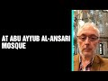

# Abu Ayyub al-Ansari Mosque (2021-11-03 14:12:42+00:00)

## Description

## Summary of [Abu Ayyub al-Ansari Mosque](https://www.youtube.com/watch?v=AcR0xZBxnW0)

*This is an AI generated summary. There may be inaccuracies. *

### [00:00:00](https://www.youtube.com/watch?v=AcR0xZBxnW0&t=0) - [00:00:00](https://www.youtube.com/watch?v=AcR0xZBxnW0&t=0)

The Abu Ayyub al-Ansari Mosque is dedicated to a senior companion of the Prophet Muhammad who helped him migrate from Mecca to Medina. The hadith about conquering Istanbul mentioned in this mosque is particularly inspiring.

**[00:00:00](https://www.youtube.com/watch?v=AcR0xZBxnW0&t=0)** This mosque is dedicated to a senior companion of the Prophet Muhammad, who helped Muhammad migrate from Mecca to Medina. The hadith about conquering Istanbul mentioned in this mosque is particularly inspiring.

## Full transcript with timestamps

[0:00:00](https://youtu.be/AcR0xZBxnW0?t=0) in this mosque a senior companion of the  
[0:00:03](https://youtu.be/AcR0xZBxnW0?t=3) prophet is buried abu ayab al-ansari  
[0:00:07](https://youtu.be/AcR0xZBxnW0?t=7) when the prophet upon him be peace  
[0:00:09](https://youtu.be/AcR0xZBxnW0?t=9) migrated from mecca to medina this  
[0:00:11](https://youtu.be/AcR0xZBxnW0?t=11) companion gave him a home and gave him  
[0:00:14](https://youtu.be/AcR0xZBxnW0?t=14) food and sustenance for several months  
[0:00:17](https://youtu.be/AcR0xZBxnW0?t=17) and there's a famous hadith about the  
[0:00:20](https://youtu.be/AcR0xZBxnW0?t=20) conquering of istanbul which this  
[0:00:23](https://youtu.be/AcR0xZBxnW0?t=23) inspired this companion and the armies  
[0:00:25](https://youtu.be/AcR0xZBxnW0?t=25) of islam to conquer this city and it  
[0:00:28](https://youtu.be/AcR0xZBxnW0?t=28) goes like this the prophet upon him be  
[0:00:31](https://youtu.be/AcR0xZBxnW0?t=31) peace  
[0:00:31](https://youtu.be/AcR0xZBxnW0?t=31) said truly you shall conquer  
[0:00:34](https://youtu.be/AcR0xZBxnW0?t=34) constantinople what a wonderful leader  
[0:00:37](https://youtu.be/AcR0xZBxnW0?t=37) will he be and what a wonderful army  
[0:00:40](https://youtu.be/AcR0xZBxnW0?t=40) will that army be  
[0:00:42](https://youtu.be/AcR0xZBxnW0?t=42) and that's from the mushaf of ibn  
[0:00:45](https://youtu.be/AcR0xZBxnW0?t=45) hanbal so this companion is buried here  
[0:00:48](https://youtu.be/AcR0xZBxnW0?t=48) in uh this mosque very senior companion  
[0:00:51](https://youtu.be/AcR0xZBxnW0?t=51) of the prophet muhammad upon him be  
[0:00:53](https://youtu.be/AcR0xZBxnW0?t=53) peace in  
[0:00:54](https://youtu.be/AcR0xZBxnW0?t=54) istanbul  
