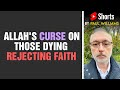

# Allah's curse on those dying rejecting Faith #shorts (2021-12-15)

## Description

You Can Support My Work on Patreon:
https://www.patreon.com/Bloggingtheology

My Paypal Link: 
https://www.paypal.com/paypalme/bloggingtheology?locale.x=en_GB

Follow me on Instagram:
https://www.instagram.com/bloggingtheology1

Follow me on TikTok:
https://www.tiktok.com/@bloggingtheology?lang=en

Follow me on Twitter:
https://twitter.com/freemonotheist

## Summary of [Allah's curse on those dying rejecting Faith #shorts](https://www.youtube.com/watch?v=4UK2TQsg0_w)

*This summary is AI generated - there may be inaccuracies. *

### [00:00:00](https://www.youtube.com/watch?v=4UK2TQsg0_w&t=0) - [00:00:00](https://www.youtube.com/watch?v=4UK2TQsg0_w&t=0)

 discusses the consequences of people who die rejecting Islam. All of them will be cursed by Allah, angels, and all of humanity. Their punishment will not be eased, and they will have no respite from it.

**[00:00:00](https://www.youtube.com/watch?v=4UK2TQsg0_w&t=0)* Discusses the consequences of people who die rejecting Islam. All of them will be cursed by Allah, angels, and all of humanity. Their punishment will not be eased, and they will have no respite from it.

## Full transcript with timestamps

[0:00:00](https://youtu.be/4UK2TQsg0_w?t=0) those who conceal the clear signs we  
[0:00:03](https://youtu.be/4UK2TQsg0_w?t=3) have sent down  
[0:00:04](https://youtu.be/4UK2TQsg0_w?t=4) and the guidance after we have made it  
[0:00:07](https://youtu.be/4UK2TQsg0_w?t=7) clear for the people in the book  
[0:00:09](https://youtu.be/4UK2TQsg0_w?t=9) on them shall be allah's curse and the  
[0:00:12](https://youtu.be/4UK2TQsg0_w?t=12) curse of those entitled to curse except  
[0:00:16](https://youtu.be/4UK2TQsg0_w?t=16) those who repent and make amends and  
[0:00:19](https://youtu.be/4UK2TQsg0_w?t=19) openly declare the truth to them i turn  
[0:00:23](https://youtu.be/4UK2TQsg0_w?t=23) for i am oft returning most merciful  
[0:00:28](https://youtu.be/4UK2TQsg0_w?t=28) those who reject faith and die rejecting  
[0:00:31](https://youtu.be/4UK2TQsg0_w?t=31) on them is allah's curse and the curse  
[0:00:34](https://youtu.be/4UK2TQsg0_w?t=34) of angels and of all mankind  
[0:00:38](https://youtu.be/4UK2TQsg0_w?t=38) they will abide therein their penalty  
[0:00:41](https://youtu.be/4UK2TQsg0_w?t=41) will not be lightened nor will respite  
[0:00:44](https://youtu.be/4UK2TQsg0_w?t=44) be their lot  
[0:00:46](https://youtu.be/4UK2TQsg0_w?t=46) and your god is one god there is no god  
[0:00:49](https://youtu.be/4UK2TQsg0_w?t=49) but he  
[0:00:50](https://youtu.be/4UK2TQsg0_w?t=50) most gracious  
[0:00:52](https://youtu.be/4UK2TQsg0_w?t=52) most merciful  
[0:00:54](https://youtu.be/4UK2TQsg0_w?t=54) surah 2 verses 159 onwards  
