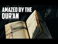

# Amazed by The Qur'an (2022-05-09 23:17:08+00:00)

## Description

You Can Support My Work on Patreon:
https://www.patreon.com/Bloggingtheology

My Paypal Link: 
https://www.paypal.com/paypalme/bloggingtheology?locale.x=en_GB

## Summary of [Amazed by The Qur'an](https://www.youtube.com/watch?v=FVRTmCbVJYE)

*This is an AI generated summary. There may be inaccuracies. *

### [00:00:00](https://www.youtube.com/watch?v=FVRTmCbVJYE&t=0) - [00:05:00](https://www.youtube.com/watch?v=FVRTmCbVJYE&t=300)

 "Amazed by The Qur'an" presents the author's renewed amazement at the Quran, a holy book written by the prophet Muhammad. points out that, despite being criticized by God himself, the prophet delivered the revelations in all honesty. This speaks to his nobility and beauty as a way of reproaching those who deny the resurrection and last day.

**[00:00:00](https://www.youtube.com/watch?v=FVRTmCbVJYE&t=0)** The Quran continues to surprise and amaze Muslims who have read it from cover to cover in English, as Professor Abdul Haleem points out in his translation. Chapter 80, which discusses the prophet's reaction to a blind man coming to learn from him, is particularly revealing.
* **[00:05:00](https://www.youtube.com/watch?v=FVRTmCbVJYE&t=300)** presents the author's renewed amazement at the Quran, a holy book written by the prophet Muhammad. points out that, despite being criticized by God himself, the prophet delivered the revelations in all honesty. This speaks to his nobility and beauty as a way of reproaching those who deny the resurrection and last day.

## Full transcript with timestamps

[0:00:03](https://youtu.be/FVRTmCbVJYE?t=3) The Quran continues to surprise me even though 
I've read it from cover to cover in English    
[0:00:08](https://youtu.be/FVRTmCbVJYE?t=8) at least, I just came across a couple 
of verses today I just wanted to share    
[0:00:12](https://youtu.be/FVRTmCbVJYE?t=12) uh with you which surprised me even though I've 
read them before and by the way I was reading    
[0:00:17](https://youtu.be/FVRTmCbVJYE?t=17) this book called classical Islamic theology it's 
a Cambridge companion it's an academic work I'm    
[0:00:23](https://youtu.be/FVRTmCbVJYE?t=23) reading it through um just to educate myself and 
the first chapter is called Quran and Hadith by    
[0:00:30](https://youtu.be/FVRTmCbVJYE?t=30) professor Abdul Haleem, he's a very distinguished 
professor at SOAS at the University of London    
[0:00:36](https://youtu.be/FVRTmCbVJYE?t=36) and he's a brilliant translator of the Quran 
and his celebrated translation of the Quran    
[0:00:42](https://youtu.be/FVRTmCbVJYE?t=42) into English this is it here the Quran a 
new translation by professor Abdul Haleem    
[0:00:47](https://youtu.be/FVRTmCbVJYE?t=47) published by Oxford university press which is 
the gold standard I'm told in academic courses    
[0:00:54](https://youtu.be/FVRTmCbVJYE?t=54) at universities on the Quran at least when 
people refer to the English of course anyway    
[0:00:59](https://youtu.be/FVRTmCbVJYE?t=59) the point of this is I was reading this chapter 
very familiar actually to be honest with its    
[0:01:04](https://youtu.be/FVRTmCbVJYE?t=64) themes but I want to just refresh myself again and 
then it says things which are beautifully put says    
[0:01:11](https://youtu.be/FVRTmCbVJYE?t=71) the Quran describes itself as a scripture which 
God sent down to his prophet and this expression    
[0:01:18](https://youtu.be/FVRTmCbVJYE?t=78) sent down in its various derivations is 
used in the Quran well over 200 times    
[0:01:24](https://youtu.be/FVRTmCbVJYE?t=84) in Arabic this locution conveys immediately and 
implicitly the principle that the origin of the    
[0:01:32](https://youtu.be/FVRTmCbVJYE?t=92) book is heavenly and that the and that 
Muhammad is no more than its receptacle    
[0:01:39](https://youtu.be/FVRTmCbVJYE?t=99) God is the one who speaks in the book Muhammad is 
addressed as o prophet o messenger do do do not do    
[0:01:50](https://youtu.be/FVRTmCbVJYE?t=110) they ask you say this last command 
appearing more than 300 times    
[0:01:57](https://youtu.be/FVRTmCbVJYE?t=117) sometimes the prophet is reproached and then it 
gives two verses uh 9 43 and 80 verses 1 to 11.    
[0:02:05](https://youtu.be/FVRTmCbVJYE?t=125) now I looked up these passages having written 
them before and I thought yeah I just looked    
[0:02:09](https://youtu.be/FVRTmCbVJYE?t=129) them up you know and I was just stunned again to 
read Surah 80 again I wanted to share it with you    
[0:02:17](https://youtu.be/FVRTmCbVJYE?t=137) because I thought it was very revealing not only 
about the Quran but also its relationship with the    
[0:02:23](https://youtu.be/FVRTmCbVJYE?t=143) prophet to the prophet himself and Abdul Haleem 
in his translation has a little paragraph before    
[0:02:31](https://youtu.be/FVRTmCbVJYE?t=151) his translation introducing the chapter very 
helpful concise to the point and he says    
[0:02:38](https://youtu.be/FVRTmCbVJYE?t=158) a Meccan Surah so is revealed in the first stage 
of the prophet's career rather than later on in    
[0:02:44](https://youtu.be/FVRTmCbVJYE?t=164) Medina while the prophet was speaking to some 
disbelieving notables hoping to convert them    
[0:02:51](https://youtu.be/FVRTmCbVJYE?t=171) a blind Muslim man came up to learn from 
him but in his eagerness to attract the    
[0:02:59](https://youtu.be/FVRTmCbVJYE?t=179) disbelievers to Islam the prophet frowned at him 
and that's the title in English of this chapter    
[0:03:06](https://youtu.be/FVRTmCbVJYE?t=186) he frowned this is chapter 80 of the Quran he 
frowned the prophet is then reproached and told    
[0:03:14](https://youtu.be/FVRTmCbVJYE?t=194) not to concern himself with the disbelievers the 
prophet himself is reproached by God in the Quran    
[0:03:22](https://youtu.be/FVRTmCbVJYE?t=202) in the second paragraph which I'll also read 
in a second there is a condemnation of man's    
[0:03:28](https://youtu.be/FVRTmCbVJYE?t=208) ingratitude this is the human race in general 
man becomes self-satisfied and forgets his    
[0:03:34](https://youtu.be/FVRTmCbVJYE?t=214) origin and his final return to God excuse 
me so I'm going to read um read this chapter    
[0:03:41](https://youtu.be/FVRTmCbVJYE?t=221) uh mainly for the first section where there's a 
lesson to that to the prophet here so it begins    
[0:03:48](https://youtu.be/FVRTmCbVJYE?t=228) in an English translation in the name of 
God the most compassionate most merciful he    
[0:03:56](https://youtu.be/FVRTmCbVJYE?t=236) frowned and turned his attention away simply 
because the blind man came to him interrupting    
[0:04:05](https://youtu.be/FVRTmCbVJYE?t=245) you never know oh prophet perhaps he 
may be purified or he may be mindful    
[0:04:12](https://youtu.be/FVRTmCbVJYE?t=252) benefiting from the reminder as for the one who is 
indifferent you gave him your undivided attention    
[0:04:21](https://youtu.be/FVRTmCbVJYE?t=261) even though you are not to blame if he would 
not be purified as for the one who came    
[0:04:28](https://youtu.be/FVRTmCbVJYE?t=268) to you eager to learn being in awe of God you 
were inattentive to him but no this revelation    
[0:04:38](https://youtu.be/FVRTmCbVJYE?t=278) is truly a reminder let's so let whoever 
wills be mindful of it it is written on pages    
[0:04:47](https://youtu.be/FVRTmCbVJYE?t=287) held in honor highly esteemed purified by the 
hands of angel scribes honorable and virtuous    
[0:04:59](https://youtu.be/FVRTmCbVJYE?t=299) this extraordinary passage this passage and 
there are others as I mentioned critical    
[0:05:03](https://youtu.be/FVRTmCbVJYE?t=303) of some things the prophet did proves that the 
prophet delivered the revelations in all honesty    
[0:05:11](https://youtu.be/FVRTmCbVJYE?t=311) even when his own self was uh being criticized 
it seems by God himself so that this speaks of    
[0:05:19](https://youtu.be/FVRTmCbVJYE?t=319) a very I think a very noble and beautiful way that 
God reproaches the prophet in a quiet gentle way I    
[0:05:26](https://youtu.be/FVRTmCbVJYE?t=326) think for being inattentive it seems and then in 
the second part of this surah surah 80 he frowned    
[0:05:34](https://youtu.be/FVRTmCbVJYE?t=334) we read a reminder to those people mankind who 
deny the resurrection and the last day and these    
[0:05:43](https://youtu.be/FVRTmCbVJYE?t=343) are very powerful powerful words condemned are 
disbelieving humans how ungrateful they are    
[0:05:51](https://youtu.be/FVRTmCbVJYE?t=351) to God from what substance did he create them 
he created them from a sperm drop and ordained    
[0:05:59](https://youtu.be/FVRTmCbVJYE?t=359) their development then he makes the way easy 
for them then causes them to die and be buried    
[0:06:07](https://youtu.be/FVRTmCbVJYE?t=367) then when he wills he will resurrect them but no 
they have failed to comply with what he ordered    
[0:06:14](https://youtu.be/FVRTmCbVJYE?t=374) let people then consider their food how we pour 
down rain in abundance and how meticulously    
[0:06:21](https://youtu.be/FVRTmCbVJYE?t=381) split the earth open for sprouts causing grains 
to grow in it as well as grapes and greens and    
[0:06:28](https://youtu.be/FVRTmCbVJYE?t=388) olives and palm trees and dense orchards and fruit 
and fodder all as a means of sustenance for you    
[0:06:36](https://youtu.be/FVRTmCbVJYE?t=396) and your animals then when the overwhelming 
the deafening blast is the the last day    
[0:06:45](https://youtu.be/FVRTmCbVJYE?t=405) comes to pass on that day every person will 
flee from their own siblings and even their    
[0:06:52](https://youtu.be/FVRTmCbVJYE?t=412) mother and father and even their spouse 
and children for then everyone will have    
[0:06:59](https://youtu.be/FVRTmCbVJYE?t=419) enough concern of their own on that day some 
faces will be bright laughing and rejoicing    
[0:07:08](https://youtu.be/FVRTmCbVJYE?t=428) while other faces will be dusty cast in gloom 
those are the disbelievers the wicked ones  
[0:07:18](https://youtu.be/FVRTmCbVJYE?t=438) so it's extraordinary uh chapters as I say 
uh it really brings home the sense of uh    
[0:07:24](https://youtu.be/FVRTmCbVJYE?t=444) how the prophet uh delivered the revelations that 
he received with complete honesty even when God    
[0:07:31](https://youtu.be/FVRTmCbVJYE?t=451) is addressing him and in a sense criticizing 
him and there's several passages like this in    
[0:07:37](https://youtu.be/FVRTmCbVJYE?t=457) the Quran what a remarkable book how honest it is 
and uh anyway I just wanted to share with you my    
[0:07:43](https://youtu.be/FVRTmCbVJYE?t=463) renewed amazement at the Quran when I 
read it again and again, till next time.  
