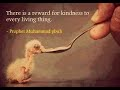

# An Amazing Hadith #shorts (2021-04-25 11:39:11+00:00)

## Description

I read from 'The Book of Hadith: Sayings of the Prophet Muhammad from the Mishkat Al Masabih' by Charles Le Gai Eaton, the grandfather of British Islam. 
https://www.amazon.co.uk/Book-Hadith-Sayings-Prophet-Muhammad/dp/1904510175/ref=sr_1_1?dchild=1&qid=1619350370&refinements=p_27%3ACharles+Le+Gai+Eaton&s=books&sr=1-1

## Full transcript with timestamps

[0:00:00](https://youtu.be/Pe85qKjBDjg?t=0) Here is an amazing hadith. Abu Hurayrah reported 
that Muhammad, peace be upon him, said "Forgiveness was granted to a    
[0:00:07](https://youtu.be/Pe85qKjBDjg?t=7) prostitute who came upon a dog panting and almost 
dead from thirst at the mouth of a well. She took    
[0:00:14](https://youtu.be/Pe85qKjBDjg?t=14) off her shoe tied it with her head-covering and 
drew some water for it. On that account she was    
[0:00:22](https://youtu.be/Pe85qKjBDjg?t=22) forgiven." He was asked if people received 
a reward for what they did for animals, and    
[0:00:28](https://youtu.be/Pe85qKjBDjg?t=28) he replied, "A reward is given in connection with 
every living creature." That's from a Bukhari hadith.   
