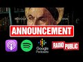

# An important Announcement by Paul Williams (2022-02-12 19:13:35+00:00)

## Description

Blogging Theory podcasts are now available on these four platforms:

Spotify: https://spoti.fi/3GHLIfL
Apple Podcasts: https://apple.co/35YR0H0
Google Podcasts: https://bit.ly/3uLuw6X
RadioPublic: https://radiopublic.com/blogging-theology-WYEqdr

Further platforms will be added soon...

## Summary of [An important Announcement by Paul Williams](https://www.youtube.com/watch?v=fNgzPfNtmO0)

*This is an AI generated summary. There may be inaccuracies. *

### [00:00:00](https://www.youtube.com/watch?v=fNgzPfNtmO0&t=0) - [00:00:00](https://www.youtube.com/watch?v=fNgzPfNtmO0&t=0)

Paul Williams has announced that blogging theology content is now available as podcasts. So far, 26 episodes have been uploaded, with hundreds more to come in the near future. These podcasts feature interviews with some of the world's greatest scholars from prestigious universities.

**[00:00:00](https://www.youtube.com/watch?v=fNgzPfNtmO0&t=0)** Paul Williams announced that blogging theology content is now available as podcasts featuring interviews with some of the world's greatest scholars from the universities of Oxford, Cambridge, Princeton and Yale. So far, 26 episodes have been uploaded and published hundreds more will be uploaded in the near future.

## Full transcript with timestamps

[0:00:00](https://youtu.be/fNgzPfNtmO0?t=0) i'm thrilled to announce that the very  
[0:00:02](https://youtu.be/fNgzPfNtmO0?t=2) best of blogging theology content is now  
[0:00:06](https://youtu.be/fNgzPfNtmO0?t=6) available as podcasts  
[0:00:08](https://youtu.be/fNgzPfNtmO0?t=8) featuring interviews with some of the  
[0:00:10](https://youtu.be/fNgzPfNtmO0?t=10) world's greatest scholars from the  
[0:00:12](https://youtu.be/fNgzPfNtmO0?t=12) universities of oxford cambridge  
[0:00:14](https://youtu.be/fNgzPfNtmO0?t=14) princeton and yale  
[0:00:17](https://youtu.be/fNgzPfNtmO0?t=17) listen to interviews with distinguished  
[0:00:19](https://youtu.be/fNgzPfNtmO0?t=19) scholars of islam and christianity such  
[0:00:22](https://youtu.be/fNgzPfNtmO0?t=22) as professor aliya tai of zaytuna  
[0:00:25](https://youtu.be/fNgzPfNtmO0?t=25) college  
[0:00:26](https://youtu.be/fNgzPfNtmO0?t=26) so far 26 episodes have been uploaded  
[0:00:30](https://youtu.be/fNgzPfNtmO0?t=30) and published hundreds more will be  
[0:00:32](https://youtu.be/fNgzPfNtmO0?t=32) uploaded in the near future god willing  
[0:00:36](https://youtu.be/fNgzPfNtmO0?t=36) blogging theology podcasts are now  
[0:00:38](https://youtu.be/fNgzPfNtmO0?t=38) available on these four platforms  
[0:00:42](https://youtu.be/fNgzPfNtmO0?t=42) spotify apple podcasts google podcasts  
[0:00:46](https://youtu.be/fNgzPfNtmO0?t=46) and radio public  
[0:00:48](https://youtu.be/fNgzPfNtmO0?t=48) further platforms will be added soon  
[0:00:51](https://youtu.be/fNgzPfNtmO0?t=51) stay tuned till next time  
