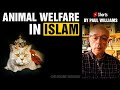

# Animal Welfare in Islam | #shorts By Paul Williams (2021-09-19 19:51:08+00:00)

## Description

Animal Welfare in Islam | #shorts By Paul Williams

## Full transcript with timestamps

[0:00:01](https://youtu.be/EPpxuXxETjM?t=1) a woman was punished because of a cat  
[0:00:04](https://youtu.be/EPpxuXxETjM?t=4) which she kept locked up until it died  
[0:00:07](https://youtu.be/EPpxuXxETjM?t=7) and she entered hell because of it  
[0:00:10](https://youtu.be/EPpxuXxETjM?t=10) this is because she did not feed it or  
[0:00:13](https://youtu.be/EPpxuXxETjM?t=13) give it water when she kept it locked up  
[0:00:16](https://youtu.be/EPpxuXxETjM?t=16) neither did she let it eat from the  
[0:00:18](https://youtu.be/EPpxuXxETjM?t=18) vermin of the earth  
[0:00:21](https://youtu.be/EPpxuXxETjM?t=21) hadith from sahih bukhari  
[0:00:23](https://youtu.be/EPpxuXxETjM?t=23) 3482  
