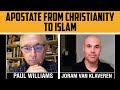

# Apostate from Christianity to Islam in times of secularisation and terror (2021-09-20 14:38:42+00:00)

## Description

Joram van Klaveren talks about his extraordinary journey from Christianity to Islam.
Read his book: Apostate: From Christianity to Islam in times of secularisation and terror
https://www.amazon.co.uk/Apostate-Christianity-Islam-secularisation-terror/dp/9079294322
Visit: https://www.islamexperience.com/

## Full transcript with timestamps

[0:00:01](https://youtu.be/zXUx5wQ6_ag?t=1) Hello and welcome to Blogging Theology and this 
evening I have a very special guest, a man who has    
[0:00:09](https://youtu.be/zXUx5wQ6_ag?t=9) shock waves i think uh through many circles uh in 
the west both for not so good reasons in the past    
[0:00:16](https://youtu.be/zXUx5wQ6_ag?t=16) and now for very good reasons uh in recent 
years and um uh joram you are most welcome    
[0:00:22](https://youtu.be/zXUx5wQ6_ag?t=22) looking theology well thank you very much 
and so it's a great honor for me to be here    
[0:00:28](https://youtu.be/zXUx5wQ6_ag?t=28) well um just to give uh viewers a brief uh 
summary of your uh biography um jerome van    
[0:00:36](https://youtu.be/zXUx5wQ6_ag?t=36) cleveren um he's a dutch uh person uh also known 
as the crown prince of wilders meaning gertville    
[0:00:44](https://youtu.be/zXUx5wQ6_ag?t=44) is the the leader of the political leader of uh 
the party in holland party for freedom um where    
[0:00:52](https://youtu.be/zXUx5wQ6_ag?t=52) you became a member of parliament yourself in the 
dutch parliament and you uh submitted a number of    
[0:00:58](https://youtu.be/zXUx5wQ6_ag?t=58) bills in the parliament related to islam um 
such as those calling for the closure of mosques    
[0:01:05](https://youtu.be/zXUx5wQ6_ag?t=65) for removing the cri on from parliament 
itself where there was a copy    
[0:01:11](https://youtu.be/zXUx5wQ6_ag?t=71) and for banning islam from the netherlands as 
much as possible basically to remove islam and    
[0:01:17](https://youtu.be/zXUx5wQ6_ag?t=77) presumably muslims from uh the netherlands and 
in order to reinforce these thoughts and opinions    
[0:01:24](https://youtu.be/zXUx5wQ6_ag?t=84) that you had as a christian which you were then 
you began to write a book critical of islam and    
[0:01:31](https://youtu.be/zXUx5wQ6_ag?t=91) during the process of writing i understand 
you found an increasing number of matters    
[0:01:38](https://youtu.be/zXUx5wQ6_ag?t=98) that challenged your views on islam um and this 
is the the book you ultimately wrote called    
[0:01:45](https://youtu.be/zXUx5wQ6_ag?t=105) apostate we'll come back to that um and this gives 
your your personal and theological journey um    
[0:01:52](https://youtu.be/zXUx5wQ6_ag?t=112) that you undertook away from the position 
of uh frank hostility towards islam towards    
[0:01:59](https://youtu.be/zXUx5wQ6_ag?t=119) someone who actually embraced islam uh several 
years ago so a most extraordinary story um    
[0:02:05](https://youtu.be/zXUx5wQ6_ag?t=125) so that's why many people will be very interested 
to see uh what you have to say about your life    
[0:02:10](https://youtu.be/zXUx5wQ6_ag?t=130) and uh and perhaps a couple of questions uh 
which occurred to me would be of great interest    
[0:02:15](https://youtu.be/zXUx5wQ6_ag?t=135) could you perhaps just tell us initially a bit 
about your christian background and beliefs    
[0:02:20](https://youtu.be/zXUx5wQ6_ag?t=140) growing up in the netherlands yeah of course 
uh well i was brought up in a in a relatively    
[0:02:28](https://youtu.be/zXUx5wQ6_ag?t=148) strict protestant denomination the reformed 
church of the netherlands and um well it was uh    
[0:02:39](https://youtu.be/zXUx5wQ6_ag?t=159) a normal family father mother have an elder a 
older brother uh sister younger brother and we    
[0:02:47](https://youtu.be/zXUx5wQ6_ag?t=167) had a cat um yeah we went we went to church uh on 
sundays of course we all got christian names uh    
[0:02:57](https://youtu.be/zXUx5wQ6_ag?t=177) my father read from the bible before dinner after 
dinner uh we prayed so we did all the the things    
[0:03:04](https://youtu.be/zXUx5wQ6_ag?t=184) that uh normal christian practicing christians 
do because there's of course difference between    
[0:03:09](https://youtu.be/zXUx5wQ6_ag?t=189) cultural christians and practicing christians uh 
but also in the family my uh my grandfather was    
[0:03:16](https://youtu.be/zXUx5wQ6_ag?t=196) uh so to say uh an assistant of um of the of the 
ministers in in church been that for a very long    
[0:03:26](https://youtu.be/zXUx5wQ6_ag?t=206) time so it was in in our family the the tradition 
uh the religious tradition was pretty strong um    
[0:03:35](https://youtu.be/zXUx5wQ6_ag?t=215) so that's that's that's the way i was brought 
up in a religious uh sense you mentioned your    
[0:03:41](https://youtu.be/zXUx5wQ6_ag?t=221) church background were you a calvinist then in 
terms of your theology was that right so john    
[0:03:47](https://youtu.be/zXUx5wQ6_ag?t=227) calvin of course uh was a um one of the great 
leaders of the uh the reformation in europe    
[0:03:52](https://youtu.be/zXUx5wQ6_ag?t=232) uh and just as a side note uh he was a key 
figure who who got a man called servitus    
[0:03:58](https://youtu.be/zXUx5wQ6_ag?t=238) michael services burned at the stake in geneva 
for denying the trinity that was his great crime    
[0:04:06](https://youtu.be/zXUx5wQ6_ag?t=246) and the man unfortunately was horribly killed and 
executed for that crime of denying the trinity but    
[0:04:11](https://youtu.be/zXUx5wQ6_ag?t=251) anyway i'm not saying you in any way associate 
with such outraged terrorist acts in the past um    
[0:04:17](https://youtu.be/zXUx5wQ6_ag?t=257) so moving up moving on you you went to university 
i understand where you studied uh religion    
[0:04:23](https://youtu.be/zXUx5wQ6_ag?t=263) um and that's why you quite a lot of knowledge 
but what was it what did you discover about    
[0:04:27](https://youtu.be/zXUx5wQ6_ag?t=267) jesus then that led you to change your mind 
about him particularly about him being god and    
[0:04:32](https://youtu.be/zXUx5wQ6_ag?t=272) and someone who had to die for your sins 
for you to be forgiven because i understand    
[0:04:36](https://youtu.be/zXUx5wQ6_ag?t=276) uh coming back to this book by the way um 
apostates which is subtitled from christianity    
[0:04:42](https://youtu.be/zXUx5wQ6_ag?t=282) to islam in times of secularization and terror 
and in this book you you go through many many    
[0:04:49](https://youtu.be/zXUx5wQ6_ag?t=289) uh controversial issues that are often 
challenged challenging to muslims in the west    
[0:04:54](https://youtu.be/zXUx5wQ6_ag?t=294) but also the reasons why you left christianity the 
concept of god and christianity jesus salvation    
[0:05:01](https://youtu.be/zXUx5wQ6_ag?t=301) and all that so what why did you come to change 
your views about jesus as a calvinist christian    
[0:05:07](https://youtu.be/zXUx5wQ6_ag?t=307) well um as a youngster i think that was about 15 
or 16 years old then of course you start thinking    
[0:05:15](https://youtu.be/zXUx5wQ6_ag?t=315) about uh the the tradition that you are brought 
up in it's a normal process a lot of youngsters    
[0:05:23](https://youtu.be/zXUx5wQ6_ag?t=323) have something similar um but one of the things 
i i always struggled with was for example the    
[0:05:30](https://youtu.be/zXUx5wQ6_ag?t=330) trinity of god in christianity because we we of 
course prayed to god the father that's how we call    
[0:05:38](https://youtu.be/zXUx5wQ6_ag?t=338) god in in the tradition i was brought up him but 
of course i had a lot of christian friends and    
[0:05:44](https://youtu.be/zXUx5wQ6_ag?t=344) some of them went to other churches and especially 
uh one friend of mine went to an evangelical    
[0:05:50](https://youtu.be/zXUx5wQ6_ag?t=350) church and they prayed to jesus so when i was 
young i thought well how is it possible that    
[0:05:59](https://youtu.be/zXUx5wQ6_ag?t=359) some christians pray to god the father 
other pray to jesus and of course you    
[0:06:05](https://youtu.be/zXUx5wQ6_ag?t=365) have pentecostal churches they almost pray to 
the holy church or they invite the holy church    
[0:06:11](https://youtu.be/zXUx5wQ6_ag?t=371) during the celebration of the holy 
holy spirit the holy spirit yeah    
[0:06:18](https://youtu.be/zXUx5wQ6_ag?t=378) well that was kind of confusing of course 
especially when you were younger and you're not    
[0:06:23](https://youtu.be/zXUx5wQ6_ag?t=383) uh you didn't read so much about the history of 
christianity you didn't get concept of god of    
[0:06:28](https://youtu.be/zXUx5wQ6_ag?t=388) course in in an academic sense in an academic 
way so that's that's the the first first thing    
[0:06:36](https://youtu.be/zXUx5wQ6_ag?t=396) that was uh bothering me and then of course there 
is original sin and um and and the the idea that    
[0:06:44](https://youtu.be/zXUx5wQ6_ag?t=404) someone had to die for the sins of mankind 
and that was the only way to salvation    
[0:06:50](https://youtu.be/zXUx5wQ6_ag?t=410) in in russia and when i was younger i once asked 
the minister well how about abraham for example or    
[0:06:59](https://youtu.be/zXUx5wQ6_ag?t=419) moses or noah because they couldn't believe in 
jesus christ because there wasn't jesus christ    
[0:07:06](https://youtu.be/zXUx5wQ6_ag?t=426) yet because he wasn't born so i asked him are 
they in hell no no of course not you cannot ask    
[0:07:14](https://youtu.be/zXUx5wQ6_ag?t=434) such questions it's ridiculous of course noah and 
abraham or moses are not in hell and he said well    
[0:07:20](https://youtu.be/zXUx5wQ6_ag?t=440) how is it possible that they are in heaven then 
and we have to believe in jesus christ is the only    
[0:07:24](https://youtu.be/zXUx5wQ6_ag?t=444) way to salvation if they also got into paradise or 
in into heaven without believing in jesus christ    
[0:07:33](https://youtu.be/zXUx5wQ6_ag?t=453) so it was something that was bothering me 
as as a youngster again um and when i was uh    
[0:07:40](https://youtu.be/zXUx5wQ6_ag?t=460) getting a little bit older of course i 
was like i said a believing christian    
[0:07:45](https://youtu.be/zXUx5wQ6_ag?t=465) and i practiced christianity in a way most of the 
christians in the denomination i was brought up in    
[0:07:50](https://youtu.be/zXUx5wQ6_ag?t=470) do uh but uh i the things i was i was worried 
about i i left it and i thought well okay    
[0:07:58](https://youtu.be/zXUx5wQ6_ag?t=478) i am a christian i just don't get the whole 
picture and a catholic priest i once talked to    
[0:08:05](https://youtu.be/zXUx5wQ6_ag?t=485) said to me well in the end the trinity is a 
mystery and i thought well okay then that's    
[0:08:10](https://youtu.be/zXUx5wQ6_ag?t=490) the final answer because i don't get it and and 
the whole idea of a mystery is that you do not    
[0:08:16](https://youtu.be/zXUx5wQ6_ag?t=496) get it so i think that's it and uh that that's how 
uh the the first when i when i look back at my my    
[0:08:23](https://youtu.be/zXUx5wQ6_ag?t=503) personal process there was those days were 
the first days that i started doubting    
[0:08:29](https://youtu.be/zXUx5wQ6_ag?t=509) uh the fundamentals of christianity and especially 
in the dinosaurs was brought up in and and later    
[0:08:36](https://youtu.be/zXUx5wQ6_ag?t=516) on of course i uh well the first day i uh went to 
college and like you said i started comparative    
[0:08:43](https://youtu.be/zXUx5wQ6_ag?t=523) religion at the free university in amsterdam 
but the first day i started started uh going to    
[0:08:49](https://youtu.be/zXUx5wQ6_ag?t=529) college was september 11 2001. so you started 
college on the very day that the twins were    
[0:08:56](https://youtu.be/zXUx5wQ6_ag?t=536) being attacked that's absolutely extraordinary 
yeah and of course uh i already had kind of a    
[0:09:04](https://youtu.be/zXUx5wQ6_ag?t=544) negative image of islam because of the tradition 
and it's not like the the ministers told us well    
[0:09:10](https://youtu.be/zXUx5wQ6_ag?t=550) hate muslims or dislike islam or something but i 
was very much interested in in religion in general    
[0:09:17](https://youtu.be/zXUx5wQ6_ag?t=557) and especially my own tradition christianity so 
i started reading about uh what what did the the    
[0:09:23](https://youtu.be/zXUx5wQ6_ag?t=563) great names taught us and what did they say and 
what they wrote about other traditions especially    
[0:09:30](https://youtu.be/zXUx5wQ6_ag?t=570) islam because there was kind of a competition of 
course when you look at the the east europe and    
[0:09:36](https://youtu.be/zXUx5wQ6_ag?t=576) then i i read a lot of books for example martin 
luther and he wasn't too fond of muslims and islam    
[0:09:43](https://youtu.be/zXUx5wQ6_ag?t=583) he talked about the turks and he meant the 
muslims and it was all negative so uh the the    
[0:09:50](https://youtu.be/zXUx5wQ6_ag?t=590) the way i started uh studying was 
already in a kind of a negative way  
[0:09:57](https://youtu.be/zXUx5wQ6_ag?t=597) and then of course 9 11 happened and it confirmed 
the negative ideas i already had and then of    
[0:10:04](https://youtu.be/zXUx5wQ6_ag?t=604) course the netherlands was this famous uh 
filmmaker tseov theo van gogh and he was    
[0:10:10](https://youtu.be/zXUx5wQ6_ag?t=610) near my old house in amsterdam so i thought well    
[0:10:14](https://youtu.be/zXUx5wQ6_ag?t=614) those and the guy who did that called 
himself a jihadi so i thought okay  
[0:10:20](https://youtu.be/zXUx5wQ6_ag?t=620) they're they really are crazy and i have to 
protect the netherlands so when i finished    
[0:10:26](https://youtu.be/zXUx5wQ6_ag?t=626) university i thought well what can i do and 
i start teaching but in the end i thought    
[0:10:31](https://youtu.be/zXUx5wQ6_ag?t=631) well that's not enough i have to do something 
more to protect uh our fatherland so to say    
[0:10:38](https://youtu.be/zXUx5wQ6_ag?t=638) and and perhaps europe or the west and i thought 
what can i do and of course the the thing you    
[0:10:43](https://youtu.be/zXUx5wQ6_ag?t=643) can do when you want to change something in in 
the most effective ways try to change the law    
[0:10:50](https://youtu.be/zXUx5wQ6_ag?t=650) and then i thought well i have to do that and 
then i have to go into politics of course and    
[0:10:54](https://youtu.be/zXUx5wQ6_ag?t=654) the most extreme anti-islamic party was of 
course the freedom party of clear dwellers    
[0:11:00](https://youtu.be/zXUx5wQ6_ag?t=660) and well a part of the family wasn't too happy 
about that because they said well he's an atheist    
[0:11:08](https://youtu.be/zXUx5wQ6_ag?t=668) why would you go work for an atheist he has a 
secular agenda he's very liberal on certain topics    
[0:11:14](https://youtu.be/zXUx5wQ6_ag?t=674) yeah but i said well that that can be 
true but in the end the biggest uh threat    
[0:11:21](https://youtu.be/zXUx5wQ6_ag?t=681) to our country is islam so i don't care about the 
other points he's the most anti-islamic figure in    
[0:11:28](https://youtu.be/zXUx5wQ6_ag?t=688) the dutch politics so i will join his party and 
that's what i did so and you became incredibly    
[0:11:36](https://youtu.be/zXUx5wQ6_ag?t=696) successful in your endeavors you became 
not only to join the party you became an mp    
[0:11:41](https://youtu.be/zXUx5wQ6_ag?t=701) and you became a senior figure in that party um 
but what kind of legal changes that you mentioned    
[0:11:48](https://youtu.be/zXUx5wQ6_ag?t=708) uh did you try and bring about then in 
holland what was your agenda legally    
[0:11:53](https://youtu.be/zXUx5wQ6_ag?t=713) well we tried to ban islam altogether from the 
netherlands and freedom party because a lot of    
[0:11:59](https://youtu.be/zXUx5wQ6_ag?t=719) people say well i've got to stop you there sorry 
freedom party wants ban religion it doesn't make    
[0:12:05](https://youtu.be/zXUx5wQ6_ag?t=725) any sense how can you be for freedom and liberal 
values and then ban religion sorry it just struck    
[0:12:12](https://youtu.be/zXUx5wQ6_ag?t=732) me is completely complicated what you just said 
yeah that's true uh but in those days and that's    
[0:12:18](https://youtu.be/zXUx5wQ6_ag?t=738) the the thing that the people who are still in 
the party still believe they said well freedom    
[0:12:24](https://youtu.be/zXUx5wQ6_ag?t=744) is everything but islam so islam is the the 
only threat because a lot of people think    
[0:12:30](https://youtu.be/zXUx5wQ6_ag?t=750) it's a nationalistic party or a racist party 
but that and perhaps there are some aspects    
[0:12:36](https://youtu.be/zXUx5wQ6_ag?t=756) that are racist or especially nationalistic 
or national orientated but um the whole    
[0:12:44](https://youtu.be/zXUx5wQ6_ag?t=764) idea of the freedom party it was founded 
only to fight islam all that many  
[0:12:54](https://youtu.be/zXUx5wQ6_ag?t=774) okay he said well it was in 2004 he started 
the party because uh turkey was about to uh    
[0:13:01](https://youtu.be/zXUx5wQ6_ag?t=781) start negotiating for eu membership and he was the 
other party the liberal party the the party it's    
[0:13:08](https://youtu.be/zXUx5wQ6_ag?t=788) the biggest party in the netherlands right now the 
same as the prime minister um and he said well uh    
[0:13:14](https://youtu.be/zXUx5wQ6_ag?t=794) this party of mine the the pvd the liberal party 
is um saying that they want to negotiate and he    
[0:13:22](https://youtu.be/zXUx5wQ6_ag?t=802) said well we cannot negotiate with turkey because 
it's an islamic country and islam is no part of    
[0:13:28](https://youtu.be/zXUx5wQ6_ag?t=808) the european history and it should never be any 
part of the europe of the future so he said well    
[0:13:34](https://youtu.be/zXUx5wQ6_ag?t=814) we have to do something about it but of course in 
the party itself there were was not enough support    
[0:13:40](https://youtu.be/zXUx5wQ6_ag?t=820) for him so he said well okay then i'll start my 
own party and that's what he did and one of the    
[0:13:45](https://youtu.be/zXUx5wQ6_ag?t=825) famous figures also in the united states was a 
member of parliament as well in the netherlands    
[0:13:52](https://youtu.be/zXUx5wQ6_ag?t=832) oh yeah yeah and she was a friend of her 
deals back back in those days so they they    
[0:14:00](https://youtu.be/zXUx5wQ6_ag?t=840) empowered each other so to say wow and and uh yeah 
again like you said it's kind of a strange concept    
[0:14:07](https://youtu.be/zXUx5wQ6_ag?t=847) if you say we are the party for freedom and at the 
same time i want to take away a lot of freedoms    
[0:14:12](https://youtu.be/zXUx5wQ6_ag?t=852) from uh it's a practice my faith in peace in a 
in a in a mature country that is extraordinary    
[0:14:19](https://youtu.be/zXUx5wQ6_ag?t=859) um so can you explain why in your mind would 
happen okay you ban islam in netherlands    
[0:14:26](https://youtu.be/zXUx5wQ6_ag?t=866) would you then deport you know i'm sorry 
to go on about this but it just reminds    
[0:14:31](https://youtu.be/zXUx5wQ6_ag?t=871) me of certain events that happened in central 
europe just 50 years before that in germany in    
[0:14:36](https://youtu.be/zXUx5wQ6_ag?t=876) holland and where a group another group of another 
religiously identified group who were not wanted    
[0:14:42](https://youtu.be/zXUx5wQ6_ag?t=882) were rounded up and things happened to them what 
an er did gerville does imagine what happened to    
[0:14:48](https://youtu.be/zXUx5wQ6_ag?t=888) all these muslims would they be rounded up and put 
in concentration camps as well i mean seriously    
[0:14:52](https://youtu.be/zXUx5wQ6_ag?t=892) what was the what would have happened no he didn't 
say he wanted to uh to put people in concentration    
[0:14:59](https://youtu.be/zXUx5wQ6_ag?t=899) camps and he he just said i don't want any new 
muslims in the netherlands that was step one and    
[0:15:07](https://youtu.be/zXUx5wQ6_ag?t=907) he said we have to um make sure that re migration 
as they called in in international go back to    
[0:15:15](https://youtu.be/zXUx5wQ6_ag?t=915) their own countries they're the concept of uh 
going back and that was something he wanted to    
[0:15:21](https://youtu.be/zXUx5wQ6_ag?t=921) pay for so he said well i make it legal so people 
can go back and at the same time nobody is allowed    
[0:15:27](https://youtu.be/zXUx5wQ6_ag?t=927) to come in from any islamic countries and there 
was a point of discussion in the party because    
[0:15:32](https://youtu.be/zXUx5wQ6_ag?t=932) uh for example in indonesia or other islamic 
countries there are also christians so some    
[0:15:39](https://youtu.be/zXUx5wQ6_ag?t=939) people in the party said well what happens 
to for example christian refugees from    
[0:15:44](https://youtu.be/zXUx5wQ6_ag?t=944) certain countries uh or afghanistan or iraq 
or whatever or iran i said well they cannot    
[0:15:50](https://youtu.be/zXUx5wQ6_ag?t=950) come in either so nobody from any islamic country 
was allowed to enter the netherlands for asylum  
[0:15:58](https://youtu.be/zXUx5wQ6_ag?t=958) a pretty strong point yeah it's a policy picked 
up perhaps by donald trump some years later    
[0:16:06](https://youtu.be/zXUx5wQ6_ag?t=966) that was challenged of course perhaps um    
[0:16:10](https://youtu.be/zXUx5wQ6_ag?t=970) concepts yeah but just an interesting point here 
is a mistake i've often made in the past i think    
[0:16:17](https://youtu.be/zXUx5wQ6_ag?t=977) correct me if i'm wrong gert vildes is not a 
fascist he's not um a far-right racist um i think    
[0:16:27](https://youtu.be/zXUx5wQ6_ag?t=987) what you seem to be saying he's like a 
fundamentalist liberal like a a liberal    
[0:16:31](https://youtu.be/zXUx5wQ6_ag?t=991) on steroids a liberal who who is just hardcore 
so hardcore that he will stamp out anything    
[0:16:38](https://youtu.be/zXUx5wQ6_ag?t=998) that doesn't own understanding of liberty is 
that right is kind of an absolutist liberalism    
[0:16:44](https://youtu.be/zXUx5wQ6_ag?t=1004) what is he what kind of physical creature is he 
or was he it's kind of a strange story because    
[0:16:52](https://youtu.be/zXUx5wQ6_ag?t=1012) when the party started uh it was still they had 
the idea there were two other uh more ideological    
[0:17:00](https://youtu.be/zXUx5wQ6_ag?t=1020) figures in the party they later on left but they 
wanted to make they want to establish some kind    
[0:17:06](https://youtu.be/zXUx5wQ6_ag?t=1026) of an republican party in the united states in the 
netherlands but the old republican party so a very  
[0:17:15](https://youtu.be/zXUx5wQ6_ag?t=1035) low fighting crime et cetera et cetera the normal 
conservative or right-wing policy that a lot of uh    
[0:17:24](https://youtu.be/zXUx5wQ6_ag?t=1044) other parties in all over the 
world have but uh in uh in about    
[0:17:32](https://youtu.be/zXUx5wQ6_ag?t=1052) i think five or six years after they started 
the party they said well we have nine seats    
[0:17:36](https://youtu.be/zXUx5wQ6_ag?t=1056) in parliament and if you want to grow we have to 
change something and then there was another figure    
[0:17:41](https://youtu.be/zXUx5wQ6_ag?t=1061) in the party you said well what we have to do we 
have to start being left on social issues like    
[0:17:48](https://youtu.be/zXUx5wQ6_ag?t=1068) hurting stuff like that and called the liberal 
agenda when it comes to abortion and homosexuality    
[0:17:55](https://youtu.be/zXUx5wQ6_ag?t=1075) and stuff yeah yeah the things that in in 
the netherlands are generally accepted yeah    
[0:18:00](https://youtu.be/zXUx5wQ6_ag?t=1080) and he said but we have to stay very 
right-wing on topics like immigration    
[0:18:05](https://youtu.be/zXUx5wQ6_ag?t=1085) or uh fighting and stuff like that so that's 
what they did they made a combination between    
[0:18:11](https://youtu.be/zXUx5wQ6_ag?t=1091) left and right wing interesting so the party 
started changing uh you know so here will be    
[0:18:19](https://youtu.be/zXUx5wQ6_ag?t=1099) what is he is he is he very rightly of course 
he's a right person when it comes to islam    
[0:18:26](https://youtu.be/zXUx5wQ6_ag?t=1106) but when it comes to uh certain social 
issues in the netherlands he's pretty left    
[0:18:30](https://youtu.be/zXUx5wQ6_ag?t=1110) ready wow so it's it's like like a hybrid concept 
it's interesting although that's really helpful to    
[0:18:38](https://youtu.be/zXUx5wQ6_ag?t=1118) clarify i didn't realize that was the evolution of 
his beliefs in response to the political realities    
[0:18:43](https://youtu.be/zXUx5wQ6_ag?t=1123) then um just moving on so you you entered uh 
parliament you tried to promote these laws i don't    
[0:18:50](https://youtu.be/zXUx5wQ6_ag?t=1130) think any of the laws got passed did they they 
never actually became the law in holland no no no    
[0:18:56](https://youtu.be/zXUx5wQ6_ag?t=1136) thank god yeah no they they didn't uh 
they didn't get uh get enough uh support    
[0:19:03](https://youtu.be/zXUx5wQ6_ag?t=1143) okay well that's uh that's some good news um 
so um now later on then just fast forwarding    
[0:19:09](https://youtu.be/zXUx5wQ6_ag?t=1149) a little bit um and you you decided to write 
a book and this might have been after your    
[0:19:14](https://youtu.be/zXUx5wQ6_ag?t=1154) um career in parliament uh came to an end and 
you then decided to i think write a book uh    
[0:19:20](https://youtu.be/zXUx5wQ6_ag?t=1160) basically putting distilling all your fierce 
critical ideas about islam and muhammad into a    
[0:19:26](https://youtu.be/zXUx5wQ6_ag?t=1166) written book um for whatever use you're going to 
make of that and then what happened then because    
[0:19:32](https://youtu.be/zXUx5wQ6_ag?t=1172) your plan didn't go quite to plan did it something 
when something happened and uh welcome to the book    
[0:19:40](https://youtu.be/zXUx5wQ6_ag?t=1180) we got this book which is not the 
book you wrote is it i don't think    
[0:19:44](https://youtu.be/zXUx5wQ6_ag?t=1184) well a part of it is still in the book but uh well 
when i started writing i was still in parliament    
[0:19:51](https://youtu.be/zXUx5wQ6_ag?t=1191) i was i left the freedom party because 
of an issue about moroccan people    
[0:19:56](https://youtu.be/zXUx5wQ6_ag?t=1196) uh because like like we just talked about he is 
very anti-islam there's no nothing new but in    
[0:20:05](https://youtu.be/zXUx5wQ6_ag?t=1205) at a certain moment he started changing 
policies and one of the things he    
[0:20:10](https://youtu.be/zXUx5wQ6_ag?t=1210) was started changing was that he only 
was talking about moroccan people    
[0:20:15](https://youtu.be/zXUx5wQ6_ag?t=1215) and uh one thing he said during an election rally 
was that he said well we have to make sure that    
[0:20:21](https://youtu.be/zXUx5wQ6_ag?t=1221) there are less moroccans in the netherlands and he 
uh asked a crowd it was during a rally and asked    
[0:20:27](https://youtu.be/zXUx5wQ6_ag?t=1227) about do you want more or less less moroccans in 
the netherlands and everybody's in was there in    
[0:20:33](https://youtu.be/zXUx5wQ6_ag?t=1233) the rally started screaming less less less and 
he said well i'll make sure that will happen    
[0:20:39](https://youtu.be/zXUx5wQ6_ag?t=1239) so that was like you said about the 30s in europe 
that was first the first time that i even me got a    
[0:20:48](https://youtu.be/zXUx5wQ6_ag?t=1248) feeling of this is kind of crazy now he crossed 
the line in targeting a pacific it's an ethnic    
[0:20:54](https://youtu.be/zXUx5wQ6_ag?t=1254) group now not just a faith but a particular group 
of people yeah but because before i always in my    
[0:21:01](https://youtu.be/zXUx5wQ6_ag?t=1261) head of course i didn't like islam but it was a 
concept and uh yeah of course you cannot er yeah    
[0:21:09](https://youtu.be/zXUx5wQ6_ag?t=1269) but for most of the people there was okay there's 
the concept we don't like islam we want islam out    
[0:21:15](https://youtu.be/zXUx5wQ6_ag?t=1275) and everything that has to do with islam has to go 
as well but it wasn't like i hated moroccan people    
[0:21:23](https://youtu.be/zXUx5wQ6_ag?t=1283) to hate moroccan people as a matter of fact there 
were even people with for example turkish and    
[0:21:28](https://youtu.be/zXUx5wQ6_ag?t=1288) moroccan background working for the freedom party 
as well of course they were very secular atheists    
[0:21:34](https://youtu.be/zXUx5wQ6_ag?t=1294) but so i thought of myself it's kind of strange 
like like a betrayal almost of those people yeah    
[0:21:40](https://youtu.be/zXUx5wQ6_ag?t=1300) so i said well and i started i got into a like 
a like a like a discussion with uh with cleared    
[0:21:46](https://youtu.be/zXUx5wQ6_ag?t=1306) builders and in the end i said well then i'll have 
to i'll leave the party and that's what i did but    
[0:21:52](https://youtu.be/zXUx5wQ6_ag?t=1312) i still didn't like islam and i still went to 
a fund of muslims because of islam of course    
[0:21:58](https://youtu.be/zXUx5wQ6_ag?t=1318) so i thought to myself well i finally have the 
time and uh the space in the political sense    
[0:22:05](https://youtu.be/zXUx5wQ6_ag?t=1325) to write uh to to fulfill a long-held 
desire and i was writing an anti-islam book    
[0:22:10](https://youtu.be/zXUx5wQ6_ag?t=1330) so that i could give like a theoretical 
grounding for all the things i set    
[0:22:15](https://youtu.be/zXUx5wQ6_ag?t=1335) in parliament and why i think that islam was a 
threat to europe and why the prophet peace and    
[0:22:20](https://youtu.be/zXUx5wQ6_ag?t=1340) blessings be upon me was a threat in my eyes 
back then for the whole world and that's what    
[0:22:26](https://youtu.be/zXUx5wQ6_ag?t=1346) i did but because you are in parliament of course 
you don't have too much time to write so in 2017    
[0:22:31](https://youtu.be/zXUx5wQ6_ag?t=1351) i left parliament and then i had a little bit more 
time and i started writing and writing and reading    
[0:22:39](https://youtu.be/zXUx5wQ6_ag?t=1359) and writing and but at a certain moment because 
i started um of course like i said with a very    
[0:22:44](https://youtu.be/zXUx5wQ6_ag?t=1364) negative uh starting point and starting point 
was very negative but i was reading so much    
[0:22:52](https://youtu.be/zXUx5wQ6_ag?t=1372) uh there was um uh almost at odds with the 
things i thought i knew uh that that i got    
[0:23:00](https://youtu.be/zXUx5wQ6_ag?t=1380) into like like an eternal discussion with myself 
someone well if i want to write an honest book    
[0:23:07](https://youtu.be/zXUx5wQ6_ag?t=1387) i have to put the information that i found and i 
wasn't too negative when it came to islam in the    
[0:23:13](https://youtu.be/zXUx5wQ6_ag?t=1393) book as well but of course that's that's not what 
i want i want i want to write an anti-islam book    
[0:23:18](https://youtu.be/zXUx5wQ6_ag?t=1398) so what i did was i was started writing to several 
authorities on the subject of islam who did you    
[0:23:27](https://youtu.be/zXUx5wQ6_ag?t=1407) contact who did you contact well several people 
in the netherlands christian people ministers  
[0:23:37](https://youtu.be/zXUx5wQ6_ag?t=1417) i even wrote with um with the rabbi from the 
jewish tradition because of the old testament and    
[0:23:44](https://youtu.be/zXUx5wQ6_ag?t=1424) our denomination was also a little bit 
focused on the old testament as well not only    
[0:23:49](https://youtu.be/zXUx5wQ6_ag?t=1429) the new testament but i also started 
writing to um for example abdulhakimurat    
[0:23:56](https://youtu.be/zXUx5wQ6_ag?t=1436) from cambridge university professor tim winter    
[0:24:00](https://youtu.be/zXUx5wQ6_ag?t=1440) and i thought well he will never answer me because 
i put a little uh wikipedia uh link in the end of    
[0:24:07](https://youtu.be/zXUx5wQ6_ag?t=1447) my mail to him so i think well then he knows who i 
am because it's kind of strange that a right-wing    
[0:24:12](https://youtu.be/zXUx5wQ6_ag?t=1452) politician from another country who hates islam 
start writing with a muslim professor in the uk    
[0:24:20](https://youtu.be/zXUx5wQ6_ag?t=1460) uh so i thought to myself well you will never 
answer and i put a lot of questions uh in the mail    
[0:24:25](https://youtu.be/zXUx5wQ6_ag?t=1465) but and it took a couple of weeks but in the end 
he answered me he sent me a very extensive email    
[0:24:33](https://youtu.be/zXUx5wQ6_ag?t=1473) helped a lot and he clarified a lot of things and 
he said to me well reread all your old books again    
[0:24:39](https://youtu.be/zXUx5wQ6_ag?t=1479) and he gave me some tips and suggestions for other 
books he got me some names he got me some titles    
[0:24:46](https://youtu.be/zXUx5wQ6_ag?t=1486) he answered certain questions himself and he 
said well re-read your old books then you can    
[0:24:51](https://youtu.be/zXUx5wQ6_ag?t=1491) see where they take off and where they take 
the wrong turn or where they leave certain    
[0:24:56](https://youtu.be/zXUx5wQ6_ag?t=1496) information out or where they add information 
that's not true and not part of islamic history    
[0:25:01](https://youtu.be/zXUx5wQ6_ag?t=1501) so that's what i did and it took me yeah almost 
two years all together uh but of course and then    
[0:25:09](https://youtu.be/zXUx5wQ6_ag?t=1509) in the end i i i had so much information that 
was not uh it was new almost new to me and what    
[0:25:18](https://youtu.be/zXUx5wQ6_ag?t=1518) there was information from the islamic tradition 
itself because people ask me how is it possible    
[0:25:23](https://youtu.be/zXUx5wQ6_ag?t=1523) you you study comparative religion how can how 
is it possible that you didn't know that before    
[0:25:28](https://youtu.be/zXUx5wQ6_ag?t=1528) but when you go to university and i didn't study 
arabic for example or quran or whatever i just    
[0:25:34](https://youtu.be/zXUx5wQ6_ag?t=1534) started comparative religion so in general you 
study the concept of religion it's you see of    
[0:25:39](https://youtu.be/zXUx5wQ6_ag?t=1539) course i knew about shahada i knew about who 
was muhammad when did he live a certain part of    
[0:25:45](https://youtu.be/zXUx5wQ6_ag?t=1545) history but it's not too deep and it's not in an 
existential way that you look at islam it was no    
[0:25:52](https://youtu.be/zXUx5wQ6_ag?t=1552) potential alternative for my own religion right 
because i was writing my uh my anti-islam book    
[0:25:59](https://youtu.be/zXUx5wQ6_ag?t=1559) i had and i i had to compare it with christianity 
of course because it was my own tradition    
[0:26:04](https://youtu.be/zXUx5wQ6_ag?t=1564) but when i was comparing it then the old 
questions where we just talked about popped    
[0:26:09](https://youtu.be/zXUx5wQ6_ag?t=1569) up again about the trinity about original 
sin about the atonement that jesus christ    
[0:26:14](https://youtu.be/zXUx5wQ6_ag?t=1574) had to die for the sins of men and then i read 
the islamic answers because it's it's an old    
[0:26:20](https://youtu.be/zXUx5wQ6_ag?t=1580) tradition to write to each other the the polemic 
in in history between christians and muslims    
[0:26:28](https://youtu.be/zXUx5wQ6_ag?t=1588) is very old and then i saw the islamic answers to 
my christian questions and i thought well that's    
[0:26:35](https://youtu.be/zXUx5wQ6_ag?t=1595) that makes sense it's very logical so 
that's that's where it started changing me    
[0:26:40](https://youtu.be/zXUx5wQ6_ag?t=1600) especially the first part was uh because i read 
a book from fakhr dino rashi oh yeah about tawhit    
[0:26:47](https://youtu.be/zXUx5wQ6_ag?t=1607) and he explained it in such a clear way that 
i thought yeah it's it's almost impossible not    
[0:26:53](https://youtu.be/zXUx5wQ6_ag?t=1613) to agree but of course when i looked at my own 
tradition i didn't agree because i had to believe    
[0:26:59](https://youtu.be/zXUx5wQ6_ag?t=1619) in the trinity but i happen to know that in it 
because i i read most of this uh by the way i do    
[0:27:04](https://youtu.be/zXUx5wQ6_ag?t=1624) recommend this book um particularly uh for the 
way you look at all these questions to uh about    
[0:27:11](https://youtu.be/zXUx5wQ6_ag?t=1631) the classical arguments of god concept of god 
in christianity concept regarding islam muhammad    
[0:27:17](https://youtu.be/zXUx5wQ6_ag?t=1637) messenger in a biblical sense and then you go on 
to the controversial matters you know does islam    
[0:27:22](https://youtu.be/zXUx5wQ6_ag?t=1642) um legitimize promote violence and terrorism and 
it talks about um well all sorts of things but    
[0:27:28](https://youtu.be/zXUx5wQ6_ag?t=1648) it's as a fascinating read but on the very point 
you just mentioned um that even in the gospels in    
[0:27:34](https://youtu.be/zXUx5wQ6_ag?t=1654) mark and you quote this jesus asked what is the 
greatest commandment and he himself repeats the    
[0:27:41](https://youtu.be/zXUx5wQ6_ag?t=1661) shema that's here as first word in hebrew hear 
o israel the lord our god is one or one lord    
[0:27:48](https://youtu.be/zXUx5wQ6_ag?t=1668) and as you point out in the book and this is 
the context of you i think your discussions with    
[0:27:53](https://youtu.be/zXUx5wQ6_ag?t=1673) uh professor timothy winter at cambridge jesus 
there never mentions a trinity and if jesus was    
[0:28:00](https://youtu.be/zXUx5wQ6_ag?t=1680) there in his mission his preaching mission to 
introduce people to christian truth shall we say    
[0:28:05](https://youtu.be/zXUx5wQ6_ag?t=1685) how come he never mentions it at this key point 
when he's talking about the concept of god and he    
[0:28:10](https://youtu.be/zXUx5wQ6_ag?t=1690) endorses the shama and that directly connects with 
tawheed in islam particularly surah 112 as you    
[0:28:18](https://youtu.be/zXUx5wQ6_ag?t=1698) know which actually um uses the word ahad or had 
one which is the same word in hebrew it seems to    
[0:28:25](https://youtu.be/zXUx5wQ6_ag?t=1705) be affirming the shema the quran i mean and that 
of course is over against any later innovations in    
[0:28:33](https://youtu.be/zXUx5wQ6_ag?t=1713) trinitarian theology but anyway so i just noticed 
that connection uh yeah yeah that's that's what i    
[0:28:40](https://youtu.be/zXUx5wQ6_ag?t=1720) found out of course and uh because when you 
when you put off your uh so to say my reformed    
[0:28:46](https://youtu.be/zXUx5wQ6_ag?t=1726) protestant losses you start rereading your own 
tradition and you start reading about islam    
[0:28:53](https://youtu.be/zXUx5wQ6_ag?t=1733) uh to me of course because i already was a theist 
so to say it wasn't there was not the question    
[0:29:02](https://youtu.be/zXUx5wQ6_ag?t=1742) does god exist the question was which which book 
leads me to god what what is the true religion    
[0:29:10](https://youtu.be/zXUx5wQ6_ag?t=1750) so to say so that was for me uh that there was 
uh that's a starting point of my own uh journey    
[0:29:17](https://youtu.be/zXUx5wQ6_ag?t=1757) towards uh islam and i just a quote here from 
uh professor abdul hakeem around he has written    
[0:29:24](https://youtu.be/zXUx5wQ6_ag?t=1764) a forward to this book along 
with sheikh hamza yusuf the uh    
[0:29:28](https://youtu.be/zXUx5wQ6_ag?t=1768) californian islamic scholar and abda hakeem writes 
about yourself to admit that one has been wrong    
[0:29:36](https://youtu.be/zXUx5wQ6_ag?t=1776) is seldom easy but to write in careful 
and detail about one's error and then    
[0:29:42](https://youtu.be/zXUx5wQ6_ag?t=1782) to document one's painful road to the truth 
reveals considerable strength of character    
[0:29:48](https://youtu.be/zXUx5wQ6_ag?t=1788) and restores one comfort restores one's confidence 
in human nature and in the prospects for change i    
[0:29:56](https://youtu.be/zXUx5wQ6_ag?t=1796) mean that's an extraordinary thing to say and i 
must say it's absolutely accurate um that it's    
[0:30:02](https://youtu.be/zXUx5wQ6_ag?t=1802) rare indeed for a man to have the courage only to 
change his mind on fundamental matters of faith    
[0:30:07](https://youtu.be/zXUx5wQ6_ag?t=1807) to omit one's error and then actually write a book 
about it as well um and that was very honored that    
[0:30:14](https://youtu.be/zXUx5wQ6_ag?t=1814) such a wrote such a beautiful 
uh forward just like sheikhamsa    
[0:30:21](https://youtu.be/zXUx5wQ6_ag?t=1821) yeah and it is i think a little bit 
too too much uh honor but i was uh    
[0:30:27](https://youtu.be/zXUx5wQ6_ag?t=1827) it was very uh very nice and in a sense it 
is true of course that i had to admit that    
[0:30:32](https://youtu.be/zXUx5wQ6_ag?t=1832) i made uh yeah a horrible mistake and that's what 
it is and i i took it to the next level by uh    
[0:30:40](https://youtu.be/zXUx5wQ6_ag?t=1840) of course joining a political party and do all the 
things that i did and i'm i'm only glad that i had    
[0:30:47](https://youtu.be/zXUx5wQ6_ag?t=1847) the opportunity to change my mind yeah and just 
a slight digression here and this is kind of me    
[0:30:52](https://youtu.be/zXUx5wQ6_ag?t=1852) reflecting on this because you wrote this book 
you changed your mind and it immediately struck me    
[0:30:58](https://youtu.be/zXUx5wQ6_ag?t=1858) another person um this person robert spencer 
and an american writer the truth about muhammad    
[0:31:06](https://youtu.be/zXUx5wQ6_ag?t=1866) founder of the world's most intolerant religion 
now he investigate he allegedly investigated the    
[0:31:13](https://youtu.be/zXUx5wQ6_ag?t=1873) sources he came to a very different conclusion 
from you now why is that now part of the answer    
[0:31:20](https://youtu.be/zXUx5wQ6_ag?t=1880) lies in another book um just published by han 
cole muhammad a prophet of peace amid the clash    
[0:31:29](https://youtu.be/zXUx5wQ6_ag?t=1889) of empires now why is this book significant 
and i do recommend this book very highly    
[0:31:34](https://youtu.be/zXUx5wQ6_ag?t=1894) i don't recommend this book folks but i'm asking 
why um joram managed to make that connection and    
[0:31:41](https://youtu.be/zXUx5wQ6_ag?t=1901) robert spencer who's written an awful 
lot of tripe i mean awful lot of stuff    
[0:31:45](https://youtu.be/zXUx5wQ6_ag?t=1905) on um islam did not make that and i think there 
is a reason and um the reason is given by sheikh    
[0:31:51](https://youtu.be/zXUx5wQ6_ag?t=1911) hamza yusuf and i'll tell you in a minute the 
reason why i i hamza yusuf thinks and i think    
[0:31:56](https://youtu.be/zXUx5wQ6_ag?t=1916) is the correct reason just coming back to 
this book a second who is who is professor    
[0:32:02](https://youtu.be/zXUx5wQ6_ag?t=1922) of uh history at the university of michigan in the 
united states one of the world's leading experts    
[0:32:07](https://youtu.be/zXUx5wQ6_ag?t=1927) on the history of islam he's not a muslim and this 
book has just been published as i say do recommend    
[0:32:14](https://youtu.be/zXUx5wQ6_ag?t=1934) it and he advances a very detailed scholarly case 
that not only was muhammad a prophet of peace    
[0:32:22](https://youtu.be/zXUx5wQ6_ag?t=1942) but as fred donner also says on the back of this 
book and he is probably the world's leading expert    
[0:32:28](https://youtu.be/zXUx5wQ6_ag?t=1948) at the university of chicago on the islamic 
history he says muhammad makes a convincing    
[0:32:35](https://youtu.be/zXUx5wQ6_ag?t=1955) case for muhammad as an apostle of tolerance and 
peace so here we have some of the world's leading    
[0:32:42](https://youtu.be/zXUx5wQ6_ag?t=1962) academics in the west endorsing or affirming 
precisely what you have said recently so what    
[0:32:49](https://youtu.be/zXUx5wQ6_ag?t=1969) is it then about people like robert spencer 
why aren't they getting it well one of the    
[0:32:55](https://youtu.be/zXUx5wQ6_ag?t=1975) reasons is and i'll just read what sheikh hamza 
yusuf says in the back of your book he says this    
[0:33:01](https://youtu.be/zXUx5wQ6_ag?t=1981) joram's sincerity and i think this is the key word 
enabled him to shift his perspective to remove the    
[0:33:08](https://youtu.be/zXUx5wQ6_ag?t=1988) blind spot and look at something objectively and 
to really try and understand it on its own terms    
[0:33:16](https://youtu.be/zXUx5wQ6_ag?t=1996) this led to an extraordinary search the result 
of which is the book that you are now reading    
[0:33:22](https://youtu.be/zXUx5wQ6_ag?t=2002) the book tells the story of an uncommon trajectory 
the journey of a man from animosity to charity    
[0:33:29](https://youtu.be/zXUx5wQ6_ag?t=2009) from despair to hope and from belligerence to 
peace those are the words of sheikh hamza yusuf    
[0:33:36](https://youtu.be/zXUx5wQ6_ag?t=2016) who also uh has written the forward along with tim 
winter to this book and i think that really is it    
[0:33:43](https://youtu.be/zXUx5wQ6_ag?t=2023) that you uh hamza youssef gets it right here is 
that your sincerity enabled you to shift your view    
[0:33:50](https://youtu.be/zXUx5wQ6_ag?t=2030) enabling you to really look at something 
objectively and try and understand it on its own    
[0:33:57](https://youtu.be/zXUx5wQ6_ag?t=2037) terms and you just said that in in effect about 
five minutes ago other people him have not been    
[0:34:03](https://youtu.be/zXUx5wQ6_ag?t=2043) able to do that they remain trapped in the uh the 
the paradigm of hostility and hatred towards islam    
[0:34:10](https://youtu.be/zXUx5wQ6_ag?t=2050) but the good news is excellent recent scholarship 
is also endorsed non-muslim western scholarship    
[0:34:15](https://youtu.be/zXUx5wQ6_ag?t=2055) is endorsing precisely what you have done um 
from america so that would be my observation  
[0:34:25](https://youtu.be/zXUx5wQ6_ag?t=2065) yeah but it's true uh i think that people 
like robert spencer and i uh yeah of course    
[0:34:32](https://youtu.be/zXUx5wQ6_ag?t=2072) a lot of people like pamela geller and there's a 
whole bunch of uh a lot of americans by the way    
[0:34:39](https://youtu.be/zXUx5wQ6_ag?t=2079) uh who really dislike um islam and it's kind 
of an industry in itself yes bills knows a lot    
[0:34:47](https://youtu.be/zXUx5wQ6_ag?t=2087) of those people a few of them i met in uh in 
the netherlands that came here builders went    
[0:34:53](https://youtu.be/zXUx5wQ6_ag?t=2093) went over there a couple of times in texas but 
also in uh in up north and uh near l.a but um yeah    
[0:35:02](https://youtu.be/zXUx5wQ6_ag?t=2102) those people are uh they had they have a certain 
concept and they are uh it's almost dogmatic you    
[0:35:08](https://youtu.be/zXUx5wQ6_ag?t=2108) cannot talk to them in in an open way because this 
is what it is and all people think alike so that    
[0:35:14](https://youtu.be/zXUx5wQ6_ag?t=2114) makes it hard to have a serious discussion 
when it comes to scholarly topics and again    
[0:35:22](https://youtu.be/zXUx5wQ6_ag?t=2122) that's something else all those people including 
robert spencer has not an academic degree on islam    
[0:35:29](https://youtu.be/zXUx5wQ6_ag?t=2129) studies and that's kind of strange this is a real 
important point actually you have a degree you    
[0:35:36](https://youtu.be/zXUx5wQ6_ag?t=2136) are a teacher you have uh advanced qualifications 
in this in the religions anyway um as as do other    
[0:35:44](https://youtu.be/zXUx5wQ6_ag?t=2144) western authors and more or less agree but 
certain other people you just mentioned one    
[0:35:50](https://youtu.be/zXUx5wQ6_ag?t=2150) are not experts uh actually um and they operate 
in almost like a uh an echo chamber with other    
[0:35:56](https://youtu.be/zXUx5wQ6_ag?t=2156) people who reinforce their same hardline critical 
views perhaps and it's it's it's kind of strange    
[0:36:03](https://youtu.be/zXUx5wQ6_ag?t=2163) because when you look at for example austria 
but also in belgium and in the netherlands    
[0:36:08](https://youtu.be/zXUx5wQ6_ag?t=2168) all the people who are fiercely against islam 
and also in politics but all also people who    
[0:36:15](https://youtu.be/zXUx5wQ6_ag?t=2175) write comments in newspapers and are seen as 
talking hands on television all those people    
[0:36:23](https://youtu.be/zXUx5wQ6_ag?t=2183) have no academic background when it comes to islam 
kid elders for example doesn't have one nobody in    
[0:36:30](https://youtu.be/zXUx5wQ6_ag?t=2190) the party has one the spokesman on um on islam 
right now because they have a spokesman on the    
[0:36:36](https://youtu.be/zXUx5wQ6_ag?t=2196) subject of islam he's a guy who does uh visual 
physiotherapy uh so it doesn't make any sense to    
[0:36:44](https://youtu.be/zXUx5wQ6_ag?t=2204) let people like that talk about issues 
like this because it has such an impact on    
[0:36:51](https://youtu.be/zXUx5wQ6_ag?t=2211) everybody in society because it 
affects you whether you like it or not  
[0:36:57](https://youtu.be/zXUx5wQ6_ag?t=2217) so when did when did you decide to say your 
shahada and how did it feel i mean what happened    
[0:37:04](https://youtu.be/zXUx5wQ6_ag?t=2224) if you can a little human experience there because 
that moment then you became legally officially    
[0:37:11](https://youtu.be/zXUx5wQ6_ag?t=2231) before god himself you became a muslim so um why 
you know when did that happen and how did it feel    
[0:37:18](https://youtu.be/zXUx5wQ6_ag?t=2238) uh well uh of course the whole the whole uh 
journey was uh what was wasn't too nice for me    
[0:37:28](https://youtu.be/zXUx5wQ6_ag?t=2248) because it didn't felt good in the beginning 
especially because it's like uh like like you're    
[0:37:35](https://youtu.be/zXUx5wQ6_ag?t=2255) in conflict with yourself because the things you 
thought you knew aren't not true and especially    
[0:37:42](https://youtu.be/zXUx5wQ6_ag?t=2262) when it came to the prophet uh of the prophetess 
of mohammed i was taught in a theological    
[0:37:51](https://youtu.be/zXUx5wQ6_ag?t=2271) way that he was the antichrist so when you have 
to come from the antichrist to the prophet of god    
[0:38:00](https://youtu.be/zXUx5wQ6_ag?t=2280) that's that's a big change so i had to take a lot 
of obstacles and reread them it was almost in the    
[0:38:06](https://youtu.be/zXUx5wQ6_ag?t=2286) end i uh and i have twitter and in my twitter i 
have uh uh uh i ayat from asura and it says it was    
[0:38:14](https://youtu.be/zXUx5wQ6_ag?t=2294) it's not the eyes uh that are blind but the 
heart yes and then and i put it there because    
[0:38:21](https://youtu.be/zXUx5wQ6_ag?t=2301) there was the the fundamental uh problem with me 
as well because in the end and i was done i was    
[0:38:29](https://youtu.be/zXUx5wQ6_ag?t=2309) done writing my book and i lit i wrote it down 
i wrote down yes his prophet was true yes the    
[0:38:37](https://youtu.be/zXUx5wQ6_ag?t=2317) concept of uh tawheed in islam is true so i had 
written it down but i still couldn't i couldn't  
[0:38:50](https://youtu.be/zXUx5wQ6_ag?t=2330) in a rational way i accepted islam but not in the 
heart i couldn't because that was my whole life    
[0:38:56](https://youtu.be/zXUx5wQ6_ag?t=2336) was of course anti-islam all my friends my work 
my party family etc and then i had to say okay i'm    
[0:39:03](https://youtu.be/zXUx5wQ6_ag?t=2343) wrong and it's it's it's almost it felt so 
negative so in the end i put all the books    
[0:39:08](https://youtu.be/zXUx5wQ6_ag?t=2348) aside and that well i don't do anything with 
it i'll leave it for what it is and that's it    
[0:39:13](https://youtu.be/zXUx5wQ6_ag?t=2353) but then a lot of books fell off the shelf 
here and one of the books was the quran and    
[0:39:18](https://youtu.be/zXUx5wQ6_ag?t=2358) i picked it up and there was that ayat i read and 
i thought to myself well that's it i i my heart    
[0:39:25](https://youtu.be/zXUx5wQ6_ag?t=2365) is closed i think so when i went up to bed and 
it sounds kind of uh sparkly but and that's not    
[0:39:31](https://youtu.be/zXUx5wQ6_ag?t=2371) how i mean it but i went to bed and i did like 
it like a dua or free prayer for myself of course    
[0:39:37](https://youtu.be/zXUx5wQ6_ag?t=2377) it wasn't a dua because i wasn't a muslim yet 
but i said to myself well i have to pray to god    
[0:39:44](https://youtu.be/zXUx5wQ6_ag?t=2384) whatever god it is if it's the gods of 
christianity or islam and i said well lead me give    
[0:39:50](https://youtu.be/zXUx5wQ6_ag?t=2390) me a sign or whatever so that that i i feel find 
peace in my heart and the next day i woke up and i    
[0:39:55](https://youtu.be/zXUx5wQ6_ag?t=2395) thought to myself well i'm a muslim and i told my 
wife and she was uh yeah she said i already knew    
[0:40:05](https://youtu.be/zXUx5wQ6_ag?t=2405) uh that's it and yeah from then of course i had 
to tell family and friends and other people but    
[0:40:13](https://youtu.be/zXUx5wQ6_ag?t=2413) that must have been incredibly uh as 
challenging as anything you'd ever done    
[0:40:17](https://youtu.be/zXUx5wQ6_ag?t=2417) to tell family and friends because i mean 
given your identification with a certain    
[0:40:22](https://youtu.be/zXUx5wQ6_ag?t=2422) uh hostility to islam and then 
you you go over to the enemy    
[0:40:26](https://youtu.be/zXUx5wQ6_ag?t=2426) so to speak i mean what did they say were they 
expecting it do they say yeah we saw the signs    
[0:40:31](https://youtu.be/zXUx5wQ6_ag?t=2431) we saw it coming or did they say we had no 
idea what's happening to you i mean what how  
[0:40:40](https://youtu.be/zXUx5wQ6_ag?t=2440) some friends said okay whatever do whatever do 
whatever you want as long as we can uh stay uh    
[0:40:50](https://youtu.be/zXUx5wQ6_ag?t=2450) watching football together that's fine but there 
were other yeah it was the typical male reaction    
[0:40:58](https://youtu.be/zXUx5wQ6_ag?t=2458) later on of course the the real questions came 
up um but for my mother for example she wasn't    
[0:41:05](https://youtu.be/zXUx5wQ6_ag?t=2465) too happy she started crying so yeah of 
course you leave the religion but you also say    
[0:41:12](https://youtu.be/zXUx5wQ6_ag?t=2472) in a way i think for her like that the way you 
brought up brothers up wasn't the way it should be    
[0:41:19](https://youtu.be/zXUx5wQ6_ag?t=2479) so i think it's also maybe a little personal but 
in the end she accepted it and uh she even told me    
[0:41:26](https://youtu.be/zXUx5wQ6_ag?t=2486) um i like you more as a muslim you're sweeter as a 
muslim than as a christian so still don't like the    
[0:41:33](https://youtu.be/zXUx5wQ6_ag?t=2493) fact that you're a muslim so there was some kind 
of the roots of the fact that you liked the fruit    
[0:41:39](https://youtu.be/zXUx5wQ6_ag?t=2499) of your uh conversion if not the yeah yeah and 
of course yeah a lot of i i have to tell people    
[0:41:46](https://youtu.be/zXUx5wQ6_ag?t=2506) in the family and and at work and on other places 
yeah and some people reacted very violently very    
[0:41:53](https://youtu.be/zXUx5wQ6_ag?t=2513) very angry very upset and at that time i didn't 
i wasn't in politics anymore i worked for a    
[0:42:00](https://youtu.be/zXUx5wQ6_ag?t=2520) christian broadcasting organization oh okay 
i was i was one of the persons on the radio    
[0:42:07](https://youtu.be/zXUx5wQ6_ag?t=2527) that was uh i was like so to say the spokesman 
from conservative christians in the netherlands    
[0:42:13](https://youtu.be/zXUx5wQ6_ag?t=2533) wow when i when i told my producer well i have 
to tell you something and said i became muslim    
[0:42:22](https://youtu.be/zXUx5wQ6_ag?t=2542) he said well i can't believe it and then 
he said i noticed it because you started    
[0:42:28](https://youtu.be/zXUx5wQ6_ag?t=2548) talking differently when when we had to talk on 
on the radio with certain topics and we discussed    
[0:42:33](https://youtu.be/zXUx5wQ6_ag?t=2553) energy tell you are a little different than before 
but it couldn't say what it exactly was etc but    
[0:42:39](https://youtu.be/zXUx5wQ6_ag?t=2559) then i told him and he was he was really uh really 
upset he said well i couldn't sleep for two days    
[0:42:46](https://youtu.be/zXUx5wQ6_ag?t=2566) uh yeah and some some people said well i don't 
shake your hand anymore and uh you're dead to    
[0:42:52](https://youtu.be/zXUx5wQ6_ag?t=2572) me and stuff like that but it's i think part of 
uh yeah of course it's it's like it's something    
[0:42:58](https://youtu.be/zXUx5wQ6_ag?t=2578) that i i posted myself because all those years one 
of the questions my mother uh asked me so you hate    
[0:43:05](https://youtu.be/zXUx5wQ6_ag?t=2585) jews now that was one of the first things she she 
asked me well you guys was the sudden hate jews    
[0:43:12](https://youtu.be/zXUx5wQ6_ag?t=2592) and then he said well you told me that islam hates 
jews you say you are a part of islam now you're    
[0:43:18](https://youtu.be/zXUx5wQ6_ag?t=2598) a muslim and uh i said no i don't hate jews of 
course not and i just mentioned um uh in um in    
[0:43:27](https://youtu.be/zXUx5wQ6_ag?t=2607) your uh great book uh in the ninth chapter hatred 
of jews is uh page 125 you discuss is christianity    
[0:43:34](https://youtu.be/zXUx5wQ6_ag?t=2614) anti-semitic does islam teach hatred of jews 
and then it talks about muhammad and the jews    
[0:43:40](https://youtu.be/zXUx5wQ6_ag?t=2620) and so on so you really discuss this in in the 
light of objective evidence it's what you do now    
[0:43:46](https://youtu.be/zXUx5wQ6_ag?t=2626) you're looking at the facts rather than coming 
from position of hostility so um that's a that's    
[0:43:52](https://youtu.be/zXUx5wQ6_ag?t=2632) a good chapter to read i think yeah and it was a 
lot because that's one of the the issues that uh    
[0:43:57](https://youtu.be/zXUx5wQ6_ag?t=2637) especially anti-islamic right-wing organizations 
use and of course anti-semitism exists also in    
[0:44:06](https://youtu.be/zXUx5wQ6_ag?t=2646) muslim communities but that's not what islam 
teaches and when you look at the behavior    
[0:44:11](https://youtu.be/zXUx5wQ6_ag?t=2651) of the prophet peace and blessings be upon him you 
see a totally different narrative there when you    
[0:44:20](https://youtu.be/zXUx5wQ6_ag?t=2660) compare it to what you see nowadays in in extreme 
right extreme left or some uh extreme uh muslim    
[0:44:28](https://youtu.be/zXUx5wQ6_ag?t=2668) community so it hasn't anything to do with the the 
message of islam that's ridiculous but of course    
[0:44:35](https://youtu.be/zXUx5wQ6_ag?t=2675) that's something a lot of people say especially 
in those anti-islamic environments and one of    
[0:44:40](https://youtu.be/zXUx5wQ6_ag?t=2680) those persons was myself of course so that's why 
my mother asked me and i reassured her no that's    
[0:44:46](https://youtu.be/zXUx5wQ6_ag?t=2686) not the case and read the book please and i i can 
explain it but i think she uh didn't read the book  
[0:44:54](https://youtu.be/zXUx5wQ6_ag?t=2694) but uh but uh but shall i that she will    
[0:44:57](https://youtu.be/zXUx5wQ6_ag?t=2697) oh um i've got a list of names here and i 
want to know if they're going to be next    
[0:45:05](https://youtu.be/zXUx5wQ6_ag?t=2705) katie hopkins tommy robinson gert wilders are 
any of these going to be next in charlotte  
[0:45:16](https://youtu.be/zXUx5wQ6_ag?t=2716) some people said to me well what do you think 
but yeah i i cannot say that that will never    
[0:45:22](https://youtu.be/zXUx5wQ6_ag?t=2722) happen of course because i i i i i became one 
exactly yeah so i i really don't it wouldn't    
[0:45:30](https://youtu.be/zXUx5wQ6_ag?t=2730) surprise me of course yeah it surprised me but i 
think uh if if if god wants it uh it will happen    
[0:45:37](https://youtu.be/zXUx5wQ6_ag?t=2737) and now i'm actually i i i've met um sheikh 
habdel tim winter at cambridge university    
[0:45:47](https://youtu.be/zXUx5wQ6_ag?t=2747) he has told me um that you're not the only 
well you're the two far-right politician in    
[0:45:53](https://youtu.be/zXUx5wQ6_ag?t=2753) europe to make contact with him that there 
are other there are some other people and um    
[0:45:58](https://youtu.be/zXUx5wQ6_ag?t=2758) in italy for example there's a a certain person uh 
in not gonna say anymore but they're very senior    
[0:46:04](https://youtu.be/zXUx5wQ6_ag?t=2764) in politics identified with the far right who uh 
is in conversation uh um with him and um you know    
[0:46:11](https://youtu.be/zXUx5wQ6_ag?t=2771) things happen things happen and then there's 
a phenomenon of submarines of course there's a    
[0:46:17](https://youtu.be/zXUx5wQ6_ag?t=2777) concept that tim winter invented these are 
people in public life um there's even one    
[0:46:22](https://youtu.be/zXUx5wQ6_ag?t=2782) in her majesty's government here which recalls 
put the wind up lots islamophobes will be really    
[0:46:27](https://youtu.be/zXUx5wQ6_ag?t=2787) scared but you know there is someone who is a 
muslim but they're not public about it at all    
[0:46:32](https://youtu.be/zXUx5wQ6_ag?t=2792) but they're a sincere quietly practicing person 
who just prays uh and and is a good person and    
[0:46:38](https://youtu.be/zXUx5wQ6_ag?t=2798) has said their shahada uh but they're a submarine 
so we we don't see them but it's not a sinister    
[0:46:44](https://youtu.be/zXUx5wQ6_ag?t=2804) thing it's just uh for various reasons to do with 
their own particular life it would be extremely    
[0:46:48](https://youtu.be/zXUx5wQ6_ag?t=2808) difficult for them to go public uh that the damage 
perhaps to their families or whatever will be    
[0:46:53](https://youtu.be/zXUx5wQ6_ag?t=2813) uh very severe so they feel at the moment 
they're going to remain um undeclared so anyway    
[0:47:00](https://youtu.be/zXUx5wQ6_ag?t=2820) yeah yeah absolutely absolutely so you don't know    
[0:47:03](https://youtu.be/zXUx5wQ6_ag?t=2823) um i don't know their name no tim didn't tell me 
their names and i'm not i didn't ask uh because    
[0:47:09](https://youtu.be/zXUx5wQ6_ag?t=2829) it's not it's not in my business if you don't know 
whether people in the end uh come out obviously    
[0:47:15](https://youtu.be/zXUx5wQ6_ag?t=2835) for example this will be a muslim exactly 
no it's uh oh yeah you don't know absolutely    
[0:47:21](https://youtu.be/zXUx5wQ6_ag?t=2841) and even some who might call themselves muslim 
might turn out to be different as well anyway i'm    
[0:47:25](https://youtu.be/zXUx5wQ6_ag?t=2845) not gonna go there but um you never know um but so 
what are your plans for the future then and you've    
[0:47:32](https://youtu.be/zXUx5wQ6_ag?t=2852) obviously accomplished uh several lifetimes 
of work but um do you have any future plans    
[0:47:36](https://youtu.be/zXUx5wQ6_ag?t=2856) uh as as a muslim intellectual and activist 
and uh raising awareness with the public    
[0:47:45](https://youtu.be/zXUx5wQ6_ag?t=2865) well we with some friends started an organization 
it's called islam experience center right what    
[0:47:52](https://youtu.be/zXUx5wQ6_ag?t=2872) we do we with the help from from other friends we 
were able to buy a lot of virtual reality glasses    
[0:48:02](https://youtu.be/zXUx5wQ6_ag?t=2882) we made a movie and what we do now is that 
we offer for free guest lessons in schools    
[0:48:11](https://youtu.be/zXUx5wQ6_ag?t=2891) from primary school to university and what we do 
is that we go to the schools and then we teach    
[0:48:19](https://youtu.be/zXUx5wQ6_ag?t=2899) youngsters skull uh students etc but even teachers 
uh what what the core message of islam is and why    
[0:48:27](https://youtu.be/zXUx5wQ6_ag?t=2907) and it's not so much that we say well you have to 
be a muslim but it's just to take away some fear    
[0:48:32](https://youtu.be/zXUx5wQ6_ag?t=2912) to take away some misconceptions about islam and 
it's very fun to do so what we do we uh we like i    
[0:48:39](https://youtu.be/zXUx5wQ6_ag?t=2919) said we made a movie and uh when you put on a few 
i don't know if you ever did virtual reality but    
[0:48:44](https://youtu.be/zXUx5wQ6_ag?t=2924) if you put one yeah well you put on on the glass 
of course you're in a total uh different reality    
[0:48:52](https://youtu.be/zXUx5wQ6_ag?t=2932) for real so you have a headphone on so and in this 
video you're sitting at home watching television    
[0:49:00](https://youtu.be/zXUx5wQ6_ag?t=2940) and you see all those uh horrible things happen 
terrorist attack you see 9 11 you hear about    
[0:49:07](https://youtu.be/zXUx5wQ6_ag?t=2947) murders etc jihadi this that muslim 
is very negative and all of a sudden    
[0:49:12](https://youtu.be/zXUx5wQ6_ag?t=2952) your television goes out and someone knocks at 
your door and there is a bright light and you    
[0:49:18](https://youtu.be/zXUx5wQ6_ag?t=2958) move towards of course with the 
glasses on you move towards the door    
[0:49:22](https://youtu.be/zXUx5wQ6_ag?t=2962) and then all of a sudden you are in the 
year 850 in baghdad in the house of wisdom    
[0:49:28](https://youtu.be/zXUx5wQ6_ag?t=2968) and there's an old man salaam alaikum he welcomes 
you and he starts explaining about history he    
[0:49:34](https://youtu.be/zXUx5wQ6_ag?t=2974) shows you a map and what is all with holograms 
and stuff like that he shows you the quran he    
[0:49:39](https://youtu.be/zXUx5wQ6_ag?t=2979) talks about uh the prophet peace and blessings be 
upon him he talks about the cabba what is qibla    
[0:49:45](https://youtu.be/zXUx5wQ6_ag?t=2985) all the basic elements but it's in a real fun way 
and we try to uh re build so to say in a virtual    
[0:49:53](https://youtu.be/zXUx5wQ6_ag?t=2993) way of course the house of wisdom so you see all 
those plants you see butterflies you see flowers    
[0:49:59](https://youtu.be/zXUx5wQ6_ag?t=2999) but then when you stop talking he uh again 
the the your vision is kind of a blurry    
[0:50:06](https://youtu.be/zXUx5wQ6_ag?t=3006) and then you go to another place and then you were 
in mecca and not the mecca of nowadays with the    
[0:50:11](https://youtu.be/zXUx5wQ6_ag?t=3011) high buildings and mcdonald's but old-school 
mecca with sand ac palm trees and some camels    
[0:50:18](https://youtu.be/zXUx5wQ6_ag?t=3018) and of course you see the cabba and the old man 
start talking where are you what is mecca why    
[0:50:24](https://youtu.be/zXUx5wQ6_ag?t=3024) is it important then in the distance you see a 
figure and you don't really see him but the old    
[0:50:29](https://youtu.be/zXUx5wQ6_ag?t=3029) man tells you that's below who is below and then 
he starts explaining who is below who was below    
[0:50:36](https://youtu.be/zXUx5wQ6_ag?t=3036) first who is he now he's talking to those people 
those people called sahaba and he's explaining    
[0:50:42](https://youtu.be/zXUx5wQ6_ag?t=3042) a lot and then you hear a first from the quran 
and then you he takes you to the next the final    
[0:50:49](https://youtu.be/zXUx5wQ6_ag?t=3049) phase of the of the video and it's night and you 
see a very big moon and you're in the desert you    
[0:50:55](https://youtu.be/zXUx5wQ6_ag?t=3055) see all those stars and the old man starts 
explaining about uh not about religion and    
[0:51:00](https://youtu.be/zXUx5wQ6_ag?t=3060) culture and and the history but he starts 
talking about science and he explains about    
[0:51:06](https://youtu.be/zXUx5wQ6_ag?t=3066) the wings uh from uh um um the the muslim 
inventions that were made uh like hospitals and    
[0:51:14](https://youtu.be/zXUx5wQ6_ag?t=3074) coffee and the camera and algebra and stuff like 
that and you all see it in holograms in the sky    
[0:51:20](https://youtu.be/zXUx5wQ6_ag?t=3080) and you're walking through the desert and then in 
the distance you hear uh the azan and it starts    
[0:51:25](https://youtu.be/zXUx5wQ6_ag?t=3085) becoming mourning and then uh the next and that's 
the the real defining the final uh stage you're in    
[0:51:32](https://youtu.be/zXUx5wQ6_ag?t=3092) and then you're in your chair again and you 
start winking and it's like it was a dream    
[0:51:36](https://youtu.be/zXUx5wQ6_ag?t=3096) and then you look at your television and it's 
all black and then uh yeah you awake you can take    
[0:51:42](https://youtu.be/zXUx5wQ6_ag?t=3102) off the glass and then we start talking about 
what have we seen uh and then we yeah we start    
[0:51:48](https://youtu.be/zXUx5wQ6_ag?t=3108) talking in kind of a dialogue and that's what we 
do now and it's very successful we've been to uh    
[0:51:55](https://youtu.be/zXUx5wQ6_ag?t=3115) i think over 50 schools already from 
primary school to university we have been to    
[0:52:00](https://youtu.be/zXUx5wQ6_ag?t=3120) uh departments of department of social uh 
affairs in the netherlands with uh people there    
[0:52:07](https://youtu.be/zXUx5wQ6_ag?t=3127) uh we talked to a lot of people and everybody's 
very enthusiastic so that's what we do now we    
[0:52:12](https://youtu.be/zXUx5wQ6_ag?t=3132) try to uh you know create awareness and take 
away uh hostility and fear so is this um is    
[0:52:20](https://youtu.be/zXUx5wQ6_ag?t=3140) there a website uh online that people could go 
to about this yeah it's a www.islamexperience.com  
[0:52:28](https://youtu.be/zXUx5wQ6_ag?t=3148) and there's an intro feature it's in english as 
well and it's the subtitles are i think in dutch    
[0:52:33](https://youtu.be/zXUx5wQ6_ag?t=3153) and that was my next question in english obviously 
you've just answered that so because explain this    
[0:52:39](https://youtu.be/zXUx5wQ6_ag?t=3159) yeah no it's in english and we're talking to an 
organization in new zealand now and one in the    
[0:52:44](https://youtu.be/zXUx5wQ6_ag?t=3164) united states as well uh to export the concept to 
new zealand and the us uk please hello uk britain    
[0:52:54](https://youtu.be/zXUx5wQ6_ag?t=3174) yeah of course if there are people in the uk who 
want to support us and help us and they're more    
[0:53:00](https://youtu.be/zXUx5wQ6_ag?t=3180) than welcome and it's it's a very nice and when 
you look at the promo video you can see how it is    
[0:53:05](https://youtu.be/zXUx5wQ6_ag?t=3185) in class because we feel in class as well and we 
give a little intro on how why we do this and what    
[0:53:12](https://youtu.be/zXUx5wQ6_ag?t=3192) we want and it's in the ends but perhaps people 
can uh can look at it it's very nice nice nice    
[0:53:17](https://youtu.be/zXUx5wQ6_ag?t=3197) to see i'll um i'll put the link uh to that then 
in the description beneath uh below so people can    
[0:53:23](https://youtu.be/zXUx5wQ6_ag?t=3203) investigate that further it sounds incredible i 
like the idea of an alternative reality there you    
[0:53:28](https://youtu.be/zXUx5wQ6_ag?t=3208) know the real reality as opposed to maybe what you 
see on fox news if that's how you get your news  
[0:53:35](https://youtu.be/zXUx5wQ6_ag?t=3215) and um and on social media generally 
where can people follow you because i    
[0:53:39](https://youtu.be/zXUx5wQ6_ag?t=3219) believe there's a few problems with that 
isn't there following you on social media    
[0:53:43](https://youtu.be/zXUx5wQ6_ag?t=3223) yeah yeah there's there's a facebook page but it's 
fake i'm not on facebook i don't have facebook    
[0:53:50](https://youtu.be/zXUx5wQ6_ag?t=3230) i don't want to have facebook and perhaps i 
have to create an account now because of the    
[0:53:56](https://youtu.be/zXUx5wQ6_ag?t=3236) fake account because a lot of people think that 
i am on facebook but i'm not i'm only on twitter    
[0:54:03](https://youtu.be/zXUx5wQ6_ag?t=3243) twitter yeah that's me but i'm not on facebook 
so everything you see on facebook with my name    
[0:54:08](https://youtu.be/zXUx5wQ6_ag?t=3248) or sometimes even my photo that's not me but it's 
uh it's kind of strange because it seems that this    
[0:54:14](https://youtu.be/zXUx5wQ6_ag?t=3254) person is a muslim and then very strange of course 
because you're not allowed to lie and you lie    
[0:54:22](https://youtu.be/zXUx5wQ6_ag?t=3262) because you act like you're someone else and you 
talk but i'm not that person so it's about you've    
[0:54:29](https://youtu.be/zXUx5wQ6_ag?t=3269) approached uh facebook i mean are they taking 
steps to remove this impostor no not not not uh    
[0:54:37](https://youtu.be/zXUx5wQ6_ag?t=3277) they don't do too much because i uh i mentioned 
it two years ago because that's when it started    
[0:54:43](https://youtu.be/zXUx5wQ6_ag?t=3283) and up till now the the page is still in the air 
i i have seen that they changed the photo because    
[0:54:50](https://youtu.be/zXUx5wQ6_ag?t=3290) they had my photo and my name and some other 
information about who i am what i do where i    
[0:54:56](https://youtu.be/zXUx5wQ6_ag?t=3296) work and i took that away and i changed the photo 
but my name is still there and when you scroll    
[0:55:00](https://youtu.be/zXUx5wQ6_ag?t=3300) down you still see my picture so it's kind of 
misleading and i think that's that's a bad thing    
[0:55:06](https://youtu.be/zXUx5wQ6_ag?t=3306) okay but you're definitely uh it's you really 
you on twitter so we can look you up on twitter    
[0:55:12](https://youtu.be/zXUx5wQ6_ag?t=3312) and follow him which i obviously i follow 
you as well there's lots of interesting    
[0:55:16](https://youtu.be/zXUx5wQ6_ag?t=3316) um posts there it's actually really worth 
following uh you on twitter so do encourage    
[0:55:21](https://youtu.be/zXUx5wQ6_ag?t=3321) people to follow you there um and i think that 
that is a good time to oh there's a quote just    
[0:55:26](https://youtu.be/zXUx5wQ6_ag?t=3326) before as we draw to in conclusion you quote a 
very uh famous roman orator and writer from 2000    
[0:55:36](https://youtu.be/zXUx5wQ6_ag?t=3336) over 2000 years ago and this is um before 
you read the book itself and use one line    
[0:55:42](https://youtu.be/zXUx5wQ6_ag?t=3342) and i think it's brilliant the quote is this 
they condemn what they do not understand    
[0:55:52](https://youtu.be/zXUx5wQ6_ag?t=3352) exactly i i know i know certain individuals here 
in london i'm not going to mention their names    
[0:55:56](https://youtu.be/zXUx5wQ6_ag?t=3356) not muslims of course and they condem what 
they do not understand and this book will    
[0:56:02](https://youtu.be/zXUx5wQ6_ag?t=3362) give you understanding um about the truth 
about islam so is there anything finally    
[0:56:09](https://youtu.be/zXUx5wQ6_ag?t=3369) you want to just share with um with all of 
us as viewers about what you've said so far    
[0:56:18](https://youtu.be/zXUx5wQ6_ag?t=3378) now uh again thank you very much for having me 
on your show i i like it uh very much and i think    
[0:56:23](https://youtu.be/zXUx5wQ6_ag?t=3383) it's very informative like like i said earlier 
so uh please keep working on on the things you    
[0:56:31](https://youtu.be/zXUx5wQ6_ag?t=3391) do and it's it's very uh very helpful for for 
people like me as well so thank you for that    
[0:56:37](https://youtu.be/zXUx5wQ6_ag?t=3397) well thank you very much 
and uh best wishes and we'll    
[0:56:41](https://youtu.be/zXUx5wQ6_ag?t=3401) we'll follow you on twitter and uh for your 
future progress so thank you very much for    
[0:56:45](https://youtu.be/zXUx5wQ6_ag?t=3405) all you've done uh and i mean your impact 
on on politics and the west has been uh    
[0:56:52](https://youtu.be/zXUx5wQ6_ag?t=3412) for the better and um that can only your 
your rewards uh in the afterlife will surely    
[0:56:57](https://youtu.be/zXUx5wQ6_ag?t=3417) be immense god willing so anyway thank you very 
much take care thank you all right sorry welcome  
