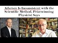

# Atheism is Inconsistent with Science says Top Physicist (2021-10-29)

## Description

See the complete article here: https://www.scientificamerican.com/article/atheism-is-inconsistent-with-the-scientific-method-prizewinning-physicist-says/

## Summary of [Atheism is Inconsistent with Science says Top Physicist](https://www.youtube.com/watch?v=iCcA-kuASDQ)

*This summary is AI generated - there may be inaccuracies. *

### [00:00:00](https://www.youtube.com/watch?v=iCcA-kuASDQ&t=0) - [00:10:00](https://www.youtube.com/watch?v=iCcA-kuASDQ&t=600)

Top physicist Stephen Hawking says that atheism is inconsistent with the scientific method because it doesn't allow for the humility and tolerance required in science. He argues that this is a problem because it means that people can't trust scientists to be honest about the limitations of their knowledge.

**[00:00:00](https://www.youtube.com/watch?v=iCcA-kuASDQ&t=0)** A prize-winning physicist says atheism is inconsistent with the scientific method. He argues that humans are special because of the humility and tolerance required in science.
* **[00:05:00](https://www.youtube.com/watch?v=iCcA-kuASDQ&t=300)** Top physicist Stephen Hawking says that while science does have limitations, it is still a powerful tool that can help us understand the universe and our place in it. He also says that it is important to be honest about science's limitations so that people can trust us.
* **[00:10:00](https://www.youtube.com/watch?v=iCcA-kuASDQ&t=600)** Top physicist says that science can't ever obtain a true theory of everything because it can't always tell us everything that there is to know about the universe. This humility is important, in contrast to more strident voices who seem to be arrogant and materialist.

<h2>Full transcript with timestamps: CLICK TO EXPAND</h2>

[0:00:01](https://youtu.be/iCcA-kuASDQ?t=1) atheism is inconsistent with the  
[0:00:04](https://youtu.be/iCcA-kuASDQ?t=4) scientific method a prize-winning  
[0:00:07](https://youtu.be/iCcA-kuASDQ?t=7) physicist says  
[0:00:09](https://youtu.be/iCcA-kuASDQ?t=9) in conversation with scientific american  
[0:00:11](https://youtu.be/iCcA-kuASDQ?t=11) the leading american journal the  
[0:00:13](https://youtu.be/iCcA-kuASDQ?t=13) templeton prize winner does not pull  
[0:00:16](https://youtu.be/iCcA-kuASDQ?t=16) punches on the limits of science the  
[0:00:18](https://youtu.be/iCcA-kuASDQ?t=18) value of humility and the irrationality  
[0:00:22](https://youtu.be/iCcA-kuASDQ?t=22) of non-belief  
[0:00:24](https://youtu.be/iCcA-kuASDQ?t=24) professor marcelo gleicer is a  
[0:00:27](https://youtu.be/iCcA-kuASDQ?t=27) theoretical physicist at dartmouth  
[0:00:30](https://youtu.be/iCcA-kuASDQ?t=30) college this is an elite academic  
[0:00:32](https://youtu.be/iCcA-kuASDQ?t=32) institution in the us  
[0:00:34](https://youtu.be/iCcA-kuASDQ?t=34) and a prolific science popularizer who  
[0:00:37](https://youtu.be/iCcA-kuASDQ?t=37) won the templeton prize  
[0:00:39](https://youtu.be/iCcA-kuASDQ?t=39) the award from the john templeton  
[0:00:41](https://youtu.be/iCcA-kuASDQ?t=41) foundation recognizes an individual  
[0:00:44](https://youtu.be/iCcA-kuASDQ?t=44) quote who has made an exceptional  
[0:00:46](https://youtu.be/iCcA-kuASDQ?t=46) contribution to affirming life's  
[0:00:48](https://youtu.be/iCcA-kuASDQ?t=48) spiritual dimension end quote its past  
[0:00:52](https://youtu.be/iCcA-kuASDQ?t=52) recipients include  
[0:00:54](https://youtu.be/iCcA-kuASDQ?t=54) sir martin rees the astronomer royal  
[0:00:56](https://youtu.be/iCcA-kuASDQ?t=56) here in the uk and freeman dyson  
[0:01:00](https://youtu.be/iCcA-kuASDQ?t=60) across his 35 year career in science  
[0:01:03](https://youtu.be/iCcA-kuASDQ?t=63) professor gleicer's research has covered  
[0:01:06](https://youtu.be/iCcA-kuASDQ?t=66) the early universe to the behavior of  
[0:01:08](https://youtu.be/iCcA-kuASDQ?t=68) fundamental particles and the origins of  
[0:01:12](https://youtu.be/iCcA-kuASDQ?t=72) life  
[0:01:13](https://youtu.be/iCcA-kuASDQ?t=73) but in awarding him  
[0:01:15](https://youtu.be/iCcA-kuASDQ?t=75) its most prestigious honor the templeton  
[0:01:18](https://youtu.be/iCcA-kuASDQ?t=78) foundation chiefly cited his status as a  
[0:01:21](https://youtu.be/iCcA-kuASDQ?t=81) leading public intellectual revealing  
[0:01:24](https://youtu.be/iCcA-kuASDQ?t=84) quote the historical philosophical and  
[0:01:27](https://youtu.be/iCcA-kuASDQ?t=87) cultural links between science the  
[0:01:29](https://youtu.be/iCcA-kuASDQ?t=89) humanities and spirituality  
[0:01:33](https://youtu.be/iCcA-kuASDQ?t=93) the journal scientific americans spoke  
[0:01:35](https://youtu.be/iCcA-kuASDQ?t=95) with professor glyser about the need for  
[0:01:38](https://youtu.be/iCcA-kuASDQ?t=98) humility in science why humans are  
[0:01:40](https://youtu.be/iCcA-kuASDQ?t=100) special  
[0:01:42](https://youtu.be/iCcA-kuASDQ?t=102) and the fundamental source of his  
[0:01:44](https://youtu.be/iCcA-kuASDQ?t=104) curiosity as a physicist  
[0:01:47](https://youtu.be/iCcA-kuASDQ?t=107) and the journal asked him which aspect  
[0:01:49](https://youtu.be/iCcA-kuASDQ?t=109) of your work do you think is most  
[0:01:51](https://youtu.be/iCcA-kuASDQ?t=111) relevant to the templeton foundation's  
[0:01:54](https://youtu.be/iCcA-kuASDQ?t=114) spiritual aims and he says probably my  
[0:01:57](https://youtu.be/iCcA-kuASDQ?t=117) belief in humility  
[0:01:59](https://youtu.be/iCcA-kuASDQ?t=119) i believe we should take a much humbler  
[0:02:02](https://youtu.be/iCcA-kuASDQ?t=122) approach to knowledge in the sense that  
[0:02:04](https://youtu.be/iCcA-kuASDQ?t=124) if you look carefully at the way science  
[0:02:07](https://youtu.be/iCcA-kuASDQ?t=127) works you'll see that yes it is  
[0:02:09](https://youtu.be/iCcA-kuASDQ?t=129) wonderful magnificent but it has limits  
[0:02:13](https://youtu.be/iCcA-kuASDQ?t=133) and this is a really important point he  
[0:02:14](https://youtu.be/iCcA-kuASDQ?t=134) makes i think  
[0:02:16](https://youtu.be/iCcA-kuASDQ?t=136) and we have to understand and respect  
[0:02:18](https://youtu.be/iCcA-kuASDQ?t=138) those limits  
[0:02:20](https://youtu.be/iCcA-kuASDQ?t=140) and by doing that we understand  
[0:02:22](https://youtu.be/iCcA-kuASDQ?t=142) understand how science advances  
[0:02:24](https://youtu.be/iCcA-kuASDQ?t=144) science becomes  
[0:02:26](https://youtu.be/iCcA-kuASDQ?t=146) really a deeply spiritual conversation  
[0:02:29](https://youtu.be/iCcA-kuASDQ?t=149) with the mysterious about all the things  
[0:02:32](https://youtu.be/iCcA-kuASDQ?t=152) we don't know  
[0:02:34](https://youtu.be/iCcA-kuASDQ?t=154) so that's one answer to your question he  
[0:02:36](https://youtu.be/iCcA-kuASDQ?t=156) says  
[0:02:37](https://youtu.be/iCcA-kuASDQ?t=157) and that has nothing to do with  
[0:02:38](https://youtu.be/iCcA-kuASDQ?t=158) organized religion obviously but it does  
[0:02:40](https://youtu.be/iCcA-kuASDQ?t=160) inform my position against atheism  
[0:02:44](https://youtu.be/iCcA-kuASDQ?t=164) i consider myself an agnostic he says  
[0:02:48](https://youtu.be/iCcA-kuASDQ?t=168) then he's asked why are you against  
[0:02:50](https://youtu.be/iCcA-kuASDQ?t=170) atheism it's very interesting  
[0:02:52](https://youtu.be/iCcA-kuASDQ?t=172) and he says i honestly think atheism is  
[0:02:55](https://youtu.be/iCcA-kuASDQ?t=175) inconsistent with the scientific method  
[0:02:58](https://youtu.be/iCcA-kuASDQ?t=178) what i mean by that is what is atheism  
[0:03:02](https://youtu.be/iCcA-kuASDQ?t=182) it's a statement a categorical statement  
[0:03:05](https://youtu.be/iCcA-kuASDQ?t=185) that expresses belief in non-belief  
[0:03:09](https://youtu.be/iCcA-kuASDQ?t=189) i don't believe even though i have no  
[0:03:12](https://youtu.be/iCcA-kuASDQ?t=192) evidence for or again simply i don't  
[0:03:14](https://youtu.be/iCcA-kuASDQ?t=194) believe period  
[0:03:16](https://youtu.be/iCcA-kuASDQ?t=196) it's a declaration  
[0:03:18](https://youtu.be/iCcA-kuASDQ?t=198) but in science we don't really do  
[0:03:21](https://youtu.be/iCcA-kuASDQ?t=201) declarations  
[0:03:23](https://youtu.be/iCcA-kuASDQ?t=203) we say okay you can have a hypothesis  
[0:03:26](https://youtu.be/iCcA-kuASDQ?t=206) you have to have some evidence  
[0:03:28](https://youtu.be/iCcA-kuASDQ?t=208) for or against that  
[0:03:30](https://youtu.be/iCcA-kuASDQ?t=210) and so an agnostic would say look i have  
[0:03:33](https://youtu.be/iCcA-kuASDQ?t=213) no evidence for god or any kind of god  
[0:03:36](https://youtu.be/iCcA-kuASDQ?t=216) what god first of all the maori gods or  
[0:03:38](https://youtu.be/iCcA-kuASDQ?t=218) the jewish christian or muslim god which  
[0:03:41](https://youtu.be/iCcA-kuASDQ?t=221) god is that  
[0:03:43](https://youtu.be/iCcA-kuASDQ?t=223) but on the other hand an agnostic would  
[0:03:45](https://youtu.be/iCcA-kuASDQ?t=225) acknowledge no right to make a final  
[0:03:48](https://youtu.be/iCcA-kuASDQ?t=228) statement about something he or she  
[0:03:51](https://youtu.be/iCcA-kuASDQ?t=231) doesn't know about  
[0:03:53](https://youtu.be/iCcA-kuASDQ?t=233) the absence of evidence is not evidence  
[0:03:56](https://youtu.be/iCcA-kuASDQ?t=236) of absence not all that  
[0:03:58](https://youtu.be/iCcA-kuASDQ?t=238) this positions me very much against all  
[0:04:01](https://youtu.be/iCcA-kuASDQ?t=241) of the new atheist guys even though i  
[0:04:03](https://youtu.be/iCcA-kuASDQ?t=243) want my message to be respectful of  
[0:04:05](https://youtu.be/iCcA-kuASDQ?t=245) people's beliefs and reasoning  
[0:04:09](https://youtu.be/iCcA-kuASDQ?t=249) and i think obviously the templeton  
[0:04:11](https://youtu.be/iCcA-kuASDQ?t=251) foundation likes all of this because  
[0:04:13](https://youtu.be/iCcA-kuASDQ?t=253) this is part of an emerging conversation  
[0:04:17](https://youtu.be/iCcA-kuASDQ?t=257) it's not just me it's a bunch of my  
[0:04:19](https://youtu.be/iCcA-kuASDQ?t=259) colleagues including the astrophysicist  
[0:04:22](https://youtu.be/iCcA-kuASDQ?t=262) adam frank  
[0:04:24](https://youtu.be/iCcA-kuASDQ?t=264) talking more and more about the relation  
[0:04:27](https://youtu.be/iCcA-kuASDQ?t=267) between science and spirituality very  
[0:04:30](https://youtu.be/iCcA-kuASDQ?t=270) interesting stuff  
[0:04:31](https://youtu.be/iCcA-kuASDQ?t=271) and then he comes to some fascinating  
[0:04:33](https://youtu.be/iCcA-kuASDQ?t=273) comments about our place in the universe  
[0:04:36](https://youtu.be/iCcA-kuASDQ?t=276) scientific american asks him so a  
[0:04:38](https://youtu.be/iCcA-kuASDQ?t=278) message of humility open-mindedness and  
[0:04:41](https://youtu.be/iCcA-kuASDQ?t=281) tolerance  
[0:04:43](https://youtu.be/iCcA-kuASDQ?t=283) other than in discussions of god where  
[0:04:46](https://youtu.be/iCcA-kuASDQ?t=286) else do you see the most important need  
[0:04:48](https://youtu.be/iCcA-kuASDQ?t=288) for this ethos  
[0:04:50](https://youtu.be/iCcA-kuASDQ?t=290) and the professor replies  
[0:04:53](https://youtu.be/iCcA-kuASDQ?t=293) you know i'm a rare earth kind of guy  
[0:04:56](https://youtu.be/iCcA-kuASDQ?t=296) i think our situation may be rather  
[0:04:59](https://youtu.be/iCcA-kuASDQ?t=299) special on a planetary or even galactic  
[0:05:02](https://youtu.be/iCcA-kuASDQ?t=302) scale  
[0:05:03](https://youtu.be/iCcA-kuASDQ?t=303) so when people talk about copernicus and  
[0:05:06](https://youtu.be/iCcA-kuASDQ?t=306) copernicanism the principle of  
[0:05:08](https://youtu.be/iCcA-kuASDQ?t=308) mediocrity that states we should expect  
[0:05:11](https://youtu.be/iCcA-kuASDQ?t=311) to be average and typical i say  
[0:05:14](https://youtu.be/iCcA-kuASDQ?t=314) you know what it's time to get beyond  
[0:05:16](https://youtu.be/iCcA-kuASDQ?t=316) that  
[0:05:18](https://youtu.be/iCcA-kuASDQ?t=318) when you look out there at the other  
[0:05:19](https://youtu.be/iCcA-kuASDQ?t=319) planets and the exoplanets that we can  
[0:05:22](https://youtu.be/iCcA-kuASDQ?t=322) make some sense of  
[0:05:24](https://youtu.be/iCcA-kuASDQ?t=324) when you look at the history of life on  
[0:05:26](https://youtu.be/iCcA-kuASDQ?t=326) earth you will realize this place called  
[0:05:29](https://youtu.be/iCcA-kuASDQ?t=329) earth is absolutely amazing  
[0:05:33](https://youtu.be/iCcA-kuASDQ?t=333) and maybe yes there are others out there  
[0:05:35](https://youtu.be/iCcA-kuASDQ?t=335) possibly who knows we certainly expect  
[0:05:38](https://youtu.be/iCcA-kuASDQ?t=338) so  
[0:05:39](https://youtu.be/iCcA-kuASDQ?t=339) but right now what we know  
[0:05:41](https://youtu.be/iCcA-kuASDQ?t=341) is that we have this world and we are  
[0:05:43](https://youtu.be/iCcA-kuASDQ?t=343) these amazing molecular machines  
[0:05:46](https://youtu.be/iCcA-kuASDQ?t=346) capable of self-awareness  
[0:05:49](https://youtu.be/iCcA-kuASDQ?t=349) and all that makes us very special  
[0:05:52](https://youtu.be/iCcA-kuASDQ?t=352) indeed  
[0:05:54](https://youtu.be/iCcA-kuASDQ?t=354) and we know for a fact that there will  
[0:05:56](https://youtu.be/iCcA-kuASDQ?t=356) be no other humans in the universe there  
[0:05:59](https://youtu.be/iCcA-kuASDQ?t=359) may be some humanoids out there  
[0:06:01](https://youtu.be/iCcA-kuASDQ?t=361) somewhere  
[0:06:02](https://youtu.be/iCcA-kuASDQ?t=362) we are but we are unique products of our  
[0:06:05](https://youtu.be/iCcA-kuASDQ?t=365) single  
[0:06:06](https://youtu.be/iCcA-kuASDQ?t=366) small planet's long history he says  
[0:06:10](https://youtu.be/iCcA-kuASDQ?t=370) the point is this to understand modern  
[0:06:12](https://youtu.be/iCcA-kuASDQ?t=372) science within this framework is to put  
[0:06:15](https://youtu.be/iCcA-kuASDQ?t=375) humanity back into a kind of moral  
[0:06:18](https://youtu.be/iCcA-kuASDQ?t=378) center of the universe in which we have  
[0:06:21](https://youtu.be/iCcA-kuASDQ?t=381) the moral duty to preserve this planet  
[0:06:24](https://youtu.be/iCcA-kuASDQ?t=384) and its life with everything that we've  
[0:06:27](https://youtu.be/iCcA-kuASDQ?t=387) got because we understand how rare this  
[0:06:30](https://youtu.be/iCcA-kuASDQ?t=390) whole game is  
[0:06:31](https://youtu.be/iCcA-kuASDQ?t=391) and that for all practical purposes we  
[0:06:34](https://youtu.be/iCcA-kuASDQ?t=394) are alone  
[0:06:35](https://youtu.be/iCcA-kuASDQ?t=395) for now anyways  
[0:06:37](https://youtu.be/iCcA-kuASDQ?t=397) we have to do this  
[0:06:39](https://youtu.be/iCcA-kuASDQ?t=399) and then the uh scientific american says  
[0:06:42](https://youtu.be/iCcA-kuASDQ?t=402) to him  
[0:06:43](https://youtu.be/iCcA-kuASDQ?t=403) let me play devil's advocate for a  
[0:06:45](https://youtu.be/iCcA-kuASDQ?t=405) moment only because earlier you refer to  
[0:06:47](https://youtu.be/iCcA-kuASDQ?t=407) the value of humility in science  
[0:06:51](https://youtu.be/iCcA-kuASDQ?t=411) some would say now is not the time to be  
[0:06:53](https://youtu.be/iCcA-kuASDQ?t=413) humble given the rise the rising tide of  
[0:06:56](https://youtu.be/iCcA-kuASDQ?t=416) active open hostility to science and  
[0:07:00](https://youtu.be/iCcA-kuASDQ?t=420) objectivity around the globe  
[0:07:02](https://youtu.be/iCcA-kuASDQ?t=422) how would you respond to that  
[0:07:05](https://youtu.be/iCcA-kuASDQ?t=425) and he replies  
[0:07:06](https://youtu.be/iCcA-kuASDQ?t=426) this is of course something people have  
[0:07:08](https://youtu.be/iCcA-kuASDQ?t=428) already told me  
[0:07:10](https://youtu.be/iCcA-kuASDQ?t=430) and are you really sure you want to say  
[0:07:12](https://youtu.be/iCcA-kuASDQ?t=432) these things they say  
[0:07:14](https://youtu.be/iCcA-kuASDQ?t=434) and my answer is yes absolutely  
[0:07:18](https://youtu.be/iCcA-kuASDQ?t=438) there is a difference between science  
[0:07:20](https://youtu.be/iCcA-kuASDQ?t=440) and what we can call scientism  
[0:07:23](https://youtu.be/iCcA-kuASDQ?t=443) which is the notion that science can  
[0:07:25](https://youtu.be/iCcA-kuASDQ?t=445) solve all problems and this is a really  
[0:07:27](https://youtu.be/iCcA-kuASDQ?t=447) important point i think he makes  
[0:07:29](https://youtu.be/iCcA-kuASDQ?t=449) to a large extent it is not science but  
[0:07:31](https://youtu.be/iCcA-kuASDQ?t=451) rather how humanity has used science  
[0:07:34](https://youtu.be/iCcA-kuASDQ?t=454) that has put us in our present  
[0:07:36](https://youtu.be/iCcA-kuASDQ?t=456) difficulties  
[0:07:38](https://youtu.be/iCcA-kuASDQ?t=458) because most people in general have no  
[0:07:40](https://youtu.be/iCcA-kuASDQ?t=460) awareness of what science can and cannot  
[0:07:44](https://youtu.be/iCcA-kuASDQ?t=464) do  
[0:07:45](https://youtu.be/iCcA-kuASDQ?t=465) so they misuse it and they do not think  
[0:07:48](https://youtu.be/iCcA-kuASDQ?t=468) about science in a more pluralistic way  
[0:07:51](https://youtu.be/iCcA-kuASDQ?t=471) so okay you're going to develop a  
[0:07:53](https://youtu.be/iCcA-kuASDQ?t=473) self-driving car good  
[0:07:56](https://youtu.be/iCcA-kuASDQ?t=476) but how will that car handle hard  
[0:07:59](https://youtu.be/iCcA-kuASDQ?t=479) choices like whether to prioritize the  
[0:08:01](https://youtu.be/iCcA-kuASDQ?t=481) lives of its occupants or the lives of  
[0:08:04](https://youtu.be/iCcA-kuASDQ?t=484) pedestrian bystanders  
[0:08:07](https://youtu.be/iCcA-kuASDQ?t=487) is it going to be just the technologists  
[0:08:09](https://youtu.be/iCcA-kuASDQ?t=489) from google who decides let us hope not  
[0:08:12](https://youtu.be/iCcA-kuASDQ?t=492) and i say amen to that  
[0:08:15](https://youtu.be/iCcA-kuASDQ?t=495) you have to talk to philosophers you  
[0:08:17](https://youtu.be/iCcA-kuASDQ?t=497) have to talk to ethicists and i say we  
[0:08:19](https://youtu.be/iCcA-kuASDQ?t=499) need to talk to theologians too  
[0:08:22](https://youtu.be/iCcA-kuASDQ?t=502) and to not understand that he says to  
[0:08:25](https://youtu.be/iCcA-kuASDQ?t=505) say that science has all the answers to  
[0:08:27](https://youtu.be/iCcA-kuASDQ?t=507) me is just nonsense  
[0:08:31](https://youtu.be/iCcA-kuASDQ?t=511) we cannot presume that we are going to  
[0:08:33](https://youtu.be/iCcA-kuASDQ?t=513) solve all the problems of the world by  
[0:08:35](https://youtu.be/iCcA-kuASDQ?t=515) using a strict scientific approach  
[0:08:39](https://youtu.be/iCcA-kuASDQ?t=519) it will not be the case and it has never  
[0:08:42](https://youtu.be/iCcA-kuASDQ?t=522) ever been the case because the world is  
[0:08:44](https://youtu.be/iCcA-kuASDQ?t=524) too complex and science has  
[0:08:47](https://youtu.be/iCcA-kuASDQ?t=527) methodological powers as well as  
[0:08:50](https://youtu.be/iCcA-kuASDQ?t=530) methodological limitations  
[0:08:54](https://youtu.be/iCcA-kuASDQ?t=534) and so what do i say i say be honest i'm  
[0:08:57](https://youtu.be/iCcA-kuASDQ?t=537) going to be honest about the powers of  
[0:08:58](https://youtu.be/iCcA-kuASDQ?t=538) science so that people can actually  
[0:09:01](https://youtu.be/iCcA-kuASDQ?t=541) believe me for my honesty and  
[0:09:03](https://youtu.be/iCcA-kuASDQ?t=543) transparency  
[0:09:05](https://youtu.be/iCcA-kuASDQ?t=545) if you don't want to be honest and  
[0:09:07](https://youtu.be/iCcA-kuASDQ?t=547) transparent you're just going to become  
[0:09:09](https://youtu.be/iCcA-kuASDQ?t=549) a liar like everyone else  
[0:09:11](https://youtu.be/iCcA-kuASDQ?t=551) which is why i get upset he says by  
[0:09:14](https://youtu.be/iCcA-kuASDQ?t=554) misstatements like when you have  
[0:09:17](https://youtu.be/iCcA-kuASDQ?t=557) scientists stephen hawking the british  
[0:09:20](https://youtu.be/iCcA-kuASDQ?t=560) scientist and lawrence krauss among them  
[0:09:23](https://youtu.be/iCcA-kuASDQ?t=563) the american physicist claiming we have  
[0:09:25](https://youtu.be/iCcA-kuASDQ?t=565) solved the problem of the origin of the  
[0:09:27](https://youtu.be/iCcA-kuASDQ?t=567) universe or that string theory is  
[0:09:29](https://youtu.be/iCcA-kuASDQ?t=569) correct and that the final theory of  
[0:09:32](https://youtu.be/iCcA-kuASDQ?t=572) everything is at hand  
[0:09:35](https://youtu.be/iCcA-kuASDQ?t=575) such statements are bogus  
[0:09:39](https://youtu.be/iCcA-kuASDQ?t=579) so i feel as if i am a guardian for the  
[0:09:42](https://youtu.be/iCcA-kuASDQ?t=582) integrity of science right now someone  
[0:09:44](https://youtu.be/iCcA-kuASDQ?t=584) you can trust because this person is  
[0:09:47](https://youtu.be/iCcA-kuASDQ?t=587) open and honest enough to admit that the  
[0:09:50](https://youtu.be/iCcA-kuASDQ?t=590) scientific enterprise has limitations  
[0:09:53](https://youtu.be/iCcA-kuASDQ?t=593) which doesn't mean it's weak he says  
[0:09:57](https://youtu.be/iCcA-kuASDQ?t=597) and then finally very interesting  
[0:09:59](https://youtu.be/iCcA-kuASDQ?t=599) paragraph  
[0:10:00](https://youtu.be/iCcA-kuASDQ?t=600) you mentioned string theory says the  
[0:10:02](https://youtu.be/iCcA-kuASDQ?t=602) editor of the journal and your  
[0:10:04](https://youtu.be/iCcA-kuASDQ?t=604) skepticism about the notion of a final  
[0:10:07](https://youtu.be/iCcA-kuASDQ?t=607) theory of everything  
[0:10:10](https://youtu.be/iCcA-kuASDQ?t=610) where does this skepticism come from  
[0:10:12](https://youtu.be/iCcA-kuASDQ?t=612) that's a very important point he said  
[0:10:14](https://youtu.be/iCcA-kuASDQ?t=614) and our professor replies  
[0:10:16](https://youtu.be/iCcA-kuASDQ?t=616) it is impossible for science to obtain a  
[0:10:19](https://youtu.be/iCcA-kuASDQ?t=619) true theory of everything  
[0:10:22](https://youtu.be/iCcA-kuASDQ?t=622) and the reason for that is  
[0:10:24](https://youtu.be/iCcA-kuASDQ?t=624) epistemological epistemologies to do  
[0:10:26](https://youtu.be/iCcA-kuASDQ?t=626) with knowledge how we understand  
[0:10:28](https://youtu.be/iCcA-kuASDQ?t=628) the world around us  
[0:10:30](https://youtu.be/iCcA-kuASDQ?t=630) basically he says the way we acquire  
[0:10:32](https://youtu.be/iCcA-kuASDQ?t=632) information about the world is through  
[0:10:34](https://youtu.be/iCcA-kuASDQ?t=634) measurement  
[0:10:36](https://youtu.be/iCcA-kuASDQ?t=636) it's through instruments right and  
[0:10:39](https://youtu.be/iCcA-kuASDQ?t=639) because of that our measurements and  
[0:10:41](https://youtu.be/iCcA-kuASDQ?t=641) instruments are always going to tell us  
[0:10:43](https://youtu.be/iCcA-kuASDQ?t=643) uh a lot of stuff  
[0:10:45](https://youtu.be/iCcA-kuASDQ?t=645) but they are going to leave stuff out  
[0:10:50](https://youtu.be/iCcA-kuASDQ?t=650) and we cannot possibly ever think that  
[0:10:52](https://youtu.be/iCcA-kuASDQ?t=652) we could have a theory of everything  
[0:10:55](https://youtu.be/iCcA-kuASDQ?t=655) because we cannot ever think that we  
[0:10:57](https://youtu.be/iCcA-kuASDQ?t=657) know everything that there is to know  
[0:11:00](https://youtu.be/iCcA-kuASDQ?t=660) about the universe  
[0:11:02](https://youtu.be/iCcA-kuASDQ?t=662) now that's the end of the quote i think  
[0:11:05](https://youtu.be/iCcA-kuASDQ?t=665) it's very interesting because science  
[0:11:06](https://youtu.be/iCcA-kuASDQ?t=666) can't tell us about many really  
[0:11:09](https://youtu.be/iCcA-kuASDQ?t=669) important things it can't tell us what  
[0:11:11](https://youtu.be/iCcA-kuASDQ?t=671) is truth what is beauty how should i be  
[0:11:14](https://youtu.be/iCcA-kuASDQ?t=674) a good person what is right and wrong  
[0:11:18](https://youtu.be/iCcA-kuASDQ?t=678) how should i live my life is there life  
[0:11:21](https://youtu.be/iCcA-kuASDQ?t=681) after death even is there a creator of  
[0:11:24](https://youtu.be/iCcA-kuASDQ?t=684) the universe it can't prove that  
[0:11:26](https://youtu.be/iCcA-kuASDQ?t=686) mathematically or through measurements  
[0:11:28](https://youtu.be/iCcA-kuASDQ?t=688) there are other ways perhaps it could we  
[0:11:30](https://youtu.be/iCcA-kuASDQ?t=690) can understand that truth  
[0:11:32](https://youtu.be/iCcA-kuASDQ?t=692) so i think his emphasis on humility in  
[0:11:36](https://youtu.be/iCcA-kuASDQ?t=696) science is really important and it  
[0:11:38](https://youtu.be/iCcA-kuASDQ?t=698) strikes a beautiful note compared to  
[0:11:40](https://youtu.be/iCcA-kuASDQ?t=700) more strident voices uh who have  
[0:11:43](https://youtu.be/iCcA-kuASDQ?t=703) mentioned who uh come across as very uh  
[0:11:46](https://youtu.be/iCcA-kuASDQ?t=706) arrogant and materialist and  
[0:11:47](https://youtu.be/iCcA-kuASDQ?t=707) reductionist in their approach to life  
[0:11:50](https://youtu.be/iCcA-kuASDQ?t=710) the universe and everything anyway i'll  
[0:11:53](https://youtu.be/iCcA-kuASDQ?t=713) put a link to  
[0:11:54](https://youtu.be/iCcA-kuASDQ?t=714) the article in the description below  
[0:11:57](https://youtu.be/iCcA-kuASDQ?t=717) until next time  

