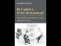

# Be Careful with Muhammad! With Dr Shabbir Akhtar (2021-08-10)

## Description

Be Careful with Muhammad! Salman Rushdie and the Battle for Free Speech https://www.amazon.co.uk/Careful-Muhammad-Salman-Rushdie-Battle/dp/6239474207/ref=sr_1_1?dchild=1&keywords=Be+Careful+with+Muhammad%21&qid=1628587778&sr=8-1

The New Testament in Muslim Eyes: Paul's Letter to the Galatians https://www.amazon.co.uk/gp/product/B07DPQX9FP/ref=dbs_a_def_rwt_bibl_vppi_i2

Islam as Political Religion: The Future of an Imperial Faith https://www.amazon.co.uk/gp/product/B004OBZRV8/ref=dbs_a_def_rwt_bibl_vppi_i3

The Quran and the Secular Mind: A Philosophy of Islam https://www.amazon.co.uk/Quran-Secular-Mind-Philosophy-Islam/dp/0415437830/ref=tmm_pap_swatch_0?_encoding=UTF8&qid=&sr=

## Summary of [Be Careful with Muhammad! With Dr Shabbir Akhtar](https://www.youtube.com/watch?v=YbwyFNXXC00)

*This summary is AI generated - there may be inaccuracies. *

### [00:00:00](https://www.youtube.com/watch?v=YbwyFNXXC00&t=0) - [00:45:00](https://www.youtube.com/watch?v=YbwyFNXXC00&t=2700)

In this video, Dr. Shabbir Akhtar discusses the importance of being careful when interpreting the teachings of Muhammad. He argues that Muslims need to show respect for the convictions of secularists in order to achieve a degree of balance. Akhtar also talks about his new book, The Crown and the Secular Mind: A Muslim's Defense of Western Democracy, which synthesizes the insights of Western philosophy and Islamic studies.

**[00:00:00](https://www.youtube.com/watch?v=YbwyFNXXC00&t=0)** Salman Rushdie's book "The Satanic Verses" caused a lot of controversy among Muslims in the UK, 30 years after its publication. Dr. Shabbir Akhtar from the University of Oxford discusses the controversy in this book and its relevance to current issues regarding freedom of speech and Islam and secularism.
* **[00:05:00](https://www.youtube.com/watch?v=YbwyFNXXC00&t=300)** The video discusses the Salman Rushdie affair, and argues that the event was real but that Rushdie's exaggerated interpretation of it caused a rise in Islamophobia.
* **[00:10:00](https://www.youtube.com/watch?v=YbwyFNXXC00&t=600)** In this YouTube video, Dr. Shabbir Akhtar discusses the Islamic concept of taqlid, or following a scholar's guidance blindly. He emphasizes that while he defends the right to burn Muhammad books, he also defends the right to free speech, and believes that both rights must be balanced. Akhtar also points out that the Catholic Church once withdrew recognition from an English queen, which allowed for her assassination.
* **[00:15:00](https://www.youtube.com/watch?v=YbwyFNXXC00&t=900)** In this video, Dr. Shabbir Akhtar discusses the tension between religious freedom and the offended consciences of secularists. He argues that both Muslims and the liberal state need to show respect for each other's convictions in order to achieve a degree of balance.
* **[00:20:00](https://www.youtube.com/watch?v=YbwyFNXXC00&t=1200)** The author of the book raises concerns about double standards in how Muslims are treated, specifically noting that foreign Holocaust denial is illegal in France but that Muslims are treated as a "fair game" in society. He also mentions a woman named Patton who converted to Christianity and has been abusive towards Muslims. The author argues that she should await the consequence of her statements before making them.
* **[00:25:00](https://www.youtube.com/watch?v=YbwyFNXXC00&t=1500)** The speaker discusses the idea of "cultural capital" and how it can be a precursor to formal legal ways of protecting Islam. They argue that muslim intellectuals should live among their people and look at their concerns.
* **[00:30:00](https://www.youtube.com/watch?v=YbwyFNXXC00&t=1800)** This video discusses the lack of intellectuals in the Muslim world, and how Shabbir Akhtar has been able to achieve success in academia despite facing opposition. Akhtar stresses the importance of having role models, and encourages young Muslims to pursue intellectual endeavors.
* **[00:35:00](https://www.youtube.com/watch?v=YbwyFNXXC00&t=2100)** In this video, Dr. Shabbir Akhtar discusses the importance of successful Muslim academics in an era of increasing anti-Muslim sentiment. He also talks about his new book, The Crown and the Secular Mind: A Muslim's Defense of Western Democracy, which synthesizes the insights of Western philosophy and Islamic studies. Akhtar stresses the importance of engaging secularism and boldly asserting the truth of Islam's political theology.
* **[00:40:00](https://www.youtube.com/watch?v=YbwyFNXXC00&t=2400)** The video discusses how Dr. Shabbir Akhtar thinks that he should be careful with Muhammad because the prophet of Islam is our man. He goes on to say that Jesus and Moses are treated nicely in Muslim theology, but that Muhammad is still our man and we love him. Akhtar also discusses his book on Christology, which is due to be released next year.
* **[00:45:00](https://www.youtube.com/watch?v=YbwyFNXXC00&t=2700)** The author of the video, Dr. Shabbir Akhtar, discusses the importance of studying both the Bible and the Quran and how it is important to be careful when interpreting the teachings of Muhammad. He also discusses his new book on the subject.

## Full transcript with timestamps

[0:00:00](https://youtu.be/YbwyFNXXC00?t=0) Well hello there, my name is Paul Williams 
from Blogging Theology and you are almost    
[0:00:06](https://youtu.be/YbwyFNXXC00?t=6) welcome. And today I have a very special guest Dr Shabbir Akhtar from the University of Oxford.    
[0:00:12](https://youtu.be/YbwyFNXXC00?t=12) You're most welcome sir! Thank you very much 
Paul thank you. And I just want to    
[0:00:18](https://youtu.be/YbwyFNXXC00?t=18) introduce briefly who Dr Shabbir is for 
those of you who don't know. He's a philosopher    
[0:00:25](https://youtu.be/YbwyFNXXC00?t=25) trained at Cambridge University, as a PhD in 
Kierkegaard, I think the famous Danish philosopher    
[0:00:32](https://youtu.be/YbwyFNXXC00?t=32) who's really worth reading actually, he's widely 
published on pluralism, race relations in the UK,    
[0:00:38](https://youtu.be/YbwyFNXXC00?t=38) and Islam's and Christianity's differing responses 
to modern secularism particularly in the UK.   
[0:00:46](https://youtu.be/YbwyFNXXC00?t=46) He's written some some of my favourite books 
actually he's written The Quran and the Secular    
[0:00:51](https://youtu.be/YbwyFNXXC00?t=51) Mind, published in 2007 an absolute feast for the 
intellect, it is one of Dr Tim Winter's recommended    
[0:00:59](https://youtu.be/YbwyFNXXC00?t=59) reading books in his reading list, and I agree 
with that. And another great one is Islam as a    
[0:01:04](https://youtu.be/YbwyFNXXC00?t=64) Political Religion, published in 2010, another really weighty 
and fascinating tome. I recommend both of these.    
[0:01:12](https://youtu.be/YbwyFNXXC00?t=72) But also he's gone even beyond that - 
he's published the first of a three volume    
[0:01:17](https://youtu.be/YbwyFNXXC00?t=77) commentary on the Greek New Testament called The 
New Testament in Muslim Eyes: Paul's Letter to the    
[0:01:23](https://youtu.be/YbwyFNXXC00?t=83) Galatians, published by Routledge. And I think that 
may be a first: a Muslim philosopher, theologian,    
[0:01:30](https://youtu.be/YbwyFNXXC00?t=90) actually engaged with contemporary cutting edge 
biblical scholarship and looking at the Greek of    
[0:01:36](https://youtu.be/YbwyFNXXC00?t=96) Paul's letter to the Galatians, so i have read that 
and that is actually for all theological students    
[0:01:41](https://youtu.be/YbwyFNXXC00?t=101) again another work that's highly recommended 
actually not just obviously by me but by    
[0:01:46](https://youtu.be/YbwyFNXXC00?t=106) the scholars. And he's currently a member of 
the Faculty of Theology and Religions at Oxford    
[0:01:53](https://youtu.be/YbwyFNXXC00?t=113) University, and i know you've been a professor in 
the USA, i think in Indonesia as well, you were    
[0:01:58](https://youtu.be/YbwyFNXXC00?t=118) yeah Malaysia, in Malaysia as well, so incredibly 
diverse varied and fascinating career.    
[0:02:06](https://youtu.be/YbwyFNXXC00?t=126) But the the reason he is here today i 
invited him to appear today is another book    
[0:02:13](https://youtu.be/YbwyFNXXC00?t=133) that has he's just republished actually it's 
called Be Careful with Muhammad, Salman Rushdie and    
[0:02:20](https://youtu.be/YbwyFNXXC00?t=140) the Battle for Free Speech. Now it's the second 
edition with a huge new preface which i've    
[0:02:27](https://youtu.be/YbwyFNXXC00?t=147) read and that's worth it's actually a work in its 
own right a massive survey of issues to do with    
[0:02:32](https://youtu.be/YbwyFNXXC00?t=152) freedom of speech and islam and secularism and oh 
many many issues so it's that book i think that    
[0:02:38](https://youtu.be/YbwyFNXXC00?t=158) really triggered people triggered me to think wow 
you know maybe dr shabir can talk about that so um    
[0:02:45](https://youtu.be/YbwyFNXXC00?t=165) can you just uh first of all um say a bit about 
um who Salman Rushdie is because not particularly    
[0:02:53](https://youtu.be/YbwyFNXXC00?t=173) younger viewers i'm gonna have no idea who this 
gentleman is and uh and also this book that he    
[0:02:58](https://youtu.be/YbwyFNXXC00?t=178) wrote the 'Satanic Verses' it sounds evil! What is 
it what is this book about and why why is it cause    
[0:03:05](https://youtu.be/YbwyFNXXC00?t=185) such a furore, such an upset amongst Muslims in 
the UK. Well thank you very much Paul for inviting    
[0:03:13](https://youtu.be/YbwyFNXXC00?t=193) me. Salam to everyone and also happy new muslim 
year in the month of muharram ii a good uh time to    
[0:03:23](https://youtu.be/YbwyFNXXC00?t=203) speak on this topic uh paul is a mutual 
pleasure by the way i'm awesome admirer of your    
[0:03:29](https://youtu.be/YbwyFNXXC00?t=209) blogging theology and you're a very erudite 
uh man yourself even though you don't have    
[0:03:35](https://youtu.be/YbwyFNXXC00?t=215) the title of professor you don't need one um 
let me see what this book is about it's uh    
[0:03:41](https://youtu.be/YbwyFNXXC00?t=221) as you say it goes back an event that took place 
about 30 years ago uh the salman rushdie affair    
[0:03:49](https://youtu.be/YbwyFNXXC00?t=229) not just the publication of rushdie's book 
the satanic verses which i'll explain what's    
[0:03:53](https://youtu.be/YbwyFNXXC00?t=233) in it but also our muslim response to 
it i was one of the campaigners and    
[0:03:58](https://youtu.be/YbwyFNXXC00?t=238) this book actually the original book 
is a record of a campaign the preface    
[0:04:03](https://youtu.be/YbwyFNXXC00?t=243) 30 years on these were everything that's happened 
in the last 30 years the book was um published in    
[0:04:09](https://youtu.be/YbwyFNXXC00?t=249) 1988 autumn and then i wrote my response in 1989 
soon after the fatwa was issued the sentence    
[0:04:19](https://youtu.be/YbwyFNXXC00?t=259) sentencing summaries due to death by the late 
ayatollah khomeini my book is a survey of all    
[0:04:24](https://youtu.be/YbwyFNXXC00?t=264) these events the book burning in bradford um 
30 years on i think the issues are so relevant    
[0:04:31](https://youtu.be/YbwyFNXXC00?t=271) uh paul what i do is i look at the 
charlie hebdo affair among other cartoon    
[0:04:36](https://youtu.be/YbwyFNXXC00?t=276) controversies in the danish context as well 
that's part of the preface but the preface    
[0:04:40](https://youtu.be/YbwyFNXXC00?t=280) really does try and cover it multi-dimensionally 
the event actually is a very interesting one in    
[0:04:46](https://youtu.be/YbwyFNXXC00?t=286) islamic history it's greatly uh debated many words 
that there was such an incident the allegation    
[0:04:53](https://youtu.be/YbwyFNXXC00?t=293) is that and it's recorded in 
islamic history by the way    
[0:04:58](https://youtu.be/YbwyFNXXC00?t=298) and other historians that on one occasion surah 53 
um the prophet's attempt to deliver the revelation    
[0:05:06](https://youtu.be/YbwyFNXXC00?t=306) was interrupted by the devil who inserted a number 
of verses into the revelation now these verses are    
[0:05:12](https://youtu.be/YbwyFNXXC00?t=312) not found in in any manuscript in the quran 
they were immediately removed during the time    
[0:05:17](https://youtu.be/YbwyFNXXC00?t=317) the lifetime of the prophet so and there's a lot 
of dispute about whether the incident is genuine    
[0:05:23](https://youtu.be/YbwyFNXXC00?t=323) or whether it was actually just invented 
perhaps possibly by muslims themselves    
[0:05:28](https://youtu.be/YbwyFNXXC00?t=328) to provide an occasion of revelation for a verse 
in chapter 22 a different surah of the quran    
[0:05:34](https://youtu.be/YbwyFNXXC00?t=334) which says that whenever satan tries to interject 
something into the mouth one of our messengers we    
[0:05:41](https://youtu.be/YbwyFNXXC00?t=341) ourselves meaning god we cancel it we acknowledge 
so some people think it may actually just be an    
[0:05:46](https://youtu.be/YbwyFNXXC00?t=346) artificial maneuver others think the incident is 
real but of course it doesn't occur in any extant    
[0:05:52](https://youtu.be/YbwyFNXXC00?t=352) mastery of the holy quran what i think rushdie 
did is that he took an arguably real incident    
[0:05:58](https://youtu.be/YbwyFNXXC00?t=358) in the history of the revelation of the quran 
and early islam and then he exaggerated it he    
[0:06:04](https://youtu.be/YbwyFNXXC00?t=364) said well if a couple of verses in the quran 
could temporarily at least be from the devil    
[0:06:10](https://youtu.be/YbwyFNXXC00?t=370) why isn't it possible that the entire quran 
is from the devil that's obviously the great    
[0:06:15](https://youtu.be/YbwyFNXXC00?t=375) hyperbole and exaggeration so i take him to 
task for that suggestion because i think such a    
[0:06:20](https://youtu.be/YbwyFNXXC00?t=380) revisionist account of history even in a fictional 
form is a very profound insult and abuse it's not    
[0:06:27](https://youtu.be/YbwyFNXXC00?t=387) really a critique of islamic origins that's the 
background the rest was our reaction to it which    
[0:06:32](https://youtu.be/YbwyFNXXC00?t=392) i've documented and i must say paul that i believe 
that the salman rushdie affair is not really just    
[0:06:39](https://youtu.be/YbwyFNXXC00?t=399) to do salman rushdie it's true that he wrote the 
book to which we reacted but had we not reacted    
[0:06:45](https://youtu.be/YbwyFNXXC00?t=405) there would not have been such an affair at all 
i think that the affair was an important one    
[0:06:50](https://youtu.be/YbwyFNXXC00?t=410) a lot of people criticized me recently 30 years 
old saying our reaction to this was wrong perhaps    
[0:06:57](https://youtu.be/YbwyFNXXC00?t=417) we ourselves are responsible for the islamophobia 
that has grown in the aftermath to which i respond    
[0:07:02](https://youtu.be/YbwyFNXXC00?t=422) well islamophobia predates the affair and sadly 
it will long outlive it is that sufficient    
[0:07:10](https://youtu.be/YbwyFNXXC00?t=430) paul for now well that that's that's very succinct 
uh summary i mean there's some spectacular global    
[0:07:17](https://youtu.be/YbwyFNXXC00?t=437) phenomena that happen for example as you say the 
ayatollah hominy issued uh uh what in the west    
[0:07:23](https://youtu.be/YbwyFNXXC00?t=443) is understood to be a fatwa is a death sentence 
isn't it in the west that's how it's understood    
[0:07:28](https://youtu.be/YbwyFNXXC00?t=448) because it couldn't be further from the truth 
a fact were simply a a legal ruling issued by a    
[0:07:33](https://youtu.be/YbwyFNXXC00?t=453) jurist it could be on any subject yeah the the 
ayatollah issued a death sentence and um the    
[0:07:40](https://youtu.be/YbwyFNXXC00?t=460) the summon russia who's a novelist um given an 
obe by the queen for his services to britain um    
[0:07:46](https://youtu.be/YbwyFNXXC00?t=466) extraordinary really um to be protected 24 hours a 
day by british police he may still be protected i    
[0:07:53](https://youtu.be/YbwyFNXXC00?t=473) don't know um and so he's virtually in hiding 
for many years because of this novel satanic    
[0:07:59](https://youtu.be/YbwyFNXXC00?t=479) verses that he wrote all those years ago it's an 
extraordinary reaction to a work of fiction but  
[0:08:07](https://youtu.be/YbwyFNXXC00?t=487) well well paul firstly with regard to fatwa as you 
say the fatwa simply means legal judgment it need    
[0:08:15](https://youtu.be/YbwyFNXXC00?t=495) not be binding however if it's issued by a head 
of state like community was obviously just by at    
[0:08:20](https://youtu.be/YbwyFNXXC00?t=500) least to the people who follow him in that country 
uh the word fatwa it's a quranic term incidentally    
[0:08:26](https://youtu.be/YbwyFNXXC00?t=506) the verb and the noun are used it basically 
means a judgment so obviously a fatwa from god    
[0:08:32](https://youtu.be/YbwyFNXXC00?t=512) for example in several parts to quran there's 
a fatwa about a particular very intricate    
[0:08:38](https://youtu.be/YbwyFNXXC00?t=518) matter of inheritance at the end of chapter four 
obviously the word fatwa the verbal form is used    
[0:08:44](https://youtu.be/YbwyFNXXC00?t=524) there but actually in islamic history uh there 
have been a variety of fatawa or plural one of    
[0:08:50](https://youtu.be/YbwyFNXXC00?t=530) the most famous ones was ironically given by ibn 
rushd avarice who wrote a book a whole treatise    
[0:08:58](https://youtu.be/YbwyFNXXC00?t=538) in the form of fatwa because he was a maliki 
jurist and the book is called the compatibility    
[0:09:04](https://youtu.be/YbwyFNXXC00?t=544) of the sharia the holy law with wisdom philosophy 
so it's strange that the word fatwa was associated    
[0:09:10](https://youtu.be/YbwyFNXXC00?t=550) with something in purely intellectual and 
two recent years where now of course many    
[0:09:15](https://youtu.be/YbwyFNXXC00?t=555) people misinterpret it to mean the fatwa means a 
death sentence specifically of course it doesn't    
[0:09:20](https://youtu.be/YbwyFNXXC00?t=560) mean that but nonetheless it's a partnerable um 
era because a lot of westerners won't know that    
[0:09:25](https://youtu.be/YbwyFNXXC00?t=565) background which is why i'm glad you asked me so 
i can clarify i should also clarify another point    
[0:09:30](https://youtu.be/YbwyFNXXC00?t=570) in order to maintain a position of moral 
consistency for my work as a campaigner i    
[0:09:36](https://youtu.be/YbwyFNXXC00?t=576) don't wish to comment on the validity of the fatwa 
and i don't do so in my book what i say there is    
[0:09:41](https://youtu.be/YbwyFNXXC00?t=581) that this fatwa is for people who are subject to 
its jurisdiction let's just say whoever takes imam  
[0:09:51](https://youtu.be/YbwyFNXXC00?t=591) obviously i live in england which is my country 
adopted citizenship i enjoy degree of religious    
[0:09:57](https://youtu.be/YbwyFNXXC00?t=597) freedom here there are occasions when the 
secular state law conflicts religious law    
[0:10:02](https://youtu.be/YbwyFNXXC00?t=602) and my conscience but that doesn't give 
me the right to implement fatwa here i    
[0:10:06](https://youtu.be/YbwyFNXXC00?t=606) want to make that clear that i wanted to maintain 
a morally consistent position on the fatwa however    
[0:10:11](https://youtu.be/YbwyFNXXC00?t=611) i do defend the book burning which you may come 
to later on which i think is fully within the law    
[0:10:16](https://youtu.be/YbwyFNXXC00?t=616) and my book was written as a liberal response 
to rushdie meaning i wanted to as a philosopher    
[0:10:22](https://youtu.be/YbwyFNXXC00?t=622) argue a case rather than simply respond to critics 
who are saying well you muslims don't know how to    
[0:10:28](https://youtu.be/YbwyFNXXC00?t=628) answer salman rushdie therefore you wish to kill 
him i said no that's not the case we can answer    
[0:10:33](https://youtu.be/YbwyFNXXC00?t=633) him if we're given a chance in the media and 
eventually were after a long struggle as far as    
[0:10:38](https://youtu.be/YbwyFNXXC00?t=638) the killing of the apostate is concerned i do 
debate the israel apostasy in general but not    
[0:10:44](https://youtu.be/YbwyFNXXC00?t=644) just simply with respect to rushdie finally a 
ps the idea of a legal judgment but there's no    
[0:10:50](https://youtu.be/YbwyFNXXC00?t=650) monopoly of islam you know catholic canon law is 
a response uh a response i'm sure you know what uh    
[0:10:56](https://youtu.be/YbwyFNXXC00?t=656) well better than i do so you know we're not unique 
in having legal judgments as you know catholicism    
[0:11:02](https://youtu.be/YbwyFNXXC00?t=662) uh different from protestantism does have 
certain kind of canon law and you can ask for    
[0:11:07](https://youtu.be/YbwyFNXXC00?t=667) authorities particularly the 
holy father to issue an important    
[0:11:11](https://youtu.be/YbwyFNXXC00?t=671) fatwa if you like or response it's interesting 
it just struck me uh as you were talking about    
[0:11:17](https://youtu.be/YbwyFNXXC00?t=677) catholic canon law during the time of elizabeth 
the first uh queen of england of course and uh    
[0:11:22](https://youtu.be/YbwyFNXXC00?t=682) she was much hated by catholics for all sorts 
of reasons she seems a heretic and a persecutor    
[0:11:28](https://youtu.be/YbwyFNXXC00?t=688) of catholics so the the rome the pope actually uh 
withdrew uh recognition of her as a head of state    
[0:11:34](https://youtu.be/YbwyFNXXC00?t=694) and what this meant was that she was a legitimate 
target for assassination by catholics and this    
[0:11:40](https://youtu.be/YbwyFNXXC00?t=700) didn't help catholics at all in england but uh 
but nevertheless it was kind of a fatwa in a way    
[0:11:47](https://youtu.be/YbwyFNXXC00?t=707) and that's when catholics uh could have 
legitimately assassinated the queen of england  
[0:11:54](https://youtu.be/YbwyFNXXC00?t=714) what would  
[0:11:58](https://youtu.be/YbwyFNXXC00?t=718) historical point you're making it's absolutely 
true what you're saying the the reason why    
[0:12:02](https://youtu.be/YbwyFNXXC00?t=722) people are not so familiar with this incident 
about the possible uh threat of assassination    
[0:12:08](https://youtu.be/YbwyFNXXC00?t=728) because of the pope's action 
is because a great deal of um    
[0:12:12](https://youtu.be/YbwyFNXXC00?t=732) you know people encyclicals as you know as they 
call people letters are not binding in the same    
[0:12:17](https://youtu.be/YbwyFNXXC00?t=737) way uh as a response or you know juristic response 
would be but what you're referring to is a very    
[0:12:23](https://youtu.be/YbwyFNXXC00?t=743) serious uh matter of canon law it wasn't just 
a papal encyclical paper encyclicals contain    
[0:12:29](https://youtu.be/YbwyFNXXC00?t=749) what's called exhortation and admonition from 
the holy father of course they have normative    
[0:12:34](https://youtu.be/YbwyFNXXC00?t=754) authority but anyway enough of that ought to 
get distracted into a debate on catholicism    
[0:12:40](https://youtu.be/YbwyFNXXC00?t=760) thank you it's just one of the quick things i want 
to mention um about i saw this is a distraction    
[0:12:44](https://youtu.be/YbwyFNXXC00?t=764) but i think it really is quite relevant to get a 
rounded picture of religious history in britain    
[0:12:48](https://youtu.be/YbwyFNXXC00?t=768) uh every november the fifth we celebrate or most 
of the celebrate bonfire and we celebrate hey    
[0:12:55](https://youtu.be/YbwyFNXXC00?t=775) uh if we you know why we're celebrating we're 
celebrating the deliverance of the king king    
[0:13:00](https://youtu.be/YbwyFNXXC00?t=780) james of parliament from being blown up by these 
nasty evil catholics but what's interesting    
[0:13:06](https://youtu.be/YbwyFNXXC00?t=786) the catholics did try and some catholics i should 
say did try and blow up parliament and kill the    
[0:13:11](https://youtu.be/YbwyFNXXC00?t=791) king because of uh what he was doing to catholics 
but i i'm reminded of a recent um uh book    
[0:13:16](https://youtu.be/YbwyFNXXC00?t=796) uh called the gun the gun gunpowder plot by uh 
frasier who she's a historian and a novelist and    
[0:13:24](https://youtu.be/YbwyFNXXC00?t=804) it was um dedicated uh to her children and in the 
inside cover it says oh and some of my children    
[0:13:30](https://youtu.be/YbwyFNXXC00?t=810) had really wished the gunpowder uh plotters had 
succeeded you know it was a sense of yeah yeah    
[0:13:35](https://youtu.be/YbwyFNXXC00?t=815) there was a real cause for injustice and i thought 
reading that hang on if a muslim had said that    
[0:13:41](https://youtu.be/YbwyFNXXC00?t=821) they would have been prosecuted for 
terrorism and uh well actually apologizing  
[0:13:54](https://youtu.be/YbwyFNXXC00?t=834) the great novelist absolutely you know i'm aware 
of it uh by the way just to you know follow up    
[0:13:59](https://youtu.be/YbwyFNXXC00?t=839) what you're saying paul as a matter of fact 
we burnt not myself personally but some people    
[0:14:03](https://youtu.be/YbwyFNXXC00?t=843) burnt effigies of salmon rusty and bradford and 
um indeed in london and i was just saying that    
[0:14:09](https://youtu.be/YbwyFNXXC00?t=849) analogously at the time yusuf islam actually said 
when somebody asked him on a live debate with me    
[0:14:15](https://youtu.be/YbwyFNXXC00?t=855) we were among the muslims there present me and 
my brother yusuf islam about the effigy burning    
[0:14:21](https://youtu.be/YbwyFNXXC00?t=861) i didn't comment on it but i remember yusuf saying 
perhaps he regretted it afterwards i don't know    
[0:14:26](https://youtu.be/YbwyFNXXC00?t=866) he said well i don't have time to attend refugee 
burnings i'm a busy man but if it was the real    
[0:14:32](https://youtu.be/YbwyFNXXC00?t=872) thing i might attend yeah you know i i yeah that 
caused a little bit of a fluttering in the media    
[0:14:37](https://youtu.be/YbwyFNXXC00?t=877) absolutely absolutely um that's understandable 
hyperbole given the emotions at the time    
[0:14:42](https://youtu.be/YbwyFNXXC00?t=882) but in your preface to your book um on on this 
um on the salman rushdie uh campaign against    
[0:14:50](https://youtu.be/YbwyFNXXC00?t=890) his book you put the uh the argument perhaps of 
the adversary so in uh page 16 in the preface    
[0:14:56](https://youtu.be/YbwyFNXXC00?t=896) you say freedom of religion is a right that 
conflicts with freedom of expression and speech    
[0:15:02](https://youtu.be/YbwyFNXXC00?t=902) thus a citizen's right to believe in the faith 
of his or her own choice is intention with the    
[0:15:07](https://youtu.be/YbwyFNXXC00?t=907) right of one's opponents to mock those freely 
chosen religious beliefs the liberal state    
[0:15:14](https://youtu.be/YbwyFNXXC00?t=914) meaning the uk is committed to both principles 
simultaneously and must rely on the good will of    
[0:15:20](https://youtu.be/YbwyFNXXC00?t=920) its citizens to forgo the right to offend others 
with opposed convictions religious believers too    
[0:15:27](https://youtu.be/YbwyFNXXC00?t=927) need to show respect for the consciences of their 
secularist detractors now given that um matrix or    
[0:15:35](https://youtu.be/YbwyFNXXC00?t=935) legal matrix as you call it uh and this is in 
reference also to the cartoons that appeared in    
[0:15:41](https://youtu.be/YbwyFNXXC00?t=941) several european nations as well leading to the 
charlie hebdo murders in france how how do we    
[0:15:49](https://youtu.be/YbwyFNXXC00?t=949) square this circle how do we have religious uh 
freedom of expression and the citizens right    
[0:15:56](https://youtu.be/YbwyFNXXC00?t=956) also to uh criticize and even mock according 
to the charlie hebdo people they think it's    
[0:16:02](https://youtu.be/YbwyFNXXC00?t=962) their what is their legal right in this country in 
france so how do you how do you as a muslim square    
[0:16:07](https://youtu.be/YbwyFNXXC00?t=967) that's living in the west in in this difficult 
conundrum well it's a great question one of the    
[0:16:13](https://youtu.be/YbwyFNXXC00?t=973) more difficult ones actually raised by my preface 
in the context of the preface i was posing this as    
[0:16:20](https://youtu.be/YbwyFNXXC00?t=980) a problem for the liberal state they're just 
committed to two potentially contradictory    
[0:16:24](https://youtu.be/YbwyFNXXC00?t=984) principles and therefore the state needs to do 
something about it but you have to be right to    
[0:16:29](https://youtu.be/YbwyFNXXC00?t=989) put the burden on me as well as a muslim citizen 
of the united kingdom why should we deal with it    
[0:16:35](https://youtu.be/YbwyFNXXC00?t=995) can we i mean i'm very keen actually to work with 
parliament you know behind the scenes uh on some    
[0:16:41](https://youtu.be/YbwyFNXXC00?t=1001) policy paper on this matter how did you well of 
course de facto what has happened so far is that    
[0:16:47](https://youtu.be/YbwyFNXXC00?t=1007) uh you know the the blasphemy law in england and 
worlds was abolished rather than extended you    
[0:16:52](https://youtu.be/YbwyFNXXC00?t=1012) know we had asked an extension to call islam under 
the the law of the time in 1989 uh only anglican    
[0:17:00](https://youtu.be/YbwyFNXXC00?t=1020) sensibilities were protected against what's 
called scarless attack extremely abusive yeah    
[0:17:06](https://youtu.be/YbwyFNXXC00?t=1026) so then presumably now under the public disorder 
act some amendments they're saying if something in    
[0:17:15](https://youtu.be/YbwyFNXXC00?t=1035) a multicultural society causes extreme provocation 
then the state may prosecute someone who has said    
[0:17:22](https://youtu.be/YbwyFNXXC00?t=1042) something let's say to do hate speech or trying 
to arouse sentiments which may get out of hand    
[0:17:30](https://youtu.be/YbwyFNXXC00?t=1050) apart from self-censorship by authors which i 
think is a separate issue you're asking me about    
[0:17:36](https://youtu.be/YbwyFNXXC00?t=1056) how do we deal with this legal tension well they 
say primarily it's a problem for the liberal state    
[0:17:41](https://youtu.be/YbwyFNXXC00?t=1061) but what i'm saying i'll say this now it's not in 
my book what i'm saying is that muslims also need    
[0:17:48](https://youtu.be/YbwyFNXXC00?t=1068) to show respect for the consciences not only of 
other fellow you know people of religions jews    
[0:17:55](https://youtu.be/YbwyFNXXC00?t=1075) christians but hindu sikhs but also the fact that 
the humanist tradition as a conscience too there    
[0:18:00](https://youtu.be/YbwyFNXXC00?t=1080) are some very uh fine human beings who are secular 
humanist and they may passionately believe as a    
[0:18:05](https://youtu.be/YbwyFNXXC00?t=1085) matter of principle and i actually agree with this 
uh principle-free speech my my concern is with its    
[0:18:11](https://youtu.be/YbwyFNXXC00?t=1091) precise content and parliamentary limits as to 
exactly when it is permitted and that's not a    
[0:18:19](https://youtu.be/YbwyFNXXC00?t=1099) muslim novelty the law already recognizes 
limitations so the way that this tension    
[0:18:24](https://youtu.be/YbwyFNXXC00?t=1104) is dealt with in law de facto rather than 
the journey is that people in fact already    
[0:18:30](https://youtu.be/YbwyFNXXC00?t=1110) a self-censorship by authors b the government 
does take people to task if it thinks that what    
[0:18:36](https://youtu.be/YbwyFNXXC00?t=1116) they've said is not simply a matter of a 
religious prejudice but what may be called    
[0:18:43](https://youtu.be/YbwyFNXXC00?t=1123) racial discrimination these are entirely 
different things religious prejudice    
[0:18:47](https://youtu.be/YbwyFNXXC00?t=1127) is held to be something private whereas 
all racism is public because racism is    
[0:18:52](https://youtu.be/YbwyFNXXC00?t=1132) is prejudiced private prejudice plus the power to 
implement your prejudice that amounts to racism    
[0:18:58](https://youtu.be/YbwyFNXXC00?t=1138) and that's illegal you know you just have to go 
to an industrial tribunal um so i would say that    
[0:19:05](https://youtu.be/YbwyFNXXC00?t=1145) you'd have to look at this on a case-by-case basis 
the people have citizens have the right to have    
[0:19:13](https://youtu.be/YbwyFNXXC00?t=1153) you know freedom of uh their worship and other 
citizens the right to mock the beliefs of these    
[0:19:20](https://youtu.be/YbwyFNXXC00?t=1160) people who are religious aren't we in practice 
balance them well people do in fact balance them    
[0:19:26](https://youtu.be/YbwyFNXXC00?t=1166) to a variety of things one the law is 
rather ad hoc and piecemeal it does have    
[0:19:31](https://youtu.be/YbwyFNXXC00?t=1171) provision for public disorder something that 
may lead to a provocation of a scurrilous type    
[0:19:39](https://youtu.be/YbwyFNXXC00?t=1179) and of course in practice because the 
cultural capital that's now going in britain    
[0:19:44](https://youtu.be/YbwyFNXXC00?t=1184) whereby there's some informal respect for 
the prophet muhammad and for the muslim faith    
[0:19:48](https://youtu.be/YbwyFNXXC00?t=1188) developing over the last 30 years is not uniform 
now people also of course you know in the cartoon    
[0:19:54](https://youtu.be/YbwyFNXXC00?t=1194) affair want to mock islam but i think there's 
a lot of self-restraint especially in britain    
[0:19:59](https://youtu.be/YbwyFNXXC00?t=1199) that's true in denmark uh in fact even finland had 
an incident by their cartoon so i mean i go in the    
[0:20:06](https://youtu.be/YbwyFNXXC00?t=1206) book is that fair enough more for now i'm sorry 
if i'm walking well it's a difficult sorry i'm    
[0:20:12](https://youtu.be/YbwyFNXXC00?t=1212) just reminded uh of two different things that 
speakers corner which i go to sometime that's    
[0:20:16](https://youtu.be/YbwyFNXXC00?t=1216) a place in high park in london where free speech 
is uh by statute actually by act of parliament is    
[0:20:22](https://youtu.be/YbwyFNXXC00?t=1222) is protected uh by legal right uh there's been an 
incident recently where a uh well in my viewer a    
[0:20:29](https://youtu.be/YbwyFNXXC00?t=1229) notorious missionary um who has desecrated the 
quran by uh drilling holes in it and by weighing    
[0:20:37](https://youtu.be/YbwyFNXXC00?t=1237) charlie charlie hepto cartoons every week 
and saying uh things which i won't repeat on    
[0:20:42](https://youtu.be/YbwyFNXXC00?t=1242) camera about the prophet himself uh she was very 
regrettably she was attacked she was stabbed now    
[0:20:48](https://youtu.be/YbwyFNXXC00?t=1248) she's okay physically and muslims uh have roundly 
condemned this physical attack on her of course    
[0:20:55](https://youtu.be/YbwyFNXXC00?t=1255) but nevertheless she um does seem to be protected 
in her in her right to be particularly noxious and    
[0:21:03](https://youtu.be/YbwyFNXXC00?t=1263) abusive and insulting towards uh the prophet of 
islam and i say physically desecrating the quran    
[0:21:09](https://youtu.be/YbwyFNXXC00?t=1269) and that is protected uh by by law and there 
hasn't been an uh and there's been a um    
[0:21:16](https://youtu.be/YbwyFNXXC00?t=1276) obviously a lot of support in the press for her 
uncritically not taking into account that she is    
[0:21:21](https://youtu.be/YbwyFNXXC00?t=1281) in my view a hate preacher she's not uh offering 
arguments and criticism she's offering uh uh abuse    
[0:21:29](https://youtu.be/YbwyFNXXC00?t=1289) and then i was reminded with the statues in i 
don't know in in whitehall and trages square    
[0:21:33](https://youtu.be/YbwyFNXXC00?t=1293) like the one of churchill in parliament square 
which was uh had uh graffiti uh daubed in it and    
[0:21:40](https://youtu.be/YbwyFNXXC00?t=1300) and that was not seen as acceptable uh free speech 
by society and uh the perpetrators were arrested    
[0:21:45](https://youtu.be/YbwyFNXXC00?t=1305) and you know the idiot was taken away says it's 
okay to desecrate the crime but it's not okay to    
[0:21:51](https://youtu.be/YbwyFNXXC00?t=1311) put graffiti on a statue of winston churchill uh 
about a mile away and um there seems to be some    
[0:21:58](https://youtu.be/YbwyFNXXC00?t=1318) interesting um standards or uh perhaps not making 
yes absolutely yeah let me comment on both points    
[0:22:04](https://youtu.be/YbwyFNXXC00?t=1324) uh well um yes so this is part of a larger concern 
about double possibly even triple standards of um    
[0:22:12](https://youtu.be/YbwyFNXXC00?t=1332) justice in this matter to which muslims are 
routinely subject i'm afraid you know we're not    
[0:22:18](https://youtu.be/YbwyFNXXC00?t=1338) asking for any special prerogative we're asking 
for fair treatment equality under the law like so    
[0:22:23](https://youtu.be/YbwyFNXXC00?t=1343) foreign holocaust denial is illegal in france it 
seems very remarkable that muslims are a fair game    
[0:22:30](https://youtu.be/YbwyFNXXC00?t=1350) you know that macro himself is taking somebody to 
task for macron being portrayed as hitler which is    
[0:22:37](https://youtu.be/YbwyFNXXC00?t=1357) basically the covered requirement of a vaccination 
so there's lots of these cases the lady whom you    
[0:22:43](https://youtu.be/YbwyFNXXC00?t=1363) mentioned whose name escapes me pattern is 
her name she's from turkey originally patton    
[0:22:50](https://youtu.be/YbwyFNXXC00?t=1370) the lady in the speaker's corner i mean 
yeah she's a presumably an evangelical    
[0:22:55](https://youtu.be/YbwyFNXXC00?t=1375) convert to christianity yeah well yeah i 
i think that her behavior is irresponsible    
[0:23:00](https://youtu.be/YbwyFNXXC00?t=1380) uh especially to describe physical copies 
of the quran however she does of course    
[0:23:04](https://youtu.be/YbwyFNXXC00?t=1384) have the right to uh say that she thinks that 
islam is not a true religion that's criticism    
[0:23:11](https://youtu.be/YbwyFNXXC00?t=1391) and especially with the zeal of the convert she'll 
want to say that i myself also condemn physical    
[0:23:17](https://youtu.be/YbwyFNXXC00?t=1397) attacks on someone who says that as you say paul 
it's a right protected by statute law then the    
[0:23:24](https://youtu.be/YbwyFNXXC00?t=1404) question simply is the individual who speaks 
there and i've heard some very very nasty and    
[0:23:29](https://youtu.be/YbwyFNXXC00?t=1409) fiery stuff from both sides whether i should add 
i've attended it on occasion um then it's simply a    
[0:23:36](https://youtu.be/YbwyFNXXC00?t=1416) matter of being irresponsible as she is i mean she 
should await the consequence of saying such things    
[0:23:41](https://youtu.be/YbwyFNXXC00?t=1421) i'm not quite sure what her point was in 
desecrating the quran because all the points    
[0:23:46](https://youtu.be/YbwyFNXXC00?t=1426) she wants to make valid points about why she on 
grounds of conscience left islam let's say and    
[0:23:52](https://youtu.be/YbwyFNXXC00?t=1432) thinks there's something wrong with the faith and 
that christianity is a superior often salvation    
[0:23:56](https://youtu.be/YbwyFNXXC00?t=1436) she has every right to say that we're very lucky 
actually that we live in a in the united kingdom    
[0:24:02](https://youtu.be/YbwyFNXXC00?t=1442) which i have always argued in my book 30 years 
ago too a very mature liberal democracy why do    
[0:24:07](https://youtu.be/YbwyFNXXC00?t=1447) i say it's mature well the proof is that thank 
god we don't go around the police doesn't go    
[0:24:12](https://youtu.be/YbwyFNXXC00?t=1452) around gunning down people at demonstrations i 
mean i myself took place in many demonstrations    
[0:24:17](https://youtu.be/YbwyFNXXC00?t=1457) and the police were there to protect both the 
demonstrators and those who demonstrate against us    
[0:24:21](https://youtu.be/YbwyFNXXC00?t=1461) like women against fundamentalism for example 
you know made a counter-demonstration in london    
[0:24:27](https://youtu.be/YbwyFNXXC00?t=1467) in may of 1989 i remember that occasion i tried 
myself to engage with them saying you know you've    
[0:24:33](https://youtu.be/YbwyFNXXC00?t=1473) got very good points we're not debating all 
injustice we're just talking about rushdie one    
[0:24:39](https://youtu.be/YbwyFNXXC00?t=1479) book and i always joke with people that you know 
people say you are like nazis with the inquisition    
[0:24:44](https://youtu.be/YbwyFNXXC00?t=1484) with the burning of books well we did burn only 
one book i mean and we were a powerless minority    
[0:24:50](https://youtu.be/YbwyFNXXC00?t=1490) the nazis burned many books and they were powerful 
and they were fascists which we certainly aren't    
[0:24:56](https://youtu.be/YbwyFNXXC00?t=1496) now indeed that's very good just to look at your 
the last paragraph in your preface to the second    
[0:25:02](https://youtu.be/YbwyFNXXC00?t=1502) edition of the book you you say something 
very interesting um relevant here i think    
[0:25:07](https://youtu.be/YbwyFNXXC00?t=1507) you say um in your role as an organic rather than 
a deracinated public muslim intellectual you wish    
[0:25:13](https://youtu.be/YbwyFNXXC00?t=1513) to see contemporary islam treated as an indigenous 
faith no longer a foreign transplant granted onto    
[0:25:21](https://youtu.be/YbwyFNXXC00?t=1521) an alien and barren western tree its practical 
fruit may not be a formal legal recognition of    
[0:25:27](https://youtu.be/YbwyFNXXC00?t=1527) islam's place in the western public sector however 
it meaning islam intends to achieve a minimum    
[0:25:34](https://youtu.be/YbwyFNXXC00?t=1534) level of respect for the prophet of islam this 
informal and internalized recognition of the    
[0:25:40](https://youtu.be/YbwyFNXXC00?t=1540) dignity of our prophet within culture art 
literature and the moral values of the west    
[0:25:45](https://youtu.be/YbwyFNXXC00?t=1545) would be no mean achievement it will enable 
cohesion and harmony in societies that aspire    
[0:25:50](https://youtu.be/YbwyFNXXC00?t=1550) to being mature democracies that can effectively 
manage uh internal descent i think that's a very    
[0:25:58](https://youtu.be/YbwyFNXXC00?t=1558) uh very well very well put and i i mean is it 
something that tim winter said in his uh recent uh    
[0:26:04](https://youtu.be/YbwyFNXXC00?t=1564) book on uh muslims in uh europe um that the uh 
someone uh believers who aspire to follow the    
[0:26:13](https://youtu.be/YbwyFNXXC00?t=1573) abrahamic faith the faith of abraham have more 
rights he says to um to europe as a heritage than    
[0:26:21](https://youtu.be/YbwyFNXXC00?t=1581) atheists do who disown the religious patrimony 
of uh of their society and i know what he means    
[0:26:29](https://youtu.be/YbwyFNXXC00?t=1589) muslims uh people who follow abraham see uh see 
god they they see the glory of his creation they    
[0:26:36](https://youtu.be/YbwyFNXXC00?t=1596) understand the moral universe we live in and so 
many of these uh aspects of islam are identical to    
[0:26:42](https://youtu.be/YbwyFNXXC00?t=1602) the traditional christian indigenous understanding 
of society man's role within it and morality and    
[0:26:49](https://youtu.be/YbwyFNXXC00?t=1609) traditional values but these are rejected by the 
new atheists like hawkings and and richard harris    
[0:26:55](https://youtu.be/YbwyFNXXC00?t=1615) and others so in a curious way muslims have a 
better right he argues to uh europe than the    
[0:27:02](https://youtu.be/YbwyFNXXC00?t=1622) atheists do who are often vicivirus in campaigning 
against i mean speakers corners some of the the    
[0:27:08](https://youtu.be/YbwyFNXXC00?t=1628) most hostile voices against islam or muslims are 
atheists and the irony is that that they are less    
[0:27:14](https://youtu.be/YbwyFNXXC00?t=1634) uh they can identify less with the heritage of the 
west i would he would argue that muslims can you    
[0:27:20](https://youtu.be/YbwyFNXXC00?t=1640) can say yes you were right to see god traditional 
values life after death the resurrection of the    
[0:27:25](https://youtu.be/YbwyFNXXC00?t=1645) day of the day of jude all those themes are 
there in christianity as they are in islam  
[0:27:33](https://youtu.be/YbwyFNXXC00?t=1653) yes a very intriguing question uh let me comment 
on that i mean uh firstly uh uh tariq ramadan    
[0:27:41](https://youtu.be/YbwyFNXXC00?t=1661) my colleague until recently at oxford university 
and someone with all my core debates against    
[0:27:47](https://youtu.be/YbwyFNXXC00?t=1667) douglas murray in cambridge union and we won i 
should have um as also of course for a long time    
[0:27:52](https://youtu.be/YbwyFNXXC00?t=1672) uh to argue about the idea of a european 
islam in which muslims are not aliens here    
[0:27:58](https://youtu.be/YbwyFNXXC00?t=1678) you know they are here to settle and they should 
be argued develop a fake or uh law legal system of    
[0:28:06](https://youtu.be/YbwyFNXXC00?t=1686) for suitable for a minority a muslim minority 
um professor abdullah murad another friend    
[0:28:13](https://youtu.be/YbwyFNXXC00?t=1693) of mine he has rightly argued in his book 
traveling home if i would go further than uh  
[0:28:20](https://youtu.be/YbwyFNXXC00?t=1700) on this point i think that there should be 
recognition of classical not modern classical    
[0:28:26](https://youtu.be/YbwyFNXXC00?t=1706) arabic as every bit an important language of 
europe as greek and latin and yeah i entirely    
[0:28:33](https://youtu.be/YbwyFNXXC00?t=1713) agree with abdullah on this and i would go a 
step further um yes i think that this is a very    
[0:28:40](https://youtu.be/YbwyFNXXC00?t=1720) uh profound point that makes that 
you know islam one of the abrahamic    
[0:28:45](https://youtu.be/YbwyFNXXC00?t=1725) feds uh has a greater right than the atheists 
lobby which is repudiated the whole of the    
[0:28:52](https://youtu.be/YbwyFNXXC00?t=1732) christian heritage and indeed attacked it um 
so yeah i'm very happy to see things in that    
[0:28:58](https://youtu.be/YbwyFNXXC00?t=1738) direction i think this will be the grounds 
for the development of a kind of cultural  
[0:29:04](https://youtu.be/YbwyFNXXC00?t=1744) capital for the respect to islam remember 
cultural meaning because culture and moral    
[0:29:11](https://youtu.be/YbwyFNXXC00?t=1751) normative attitudes inside culture towards the 
prophet will be a precursor to formal legal    
[0:29:17](https://youtu.be/YbwyFNXXC00?t=1757) ways of protecting islam which is my ultimate 
hope which is what i meant in the preface to    
[0:29:22](https://youtu.be/YbwyFNXXC00?t=1762) the last part of the presence you quoted at 
length paul that was my point about being organic    
[0:29:28](https://youtu.be/YbwyFNXXC00?t=1768) and not denacionated well it's a big temptation i 
think for muslims intellectuals to want to become    
[0:29:37](https://youtu.be/YbwyFNXXC00?t=1777) defenders of islam not to 
live among their people and to    
[0:29:41](https://youtu.be/YbwyFNXXC00?t=1781) look at their concerns this happens to many people 
marxism has suffered from this the language that    
[0:29:45](https://youtu.be/YbwyFNXXC00?t=1785) marxist scholars use is not something the 
ordinary workers used in the factory floor    
[0:29:50](https://youtu.be/YbwyFNXXC00?t=1790) and they followed the claim to be defending 
ordinary workers the proletariat feels that most    
[0:29:55](https://youtu.be/YbwyFNXXC00?t=1795) these university professors are talking to each 
other in the setting of oxbridge and other feudal    
[0:30:00](https://youtu.be/YbwyFNXXC00?t=1800) academia so i want to belong to 
people um and i did and i do well    
[0:30:06](https://youtu.be/YbwyFNXXC00?t=1806) because i live in a state of involuntary holy 
poverty unlike the prophet who lived in a state    
[0:30:11](https://youtu.be/YbwyFNXXC00?t=1811) of voluntary holy poverty i have no choice but to 
live among my people i don't have the money to go    
[0:30:16](https://youtu.be/YbwyFNXXC00?t=1816) and move out into the suburbs but i enjoy living 
among our own people and serving them placing my    
[0:30:21](https://youtu.be/YbwyFNXXC00?t=1821) scholarship at their feet i did that in bradford 
i mean my only complaint of course is that um    
[0:30:27](https://youtu.be/YbwyFNXXC00?t=1827) sadly as a culture the muslims don't make any 
room for the intellectual or for the man of    
[0:30:33](https://youtu.be/YbwyFNXXC00?t=1833) genius or you know for the scholar or whatever 
now they have a place for the um who is uh    
[0:30:39](https://youtu.be/YbwyFNXXC00?t=1839) into classical islamic learning but not for the 
place of simply a thinker wants to serve islam    
[0:30:45](https://youtu.be/YbwyFNXXC00?t=1845) um sadly we don't have that place i mean there 
are reasons for this i've mentioned other books    
[0:30:50](https://youtu.be/YbwyFNXXC00?t=1850) of mine one you mentioned on politics 
that you know we are a religion which    
[0:30:55](https://youtu.be/YbwyFNXXC00?t=1855) you know values martyrdom more than 
uh intellectuals and that's fine by me    
[0:31:00](https://youtu.be/YbwyFNXXC00?t=1860) but still it would be nice to get a bit of respect 
after serving the community activity for 30 years    
[0:31:05](https://youtu.be/YbwyFNXXC00?t=1865) and laying my own well my life at the time you 
know against racist groups and i didn't get police    
[0:31:10](https://youtu.be/YbwyFNXXC00?t=1870) protection and certainly my career which has 
suffered a great deal because of standing up and    
[0:31:15](https://youtu.be/YbwyFNXXC00?t=1875) i don't regret it that was the point of writing 
by the way this particular book i wanted to say    
[0:31:21](https://youtu.be/YbwyFNXXC00?t=1881) clearly that i'd like to reaffirm my commitment 
to the unnegotiable honor of the prophet muhammad    
[0:31:28](https://youtu.be/YbwyFNXXC00?t=1888) 30 years on in case someone thought i'd mellowed 
and was now you know arguing for the fact that i    
[0:31:34](https://youtu.be/YbwyFNXXC00?t=1894) was just a young man at the time in my in 
my late 20s and now i'd no longer believe    
[0:31:38](https://youtu.be/YbwyFNXXC00?t=1898) in it i still affirm it no go good i appreciate 
your strong clear your strong clear voice and    
[0:31:46](https://youtu.be/YbwyFNXXC00?t=1906) about the absence of intellectuals in 
the world i mean so many muslims i know    
[0:31:50](https://youtu.be/YbwyFNXXC00?t=1910) are very bright they become doctors accountants 
uh i don't know they work in computing and so on    
[0:31:55](https://youtu.be/YbwyFNXXC00?t=1915) and i'll give you yeah when you're going to 
when someone gonna try and be a philosopher or a    
[0:32:00](https://youtu.be/YbwyFNXXC00?t=1920) or a new testament scholar biblical scholar for 
example i know one person i think you you know i    
[0:32:07](https://youtu.be/YbwyFNXXC00?t=1927) don't mention his name of course who is doing 
a phd at oxford uh who's sorry muslim uh from    
[0:32:12](https://youtu.be/YbwyFNXXC00?t=1932) a pakistani background as well he was doing uh a 
doctrine in the bible and he hopefully will become    
[0:32:18](https://youtu.be/YbwyFNXXC00?t=1938) a biblical scholar but i think he's pretty much a 
well a pioneer perhaps after you after you anyway    
[0:32:23](https://youtu.be/YbwyFNXXC00?t=1943) but we need more we need more uh muslim voices 
in academia in theology and biblical studies and    
[0:32:30](https://youtu.be/YbwyFNXXC00?t=1950) history and so on i think the young shoots are 
coming through but uh at the moment they're    
[0:32:34](https://youtu.be/YbwyFNXXC00?t=1954) not as visible as they might be shall we say 
well there are several things we said about    
[0:32:39](https://youtu.be/YbwyFNXXC00?t=1959) this uh you want me to mention the name of the 
default student or you can i i'm not going to    
[0:32:45](https://youtu.be/YbwyFNXXC00?t=1965) i believe it's a sake to whom you're 
referring and he's doing a doctorate    
[0:32:51](https://youtu.be/YbwyFNXXC00?t=1971) with the people with whom i work as well 
at the center for christian muslim studies    
[0:32:55](https://youtu.be/YbwyFNXXC00?t=1975) um yes he's trying to acquire the original 
languages well several issues are here um    
[0:33:00](https://youtu.be/YbwyFNXXC00?t=1980) you know paul to be fair to why people you know 
for law and engineering firstly i come from a    
[0:33:06](https://youtu.be/YbwyFNXXC00?t=1986) poor working-class background in bradford and i 
remember my father being distinctly disappointed    
[0:33:12](https://youtu.be/YbwyFNXXC00?t=1992) that i'd won a scholarship to cambridge 
to read philosophy i think he would have    
[0:33:18](https://youtu.be/YbwyFNXXC00?t=1998) you know if me and my two brothers that remain 
in pakistan he would have liked to have seen us    
[0:33:22](https://youtu.be/YbwyFNXXC00?t=2002) become commissioned army officers and go and 
fight indians and kashmir so it was a bit of    
[0:33:27](https://youtu.be/YbwyFNXXC00?t=2007) disappointing have a son who was going to be 
a bookworm all his life um but you know to be    
[0:33:32](https://youtu.be/YbwyFNXXC00?t=2012) fair to why parents make that choice i think it's 
because it's very difficult to earn a living in    
[0:33:38](https://youtu.be/YbwyFNXXC00?t=2018) academia this profile i mean since there's no one 
like quite like me in terms of being a committed    
[0:33:44](https://youtu.be/YbwyFNXXC00?t=2024) muslim as well as a professional philosopher and a 
new testament scholar and a poet etc and you know    
[0:33:49](https://youtu.be/YbwyFNXXC00?t=2029) it means you're a pioneer but it doesn't mean that 
you're going to face a lot of hardship because you    
[0:33:53](https://youtu.be/YbwyFNXXC00?t=2033) don't fit into any cat again how to earn a living 
unless you're lucky enough to have a private um    
[0:33:59](https://youtu.be/YbwyFNXXC00?t=2039) well to have patronage neither which i have so 
it's been difficult but you know god provides    
[0:34:04](https://youtu.be/YbwyFNXXC00?t=2044) and i think it's also true that as the 
muslim community becomes more affluent    
[0:34:10](https://youtu.be/YbwyFNXXC00?t=2050) some people will want to become novelists and 
writers and academics and philosophers but    
[0:34:16](https://youtu.be/YbwyFNXXC00?t=2056) the other and rather than merely always going 
into the safe professions accounting law well    
[0:34:21](https://youtu.be/YbwyFNXXC00?t=2061) nothing wrong with those noble professions 
good way to living but i think also that    
[0:34:29](https://youtu.be/YbwyFNXXC00?t=2069) to what extent this will happen depends 
upon if any role models of successful    
[0:34:34](https://youtu.be/YbwyFNXXC00?t=2074) muslim academics you know for example dr osama 
azmi uh has been at oxford my my colleague do    
[0:34:41](https://youtu.be/YbwyFNXXC00?t=2081) not directly my colleague based on middle eastern 
studies at centennial's very fine scholar has you    
[0:34:47](https://youtu.be/YbwyFNXXC00?t=2087) know fluency in arabic as well as other languages 
and the question is that young scholars you know    
[0:34:53](https://youtu.be/YbwyFNXXC00?t=2093) is he going to make in academia will there be 
opposition especially if he's a committed muslim    
[0:34:58](https://youtu.be/YbwyFNXXC00?t=2098) you know a lot of muslims in western academia 
tends to sell out you know if you want him in    
[0:35:02](https://youtu.be/YbwyFNXXC00?t=2102) yourself true to yourself like i have and then try 
to create a counter narrative to what you think is    
[0:35:08](https://youtu.be/YbwyFNXXC00?t=2108) wrong about western liberal academia but while 
earning a living then that academia as opposed    
[0:35:14](https://youtu.be/YbwyFNXXC00?t=2114) to being at a madrassa it's a great achievement 
but it does mean it's extremely difficult so we    
[0:35:19](https://youtu.be/YbwyFNXXC00?t=2119) had a conference in oxford recently where uh some 
people wanted to look at examples of successful    
[0:35:25](https://youtu.be/YbwyFNXXC00?t=2125) muslim academics in academia and sadly it was 
pretty hard to find people in the humanities    
[0:35:30](https://youtu.be/YbwyFNXXC00?t=2130) with the exception of uh certainly now you 
know no longer with us professor professor    
[0:35:36](https://youtu.be/YbwyFNXXC00?t=2136) ramadan professor doctor fifi alakit is with us a 
great scholar of al-qaida and this is still only    
[0:35:45](https://youtu.be/YbwyFNXXC00?t=2145) three people in the whole of feudal academia and 
but we've got auto engineers we've got you know    
[0:35:51](https://youtu.be/YbwyFNXXC00?t=2151) processes of biochemical engineering sadly also 
same caveat applies to nuclear physics by the way    
[0:35:57](https://youtu.be/YbwyFNXXC00?t=2157) that's another dangerous profession to be in apart 
from the risk of being assassinated by israelis    
[0:36:02](https://youtu.be/YbwyFNXXC00?t=2162) while you're living in iran you know and 
i'm sure it's stretched all the way down    
[0:36:08](https://youtu.be/YbwyFNXXC00?t=2168) no that's absolutely absolutely fascinating um 
i i the risk of boring the viewers i do want to    
[0:36:12](https://youtu.be/YbwyFNXXC00?t=2172) stress uh how um worthwhile reading these two 
books authored by dr shabir akhtar the crown    
[0:36:19](https://youtu.be/YbwyFNXXC00?t=2179) and the secular mind um which uh you know i've 
read a few books and this is one of the best i've    
[0:36:25](https://youtu.be/YbwyFNXXC00?t=2185) ever read it's a extraordinary uh um synthesis of 
different registers of learning western philosophy    
[0:36:32](https://youtu.be/YbwyFNXXC00?t=2192) which have a phd and obviously and islamic studies 
the quran obviously you can read the arabic um and    
[0:36:38](https://youtu.be/YbwyFNXXC00?t=2198) that and and this engagement with secularism 
which is absolutely fundamental i think here    
[0:36:42](https://youtu.be/YbwyFNXXC00?t=2202) in france and in britain and in america as 
well so i i strongly urge uh readers it is    
[0:36:47](https://youtu.be/YbwyFNXXC00?t=2207) an advanced text and and abdol abdul harim murad 
professor at cambridge has it on his recommended    
[0:36:54](https://youtu.be/YbwyFNXXC00?t=2214) reading list but it's an advanced text so um 
you know think about what you will um but also    
[0:37:00](https://youtu.be/YbwyFNXXC00?t=2220) islam as a political religion and it it takes on 
board fearlessly the the early expansion of the    
[0:37:07](https://youtu.be/YbwyFNXXC00?t=2227) the muslim uma and the armies into the uh levant 
and north africa and so on and the justification    
[0:37:14](https://youtu.be/YbwyFNXXC00?t=2234) for that and and islam is an imperial faith as 
well and i like the the bold fearless way that    
[0:37:20](https://youtu.be/YbwyFNXXC00?t=2240) you assert that rather than um kind of apologetic 
uh slightly defensive way you you assert uh the    
[0:37:28](https://youtu.be/YbwyFNXXC00?t=2248) truth of that in a very a good way i think so and 
also for aspiring new testament scholars or news    
[0:37:34](https://youtu.be/YbwyFNXXC00?t=2254) students of the bible who want to see a muslim 
perspective uh his uh commentary on paul's letter    
[0:37:40](https://youtu.be/YbwyFNXXC00?t=2260) to the galatians a really important letter uh 
in the new testament uh poly paul's earliest    
[0:37:46](https://youtu.be/YbwyFNXXC00?t=2266) um a minute engagement with the greek and also 
it is quite objective actually it's not um a    
[0:37:53](https://youtu.be/YbwyFNXXC00?t=2273) tendentious uh commentary it's you're trying 
to bring out the meaning but also you hold back    
[0:37:59](https://youtu.be/YbwyFNXXC00?t=2279) quite often for making pronouncements clearly 
you're muslim and you don't uh it comes out    
[0:38:03](https://youtu.be/YbwyFNXXC00?t=2283) the very end perhaps of the book you you you you 
view paul paul's uh religious life in a somewhat    
[0:38:10](https://youtu.be/YbwyFNXXC00?t=2290) negative way but nevertheless there's a work of 
scholarship and and is worthy to stand there with    
[0:38:15](https://youtu.be/YbwyFNXXC00?t=2295) other commentaries by jimmy dunn and other british 
uh scholars as well so i commend that uh the the    
[0:38:22](https://youtu.be/YbwyFNXXC00?t=2302) new testament he muslim eyes paul's letter to the 
galatians published by uh rootledge and there's    
[0:38:28](https://youtu.be/YbwyFNXXC00?t=2308) um is it is a three volume commentary what would 
be the next one in that series dr well the next    
[0:38:34](https://youtu.be/YbwyFNXXC00?t=2314) one will be a more general survey the entire new 
testament with particular emphasis on one of the    
[0:38:39](https://youtu.be/YbwyFNXXC00?t=2319) key gospels called gospel of luke which in my view 
is more or less fully compatible with the image of    
[0:38:45](https://youtu.be/YbwyFNXXC00?t=2325) jesus christ in the holy quran and i should add by 
the way that just very briefly that the galatians    
[0:38:53](https://youtu.be/YbwyFNXXC00?t=2333) book has received a lot of favorable reviews from 
christians and also a lot of negative reviews it's    
[0:38:59](https://youtu.be/YbwyFNXXC00?t=2339) endorsed by professor paul fidess a professor of 
systematic theology at the university of oxford my    
[0:39:04](https://youtu.be/YbwyFNXXC00?t=2344) colleague and one of my allies actually he says 
that the book comes yes he says that the book    
[0:39:09](https://youtu.be/YbwyFNXXC00?t=2349) i've written comes from the center of 
islam sunni orthodox defender of the faith    
[0:39:14](https://youtu.be/YbwyFNXXC00?t=2354) he said sometimes such works may be expected from 
progressive muslims or muslims who are often seen    
[0:39:20](https://youtu.be/YbwyFNXXC00?t=2360) by mainstream muslims as not real believers but 
he said no one doubts your credentials so that    
[0:39:25](https://youtu.be/YbwyFNXXC00?t=2365) that's that's important for me i should say on 
the islamist political religion kind of you to    
[0:39:29](https://youtu.be/YbwyFNXXC00?t=2369) mention that paul you're one of the few people 
who's actually discussed it it's been ignored by    
[0:39:33](https://youtu.be/YbwyFNXXC00?t=2373) critics and i think the reason is because i think 
people found his arguments on the the question of    
[0:39:39](https://youtu.be/YbwyFNXXC00?t=2379) terrorism and islam as a political religion i 
think they found him unanswerable i've done my    
[0:39:44](https://youtu.be/YbwyFNXXC00?t=2384) best to boldly answer the critics of the prophet's 
political ministry and i've also discussed    
[0:39:51](https://youtu.be/YbwyFNXXC00?t=2391) political violence in the modern world including 
911 i've done it as fair as i could and i i    
[0:39:56](https://youtu.be/YbwyFNXXC00?t=2396) noticed that nobody reviewed my book and that 
can't be because i'm unknown to those people    
[0:40:00](https://youtu.be/YbwyFNXXC00?t=2400) because i noticed they have reviewed all my other 
works including my three poetry volumes but which    
[0:40:05](https://youtu.be/YbwyFNXXC00?t=2405) is very difficult to get reviewed but no one 
touched my book on politics that's a shame because    
[0:40:10](https://youtu.be/YbwyFNXXC00?t=2410) it it it is a substantial tone that deserves 
to be studied it should be on the bibliography    
[0:40:15](https://youtu.be/YbwyFNXXC00?t=2415) undergraduate level there's another advanced text 
i would say like uh the quran and the secular mind    
[0:40:20](https://youtu.be/YbwyFNXXC00?t=2420) but he looks at all these issues from a muslim 
point of view but fully conversant with western    
[0:40:25](https://youtu.be/YbwyFNXXC00?t=2425) political theory and and and so on so it's again 
an intellectual feast for those of us who enjoy    
[0:40:32](https://youtu.be/YbwyFNXXC00?t=2432) uh such things and that's you serve up these uh 
wonderful dishes from time to time and that's why    
[0:40:37](https://youtu.be/YbwyFNXXC00?t=2437) i like your work so much um so well i only 
wish for that my actual cooking was as good    
[0:40:43](https://youtu.be/YbwyFNXXC00?t=2443) as this intellectual dishes that i serve up 
thank you though we can't anyway so the next    
[0:40:48](https://youtu.be/YbwyFNXXC00?t=2448) one you say in that series will be on the gospel 
of luke okay so is it is it work on christology    
[0:40:53](https://youtu.be/YbwyFNXXC00?t=2453) perhaps is that the focus of that or would it 
so would it be a commentary on luke i should say    
[0:40:58](https://youtu.be/YbwyFNXXC00?t=2458) yeah it is actually on christology not just on 
look um it's rather involved on trade airport if    
[0:41:04](https://youtu.be/YbwyFNXXC00?t=2464) you don't mind me saying so it's complicated i 
think you would follow it but i'm not sure how    
[0:41:08](https://youtu.be/YbwyFNXXC00?t=2468) many other people would because you obviously 
know both islam and christianity yes it's a    
[0:41:13](https://youtu.be/YbwyFNXXC00?t=2473) major work on christology i'd like to think 
it'll be a landmark once it's finished along    
[0:41:18](https://youtu.be/YbwyFNXXC00?t=2478) with the third volume which looks at christian 
origins the question of revisionist history    
[0:41:25](https://youtu.be/YbwyFNXXC00?t=2485) uh like my colleagues are very excited although 
of course they are colleagues who are also very    
[0:41:30](https://youtu.be/YbwyFNXXC00?t=2490) concerned because they won't be happy i 
mean some people found my book on galatians    
[0:41:34](https://youtu.be/YbwyFNXXC00?t=2494) desolating others found it exhilarating these 
two words have been used by faculty colleagues    
[0:41:41](https://youtu.be/YbwyFNXXC00?t=2501) really well they're extraordinary adjectives to 
use of a work on new testament studies uh that    
[0:41:46](https://youtu.be/YbwyFNXXC00?t=2506) they're very very emotive uh expressions 
that's very true that's very true yeah um    
[0:41:52](https://youtu.be/YbwyFNXXC00?t=2512) just kind of better when will your book 
on christology be published do you think    
[0:41:57](https://youtu.be/YbwyFNXXC00?t=2517) well inshallah god willing it will 
be out sometime next year next year    
[0:42:03](https://youtu.be/YbwyFNXXC00?t=2523) good well i should certainly get that and review 
it on blogging theology thank you i think i should    
[0:42:08](https://youtu.be/YbwyFNXXC00?t=2528) certainly uh look forward to that enormously 
um maybe this is a good time to uh bring our    
[0:42:14](https://youtu.be/YbwyFNXXC00?t=2534) conversation to a close um but is there anything 
further you want to say i haven't focused too    
[0:42:19](https://youtu.be/YbwyFNXXC00?t=2539) much on the book uh be careful with mohammed that 
that's an interesting title be careful mohammed    
[0:42:25](https://youtu.be/YbwyFNXXC00?t=2545) where does that come from very interesting well 
it's it's a it's a persian proverb which was taken    
[0:42:31](https://youtu.be/YbwyFNXXC00?t=2551) seriously by western christian missionaries 
working in persia in iran uh the proverb was    
[0:42:39](https://youtu.be/YbwyFNXXC00?t=2559) say whatever you like about god literally 
be mad in taking liberties with god but    
[0:42:45](https://youtu.be/YbwyFNXXC00?t=2565) hoshar muhammad in farsi be careful with muhammad 
why well because the prophet of islam is our man    
[0:42:53](https://youtu.be/YbwyFNXXC00?t=2573) we alone love him christians and jews don't 
think much of it i even think he's a a prophet    
[0:42:59](https://youtu.be/YbwyFNXXC00?t=2579) let alone the final and greatest prophet uh you 
know while of course muslims are very generous to    
[0:43:06](https://youtu.be/YbwyFNXXC00?t=2586) jesus and to moses but no such curse is shown to 
our prophet however uh take liberties with god    
[0:43:12](https://youtu.be/YbwyFNXXC00?t=2592) means that there's a legitimate doctrinal 
dispute about the nature and actions of    
[0:43:18](https://youtu.be/YbwyFNXXC00?t=2598) of god whom we all share in the abrahamic faith 
but the prophet muhammad is simply our man and we    
[0:43:23](https://youtu.be/YbwyFNXXC00?t=2603) we love him and since we are the only ones 
to defend him you people who are who don't    
[0:43:28](https://youtu.be/YbwyFNXXC00?t=2608) understand our love for him just be careful i 
should say this book for the revised version    
[0:43:34](https://youtu.be/YbwyFNXXC00?t=2614) is very widely available there's 
more technology now to do    
[0:43:38](https://youtu.be/YbwyFNXXC00?t=2618) kindle and e-books and pdfs which we didn't have 
you know in the past it was just paperback so    
[0:43:44](https://youtu.be/YbwyFNXXC00?t=2624) it's very widely available the big emphasis on 
it is it's a satirical work as well i i want to    
[0:43:50](https://youtu.be/YbwyFNXXC00?t=2630) highlight the fact i think that if we are going to 
be satirized we should answer the idiom of satire    
[0:43:55](https://youtu.be/YbwyFNXXC00?t=2635) so you'll have noticed the preface quite a few 
jokes at the expense of my enemies and critics    
[0:44:00](https://youtu.be/YbwyFNXXC00?t=2640) okay well that's a very british tradition 
as well of course uh going back to entries    
[0:44:05](https://youtu.be/YbwyFNXXC00?t=2645) political card saturdays cartoons and so on um 
well that's excellent i will put links uh in the    
[0:44:12](https://youtu.be/YbwyFNXXC00?t=2652) box below description box below um to be careful 
with mohammed this second edition so you can    
[0:44:18](https://youtu.be/YbwyFNXXC00?t=2658) get uh kindle or hardback or paperback or whatever 
it comes in um but also to my favorite my two    
[0:44:24](https://youtu.be/YbwyFNXXC00?t=2664) favorite books uh the quran and the secular 
mind and islam as a political uh religion oh    
[0:44:30](https://youtu.be/YbwyFNXXC00?t=2670) and also his commentary on galatians of course so 
let's hang there's four books i'll put links to    
[0:44:34](https://youtu.be/YbwyFNXXC00?t=2674) um that's probably enough uh to be going on 
um but uh there is a website uh you have a    
[0:44:39](https://youtu.be/YbwyFNXXC00?t=2679) website dr shabir um i urge readers just to uh 
keep your eye on that sign subscribe to it uh    
[0:44:46](https://youtu.be/YbwyFNXXC00?t=2686) and look out for this new book on uh christology 
on luke's gospel next year because he promises to    
[0:44:51](https://youtu.be/YbwyFNXXC00?t=2691) be a bit of a a milestone an event in the history 
of british publishing in as much as uh you as a    
[0:44:58](https://youtu.be/YbwyFNXXC00?t=2698) muslim theologian and philosopher new testament 
scholar are writing on a christian text and uh    
[0:45:05](https://youtu.be/YbwyFNXXC00?t=2705) but in a way that uh you know puts you alongside 
the other uh new testament scholars in britain in    
[0:45:10](https://youtu.be/YbwyFNXXC00?t=2710) their work on the bible so uh thank you so much uh 
for coming on blogging theology dr shabir akhtar    
[0:45:17](https://youtu.be/YbwyFNXXC00?t=2717) and um hopefully we'll see you again maybe to talk 
about your uh new book when that comes out so um    
[0:45:23](https://youtu.be/YbwyFNXXC00?t=2723) thank you so much indeed well thank you paul 
um i'm very honored and pleased to have given    
[0:45:30](https://youtu.be/YbwyFNXXC00?t=2730) this interview to you paul as i say erudite 
man i can't see a picture of your library i    
[0:45:34](https://youtu.be/YbwyFNXXC00?t=2734) think that's enough to intimidate your viewers 
you don't have your library in the background  
[0:45:41](https://youtu.be/YbwyFNXXC00?t=2741) you've got every book on christian 
theology and on islam i was published    
[0:45:45](https://youtu.be/YbwyFNXXC00?t=2745) no i i i'm actually in france at the moment and 
i'm going to i'm going to london on friday we're    
[0:45:50](https://youtu.be/YbwyFNXXC00?t=2750) back back with my library i don't have 
it here with me in france unfortunately    
[0:45:54](https://youtu.be/YbwyFNXXC00?t=2754) um all right and until next time 
thank you bye-bye thank you thank you  
