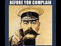

# Before you complain #shorts (2021-05-25)

## Description

Blogging Theology is on Instagram: https://www.instagram.com/bloggingtheology1/
Please consider supporting my work on Patreon: https://www.patreon.com/Bloggingtheology?fan_landing=true

## Summary of [Before you complain #shorts](https://www.youtube.com/watch?v=lxHp0hWjR0g)

*This summary is AI generated - there may be inaccuracies. *

### [00:00:00](https://www.youtube.com/watch?v=lxHp0hWjR0g&t=0) - [00:00:00](https://www.youtube.com/watch?v=lxHp0hWjR0g&t=0)

a Muslim woman quotes a saying attributed to Muhammad, the prophet of Islam, to remind people that it is better to be content with what they have than to complain. This reminder is an important reminder to not take things for granted, and to be grateful for what we have.

**[00:00:00](https://www.youtube.com/watch?v=lxHp0hWjR0g&t=0)** a Muslim woman quotes a saying attributed to Muhammad, the prophet of Islam, to remind people that it is better to be content with what they have than to complain. This reminder is an important reminder to not take things for granted, and to be grateful for what we have.

<h2>Full transcript with timestamps: CLICK TO EXPAND</h2>

[0:00:01](https://youtu.be/lxHp0hWjR0g?t=1) Before you complain. 'Whoever among you wakes 
up secure in his property, healthy in his body,    
[0:00:10](https://youtu.be/lxHp0hWjR0g?t=10) and he has his food for the day, it is 
as if he were given the entire world!'    
[0:00:18](https://youtu.be/lxHp0hWjR0g?t=18) An authentic saying of Muhammad, prophet of God.  

