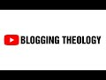

# Blogging Theology New Trailer (2021-10-28 12:29:06+00:00)

## Description

Welcome to Blogging Theology! 

Blogging Theology is my small attempt to introduce some academic and scholarly content to the subject matter of comparative religion, especially concerning the Abrahamic faiths Judaism, Christianity and Islam. 

I have been enormously privileged to interview leading scholars  from the universities of Oxford, Cambridge, Yale, Princeton, and Zaytuna College. I review books, occasionally talk about current affairs, and produce daily shorts. See also my ironically entitled ‘No design’ posts on the Community tab.  

You can follow Blogging Theology on Instagram, TikTok, and Twitter.

As this channel has grown larger I realise how important it is to control the content I produce so I would ask that folks ask my permission before copying videos and translating them into other languages. 

Thank you all for your wonderful support and encouragement. I really do appreciate it. 

Till next time!

## Summary of [Blogging Theology New Trailer](https://www.youtube.com/watch?v=H-UO4G-m7E0)

*This is an AI generated summary. There may be inaccuracies. *

### [00:00:00](https://www.youtube.com/watch?v=H-UO4G-m7E0&t=0) - [00:00:00](https://www.youtube.com/watch?v=H-UO4G-m7E0&t=0)

Blogging Theology is a channel dedicated to providing academic and scholarly content on comparative religion, with a focus on the Abrahamic faiths of Judaism, Christianity, and Islam. The channel features interviews with leading scholars from various universities, reviews books, and produces daily shorts. Additionally, the channel has a social media presence on Instagram, TikTok, and Twitter. The channel asks for permission before copying videos and translating them into other languages.

**[00:00:00](https://www.youtube.com/watch?v=H-UO4G-m7E0&t=0)** Blogging theology is a channel that provides academic and scholarly content on comparative religion, particularly pertaining to the Abrahamic faiths Judaism, Christianity, and Islam. The channel interviews leading scholars from various universities, reviews books occasionally, and produces daily shorts. Additionally, the channel has a social media presence: Instagram, TikTok, and Twitter. The channel asks for permission before copying videos and translating them into other languages. Thanks to the channel's wonderful support and encouragement, the creator appreciates it immensely.

## Full transcript with timestamps

[0:00:02](https://youtu.be/H-UO4G-m7E0?t=2) welcome to blogging theology  
[0:00:05](https://youtu.be/H-UO4G-m7E0?t=5) blogging theology is my small attempt to  
[0:00:07](https://youtu.be/H-UO4G-m7E0?t=7) introduce some academic and scholarly  
[0:00:10](https://youtu.be/H-UO4G-m7E0?t=10) content to the subject matter of  
[0:00:12](https://youtu.be/H-UO4G-m7E0?t=12) comparative religion  
[0:00:14](https://youtu.be/H-UO4G-m7E0?t=14) especially concerning the abrahamic  
[0:00:16](https://youtu.be/H-UO4G-m7E0?t=16) faiths judaism christianity and islam  
[0:00:21](https://youtu.be/H-UO4G-m7E0?t=21) i have been enormously privileged to  
[0:00:23](https://youtu.be/H-UO4G-m7E0?t=23) interview leading scholars from the  
[0:00:25](https://youtu.be/H-UO4G-m7E0?t=25) universities of oxford cambridge yale  
[0:00:28](https://youtu.be/H-UO4G-m7E0?t=28) princeton and zaytuna college  
[0:00:32](https://youtu.be/H-UO4G-m7E0?t=32) i review books occasionally talk about  
[0:00:34](https://youtu.be/H-UO4G-m7E0?t=34) current affairs and produce daily shorts  
[0:00:38](https://youtu.be/H-UO4G-m7E0?t=38) see also my ironically entitled no  
[0:00:41](https://youtu.be/H-UO4G-m7E0?t=41) design posts on the community tab  
[0:00:45](https://youtu.be/H-UO4G-m7E0?t=45) you can follow blogging theology on  
[0:00:47](https://youtu.be/H-UO4G-m7E0?t=47) instagram tiktok and twitter  
[0:00:50](https://youtu.be/H-UO4G-m7E0?t=50) as this channel has grown larger i  
[0:00:52](https://youtu.be/H-UO4G-m7E0?t=52) realize how important it is to control  
[0:00:54](https://youtu.be/H-UO4G-m7E0?t=54) the content i produce  
[0:00:56](https://youtu.be/H-UO4G-m7E0?t=56) so i would ask that folks ask my  
[0:00:58](https://youtu.be/H-UO4G-m7E0?t=58) permission before copying videos and  
[0:01:01](https://youtu.be/H-UO4G-m7E0?t=61) translating them into other languages  
[0:01:05](https://youtu.be/H-UO4G-m7E0?t=65) thank you all for your wonderful support  
[0:01:07](https://youtu.be/H-UO4G-m7E0?t=67) and encouragement i really do appreciate  
[0:01:10](https://youtu.be/H-UO4G-m7E0?t=70) it  
[0:01:11](https://youtu.be/H-UO4G-m7E0?t=71) till next time  
