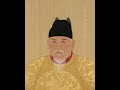

# Chinese Emperor praising the Prophet Muhammad (2021-07-07 17:39:48+00:00)

## Description

The Hundred-Word Eulogy by the Hongwu Emperor of China in Chinese: 
https://www.themathesontrust.org/library/hundred-word-eulogy-baizizan

## Full transcript with timestamps

[0:00:01](https://youtu.be/aiGhgfLnNl4?t=1) i would like to share with you a poem in  
[0:00:03](https://youtu.be/aiGhgfLnNl4?t=3) praise of muhammad  
[0:00:04](https://youtu.be/aiGhgfLnNl4?t=4) upon whom be peace which was written by  
[0:00:07](https://youtu.be/aiGhgfLnNl4?t=7) the founding  
[0:00:08](https://youtu.be/aiGhgfLnNl4?t=8) emperor of the ming dynasty of china  
[0:00:11](https://youtu.be/aiGhgfLnNl4?t=11) who reigned from 1368 to 1398.  
[0:00:15](https://youtu.be/aiGhgfLnNl4?t=15) the ming dynasty is popularly thought of  
[0:00:17](https://youtu.be/aiGhgfLnNl4?t=17) by chinese muslims as a golden age of  
[0:00:20](https://youtu.be/aiGhgfLnNl4?t=20) islam  
[0:00:21](https://youtu.be/aiGhgfLnNl4?t=21) in china during this period muslims  
[0:00:24](https://youtu.be/aiGhgfLnNl4?t=24) grew as a community not only because  
[0:00:27](https://youtu.be/aiGhgfLnNl4?t=27) existing families thrived  
[0:00:29](https://youtu.be/aiGhgfLnNl4?t=29) but also because they attracted greater  
[0:00:32](https://youtu.be/aiGhgfLnNl4?t=32) numbers of  
[0:00:32](https://youtu.be/aiGhgfLnNl4?t=32) converts to islam the overall success  
[0:00:36](https://youtu.be/aiGhgfLnNl4?t=36) and well-being experienced by muslims  
[0:00:38](https://youtu.be/aiGhgfLnNl4?t=38) during the ming dynasty  
[0:00:40](https://youtu.be/aiGhgfLnNl4?t=40) was due in no small part to the  
[0:00:42](https://youtu.be/aiGhgfLnNl4?t=42) muslim-friendly  
[0:00:43](https://youtu.be/aiGhgfLnNl4?t=43) actions and policies initiated by the  
[0:00:46](https://youtu.be/aiGhgfLnNl4?t=46) dynasties founder  
[0:00:48](https://youtu.be/aiGhgfLnNl4?t=48) the hong woo emperor who reigned from  
[0:00:50](https://youtu.be/aiGhgfLnNl4?t=50) 1368  
[0:00:52](https://youtu.be/aiGhgfLnNl4?t=52) to 1398. throughout his life the emperor  
[0:00:56](https://youtu.be/aiGhgfLnNl4?t=56) surrounded himself with muslims  
[0:00:58](https://youtu.be/aiGhgfLnNl4?t=58) both in his personal affairs and in  
[0:01:01](https://youtu.be/aiGhgfLnNl4?t=61) connection with official  
[0:01:02](https://youtu.be/aiGhgfLnNl4?t=62) matters of state the poem i'm about to  
[0:01:06](https://youtu.be/aiGhgfLnNl4?t=66) read  
[0:01:06](https://youtu.be/aiGhgfLnNl4?t=66) is an extraordinary medieval document in  
[0:01:09](https://youtu.be/aiGhgfLnNl4?t=69) praise of the prophet muhammad upon him  
[0:01:11](https://youtu.be/aiGhgfLnNl4?t=71) be  
[0:01:12](https://youtu.be/aiGhgfLnNl4?t=72) peace authored by the founding emperor  
[0:01:15](https://youtu.be/aiGhgfLnNl4?t=75) of the ming dynasty himself  
[0:01:18](https://youtu.be/aiGhgfLnNl4?t=78) i will link below to recording of the  
[0:01:20](https://youtu.be/aiGhgfLnNl4?t=80) poem in  
[0:01:21](https://youtu.be/aiGhgfLnNl4?t=81) chinese the poem is entitled  
[0:01:25](https://youtu.be/aiGhgfLnNl4?t=85) the hundred word eulogy  
[0:01:28](https://youtu.be/aiGhgfLnNl4?t=88) by the hongwoo emperor of china  
[0:01:32](https://youtu.be/aiGhgfLnNl4?t=92) from the beginning of the universe  
[0:01:35](https://youtu.be/aiGhgfLnNl4?t=95) heaven has already appointed  
[0:01:37](https://youtu.be/aiGhgfLnNl4?t=97) the great sage born in the west  
[0:01:41](https://youtu.be/aiGhgfLnNl4?t=101) who transmits and teaches  
[0:01:44](https://youtu.be/aiGhgfLnNl4?t=104) he received heavenly scripture in a  
[0:01:47](https://youtu.be/aiGhgfLnNl4?t=107) 30-part book  
[0:01:49](https://youtu.be/aiGhgfLnNl4?t=109) to guide all creatures  
[0:01:52](https://youtu.be/aiGhgfLnNl4?t=112) master and teacher of myriads leader of  
[0:01:56](https://youtu.be/aiGhgfLnNl4?t=116) countless sages with support from the  
[0:01:59](https://youtu.be/aiGhgfLnNl4?t=119) divine  
[0:02:00](https://youtu.be/aiGhgfLnNl4?t=120) to protect his nation's people with five  
[0:02:04](https://youtu.be/aiGhgfLnNl4?t=124) daily prayers silently wishing for peace  
[0:02:09](https://youtu.be/aiGhgfLnNl4?t=129) with his heart towards the true lord  
[0:02:12](https://youtu.be/aiGhgfLnNl4?t=132) inspiring the poor ones saving them from  
[0:02:15](https://youtu.be/aiGhgfLnNl4?t=135) calamity  
[0:02:17](https://youtu.be/aiGhgfLnNl4?t=137) seeing through the unseen redeeming  
[0:02:20](https://youtu.be/aiGhgfLnNl4?t=140) souls and  
[0:02:22](https://youtu.be/aiGhgfLnNl4?t=142) spirits from all wrongdoings  
[0:02:25](https://youtu.be/aiGhgfLnNl4?t=145) a mercy to the world leading the path  
[0:02:29](https://youtu.be/aiGhgfLnNl4?t=149) for the past and the present reducing  
[0:02:33](https://youtu.be/aiGhgfLnNl4?t=153) evil  
[0:02:34](https://youtu.be/aiGhgfLnNl4?t=154) to the one the name of his teaching  
[0:02:38](https://youtu.be/aiGhgfLnNl4?t=158) pure and true mohammed  
[0:02:42](https://youtu.be/aiGhgfLnNl4?t=162) the most noble sage  
[0:02:46](https://youtu.be/aiGhgfLnNl4?t=166) until next time  
