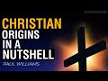

# Christian Origins in A Nutshell | Paul Williams (2021-09-13)

## Description

Christian Origins in A Nutshell from The Real Jesus: Then and Now by Professor Geza Vermes of Oxford University.

## Summary of [Christian Origins in A Nutshell | Paul Williams](https://www.youtube.com/watch?v=QCl5DL_wf3w)

*This summary is AI generated - there may be inaccuracies. *

### [00:00:00](https://www.youtube.com/watch?v=QCl5DL_wf3w&t=0) - [00:15:00](https://www.youtube.com/watch?v=QCl5DL_wf3w&t=900)

This video provides a brief overview of the origins of Christianity, focusing on the doctrines of the Trinity and the incarnation of Jesus. Geza Vermes, a professor of Jewish studies, writes that in 325 AD, the emperor Constantine summoned and opened the ecumenical council at Nicaea, at which 318 bishops declared Jesus God, consubstantial with the Father. This doctrine, called the Nicene Creed, became the essential beliefs of Christianity. From then on, Christianity's influence on public life increased steadily.

**[00:00:00](https://www.youtube.com/watch?v=QCl5DL_wf3w&t=0)** This video provides a brief overview of Christian origins, focusing on the doctrines of the Trinity and the incarnation of Jesus. Geza Vermes, a professor of Jewish studies, writes that in 325 AD, the emperor Constantine summoned and opened the ecumenical council at Nicaea, at which 318 bishops declared Jesus God, consubstantial with the Father. This doctrine, called the Nicene Creed, became the essential beliefs of Christianity. From then on, Christianity's influence on public life increased steadily. Bishops and theologians in the Roman Empire developed the theology of the holy trinity, while in the east, Alexandria became the center of learning in biblical studies. Christian asceticism and monasticism were spread by the Egyptian desert fathers, and classical civilization was passed on to the west by the fathers of monasticism, such as Saint Benedict. In the end, Christianity became the leading religion in the history of the middle ages.
* **[00:05:00](https://www.youtube.com/watch?v=QCl5DL_wf3w&t=300)** Paul Williams explains that the origins of Christianity lie in Hellenistic philosophy, which was influential in the Roman Empire. Christianity began as a Jewish movement, but it developed and changed over the centuries. The author of the fourth gospel, John, presents Jesus in an exalted manner, which is the first step towards deifying Christ. Saint Paul was the next big figure in the development of Christianity.
* **[00:10:00](https://www.youtube.com/watch?v=QCl5DL_wf3w&t=600)** According to Paul Williams, the earliest form of Christianity preserves a portrait of Jesus that is similar to the Gospel of Matthew and Gospel of Luke, but is different from the Gospel of John. The authenticity of some of Paul's letters is disputed, but most historians agree that they were written around 60 AD.
* **[00:15:00](https://www.youtube.com/watch?v=QCl5DL_wf3w&t=900)** According to one of the world's leading experts on early Christianity, the new testament, written in greek, played an essential part in the transformation of the original semitic gospel into a hellenistic religious system.

## Full transcript with timestamps

[0:00:00](https://youtu.be/QCl5DL_wf3w?t=0) This video aims to give you Christian origins in 
a nutshell. If you want a brief explanation of    
[0:00:09](https://youtu.be/QCl5DL_wf3w?t=9) Christian origins by a top expert i recommend this 
book: Searching for the Real Jesus by a guy called    
[0:00:16](https://youtu.be/QCl5DL_wf3w?t=16) Geza Vermes who is a professor of Jewish Studies 
at the University of Oxford and he's acknowledged    
[0:00:23](https://youtu.be/QCl5DL_wf3w?t=23) as a leading expert on the historical jesus, 
jesus as he really was in the first century,    
[0:00:29](https://youtu.be/QCl5DL_wf3w?t=29) and also Christian origins, the origins 
of Christianity. And in this book he has    
[0:00:34](https://youtu.be/QCl5DL_wf3w?t=34) a chapter called Christian Origins in a Nutshell, 
and i want to read you a bit from it so this is    
[0:00:40](https://youtu.be/QCl5DL_wf3w?t=40) an historian's academic summary of the origins 
of christianity which i think is really useful    
[0:00:45](https://youtu.be/QCl5DL_wf3w?t=45) really insightful and we'll show you really how uh 
christianity developed over the centuries and    
[0:00:52](https://youtu.be/QCl5DL_wf3w?t=52) changed from really being a very different kind 
of jewish faith to the much later hellenistic    
[0:00:59](https://youtu.be/QCl5DL_wf3w?t=59) faith that we are familiar with today. So 
Geza Vermes writes on page 161 of the book:    
[0:01:07](https://youtu.be/QCl5DL_wf3w?t=67) In 325 AD the emperor Constantine summoned 
and opened the ecumenical council at Nicaea    
[0:01:16](https://youtu.be/QCl5DL_wf3w?t=76) at which 318 bishops declared Jesus God, 
consubstantial with the Father. Consubstantial    
[0:01:24](https://youtu.be/QCl5DL_wf3w?t=84) by the way is a Latin phrase meaning of the same 
being of the same substance so whatever the father    
[0:01:30](https://youtu.be/QCl5DL_wf3w?t=90) was the son was basically according to the nicene 
creed. The essential beliefs of christianity entail    
[0:01:38](https://youtu.be/QCl5DL_wf3w?t=98) the holy trinity, the incarnation of the son, the 
redemption of mankind through the crucifixion    
[0:01:44](https://youtu.be/QCl5DL_wf3w?t=104) and resurrection of christ, and the universality 
of the church established to guide and nourish    
[0:01:51](https://youtu.be/QCl5DL_wf3w?t=111) the faithful until the final judgment 
and the inauguration of eternal life.    
[0:01:57](https://youtu.be/QCl5DL_wf3w?t=117) From then on he writes the influence of 
christianity on public life exercise under    
[0:02:04](https://youtu.be/QCl5DL_wf3w?t=124) the direction of bishops and theologians 
steadily increased in the roman empire    
[0:02:10](https://youtu.be/QCl5DL_wf3w?t=130) and in fact what you get is the emergence of 
the medieval period after constantine i think    
[0:02:16](https://youtu.be/QCl5DL_wf3w?t=136) at nicaea the heresy of arius who's the bad guy 
who denied the true divinity of jesus was refuted    
[0:02:24](https://youtu.be/QCl5DL_wf3w?t=144) by saint athanasius of alexandria aries by the 
way sometimes thought of as a unitarian and maybe    
[0:02:32](https://youtu.be/QCl5DL_wf3w?t=152) he was but he used the language of divine language 
of god but he also believed at least it's credited    
[0:02:40](https://youtu.be/QCl5DL_wf3w?t=160) to him that he said that there was a time when 
the son was not so unlike the father who was the    
[0:02:47](https://youtu.be/QCl5DL_wf3w?t=167) eternal uncreated god the son came into existence 
at some point in the past so he wasn't god in the    
[0:02:54](https://youtu.be/QCl5DL_wf3w?t=174) sense that jews or muslims would understand god 
he was a created being during the 4th century the    
[0:03:01](https://youtu.be/QCl5DL_wf3w?t=181) theologians of the theology rather of the holy 
trinity was fully developed by the greek church    
[0:03:08](https://youtu.be/QCl5DL_wf3w?t=188) fathers people like saint basil saint gregory of 
nissa and saint gregory of nazianzus in the west    
[0:03:16](https://youtu.be/QCl5DL_wf3w?t=196) saint ambrose and especially central augustine 
who's a huge figure in western civilization by    
[0:03:22](https://youtu.be/QCl5DL_wf3w?t=202) the way were the shining lights over the whole 
spectrum of theological doctrine origin of    
[0:03:30](https://youtu.be/QCl5DL_wf3w?t=210) alexandria in the east and saint jerome in the 
west dominated the field of biblical studies    
[0:03:37](https://youtu.be/QCl5DL_wf3w?t=217) and the egyptian desert fathers led by saint 
anthony sowed the seeds of christian asceticism    
[0:03:45](https://youtu.be/QCl5DL_wf3w?t=225) monastic life and aestheticism by the way is 
this focus on the denial of the self so you    
[0:03:50](https://youtu.be/QCl5DL_wf3w?t=230) don't get married you you focus on celibacy you 
might live as a hermit uh in a cave somewhere or    
[0:03:56](https://youtu.be/QCl5DL_wf3w?t=236) you might live in a monastery um famously uh saint 
anthony you know founded monasticism in the west    
[0:04:04](https://youtu.be/QCl5DL_wf3w?t=244) monastic life giza vermish writes was finally 
organized by saint benedict in the sixth century    
[0:04:11](https://youtu.be/QCl5DL_wf3w?t=251) and his disciples were largely responsible for the 
transmission of classical civilization to western    
[0:04:17](https://youtu.be/QCl5DL_wf3w?t=257) europe because at that time of course europe 
was in the dark ages whilst in the muslim world    
[0:04:23](https://youtu.be/QCl5DL_wf3w?t=263) antalucia islamic spain and further east there 
was a massive flourishing of learning and science    
[0:04:31](https://youtu.be/QCl5DL_wf3w?t=271) and culture in europe what we call here it was 
a time of the dark ages and we don't tend to    
[0:04:36](https://youtu.be/QCl5DL_wf3w?t=276) know about these other things very well anyway 
back to giza virmish after the fall of rome    
[0:04:42](https://youtu.be/QCl5DL_wf3w?t=282) in ad476 this is when the roman empire ended um 
in the west the papacy especially with gregory    
[0:04:51](https://youtu.be/QCl5DL_wf3w?t=291) the great took on a significant role in the 
religious cultural and political life and    
[0:04:57](https://youtu.be/QCl5DL_wf3w?t=297) christianity became or played a leading part 
in the history of the middle ages particularly    
[0:05:04](https://youtu.be/QCl5DL_wf3w?t=304) through the papacy which became probably the most 
powerful single force in the west at that time    
[0:05:10](https://youtu.be/QCl5DL_wf3w?t=310) anyway though fundamentally hellenistic in thought 
from the second century onwards and roman in    
[0:05:18](https://youtu.be/QCl5DL_wf3w?t=318) organization of after constantine the christian 
movement was originally the product of the jewish    
[0:05:25](https://youtu.be/QCl5DL_wf3w?t=325) mind excuse me so hellenistic in thought that 
means influenced by greek philosophy going back to    
[0:05:32](https://youtu.be/QCl5DL_wf3w?t=332) i don't know plato aristotle and other people 
500 years before christ this philosophy of    
[0:05:39](https://youtu.be/QCl5DL_wf3w?t=339) philosophies were hugely influential in the roman 
empire and they had a big impact on christian    
[0:05:46](https://youtu.be/QCl5DL_wf3w?t=346) thought as well from the second century onwards he 
writes and the church was hugely influenced by the    
[0:05:53](https://youtu.be/QCl5DL_wf3w?t=353) roman empire in terms of his organization after 
constant time he writes but the christian movement    
[0:06:00](https://youtu.be/QCl5DL_wf3w?t=360) was originally the product of the jewish mind it's 
very important point fully developed christianity    
[0:06:06](https://youtu.be/QCl5DL_wf3w?t=366) what we call christianity did not fall from heaven 
its beginnings and early progress may be detected    
[0:06:15](https://youtu.be/QCl5DL_wf3w?t=375) and followed in the writings of the new testament 
which he says were written between ad50 and 120    
[0:06:23](https://youtu.be/QCl5DL_wf3w?t=383) a.d although he doesn't say the last to be written 
was probably the second letter of peter which is    
[0:06:29](https://youtu.be/QCl5DL_wf3w?t=389) now seen by scholars as a forgery not by peter 
but by written in the middle of the second century    
[0:06:36](https://youtu.be/QCl5DL_wf3w?t=396) so he continues the new testament consists of 27 
greek documents four gospels or theological lives    
[0:06:43](https://youtu.be/QCl5DL_wf3w?t=403) of jesus the acts of the apostles outlining 
the early history of the christian church    
[0:06:50](https://youtu.be/QCl5DL_wf3w?t=410) there are 21 letters discussing christian belief 
and practice addressed to named or anonymous    
[0:06:57](https://youtu.be/QCl5DL_wf3w?t=417) churches or church leaders and the apocalyptic 
book of revelation this is the last book in the    
[0:07:03](https://youtu.be/QCl5DL_wf3w?t=423) bible in the christian bible that is describing 
the ultimate victory of christ and god marked by    
[0:07:11](https://youtu.be/QCl5DL_wf3w?t=431) the descent on earth of the heavenly jerusalem 
these the fourth gospel the gospel of john    
[0:07:19](https://youtu.be/QCl5DL_wf3w?t=439) and the letters of paul provide the best 
insight into the evolution of christian theology    
[0:07:26](https://youtu.be/QCl5DL_wf3w?t=446) because christian theology changed 
developed transformed over the    
[0:07:31](https://youtu.be/QCl5DL_wf3w?t=451) centuries it wasn't fixed from the beginning 
this is what we know from history now    
[0:07:36](https://youtu.be/QCl5DL_wf3w?t=456) the gospels of mark matthew and luke 
and the acts of the apostles he writes    
[0:07:41](https://youtu.be/QCl5DL_wf3w?t=461) constitute the chief sources for understanding of 
christian origins the author of the fourth gospel    
[0:07:50](https://youtu.be/QCl5DL_wf3w?t=470) notice he doesn't say john because we don't know 
who wrote the gospels it's a commonplace now    
[0:07:55](https://youtu.be/QCl5DL_wf3w?t=475) amongst scholarship that matthew mark luke 
and john we don't really know who wrote them    
[0:08:00](https://youtu.be/QCl5DL_wf3w?t=480) they're anonymous if you read the text it doesn't 
mention who wrote them doesn't mention any names    
[0:08:05](https://youtu.be/QCl5DL_wf3w?t=485) the author of the fourth gospel he writes 
imbued in hellenistic mysticism and philosophy    
[0:08:12](https://youtu.be/QCl5DL_wf3w?t=492) can hardly be identical with the apostle john 
the uneducated and common galilean fisherman    
[0:08:20](https://youtu.be/QCl5DL_wf3w?t=500) of acts 4 13. interestingly if you look in 
acts which is the history of the early church    
[0:08:26](https://youtu.be/QCl5DL_wf3w?t=506) the disciples of jesus are called uh uh 
are unlettered uneducated because they    
[0:08:32](https://youtu.be/QCl5DL_wf3w?t=512) would be they were fishermen and how could 
such people produce uh you know the second    
[0:08:37](https://youtu.be/QCl5DL_wf3w?t=517) the fourth gospel you know this work of 
mystical philosophy doesn't make any sense    
[0:08:44](https://youtu.be/QCl5DL_wf3w?t=524) his jesus the gospel of john's jesus a 
stranger from heaven presented as the    
[0:08:51](https://youtu.be/QCl5DL_wf3w?t=531) temporary incarnation or the temporal incarnation 
i should say of the eternal word of god    
[0:08:57](https://youtu.be/QCl5DL_wf3w?t=537) is the first major step towards the deification 
of christ in the nicene creed so john's gospel    
[0:09:04](https://youtu.be/QCl5DL_wf3w?t=544) is presents jesus such an exalted figure that 
he becomes a first step towards the statement    
[0:09:11](https://youtu.be/QCl5DL_wf3w?t=551) at nicaea that jesus is god this gospel 
probably originated between 100 and 110 a.d    
[0:09:19](https://youtu.be/QCl5DL_wf3w?t=559) so in the second century according to giza varmish 
it was compiled before 125 a.d because of the date    
[0:09:27](https://youtu.be/QCl5DL_wf3w?t=567) of the earliest papyrus fragments of john that we 
have but after the completion in the final quarter    
[0:09:36](https://youtu.be/QCl5DL_wf3w?t=576) of the first century of the doctrinally much less 
developed synoptic gospels so the four gospels    
[0:09:42](https://youtu.be/QCl5DL_wf3w?t=582) were written mark is the first according to 
scholars now matthew and luke wrote later and used    
[0:09:48](https://youtu.be/QCl5DL_wf3w?t=588) mark and then after them john wrote his gospel 
finally published in the early second century    
[0:09:56](https://youtu.be/QCl5DL_wf3w?t=596) the next chief artisan of christianity was 
saint paul so the next big figure who gave    
[0:10:02](https://youtu.be/QCl5DL_wf3w?t=602) us the christianity we have today with 
saint paul a jew of the greek diaspora    
[0:10:08](https://youtu.be/QCl5DL_wf3w?t=608) from tarsus in what is now turkey he had not known 
the historical jesus this is a really important    
[0:10:15](https://youtu.be/QCl5DL_wf3w?t=615) point paul never claimed no one ever thought 
that he met jesus he had a vision of course    
[0:10:21](https://youtu.be/QCl5DL_wf3w?t=621) on the road to damascus but he never met the 
historical jesus like his disciples had very    
[0:10:26](https://youtu.be/QCl5DL_wf3w?t=626) interesting and built his doctrine partly 
on tradition and partly on mystical vision    
[0:10:33](https://youtu.be/QCl5DL_wf3w?t=633) and insight he had lots of visions and mystical 
uh insights as well in his letters to the churches    
[0:10:40](https://youtu.be/QCl5DL_wf3w?t=640) founded by him through syria asia minor that's 
turkey today greece and rome he depicted jesus    
[0:10:48](https://youtu.be/QCl5DL_wf3w?t=648) who he never met as the redeemer of jews and 
gentiles thanks to his death and resurrection    
[0:10:55](https://youtu.be/QCl5DL_wf3w?t=655) and proclaimed his impending return to earth to 
bring about salvation for the whole of mankind    
[0:11:04](https://youtu.be/QCl5DL_wf3w?t=664) that's a pretty big claim about jesus paul's 
theological vision of the work of christ    
[0:11:10](https://youtu.be/QCl5DL_wf3w?t=670) was recorded in greek in his genuine epistles 
epistle's just another way of saying letters he    
[0:11:15](https://youtu.be/QCl5DL_wf3w?t=675) actually wrote literally wrote letters romans 
one and two corinthians galatians philippians    
[0:11:22](https://youtu.be/QCl5DL_wf3w?t=682) philemon and one and two thessalonians 
approximately written between 50 and 60 a.d    
[0:11:30](https://youtu.be/QCl5DL_wf3w?t=690) testifying to a beginning of christological 
speculation half a century before john's    
[0:11:38](https://youtu.be/QCl5DL_wf3w?t=698) gospel the fourth gospel by the way that list 
of paul's letters he says genuine epistles    
[0:11:44](https://youtu.be/QCl5DL_wf3w?t=704) there are other letters by paul which are now 
seen by most historians as forgeries for example    
[0:11:49](https://youtu.be/QCl5DL_wf3w?t=709) one and two ty one and two timothy and titus and 
probably the letter to the colossians probably the    
[0:11:56](https://youtu.be/QCl5DL_wf3w?t=716) letter to the ephesians are fake as well although 
there's more dispute about those two letters    
[0:12:02](https://youtu.be/QCl5DL_wf3w?t=722) so the earliest stage of the tradition relative to 
the historical jesus is preserved in the gospels    
[0:12:09](https://youtu.be/QCl5DL_wf3w?t=729) of matthew mark and luke they are called these 
synoptic gospels because they follow the same    
[0:12:16](https://youtu.be/QCl5DL_wf3w?t=736) general point of view and storyline and can be set 
out in three parallel columns in a gospel synopsis    
[0:12:25](https://youtu.be/QCl5DL_wf3w?t=745) by the way the word synoptic in 
greek the word optic is where we get    
[0:12:30](https://youtu.be/QCl5DL_wf3w?t=750) optic where we see things and sin means with 
syn optic so you can see them together so if    
[0:12:36](https://youtu.be/QCl5DL_wf3w?t=756) you look at the three columns of matthew mark 
and luke you'll notice basically or very often    
[0:12:42](https://youtu.be/QCl5DL_wf3w?t=762) the language is identical in greek and so you 
can see them together john is very different    
[0:12:48](https://youtu.be/QCl5DL_wf3w?t=768) anyway they they represent matthew mark and luke 
the least evolved form of the portrait of jesus    
[0:12:55](https://youtu.be/QCl5DL_wf3w?t=775) and are commonly dated to 70 to 100 a.d the entire 
new testament including the synoptic gospels    
[0:13:04](https://youtu.be/QCl5DL_wf3w?t=784) is in greek and was probably composed in 
greek remember by the way jesus was not greek    
[0:13:11](https://youtu.be/QCl5DL_wf3w?t=791) however jesus and his original audience 
were aramaic speaking galilean jews    
[0:13:18](https://youtu.be/QCl5DL_wf3w?t=798) so greek was not their language uh they spoke 
aramaic that was the the language of the masses    
[0:13:24](https://youtu.be/QCl5DL_wf3w?t=804) in that part of the world not greek it is possible 
that among early jewish christian groups such    
[0:13:31](https://youtu.be/QCl5DL_wf3w?t=811) as the ebionites or the poor that's simply what 
ebonites means in hebrew there existed an aramaic    
[0:13:38](https://youtu.be/QCl5DL_wf3w?t=818) gospel this is really interesting so he's saying 
that it's possible among the earliest jewish    
[0:13:44](https://youtu.be/QCl5DL_wf3w?t=824) christian groups there was an aramaic gospel 
in the same language as jesus himself of course    
[0:13:51](https://youtu.be/QCl5DL_wf3w?t=831) church tradition refers to matthew recording 
the teaching of jesus in the hebrew dialect    
[0:13:59](https://youtu.be/QCl5DL_wf3w?t=839) but no traces of it have survived so this may 
be what most what muslims may call the original    
[0:14:06](https://youtu.be/QCl5DL_wf3w?t=846) injil this original aramaic gospel not the matthew 
mark luke and john of the new testament and not    
[0:14:12](https://youtu.be/QCl5DL_wf3w?t=852) what paul preached because he never met jesus of 
course so in fact apart from a few aramaic phrases    
[0:14:20](https://youtu.be/QCl5DL_wf3w?t=860) preserved in mark's gospel they're there if you 
look for them for example abba which means father    
[0:14:26](https://youtu.be/QCl5DL_wf3w?t=866) in english is an aramaic word and another term 
talitha kum probably mispronounced that it means    
[0:14:32](https://youtu.be/QCl5DL_wf3w?t=872) little girl arise so this is one of the miracles 
of jesus apart from those few words in aramaic    
[0:14:40](https://youtu.be/QCl5DL_wf3w?t=880) jesus's own words have all faded from memory 
so there we don't have jesus's words in the new    
[0:14:48](https://youtu.be/QCl5DL_wf3w?t=888) testament at all we have just a couple well just 
three words as far as i can see abba and talitha    
[0:14:54](https://youtu.be/QCl5DL_wf3w?t=894) come and that's it unlike say in islam where we 
have the words of the prophet uh in authentic    
[0:15:01](https://youtu.be/QCl5DL_wf3w?t=901) you know reliable hadith in the collections of 
bukhari a muslim and so on in christianity we    
[0:15:06](https://youtu.be/QCl5DL_wf3w?t=906) don't have the words of jesus they simply have 
disappeared no traces of them have survived    
[0:15:12](https://youtu.be/QCl5DL_wf3w?t=912) quote unquote uh the fact that the new testament 
was handed down in greek not the language of jesus    
[0:15:20](https://youtu.be/QCl5DL_wf3w?t=920) played an essential part in the transformation 
of the original semitic gospel into a hellenistic    
[0:15:27](https://youtu.be/QCl5DL_wf3w?t=927) religious system created by philosophically 
educated greek church fathers wow just reread that    
[0:15:36](https://youtu.be/QCl5DL_wf3w?t=936) because it's such an important statement the fact 
that the new testament was handed down in greek    
[0:15:41](https://youtu.be/QCl5DL_wf3w?t=941) written in greek played an essential part 
in the transformation complete change    
[0:15:48](https://youtu.be/QCl5DL_wf3w?t=948) of the original semitic gospel written 
in the words of jesus in aramaic into    
[0:15:55](https://youtu.be/QCl5DL_wf3w?t=955) a hellenistic religious system so in other words 
a heavily uh influenced pagan philosophical    
[0:16:03](https://youtu.be/QCl5DL_wf3w?t=963) thought world a way of seeing religion a way 
of seeing jesus and his life created by he says    
[0:16:10](https://youtu.be/QCl5DL_wf3w?t=970) philosophically educated greek church fathers so 
here we have a linguistic cultural and religious    
[0:16:17](https://youtu.be/QCl5DL_wf3w?t=977) transformation according to one of the world's 
leading experts on early christianity and jesus    
[0:16:24](https://youtu.be/QCl5DL_wf3w?t=984) to continue the synoptic gospels of which mark 
is thought to be the earliest composed about    
[0:16:31](https://youtu.be/QCl5DL_wf3w?t=991) 70 a.d followed by matthew and luke between eight 
were followed by matthew and luke about 80 to 100    
[0:16:38](https://youtu.be/QCl5DL_wf3w?t=998) a.d offer a theologically less developed life 
story of jesus of nazareth who is he for him    
[0:16:47](https://youtu.be/QCl5DL_wf3w?t=1007) gizer varmish a galilean charismatic healer 
exorcist and teacher who preached a message of    
[0:16:55](https://youtu.be/QCl5DL_wf3w?t=1015) repentance and invited his followers to prepare 
themselves for entry into the kingdom of god    
[0:17:02](https://youtu.be/QCl5DL_wf3w?t=1022) so if you look at the synoptic gospels you get 
this uh impression of a jesus a jewish figure    
[0:17:10](https://youtu.be/QCl5DL_wf3w?t=1030) who is much less theologically developed than 
saying paul or in john and he is according to    
[0:17:16](https://youtu.be/QCl5DL_wf3w?t=1036) giza varmish a charismatic leader exorcist teacher 
who preached repentance and so on now this is    
[0:17:23](https://youtu.be/QCl5DL_wf3w?t=1043) a commonplace uh amongst historians this is a 
very common view that they have concluded with    
[0:17:29](https://youtu.be/QCl5DL_wf3w?t=1049) and they usually one word sums up uh who jesus was 
in scholarship it is a prophet that's who he he    
[0:17:36](https://youtu.be/QCl5DL_wf3w?t=1056) was his mission according to giza vermish was cut 
short by the intervention of the roman governor    
[0:17:44](https://youtu.be/QCl5DL_wf3w?t=1064) pilate who on charges leveled against jesus by the 
jewish priestly authorities condemned him to die    
[0:17:53](https://youtu.be/QCl5DL_wf3w?t=1073) on the cross his disciples claimed however 
to have seen him alive in repeated visions    
[0:18:01](https://youtu.be/QCl5DL_wf3w?t=1081) and were convinced that the success of their 
charismatic healing and teaching activity    
[0:18:06](https://youtu.be/QCl5DL_wf3w?t=1086) in the name of jesus was the proof that god had 
raised him from the dead and that's the end of    
[0:18:14](https://youtu.be/QCl5DL_wf3w?t=1094) that chapter absolutely fascinating there are 
many interesting chapters in this book i might    
[0:18:19](https://youtu.be/QCl5DL_wf3w?t=1099) read some more of them in the future but he he 
rightly stresses giza verbis rightly stresses the    
[0:18:25](https://youtu.be/QCl5DL_wf3w?t=1105) the total transformation of the original 
jewish movement uh familiar to jesus and    
[0:18:31](https://youtu.be/QCl5DL_wf3w?t=1111) his actual disciples to the later hellenistic 
philosophical system involving a trinity and a    
[0:18:38](https://youtu.be/QCl5DL_wf3w?t=1118) dying and rising savior figure very common motif 
in the ancient greco-roman world by the way this    
[0:18:46](https://youtu.be/QCl5DL_wf3w?t=1126) kind of religious system fits very comfortably in 
the graco roman pago pagan world but giza webber    
[0:18:53](https://youtu.be/QCl5DL_wf3w?t=1133) should argue and as it's a common place really 
that was not the original religion of jesus it's    
[0:18:59](https://youtu.be/QCl5DL_wf3w?t=1139) not what he preached to his galilean countrymen 
i hope you found that of interest until next time  
