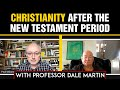

# Christianity after the New Testament period with Professor Dale Martin (2022-02-15 13:30:05+00:00)

## Description

You Can Support My Work on Patreon:
https://www.patreon.com/Bloggingtheology

My Paypal Link: 
https://www.paypal.com/paypalme/bloggingtheology?locale.x=en_GB

Chapters: 
0:00 - Introduction
0:17 - Topic of the stream
0:54 - Brother Paul reads an excerpt from the Book: New Testament History & Literature
1:56 - Existence of the Historical Jesus
8:35 - Origins of the New Testament & the evolution of its subsequent Theology
11:29 - Evolution of the Church
15:36 - Canonization of the Four Gospels & Analysing the Authorship of the New Testament
20:14 - Development of the Christian Doctrine & its various theologies & practices
38:08 - Persecution of the Christians
44:02 - Brief Biography of Origen
46:59 - Was Constantine a Christian?
52:34 - The Myth of Constantine making Christianity the official religion of Rome & his actual role
55:07 - Origins of Roman Catholicism & papal infallibility
57:12 - Global Spread of Christianity in the modern world & it becoming a World Religion
1:05:09 - Global Interactions between different Religious People
1:06:19 - Wrapping Up

## Summary of [Christianity after the New Testament period with Professor Dale Martin](https://www.youtube.com/watch?v=GYrUJnrlus0)

*This is an AI generated summary. There may be inaccuracies. *

### [00:00:00](https://www.youtube.com/watch?v=GYrUJnrlus0&t=0) - [01:00:00](https://www.youtube.com/watch?v=GYrUJnrlus0&t=3600)

In this video, Professor Dale Martin discusses Christianity after the New Testament period. He discusses how Christianity spread throughout the world after the death of Jesus Christ and how it underwent many transformations over its long history. He also discusses the importance of Emperor Constantine in advancing the religion.

**[00:00:00](https://www.youtube.com/watch?v=GYrUJnrlus0&t=0)** In his book "New Testament History and Literature," Yale University professor Dale Martin discusses how Christianity spread throughout the world after the death of Jesus Christ. After his death, Jesus' followers were scattered throughout the ancient Mediterranean world, with the majority of followers residing in Galilee. Although there were some early mentions of Jesus in secular sources, it was only after his followers wrote down their stories and scriptures that Jesus began to be widely recognized. Although the historical Jesus may never have existed, Christianity as we know it began with his followers.
* **[00:05:00](https://www.youtube.com/watch?v=GYrUJnrlus0&t=300)** In this video, Professor Dale Martin discusses the origins of Christianity and the difficulty of tracing it back to a single originator. He also discusses the lack of evidence that Jesus was considered divine by his followers in the New Testament period. Finally, he discusses the development of Christianity into a world religion.
* **[00:10:00](https://www.youtube.com/watch?v=GYrUJnrlus0&t=600)** In 325, the Emperor Constantine convened the first big ecumenical council, which attempted to unify various Christian sects. Changes continued to develop over the next centuries, with the rise of the Papacy, the development of biblical scholarship, and the Enlightenment. Christianity has undergone many transformations over its long history, which continues into the modern era.
* **[00:15:00](https://www.youtube.com/watch?v=GYrUJnrlus0&t=900)** In this video, Professor Dale Martin discusses Christianity after the New Testament period. He discusses the importance of Ignatius of Antioch, who argued for a hierarchy of church offices and the canon of scripture. By the year 200, the four gospels we recognize as canonical had become accepted by the church. Later, other books in the New Testament were written, including the book of Revelation.
* **[00:20:00](https://www.youtube.com/watch?v=GYrUJnrlus0&t=1200)** In the second century, there was a debate over whether Jesus was both a man and a god. The gnostics, a group of people who believed in interpreting Genesis and the stories about Jesus to match a certain kind of philosophical tradition, were eventually declared heretics. However, some of their ideas, such as marriage being wrong and sex being wrong, survived and became important later in Christianity. In the middle of the second century, there were two prominent figures in Christianity, Valentinus and Marcion, who differed on many theological points. Marcion believed that the Old Testament and the Jews were all instruments of the devil, while Valentinus believed that Jesus was the Logos, or the word of God. Justin martyr, a philosopher who wrote about Jesus and philosophy, was later heralded as a great church father and martyr by the church.
* **[00:25:00](https://www.youtube.com/watch?v=GYrUJnrlus0&t=1500)** In the second century, Christianity began to develop its own theology, with orthodox writers such as Clement of Alexandria attempting to reconcile Stoicism and Christianity. Heresies also began to develop, with Justin Martyr referring to Jesus as a secondary god. Philosophical interpretations of the Bible began to develop in the second century, with orthodox thinkers such as Clement of Alexandria accepting them later. However, debates surrounding asceticism and poverty continued into the third century. Celius, an anti-Christian writer, was not answered until much later.
* **[00:30:00](https://www.youtube.com/watch?v=GYrUJnrlus0&t=1800)** In the second century, Christianity was a minority faith followed by slaves, poor people, and low-wage people. However, in the third century, movements begin to develop that will become important later on, such as asceticism and monasticism. This period is also when Christians first begin to be noticed by non-Christians.
* **[00:35:00](https://www.youtube.com/watch?v=GYrUJnrlus0&t=2100)** In the third century, Christianity began to develop different forms of asceticism, which were seen as a way to preserve the culture. One example is the writer Anthony, who went off by himself and lived in a hut. Later, monastics (monks and nuns) would form communities, and official persecution of Christians began.
* **[00:40:00](https://www.youtube.com/watch?v=GYrUJnrlus0&t=2400)** Professor Dale Martin discusses the early persecution of Christians in the Roman Empire, noting that it was local but became empire-wide in the first time in 250 AD. He also discusses the important development of Origin, who became one of the first Christian scholars to have a complete education in philosophy and interpretation of Homer and Euripides.
* **[00:45:00](https://www.youtube.com/watch?v=GYrUJnrlus0&t=2700)** This video discusses the debate among scholars about whether or not Constantine was a Christian. Some scholars argue that he was not really a Christian, while others argue that he was. One argument for Constantine being a Christian is that he baptized himself on his deathbed--a practice not uncommon among emperors.
* **[00:50:00](https://www.youtube.com/watch?v=GYrUJnrlus0&t=3000)** This video discusses Christianity in the post-New Testament period, focusing on Emperor Constantine's role in advancing the religion. Eusebius wrote a Life of Constantine to support his claim that Christianity was destined to become the dominant religion in the empire.
* **[00:55:00](https://www.youtube.com/watch?v=GYrUJnrlus0&t=3300)** In this video, Professor Dale Martin discusses Christianity after the New Testament period. He argues that while Christianity was originally centered around Europe, it has since become a global religion. Martin discusses how changes in the 18th century, specifically Protestant evangelism in newly-colonized areas such as North America and South America, helped to create this shift.
### [01:00:00](https://www.youtube.com/watch?v=GYrUJnrlus0&t=3600) - [01:05:00](https://www.youtube.com/watch?v=GYrUJnrlus0&t=3900)

In this video, Professor Dale Martin discusses Christianity's spread throughout the world in the modern era. He notes that Christianity began to become a world religion in the 20th century when scholars started including it among other religions. Martin also discusses the controversial topic of whether or not Christianity is the only world religion.

**[01:00:00](https://www.youtube.com/watch?v=GYrUJnrlus0&t=3600)** In this video, Professor Dale Martin discusses Christianity's spread throughout the world in the modern era. He notes that Christianity began to become a world religion in the 20th century when scholars started including it among other religions. Martin also discusses the controversial topic of whether or not Christianity is the only world religion.
* **[01:05:00](https://www.youtube.com/watch?v=GYrUJnrlus0&t=3900)** Professor Dale Martin discusses Christianity after the New Testament period, discussing how colonialism and the growth of communication technologies has led to a more cosmic view of religion. He feels that this change has already happened, and that anyone can now connect with anyone else in the world through technology.

## Full transcript with timestamps

[0:00:01](https://youtu.be/GYrUJnrlus0?t=1) well hello everyone and welcome to  
[0:00:04](https://youtu.be/GYrUJnrlus0?t=4) blogging theology i'm very privileged to  
[0:00:07](https://youtu.be/GYrUJnrlus0?t=7) welcome back professor dale martin of  
[0:00:09](https://youtu.be/GYrUJnrlus0?t=9) yale university who has been an honored  
[0:00:12](https://youtu.be/GYrUJnrlus0?t=12) guest a number of times before welcome  
[0:00:15](https://youtu.be/GYrUJnrlus0?t=15) back dale thank you very much  
[0:00:18](https://youtu.be/GYrUJnrlus0?t=18) well today dale will be speaking about  
[0:00:21](https://youtu.be/GYrUJnrlus0?t=21) christianity after the new testament  
[0:00:24](https://youtu.be/GYrUJnrlus0?t=24) period  
[0:00:26](https://youtu.be/GYrUJnrlus0?t=26) i i like what you write del in the final  
[0:00:28](https://youtu.be/GYrUJnrlus0?t=28) chapter of your book new testament  
[0:00:31](https://youtu.be/GYrUJnrlus0?t=31) history and literature  
[0:00:33](https://youtu.be/GYrUJnrlus0?t=33) which by the way is based on a series of  
[0:00:36](https://youtu.be/GYrUJnrlus0?t=36) introductory undergraduate  
[0:00:39](https://youtu.be/GYrUJnrlus0?t=39) talks you gave at yale which everyone  
[0:00:42](https://youtu.be/GYrUJnrlus0?t=42) can still view on youtube if you go to  
[0:00:45](https://youtu.be/GYrUJnrlus0?t=45) open yale courses you can see the whole  
[0:00:48](https://youtu.be/GYrUJnrlus0?t=48) series of lectures including um a talk  
[0:00:50](https://youtu.be/GYrUJnrlus0?t=50) on this subject as well the last in that  
[0:00:53](https://youtu.be/GYrUJnrlus0?t=53) series and this book which i do  
[0:00:55](https://youtu.be/GYrUJnrlus0?t=55) recommend is based on that series of  
[0:00:58](https://youtu.be/GYrUJnrlus0?t=58) lectures at yale so i'm just going to  
[0:01:00](https://youtu.be/GYrUJnrlus0?t=60) read a paragraph from the final chapter  
[0:01:02](https://youtu.be/GYrUJnrlus0?t=62) of this book uh the epilogue and it's  
[0:01:05](https://youtu.be/GYrUJnrlus0?t=65) entitled christianity as world religion  
[0:01:08](https://youtu.be/GYrUJnrlus0?t=68) in inverted commas and you write dale  
[0:01:11](https://youtu.be/GYrUJnrlus0?t=71) my students are often surprised when  
[0:01:13](https://youtu.be/GYrUJnrlus0?t=73) they realize just how unimportant jesus  
[0:01:16](https://youtu.be/GYrUJnrlus0?t=76) of nazareth was during his life and just  
[0:01:20](https://youtu.be/GYrUJnrlus0?t=80) how insignificant the movement begun in  
[0:01:22](https://youtu.be/GYrUJnrlus0?t=82) his name was for a couple of centuries  
[0:01:25](https://youtu.be/GYrUJnrlus0?t=85) afterward  
[0:01:27](https://youtu.be/GYrUJnrlus0?t=87) they think like most people that jesus  
[0:01:29](https://youtu.be/GYrUJnrlus0?t=89) must have been a very important person  
[0:01:32](https://youtu.be/GYrUJnrlus0?t=92) and that his followers must have taken  
[0:01:34](https://youtu.be/GYrUJnrlus0?t=94) the world by storm after his death  
[0:01:38](https://youtu.be/GYrUJnrlus0?t=98) once they hear the story of how diverse  
[0:01:40](https://youtu.be/GYrUJnrlus0?t=100) the early jesus movement was how weak it  
[0:01:43](https://youtu.be/GYrUJnrlus0?t=103) was for so long and how it took  
[0:01:46](https://youtu.be/GYrUJnrlus0?t=106) centuries for its adherence to become  
[0:01:49](https://youtu.be/GYrUJnrlus0?t=109) even a powerful minority in the ancient  
[0:01:53](https://youtu.be/GYrUJnrlus0?t=113) mediterranean  
[0:01:54](https://youtu.be/GYrUJnrlus0?t=114) they asked quote so how did this tiny  
[0:01:58](https://youtu.be/GYrUJnrlus0?t=118) group of illiterate peasant followers of  
[0:02:00](https://youtu.be/GYrUJnrlus0?t=120) an epilogue apocalyptic jewish prophet  
[0:02:04](https://youtu.be/GYrUJnrlus0?t=124) become a world religion  
[0:02:06](https://youtu.be/GYrUJnrlus0?t=126) how why and when did that happen  
[0:02:10](https://youtu.be/GYrUJnrlus0?t=130) excellent questions  
[0:02:12](https://youtu.be/GYrUJnrlus0?t=132) so dale uh please take this forward for  
[0:02:16](https://youtu.be/GYrUJnrlus0?t=136) us it's a paradigm shifting discussion i  
[0:02:18](https://youtu.be/GYrUJnrlus0?t=138) think  
[0:02:20](https://youtu.be/GYrUJnrlus0?t=140) well i there have been some scholars um  
[0:02:23](https://youtu.be/GYrUJnrlus0?t=143) well i'm not sure how much i would want  
[0:02:25](https://youtu.be/GYrUJnrlus0?t=145) to call them scholars but  
[0:02:27](https://youtu.be/GYrUJnrlus0?t=147) they basically pointed out that no one  
[0:02:29](https://youtu.be/GYrUJnrlus0?t=149) talks about jesus in the first century  
[0:02:31](https://youtu.be/GYrUJnrlus0?t=151) except his own followers  
[0:02:34](https://youtu.be/GYrUJnrlus0?t=154) um  
[0:02:35](https://youtu.be/GYrUJnrlus0?t=155) the romans never mentioned it the greeks  
[0:02:37](https://youtu.be/GYrUJnrlus0?t=157) never mention them  
[0:02:39](https://youtu.be/GYrUJnrlus0?t=159) other jews never mention them  
[0:02:41](https://youtu.be/GYrUJnrlus0?t=161) for the most part there is a couple of  
[0:02:43](https://youtu.be/GYrUJnrlus0?t=163) references in josephus the jewish  
[0:02:45](https://youtu.be/GYrUJnrlus0?t=165) historian who wrote around the year 90  
[0:02:50](https://youtu.be/GYrUJnrlus0?t=170) but they're very scanty references  
[0:02:53](https://youtu.be/GYrUJnrlus0?t=173) and it's actually caused some scholars  
[0:02:56](https://youtu.be/GYrUJnrlus0?t=176) to say that jesus of nazareth never  
[0:02:58](https://youtu.be/GYrUJnrlus0?t=178) existed and we've talked about this  
[0:03:00](https://youtu.be/GYrUJnrlus0?t=180) before right  
[0:03:01](https://youtu.be/GYrUJnrlus0?t=181) um  
[0:03:04](https://youtu.be/GYrUJnrlus0?t=184) understandable why they would say that  
[0:03:06](https://youtu.be/GYrUJnrlus0?t=186) because  
[0:03:07](https://youtu.be/GYrUJnrlus0?t=187) how could jesus have been as important  
[0:03:10](https://youtu.be/GYrUJnrlus0?t=190) as  
[0:03:12](https://youtu.be/GYrUJnrlus0?t=192) christians take him to be  
[0:03:15](https://youtu.be/GYrUJnrlus0?t=195) but no one seemed to knew he existed in  
[0:03:18](https://youtu.be/GYrUJnrlus0?t=198) the first century  
[0:03:19](https://youtu.be/GYrUJnrlus0?t=199) and so some scholars have just said he  
[0:03:22](https://youtu.be/GYrUJnrlus0?t=202) didn't exist  
[0:03:24](https://youtu.be/GYrUJnrlus0?t=204) he was an invention of  
[0:03:26](https://youtu.be/GYrUJnrlus0?t=206) the later christian church  
[0:03:29](https://youtu.be/GYrUJnrlus0?t=209) well that's  
[0:03:30](https://youtu.be/GYrUJnrlus0?t=210) obviously not true and it's not true  
[0:03:33](https://youtu.be/GYrUJnrlus0?t=213) because we there's just no way to  
[0:03:34](https://youtu.be/GYrUJnrlus0?t=214) explain the existence of the christian  
[0:03:37](https://youtu.be/GYrUJnrlus0?t=217) sources we have  
[0:03:38](https://youtu.be/GYrUJnrlus0?t=218) uh mainly the four gospels in our canon  
[0:03:42](https://youtu.be/GYrUJnrlus0?t=222) the gospel of thomas which is not in our  
[0:03:44](https://youtu.be/GYrUJnrlus0?t=224) canon but we think it may hold some  
[0:03:47](https://youtu.be/GYrUJnrlus0?t=227) uh  
[0:03:48](https://youtu.be/GYrUJnrlus0?t=228) significance for the historical jesus  
[0:03:50](https://youtu.be/GYrUJnrlus0?t=230) and the seven letters the seven  
[0:03:51](https://youtu.be/GYrUJnrlus0?t=231) authentic letters of the apostle paul  
[0:03:54](https://youtu.be/GYrUJnrlus0?t=234) which date to the year 50. there's no  
[0:03:56](https://youtu.be/GYrUJnrlus0?t=236) way really to explain the agreement  
[0:03:58](https://youtu.be/GYrUJnrlus0?t=238) among those different sources because  
[0:04:00](https://youtu.be/GYrUJnrlus0?t=240) they didn't all use one another they  
[0:04:02](https://youtu.be/GYrUJnrlus0?t=242) didn't all know one another  
[0:04:05](https://youtu.be/GYrUJnrlus0?t=245) so there's no reason to there's no way  
[0:04:07](https://youtu.be/GYrUJnrlus0?t=247) to explain the existence of all those  
[0:04:09](https://youtu.be/GYrUJnrlus0?t=249) independent sources  
[0:04:11](https://youtu.be/GYrUJnrlus0?t=251) that jesus of nazareth actually existed  
[0:04:14](https://youtu.be/GYrUJnrlus0?t=254) than to say he actually existed but then  
[0:04:17](https://youtu.be/GYrUJnrlus0?t=257) you have the problem the historical  
[0:04:18](https://youtu.be/GYrUJnrlus0?t=258) problem was saying well why didn't  
[0:04:19](https://youtu.be/GYrUJnrlus0?t=259) anybody know anything about him  
[0:04:22](https://youtu.be/GYrUJnrlus0?t=262) well and it's because  
[0:04:24](https://youtu.be/GYrUJnrlus0?t=264) during his own lifetime and immediately  
[0:04:26](https://youtu.be/GYrUJnrlus0?t=266) after his death  
[0:04:28](https://youtu.be/GYrUJnrlus0?t=268) the people who knew anything about him  
[0:04:30](https://youtu.be/GYrUJnrlus0?t=270) were a handful  
[0:04:31](https://youtu.be/GYrUJnrlus0?t=271) um  
[0:04:35](https://youtu.be/GYrUJnrlus0?t=275) he  
[0:04:36](https://youtu.be/GYrUJnrlus0?t=276) his main ministry was in galilee  
[0:04:39](https://youtu.be/GYrUJnrlus0?t=279) around the river jordan  
[0:04:41](https://youtu.be/GYrUJnrlus0?t=281) and this town of capernaum now capernaum  
[0:04:44](https://youtu.be/GYrUJnrlus0?t=284) was  
[0:04:45](https://youtu.be/GYrUJnrlus0?t=285) a tiny village  
[0:04:47](https://youtu.be/GYrUJnrlus0?t=287) in the first century at the time it's  
[0:04:49](https://youtu.be/GYrUJnrlus0?t=289) not like we're not talking about new  
[0:04:51](https://youtu.be/GYrUJnrlus0?t=291) york and los angeles  
[0:04:52](https://youtu.be/GYrUJnrlus0?t=292) you know we're talking about some tiny  
[0:04:54](https://youtu.be/GYrUJnrlus0?t=294) little village out in the middle of new  
[0:04:55](https://youtu.be/GYrUJnrlus0?t=295) mexico maybe  
[0:04:57](https://youtu.be/GYrUJnrlus0?t=297) and  
[0:04:58](https://youtu.be/GYrUJnrlus0?t=298) that's where they all existed and  
[0:05:01](https://youtu.be/GYrUJnrlus0?t=301) uh  
[0:05:02](https://youtu.be/GYrUJnrlus0?t=302) even so after his death he went at the  
[0:05:05](https://youtu.be/GYrUJnrlus0?t=305) at the end of his ministry he went to  
[0:05:07](https://youtu.be/GYrUJnrlus0?t=307) jerusalem  
[0:05:08](https://youtu.be/GYrUJnrlus0?t=308) and that's where he was executed by the  
[0:05:10](https://youtu.be/GYrUJnrlus0?t=310) romans but even according to acts of the  
[0:05:14](https://youtu.be/GYrUJnrlus0?t=314) apostles which is  
[0:05:16](https://youtu.be/GYrUJnrlus0?t=316) very much a promotional christian piece  
[0:05:18](https://youtu.be/GYrUJnrlus0?t=318) of literature so it if anything acts as  
[0:05:21](https://youtu.be/GYrUJnrlus0?t=321) going to exaggerate the number of jesus  
[0:05:24](https://youtu.be/GYrUJnrlus0?t=324) followers  
[0:05:25](https://youtu.be/GYrUJnrlus0?t=325) not minimize them even according to acts  
[0:05:28](https://youtu.be/GYrUJnrlus0?t=328) there were only about 120  
[0:05:30](https://youtu.be/GYrUJnrlus0?t=330) people who  
[0:05:31](https://youtu.be/GYrUJnrlus0?t=331) were followers of jesus in jerusalem  
[0:05:33](https://youtu.be/GYrUJnrlus0?t=333) after his death  
[0:05:35](https://youtu.be/GYrUJnrlus0?t=335) well 120 people  
[0:05:38](https://youtu.be/GYrUJnrlus0?t=338) out of the roman empire population of 50  
[0:05:41](https://youtu.be/GYrUJnrlus0?t=341) million  
[0:05:44](https://youtu.be/GYrUJnrlus0?t=344) is rather small  
[0:05:45](https://youtu.be/GYrUJnrlus0?t=345) and so it's not surprising that people  
[0:05:48](https://youtu.be/GYrUJnrlus0?t=348) didn't know about jesus  
[0:05:50](https://youtu.be/GYrUJnrlus0?t=350) so this is one of the problems that my  
[0:05:51](https://youtu.be/GYrUJnrlus0?t=351) students would regularly  
[0:05:53](https://youtu.be/GYrUJnrlus0?t=353) confront me with um why didn't if if  
[0:05:56](https://youtu.be/GYrUJnrlus0?t=356) what you say is true  
[0:05:58](https://youtu.be/GYrUJnrlus0?t=358) why was he why wasn't he better known  
[0:06:01](https://youtu.be/GYrUJnrlus0?t=361) well he was just one apocalyptic jewish  
[0:06:04](https://youtu.be/GYrUJnrlus0?t=364) prophet among many i mean i don't know  
[0:06:06](https://youtu.be/GYrUJnrlus0?t=366) if you or others have seen the  
[0:06:09](https://youtu.be/GYrUJnrlus0?t=369) uh movie the life of brian  
[0:06:12](https://youtu.be/GYrUJnrlus0?t=372) uh you know many many times many times  
[0:06:15](https://youtu.be/GYrUJnrlus0?t=375) yes but they make a big deal out of you  
[0:06:17](https://youtu.be/GYrUJnrlus0?t=377) know all these different jews sitting  
[0:06:20](https://youtu.be/GYrUJnrlus0?t=380) around  
[0:06:21](https://youtu.be/GYrUJnrlus0?t=381) and different people you know different  
[0:06:23](https://youtu.be/GYrUJnrlus0?t=383) messiah people  
[0:06:25](https://youtu.be/GYrUJnrlus0?t=385) uh well that's kind of the way it was in  
[0:06:27](https://youtu.be/GYrUJnrlus0?t=387) this sense they're you couldn't  
[0:06:30](https://youtu.be/GYrUJnrlus0?t=390) trace it back to more than one i can't  
[0:06:32](https://youtu.be/GYrUJnrlus0?t=392) read this i'm sorry i can't resist  
[0:06:33](https://youtu.be/GYrUJnrlus0?t=393) there's one scene where um brian of  
[0:06:36](https://youtu.be/GYrUJnrlus0?t=396) course people think is the messiah uh  
[0:06:38](https://youtu.be/GYrUJnrlus0?t=398) he's taking refuge at home and his mum  
[0:06:40](https://youtu.be/GYrUJnrlus0?t=400) comes to the window and there's a huge  
[0:06:42](https://youtu.be/GYrUJnrlus0?t=402) crowd thousands of people outside  
[0:06:44](https://youtu.be/GYrUJnrlus0?t=404) wanting to see this messiah and they say  
[0:06:46](https://youtu.be/GYrUJnrlus0?t=406) he's not the messiah he's a very naughty  
[0:06:49](https://youtu.be/GYrUJnrlus0?t=409) boy  
[0:06:50](https://youtu.be/GYrUJnrlus0?t=410) yes exactly and uh that as classic as  
[0:06:53](https://youtu.be/GYrUJnrlus0?t=413) when british humor was really really  
[0:06:55](https://youtu.be/GYrUJnrlus0?t=415) great sorry i digress back to the real  
[0:06:57](https://youtu.be/GYrUJnrlus0?t=417) messiah well but that the thing that i  
[0:07:00](https://youtu.be/GYrUJnrlus0?t=420) used to have my students  
[0:07:02](https://youtu.be/GYrUJnrlus0?t=422) watch several movies  
[0:07:04](https://youtu.be/GYrUJnrlus0?t=424) about jesus and they had to write papers  
[0:07:07](https://youtu.be/GYrUJnrlus0?t=427) on them  
[0:07:08](https://youtu.be/GYrUJnrlus0?t=428) because i was teaching a course on the  
[0:07:09](https://youtu.be/GYrUJnrlus0?t=429) historical jesus  
[0:07:11](https://youtu.be/GYrUJnrlus0?t=431) and some of these were like you know  
[0:07:13](https://youtu.be/GYrUJnrlus0?t=433) the last temptation of christ or  
[0:07:17](https://youtu.be/GYrUJnrlus0?t=437) jesus of nazareth which was on tv or  
[0:07:20](https://youtu.be/GYrUJnrlus0?t=440) these different things and at least  
[0:07:21](https://youtu.be/GYrUJnrlus0?t=441) those movies often attempt  
[0:07:23](https://youtu.be/GYrUJnrlus0?t=443) to show the real jesus but i also had  
[0:07:26](https://youtu.be/GYrUJnrlus0?t=446) them watch  
[0:07:28](https://youtu.be/GYrUJnrlus0?t=448) the life of brian uh because it also  
[0:07:31](https://youtu.be/GYrUJnrlus0?t=451) contained a lot of tropes that occur in  
[0:07:34](https://youtu.be/GYrUJnrlus0?t=454) jesus scholarship yes and one of them is  
[0:07:38](https://youtu.be/GYrUJnrlus0?t=458) why was he so unknown yes um and one of  
[0:07:41](https://youtu.be/GYrUJnrlus0?t=461) the reasons is because there were more  
[0:07:43](https://youtu.be/GYrUJnrlus0?t=463) than one person wandering around uh who  
[0:07:46](https://youtu.be/GYrUJnrlus0?t=466) people were claiming to be the messiah  
[0:07:49](https://youtu.be/GYrUJnrlus0?t=469) now i don't actually know that jesus of  
[0:07:51](https://youtu.be/GYrUJnrlus0?t=471) nazareth was claiming to be messiah i  
[0:07:53](https://youtu.be/GYrUJnrlus0?t=473) rather doubt it to be to tell you the  
[0:07:55](https://youtu.be/GYrUJnrlus0?t=475) truth but at least as some of his  
[0:07:57](https://youtu.be/GYrUJnrlus0?t=477) followers thought he was the messiah  
[0:07:59](https://youtu.be/GYrUJnrlus0?t=479) and that's why he was executed by the  
[0:08:01](https://youtu.be/GYrUJnrlus0?t=481) romans when he went to jerusalem uh he  
[0:08:04](https://youtu.be/GYrUJnrlus0?t=484) was executed on the charge of being a  
[0:08:06](https://youtu.be/GYrUJnrlus0?t=486) false king of judea  
[0:08:09](https://youtu.be/GYrUJnrlus0?t=489) a presumer to the throne of judea  
[0:08:13](https://youtu.be/GYrUJnrlus0?t=493) and  
[0:08:14](https://youtu.be/GYrUJnrlus0?t=494) that's clearly what he was executed for  
[0:08:16](https://youtu.be/GYrUJnrlus0?t=496) so there must have been somebody around  
[0:08:19](https://youtu.be/GYrUJnrlus0?t=499) at the time  
[0:08:20](https://youtu.be/GYrUJnrlus0?t=500) who was claiming that jesus of nazareth  
[0:08:22](https://youtu.be/GYrUJnrlus0?t=502) was the king of the jews  
[0:08:26](https://youtu.be/GYrUJnrlus0?t=506) even if jesus himself didn't openly make  
[0:08:28](https://youtu.be/GYrUJnrlus0?t=508) that claim and even if he didn't believe  
[0:08:31](https://youtu.be/GYrUJnrlus0?t=511) that he was i don't know about that  
[0:08:34](https://youtu.be/GYrUJnrlus0?t=514) but the real question is then how do you  
[0:08:36](https://youtu.be/GYrUJnrlus0?t=516) go from that to getting the new  
[0:08:38](https://youtu.be/GYrUJnrlus0?t=518) testament  
[0:08:39](https://youtu.be/GYrUJnrlus0?t=519) and that's the core that's the  
[0:08:42](https://youtu.be/GYrUJnrlus0?t=522) core of the course that i taught so we  
[0:08:44](https://youtu.be/GYrUJnrlus0?t=524) go through all the gospels and the  
[0:08:46](https://youtu.be/GYrUJnrlus0?t=526) letters of paul and all the other  
[0:08:48](https://youtu.be/GYrUJnrlus0?t=528) letters down to the revelation of john  
[0:08:51](https://youtu.be/GYrUJnrlus0?t=531) at the end of the new testament and we i  
[0:08:54](https://youtu.be/GYrUJnrlus0?t=534) always tried to show how did this  
[0:08:55](https://youtu.be/GYrUJnrlus0?t=535) develop  
[0:08:56](https://youtu.be/GYrUJnrlus0?t=536) from this one guy  
[0:08:58](https://youtu.be/GYrUJnrlus0?t=538) um  
[0:09:00](https://youtu.be/GYrUJnrlus0?t=540) and and  
[0:09:01](https://youtu.be/GYrUJnrlus0?t=541) how do we reconstruct the history of it  
[0:09:04](https://youtu.be/GYrUJnrlus0?t=544) but then even after that you have  
[0:09:08](https://youtu.be/GYrUJnrlus0?t=548) you know i would end my course on the  
[0:09:09](https://youtu.be/GYrUJnrlus0?t=549) new testament  
[0:09:10](https://youtu.be/GYrUJnrlus0?t=550) and the students would say but wait a  
[0:09:13](https://youtu.be/GYrUJnrlus0?t=553) minute  
[0:09:14](https://youtu.be/GYrUJnrlus0?t=554) it's not clear even now that jesus is  
[0:09:17](https://youtu.be/GYrUJnrlus0?t=557) supposed to be  
[0:09:18](https://youtu.be/GYrUJnrlus0?t=558) god  
[0:09:21](https://youtu.be/GYrUJnrlus0?t=561) even in these new testament documents  
[0:09:23](https://youtu.be/GYrUJnrlus0?t=563) it's not clear  
[0:09:24](https://youtu.be/GYrUJnrlus0?t=564) that he's considered completely divine  
[0:09:27](https://youtu.be/GYrUJnrlus0?t=567) with god the father  
[0:09:28](https://youtu.be/GYrUJnrlus0?t=568) and you certainly don't have the  
[0:09:30](https://youtu.be/GYrUJnrlus0?t=570) doctrine of the trinity  
[0:09:32](https://youtu.be/GYrUJnrlus0?t=572) by this time  
[0:09:34](https://youtu.be/GYrUJnrlus0?t=574) and so you know they and and you have  
[0:09:36](https://youtu.be/GYrUJnrlus0?t=576) like this handful of people  
[0:09:38](https://youtu.be/GYrUJnrlus0?t=578) who believe in him  
[0:09:40](https://youtu.be/GYrUJnrlus0?t=580) where do you how do you get from there  
[0:09:44](https://youtu.be/GYrUJnrlus0?t=584) to a world religion and that's what the  
[0:09:46](https://youtu.be/GYrUJnrlus0?t=586) last lecture of the course was trying to  
[0:09:48](https://youtu.be/GYrUJnrlus0?t=588) do  
[0:09:49](https://youtu.be/GYrUJnrlus0?t=589) but the thing is it it's it's it's a  
[0:09:52](https://youtu.be/GYrUJnrlus0?t=592) long story that's the problem it's a  
[0:09:55](https://youtu.be/GYrUJnrlus0?t=595) long story  
[0:09:56](https://youtu.be/GYrUJnrlus0?t=596) things change in the  
[0:09:57](https://youtu.be/GYrUJnrlus0?t=597) things are set in the first century  
[0:10:00](https://youtu.be/GYrUJnrlus0?t=600) things start changing in the second  
[0:10:01](https://youtu.be/GYrUJnrlus0?t=601) century things change even more in the  
[0:10:04](https://youtu.be/GYrUJnrlus0?t=604) third century and it's not till you get  
[0:10:06](https://youtu.be/GYrUJnrlus0?t=606) to the fourth century  
[0:10:08](https://youtu.be/GYrUJnrlus0?t=608) in the year 325  
[0:10:11](https://youtu.be/GYrUJnrlus0?t=611) that you have the council of nicaea  
[0:10:14](https://youtu.be/GYrUJnrlus0?t=614) which  
[0:10:15](https://youtu.be/GYrUJnrlus0?t=615) is the first really big ecumenical  
[0:10:18](https://youtu.be/GYrUJnrlus0?t=618) council and by ecumenical we just mean  
[0:10:21](https://youtu.be/GYrUJnrlus0?t=621) a council that claims to have  
[0:10:23](https://youtu.be/GYrUJnrlus0?t=623) bishops representing all of the churches  
[0:10:26](https://youtu.be/GYrUJnrlus0?t=626) throughout the known world at the time  
[0:10:28](https://youtu.be/GYrUJnrlus0?t=628) and that council was convened by the  
[0:10:30](https://youtu.be/GYrUJnrlus0?t=630) emperor constantine  
[0:10:32](https://youtu.be/GYrUJnrlus0?t=632) in 325 it is because  
[0:10:34](https://youtu.be/GYrUJnrlus0?t=634) he  
[0:10:35](https://youtu.be/GYrUJnrlus0?t=635) he was trying to unify the empire  
[0:10:38](https://youtu.be/GYrUJnrlus0?t=638) around this  
[0:10:41](https://youtu.be/GYrUJnrlus0?t=641) cult of jesus  
[0:10:43](https://youtu.be/GYrUJnrlus0?t=643) and he knew that all these different  
[0:10:45](https://youtu.be/GYrUJnrlus0?t=645) followers of jesus had such different  
[0:10:47](https://youtu.be/GYrUJnrlus0?t=647) opinions about who he was  
[0:10:50](https://youtu.be/GYrUJnrlus0?t=650) and so he he  
[0:10:52](https://youtu.be/GYrUJnrlus0?t=652) kind of forced the bishops to meet  
[0:10:55](https://youtu.be/GYrUJnrlus0?t=655) in nicaea which is  
[0:10:57](https://youtu.be/GYrUJnrlus0?t=657) in modern turkey  
[0:10:59](https://youtu.be/GYrUJnrlus0?t=659) to try to get them to come to some  
[0:11:00](https://youtu.be/GYrUJnrlus0?t=660) agreement  
[0:11:01](https://youtu.be/GYrUJnrlus0?t=661) about what they believed about jesus of  
[0:11:04](https://youtu.be/GYrUJnrlus0?t=664) nazareth  
[0:11:05](https://youtu.be/GYrUJnrlus0?t=665) and that's when you get the first  
[0:11:08](https://youtu.be/GYrUJnrlus0?t=668) real counsel of the church  
[0:11:12](https://youtu.be/GYrUJnrlus0?t=672) but there's a long way from jesus dying  
[0:11:14](https://youtu.be/GYrUJnrlus0?t=674) on the cross to even the council of  
[0:11:16](https://youtu.be/GYrUJnrlus0?t=676) nicaea in 325  
[0:11:19](https://youtu.be/GYrUJnrlus0?t=679) and that's what i've tried to illustrate  
[0:11:21](https://youtu.be/GYrUJnrlus0?t=681) um with  
[0:11:23](https://youtu.be/GYrUJnrlus0?t=683) that particular lecture  
[0:11:25](https://youtu.be/GYrUJnrlus0?t=685) in that chapter of my book  
[0:11:28](https://youtu.be/GYrUJnrlus0?t=688) so um you point out that there's huge  
[0:11:30](https://youtu.be/GYrUJnrlus0?t=690) developments and  
[0:11:31](https://youtu.be/GYrUJnrlus0?t=691) uh changes that have happened over the  
[0:11:33](https://youtu.be/GYrUJnrlus0?t=693) years in my view they continue long  
[0:11:35](https://youtu.be/GYrUJnrlus0?t=695) after that with the development of the  
[0:11:37](https://youtu.be/GYrUJnrlus0?t=697) infallible papacy in the medieval period  
[0:11:40](https://youtu.be/GYrUJnrlus0?t=700) and the uh the papal um jurisdiction  
[0:11:43](https://youtu.be/GYrUJnrlus0?t=703) over the whole of the the church and  
[0:11:45](https://youtu.be/GYrUJnrlus0?t=705) then the clash between east and west and  
[0:11:47](https://youtu.be/GYrUJnrlus0?t=707) the what became the catholic and the  
[0:11:49](https://youtu.be/GYrUJnrlus0?t=709) orthodox and then the beginning of the  
[0:11:50](https://youtu.be/GYrUJnrlus0?t=710) enlight the renaissance the  
[0:11:52](https://youtu.be/GYrUJnrlus0?t=712) enlightenment and the introduction of  
[0:11:54](https://youtu.be/GYrUJnrlus0?t=714) reason and the birth of biblical  
[0:11:56](https://youtu.be/GYrUJnrlus0?t=716) scholarship and liberalism and i mean  
[0:11:59](https://youtu.be/GYrUJnrlus0?t=719) it's just a never-ending story it's not  
[0:12:00](https://youtu.be/GYrUJnrlus0?t=720) like it ended with constantine because  
[0:12:03](https://youtu.be/GYrUJnrlus0?t=723) even constantine's  
[0:12:04](https://youtu.be/GYrUJnrlus0?t=724) um uh  
[0:12:06](https://youtu.be/GYrUJnrlus0?t=726) council wasn't the last word the his  
[0:12:09](https://youtu.be/GYrUJnrlus0?t=729) some of his subsequent um successors uh  
[0:12:12](https://youtu.be/GYrUJnrlus0?t=732) weren't too happy with it and the church  
[0:12:14](https://youtu.be/GYrUJnrlus0?t=734) itself went back to arianism and um it  
[0:12:17](https://youtu.be/GYrUJnrlus0?t=737) was quite a messy complex  
[0:12:20](https://youtu.be/GYrUJnrlus0?t=740) uh perplexing uh history it seems um but  
[0:12:24](https://youtu.be/GYrUJnrlus0?t=744) how do we how do we get though uh if you  
[0:12:26](https://youtu.be/GYrUJnrlus0?t=746) can in the second century perhaps we can  
[0:12:28](https://youtu.be/GYrUJnrlus0?t=748) go there to the third century how do we  
[0:12:30](https://youtu.be/GYrUJnrlus0?t=750) get from this apocalyptic jewish prophet  
[0:12:34](https://youtu.be/GYrUJnrlus0?t=754) in the first century to  
[0:12:36](https://youtu.be/GYrUJnrlus0?t=756) this uh  
[0:12:37](https://youtu.be/GYrUJnrlus0?t=757) perhaps otherworldly figure the logos as  
[0:12:39](https://youtu.be/GYrUJnrlus0?t=759) he's often called by uh by some of the  
[0:12:42](https://youtu.be/GYrUJnrlus0?t=762) upper-class christian elites who start  
[0:12:45](https://youtu.be/GYrUJnrlus0?t=765) thinking wow we we must follow this  
[0:12:47](https://youtu.be/GYrUJnrlus0?t=767) religion and maybe it's a bit like a  
[0:12:49](https://youtu.be/GYrUJnrlus0?t=769) philosophy because we know about  
[0:12:50](https://youtu.be/GYrUJnrlus0?t=770) philosophy we know you know about  
[0:12:51](https://youtu.be/GYrUJnrlus0?t=771) stoicism you know about uh hellenistic  
[0:12:54](https://youtu.be/GYrUJnrlus0?t=774) philosophy maybe christianity is like  
[0:12:56](https://youtu.be/GYrUJnrlus0?t=776) that and it moves away from its jewish  
[0:12:58](https://youtu.be/GYrUJnrlus0?t=778) roots and becomes a a gentaj i mean i  
[0:13:01](https://youtu.be/GYrUJnrlus0?t=781) can go on there's so many  
[0:13:03](https://youtu.be/GYrUJnrlus0?t=783) movements and different and  
[0:13:04](https://youtu.be/GYrUJnrlus0?t=784) transformations that take place is quite  
[0:13:06](https://youtu.be/GYrUJnrlus0?t=786) bewildering i think  
[0:13:08](https://youtu.be/GYrUJnrlus0?t=788) yeah the second century is a good place  
[0:13:09](https://youtu.be/GYrUJnrlus0?t=789) to start i mean even before the middle  
[0:13:12](https://youtu.be/GYrUJnrlus0?t=792) of the second century you have the  
[0:13:13](https://youtu.be/GYrUJnrlus0?t=793) development of certain institutions that  
[0:13:16](https://youtu.be/GYrUJnrlus0?t=796) will end up being the unifying forces so  
[0:13:19](https://youtu.be/GYrUJnrlus0?t=799) the unifying forces of christianity end  
[0:13:21](https://youtu.be/GYrUJnrlus0?t=801) up being not particular people but  
[0:13:24](https://youtu.be/GYrUJnrlus0?t=804) social structures  
[0:13:25](https://youtu.be/GYrUJnrlus0?t=805) such as christian hierarchical  
[0:13:27](https://youtu.be/GYrUJnrlus0?t=807) institutions right so even with ignatius  
[0:13:31](https://youtu.be/GYrUJnrlus0?t=811) who is bishop of antioch  
[0:13:34](https://youtu.be/GYrUJnrlus0?t=814) and he's arrested by the romans and he's  
[0:13:36](https://youtu.be/GYrUJnrlus0?t=816) taken by the romans to rome from syria  
[0:13:40](https://youtu.be/GYrUJnrlus0?t=820) and he's martyred  
[0:13:43](https://youtu.be/GYrUJnrlus0?t=823) and he writes several letters to  
[0:13:45](https://youtu.be/GYrUJnrlus0?t=825) churches in  
[0:13:46](https://youtu.be/GYrUJnrlus0?t=826) asia minor and  
[0:13:48](https://youtu.be/GYrUJnrlus0?t=828) and one to the church in rome  
[0:13:50](https://youtu.be/GYrUJnrlus0?t=830) and  
[0:13:51](https://youtu.be/GYrUJnrlus0?t=831) he first is an advocate of the idea that  
[0:13:54](https://youtu.be/GYrUJnrlus0?t=834) you should have one bishop over each  
[0:13:57](https://youtu.be/GYrUJnrlus0?t=837) major city  
[0:13:58](https://youtu.be/GYrUJnrlus0?t=838) just one bishop over a city so you don't  
[0:14:00](https://youtu.be/GYrUJnrlus0?t=840) have a council of elders which is what  
[0:14:03](https://youtu.be/GYrUJnrlus0?t=843) existed before then  
[0:14:04](https://youtu.be/GYrUJnrlus0?t=844) and he claims to have been the bishop  
[0:14:06](https://youtu.be/GYrUJnrlus0?t=846) for antioch which makes him the bishop  
[0:14:09](https://youtu.be/GYrUJnrlus0?t=849) for all the area around india  
[0:14:11](https://youtu.be/GYrUJnrlus0?t=851) well we call this the monarchical bishop  
[0:14:14](https://youtu.be/GYrUJnrlus0?t=854) because it's an idea that there's one  
[0:14:16](https://youtu.be/GYrUJnrlus0?t=856) bishop who rules he's a monarch he's  
[0:14:20](https://youtu.be/GYrUJnrlus0?t=860) the one ruler of his area well ignatius  
[0:14:23](https://youtu.be/GYrUJnrlus0?t=863) who is writing these letters probably is  
[0:14:25](https://youtu.be/GYrUJnrlus0?t=865) a big debate about when to date these  
[0:14:27](https://youtu.be/GYrUJnrlus0?t=867) letters but probably i would say he's  
[0:14:30](https://youtu.be/GYrUJnrlus0?t=870) writing these letters around the year  
[0:14:31](https://youtu.be/GYrUJnrlus0?t=871) 110.  
[0:14:33](https://youtu.be/GYrUJnrlus0?t=873) um and he is one of the first people who  
[0:14:36](https://youtu.be/GYrUJnrlus0?t=876) argues you have to have one bishop  
[0:14:38](https://youtu.be/GYrUJnrlus0?t=878) in each  
[0:14:40](https://youtu.be/GYrUJnrlus0?t=880) city  
[0:14:41](https://youtu.be/GYrUJnrlus0?t=881) and then you have  
[0:14:43](https://youtu.be/GYrUJnrlus0?t=883) a bunch of presbyters he calls them  
[0:14:45](https://youtu.be/GYrUJnrlus0?t=885) which comes in the english priests  
[0:14:48](https://youtu.be/GYrUJnrlus0?t=888) so you have one bishop and then priests  
[0:14:50](https://youtu.be/GYrUJnrlus0?t=890) under the bishop and then you have  
[0:14:52](https://youtu.be/GYrUJnrlus0?t=892) deacons  
[0:14:54](https://youtu.be/GYrUJnrlus0?t=894) and all three that three-tiered level of  
[0:14:57](https://youtu.be/GYrUJnrlus0?t=897) authority  
[0:14:59](https://youtu.be/GYrUJnrlus0?t=899) uh is first laid out by ignatius  
[0:15:03](https://youtu.be/GYrUJnrlus0?t=903) and uh  
[0:15:05](https://youtu.be/GYrUJnrlus0?t=905) and that's very early because it didn't  
[0:15:07](https://youtu.be/GYrUJnrlus0?t=907) really take hold in the whole church  
[0:15:08](https://youtu.be/GYrUJnrlus0?t=908) until a few centuries later  
[0:15:11](https://youtu.be/GYrUJnrlus0?t=911) but if ignatius was actually arguing for  
[0:15:14](https://youtu.be/GYrUJnrlus0?t=914) this in the year 110 that's very early  
[0:15:17](https://youtu.be/GYrUJnrlus0?t=917) but that's an early sign that somebody  
[0:15:20](https://youtu.be/GYrUJnrlus0?t=920) ignatius realized that if you want to  
[0:15:22](https://youtu.be/GYrUJnrlus0?t=922) bring unity to the diversity of these  
[0:15:25](https://youtu.be/GYrUJnrlus0?t=925) christian churches you have to have a  
[0:15:27](https://youtu.be/GYrUJnrlus0?t=927) structure of unity in a hierarchy of  
[0:15:30](https://youtu.be/GYrUJnrlus0?t=930) church of church offices  
[0:15:33](https://youtu.be/GYrUJnrlus0?t=933) so ignatius is very important about then  
[0:15:36](https://youtu.be/GYrUJnrlus0?t=936) you also have the beginnings of the  
[0:15:37](https://youtu.be/GYrUJnrlus0?t=937) development of canon a canon of  
[0:15:39](https://youtu.be/GYrUJnrlus0?t=939) scripture  
[0:15:40](https://youtu.be/GYrUJnrlus0?t=940) which is very important  
[0:15:42](https://youtu.be/GYrUJnrlus0?t=942) and that doesn't happen until centuries  
[0:15:44](https://youtu.be/GYrUJnrlus0?t=944) later but you can see even by the year  
[0:15:47](https://youtu.be/GYrUJnrlus0?t=947) 200  
[0:15:49](https://youtu.be/GYrUJnrlus0?t=949) that the four gospels that we recognize  
[0:15:51](https://youtu.be/GYrUJnrlus0?t=951) as our gospels become recognized as  
[0:15:55](https://youtu.be/GYrUJnrlus0?t=955) the most official gospels of the church  
[0:15:58](https://youtu.be/GYrUJnrlus0?t=958) everybody knew that there was the gospel  
[0:15:59](https://youtu.be/GYrUJnrlus0?t=959) of thomas and the gospel of mary and the  
[0:16:01](https://youtu.be/GYrUJnrlus0?t=961) gospel of peter and the god but you  
[0:16:03](https://youtu.be/GYrUJnrlus0?t=963) start seeing people like irenaeus  
[0:16:06](https://youtu.be/GYrUJnrlus0?t=966) who is another bishop in gaul or what we  
[0:16:10](https://youtu.be/GYrUJnrlus0?t=970) call france nowadays and he's arguing  
[0:16:12](https://youtu.be/GYrUJnrlus0?t=972) that there are these four gospels and  
[0:16:14](https://youtu.be/GYrUJnrlus0?t=974) only these four gospels matthew mark  
[0:16:16](https://youtu.be/GYrUJnrlus0?t=976) luke and john well just a quick point  
[0:16:18](https://youtu.be/GYrUJnrlus0?t=978) you may have said this before what were  
[0:16:19](https://youtu.be/GYrUJnrlus0?t=979) the reason why there were just four  
[0:16:20](https://youtu.be/GYrUJnrlus0?t=980) gospels according to irenaeus  
[0:16:23](https://youtu.be/GYrUJnrlus0?t=983) well his his the reasons that he gave  
[0:16:26](https://youtu.be/GYrUJnrlus0?t=986) will not be accepted by most modern  
[0:16:28](https://youtu.be/GYrUJnrlus0?t=988) people  
[0:16:29](https://youtu.be/GYrUJnrlus0?t=989) he said there are four points to the  
[0:16:30](https://youtu.be/GYrUJnrlus0?t=990) compass north south east and west  
[0:16:33](https://youtu.be/GYrUJnrlus0?t=993) therefore there must be four gospels i  
[0:16:36](https://youtu.be/GYrUJnrlus0?t=996) see a great okay a pass over that  
[0:16:38](https://youtu.be/GYrUJnrlus0?t=998) observation with that comment  
[0:16:40](https://youtu.be/GYrUJnrlus0?t=1000) but but i mean his real reasons were  
[0:16:43](https://youtu.be/GYrUJnrlus0?t=1003) that uh he believed that matthew mark  
[0:16:45](https://youtu.be/GYrUJnrlus0?t=1005) luke and john were actually written by  
[0:16:48](https://youtu.be/GYrUJnrlus0?t=1008) uh these ancient  
[0:16:50](https://youtu.be/GYrUJnrlus0?t=1010) people we don't believe that anymore but  
[0:16:52](https://youtu.be/GYrUJnrlus0?t=1012) he said these are the people who go back  
[0:16:54](https://youtu.be/GYrUJnrlus0?t=1014) to jesus  
[0:16:55](https://youtu.be/GYrUJnrlus0?t=1015) so his main arguments were that these  
[0:16:56](https://youtu.be/GYrUJnrlus0?t=1016) are the most ancient gospels  
[0:16:59](https://youtu.be/GYrUJnrlus0?t=1019) but his real argument was that these  
[0:17:00](https://youtu.be/GYrUJnrlus0?t=1020) were the these were the gospels that  
[0:17:02](https://youtu.be/GYrUJnrlus0?t=1022) were already being read  
[0:17:04](https://youtu.be/GYrUJnrlus0?t=1024) the most in churches in his area  
[0:17:07](https://youtu.be/GYrUJnrlus0?t=1027) so it's like it's common usage and the  
[0:17:10](https://youtu.be/GYrUJnrlus0?t=1030) other thing is that these are the ones  
[0:17:11](https://youtu.be/GYrUJnrlus0?t=1031) he considered orthodox they they taught  
[0:17:14](https://youtu.be/GYrUJnrlus0?t=1034) the true gospel whereas he believed the  
[0:17:16](https://youtu.be/GYrUJnrlus0?t=1036) gospel of thomas and the gospel of mary  
[0:17:18](https://youtu.be/GYrUJnrlus0?t=1038) and peter and these other gospels  
[0:17:20](https://youtu.be/GYrUJnrlus0?t=1040) they had  
[0:17:21](https://youtu.be/GYrUJnrlus0?t=1041) bad christologies they didn't present  
[0:17:23](https://youtu.be/GYrUJnrlus0?t=1043) jesus as the christ in the right way  
[0:17:27](https://youtu.be/GYrUJnrlus0?t=1047) so i would say the most dominant  
[0:17:29](https://youtu.be/GYrUJnrlus0?t=1049) criteria was that they matched his  
[0:17:31](https://youtu.be/GYrUJnrlus0?t=1051) theology  
[0:17:34](https://youtu.be/GYrUJnrlus0?t=1054) but they he also used arguments from  
[0:17:36](https://youtu.be/GYrUJnrlus0?t=1056) antiquity  
[0:17:37](https://youtu.be/GYrUJnrlus0?t=1057) and from apostolic authority he believed  
[0:17:40](https://youtu.be/GYrUJnrlus0?t=1060) that these people really went back to  
[0:17:41](https://youtu.be/GYrUJnrlus0?t=1061) the apostolic times so those are the  
[0:17:43](https://youtu.be/GYrUJnrlus0?t=1063) arguments well see that wasn't that was  
[0:17:46](https://youtu.be/GYrUJnrlus0?t=1066) being settled around  
[0:17:47](https://youtu.be/GYrUJnrlus0?t=1067) the second century  
[0:17:49](https://youtu.be/GYrUJnrlus0?t=1069) and then you had a collection of paul's  
[0:17:51](https://youtu.be/GYrUJnrlus0?t=1071) letters that were being collected and  
[0:17:53](https://youtu.be/GYrUJnrlus0?t=1073) sent around  
[0:17:54](https://youtu.be/GYrUJnrlus0?t=1074) and uh so it really was the first four  
[0:17:56](https://youtu.be/GYrUJnrlus0?t=1076) gospels and a collection of paul's  
[0:17:58](https://youtu.be/GYrUJnrlus0?t=1078) letters they were being  
[0:18:00](https://youtu.be/GYrUJnrlus0?t=1080) copied together and sent around to  
[0:18:02](https://youtu.be/GYrUJnrlus0?t=1082) different churches  
[0:18:04](https://youtu.be/GYrUJnrlus0?t=1084) and  
[0:18:05](https://youtu.be/GYrUJnrlus0?t=1085) and then gradually  
[0:18:07](https://youtu.be/GYrUJnrlus0?t=1087) uh you had the other things in the new  
[0:18:09](https://youtu.be/GYrUJnrlus0?t=1089) testament like  
[0:18:11](https://youtu.be/GYrUJnrlus0?t=1091) the epistle of james which um  
[0:18:14](https://youtu.be/GYrUJnrlus0?t=1094) [Music]  
[0:18:15](https://youtu.be/GYrUJnrlus0?t=1095) nobody no modern well  
[0:18:18](https://youtu.be/GYrUJnrlus0?t=1098) i don't no respectable modern scholar  
[0:18:20](https://youtu.be/GYrUJnrlus0?t=1100) would believe that the apostle james  
[0:18:22](https://youtu.be/GYrUJnrlus0?t=1102) that is james son of zebedee the brother  
[0:18:25](https://youtu.be/GYrUJnrlus0?t=1105) of jesus  
[0:18:26](https://youtu.be/GYrUJnrlus0?t=1106) actually wrote james  
[0:18:28](https://youtu.be/GYrUJnrlus0?t=1108) it could not be written by a jew of that  
[0:18:30](https://youtu.be/GYrUJnrlus0?t=1110) kind of education  
[0:18:32](https://youtu.be/GYrUJnrlus0?t=1112) it's  
[0:18:33](https://youtu.be/GYrUJnrlus0?t=1113) very good greek for example and very  
[0:18:36](https://youtu.be/GYrUJnrlus0?t=1116) well composed but anyway the gospel of  
[0:18:38](https://youtu.be/GYrUJnrlus0?t=1118) james and it's because they thought  
[0:18:40](https://youtu.be/GYrUJnrlus0?t=1120) james really wrote it first and second  
[0:18:42](https://youtu.be/GYrUJnrlus0?t=1122) peter  
[0:18:43](https://youtu.be/GYrUJnrlus0?t=1123) first peter became accepted first  
[0:18:46](https://youtu.be/GYrUJnrlus0?t=1126) and then only much later to second peter  
[0:18:48](https://youtu.be/GYrUJnrlus0?t=1128) but it's because they believe peter  
[0:18:50](https://youtu.be/GYrUJnrlus0?t=1130) wrote them  
[0:18:51](https://youtu.be/GYrUJnrlus0?t=1131) well we don't believe peter actually  
[0:18:53](https://youtu.be/GYrUJnrlus0?t=1133) wrote them but  
[0:18:55](https://youtu.be/GYrUJnrlus0?t=1135) around that  
[0:18:56](https://youtu.be/GYrUJnrlus0?t=1136) but that's for the same reason we don't  
[0:18:57](https://youtu.be/GYrUJnrlus0?t=1137) think james wrote james because we're  
[0:18:59](https://youtu.be/GYrUJnrlus0?t=1139) dealing here with illiterate fishermen  
[0:19:01](https://youtu.be/GYrUJnrlus0?t=1141) peasants basically  
[0:19:03](https://youtu.be/GYrUJnrlus0?t=1143) who are not suddenly going to acquire uh  
[0:19:06](https://youtu.be/GYrUJnrlus0?t=1146) you know advanced education to be able  
[0:19:08](https://youtu.be/GYrUJnrlus0?t=1148) to read and write in sophisticated greek  
[0:19:09](https://youtu.be/GYrUJnrlus0?t=1149) it's just not going to happen  
[0:19:11](https://youtu.be/GYrUJnrlus0?t=1151) that's right  
[0:19:12](https://youtu.be/GYrUJnrlus0?t=1152) one main reason why  
[0:19:14](https://youtu.be/GYrUJnrlus0?t=1154) you would yes yeah so then there's first  
[0:19:17](https://youtu.be/GYrUJnrlus0?t=1157) second and third john  
[0:19:18](https://youtu.be/GYrUJnrlus0?t=1158) and then there's the revelation of john  
[0:19:21](https://youtu.be/GYrUJnrlus0?t=1161) uh the revelation  
[0:19:22](https://youtu.be/GYrUJnrlus0?t=1162) actually became included because a lot  
[0:19:25](https://youtu.be/GYrUJnrlus0?t=1165) of people  
[0:19:26](https://youtu.be/GYrUJnrlus0?t=1166) believe that it was written by the same  
[0:19:28](https://youtu.be/GYrUJnrlus0?t=1168) john who wrote the gospel of john in the  
[0:19:30](https://youtu.be/GYrUJnrlus0?t=1170) letters of john well that's obviously  
[0:19:32](https://youtu.be/GYrUJnrlus0?t=1172) not right all you have to do is read  
[0:19:34](https://youtu.be/GYrUJnrlus0?t=1174) greek and it's just totally different  
[0:19:36](https://youtu.be/GYrUJnrlus0?t=1176) the theology's different the greek is  
[0:19:38](https://youtu.be/GYrUJnrlus0?t=1178) different the language is different the  
[0:19:39](https://youtu.be/GYrUJnrlus0?t=1179) writing style is different but we think  
[0:19:41](https://youtu.be/GYrUJnrlus0?t=1181) that the  
[0:19:43](https://youtu.be/GYrUJnrlus0?t=1183) book of revelation was actually written  
[0:19:44](https://youtu.be/GYrUJnrlus0?t=1184) by a jew named john but john was a  
[0:19:47](https://youtu.be/GYrUJnrlus0?t=1187) fairly common name so it's not  
[0:19:50](https://youtu.be/GYrUJnrlus0?t=1190) surprising that there was more than one  
[0:19:51](https://youtu.be/GYrUJnrlus0?t=1191) john in early christianity anyway those  
[0:19:54](https://youtu.be/GYrUJnrlus0?t=1194) different documents uh became kind of  
[0:19:57](https://youtu.be/GYrUJnrlus0?t=1197) glommed onto  
[0:19:59](https://youtu.be/GYrUJnrlus0?t=1199) the original collection which was the  
[0:20:01](https://youtu.be/GYrUJnrlus0?t=1201) four gospels and the letters of paul  
[0:20:04](https://youtu.be/GYrUJnrlus0?t=1204) and it and they eventually became the  
[0:20:07](https://youtu.be/GYrUJnrlus0?t=1207) new testament but anyway the development  
[0:20:09](https://youtu.be/GYrUJnrlus0?t=1209) of canon started happening in the second  
[0:20:11](https://youtu.be/GYrUJnrlus0?t=1211) century  
[0:20:12](https://youtu.be/GYrUJnrlus0?t=1212) um  
[0:20:13](https://youtu.be/GYrUJnrlus0?t=1213) and then you had the development of  
[0:20:15](https://youtu.be/GYrUJnrlus0?t=1215) doctrines so the idea that uh jesus was  
[0:20:18](https://youtu.be/GYrUJnrlus0?t=1218) not only a man but he was also a god  
[0:20:21](https://youtu.be/GYrUJnrlus0?t=1221) well that was highly debated but in the  
[0:20:24](https://youtu.be/GYrUJnrlus0?t=1224) second century you had many ways of  
[0:20:26](https://youtu.be/GYrUJnrlus0?t=1226) interpreting this you had the gnostics  
[0:20:28](https://youtu.be/GYrUJnrlus0?t=1228) uh what we call the gnostics and they  
[0:20:30](https://youtu.be/GYrUJnrlus0?t=1230) were people who tried to interpret  
[0:20:32](https://youtu.be/GYrUJnrlus0?t=1232) genesis and the stories about jesus to  
[0:20:35](https://youtu.be/GYrUJnrlus0?t=1235) match a certain kind of platonic  
[0:20:37](https://youtu.be/GYrUJnrlus0?t=1237) philosophy  
[0:20:39](https://youtu.be/GYrUJnrlus0?t=1239) and so  
[0:20:41](https://youtu.be/GYrUJnrlus0?t=1241) uh  
[0:20:42](https://youtu.be/GYrUJnrlus0?t=1242) you have a a a very educated man named  
[0:20:45](https://youtu.be/GYrUJnrlus0?t=1245) valentinus who lived in rome in the  
[0:20:48](https://youtu.be/GYrUJnrlus0?t=1248) second century in the middle of the  
[0:20:49](https://youtu.be/GYrUJnrlus0?t=1249) second he  
[0:20:51](https://youtu.be/GYrUJnrlus0?t=1251) you can think of him as sort of a living  
[0:20:53](https://youtu.be/GYrUJnrlus0?t=1253) room scholar  
[0:20:54](https://youtu.be/GYrUJnrlus0?t=1254) he uh  
[0:20:56](https://youtu.be/GYrUJnrlus0?t=1256) there was probably a bunch of people who  
[0:20:57](https://youtu.be/GYrUJnrlus0?t=1257) would meet  
[0:20:58](https://youtu.be/GYrUJnrlus0?t=1258) and read his writings and read the bible  
[0:21:00](https://youtu.be/GYrUJnrlus0?t=1260) and he would interpret them  
[0:21:02](https://youtu.be/GYrUJnrlus0?t=1262) that that became the center of what then  
[0:21:05](https://youtu.be/GYrUJnrlus0?t=1265) later became gnosticism  
[0:21:08](https://youtu.be/GYrUJnrlus0?t=1268) uh which is now reflected most in the  
[0:21:10](https://youtu.be/GYrUJnrlus0?t=1270) say the nag hamadi library uh which is a  
[0:21:13](https://youtu.be/GYrUJnrlus0?t=1273) series of documents from the fourth  
[0:21:15](https://youtu.be/GYrUJnrlus0?t=1275) century but in the second century you  
[0:21:17](https://youtu.be/GYrUJnrlus0?t=1277) didn't have all of that development but  
[0:21:18](https://youtu.be/GYrUJnrlus0?t=1278) you did have valentinus as a very  
[0:21:20](https://youtu.be/GYrUJnrlus0?t=1280) educated  
[0:21:22](https://youtu.be/GYrUJnrlus0?t=1282) uh  
[0:21:23](https://youtu.be/GYrUJnrlus0?t=1283) christian  
[0:21:24](https://youtu.be/GYrUJnrlus0?t=1284) but he was trying to interpret jesus to  
[0:21:27](https://youtu.be/GYrUJnrlus0?t=1287) fit certain kinds of platonic  
[0:21:28](https://youtu.be/GYrUJnrlus0?t=1288) philosophical traditions  
[0:21:31](https://youtu.be/GYrUJnrlus0?t=1291) so you start getting a jesus that looks  
[0:21:33](https://youtu.be/GYrUJnrlus0?t=1293) very different from matthew mark luke  
[0:21:35](https://youtu.be/GYrUJnrlus0?t=1295) and john  
[0:21:36](https://youtu.be/GYrUJnrlus0?t=1296) and that's in the middle of the second  
[0:21:37](https://youtu.be/GYrUJnrlus0?t=1297) century  
[0:21:39](https://youtu.be/GYrUJnrlus0?t=1299) you have marcion as another person later  
[0:21:41](https://youtu.be/GYrUJnrlus0?t=1301) declared a heretic yes and he basically  
[0:21:43](https://youtu.be/GYrUJnrlus0?t=1303) said the old testament and the jews are  
[0:21:45](https://youtu.be/GYrUJnrlus0?t=1305) all  
[0:21:46](https://youtu.be/GYrUJnrlus0?t=1306) instruments of the devil  
[0:21:48](https://youtu.be/GYrUJnrlus0?t=1308) and the only apostle that's really  
[0:21:50](https://youtu.be/GYrUJnrlus0?t=1310) dependable is paul  
[0:21:52](https://youtu.be/GYrUJnrlus0?t=1312) and so he he made a list of just the  
[0:21:54](https://youtu.be/GYrUJnrlus0?t=1314) gospel of luke which he edited to take  
[0:21:57](https://youtu.be/GYrUJnrlus0?t=1317) out any what he thought was too jewish  
[0:21:59](https://youtu.be/GYrUJnrlus0?t=1319) about it and he even edited the letters  
[0:22:01](https://youtu.be/GYrUJnrlus0?t=1321) of paul to take out what he thought was  
[0:22:03](https://youtu.be/GYrUJnrlus0?t=1323) too jewish in paul which is ironic since  
[0:22:06](https://youtu.be/GYrUJnrlus0?t=1326) of course paul was a very faithful jew  
[0:22:08](https://youtu.be/GYrUJnrlus0?t=1328) his whole life it was a pharisee but  
[0:22:10](https://youtu.be/GYrUJnrlus0?t=1330) anyway marcion started a movement in the  
[0:22:13](https://youtu.be/GYrUJnrlus0?t=1333) middle of the second century and there  
[0:22:15](https://youtu.be/GYrUJnrlus0?t=1335) were marcy knight churches all over the  
[0:22:17](https://youtu.be/GYrUJnrlus0?t=1337) east at the time yeah and then you had a  
[0:22:20](https://youtu.be/GYrUJnrlus0?t=1340) very different one named montenus who  
[0:22:22](https://youtu.be/GYrUJnrlus0?t=1342) was a man who  
[0:22:24](https://youtu.be/GYrUJnrlus0?t=1344) lived in asia minor in modern-day turkey  
[0:22:26](https://youtu.be/GYrUJnrlus0?t=1346) and he taught that marriage was wrong  
[0:22:28](https://youtu.be/GYrUJnrlus0?t=1348) and sex was wrong and and he believed  
[0:22:31](https://youtu.be/GYrUJnrlus0?t=1351) that the holy spirit  
[0:22:33](https://youtu.be/GYrUJnrlus0?t=1353) gave him the gift of tongues and  
[0:22:34](https://youtu.be/GYrUJnrlus0?t=1354) prophecy  
[0:22:36](https://youtu.be/GYrUJnrlus0?t=1356) and he got these two females who were  
[0:22:38](https://youtu.be/GYrUJnrlus0?t=1358) two women who were his disciples and  
[0:22:40](https://youtu.be/GYrUJnrlus0?t=1360) they all claimed the gift of tongues and  
[0:22:42](https://youtu.be/GYrUJnrlus0?t=1362) the gift of prophecy and they all taught  
[0:22:44](https://youtu.be/GYrUJnrlus0?t=1364) that you couldn't be married and you  
[0:22:45](https://youtu.be/GYrUJnrlus0?t=1365) couldn't have sex it became a very  
[0:22:48](https://youtu.be/GYrUJnrlus0?t=1368) uh important  
[0:22:50](https://youtu.be/GYrUJnrlus0?t=1370) movement within christianity in the  
[0:22:52](https://youtu.be/GYrUJnrlus0?t=1372) second century now what my point is that  
[0:22:55](https://youtu.be/GYrUJnrlus0?t=1375) these aren't all the same  
[0:22:57](https://youtu.be/GYrUJnrlus0?t=1377) ideas they're very different ways of  
[0:22:59](https://youtu.be/GYrUJnrlus0?t=1379) interpreting jesus but they're all ways  
[0:23:01](https://youtu.be/GYrUJnrlus0?t=1381) of interpreting jesus in the second  
[0:23:03](https://youtu.be/GYrUJnrlus0?t=1383) century  
[0:23:05](https://youtu.be/GYrUJnrlus0?t=1385) my favorite is a guy called justin uh uh  
[0:23:09](https://youtu.be/GYrUJnrlus0?t=1389) justin martyr he was a  
[0:23:11](https://youtu.be/GYrUJnrlus0?t=1391) philosopher in the middle of the second  
[0:23:12](https://youtu.be/GYrUJnrlus0?t=1392) century who  
[0:23:13](https://youtu.be/GYrUJnrlus0?t=1393) you kind of christianized philosophy or  
[0:23:15](https://youtu.be/GYrUJnrlus0?t=1395) created a christian philosophy  
[0:23:17](https://youtu.be/GYrUJnrlus0?t=1397) and saw jesus as the logos you know this  
[0:23:20](https://youtu.be/GYrUJnrlus0?t=1400) word john's gospel it's also there in  
[0:23:22](https://youtu.be/GYrUJnrlus0?t=1402) genesis at the beginning as well the  
[0:23:23](https://youtu.be/GYrUJnrlus0?t=1403) beginning was the word  
[0:23:24](https://youtu.be/GYrUJnrlus0?t=1404) was the word god spoke created by his  
[0:23:26](https://youtu.be/GYrUJnrlus0?t=1406) word and um you know quite an elite uh  
[0:23:30](https://youtu.be/GYrUJnrlus0?t=1410) philosophical discourse crazy but the  
[0:23:32](https://youtu.be/GYrUJnrlus0?t=1412) reason the reason i didn't include  
[0:23:35](https://youtu.be/GYrUJnrlus0?t=1415) justin in that list  
[0:23:37](https://youtu.be/GYrUJnrlus0?t=1417) was that he was later the one that the  
[0:23:40](https://youtu.be/GYrUJnrlus0?t=1420) church claimed to be orthodox true true  
[0:23:43](https://youtu.be/GYrUJnrlus0?t=1423) so he's a true church father  
[0:23:45](https://youtu.be/GYrUJnrlus0?t=1425) okay  
[0:23:46](https://youtu.be/GYrUJnrlus0?t=1426) whereas they said you know the gnostics  
[0:23:48](https://youtu.be/GYrUJnrlus0?t=1428) valentine's marcian montenus they were  
[0:23:51](https://youtu.be/GYrUJnrlus0?t=1431) all heretics well they were bad guys  
[0:23:53](https://youtu.be/GYrUJnrlus0?t=1433) okay they're the bad guys  
[0:23:55](https://youtu.be/GYrUJnrlus0?t=1435) but yes you're quite right uh justin  
[0:23:57](https://youtu.be/GYrUJnrlus0?t=1437) martyr who was executed around the year  
[0:23:59](https://youtu.be/GYrUJnrlus0?t=1439) 150 uh martyred in rome uh he wrote  
[0:24:05](https://youtu.be/GYrUJnrlus0?t=1445) very philosophically informed defenses  
[0:24:07](https://youtu.be/GYrUJnrlus0?t=1447) and you're right you mentioned the word  
[0:24:09](https://youtu.be/GYrUJnrlus0?t=1449) logos  
[0:24:10](https://youtu.be/GYrUJnrlus0?t=1450) uh justin martyr was a big advocate of  
[0:24:13](https://youtu.be/GYrUJnrlus0?t=1453) logos theology  
[0:24:14](https://youtu.be/GYrUJnrlus0?t=1454) um with similar to the gospel of john  
[0:24:16](https://youtu.be/GYrUJnrlus0?t=1456) that jesus is the word of god he's the  
[0:24:19](https://youtu.be/GYrUJnrlus0?t=1459) expression of god  
[0:24:21](https://youtu.be/GYrUJnrlus0?t=1461) justin martyr though uh  
[0:24:24](https://youtu.be/GYrUJnrlus0?t=1464) was later heralded by the church as a  
[0:24:26](https://youtu.be/GYrUJnrlus0?t=1466) great church father and martyr which is  
[0:24:28](https://youtu.be/GYrUJnrlus0?t=1468) why we call him justin martyr instead of  
[0:24:31](https://youtu.be/GYrUJnrlus0?t=1471) justin the heretic  
[0:24:33](https://youtu.be/GYrUJnrlus0?t=1473) uh  
[0:24:34](https://youtu.be/GYrUJnrlus0?t=1474) you know  
[0:24:35](https://youtu.be/GYrUJnrlus0?t=1475) martin martin is not his surname is  
[0:24:37](https://youtu.be/GYrUJnrlus0?t=1477) actually a description like an office  
[0:24:39](https://youtu.be/GYrUJnrlus0?t=1479) right it's like jesus christ it becomes  
[0:24:41](https://youtu.be/GYrUJnrlus0?t=1481) a name you're just if it was mr christ  
[0:24:43](https://youtu.be/GYrUJnrlus0?t=1483) no that's meant to be yeah  
[0:24:47](https://youtu.be/GYrUJnrlus0?t=1487) it's not it's not like his name was  
[0:24:48](https://youtu.be/GYrUJnrlus0?t=1488) justin h martyr um  
[0:24:52](https://youtu.be/GYrUJnrlus0?t=1492) martyr was at it later because he's one  
[0:24:54](https://youtu.be/GYrUJnrlus0?t=1494) of the early christian uh very famous  
[0:24:57](https://youtu.be/GYrUJnrlus0?t=1497) martyrs in rome in around the year 150.  
[0:25:00](https://youtu.be/GYrUJnrlus0?t=1500) so that's all going on in the second  
[0:25:02](https://youtu.be/GYrUJnrlus0?t=1502) century um but then you also have um  
[0:25:06](https://youtu.be/GYrUJnrlus0?t=1506) you know at the end of the second  
[0:25:07](https://youtu.be/GYrUJnrlus0?t=1507) century another person who is later  
[0:25:10](https://youtu.be/GYrUJnrlus0?t=1510) considered orthodox clement of  
[0:25:11](https://youtu.be/GYrUJnrlus0?t=1511) alexandria  
[0:25:13](https://youtu.be/GYrUJnrlus0?t=1513) who is like justin martyr trying to  
[0:25:15](https://youtu.be/GYrUJnrlus0?t=1515) offer an interpretation of jesus and the  
[0:25:18](https://youtu.be/GYrUJnrlus0?t=1518) gospels  
[0:25:19](https://youtu.be/GYrUJnrlus0?t=1519) that would be  
[0:25:21](https://youtu.be/GYrUJnrlus0?t=1521) amenable to philosophers  
[0:25:23](https://youtu.be/GYrUJnrlus0?t=1523) now clement's main philosophy is more  
[0:25:25](https://youtu.be/GYrUJnrlus0?t=1525) stoicism  
[0:25:27](https://youtu.be/GYrUJnrlus0?t=1527) but he he's trying to give a stoic  
[0:25:29](https://youtu.be/GYrUJnrlus0?t=1529) interpretation of christianity but he's  
[0:25:31](https://youtu.be/GYrUJnrlus0?t=1531) also very influenced as justin martyr  
[0:25:33](https://youtu.be/GYrUJnrlus0?t=1533) was by platonism  
[0:25:35](https://youtu.be/GYrUJnrlus0?t=1535) so that's the other thing you have in  
[0:25:37](https://youtu.be/GYrUJnrlus0?t=1537) the second century you have  
[0:25:39](https://youtu.be/GYrUJnrlus0?t=1539) the development of what later becomes to  
[0:25:41](https://youtu.be/GYrUJnrlus0?t=1541) be considered several important heresies  
[0:25:44](https://youtu.be/GYrUJnrlus0?t=1544) but you also have what becomes the  
[0:25:46](https://youtu.be/GYrUJnrlus0?t=1546) philosophical interpretation of the  
[0:25:49](https://youtu.be/GYrUJnrlus0?t=1549) gospels  
[0:25:51](https://youtu.be/GYrUJnrlus0?t=1551) that is  
[0:25:52](https://youtu.be/GYrUJnrlus0?t=1552) still considered later as orthodox and  
[0:25:54](https://youtu.be/GYrUJnrlus0?t=1554) acceptable but one thing i don't  
[0:25:56](https://youtu.be/GYrUJnrlus0?t=1556) understand maybe i i miss i misheard  
[0:25:58](https://youtu.be/GYrUJnrlus0?t=1558) this or misunderstood it that didn't  
[0:26:00](https://youtu.be/GYrUJnrlus0?t=1560) justin martin refer to jesus or the son  
[0:26:02](https://youtu.be/GYrUJnrlus0?t=1562) as in some sense a second god and he if  
[0:26:05](https://youtu.be/GYrUJnrlus0?t=1565) that was the case then  
[0:26:07](https://youtu.be/GYrUJnrlus0?t=1567) how is he seen as proto-orthodox because  
[0:26:10](https://youtu.be/GYrUJnrlus0?t=1570) that would not be the language that  
[0:26:11](https://youtu.be/GYrUJnrlus0?t=1571) would be approved later on uh in  
[0:26:13](https://youtu.be/GYrUJnrlus0?t=1573) trinitarian thought anyway to talk of  
[0:26:15](https://youtu.be/GYrUJnrlus0?t=1575) the second god it would be no no there's  
[0:26:17](https://youtu.be/GYrUJnrlus0?t=1577) one god in three persons and so on so  
[0:26:19](https://youtu.be/GYrUJnrlus0?t=1579) it's not exactly orthodox language is it  
[0:26:22](https://youtu.be/GYrUJnrlus0?t=1582) no it's not and uh that again shows how  
[0:26:26](https://youtu.be/GYrUJnrlus0?t=1586) what comes to be considered in the  
[0:26:27](https://youtu.be/GYrUJnrlus0?t=1587) fourth fifth and sixth century orthodoxy  
[0:26:30](https://youtu.be/GYrUJnrlus0?t=1590) takes time to develop so even justin  
[0:26:33](https://youtu.be/GYrUJnrlus0?t=1593) martyr who was later considered a proper  
[0:26:36](https://youtu.be/GYrUJnrlus0?t=1596) orthodox philosopher of christianity  
[0:26:38](https://youtu.be/GYrUJnrlus0?t=1598) people kind of forgive his some of his  
[0:26:41](https://youtu.be/GYrUJnrlus0?t=1601) uh what they would call later  
[0:26:42](https://youtu.be/GYrUJnrlus0?t=1602) misstatements they overlook them okay  
[0:26:44](https://youtu.be/GYrUJnrlus0?t=1604) fair enough they overlook them exactly  
[0:26:47](https://youtu.be/GYrUJnrlus0?t=1607) uh but yes you're right uh justin martyr  
[0:26:49](https://youtu.be/GYrUJnrlus0?t=1609) kind of would talk about jesus as a  
[0:26:51](https://youtu.be/GYrUJnrlus0?t=1611) secondary god or a second god  
[0:26:54](https://youtu.be/GYrUJnrlus0?t=1614) and that would later be declared heresy  
[0:26:58](https://youtu.be/GYrUJnrlus0?t=1618) but it takes a long time for all those  
[0:27:01](https://youtu.be/GYrUJnrlus0?t=1621) very careful distinctions to be  
[0:27:03](https://youtu.be/GYrUJnrlus0?t=1623) developed  
[0:27:04](https://youtu.be/GYrUJnrlus0?t=1624) right  
[0:27:05](https://youtu.be/GYrUJnrlus0?t=1625) okay so um perhaps we can move on to the  
[0:27:08](https://youtu.be/GYrUJnrlus0?t=1628) third century i noticed by the way you  
[0:27:09](https://youtu.be/GYrUJnrlus0?t=1629) didn't mention totally absolutely  
[0:27:11](https://youtu.be/GYrUJnrlus0?t=1631) because he's kind of half in half outs  
[0:27:13](https://youtu.be/GYrUJnrlus0?t=1633) he's sort of  
[0:27:14](https://youtu.be/GYrUJnrlus0?t=1634) orthodox and they get later a a fanboy  
[0:27:17](https://youtu.be/GYrUJnrlus0?t=1637) of mo montanus this guy who you  
[0:27:19](https://youtu.be/GYrUJnrlus0?t=1639) mentioned earlier on and i'm not quite  
[0:27:21](https://youtu.be/GYrUJnrlus0?t=1641) sure how to where he fits in is he a  
[0:27:23](https://youtu.be/GYrUJnrlus0?t=1643) heretic isn't he a heretic but he was a  
[0:27:25](https://youtu.be/GYrUJnrlus0?t=1645) big a big guy on the scene as well was  
[0:27:27](https://youtu.be/GYrUJnrlus0?t=1647) he not in the second no your people  
[0:27:29](https://youtu.be/GYrUJnrlus0?t=1649) would most people would have put  
[0:27:31](https://youtu.be/GYrUJnrlus0?t=1651) tertullian in the orthodox side  
[0:27:33](https://youtu.be/GYrUJnrlus0?t=1653) but they just kind of then say well he  
[0:27:35](https://youtu.be/GYrUJnrlus0?t=1655) kind of took that don't get married  
[0:27:37](https://youtu.be/GYrUJnrlus0?t=1657) thing a little too far  
[0:27:39](https://youtu.be/GYrUJnrlus0?t=1659) um  
[0:27:41](https://youtu.be/GYrUJnrlus0?t=1661) yes tertullian was a radical  
[0:27:43](https://youtu.be/GYrUJnrlus0?t=1663) when it came to asceticism and that's  
[0:27:46](https://youtu.be/GYrUJnrlus0?t=1666) another thing that there there are  
[0:27:47](https://youtu.be/GYrUJnrlus0?t=1667) several different sort of  
[0:27:50](https://youtu.be/GYrUJnrlus0?t=1670) issues related to the second century  
[0:27:52](https://youtu.be/GYrUJnrlus0?t=1672) that become debatable for centuries  
[0:27:54](https://youtu.be/GYrUJnrlus0?t=1674) afterwards  
[0:27:55](https://youtu.be/GYrUJnrlus0?t=1675) and one of them is martyrdom  
[0:27:57](https://youtu.be/GYrUJnrlus0?t=1677) should you want to be martyred or should  
[0:27:59](https://youtu.be/GYrUJnrlus0?t=1679) you try to avoid martyrdom and so that  
[0:28:02](https://youtu.be/GYrUJnrlus0?t=1682) becomes highly debatable in christianity  
[0:28:05](https://youtu.be/GYrUJnrlus0?t=1685) and uh later christians would condemn  
[0:28:08](https://youtu.be/GYrUJnrlus0?t=1688) people who try to get martyred  
[0:28:11](https://youtu.be/GYrUJnrlus0?t=1691) um  
[0:28:11](https://youtu.be/GYrUJnrlus0?t=1691) [Music]  
[0:28:13](https://youtu.be/GYrUJnrlus0?t=1693) and asceticism becomes very debatable uh  
[0:28:16](https://youtu.be/GYrUJnrlus0?t=1696) that that's why clement of alexandria he  
[0:28:18](https://youtu.be/GYrUJnrlus0?t=1698) wrote against the radical asceticism of  
[0:28:21](https://youtu.be/GYrUJnrlus0?t=1701) some person like tertullian and clement  
[0:28:24](https://youtu.be/GYrUJnrlus0?t=1704) said no it's perfectly okay to get  
[0:28:25](https://youtu.be/GYrUJnrlus0?t=1705) married but clement also said it's  
[0:28:27](https://youtu.be/GYrUJnrlus0?t=1707) perfectly okay to get to be rich  
[0:28:30](https://youtu.be/GYrUJnrlus0?t=1710) and  
[0:28:31](https://youtu.be/GYrUJnrlus0?t=1711) the valuing of poverty had been  
[0:28:34](https://youtu.be/GYrUJnrlus0?t=1714) almost  
[0:28:36](https://youtu.be/GYrUJnrlus0?t=1716) completely part of christianity yet for  
[0:28:38](https://youtu.be/GYrUJnrlus0?t=1718) that time i mean matthew's gospel is  
[0:28:40](https://youtu.be/GYrUJnrlus0?t=1720) there in luke blessed are the poor in  
[0:28:42](https://youtu.be/GYrUJnrlus0?t=1722) luke or matthew's version blessed are  
[0:28:43](https://youtu.be/GYrUJnrlus0?t=1723) the poor in spirit but you get the sense  
[0:28:45](https://youtu.be/GYrUJnrlus0?t=1725) of yes spiritual and or material poverty  
[0:28:47](https://youtu.be/GYrUJnrlus0?t=1727) being a virtue in yes  
[0:28:50](https://youtu.be/GYrUJnrlus0?t=1730) and uh and that's kind of that's that's  
[0:28:52](https://youtu.be/GYrUJnrlus0?t=1732) part of what clement of alexandria  
[0:28:54](https://youtu.be/GYrUJnrlus0?t=1734) writing around the year 200 he's trying  
[0:28:56](https://youtu.be/GYrUJnrlus0?t=1736) to  
[0:28:58](https://youtu.be/GYrUJnrlus0?t=1738) bring together what he considers the  
[0:29:00](https://youtu.be/GYrUJnrlus0?t=1740) orthodox earlier fathers and writings  
[0:29:03](https://youtu.be/GYrUJnrlus0?t=1743) with what he considers proper philosophy  
[0:29:06](https://youtu.be/GYrUJnrlus0?t=1746) and really upper class morality  
[0:29:09](https://youtu.be/GYrUJnrlus0?t=1749) yes um  
[0:29:10](https://youtu.be/GYrUJnrlus0?t=1750) and so  
[0:29:11](https://youtu.be/GYrUJnrlus0?t=1751) he he agrees that asceticism is uh  
[0:29:15](https://youtu.be/GYrUJnrlus0?t=1755) good  
[0:29:17](https://youtu.be/GYrUJnrlus0?t=1757) and being poor is good  
[0:29:19](https://youtu.be/GYrUJnrlus0?t=1759) but then he writes these treatises where  
[0:29:21](https://youtu.be/GYrUJnrlus0?t=1761) he says well it's okay to be married and  
[0:29:23](https://youtu.be/GYrUJnrlus0?t=1763) it's okay to be rich  
[0:29:24](https://youtu.be/GYrUJnrlus0?t=1764) um you know as long as you  
[0:29:27](https://youtu.be/GYrUJnrlus0?t=1767) do it the right way  
[0:29:29](https://youtu.be/GYrUJnrlus0?t=1769) but  
[0:29:29](https://youtu.be/GYrUJnrlus0?t=1769) you know all of that is very important  
[0:29:32](https://youtu.be/GYrUJnrlus0?t=1772) in the second century and you know we  
[0:29:34](https://youtu.be/GYrUJnrlus0?t=1774) haven't talked about um  
[0:29:36](https://youtu.be/GYrUJnrlus0?t=1776) celsus the anti-christian writer yes who  
[0:29:40](https://youtu.be/GYrUJnrlus0?t=1780) you know published  
[0:29:41](https://youtu.be/GYrUJnrlus0?t=1781) um  
[0:29:41](https://youtu.be/GYrUJnrlus0?t=1781) [Music]  
[0:29:43](https://youtu.be/GYrUJnrlus0?t=1783) you know his book  
[0:29:44](https://youtu.be/GYrUJnrlus0?t=1784) in the middle of the second century on  
[0:29:46](https://youtu.be/GYrUJnrlus0?t=1786) truth  
[0:29:47](https://youtu.be/GYrUJnrlus0?t=1787) and then  
[0:29:49](https://youtu.be/GYrUJnrlus0?t=1789) uh  
[0:29:50](https://youtu.be/GYrUJnrlus0?t=1790) nobody really answered him until  
[0:29:53](https://youtu.be/GYrUJnrlus0?t=1793) much later  
[0:29:54](https://youtu.be/GYrUJnrlus0?t=1794) yeah and uh galen the we only have  
[0:29:57](https://youtu.be/GYrUJnrlus0?t=1797) celsius's writings because galen quotes  
[0:29:59](https://youtu.be/GYrUJnrlus0?t=1799) it and  
[0:30:00](https://youtu.be/GYrUJnrlus0?t=1800) and then we have origen  
[0:30:02](https://youtu.be/GYrUJnrlus0?t=1802) trying to  
[0:30:03](https://youtu.be/GYrUJnrlus0?t=1803) refute uh celsius later in the third  
[0:30:06](https://youtu.be/GYrUJnrlus0?t=1806) century um  
[0:30:08](https://youtu.be/GYrUJnrlus0?t=1808) but celsius because he was trying he was  
[0:30:11](https://youtu.be/GYrUJnrlus0?t=1811) criticizing christianity he basically  
[0:30:13](https://youtu.be/GYrUJnrlus0?t=1813) said there's no way jesus could be  
[0:30:15](https://youtu.be/GYrUJnrlus0?t=1815) divine he can't even be a good person  
[0:30:18](https://youtu.be/GYrUJnrlus0?t=1818) because he's dirty and poor and low low  
[0:30:21](https://youtu.be/GYrUJnrlus0?t=1821) class  
[0:30:22](https://youtu.be/GYrUJnrlus0?t=1822) and you know  
[0:30:24](https://youtu.be/GYrUJnrlus0?t=1824) that can't happen you know in the  
[0:30:27](https://youtu.be/GYrUJnrlus0?t=1827) ancient world  
[0:30:28](https://youtu.be/GYrUJnrlus0?t=1828) uh so there's all these  
[0:30:30](https://youtu.be/GYrUJnrlus0?t=1830) movements that are going on in second  
[0:30:32](https://youtu.be/GYrUJnrlus0?t=1832) century christianity in fact i think  
[0:30:34](https://youtu.be/GYrUJnrlus0?t=1834) probably the second century is  
[0:30:37](https://youtu.be/GYrUJnrlus0?t=1837) in some ways the most interesting  
[0:30:38](https://youtu.be/GYrUJnrlus0?t=1838) century to study christianity because  
[0:30:41](https://youtu.be/GYrUJnrlus0?t=1841) you have so many conflicting  
[0:30:43](https://youtu.be/GYrUJnrlus0?t=1843) ideas of what it means  
[0:30:45](https://youtu.be/GYrUJnrlus0?t=1845) um  
[0:30:46](https://youtu.be/GYrUJnrlus0?t=1846) and you have the apologists like we said  
[0:30:48](https://youtu.be/GYrUJnrlus0?t=1848) just to martyr um and people like that  
[0:30:51](https://youtu.be/GYrUJnrlus0?t=1851) who are for the first time trying to  
[0:30:54](https://youtu.be/GYrUJnrlus0?t=1854) defend christian beliefs  
[0:30:56](https://youtu.be/GYrUJnrlus0?t=1856) against the upper-class  
[0:30:58](https://youtu.be/GYrUJnrlus0?t=1858) uh arguments against it yeah and  
[0:31:01](https://youtu.be/GYrUJnrlus0?t=1861) polycarp of course the famous uh martyr  
[0:31:03](https://youtu.be/GYrUJnrlus0?t=1863) who whose letter we i think we still  
[0:31:05](https://youtu.be/GYrUJnrlus0?t=1865) have a hugely significant figure but i  
[0:31:08](https://youtu.be/GYrUJnrlus0?t=1868) just want to get the sense though  
[0:31:09](https://youtu.be/GYrUJnrlus0?t=1869) because i quoted your paragraph  
[0:31:11](https://youtu.be/GYrUJnrlus0?t=1871) beginning uh  
[0:31:12](https://youtu.be/GYrUJnrlus0?t=1872) just to give a paradigm shifting sense  
[0:31:14](https://youtu.be/GYrUJnrlus0?t=1874) that uh in the early centuries  
[0:31:16](https://youtu.be/GYrUJnrlus0?t=1876) christianity was not  
[0:31:19](https://youtu.be/GYrUJnrlus0?t=1879) a massive social political reality it  
[0:31:22](https://youtu.be/GYrUJnrlus0?t=1882) was a minority  
[0:31:24](https://youtu.be/GYrUJnrlus0?t=1884) faith  
[0:31:25](https://youtu.be/GYrUJnrlus0?t=1885) perhaps early on  
[0:31:27](https://youtu.be/GYrUJnrlus0?t=1887) followed by slaves poor people the  
[0:31:29](https://youtu.be/GYrUJnrlus0?t=1889) low-wage people in urban areas slaves  
[0:31:32](https://youtu.be/GYrUJnrlus0?t=1892) and so on but in the second century uh  
[0:31:34](https://youtu.be/GYrUJnrlus0?t=1894) we seem to be getting some upper class  
[0:31:36](https://youtu.be/GYrUJnrlus0?t=1896) people who become attached to the  
[0:31:37](https://youtu.be/GYrUJnrlus0?t=1897) movement we mentioned justin martyr but  
[0:31:40](https://youtu.be/GYrUJnrlus0?t=1900) is it still a small  
[0:31:42](https://youtu.be/GYrUJnrlus0?t=1902) minority faith that's not really  
[0:31:45](https://youtu.be/GYrUJnrlus0?t=1905) impacting on global history so we're not  
[0:31:48](https://youtu.be/GYrUJnrlus0?t=1908) really dealing with the christianity we  
[0:31:50](https://youtu.be/GYrUJnrlus0?t=1910) know of today which is found in all the  
[0:31:51](https://youtu.be/GYrUJnrlus0?t=1911) continents of the world where we have a  
[0:31:53](https://youtu.be/GYrUJnrlus0?t=1913) pope in rome who can speak on behalf of  
[0:31:56](https://youtu.be/GYrUJnrlus0?t=1916) a billion catholics we're not dude we're  
[0:31:58](https://youtu.be/GYrUJnrlus0?t=1918) still not there yet we're still in a in  
[0:32:00](https://youtu.be/GYrUJnrlus0?t=1920) a localized mediterranean perhaps or  
[0:32:03](https://youtu.be/GYrUJnrlus0?t=1923) maybe in india but maybe some christians  
[0:32:05](https://youtu.be/GYrUJnrlus0?t=1925) ended up in india but still  
[0:32:07](https://youtu.be/GYrUJnrlus0?t=1927) a regional faith  
[0:32:09](https://youtu.be/GYrUJnrlus0?t=1929) that hasn't yet reached its prominence  
[0:32:12](https://youtu.be/GYrUJnrlus0?t=1932) they did later on that's one of the  
[0:32:14](https://youtu.be/GYrUJnrlus0?t=1934) things that makes the second century  
[0:32:15](https://youtu.be/GYrUJnrlus0?t=1935) history interesting is that  
[0:32:18](https://youtu.be/GYrUJnrlus0?t=1938) and it's very difficult to figure out  
[0:32:20](https://youtu.be/GYrUJnrlus0?t=1940) how many christians there actually were  
[0:32:22](https://youtu.be/GYrUJnrlus0?t=1942) in these early centuries  
[0:32:24](https://youtu.be/GYrUJnrlus0?t=1944) and the estimates has ranged  
[0:32:27](https://youtu.be/GYrUJnrlus0?t=1947) all the way around the globe i mean not  
[0:32:28](https://youtu.be/GYrUJnrlus0?t=1948) around the globes for geographically  
[0:32:30](https://youtu.be/GYrUJnrlus0?t=1950) everybody agrees that it was  
[0:32:32](https://youtu.be/GYrUJnrlus0?t=1952) uh pretty much centered in the  
[0:32:33](https://youtu.be/GYrUJnrlus0?t=1953) mediterranean basin right  
[0:32:36](https://youtu.be/GYrUJnrlus0?t=1956) rome  
[0:32:37](https://youtu.be/GYrUJnrlus0?t=1957) and  
[0:32:38](https://youtu.be/GYrUJnrlus0?t=1958) greece and turkey and very little impact  
[0:32:41](https://youtu.be/GYrUJnrlus0?t=1961) in a palestine and a bit in egypt  
[0:32:44](https://youtu.be/GYrUJnrlus0?t=1964) um  
[0:32:46](https://youtu.be/GYrUJnrlus0?t=1966) and yes there may have been some  
[0:32:47](https://youtu.be/GYrUJnrlus0?t=1967) christians who got to india  
[0:32:50](https://youtu.be/GYrUJnrlus0?t=1970) uh the western coast  
[0:32:51](https://youtu.be/GYrUJnrlus0?t=1971) of india indian christians who now exist  
[0:32:54](https://youtu.be/GYrUJnrlus0?t=1974) they bel they trace their own existence  
[0:32:57](https://youtu.be/GYrUJnrlus0?t=1977) of their churches back to thomas  
[0:32:59](https://youtu.be/GYrUJnrlus0?t=1979) the apostle thomas the doubter the twin  
[0:33:02](https://youtu.be/GYrUJnrlus0?t=1982) um  
[0:33:03](https://youtu.be/GYrUJnrlus0?t=1983) a lot of modern scholars would dispute  
[0:33:04](https://youtu.be/GYrUJnrlus0?t=1984) that but  
[0:33:06](https://youtu.be/GYrUJnrlus0?t=1986) uh  
[0:33:07](https://youtu.be/GYrUJnrlus0?t=1987) indians basically indian christians  
[0:33:09](https://youtu.be/GYrUJnrlus0?t=1989) believe that their churches were founded  
[0:33:10](https://youtu.be/GYrUJnrlus0?t=1990) by the apostle thomas in the first  
[0:33:13](https://youtu.be/GYrUJnrlus0?t=1993) century but at least we do know that  
[0:33:15](https://youtu.be/GYrUJnrlus0?t=1995) there were  
[0:33:16](https://youtu.be/GYrUJnrlus0?t=1996) uh  
[0:33:17](https://youtu.be/GYrUJnrlus0?t=1997) indian christians at a very early date  
[0:33:19](https://youtu.be/GYrUJnrlus0?t=1999) at least certainly by the second century  
[0:33:22](https://youtu.be/GYrUJnrlus0?t=2002) but the problem the thing about the  
[0:33:23](https://youtu.be/GYrUJnrlus0?t=2003) second century is that we still don't  
[0:33:26](https://youtu.be/GYrUJnrlus0?t=2006) believe  
[0:33:27](https://youtu.be/GYrUJnrlus0?t=2007) that it was a significant social  
[0:33:30](https://youtu.be/GYrUJnrlus0?t=2010) movement  
[0:33:31](https://youtu.be/GYrUJnrlus0?t=2011) judged by any kind of uh numbers and yet  
[0:33:34](https://youtu.be/GYrUJnrlus0?t=2014) the  
[0:33:35](https://youtu.be/GYrUJnrlus0?t=2015) obverse of that is that for the first  
[0:33:38](https://youtu.be/GYrUJnrlus0?t=2018) time we have upper-class  
[0:33:40](https://youtu.be/GYrUJnrlus0?t=2020) uh educated non-christians taking notice  
[0:33:43](https://youtu.be/GYrUJnrlus0?t=2023) of them  
[0:33:44](https://youtu.be/GYrUJnrlus0?t=2024) that's what's that's what's the bur in  
[0:33:47](https://youtu.be/GYrUJnrlus0?t=2027) the saddle  
[0:33:48](https://youtu.be/GYrUJnrlus0?t=2028) why would celsius or celsius  
[0:33:51](https://youtu.be/GYrUJnrlus0?t=2031) because the way you pronounce his name  
[0:33:53](https://youtu.be/GYrUJnrlus0?t=2033) in the latin would be kelsis but in  
[0:33:55](https://youtu.be/GYrUJnrlus0?t=2035) modern english we say celsius but why  
[0:33:58](https://youtu.be/GYrUJnrlus0?t=2038) would he  
[0:33:59](https://youtu.be/GYrUJnrlus0?t=2039) uh  
[0:34:00](https://youtu.be/GYrUJnrlus0?t=2040) even notice this bunch  
[0:34:03](https://youtu.be/GYrUJnrlus0?t=2043) and so you have the beginnings of people  
[0:34:06](https://youtu.be/GYrUJnrlus0?t=2046) uh starting to notice this movement  
[0:34:10](https://youtu.be/GYrUJnrlus0?t=2050) which is kind of at odds with the idea  
[0:34:12](https://youtu.be/GYrUJnrlus0?t=2052) of most of the scholars that it still  
[0:34:14](https://youtu.be/GYrUJnrlus0?t=2054) was not an important social movement  
[0:34:17](https://youtu.be/GYrUJnrlus0?t=2057) if you just judge by  
[0:34:20](https://youtu.be/GYrUJnrlus0?t=2060) you know societies by numbers and that  
[0:34:22](https://youtu.be/GYrUJnrlus0?t=2062) sort of thing but that's that's going on  
[0:34:24](https://youtu.be/GYrUJnrlus0?t=2064) in the second century and in the third  
[0:34:26](https://youtu.be/GYrUJnrlus0?t=2066) century you have much more starting  
[0:34:28](https://youtu.be/GYrUJnrlus0?t=2068) about like that because  
[0:34:31](https://youtu.be/GYrUJnrlus0?t=2071) the third century is when you have the  
[0:34:33](https://youtu.be/GYrUJnrlus0?t=2073) rise of super important movements in  
[0:34:35](https://youtu.be/GYrUJnrlus0?t=2075) christianity that become powerful and  
[0:34:37](https://youtu.be/GYrUJnrlus0?t=2077) notice such as  
[0:34:39](https://youtu.be/GYrUJnrlus0?t=2079) when we talked about asceticism the idea  
[0:34:41](https://youtu.be/GYrUJnrlus0?t=2081) that you have to avoid  
[0:34:42](https://youtu.be/GYrUJnrlus0?t=2082) eating and wine and uh you know sex and  
[0:34:46](https://youtu.be/GYrUJnrlus0?t=2086) marriage and that sort of thing the  
[0:34:47](https://youtu.be/GYrUJnrlus0?t=2087) people that was saying anthony who  
[0:34:49](https://youtu.be/GYrUJnrlus0?t=2089) famously uh arguably founded monasticism  
[0:34:52](https://youtu.be/GYrUJnrlus0?t=2092) was associated yes i mean  
[0:34:54](https://youtu.be/GYrUJnrlus0?t=2094) going off into the desert and fighting  
[0:34:56](https://youtu.be/GYrUJnrlus0?t=2096) demons and all sorts of things and um  
[0:34:58](https://youtu.be/GYrUJnrlus0?t=2098) and that was really important you had  
[0:34:59](https://youtu.be/GYrUJnrlus0?t=2099) monks you had nuns you had people who  
[0:35:02](https://youtu.be/GYrUJnrlus0?t=2102) mortified the flesh with  
[0:35:04](https://youtu.be/GYrUJnrlus0?t=2104) quite quite alarming ways uh there was  
[0:35:06](https://youtu.be/GYrUJnrlus0?t=2106) one guy i remember a college one guy i  
[0:35:08](https://youtu.be/GYrUJnrlus0?t=2108) forget his name now apparently he lived  
[0:35:10](https://youtu.be/GYrUJnrlus0?t=2110) up a upper pole for years he just lived  
[0:35:12](https://youtu.be/GYrUJnrlus0?t=2112) up there grew old and he was you know  
[0:35:15](https://youtu.be/GYrUJnrlus0?t=2115) hailed as a great hero of christian  
[0:35:17](https://youtu.be/GYrUJnrlus0?t=2117) asceticism i think we spent his entire  
[0:35:19](https://youtu.be/GYrUJnrlus0?t=2119) life living up a pole in the desert you  
[0:35:21](https://youtu.be/GYrUJnrlus0?t=2121) know  
[0:35:22](https://youtu.be/GYrUJnrlus0?t=2122) it takes all sorts but that's you're  
[0:35:24](https://youtu.be/GYrUJnrlus0?t=2124) talking about simeon yeah i forget he's  
[0:35:26](https://youtu.be/GYrUJnrlus0?t=2126) yeah but he was uh revered kind of um  
[0:35:29](https://youtu.be/GYrUJnrlus0?t=2129) he stood on a pole yeah  
[0:35:31](https://youtu.be/GYrUJnrlus0?t=2131) uh several meters from the ground yeah  
[0:35:34](https://youtu.be/GYrUJnrlus0?t=2134) um until his feet his feet rotted  
[0:35:37](https://youtu.be/GYrUJnrlus0?t=2137) under him  
[0:35:38](https://youtu.be/GYrUJnrlus0?t=2138) and people would talk about the stink  
[0:35:40](https://youtu.be/GYrUJnrlus0?t=2140) that came from his body as it rotted  
[0:35:43](https://youtu.be/GYrUJnrlus0?t=2143) away on this pole  
[0:35:44](https://youtu.be/GYrUJnrlus0?t=2144) but people would come from miles around  
[0:35:46](https://youtu.be/GYrUJnrlus0?t=2146) to consult him  
[0:35:48](https://youtu.be/GYrUJnrlus0?t=2148) about things like where is my where is  
[0:35:50](https://youtu.be/GYrUJnrlus0?t=2150) my runaway slave  
[0:35:52](https://youtu.be/GYrUJnrlus0?t=2152) or you know how do i deal with my  
[0:35:54](https://youtu.be/GYrUJnrlus0?t=2154) brother in this argument about our  
[0:35:56](https://youtu.be/GYrUJnrlus0?t=2156) father's will or you know simeon he's  
[0:35:59](https://youtu.be/GYrUJnrlus0?t=2159) called the stylite  
[0:36:01](https://youtu.be/GYrUJnrlus0?t=2161) because  
[0:36:02](https://youtu.be/GYrUJnrlus0?t=2162) that's the guy yeah the skylight but  
[0:36:05](https://youtu.be/GYrUJnrlus0?t=2165) there were other other he was the first  
[0:36:07](https://youtu.be/GYrUJnrlus0?t=2167) famous one but then other guys would  
[0:36:09](https://youtu.be/GYrUJnrlus0?t=2169) crawl up on poles after that and  
[0:36:11](https://youtu.be/GYrUJnrlus0?t=2171) especially in the in the east you would  
[0:36:13](https://youtu.be/GYrUJnrlus0?t=2173) have several skylights  
[0:36:15](https://youtu.be/GYrUJnrlus0?t=2175) it's just it just by today's obviously  
[0:36:16](https://youtu.be/GYrUJnrlus0?t=2176) believed in a very different world but  
[0:36:18](https://youtu.be/GYrUJnrlus0?t=2178) today it seems such bizarre being it  
[0:36:20](https://youtu.be/GYrUJnrlus0?t=2180) really does well one of the important  
[0:36:21](https://youtu.be/GYrUJnrlus0?t=2181) things that happens in the third century  
[0:36:23](https://youtu.be/GYrUJnrlus0?t=2183) though as you said is that you have the  
[0:36:25](https://youtu.be/GYrUJnrlus0?t=2185) development of  
[0:36:26](https://youtu.be/GYrUJnrlus0?t=2186) asceticism and it becomes uh  
[0:36:29](https://youtu.be/GYrUJnrlus0?t=2189) it becomes involved in two different  
[0:36:31](https://youtu.be/GYrUJnrlus0?t=2191) major movements  
[0:36:33](https://youtu.be/GYrUJnrlus0?t=2193) and anthony is the representative of one  
[0:36:36](https://youtu.be/GYrUJnrlus0?t=2196) which is the anchor right that is the  
[0:36:38](https://youtu.be/GYrUJnrlus0?t=2198) lone set  
[0:36:39](https://youtu.be/GYrUJnrlus0?t=2199) ascetic who goes off by himself  
[0:36:42](https://youtu.be/GYrUJnrlus0?t=2202) and lives in a hut somewhere yeah and  
[0:36:44](https://youtu.be/GYrUJnrlus0?t=2204) but then you have what we call  
[0:36:45](https://youtu.be/GYrUJnrlus0?t=2205) coinabitic or cenobitic uh uh monastics  
[0:36:49](https://youtu.be/GYrUJnrlus0?t=2209) monks and nuns and they actually form  
[0:36:51](https://youtu.be/GYrUJnrlus0?t=2211) communities  
[0:36:53](https://youtu.be/GYrUJnrlus0?t=2213) of monks and nuns  
[0:36:55](https://youtu.be/GYrUJnrlus0?t=2215) and that really didn't exist before but  
[0:36:57](https://youtu.be/GYrUJnrlus0?t=2217) it starts existing in the third century  
[0:36:59](https://youtu.be/GYrUJnrlus0?t=2219) so you have two different forms of  
[0:37:00](https://youtu.be/GYrUJnrlus0?t=2220) message of asceticism and monasticism  
[0:37:03](https://youtu.be/GYrUJnrlus0?t=2223) that come about in the third century the  
[0:37:05](https://youtu.be/GYrUJnrlus0?t=2225) lone monastics  
[0:37:07](https://youtu.be/GYrUJnrlus0?t=2227) like anthony  
[0:37:09](https://youtu.be/GYrUJnrlus0?t=2229) and simeon uh and the  
[0:37:11](https://youtu.be/GYrUJnrlus0?t=2231) community monastics and that will  
[0:37:14](https://youtu.be/GYrUJnrlus0?t=2234) develop in what we later think of as you  
[0:37:16](https://youtu.be/GYrUJnrlus0?t=2236) know yeah you know basil  
[0:37:19](https://youtu.be/GYrUJnrlus0?t=2239) that i mean the  
[0:37:20](https://youtu.be/GYrUJnrlus0?t=2240) the people who later develop  
[0:37:22](https://youtu.be/GYrUJnrlus0?t=2242) modern and medieval uh citizens benedict  
[0:37:25](https://youtu.be/GYrUJnrlus0?t=2245) benedict is the the yes benedict is that  
[0:37:27](https://youtu.be/GYrUJnrlus0?t=2247) the first rule is the famous monastic  
[0:37:29](https://youtu.be/GYrUJnrlus0?t=2249) rule which is uh very early we still  
[0:37:32](https://youtu.be/GYrUJnrlus0?t=2252) have that i i i've met monks who still  
[0:37:34](https://youtu.be/GYrUJnrlus0?t=2254) follow that rule today in england so yes  
[0:37:36](https://youtu.be/GYrUJnrlus0?t=2256) exactly so uh  
[0:37:37](https://youtu.be/GYrUJnrlus0?t=2257) benedict is the first of the  
[0:37:40](https://youtu.be/GYrUJnrlus0?t=2260) major uh monastic  
[0:37:42](https://youtu.be/GYrUJnrlus0?t=2262) writers who writes for a community of  
[0:37:45](https://youtu.be/GYrUJnrlus0?t=2265) nuns and monks and nuns  
[0:37:48](https://youtu.be/GYrUJnrlus0?t=2268) but there were also uh you know people  
[0:37:50](https://youtu.be/GYrUJnrlus0?t=2270) in  
[0:37:50](https://youtu.be/GYrUJnrlus0?t=2270) egypt at the time who were doing the  
[0:37:52](https://youtu.be/GYrUJnrlus0?t=2272) same kind of thing yeah um  
[0:37:54](https://youtu.be/GYrUJnrlus0?t=2274) ephraim for example  
[0:37:56](https://youtu.be/GYrUJnrlus0?t=2276) is very famous as a writer for monastic  
[0:37:59](https://youtu.be/GYrUJnrlus0?t=2279) uh  
[0:38:00](https://youtu.be/GYrUJnrlus0?t=2280) so you do have so in the third since you  
[0:38:01](https://youtu.be/GYrUJnrlus0?t=2281) have this  
[0:38:03](https://youtu.be/GYrUJnrlus0?t=2283) explosion of monasticism  
[0:38:06](https://youtu.be/GYrUJnrlus0?t=2286) um  
[0:38:07](https://youtu.be/GYrUJnrlus0?t=2287) uh you also have the first official  
[0:38:10](https://youtu.be/GYrUJnrlus0?t=2290) persecution of christians  
[0:38:12](https://youtu.be/GYrUJnrlus0?t=2292) see a lot of people think that  
[0:38:13](https://youtu.be/GYrUJnrlus0?t=2293) christians were persecuted by the romans  
[0:38:15](https://youtu.be/GYrUJnrlus0?t=2295) from the very beginning well they  
[0:38:16](https://youtu.be/GYrUJnrlus0?t=2296) weren't no the roamers didn't know this  
[0:38:18](https://youtu.be/GYrUJnrlus0?t=2298) is an important point there's actually a  
[0:38:20](https://youtu.be/GYrUJnrlus0?t=2300) professor in america she's actually in  
[0:38:22](https://youtu.be/GYrUJnrlus0?t=2302) english originally i forget her name and  
[0:38:24](https://youtu.be/GYrUJnrlus0?t=2304) i forget the name of the book but it's  
[0:38:25](https://youtu.be/GYrUJnrlus0?t=2305) basically about the myth of christian  
[0:38:27](https://youtu.be/GYrUJnrlus0?t=2307) persecution uh it was just written a  
[0:38:29](https://youtu.be/GYrUJnrlus0?t=2309) couple of years ago and uh yes  
[0:38:31](https://youtu.be/GYrUJnrlus0?t=2311) yeah i'm sure you've heard of it i  
[0:38:32](https://youtu.be/GYrUJnrlus0?t=2312) forget her name but um there's some  
[0:38:33](https://youtu.be/GYrUJnrlus0?t=2313) youtube footage of her speaking with a  
[0:38:35](https://youtu.be/GYrUJnrlus0?t=2315) very english accent in a very american  
[0:38:37](https://youtu.be/GYrUJnrlus0?t=2317) context but but she has given the  
[0:38:39](https://youtu.be/GYrUJnrlus0?t=2319) scholarly facts about this uh and then  
[0:38:41](https://youtu.be/GYrUJnrlus0?t=2321) the myth of persecution i mean there was  
[0:38:44](https://youtu.be/GYrUJnrlus0?t=2324) some persecution but it wasn't  
[0:38:45](https://youtu.be/GYrUJnrlus0?t=2325) unrelenting it wasn't totalitarian  
[0:38:48](https://youtu.be/GYrUJnrlus0?t=2328) systematic threat no it was local and  
[0:38:51](https://youtu.be/GYrUJnrlus0?t=2331) the way i used to describe to my  
[0:38:52](https://youtu.be/GYrUJnrlus0?t=2332) students is that  
[0:38:53](https://youtu.be/GYrUJnrlus0?t=2333) um you know people  
[0:38:55](https://youtu.be/GYrUJnrlus0?t=2335) people were worried about christians  
[0:38:56](https://youtu.be/GYrUJnrlus0?t=2336) because they didn't  
[0:38:58](https://youtu.be/GYrUJnrlus0?t=2338) sacrifice to the emperor or to the  
[0:39:00](https://youtu.be/GYrUJnrlus0?t=2340) traditional gods  
[0:39:01](https://youtu.be/GYrUJnrlus0?t=2341) and they thought well this is going to  
[0:39:02](https://youtu.be/GYrUJnrlus0?t=2342) destroy the culture  
[0:39:04](https://youtu.be/GYrUJnrlus0?t=2344) because we don't want the gods to be mad  
[0:39:06](https://youtu.be/GYrUJnrlus0?t=2346) at us and if you have this  
[0:39:08](https://youtu.be/GYrUJnrlus0?t=2348) even if it's a small minority of people  
[0:39:10](https://youtu.be/GYrUJnrlus0?t=2350) who are not honoring the emperor not  
[0:39:12](https://youtu.be/GYrUJnrlus0?t=2352) honoring the gods well that's going to  
[0:39:14](https://youtu.be/GYrUJnrlus0?t=2354) make the gods mad  
[0:39:15](https://youtu.be/GYrUJnrlus0?t=2355) and they'll just reign destruction out  
[0:39:17](https://youtu.be/GYrUJnrlus0?t=2357) on all of us and i've tried to describe  
[0:39:19](https://youtu.be/GYrUJnrlus0?t=2359) it this way it's not like it was the  
[0:39:21](https://youtu.be/GYrUJnrlus0?t=2361) government coming down  
[0:39:23](https://youtu.be/GYrUJnrlus0?t=2363) it was local people i said imagine  
[0:39:25](https://youtu.be/GYrUJnrlus0?t=2365) yourself at a football game  
[0:39:27](https://youtu.be/GYrUJnrlus0?t=2367) and they start seeing the star-spangled  
[0:39:29](https://youtu.be/GYrUJnrlus0?t=2369) banner and unfurling the american flag  
[0:39:32](https://youtu.be/GYrUJnrlus0?t=2372) on the field and it's all this hyper  
[0:39:34](https://youtu.be/GYrUJnrlus0?t=2374) nationalism and patriotism and they say  
[0:39:37](https://youtu.be/GYrUJnrlus0?t=2377) please rise while we sing the national  
[0:39:39](https://youtu.be/GYrUJnrlus0?t=2379) anthem and you sit down  
[0:39:42](https://youtu.be/GYrUJnrlus0?t=2382) keep your baseball cap on  
[0:39:44](https://youtu.be/GYrUJnrlus0?t=2384) and start singing happy birthday  
[0:39:48](https://youtu.be/GYrUJnrlus0?t=2388) i did right  
[0:39:49](https://youtu.be/GYrUJnrlus0?t=2389) i said what's gonna happen i said you're  
[0:39:51](https://youtu.be/GYrUJnrlus0?t=2391) gonna get beat up  
[0:39:53](https://youtu.be/GYrUJnrlus0?t=2393) really gosh okay  
[0:39:55](https://youtu.be/GYrUJnrlus0?t=2395) you're going to get beat up  
[0:39:57](https://youtu.be/GYrUJnrlus0?t=2397) and it's not the u.s government that's  
[0:39:59](https://youtu.be/GYrUJnrlus0?t=2399) beating you up  
[0:40:01](https://youtu.be/GYrUJnrlus0?t=2401) it's all these people around you who  
[0:40:03](https://youtu.be/GYrUJnrlus0?t=2403) think that you're you know  
[0:40:05](https://youtu.be/GYrUJnrlus0?t=2405) dishonoring america  
[0:40:07](https://youtu.be/GYrUJnrlus0?t=2407) right  
[0:40:08](https://youtu.be/GYrUJnrlus0?t=2408) so that's the early person any early  
[0:40:11](https://youtu.be/GYrUJnrlus0?t=2411) persecutions that christians suffered it  
[0:40:13](https://youtu.be/GYrUJnrlus0?t=2413) was local  
[0:40:15](https://youtu.be/GYrUJnrlus0?t=2415) it was by their neighbors not the  
[0:40:17](https://youtu.be/GYrUJnrlus0?t=2417) government  
[0:40:18](https://youtu.be/GYrUJnrlus0?t=2418) and it was because they were the the  
[0:40:21](https://youtu.be/GYrUJnrlus0?t=2421) other locals the non-christians were  
[0:40:23](https://youtu.be/GYrUJnrlus0?t=2423) concerned that this would destroy the  
[0:40:25](https://youtu.be/GYrUJnrlus0?t=2425) fabric of society  
[0:40:28](https://youtu.be/GYrUJnrlus0?t=2428) but now in the first time is in  
[0:40:31](https://youtu.be/GYrUJnrlus0?t=2431) around the year 250  
[0:40:34](https://youtu.be/GYrUJnrlus0?t=2434) and decius is the emperor  
[0:40:37](https://youtu.be/GYrUJnrlus0?t=2437) the roman emperor  
[0:40:38](https://youtu.be/GYrUJnrlus0?t=2438) this is the first time you get an empire  
[0:40:40](https://youtu.be/GYrUJnrlus0?t=2440) wide attempt  
[0:40:43](https://youtu.be/GYrUJnrlus0?t=2443) to force the christians to repent this  
[0:40:45](https://youtu.be/GYrUJnrlus0?t=2445) is just to be clear this is at 250 a.d  
[0:40:48](https://youtu.be/GYrUJnrlus0?t=2448) in the middle of the third century it's  
[0:40:50](https://youtu.be/GYrUJnrlus0?t=2450) the first time we  
[0:40:52](https://youtu.be/GYrUJnrlus0?t=2452) state-sponsored persecution of  
[0:40:55](https://youtu.be/GYrUJnrlus0?t=2455) christians in the roman empire yes  
[0:40:59](https://youtu.be/GYrUJnrlus0?t=2459) uh i mean empire wide i mean you could  
[0:41:02](https://youtu.be/GYrUJnrlus0?t=2462) get  
[0:41:02](https://youtu.be/GYrUJnrlus0?t=2462) you know we do have  
[0:41:04](https://youtu.be/GYrUJnrlus0?t=2464) uh  
[0:41:05](https://youtu.be/GYrUJnrlus0?t=2465) the letters of plenty the younger  
[0:41:08](https://youtu.be/GYrUJnrlus0?t=2468) um  
[0:41:10](https://youtu.be/GYrUJnrlus0?t=2470) addressed to trajan the emperor trajan  
[0:41:13](https://youtu.be/GYrUJnrlus0?t=2473) and his answers back and these date from  
[0:41:15](https://youtu.be/GYrUJnrlus0?t=2475) around well one was plenty that he was  
[0:41:18](https://youtu.be/GYrUJnrlus0?t=2478) governor of bithynia which is that  
[0:41:20](https://youtu.be/GYrUJnrlus0?t=2480) northern part of uh turkey  
[0:41:22](https://youtu.be/GYrUJnrlus0?t=2482) um  
[0:41:23](https://youtu.be/GYrUJnrlus0?t=2483) i'm sorry where's my  
[0:41:27](https://youtu.be/GYrUJnrlus0?t=2487) my phone is going off  
[0:41:30](https://youtu.be/GYrUJnrlus0?t=2490) um  
[0:41:31](https://youtu.be/GYrUJnrlus0?t=2491) but then  
[0:41:32](https://youtu.be/GYrUJnrlus0?t=2492) plenty writes as governor of bithynia  
[0:41:35](https://youtu.be/GYrUJnrlus0?t=2495) writes to trajan to say  
[0:41:37](https://youtu.be/GYrUJnrlus0?t=2497) i've got these christians who uh you  
[0:41:40](https://youtu.be/GYrUJnrlus0?t=2500) know their neighbors are accusing them  
[0:41:42](https://youtu.be/GYrUJnrlus0?t=2502) of being christians  
[0:41:43](https://youtu.be/GYrUJnrlus0?t=2503) should i do anything about it yeah and  
[0:41:45](https://youtu.be/GYrUJnrlus0?t=2505) he says is it a crime to be a christian  
[0:41:48](https://youtu.be/GYrUJnrlus0?t=2508) is it is it a crime to be called a  
[0:41:51](https://youtu.be/GYrUJnrlus0?t=2511) christian even if you don't act like one  
[0:41:53](https://youtu.be/GYrUJnrlus0?t=2513) and how to sort out deal with this and  
[0:41:55](https://youtu.be/GYrUJnrlus0?t=2515) trajan sends back some letters well that  
[0:41:56](https://youtu.be/GYrUJnrlus0?t=2516) all happens around the year 112  
[0:42:00](https://youtu.be/GYrUJnrlus0?t=2520) a.d  
[0:42:01](https://youtu.be/GYrUJnrlus0?t=2521) ce  
[0:42:02](https://youtu.be/GYrUJnrlus0?t=2522) and uh so we know that this was local  
[0:42:05](https://youtu.be/GYrUJnrlus0?t=2525) but notice  
[0:42:06](https://youtu.be/GYrUJnrlus0?t=2526) plenty he's a roman governor he doesn't  
[0:42:08](https://youtu.be/GYrUJnrlus0?t=2528) know what to do about this  
[0:42:10](https://youtu.be/GYrUJnrlus0?t=2530) and he didn't initiate  
[0:42:12](https://youtu.be/GYrUJnrlus0?t=2532) anything  
[0:42:14](https://youtu.be/GYrUJnrlus0?t=2534) now he ends up  
[0:42:16](https://youtu.be/GYrUJnrlus0?t=2536) anyone who says i'm not a christian i  
[0:42:18](https://youtu.be/GYrUJnrlus0?t=2538) never was a christian he just lets them  
[0:42:20](https://youtu.be/GYrUJnrlus0?t=2540) go  
[0:42:21](https://youtu.be/GYrUJnrlus0?t=2541) and anyone who  
[0:42:23](https://youtu.be/GYrUJnrlus0?t=2543) is willing to sacrifice to the emperor  
[0:42:26](https://youtu.be/GYrUJnrlus0?t=2546) like just sprinkle a little bit of  
[0:42:27](https://youtu.be/GYrUJnrlus0?t=2547) incense on a sacrificial fear you know  
[0:42:30](https://youtu.be/GYrUJnrlus0?t=2550) you sprinkle incense on a fire  
[0:42:32](https://youtu.be/GYrUJnrlus0?t=2552) and  
[0:42:33](https://youtu.be/GYrUJnrlus0?t=2553) that counts as honoring the emperor  
[0:42:36](https://youtu.be/GYrUJnrlus0?t=2556) anybody who's willing to do that he  
[0:42:37](https://youtu.be/GYrUJnrlus0?t=2557) would let go  
[0:42:38](https://youtu.be/GYrUJnrlus0?t=2558) and he tortures two women  
[0:42:42](https://youtu.be/GYrUJnrlus0?t=2562) and he calls them diacona  
[0:42:44](https://youtu.be/GYrUJnrlus0?t=2564) deacons  
[0:42:46](https://youtu.be/GYrUJnrlus0?t=2566) now we're not sure  
[0:42:47](https://youtu.be/GYrUJnrlus0?t=2567) if they're  
[0:42:48](https://youtu.be/GYrUJnrlus0?t=2568) if that just means servants are they  
[0:42:50](https://youtu.be/GYrUJnrlus0?t=2570) slaves he just tortures two female  
[0:42:52](https://youtu.be/GYrUJnrlus0?t=2572) slaves  
[0:42:53](https://youtu.be/GYrUJnrlus0?t=2573) because the word could mean that or  
[0:42:56](https://youtu.be/GYrUJnrlus0?t=2576) these two women who are deacons in the  
[0:42:58](https://youtu.be/GYrUJnrlus0?t=2578) church  
[0:42:59](https://youtu.be/GYrUJnrlus0?t=2579) because the word can mean that also  
[0:43:01](https://youtu.be/GYrUJnrlus0?t=2581) we don't know because we just have to  
[0:43:03](https://youtu.be/GYrUJnrlus0?t=2583) mention this letter now that goes back  
[0:43:05](https://youtu.be/GYrUJnrlus0?t=2585) to 112. but you can tell from that  
[0:43:07](https://youtu.be/GYrUJnrlus0?t=2587) series of letters back and forth from  
[0:43:09](https://youtu.be/GYrUJnrlus0?t=2589) plenty and trajan  
[0:43:10](https://youtu.be/GYrUJnrlus0?t=2590) that  
[0:43:11](https://youtu.be/GYrUJnrlus0?t=2591) they don't really know what to do about  
[0:43:13](https://youtu.be/GYrUJnrlus0?t=2593) this group  
[0:43:14](https://youtu.be/GYrUJnrlus0?t=2594) and so there's no policy  
[0:43:17](https://youtu.be/GYrUJnrlus0?t=2597) um  
[0:43:18](https://youtu.be/GYrUJnrlus0?t=2598) trajan finally writes back and says  
[0:43:21](https://youtu.be/GYrUJnrlus0?t=2601) okay anybody who  
[0:43:24](https://youtu.be/GYrUJnrlus0?t=2604) you know says they're a christian they  
[0:43:25](https://youtu.be/GYrUJnrlus0?t=2605) won't sacrifice yet do something to them  
[0:43:28](https://youtu.be/GYrUJnrlus0?t=2608) but you know just let people you know  
[0:43:30](https://youtu.be/GYrUJnrlus0?t=2610) let people alone generally  
[0:43:33](https://youtu.be/GYrUJnrlus0?t=2613) so even trajan doesn't have a policy  
[0:43:37](https://youtu.be/GYrUJnrlus0?t=2617) so the first time you get a first roman  
[0:43:41](https://youtu.be/GYrUJnrlus0?t=2621) policy  
[0:43:42](https://youtu.be/GYrUJnrlus0?t=2622) for the whole empire to persecute  
[0:43:44](https://youtu.be/GYrUJnrlus0?t=2624) christians is 250.  
[0:43:48](https://youtu.be/GYrUJnrlus0?t=2628) so 150 years after this exchange between  
[0:43:51](https://youtu.be/GYrUJnrlus0?t=2631) plenty and trajan  
[0:43:54](https://youtu.be/GYrUJnrlus0?t=2634) but that's a very important  
[0:43:56](https://youtu.be/GYrUJnrlus0?t=2636) uh  
[0:43:57](https://youtu.be/GYrUJnrlus0?t=2637) that's a very important development of  
[0:44:00](https://youtu.be/GYrUJnrlus0?t=2640) the third century  
[0:44:01](https://youtu.be/GYrUJnrlus0?t=2641) another important development of the  
[0:44:03](https://youtu.be/GYrUJnrlus0?t=2643) third century  
[0:44:04](https://youtu.be/GYrUJnrlus0?t=2644) is origin  
[0:44:06](https://youtu.be/GYrUJnrlus0?t=2646) the great biblical scholar and  
[0:44:08](https://youtu.be/GYrUJnrlus0?t=2648) philosopher  
[0:44:10](https://youtu.be/GYrUJnrlus0?t=2650) because he wrote in the third century  
[0:44:12](https://youtu.be/GYrUJnrlus0?t=2652) he's one of the first christian scholars  
[0:44:15](https://youtu.be/GYrUJnrlus0?t=2655) who has a complete education  
[0:44:17](https://youtu.be/GYrUJnrlus0?t=2657) of philosophy  
[0:44:20](https://youtu.be/GYrUJnrlus0?t=2660) interpretation of homer and  
[0:44:22](https://youtu.be/GYrUJnrlus0?t=2662) euripides and everything and turns all  
[0:44:25](https://youtu.be/GYrUJnrlus0?t=2665) of his skills  
[0:44:27](https://youtu.be/GYrUJnrlus0?t=2667) to the bible  
[0:44:29](https://youtu.be/GYrUJnrlus0?t=2669) and then he becomes super important for  
[0:44:32](https://youtu.be/GYrUJnrlus0?t=2672) the development later of christian  
[0:44:34](https://youtu.be/GYrUJnrlus0?t=2674) philosophical writing  
[0:44:36](https://youtu.be/GYrUJnrlus0?t=2676) well there is it has to be said uh in  
[0:44:38](https://youtu.be/GYrUJnrlus0?t=2678) his early years um  
[0:44:40](https://youtu.be/GYrUJnrlus0?t=2680) um he took some of the words of jesus in  
[0:44:44](https://youtu.be/GYrUJnrlus0?t=2684) uh i think it's the sermon on the mount  
[0:44:45](https://youtu.be/GYrUJnrlus0?t=2685) somewhat too literally  
[0:44:47](https://youtu.be/GYrUJnrlus0?t=2687) um the jesus words about you know if if  
[0:44:50](https://youtu.be/GYrUJnrlus0?t=2690) your eye causes you to sin cut it out of  
[0:44:52](https://youtu.be/GYrUJnrlus0?t=2692) your hand cause it or if another part of  
[0:44:54](https://youtu.be/GYrUJnrlus0?t=2694) your anatomy causes you to sin cut it  
[0:44:57](https://youtu.be/GYrUJnrlus0?t=2697) off and i believe he did actually do  
[0:44:59](https://youtu.be/GYrUJnrlus0?t=2699) that  
[0:45:00](https://youtu.be/GYrUJnrlus0?t=2700) well that there's actually a big debate  
[0:45:02](https://youtu.be/GYrUJnrlus0?t=2702) among scholars it about a generation ago  
[0:45:05](https://youtu.be/GYrUJnrlus0?t=2705) most scholars would say  
[0:45:06](https://youtu.be/GYrUJnrlus0?t=2706) no he didn't really do it  
[0:45:08](https://youtu.be/GYrUJnrlus0?t=2708) uh but now you're right more scholars  
[0:45:10](https://youtu.be/GYrUJnrlus0?t=2710) are coming around and saying well maybe  
[0:45:12](https://youtu.be/GYrUJnrlus0?t=2712) he did  
[0:45:13](https://youtu.be/GYrUJnrlus0?t=2713) um you know  
[0:45:15](https://youtu.be/GYrUJnrlus0?t=2715) and and there's of course that other uh  
[0:45:18](https://youtu.be/GYrUJnrlus0?t=2718) passage in matthew about people who are  
[0:45:20](https://youtu.be/GYrUJnrlus0?t=2720) eunuchs because they're born eunuchs  
[0:45:22](https://youtu.be/GYrUJnrlus0?t=2722) people who are eunuchs out of choice and  
[0:45:25](https://youtu.be/GYrUJnrlus0?t=2725) people who may are made units by men  
[0:45:27](https://youtu.be/GYrUJnrlus0?t=2727) that is slaves who are  
[0:45:28](https://youtu.be/GYrUJnrlus0?t=2728) made eunuchs by their masters but then  
[0:45:30](https://youtu.be/GYrUJnrlus0?t=2730) he talks about matthew talks about  
[0:45:32](https://youtu.be/GYrUJnrlus0?t=2732) people who are eunuchs  
[0:45:34](https://youtu.be/GYrUJnrlus0?t=2734) uh for the kingdom of god  
[0:45:36](https://youtu.be/GYrUJnrlus0?t=2736) and you know origen took that perhaps be  
[0:45:39](https://youtu.be/GYrUJnrlus0?t=2739) quite literal  
[0:45:40](https://youtu.be/GYrUJnrlus0?t=2740) and made himself a eunuch for the sake  
[0:45:43](https://youtu.be/GYrUJnrlus0?t=2743) of the kingdom of god  
[0:45:44](https://youtu.be/GYrUJnrlus0?t=2744) whether origin  
[0:45:46](https://youtu.be/GYrUJnrlus0?t=2746) the historical origin did it or did not  
[0:45:49](https://youtu.be/GYrUJnrlus0?t=2749) is debatable  
[0:45:51](https://youtu.be/GYrUJnrlus0?t=2751) but you're right i would say more  
[0:45:54](https://youtu.be/GYrUJnrlus0?t=2754) scholars  
[0:45:55](https://youtu.be/GYrUJnrlus0?t=2755) nowadays are saying well he probably did  
[0:45:58](https://youtu.be/GYrUJnrlus0?t=2758) i mean just because we we find the idea  
[0:46:00](https://youtu.be/GYrUJnrlus0?t=2760) unconscionable and unimaginable it  
[0:46:02](https://youtu.be/GYrUJnrlus0?t=2762) doesn't mean someone in the third  
[0:46:04](https://youtu.be/GYrUJnrlus0?t=2764) century would have thought the same way  
[0:46:06](https://youtu.be/GYrUJnrlus0?t=2766) and maybe in an excessive zeal um he did  
[0:46:09](https://youtu.be/GYrUJnrlus0?t=2769) it but the  
[0:46:10](https://youtu.be/GYrUJnrlus0?t=2770) one of the the fly in the ointment of  
[0:46:11](https://youtu.be/GYrUJnrlus0?t=2771) some of that is that origen is also  
[0:46:14](https://youtu.be/GYrUJnrlus0?t=2774) super famous for being one of the first  
[0:46:16](https://youtu.be/GYrUJnrlus0?t=2776) um  
[0:46:18](https://youtu.be/GYrUJnrlus0?t=2778) highly educated  
[0:46:20](https://youtu.be/GYrUJnrlus0?t=2780) scholars of christianity who insisted  
[0:46:23](https://youtu.be/GYrUJnrlus0?t=2783) that the highest form of interpretation  
[0:46:25](https://youtu.be/GYrUJnrlus0?t=2785) was allegorical interpretations  
[0:46:27](https://youtu.be/GYrUJnrlus0?t=2787) and spiritual interpretation  
[0:46:30](https://youtu.be/GYrUJnrlus0?t=2790) so of course  
[0:46:32](https://youtu.be/GYrUJnrlus0?t=2792) that would be a case of him taking the  
[0:46:34](https://youtu.be/GYrUJnrlus0?t=2794) eunuch sayings in not the allegorical  
[0:46:37](https://youtu.be/GYrUJnrlus0?t=2797) sense but in the literal sense  
[0:46:40](https://youtu.be/GYrUJnrlus0?t=2800) yeah and so that's one argument some  
[0:46:42](https://youtu.be/GYrUJnrlus0?t=2802) people come back to say well origen was  
[0:46:44](https://youtu.be/GYrUJnrlus0?t=2804) not famous for literal interpretation no  
[0:46:46](https://youtu.be/GYrUJnrlus0?t=2806) but that was later you could say as a  
[0:46:47](https://youtu.be/GYrUJnrlus0?t=2807) teenager he might have had a more  
[0:46:49](https://youtu.be/GYrUJnrlus0?t=2809) literalist face but um anyway this is  
[0:46:51](https://youtu.be/GYrUJnrlus0?t=2811) all by the by  
[0:46:53](https://youtu.be/GYrUJnrlus0?t=2813) moving on from his um personal habits of  
[0:46:56](https://youtu.be/GYrUJnrlus0?t=2816) uh castration or not  
[0:46:58](https://youtu.be/GYrUJnrlus0?t=2818) um  
[0:46:59](https://youtu.be/GYrUJnrlus0?t=2819) can we just move on to uh  
[0:47:01](https://youtu.be/GYrUJnrlus0?t=2821) a big  
[0:47:02](https://youtu.be/GYrUJnrlus0?t=2822) game changer when uh constantine or  
[0:47:05](https://youtu.be/GYrUJnrlus0?t=2825) constantine um  
[0:47:07](https://youtu.be/GYrUJnrlus0?t=2827) uh roman emperor of the whole empire i  
[0:47:10](https://youtu.be/GYrUJnrlus0?t=2830) mean he lived many many years he was  
[0:47:13](https://youtu.be/GYrUJnrlus0?t=2833) hugely powerful influential he decided  
[0:47:15](https://youtu.be/GYrUJnrlus0?t=2835) to call a gathering of all the bishops  
[0:47:18](https://youtu.be/GYrUJnrlus0?t=2838) in the in the world to really sort out a  
[0:47:22](https://youtu.be/GYrUJnrlus0?t=2842) mess which was dividing is having  
[0:47:23](https://youtu.be/GYrUJnrlus0?t=2843) political consequences the empire was  
[0:47:25](https://youtu.be/GYrUJnrlus0?t=2845) being fractured and  
[0:47:27](https://youtu.be/GYrUJnrlus0?t=2847) um by these uh controversies and violent  
[0:47:31](https://youtu.be/GYrUJnrlus0?t=2851) violence actually uh took place so some  
[0:47:34](https://youtu.be/GYrUJnrlus0?t=2854) of the partisans of athanasius or the  
[0:47:35](https://youtu.be/GYrUJnrlus0?t=2855) partisans of aries would would um beat  
[0:47:38](https://youtu.be/GYrUJnrlus0?t=2858) each other up and things like that so he  
[0:47:40](https://youtu.be/GYrUJnrlus0?t=2860) he decided to but  
[0:47:42](https://youtu.be/GYrUJnrlus0?t=2862) my question to you is he's well known as  
[0:47:44](https://youtu.be/GYrUJnrlus0?t=2864) a christian but was he was he in your  
[0:47:46](https://youtu.be/GYrUJnrlus0?t=2866) view really a christian or was he a just  
[0:47:48](https://youtu.be/GYrUJnrlus0?t=2868) a politician  
[0:47:49](https://youtu.be/GYrUJnrlus0?t=2869) uh you know seeking the main chance to  
[0:47:52](https://youtu.be/GYrUJnrlus0?t=2872) further his career on a religion that  
[0:47:54](https://youtu.be/GYrUJnrlus0?t=2874) was becoming so powerful and and uh  
[0:47:58](https://youtu.be/GYrUJnrlus0?t=2878) and  
[0:47:58](https://youtu.be/GYrUJnrlus0?t=2878) whether you're a christian that would be  
[0:48:00](https://youtu.be/GYrUJnrlus0?t=2880) my first uh point in a way  
[0:48:03](https://youtu.be/GYrUJnrlus0?t=2883) i really am agnostic about that i just  
[0:48:05](https://youtu.be/GYrUJnrlus0?t=2885) don't think we have enough evidence to  
[0:48:06](https://youtu.be/GYrUJnrlus0?t=2886) know what was going on in his mind  
[0:48:09](https://youtu.be/GYrUJnrlus0?t=2889) um  
[0:48:11](https://youtu.be/GYrUJnrlus0?t=2891) and i'm not a scholar of constantine but  
[0:48:14](https://youtu.be/GYrUJnrlus0?t=2894) i think  
[0:48:15](https://youtu.be/GYrUJnrlus0?t=2895) that most people believe that he  
[0:48:16](https://youtu.be/GYrUJnrlus0?t=2896) actually wasn't baptized until he was on  
[0:48:18](https://youtu.be/GYrUJnrlus0?t=2898) his deathbed which was not uncommon for  
[0:48:21](https://youtu.be/GYrUJnrlus0?t=2901) emperors  
[0:48:22](https://youtu.be/GYrUJnrlus0?t=2902) the main doctrine back then was when  
[0:48:25](https://youtu.be/GYrUJnrlus0?t=2905) you're baptized all your previous sins  
[0:48:27](https://youtu.be/GYrUJnrlus0?t=2907) are forgiven  
[0:48:28](https://youtu.be/GYrUJnrlus0?t=2908) but any sins you commit any major sins  
[0:48:31](https://youtu.be/GYrUJnrlus0?t=2911) you commit after baptism you can still  
[0:48:33](https://youtu.be/GYrUJnrlus0?t=2913) be held responsible for well an emperor  
[0:48:35](https://youtu.be/GYrUJnrlus0?t=2915) could not avoid doing things like  
[0:48:37](https://youtu.be/GYrUJnrlus0?t=2917) killing people  
[0:48:39](https://youtu.be/GYrUJnrlus0?t=2919) emperors just had to kill people  
[0:48:41](https://youtu.be/GYrUJnrlus0?t=2921) you know you had to run the army  
[0:48:44](https://youtu.be/GYrUJnrlus0?t=2924) yeah that's all in a day's work and so  
[0:48:47](https://youtu.be/GYrUJnrlus0?t=2927) you know a lot of emperors who realized  
[0:48:50](https://youtu.be/GYrUJnrlus0?t=2930) that they were not going to be able to  
[0:48:51](https://youtu.be/GYrUJnrlus0?t=2931) avoid the  
[0:48:53](https://youtu.be/GYrUJnrlus0?t=2933) the commandment against killing  
[0:48:55](https://youtu.be/GYrUJnrlus0?t=2935) they would put off their baptism until  
[0:48:57](https://youtu.be/GYrUJnrlus0?t=2937) as late as possible  
[0:48:59](https://youtu.be/GYrUJnrlus0?t=2939) so then any of those sins that they'd  
[0:49:01](https://youtu.be/GYrUJnrlus0?t=2941) committed would be cleansed by baptism  
[0:49:05](https://youtu.be/GYrUJnrlus0?t=2945) so we don't and i don't think we know  
[0:49:06](https://youtu.be/GYrUJnrlus0?t=2946) for sure when constantine was baptized  
[0:49:09](https://youtu.be/GYrUJnrlus0?t=2949) um  
[0:49:11](https://youtu.be/GYrUJnrlus0?t=2951) obviously he he thought that he became a  
[0:49:14](https://youtu.be/GYrUJnrlus0?t=2954) follower of jesus the disciple of jesus  
[0:49:16](https://youtu.be/GYrUJnrlus0?t=2956) when he first saw what he later called a  
[0:49:18](https://youtu.be/GYrUJnrlus0?t=2958) vision  
[0:49:19](https://youtu.be/GYrUJnrlus0?t=2959) before the big battle  
[0:49:22](https://youtu.be/GYrUJnrlus0?t=2962) you know and uh he saw the cross in the  
[0:49:24](https://youtu.be/GYrUJnrlus0?t=2964) sky and all that kind of stuff  
[0:49:26](https://youtu.be/GYrUJnrlus0?t=2966) and it's just we just don't know  
[0:49:28](https://youtu.be/GYrUJnrlus0?t=2968) in my opinion whether he just looked  
[0:49:31](https://youtu.be/GYrUJnrlus0?t=2971) around and said this is a great  
[0:49:32](https://youtu.be/GYrUJnrlus0?t=2972) ideological system  
[0:49:35](https://youtu.be/GYrUJnrlus0?t=2975) and  
[0:49:36](https://youtu.be/GYrUJnrlus0?t=2976) and people sometimes don't realize that  
[0:49:38](https://youtu.be/GYrUJnrlus0?t=2978) constantine was the one who united the  
[0:49:40](https://youtu.be/GYrUJnrlus0?t=2980) empire it was before him  
[0:49:42](https://youtu.be/GYrUJnrlus0?t=2982) there were it was east and west  
[0:49:45](https://youtu.be/GYrUJnrlus0?t=2985) and rome and you know the east uh and  
[0:49:49](https://youtu.be/GYrUJnrlus0?t=2989) uh  
[0:49:50](https://youtu.be/GYrUJnrlus0?t=2990) there were two different  
[0:49:51](https://youtu.be/GYrUJnrlus0?t=2991) emperors  
[0:49:52](https://youtu.be/GYrUJnrlus0?t=2992) one for the west and one for the east  
[0:49:54](https://youtu.be/GYrUJnrlus0?t=2994) and there were two different caesars  
[0:49:57](https://youtu.be/GYrUJnrlus0?t=2997) under them one for the west and one for  
[0:49:58](https://youtu.be/GYrUJnrlus0?t=2998) the east  
[0:50:00](https://youtu.be/GYrUJnrlus0?t=3000) and  
[0:50:01](https://youtu.be/GYrUJnrlus0?t=3001) constantine was the first one who waged  
[0:50:03](https://youtu.be/GYrUJnrlus0?t=3003) war against  
[0:50:04](https://youtu.be/GYrUJnrlus0?t=3004) uh he was actually in the west to start  
[0:50:06](https://youtu.be/GYrUJnrlus0?t=3006) off with he waged war against the  
[0:50:08](https://youtu.be/GYrUJnrlus0?t=3008) eastern  
[0:50:10](https://youtu.be/GYrUJnrlus0?t=3010) emperor in order to defeat him and then  
[0:50:12](https://youtu.be/GYrUJnrlus0?t=3012) set himself up as the sole emperor and  
[0:50:15](https://youtu.be/GYrUJnrlus0?t=3015) then united the empire well you know if  
[0:50:18](https://youtu.be/GYrUJnrlus0?t=3018) you're if your main your main life's  
[0:50:21](https://youtu.be/GYrUJnrlus0?t=3021) work  
[0:50:22](https://youtu.be/GYrUJnrlus0?t=3022) has been to unite the empire  
[0:50:24](https://youtu.be/GYrUJnrlus0?t=3024) and you see that there's this  
[0:50:26](https://youtu.be/GYrUJnrlus0?t=3026) minority movement i don't think there's  
[0:50:28](https://youtu.be/GYrUJnrlus0?t=3028) any way that christians were the  
[0:50:31](https://youtu.be/GYrUJnrlus0?t=3031) majority of the inhabitants of of the  
[0:50:33](https://youtu.be/GYrUJnrlus0?t=3033) roman mediterranean at the time but if  
[0:50:35](https://youtu.be/GYrUJnrlus0?t=3035) you see that there's this  
[0:50:36](https://youtu.be/GYrUJnrlus0?t=3036) uh movement that can be found in both  
[0:50:39](https://youtu.be/GYrUJnrlus0?t=3039) the east and the west so you remember  
[0:50:41](https://youtu.be/GYrUJnrlus0?t=3041) that rome was still a very important  
[0:50:43](https://youtu.be/GYrUJnrlus0?t=3043) center  
[0:50:44](https://youtu.be/GYrUJnrlus0?t=3044) uh for christianity and spain was  
[0:50:47](https://youtu.be/GYrUJnrlus0?t=3047) increasingly an important center but the  
[0:50:50](https://youtu.be/GYrUJnrlus0?t=3050) main weight of authority  
[0:50:52](https://youtu.be/GYrUJnrlus0?t=3052) of christianity was in the east  
[0:50:54](https://youtu.be/GYrUJnrlus0?t=3054) it was before of course constantinople  
[0:50:56](https://youtu.be/GYrUJnrlus0?t=3056) because constantine established that um  
[0:50:59](https://youtu.be/GYrUJnrlus0?t=3059) but  
[0:51:00](https://youtu.be/GYrUJnrlus0?t=3060) jerusalem was a very important uh  
[0:51:02](https://youtu.be/GYrUJnrlus0?t=3062) christian city and uh alexandria and  
[0:51:05](https://youtu.be/GYrUJnrlus0?t=3065) egypt was a very important and antioch  
[0:51:08](https://youtu.be/GYrUJnrlus0?t=3068) in syria these were the most important  
[0:51:10](https://youtu.be/GYrUJnrlus0?t=3070) christian cities  
[0:51:12](https://youtu.be/GYrUJnrlus0?t=3072) uh in practically the empire and is it  
[0:51:15](https://youtu.be/GYrUJnrlus0?t=3075) the case that maybe constantine just  
[0:51:17](https://youtu.be/GYrUJnrlus0?t=3077) looked around and said wow i can combine  
[0:51:20](https://youtu.be/GYrUJnrlus0?t=3080) rome  
[0:51:21](https://youtu.be/GYrUJnrlus0?t=3081) and antioch and jerusalem and alexandria  
[0:51:24](https://youtu.be/GYrUJnrlus0?t=3084) into one big thing  
[0:51:27](https://youtu.be/GYrUJnrlus0?t=3087) if i  
[0:51:28](https://youtu.be/GYrUJnrlus0?t=3088) use christianity  
[0:51:30](https://youtu.be/GYrUJnrlus0?t=3090) yeah and i i honestly can't say whether  
[0:51:32](https://youtu.be/GYrUJnrlus0?t=3092) we i just don't believe  
[0:51:35](https://youtu.be/GYrUJnrlus0?t=3095) of course it's according to what you  
[0:51:36](https://youtu.be/GYrUJnrlus0?t=3096) mean by christian  
[0:51:38](https://youtu.be/GYrUJnrlus0?t=3098) we live in a modern era in which whether  
[0:51:40](https://youtu.be/GYrUJnrlus0?t=3100) you're a christian or not has to do with  
[0:51:43](https://youtu.be/GYrUJnrlus0?t=3103) your will your mind and we believe that  
[0:51:46](https://youtu.be/GYrUJnrlus0?t=3106) has to be pure  
[0:51:48](https://youtu.be/GYrUJnrlus0?t=3108) well  
[0:51:51](https://youtu.be/GYrUJnrlus0?t=3111) is there a way to think about becoming a  
[0:51:52](https://youtu.be/GYrUJnrlus0?t=3112) christian which  
[0:51:54](https://youtu.be/GYrUJnrlus0?t=3114) you can have  
[0:51:57](https://youtu.be/GYrUJnrlus0?t=3117) conveniences or misgivings  
[0:51:59](https://youtu.be/GYrUJnrlus0?t=3119) or doubts or you just say i'm gonna go  
[0:52:03](https://youtu.be/GYrUJnrlus0?t=3123) along with this without having any kind  
[0:52:05](https://youtu.be/GYrUJnrlus0?t=3125) of  
[0:52:05](https://youtu.be/GYrUJnrlus0?t=3125) conversion of the heart i mean we live  
[0:52:07](https://youtu.be/GYrUJnrlus0?t=3127) after the puritans right  
[0:52:09](https://youtu.be/GYrUJnrlus0?t=3129) and uh it all has to be a personal  
[0:52:12](https://youtu.be/GYrUJnrlus0?t=3132) individual conversion experience  
[0:52:15](https://youtu.be/GYrUJnrlus0?t=3135) well that's kind of a later development  
[0:52:17](https://youtu.be/GYrUJnrlus0?t=3137) yeah exactly  
[0:52:19](https://youtu.be/GYrUJnrlus0?t=3139) so it's according what you mean by  
[0:52:21](https://youtu.be/GYrUJnrlus0?t=3141) christian  
[0:52:22](https://youtu.be/GYrUJnrlus0?t=3142) being a christian as to whether he was  
[0:52:24](https://youtu.be/GYrUJnrlus0?t=3144) really a christian he certainly there's  
[0:52:26](https://youtu.be/GYrUJnrlus0?t=3146) no doubt that he became  
[0:52:29](https://youtu.be/GYrUJnrlus0?t=3149) the patron  
[0:52:31](https://youtu.be/GYrUJnrlus0?t=3151) of the christianizing of the roman  
[0:52:33](https://youtu.be/GYrUJnrlus0?t=3153) empire  
[0:52:34](https://youtu.be/GYrUJnrlus0?t=3154) i think it's important point there  
[0:52:35](https://youtu.be/GYrUJnrlus0?t=3155) because i used to think that  
[0:52:37](https://youtu.be/GYrUJnrlus0?t=3157) that he made the roman empire officially  
[0:52:39](https://youtu.be/GYrUJnrlus0?t=3159) christian and that was it  
[0:52:41](https://youtu.be/GYrUJnrlus0?t=3161) yeah it was now the christian roman  
[0:52:43](https://youtu.be/GYrUJnrlus0?t=3163) empire but that's not really true is it  
[0:52:44](https://youtu.be/GYrUJnrlus0?t=3164) as he said he became the patron he  
[0:52:47](https://youtu.be/GYrUJnrlus0?t=3167) favored christianity but paganism still  
[0:52:49](https://youtu.be/GYrUJnrlus0?t=3169) existed pagan temples and so on it's  
[0:52:52](https://youtu.be/GYrUJnrlus0?t=3172) only later that they were  
[0:52:54](https://youtu.be/GYrUJnrlus0?t=3174) ruthlessly suppressed and extirpated  
[0:52:57](https://youtu.be/GYrUJnrlus0?t=3177) later on but but he it was as you say a  
[0:53:00](https://youtu.be/GYrUJnrlus0?t=3180) patronage of favoring rather than like  
[0:53:02](https://youtu.be/GYrUJnrlus0?t=3182) now we've got the middle the middle ages  
[0:53:04](https://youtu.be/GYrUJnrlus0?t=3184) have now begun and no one else would be  
[0:53:06](https://youtu.be/GYrUJnrlus0?t=3186) tolerate anything else that wasn't quite  
[0:53:07](https://youtu.be/GYrUJnrlus0?t=3187) how it was in with him was it no a lot  
[0:53:10](https://youtu.be/GYrUJnrlus0?t=3190) of times you'll see people say  
[0:53:12](https://youtu.be/GYrUJnrlus0?t=3192) constantine made christianity the  
[0:53:14](https://youtu.be/GYrUJnrlus0?t=3194) official the official religion of the  
[0:53:16](https://youtu.be/GYrUJnrlus0?t=3196) roman empire no he did not yeah  
[0:53:19](https://youtu.be/GYrUJnrlus0?t=3199) that didn't happen until around the year  
[0:53:22](https://youtu.be/GYrUJnrlus0?t=3202) 400  
[0:53:23](https://youtu.be/GYrUJnrlus0?t=3203) and it was one of constantine's you know  
[0:53:27](https://youtu.be/GYrUJnrlus0?t=3207) uh descendants was theodosius  
[0:53:30](https://youtu.be/GYrUJnrlus0?t=3210) um emperor i think theodosius  
[0:53:33](https://youtu.be/GYrUJnrlus0?t=3213) who finally basically got the senate to  
[0:53:36](https://youtu.be/GYrUJnrlus0?t=3216) recognize christianity as kind of rome's  
[0:53:38](https://youtu.be/GYrUJnrlus0?t=3218) official uh  
[0:53:40](https://youtu.be/GYrUJnrlus0?t=3220) ritual uh and and religion constantine  
[0:53:43](https://youtu.be/GYrUJnrlus0?t=3223) never did that  
[0:53:44](https://youtu.be/GYrUJnrlus0?t=3224) but he did promote christianity  
[0:53:47](https://youtu.be/GYrUJnrlus0?t=3227) um and his mother helen  
[0:53:50](https://youtu.be/GYrUJnrlus0?t=3230) uh did you say hello to your cat by the  
[0:53:52](https://youtu.be/GYrUJnrlus0?t=3232) way who's just uh hello  
[0:53:54](https://youtu.be/GYrUJnrlus0?t=3234) she has not been she has been ignored  
[0:53:56](https://youtu.be/GYrUJnrlus0?t=3236) long enough  
[0:53:57](https://youtu.be/GYrUJnrlus0?t=3237) she won't be ignored  
[0:53:58](https://youtu.be/GYrUJnrlus0?t=3238) uh anyway helen uh um  
[0:54:02](https://youtu.be/GYrUJnrlus0?t=3242) you know constantine's mother  
[0:54:03](https://youtu.be/GYrUJnrlus0?t=3243) did  
[0:54:04](https://youtu.be/GYrUJnrlus0?t=3244) probably more than constantine  
[0:54:06](https://youtu.be/GYrUJnrlus0?t=3246) uh she was the one who went around you  
[0:54:08](https://youtu.be/GYrUJnrlus0?t=3248) know saying  
[0:54:09](https://youtu.be/GYrUJnrlus0?t=3249) went to jerusalem palestine saying oh  
[0:54:11](https://youtu.be/GYrUJnrlus0?t=3251) this is where jesus descended ascended  
[0:54:14](https://youtu.be/GYrUJnrlus0?t=3254) into heaven this is where the you know  
[0:54:16](https://youtu.be/GYrUJnrlus0?t=3256) garden prayer took place this is the you  
[0:54:18](https://youtu.be/GYrUJnrlus0?t=3258) know side of the crucifixion and let's  
[0:54:20](https://youtu.be/GYrUJnrlus0?t=3260) build the church of the holy sepulchre  
[0:54:23](https://youtu.be/GYrUJnrlus0?t=3263) you know that was helen's doing more  
[0:54:25](https://youtu.be/GYrUJnrlus0?t=3265) than constantine's to him yeah but  
[0:54:28](https://youtu.be/GYrUJnrlus0?t=3268) constantine gave his force behind it in  
[0:54:30](https://youtu.be/GYrUJnrlus0?t=3270) fact constantine eusebius the great  
[0:54:33](https://youtu.be/GYrUJnrlus0?t=3273) church historian uh was also  
[0:54:36](https://youtu.be/GYrUJnrlus0?t=3276) one of constantine's boys  
[0:54:38](https://youtu.be/GYrUJnrlus0?t=3278) uh you know he wrote a life of  
[0:54:40](https://youtu.be/GYrUJnrlus0?t=3280) constantine uh eusebius um  
[0:54:44](https://youtu.be/GYrUJnrlus0?t=3284) you know started his church history to  
[0:54:46](https://youtu.be/GYrUJnrlus0?t=3286) prove  
[0:54:47](https://youtu.be/GYrUJnrlus0?t=3287) that christianity was  
[0:54:49](https://youtu.be/GYrUJnrlus0?t=3289) was destined to be uh the power that it  
[0:54:52](https://youtu.be/GYrUJnrlus0?t=3292) was and constantine had a lot to do with  
[0:54:54](https://youtu.be/GYrUJnrlus0?t=3294) it  
[0:54:55](https://youtu.be/GYrUJnrlus0?t=3295) so it but you're correct that  
[0:54:57](https://youtu.be/GYrUJnrlus0?t=3297) constantine was a promoter of  
[0:55:00](https://youtu.be/GYrUJnrlus0?t=3300) christianity  
[0:55:01](https://youtu.be/GYrUJnrlus0?t=3301) but he he did not make christianity the  
[0:55:04](https://youtu.be/GYrUJnrlus0?t=3304) official religion of the roman empire  
[0:55:06](https://youtu.be/GYrUJnrlus0?t=3306) i want to clarify one other point which  
[0:55:07](https://youtu.be/GYrUJnrlus0?t=3307) i found very curious when i first read  
[0:55:09](https://youtu.be/GYrUJnrlus0?t=3309) eusebius's ecclesiastical history i mean  
[0:55:12](https://youtu.be/GYrUJnrlus0?t=3312) i look i look in vain for any sense of  
[0:55:15](https://youtu.be/GYrUJnrlus0?t=3315) the universal episco papacy with its  
[0:55:18](https://youtu.be/GYrUJnrlus0?t=3318) universal jurisdiction over the whole of  
[0:55:20](https://youtu.be/GYrUJnrlus0?t=3320) the church  
[0:55:22](https://youtu.be/GYrUJnrlus0?t=3322) um  
[0:55:23](https://youtu.be/GYrUJnrlus0?t=3323) in the sense we understand it today that  
[0:55:25](https://youtu.be/GYrUJnrlus0?t=3325) seems to be pretty absent even i don't  
[0:55:28](https://youtu.be/GYrUJnrlus0?t=3328) want to push it too far but um it's  
[0:55:30](https://youtu.be/GYrUJnrlus0?t=3330) perplexing looking back one doesn't see  
[0:55:32](https://youtu.be/GYrUJnrlus0?t=3332) catholicism in the in the sense we see  
[0:55:34](https://youtu.be/GYrUJnrlus0?t=3334) it today uh you know mirrored in those  
[0:55:37](https://youtu.be/GYrUJnrlus0?t=3337) early centuries  
[0:55:39](https://youtu.be/GYrUJnrlus0?t=3339) no because it wasn't there i mean it it  
[0:55:42](https://youtu.be/GYrUJnrlus0?t=3342) was a western development for one thing  
[0:55:45](https://youtu.be/GYrUJnrlus0?t=3345) and people  
[0:55:46](https://youtu.be/GYrUJnrlus0?t=3346) eastern christians still don't accept it  
[0:55:48](https://youtu.be/GYrUJnrlus0?t=3348) no  
[0:55:50](https://youtu.be/GYrUJnrlus0?t=3350) you know the bishop of rome is  
[0:55:52](https://youtu.be/GYrUJnrlus0?t=3352) one bishop among all bishops and maybe  
[0:55:54](https://youtu.be/GYrUJnrlus0?t=3354) he is  
[0:55:55](https://youtu.be/GYrUJnrlus0?t=3355) the a premier bishop but that doesn't  
[0:55:58](https://youtu.be/GYrUJnrlus0?t=3358) mean you don't get  
[0:56:00](https://youtu.be/GYrUJnrlus0?t=3360) well you mentioned earlier in our talk  
[0:56:02](https://youtu.be/GYrUJnrlus0?t=3362) uh papal infallibility yes that didn't  
[0:56:04](https://youtu.be/GYrUJnrlus0?t=3364) become a doctrine until  
[0:56:06](https://youtu.be/GYrUJnrlus0?t=3366) what the late 19th century the early  
[0:56:08](https://youtu.be/GYrUJnrlus0?t=3368) 20th century indeed there was no such  
[0:56:10](https://youtu.be/GYrUJnrlus0?t=3370) thing as papal infallibility  
[0:56:13](https://youtu.be/GYrUJnrlus0?t=3373) in the ancient world or the medieval  
[0:56:15](https://youtu.be/GYrUJnrlus0?t=3375) world as a doctrine  
[0:56:18](https://youtu.be/GYrUJnrlus0?t=3378) uh that's a modern development  
[0:56:20](https://youtu.be/GYrUJnrlus0?t=3380) in fact  
[0:56:21](https://youtu.be/GYrUJnrlus0?t=3381) a lot of what we think of as roman  
[0:56:23](https://youtu.be/GYrUJnrlus0?t=3383) catholicism  
[0:56:25](https://youtu.be/GYrUJnrlus0?t=3385) in this universalizing sense that was  
[0:56:27](https://youtu.be/GYrUJnrlus0?t=3387) really  
[0:56:28](https://youtu.be/GYrUJnrlus0?t=3388) trinitarian i mean uh  
[0:56:30](https://youtu.be/GYrUJnrlus0?t=3390) um  
[0:56:33](https://youtu.be/GYrUJnrlus0?t=3393) the council of trent  
[0:56:35](https://youtu.be/GYrUJnrlus0?t=3395) uh it was  
[0:56:36](https://youtu.be/GYrUJnrlus0?t=3396) reaction to the roman catholic church  
[0:56:38](https://youtu.be/GYrUJnrlus0?t=3398) against  
[0:56:39](https://youtu.be/GYrUJnrlus0?t=3399) the reformation  
[0:56:41](https://youtu.be/GYrUJnrlus0?t=3401) and so the emphasis on the universality  
[0:56:44](https://youtu.be/GYrUJnrlus0?t=3404) of the papacy and its infallibility and  
[0:56:47](https://youtu.be/GYrUJnrlus0?t=3407) all that kind of stuff that's a modern  
[0:56:49](https://youtu.be/GYrUJnrlus0?t=3409) development  
[0:56:50](https://youtu.be/GYrUJnrlus0?t=3410) um  
[0:56:52](https://youtu.be/GYrUJnrlus0?t=3412) what was it 1500 something  
[0:56:54](https://youtu.be/GYrUJnrlus0?t=3414) when you had the kind of  
[0:56:56](https://youtu.be/GYrUJnrlus0?t=3416) real split between the east and the west  
[0:56:59](https://youtu.be/GYrUJnrlus0?t=3419) uh forms of christianity  
[0:57:02](https://youtu.be/GYrUJnrlus0?t=3422) you know that's  
[0:57:04](https://youtu.be/GYrUJnrlus0?t=3424) five six hundred years ago  
[0:57:06](https://youtu.be/GYrUJnrlus0?t=3426) it's not  
[0:57:08](https://youtu.be/GYrUJnrlus0?t=3428) two twenty five hundred years ago two  
[0:57:10](https://youtu.be/GYrUJnrlus0?t=3430) thousand years ago  
[0:57:11](https://youtu.be/GYrUJnrlus0?t=3431) and they're just in a sense to come to  
[0:57:13](https://youtu.be/GYrUJnrlus0?t=3433) the final part of of your uh you're  
[0:57:15](https://youtu.be/GYrUJnrlus0?t=3435) talking about this the  
[0:57:17](https://youtu.be/GYrUJnrlus0?t=3437) the the concept of christianity now as a  
[0:57:20](https://youtu.be/GYrUJnrlus0?t=3440) global religion  
[0:57:22](https://youtu.be/GYrUJnrlus0?t=3442) is uh you argue in your book i think  
[0:57:24](https://youtu.be/GYrUJnrlus0?t=3444) controversial and depends what we mean  
[0:57:26](https://youtu.be/GYrUJnrlus0?t=3446) by these terms but it seems to if it  
[0:57:28](https://youtu.be/GYrUJnrlus0?t=3448) exists at all  
[0:57:30](https://youtu.be/GYrUJnrlus0?t=3450) uh it seems to be on the back of  
[0:57:32](https://youtu.be/GYrUJnrlus0?t=3452) technological and political and economic  
[0:57:34](https://youtu.be/GYrUJnrlus0?t=3454) changes that took place  
[0:57:36](https://youtu.be/GYrUJnrlus0?t=3456) in the 19th century particularly and  
[0:57:38](https://youtu.be/GYrUJnrlus0?t=3458) that then you've you find  
[0:57:40](https://youtu.be/GYrUJnrlus0?t=3460) christianity in very substantial forms  
[0:57:42](https://youtu.be/GYrUJnrlus0?t=3462) probably in most uh well all continents  
[0:57:46](https://youtu.be/GYrUJnrlus0?t=3466) apart from antarctica apparently most  
[0:57:48](https://youtu.be/GYrUJnrlus0?t=3468) continents in the world um and if for  
[0:57:51](https://youtu.be/GYrUJnrlus0?t=3471) the first time it's no longer just  
[0:57:53](https://youtu.be/GYrUJnrlus0?t=3473) centered around the mediterranean basin  
[0:57:54](https://youtu.be/GYrUJnrlus0?t=3474) but is now found truly globally in the  
[0:57:56](https://youtu.be/GYrUJnrlus0?t=3476) new world where you are um and in the  
[0:57:59](https://youtu.be/GYrUJnrlus0?t=3479) american in south america in australia  
[0:58:02](https://youtu.be/GYrUJnrlus0?t=3482) in china in obviously throughout africa  
[0:58:05](https://youtu.be/GYrUJnrlus0?t=3485) russia everywhere and it's now global  
[0:58:08](https://youtu.be/GYrUJnrlus0?t=3488) but that's a recent thing is it not  
[0:58:09](https://youtu.be/GYrUJnrlus0?t=3489) that's what you argue um it's certainly  
[0:58:12](https://youtu.be/GYrUJnrlus0?t=3492) you know if you look back into deep time  
[0:58:14](https://youtu.be/GYrUJnrlus0?t=3494) christianity was a european religion it  
[0:58:17](https://youtu.be/GYrUJnrlus0?t=3497) was associated identified very much as a  
[0:58:19](https://youtu.be/GYrUJnrlus0?t=3499) european faith and not as a global faith  
[0:58:22](https://youtu.be/GYrUJnrlus0?t=3502) whereas now of course you know the  
[0:58:24](https://youtu.be/GYrUJnrlus0?t=3504) center of gravity say the church of  
[0:58:25](https://youtu.be/GYrUJnrlus0?t=3505) england or the episcopalian churches is  
[0:58:27](https://youtu.be/GYrUJnrlus0?t=3507) called in america the center of gravity  
[0:58:29](https://youtu.be/GYrUJnrlus0?t=3509) there is in africa you know the biggest  
[0:58:31](https://youtu.be/GYrUJnrlus0?t=3511) the biggest  
[0:58:32](https://youtu.be/GYrUJnrlus0?t=3512) uh church in the anglican community is  
[0:58:34](https://youtu.be/GYrUJnrlus0?t=3514) in nigeria  
[0:58:37](https://youtu.be/GYrUJnrlus0?t=3517) not in england  
[0:58:38](https://youtu.be/GYrUJnrlus0?t=3518) um and this is a fruit a product of  
[0:58:41](https://youtu.be/GYrUJnrlus0?t=3521) globalizing colonialist economic factors  
[0:58:45](https://youtu.be/GYrUJnrlus0?t=3525) um anyway  
[0:58:46](https://youtu.be/GYrUJnrlus0?t=3526) that's right yeah  
[0:58:48](https://youtu.be/GYrUJnrlus0?t=3528) christendom was europe  
[0:58:50](https://youtu.be/GYrUJnrlus0?t=3530) yeah  
[0:58:51](https://youtu.be/GYrUJnrlus0?t=3531) throughout most of  
[0:58:53](https://youtu.be/GYrUJnrlus0?t=3533) uh history  
[0:58:54](https://youtu.be/GYrUJnrlus0?t=3534) yeah and so when you talked about  
[0:58:56](https://youtu.be/GYrUJnrlus0?t=3536) christianity you were talking about  
[0:58:57](https://youtu.be/GYrUJnrlus0?t=3537) europe  
[0:58:58](https://youtu.be/GYrUJnrlus0?t=3538) yeah that first begins to change i mean  
[0:59:00](https://youtu.be/GYrUJnrlus0?t=3540) you had people will debate this because  
[0:59:02](https://youtu.be/GYrUJnrlus0?t=3542) they oh no you had these jesuits going  
[0:59:04](https://youtu.be/GYrUJnrlus0?t=3544) off to on the silk road to china  
[0:59:07](https://youtu.be/GYrUJnrlus0?t=3547) and india back in blah blah blah well  
[0:59:09](https://youtu.be/GYrUJnrlus0?t=3549) yeah yeah that's a minority thing it's  
[0:59:12](https://youtu.be/GYrUJnrlus0?t=3552) not globally important it's not  
[0:59:14](https://youtu.be/GYrUJnrlus0?t=3554) politically important it's not even  
[0:59:15](https://youtu.be/GYrUJnrlus0?t=3555) religiously important  
[0:59:17](https://youtu.be/GYrUJnrlus0?t=3557) but what it really becomes important is  
[0:59:20](https://youtu.be/GYrUJnrlus0?t=3560) when uh  
[0:59:22](https://youtu.be/GYrUJnrlus0?t=3562) especially the roman catholic church  
[0:59:25](https://youtu.be/GYrUJnrlus0?t=3565) starts uh trying to  
[0:59:27](https://youtu.be/GYrUJnrlus0?t=3567) evangelize the native americans in north  
[0:59:29](https://youtu.be/GYrUJnrlus0?t=3569) america and south america and that  
[0:59:32](https://youtu.be/GYrUJnrlus0?t=3572) starts in the 1600s yes not earlier  
[0:59:36](https://youtu.be/GYrUJnrlus0?t=3576) but it's the 17th century and then  
[0:59:38](https://youtu.be/GYrUJnrlus0?t=3578) really takes off in the 18th century  
[0:59:41](https://youtu.be/GYrUJnrlus0?t=3581) so i mean now you look at you say well  
[0:59:43](https://youtu.be/GYrUJnrlus0?t=3583) my goodness latin america is one of the  
[0:59:45](https://youtu.be/GYrUJnrlus0?t=3585) most catholic countries and you know  
[0:59:48](https://youtu.be/GYrUJnrlus0?t=3588) catholic areas in the world yeah but it  
[0:59:49](https://youtu.be/GYrUJnrlus0?t=3589) didn't happen until you know the 17th  
[0:59:52](https://youtu.be/GYrUJnrlus0?t=3592) century or the 18th century  
[0:59:54](https://youtu.be/GYrUJnrlus0?t=3594) and then the next wave was when  
[0:59:57](https://youtu.be/GYrUJnrlus0?t=3597) protestants mainly there was catholics  
[1:00:00](https://youtu.be/GYrUJnrlus0?t=3600) but mainly protestants including the  
[1:00:01](https://youtu.be/GYrUJnrlus0?t=3601) anglicans uh started evangelizing africa  
[1:00:06](https://youtu.be/GYrUJnrlus0?t=3606) sending missionaries to africa  
[1:00:08](https://youtu.be/GYrUJnrlus0?t=3608) uh and also to china but uh then that  
[1:00:11](https://youtu.be/GYrUJnrlus0?t=3611) really was in the 19th century  
[1:00:14](https://youtu.be/GYrUJnrlus0?t=3614) so you really have the christianizing  
[1:00:17](https://youtu.be/GYrUJnrlus0?t=3617) of africa  
[1:00:18](https://youtu.be/GYrUJnrlus0?t=3618) the christianizing of north and south  
[1:00:20](https://youtu.be/GYrUJnrlus0?t=3620) america happening in the 17th and 18th  
[1:00:22](https://youtu.be/GYrUJnrlus0?t=3622) century the christianizing of africa and  
[1:00:25](https://youtu.be/GYrUJnrlus0?t=3625) china starting off in the 19th century  
[1:00:30](https://youtu.be/GYrUJnrlus0?t=3630) and then the 20th century you have  
[1:00:32](https://youtu.be/GYrUJnrlus0?t=3632) uh that just  
[1:00:34](https://youtu.be/GYrUJnrlus0?t=3634) taking more fire as you have more and  
[1:00:36](https://youtu.be/GYrUJnrlus0?t=3636) more american churches and european  
[1:00:38](https://youtu.be/GYrUJnrlus0?t=3638) churches and of course you have now  
[1:00:40](https://youtu.be/GYrUJnrlus0?t=3640) african churches who want to send  
[1:00:42](https://youtu.be/GYrUJnrlus0?t=3642) missionaries to north america  
[1:00:44](https://youtu.be/GYrUJnrlus0?t=3644) so but you know it really is a modern  
[1:00:46](https://youtu.be/GYrUJnrlus0?t=3646) development that even the you could say  
[1:00:49](https://youtu.be/GYrUJnrlus0?t=3649) there was a social  
[1:00:51](https://youtu.be/GYrUJnrlus0?t=3651) uh political  
[1:00:53](https://youtu.be/GYrUJnrlus0?t=3653) uh and religious  
[1:00:55](https://youtu.be/GYrUJnrlus0?t=3655) presence of christianity  
[1:00:57](https://youtu.be/GYrUJnrlus0?t=3657) outside of europe only in the modern  
[1:01:00](https://youtu.be/GYrUJnrlus0?t=3660) world and of course it's clear why it  
[1:01:02](https://youtu.be/GYrUJnrlus0?t=3662) was it was colonialism  
[1:01:03](https://youtu.be/GYrUJnrlus0?t=3663) uh the the father of  
[1:01:06](https://youtu.be/GYrUJnrlus0?t=3666) the father of worldwide christianity is  
[1:01:09](https://youtu.be/GYrUJnrlus0?t=3669) the colonialism making colonies out of  
[1:01:11](https://youtu.be/GYrUJnrlus0?t=3671) other countries outside of europe  
[1:01:14](https://youtu.be/GYrUJnrlus0?t=3674) and a lot of a lot of force conversions  
[1:01:17](https://youtu.be/GYrUJnrlus0?t=3677) as well a lot of forced conversions uh  
[1:01:19](https://youtu.be/GYrUJnrlus0?t=3679) where the natives in inverted commerce  
[1:01:21](https://youtu.be/GYrUJnrlus0?t=3681) were forced to convert to  
[1:01:23](https://youtu.be/GYrUJnrlus0?t=3683) uh this religion um and obviously their  
[1:01:26](https://youtu.be/GYrUJnrlus0?t=3686) descendants became  
[1:01:27](https://youtu.be/GYrUJnrlus0?t=3687) uh christianized um this extraordinary  
[1:01:30](https://youtu.be/GYrUJnrlus0?t=3690) story um and then the other somewhat  
[1:01:32](https://youtu.be/GYrUJnrlus0?t=3692) controversial point that i've made that  
[1:01:34](https://youtu.be/GYrUJnrlus0?t=3694) somebody would disagree with is that  
[1:01:37](https://youtu.be/GYrUJnrlus0?t=3697) i would say that  
[1:01:38](https://youtu.be/GYrUJnrlus0?t=3698) when my students ask when did  
[1:01:40](https://youtu.be/GYrUJnrlus0?t=3700) christianity become a world religion  
[1:01:42](https://youtu.be/GYrUJnrlus0?t=3702) and i say well it was not before the  
[1:01:44](https://youtu.be/GYrUJnrlus0?t=3704) concept of world religion was developed  
[1:01:47](https://youtu.be/GYrUJnrlus0?t=3707) and that was developed around the year  
[1:01:48](https://youtu.be/GYrUJnrlus0?t=3708) 1900  
[1:01:51](https://youtu.be/GYrUJnrlus0?t=3711) um  
[1:01:52](https://youtu.be/GYrUJnrlus0?t=3712) people didn't talk about world religions  
[1:01:55](https://youtu.be/GYrUJnrlus0?t=3715) before that  
[1:01:56](https://youtu.be/GYrUJnrlus0?t=3716) and at first christianity was the only  
[1:01:58](https://youtu.be/GYrUJnrlus0?t=3718) considered the only world religion by  
[1:02:00](https://youtu.be/GYrUJnrlus0?t=3720) religious studies scholars  
[1:02:02](https://youtu.be/GYrUJnrlus0?t=3722) because they would say oh islam is just  
[1:02:04](https://youtu.be/GYrUJnrlus0?t=3724) for arabs  
[1:02:05](https://youtu.be/GYrUJnrlus0?t=3725) and judaism is just for jews  
[1:02:07](https://youtu.be/GYrUJnrlus0?t=3727) and you know the things that those  
[1:02:09](https://youtu.be/GYrUJnrlus0?t=3729) africans did and those  
[1:02:11](https://youtu.be/GYrUJnrlus0?t=3731) native americans said that's just  
[1:02:12](https://youtu.be/GYrUJnrlus0?t=3732) paganism it's just local kind of  
[1:02:14](https://youtu.be/GYrUJnrlus0?t=3734) versions of worshiping different gods  
[1:02:16](https://youtu.be/GYrUJnrlus0?t=3736) there's no real religion there much less  
[1:02:18](https://youtu.be/GYrUJnrlus0?t=3738) a world religion so christianity was the  
[1:02:20](https://youtu.be/GYrUJnrlus0?t=3740) only world religion it was stated around  
[1:02:23](https://youtu.be/GYrUJnrlus0?t=3743) the year 1900 1910.  
[1:02:26](https://youtu.be/GYrUJnrlus0?t=3746) around the same time some especially  
[1:02:28](https://youtu.be/GYrUJnrlus0?t=3748) protestant scholars they really liked  
[1:02:30](https://youtu.be/GYrUJnrlus0?t=3750) buddhism  
[1:02:32](https://youtu.be/GYrUJnrlus0?t=3752) but it was a kind of thing that we call  
[1:02:34](https://youtu.be/GYrUJnrlus0?t=3754) buddhist modernism it was  
[1:02:37](https://youtu.be/GYrUJnrlus0?t=3757) invented about that time by western  
[1:02:39](https://youtu.be/GYrUJnrlus0?t=3759) buddhist scholars and trans transported  
[1:02:42](https://youtu.be/GYrUJnrlus0?t=3762) into america  
[1:02:43](https://youtu.be/GYrUJnrlus0?t=3763) and europe and then  
[1:02:46](https://youtu.be/GYrUJnrlus0?t=3766) american buddhists transported it back  
[1:02:48](https://youtu.be/GYrUJnrlus0?t=3768) into asia  
[1:02:50](https://youtu.be/GYrUJnrlus0?t=3770) and so the idea was okay buddhism is  
[1:02:52](https://youtu.be/GYrUJnrlus0?t=3772) also in asia and north america and you  
[1:02:55](https://youtu.be/GYrUJnrlus0?t=3775) know europe and differently so we're  
[1:02:57](https://youtu.be/GYrUJnrlus0?t=3777) going to allow buddhism to be  
[1:02:59](https://youtu.be/GYrUJnrlus0?t=3779) another world religion  
[1:03:01](https://youtu.be/GYrUJnrlus0?t=3781) so many years the only world religions  
[1:03:04](https://youtu.be/GYrUJnrlus0?t=3784) that people would admit to were  
[1:03:05](https://youtu.be/GYrUJnrlus0?t=3785) christianity and buddhism wow  
[1:03:08](https://youtu.be/GYrUJnrlus0?t=3788) and then it gradually developed and this  
[1:03:09](https://youtu.be/GYrUJnrlus0?t=3789) didn't really happen until the middle of  
[1:03:10](https://youtu.be/GYrUJnrlus0?t=3790) the 20th century really  
[1:03:12](https://youtu.be/GYrUJnrlus0?t=3792) when scholars of religion who started  
[1:03:14](https://youtu.be/GYrUJnrlus0?t=3794) teaching things like comparative  
[1:03:16](https://youtu.be/GYrUJnrlus0?t=3796) religions or history of religions  
[1:03:18](https://youtu.be/GYrUJnrlus0?t=3798) they started saying oh well  
[1:03:20](https://youtu.be/GYrUJnrlus0?t=3800) you know  
[1:03:22](https://youtu.be/GYrUJnrlus0?t=3802) okay islam is in a few more places so  
[1:03:25](https://youtu.be/GYrUJnrlus0?t=3805) we'll allow islam to be a world religion  
[1:03:27](https://youtu.be/GYrUJnrlus0?t=3807) and then more for political kind of  
[1:03:29](https://youtu.be/GYrUJnrlus0?t=3809) purposes they said okay we're going to  
[1:03:30](https://youtu.be/GYrUJnrlus0?t=3810) say judaism is a world religion  
[1:03:32](https://youtu.be/GYrUJnrlus0?t=3812) well judaism had always been the ethnic  
[1:03:35](https://youtu.be/GYrUJnrlus0?t=3815) jews the ethnic religion of the jews  
[1:03:38](https://youtu.be/GYrUJnrlus0?t=3818) so there's no way in the classical  
[1:03:42](https://youtu.be/GYrUJnrlus0?t=3822) termini termination of terminology of  
[1:03:44](https://youtu.be/GYrUJnrlus0?t=3824) war religions that judaism was a world  
[1:03:46](https://youtu.be/GYrUJnrlus0?t=3826) religion but it started to be included  
[1:03:48](https://youtu.be/GYrUJnrlus0?t=3828) in textbooks this all happened in the  
[1:03:50](https://youtu.be/GYrUJnrlus0?t=3830) middle of the 20th century when you had  
[1:03:52](https://youtu.be/GYrUJnrlus0?t=3832) textbooks being written to teach  
[1:03:53](https://youtu.be/GYrUJnrlus0?t=3833) comparative religions and they ended up  
[1:03:55](https://youtu.be/GYrUJnrlus0?t=3835) with  
[1:03:56](https://youtu.be/GYrUJnrlus0?t=3836) five christianity  
[1:03:59](https://youtu.be/GYrUJnrlus0?t=3839) judaism islam  
[1:04:01](https://youtu.be/GYrUJnrlus0?t=3841) hinduism hinduism was only whatever the  
[1:04:04](https://youtu.be/GYrUJnrlus0?t=3844) indians did hindu is just another word  
[1:04:06](https://youtu.be/GYrUJnrlus0?t=3846) for india yeah and so hindu just  
[1:04:08](https://youtu.be/GYrUJnrlus0?t=3848) referred to indian religion whatever it  
[1:04:11](https://youtu.be/GYrUJnrlus0?t=3851) was  
[1:04:13](https://youtu.be/GYrUJnrlus0?t=3853) and then buddhism and they started  
[1:04:15](https://youtu.be/GYrUJnrlus0?t=3855) teaching in  
[1:04:16](https://youtu.be/GYrUJnrlus0?t=3856) colleges and universities  
[1:04:18](https://youtu.be/GYrUJnrlus0?t=3858) that these five were the five world  
[1:04:20](https://youtu.be/GYrUJnrlus0?t=3860) religions  
[1:04:22](https://youtu.be/GYrUJnrlus0?t=3862) so if you took a course in introduction  
[1:04:24](https://youtu.be/GYrUJnrlus0?t=3864) to religion  
[1:04:25](https://youtu.be/GYrUJnrlus0?t=3865) in general  
[1:04:26](https://youtu.be/GYrUJnrlus0?t=3866) you would have a textbook that would  
[1:04:28](https://youtu.be/GYrUJnrlus0?t=3868) have  
[1:04:29](https://youtu.be/GYrUJnrlus0?t=3869) two weeks on each of these five  
[1:04:30](https://youtu.be/GYrUJnrlus0?t=3870) religions and then maybe a scattering of  
[1:04:32](https://youtu.be/GYrUJnrlus0?t=3872) things like  
[1:04:34](https://youtu.be/GYrUJnrlus0?t=3874) paganism  
[1:04:38](https://youtu.be/GYrUJnrlus0?t=3878) and so the idea of world religions  
[1:04:40](https://youtu.be/GYrUJnrlus0?t=3880) really only comes about with the force  
[1:04:42](https://youtu.be/GYrUJnrlus0?t=3882) in the 20th century and so when my  
[1:04:44](https://youtu.be/GYrUJnrlus0?t=3884) students said when did christianity  
[1:04:45](https://youtu.be/GYrUJnrlus0?t=3885) become a world religion i say well it  
[1:04:47](https://youtu.be/GYrUJnrlus0?t=3887) was in the 20th century when they  
[1:04:48](https://youtu.be/GYrUJnrlus0?t=3888) invented the category  
[1:04:51](https://youtu.be/GYrUJnrlus0?t=3891) yeah  
[1:04:53](https://youtu.be/GYrUJnrlus0?t=3893) yeah i i think uh a point taken i think  
[1:04:55](https://youtu.be/GYrUJnrlus0?t=3895) it in in the sense i i mean it uh in  
[1:04:57](https://youtu.be/GYrUJnrlus0?t=3897) terms of its actual global substantial  
[1:05:00](https://youtu.be/GYrUJnrlus0?t=3900) extension i i think it could be dated  
[1:05:03](https://youtu.be/GYrUJnrlus0?t=3903) early in that but on the back of  
[1:05:04](https://youtu.be/GYrUJnrlus0?t=3904) colonialism uh for sure um  
[1:05:07](https://youtu.be/GYrUJnrlus0?t=3907) absolutely  
[1:05:08](https://youtu.be/GYrUJnrlus0?t=3908) and i mean just a a code or an appendix  
[1:05:10](https://youtu.be/GYrUJnrlus0?t=3910) to that i mean now i mean i  
[1:05:13](https://youtu.be/GYrUJnrlus0?t=3913) even on this little contraption here uh  
[1:05:15](https://youtu.be/GYrUJnrlus0?t=3915) my iphone there's a little app called  
[1:05:17](https://youtu.be/GYrUJnrlus0?t=3917) clubhouse you may not know i don't know  
[1:05:19](https://youtu.be/GYrUJnrlus0?t=3919) but you can literally talk to anyone on  
[1:05:22](https://youtu.be/GYrUJnrlus0?t=3922) the planet  
[1:05:23](https://youtu.be/GYrUJnrlus0?t=3923) and as a lot of muslim and christian and  
[1:05:25](https://youtu.be/GYrUJnrlus0?t=3925) jewish and other uh rooms as they're  
[1:05:28](https://youtu.be/GYrUJnrlus0?t=3928) called there it's all above all  
[1:05:29](https://youtu.be/GYrUJnrlus0?t=3929) perfectly or perfectly respectable but  
[1:05:31](https://youtu.be/GYrUJnrlus0?t=3931) in real time you're talking to anyone  
[1:05:33](https://youtu.be/GYrUJnrlus0?t=3933) anywhere  
[1:05:34](https://youtu.be/GYrUJnrlus0?t=3934) and any sense of  
[1:05:37](https://youtu.be/GYrUJnrlus0?t=3937) national boundaries geographical uh  
[1:05:39](https://youtu.be/GYrUJnrlus0?t=3939) elements is completely gone  
[1:05:41](https://youtu.be/GYrUJnrlus0?t=3941) you're just in real time real space with  
[1:05:43](https://youtu.be/GYrUJnrlus0?t=3943) lots of people around the world and uh  
[1:05:46](https://youtu.be/GYrUJnrlus0?t=3946) that that is  
[1:05:47](https://youtu.be/GYrUJnrlus0?t=3947) that's almost not global that's almost  
[1:05:49](https://youtu.be/GYrUJnrlus0?t=3949) cosmic it's like you know yes we've  
[1:05:51](https://youtu.be/GYrUJnrlus0?t=3951) transcended the globe now we've just  
[1:05:53](https://youtu.be/GYrUJnrlus0?t=3953) become in this ethereal realm where we  
[1:05:55](https://youtu.be/GYrUJnrlus0?t=3955) can all connect immediately um  
[1:05:58](https://youtu.be/GYrUJnrlus0?t=3958) so what does that mean for religion who  
[1:06:00](https://youtu.be/GYrUJnrlus0?t=3960) knows  
[1:06:01](https://youtu.be/GYrUJnrlus0?t=3961) we all we all only exist as elonic  
[1:06:05](https://youtu.be/GYrUJnrlus0?t=3965) eclipse  
[1:06:06](https://youtu.be/GYrUJnrlus0?t=3966) electric pulses electric pulses in the  
[1:06:09](https://youtu.be/GYrUJnrlus0?t=3969) mind of the cosmos that's all we are  
[1:06:12](https://youtu.be/GYrUJnrlus0?t=3972) exactly that that's our next stage in  
[1:06:13](https://youtu.be/GYrUJnrlus0?t=3973) evolution yes  
[1:06:15](https://youtu.be/GYrUJnrlus0?t=3975) said he feels it's already happened  
[1:06:18](https://youtu.be/GYrUJnrlus0?t=3978) um well thank you  
[1:06:20](https://youtu.be/GYrUJnrlus0?t=3980) we've been talking well you've been  
[1:06:21](https://youtu.be/GYrUJnrlus0?t=3981) talking now for an hour and a quarter  
[1:06:23](https://youtu.be/GYrUJnrlus0?t=3983) it's been um  
[1:06:24](https://youtu.be/GYrUJnrlus0?t=3984) absolutely fascinating obviously there's  
[1:06:26](https://youtu.be/GYrUJnrlus0?t=3986) much much that you could have said on  
[1:06:28](https://youtu.be/GYrUJnrlus0?t=3988) many many other areas we didn't even  
[1:06:30](https://youtu.be/GYrUJnrlus0?t=3990) mention augustine you didn't even  
[1:06:32](https://youtu.be/GYrUJnrlus0?t=3992) mention my my hero from the early church  
[1:06:35](https://youtu.be/GYrUJnrlus0?t=3995) um but of course we can't talk about uh  
[1:06:37](https://youtu.be/GYrUJnrlus0?t=3997) everything so um but nevertheless thank  
[1:06:39](https://youtu.be/GYrUJnrlus0?t=3999) you so much uh dale for your expertise  
[1:06:41](https://youtu.be/GYrUJnrlus0?t=4001) and your the entertaining way that you  
[1:06:43](https://youtu.be/GYrUJnrlus0?t=4003) uh shared these stories even mentioning  
[1:06:45](https://youtu.be/GYrUJnrlus0?t=4005) the life of brian which i'm hugely proud  
[1:06:48](https://youtu.be/GYrUJnrlus0?t=4008) of as a brit that we produce  
[1:06:50](https://youtu.be/GYrUJnrlus0?t=4010) a fantastic movie which is still  
[1:06:52](https://youtu.be/GYrUJnrlus0?t=4012) entertaining us but it was played at  
[1:06:54](https://youtu.be/GYrUJnrlus0?t=4014) king's college in london a couple of  
[1:06:56](https://youtu.be/GYrUJnrlus0?t=4016) years ago when bart ehrman was there  
[1:06:59](https://youtu.be/GYrUJnrlus0?t=4019) and uh in a very august scholarly  
[1:07:01](https://youtu.be/GYrUJnrlus0?t=4021) setting and um it was played uh  
[1:07:05](https://youtu.be/GYrUJnrlus0?t=4025) as as a contribution to the academic  
[1:07:07](https://youtu.be/GYrUJnrlus0?t=4027) debate about uh jesus in the  
[1:07:09](https://youtu.be/GYrUJnrlus0?t=4029) contemporary world so i thought that was  
[1:07:11](https://youtu.be/GYrUJnrlus0?t=4031) very nice  
[1:07:14](https://youtu.be/GYrUJnrlus0?t=4034) so um in conclusion is anything you just  
[1:07:16](https://youtu.be/GYrUJnrlus0?t=4036) we want to say uh in summary before we  
[1:07:18](https://youtu.be/GYrUJnrlus0?t=4038) conclude dale  
[1:07:20](https://youtu.be/GYrUJnrlus0?t=4040) no i'm just trying to keep my cat from  
[1:07:21](https://youtu.be/GYrUJnrlus0?t=4041) crawling on my head again  
[1:07:24](https://youtu.be/GYrUJnrlus0?t=4044) what's your cat's name by the way  
[1:07:26](https://youtu.be/GYrUJnrlus0?t=4046) uh this one's rosie rosie oh which is  
[1:07:29](https://youtu.be/GYrUJnrlus0?t=4049) very very sweet hello  
[1:07:31](https://youtu.be/GYrUJnrlus0?t=4051) hello hello  
[1:07:33](https://youtu.be/GYrUJnrlus0?t=4053) okay fantastic well thank you so much  
[1:07:35](https://youtu.be/GYrUJnrlus0?t=4055) dale for your time i'm sure uh the our  
[1:07:37](https://youtu.be/GYrUJnrlus0?t=4057) viewers uh myself included found that  
[1:07:40](https://youtu.be/GYrUJnrlus0?t=4060) very very interesting and as i said  
[1:07:41](https://youtu.be/GYrUJnrlus0?t=4061) before you can watch uh  
[1:07:43](https://youtu.be/GYrUJnrlus0?t=4063) dale's videos on the open yale courses  
[1:07:46](https://youtu.be/GYrUJnrlus0?t=4066) on youtube and also this book um new  
[1:07:49](https://youtu.be/GYrUJnrlus0?t=4069) testament history and literature uh  
[1:07:51](https://youtu.be/GYrUJnrlus0?t=4071) which is a kind of more detailed  
[1:07:52](https://youtu.be/GYrUJnrlus0?t=4072) discussion of those lectures  
[1:07:54](https://youtu.be/GYrUJnrlus0?t=4074) and if you want to want to take this  
[1:07:56](https://youtu.be/GYrUJnrlus0?t=4076) these ideas further do read that book  
[1:07:58](https://youtu.be/GYrUJnrlus0?t=4078) which you get on amazon and many other  
[1:08:00](https://youtu.be/GYrUJnrlus0?t=4080) places i'm sure so  
[1:08:02](https://youtu.be/GYrUJnrlus0?t=4082) um well thank you very much dale until  
[1:08:04](https://youtu.be/GYrUJnrlus0?t=4084) next time um thank you  
[1:08:06](https://youtu.be/GYrUJnrlus0?t=4086) thank you bye-bye  
