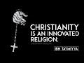

# Christianity is an Innovated Religion: Ibn Taymiyya (2021-11-20)

## Description

'The Correct Reply to the One Who Altered the Religion of the Messiah' by Ibn Taymiyya http://www.ibntaymiyyah.com/articles/zgdia-the-correct-reply-to-the-one-who-altered-the-religion-of-the-messiah-part-1.cfm

## Summary of [Christianity is an Innovated Religion: Ibn Taymiyya](https://www.youtube.com/watch?v=Fe4vcLOpzds)

*This summary is AI generated - there may be inaccuracies. *

### [00:00:00](https://www.youtube.com/watch?v=Fe4vcLOpzds&t=0) - [00:10:00](https://www.youtube.com/watch?v=Fe4vcLOpzds&t=600)

 Professor John Hoover discusses the views of Ibn Tammiyya about Christianity as an innovated religion. Ibn Tammiyya argues that Christianity is an unscriptural and irrational innovation, and that its project of biblical interpretation seeks to rally the jewish and christian texts to support Islam.

**[00:00:00](https://www.youtube.com/watch?v=Fe4vcLOpzds&t=0)**  Professor John Hoover discusses the views of Ibn Tammiyya about Christianity as an innovated religion. Ibn Tammiyya maintains that the prophetic tradition confirmed and sealed by the prophet Muhammad is revealed rational and definitive, and that Christianity is nothing but an innovative religion which they invented after the time of Christ and by which they changed the religion of Christ. He compares the unbelief of the Jews who changed the prescriptions of the Torah before God sending Christ and then rejected Christ, to the unbelief of the Christians who changed the religion of Muhammad after he came.
* **[00:05:00](https://www.youtube.com/watch?v=Fe4vcLOpzds&t=300)** The Christian letter argues that the trinity - one god in three persons - is proved by reason and supported by the Bible and the Quran. Ibn Taymiyya rejects the letter's rational arguments and claims that the trinity is a corruption of the religion of Christ, inconsistent with the monotheism of the prophets. He reinterprets the Trinitarian names in the gospel command to baptize in the name of the father, son, and holy spirit to fit his quranic vision. Father means God, son refers to the prophet Jesus, and holy spirit indicates either Gabriel the angel of revelation or the revelation itself. The text according to ibn Taymiyya tells readers to believe in God's prophet and the angel who brought god's revelation. The Christian letter makes two further key arguments: first, it explains that the Quran supports both the humanity and the divinity of Jesus even though ibn Taymiyya rejects the divinity of Jesus; and second, it claims that islam is unnecessary because Christianity is the perfect religion. Ibn Taymiyya replies by placing islam at the pinnacle of perfection instead of Christianity.
* **[00:10:00](https://www.youtube.com/watch?v=Fe4vcLOpzds&t=600)**  Ibn Taymiyya discusses his vision of prophetic religion and how it culminates in the Quran and the Prophet Muhammad. He argues that Christianity is an unscriptural and irrational innovation, and that its project of biblical interpretation seeks to rally the jewish and christian texts to support Islam.

<h2>Full transcript with timestamps: CLICK TO EXPAND</h2>

[0:00:00](https://youtu.be/Fe4vcLOpzds?t=0) ibn tamir was one of the most prominent  
[0:00:03](https://youtu.be/Fe4vcLOpzds?t=3) and controversial scholars of medieval  
[0:00:06](https://youtu.be/Fe4vcLOpzds?t=6) islam  
[0:00:08](https://youtu.be/Fe4vcLOpzds?t=8) and judging by some of the comments in  
[0:00:10](https://youtu.be/Fe4vcLOpzds?t=10) the couple of previous videos i've made  
[0:00:12](https://youtu.be/Fe4vcLOpzds?t=12) about iben tamir he remains an extremely  
[0:00:15](https://youtu.be/Fe4vcLOpzds?t=15) controversial figure today  
[0:00:18](https://youtu.be/Fe4vcLOpzds?t=18) this is the last video i intend to make  
[0:00:20](https://youtu.be/Fe4vcLOpzds?t=20) about ibn tamir and in this video i want  
[0:00:24](https://youtu.be/Fe4vcLOpzds?t=24) to focus on his views about christianity  
[0:00:27](https://youtu.be/Fe4vcLOpzds?t=27) as an innovated religion  
[0:00:30](https://youtu.be/Fe4vcLOpzds?t=30) and as usual i'll be drawing on some  
[0:00:32](https://youtu.be/Fe4vcLOpzds?t=32) remarks from this book iben tamiya by  
[0:00:34](https://youtu.be/Fe4vcLOpzds?t=34) professor john hoover who is one of the  
[0:00:37](https://youtu.be/Fe4vcLOpzds?t=37) world's leading experts on the life and  
[0:00:39](https://youtu.be/Fe4vcLOpzds?t=39) thought of iben tamiya  
[0:00:42](https://youtu.be/Fe4vcLOpzds?t=42) and on page 135 he writes in a section  
[0:00:46](https://youtu.be/Fe4vcLOpzds?t=46) entitled christianity and object lesson  
[0:00:49](https://youtu.be/Fe4vcLOpzds?t=49) in innovated religion  
[0:00:52](https://youtu.be/Fe4vcLOpzds?t=52) it begins however it was first  
[0:00:55](https://youtu.be/Fe4vcLOpzds?t=55) established ibn tamir maintains that the  
[0:00:58](https://youtu.be/Fe4vcLOpzds?t=58) prophetic tradition confirmed and sealed  
[0:01:01](https://youtu.be/Fe4vcLOpzds?t=61) by the prophet muhammad  
[0:01:03](https://youtu.be/Fe4vcLOpzds?t=63) is revealed rational and definitive  
[0:01:07](https://youtu.be/Fe4vcLOpzds?t=67) in the year 1316 he received a direct  
[0:01:11](https://youtu.be/Fe4vcLOpzds?t=71) challenge to this conviction in the form  
[0:01:14](https://youtu.be/Fe4vcLOpzds?t=74) of the anonymous letter from the people  
[0:01:17](https://youtu.be/Fe4vcLOpzds?t=77) of cyprus  
[0:01:18](https://youtu.be/Fe4vcLOpzds?t=78) the letter is a revision of an earlier  
[0:01:21](https://youtu.be/Fe4vcLOpzds?t=81) christian apologetic treaties  
[0:01:25](https://youtu.be/Fe4vcLOpzds?t=85) as ibn tamir himself notes  
[0:01:27](https://youtu.be/Fe4vcLOpzds?t=87) that earlier treaties had gained wide  
[0:01:30](https://youtu.be/Fe4vcLOpzds?t=90) circulation  
[0:01:32](https://youtu.be/Fe4vcLOpzds?t=92) he replies to the letter with his many  
[0:01:34](https://youtu.be/Fe4vcLOpzds?t=94) times longer  
[0:01:36](https://youtu.be/Fe4vcLOpzds?t=96) correct answer to the one who altered  
[0:01:39](https://youtu.be/Fe4vcLOpzds?t=99) the religion of the messiah  
[0:01:43](https://youtu.be/Fe4vcLOpzds?t=103) ibn tamir's stated aim in correct answer  
[0:01:47](https://youtu.be/Fe4vcLOpzds?t=107) is to set forth christianity as an  
[0:01:50](https://youtu.be/Fe4vcLOpzds?t=110) object lesson to muslims about what  
[0:01:52](https://youtu.be/Fe4vcLOpzds?t=112) innovation and heresy to avoid  
[0:01:56](https://youtu.be/Fe4vcLOpzds?t=116) he frequently draws parallels with  
[0:01:58](https://youtu.be/Fe4vcLOpzds?t=118) errors he perceives among the sufis shia  
[0:02:02](https://youtu.be/Fe4vcLOpzds?t=122) and kalam theologians  
[0:02:05](https://youtu.be/Fe4vcLOpzds?t=125) at the beginning of the term ibn tamir  
[0:02:08](https://youtu.be/Fe4vcLOpzds?t=128) outlines the theological framework  
[0:02:11](https://youtu.be/Fe4vcLOpzds?t=131) needed to position christianity as a  
[0:02:14](https://youtu.be/Fe4vcLOpzds?t=134) corruption of prophetic religion  
[0:02:18](https://youtu.be/Fe4vcLOpzds?t=138) the religion of all god's prophets and  
[0:02:20](https://youtu.be/Fe4vcLOpzds?t=140) messengers is islam  
[0:02:22](https://youtu.be/Fe4vcLOpzds?t=142) even if the various revelations such as  
[0:02:25](https://youtu.be/Fe4vcLOpzds?t=145) the torah the gospel and the quran  
[0:02:28](https://youtu.be/Fe4vcLOpzds?t=148) differ in matters of religious practice  
[0:02:31](https://youtu.be/Fe4vcLOpzds?t=151) all other religion is polytheism and  
[0:02:34](https://youtu.be/Fe4vcLOpzds?t=154) innovation  
[0:02:36](https://youtu.be/Fe4vcLOpzds?t=156) furthermore god singled out muhammad as  
[0:02:39](https://youtu.be/Fe4vcLOpzds?t=159) the best of the messengers and the  
[0:02:41](https://youtu.be/Fe4vcLOpzds?t=161) muslim community as the best of  
[0:02:43](https://youtu.be/Fe4vcLOpzds?t=163) communities  
[0:02:45](https://youtu.be/Fe4vcLOpzds?t=165) the muslim community provides the golden  
[0:02:48](https://youtu.be/Fe4vcLOpzds?t=168) mean in matters of doctrine and practice  
[0:02:52](https://youtu.be/Fe4vcLOpzds?t=172) that jews and christians take to  
[0:02:54](https://youtu.be/Fe4vcLOpzds?t=174) extremes  
[0:02:56](https://youtu.be/Fe4vcLOpzds?t=176) the jews and christians have innovated  
[0:02:59](https://youtu.be/Fe4vcLOpzds?t=179) the religions that they follow  
[0:03:01](https://youtu.be/Fe4vcLOpzds?t=181) they deviated from the revelations given  
[0:03:04](https://youtu.be/Fe4vcLOpzds?t=184) to moses and christ respectively  
[0:03:08](https://youtu.be/Fe4vcLOpzds?t=188) they failed to point to the definitive  
[0:03:10](https://youtu.be/Fe4vcLOpzds?t=190) revelation given to muhammad  
[0:03:14](https://youtu.be/Fe4vcLOpzds?t=194) ibn tamir explains further now here john  
[0:03:16](https://youtu.be/Fe4vcLOpzds?t=196) hoover quotes from ebenzemia  
[0:03:20](https://youtu.be/Fe4vcLOpzds?t=200) the false religion of christians is  
[0:03:23](https://youtu.be/Fe4vcLOpzds?t=203) nothing but an innovative religion which  
[0:03:26](https://youtu.be/Fe4vcLOpzds?t=206) they invented after the time of christ  
[0:03:29](https://youtu.be/Fe4vcLOpzds?t=209) and by which they changed the religion  
[0:03:32](https://youtu.be/Fe4vcLOpzds?t=212) of christ  
[0:03:34](https://youtu.be/Fe4vcLOpzds?t=214) not only that they strayed from the law  
[0:03:37](https://youtu.be/Fe4vcLOpzds?t=217) sharia of christ to what they innovated  
[0:03:41](https://youtu.be/Fe4vcLOpzds?t=221) then when god sent muhammad they  
[0:03:44](https://youtu.be/Fe4vcLOpzds?t=224) rejected him  
[0:03:46](https://youtu.be/Fe4vcLOpzds?t=226) thus their unbelief and error came to be  
[0:03:49](https://youtu.be/Fe4vcLOpzds?t=229) of two aspects  
[0:03:51](https://youtu.be/Fe4vcLOpzds?t=231) that of changing the religion of the  
[0:03:53](https://youtu.be/Fe4vcLOpzds?t=233) first messenger and of rejecting the  
[0:03:56](https://youtu.be/Fe4vcLOpzds?t=236) second messenger  
[0:03:58](https://youtu.be/Fe4vcLOpzds?t=238) it is like the unbelief of the jews who  
[0:04:01](https://youtu.be/Fe4vcLOpzds?t=241) changed the legal prescriptions of the  
[0:04:03](https://youtu.be/Fe4vcLOpzds?t=243) torah before god sending christ and then  
[0:04:07](https://youtu.be/Fe4vcLOpzds?t=247) they rejected christ  
[0:04:09](https://youtu.be/Fe4vcLOpzds?t=249) end quote  
[0:04:11](https://youtu.be/Fe4vcLOpzds?t=251) john hoover continues  
[0:04:13](https://youtu.be/Fe4vcLOpzds?t=253) the christian letter argues that  
[0:04:15](https://youtu.be/Fe4vcLOpzds?t=255) muhammad was only a prophet for the  
[0:04:18](https://youtu.be/Fe4vcLOpzds?t=258) pagan arabs by emphasizing that the  
[0:04:20](https://youtu.be/Fe4vcLOpzds?t=260) revelation was only in arabic  
[0:04:24](https://youtu.be/Fe4vcLOpzds?t=264) ibn tamir counters with quranic texts  
[0:04:27](https://youtu.be/Fe4vcLOpzds?t=267) like we have only sent muhammad to the  
[0:04:31](https://youtu.be/Fe4vcLOpzds?t=271) entirety of humanity as a bringer of  
[0:04:34](https://youtu.be/Fe4vcLOpzds?t=274) good news and as a warner quran 34 28  
[0:04:40](https://youtu.be/Fe4vcLOpzds?t=280) to affirm that muhammad's message is  
[0:04:43](https://youtu.be/Fe4vcLOpzds?t=283) universal  
[0:04:45](https://youtu.be/Fe4vcLOpzds?t=285) some quranic verses may appear to limit  
[0:04:47](https://youtu.be/Fe4vcLOpzds?t=287) the scope of his mission to the arabs  
[0:04:50](https://youtu.be/Fe4vcLOpzds?t=290) but this does not undermine its  
[0:04:52](https://youtu.be/Fe4vcLOpzds?t=292) universality  
[0:04:57](https://youtu.be/Fe4vcLOpzds?t=297) muhammad was not mistaken or deluded  
[0:05:00](https://youtu.be/Fe4vcLOpzds?t=300) into thinking that his message was  
[0:05:02](https://youtu.be/Fe4vcLOpzds?t=302) universal  
[0:05:03](https://youtu.be/Fe4vcLOpzds?t=303) god would not permit that to happen to  
[0:05:06](https://youtu.be/Fe4vcLOpzds?t=306) prophets  
[0:05:08](https://youtu.be/Fe4vcLOpzds?t=308) the christian letter continues that the  
[0:05:10](https://youtu.be/Fe4vcLOpzds?t=310) quran also praises mary and jesus and  
[0:05:14](https://youtu.be/Fe4vcLOpzds?t=314) confirms the christian scriptures in  
[0:05:17](https://youtu.be/Fe4vcLOpzds?t=317) passages such as  
[0:05:19](https://youtu.be/Fe4vcLOpzds?t=319) we i god have sent down to you the book  
[0:05:22](https://youtu.be/Fe4vcLOpzds?t=322) which declares true what came before it  
[0:05:26](https://youtu.be/Fe4vcLOpzds?t=326) and of the torah and the gospel that's  
[0:05:28](https://youtu.be/Fe4vcLOpzds?t=328) quran 3 3  
[0:05:31](https://youtu.be/Fe4vcLOpzds?t=331) and  
[0:05:31](https://youtu.be/Fe4vcLOpzds?t=331) if you are in doubt concerning what we  
[0:05:34](https://youtu.be/Fe4vcLOpzds?t=334) have sent down to you  
[0:05:35](https://youtu.be/Fe4vcLOpzds?t=335) ask those who have been reading the book  
[0:05:38](https://youtu.be/Fe4vcLOpzds?t=338) before you quran 10 94  
[0:05:42](https://youtu.be/Fe4vcLOpzds?t=342) the christian letter concludes that the  
[0:05:44](https://youtu.be/Fe4vcLOpzds?t=344) quran is telling christians to remain in  
[0:05:47](https://youtu.be/Fe4vcLOpzds?t=347) their religion  
[0:05:50](https://youtu.be/Fe4vcLOpzds?t=350) iben temia agrees that the quran  
[0:05:51](https://youtu.be/Fe4vcLOpzds?t=351) confirms previous revelations  
[0:05:55](https://youtu.be/Fe4vcLOpzds?t=355) one must believe in all god's books just  
[0:05:57](https://youtu.be/Fe4vcLOpzds?t=357) as one must believe in all of god's  
[0:05:59](https://youtu.be/Fe4vcLOpzds?t=359) prophets however he explains the quran  
[0:06:03](https://youtu.be/Fe4vcLOpzds?t=363) does not confirm the innovated doctrines  
[0:06:06](https://youtu.be/Fe4vcLOpzds?t=366) of the christians  
[0:06:09](https://youtu.be/Fe4vcLOpzds?t=369) as for the bible itself evin tamir is  
[0:06:12](https://youtu.be/Fe4vcLOpzds?t=372) careful more so than some of his  
[0:06:14](https://youtu.be/Fe4vcLOpzds?t=374) predecessors  
[0:06:16](https://youtu.be/Fe4vcLOpzds?t=376) ibn hasan who died in 1064  
[0:06:19](https://youtu.be/Fe4vcLOpzds?t=379) is well known for insisting that jews  
[0:06:22](https://youtu.be/Fe4vcLOpzds?t=382) and christians had corrupted the very  
[0:06:24](https://youtu.be/Fe4vcLOpzds?t=384) texts of their scriptures and he  
[0:06:27](https://youtu.be/Fe4vcLOpzds?t=387) compiled lists of contradictions and  
[0:06:29](https://youtu.be/Fe4vcLOpzds?t=389) historical and theological errors to  
[0:06:32](https://youtu.be/Fe4vcLOpzds?t=392) prove it  
[0:06:34](https://youtu.be/Fe4vcLOpzds?t=394) unlike ibn hasan ibn taymiyah says that  
[0:06:38](https://youtu.be/Fe4vcLOpzds?t=398) textual corruption cannot be  
[0:06:40](https://youtu.be/Fe4vcLOpzds?t=400) demonstrated or denied  
[0:06:44](https://youtu.be/Fe4vcLOpzds?t=404) while it is certain that jews and  
[0:06:45](https://youtu.be/Fe4vcLOpzds?t=405) christians have corrupted the meaning of  
[0:06:47](https://youtu.be/Fe4vcLOpzds?t=407) their texts it cannot be known for sure  
[0:06:51](https://youtu.be/Fe4vcLOpzds?t=411) whether the very texts have been altered  
[0:06:54](https://youtu.be/Fe4vcLOpzds?t=414) as a result ibn tamir very rarely points  
[0:06:57](https://youtu.be/Fe4vcLOpzds?t=417) out textual errors in the bible  
[0:07:01](https://youtu.be/Fe4vcLOpzds?t=421) he instead interprets the text to accord  
[0:07:04](https://youtu.be/Fe4vcLOpzds?t=424) with his islamic theological convictions  
[0:07:08](https://youtu.be/Fe4vcLOpzds?t=428) much as he seeks to fill the technical  
[0:07:10](https://youtu.be/Fe4vcLOpzds?t=430) terminology of sufism calam theology and  
[0:07:14](https://youtu.be/Fe4vcLOpzds?t=434) philosophy with meanings corresponding  
[0:07:17](https://youtu.be/Fe4vcLOpzds?t=437) to his understanding of the quran and  
[0:07:20](https://youtu.be/Fe4vcLOpzds?t=440) the sunnah  
[0:07:22](https://youtu.be/Fe4vcLOpzds?t=442) this is readily apparent in his correct  
[0:07:25](https://youtu.be/Fe4vcLOpzds?t=445) answer  
[0:07:26](https://youtu.be/Fe4vcLOpzds?t=446) in his discussion of the christian  
[0:07:28](https://youtu.be/Fe4vcLOpzds?t=448) doctrine of the trinity  
[0:07:31](https://youtu.be/Fe4vcLOpzds?t=451) the letter the christian letter argues  
[0:07:33](https://youtu.be/Fe4vcLOpzds?t=453) that the trinity the one god in three  
[0:07:36](https://youtu.be/Fe4vcLOpzds?t=456) persons father son and holy spirit  
[0:07:40](https://youtu.be/Fe4vcLOpzds?t=460) is proved by reason and supported by  
[0:07:43](https://youtu.be/Fe4vcLOpzds?t=463) both the bible and the quran  
[0:07:46](https://youtu.be/Fe4vcLOpzds?t=466) ibn tamir discounts the letter's  
[0:07:48](https://youtu.be/Fe4vcLOpzds?t=468) rational arguments and he claims that  
[0:07:51](https://youtu.be/Fe4vcLOpzds?t=471) the trinity is a corruption of the  
[0:07:53](https://youtu.be/Fe4vcLOpzds?t=473) religion of christ inconsistent with the  
[0:07:56](https://youtu.be/Fe4vcLOpzds?t=476) monotheism of the prophets  
[0:08:00](https://youtu.be/Fe4vcLOpzds?t=480) neither the bible nor the quran supports  
[0:08:02](https://youtu.be/Fe4vcLOpzds?t=482) the christian doctrine  
[0:08:05](https://youtu.be/Fe4vcLOpzds?t=485) ibn tamir then reinterprets the  
[0:08:07](https://youtu.be/Fe4vcLOpzds?t=487) trinitarian names in the gospel command  
[0:08:10](https://youtu.be/Fe4vcLOpzds?t=490) to baptize in the name of the father the  
[0:08:13](https://youtu.be/Fe4vcLOpzds?t=493) son and the holy spirit that's matthew  
[0:08:16](https://youtu.be/Fe4vcLOpzds?t=496) 28 19  
[0:08:18](https://youtu.be/Fe4vcLOpzds?t=498) to fit his quranic vision  
[0:08:20](https://youtu.be/Fe4vcLOpzds?t=500) father means god  
[0:08:23](https://youtu.be/Fe4vcLOpzds?t=503) son refers to the purely human prophet  
[0:08:26](https://youtu.be/Fe4vcLOpzds?t=506) christ  
[0:08:27](https://youtu.be/Fe4vcLOpzds?t=507) and holy spirit indicates either gabriel  
[0:08:30](https://youtu.be/Fe4vcLOpzds?t=510) the angel of revelation or the  
[0:08:33](https://youtu.be/Fe4vcLOpzds?t=513) revelation itself  
[0:08:35](https://youtu.be/Fe4vcLOpzds?t=515) the text according to ibn tamir is  
[0:08:38](https://youtu.be/Fe4vcLOpzds?t=518) telling readers to believe in god  
[0:08:41](https://youtu.be/Fe4vcLOpzds?t=521) god's prophet and the angel who brought  
[0:08:44](https://youtu.be/Fe4vcLOpzds?t=524) god's revelation  
[0:08:48](https://youtu.be/Fe4vcLOpzds?t=528) the christian letter makes two further  
[0:08:50](https://youtu.be/Fe4vcLOpzds?t=530) key arguments  
[0:08:52](https://youtu.be/Fe4vcLOpzds?t=532) first  
[0:08:52](https://youtu.be/Fe4vcLOpzds?t=532) it explains that the quran supports both  
[0:08:55](https://youtu.be/Fe4vcLOpzds?t=535) the humanity and the divinity of jesus  
[0:08:59](https://youtu.be/Fe4vcLOpzds?t=539) even tamir rejects the divinity of jesus  
[0:09:02](https://youtu.be/Fe4vcLOpzds?t=542) as incongruous with both reason and  
[0:09:05](https://youtu.be/Fe4vcLOpzds?t=545) revelation  
[0:09:07](https://youtu.be/Fe4vcLOpzds?t=547) he reinterprets scriptural texts that  
[0:09:10](https://youtu.be/Fe4vcLOpzds?t=550) might be misconstrued  
[0:09:12](https://youtu.be/Fe4vcLOpzds?t=552) to imply that god dwelt in christ  
[0:09:16](https://youtu.be/Fe4vcLOpzds?t=556) second the letter claims that islam is  
[0:09:20](https://youtu.be/Fe4vcLOpzds?t=560) unnecessary because christianity is the  
[0:09:23](https://youtu.be/Fe4vcLOpzds?t=563) perfect religion  
[0:09:25](https://youtu.be/Fe4vcLOpzds?t=565) judaism was the religion of law and  
[0:09:28](https://youtu.be/Fe4vcLOpzds?t=568) justice while christianity was the  
[0:09:30](https://youtu.be/Fe4vcLOpzds?t=570) religion of grace  
[0:09:33](https://youtu.be/Fe4vcLOpzds?t=573) ibn tamir replies by placing islam at  
[0:09:37](https://youtu.be/Fe4vcLOpzds?t=577) the pinnacle of perfection instead of  
[0:09:39](https://youtu.be/Fe4vcLOpzds?t=579) christianity  
[0:09:41](https://youtu.be/Fe4vcLOpzds?t=581) judaism focused on law and justice at  
[0:09:45](https://youtu.be/Fe4vcLOpzds?t=585) the expense of grace  
[0:09:47](https://youtu.be/Fe4vcLOpzds?t=587) christianity emphasized grace at the  
[0:09:50](https://youtu.be/Fe4vcLOpzds?t=590) expense of justice and law  
[0:09:54](https://youtu.be/Fe4vcLOpzds?t=594) islam perfected balanced grace with law  
[0:09:58](https://youtu.be/Fe4vcLOpzds?t=598) and justice  
[0:10:01](https://youtu.be/Fe4vcLOpzds?t=601) ibn tamir's vision of prophetic religion  
[0:10:04](https://youtu.be/Fe4vcLOpzds?t=604) culminates in the quran and the prophet  
[0:10:07](https://youtu.be/Fe4vcLOpzds?t=607) muhammad  
[0:10:08](https://youtu.be/Fe4vcLOpzds?t=608) his correct answer  
[0:10:11](https://youtu.be/Fe4vcLOpzds?t=611) sidelines christianity as an irrational  
[0:10:14](https://youtu.be/Fe4vcLOpzds?t=614) and unscriptural innovation  
[0:10:17](https://youtu.be/Fe4vcLOpzds?t=617) and his project of biblical  
[0:10:19](https://youtu.be/Fe4vcLOpzds?t=619) interpretation seeks to rally the jewish  
[0:10:22](https://youtu.be/Fe4vcLOpzds?t=622) and christian texts to support islam  
[0:10:27](https://youtu.be/Fe4vcLOpzds?t=627) and  
[0:10:27](https://youtu.be/Fe4vcLOpzds?t=627) quote now there's an awful lot there  
[0:10:29](https://youtu.be/Fe4vcLOpzds?t=629) that one could  
[0:10:30](https://youtu.be/Fe4vcLOpzds?t=630) discuss further particularly ibn  
[0:10:32](https://youtu.be/Fe4vcLOpzds?t=632) temier's views of the bible and the  
[0:10:34](https://youtu.be/Fe4vcLOpzds?t=634) gospel and the gospels matthew mark luke  
[0:10:38](https://youtu.be/Fe4vcLOpzds?t=638) and john what's really going on there  
[0:10:41](https://youtu.be/Fe4vcLOpzds?t=641) and also his understanding of  
[0:10:44](https://youtu.be/Fe4vcLOpzds?t=644) christian doctrine and pastors like  
[0:10:45](https://youtu.be/Fe4vcLOpzds?t=645) matthew 28 19. but i'm not going to go  
[0:10:48](https://youtu.be/Fe4vcLOpzds?t=648) there um this this video is about john  
[0:10:51](https://youtu.be/Fe4vcLOpzds?t=651) hoover's presentation of a thought of  
[0:10:53](https://youtu.be/Fe4vcLOpzds?t=653) evan ibn tay taymir  
[0:10:55](https://youtu.be/Fe4vcLOpzds?t=655) so as i say uh this  
[0:10:58](https://youtu.be/Fe4vcLOpzds?t=658) text the correct answer or the correct  
[0:11:01](https://youtu.be/Fe4vcLOpzds?t=661) reply to the one who altered the  
[0:11:03](https://youtu.be/Fe4vcLOpzds?t=663) religion of the messiah uh is available  
[0:11:06](https://youtu.be/Fe4vcLOpzds?t=666) to read online i'll link to it in the  
[0:11:08](https://youtu.be/Fe4vcLOpzds?t=668) description uh below is actually quite a  
[0:11:10](https://youtu.be/Fe4vcLOpzds?t=670) sophisticated bit of theology actually a  
[0:11:13](https://youtu.be/Fe4vcLOpzds?t=673) bit of polemic against uh christianity  
[0:11:17](https://youtu.be/Fe4vcLOpzds?t=677) uh whether or not you like ibentemia um  
[0:11:21](https://youtu.be/Fe4vcLOpzds?t=681) is really up to you of course but he's a  
[0:11:23](https://youtu.be/Fe4vcLOpzds?t=683) serious thinker he's a very very  
[0:11:25](https://youtu.be/Fe4vcLOpzds?t=685) brilliant uh  
[0:11:27](https://youtu.be/Fe4vcLOpzds?t=687) in the medieval islamic tradition and  
[0:11:30](https://youtu.be/Fe4vcLOpzds?t=690) still has it seems a great influence on  
[0:11:32](https://youtu.be/Fe4vcLOpzds?t=692) many muslims in the world today so enjoy  
[0:11:37](https://youtu.be/Fe4vcLOpzds?t=697) until next time  

