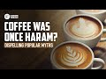

# Coffee Was Once Haram? Dispelling Popular Myths (2022-12-05)

## Description

Massoud Vahedi's academia page:
https://utoronto.academia.edu/MassoudVahedi

Chapters:
Main Thesis and Argument – 00:00-07:40
The View of Normative Desirability – 07:41-12:40
The View of Permissibility – 12:41-23:08
Is the Permissibility View Majoritarian? – 23:09 – 30:16
Deeming Coffee Morally Disliked – 30:17 -34:50
The Prohibitionist View – 34:51-55:45
The Makkan Assembly - 55:46 – 1:22:48
In Closing – 1:22:49 - end

You Can Support Blogging Theology on Patreon:
https://www.patreon.com/Bloggingtheology

Paypal Link: 
https://www.paypal.com/paypalme/bloggingtheology?locale.x=en_GB

## Summary of [Coffee Was Once Haram?!](https://www.youtube.com/watch?v=AzNl-wvBdJg)

*This summary is AI generated - there may be inaccuracies. *

### [00:00:00](https://www.youtube.com/watch?v=AzNl-wvBdJg&t=0) - [01:00:00](https://www.youtube.com/watch?v=AzNl-wvBdJg&t=3600)

 discusses the views of various scholars on coffee; the majority of whom believe that coffee is permissible. One of the strongest pieces of evidence is the fact that unanimous consensus was often cited in favor of the permitting side.

**[00:00:00](https://www.youtube.com/watch?v=AzNl-wvBdJg&t=0)** Brother Masood discusses the coffee controversy, presenting a different perspective than the conventional wisdom. He argues that, while the majority of jurists took a firm line against coffee, a small circle of scholars allowed it. This presentation hopes to critically assess this issue, shedding light on the most important insights that can be derived from this historical incident.
* **[00:05:00](https://www.youtube.com/watch?v=AzNl-wvBdJg&t=300)* Discusses the permissibility of coffee in Islam, noting that there are a number of Islamic legal positions on the topic. One of the alternative thesis presented is that the majority of jurists permitted coffee, while a minority of Scholars prohibit it.
* **[00:10:00](https://www.youtube.com/watch?v=AzNl-wvBdJg&t=600)* Discusses coffee's ruling as being "normatively desirable" and its permissibility being based on its ability to increase energy levels for worship.
* **[00:15:00](https://www.youtube.com/watch?v=AzNl-wvBdJg&t=900)** Testimony is not as reliable as experimentation, which is why experts rely on it in order to discern the effects of substances. Several Scholars who permitted coffee relied on testimony to argue that it was not intoxicating. Zacharia Lanzari Ansari, a leading Shafi jurist, ran an experiment in which he found that coffee was not intoxicating. Muhammad Ben Elias, a Kyrene jurist, conducted an experiment in which he found that coffee was permissible. These examples illustrate the superiority of experimentation over testimony.
* **[00:20:00](https://www.youtube.com/watch?v=AzNl-wvBdJg&t=1200)* Discusses the views of various scholars on coffee; the majority of whom believe that coffee is permissible. One of the strongest pieces of evidence is the fact that unanimous consensus was often cited in favor of the permitting side.
* **[00:25:00](https://www.youtube.com/watch?v=AzNl-wvBdJg&t=1500)* Discusses how the majority of scholars who advocate coffee being permissible adhere to the opinion that coffee is harmful or intoxicating. It also discusses how some prominent scholars from the prohibiting side were defeated in debates by permitting scholars. Finally, the video cites examples of how poets and jurists from the permitting side have written about coffee.
* **[00:30:00](https://www.youtube.com/watch?v=AzNl-wvBdJg&t=1800)** The article discusses the different opinions on coffee, with the prohibitionist view citing negative associative factors as a reason to prohibit its consumption. There is also a position of deeming coffee morally disliked, which is more in-between the permitting and prohibiting views. This latter view is that because coffee is commonly associated with immoral activities, one should be careful when consuming it.
* **[00:35:00](https://www.youtube.com/watch?v=AzNl-wvBdJg&t=2100)** In this lecture, the prohibitionist view of coffee is mentioned and discussed. It is noted that there are many scholars who were prohibitionists, but it is not possible to say with certainty that all of them held this view. The context of the questions being asked is also taken into account, and it is shown that many of the questions were inaccurate or misleading. However, some of the jurists were still very vigilant in their replies, and based on the information provided, they concluded that coffee was prohibited.
* **[00:40:00](https://www.youtube.com/watch?v=AzNl-wvBdJg&t=2400)* Discusses how various scholars in the past have given different opinions on coffee, with some saying that it is permissible while others say that it is prohibited. It also points out how some prohibitionists will use other scholars to give a false impression that they are in support of prohibition.
* **[00:45:00](https://www.youtube.com/watch?v=AzNl-wvBdJg&t=2700)** explains that when a person looks at religious rulings, they should be careful to assess the question and wording correctly in order to avoid a provisional answer. He goes on to say that the number of prohibitions will decrease substantially due to this understanding.
* **[00:50:00](https://www.youtube.com/watch?v=AzNl-wvBdJg&t=3000)* Discusses how coffee is permissible under Sharia law, depending on the scholar asking the question and the level of knowledge they have of coffee. There is no clear correlation between the two, with some prohibitionists coming from math hubs and others not.
* **[00:55:00](https://www.youtube.com/watch?v=AzNl-wvBdJg&t=3300)* Discusses how coffee was once deemed haram by a majority of Scholars, and how this resulted in the ban of the drink. However, Senator points out that this is not actually the case, as the Scholars in question were only agreeing to ban coffee because it was seen as a threat to their craft.
### [01:00:00](https://www.youtube.com/watch?v=AzNl-wvBdJg&t=3600) - [01:35:00](https://www.youtube.com/watch?v=AzNl-wvBdJg&t=5700)

 "Coffee Was Once Haram?!" discusses how coffee was once considered to be haram, or forbidden, by some scholars and jurists. However, the presenter argues that this view is insufficient and points to reasons why scholars might have reached this false conclusion. He offers possible hypotheses as to why this might be the case. The main takeaway from the video is that Muslims should always rely on primary sources when judging the state of Muslim scholarship.

**[01:00:00](https://www.youtube.com/watch?v=AzNl-wvBdJg&t=3600)* Discusses how coffee was once considered to be haram, or forbidden, by some scholars and jurists. Higher big, the administrator of a Meccan city, gathered together jurors to discuss the issue, and found that there was no evidence to support the prohibitionist argument that coffee is harmful. However, he decided to outlaw coffee anyway, based on his moral conviction that it is a harmful vice.
* **[01:05:00](https://www.youtube.com/watch?v=AzNl-wvBdJg&t=3900)**  "Coffee Was Once Haram?!" discusses how coffee has been considered haram (forbidden) by some Muslims for centuries, citing outdated medical theories and examples of how coffee can be harmful to the body. Some proponents of coffee prohibition argue that coffee is a cold and dry substance that is harmful to the temperaments, while others maintain that coffee is permissible within the sinful setting of coffee houses.  concludes by discussing how proponents of coffee prohibition blocked a proposed wholesale prohibition of coffee.
* **[01:10:00](https://www.youtube.com/watch?v=AzNl-wvBdJg&t=4200)* Discusses two arguments against coffee: that it is harmful because it is cold and dry, and that its consumption leads to bad behavior. The narrator notes that these arguments, on their own, are not satisfactory. He also notes that, because of a jurist's attendance, the opponents of coffee were unsuccessful in getting their side behind any arguments. He writes that the story of this account ends abruptly, with no real evidence to support any of the arguments.
* **[01:15:00](https://www.youtube.com/watch?v=AzNl-wvBdJg&t=4500)* Discusses how Coffee was once considered haram, or forbidden, because it was associated with immoral activities such as drinking coffee in coffee houses. However, the Royal Decree issued by the mother look Sultan (a ruler of the Ottoman Empire) only prohibits the consumption of coffee in coffee houses, and does not prohibit coffee itself. This shows that the main problem with coffee is not the substance, but how it is being consumed.
* **[01:20:00](https://www.youtube.com/watch?v=AzNl-wvBdJg&t=4800)**  Jasiri discusses the coffee controversy in Islamic history, which shows that the jurists were very active and were able to strike a balanced ruling. Higher bigs' campaign against coffee failed, and he was eventually removed from power.
* **[01:25:00](https://www.youtube.com/watch?v=AzNl-wvBdJg&t=5100)** This 1-paragraph summary of the video discusses the conventional wisdom or mainstream view among Western academics that the prohibitionist view was the majority view among Islamic scholars at the time of coffee prohibition. However, the presenter argues that this view is insufficient and points to reasons why scholars might have reached this false conclusion. He offers possible hypotheses as to why this might be the case.
* **[01:30:00](https://www.youtube.com/watch?v=AzNl-wvBdJg&t=5400)**  "Coffee Was Once Haram?!" discusses how some Muslim scholars are using the recent ban of coffee in some Muslim-majority countries as an example of how traditional Muslim scholarship is in decline. notes that while there are some inaccuracies in the reports, overall they are a reliable source of information. The main takeaway from the video is that Muslims should always rely on primary sources when judging the state of Muslim scholarship.
* **[01:35:00](https://www.youtube.com/watch?v=AzNl-wvBdJg&t=5700)** describes how coffee once was considered haram, and how this shows the lack of due diligence of those who claim to know the truth. They hope that by presenting this information, listeners will take the time to correctly cite and read sources before forming their opinions.

<h2>Full transcript with timestamps: CLICK TO EXPAND</h2>

[0:00:04](https://youtu.be/AzNl-wvBdJg?t=4) and welcome to blogging theology today  
[0:00:07](https://youtu.be/AzNl-wvBdJg?t=7) we're pleased to speak to brother  
[0:00:09](https://youtu.be/AzNl-wvBdJg?t=9) salaam alaikum brother how are you  
[0:00:13](https://youtu.be/AzNl-wvBdJg?t=13) doing well how are you doing  
[0:00:15](https://youtu.be/AzNl-wvBdJg?t=15) alhamdulillah  
[0:00:17](https://youtu.be/AzNl-wvBdJg?t=17) is an academic and researcher based in  
[0:00:20](https://youtu.be/AzNl-wvBdJg?t=20) Canada he studied at the University of  
[0:00:22](https://youtu.be/AzNl-wvBdJg?t=22) Toronto in York University and earned a  
[0:00:24](https://youtu.be/AzNl-wvBdJg?t=24) bachelor's master's degree respectively  
[0:00:26](https://youtu.be/AzNl-wvBdJg?t=26) in the area of political science  
[0:00:28](https://youtu.be/AzNl-wvBdJg?t=28) as for the Islamic Sciences his main  
[0:00:31](https://youtu.be/AzNl-wvBdJg?t=31) areas of Interest lie in the Hadith  
[0:00:33](https://youtu.be/AzNl-wvBdJg?t=33) sciences and hambali jurisprudential law  
[0:00:36](https://youtu.be/AzNl-wvBdJg?t=36) and he has a number of ijazat in these  
[0:00:38](https://youtu.be/AzNl-wvBdJg?t=38) two areas he has published a number of  
[0:00:41](https://youtu.be/AzNl-wvBdJg?t=41) research articles which one can access  
[0:00:43](https://youtu.be/AzNl-wvBdJg?t=43) in the link in the description box below  
[0:00:46](https://youtu.be/AzNl-wvBdJg?t=46) today the topic of interest is a paper  
[0:00:50](https://youtu.be/AzNl-wvBdJg?t=50) written by Masood which pertains to the  
[0:00:53](https://youtu.be/AzNl-wvBdJg?t=53) coffee controversy it's an article  
[0:00:55](https://youtu.be/AzNl-wvBdJg?t=55) entitled  
[0:00:56](https://youtu.be/AzNl-wvBdJg?t=56) coffee was once Haram the spelling  
[0:01:00](https://youtu.be/AzNl-wvBdJg?t=60) popular myths regarding a nuanced legal  
[0:01:03](https://youtu.be/AzNl-wvBdJg?t=63) issue  
[0:01:04](https://youtu.be/AzNl-wvBdJg?t=64) another method will inshallah take us  
[0:01:07](https://youtu.be/AzNl-wvBdJg?t=67) through the main themes of this paper  
[0:01:09](https://youtu.be/AzNl-wvBdJg?t=69) and shed light on the most important  
[0:01:12](https://youtu.be/AzNl-wvBdJg?t=72) insights that can be derived from this  
[0:01:14](https://youtu.be/AzNl-wvBdJg?t=74) historical incident  
[0:01:15](https://youtu.be/AzNl-wvBdJg?t=75) brother Masoud the floor is all yours  
[0:01:19](https://youtu.be/AzNl-wvBdJg?t=79) uh thank you so much brother Bassam  
[0:01:22](https://youtu.be/AzNl-wvBdJg?t=82) um I would like to thank you and  
[0:01:23](https://youtu.be/AzNl-wvBdJg?t=83) blogging theology for inviting me on the  
[0:01:25](https://youtu.be/AzNl-wvBdJg?t=85) show um I'm really pleased and uh  
[0:01:27](https://youtu.be/AzNl-wvBdJg?t=87) excited to uh share the main insights  
[0:01:30](https://youtu.be/AzNl-wvBdJg?t=90) that I have regarding this topic  
[0:01:33](https://youtu.be/AzNl-wvBdJg?t=93) um this is  
[0:01:35](https://youtu.be/AzNl-wvBdJg?t=95) you know might strike a person as being  
[0:01:37](https://youtu.be/AzNl-wvBdJg?t=97) uh an unnecessary topic or um a lot of  
[0:01:42](https://youtu.be/AzNl-wvBdJg?t=102) people question why there is even a need  
[0:01:43](https://youtu.be/AzNl-wvBdJg?t=103) to bring this issue up which occurred so  
[0:01:46](https://youtu.be/AzNl-wvBdJg?t=106) many centuries ago but  
[0:01:49](https://youtu.be/AzNl-wvBdJg?t=109) um I believe that this presentation  
[0:01:52](https://youtu.be/AzNl-wvBdJg?t=112) hopes to critically assess an itch issue  
[0:01:56](https://youtu.be/AzNl-wvBdJg?t=116) which is uh often cited as being  
[0:01:58](https://youtu.be/AzNl-wvBdJg?t=118) definitive proof uh of the intellectual  
[0:02:02](https://youtu.be/AzNl-wvBdJg?t=122) stagnation of the ornament stratum and  
[0:02:05](https://youtu.be/AzNl-wvBdJg?t=125) in many quarters it is even considered  
[0:02:07](https://youtu.be/AzNl-wvBdJg?t=127) to be a clear manifestation of the  
[0:02:11](https://youtu.be/AzNl-wvBdJg?t=131) closing of the gates of each the hat so  
[0:02:13](https://youtu.be/AzNl-wvBdJg?t=133) I'm referring to what is often called  
[0:02:15](https://youtu.be/AzNl-wvBdJg?t=135) the coffee issue or controversy and it  
[0:02:17](https://youtu.be/AzNl-wvBdJg?t=137) is a matter of legal interests which uh  
[0:02:20](https://youtu.be/AzNl-wvBdJg?t=140) flooded the Muslim world in the 10th  
[0:02:23](https://youtu.be/AzNl-wvBdJg?t=143) Century after Hijra or the 16th century  
[0:02:25](https://youtu.be/AzNl-wvBdJg?t=145) CE and the main topic question that I  
[0:02:29](https://youtu.be/AzNl-wvBdJg?t=149) have is what legal consequences did this  
[0:02:33](https://youtu.be/AzNl-wvBdJg?t=153) controversy have when it arose so when  
[0:02:37](https://youtu.be/AzNl-wvBdJg?t=157) this issue is studied or when it's  
[0:02:39](https://youtu.be/AzNl-wvBdJg?t=159) presented to us at least in academic  
[0:02:42](https://youtu.be/AzNl-wvBdJg?t=162) circles or among popular speakers in  
[0:02:46](https://youtu.be/AzNl-wvBdJg?t=166) many circles we have something called a  
[0:02:48](https://youtu.be/AzNl-wvBdJg?t=168) conventional wisdom which is basically  
[0:02:50](https://youtu.be/AzNl-wvBdJg?t=170) the dominant presentation a dominant  
[0:02:52](https://youtu.be/AzNl-wvBdJg?t=172) thesis that is uh given to us and for  
[0:02:56](https://youtu.be/AzNl-wvBdJg?t=176) this issue in question the dominant  
[0:02:58](https://youtu.be/AzNl-wvBdJg?t=178) thesis is that  
[0:03:01](https://youtu.be/AzNl-wvBdJg?t=181) the scholars supposedly took a very firm  
[0:03:07](https://youtu.be/AzNl-wvBdJg?t=187) line against it and they were not very  
[0:03:11](https://youtu.be/AzNl-wvBdJg?t=191) um attuned to the drink of coffee that  
[0:03:13](https://youtu.be/AzNl-wvBdJg?t=193) the majority of jurists took a very firm  
[0:03:16](https://youtu.be/AzNl-wvBdJg?t=196) line against it and they they will tell  
[0:03:19](https://youtu.be/AzNl-wvBdJg?t=199) you that actually in fact the only  
[0:03:21](https://youtu.be/AzNl-wvBdJg?t=201) reason why we're able to drink coffee  
[0:03:23](https://youtu.be/AzNl-wvBdJg?t=203) today in the Muslim world at least is  
[0:03:26](https://youtu.be/AzNl-wvBdJg?t=206) because social Society Civil Society is  
[0:03:29](https://youtu.be/AzNl-wvBdJg?t=209) what stood up against the scholarly ban  
[0:03:32](https://youtu.be/AzNl-wvBdJg?t=212) and they overturned it and as a result  
[0:03:35](https://youtu.be/AzNl-wvBdJg?t=215) we are able to enjoy the freedom of  
[0:03:36](https://youtu.be/AzNl-wvBdJg?t=216) drinking coffee had we relied on the  
[0:03:39](https://youtu.be/AzNl-wvBdJg?t=219) scholars exclusively coffee would have  
[0:03:42](https://youtu.be/AzNl-wvBdJg?t=222) like would have likely been still  
[0:03:43](https://youtu.be/AzNl-wvBdJg?t=223) prohibited so this gives you very you  
[0:03:49](https://youtu.be/AzNl-wvBdJg?t=229) might say uh negative impression of the  
[0:03:52](https://youtu.be/AzNl-wvBdJg?t=232) scholarly block as a whole that Scholars  
[0:03:54](https://youtu.be/AzNl-wvBdJg?t=234) they're not able to properly assess  
[0:03:57](https://youtu.be/AzNl-wvBdJg?t=237) properly uh react to nawaza new  
[0:04:02](https://youtu.be/AzNl-wvBdJg?t=242) occurrences new issues that come in  
[0:04:03](https://youtu.be/AzNl-wvBdJg?t=243) society it's society that has to adapt  
[0:04:07](https://youtu.be/AzNl-wvBdJg?t=247) to these norms and try to push all of  
[0:04:11](https://youtu.be/AzNl-wvBdJg?t=251) the other sectors of society to go along  
[0:04:13](https://youtu.be/AzNl-wvBdJg?t=253) with it so this is a very negative  
[0:04:16](https://youtu.be/AzNl-wvBdJg?t=256) picture you know the majority of jurors  
[0:04:18](https://youtu.be/AzNl-wvBdJg?t=258) took a very firm line against it there  
[0:04:21](https://youtu.be/AzNl-wvBdJg?t=261) was only a very small circle of Scholars  
[0:04:23](https://youtu.be/AzNl-wvBdJg?t=263) that allowed it but the majority did not  
[0:04:25](https://youtu.be/AzNl-wvBdJg?t=265) allow it and for that reason you have a  
[0:04:27](https://youtu.be/AzNl-wvBdJg?t=267) very static retrograde uh image of the  
[0:04:31](https://youtu.be/AzNl-wvBdJg?t=271) scholarly body  
[0:04:33](https://youtu.be/AzNl-wvBdJg?t=273) my thesis though is very different it's  
[0:04:37](https://youtu.be/AzNl-wvBdJg?t=277) going to say that actually if we look at  
[0:04:40](https://youtu.be/AzNl-wvBdJg?t=280) this issue by assessing the primary  
[0:04:42](https://youtu.be/AzNl-wvBdJg?t=282) sources directly we're going to find  
[0:04:45](https://youtu.be/AzNl-wvBdJg?t=285) that in actual fact the majority of  
[0:04:48](https://youtu.be/AzNl-wvBdJg?t=288) jurors actually had a very positive  
[0:04:50](https://youtu.be/AzNl-wvBdJg?t=290) impression of coffee or a neutral  
[0:04:52](https://youtu.be/AzNl-wvBdJg?t=292) impression of it and they believe that  
[0:04:54](https://youtu.be/AzNl-wvBdJg?t=294) actually coffee  
[0:04:56](https://youtu.be/AzNl-wvBdJg?t=296) poses no social or moral ills in and of  
[0:05:00](https://youtu.be/AzNl-wvBdJg?t=300) itself and as a reason it is actually  
[0:05:03](https://youtu.be/AzNl-wvBdJg?t=303) it's permissible to be consumed and  
[0:05:07](https://youtu.be/AzNl-wvBdJg?t=307) there is no issue with somebody to drink  
[0:05:10](https://youtu.be/AzNl-wvBdJg?t=310) it from an Islamic standpoint  
[0:05:12](https://youtu.be/AzNl-wvBdJg?t=312) um  
[0:05:13](https://youtu.be/AzNl-wvBdJg?t=313) in addition my presentation it assesses  
[0:05:17](https://youtu.be/AzNl-wvBdJg?t=317) um an important rejoinder to an Evidence  
[0:05:20](https://youtu.be/AzNl-wvBdJg?t=320) that's often cited by the um  
[0:05:23](https://youtu.be/AzNl-wvBdJg?t=323) conventional wisdom  
[0:05:25](https://youtu.be/AzNl-wvBdJg?t=325) and they what they usually say is that  
[0:05:27](https://youtu.be/AzNl-wvBdJg?t=327) there's actually evidence that most  
[0:05:28](https://youtu.be/AzNl-wvBdJg?t=328) Scholars oppose coffee in what is called  
[0:05:30](https://youtu.be/AzNl-wvBdJg?t=330) the meccan assembly which I'll talk  
[0:05:32](https://youtu.be/AzNl-wvBdJg?t=332) about later I will show that the Mecca  
[0:05:34](https://youtu.be/AzNl-wvBdJg?t=334) assembly actually does not prove that  
[0:05:37](https://youtu.be/AzNl-wvBdJg?t=337) the majority of Scholars or all of them  
[0:05:39](https://youtu.be/AzNl-wvBdJg?t=339) were against coffee in actual fact it  
[0:05:41](https://youtu.be/AzNl-wvBdJg?t=341) proves that  
[0:05:43](https://youtu.be/AzNl-wvBdJg?t=343) um  
[0:05:44](https://youtu.be/AzNl-wvBdJg?t=344) more no prohibition could actually be  
[0:05:47](https://youtu.be/AzNl-wvBdJg?t=347) supported through a scholarly or legal  
[0:05:49](https://youtu.be/AzNl-wvBdJg?t=349) standpoint  
[0:05:50](https://youtu.be/AzNl-wvBdJg?t=350) um which will show inshallah at the end  
[0:05:51](https://youtu.be/AzNl-wvBdJg?t=351) of this presentation today  
[0:05:54](https://youtu.be/AzNl-wvBdJg?t=354) so the alternative thesis  
[0:05:58](https://youtu.be/AzNl-wvBdJg?t=358) um does not just say my alternate thesis  
[0:06:00](https://youtu.be/AzNl-wvBdJg?t=360) does not just say that um the majority  
[0:06:01](https://youtu.be/AzNl-wvBdJg?t=361) of jurists  
[0:06:02](https://youtu.be/AzNl-wvBdJg?t=362) um permitted coffee I also look at  
[0:06:04](https://youtu.be/AzNl-wvBdJg?t=364) across the Spectrum and I'm trying to  
[0:06:07](https://youtu.be/AzNl-wvBdJg?t=367) assess whether there were other variant  
[0:06:09](https://youtu.be/AzNl-wvBdJg?t=369) positions and I showed that yeah there  
[0:06:10](https://youtu.be/AzNl-wvBdJg?t=370) are some divergences you will find a  
[0:06:13](https://youtu.be/AzNl-wvBdJg?t=373) smaller cluster Scholars who sometimes  
[0:06:15](https://youtu.be/AzNl-wvBdJg?t=375) they  
[0:06:17](https://youtu.be/AzNl-wvBdJg?t=377) they might shift a bit from The View  
[0:06:19](https://youtu.be/AzNl-wvBdJg?t=379) permissibility by sometimes saying that  
[0:06:21](https://youtu.be/AzNl-wvBdJg?t=381) coffee is disliked or even something  
[0:06:23](https://youtu.be/AzNl-wvBdJg?t=383) that it's recommended according to one  
[0:06:25](https://youtu.be/AzNl-wvBdJg?t=385) particular legal uh point of view and  
[0:06:29](https://youtu.be/AzNl-wvBdJg?t=389) there is a minority of Scholars of  
[0:06:31](https://youtu.be/AzNl-wvBdJg?t=391) course that I do uh I do acknowledge  
[0:06:33](https://youtu.be/AzNl-wvBdJg?t=393) that there is a minority of Scholars  
[0:06:35](https://youtu.be/AzNl-wvBdJg?t=395) that do prohibit coffee but  
[0:06:38](https://youtu.be/AzNl-wvBdJg?t=398) um what I do want to point out or show  
[0:06:41](https://youtu.be/AzNl-wvBdJg?t=401) is that many of these positions of  
[0:06:44](https://youtu.be/AzNl-wvBdJg?t=404) prohibition which are often pointed out  
[0:06:46](https://youtu.be/AzNl-wvBdJg?t=406) do not actually give us an  
[0:06:50](https://youtu.be/AzNl-wvBdJg?t=410) unconditionally  
[0:06:51](https://youtu.be/AzNl-wvBdJg?t=411) um  
[0:06:52](https://youtu.be/AzNl-wvBdJg?t=412) prescribing view of this drink so in  
[0:06:55](https://youtu.be/AzNl-wvBdJg?t=415) fact if we look at this we're going to  
[0:06:58](https://youtu.be/AzNl-wvBdJg?t=418) actually notice that some of these  
[0:07:00](https://youtu.be/AzNl-wvBdJg?t=420) um answers from these prohibitions to  
[0:07:03](https://youtu.be/AzNl-wvBdJg?t=423) the prohibiting jurists they're actually  
[0:07:04](https://youtu.be/AzNl-wvBdJg?t=424) quite qualified by a number of  
[0:07:06](https://youtu.be/AzNl-wvBdJg?t=426) Provisions or they're the scholar and  
[0:07:10](https://youtu.be/AzNl-wvBdJg?t=430) unquestioned actually did not give a  
[0:07:12](https://youtu.be/AzNl-wvBdJg?t=432) definitive ruling on the topic they only  
[0:07:14](https://youtu.be/AzNl-wvBdJg?t=434) based their answer based on what the  
[0:07:16](https://youtu.be/AzNl-wvBdJg?t=436) questioner told them so if these if  
[0:07:18](https://youtu.be/AzNl-wvBdJg?t=438) these points are right we're actually  
[0:07:20](https://youtu.be/AzNl-wvBdJg?t=440) going to challenge this conventional  
[0:07:22](https://youtu.be/AzNl-wvBdJg?t=442) lesson the mainstream wisdom which says  
[0:07:24](https://youtu.be/AzNl-wvBdJg?t=444) that the majority of jurors prohibited  
[0:07:26](https://youtu.be/AzNl-wvBdJg?t=446) coffee I'm saying that actually it's the  
[0:07:28](https://youtu.be/AzNl-wvBdJg?t=448) other way around and it's not Society  
[0:07:31](https://youtu.be/AzNl-wvBdJg?t=451) per se that um allowed us to drink  
[0:07:33](https://youtu.be/AzNl-wvBdJg?t=453) coffee we cannot we must actually give a  
[0:07:36](https://youtu.be/AzNl-wvBdJg?t=456) lot of credit to jurists themselves so  
[0:07:38](https://youtu.be/AzNl-wvBdJg?t=458) that is my uh alternative thesis it puts  
[0:07:41](https://youtu.be/AzNl-wvBdJg?t=461) the mainstream wisdom on its head so we  
[0:07:44](https://youtu.be/AzNl-wvBdJg?t=464) can now  
[0:07:45](https://youtu.be/AzNl-wvBdJg?t=465) we're going to go across the Spectrum  
[0:07:47](https://youtu.be/AzNl-wvBdJg?t=467) now today and trying to um  
[0:07:50](https://youtu.be/AzNl-wvBdJg?t=470) give a bit of um  
[0:07:53](https://youtu.be/AzNl-wvBdJg?t=473) you know a bit of assessment a bit of a  
[0:07:55](https://youtu.be/AzNl-wvBdJg?t=475) bit of a a bird's eye view of these  
[0:07:58](https://youtu.be/AzNl-wvBdJg?t=478) various legal views so starting with the  
[0:08:02](https://youtu.be/AzNl-wvBdJg?t=482) first view we're going to look at  
[0:08:03](https://youtu.be/AzNl-wvBdJg?t=483) something called the um position of  
[0:08:06](https://youtu.be/AzNl-wvBdJg?t=486) normative desirability and that's just  
[0:08:08](https://youtu.be/AzNl-wvBdJg?t=488) saying what I'm just trying to say is  
[0:08:10](https://youtu.be/AzNl-wvBdJg?t=490) that um  
[0:08:11](https://youtu.be/AzNl-wvBdJg?t=491) there were a few scholars in fact who  
[0:08:15](https://youtu.be/AzNl-wvBdJg?t=495) believed coffee is a recommended  
[0:08:19](https://youtu.be/AzNl-wvBdJg?t=499) substance in a way now that does sound a  
[0:08:21](https://youtu.be/AzNl-wvBdJg?t=501) bit weird but what I mean by this is  
[0:08:24](https://youtu.be/AzNl-wvBdJg?t=504) that we're going to find some Scholars  
[0:08:27](https://youtu.be/AzNl-wvBdJg?t=507) who believe coffee was either a blessed  
[0:08:31](https://youtu.be/AzNl-wvBdJg?t=511) beverage or was a beverage that could be  
[0:08:32](https://youtu.be/AzNl-wvBdJg?t=512) you it was conducive to performing good  
[0:08:35](https://youtu.be/AzNl-wvBdJg?t=515) actions So when you say when you say  
[0:08:37](https://youtu.be/AzNl-wvBdJg?t=517) normative desirability you mean mustahab  
[0:08:40](https://youtu.be/AzNl-wvBdJg?t=520) recommended yeah we could say that yeah  
[0:08:42](https://youtu.be/AzNl-wvBdJg?t=522) yeah  
[0:08:43](https://youtu.be/AzNl-wvBdJg?t=523) um there will be some Scholars who  
[0:08:44](https://youtu.be/AzNl-wvBdJg?t=524) actually do say that  
[0:08:46](https://youtu.be/AzNl-wvBdJg?t=526) um and um I will uh point that out what  
[0:08:50](https://youtu.be/AzNl-wvBdJg?t=530) um but the Sufi uh but one thing that  
[0:08:53](https://youtu.be/AzNl-wvBdJg?t=533) I'm trying to say is that there are some  
[0:08:55](https://youtu.be/AzNl-wvBdJg?t=535) um  
[0:08:55](https://youtu.be/AzNl-wvBdJg?t=535) it is interesting to find that there  
[0:08:59](https://youtu.be/AzNl-wvBdJg?t=539) were a large cluster of Sufi Scholars  
[0:09:02](https://youtu.be/AzNl-wvBdJg?t=542) who believe that there was something  
[0:09:04](https://youtu.be/AzNl-wvBdJg?t=544) significant about coffee that it was a  
[0:09:07](https://youtu.be/AzNl-wvBdJg?t=547) type of  
[0:09:09](https://youtu.be/AzNl-wvBdJg?t=549) um Divine assistance from Allah a type  
[0:09:12](https://youtu.be/AzNl-wvBdJg?t=552) of substance that could be used in a  
[0:09:14](https://youtu.be/AzNl-wvBdJg?t=554) very positive manner  
[0:09:16](https://youtu.be/AzNl-wvBdJg?t=556) um now that might sound weird but what I  
[0:09:18](https://youtu.be/AzNl-wvBdJg?t=558) mean by this is that if we look at  
[0:09:22](https://youtu.be/AzNl-wvBdJg?t=562) um religious Aesthetics in the past they  
[0:09:25](https://youtu.be/AzNl-wvBdJg?t=565) they were very devoted to um worship  
[0:09:28](https://youtu.be/AzNl-wvBdJg?t=568) they believed they wanted to maximize  
[0:09:30](https://youtu.be/AzNl-wvBdJg?t=570) their worship during the night time and  
[0:09:33](https://youtu.be/AzNl-wvBdJg?t=573) the issue was is there a permissible way  
[0:09:36](https://youtu.be/AzNl-wvBdJg?t=576) to do this so there were some figures  
[0:09:40](https://youtu.be/AzNl-wvBdJg?t=580) who used some problematic or we might  
[0:09:43](https://youtu.be/AzNl-wvBdJg?t=583) say  
[0:09:44](https://youtu.be/AzNl-wvBdJg?t=584) um legally morally problematic  
[0:09:46](https://youtu.be/AzNl-wvBdJg?t=586) substances or some had to go through  
[0:09:48](https://youtu.be/AzNl-wvBdJg?t=588) very onerous tasks like for example it's  
[0:09:51](https://youtu.be/AzNl-wvBdJg?t=591) narrated that um a Shipley one of the  
[0:09:53](https://youtu.be/AzNl-wvBdJg?t=593) Sofia's addicts he would actually put  
[0:09:55](https://youtu.be/AzNl-wvBdJg?t=595) salt on his eyes to stay awake so  
[0:09:59](https://youtu.be/AzNl-wvBdJg?t=599) now with coffee found  
[0:10:03](https://youtu.be/AzNl-wvBdJg?t=603) you have something completely that could  
[0:10:07](https://youtu.be/AzNl-wvBdJg?t=607) raise your alertness to an unforeseen  
[0:10:09](https://youtu.be/AzNl-wvBdJg?t=609) level it gives you an overall  
[0:10:11](https://youtu.be/AzNl-wvBdJg?t=611) um increased level of energy levels for  
[0:10:13](https://youtu.be/AzNl-wvBdJg?t=613) acts of worship  
[0:10:15](https://youtu.be/AzNl-wvBdJg?t=615) um yeah without any apparent immediate  
[0:10:17](https://youtu.be/AzNl-wvBdJg?t=617) cause of self-harm  
[0:10:19](https://youtu.be/AzNl-wvBdJg?t=619) yeah so it was removing all you they  
[0:10:21](https://youtu.be/AzNl-wvBdJg?t=621) were able to sidestep all the problems  
[0:10:23](https://youtu.be/AzNl-wvBdJg?t=623) that they had in the previous substances  
[0:10:25](https://youtu.be/AzNl-wvBdJg?t=625) that were being used because the great  
[0:10:27](https://youtu.be/AzNl-wvBdJg?t=627) benefit found in coffee was that it  
[0:10:30](https://youtu.be/AzNl-wvBdJg?t=630) um it inhibited sleep that's what  
[0:10:32](https://youtu.be/AzNl-wvBdJg?t=632) allowed stuff is to devote the whole  
[0:10:33](https://youtu.be/AzNl-wvBdJg?t=633) night and worship by performing their  
[0:10:35](https://youtu.be/AzNl-wvBdJg?t=635) litanies and prayers and of course  
[0:10:38](https://youtu.be/AzNl-wvBdJg?t=638) because many of the first consumers of  
[0:10:39](https://youtu.be/AzNl-wvBdJg?t=639) coffee were devoted worshipers  
[0:10:42](https://youtu.be/AzNl-wvBdJg?t=642) it is no matter of surprise to find that  
[0:10:44](https://youtu.be/AzNl-wvBdJg?t=644) the drink was deemed as being  
[0:10:46](https://youtu.be/AzNl-wvBdJg?t=646) normatively desirable so it is  
[0:10:49](https://youtu.be/AzNl-wvBdJg?t=649) interesting to note that according to  
[0:10:51](https://youtu.be/AzNl-wvBdJg?t=651) many historians the sufis are credited  
[0:10:53](https://youtu.be/AzNl-wvBdJg?t=653) as being the discoverers and users of  
[0:10:55](https://youtu.be/AzNl-wvBdJg?t=655) coffee if you look at the history of it  
[0:10:57](https://youtu.be/AzNl-wvBdJg?t=657) um though Unfortunately today I don't  
[0:10:59](https://youtu.be/AzNl-wvBdJg?t=659) have  
[0:11:00](https://youtu.be/AzNl-wvBdJg?t=660) um it's not my area of discussion today  
[0:11:02](https://youtu.be/AzNl-wvBdJg?t=662) but  
[0:11:04](https://youtu.be/AzNl-wvBdJg?t=664) the general the because the energy and  
[0:11:06](https://youtu.be/AzNl-wvBdJg?t=666) vitality generated by coffee was being  
[0:11:09](https://youtu.be/AzNl-wvBdJg?t=669) used for exclusively religious ants by a  
[0:11:13](https://youtu.be/AzNl-wvBdJg?t=673) limited number of users during the early  
[0:11:15](https://youtu.be/AzNl-wvBdJg?t=675) years of coffee's Discovery conferring  
[0:11:18](https://youtu.be/AzNl-wvBdJg?t=678) the drink with the ruling of  
[0:11:19](https://youtu.be/AzNl-wvBdJg?t=679) recommendation was hardly a matter of  
[0:11:22](https://youtu.be/AzNl-wvBdJg?t=682) surprise so the view nor the  
[0:11:24](https://youtu.be/AzNl-wvBdJg?t=684) desirability it makes sense in the  
[0:11:25](https://youtu.be/AzNl-wvBdJg?t=685) regard that when coffee is first being  
[0:11:28](https://youtu.be/AzNl-wvBdJg?t=688) discovered it is being used in a few  
[0:11:31](https://youtu.be/AzNl-wvBdJg?t=691) restricted quarters it hasn't you might  
[0:11:33](https://youtu.be/AzNl-wvBdJg?t=693) say it hasn't spread to the major cities  
[0:11:35](https://youtu.be/AzNl-wvBdJg?t=695) yet it is only in some places like Yemen  
[0:11:37](https://youtu.be/AzNl-wvBdJg?t=697) and it's only being exclusively used by  
[0:11:41](https://youtu.be/AzNl-wvBdJg?t=701) Sophia sedex Scholars religiously  
[0:11:44](https://youtu.be/AzNl-wvBdJg?t=704) scrupulous people and of course these  
[0:11:47](https://youtu.be/AzNl-wvBdJg?t=707) types of users they're only mine is on  
[0:11:49](https://youtu.be/AzNl-wvBdJg?t=709) worship and um doing uh acts of prayer  
[0:11:52](https://youtu.be/AzNl-wvBdJg?t=712) performing litanies and for that reason  
[0:11:54](https://youtu.be/AzNl-wvBdJg?t=714) anything that ex maximizes that number  
[0:11:57](https://youtu.be/AzNl-wvBdJg?t=717) is going to take its ruling so  
[0:11:59](https://youtu.be/AzNl-wvBdJg?t=719) um it is going to help you perform that  
[0:12:02](https://youtu.be/AzNl-wvBdJg?t=722) end so we're going to use  
[0:12:04](https://youtu.be/AzNl-wvBdJg?t=724) um we're going to use it for that end so  
[0:12:05](https://youtu.be/AzNl-wvBdJg?t=725) we can say that it's recommended some  
[0:12:07](https://youtu.be/AzNl-wvBdJg?t=727) jurists they actually did appreciate  
[0:12:10](https://youtu.be/AzNl-wvBdJg?t=730) this perspective and they also gave it  
[0:12:13](https://youtu.be/AzNl-wvBdJg?t=733) they they said that yes we're going to  
[0:12:16](https://youtu.be/AzNl-wvBdJg?t=736) also extend this and say that it is  
[0:12:18](https://youtu.be/AzNl-wvBdJg?t=738) recommended and um you can find that  
[0:12:21](https://youtu.be/AzNl-wvBdJg?t=741) view cited by some Scholars it's  
[0:12:23](https://youtu.be/AzNl-wvBdJg?t=743) mentioned by a tabandawi uh sheikhal  
[0:12:26](https://youtu.be/AzNl-wvBdJg?t=746) muzajet  
[0:12:27](https://youtu.be/AzNl-wvBdJg?t=747) um they do mention some principles on  
[0:12:29](https://youtu.be/AzNl-wvBdJg?t=749) that regard  
[0:12:31](https://youtu.be/AzNl-wvBdJg?t=751) um but mostly this type of normal  
[0:12:34](https://youtu.be/AzNl-wvBdJg?t=754) desirability it comes from the early  
[0:12:36](https://youtu.be/AzNl-wvBdJg?t=756) Sufi Scholars  
[0:12:38](https://youtu.be/AzNl-wvBdJg?t=758) um so and that that is what is pointed  
[0:12:40](https://youtu.be/AzNl-wvBdJg?t=760) out by some researchers as well in  
[0:12:42](https://youtu.be/AzNl-wvBdJg?t=762) historians  
[0:12:43](https://youtu.be/AzNl-wvBdJg?t=763) but the most  
[0:12:46](https://youtu.be/AzNl-wvBdJg?t=766) um perspective and position I would say  
[0:12:49](https://youtu.be/AzNl-wvBdJg?t=769) especially from a 50 standpoint it comes  
[0:12:51](https://youtu.be/AzNl-wvBdJg?t=771) from the scholars who were looking at it  
[0:12:54](https://youtu.be/AzNl-wvBdJg?t=774) from a permissibility perspective and  
[0:12:57](https://youtu.be/AzNl-wvBdJg?t=777) why is it important it's because among  
[0:12:59](https://youtu.be/AzNl-wvBdJg?t=779) the five-point hierarchy of religious  
[0:13:01](https://youtu.be/AzNl-wvBdJg?t=781) rulings the majority position concerning  
[0:13:04](https://youtu.be/AzNl-wvBdJg?t=784) coffee was that of its permissibility  
[0:13:06](https://youtu.be/AzNl-wvBdJg?t=786) and the jurists we're not talking about  
[0:13:09](https://youtu.be/AzNl-wvBdJg?t=789) religious Aesthetics who are just  
[0:13:11](https://youtu.be/AzNl-wvBdJg?t=791) looking at the end of worship jurists  
[0:13:13](https://youtu.be/AzNl-wvBdJg?t=793) are looking at things more from a  
[0:13:15](https://youtu.be/AzNl-wvBdJg?t=795) technical legal standpoint and their  
[0:13:18](https://youtu.be/AzNl-wvBdJg?t=798) research objective is very different  
[0:13:20](https://youtu.be/AzNl-wvBdJg?t=800) they are looking at this topic much more  
[0:13:23](https://youtu.be/AzNl-wvBdJg?t=803) or less to appraising the positive  
[0:13:25](https://youtu.be/AzNl-wvBdJg?t=805) qualities and instead they are  
[0:13:26](https://youtu.be/AzNl-wvBdJg?t=806) concentrating their efforts on rebu on  
[0:13:29](https://youtu.be/AzNl-wvBdJg?t=809) refuting Scholars who argue towards  
[0:13:31](https://youtu.be/AzNl-wvBdJg?t=811) prohibition so Scholars who were trying  
[0:13:34](https://youtu.be/AzNl-wvBdJg?t=814) to do this  
[0:13:35](https://youtu.be/AzNl-wvBdJg?t=815) they were in a tug of war type of  
[0:13:38](https://youtu.be/AzNl-wvBdJg?t=818) position which Scholars were prohibiting  
[0:13:40](https://youtu.be/AzNl-wvBdJg?t=820) coffee now when you're in that type of a  
[0:13:43](https://youtu.be/AzNl-wvBdJg?t=823) situation  
[0:13:45](https://youtu.be/AzNl-wvBdJg?t=825) you need to construct the strongest  
[0:13:48](https://youtu.be/AzNl-wvBdJg?t=828) legal argument possible  
[0:13:49](https://youtu.be/AzNl-wvBdJg?t=829) you cannot simply rely on the principle  
[0:13:52](https://youtu.be/AzNl-wvBdJg?t=832) of original permissibility saying that  
[0:13:55](https://youtu.be/AzNl-wvBdJg?t=835) um the the original the the default  
[0:13:58](https://youtu.be/AzNl-wvBdJg?t=838) ruling of things and substances is that  
[0:14:01](https://youtu.be/AzNl-wvBdJg?t=841) they're permissible unless there is  
[0:14:03](https://youtu.be/AzNl-wvBdJg?t=843) another uh evidence that comes against  
[0:14:05](https://youtu.be/AzNl-wvBdJg?t=845) it they can't just rely on that because  
[0:14:07](https://youtu.be/AzNl-wvBdJg?t=847) you have  
[0:14:09](https://youtu.be/AzNl-wvBdJg?t=849) um other Scholars were saying well look  
[0:14:11](https://youtu.be/AzNl-wvBdJg?t=851) I've heard from some people that coffee  
[0:14:14](https://youtu.be/AzNl-wvBdJg?t=854) is intoxicating the name kahua in Arabic  
[0:14:18](https://youtu.be/AzNl-wvBdJg?t=858) was used as a descriptor of wine it was  
[0:14:20](https://youtu.be/AzNl-wvBdJg?t=860) used anonymously with wine and poetry in  
[0:14:22](https://youtu.be/AzNl-wvBdJg?t=862) the past so there is some kind of an  
[0:14:25](https://youtu.be/AzNl-wvBdJg?t=865) association at least Prima prima facie  
[0:14:27](https://youtu.be/AzNl-wvBdJg?t=867) which gives me some types of grounds to  
[0:14:30](https://youtu.be/AzNl-wvBdJg?t=870) uh have doubt on this so you can't just  
[0:14:32](https://youtu.be/AzNl-wvBdJg?t=872) rely on a simple piece of evidence like  
[0:14:36](https://youtu.be/AzNl-wvBdJg?t=876) so what happened then what happens is  
[0:14:39](https://youtu.be/AzNl-wvBdJg?t=879) that the permitting side they had to  
[0:14:42](https://youtu.be/AzNl-wvBdJg?t=882) resort to arguments that were  
[0:14:44](https://youtu.be/AzNl-wvBdJg?t=884) epistemically weightier and stronger  
[0:14:47](https://youtu.be/AzNl-wvBdJg?t=887) than the ones produced by the  
[0:14:48](https://youtu.be/AzNl-wvBdJg?t=888) programming side and the main piece of  
[0:14:49](https://youtu.be/AzNl-wvBdJg?t=889) evidence used for justifying the  
[0:14:52](https://youtu.be/AzNl-wvBdJg?t=892) permissibility of coffee was by  
[0:14:53](https://youtu.be/AzNl-wvBdJg?t=893) appealing to the process of  
[0:14:55](https://youtu.be/AzNl-wvBdJg?t=895) experimentation and this is known as a  
[0:14:57](https://youtu.be/AzNl-wvBdJg?t=897) tajriba a touch of a unlike witness  
[0:15:01](https://youtu.be/AzNl-wvBdJg?t=901) testimony  
[0:15:02](https://youtu.be/AzNl-wvBdJg?t=902) unlike witness testimony experimentation  
[0:15:05](https://youtu.be/AzNl-wvBdJg?t=905) is a source of certain and iron clad  
[0:15:09](https://youtu.be/AzNl-wvBdJg?t=909) knowledge so like for example  
[0:15:12](https://youtu.be/AzNl-wvBdJg?t=912) who's one of the main Scholars of coffee  
[0:15:15](https://youtu.be/AzNl-wvBdJg?t=915) is one of these sources of certain  
[0:15:18](https://youtu.be/AzNl-wvBdJg?t=918) knowledge it gives a certain an ironclad  
[0:15:21](https://youtu.be/AzNl-wvBdJg?t=921) knowledge the reason for that is because  
[0:15:23](https://youtu.be/AzNl-wvBdJg?t=923) once you directly consume a substance  
[0:15:27](https://youtu.be/AzNl-wvBdJg?t=927) multiple times  
[0:15:31](https://youtu.be/AzNl-wvBdJg?t=931) um you are actually able to discern its  
[0:15:34](https://youtu.be/AzNl-wvBdJg?t=934) side effects and what kind of properties  
[0:15:36](https://youtu.be/AzNl-wvBdJg?t=936) can be discerned with certainty So  
[0:15:39](https://youtu.be/AzNl-wvBdJg?t=939) epistemically speaking the findings that  
[0:15:41](https://youtu.be/AzNl-wvBdJg?t=941) are yielded through direct sensory  
[0:15:42](https://youtu.be/AzNl-wvBdJg?t=942) perception are far stronger than  
[0:15:44](https://youtu.be/AzNl-wvBdJg?t=944) anything that maybe deduced through  
[0:15:46](https://youtu.be/AzNl-wvBdJg?t=946) secondary channels such as witness  
[0:15:48](https://youtu.be/AzNl-wvBdJg?t=948) testimony or analogy and that's because  
[0:15:52](https://youtu.be/AzNl-wvBdJg?t=952) witness testimony only gives something  
[0:15:54](https://youtu.be/AzNl-wvBdJg?t=954) called  
[0:15:55](https://youtu.be/AzNl-wvBdJg?t=955) while experimentation provides absolute  
[0:15:59](https://youtu.be/AzNl-wvBdJg?t=959) certainty  
[0:16:01](https://youtu.be/AzNl-wvBdJg?t=961) um so yeah there are a number of  
[0:16:02](https://youtu.be/AzNl-wvBdJg?t=962) Scholars who use this method  
[0:16:05](https://youtu.be/AzNl-wvBdJg?t=965) um so for example Zakaria lansory he's  
[0:16:07](https://youtu.be/AzNl-wvBdJg?t=967) one of the main Scholars who did this  
[0:16:09](https://youtu.be/AzNl-wvBdJg?t=969) Mohammed ibnelias is another scholar who  
[0:16:12](https://youtu.be/AzNl-wvBdJg?t=972) did it  
[0:16:13](https://youtu.be/AzNl-wvBdJg?t=973) um and it's also invoked by a number of  
[0:16:14](https://youtu.be/AzNl-wvBdJg?t=974) other Scholars like  
[0:16:16](https://youtu.be/AzNl-wvBdJg?t=976) um  
[0:16:18](https://youtu.be/AzNl-wvBdJg?t=978) foreign  
[0:16:41](https://youtu.be/AzNl-wvBdJg?t=1001) it's something that's recognized by  
[0:16:43](https://youtu.be/AzNl-wvBdJg?t=1003) jurists across the board yeah it is  
[0:16:46](https://youtu.be/AzNl-wvBdJg?t=1006) something that you'll find discussed in  
[0:16:48](https://youtu.be/AzNl-wvBdJg?t=1008) books of logic as well um  
[0:16:51](https://youtu.be/AzNl-wvBdJg?t=1011) is also another scholar who talks about  
[0:16:53](https://youtu.be/AzNl-wvBdJg?t=1013) it  
[0:16:55](https://youtu.be/AzNl-wvBdJg?t=1015) um it is something that's discussed by  
[0:16:56](https://youtu.be/AzNl-wvBdJg?t=1016) Sheikh Abdullah a famous hanafi scholar  
[0:17:00](https://youtu.be/AzNl-wvBdJg?t=1020) so you have Scholars across the board  
[0:17:02](https://youtu.be/AzNl-wvBdJg?t=1022) and a chef will just leave this humbly  
[0:17:03](https://youtu.be/AzNl-wvBdJg?t=1023) by the way so so you have scores from  
[0:17:05](https://youtu.be/AzNl-wvBdJg?t=1025) multiple mat UPS all talking about the  
[0:17:07](https://youtu.be/AzNl-wvBdJg?t=1027) superior epistemic warrant found in  
[0:17:10](https://youtu.be/AzNl-wvBdJg?t=1030) experimentation  
[0:17:12](https://youtu.be/AzNl-wvBdJg?t=1032) um and because of that it's no surprise  
[0:17:14](https://youtu.be/AzNl-wvBdJg?t=1034) to find that several Scholars who  
[0:17:16](https://youtu.be/AzNl-wvBdJg?t=1036) permitted coffee relied on it as a means  
[0:17:19](https://youtu.be/AzNl-wvBdJg?t=1039) of refusing the evidence produced by the  
[0:17:21](https://youtu.be/AzNl-wvBdJg?t=1041) providing side so looking at these  
[0:17:24](https://youtu.be/AzNl-wvBdJg?t=1044) examples just a bit and more in detail  
[0:17:26](https://youtu.be/AzNl-wvBdJg?t=1046) perhaps one of the most Vivid  
[0:17:28](https://youtu.be/AzNl-wvBdJg?t=1048) illustrations of the use of this  
[0:17:30](https://youtu.be/AzNl-wvBdJg?t=1050) procedure can be found in the case of  
[0:17:32](https://youtu.be/AzNl-wvBdJg?t=1052) the leading Shafi jurist Zacharia  
[0:17:35](https://youtu.be/AzNl-wvBdJg?t=1055) lanzari Ansari he ran an experiment  
[0:17:39](https://youtu.be/AzNl-wvBdJg?t=1059) known as the bar through where he could  
[0:17:42](https://youtu.be/AzNl-wvBdJg?t=1062) actually discern the effects of coffee  
[0:17:44](https://youtu.be/AzNl-wvBdJg?t=1064) directly so what do we mean by  
[0:17:47](https://youtu.be/AzNl-wvBdJg?t=1067) experimentation what did he do what he  
[0:17:49](https://youtu.be/AzNl-wvBdJg?t=1069) did was he actually had a group of  
[0:17:52](https://youtu.be/AzNl-wvBdJg?t=1072) guests over and what he did was he  
[0:17:54](https://youtu.be/AzNl-wvBdJg?t=1074) actually prepared for them coffee  
[0:17:57](https://youtu.be/AzNl-wvBdJg?t=1077) and he then  
[0:17:59](https://youtu.be/AzNl-wvBdJg?t=1079) presented it to all of them and he  
[0:18:02](https://youtu.be/AzNl-wvBdJg?t=1082) ordered them to all for all them to  
[0:18:03](https://youtu.be/AzNl-wvBdJg?t=1083) consume it and after waiting for some  
[0:18:05](https://youtu.be/AzNl-wvBdJg?t=1085) time to pass he started a conversation  
[0:18:08](https://youtu.be/AzNl-wvBdJg?t=1088) with them he started speaking with them  
[0:18:09](https://youtu.be/AzNl-wvBdJg?t=1089) he started to you know try to that you  
[0:18:12](https://youtu.be/AzNl-wvBdJg?t=1092) know look at their responses can they  
[0:18:15](https://youtu.be/AzNl-wvBdJg?t=1095) respond effectively and quickly are they  
[0:18:18](https://youtu.be/AzNl-wvBdJg?t=1098) able to speak properly anymore what's  
[0:18:20](https://youtu.be/AzNl-wvBdJg?t=1100) going on is there can we detect any  
[0:18:22](https://youtu.be/AzNl-wvBdJg?t=1102) changes in their speaking patterns  
[0:18:25](https://youtu.be/AzNl-wvBdJg?t=1105) um their comprehension or ability to  
[0:18:26](https://youtu.be/AzNl-wvBdJg?t=1106) speak has that has it been compromised  
[0:18:28](https://youtu.be/AzNl-wvBdJg?t=1108) and he did this multiple times he  
[0:18:30](https://youtu.be/AzNl-wvBdJg?t=1110) checked after an hour he checked up on  
[0:18:33](https://youtu.be/AzNl-wvBdJg?t=1113) them again he found no unusual changes  
[0:18:35](https://youtu.be/AzNl-wvBdJg?t=1115) on them then he actually  
[0:18:38](https://youtu.be/AzNl-wvBdJg?t=1118) repeated the process again he made more  
[0:18:41](https://youtu.be/AzNl-wvBdJg?t=1121) coffee he increased the amount and he  
[0:18:44](https://youtu.be/AzNl-wvBdJg?t=1124) then I once again spoke with them so  
[0:18:46](https://youtu.be/AzNl-wvBdJg?t=1126) after doing this a few times he actually  
[0:18:49](https://youtu.be/AzNl-wvBdJg?t=1129) was able to firmly  
[0:18:52](https://youtu.be/AzNl-wvBdJg?t=1132) um come to the conclusion that coffee is  
[0:18:54](https://youtu.be/AzNl-wvBdJg?t=1134) not intoxicant and I'm sorry ruled that  
[0:18:56](https://youtu.be/AzNl-wvBdJg?t=1136) the coffee was permissible and he is  
[0:18:58](https://youtu.be/AzNl-wvBdJg?t=1138) even recorded to have written a pamphlet  
[0:19:00](https://youtu.be/AzNl-wvBdJg?t=1140) or a work on this topic now besides I'm  
[0:19:03](https://youtu.be/AzNl-wvBdJg?t=1143) sorry we have another scholar who also  
[0:19:05](https://youtu.be/AzNl-wvBdJg?t=1145) ran a meticulous experiment and this is  
[0:19:08](https://youtu.be/AzNl-wvBdJg?t=1148) done by the Kyrene jurist and chief  
[0:19:11](https://youtu.be/AzNl-wvBdJg?t=1151) judge Muhammad Ben Elias  
[0:19:13](https://youtu.be/AzNl-wvBdJg?t=1153) so the context of Al hanafi's  
[0:19:17](https://youtu.be/AzNl-wvBdJg?t=1157) experimentation is interesting because  
[0:19:20](https://youtu.be/AzNl-wvBdJg?t=1160) it occurs in the context of a serious  
[0:19:24](https://youtu.be/AzNl-wvBdJg?t=1164) debate on when on the permissibility of  
[0:19:27](https://youtu.be/AzNl-wvBdJg?t=1167) coffee and he's he finds himself  
[0:19:31](https://youtu.be/AzNl-wvBdJg?t=1171) um summoned in the midst of this  
[0:19:33](https://youtu.be/AzNl-wvBdJg?t=1173) polarized debate and it's because you  
[0:19:36](https://youtu.be/AzNl-wvBdJg?t=1176) during this time in Cairo there were  
[0:19:38](https://youtu.be/AzNl-wvBdJg?t=1178) some violence occurring between the two  
[0:19:41](https://youtu.be/AzNl-wvBdJg?t=1181) sides so there was some serious back and  
[0:19:44](https://youtu.be/AzNl-wvBdJg?t=1184) forth occurring between the permitting  
[0:19:46](https://youtu.be/AzNl-wvBdJg?t=1186) side and the prohibiting side and in the  
[0:19:48](https://youtu.be/AzNl-wvBdJg?t=1188) midst of this Muhammad aliasis he said  
[0:19:52](https://youtu.be/AzNl-wvBdJg?t=1192) you have to as your capacity as the  
[0:19:54](https://youtu.be/AzNl-wvBdJg?t=1194) grand judge of Cairo to intervene and  
[0:19:57](https://youtu.be/AzNl-wvBdJg?t=1197) resolve this deadlock that's occurring  
[0:20:00](https://youtu.be/AzNl-wvBdJg?t=1200) so what did he do he said we we need to  
[0:20:03](https://youtu.be/AzNl-wvBdJg?t=1203) find a definitive answer to this topic  
[0:20:05](https://youtu.be/AzNl-wvBdJg?t=1205) and he also resorted to the procedure of  
[0:20:08](https://youtu.be/AzNl-wvBdJg?t=1208) experimentation and he ensured that  
[0:20:11](https://youtu.be/AzNl-wvBdJg?t=1211) coffee was prepared in his residence he  
[0:20:13](https://youtu.be/AzNl-wvBdJg?t=1213) had a number of attendees sit in his  
[0:20:15](https://youtu.be/AzNl-wvBdJg?t=1215) house he conversed with them for almost  
[0:20:18](https://youtu.be/AzNl-wvBdJg?t=1218) a whole day giving them coffee  
[0:20:20](https://youtu.be/AzNl-wvBdJg?t=1220) throughout this time process and he  
[0:20:22](https://youtu.be/AzNl-wvBdJg?t=1222) wanted to probe their state of mind to  
[0:20:24](https://youtu.be/AzNl-wvBdJg?t=1224) see if any type of changes could be  
[0:20:26](https://youtu.be/AzNl-wvBdJg?t=1226) detected and it's even said that he he  
[0:20:30](https://youtu.be/AzNl-wvBdJg?t=1230) not only repeated the process he even  
[0:20:31](https://youtu.be/AzNl-wvBdJg?t=1231) started drinking coffee himself to see  
[0:20:33](https://youtu.be/AzNl-wvBdJg?t=1233) what was going on and after not  
[0:20:35](https://youtu.be/AzNl-wvBdJg?t=1235) observing any change like effects or  
[0:20:37](https://youtu.be/AzNl-wvBdJg?t=1237) changes he then concluded that coffee's  
[0:20:40](https://youtu.be/AzNl-wvBdJg?t=1240) consumption was illicit  
[0:20:42](https://youtu.be/AzNl-wvBdJg?t=1242) the other Scholars who are listed here  
[0:20:44](https://youtu.be/AzNl-wvBdJg?t=1244) they did not run experiments by  
[0:20:46](https://youtu.be/AzNl-wvBdJg?t=1246) themselves like a tabandawi  
[0:20:49](https://youtu.be/AzNl-wvBdJg?t=1249) um  
[0:20:51](https://youtu.be/AzNl-wvBdJg?t=1251) they did not run experiments themselves  
[0:20:54](https://youtu.be/AzNl-wvBdJg?t=1254) but what they did do was they were  
[0:20:57](https://youtu.be/AzNl-wvBdJg?t=1257) relying on the same types of indicators  
[0:21:01](https://youtu.be/AzNl-wvBdJg?t=1261) these types of these types of epistemic  
[0:21:03](https://youtu.be/AzNl-wvBdJg?t=1263) indicators  
[0:21:04](https://youtu.be/AzNl-wvBdJg?t=1264) um it is it does still fall under the  
[0:21:07](https://youtu.be/AzNl-wvBdJg?t=1267) broad heading of experimentation in the  
[0:21:09](https://youtu.be/AzNl-wvBdJg?t=1269) sense that they were observing society  
[0:21:12](https://youtu.be/AzNl-wvBdJg?t=1272) around them as careful actors they were  
[0:21:15](https://youtu.be/AzNl-wvBdJg?t=1275) looking at Coffee drinkers for example  
[0:21:16](https://youtu.be/AzNl-wvBdJg?t=1276) in society they would say we've we've  
[0:21:18](https://youtu.be/AzNl-wvBdJg?t=1278) looked at Coffee drinkers for a long  
[0:21:19](https://youtu.be/AzNl-wvBdJg?t=1279) time and we don't think that they look  
[0:21:22](https://youtu.be/AzNl-wvBdJg?t=1282) like  
[0:21:23](https://youtu.be/AzNl-wvBdJg?t=1283) um alcoholics or people who are addicted  
[0:21:26](https://youtu.be/AzNl-wvBdJg?t=1286) to drugs they don't look like they don't  
[0:21:27](https://youtu.be/AzNl-wvBdJg?t=1287) appear in any sense like those people so  
[0:21:31](https://youtu.be/AzNl-wvBdJg?t=1291) for that reason they're saying we can't  
[0:21:33](https://youtu.be/AzNl-wvBdJg?t=1293) deduce that coffee isn't intoxicant or  
[0:21:35](https://youtu.be/AzNl-wvBdJg?t=1295) harmful to the intellectant body so they  
[0:21:39](https://youtu.be/AzNl-wvBdJg?t=1299) were looking they were saying that yeah  
[0:21:40](https://youtu.be/AzNl-wvBdJg?t=1300) these These are empirical findings  
[0:21:42](https://youtu.be/AzNl-wvBdJg?t=1302) things that are justified through the  
[0:21:46](https://youtu.be/AzNl-wvBdJg?t=1306) external senses and perception and these  
[0:21:51](https://youtu.be/AzNl-wvBdJg?t=1311) types of indicators when we look at  
[0:21:53](https://youtu.be/AzNl-wvBdJg?t=1313) society around us empirically and we  
[0:21:56](https://youtu.be/AzNl-wvBdJg?t=1316) find that there is no type of uh trance  
[0:21:59](https://youtu.be/AzNl-wvBdJg?t=1319) or no type of um intoxication this  
[0:22:03](https://youtu.be/AzNl-wvBdJg?t=1323) demonstrates that any supposed analogy  
[0:22:06](https://youtu.be/AzNl-wvBdJg?t=1326) that a prohibiting scholar tries to make  
[0:22:08](https://youtu.be/AzNl-wvBdJg?t=1328) between coffee and other intoxicants is  
[0:22:11](https://youtu.be/AzNl-wvBdJg?t=1331) fallacious because direct sensory  
[0:22:13](https://youtu.be/AzNl-wvBdJg?t=1333) experience reveals a number of intrinsic  
[0:22:16](https://youtu.be/AzNl-wvBdJg?t=1336) differences between coffee and opioids  
[0:22:18](https://youtu.be/AzNl-wvBdJg?t=1338) which bars the invocation of any type of  
[0:22:21](https://youtu.be/AzNl-wvBdJg?t=1341) analogy  
[0:22:22](https://youtu.be/AzNl-wvBdJg?t=1342) and they were actually saying that you  
[0:22:24](https://youtu.be/AzNl-wvBdJg?t=1344) know our our analysis and our um  
[0:22:27](https://youtu.be/AzNl-wvBdJg?t=1347) are  
[0:22:28](https://youtu.be/AzNl-wvBdJg?t=1348) observed observation shows that rather  
[0:22:31](https://youtu.be/AzNl-wvBdJg?t=1351) the case is the opposite so for example  
[0:22:34](https://youtu.be/AzNl-wvBdJg?t=1354) um  
[0:22:35](https://youtu.be/AzNl-wvBdJg?t=1355) um  
[0:22:36](https://youtu.be/AzNl-wvBdJg?t=1356) he was saying that when I look at  
[0:22:40](https://youtu.be/AzNl-wvBdJg?t=1360) scholar when I look at Coffee drinkers I  
[0:22:43](https://youtu.be/AzNl-wvBdJg?t=1363) noticed that they're actually  
[0:22:45](https://youtu.be/AzNl-wvBdJg?t=1365) they become more energetic they are less  
[0:22:48](https://youtu.be/AzNl-wvBdJg?t=1368) lazy they are more prone to doing  
[0:22:50](https://youtu.be/AzNl-wvBdJg?t=1370) they're more prone to productivity  
[0:22:52](https://youtu.be/AzNl-wvBdJg?t=1372) whereas drugs they befuddled the mind  
[0:22:54](https://youtu.be/AzNl-wvBdJg?t=1374) they impede one's ability to speak  
[0:22:57](https://youtu.be/AzNl-wvBdJg?t=1377) properly  
[0:22:59](https://youtu.be/AzNl-wvBdJg?t=1379) they cause a person to be become very  
[0:23:01](https://youtu.be/AzNl-wvBdJg?t=1381) lazy you might say but coffee they say  
[0:23:03](https://youtu.be/AzNl-wvBdJg?t=1383) it vitalizes the mind and body so  
[0:23:07](https://youtu.be/AzNl-wvBdJg?t=1387) that's what they're saying in in their  
[0:23:09](https://youtu.be/AzNl-wvBdJg?t=1389) assessment on this topic  
[0:23:11](https://youtu.be/AzNl-wvBdJg?t=1391) now is the permissibility view  
[0:23:14](https://youtu.be/AzNl-wvBdJg?t=1394) majoritarian so what we've done so far  
[0:23:16](https://youtu.be/AzNl-wvBdJg?t=1396) is we've looked at some of the  
[0:23:18](https://youtu.be/AzNl-wvBdJg?t=1398) permitting Scholars we've looked at some  
[0:23:20](https://youtu.be/AzNl-wvBdJg?t=1400) of them  
[0:23:21](https://youtu.be/AzNl-wvBdJg?t=1401) but now the question is  
[0:23:24](https://youtu.be/AzNl-wvBdJg?t=1404) what evidence of any is there to support  
[0:23:28](https://youtu.be/AzNl-wvBdJg?t=1408) the thesis that the majority of  
[0:23:29](https://youtu.be/AzNl-wvBdJg?t=1409) Permitting Scholars were  
[0:23:32](https://youtu.be/AzNl-wvBdJg?t=1412) were were for coffee how are we to  
[0:23:35](https://youtu.be/AzNl-wvBdJg?t=1415) deduce that the permitting side as the  
[0:23:37](https://youtu.be/AzNl-wvBdJg?t=1417) majority side why not just say that it's  
[0:23:39](https://youtu.be/AzNl-wvBdJg?t=1419) a minority opinion or it's just one of  
[0:23:40](https://youtu.be/AzNl-wvBdJg?t=1420) the many small opinions  
[0:23:43](https://youtu.be/AzNl-wvBdJg?t=1423) um so what is their evidence for that so  
[0:23:45](https://youtu.be/AzNl-wvBdJg?t=1425) there are some indicators which we can  
[0:23:47](https://youtu.be/AzNl-wvBdJg?t=1427) use to deduce that coffee is the  
[0:23:50](https://youtu.be/AzNl-wvBdJg?t=1430) permitting site on coffee was the  
[0:23:53](https://youtu.be/AzNl-wvBdJg?t=1433) majority view so perhaps one of the  
[0:23:56](https://youtu.be/AzNl-wvBdJg?t=1436) strongest pieces of evidence is the fact  
[0:23:59](https://youtu.be/AzNl-wvBdJg?t=1439) that unanimous consensus was often cited  
[0:24:02](https://youtu.be/AzNl-wvBdJg?t=1442) by scholars in favor of the permitting  
[0:24:05](https://youtu.be/AzNl-wvBdJg?t=1445) side  
[0:24:06](https://youtu.be/AzNl-wvBdJg?t=1446) of course  
[0:24:07](https://youtu.be/AzNl-wvBdJg?t=1447) there is no doubt that invocations of  
[0:24:10](https://youtu.be/AzNl-wvBdJg?t=1450) consensus are often um  
[0:24:12](https://youtu.be/AzNl-wvBdJg?t=1452) exaggerated or they fall short and there  
[0:24:15](https://youtu.be/AzNl-wvBdJg?t=1455) are sometimes dissenting voices that are  
[0:24:17](https://youtu.be/AzNl-wvBdJg?t=1457) not taken into account no no doubt about  
[0:24:19](https://youtu.be/AzNl-wvBdJg?t=1459) that  
[0:24:20](https://youtu.be/AzNl-wvBdJg?t=1460) but without  
[0:24:23](https://youtu.be/AzNl-wvBdJg?t=1463) um without contesting of you one should  
[0:24:24](https://youtu.be/AzNl-wvBdJg?t=1464) at the same time acknowledge that many  
[0:24:28](https://youtu.be/AzNl-wvBdJg?t=1468) of these citations can't still be  
[0:24:30](https://youtu.be/AzNl-wvBdJg?t=1470) employed as evidence that there is a  
[0:24:32](https://youtu.be/AzNl-wvBdJg?t=1472) majority out there that is deeming  
[0:24:35](https://youtu.be/AzNl-wvBdJg?t=1475) coffee to be permissible why is that the  
[0:24:37](https://youtu.be/AzNl-wvBdJg?t=1477) case that is because no scholar or no  
[0:24:41](https://youtu.be/AzNl-wvBdJg?t=1481) scrupulous jurist would make such a  
[0:24:46](https://youtu.be/AzNl-wvBdJg?t=1486) blanket statement or type of strong  
[0:24:49](https://youtu.be/AzNl-wvBdJg?t=1489) assessment without having access to some  
[0:24:53](https://youtu.be/AzNl-wvBdJg?t=1493) wide-ranging declarations from Scholars  
[0:24:55](https://youtu.be/AzNl-wvBdJg?t=1495) beforehand they must have some type of  
[0:24:57](https://youtu.be/AzNl-wvBdJg?t=1497) sufficient epistemic warrant which gave  
[0:25:00](https://youtu.be/AzNl-wvBdJg?t=1500) them the confidence to make that type of  
[0:25:03](https://youtu.be/AzNl-wvBdJg?t=1503) Declaration so there must be a strong  
[0:25:06](https://youtu.be/AzNl-wvBdJg?t=1506) majority uh a strong body of Scholars  
[0:25:10](https://youtu.be/AzNl-wvBdJg?t=1510) who's doing this or or pointing to this  
[0:25:12](https://youtu.be/AzNl-wvBdJg?t=1512) yeah I mean you know uh I mean because  
[0:25:15](https://youtu.be/AzNl-wvBdJg?t=1515) it's you know for someone to  
[0:25:18](https://youtu.be/AzNl-wvBdJg?t=1518) take a minority position and say well  
[0:25:21](https://youtu.be/AzNl-wvBdJg?t=1521) actually there's an Ishmael supporting  
[0:25:22](https://youtu.be/AzNl-wvBdJg?t=1522) this it's such an easily falsifiable  
[0:25:24](https://youtu.be/AzNl-wvBdJg?t=1524) coin right yeah and and correct me if  
[0:25:28](https://youtu.be/AzNl-wvBdJg?t=1528) I'm wrong you looked into this but those  
[0:25:30](https://youtu.be/AzNl-wvBdJg?t=1530) that did claim  
[0:25:32](https://youtu.be/AzNl-wvBdJg?t=1532) um it was I don't think there were we  
[0:25:35](https://youtu.be/AzNl-wvBdJg?t=1535) have any documented responses to them  
[0:25:37](https://youtu.be/AzNl-wvBdJg?t=1537) saying what do you want on Earth are you  
[0:25:39](https://youtu.be/AzNl-wvBdJg?t=1539) guys talking about your view is the  
[0:25:41](https://youtu.be/AzNl-wvBdJg?t=1541) minority view this is a radically  
[0:25:44](https://youtu.be/AzNl-wvBdJg?t=1544) radically absurd claim for you to make I  
[0:25:46](https://youtu.be/AzNl-wvBdJg?t=1546) don't think we have any of that  
[0:25:48](https://youtu.be/AzNl-wvBdJg?t=1548) and he got documented right in terms of  
[0:25:51](https://youtu.be/AzNl-wvBdJg?t=1551) privateing Scholars I don't think any  
[0:25:52](https://youtu.be/AzNl-wvBdJg?t=1552) one of them would say that or had the  
[0:25:55](https://youtu.be/AzNl-wvBdJg?t=1555) confidence to say such a claim  
[0:25:57](https://youtu.be/AzNl-wvBdJg?t=1557) um the only thing they could say was  
[0:25:59](https://youtu.be/AzNl-wvBdJg?t=1559) that um we  
[0:26:01](https://youtu.be/AzNl-wvBdJg?t=1561) they were saying we have we have a  
[0:26:03](https://youtu.be/AzNl-wvBdJg?t=1563) strong presupposition that coffee is  
[0:26:06](https://youtu.be/AzNl-wvBdJg?t=1566) harmful or intoxicating because we've  
[0:26:07](https://youtu.be/AzNl-wvBdJg?t=1567) had people come to us and say that  
[0:26:09](https://youtu.be/AzNl-wvBdJg?t=1569) they've had effects now why would  
[0:26:11](https://youtu.be/AzNl-wvBdJg?t=1571) Witnesses do that that's another topic  
[0:26:12](https://youtu.be/AzNl-wvBdJg?t=1572) but we do have his you know historical  
[0:26:15](https://youtu.be/AzNl-wvBdJg?t=1575) data that points to the fact that  
[0:26:17](https://youtu.be/AzNl-wvBdJg?t=1577) Witnesses do lie sometimes they have  
[0:26:20](https://youtu.be/AzNl-wvBdJg?t=1580) certain incentives to do that sometimes  
[0:26:23](https://youtu.be/AzNl-wvBdJg?t=1583) they will lie because they want to uh  
[0:26:25](https://youtu.be/AzNl-wvBdJg?t=1585) they want to show as if they  
[0:26:27](https://youtu.be/AzNl-wvBdJg?t=1587) they have changed their path their past  
[0:26:30](https://youtu.be/AzNl-wvBdJg?t=1590) and they're not trying to become more uh  
[0:26:32](https://youtu.be/AzNl-wvBdJg?t=1592) morally scrupulous so they will try to  
[0:26:34](https://youtu.be/AzNl-wvBdJg?t=1594) you know present themselves as a  
[0:26:36](https://youtu.be/AzNl-wvBdJg?t=1596) reformed person and uh you know  
[0:26:39](https://youtu.be/AzNl-wvBdJg?t=1599) sometimes it is try to create a moral  
[0:26:40](https://youtu.be/AzNl-wvBdJg?t=1600) impression of yourself sometimes the  
[0:26:41](https://youtu.be/AzNl-wvBdJg?t=1601) people that do things like that it's not  
[0:26:44](https://youtu.be/AzNl-wvBdJg?t=1604) surprising  
[0:26:45](https://youtu.be/AzNl-wvBdJg?t=1605) um so yeah  
[0:26:47](https://youtu.be/AzNl-wvBdJg?t=1607) you know  
[0:26:49](https://youtu.be/AzNl-wvBdJg?t=1609) we we do find  
[0:26:51](https://youtu.be/AzNl-wvBdJg?t=1611) the the citation unanimous consensus  
[0:26:53](https://youtu.be/AzNl-wvBdJg?t=1613) they're coming only from the permitting  
[0:26:54](https://youtu.be/AzNl-wvBdJg?t=1614) side so that this that this gives you  
[0:26:57](https://youtu.be/AzNl-wvBdJg?t=1617) some kind of confidence that something  
[0:26:58](https://youtu.be/AzNl-wvBdJg?t=1618) is being said or something is going on  
[0:27:00](https://youtu.be/AzNl-wvBdJg?t=1620) it's definitely a very uh at the very  
[0:27:03](https://youtu.be/AzNl-wvBdJg?t=1623) least a very strong circumstantial  
[0:27:05](https://youtu.be/AzNl-wvBdJg?t=1625) argument at the very least yeah no yeah  
[0:27:07](https://youtu.be/AzNl-wvBdJg?t=1627) that's that's definitely true I would  
[0:27:09](https://youtu.be/AzNl-wvBdJg?t=1629) agree with that yeah  
[0:27:10](https://youtu.be/AzNl-wvBdJg?t=1630) um the other thing to note is that  
[0:27:13](https://youtu.be/AzNl-wvBdJg?t=1633) you had a number of very prominent  
[0:27:16](https://youtu.be/AzNl-wvBdJg?t=1636) tourists arguably you could say more  
[0:27:17](https://youtu.be/AzNl-wvBdJg?t=1637) prominent jurors on the permitting side  
[0:27:19](https://youtu.be/AzNl-wvBdJg?t=1639) as opposed to the prohibiting side so  
[0:27:22](https://youtu.be/AzNl-wvBdJg?t=1642) for example I'm sorry no like any  
[0:27:25](https://youtu.be/AzNl-wvBdJg?t=1645) anybody who has uh knows a bit about  
[0:27:27](https://youtu.be/AzNl-wvBdJg?t=1647) savage or students they will know that  
[0:27:29](https://youtu.be/AzNl-wvBdJg?t=1649) what important position he had and how  
[0:27:31](https://youtu.be/AzNl-wvBdJg?t=1651) many students he had and it was many of  
[0:27:34](https://youtu.be/AzNl-wvBdJg?t=1654) his students who circulated his  
[0:27:35](https://youtu.be/AzNl-wvBdJg?t=1655) permitting opinion of coffee around many  
[0:27:37](https://youtu.be/AzNl-wvBdJg?t=1657) parts of the Islamic World which gave  
[0:27:39](https://youtu.be/AzNl-wvBdJg?t=1659) the permitting view much more strong  
[0:27:42](https://youtu.be/AzNl-wvBdJg?t=1662) weights  
[0:27:44](https://youtu.be/AzNl-wvBdJg?t=1664) um you have some Scholars who mention uh  
[0:27:46](https://youtu.be/AzNl-wvBdJg?t=1666) the names of other important figures who  
[0:27:49](https://youtu.be/AzNl-wvBdJg?t=1669) played an important role in boosting  
[0:27:52](https://youtu.be/AzNl-wvBdJg?t=1672) coffees reception and they were able to  
[0:27:55](https://youtu.be/AzNl-wvBdJg?t=1675) do this through a number of devices so  
[0:27:57](https://youtu.be/AzNl-wvBdJg?t=1677) the two main devices that were used is  
[0:27:59](https://youtu.be/AzNl-wvBdJg?t=1679) first of all the the device of debates  
[0:28:02](https://youtu.be/AzNl-wvBdJg?t=1682) a lot of Permitting Scholars like Abu  
[0:28:06](https://youtu.be/AzNl-wvBdJg?t=1686) al-fat  
[0:28:07](https://youtu.be/AzNl-wvBdJg?t=1687) they use the device of a debate in order  
[0:28:11](https://youtu.be/AzNl-wvBdJg?t=1691) to  
[0:28:12](https://youtu.be/AzNl-wvBdJg?t=1692) defeat the opponent's Pro that were  
[0:28:15](https://youtu.be/AzNl-wvBdJg?t=1695) prohibiting coffee and show the  
[0:28:16](https://youtu.be/AzNl-wvBdJg?t=1696) arguments of the preventing sides  
[0:28:19](https://youtu.be/AzNl-wvBdJg?t=1699) and very important jurist one of the  
[0:28:21](https://youtu.be/AzNl-wvBdJg?t=1701) scholars who very vocally was on the  
[0:28:24](https://youtu.be/AzNl-wvBdJg?t=1704) permitting side he actually participated  
[0:28:27](https://youtu.be/AzNl-wvBdJg?t=1707) in a number of debates he won he  
[0:28:29](https://youtu.be/AzNl-wvBdJg?t=1709) actually defeated his opponents on them  
[0:28:30](https://youtu.be/AzNl-wvBdJg?t=1710) he had a very famous One in Damascus in  
[0:28:33](https://youtu.be/AzNl-wvBdJg?t=1713) the presence of the chief judge of  
[0:28:35](https://youtu.be/AzNl-wvBdJg?t=1715) Damascus he also was a very  
[0:28:38](https://youtu.be/AzNl-wvBdJg?t=1718) um a very skilled poet and he actually  
[0:28:42](https://youtu.be/AzNl-wvBdJg?t=1722) composed many verses of poetry  
[0:28:45](https://youtu.be/AzNl-wvBdJg?t=1725) demonstrating the permissibility of  
[0:28:48](https://youtu.be/AzNl-wvBdJg?t=1728) coffee  
[0:28:49](https://youtu.be/AzNl-wvBdJg?t=1729) he's also mentioned in some uh  
[0:28:53](https://youtu.be/AzNl-wvBdJg?t=1733) in some pamphlets or works of poetry and  
[0:28:56](https://youtu.be/AzNl-wvBdJg?t=1736) of course he I believe is also noted as  
[0:28:59](https://youtu.be/AzNl-wvBdJg?t=1739) being an important Kyrene uh justice so  
[0:29:02](https://youtu.be/AzNl-wvBdJg?t=1742) you have a number of figures here all of  
[0:29:05](https://youtu.be/AzNl-wvBdJg?t=1745) them having occupying certain senior  
[0:29:07](https://youtu.be/AzNl-wvBdJg?t=1747) positions  
[0:29:09](https://youtu.be/AzNl-wvBdJg?t=1749) um very important and vocal Scholars  
[0:29:12](https://youtu.be/AzNl-wvBdJg?t=1752) participating in debates in civil  
[0:29:15](https://youtu.be/AzNl-wvBdJg?t=1755) society and they're able to  
[0:29:17](https://youtu.be/AzNl-wvBdJg?t=1757) um or they were very outstanding jurors  
[0:29:18](https://youtu.be/AzNl-wvBdJg?t=1758) who had a large number of students and  
[0:29:22](https://youtu.be/AzNl-wvBdJg?t=1762) through these different types of  
[0:29:23](https://youtu.be/AzNl-wvBdJg?t=1763) measures were it doesn't really become a  
[0:29:26](https://youtu.be/AzNl-wvBdJg?t=1766) surprise of why the permitting few would  
[0:29:29](https://youtu.be/AzNl-wvBdJg?t=1769) have so much traction so it does make  
[0:29:32](https://youtu.be/AzNl-wvBdJg?t=1772) more sense to see this for example on  
[0:29:34](https://youtu.be/AzNl-wvBdJg?t=1774) the preventing side on the other hand  
[0:29:36](https://youtu.be/AzNl-wvBdJg?t=1776) you do have some names that are not very  
[0:29:38](https://youtu.be/AzNl-wvBdJg?t=1778) well known or they're not as prominent  
[0:29:41](https://youtu.be/AzNl-wvBdJg?t=1781) or some of them even were ridiculed  
[0:29:45](https://youtu.be/AzNl-wvBdJg?t=1785) um I'd rather not mention them because  
[0:29:48](https://youtu.be/AzNl-wvBdJg?t=1788) um yeah sometimes the ridiculing does  
[0:29:50](https://youtu.be/AzNl-wvBdJg?t=1790) get a bit harsh  
[0:29:52](https://youtu.be/AzNl-wvBdJg?t=1792) um but there is um there are some cases  
[0:29:53](https://youtu.be/AzNl-wvBdJg?t=1793) and stories mentioned in Al jazeera's  
[0:29:56](https://youtu.be/AzNl-wvBdJg?t=1796) work  
[0:29:57](https://youtu.be/AzNl-wvBdJg?t=1797) um showing how some preventing Scholars  
[0:29:59](https://youtu.be/AzNl-wvBdJg?t=1799) were did not have that much of a  
[0:30:01](https://youtu.be/AzNl-wvBdJg?t=1801) reception they didn't enjoy that type of  
[0:30:04](https://youtu.be/AzNl-wvBdJg?t=1804) um legitimacy among their students or  
[0:30:07](https://youtu.be/AzNl-wvBdJg?t=1807) their peers to the extent that their  
[0:30:08](https://youtu.be/AzNl-wvBdJg?t=1808) opinion would be given much weight and  
[0:30:10](https://youtu.be/AzNl-wvBdJg?t=1810) on the other hand they're actually  
[0:30:11](https://youtu.be/AzNl-wvBdJg?t=1811) sometimes even subject to mockery and  
[0:30:14](https://youtu.be/AzNl-wvBdJg?t=1814) ridicule even so again showing the  
[0:30:16](https://youtu.be/AzNl-wvBdJg?t=1816) weakness of the prohibiting side  
[0:30:19](https://youtu.be/AzNl-wvBdJg?t=1819) now  
[0:30:20](https://youtu.be/AzNl-wvBdJg?t=1820) there is another interesting position  
[0:30:22](https://youtu.be/AzNl-wvBdJg?t=1822) which kind of it falls in between the  
[0:30:25](https://youtu.be/AzNl-wvBdJg?t=1825) permitting View and the prohibiting View  
[0:30:27](https://youtu.be/AzNl-wvBdJg?t=1827) and this is the position of deeming  
[0:30:30](https://youtu.be/AzNl-wvBdJg?t=1830) coffee morally disliked now remember  
[0:30:33](https://youtu.be/AzNl-wvBdJg?t=1833) when  
[0:30:35](https://youtu.be/AzNl-wvBdJg?t=1835) sorry yeah so when you say morally  
[0:30:38](https://youtu.be/AzNl-wvBdJg?t=1838) disliked we mean right yes thank you  
[0:30:41](https://youtu.be/AzNl-wvBdJg?t=1841) yeah um you can do you can do the Arabic  
[0:30:44](https://youtu.be/AzNl-wvBdJg?t=1844) stuff I'm uh yeah yeah it's just that  
[0:30:47](https://youtu.be/AzNl-wvBdJg?t=1847) for you know just uh not the listeners  
[0:30:51](https://youtu.be/AzNl-wvBdJg?t=1851) yeah it's great that's great what we're  
[0:30:54](https://youtu.be/AzNl-wvBdJg?t=1854) talking about yeah that um it's a lot on  
[0:30:57](https://youtu.be/AzNl-wvBdJg?t=1857) my part not to bring the uh Arabic terms  
[0:31:01](https://youtu.be/AzNl-wvBdJg?t=1861) um  
[0:31:03](https://youtu.be/AzNl-wvBdJg?t=1863) um so yeah it's interesting to note that  
[0:31:06](https://youtu.be/AzNl-wvBdJg?t=1866) coffee  
[0:31:08](https://youtu.be/AzNl-wvBdJg?t=1868) was once restricted to very religious  
[0:31:13](https://youtu.be/AzNl-wvBdJg?t=1873) religiously vocal circles religiously  
[0:31:17](https://youtu.be/AzNl-wvBdJg?t=1877) conscious circles like the sufis that we  
[0:31:19](https://youtu.be/AzNl-wvBdJg?t=1879) mentioned in the beginning  
[0:31:20](https://youtu.be/AzNl-wvBdJg?t=1880) and in that and that in that respect it  
[0:31:22](https://youtu.be/AzNl-wvBdJg?t=1882) was used as a source of religious  
[0:31:24](https://youtu.be/AzNl-wvBdJg?t=1884) Vitality for religious worship but over  
[0:31:27](https://youtu.be/AzNl-wvBdJg?t=1887) time what happens is once it spreads to  
[0:31:30](https://youtu.be/AzNl-wvBdJg?t=1890) the major cities it now becomes a  
[0:31:33](https://youtu.be/AzNl-wvBdJg?t=1893) vehicle for amusement  
[0:31:36](https://youtu.be/AzNl-wvBdJg?t=1896) and one of the main corollaries of  
[0:31:39](https://youtu.be/AzNl-wvBdJg?t=1899) coffee  
[0:31:40](https://youtu.be/AzNl-wvBdJg?t=1900) that that emerges once it goes into the  
[0:31:43](https://youtu.be/AzNl-wvBdJg?t=1903) major cities  
[0:31:45](https://youtu.be/AzNl-wvBdJg?t=1905) in the Muslim world is that you have  
[0:31:47](https://youtu.be/AzNl-wvBdJg?t=1907) something called The Coffee House  
[0:31:49](https://youtu.be/AzNl-wvBdJg?t=1909) and the coffee house is  
[0:31:52](https://youtu.be/AzNl-wvBdJg?t=1912) it becomes a very problematic place in  
[0:31:56](https://youtu.be/AzNl-wvBdJg?t=1916) the minds of many jurists and  
[0:31:59](https://youtu.be/AzNl-wvBdJg?t=1919) um one of the main problems that comes  
[0:32:01](https://youtu.be/AzNl-wvBdJg?t=1921) up there is that it was a place for  
[0:32:04](https://youtu.be/AzNl-wvBdJg?t=1924) um intermingling of the genders there  
[0:32:06](https://youtu.be/AzNl-wvBdJg?t=1926) was usually sometimes music sometimes  
[0:32:08](https://youtu.be/AzNl-wvBdJg?t=1928) people are drinking alcohol there was  
[0:32:10](https://youtu.be/AzNl-wvBdJg?t=1930) chess there was backgammon  
[0:32:12](https://youtu.be/AzNl-wvBdJg?t=1932) um there was something called idara  
[0:32:13](https://youtu.be/AzNl-wvBdJg?t=1933) where they were drinking coffee in a way  
[0:32:16](https://youtu.be/AzNl-wvBdJg?t=1936) that was similar to how wine drinkers  
[0:32:18](https://youtu.be/AzNl-wvBdJg?t=1938) would consume coffee  
[0:32:19](https://youtu.be/AzNl-wvBdJg?t=1939) so there were some very negative there  
[0:32:21](https://youtu.be/AzNl-wvBdJg?t=1941) were many negative associative factors  
[0:32:23](https://youtu.be/AzNl-wvBdJg?t=1943) that were coming up and in the view many  
[0:32:26](https://youtu.be/AzNl-wvBdJg?t=1946) jurists a person who was associating  
[0:32:29](https://youtu.be/AzNl-wvBdJg?t=1949) themselves with the drink coffee or even  
[0:32:30](https://youtu.be/AzNl-wvBdJg?t=1950) consuming it they were putting  
[0:32:32](https://youtu.be/AzNl-wvBdJg?t=1952) themselves in that company even if they  
[0:32:33](https://youtu.be/AzNl-wvBdJg?t=1953) did not intend it you're drinking  
[0:32:35](https://youtu.be/AzNl-wvBdJg?t=1955) something that's becoming kind of the  
[0:32:40](https://youtu.be/AzNl-wvBdJg?t=1960) the major symbol of  
[0:32:42](https://youtu.be/AzNl-wvBdJg?t=1962) religion moral looseness so a lot of  
[0:32:46](https://youtu.be/AzNl-wvBdJg?t=1966) jurors were saying why would you want to  
[0:32:47](https://youtu.be/AzNl-wvBdJg?t=1967) uh you know draw any type of Link or  
[0:32:50](https://youtu.be/AzNl-wvBdJg?t=1970) Association we're not saying there's a  
[0:32:52](https://youtu.be/AzNl-wvBdJg?t=1972) causal link between coffee and  
[0:32:55](https://youtu.be/AzNl-wvBdJg?t=1975) um you know being a morally problematic  
[0:32:57](https://youtu.be/AzNl-wvBdJg?t=1977) person but we're saying that these  
[0:32:59](https://youtu.be/AzNl-wvBdJg?t=1979) jurors were saying that you're putting  
[0:33:01](https://youtu.be/AzNl-wvBdJg?t=1981) yourself in that company you should  
[0:33:03](https://youtu.be/AzNl-wvBdJg?t=1983) protect your standing and uprightness as  
[0:33:07](https://youtu.be/AzNl-wvBdJg?t=1987) a Muslim and try to  
[0:33:10](https://youtu.be/AzNl-wvBdJg?t=1990) um refrain from these types of actions  
[0:33:12](https://youtu.be/AzNl-wvBdJg?t=1992) so you have some jurists who mention  
[0:33:14](https://youtu.be/AzNl-wvBdJg?t=1994) these types of opinions perhaps the most  
[0:33:16](https://youtu.be/AzNl-wvBdJg?t=1996) famous is  
[0:33:18](https://youtu.be/AzNl-wvBdJg?t=1998) um  
[0:33:19](https://youtu.be/AzNl-wvBdJg?t=1999) yeah you have a number of Scholars  
[0:33:21](https://youtu.be/AzNl-wvBdJg?t=2001) actually some of them saying that um  
[0:33:24](https://youtu.be/AzNl-wvBdJg?t=2004) some of them were saying that like for  
[0:33:26](https://youtu.be/AzNl-wvBdJg?t=2006) example episode for instance he's one  
[0:33:28](https://youtu.be/AzNl-wvBdJg?t=2008) famous scholar who talks about this  
[0:33:31](https://youtu.be/AzNl-wvBdJg?t=2011) um he says that  
[0:33:33](https://youtu.be/AzNl-wvBdJg?t=2013) whatever the people of evil are  
[0:33:36](https://youtu.be/AzNl-wvBdJg?t=2016) accustomed to doing  
[0:33:37](https://youtu.be/AzNl-wvBdJg?t=2017) it does not be fit somebody of you know  
[0:33:41](https://youtu.be/AzNl-wvBdJg?t=2021) of proper standing to  
[0:33:43](https://youtu.be/AzNl-wvBdJg?t=2023) um  
[0:33:43](https://youtu.be/AzNl-wvBdJg?t=2023) partake in  
[0:33:45](https://youtu.be/AzNl-wvBdJg?t=2025) something to that effect he says in one  
[0:33:47](https://youtu.be/AzNl-wvBdJg?t=2027) of his fat to us so you have this  
[0:33:50](https://youtu.be/AzNl-wvBdJg?t=2030) position saying that you have to be very  
[0:33:52](https://youtu.be/AzNl-wvBdJg?t=2032) careful you should not  
[0:33:54](https://youtu.be/AzNl-wvBdJg?t=2034) um put associate yourselves with this so  
[0:33:58](https://youtu.be/AzNl-wvBdJg?t=2038) this position actually did have some  
[0:34:00](https://youtu.be/AzNl-wvBdJg?t=2040) popularity it was  
[0:34:01](https://youtu.be/AzNl-wvBdJg?t=2041) um mentioned by a number of jurists  
[0:34:04](https://youtu.be/AzNl-wvBdJg?t=2044) um and their legal reasoning  
[0:34:07](https://youtu.be/AzNl-wvBdJg?t=2047) um is fairly apparent but it's  
[0:34:09](https://youtu.be/AzNl-wvBdJg?t=2049) interesting that despite them talking  
[0:34:11](https://youtu.be/AzNl-wvBdJg?t=2051) about the negative associative factors  
[0:34:13](https://youtu.be/AzNl-wvBdJg?t=2053) they weren't they were  
[0:34:15](https://youtu.be/AzNl-wvBdJg?t=2055) um  
[0:34:16](https://youtu.be/AzNl-wvBdJg?t=2056) careful to stress that they were not  
[0:34:19](https://youtu.be/AzNl-wvBdJg?t=2059) giving a an opinion on the inherent  
[0:34:22](https://youtu.be/AzNl-wvBdJg?t=2062) properties of coffee they're not saying  
[0:34:24](https://youtu.be/AzNl-wvBdJg?t=2064) that it's prohibited in and of itself  
[0:34:25](https://youtu.be/AzNl-wvBdJg?t=2065) they're saying that we're looking at the  
[0:34:28](https://youtu.be/AzNl-wvBdJg?t=2068) outside factors that are commonly  
[0:34:30](https://youtu.be/AzNl-wvBdJg?t=2070) intermingling with coffee so because of  
[0:34:32](https://youtu.be/AzNl-wvBdJg?t=2072) this common mixture we're now going to  
[0:34:34](https://youtu.be/AzNl-wvBdJg?t=2074) have to be very wary of this so you know  
[0:34:36](https://youtu.be/AzNl-wvBdJg?t=2076) some Scholars they might say it's  
[0:34:37](https://youtu.be/AzNl-wvBdJg?t=2077) certain religious gatherings or sittings  
[0:34:39](https://youtu.be/AzNl-wvBdJg?t=2079) in certain places or certain contexts  
[0:34:41](https://youtu.be/AzNl-wvBdJg?t=2081) are okay but they say but now when we  
[0:34:44](https://youtu.be/AzNl-wvBdJg?t=2084) see a lot of morally problematic things  
[0:34:45](https://youtu.be/AzNl-wvBdJg?t=2085) happening in them we're going to start  
[0:34:48](https://youtu.be/AzNl-wvBdJg?t=2088) to be more careful about them like as an  
[0:34:50](https://youtu.be/AzNl-wvBdJg?t=2090) example sometimes you do see that  
[0:34:51](https://youtu.be/AzNl-wvBdJg?t=2091) happening  
[0:34:53](https://youtu.be/AzNl-wvBdJg?t=2093) um then you have something called the  
[0:34:55](https://youtu.be/AzNl-wvBdJg?t=2095) The prohibitionist View which usually is  
[0:34:58](https://youtu.be/AzNl-wvBdJg?t=2098) the first opinion that comes up and  
[0:35:00](https://youtu.be/AzNl-wvBdJg?t=2100) mentioned in many places but now you in  
[0:35:02](https://youtu.be/AzNl-wvBdJg?t=2102) this um lecture we're actually looking  
[0:35:04](https://youtu.be/AzNl-wvBdJg?t=2104) at it the other way around now The  
[0:35:07](https://youtu.be/AzNl-wvBdJg?t=2107) prohibitionist View  
[0:35:10](https://youtu.be/AzNl-wvBdJg?t=2110) a few things that a few important things  
[0:35:12](https://youtu.be/AzNl-wvBdJg?t=2112) to mention is that the first important  
[0:35:13](https://youtu.be/AzNl-wvBdJg?t=2113) thing to mention is that um there are  
[0:35:17](https://youtu.be/AzNl-wvBdJg?t=2117) without any doubts some Scholars who  
[0:35:19](https://youtu.be/AzNl-wvBdJg?t=2119) were prohibitionists you know there are  
[0:35:22](https://youtu.be/AzNl-wvBdJg?t=2122) it is documented that some stars were  
[0:35:24](https://youtu.be/AzNl-wvBdJg?t=2124) firm prohibitionists but  
[0:35:27](https://youtu.be/AzNl-wvBdJg?t=2127) an important thing to know is that the  
[0:35:29](https://youtu.be/AzNl-wvBdJg?t=2129) lists that we are often presented with  
[0:35:32](https://youtu.be/AzNl-wvBdJg?t=2132) are sometimes quite inflated arguably  
[0:35:38](https://youtu.be/AzNl-wvBdJg?t=2138) we cannot with firm certainty say that  
[0:35:41](https://youtu.be/AzNl-wvBdJg?t=2141) all the scholars who are deemed to be  
[0:35:43](https://youtu.be/AzNl-wvBdJg?t=2143) fervent opponents of coffee  
[0:35:46](https://youtu.be/AzNl-wvBdJg?t=2146) or were in fact  
[0:35:49](https://youtu.be/AzNl-wvBdJg?t=2149) opposed to the the drink in fully and  
[0:35:53](https://youtu.be/AzNl-wvBdJg?t=2153) unquestionably we can't say that  
[0:35:56](https://youtu.be/AzNl-wvBdJg?t=2156) and the reason for that is because  
[0:35:59](https://youtu.be/AzNl-wvBdJg?t=2159) context matters  
[0:36:02](https://youtu.be/AzNl-wvBdJg?t=2162) you know simply puts when we when we  
[0:36:04](https://youtu.be/AzNl-wvBdJg?t=2164) look at these answers we have to note  
[0:36:06](https://youtu.be/AzNl-wvBdJg?t=2166) that their fat to us most of the times  
[0:36:08](https://youtu.be/AzNl-wvBdJg?t=2168) most of these answers that were being  
[0:36:09](https://youtu.be/AzNl-wvBdJg?t=2169) presented with their religious verdicts  
[0:36:11](https://youtu.be/AzNl-wvBdJg?t=2171) that were being posed to them by certain  
[0:36:14](https://youtu.be/AzNl-wvBdJg?t=2174) questioners  
[0:36:15](https://youtu.be/AzNl-wvBdJg?t=2175) now when you look at these answers  
[0:36:19](https://youtu.be/AzNl-wvBdJg?t=2179) one cannot one cannot and should not  
[0:36:21](https://youtu.be/AzNl-wvBdJg?t=2181) just look at the answer being provided  
[0:36:24](https://youtu.be/AzNl-wvBdJg?t=2184) one has to also look at the question  
[0:36:27](https://youtu.be/AzNl-wvBdJg?t=2187) itself and how is the question being  
[0:36:29](https://youtu.be/AzNl-wvBdJg?t=2189) posed to them what is being told tada  
[0:36:33](https://youtu.be/AzNl-wvBdJg?t=2193) this is an important um  
[0:36:35](https://youtu.be/AzNl-wvBdJg?t=2195) jurisprudential principle that's given  
[0:36:37](https://youtu.be/AzNl-wvBdJg?t=2197) in the area of answering verdicts  
[0:36:40](https://youtu.be/AzNl-wvBdJg?t=2200) and the reason why  
[0:36:43](https://youtu.be/AzNl-wvBdJg?t=2203) we have to look at the question is  
[0:36:48](https://youtu.be/AzNl-wvBdJg?t=2208) because the Juris consult the person  
[0:36:51](https://youtu.be/AzNl-wvBdJg?t=2211) who's giving the answer the Mufti he has  
[0:36:54](https://youtu.be/AzNl-wvBdJg?t=2214) to depend on the information provided to  
[0:36:56](https://youtu.be/AzNl-wvBdJg?t=2216) them  
[0:36:58](https://youtu.be/AzNl-wvBdJg?t=2218) there is a firm connection thus between  
[0:37:01](https://youtu.be/AzNl-wvBdJg?t=2221) how the questioner's query is worded and  
[0:37:04](https://youtu.be/AzNl-wvBdJg?t=2224) the type of response that is ultimately  
[0:37:06](https://youtu.be/AzNl-wvBdJg?t=2226) issued by the scholaring that is  
[0:37:08](https://youtu.be/AzNl-wvBdJg?t=2228) answering and this Nexus is often  
[0:37:12](https://youtu.be/AzNl-wvBdJg?t=2232) articulated through an important  
[0:37:13](https://youtu.be/AzNl-wvBdJg?t=2233) principle which is known as  
[0:37:17](https://youtu.be/AzNl-wvBdJg?t=2237) the principle that the Juris consult is  
[0:37:19](https://youtu.be/AzNl-wvBdJg?t=2239) the prisoner of the questioner and  
[0:37:22](https://youtu.be/AzNl-wvBdJg?t=2242) essentially  
[0:37:23](https://youtu.be/AzNl-wvBdJg?t=2243) this Axiom it embodies an important  
[0:37:26](https://youtu.be/AzNl-wvBdJg?t=2246) convention that the Juris consult  
[0:37:28](https://youtu.be/AzNl-wvBdJg?t=2248) response must be in proportion to and  
[0:37:31](https://youtu.be/AzNl-wvBdJg?t=2251) correspond to the information provided  
[0:37:33](https://youtu.be/AzNl-wvBdJg?t=2253) by the questioner and not go beyond it  
[0:37:36](https://youtu.be/AzNl-wvBdJg?t=2256) and in fact there are some Scholars that  
[0:37:38](https://youtu.be/AzNl-wvBdJg?t=2258) say that this principle is so strong and  
[0:37:42](https://youtu.be/AzNl-wvBdJg?t=2262) firm in its uh in its force that the  
[0:37:47](https://youtu.be/AzNl-wvBdJg?t=2267) jurist who's answering has to actually  
[0:37:50](https://youtu.be/AzNl-wvBdJg?t=2270) respond exactly based on what the  
[0:37:53](https://youtu.be/AzNl-wvBdJg?t=2273) questioner says even if they believe  
[0:37:55](https://youtu.be/AzNl-wvBdJg?t=2275) that the information provided does not  
[0:37:57](https://youtu.be/AzNl-wvBdJg?t=2277) fully correspond to reality  
[0:37:59](https://youtu.be/AzNl-wvBdJg?t=2279) so these types of conventions  
[0:38:03](https://youtu.be/AzNl-wvBdJg?t=2283) and the force that they have on these  
[0:38:05](https://youtu.be/AzNl-wvBdJg?t=2285) Scholars who are answering and giving  
[0:38:06](https://youtu.be/AzNl-wvBdJg?t=2286) supposedly or apparently prohibiting  
[0:38:09](https://youtu.be/AzNl-wvBdJg?t=2289) answers they actually give us a  
[0:38:12](https://youtu.be/AzNl-wvBdJg?t=2292) completely different  
[0:38:14](https://youtu.be/AzNl-wvBdJg?t=2294) um perspective  
[0:38:17](https://youtu.be/AzNl-wvBdJg?t=2297) and that's because when we look at these  
[0:38:18](https://youtu.be/AzNl-wvBdJg?t=2298) questions we'll notice that many of  
[0:38:21](https://youtu.be/AzNl-wvBdJg?t=2301) these jurists who supposedly deemed  
[0:38:23](https://youtu.be/AzNl-wvBdJg?t=2303) coffee to be prohibited they formulated  
[0:38:25](https://youtu.be/AzNl-wvBdJg?t=2305) their answers  
[0:38:27](https://youtu.be/AzNl-wvBdJg?t=2307) in response to questions that had some  
[0:38:31](https://youtu.be/AzNl-wvBdJg?t=2311) very inaccurate or even blatantly false  
[0:38:38](https://youtu.be/AzNl-wvBdJg?t=2318) um point of information regarding coffee  
[0:38:41](https://youtu.be/AzNl-wvBdJg?t=2321) so I hate Steve observers just go look  
[0:38:44](https://youtu.be/AzNl-wvBdJg?t=2324) at the answer and be like oh look they  
[0:38:45](https://youtu.be/AzNl-wvBdJg?t=2325) said it's prevalent but if you look at  
[0:38:46](https://youtu.be/AzNl-wvBdJg?t=2326) the question you're going to say well  
[0:38:47](https://youtu.be/AzNl-wvBdJg?t=2327) did these jurors really have a point  
[0:38:49](https://youtu.be/AzNl-wvBdJg?t=2329) like a chance to say anything else  
[0:38:51](https://youtu.be/AzNl-wvBdJg?t=2331) besides prohibition the second look  
[0:38:54](https://youtu.be/AzNl-wvBdJg?t=2334) tells us that the text of many of these  
[0:38:56](https://youtu.be/AzNl-wvBdJg?t=2336) questions had  
[0:38:57](https://youtu.be/AzNl-wvBdJg?t=2337) um very problematic points of  
[0:38:59](https://youtu.be/AzNl-wvBdJg?t=2339) information they were saying that coffee  
[0:39:01](https://youtu.be/AzNl-wvBdJg?t=2341) is harmful to the Mind harmful to the  
[0:39:04](https://youtu.be/AzNl-wvBdJg?t=2344) body coffee is an intoxicant they were  
[0:39:06](https://youtu.be/AzNl-wvBdJg?t=2346) saying that coffee drinkers they don't  
[0:39:08](https://youtu.be/AzNl-wvBdJg?t=2348) work they don't do this they're morally  
[0:39:10](https://youtu.be/AzNl-wvBdJg?t=2350) problematic people  
[0:39:11](https://youtu.be/AzNl-wvBdJg?t=2351) they go to sinful settings they do this  
[0:39:13](https://youtu.be/AzNl-wvBdJg?t=2353) they do that nothing positive mentioned  
[0:39:16](https://youtu.be/AzNl-wvBdJg?t=2356) about coffee so what with such a  
[0:39:18](https://youtu.be/AzNl-wvBdJg?t=2358) one-sided and misleading description of  
[0:39:21](https://youtu.be/AzNl-wvBdJg?t=2361) the drink especially when you're telling  
[0:39:22](https://youtu.be/AzNl-wvBdJg?t=2362) people that coffee is an intoxicant  
[0:39:25](https://youtu.be/AzNl-wvBdJg?t=2365) um it's causing these types of problems  
[0:39:26](https://youtu.be/AzNl-wvBdJg?t=2366) to the mind  
[0:39:27](https://youtu.be/AzNl-wvBdJg?t=2367) these jurors really didn't have a choice  
[0:39:29](https://youtu.be/AzNl-wvBdJg?t=2369) they couldn't really give us a positive  
[0:39:32](https://youtu.be/AzNl-wvBdJg?t=2372) response on coffee and they were they  
[0:39:33](https://youtu.be/AzNl-wvBdJg?t=2373) would say okay well if this you know I  
[0:39:35](https://youtu.be/AzNl-wvBdJg?t=2375) haven't seen coffee but if this is how  
[0:39:38](https://youtu.be/AzNl-wvBdJg?t=2378) you're describing it and you're saying  
[0:39:39](https://youtu.be/AzNl-wvBdJg?t=2379) to me that it's like this then  
[0:39:41](https://youtu.be/AzNl-wvBdJg?t=2381) if that's the case then it's prohibited  
[0:39:45](https://youtu.be/AzNl-wvBdJg?t=2385) now something important though is that  
[0:39:48](https://youtu.be/AzNl-wvBdJg?t=2388) these jurists they couldn't say coffee  
[0:39:50](https://youtu.be/AzNl-wvBdJg?t=2390) is permitted based on the convention  
[0:39:52](https://youtu.be/AzNl-wvBdJg?t=2392) Convention of al-mufti asir al-mustafi  
[0:39:55](https://youtu.be/AzNl-wvBdJg?t=2395) but interestingly many of these jurists  
[0:39:58](https://youtu.be/AzNl-wvBdJg?t=2398) were very Vigilant in their replies they  
[0:40:01](https://youtu.be/AzNl-wvBdJg?t=2401) they ensured that their answers were  
[0:40:03](https://youtu.be/AzNl-wvBdJg?t=2403) qualified and perhaps the most important  
[0:40:06](https://youtu.be/AzNl-wvBdJg?t=2406) thing is that they would render their  
[0:40:09](https://youtu.be/AzNl-wvBdJg?t=2409) questions in the conditional sense so  
[0:40:12](https://youtu.be/AzNl-wvBdJg?t=2412) they would say they would meticulously  
[0:40:13](https://youtu.be/AzNl-wvBdJg?t=2413) phrase their Answers by saying that if  
[0:40:15](https://youtu.be/AzNl-wvBdJg?t=2415) you can establish that coffee indeed  
[0:40:17](https://youtu.be/AzNl-wvBdJg?t=2417) intoxicates then the ruling of  
[0:40:19](https://youtu.be/AzNl-wvBdJg?t=2419) prohibition is warranted so the use of  
[0:40:22](https://youtu.be/AzNl-wvBdJg?t=2422) the conditional sentence structure has a  
[0:40:25](https://youtu.be/AzNl-wvBdJg?t=2425) lot of importance in legal quarters  
[0:40:27](https://youtu.be/AzNl-wvBdJg?t=2427) since it only brings forth a qualified  
[0:40:30](https://youtu.be/AzNl-wvBdJg?t=2430) answer so because this has an inference  
[0:40:33](https://youtu.be/AzNl-wvBdJg?t=2433) to it the inferred understanding from  
[0:40:36](https://youtu.be/AzNl-wvBdJg?t=2436) such a response is that if coffee does  
[0:40:38](https://youtu.be/AzNl-wvBdJg?t=2438) not intoxicate then it should actually  
[0:40:41](https://youtu.be/AzNl-wvBdJg?t=2441) be deemed permissible so if you take the  
[0:40:43](https://youtu.be/AzNl-wvBdJg?t=2443) wording of the questions account one  
[0:40:45](https://youtu.be/AzNl-wvBdJg?t=2445) cannot actually conclude that these  
[0:40:47](https://youtu.be/AzNl-wvBdJg?t=2447) jurists were firm prohibitionists in  
[0:40:49](https://youtu.be/AzNl-wvBdJg?t=2449) fact you might say that if these jurors  
[0:40:52](https://youtu.be/AzNl-wvBdJg?t=2452) were given the rightful pieces of  
[0:40:54](https://youtu.be/AzNl-wvBdJg?t=2454) information they might have actually  
[0:40:55](https://youtu.be/AzNl-wvBdJg?t=2455) been neutral about coffee like okay it's  
[0:40:58](https://youtu.be/AzNl-wvBdJg?t=2458) permit it so that's why you have this  
[0:41:00](https://youtu.be/AzNl-wvBdJg?t=2460) important um quotation or citation from  
[0:41:03](https://youtu.be/AzNl-wvBdJg?t=2463) Al jazeer and what he's saying is that  
[0:41:06](https://youtu.be/AzNl-wvBdJg?t=2466) he gives us a number of answers from  
[0:41:08](https://youtu.be/AzNl-wvBdJg?t=2468) fatwas from Scholars saying that  
[0:41:10](https://youtu.be/AzNl-wvBdJg?t=2470) all of them are saying if it's like this  
[0:41:12](https://youtu.be/AzNl-wvBdJg?t=2472) when it is like this if it's established  
[0:41:14](https://youtu.be/AzNl-wvBdJg?t=2474) to be like this then it's prohibited so  
[0:41:16](https://youtu.be/AzNl-wvBdJg?t=2476) he's giving he gave a number of  
[0:41:18](https://youtu.be/AzNl-wvBdJg?t=2478) conditional responses from Scholars and  
[0:41:20](https://youtu.be/AzNl-wvBdJg?t=2480) he said that when you look at these  
[0:41:22](https://youtu.be/AzNl-wvBdJg?t=2482) fatawas  
[0:41:23](https://youtu.be/AzNl-wvBdJg?t=2483) you will see that actually they put all  
[0:41:27](https://youtu.be/AzNl-wvBdJg?t=2487) of the um they shift all of the burden  
[0:41:30](https://youtu.be/AzNl-wvBdJg?t=2490) on the questioner saying that you are  
[0:41:32](https://youtu.be/AzNl-wvBdJg?t=2492) held to account you know so it's known  
[0:41:34](https://youtu.be/AzNl-wvBdJg?t=2494) as a he's a it's it's  
[0:41:38](https://youtu.be/AzNl-wvBdJg?t=2498) comes from the questioner so they're  
[0:41:40](https://youtu.be/AzNl-wvBdJg?t=2500) they're they're Shifting the burden of  
[0:41:43](https://youtu.be/AzNl-wvBdJg?t=2503) responsibility on the description that's  
[0:41:45](https://youtu.be/AzNl-wvBdJg?t=2505) provided by the questioner saying that  
[0:41:46](https://youtu.be/AzNl-wvBdJg?t=2506) you hold the responsibility for what you  
[0:41:48](https://youtu.be/AzNl-wvBdJg?t=2508) said if you're right then okay it's  
[0:41:51](https://youtu.be/AzNl-wvBdJg?t=2511) prohibited if you're not right then okay  
[0:41:53](https://youtu.be/AzNl-wvBdJg?t=2513) you'll you turn out to be lying and our  
[0:41:56](https://youtu.be/AzNl-wvBdJg?t=2516) answer if it's wrong it's based on the  
[0:41:58](https://youtu.be/AzNl-wvBdJg?t=2518) misleading information you've provided  
[0:42:00](https://youtu.be/AzNl-wvBdJg?t=2520) so so al-jaziri says you can't really  
[0:42:04](https://youtu.be/AzNl-wvBdJg?t=2524) benefit from these answers and say that  
[0:42:06](https://youtu.be/AzNl-wvBdJg?t=2526) these coffee these Scholars were  
[0:42:07](https://youtu.be/AzNl-wvBdJg?t=2527) prohibitionists so yeah he's giving this  
[0:42:10](https://youtu.be/AzNl-wvBdJg?t=2530) an important  
[0:42:12](https://youtu.be/AzNl-wvBdJg?t=2532) um legalistic reading of these fatwas  
[0:42:15](https://youtu.be/AzNl-wvBdJg?t=2535) and I think we could only speculate as  
[0:42:19](https://youtu.be/AzNl-wvBdJg?t=2539) to what was going on there with the  
[0:42:21](https://youtu.be/AzNl-wvBdJg?t=2541) questioners themselves right like were  
[0:42:23](https://youtu.be/AzNl-wvBdJg?t=2543) they sincerely mistaken when they framed  
[0:42:26](https://youtu.be/AzNl-wvBdJg?t=2546) these questions or was there some kind  
[0:42:28](https://youtu.be/AzNl-wvBdJg?t=2548) of I don't know hidden agenda I guess we  
[0:42:31](https://youtu.be/AzNl-wvBdJg?t=2551) can't we can only speculate but as you  
[0:42:34](https://youtu.be/AzNl-wvBdJg?t=2554) said you know the if these Scholars  
[0:42:37](https://youtu.be/AzNl-wvBdJg?t=2557) themselves did not do  
[0:42:41](https://youtu.be/AzNl-wvBdJg?t=2561) um these experiments like how other  
[0:42:43](https://youtu.be/AzNl-wvBdJg?t=2563) Scholars have have done  
[0:42:45](https://youtu.be/AzNl-wvBdJg?t=2565) um I guess the only thing they could do  
[0:42:47](https://youtu.be/AzNl-wvBdJg?t=2567) is rely on the question and how it's  
[0:42:50](https://youtu.be/AzNl-wvBdJg?t=2570) framed  
[0:42:51](https://youtu.be/AzNl-wvBdJg?t=2571) yeah the point about the questioners  
[0:42:53](https://youtu.be/AzNl-wvBdJg?t=2573) it's kind of it's very fascinating  
[0:42:56](https://youtu.be/AzNl-wvBdJg?t=2576) um in the sense that  
[0:42:58](https://youtu.be/AzNl-wvBdJg?t=2578) we can't of course make some firm uh  
[0:43:00](https://youtu.be/AzNl-wvBdJg?t=2580) conclusions on them but  
[0:43:05](https://youtu.be/AzNl-wvBdJg?t=2585) um  
[0:43:06](https://youtu.be/AzNl-wvBdJg?t=2586) scholar who  
[0:43:09](https://youtu.be/AzNl-wvBdJg?t=2589) um has some important points about  
[0:43:11](https://youtu.be/AzNl-wvBdJg?t=2591) um why these types of things occur he  
[0:43:13](https://youtu.be/AzNl-wvBdJg?t=2593) said that um he said that's often the  
[0:43:15](https://youtu.be/AzNl-wvBdJg?t=2595) case that  
[0:43:17](https://youtu.be/AzNl-wvBdJg?t=2597) prohibitionists of certain substances  
[0:43:19](https://youtu.be/AzNl-wvBdJg?t=2599) they're usually more morally cautious  
[0:43:21](https://youtu.be/AzNl-wvBdJg?t=2601) um they usually have they want to take a  
[0:43:23](https://youtu.be/AzNl-wvBdJg?t=2603) harder stance and sometimes they're on  
[0:43:25](https://youtu.be/AzNl-wvBdJg?t=2605) the minority sides and he says as a  
[0:43:29](https://youtu.be/AzNl-wvBdJg?t=2609) tactic to boost their numbers what  
[0:43:31](https://youtu.be/AzNl-wvBdJg?t=2611) they'll do is day or day or they will  
[0:43:34](https://youtu.be/AzNl-wvBdJg?t=2614) take other people on board and they will  
[0:43:36](https://youtu.be/AzNl-wvBdJg?t=2616) try to post misleading questions  
[0:43:39](https://youtu.be/AzNl-wvBdJg?t=2619) and procure fat was a Prohibition from  
[0:43:43](https://youtu.be/AzNl-wvBdJg?t=2623) other Scholars and that way they'll be  
[0:43:44](https://youtu.be/AzNl-wvBdJg?t=2624) able to boost their numbers at least  
[0:43:46](https://youtu.be/AzNl-wvBdJg?t=2626) apparently so it's a type of tactic to  
[0:43:49](https://youtu.be/AzNl-wvBdJg?t=2629) you use to in order to improve your you  
[0:43:53](https://youtu.be/AzNl-wvBdJg?t=2633) know your numbers so to speak and try to  
[0:43:56](https://youtu.be/AzNl-wvBdJg?t=2636) improve your vision your your reception  
[0:43:58](https://youtu.be/AzNl-wvBdJg?t=2638) in the minds of people assessing the  
[0:44:00](https://youtu.be/AzNl-wvBdJg?t=2640) debate so now people are looking at her  
[0:44:02](https://youtu.be/AzNl-wvBdJg?t=2642) to be like we'll be like oh looks more  
[0:44:04](https://youtu.be/AzNl-wvBdJg?t=2644) like a closer to parody type of position  
[0:44:06](https://youtu.be/AzNl-wvBdJg?t=2646) with the two sides are fairly more or  
[0:44:08](https://youtu.be/AzNl-wvBdJg?t=2648) less balanced  
[0:44:18](https://youtu.be/AzNl-wvBdJg?t=2658) and that's what a lot of people tend to  
[0:44:20](https://youtu.be/AzNl-wvBdJg?t=2660) do and they they tend to ignore the  
[0:44:22](https://youtu.be/AzNl-wvBdJg?t=2662) details uh that are there within the  
[0:44:25](https://youtu.be/AzNl-wvBdJg?t=2665) fatwa and and honestly I mean I don't  
[0:44:27](https://youtu.be/AzNl-wvBdJg?t=2667) want to digress but I've you know even  
[0:44:30](https://youtu.be/AzNl-wvBdJg?t=2670) raised this issue on on separate  
[0:44:32](https://youtu.be/AzNl-wvBdJg?t=2672) subjects where people would appeal  
[0:44:36](https://youtu.be/AzNl-wvBdJg?t=2676) I don't want to digress too much but  
[0:44:37](https://youtu.be/AzNl-wvBdJg?t=2677) it's giving one very quick example when  
[0:44:39](https://youtu.be/AzNl-wvBdJg?t=2679) it comes to you know Muslims living in  
[0:44:42](https://youtu.be/AzNl-wvBdJg?t=2682) the west right A lot of people would say  
[0:44:44](https://youtu.be/AzNl-wvBdJg?t=2684) oh well you know the majority of  
[0:44:46](https://youtu.be/AzNl-wvBdJg?t=2686) Scholars said it's it's permissible but  
[0:44:49](https://youtu.be/AzNl-wvBdJg?t=2689) they they ignore all the conditions that  
[0:44:50](https://youtu.be/AzNl-wvBdJg?t=2690) Scholars attach when they say that right  
[0:44:53](https://youtu.be/AzNl-wvBdJg?t=2693) I don't want to digress but but it's  
[0:44:56](https://youtu.be/AzNl-wvBdJg?t=2696) it's it's something that goes on till  
[0:44:58](https://youtu.be/AzNl-wvBdJg?t=2698) today right no I think that's a great  
[0:45:00](https://youtu.be/AzNl-wvBdJg?t=2700) example people let's say even when we're  
[0:45:02](https://youtu.be/AzNl-wvBdJg?t=2702) talking about Islamic Finance when we're  
[0:45:04](https://youtu.be/AzNl-wvBdJg?t=2704) talking about they you know oh yeah this  
[0:45:06](https://youtu.be/AzNl-wvBdJg?t=2706)  has said that it's perfectly fine  
[0:45:07](https://youtu.be/AzNl-wvBdJg?t=2707) to take uh you know so and so alone this  
[0:45:09](https://youtu.be/AzNl-wvBdJg?t=2709) chick said it's so okay to do this it's  
[0:45:11](https://youtu.be/AzNl-wvBdJg?t=2711) okay to do that  
[0:45:12](https://youtu.be/AzNl-wvBdJg?t=2712) and they're looking at the final answer  
[0:45:14](https://youtu.be/AzNl-wvBdJg?t=2714) and they fail to look at the question  
[0:45:16](https://youtu.be/AzNl-wvBdJg?t=2716) and the way it's been worded and whether  
[0:45:19](https://youtu.be/AzNl-wvBdJg?t=2719) that specific country or that specific  
[0:45:21](https://youtu.be/AzNl-wvBdJg?t=2721) bank applies to the same bank that he's  
[0:45:24](https://youtu.be/AzNl-wvBdJg?t=2724) inquiring about or the country that he  
[0:45:26](https://youtu.be/AzNl-wvBdJg?t=2726) lives in and whatnot so this is an  
[0:45:29](https://youtu.be/AzNl-wvBdJg?t=2729) ongoing problem and what you're  
[0:45:31](https://youtu.be/AzNl-wvBdJg?t=2731) highlighting is just something it's just  
[0:45:33](https://youtu.be/AzNl-wvBdJg?t=2733) one of one of the cases which that  
[0:45:35](https://youtu.be/AzNl-wvBdJg?t=2735) occurs oh that's great I think those  
[0:45:37](https://youtu.be/AzNl-wvBdJg?t=2737) examples are really good because the uh  
[0:45:40](https://youtu.be/AzNl-wvBdJg?t=2740) um they're I think they're much more  
[0:45:41](https://youtu.be/AzNl-wvBdJg?t=2741) relevant especially in modern circles as  
[0:45:44](https://youtu.be/AzNl-wvBdJg?t=2744) opposed to today  
[0:45:45](https://youtu.be/AzNl-wvBdJg?t=2745) um yeah but exactly  
[0:45:48](https://youtu.be/AzNl-wvBdJg?t=2748) he says that  
[0:45:50](https://youtu.be/AzNl-wvBdJg?t=2750) any um any fatwa  
[0:45:53](https://youtu.be/AzNl-wvBdJg?t=2753) that you're looking at and there's when  
[0:45:55](https://youtu.be/AzNl-wvBdJg?t=2755) you when you when you see these types of  
[0:45:56](https://youtu.be/AzNl-wvBdJg?t=2756) rulings you have to be very careful in  
[0:45:58](https://youtu.be/AzNl-wvBdJg?t=2758) assessing the question as well and  
[0:46:01](https://youtu.be/AzNl-wvBdJg?t=2761) assessing the exact wording of the  
[0:46:03](https://youtu.be/AzNl-wvBdJg?t=2763) question as well because if they're if  
[0:46:04](https://youtu.be/AzNl-wvBdJg?t=2764) they're wording it in a converting it in  
[0:46:06](https://youtu.be/AzNl-wvBdJg?t=2766) a conditional manner then they're  
[0:46:08](https://youtu.be/AzNl-wvBdJg?t=2768) essentially telling you if if they're  
[0:46:09](https://youtu.be/AzNl-wvBdJg?t=2769) saying if if x then y then they're  
[0:46:11](https://youtu.be/AzNl-wvBdJg?t=2771) saying if if it's not X then it's not y  
[0:46:13](https://youtu.be/AzNl-wvBdJg?t=2773) it's not the same rule does not apply so  
[0:46:15](https://youtu.be/AzNl-wvBdJg?t=2775) you some people just look at the effect  
[0:46:18](https://youtu.be/AzNl-wvBdJg?t=2778) or the consequence side or saying oh  
[0:46:20](https://youtu.be/AzNl-wvBdJg?t=2780) it's just why just why continuously but  
[0:46:22](https://youtu.be/AzNl-wvBdJg?t=2782) they're not looking at that first part  
[0:46:23](https://youtu.be/AzNl-wvBdJg?t=2783) the conditional sense so they're just  
[0:46:26](https://youtu.be/AzNl-wvBdJg?t=2786) looking at the effect side they're not  
[0:46:27](https://youtu.be/AzNl-wvBdJg?t=2787) looking at the cause  
[0:46:29](https://youtu.be/AzNl-wvBdJg?t=2789) um  
[0:46:31](https://youtu.be/AzNl-wvBdJg?t=2791) an interesting thing to note is that um  
[0:46:34](https://youtu.be/AzNl-wvBdJg?t=2794) this type of  
[0:46:37](https://youtu.be/AzNl-wvBdJg?t=2797) conditional reading and this type of  
[0:46:40](https://youtu.be/AzNl-wvBdJg?t=2800) um provisional answer can even be  
[0:46:43](https://youtu.be/AzNl-wvBdJg?t=2803) detected in the most firmest of  
[0:46:46](https://youtu.be/AzNl-wvBdJg?t=2806) prohibitionists so when we talk about  
[0:46:49](https://youtu.be/AzNl-wvBdJg?t=2809) prohibitionists of coffee probably the  
[0:46:51](https://youtu.be/AzNl-wvBdJg?t=2811) most famous name that comes up is uh uh  
[0:46:55](https://youtu.be/AzNl-wvBdJg?t=2815) the most he's the most prevalent name  
[0:46:58](https://youtu.be/AzNl-wvBdJg?t=2818) he's the most sighted name he's brought  
[0:46:59](https://youtu.be/AzNl-wvBdJg?t=2819) up everywhere uh somebody is the name  
[0:47:02](https://youtu.be/AzNl-wvBdJg?t=2822) that's always brought up  
[0:47:04](https://youtu.be/AzNl-wvBdJg?t=2824) now the question is  
[0:47:07](https://youtu.be/AzNl-wvBdJg?t=2827) as is it somebody a prohibitionist well  
[0:47:11](https://youtu.be/AzNl-wvBdJg?t=2831) if some of his answers when you look at  
[0:47:12](https://youtu.be/AzNl-wvBdJg?t=2832) them yeah they are fairly explicit but  
[0:47:15](https://youtu.be/AzNl-wvBdJg?t=2835) you'll find that there's actually a  
[0:47:19](https://youtu.be/AzNl-wvBdJg?t=2839) strong degree of discussion even on his  
[0:47:22](https://youtu.be/AzNl-wvBdJg?t=2842) view of it so for example on in one of  
[0:47:25](https://youtu.be/AzNl-wvBdJg?t=2845) his answers and this is cited by uh he's  
[0:47:28](https://youtu.be/AzNl-wvBdJg?t=2848) not the one saying that he's signing  
[0:47:29](https://youtu.be/AzNl-wvBdJg?t=2849) another scholar who is reading it  
[0:47:33](https://youtu.be/AzNl-wvBdJg?t=2853) um it was a side discussion so um this  
[0:47:35](https://youtu.be/AzNl-wvBdJg?t=2855) other scholar he's saying when I look at  
[0:47:37](https://youtu.be/AzNl-wvBdJg?t=2857) somebody's answers I actually find that  
[0:47:40](https://youtu.be/AzNl-wvBdJg?t=2860) some of them are conditional so he says  
[0:47:41](https://youtu.be/AzNl-wvBdJg?t=2861) and I want his answer he says if coffee  
[0:47:44](https://youtu.be/AzNl-wvBdJg?t=2864) is intoxicating then it is deemed as  
[0:47:45](https://youtu.be/AzNl-wvBdJg?t=2865) impure and then it is prohibited  
[0:47:48](https://youtu.be/AzNl-wvBdJg?t=2868) but the the answer the answer is wording  
[0:47:53](https://youtu.be/AzNl-wvBdJg?t=2873) it's conditional Clauses show that if  
[0:47:55](https://youtu.be/AzNl-wvBdJg?t=2875) the cause turns out to be non-existent  
[0:47:59](https://youtu.be/AzNl-wvBdJg?t=2879) I.E intoxication or impurity or whatever  
[0:48:02](https://youtu.be/AzNl-wvBdJg?t=2882) then the consequent ruling will also  
[0:48:04](https://youtu.be/AzNl-wvBdJg?t=2884) cease to exist as well  
[0:48:06](https://youtu.be/AzNl-wvBdJg?t=2886) so some Scholars saying  
[0:48:09](https://youtu.be/AzNl-wvBdJg?t=2889) even as somebody's answers do not give  
[0:48:12](https://youtu.be/AzNl-wvBdJg?t=2892) us the license to deem him to be a  
[0:48:15](https://youtu.be/AzNl-wvBdJg?t=2895) probationist this is fascinating because  
[0:48:17](https://youtu.be/AzNl-wvBdJg?t=2897) if we apply this test to a number of the  
[0:48:20](https://youtu.be/AzNl-wvBdJg?t=2900) fatwas that are cited for Scholars who  
[0:48:22](https://youtu.be/AzNl-wvBdJg?t=2902) are deemed to be quote unquote  
[0:48:23](https://youtu.be/AzNl-wvBdJg?t=2903) prohibitionists if we apply the same  
[0:48:25](https://youtu.be/AzNl-wvBdJg?t=2905) test we're actually going to find that  
[0:48:27](https://youtu.be/AzNl-wvBdJg?t=2907) the same result is going to be found  
[0:48:28](https://youtu.be/AzNl-wvBdJg?t=2908) that there are most of their answers are  
[0:48:30](https://youtu.be/AzNl-wvBdJg?t=2910) conditional and they're saying that  
[0:48:33](https://youtu.be/AzNl-wvBdJg?t=2913) those those  
[0:48:34](https://youtu.be/AzNl-wvBdJg?t=2914) um presumed causes turn out to be untrue  
[0:48:37](https://youtu.be/AzNl-wvBdJg?t=2917) and for that reason we can't continue to  
[0:48:39](https://youtu.be/AzNl-wvBdJg?t=2919) hold on to them so what does this mean  
[0:48:41](https://youtu.be/AzNl-wvBdJg?t=2921) it means the number of prohibitions are  
[0:48:42](https://youtu.be/AzNl-wvBdJg?t=2922) going to decrease substantially  
[0:48:44](https://youtu.be/AzNl-wvBdJg?t=2924) the number of two professionals  
[0:48:47](https://youtu.be/AzNl-wvBdJg?t=2927) yeah because if you because because even  
[0:48:48](https://youtu.be/AzNl-wvBdJg?t=2928) if you think about it and thinking about  
[0:48:51](https://youtu.be/AzNl-wvBdJg?t=2931) it from the perspective of the jurist  
[0:48:53](https://youtu.be/AzNl-wvBdJg?t=2933) himself right uh if we have just a very  
[0:48:57](https://youtu.be/AzNl-wvBdJg?t=2937) basic understanding  
[0:48:59](https://youtu.be/AzNl-wvBdJg?t=2939) of of the usual and maxims that jurists  
[0:49:03](https://youtu.be/AzNl-wvBdJg?t=2943) work with in their respective meth hubs  
[0:49:06](https://youtu.be/AzNl-wvBdJg?t=2946) and we then let us assume that someone  
[0:49:10](https://youtu.be/AzNl-wvBdJg?t=2950) framed the question correctly to them  
[0:49:12](https://youtu.be/AzNl-wvBdJg?t=2952) look there's this dream called coffee  
[0:49:14](https://youtu.be/AzNl-wvBdJg?t=2954) increases vitality it gives you an  
[0:49:16](https://youtu.be/AzNl-wvBdJg?t=2956) energy boost it does not cause you to  
[0:49:18](https://youtu.be/AzNl-wvBdJg?t=2958) get drunk does not make you lazy does  
[0:49:21](https://youtu.be/AzNl-wvBdJg?t=2961) not have any of these Associated harms  
[0:49:23](https://youtu.be/AzNl-wvBdJg?t=2963) what is the outcome of it now put let's  
[0:49:27](https://youtu.be/AzNl-wvBdJg?t=2967) put ourselves in their shoes and think  
[0:49:30](https://youtu.be/AzNl-wvBdJg?t=2970) on what possible basis  
[0:49:32](https://youtu.be/AzNl-wvBdJg?t=2972) get you know uh given the maxims that  
[0:49:35](https://youtu.be/AzNl-wvBdJg?t=2975) they typically uh work with would they  
[0:49:37](https://youtu.be/AzNl-wvBdJg?t=2977) even declare it right and and so uh you  
[0:49:41](https://youtu.be/AzNl-wvBdJg?t=2981) know and and I guess that that's the way  
[0:49:43](https://youtu.be/AzNl-wvBdJg?t=2983) we should be looking at it um and uh  
[0:49:45](https://youtu.be/AzNl-wvBdJg?t=2985) because you know you can't expect  
[0:49:48](https://youtu.be/AzNl-wvBdJg?t=2988) every single scholar  
[0:49:51](https://youtu.be/AzNl-wvBdJg?t=2991) to  
[0:49:52](https://youtu.be/AzNl-wvBdJg?t=2992) engage in the sort of experimentation  
[0:49:55](https://youtu.be/AzNl-wvBdJg?t=2995) that you know uh imamsari engaged in  
[0:49:58](https://youtu.be/AzNl-wvBdJg?t=2998) right because they're also busy dealing  
[0:50:01](https://youtu.be/AzNl-wvBdJg?t=3001) with  
[0:50:02](https://youtu.be/AzNl-wvBdJg?t=3002) thousands of other no assets and and so  
[0:50:05](https://youtu.be/AzNl-wvBdJg?t=3005) many other issues right and they're  
[0:50:06](https://youtu.be/AzNl-wvBdJg?t=3006) probably engaging in experiments and  
[0:50:08](https://youtu.be/AzNl-wvBdJg?t=3008) those issues though you can't have a  
[0:50:10](https://youtu.be/AzNl-wvBdJg?t=3010) scholar who is a full-fledged expert on  
[0:50:13](https://youtu.be/AzNl-wvBdJg?t=3013) every single Nazi that were on every  
[0:50:15](https://youtu.be/AzNl-wvBdJg?t=3015) single newly arising issue and so these  
[0:50:19](https://youtu.be/AzNl-wvBdJg?t=3019) sorts of conditional responses  
[0:50:21](https://youtu.be/AzNl-wvBdJg?t=3021) are  
[0:50:23](https://youtu.be/AzNl-wvBdJg?t=3023) um uh are are necessary and are expected  
[0:50:26](https://youtu.be/AzNl-wvBdJg?t=3026) and it is up to the God-fearing person  
[0:50:29](https://youtu.be/AzNl-wvBdJg?t=3029) who is reading these the fatwa uh to to  
[0:50:33](https://youtu.be/AzNl-wvBdJg?t=3033) to appreciate that and to make sure that  
[0:50:36](https://youtu.be/AzNl-wvBdJg?t=3036) he's not just skipping to the to the  
[0:50:37](https://youtu.be/AzNl-wvBdJg?t=3037) final answer and actually reading the  
[0:50:38](https://youtu.be/AzNl-wvBdJg?t=3038) entire answer  
[0:50:40](https://youtu.be/AzNl-wvBdJg?t=3040) oh yeah I think that's uh the the points  
[0:50:42](https://youtu.be/AzNl-wvBdJg?t=3042) you brought up are very fascinating I  
[0:50:44](https://youtu.be/AzNl-wvBdJg?t=3044) think the most important one is the the  
[0:50:46](https://youtu.be/AzNl-wvBdJg?t=3046) one you said that about um  
[0:50:48](https://youtu.be/AzNl-wvBdJg?t=3048) if you mention a positive or just give a  
[0:50:50](https://youtu.be/AzNl-wvBdJg?t=3050) neutral account of coffee Scholars are  
[0:50:52](https://youtu.be/AzNl-wvBdJg?t=3052) going to permit it and I thought that  
[0:50:54](https://youtu.be/AzNl-wvBdJg?t=3054) was interesting because if you read Al  
[0:50:56](https://youtu.be/AzNl-wvBdJg?t=3056) jazeery's book he actually that's all  
[0:50:58](https://youtu.be/AzNl-wvBdJg?t=3058) jaziri's book it's um it's the most  
[0:51:00](https://youtu.be/AzNl-wvBdJg?t=3060) famous  
[0:51:02](https://youtu.be/AzNl-wvBdJg?t=3062) this is  
[0:51:04](https://youtu.be/AzNl-wvBdJg?t=3064) he he actually  
[0:51:07](https://youtu.be/AzNl-wvBdJg?t=3067) um it's a full-fledged account of the  
[0:51:09](https://youtu.be/AzNl-wvBdJg?t=3069) history of coffee and the legal debates  
[0:51:12](https://youtu.be/AzNl-wvBdJg?t=3072) concerning it and he cites the questions  
[0:51:14](https://youtu.be/AzNl-wvBdJg?t=3074) that were given for these fatuas now  
[0:51:17](https://youtu.be/AzNl-wvBdJg?t=3077) it's interesting that you thought you  
[0:51:18](https://youtu.be/AzNl-wvBdJg?t=3078) you brought about the issue about the  
[0:51:20](https://youtu.be/AzNl-wvBdJg?t=3080) neutral rulings uh the neutral questions  
[0:51:22](https://youtu.be/AzNl-wvBdJg?t=3082) because if you look at the answers that  
[0:51:24](https://youtu.be/AzNl-wvBdJg?t=3084) are given that are positive for coffee  
[0:51:26](https://youtu.be/AzNl-wvBdJg?t=3086) or permitting that they say oh it's  
[0:51:28](https://youtu.be/AzNl-wvBdJg?t=3088) permissible the questions are framed in  
[0:51:30](https://youtu.be/AzNl-wvBdJg?t=3090) a very in that type of uh proper manner  
[0:51:32](https://youtu.be/AzNl-wvBdJg?t=3092) the way you use you know coffee this is  
[0:51:34](https://youtu.be/AzNl-wvBdJg?t=3094) the drink which people drink it it gives  
[0:51:36](https://youtu.be/AzNl-wvBdJg?t=3096) this type of energy  
[0:51:39](https://youtu.be/AzNl-wvBdJg?t=3099) um is this okay is this intoxication it  
[0:51:42](https://youtu.be/AzNl-wvBdJg?t=3102) gives energy it doesn't stunt the mind  
[0:51:45](https://youtu.be/AzNl-wvBdJg?t=3105) um people are more productive against  
[0:51:47](https://youtu.be/AzNl-wvBdJg?t=3107) the type of energy not they're not  
[0:51:48](https://youtu.be/AzNl-wvBdJg?t=3108) nothing misleading Dennis got to say  
[0:51:50](https://youtu.be/AzNl-wvBdJg?t=3110) yeah it's okay it's fine yeah so there's  
[0:51:52](https://youtu.be/AzNl-wvBdJg?t=3112) a clear-cut direct or correlation so if  
[0:51:56](https://youtu.be/AzNl-wvBdJg?t=3116) we were to like make a table and bring  
[0:51:59](https://youtu.be/AzNl-wvBdJg?t=3119) all the fatawas of prohibiting it  
[0:52:01](https://youtu.be/AzNl-wvBdJg?t=3121) on one side and the questions that were  
[0:52:04](https://youtu.be/AzNl-wvBdJg?t=3124) asked that you know that that kind of uh  
[0:52:07](https://youtu.be/AzNl-wvBdJg?t=3127) you know uh provoked that that that  
[0:52:09](https://youtu.be/AzNl-wvBdJg?t=3129) prohibition and then got all the fatawa  
[0:52:12](https://youtu.be/AzNl-wvBdJg?t=3132) that permitted it and got the questions  
[0:52:15](https://youtu.be/AzNl-wvBdJg?t=3135) that you know uh provoke those those  
[0:52:17](https://youtu.be/AzNl-wvBdJg?t=3137) fatawa we would see a clear distinction  
[0:52:21](https://youtu.be/AzNl-wvBdJg?t=3141) between the questions that were asked  
[0:52:22](https://youtu.be/AzNl-wvBdJg?t=3142) forgot the answer the actual questions  
[0:52:25](https://youtu.be/AzNl-wvBdJg?t=3145) so so yeah there's a clear-cut direct  
[0:52:27](https://youtu.be/AzNl-wvBdJg?t=3147) correlation I guess the questions I'm  
[0:52:30](https://youtu.be/AzNl-wvBdJg?t=3150) sorry for interrupting but no um I know  
[0:52:32](https://youtu.be/AzNl-wvBdJg?t=3152) you're talking about the the jurists  
[0:52:34](https://youtu.be/AzNl-wvBdJg?t=3154) that uh permitted it and we saw that you  
[0:52:37](https://youtu.be/AzNl-wvBdJg?t=3157) know there were enough there were  
[0:52:38](https://youtu.be/AzNl-wvBdJg?t=3158) hanabida there were so it wasn't  
[0:52:42](https://youtu.be/AzNl-wvBdJg?t=3162) um kind of  
[0:52:43](https://youtu.be/AzNl-wvBdJg?t=3163) um uh interlinked with a particular  
[0:52:46](https://youtu.be/AzNl-wvBdJg?t=3166) method but when it came to the  
[0:52:47](https://youtu.be/AzNl-wvBdJg?t=3167) prohibitionist  
[0:52:49](https://youtu.be/AzNl-wvBdJg?t=3169) you  
[0:52:50](https://youtu.be/AzNl-wvBdJg?t=3170) um do you feel that there was any kind  
[0:52:53](https://youtu.be/AzNl-wvBdJg?t=3173) of connection with a certain medhab and  
[0:52:57](https://youtu.be/AzNl-wvBdJg?t=3177) the prohibitionist view like did you see  
[0:52:58](https://youtu.be/AzNl-wvBdJg?t=3178) that were you real did you realize that  
[0:53:01](https://youtu.be/AzNl-wvBdJg?t=3181) or maybe the hanabila or maybe the  
[0:53:04](https://youtu.be/AzNl-wvBdJg?t=3184) um malikis were more prone to uh  
[0:53:08](https://youtu.be/AzNl-wvBdJg?t=3188) declaring it uh Haram or you didn't  
[0:53:11](https://youtu.be/AzNl-wvBdJg?t=3191) observe any sort of correlation between  
[0:53:13](https://youtu.be/AzNl-wvBdJg?t=3193) the two oh that's a that's a fascinating  
[0:53:16](https://youtu.be/AzNl-wvBdJg?t=3196) question to be so to be honest um  
[0:53:19](https://youtu.be/AzNl-wvBdJg?t=3199) um the first answer in terms of the  
[0:53:21](https://youtu.be/AzNl-wvBdJg?t=3201) permitting Scholars I would say that um  
[0:53:24](https://youtu.be/AzNl-wvBdJg?t=3204) most of the scholars that you come  
[0:53:26](https://youtu.be/AzNl-wvBdJg?t=3206) across on the permitting side are from  
[0:53:28](https://youtu.be/AzNl-wvBdJg?t=3208) the the chef very Scholars that kind of  
[0:53:31](https://youtu.be/AzNl-wvBdJg?t=3211) makes sense because  
[0:53:32](https://youtu.be/AzNl-wvBdJg?t=3212) um you know you had a lot of Chef face  
[0:53:33](https://youtu.be/AzNl-wvBdJg?t=3213) colors in the hijas and a lot of these  
[0:53:36](https://youtu.be/AzNl-wvBdJg?t=3216) areas where coffee was spreading  
[0:53:38](https://youtu.be/AzNl-wvBdJg?t=3218) um you also had a lot of major prime  
[0:53:40](https://youtu.be/AzNl-wvBdJg?t=3220) prime prominent chirangerists who are  
[0:53:43](https://youtu.be/AzNl-wvBdJg?t=3223) also of the chef every month up who are  
[0:53:45](https://youtu.be/AzNl-wvBdJg?t=3225) permitting it and so that's not um the  
[0:53:48](https://youtu.be/AzNl-wvBdJg?t=3228) shocking part but in terms of the  
[0:53:51](https://youtu.be/AzNl-wvBdJg?t=3231) prohibiting jurists I don't necessarily  
[0:53:55](https://youtu.be/AzNl-wvBdJg?t=3235) see a lot of uh correlation per se  
[0:54:00](https://youtu.be/AzNl-wvBdJg?t=3240) um and that's even if you do see them as  
[0:54:03](https://youtu.be/AzNl-wvBdJg?t=3243) prohibitionists now the interesting  
[0:54:05](https://youtu.be/AzNl-wvBdJg?t=3245) thing is that you do have um this  
[0:54:07](https://youtu.be/AzNl-wvBdJg?t=3247) memorandum which is sent to some  
[0:54:09](https://youtu.be/AzNl-wvBdJg?t=3249) scholars in Cairo and  
[0:54:12](https://youtu.be/AzNl-wvBdJg?t=3252) it's the question was misleading of  
[0:54:15](https://youtu.be/AzNl-wvBdJg?t=3255) course it's not it's a machine question  
[0:54:16](https://youtu.be/AzNl-wvBdJg?t=3256) and the scholars who were all um  
[0:54:19](https://youtu.be/AzNl-wvBdJg?t=3259) prohibiting it or giving these  
[0:54:22](https://youtu.be/AzNl-wvBdJg?t=3262) conditional answers of prohibition they  
[0:54:24](https://youtu.be/AzNl-wvBdJg?t=3264) were from uh the various math hubs there  
[0:54:27](https://youtu.be/AzNl-wvBdJg?t=3267) wasn't anything that suggested that  
[0:54:30](https://youtu.be/AzNl-wvBdJg?t=3270) because they're all being told it's  
[0:54:31](https://youtu.be/AzNl-wvBdJg?t=3271) intoxicating right so they're like yeah  
[0:54:34](https://youtu.be/AzNl-wvBdJg?t=3274) they're all just saying okay yeah if  
[0:54:35](https://youtu.be/AzNl-wvBdJg?t=3275) it's intoxicating okay so I guess the  
[0:54:37](https://youtu.be/AzNl-wvBdJg?t=3277) the the primary determinant Factor here  
[0:54:39](https://youtu.be/AzNl-wvBdJg?t=3279) in influencing the fatwa was the nature  
[0:54:42](https://youtu.be/AzNl-wvBdJg?t=3282) of the question itself yeah and the  
[0:54:45](https://youtu.be/AzNl-wvBdJg?t=3285) level of knowledge that the respective  
[0:54:48](https://youtu.be/AzNl-wvBdJg?t=3288) scholar in question had directly of of  
[0:54:51](https://youtu.be/AzNl-wvBdJg?t=3291) coffee otherwise there's nothing  
[0:54:53](https://youtu.be/AzNl-wvBdJg?t=3293) particular about the fool  
[0:54:56](https://youtu.be/AzNl-wvBdJg?t=3296) um uh uh about uh of a particular  
[0:55:00](https://youtu.be/AzNl-wvBdJg?t=3300) juristic school that would have made it  
[0:55:03](https://youtu.be/AzNl-wvBdJg?t=3303) more prone to prohibiting uh coffee if  
[0:55:06](https://youtu.be/AzNl-wvBdJg?t=3306) understood correctly  
[0:55:08](https://youtu.be/AzNl-wvBdJg?t=3308) um I was trying to get drive at I guess  
[0:55:11](https://youtu.be/AzNl-wvBdJg?t=3311) yeah I I don't necessarily see much of  
[0:55:15](https://youtu.be/AzNl-wvBdJg?t=3315) uh  
[0:55:16](https://youtu.be/AzNl-wvBdJg?t=3316) any type of uh disparity in the the  
[0:55:19](https://youtu.be/AzNl-wvBdJg?t=3319) probe the prohibition prohibiting voices  
[0:55:21](https://youtu.be/AzNl-wvBdJg?t=3321) because they're all just being uh given  
[0:55:24](https://youtu.be/AzNl-wvBdJg?t=3324) this um they're giving they're giving  
[0:55:25](https://youtu.be/AzNl-wvBdJg?t=3325) the most uh  
[0:55:27](https://youtu.be/AzNl-wvBdJg?t=3327) the most strong of claims against it the  
[0:55:30](https://youtu.be/AzNl-wvBdJg?t=3330) most strong of uh prohibitory factors  
[0:55:32](https://youtu.be/AzNl-wvBdJg?t=3332) are being alleged in their end in their  
[0:55:35](https://youtu.be/AzNl-wvBdJg?t=3335) questions so they're kind of forced to  
[0:55:37](https://youtu.be/AzNl-wvBdJg?t=3337) uh they're they're pushed to a corner  
[0:55:38](https://youtu.be/AzNl-wvBdJg?t=3338) and they're going to be like okay that's  
[0:55:40](https://youtu.be/AzNl-wvBdJg?t=3340) the case then uh we really can't do much  
[0:55:42](https://youtu.be/AzNl-wvBdJg?t=3342) about it so great yeah  
[0:55:48](https://youtu.be/AzNl-wvBdJg?t=3348) um interesting question I I might have  
[0:55:51](https://youtu.be/AzNl-wvBdJg?t=3351) to look back into that but right now um  
[0:55:52](https://youtu.be/AzNl-wvBdJg?t=3352) right now I can't see anything come up  
[0:55:55](https://youtu.be/AzNl-wvBdJg?t=3355) um interesting question  
[0:55:58](https://youtu.be/AzNl-wvBdJg?t=3358) um the last topic to discuss today is  
[0:56:02](https://youtu.be/AzNl-wvBdJg?t=3362) the um the meccan assembly  
[0:56:04](https://youtu.be/AzNl-wvBdJg?t=3364) so the meccan assembly it's one of the  
[0:56:08](https://youtu.be/AzNl-wvBdJg?t=3368) most important episodes which is cited  
[0:56:12](https://youtu.be/AzNl-wvBdJg?t=3372) to supposedly demonstrate  
[0:56:15](https://youtu.be/AzNl-wvBdJg?t=3375) um the claim that coffee was deemed  
[0:56:17](https://youtu.be/AzNl-wvBdJg?t=3377) prohibited by the majority of Scholars  
[0:56:19](https://youtu.be/AzNl-wvBdJg?t=3379) this famous assembly occurs  
[0:56:22](https://youtu.be/AzNl-wvBdJg?t=3382) in 917 after Hydro uh but corresponding  
[0:56:26](https://youtu.be/AzNl-wvBdJg?t=3386) to 1511 CE and in this famous meeting of  
[0:56:30](https://youtu.be/AzNl-wvBdJg?t=3390) several senior jurors convened by the  
[0:56:32](https://youtu.be/AzNl-wvBdJg?t=3392) meccan governor  
[0:56:33](https://youtu.be/AzNl-wvBdJg?t=3393) the written approval of all major  
[0:56:36](https://youtu.be/AzNl-wvBdJg?t=3396) Scholars of the city was obtained for  
[0:56:39](https://youtu.be/AzNl-wvBdJg?t=3399) the ban of the drink  
[0:56:40](https://youtu.be/AzNl-wvBdJg?t=3400) so yeah this happened as a fact you have  
[0:56:42](https://youtu.be/AzNl-wvBdJg?t=3402) these  
[0:56:43](https://youtu.be/AzNl-wvBdJg?t=3403) all these Scholars saying okay we agree  
[0:56:46](https://youtu.be/AzNl-wvBdJg?t=3406) coffee is prohibited  
[0:56:49](https://youtu.be/AzNl-wvBdJg?t=3409) they did that that happened it's true  
[0:56:53](https://youtu.be/AzNl-wvBdJg?t=3413) but if we look at the um the background  
[0:56:57](https://youtu.be/AzNl-wvBdJg?t=3417) of the events we'll notice that  
[0:56:59](https://youtu.be/AzNl-wvBdJg?t=3419) these answers that are being given  
[0:57:01](https://youtu.be/AzNl-wvBdJg?t=3421) they're not consensual per se they were  
[0:57:03](https://youtu.be/AzNl-wvBdJg?t=3423) not actually issued by these jurists  
[0:57:06](https://youtu.be/AzNl-wvBdJg?t=3426) through their own will they were  
[0:57:08](https://youtu.be/AzNl-wvBdJg?t=3428) actually in more or less obtained  
[0:57:11](https://youtu.be/AzNl-wvBdJg?t=3431) through Force  
[0:57:13](https://youtu.be/AzNl-wvBdJg?t=3433) um so the standard narrative is telling  
[0:57:15](https://youtu.be/AzNl-wvBdJg?t=3435) us that oh no all these colors agree on  
[0:57:17](https://youtu.be/AzNl-wvBdJg?t=3437) it well the real thing to say is  
[0:57:20](https://youtu.be/AzNl-wvBdJg?t=3440) actually is this really the case  
[0:57:24](https://youtu.be/AzNl-wvBdJg?t=3444) is it really the case that this was a  
[0:57:26](https://youtu.be/AzNl-wvBdJg?t=3446) mutually agreed upon determination by  
[0:57:28](https://youtu.be/AzNl-wvBdJg?t=3448) all these Scholars  
[0:57:30](https://youtu.be/AzNl-wvBdJg?t=3450) um Senator standard narrative is looking  
[0:57:32](https://youtu.be/AzNl-wvBdJg?t=3452) at the consequence they're saying yeah  
[0:57:34](https://youtu.be/AzNl-wvBdJg?t=3454) all these Scholars wrote this which is  
[0:57:35](https://youtu.be/AzNl-wvBdJg?t=3455) true it's true they did that but did  
[0:57:38](https://youtu.be/AzNl-wvBdJg?t=3458) they actually agree on it  
[0:57:41](https://youtu.be/AzNl-wvBdJg?t=3461) the standard narrative  
[0:57:43](https://youtu.be/AzNl-wvBdJg?t=3463) points out is  
[0:57:46](https://youtu.be/AzNl-wvBdJg?t=3466) quite faulty  
[0:57:48](https://youtu.be/AzNl-wvBdJg?t=3468) because it hides and conceals many of  
[0:57:51](https://youtu.be/AzNl-wvBdJg?t=3471) the tensions that were found within the  
[0:57:55](https://youtu.be/AzNl-wvBdJg?t=3475) trial or the mechanism the assembly  
[0:57:57](https://youtu.be/AzNl-wvBdJg?t=3477) itself and al-jazeer he does a like you  
[0:58:01](https://youtu.be/AzNl-wvBdJg?t=3481) might say a proper um  
[0:58:03](https://youtu.be/AzNl-wvBdJg?t=3483) step-by-step assessment of  
[0:58:06](https://youtu.be/AzNl-wvBdJg?t=3486) the historical background of this and  
[0:58:08](https://youtu.be/AzNl-wvBdJg?t=3488) what he tells us is  
[0:58:10](https://youtu.be/AzNl-wvBdJg?t=3490) what occurred was you had a few small a  
[0:58:14](https://youtu.be/AzNl-wvBdJg?t=3494) small group of chauvinistic tourist  
[0:58:18](https://youtu.be/AzNl-wvBdJg?t=3498) jurors who had a very strong  
[0:58:20](https://youtu.be/AzNl-wvBdJg?t=3500) um  
[0:58:22](https://youtu.be/AzNl-wvBdJg?t=3502) position against coffee  
[0:58:24](https://youtu.be/AzNl-wvBdJg?t=3504) who banded together with a few doctors  
[0:58:27](https://youtu.be/AzNl-wvBdJg?t=3507) who also did not like coffee  
[0:58:30](https://youtu.be/AzNl-wvBdJg?t=3510) uh we can presume why there are a few  
[0:58:33](https://youtu.be/AzNl-wvBdJg?t=3513) reasons why they all sat together they  
[0:58:36](https://youtu.be/AzNl-wvBdJg?t=3516) said we're all going to go to the  
[0:58:37](https://youtu.be/AzNl-wvBdJg?t=3517) American governor and we're going to  
[0:58:40](https://youtu.be/AzNl-wvBdJg?t=3520) convince them that the coffee this  
[0:58:42](https://youtu.be/AzNl-wvBdJg?t=3522) coffee is a terrible substance it should  
[0:58:44](https://youtu.be/AzNl-wvBdJg?t=3524) be banned it has these moral and  
[0:58:46](https://youtu.be/AzNl-wvBdJg?t=3526) problematic consequences let's get it  
[0:58:48](https://youtu.be/AzNl-wvBdJg?t=3528) banned I was I I was wondering if you  
[0:58:51](https://youtu.be/AzNl-wvBdJg?t=3531) could uh enlighten me about what  
[0:58:54](https://youtu.be/AzNl-wvBdJg?t=3534) why why would there be some doctors that  
[0:58:58](https://youtu.be/AzNl-wvBdJg?t=3538) that had a ax to grind against coffee  
[0:59:02](https://youtu.be/AzNl-wvBdJg?t=3542) so there's a lot to speculate on that  
[0:59:05](https://youtu.be/AzNl-wvBdJg?t=3545) but um there are some Scholars who  
[0:59:08](https://youtu.be/AzNl-wvBdJg?t=3548) assess this issue they they say that um  
[0:59:11](https://youtu.be/AzNl-wvBdJg?t=3551) coffee when it first emerged it was  
[0:59:13](https://youtu.be/AzNl-wvBdJg?t=3553) deemed to be a type of miracle drug or a  
[0:59:16](https://youtu.be/AzNl-wvBdJg?t=3556) type of substance that um had a it was a  
[0:59:19](https://youtu.be/AzNl-wvBdJg?t=3559) remedy it was deemed to be a remedy for  
[0:59:22](https://youtu.be/AzNl-wvBdJg?t=3562) many illnesses and ailments  
[0:59:25](https://youtu.be/AzNl-wvBdJg?t=3565) and it was actually being prescribed for  
[0:59:27](https://youtu.be/AzNl-wvBdJg?t=3567) a whole lot of uh different problems  
[0:59:30](https://youtu.be/AzNl-wvBdJg?t=3570) it could actually be used as a treatment  
[0:59:31](https://youtu.be/AzNl-wvBdJg?t=3571) option so a lot of people are drinking  
[0:59:33](https://youtu.be/AzNl-wvBdJg?t=3573) coffee or using it uh as a type of  
[0:59:35](https://youtu.be/AzNl-wvBdJg?t=3575) medication now if you're a doctor  
[0:59:39](https://youtu.be/AzNl-wvBdJg?t=3579) you are going to see this as a type of  
[0:59:42](https://youtu.be/AzNl-wvBdJg?t=3582) threat to your craft if you're a Doctor  
[0:59:44](https://youtu.be/AzNl-wvBdJg?t=3584) Who's uh whose job is to prescribe  
[0:59:47](https://youtu.be/AzNl-wvBdJg?t=3587) medications for ill patients and you're  
[0:59:50](https://youtu.be/AzNl-wvBdJg?t=3590) making medications for these types of uh  
[0:59:52](https://youtu.be/AzNl-wvBdJg?t=3592) ailments and now you see something being  
[0:59:55](https://youtu.be/AzNl-wvBdJg?t=3595) called coffee coming around which is now  
[0:59:57](https://youtu.be/AzNl-wvBdJg?t=3597) getting more freely accessible  
[1:00:00](https://youtu.be/AzNl-wvBdJg?t=3600) and the your drugs are no longer in that  
[1:00:04](https://youtu.be/AzNl-wvBdJg?t=3604) strong of a demand then you feel that  
[1:00:08](https://youtu.be/AzNl-wvBdJg?t=3608) you're actually under some type of  
[1:00:10](https://youtu.be/AzNl-wvBdJg?t=3610) pressure and it it does become  
[1:00:14](https://youtu.be/AzNl-wvBdJg?t=3614) within your interests to actually seek a  
[1:00:17](https://youtu.be/AzNl-wvBdJg?t=3617) wholesale ban of it now this is of  
[1:00:19](https://youtu.be/AzNl-wvBdJg?t=3619) course one possible reading of it but it  
[1:00:21](https://youtu.be/AzNl-wvBdJg?t=3621) is it does make sense to a large extent  
[1:00:24](https://youtu.be/AzNl-wvBdJg?t=3624) um it's similar to modern day lobbying  
[1:00:28](https://youtu.be/AzNl-wvBdJg?t=3628) by pharmaceutical companies  
[1:00:33](https://youtu.be/AzNl-wvBdJg?t=3633) it's an interesting um uh alliance  
[1:00:37](https://youtu.be/AzNl-wvBdJg?t=3637) between Scholars and jurists as our  
[1:00:39](https://youtu.be/AzNl-wvBdJg?t=3639) jurists and doctors all getting together  
[1:00:41](https://youtu.be/AzNl-wvBdJg?t=3641) saying we're going to prep coffee they  
[1:00:44](https://youtu.be/AzNl-wvBdJg?t=3644) get the American governor on their side  
[1:00:46](https://youtu.be/AzNl-wvBdJg?t=3646) uh higher big higher big he then  
[1:00:50](https://youtu.be/AzNl-wvBdJg?t=3650) um  
[1:00:51](https://youtu.be/AzNl-wvBdJg?t=3651) gathers all of the jurists in a very  
[1:00:54](https://youtu.be/AzNl-wvBdJg?t=3654) hastily uh in a very Hasty fashion and  
[1:00:58](https://youtu.be/AzNl-wvBdJg?t=3658) you see that  
[1:01:00](https://youtu.be/AzNl-wvBdJg?t=3660) um the assembly itself is quite biased  
[1:01:03](https://youtu.be/AzNl-wvBdJg?t=3663) why is it biased because  
[1:01:05](https://youtu.be/AzNl-wvBdJg?t=3665) higher big is getting all these jurors  
[1:01:08](https://youtu.be/AzNl-wvBdJg?t=3668) together and basically the whole forum  
[1:01:11](https://youtu.be/AzNl-wvBdJg?t=3671) is an opportunity for the  
[1:01:14](https://youtu.be/AzNl-wvBdJg?t=3674) prohibitionists to  
[1:01:16](https://youtu.be/AzNl-wvBdJg?t=3676) present their arguments against coffee  
[1:01:18](https://youtu.be/AzNl-wvBdJg?t=3678) nowhere in this assembly do we have any  
[1:01:21](https://youtu.be/AzNl-wvBdJg?t=3681) documentation which shows that the  
[1:01:23](https://youtu.be/AzNl-wvBdJg?t=3683) permitting Scholars had a chance to give  
[1:01:25](https://youtu.be/AzNl-wvBdJg?t=3685) their own opinions this is not a neutral  
[1:01:28](https://youtu.be/AzNl-wvBdJg?t=3688) Forum uh you see there there's a careful  
[1:01:31](https://youtu.be/AzNl-wvBdJg?t=3691) investigation reveals that the Gathering  
[1:01:33](https://youtu.be/AzNl-wvBdJg?t=3693) was not a balanced setting where  
[1:01:37](https://youtu.be/AzNl-wvBdJg?t=3697) different perspectives were heard in  
[1:01:39](https://youtu.be/AzNl-wvBdJg?t=3699) fact it was more it was just a  
[1:01:40](https://youtu.be/AzNl-wvBdJg?t=3700) prohibitionists giving their different  
[1:01:41](https://youtu.be/AzNl-wvBdJg?t=3701) arguments  
[1:01:45](https://youtu.be/AzNl-wvBdJg?t=3705) you know we can't claim to look into  
[1:01:48](https://youtu.be/AzNl-wvBdJg?t=3708) anyone's heart but do you think a fire  
[1:01:52](https://youtu.be/AzNl-wvBdJg?t=3712) big was coming from a genuine place and  
[1:01:55](https://youtu.be/AzNl-wvBdJg?t=3715) that he was sincerely convinced that  
[1:01:58](https://youtu.be/AzNl-wvBdJg?t=3718) this was an actual you know a harmful  
[1:02:00](https://youtu.be/AzNl-wvBdJg?t=3720) substance and that he just  
[1:02:02](https://youtu.be/AzNl-wvBdJg?t=3722) really thought that he was you know  
[1:02:05](https://youtu.be/AzNl-wvBdJg?t=3725) um prohibiting the vice here forbidding  
[1:02:08](https://youtu.be/AzNl-wvBdJg?t=3728) the vice and he just wanted to  
[1:02:09](https://youtu.be/AzNl-wvBdJg?t=3729) immediately  
[1:02:11](https://youtu.be/AzNl-wvBdJg?t=3731) um Outlaw it or  
[1:02:14](https://youtu.be/AzNl-wvBdJg?t=3734) um or or you know uh was there some  
[1:02:18](https://youtu.be/AzNl-wvBdJg?t=3738) other  
[1:02:19](https://youtu.be/AzNl-wvBdJg?t=3739) ulterior motive uh in that  
[1:02:22](https://youtu.be/AzNl-wvBdJg?t=3742) uh I don't know I'm not you know I'm not  
[1:02:24](https://youtu.be/AzNl-wvBdJg?t=3744) sure but uh but I I would figure that if  
[1:02:26](https://youtu.be/AzNl-wvBdJg?t=3746) he if there was some sort of genuine  
[1:02:29](https://youtu.be/AzNl-wvBdJg?t=3749) concern that he would at least want to  
[1:02:30](https://youtu.be/AzNl-wvBdJg?t=3750) hear the what the other side has to say  
[1:02:34](https://youtu.be/AzNl-wvBdJg?t=3754) yeah that's those are some very  
[1:02:36](https://youtu.be/AzNl-wvBdJg?t=3756) interesting uh questions  
[1:02:38](https://youtu.be/AzNl-wvBdJg?t=3758) um I left them unanswered because yeah  
[1:02:40](https://youtu.be/AzNl-wvBdJg?t=3760) there it is it would be speculative on  
[1:02:42](https://youtu.be/AzNl-wvBdJg?t=3762) my part but  
[1:02:43](https://youtu.be/AzNl-wvBdJg?t=3763) um there are Scholars who noted that um  
[1:02:47](https://youtu.be/AzNl-wvBdJg?t=3767) interesting interestingly enough you  
[1:02:49](https://youtu.be/AzNl-wvBdJg?t=3769) brought about the more the trying to  
[1:02:51](https://youtu.be/AzNl-wvBdJg?t=3771) present yourself as a morally conscious  
[1:02:53](https://youtu.be/AzNl-wvBdJg?t=3773) ruler  
[1:02:54](https://youtu.be/AzNl-wvBdJg?t=3774) hire big tried to do that and he um Al  
[1:02:57](https://youtu.be/AzNl-wvBdJg?t=3777) Jazeera points out he made a fake story  
[1:02:59](https://youtu.be/AzNl-wvBdJg?t=3779) saying that um so so if we're gonna  
[1:03:03](https://youtu.be/AzNl-wvBdJg?t=3783) we're gonna do this in detail it's  
[1:03:04](https://youtu.be/AzNl-wvBdJg?t=3784) actually interesting higher big he he's  
[1:03:09](https://youtu.be/AzNl-wvBdJg?t=3789) a meccan governor he is  
[1:03:12](https://youtu.be/AzNl-wvBdJg?t=3792) he's the administrator of the city he is  
[1:03:15](https://youtu.be/AzNl-wvBdJg?t=3795) in charge of the markets he's the  
[1:03:17](https://youtu.be/AzNl-wvBdJg?t=3797) supervisor of the markets he's aware of  
[1:03:19](https://youtu.be/AzNl-wvBdJg?t=3799) the ins and outs of the city  
[1:03:21](https://youtu.be/AzNl-wvBdJg?t=3801) coffee has been in circulation in Mecca  
[1:03:24](https://youtu.be/AzNl-wvBdJg?t=3804) by the time higher big is in power you  
[1:03:26](https://youtu.be/AzNl-wvBdJg?t=3806) know we're looking at 15 11. coffee's  
[1:03:28](https://youtu.be/AzNl-wvBdJg?t=3808) already been in this city for decades in  
[1:03:30](https://youtu.be/AzNl-wvBdJg?t=3810) the in the in the sacred city of Mecca  
[1:03:33](https://youtu.be/AzNl-wvBdJg?t=3813) it's already been around for decades  
[1:03:34](https://youtu.be/AzNl-wvBdJg?t=3814) prior Al Jazeera says  
[1:03:37](https://youtu.be/AzNl-wvBdJg?t=3817) interestingly enough higher big when he  
[1:03:40](https://youtu.be/AzNl-wvBdJg?t=3820) writes the account of what happened he  
[1:03:42](https://youtu.be/AzNl-wvBdJg?t=3822) says that oh he was he was going on he  
[1:03:46](https://youtu.be/AzNl-wvBdJg?t=3826) was doing tawaf around the Kaaba  
[1:03:48](https://youtu.be/AzNl-wvBdJg?t=3828) and he sees a group of coffee drinkers  
[1:03:53](https://youtu.be/AzNl-wvBdJg?t=3833) um drinking coffee in a way mimicking  
[1:03:55](https://youtu.be/AzNl-wvBdJg?t=3835) wine with these Special cups that are  
[1:03:58](https://youtu.be/AzNl-wvBdJg?t=3838) used for wine like goblets and they are  
[1:04:00](https://youtu.be/AzNl-wvBdJg?t=3840) doing the idara which is a type of  
[1:04:03](https://youtu.be/AzNl-wvBdJg?t=3843) passing around the cup which is a manner  
[1:04:05](https://youtu.be/AzNl-wvBdJg?t=3845) of wine very embellished the language  
[1:04:08](https://youtu.be/AzNl-wvBdJg?t=3848) very exaggerated language and al-jazeer  
[1:04:10](https://youtu.be/AzNl-wvBdJg?t=3850) is saying this is just a lie like higher  
[1:04:12](https://youtu.be/AzNl-wvBdJg?t=3852) big is the line I'm seriously it's like  
[1:04:14](https://youtu.be/AzNl-wvBdJg?t=3854) first I said you're the most about the  
[1:04:15](https://youtu.be/AzNl-wvBdJg?t=3855) city you've been in charge of this city  
[1:04:17](https://youtu.be/AzNl-wvBdJg?t=3857) for a long time coffee's been around in  
[1:04:19](https://youtu.be/AzNl-wvBdJg?t=3859) the markets for a long time and you're  
[1:04:20](https://youtu.be/AzNl-wvBdJg?t=3860) now saying oh the first time I'm seeing  
[1:04:22](https://youtu.be/AzNl-wvBdJg?t=3862) coffee and people are drinking it in a  
[1:04:24](https://youtu.be/AzNl-wvBdJg?t=3864) simple way in the nearby the Kaaba  
[1:04:27](https://youtu.be/AzNl-wvBdJg?t=3867) you're presenting yourself as a very  
[1:04:29](https://youtu.be/AzNl-wvBdJg?t=3869) morally conscious ruler who's doing why  
[1:04:32](https://youtu.be/AzNl-wvBdJg?t=3872) I mention that like this is why are you  
[1:04:35](https://youtu.be/AzNl-wvBdJg?t=3875) mentioning this  
[1:04:36](https://youtu.be/AzNl-wvBdJg?t=3876) um and you're now saying that you that  
[1:04:38](https://youtu.be/AzNl-wvBdJg?t=3878) the ruler was alarmed to see people  
[1:04:40](https://youtu.be/AzNl-wvBdJg?t=3880) drinking coffee in this manner like wine  
[1:04:45](https://youtu.be/AzNl-wvBdJg?t=3885) um he wants to sensationalize it by  
[1:04:48](https://youtu.be/AzNl-wvBdJg?t=3888) saying look what's even happening in the  
[1:04:49](https://youtu.be/AzNl-wvBdJg?t=3889) Haram like these people have no shame no  
[1:04:52](https://youtu.be/AzNl-wvBdJg?t=3892) sense of Shame and they're they're doing  
[1:04:55](https://youtu.be/AzNl-wvBdJg?t=3895) this in the Haram itself yeah so he's  
[1:04:57](https://youtu.be/AzNl-wvBdJg?t=3897) presenting this on a very  
[1:04:58](https://youtu.be/AzNl-wvBdJg?t=3898) sensationalized manner very embellished  
[1:05:00](https://youtu.be/AzNl-wvBdJg?t=3900) Manner and and you actually yeah he says  
[1:05:04](https://youtu.be/AzNl-wvBdJg?t=3904) this is false because he's you're trying  
[1:05:06](https://youtu.be/AzNl-wvBdJg?t=3906) to tell us that after so many years of  
[1:05:07](https://youtu.be/AzNl-wvBdJg?t=3907) being them you now notice that there's  
[1:05:09](https://youtu.be/AzNl-wvBdJg?t=3909) something called coffee no you you  
[1:05:11](https://youtu.be/AzNl-wvBdJg?t=3911) should have noticed this a long time ago  
[1:05:12](https://youtu.be/AzNl-wvBdJg?t=3912) before and now you're morally Allah  
[1:05:15](https://youtu.be/AzNl-wvBdJg?t=3915) you're alarmed so now you get the  
[1:05:16](https://youtu.be/AzNl-wvBdJg?t=3916) Gathering up and you're saying coffee  
[1:05:18](https://youtu.be/AzNl-wvBdJg?t=3918) has to be president says that's not true  
[1:05:20](https://youtu.be/AzNl-wvBdJg?t=3920) the real true cause is that you had  
[1:05:23](https://youtu.be/AzNl-wvBdJg?t=3923) these the the decision was already made  
[1:05:25](https://youtu.be/AzNl-wvBdJg?t=3925) before the form was set you had this you  
[1:05:28](https://youtu.be/AzNl-wvBdJg?t=3928) know quote unquote lobbying you had this  
[1:05:31](https://youtu.be/AzNl-wvBdJg?t=3931) Juris doctor Alliance hire big was set  
[1:05:33](https://youtu.be/AzNl-wvBdJg?t=3933) on board now why would higher big want a  
[1:05:35](https://youtu.be/AzNl-wvBdJg?t=3935) private coffee then if it's not moral  
[1:05:37](https://youtu.be/AzNl-wvBdJg?t=3937) reason well there's another mechanism  
[1:05:40](https://youtu.be/AzNl-wvBdJg?t=3940) that could be brought up  
[1:05:42](https://youtu.be/AzNl-wvBdJg?t=3942) um you know it's hard to believe that  
[1:05:44](https://youtu.be/AzNl-wvBdJg?t=3944) Arabic himself would just agree based on  
[1:05:46](https://youtu.be/AzNl-wvBdJg?t=3946) medical reasons you know what doctors or  
[1:05:48](https://youtu.be/AzNl-wvBdJg?t=3948) singer jurors are saying  
[1:05:50](https://youtu.be/AzNl-wvBdJg?t=3950) another possible cause is that um  
[1:05:52](https://youtu.be/AzNl-wvBdJg?t=3952) This was um hire big was a um a governor  
[1:05:57](https://youtu.be/AzNl-wvBdJg?t=3957) who was working under the supervision of  
[1:06:02](https://youtu.be/AzNl-wvBdJg?t=3962) the mamluk sultanate and the mamuk  
[1:06:04](https://youtu.be/AzNl-wvBdJg?t=3964) sultan was added to Nader it was near  
[1:06:07](https://youtu.be/AzNl-wvBdJg?t=3967) its Eclipse  
[1:06:09](https://youtu.be/AzNl-wvBdJg?t=3969) um the last of the salt mamluk Sultans  
[1:06:12](https://youtu.be/AzNl-wvBdJg?t=3972) who was in power at this time  
[1:06:14](https://youtu.be/AzNl-wvBdJg?t=3974) and just in a few years the moment  
[1:06:16](https://youtu.be/AzNl-wvBdJg?t=3976) sultanate would actually uh disintegrate  
[1:06:19](https://youtu.be/AzNl-wvBdJg?t=3979) and it'll be conquered so in this type  
[1:06:21](https://youtu.be/AzNl-wvBdJg?t=3981) of uh um politically  
[1:06:25](https://youtu.be/AzNl-wvBdJg?t=3985) very  
[1:06:26](https://youtu.be/AzNl-wvBdJg?t=3986) um tumultuous periods  
[1:06:29](https://youtu.be/AzNl-wvBdJg?t=3989) as a governor you're going to be very  
[1:06:31](https://youtu.be/AzNl-wvBdJg?t=3991) cautious of what's happening and I think  
[1:06:33](https://youtu.be/AzNl-wvBdJg?t=3993) one of the things that higher big was  
[1:06:35](https://youtu.be/AzNl-wvBdJg?t=3995) probably worried about was the coffee  
[1:06:37](https://youtu.be/AzNl-wvBdJg?t=3997) house being a site of political dissent  
[1:06:41](https://youtu.be/AzNl-wvBdJg?t=4001) or political organization against them  
[1:06:44](https://youtu.be/AzNl-wvBdJg?t=4004) because this was a political political  
[1:06:46](https://youtu.be/AzNl-wvBdJg?t=4006) you know a state of political turmoil  
[1:06:49](https://youtu.be/AzNl-wvBdJg?t=4009) you your power is not firmly in your  
[1:06:52](https://youtu.be/AzNl-wvBdJg?t=4012) hand coffee houses are places where  
[1:06:54](https://youtu.be/AzNl-wvBdJg?t=4014) people of all types gather together they  
[1:06:57](https://youtu.be/AzNl-wvBdJg?t=4017) can hold political discussions they can  
[1:06:58](https://youtu.be/AzNl-wvBdJg?t=4018) hold anything together and so for that  
[1:07:02](https://youtu.be/AzNl-wvBdJg?t=4022) it does make sense for a ruler to be  
[1:07:04](https://youtu.be/AzNl-wvBdJg?t=4024) very suspicious of it because the coffee  
[1:07:06](https://youtu.be/AzNl-wvBdJg?t=4026) house could be type of an underground  
[1:07:07](https://youtu.be/AzNl-wvBdJg?t=4027) you know you can say it's for amusement  
[1:07:09](https://youtu.be/AzNl-wvBdJg?t=4029) but it could actually be a place for  
[1:07:11](https://youtu.be/AzNl-wvBdJg?t=4031) discussions like you know you know if  
[1:07:13](https://youtu.be/AzNl-wvBdJg?t=4033) you look at um the political salons that  
[1:07:15](https://youtu.be/AzNl-wvBdJg?t=4035) were happening in the time of  
[1:07:18](https://youtu.be/AzNl-wvBdJg?t=4038) just before the French Revolution for  
[1:07:20](https://youtu.be/AzNl-wvBdJg?t=4040) instance so yeah something like that  
[1:07:22](https://youtu.be/AzNl-wvBdJg?t=4042) could have moved the governor to be on  
[1:07:25](https://youtu.be/AzNl-wvBdJg?t=4045) this  
[1:07:26](https://youtu.be/AzNl-wvBdJg?t=4046) band together yeah but this is all  
[1:07:29](https://youtu.be/AzNl-wvBdJg?t=4049) speculation uh nothing firmly sat on  
[1:07:32](https://youtu.be/AzNl-wvBdJg?t=4052) Stone that could uh prove this the only  
[1:07:34](https://youtu.be/AzNl-wvBdJg?t=4054) thing to prove though is that IBN hajr  
[1:07:38](https://youtu.be/AzNl-wvBdJg?t=4058) they both um they both say that higher  
[1:07:41](https://youtu.be/AzNl-wvBdJg?t=4061) big was not a morally scrupulous ruler  
[1:07:43](https://youtu.be/AzNl-wvBdJg?t=4063) he was not somebody because he you know  
[1:07:46](https://youtu.be/AzNl-wvBdJg?t=4066) um Al Jazeera actually cites a few  
[1:07:47](https://youtu.be/AzNl-wvBdJg?t=4067) stories of Arabic uh arbitrarily killing  
[1:07:50](https://youtu.be/AzNl-wvBdJg?t=4070) people  
[1:07:51](https://youtu.be/AzNl-wvBdJg?t=4071) um he was yeah he was known for his  
[1:07:54](https://youtu.be/AzNl-wvBdJg?t=4074) cruelty so they're saying it's hard for  
[1:07:56](https://youtu.be/AzNl-wvBdJg?t=4076) us to believe that a ruler doing these  
[1:07:58](https://youtu.be/AzNl-wvBdJg?t=4078) types of things would be so moved by  
[1:08:02](https://youtu.be/AzNl-wvBdJg?t=4082) coffee and of course the embellished  
[1:08:03](https://youtu.be/AzNl-wvBdJg?t=4083) account tells Al jazeer that I don't  
[1:08:05](https://youtu.be/AzNl-wvBdJg?t=4085) believe in US  
[1:08:07](https://youtu.be/AzNl-wvBdJg?t=4087) yeah so hello Adam hello hello  
[1:08:12](https://youtu.be/AzNl-wvBdJg?t=4092) um but yeah the the other problematic  
[1:08:15](https://youtu.be/AzNl-wvBdJg?t=4095) thing is though that if it was a really  
[1:08:16](https://youtu.be/AzNl-wvBdJg?t=4096) fair session he would have um  
[1:08:20](https://youtu.be/AzNl-wvBdJg?t=4100) given the permitting view a voice so  
[1:08:23](https://youtu.be/AzNl-wvBdJg?t=4103) what happens in the assembly itself what  
[1:08:26](https://youtu.be/AzNl-wvBdJg?t=4106) I'm in the assembly is that the um the  
[1:08:28](https://youtu.be/AzNl-wvBdJg?t=4108) pro bidding Scholars they get together  
[1:08:31](https://youtu.be/AzNl-wvBdJg?t=4111) and they say what is your view on coffee  
[1:08:34](https://youtu.be/AzNl-wvBdJg?t=4114) what should happen with coffee  
[1:08:37](https://youtu.be/AzNl-wvBdJg?t=4117) the jurists who are sitting  
[1:08:40](https://youtu.be/AzNl-wvBdJg?t=4120) they try to strike a balance on this  
[1:08:43](https://youtu.be/AzNl-wvBdJg?t=4123) issue they said coffee by itself in and  
[1:08:46](https://youtu.be/AzNl-wvBdJg?t=4126) of itself is a permanent substance but  
[1:08:50](https://youtu.be/AzNl-wvBdJg?t=4130) within the sinful setting of coffee  
[1:08:52](https://youtu.be/AzNl-wvBdJg?t=4132) houses it's prohibited so they're saying  
[1:08:54](https://youtu.be/AzNl-wvBdJg?t=4134) well look we we prohibit coffee houses  
[1:08:56](https://youtu.be/AzNl-wvBdJg?t=4136) we're against them but coffee in and of  
[1:08:59](https://youtu.be/AzNl-wvBdJg?t=4139) itself it's an okay substance it's pure  
[1:09:01](https://youtu.be/AzNl-wvBdJg?t=4141) and it's permitted  
[1:09:03](https://youtu.be/AzNl-wvBdJg?t=4143) so they're like okay like what why don't  
[1:09:05](https://youtu.be/AzNl-wvBdJg?t=4145) we just end it here  
[1:09:07](https://youtu.be/AzNl-wvBdJg?t=4147) this is when the prohibitionists the  
[1:09:09](https://youtu.be/AzNl-wvBdJg?t=4149) prohibitionists block they said no no  
[1:09:12](https://youtu.be/AzNl-wvBdJg?t=4152) we're gonna we don't want that we want  
[1:09:13](https://youtu.be/AzNl-wvBdJg?t=4153) actually a firm wholesale prohibition of  
[1:09:16](https://youtu.be/AzNl-wvBdJg?t=4156) coffee  
[1:09:17](https://youtu.be/AzNl-wvBdJg?t=4157) so  
[1:09:19](https://youtu.be/AzNl-wvBdJg?t=4159) they started presenting some arguments  
[1:09:22](https://youtu.be/AzNl-wvBdJg?t=4162) so the doctors  
[1:09:23](https://youtu.be/AzNl-wvBdJg?t=4163) they were a bunch of uh they were two  
[1:09:25](https://youtu.be/AzNl-wvBdJg?t=4165) Persian doctors they they present some  
[1:09:28](https://youtu.be/AzNl-wvBdJg?t=4168) arguments based on medicine so they were  
[1:09:31](https://youtu.be/AzNl-wvBdJg?t=4171) saying that oh coffee is a cold and dry  
[1:09:33](https://youtu.be/AzNl-wvBdJg?t=4173) substance now these are like um  
[1:09:35](https://youtu.be/AzNl-wvBdJg?t=4175) arguments um informed by um  
[1:09:39](https://youtu.be/AzNl-wvBdJg?t=4179) this is an outdated medical  
[1:09:42](https://youtu.be/AzNl-wvBdJg?t=4182) perspective and basically my cold and  
[1:09:44](https://youtu.be/AzNl-wvBdJg?t=4184) dry substance is that they are  
[1:09:46](https://youtu.be/AzNl-wvBdJg?t=4186) melancholic that they they are harmful  
[1:09:48](https://youtu.be/AzNl-wvBdJg?t=4188) to the temperaments and they can cause  
[1:09:50](https://youtu.be/AzNl-wvBdJg?t=4190) severe depression substances that are  
[1:09:52](https://youtu.be/AzNl-wvBdJg?t=4192) cold and dry they were perceived to be  
[1:09:54](https://youtu.be/AzNl-wvBdJg?t=4194) harmful to the body because they could  
[1:09:56](https://youtu.be/AzNl-wvBdJg?t=4196) cause you many long-term problems  
[1:10:00](https://youtu.be/AzNl-wvBdJg?t=4200) um especially for somebody's mental  
[1:10:02](https://youtu.be/AzNl-wvBdJg?t=4202) disposition I'm an expert at gills  
[1:10:04](https://youtu.be/AzNl-wvBdJg?t=4204) medicine but based on my reading of it  
[1:10:07](https://youtu.be/AzNl-wvBdJg?t=4207) that's what they were saying  
[1:10:08](https://youtu.be/AzNl-wvBdJg?t=4208) um that was their argument  
[1:10:11](https://youtu.be/AzNl-wvBdJg?t=4211) um of course this type of reasoning on  
[1:10:14](https://youtu.be/AzNl-wvBdJg?t=4214) its own it's not  
[1:10:16](https://youtu.be/AzNl-wvBdJg?t=4216) satisfactory this type of geologic  
[1:10:19](https://youtu.be/AzNl-wvBdJg?t=4219) commands the reason is because first of  
[1:10:20](https://youtu.be/AzNl-wvBdJg?t=4220) all coffee is not a cold and dry  
[1:10:22](https://youtu.be/AzNl-wvBdJg?t=4222) substance I'll just really talks about  
[1:10:23](https://youtu.be/AzNl-wvBdJg?t=4223) that he's saying it's not cold dry he's  
[1:10:25](https://youtu.be/AzNl-wvBdJg?t=4225) saying that actually it has it's  
[1:10:27](https://youtu.be/AzNl-wvBdJg?t=4227) different it's a warm substance  
[1:10:28](https://youtu.be/AzNl-wvBdJg?t=4228) um but that's a side point the more  
[1:10:30](https://youtu.be/AzNl-wvBdJg?t=4230) important point is that they're trying  
[1:10:32](https://youtu.be/AzNl-wvBdJg?t=4232) to say coffee is harmful because it's  
[1:10:34](https://youtu.be/AzNl-wvBdJg?t=4234) cold and dry well the issue is that  
[1:10:37](https://youtu.be/AzNl-wvBdJg?t=4237) there are many substances that are cold  
[1:10:39](https://youtu.be/AzNl-wvBdJg?t=4239) and dry and we eat them  
[1:10:41](https://youtu.be/AzNl-wvBdJg?t=4241) you know for example  
[1:10:42](https://youtu.be/AzNl-wvBdJg?t=4242) um according to galen's medication this  
[1:10:45](https://youtu.be/AzNl-wvBdJg?t=4245) medical  
[1:10:46](https://youtu.be/AzNl-wvBdJg?t=4246) um typology and classification  
[1:10:49](https://youtu.be/AzNl-wvBdJg?t=4249) you have a lot of vegetables and fruits  
[1:10:52](https://youtu.be/AzNl-wvBdJg?t=4252) and other substances that are cold and  
[1:10:53](https://youtu.be/AzNl-wvBdJg?t=4253) dry so for example um they would say  
[1:10:55](https://youtu.be/AzNl-wvBdJg?t=4255) that I think lentils are cold and dry  
[1:10:58](https://youtu.be/AzNl-wvBdJg?t=4258) they would say eggplant just cold and  
[1:10:59](https://youtu.be/AzNl-wvBdJg?t=4259) dry these other substances are called  
[1:11:01](https://youtu.be/AzNl-wvBdJg?t=4261) dry no scholar prohibited these  
[1:11:03](https://youtu.be/AzNl-wvBdJg?t=4263) substances so why are you bringing this  
[1:11:05](https://youtu.be/AzNl-wvBdJg?t=4265) up only on coffee  
[1:11:08](https://youtu.be/AzNl-wvBdJg?t=4268) um so this type of argument on itself is  
[1:11:09](https://youtu.be/AzNl-wvBdJg?t=4269) quite unsatisfactory and an under  
[1:11:11](https://youtu.be/AzNl-wvBdJg?t=4271) further Point against it is that um cold  
[1:11:14](https://youtu.be/AzNl-wvBdJg?t=4274) and dry substances can only cause  
[1:11:17](https://youtu.be/AzNl-wvBdJg?t=4277) problems if they're taken in a large  
[1:11:20](https://youtu.be/AzNl-wvBdJg?t=4280) amount or continuously  
[1:11:22](https://youtu.be/AzNl-wvBdJg?t=4282) if you're going to say coffee is harmful  
[1:11:24](https://youtu.be/AzNl-wvBdJg?t=4284) then it's only harmful if it's consumed  
[1:11:26](https://youtu.be/AzNl-wvBdJg?t=4286) in very large amounts but we've now  
[1:11:28](https://youtu.be/AzNl-wvBdJg?t=4288) you've not established all that drinking  
[1:11:30](https://youtu.be/AzNl-wvBdJg?t=4290) coffee in moderation or in small amounts  
[1:11:33](https://youtu.be/AzNl-wvBdJg?t=4293) is prohibited  
[1:11:36](https://youtu.be/AzNl-wvBdJg?t=4296) so anything that's consumed in a very  
[1:11:38](https://youtu.be/AzNl-wvBdJg?t=4298) large amount is going to be prohibited  
[1:11:40](https://youtu.be/AzNl-wvBdJg?t=4300) yeah and then it's going to be harmful  
[1:11:42](https://youtu.be/AzNl-wvBdJg?t=4302) so they haven't really given a strong  
[1:11:45](https://youtu.be/AzNl-wvBdJg?t=4305) argument against coffee with this this  
[1:11:48](https://youtu.be/AzNl-wvBdJg?t=4308) type of argument is not satisfactory  
[1:11:51](https://youtu.be/AzNl-wvBdJg?t=4311) so then um that argument's problematic  
[1:11:54](https://youtu.be/AzNl-wvBdJg?t=4314) the other argument that they give is  
[1:11:55](https://youtu.be/AzNl-wvBdJg?t=4315) witness testimony  
[1:11:57](https://youtu.be/AzNl-wvBdJg?t=4317) so this is a more interesting argument  
[1:11:59](https://youtu.be/AzNl-wvBdJg?t=4319) so what happens higher big and these  
[1:12:01](https://youtu.be/AzNl-wvBdJg?t=4321) doctors they brought a few people and  
[1:12:03](https://youtu.be/AzNl-wvBdJg?t=4323) they dressed them up in the scholarly  
[1:12:05](https://youtu.be/AzNl-wvBdJg?t=4325) clothes and they try to make them look  
[1:12:06](https://youtu.be/AzNl-wvBdJg?t=4326) very good although they were all Unknown  
[1:12:09](https://youtu.be/AzNl-wvBdJg?t=4329) People al-jaziri notes they weren't  
[1:12:10](https://youtu.be/AzNl-wvBdJg?t=4330) people reliable testimony  
[1:12:14](https://youtu.be/AzNl-wvBdJg?t=4334) and they all said that oh we drank  
[1:12:16](https://youtu.be/AzNl-wvBdJg?t=4336) coffee and we used to we weren't good  
[1:12:18](https://youtu.be/AzNl-wvBdJg?t=4338) people we drank coffee and other things  
[1:12:20](https://youtu.be/AzNl-wvBdJg?t=4340) and we found that coffee was just like  
[1:12:22](https://youtu.be/AzNl-wvBdJg?t=4342) those other intoxicants  
[1:12:24](https://youtu.be/AzNl-wvBdJg?t=4344) so they're saying that oh we can strike  
[1:12:27](https://youtu.be/AzNl-wvBdJg?t=4347) a case uh against coffee with this  
[1:12:31](https://youtu.be/AzNl-wvBdJg?t=4351) now  
[1:12:33](https://youtu.be/AzNl-wvBdJg?t=4353) what happens is  
[1:12:36](https://youtu.be/AzNl-wvBdJg?t=4356) these jurists most of them sitting down  
[1:12:38](https://youtu.be/AzNl-wvBdJg?t=4358) here and listening to this like we of  
[1:12:41](https://youtu.be/AzNl-wvBdJg?t=4361) course don't have much documentation on  
[1:12:42](https://youtu.be/AzNl-wvBdJg?t=4362) that's not even al-jaziri but it's hard  
[1:12:45](https://youtu.be/AzNl-wvBdJg?t=4365) to believe any jurors would listen to  
[1:12:47](https://youtu.be/AzNl-wvBdJg?t=4367) this seriously or take these arguments  
[1:12:49](https://youtu.be/AzNl-wvBdJg?t=4369) by themselves seriously and I'll just  
[1:12:51](https://youtu.be/AzNl-wvBdJg?t=4371) I'll just really note that he does give  
[1:12:53](https://youtu.be/AzNl-wvBdJg?t=4373) us one important note he knows that one  
[1:12:56](https://youtu.be/AzNl-wvBdJg?t=4376) of the main attending jurists was  
[1:12:58](https://youtu.be/AzNl-wvBdJg?t=4378) nuradin Ali Ali and Nasser and he  
[1:13:02](https://youtu.be/AzNl-wvBdJg?t=4382) actually  
[1:13:04](https://youtu.be/AzNl-wvBdJg?t=4384) um  
[1:13:06](https://youtu.be/AzNl-wvBdJg?t=4386) what he did was he very neatly  
[1:13:09](https://youtu.be/AzNl-wvBdJg?t=4389) sidestepped one of the arguments that  
[1:13:11](https://youtu.be/AzNl-wvBdJg?t=4391) were being given and what he said was  
[1:13:14](https://youtu.be/AzNl-wvBdJg?t=4394) that um  
[1:13:16](https://youtu.be/AzNl-wvBdJg?t=4396) lock  
[1:13:17](https://youtu.be/AzNl-wvBdJg?t=4397) new Witnesses  
[1:13:20](https://youtu.be/AzNl-wvBdJg?t=4400) you're saying coffee is like wine so do  
[1:13:22](https://youtu.be/AzNl-wvBdJg?t=4402) you guys drink wine or were you drinking  
[1:13:24](https://youtu.be/AzNl-wvBdJg?t=4404) wine  
[1:13:25](https://youtu.be/AzNl-wvBdJg?t=4405) and um there's that yeah we did and  
[1:13:28](https://youtu.be/AzNl-wvBdJg?t=4408) [Music]  
[1:13:30](https://youtu.be/AzNl-wvBdJg?t=4410) they kind of left it open like that and  
[1:13:35](https://youtu.be/AzNl-wvBdJg?t=4415) he saw what happened was that he turned  
[1:13:39](https://youtu.be/AzNl-wvBdJg?t=4419) to the governor and he said  
[1:13:41](https://youtu.be/AzNl-wvBdJg?t=4421) you know if you really want to listen to  
[1:13:42](https://youtu.be/AzNl-wvBdJg?t=4422) these people anymore then I think you  
[1:13:44](https://youtu.be/AzNl-wvBdJg?t=4424) should first impose the legal punishment  
[1:13:47](https://youtu.be/AzNl-wvBdJg?t=4427) on them now that these people aren't  
[1:13:49](https://youtu.be/AzNl-wvBdJg?t=4429) really reliable like they're now  
[1:13:51](https://youtu.be/AzNl-wvBdJg?t=4431) admitted to us that they've done these  
[1:13:53](https://youtu.be/AzNl-wvBdJg?t=4433) types of things and there's no real  
[1:13:56](https://youtu.be/AzNl-wvBdJg?t=4436) evidence that um  
[1:13:58](https://youtu.be/AzNl-wvBdJg?t=4438) they've repented per se and now you if  
[1:14:01](https://youtu.be/AzNl-wvBdJg?t=4441) we're gonna if you want to listen to  
[1:14:03](https://youtu.be/AzNl-wvBdJg?t=4443) them floods first of all  
[1:14:05](https://youtu.be/AzNl-wvBdJg?t=4445) um  
[1:14:06](https://youtu.be/AzNl-wvBdJg?t=4446) let's first of all um have them yeah  
[1:14:10](https://youtu.be/AzNl-wvBdJg?t=4450) since they admitted that they had  
[1:14:12](https://youtu.be/AzNl-wvBdJg?t=4452) consumed wine their testimony could no  
[1:14:14](https://youtu.be/AzNl-wvBdJg?t=4454) longer be accepted  
[1:14:18](https://youtu.be/AzNl-wvBdJg?t=4458) opposing lines of reasoning they were  
[1:14:21](https://youtu.be/AzNl-wvBdJg?t=4461) very injurious to the provisionist cause  
[1:14:23](https://youtu.be/AzNl-wvBdJg?t=4463) and some historians they do note that  
[1:14:25](https://youtu.be/AzNl-wvBdJg?t=4465) because of his constant rebuttals a  
[1:14:28](https://youtu.be/AzNl-wvBdJg?t=4468) large number of the attendees were  
[1:14:30](https://youtu.be/AzNl-wvBdJg?t=4470) finding his counter arguments to be  
[1:14:31](https://youtu.be/AzNl-wvBdJg?t=4471) convincing  
[1:14:33](https://youtu.be/AzNl-wvBdJg?t=4473) so the governor and the prohibitionist  
[1:14:35](https://youtu.be/AzNl-wvBdJg?t=4475) they were failing in their attempts  
[1:14:39](https://youtu.be/AzNl-wvBdJg?t=4479) they weren't really able to get this um  
[1:14:42](https://youtu.be/AzNl-wvBdJg?t=4482) their side anybody on board really  
[1:14:46](https://youtu.be/AzNl-wvBdJg?t=4486) um now  
[1:14:48](https://youtu.be/AzNl-wvBdJg?t=4488) when you read the memorandum the story  
[1:14:51](https://youtu.be/AzNl-wvBdJg?t=4491) of this account and when you read um How  
[1:14:53](https://youtu.be/AzNl-wvBdJg?t=4493) It Ends it ends very quickly and  
[1:14:55](https://youtu.be/AzNl-wvBdJg?t=4495) arbitrarily so you have all these  
[1:14:57](https://youtu.be/AzNl-wvBdJg?t=4497) arguments none of them make sense and  
[1:15:00](https://youtu.be/AzNl-wvBdJg?t=4500) then here's how it closes you have the  
[1:15:02](https://youtu.be/AzNl-wvBdJg?t=4502) two doctors  
[1:15:03](https://youtu.be/AzNl-wvBdJg?t=4503) who are talking about cold and dry and  
[1:15:05](https://youtu.be/AzNl-wvBdJg?t=4505) everything that the coffee is golden dry  
[1:15:07](https://youtu.be/AzNl-wvBdJg?t=4507) and they're they're being rebutted what  
[1:15:09](https://youtu.be/AzNl-wvBdJg?t=4509) happens is they suddenly just said well  
[1:15:11](https://youtu.be/AzNl-wvBdJg?t=4511) okay even if it's pure and it's  
[1:15:13](https://youtu.be/AzNl-wvBdJg?t=4513) permissible it drags you to a sin to the  
[1:15:17](https://youtu.be/AzNl-wvBdJg?t=4517) coffee house and for that reason it the  
[1:15:19](https://youtu.be/AzNl-wvBdJg?t=4519) doors to it should be closed the doctor  
[1:15:21](https://youtu.be/AzNl-wvBdJg?t=4521) made that claim the two doctors are  
[1:15:23](https://youtu.be/AzNl-wvBdJg?t=4523) saying yeah it's it's it's it's it's it  
[1:15:25](https://youtu.be/AzNl-wvBdJg?t=4525) the ending of it  
[1:15:28](https://youtu.be/AzNl-wvBdJg?t=4528) it's very it's very odd when you read it  
[1:15:31](https://youtu.be/AzNl-wvBdJg?t=4531) um even if you keep reading it it sounds  
[1:15:33](https://youtu.be/AzNl-wvBdJg?t=4533) even more odd it doesn't even make sense  
[1:15:36](https://youtu.be/AzNl-wvBdJg?t=4536) when you read it  
[1:15:37](https://youtu.be/AzNl-wvBdJg?t=4537) um that the doctors are closing the  
[1:15:39](https://youtu.be/AzNl-wvBdJg?t=4539) discussion and then what happens is  
[1:15:40](https://youtu.be/AzNl-wvBdJg?t=4540) basically the governor procures the  
[1:15:42](https://youtu.be/AzNl-wvBdJg?t=4542) signatures blood yeah signatures  
[1:15:45](https://youtu.be/AzNl-wvBdJg?t=4545) quote-unquote of all these Scholars  
[1:15:46](https://youtu.be/AzNl-wvBdJg?t=4546) giving their you know blessing of this  
[1:15:49](https://youtu.be/AzNl-wvBdJg?t=4549) prohibition  
[1:15:51](https://youtu.be/AzNl-wvBdJg?t=4551) um  
[1:15:52](https://youtu.be/AzNl-wvBdJg?t=4552) of course anybody who reads this and Al  
[1:15:54](https://youtu.be/AzNl-wvBdJg?t=4554) jaziri Al jazeer himself says he says  
[1:15:55](https://youtu.be/AzNl-wvBdJg?t=4555) this is this was these  
[1:15:57](https://youtu.be/AzNl-wvBdJg?t=4557) fat was against coffee that were taken  
[1:16:00](https://youtu.be/AzNl-wvBdJg?t=4560) from the American government these were  
[1:16:01](https://youtu.be/AzNl-wvBdJg?t=4561) through duress  
[1:16:03](https://youtu.be/AzNl-wvBdJg?t=4563) they feared the governors around the  
[1:16:05](https://youtu.be/AzNl-wvBdJg?t=4565) governor was known for his violence he  
[1:16:07](https://youtu.be/AzNl-wvBdJg?t=4567) was known for his tyranny he wasn't able  
[1:16:09](https://youtu.be/AzNl-wvBdJg?t=4569) to generate a convincing argument that  
[1:16:12](https://youtu.be/AzNl-wvBdJg?t=4572) coffee was intrinsically forbidden so  
[1:16:13](https://youtu.be/AzNl-wvBdJg?t=4573) what happened was at the end he just had  
[1:16:16](https://youtu.be/AzNl-wvBdJg?t=4576) to forcibly get their concurrence for  
[1:16:18](https://youtu.be/AzNl-wvBdJg?t=4578) the drinks back and he then made the  
[1:16:22](https://youtu.be/AzNl-wvBdJg?t=4582) memorandum with the embellished story  
[1:16:23](https://youtu.be/AzNl-wvBdJg?t=4583) about the Kaaba and everything and um  
[1:16:26](https://youtu.be/AzNl-wvBdJg?t=4586) and he then gave a very one-sided  
[1:16:29](https://youtu.be/AzNl-wvBdJg?t=4589) discussion of what happened in the  
[1:16:30](https://youtu.be/AzNl-wvBdJg?t=4590) assembly he ignored nuradin Ali Ben  
[1:16:33](https://youtu.be/AzNl-wvBdJg?t=4593) Nasser his name completely he was his  
[1:16:36](https://youtu.be/AzNl-wvBdJg?t=4596) name was completely taken out  
[1:16:39](https://youtu.be/AzNl-wvBdJg?t=4599) his name was struck out none of his um  
[1:16:41](https://youtu.be/AzNl-wvBdJg?t=4601) arguments against were  
[1:16:43](https://youtu.be/AzNl-wvBdJg?t=4603) um recorded or registered  
[1:16:46](https://youtu.be/AzNl-wvBdJg?t=4606) what happened was they  
[1:16:48](https://youtu.be/AzNl-wvBdJg?t=4608) they sent this to the mom look Sultan at  
[1:16:50](https://youtu.be/AzNl-wvBdJg?t=4610) the Cairo  
[1:16:52](https://youtu.be/AzNl-wvBdJg?t=4612) and the jurists they all reluctantly  
[1:16:54](https://youtu.be/AzNl-wvBdJg?t=4614) agreed they gave their written approval  
[1:16:55](https://youtu.be/AzNl-wvBdJg?t=4615) of this predetermined decision  
[1:16:58](https://youtu.be/AzNl-wvBdJg?t=4618) now  
[1:17:00](https://youtu.be/AzNl-wvBdJg?t=4620) what happens then you know higher big  
[1:17:03](https://youtu.be/AzNl-wvBdJg?t=4623) he's expecting he's saying look I got  
[1:17:04](https://youtu.be/AzNl-wvBdJg?t=4624) all the scholarly backing  
[1:17:06](https://youtu.be/AzNl-wvBdJg?t=4626) I um I've been able to convince a  
[1:17:09](https://youtu.be/AzNl-wvBdJg?t=4629) generating this is how he's presenting  
[1:17:10](https://youtu.be/AzNl-wvBdJg?t=4630) himself he's saying look I'm I am  
[1:17:12](https://youtu.be/AzNl-wvBdJg?t=4632) morally moved by this I am I am  
[1:17:14](https://youtu.be/AzNl-wvBdJg?t=4634) religiously conscious I care about  
[1:17:16](https://youtu.be/AzNl-wvBdJg?t=4636) what's happening in the city I have a  
[1:17:18](https://youtu.be/AzNl-wvBdJg?t=4638) responsibility as the to take to take  
[1:17:21](https://youtu.be/AzNl-wvBdJg?t=4641) care of all these immoral activities  
[1:17:23](https://youtu.be/AzNl-wvBdJg?t=4643) going on coffees has problematic  
[1:17:25](https://youtu.be/AzNl-wvBdJg?t=4645) properties all these Scholars agree with  
[1:17:27](https://youtu.be/AzNl-wvBdJg?t=4647) me like anybody who looks at they're  
[1:17:29](https://youtu.be/AzNl-wvBdJg?t=4649) like okay maybe he's got it and he's  
[1:17:31](https://youtu.be/AzNl-wvBdJg?t=4651) gonna win like he he forced everybody to  
[1:17:33](https://youtu.be/AzNl-wvBdJg?t=4653) agree with him  
[1:17:35](https://youtu.be/AzNl-wvBdJg?t=4655) um he was able to make this strong  
[1:17:37](https://youtu.be/AzNl-wvBdJg?t=4657) document although it's all fault mostly  
[1:17:39](https://youtu.be/AzNl-wvBdJg?t=4659) false at least the arguments apparently  
[1:17:41](https://youtu.be/AzNl-wvBdJg?t=4661) look good enough so he's probably gonna  
[1:17:44](https://youtu.be/AzNl-wvBdJg?t=4664) win he's probably gonna get the ban uh  
[1:17:47](https://youtu.be/AzNl-wvBdJg?t=4667) you know agreed upon the man look  
[1:17:49](https://youtu.be/AzNl-wvBdJg?t=4669) sultanate will give its approval of this  
[1:17:51](https://youtu.be/AzNl-wvBdJg?t=4671) band but what happens  
[1:17:54](https://youtu.be/AzNl-wvBdJg?t=4674) what happens is  
[1:17:58](https://youtu.be/AzNl-wvBdJg?t=4678) though mum look sultan  
[1:18:01](https://youtu.be/AzNl-wvBdJg?t=4681) replies back with a Royal Decree  
[1:18:05](https://youtu.be/AzNl-wvBdJg?t=4685) and the Royal Decree is very fascinating  
[1:18:07](https://youtu.be/AzNl-wvBdJg?t=4687) because  
[1:18:10](https://youtu.be/AzNl-wvBdJg?t=4690) it actually  
[1:18:13](https://youtu.be/AzNl-wvBdJg?t=4693) falsifies almost all of the claims that  
[1:18:16](https://youtu.be/AzNl-wvBdJg?t=4696) were being made by higher Bank Harvard  
[1:18:18](https://youtu.be/AzNl-wvBdJg?t=4698) was saying copies intoxicating coffee is  
[1:18:20](https://youtu.be/AzNl-wvBdJg?t=4700) harmful he's writing all these uh  
[1:18:23](https://youtu.be/AzNl-wvBdJg?t=4703) different arguments and he's expecting a  
[1:18:25](https://youtu.be/AzNl-wvBdJg?t=4705) wholesale prohibition of coffee what  
[1:18:27](https://youtu.be/AzNl-wvBdJg?t=4707) happens is the mom look Sultan's Royal  
[1:18:29](https://youtu.be/AzNl-wvBdJg?t=4709) Decree  
[1:18:31](https://youtu.be/AzNl-wvBdJg?t=4711) it only prohibits the consumption of  
[1:18:34](https://youtu.be/AzNl-wvBdJg?t=4714) coffee in the coffee houses it does not  
[1:18:37](https://youtu.be/AzNl-wvBdJg?t=4717) prohibit coffee in and of itself and the  
[1:18:40](https://youtu.be/AzNl-wvBdJg?t=4720) Royal decrees actually recorded in Al  
[1:18:42](https://youtu.be/AzNl-wvBdJg?t=4722) jazeera's work so what they're saying is  
[1:18:46](https://youtu.be/AzNl-wvBdJg?t=4726) if you read the quote what they're  
[1:18:48](https://youtu.be/AzNl-wvBdJg?t=4728) basically saying is that we're aware  
[1:18:50](https://youtu.be/AzNl-wvBdJg?t=4730) we've now become aware that coffee is  
[1:18:52](https://youtu.be/AzNl-wvBdJg?t=4732) being drunk and and consumed in a way  
[1:18:54](https://youtu.be/AzNl-wvBdJg?t=4734) that wine is being consumed through the  
[1:18:56](https://youtu.be/AzNl-wvBdJg?t=4736) Idora the passing around the cup the use  
[1:18:58](https://youtu.be/AzNl-wvBdJg?t=4738) of the goblets the use of these are okay  
[1:19:00](https://youtu.be/AzNl-wvBdJg?t=4740) we acknowledge that the things you  
[1:19:01](https://youtu.be/AzNl-wvBdJg?t=4741) mentioned okay those are problematic we  
[1:19:04](https://youtu.be/AzNl-wvBdJg?t=4744) also know that coffee is being used in  
[1:19:06](https://youtu.be/AzNl-wvBdJg?t=4746) association with other prohibited  
[1:19:08](https://youtu.be/AzNl-wvBdJg?t=4748) activities  
[1:19:10](https://youtu.be/AzNl-wvBdJg?t=4750) um and they the the more important lines  
[1:19:13](https://youtu.be/AzNl-wvBdJg?t=4753) are the last two sentences they're  
[1:19:15](https://youtu.be/AzNl-wvBdJg?t=4755) saying it is evident that even the water  
[1:19:17](https://youtu.be/AzNl-wvBdJg?t=4757) of zamzam will become prohibited if  
[1:19:20](https://youtu.be/AzNl-wvBdJg?t=4760) consumed in this manner  
[1:19:22](https://youtu.be/AzNl-wvBdJg?t=4762) then let the con public consumption of  
[1:19:25](https://youtu.be/AzNl-wvBdJg?t=4765) coffee and its circulation in the  
[1:19:26](https://youtu.be/AzNl-wvBdJg?t=4766) markets be prescribed these two last  
[1:19:29](https://youtu.be/AzNl-wvBdJg?t=4769) sentences of Oriental jaziri they are  
[1:19:31](https://youtu.be/AzNl-wvBdJg?t=4771) they fals to fly higher bigs claim what  
[1:19:35](https://youtu.be/AzNl-wvBdJg?t=4775) happened what does this mean it means  
[1:19:37](https://youtu.be/AzNl-wvBdJg?t=4777) that  
[1:19:40](https://youtu.be/AzNl-wvBdJg?t=4780) it's not the what it's the how  
[1:19:43](https://youtu.be/AzNl-wvBdJg?t=4783) it's not the substance problem it's how  
[1:19:46](https://youtu.be/AzNl-wvBdJg?t=4786) it's being consumed that's the problem  
[1:19:47](https://youtu.be/AzNl-wvBdJg?t=4787) so what they're saying is okay we're  
[1:19:48](https://youtu.be/AzNl-wvBdJg?t=4788) like we're saying okay we we're against  
[1:19:51](https://youtu.be/AzNl-wvBdJg?t=4791) how coffee is being consumed and then  
[1:19:53](https://youtu.be/AzNl-wvBdJg?t=4793) all and we note that the major problem  
[1:19:56](https://youtu.be/AzNl-wvBdJg?t=4796) is the coffee house and for that reason  
[1:19:58](https://youtu.be/AzNl-wvBdJg?t=4798) we're just going to ban the public  
[1:19:59](https://youtu.be/AzNl-wvBdJg?t=4799) consumption of coffee drink it inside  
[1:20:00](https://youtu.be/AzNl-wvBdJg?t=4800) your houses it's okay don't drink it  
[1:20:02](https://youtu.be/AzNl-wvBdJg?t=4802) outside because when you drink it  
[1:20:03](https://youtu.be/AzNl-wvBdJg?t=4803) outside these other problematic things  
[1:20:04](https://youtu.be/AzNl-wvBdJg?t=4804) happen so as long as you drink it inside  
[1:20:07](https://youtu.be/AzNl-wvBdJg?t=4807) your house this world okay with that so  
[1:20:08](https://youtu.be/AzNl-wvBdJg?t=4808) jasiri says this actually proves that  
[1:20:11](https://youtu.be/AzNl-wvBdJg?t=4811) there were other scholars in Cairo  
[1:20:14](https://youtu.be/AzNl-wvBdJg?t=4814) in the Royal Court or in other places  
[1:20:17](https://youtu.be/AzNl-wvBdJg?t=4817) who likely nullified the claim of these  
[1:20:22](https://youtu.be/AzNl-wvBdJg?t=4822) of higher big and the false fat ones  
[1:20:25](https://youtu.be/AzNl-wvBdJg?t=4825) that he got and they they were able to  
[1:20:28](https://youtu.be/AzNl-wvBdJg?t=4828) say that no we're going to strike a  
[1:20:30](https://youtu.be/AzNl-wvBdJg?t=4830) balance on this issue we're going to  
[1:20:32](https://youtu.be/AzNl-wvBdJg?t=4832) permit it in private ban it in public  
[1:20:34](https://youtu.be/AzNl-wvBdJg?t=4834) so at the end what happens is that um  
[1:20:39](https://youtu.be/AzNl-wvBdJg?t=4839) scholarly balance is restored again and  
[1:20:43](https://youtu.be/AzNl-wvBdJg?t=4843) this if it didn't happen in Mecca it  
[1:20:45](https://youtu.be/AzNl-wvBdJg?t=4845) happens through Cairo so the decree  
[1:20:48](https://youtu.be/AzNl-wvBdJg?t=4848) restored balance in the matter by  
[1:20:50](https://youtu.be/AzNl-wvBdJg?t=4850) issuing a compromise resolution coffee  
[1:20:52](https://youtu.be/AzNl-wvBdJg?t=4852) is in and itself in and of itself  
[1:20:54](https://youtu.be/AzNl-wvBdJg?t=4854) permissible but it's public consumption  
[1:20:56](https://youtu.be/AzNl-wvBdJg?t=4856) in outside quarters as a matter of  
[1:20:59](https://youtu.be/AzNl-wvBdJg?t=4859) caution should be avoided lest people  
[1:21:02](https://youtu.be/AzNl-wvBdJg?t=4862) Gather in settings like coffee houses so  
[1:21:05](https://youtu.be/AzNl-wvBdJg?t=4865) higher bigs uh very strong  
[1:21:09](https://youtu.be/AzNl-wvBdJg?t=4869) campaign against coffee  
[1:21:12](https://youtu.be/AzNl-wvBdJg?t=4872) failed a tremendously backfired because  
[1:21:15](https://youtu.be/AzNl-wvBdJg?t=4875) he was now stripped of the authority to  
[1:21:17](https://youtu.be/AzNl-wvBdJg?t=4877) harass and punish individuals who drank  
[1:21:19](https://youtu.be/AzNl-wvBdJg?t=4879) coffee within the confines of their  
[1:21:21](https://youtu.be/AzNl-wvBdJg?t=4881) dwellings now  
[1:21:23](https://youtu.be/AzNl-wvBdJg?t=4883) the people of Mecca they became aware  
[1:21:26](https://youtu.be/AzNl-wvBdJg?t=4886) what the Royal decreased at the marsum  
[1:21:28](https://youtu.be/AzNl-wvBdJg?t=4888) when they became aware they became aware  
[1:21:30](https://youtu.be/AzNl-wvBdJg?t=4890) of it and they said look  
[1:21:32](https://youtu.be/AzNl-wvBdJg?t=4892) we're aware now that higher bigs  
[1:21:35](https://youtu.be/AzNl-wvBdJg?t=4895) campaign failed and it they also  
[1:21:38](https://youtu.be/AzNl-wvBdJg?t=4898) realized that the decree permits coffee  
[1:21:39](https://youtu.be/AzNl-wvBdJg?t=4899) so they said look we're just going to  
[1:21:42](https://youtu.be/AzNl-wvBdJg?t=4902) defy the restrictions all together we're  
[1:21:44](https://youtu.be/AzNl-wvBdJg?t=4904) going to drink it in public as well  
[1:21:46](https://youtu.be/AzNl-wvBdJg?t=4906) like what can you do  
[1:21:48](https://youtu.be/AzNl-wvBdJg?t=4908) like higher big lost a lot of legitimacy  
[1:21:51](https://youtu.be/AzNl-wvBdJg?t=4911) because  
[1:21:53](https://youtu.be/AzNl-wvBdJg?t=4913) um it seems that he expanded a lot of  
[1:21:54](https://youtu.be/AzNl-wvBdJg?t=4914) efforts on Banning coffee altogether and  
[1:21:58](https://youtu.be/AzNl-wvBdJg?t=4918) um now all of his efforts are wasted so  
[1:22:00](https://youtu.be/AzNl-wvBdJg?t=4920) a lot of people were like this is our  
[1:22:01](https://youtu.be/AzNl-wvBdJg?t=4921) chance to get back at him so they  
[1:22:03](https://youtu.be/AzNl-wvBdJg?t=4923) started drinking in public and higher  
[1:22:05](https://youtu.be/AzNl-wvBdJg?t=4925) big could not really do much  
[1:22:07](https://youtu.be/AzNl-wvBdJg?t=4927) he really was not able to stop them  
[1:22:09](https://youtu.be/AzNl-wvBdJg?t=4929) because everybody was now flaunting  
[1:22:11](https://youtu.be/AzNl-wvBdJg?t=4931) these regulations because these were  
[1:22:12](https://youtu.be/AzNl-wvBdJg?t=4932) very LAX regulations  
[1:22:15](https://youtu.be/AzNl-wvBdJg?t=4935) um it kind of seems that um  
[1:22:18](https://youtu.be/AzNl-wvBdJg?t=4938) the Royal Decree when you read of it  
[1:22:20](https://youtu.be/AzNl-wvBdJg?t=4940) read it it's kind of really saying to  
[1:22:22](https://youtu.be/AzNl-wvBdJg?t=4942) hire big that we're not very moved by  
[1:22:24](https://youtu.be/AzNl-wvBdJg?t=4944) your concerns altogether the only thing  
[1:22:26](https://youtu.be/AzNl-wvBdJg?t=4946) that concerns us what's happening in the  
[1:22:27](https://youtu.be/AzNl-wvBdJg?t=4947) public sphere but we really are not um  
[1:22:31](https://youtu.be/AzNl-wvBdJg?t=4951) convinced by any of the arguments you've  
[1:22:32](https://youtu.be/AzNl-wvBdJg?t=4952) made on the intrinsic properties of  
[1:22:35](https://youtu.be/AzNl-wvBdJg?t=4955) coffee itself and yeah within some short  
[1:22:38](https://youtu.be/AzNl-wvBdJg?t=4958) time higher bake is removed from power  
[1:22:39](https://youtu.be/AzNl-wvBdJg?t=4959) as well so the whole thing for him and  
[1:22:42](https://youtu.be/AzNl-wvBdJg?t=4962) such a stupendous failure a blanket  
[1:22:47](https://youtu.be/AzNl-wvBdJg?t=4967) right  
[1:22:49](https://youtu.be/AzNl-wvBdJg?t=4969) so  
[1:22:52](https://youtu.be/AzNl-wvBdJg?t=4972) um in closing the  
[1:22:54](https://youtu.be/AzNl-wvBdJg?t=4974) um  
[1:22:55](https://youtu.be/AzNl-wvBdJg?t=4975) what we can  
[1:22:57](https://youtu.be/AzNl-wvBdJg?t=4977) um gather from this presentation is that  
[1:23:00](https://youtu.be/AzNl-wvBdJg?t=4980) the coffee controversy or the coffee  
[1:23:02](https://youtu.be/AzNl-wvBdJg?t=4982) episode in Islamic history  
[1:23:05](https://youtu.be/AzNl-wvBdJg?t=4985) is contrary to many claims actually a  
[1:23:09](https://youtu.be/AzNl-wvBdJg?t=4989) strong uh indication of  
[1:23:12](https://youtu.be/AzNl-wvBdJg?t=4992) the juristic power  
[1:23:14](https://youtu.be/AzNl-wvBdJg?t=4994) the the juristic uh genius found in the  
[1:23:19](https://youtu.be/AzNl-wvBdJg?t=4999) olama stratum the the olama stratum was  
[1:23:23](https://youtu.be/AzNl-wvBdJg?t=5003) not a naive class that  
[1:23:26](https://youtu.be/AzNl-wvBdJg?t=5006) um was just sitting in a they were  
[1:23:28](https://youtu.be/AzNl-wvBdJg?t=5008) sitting on their arm chairs and just  
[1:23:30](https://youtu.be/AzNl-wvBdJg?t=5010) looking at all coffee lexically means  
[1:23:32](https://youtu.be/AzNl-wvBdJg?t=5012) wine it's prohibited  
[1:23:34](https://youtu.be/AzNl-wvBdJg?t=5014) or coffee should just be permitted  
[1:23:36](https://youtu.be/AzNl-wvBdJg?t=5016) because of all uh because of the  
[1:23:38](https://youtu.be/AzNl-wvBdJg?t=5018) original ruling of permissibility they  
[1:23:40](https://youtu.be/AzNl-wvBdJg?t=5020) were not like that they were actually  
[1:23:42](https://youtu.be/AzNl-wvBdJg?t=5022) very active  
[1:23:44](https://youtu.be/AzNl-wvBdJg?t=5024) um they brought in a number of empirical  
[1:23:47](https://youtu.be/AzNl-wvBdJg?t=5027) and  
[1:23:49](https://youtu.be/AzNl-wvBdJg?t=5029) um you might even say scientific  
[1:23:51](https://youtu.be/AzNl-wvBdJg?t=5031) principles in place in order to strike a  
[1:23:55](https://youtu.be/AzNl-wvBdJg?t=5035) very accurate ruling of coffee  
[1:23:58](https://youtu.be/AzNl-wvBdJg?t=5038) um it's a very impressive case study  
[1:24:00](https://youtu.be/AzNl-wvBdJg?t=5040) because it shows to us that  
[1:24:03](https://youtu.be/AzNl-wvBdJg?t=5043) um jurists can put on many hats on they  
[1:24:06](https://youtu.be/AzNl-wvBdJg?t=5046) can put on hats on as scientists they  
[1:24:09](https://youtu.be/AzNl-wvBdJg?t=5049) can put on a hat as uh Scholars of  
[1:24:12](https://youtu.be/AzNl-wvBdJg?t=5052) epistemology Scholars of logic they were  
[1:24:15](https://youtu.be/AzNl-wvBdJg?t=5055) able to look at things through a number  
[1:24:17](https://youtu.be/AzNl-wvBdJg?t=5057) of different lenses  
[1:24:18](https://youtu.be/AzNl-wvBdJg?t=5058) they were looking at it  
[1:24:21](https://youtu.be/AzNl-wvBdJg?t=5061) um through a bird's eye view they were  
[1:24:23](https://youtu.be/AzNl-wvBdJg?t=5063) not looking at Coffee just as a um  
[1:24:26](https://youtu.be/AzNl-wvBdJg?t=5066) intrinsic or its own uh properties per  
[1:24:29](https://youtu.be/AzNl-wvBdJg?t=5069) se they were also looking at it at the  
[1:24:31](https://youtu.be/AzNl-wvBdJg?t=5071) social sphere as well so they were  
[1:24:33](https://youtu.be/AzNl-wvBdJg?t=5073) giving balanced rulings  
[1:24:35](https://youtu.be/AzNl-wvBdJg?t=5075) is all really when we look at them as a  
[1:24:39](https://youtu.be/AzNl-wvBdJg?t=5079) whole we make two major findings the  
[1:24:43](https://youtu.be/AzNl-wvBdJg?t=5083) first major finding is that um there are  
[1:24:46](https://youtu.be/AzNl-wvBdJg?t=5086) strong indicators which point to the  
[1:24:48](https://youtu.be/AzNl-wvBdJg?t=5088) conclusion that the majority of jurors  
[1:24:50](https://youtu.be/AzNl-wvBdJg?t=5090) permitted coffee and the second point is  
[1:24:52](https://youtu.be/AzNl-wvBdJg?t=5092) that the meccan assembly contrary to  
[1:24:55](https://youtu.be/AzNl-wvBdJg?t=5095) many academics does not prove that the  
[1:25:00](https://youtu.be/AzNl-wvBdJg?t=5100) majority of Scholars were  
[1:25:01](https://youtu.be/AzNl-wvBdJg?t=5101) prohibitionists so these in some give a  
[1:25:05](https://youtu.be/AzNl-wvBdJg?t=5105) very strong alternative thesis which I  
[1:25:08](https://youtu.be/AzNl-wvBdJg?t=5108) hope uh to some extent can challenge the  
[1:25:11](https://youtu.be/AzNl-wvBdJg?t=5111) mainstream thesis and put it into  
[1:25:13](https://youtu.be/AzNl-wvBdJg?t=5113) question  
[1:25:17](https://youtu.be/AzNl-wvBdJg?t=5117) for this uh you know very interesting  
[1:25:20](https://youtu.be/AzNl-wvBdJg?t=5120) and educational presentation  
[1:25:22](https://youtu.be/AzNl-wvBdJg?t=5122) um uh it was long overdue for this issue  
[1:25:24](https://youtu.be/AzNl-wvBdJg?t=5124) to have received a proper clarification  
[1:25:26](https://youtu.be/AzNl-wvBdJg?t=5126) of this sort that is you know accessible  
[1:25:29](https://youtu.be/AzNl-wvBdJg?t=5129) to The Wider public  
[1:25:31](https://youtu.be/AzNl-wvBdJg?t=5131) um I know for sure that modernists have  
[1:25:34](https://youtu.be/AzNl-wvBdJg?t=5134) long Twisted this issue in order to  
[1:25:36](https://youtu.be/AzNl-wvBdJg?t=5136) undermine The credibility of Islamic  
[1:25:39](https://youtu.be/AzNl-wvBdJg?t=5139) scholarship and present traditional  
[1:25:42](https://youtu.be/AzNl-wvBdJg?t=5142) Islamic scholars as being collectively  
[1:25:44](https://youtu.be/AzNl-wvBdJg?t=5144) backward and inept to the point that  
[1:25:47](https://youtu.be/AzNl-wvBdJg?t=5147) they cannot adapt quickly enough to our  
[1:25:49](https://youtu.be/AzNl-wvBdJg?t=5149) changing time and it's also clear from  
[1:25:51](https://youtu.be/AzNl-wvBdJg?t=5151) reading our article  
[1:25:53](https://youtu.be/AzNl-wvBdJg?t=5153) um that unfortunately even some popular  
[1:25:55](https://youtu.be/AzNl-wvBdJg?t=5155) traditional Muslim speakers who  
[1:25:58](https://youtu.be/AzNl-wvBdJg?t=5158) ought to know better have fallen victim  
[1:26:00](https://youtu.be/AzNl-wvBdJg?t=5160) to this distorted narrative and  
[1:26:02](https://youtu.be/AzNl-wvBdJg?t=5162) um in turn it inadvertently undermine  
[1:26:05](https://youtu.be/AzNl-wvBdJg?t=5165) The credibility of traditional Islamic  
[1:26:07](https://youtu.be/AzNl-wvBdJg?t=5167) scholarship by further spreading this  
[1:26:09](https://youtu.be/AzNl-wvBdJg?t=5169) false narrative so you know thank you  
[1:26:11](https://youtu.be/AzNl-wvBdJg?t=5171) once again for setting the record  
[1:26:13](https://youtu.be/AzNl-wvBdJg?t=5173) straight on this issue and and thank you  
[1:26:16](https://youtu.be/AzNl-wvBdJg?t=5176) for for the excellent exposition of the  
[1:26:21](https://youtu.be/AzNl-wvBdJg?t=5181) um various uh stances held by the  
[1:26:23](https://youtu.be/AzNl-wvBdJg?t=5183) different jurors of that time um it's  
[1:26:26](https://youtu.be/AzNl-wvBdJg?t=5186) it's very interesting to and insightful  
[1:26:28](https://youtu.be/AzNl-wvBdJg?t=5188) to to understand and see the  
[1:26:31](https://youtu.be/AzNl-wvBdJg?t=5191) wide-ranging perspectives the scholars  
[1:26:33](https://youtu.be/AzNl-wvBdJg?t=5193) held  
[1:26:34](https://youtu.be/AzNl-wvBdJg?t=5194) um it is  
[1:26:36](https://youtu.be/AzNl-wvBdJg?t=5196) um especially important to know as you  
[1:26:38](https://youtu.be/AzNl-wvBdJg?t=5198) clearly demonstrated how how dependent  
[1:26:41](https://youtu.be/AzNl-wvBdJg?t=5201) affect what is  
[1:26:43](https://youtu.be/AzNl-wvBdJg?t=5203) upon the manner and and contents of the  
[1:26:46](https://youtu.be/AzNl-wvBdJg?t=5206) question posed to the Mufti as uh this  
[1:26:50](https://youtu.be/AzNl-wvBdJg?t=5210) undoubtedly  
[1:26:51](https://youtu.be/AzNl-wvBdJg?t=5211) um shapes the answer that OB provided to  
[1:26:54](https://youtu.be/AzNl-wvBdJg?t=5214) the questioner  
[1:26:55](https://youtu.be/AzNl-wvBdJg?t=5215) um uh I I did want to ask  
[1:26:58](https://youtu.be/AzNl-wvBdJg?t=5218) um you you mentioned that you know the  
[1:27:01](https://youtu.be/AzNl-wvBdJg?t=5221) conventional wisdom or or the mainstream  
[1:27:03](https://youtu.be/AzNl-wvBdJg?t=5223) view  
[1:27:05](https://youtu.be/AzNl-wvBdJg?t=5225) um uh uh and perhaps Western Academia uh  
[1:27:09](https://youtu.be/AzNl-wvBdJg?t=5229) for instance is uh was that the  
[1:27:12](https://youtu.be/AzNl-wvBdJg?t=5232) prohibitionist view was the majoritarian  
[1:27:15](https://youtu.be/AzNl-wvBdJg?t=5235) View and and clearly you demonstrated  
[1:27:17](https://youtu.be/AzNl-wvBdJg?t=5237) that this is an insufficient  
[1:27:20](https://youtu.be/AzNl-wvBdJg?t=5240) um assessment of this historical event  
[1:27:22](https://youtu.be/AzNl-wvBdJg?t=5242) what what possible reasons  
[1:27:26](https://youtu.be/AzNl-wvBdJg?t=5246) could explain that you know  
[1:27:28](https://youtu.be/AzNl-wvBdJg?t=5248) insufficiency like what we're we're all  
[1:27:31](https://youtu.be/AzNl-wvBdJg?t=5251) these Scholars and academics just  
[1:27:33](https://youtu.be/AzNl-wvBdJg?t=5253) failing to  
[1:27:35](https://youtu.be/AzNl-wvBdJg?t=5255) do  
[1:27:36](https://youtu.be/AzNl-wvBdJg?t=5256) um to engage in a proper inductive  
[1:27:39](https://youtu.be/AzNl-wvBdJg?t=5259) uh you know uh uh you know engagement  
[1:27:43](https://youtu.be/AzNl-wvBdJg?t=5263) and and and reading of all the of all  
[1:27:46](https://youtu.be/AzNl-wvBdJg?t=5266) the sources at that time I mean do you  
[1:27:47](https://youtu.be/AzNl-wvBdJg?t=5267) have any theories I could explain why  
[1:27:50](https://youtu.be/AzNl-wvBdJg?t=5270) they have you know why so many have  
[1:27:52](https://youtu.be/AzNl-wvBdJg?t=5272) reached that false conclusion  
[1:27:55](https://youtu.be/AzNl-wvBdJg?t=5275) um so um yeah that's a very interesting  
[1:27:59](https://youtu.be/AzNl-wvBdJg?t=5279) question  
[1:28:00](https://youtu.be/AzNl-wvBdJg?t=5280) um what I can only offer are some uh  
[1:28:02](https://youtu.be/AzNl-wvBdJg?t=5282) possible uh hypotheses  
[1:28:05](https://youtu.be/AzNl-wvBdJg?t=5285) um in terms of  
[1:28:07](https://youtu.be/AzNl-wvBdJg?t=5287) um you know non-muslim academics or uh  
[1:28:10](https://youtu.be/AzNl-wvBdJg?t=5290) non-muslim Scholars um I think um it  
[1:28:13](https://youtu.be/AzNl-wvBdJg?t=5293) might be a type of um  
[1:28:15](https://youtu.be/AzNl-wvBdJg?t=5295) a bias in the sense that um when they  
[1:28:18](https://youtu.be/AzNl-wvBdJg?t=5298) look at this time of History they are  
[1:28:20](https://youtu.be/AzNl-wvBdJg?t=5300) already perceiving the Muslim world to  
[1:28:22](https://youtu.be/AzNl-wvBdJg?t=5302) be in Decline they believe that there is  
[1:28:24](https://youtu.be/AzNl-wvBdJg?t=5304) a type of intellectual decline  
[1:28:26](https://youtu.be/AzNl-wvBdJg?t=5306) um and of course these types of accounts  
[1:28:30](https://youtu.be/AzNl-wvBdJg?t=5310) and episodes when you look at these uh  
[1:28:32](https://youtu.be/AzNl-wvBdJg?t=5312) apparent fat was a Prohibition they can  
[1:28:35](https://youtu.be/AzNl-wvBdJg?t=5315) very conveniently be employed to support  
[1:28:37](https://youtu.be/AzNl-wvBdJg?t=5317) the uh closing of the gates of which  
[1:28:40](https://youtu.be/AzNl-wvBdJg?t=5320) they had thesis that they're going to be  
[1:28:42](https://youtu.be/AzNl-wvBdJg?t=5322) like look  
[1:28:43](https://youtu.be/AzNl-wvBdJg?t=5323) um the scholars at the scholarly stratum  
[1:28:46](https://youtu.be/AzNl-wvBdJg?t=5326) at this point was so backwards that at  
[1:28:50](https://youtu.be/AzNl-wvBdJg?t=5330) this point they are um  
[1:28:53](https://youtu.be/AzNl-wvBdJg?t=5333) they are simply  
[1:28:55](https://youtu.be/AzNl-wvBdJg?t=5335) annexing coffee with wine  
[1:28:58](https://youtu.be/AzNl-wvBdJg?t=5338) just based on a lexical uh connection  
[1:29:02](https://youtu.be/AzNl-wvBdJg?t=5342) they're that um they are that naive I  
[1:29:05](https://youtu.be/AzNl-wvBdJg?t=5345) mean that is that is the type of the  
[1:29:07](https://youtu.be/AzNl-wvBdJg?t=5347) impression I get from some  
[1:29:08](https://youtu.be/AzNl-wvBdJg?t=5348) uh writings on this topic that  
[1:29:11](https://youtu.be/AzNl-wvBdJg?t=5351) um Scholars at this point of time there  
[1:29:14](https://youtu.be/AzNl-wvBdJg?t=5354) is a lack of uh creativity and  
[1:29:17](https://youtu.be/AzNl-wvBdJg?t=5357) independent thinking independent  
[1:29:19](https://youtu.be/AzNl-wvBdJg?t=5359) touristic thinking which demonstrates  
[1:29:21](https://youtu.be/AzNl-wvBdJg?t=5361) that Scholars were just very lazily  
[1:29:25](https://youtu.be/AzNl-wvBdJg?t=5365) um giving a convenient answer on coffee  
[1:29:29](https://youtu.be/AzNl-wvBdJg?t=5369) and they're just saying oh coffee comes  
[1:29:30](https://youtu.be/AzNl-wvBdJg?t=5370) from means wine we're just going to  
[1:29:33](https://youtu.be/AzNl-wvBdJg?t=5373) prohibit it and they can use that and  
[1:29:35](https://youtu.be/AzNl-wvBdJg?t=5375) employ that to support their disease  
[1:29:38](https://youtu.be/AzNl-wvBdJg?t=5378) whether it's um  
[1:29:40](https://youtu.be/AzNl-wvBdJg?t=5380) um the static view of the Muslim world  
[1:29:43](https://youtu.be/AzNl-wvBdJg?t=5383) the Muslim world is static and cannot  
[1:29:45](https://youtu.be/AzNl-wvBdJg?t=5385) change it's not adaptable to any type of  
[1:29:47](https://youtu.be/AzNl-wvBdJg?t=5387) uh uh Improvement or change or it can be  
[1:29:50](https://youtu.be/AzNl-wvBdJg?t=5390) used for the closing of the gates of  
[1:29:52](https://youtu.be/AzNl-wvBdJg?t=5392) which that so it's very convenient for  
[1:29:55](https://youtu.be/AzNl-wvBdJg?t=5395) them to use that I'm not saying they're  
[1:29:57](https://youtu.be/AzNl-wvBdJg?t=5397) maliciously or intentionally doing it  
[1:29:59](https://youtu.be/AzNl-wvBdJg?t=5399) but I'm saying if you already believe  
[1:30:00](https://youtu.be/AzNl-wvBdJg?t=5400) this why they're broad-ranging thesis  
[1:30:02](https://youtu.be/AzNl-wvBdJg?t=5402) that at this time the Muslim world is be  
[1:30:05](https://youtu.be/AzNl-wvBdJg?t=5405) set with these problems then um this  
[1:30:08](https://youtu.be/AzNl-wvBdJg?t=5408) type of account can very conveniently  
[1:30:10](https://youtu.be/AzNl-wvBdJg?t=5410) fit in  
[1:30:12](https://youtu.be/AzNl-wvBdJg?t=5412) um if you don't look like one would be  
[1:30:13](https://youtu.be/AzNl-wvBdJg?t=5413) predisposed to yeah being receptive to  
[1:30:16](https://youtu.be/AzNl-wvBdJg?t=5416) that theory yes  
[1:30:18](https://youtu.be/AzNl-wvBdJg?t=5418) um in terms of Muslim Scholars  
[1:30:20](https://youtu.be/AzNl-wvBdJg?t=5420) um I would say that um  
[1:30:23](https://youtu.be/AzNl-wvBdJg?t=5423) the main reason why they would cite this  
[1:30:25](https://youtu.be/AzNl-wvBdJg?t=5425) episode is they want to bring it up as a  
[1:30:30](https://youtu.be/AzNl-wvBdJg?t=5430) in a very Sensational sensationalist way  
[1:30:33](https://youtu.be/AzNl-wvBdJg?t=5433) they want to bring it up as an example  
[1:30:35](https://youtu.be/AzNl-wvBdJg?t=5435) of um  
[1:30:38](https://youtu.be/AzNl-wvBdJg?t=5438) the retrograde Tendencies of many  
[1:30:40](https://youtu.be/AzNl-wvBdJg?t=5440) traditional Scholars traditional  
[1:30:42](https://youtu.be/AzNl-wvBdJg?t=5442) scholarship and they want to use that to  
[1:30:45](https://youtu.be/AzNl-wvBdJg?t=5445) promote their own reformist projects so  
[1:30:49](https://youtu.be/AzNl-wvBdJg?t=5449) they can use this as a type of project  
[1:30:53](https://youtu.be/AzNl-wvBdJg?t=5453) to justify their own itch to have so  
[1:30:55](https://youtu.be/AzNl-wvBdJg?t=5455) they're going to be saying that um we  
[1:30:57](https://youtu.be/AzNl-wvBdJg?t=5457) are in need of new a new type of itch to  
[1:31:00](https://youtu.be/AzNl-wvBdJg?t=5460) hat and the reason is that these recent  
[1:31:03](https://youtu.be/AzNl-wvBdJg?t=5463) episodes relatively recent episodes  
[1:31:06](https://youtu.be/AzNl-wvBdJg?t=5466) demonstrate that Muslim scholarship had  
[1:31:09](https://youtu.be/AzNl-wvBdJg?t=5469) lost its empirical footing it's it's  
[1:31:12](https://youtu.be/AzNl-wvBdJg?t=5472) theoretical footing it is not able to  
[1:31:15](https://youtu.be/AzNl-wvBdJg?t=5475) adapt and react properly to nawazul so  
[1:31:19](https://youtu.be/AzNl-wvBdJg?t=5479) we need a new type of Reform and it's a  
[1:31:23](https://youtu.be/AzNl-wvBdJg?t=5483) very convenient way to unfortunately  
[1:31:25](https://youtu.be/AzNl-wvBdJg?t=5485) it's a way of putting Scholars down to  
[1:31:27](https://youtu.be/AzNl-wvBdJg?t=5487) raise yourself up  
[1:31:29](https://youtu.be/AzNl-wvBdJg?t=5489) um that is how I see that when I see  
[1:31:31](https://youtu.be/AzNl-wvBdJg?t=5491) some  
[1:31:32](https://youtu.be/AzNl-wvBdJg?t=5492) um speakers doing using it it's for that  
[1:31:34](https://youtu.be/AzNl-wvBdJg?t=5494) type of a tendency  
[1:31:36](https://youtu.be/AzNl-wvBdJg?t=5496) um and I think  
[1:31:38](https://youtu.be/AzNl-wvBdJg?t=5498) um I would I would uh say however that  
[1:31:42](https://youtu.be/AzNl-wvBdJg?t=5502) um  
[1:31:42](https://youtu.be/AzNl-wvBdJg?t=5502) from the two groups I would say that the  
[1:31:45](https://youtu.be/AzNl-wvBdJg?t=5505) um  
[1:31:46](https://youtu.be/AzNl-wvBdJg?t=5506) I find non-muslim academics to be more  
[1:31:50](https://youtu.be/AzNl-wvBdJg?t=5510) honest and academic in their approach  
[1:31:52](https://youtu.be/AzNl-wvBdJg?t=5512) there are more accurate than reports  
[1:31:54](https://youtu.be/AzNl-wvBdJg?t=5514) like for example Ralph haptics might be  
[1:31:56](https://youtu.be/AzNl-wvBdJg?t=5516) mispronouncing his last name ralphatics  
[1:31:59](https://youtu.be/AzNl-wvBdJg?t=5519) um he has a word called coffee and  
[1:32:00](https://youtu.be/AzNl-wvBdJg?t=5520) coffee houses  
[1:32:02](https://youtu.be/AzNl-wvBdJg?t=5522) um it is one of the main works that was  
[1:32:04](https://youtu.be/AzNl-wvBdJg?t=5524) written like 40 something years ago  
[1:32:06](https://youtu.be/AzNl-wvBdJg?t=5526) um on coffee and um it although it is  
[1:32:10](https://youtu.be/AzNl-wvBdJg?t=5530) lacking in many places I find that he is  
[1:32:12](https://youtu.be/AzNl-wvBdJg?t=5532) at least very accurate in trying to um  
[1:32:15](https://youtu.be/AzNl-wvBdJg?t=5535) present some Divergent uh perspectives  
[1:32:19](https://youtu.be/AzNl-wvBdJg?t=5539) he's trying to bring in some of the uh  
[1:32:22](https://youtu.be/AzNl-wvBdJg?t=5542) um different scholarly positions in  
[1:32:25](https://youtu.be/AzNl-wvBdJg?t=5545) coffee although he's not able to do it  
[1:32:26](https://youtu.be/AzNl-wvBdJg?t=5546) in a very neat fashion he is able to at  
[1:32:28](https://youtu.be/AzNl-wvBdJg?t=5548) least show the different perspectives  
[1:32:29](https://youtu.be/AzNl-wvBdJg?t=5549) it's it's it's it's it's kind of  
[1:32:31](https://youtu.be/AzNl-wvBdJg?t=5551) somewhat baffling to find  
[1:32:34](https://youtu.be/AzNl-wvBdJg?t=5554) um many of the Muslim uh presenters not  
[1:32:37](https://youtu.be/AzNl-wvBdJg?t=5557) uh  
[1:32:38](https://youtu.be/AzNl-wvBdJg?t=5558) showing that degree of  
[1:32:42](https://youtu.be/AzNl-wvBdJg?t=5562) sophistication and presenting the detail  
[1:32:45](https://youtu.be/AzNl-wvBdJg?t=5565) presenting the diversity of legal views  
[1:32:48](https://youtu.be/AzNl-wvBdJg?t=5568) in the way that Ralph Haddix did  
[1:32:50](https://youtu.be/AzNl-wvBdJg?t=5570) um so I find that a bit odd uh to be  
[1:32:53](https://youtu.be/AzNl-wvBdJg?t=5573) honest  
[1:32:55](https://youtu.be/AzNl-wvBdJg?t=5575) to wrap up this discussion um  
[1:32:59](https://youtu.be/AzNl-wvBdJg?t=5579) what general key learnings would you  
[1:33:03](https://youtu.be/AzNl-wvBdJg?t=5583) personally like to see Muslims derive  
[1:33:07](https://youtu.be/AzNl-wvBdJg?t=5587) out of this entire discussion out of  
[1:33:09](https://youtu.be/AzNl-wvBdJg?t=5589) this entire issue  
[1:33:12](https://youtu.be/AzNl-wvBdJg?t=5592) um I think the main uh  
[1:33:15](https://youtu.be/AzNl-wvBdJg?t=5595) the main uh one of the main issues that  
[1:33:18](https://youtu.be/AzNl-wvBdJg?t=5598) I've um derived from this point is that  
[1:33:21](https://youtu.be/AzNl-wvBdJg?t=5601) um  
[1:33:22](https://youtu.be/AzNl-wvBdJg?t=5602) there are you should always be wary of  
[1:33:25](https://youtu.be/AzNl-wvBdJg?t=5605) secondary sources and always rely on  
[1:33:28](https://youtu.be/AzNl-wvBdJg?t=5608) primary sources if there if you rely on  
[1:33:32](https://youtu.be/AzNl-wvBdJg?t=5612) secondary accounts they are very prone  
[1:33:35](https://youtu.be/AzNl-wvBdJg?t=5615) to error  
[1:33:37](https://youtu.be/AzNl-wvBdJg?t=5617) um they might have been subject to  
[1:33:38](https://youtu.be/AzNl-wvBdJg?t=5618) malicious or unintentional changes which  
[1:33:42](https://youtu.be/AzNl-wvBdJg?t=5622) uh  
[1:33:44](https://youtu.be/AzNl-wvBdJg?t=5624) alter the account and so for example  
[1:33:48](https://youtu.be/AzNl-wvBdJg?t=5628) some of these fatwas are probationists  
[1:33:51](https://youtu.be/AzNl-wvBdJg?t=5631) if you find them in secondary sources  
[1:33:53](https://youtu.be/AzNl-wvBdJg?t=5633) they are sometimes written in a  
[1:33:54](https://youtu.be/AzNl-wvBdJg?t=5634) different way or they're um the question  
[1:33:56](https://youtu.be/AzNl-wvBdJg?t=5636) is not provided with them so of course  
[1:33:58](https://youtu.be/AzNl-wvBdJg?t=5638) when you read the prohibiting answer you  
[1:34:01](https://youtu.be/AzNl-wvBdJg?t=5641) kind of think that it's absolute  
[1:34:04](https://youtu.be/AzNl-wvBdJg?t=5644) so um I would say the most important  
[1:34:06](https://youtu.be/AzNl-wvBdJg?t=5646) thing is always read primary sources do  
[1:34:09](https://youtu.be/AzNl-wvBdJg?t=5649) not  
[1:34:09](https://youtu.be/AzNl-wvBdJg?t=5649) um look just at um secondary sources I  
[1:34:14](https://youtu.be/AzNl-wvBdJg?t=5654) think another thing uh important to note  
[1:34:16](https://youtu.be/AzNl-wvBdJg?t=5656) is that um  
[1:34:20](https://youtu.be/AzNl-wvBdJg?t=5660) we should not be ashamed of our  
[1:34:23](https://youtu.be/AzNl-wvBdJg?t=5663) tradition and we should not be ashamed  
[1:34:25](https://youtu.be/AzNl-wvBdJg?t=5665) of what our Scholars or we should not  
[1:34:27](https://youtu.be/AzNl-wvBdJg?t=5667) try to um sensationalize or make up  
[1:34:30](https://youtu.be/AzNl-wvBdJg?t=5670) accounts against them to bring ourselves  
[1:34:32](https://youtu.be/AzNl-wvBdJg?t=5672) up and it's unfortunate that some uh  
[1:34:34](https://youtu.be/AzNl-wvBdJg?t=5674) sometimes that happens  
[1:34:36](https://youtu.be/AzNl-wvBdJg?t=5676) um if somebody wants to speak about a  
[1:34:40](https://youtu.be/AzNl-wvBdJg?t=5680) generation or two generations of  
[1:34:42](https://youtu.be/AzNl-wvBdJg?t=5682) Scholars a Muslim scholarship  
[1:34:46](https://youtu.be/AzNl-wvBdJg?t=5686) I honestly would expect that person to  
[1:34:50](https://youtu.be/AzNl-wvBdJg?t=5690) at least uh read several primary sources  
[1:34:53](https://youtu.be/AzNl-wvBdJg?t=5693) carefully if they're not doing that and  
[1:34:57](https://youtu.be/AzNl-wvBdJg?t=5697) they're just bringing up secondary  
[1:34:59](https://youtu.be/AzNl-wvBdJg?t=5699) accounts to give a negative impression  
[1:35:03](https://youtu.be/AzNl-wvBdJg?t=5703) of Scholars  
[1:35:04](https://youtu.be/AzNl-wvBdJg?t=5704) to  
[1:35:06](https://youtu.be/AzNl-wvBdJg?t=5706) um bring put their position down then um  
[1:35:09](https://youtu.be/AzNl-wvBdJg?t=5709) I find that very disturbing to be honest  
[1:35:13](https://youtu.be/AzNl-wvBdJg?t=5713) um it's very disturbing to see that  
[1:35:15](https://youtu.be/AzNl-wvBdJg?t=5715) happen because um  
[1:35:17](https://youtu.be/AzNl-wvBdJg?t=5717) that person does not show their due  
[1:35:19](https://youtu.be/AzNl-wvBdJg?t=5719) diligence  
[1:35:20](https://youtu.be/AzNl-wvBdJg?t=5720) um and unfortunately this is it you know  
[1:35:22](https://youtu.be/AzNl-wvBdJg?t=5722) you see countless of examples of this  
[1:35:23](https://youtu.be/AzNl-wvBdJg?t=5723) being brought up um not only this other  
[1:35:26](https://youtu.be/AzNl-wvBdJg?t=5726) cases as well other issues as well um  
[1:35:29](https://youtu.be/AzNl-wvBdJg?t=5729) but um you know they deserve our respect  
[1:35:32](https://youtu.be/AzNl-wvBdJg?t=5732) and they deserve at least um to be cited  
[1:35:34](https://youtu.be/AzNl-wvBdJg?t=5734) correctly and they deserve to be read  
[1:35:36](https://youtu.be/AzNl-wvBdJg?t=5736) correctly and they deserve to um  
[1:35:38](https://youtu.be/AzNl-wvBdJg?t=5738) they deserve at least a fair hearing I  
[1:35:43](https://youtu.be/AzNl-wvBdJg?t=5743) would say  
[1:35:44](https://youtu.be/AzNl-wvBdJg?t=5744) um so at least we can do for whom the  
[1:35:48](https://youtu.be/AzNl-wvBdJg?t=5748) process and I'm described as the  
[1:35:50](https://youtu.be/AzNl-wvBdJg?t=5750) inheritors of the prophets and so  
[1:35:53](https://youtu.be/AzNl-wvBdJg?t=5753) um yeah absolutely absolutely  
[1:35:57](https://youtu.be/AzNl-wvBdJg?t=5757) well uh I think I think that's a great  
[1:35:59](https://youtu.be/AzNl-wvBdJg?t=5759) place to end uh I really want to thank  
[1:36:00](https://youtu.be/AzNl-wvBdJg?t=5760) you for your time again uh this was a  
[1:36:03](https://youtu.be/AzNl-wvBdJg?t=5763) really a fascinating uh presentation  
[1:36:06](https://youtu.be/AzNl-wvBdJg?t=5766) and uh you know we'd love to have you on  
[1:36:08](https://youtu.be/AzNl-wvBdJg?t=5768) blogging theology again and um I think  
[1:36:12](https://youtu.be/AzNl-wvBdJg?t=5772) uh the listeners and uh and you know  
[1:36:17](https://youtu.be/AzNl-wvBdJg?t=5777) with that we conclude  

