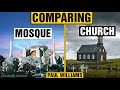

# Comparing Mosque and Church in the UK | Paul Williams (2021-09-28 18:41:23+00:00)

## Description

See the BBC article 'Young more likely to pray than over-55s - survey': https://www.bbc.co.uk/news/uk-58681075

## Summary of [Comparing Mosque and Church in the UK | Paul Williams](https://www.youtube.com/watch?v=vd8uAbkTWyY)

*This is an AI generated summary. There may be inaccuracies. *

### [00:00:00](https://www.youtube.com/watch?v=vd8uAbkTWyY&t=0) - [00:05:00](https://www.youtube.com/watch?v=vd8uAbkTWyY&t=300)

Discusses the increasing popularity of mosques in the UK, as well as the possible reasons behind this trend. The article suggest that this may be due to the pandemic, as people may find it easier to express their faith online. However, the author also points out that there is still a lot of division between mosque and church communities in the UK, with the average church being closed most of the time.

**[00:00:00](https://www.youtube.com/watch?v=vd8uAbkTWyY&t=0)** The study found that 51% of 18-34 year olds polled said they pray regularly, while 24% of those aged 55 and over said the same. It also found that 49 of the younger age group attend a place of worship every month, while 16 of the over 55s do. The associate director of cervantes said the numbers could reflect the move to online worship during the pandemic.
* **[00:05:00](https://www.youtube.com/watch?v=vd8uAbkTWyY&t=300)** discusses the increasing popularity of mosques in the UK, as well as the possible reasons behind this trend. The article suggest that this may be due to the pandemic, as people may find it easier to express their faith online. However, the author also points out that there is still a lot of division between mosque and church communities in the UK, with the average church being closed most of the time.

## Full transcript with timestamps

[0:00:02](https://youtu.be/vd8uAbkTWyY?t=2) i came across an interesting news item  
[0:00:05](https://youtu.be/vd8uAbkTWyY?t=5) on the bbc news website uh the headline  
[0:00:08](https://youtu.be/vd8uAbkTWyY?t=8) is young people more likely to pray than  
[0:00:11](https://youtu.be/vd8uAbkTWyY?t=11) over 55s according to a survey recently  
[0:00:16](https://youtu.be/vd8uAbkTWyY?t=16) and the article says young people in the  
[0:00:18](https://youtu.be/vd8uAbkTWyY?t=18) uk are twice as likely as older people  
[0:00:22](https://youtu.be/vd8uAbkTWyY?t=22) to pray regularly a new survey has found  
[0:00:26](https://youtu.be/vd8uAbkTWyY?t=26) some 51 percent of 18 to 34 year olds  
[0:00:30](https://youtu.be/vd8uAbkTWyY?t=30) polled by savanta comres  
[0:00:33](https://youtu.be/vd8uAbkTWyY?t=33) said they pray at least once a month  
[0:00:35](https://youtu.be/vd8uAbkTWyY?t=35) compared to just 24  
[0:00:38](https://youtu.be/vd8uAbkTWyY?t=38) of those aged 55 and over only a quarter  
[0:00:41](https://youtu.be/vd8uAbkTWyY?t=41) of older people even pray once a month  
[0:00:44](https://youtu.be/vd8uAbkTWyY?t=44) it also found 49  
[0:00:46](https://youtu.be/vd8uAbkTWyY?t=46) of the younger age group attend a place  
[0:00:49](https://youtu.be/vd8uAbkTWyY?t=49) of worship every month compared to just  
[0:00:51](https://youtu.be/vd8uAbkTWyY?t=51) 16  
[0:00:53](https://youtu.be/vd8uAbkTWyY?t=53) of the over 55s  
[0:00:55](https://youtu.be/vd8uAbkTWyY?t=55) the associate director of cervantes said  
[0:00:57](https://youtu.be/vd8uAbkTWyY?t=57) the numbers could reflect the move to  
[0:01:00](https://youtu.be/vd8uAbkTWyY?t=60) online worship during the pandemic this  
[0:01:03](https://youtu.be/vd8uAbkTWyY?t=63) is very interesting how worship itself  
[0:01:04](https://youtu.be/vd8uAbkTWyY?t=64) has been changing because of this  
[0:01:07](https://youtu.be/vd8uAbkTWyY?t=67) chris hopkins this director added that  
[0:01:10](https://youtu.be/vd8uAbkTWyY?t=70) there were a few theories as to why  
[0:01:12](https://youtu.be/vd8uAbkTWyY?t=72) young people made up such a large  
[0:01:14](https://youtu.be/vd8uAbkTWyY?t=74) proportion of the religious landscape  
[0:01:17](https://youtu.be/vd8uAbkTWyY?t=77) firstly he said  
[0:01:18](https://youtu.be/vd8uAbkTWyY?t=78) as the demography of the uk changes  
[0:01:22](https://youtu.be/vd8uAbkTWyY?t=82) minority faiths do tend to have a larger  
[0:01:25](https://youtu.be/vd8uAbkTWyY?t=85) proportion of practicing young people  
[0:01:27](https://youtu.be/vd8uAbkTWyY?t=87) and therefore as the population of these  
[0:01:29](https://youtu.be/vd8uAbkTWyY?t=89) groups increases within the uk  
[0:01:32](https://youtu.be/vd8uAbkTWyY?t=92) so will the prayer habits of the  
[0:01:34](https://youtu.be/vd8uAbkTWyY?t=94) population at large  
[0:01:37](https://youtu.be/vd8uAbkTWyY?t=97) he also said that an important factor  
[0:01:40](https://youtu.be/vd8uAbkTWyY?t=100) was the impact of the pandemic has had  
[0:01:43](https://youtu.be/vd8uAbkTWyY?t=103) on the ability to engage with one's  
[0:01:45](https://youtu.be/vd8uAbkTWyY?t=105) faith with virtual prayers and services  
[0:01:48](https://youtu.be/vd8uAbkTWyY?t=108) being held online  
[0:01:50](https://youtu.be/vd8uAbkTWyY?t=110) it is possible that the pandemic opened  
[0:01:53](https://youtu.be/vd8uAbkTWyY?t=113) up more avenues to prayer to young  
[0:01:55](https://youtu.be/vd8uAbkTWyY?t=115) people and this is reflected  
[0:01:57](https://youtu.be/vd8uAbkTWyY?t=117) in the findings he said and then the  
[0:02:00](https://youtu.be/vd8uAbkTWyY?t=120) article which i'll link to below  
[0:02:02](https://youtu.be/vd8uAbkTWyY?t=122) has some examples of as a young muslim  
[0:02:04](https://youtu.be/vd8uAbkTWyY?t=124) woman of 23 from cardiff that she prays  
[0:02:08](https://youtu.be/vd8uAbkTWyY?t=128) every day and she says she found her  
[0:02:09](https://youtu.be/vd8uAbkTWyY?t=129) faith to give her solace in the pandemic  
[0:02:13](https://youtu.be/vd8uAbkTWyY?t=133) and she says interesting quote here  
[0:02:15](https://youtu.be/vd8uAbkTWyY?t=135) i know it's guaranteed that's her faith  
[0:02:18](https://youtu.be/vd8uAbkTWyY?t=138) and it's not going to change i know it's  
[0:02:19](https://youtu.be/vd8uAbkTWyY?t=139) going to be the place that provides  
[0:02:22](https://youtu.be/vd8uAbkTWyY?t=142) solace it's my grounding and my anchor  
[0:02:25](https://youtu.be/vd8uAbkTWyY?t=145) in life  
[0:02:27](https://youtu.be/vd8uAbkTWyY?t=147) um and that's interesting uh there was  
[0:02:30](https://youtu.be/vd8uAbkTWyY?t=150) the study uh polled  
[0:02:32](https://youtu.be/vd8uAbkTWyY?t=152) 2075 british adults in august and seems  
[0:02:36](https://youtu.be/vd8uAbkTWyY?t=156) to contradict  
[0:02:38](https://youtu.be/vd8uAbkTWyY?t=158) the stereotypical view that religious  
[0:02:40](https://youtu.be/vd8uAbkTWyY?t=160) groups in the uk are overwhelmingly  
[0:02:43](https://youtu.be/vd8uAbkTWyY?t=163) elderly  
[0:02:45](https://youtu.be/vd8uAbkTWyY?t=165) now i'm not sure that's 100 true  
[0:02:47](https://youtu.be/vd8uAbkTWyY?t=167) i've been to many many churches in my  
[0:02:49](https://youtu.be/vd8uAbkTWyY?t=169) life both uh catholic and anglican and  
[0:02:52](https://youtu.be/vd8uAbkTWyY?t=172) evangelical  
[0:02:53](https://youtu.be/vd8uAbkTWyY?t=173) and they and most churches are  
[0:02:55](https://youtu.be/vd8uAbkTWyY?t=175) overwhelmingly uh i say full of old  
[0:02:57](https://youtu.be/vd8uAbkTWyY?t=177) people but there aren't many people that  
[0:02:59](https://youtu.be/vd8uAbkTWyY?t=179) go in those churches that there are  
[0:03:01](https://youtu.be/vd8uAbkTWyY?t=181) mostly uh 90  
[0:03:03](https://youtu.be/vd8uAbkTWyY?t=183) elderly people by which i mean in their  
[0:03:05](https://youtu.be/vd8uAbkTWyY?t=185) 60s and 70s and so on there are a few  
[0:03:08](https://youtu.be/vd8uAbkTWyY?t=188) exceptions like htb and kensington big  
[0:03:11](https://youtu.be/vd8uAbkTWyY?t=191) exception but what struck me in the  
[0:03:13](https://youtu.be/vd8uAbkTWyY?t=193) mosques i've been to and i was in a  
[0:03:15](https://youtu.be/vd8uAbkTWyY?t=195) mosque last friday in shepherds bush and  
[0:03:18](https://youtu.be/vd8uAbkTWyY?t=198) it's basically packed it's full of young  
[0:03:21](https://youtu.be/vd8uAbkTWyY?t=201) men overwhelmingly young men i would say  
[0:03:23](https://youtu.be/vd8uAbkTWyY?t=203) i don't know 90 percent young men in  
[0:03:26](https://youtu.be/vd8uAbkTWyY?t=206) their teens 20s maybe even 30s  
[0:03:29](https://youtu.be/vd8uAbkTWyY?t=209) and they're all serious about their  
[0:03:31](https://youtu.be/vd8uAbkTWyY?t=211) faith they're committed  
[0:03:32](https://youtu.be/vd8uAbkTWyY?t=212) and they go they go to jumaa every  
[0:03:35](https://youtu.be/vd8uAbkTWyY?t=215) friday um and what a contrast there  
[0:03:39](https://youtu.be/vd8uAbkTWyY?t=219) between your typical mosque and your  
[0:03:42](https://youtu.be/vd8uAbkTWyY?t=222) typical church  
[0:03:43](https://youtu.be/vd8uAbkTWyY?t=223) and here we're seeing the future of  
[0:03:46](https://youtu.be/vd8uAbkTWyY?t=226) faith practice in the uk  
[0:03:48](https://youtu.be/vd8uAbkTWyY?t=228) played out and the direction of the  
[0:03:50](https://youtu.be/vd8uAbkTWyY?t=230) direction of growth on the one hand and  
[0:03:52](https://youtu.be/vd8uAbkTWyY?t=232) directional decline on the other is very  
[0:03:54](https://youtu.be/vd8uAbkTWyY?t=234) clear  
[0:03:56](https://youtu.be/vd8uAbkTWyY?t=236) back to the article  
[0:03:58](https://youtu.be/vd8uAbkTWyY?t=238) its founder richard gamble is the  
[0:04:00](https://youtu.be/vd8uAbkTWyY?t=240) founder of the charity that commissioned  
[0:04:02](https://youtu.be/vd8uAbkTWyY?t=242) this um survey said  
[0:04:05](https://youtu.be/vd8uAbkTWyY?t=245) the study challenged the perception that  
[0:04:08](https://youtu.be/vd8uAbkTWyY?t=248) the uk was a secular society  
[0:04:12](https://youtu.be/vd8uAbkTWyY?t=252) it is becoming increasingly clear that  
[0:04:14](https://youtu.be/vd8uAbkTWyY?t=254) there is actually a growing spirituality  
[0:04:17](https://youtu.be/vd8uAbkTWyY?t=257) in the nation he said  
[0:04:20](https://youtu.be/vd8uAbkTWyY?t=260) um that's absolutely true i i think i  
[0:04:22](https://youtu.be/vd8uAbkTWyY?t=262) think on the surface our society is  
[0:04:25](https://youtu.be/vd8uAbkTWyY?t=265) certainly militantly secular it's been  
[0:04:27](https://youtu.be/vd8uAbkTWyY?t=267) taken over by  
[0:04:28](https://youtu.be/vd8uAbkTWyY?t=268) some strange ideologies which i won't go  
[0:04:31](https://youtu.be/vd8uAbkTWyY?t=271) into but um but on the street level so  
[0:04:34](https://youtu.be/vd8uAbkTWyY?t=274) to speak and real people uh that there  
[0:04:36](https://youtu.be/vd8uAbkTWyY?t=276) is particularly younger people uh there  
[0:04:38](https://youtu.be/vd8uAbkTWyY?t=278) is certainly a seriousness about  
[0:04:41](https://youtu.be/vd8uAbkTWyY?t=281) spirituality about purpose meaning god  
[0:04:44](https://youtu.be/vd8uAbkTWyY?t=284) the divine  
[0:04:45](https://youtu.be/vd8uAbkTWyY?t=285) um which i personally found incredibly  
[0:04:48](https://youtu.be/vd8uAbkTWyY?t=288) uh refreshing and encouraging  
[0:04:51](https://youtu.be/vd8uAbkTWyY?t=291) for the future of the well-being of our  
[0:04:53](https://youtu.be/vd8uAbkTWyY?t=293) country and for people themselves is  
[0:04:55](https://youtu.be/vd8uAbkTWyY?t=295) older people uh much older people  
[0:04:56](https://youtu.be/vd8uAbkTWyY?t=296) particularly i see this in france as  
[0:04:58](https://youtu.be/vd8uAbkTWyY?t=298) well who are very reluctant to publicly  
[0:05:00](https://youtu.be/vd8uAbkTWyY?t=300) speak about uh faith at all  
[0:05:04](https://youtu.be/vd8uAbkTWyY?t=304) um the bbc uh article also says a  
[0:05:08](https://youtu.be/vd8uAbkTWyY?t=308) separate study by manchester  
[0:05:10](https://youtu.be/vd8uAbkTWyY?t=310) metropolitan university coming out this  
[0:05:13](https://youtu.be/vd8uAbkTWyY?t=313) week  
[0:05:14](https://youtu.be/vd8uAbkTWyY?t=314) suggests religious communities have  
[0:05:16](https://youtu.be/vd8uAbkTWyY?t=316) boomed in the pandemic with the move  
[0:05:19](https://youtu.be/vd8uAbkTWyY?t=319) online  
[0:05:21](https://youtu.be/vd8uAbkTWyY?t=321) so this is really interesting so there's  
[0:05:23](https://youtu.be/vd8uAbkTWyY?t=323) a shift here it seems and will this be  
[0:05:25](https://youtu.be/vd8uAbkTWyY?t=325) permanent this is the question i have  
[0:05:27](https://youtu.be/vd8uAbkTWyY?t=327) and i don't know it'd be permanent or  
[0:05:28](https://youtu.be/vd8uAbkTWyY?t=328) not but it could be because social media  
[0:05:31](https://youtu.be/vd8uAbkTWyY?t=331) now for good oriole is now so much a  
[0:05:34](https://youtu.be/vd8uAbkTWyY?t=334) part of  
[0:05:35](https://youtu.be/vd8uAbkTWyY?t=335) our lives that people may find it much  
[0:05:38](https://youtu.be/vd8uAbkTWyY?t=338) easier to express  
[0:05:39](https://youtu.be/vd8uAbkTWyY?t=339) their faith their prayer online than by  
[0:05:42](https://youtu.be/vd8uAbkTWyY?t=342) going to a church which is a building is  
[0:05:46](https://youtu.be/vd8uAbkTWyY?t=346) likely to be locked most of the week  
[0:05:48](https://youtu.be/vd8uAbkTWyY?t=348) they are ninety percent of them are  
[0:05:49](https://youtu.be/vd8uAbkTWyY?t=349) locked all the time apart from just an  
[0:05:51](https://youtu.be/vd8uAbkTWyY?t=351) hour on sunday perhaps  
[0:05:53](https://youtu.be/vd8uAbkTWyY?t=353) whereas online of course you can engage  
[0:05:55](https://youtu.be/vd8uAbkTWyY?t=355) with people and express your faith and  
[0:05:57](https://youtu.be/vd8uAbkTWyY?t=357) watch services and participate in  
[0:05:58](https://youtu.be/vd8uAbkTWyY?t=358) services any time of the day or night  
[0:06:00](https://youtu.be/vd8uAbkTWyY?t=360) globally  
[0:06:02](https://youtu.be/vd8uAbkTWyY?t=362) um  
[0:06:03](https://youtu.be/vd8uAbkTWyY?t=363) but also come back to mosques as well  
[0:06:04](https://youtu.be/vd8uAbkTWyY?t=364) you know uh the mosque i mean one near  
[0:06:06](https://youtu.be/vd8uAbkTWyY?t=366) here regions park mosque open every day  
[0:06:09](https://youtu.be/vd8uAbkTWyY?t=369) all day they have a cafe has a  
[0:06:11](https://youtu.be/vd8uAbkTWyY?t=371) restaurant it's a book shop has a huge  
[0:06:13](https://youtu.be/vd8uAbkTWyY?t=373) prayer room uh has other facilities for  
[0:06:15](https://youtu.be/vd8uAbkTWyY?t=375) men and women it has an office it has  
[0:06:17](https://youtu.be/vd8uAbkTWyY?t=377) everything  
[0:06:19](https://youtu.be/vd8uAbkTWyY?t=379) so it's a place it's a community  
[0:06:21](https://youtu.be/vd8uAbkTWyY?t=381) center it's not just a place of prayer  
[0:06:23](https://youtu.be/vd8uAbkTWyY?t=383) it's a community center  
[0:06:26](https://youtu.be/vd8uAbkTWyY?t=386) and where you can sit down relax as well  
[0:06:28](https://youtu.be/vd8uAbkTWyY?t=388) as meet with fellow believers and pray  
[0:06:31](https://youtu.be/vd8uAbkTWyY?t=391) and worship and so that's not the case  
[0:06:34](https://youtu.be/vd8uAbkTWyY?t=394) in my experience with churches at all  
[0:06:36](https://youtu.be/vd8uAbkTWyY?t=396) really uh that i think there may be one  
[0:06:38](https://youtu.be/vd8uAbkTWyY?t=398) or two exceptions i can think of in the  
[0:06:40](https://youtu.be/vd8uAbkTWyY?t=400) uk i say your average church is just  
[0:06:42](https://youtu.be/vd8uAbkTWyY?t=402) closed most of the time  
[0:06:44](https://youtu.be/vd8uAbkTWyY?t=404) your average church is not going to be a  
[0:06:46](https://youtu.be/vd8uAbkTWyY?t=406) welcoming place where you can sit out  
[0:06:47](https://youtu.be/vd8uAbkTWyY?t=407) and chill out before after a service or  
[0:06:50](https://youtu.be/vd8uAbkTWyY?t=410) you can you know it's a structured  
[0:06:52](https://youtu.be/vd8uAbkTWyY?t=412) hierarchical tight closed environment  
[0:06:55](https://youtu.be/vd8uAbkTWyY?t=415) and then you're in then you're out  
[0:06:57](https://youtu.be/vd8uAbkTWyY?t=417) now i'm not saying this to put down  
[0:06:58](https://youtu.be/vd8uAbkTWyY?t=418) those churches uh there could be  
[0:07:00](https://youtu.be/vd8uAbkTWyY?t=420) logistical and practical reasons why  
[0:07:01](https://youtu.be/vd8uAbkTWyY?t=421) they have to function in that limited  
[0:07:03](https://youtu.be/vd8uAbkTWyY?t=423) way  
[0:07:05](https://youtu.be/vd8uAbkTWyY?t=425) but in my experience muslims uh meet in  
[0:07:08](https://youtu.be/vd8uAbkTWyY?t=428) their in uh  
[0:07:10](https://youtu.be/vd8uAbkTWyY?t=430) not just in formal structures like  
[0:07:12](https://youtu.be/vd8uAbkTWyY?t=432) regions part mosque  
[0:07:14](https://youtu.be/vd8uAbkTWyY?t=434) they they meet in uh they rent out  
[0:07:17](https://youtu.be/vd8uAbkTWyY?t=437) places they rent out buildings rooms  
[0:07:19](https://youtu.be/vd8uAbkTWyY?t=439) they're meeting converted houses all  
[0:07:21](https://youtu.be/vd8uAbkTWyY?t=441) over the place  
[0:07:22](https://youtu.be/vd8uAbkTWyY?t=442) uh because there's an obligation to pray  
[0:07:25](https://youtu.be/vd8uAbkTWyY?t=445) to god of course uh and god for muslims  
[0:07:28](https://youtu.be/vd8uAbkTWyY?t=448) comes first not making money  
[0:07:31](https://youtu.be/vd8uAbkTWyY?t=451) or entertainment or whatever  
[0:07:34](https://youtu.be/vd8uAbkTWyY?t=454) anyway i thought that report was very  
[0:07:35](https://youtu.be/vd8uAbkTWyY?t=455) interesting and reasons for optimism  
[0:07:38](https://youtu.be/vd8uAbkTWyY?t=458) uh in our otherwise militantly secular  
[0:07:42](https://youtu.be/vd8uAbkTWyY?t=462) society uh where the concerns of the  
[0:07:44](https://youtu.be/vd8uAbkTWyY?t=464) dunya this world the near are total  
[0:07:48](https://youtu.be/vd8uAbkTWyY?t=468) uh and then we see these green shoots  
[0:07:50](https://youtu.be/vd8uAbkTWyY?t=470) coming out now where uh younger people  
[0:07:53](https://youtu.be/vd8uAbkTWyY?t=473) unlike us older people are  
[0:07:56](https://youtu.be/vd8uAbkTWyY?t=476) finding ways to express their faith  
[0:07:58](https://youtu.be/vd8uAbkTWyY?t=478) online  
[0:07:59](https://youtu.be/vd8uAbkTWyY?t=479) and in places like mosques which are  
[0:08:01](https://youtu.be/vd8uAbkTWyY?t=481) open and welcoming usually welcoming to  
[0:08:04](https://youtu.be/vd8uAbkTWyY?t=484) uh to people  
[0:08:06](https://youtu.be/vd8uAbkTWyY?t=486) anyway until next time  
