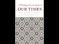

# Democracy, Islam & the Middle East (2021-06-16 16:39:58+00:00)

## Description

I read from A Thinking Person’s Guide to Our Times by H.R.H. Prince Ghazi bin Muhammad https://turath.co.uk/publications/a-thinking-persons-guide-to-our-times/

## Summary of [Democracy, Islam & the Middle East](https://www.youtube.com/watch?v=gMSH8tlXhs0)

*This is an AI generated summary. There may be inaccuracies. *

### [00:00:00](https://www.youtube.com/watch?v=gMSH8tlXhs0&t=0) - [00:00:00](https://www.youtube.com/watch?v=gMSH8tlXhs0&t=0)

Prince Ghazi bin Muhammad of Jordan argues that democracy is broken in the West, citing examples such as freedom of speech being used to insult God and other religious figures, abortion and the mass legal culling of unborn human children, promiscuity being ubiquitous, an economy based on making a fantasy out of sex, and an industry based on sexual marketing for every product imaginable. Prince Ghazi also points out that freedom to vote for those parties the West likes means the freedom to vote for those who will then take away the vote forever, and that majority rule leads to tyranny of the lowest common denominator. Prince Ghazi proposes distinguishing between "Western-export democracy" and true democracy, and proposing a solution that would address the issues he has outlined.

**[00:00:00](https://www.youtube.com/watch?v=gMSH8tlXhs0&t=0)** Prince Ghazi bin Muhammad of Jordan argues that democracy is broken in the West, citing examples such as freedom of speech being used to insult God and other religious figures, abortion and the mass legal culling of unborn human children, promiscuity being ubiquitous, an economy based on making a fantasy out of sex, and an industry based on sexual marketing for every product imaginable. Prince Ghazi also points out that freedom to vote for those parties the West likes means the freedom to vote for those who will then take away the vote forever, and that majority rule leads to tyranny of the lowest common denominator. Prince Ghazi proposes distinguishing between "Western-export democracy" and true democracy, and proposing a solution that would address the issues he has outlined.

## Full transcript with timestamps

[0:00:01](https://youtu.be/gMSH8tlXhs0?t=1) Blogging Theology is coming to you now from the 
South of France where I'll be for a while and    
[0:00:06](https://youtu.be/gMSH8tlXhs0?t=6) i wanted to share with you some very interesting 
insights from this book 'A Thinking Person's Guide    
[0:00:10](https://youtu.be/gMSH8tlXhs0?t=10) to our Times' by Prince Ghazi bin Muhammad of 
Jordan. And he writes in on page 82 about some    
[0:00:18](https://youtu.be/gMSH8tlXhs0?t=18) of the things that are broken in our present 
world and one of them is democracy. And he says    
[0:00:25](https://youtu.be/gMSH8tlXhs0?t=25) 'Western democracy is bust in the Middle East. By 
this i mean not what people might like to believe    
[0:00:31](https://youtu.be/gMSH8tlXhs0?t=31) ie that it has failed to be implemented. What i mean 
is that the very idea is at its root a failure and    
[0:00:40](https://youtu.be/gMSH8tlXhs0?t=40) is rejected by most people in the Middle East. 
Now this is a very emotional issue in the West,    
[0:00:47](https://youtu.be/gMSH8tlXhs0?t=47) and whenever you say 'democracy' 
people start purring and bowing.    
[0:00:52](https://youtu.be/gMSH8tlXhs0?t=52) Whenever a patrician like me brings it 
up, people start hurling abuse (and perhaps    
[0:00:57](https://youtu.be/gMSH8tlXhs0?t=57) justly so). So let me be clear why i say it is 
broken, and what in particular in it is broken.    
[0:01:07](https://youtu.be/gMSH8tlXhs0?t=67) Obviously, justice, fairness, the rule of law 
and equality before the law, accountability,    
[0:01:13](https://youtu.be/gMSH8tlXhs0?t=73) and transparency and public participation in 
government are NOT broken, but rather very much    
[0:01:20](https://youtu.be/gMSH8tlXhs0?t=80) in demand. What is broken is, and here we have a 
list of 11 items where he says democracy is broken    
[0:01:28](https://youtu.be/gMSH8tlXhs0?t=88) in the West: 1. 'freedom of speech' Charlie Hebdo 
style, which actually means freedom to insult God,    
[0:01:37](https://youtu.be/gMSH8tlXhs0?t=97) His Prophet upon whom be peace, the Qur'an and 
Islam, and it is considered a high moral value.    
[0:01:45](https://youtu.be/gMSH8tlXhs0?t=105) 2. 'Freedom of choice' which actually means 
abortion and the mass legal culling of unborn    
[0:01:52](https://youtu.be/gMSH8tlXhs0?t=112) human children. 3. 'Freedom of consent' which 
means promiscuity; ubiquitous pornography;    
[0:02:00](https://youtu.be/gMSH8tlXhs0?t=120) an economy based on making a fantasy out of sex; 
an industry based on sexual marketing for every    
[0:02:08](https://youtu.be/gMSH8tlXhs0?t=128) product imaginable, all leading to the breakdown 
of the family. 4. 'LGBT+ rights' which to Muslims    
[0:02:17](https://youtu.be/gMSH8tlXhs0?t=137) and practicing Middle East Christians seem not 
like defending the rights of an ethnic minority    
[0:02:24](https://youtu.be/gMSH8tlXhs0?t=144) but like the compulsory celebration 
of moral deviance, to say the least.    
[0:02:30](https://youtu.be/gMSH8tlXhs0?t=150) 5. 'Freedom of religion' which means freedom for 
Western-funded Christian missionaries to re-invade    
[0:02:36](https://youtu.be/gMSH8tlXhs0?t=156) the Middle East as they did in the Colonial Period. 
6 'Freedom to vote' which in the democratic experience    
[0:02:44](https://youtu.be/gMSH8tlXhs0?t=164) in Palestine, Algeria, and Lebanon and Egypt means 
freedom to vote for those parties the West likes.    
[0:02:52](https://youtu.be/gMSH8tlXhs0?t=172) Elsewhere, it means the freedom to vote for those 
who will then take away the vote forever. And no    
[0:02:58](https://youtu.be/gMSH8tlXhs0?t=178) one understands how to navigate between these two 
polles. 7. 'Majority rule' which means 'majoritarianism',    
[0:03:07](https://youtu.be/gMSH8tlXhs0?t=187) tyranny of the majority, the 'rule' of the lowest 
common denominator, and the suppression, repression,    
[0:03:14](https://youtu.be/gMSH8tlXhs0?t=194) oppression, and depression of all minorities and 
differing opinions. 8. 'Regional freedom' which actually    
[0:03:22](https://youtu.be/gMSH8tlXhs0?t=202) means freedom to break away, to secede and enjoy 
endless civil war (such as in South Sudan precisely).    
[0:03:32](https://youtu.be/gMSH8tlXhs0?t=212) 9. 'Freedom of the press' which actually means 
freedom to maliciously slander, insult,    
[0:03:37](https://youtu.be/gMSH8tlXhs0?t=217) vilify, hound, tar and popularly judge convict 
anyone who does not own their own media outlet,    
[0:03:45](https://youtu.be/gMSH8tlXhs0?t=225) based on the evidence of mere suspicion. 10. 'Free 
market economies' which actually means freedom    
[0:03:52](https://youtu.be/gMSH8tlXhs0?t=232) to buy Western goods for the states to live in 
bondage to Western owned financial institutes    
[0:03:59](https://youtu.be/gMSH8tlXhs0?t=239) like the International Monetary Fund and the World 
Bank. 11. 'Human Rights in general: whether people like    
[0:04:08](https://youtu.be/gMSH8tlXhs0?t=248) it or not there are profound differences between 
what the West regards as Universal Human Rights    
[0:04:15](https://youtu.be/gMSH8tlXhs0?t=255) and the Islamic conception of human rights. 
These can be seen in the differences between the    
[0:04:21](https://youtu.be/gMSH8tlXhs0?t=261) so-called Universal Declaration of Human Rights 
and the 1990 Cairo Declaration on Human Rights in    
[0:04:29](https://youtu.be/gMSH8tlXhs0?t=269) Islam (adopted by 44 Islamic Countries). But there is 
also a great deal in common. And then he concludes:    
[0:04:39](https://youtu.be/gMSH8tlXhs0?t=279) 'These are complex issues and i will return to 
them later to propose distinctions and a solution    
[0:04:45](https://youtu.be/gMSH8tlXhs0?t=285) but it suffices to say that Western-export 
democracy is truly broken'. Until next time.  
