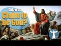

# Did Jesus Claim to be God? (2021-01-26 19:32:45+00:00)

## Description

I read from 'How Jesus Became God: The Exaltation of a Jewish Preacher from Galilee'
by Professor Bart D. Ehrman
https://www.amazon.co.uk/How-Jesus-Became-Bart-Ehrman/dp/0061778184

## Summary of [Did Jesus Claim to be God?](https://www.youtube.com/watch?v=TZoC-iPb7uU)

*This is an AI generated summary. There may be inaccuracies. *

### [00:00:00](https://www.youtube.com/watch?v=TZoC-iPb7uU&t=0) - [00:10:00](https://www.youtube.com/watch?v=TZoC-iPb7uU&t=600)

 Bart Ehrman discusses the evidence that Jesus did not claim to be God, but instead may have been claiming a priestly prerogative. He points out that there are few, if any, explicit claims of this nature in earlier sources, and that this suggests that Jesus did not consider himself to be divine. The video also argues that Jesus' miracles and forgiveness are indicative of his divine nature, and that he is worshipped as if he were a god.

**[00:00:00](https://www.youtube.com/watch?v=TZoC-iPb7uU&t=0)** In his book "Did Jesus Claim to Be God?" Bart Ehrman discusses the mainstream view among biblical scholars that Jesus claimed to be God. He points out that these claims are found only in John's gospel and are not found in any other source. They are not credible when taken in context, and there is no record of anyone else claiming this same thing about themselves.
* **[00:05:00](https://www.youtube.com/watch?v=TZoC-iPb7uU&t=300)** The video discusses the evidence for Jesus' claims to be divine. It notes that there are few, if any, explicit claims of this nature in earlier sources, and that this suggests that Jesus did not consider himself to be divine. The video also argues that Jesus' miracles and forgiveness are indicative of his divine nature, and that he is worshipped as if he were a god.
* **[00:10:00](https://www.youtube.com/watch?v=TZoC-iPb7uU&t=600)**  Bart Ehrman discusses the evidence that Jesus did not claim to be God, and instead may have been claiming a priestly prerogative. Scholars from all over the world agree with this conclusion, and believe that Jesus was a prophet and a messiah sent by God.

## Full transcript with timestamps

[0:00:01](https://youtu.be/TZoC-iPb7uU?t=1) did jesus claim to be god ? this 
is a really important question    
[0:00:06](https://youtu.be/TZoC-iPb7uU?t=6) and historians have been investigating the life 
of jesus the historical jesus for generations    
[0:00:11](https://youtu.be/TZoC-iPb7uU?t=11) now , and they've come broadly to consensus
on this question . it really matters to us today    
[0:00:18](https://youtu.be/TZoC-iPb7uU?t=18) because if he did claim to be god then 
it matters . it matters that we worship    
[0:00:23](https://youtu.be/TZoC-iPb7uU?t=23) him as our creator as our lord however if 
he didn't claim to be god and he wasn't god    
[0:00:30](https://youtu.be/TZoC-iPb7uU?t=30) then worshiping him is an act of egregious 
idolatry and indeed orthodox jews will not enter    
[0:00:36](https://youtu.be/TZoC-iPb7uU?t=36) into a church today because of what they perceive 
to be the idolatry that takes place in the typical    
[0:00:43](https://youtu.be/TZoC-iPb7uU?t=43) christian church and muslims many muslims will 
not enter into a church for the same reason    
[0:00:49](https://youtu.be/TZoC-iPb7uU?t=49) so i want to share with you some of the 
mainstream research findings of biblical    
[0:00:54](https://youtu.be/TZoC-iPb7uU?t=54) scholarship by sharing with you again from the 
work of bart ehrman who is distinguished professor    
[0:01:01](https://youtu.be/TZoC-iPb7uU?t=61) of religious studies at the university of north 
carolina chapel hill in america he's one of    
[0:01:06](https://youtu.be/TZoC-iPb7uU?t=66) the world's leading new testament scholars and a 
specialist on the historical jesus . i'm going to be    
[0:01:12](https://youtu.be/TZoC-iPb7uU?t=72) quoting from this book again how jesus became god 
the exaltation of a jewish preacher from galilee  .  
[0:01:19](https://youtu.be/TZoC-iPb7uU?t=79) there's a chapter in his book called did jesus 
think he was god and towards the end of this    
[0:01:26](https://youtu.be/TZoC-iPb7uU?t=86) chapter there's a subheading : did jesus claim 
to be god ? which i want to share with you i    
[0:01:32](https://youtu.be/TZoC-iPb7uU?t=92) don't necessarily agree with everything he says 
in here but i think he's certainly more or less on    
[0:01:36](https://youtu.be/TZoC-iPb7uU?t=96) the right path when it comes to jesus . so he writes 
this then in a nutshell is what i think we can say    
[0:01:44](https://youtu.be/TZoC-iPb7uU?t=104) about the historical jesus and his understanding 
of himself he thought he was a prophet    
[0:01:50](https://youtu.be/TZoC-iPb7uU?t=110) predicting the end of the current evil age and the 
future king of israel in the age to come but did    
[0:01:57](https://youtu.be/TZoC-iPb7uU?t=117) he call himself god it is true that jesus claims 
to be divine in the last of our canonical gospels    
[0:02:05](https://youtu.be/TZoC-iPb7uU?t=125) to be written the gospel of john in that gospel 
jesus does make remarkable claims about himself    
[0:02:13](https://youtu.be/TZoC-iPb7uU?t=133) in speaking of the father of the jews abraham who 
lived 1800 years earlier jesus tells his opponents    
[0:02:20](https://youtu.be/TZoC-iPb7uU?t=140) truly i tell you before abraham was i am that's 
john 8 58. this particular phrase " i am " brings    
[0:02:29](https://youtu.be/TZoC-iPb7uU?t=149) a familiar call to anyone acquainted with the 
hebrew bible in the book of exodus in the story    
[0:02:34](https://youtu.be/TZoC-iPb7uU?t=154) of the burning bush , moses asked god what his 
name is and god tells him that his name is i am    
[0:02:43](https://youtu.be/TZoC-iPb7uU?t=163) jesus appears to be claiming not only to have 
existed before abraham but to have been given    
[0:02:48](https://youtu.be/TZoC-iPb7uU?t=168) the name of god himself his jewish opponents know 
exactly what he is saying they immediately take up    
[0:02:55](https://youtu.be/TZoC-iPb7uU?t=175) stones to stone him later in the gospel jesus is 
even more explicit again as he proclaims i and the    
[0:03:03](https://youtu.be/TZoC-iPb7uU?t=183) father are one john 10 30. once again the jewish 
listeners break out the stones still later when    
[0:03:11](https://youtu.be/TZoC-iPb7uU?t=191) jesus is talking to his disciples at his last 
meal with them his follower philip asked him    
[0:03:17](https://youtu.be/TZoC-iPb7uU?t=197) to show them who god the father is jesus replies 
the one who has seen me has seen the father 14 9    
[0:03:27](https://youtu.be/TZoC-iPb7uU?t=207) and again later during the same meal jesus 
prays to god and asks about how god had    
[0:03:34](https://youtu.be/TZoC-iPb7uU?t=214) sent him and speaks about how god had sent him 
into the world and refers to my glory that you    
[0:03:41](https://youtu.be/TZoC-iPb7uU?t=221) gave me before the foundation of the world 24. 
jesus is not claiming to be god the father here    
[0:03:50](https://youtu.be/TZoC-iPb7uU?t=230) obviously since when he's 
praying he is not talking to himself    
[0:03:55](https://youtu.be/TZoC-iPb7uU?t=235) so he is not saying that he is identical with 
god but he is saying that he is equal with god    
[0:04:01](https://youtu.be/TZoC-iPb7uU?t=241) and has been that way from before the world 
was created these are amazingly exalted claims    
[0:04:09](https://youtu.be/TZoC-iPb7uU?t=249) but looked at from a historical perspective they 
simply cannot be ascribed to the historical jesus    
[0:04:17](https://youtu.be/TZoC-iPb7uU?t=257) they don't pass any of our criteria they are 
not multiply attested in our sources they appear    
[0:04:24](https://youtu.be/TZoC-iPb7uU?t=264) only in john our latest and most theologically 
orientated gospel they certainly do not pass the    
[0:04:32](https://youtu.be/TZoC-iPb7uU?t=272) criterion of dissimilarity since they express 
the very view of jesus that the author of the    
[0:04:37](https://youtu.be/TZoC-iPb7uU?t=277) gospel of john happens to hold and they are not 
at all contextually credible we have no record of    
[0:04:45](https://youtu.be/TZoC-iPb7uU?t=285) any palestinian jew ever saying any such things 
about himself these divine self claims in john    
[0:04:54](https://youtu.be/TZoC-iPb7uU?t=294) are part of john's distinctive theology they are 
not part of the historical record of what jesus    
[0:05:01](https://youtu.be/TZoC-iPb7uU?t=301) actually said and just to leave this for a second 
having read about this subject for some time    
[0:05:09](https://youtu.be/TZoC-iPb7uU?t=309) i would say virtually all over 99 percent of 
the world scholars do not think that the amazing    
[0:05:17](https://youtu.be/TZoC-iPb7uU?t=317) claims on the lips of jesus in the gospel of john 
are historical very very very few people just a    
[0:05:25](https://youtu.be/TZoC-iPb7uU?t=325) handful of people so just to continue , look at the 
matter in a different light as i pointed out we    
[0:05:32](https://youtu.be/TZoC-iPb7uU?t=332) have numerous earlier sources for the historical 
jesus a few comments in paul including several    
[0:05:38](https://youtu.be/TZoC-iPb7uU?t=338) quotations from jesus's teaching we have mark q 
this is quell the source shared by matthew and    
[0:05:45](https://youtu.be/TZoC-iPb7uU?t=345) luke we have M and L that's M is material unique 
to Matthew and L is material unique to Luke Luke's    
[0:05:53](https://youtu.be/TZoC-iPb7uU?t=353) gospel not to mention the finished gospels 
of matthew and luke . in none    
[0:05:59](https://youtu.be/TZoC-iPb7uU?t=359) of them do we find exalted claims of this sort if 
jesus went around galilee proclaiming himself to    
[0:06:07](https://youtu.be/TZoC-iPb7uU?t=367) be a divine being sent from god one who existed 
before the creation of the world he was in fact    
[0:06:14](https://youtu.be/TZoC-iPb7uU?t=374) equal with god could anything else that he might 
say be so breathtaking and thunderously important    
[0:06:22](https://youtu.be/TZoC-iPb7uU?t=382) and yet none of these earlier sources says any 
such thing about him did they all of them just    
[0:06:31](https://youtu.be/TZoC-iPb7uU?t=391) decide not to mention the one thing that was 
most significant about jesus this is a really    
[0:06:36](https://youtu.be/TZoC-iPb7uU?t=396) good point by the way almost certainly the 
divine self claims in john are not historical    
[0:06:44](https://youtu.be/TZoC-iPb7uU?t=404) but is it possible that jesus considered himself 
divine in some other sense i have already argued    
[0:06:51](https://youtu.be/TZoC-iPb7uU?t=411) that he did not consider himself to be the son of 
man and so he did not consider himself to be the    
[0:06:57](https://youtu.be/TZoC-iPb7uU?t=417) heavenly angelic being who would be the judge of 
all the earth but did he think of himself as the    
[0:07:03](https://youtu.be/TZoC-iPb7uU?t=423) future king of the kingdom the messiah and we saw 
in the previous chapter that in some passages of    
[0:07:10](https://youtu.be/TZoC-iPb7uU?t=430) scripture the king is talked about as a divine 
being and not merely a mortal and this is psalm    
[0:07:17](https://youtu.be/TZoC-iPb7uU?t=437) 45 for example isn't it possible that jesus 
understood himself as divine in that sense    
[0:07:24](https://youtu.be/TZoC-iPb7uU?t=444) it is of course possible but i think it is 
highly unlikely for the following reason    
[0:07:30](https://youtu.be/TZoC-iPb7uU?t=450) in the hebrew bible and indeed in the entire 
jewish tradition we do have instances in which    
[0:07:37](https://youtu.be/TZoC-iPb7uU?t=457) mortals for example a king or moses or enoch 
were considered to be divine beings in some sense    
[0:07:45](https://youtu.be/TZoC-iPb7uU?t=465) philo of alexandra by the way who was slightly 
earlier than jesus used this kind of language of    
[0:07:51](https://youtu.be/TZoC-iPb7uU?t=471) moses he called him a god by the way but that 
was always what someone else said about them    
[0:07:58](https://youtu.be/TZoC-iPb7uU?t=478) it was never what they were recorded as saying 
about themselves so in philo for example moses    
[0:08:04](https://youtu.be/TZoC-iPb7uU?t=484) is never recorded as saying i am god other 
people may have used that language of them    
[0:08:08](https://youtu.be/TZoC-iPb7uU?t=488) no one records moses or enoch or a king saying 
i am god not in the jewish tradition this is    
[0:08:15](https://youtu.be/TZoC-iPb7uU?t=495) quite different from the situation that we 
find in say egypt where the pharaohs claimed    
[0:08:22](https://youtu.be/TZoC-iPb7uU?t=502) direct divine lineage or with alexander the great 
who accepted cultic veneration always some of the    
[0:08:30](https://youtu.be/TZoC-iPb7uU?t=510) roman emperors who actively propagated the idea 
that they were gods . this never happens in judaism    
[0:08:37](https://youtu.be/TZoC-iPb7uU?t=517) that we know of . the idea that a king could be 
divine may have occurred to his followers later    
[0:08:45](https://youtu.be/TZoC-iPb7uU?t=525) as they began to think more about his eminence 
and significance but we have no known instance    
[0:08:50](https://youtu.be/TZoC-iPb7uU?t=530) of a living jewish king proclaiming himself to be 
divine could jesus be the exception yes of course    
[0:09:00](https://youtu.be/TZoC-iPb7uU?t=540) there are always exceptions to everything but to 
think that jesus is the exception in this case    
[0:09:07](https://youtu.be/TZoC-iPb7uU?t=547) one would need a good deal of persuasive evidence 
and it just doesn't exist the evidence for jesus's    
[0:09:15](https://youtu.be/TZoC-iPb7uU?t=555) claims to be divine come only from the last of the 
new testament gospels not from any earlier sources  
[0:09:26](https://youtu.be/TZoC-iPb7uU?t=566) some may argue that there are other reasons 
apart from explicit divine self claims to suspect    
[0:09:32](https://youtu.be/TZoC-iPb7uU?t=572) that jesus saw himself as divine for example 
he does amazing miracles that surely only a    
[0:09:38](https://youtu.be/TZoC-iPb7uU?t=578) divine figure could do and he forgives people's 
sins which surely is a prerogative of god alone    
[0:09:44](https://youtu.be/TZoC-iPb7uU?t=584) and he receives worship as people bow down before 
him which surely indicates that he welcomes divine    
[0:09:51](https://youtu.be/TZoC-iPb7uU?t=591) honors there are two points to stress about 
such things the first is that all of them are    
[0:10:00](https://youtu.be/TZoC-iPb7uU?t=600) compatible with human not just divine authority 
in the hebrew bible the prophets elijah and elisha    
[0:10:08](https://youtu.be/TZoC-iPb7uU?t=608) did fantastic miracles including healing the sick 
and raising the dead through the power of god and    
[0:10:15](https://youtu.be/TZoC-iPb7uU?t=615) in the new testament so did the apostles peter 
and paul but that did not make any of them divine    
[0:10:22](https://youtu.be/TZoC-iPb7uU?t=622) when jesus forgives sins he never says i forgive 
you as god might say but your sins are forgiven    
[0:10:31](https://youtu.be/TZoC-iPb7uU?t=631) which means that god has forgiven the sins 
this prerogative for pronouncing sins forgiven    
[0:10:37](https://youtu.be/TZoC-iPb7uU?t=637) was otherwise reserved for jewish priests in 
honor of sacrifices that worshipers made at    
[0:10:43](https://youtu.be/TZoC-iPb7uU?t=643) the jerusalem temple jesus may be claiming a 
priestly prerogative but not a divine one and    
[0:10:51](https://youtu.be/TZoC-iPb7uU?t=651) kings were worshiped even in the bible matthew 
18 26 by veneration and obesience just as god was    
[0:11:01](https://youtu.be/TZoC-iPb7uU?t=661) jesus may be accepting the worship 
due to him as the future king    
[0:11:06](https://youtu.be/TZoC-iPb7uU?t=666) none of these things is in and of itself 
a clear indication that jesus is divine    
[0:11:15](https://youtu.be/TZoC-iPb7uU?t=675) but even more important these activities may not 
even go back to the historical jesus instead they    
[0:11:21](https://youtu.be/TZoC-iPb7uU?t=681) may be traditions assigned to jesus by later 
storytellers in order to heighten his eminence    
[0:11:27](https://youtu.be/TZoC-iPb7uU?t=687) and significance recall one of the main points 
of this chapter many traditions in the gospels do    
[0:11:33](https://youtu.be/TZoC-iPb7uU?t=693) not derive from the life of the historical jesus 
but represent embellishments made by storytellers    
[0:11:41](https://youtu.be/TZoC-iPb7uU?t=701) who were trying to convert people by convincing 
them of jesus's superiority and to instruct    
[0:11:47](https://youtu.be/TZoC-iPb7uU?t=707) those who were converted these traditions of 
jesus's eminence cannot pass the criterion of    
[0:11:53](https://youtu.be/TZoC-iPb7uU?t=713) dissimilarity and are very likely pious expansions 
of the stories told about him told by people who    
[0:12:02](https://youtu.be/TZoC-iPb7uU?t=722) after his resurrection did come to understand 
that he was in some sense divine what we can    
[0:12:10](https://youtu.be/TZoC-iPb7uU?t=730) know with relative certainty about 
jesus is that his public ministry    
[0:12:15](https://youtu.be/TZoC-iPb7uU?t=735) and proclamation were not focused on his divinity 
in fact they are not about his divinity at all    
[0:12:22](https://youtu.be/TZoC-iPb7uU?t=742) they were about god and about the kingdom that 
god was going to bring . and i'll just end it there  .  
[0:12:31](https://youtu.be/TZoC-iPb7uU?t=751) this is totally mainstream scholarship by the way 
the vast majority of biblical scholars throughout    
[0:12:37](https://youtu.be/TZoC-iPb7uU?t=757) the world would accept this conclusion . some may 
believe jesus is god as a matter of faith but     
[0:12:43](https://youtu.be/TZoC-iPb7uU?t=763) they would accept nevertheless the the logic of 
the arguments that bart ehrman presents there    
[0:12:49](https://youtu.be/TZoC-iPb7uU?t=769) i hope this goes some way to informing 
your decision about whether or not we    
[0:12:52](https://youtu.be/TZoC-iPb7uU?t=772) should worship jesus as god or whether we should 
accept him for what by ermine concludes he was    
[0:12:58](https://youtu.be/TZoC-iPb7uU?t=778) a prophet and a messiah 
sent by god . until next time  
