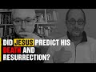

# Did Jesus predict his Death and Resurrection? With Dr Bart Ehrman (2021-12-29 14:59:57+00:00)

## Description

See original video https://www.youtube.com/watch?v=oeZrdgxi9bY&t=608s

You Can Support My Work on Patreon:
https://www.patreon.com/Bloggingtheology

My Paypal Link: 
https://www.paypal.com/paypalme/bloggingtheology?locale.x=en_GB

## Summary of [Did Jesus predict his Death and Resurrection? With Dr Bart Ehrman](https://www.youtube.com/watch?v=AVeUVbr1RqA)

*This is an AI generated summary. There may be inaccuracies. *

### [00:00:00](https://www.youtube.com/watch?v=AVeUVbr1RqA&t=0) - [00:00:00](https://www.youtube.com/watch?v=AVeUVbr1RqA&t=0)

Dr. Bart Ehrman discusses the predictions made by Jesus about his death and resurrection. He notes that scholars are skeptical of these predictions because they do not make sense when viewed in light of everything that is known about Jesus' life and teachings.

**[00:00:00](https://www.youtube.com/watch?v=AVeUVbr1RqA&t=0)** In his video, Dr. Bart Ehrman discusses the specific predictions made by Jesus about his death and resurrection, and how scholars are skeptical of these predictions because they do not make sense when viewed in light of everything that is known about Jesus' life and teachings.

## Full transcript with timestamps

[0:00:02](https://youtu.be/AVeUVbr1RqA?t=2) My next question was about the the many 
predictions we read in the particularly    
[0:00:07](https://youtu.be/AVeUVbr1RqA?t=7) the earlier gospels Matthew, Mark and Luke of 
Jesus's death and resurrection and almost at    
[0:00:13](https://youtu.be/AVeUVbr1RqA?t=13) random there's a very clear example in Luke 
chapter 8 verses 31 where Jesus says you know he    
[0:00:19](https://youtu.be/AVeUVbr1RqA?t=19) tells his disciples that everything written 
about the son of man by the prophets will be    
[0:00:24](https://youtu.be/AVeUVbr1RqA?t=24) accomplished he'll be handed over to the gentiles 
they will mock him and insult him and spit on him    
[0:00:29](https://youtu.be/AVeUVbr1RqA?t=29) then they'll flog him and after they have killed 
him on the third day he will rise again and it's    
[0:00:35](https://youtu.be/AVeUVbr1RqA?t=35) just one example and sometimes very 
detailed predictions. But the question is  
[0:00:42](https://youtu.be/AVeUVbr1RqA?t=42) in terms of the astonishment that is then 
shown by the disciples the very same people in Luke 24 when the women come back from the tomb 
they say look he's not there he's risen and Peter    
[0:00:56](https://youtu.be/AVeUVbr1RqA?t=56) I forget the Greek word but it seems to be 
saying you don't talk nonsense you're talking    
[0:01:00](https://youtu.be/AVeUVbr1RqA?t=60) nonsense yeah um i mean did the historical Jesus 
my question is did the historical Jesus therefore    
[0:01:08](https://youtu.be/AVeUVbr1RqA?t=68) really i mean supernaturalist issues apart 
because you can still predict your death and    
[0:01:12](https://youtu.be/AVeUVbr1RqA?t=72) you know just be human if you like you don't 
have to have supernatural anointing did jesus    
[0:01:17](https://youtu.be/AVeUVbr1RqA?t=77) really predict his death and resurrection or is 
this a a retrospectively inserted idea put in the    
[0:01:23](https://youtu.be/AVeUVbr1RqA?t=83) gospels to tidy up a narrative which otherwise 
would be a bit unprovidential shall we say yeah    
[0:01:29](https://youtu.be/AVeUVbr1RqA?t=89) right yeah exactly that's exactly the issue 
and it's um i think you usually scholars    
[0:01:35](https://youtu.be/AVeUVbr1RqA?t=95) look at the specificity of those predictions 
and and say you know this really you know if    
[0:01:41](https://youtu.be/AVeUVbr1RqA?t=101) if you if you're pretty sure that early christians 
are telling stories about jesus and sometimes    
[0:01:47](https://youtu.be/AVeUVbr1RqA?t=107) changing stories and sometimes changing the way 
he says things and sounds like putting words    
[0:01:51](https://youtu.be/AVeUVbr1RqA?t=111) on his lips which christians definitely are 
putting words on his lips and we have gospels    
[0:01:55](https://youtu.be/AVeUVbr1RqA?t=115) from early christianity where jesus says all sorts 
of things that nobody thinks he really said i mean    
[0:02:00](https://youtu.be/AVeUVbr1RqA?t=120) christians aren't doing this and so the question 
is which things are they putting on his lips    
[0:02:05](https://youtu.be/AVeUVbr1RqA?t=125) this is one of the first things to go i think 
from the gospel because the specificity of this    
[0:02:10](https://youtu.be/AVeUVbr1RqA?t=130) and especially predicting his own resurrection i 
think is a clear indication that this is something    
[0:02:15](https://youtu.be/AVeUVbr1RqA?t=135) that's later put on his lips it does create 
this delicious irony though that you first    
[0:02:20](https://youtu.be/AVeUVbr1RqA?t=140) get it you actually get it first in mark of 
course the first gospel where jesus makes three    
[0:02:24](https://youtu.be/AVeUVbr1RqA?t=144) explicit passion predictions and 
the disciples simply don't get it    
[0:02:32](https://youtu.be/AVeUVbr1RqA?t=152) and a lot of that not getting its stuff gets um 
gets mitigated a bit in matthew and luke but there    
[0:02:40](https://youtu.be/AVeUVbr1RqA?t=160) are elements of it still remaining where they 
just don't you know they they're not expecting the    
[0:02:45](https://youtu.be/AVeUVbr1RqA?t=165) resurrection even though jesus is spending his in 
luke he makes four of these predictions and then    
[0:02:51](https://youtu.be/AVeUVbr1RqA?t=171) they still think that the women are crazy because 
what are you talking about and the reader of    
[0:02:56](https://youtu.be/AVeUVbr1RqA?t=176) course is saying yeah well he's been saying it 
all along but so just to clarify the reason that    
[0:03:01](https://youtu.be/AVeUVbr1RqA?t=181) people are historians are skeptical it's not 
because of some alleged anti-supernaturalist    
[0:03:06](https://youtu.be/AVeUVbr1RqA?t=186) liberal bias it's because the story doesn't make 
sense uh and so it looks if you know they may    
[0:03:12](https://youtu.be/AVeUVbr1RqA?t=192) have been tampering with the story is that is that 
fair assessment i'd say i say it's a combination    
[0:03:17](https://youtu.be/AVeUVbr1RqA?t=197) of things i think it's that you we we know look 
we know that the christians are putting on jesus    
[0:03:23](https://youtu.be/AVeUVbr1RqA?t=203) lips there are things that christians want that 
would like jesus to say we know we've got these    
[0:03:29](https://youtu.be/AVeUVbr1RqA?t=209) very very specific predictions you can imagine 
jesus knowing that his time was up and saying    
[0:03:34](https://youtu.be/AVeUVbr1RqA?t=214) you know uh i'm going to be arrested and killed 
but when you look at what's specifically and then    
[0:03:40](https://youtu.be/AVeUVbr1RqA?t=220) and then you're right the story doesn't the 
whole story doesn't make sense anymore then    
[0:03:44](https://youtu.be/AVeUVbr1RqA?t=224) because he keeps telling the disciples this 
and you know either they were idiots or they    
[0:03:49](https://youtu.be/AVeUVbr1RqA?t=229) weren't listening or somebody's like you 
know or luca luke says and not just lucas    
[0:03:54](https://youtu.be/AVeUVbr1RqA?t=234) oh the their understanding they were kept from 
understanding as if jesus told them this and then    
[0:03:59](https://youtu.be/AVeUVbr1RqA?t=239) that they were prevented by god or someone from 
understanding what was the whole point of them    
[0:04:03](https://youtu.be/AVeUVbr1RqA?t=243) telling them in the first place are they going 
to have the understanding taken away from them  
[0:04:09](https://youtu.be/AVeUVbr1RqA?t=249) never quite understood that but  
