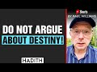

# Do not argue about Destiny! | #shorts by Paul Williams (2021-10-23 11:59:16+00:00)

## Description

Hadiths from Tirmidhi and Ahmad.

## Summary of [Do not argue about Destiny! | #shorts by Paul Williams](https://www.youtube.com/watch?v=-THUbUXj-7E)

*This is an AI generated summary. There may be inaccuracies. *

### [00:00:00](https://www.youtube.com/watch?v=-THUbUXj-7E&t=0) - [00:00:00](https://www.youtube.com/watch?v=-THUbUXj-7E&t=0)

This YouTube video features a series of Islamic sayings about destiny and arguing. The video warns that arguing about destiny will lead to people's deaths. It also features a saying about the heart being like a feather in a desert, which is constantly turned over by the wind.

**[00:00:00](https://www.youtube.com/watch?v=-THUbUXj-7E&t=0)** This video features a collection of short, Islamic sayings about not arguing about destiny. The messenger of god is angry with people who argue about destiny, and he warns that it will lead to people's deaths. Ahmed also shares a saying about the heart being like a feather in a desert, which is constantly turned over by the wind.

## Full transcript with timestamps

[0:00:00](https://youtu.be/-THUbUXj-7E?t=0) abu herrera related the messenger of god  
[0:00:03](https://youtu.be/-THUbUXj-7E?t=3) upon whom be peace came upon us as we  
[0:00:06](https://youtu.be/-THUbUXj-7E?t=6) were arguing about destiny  
[0:00:08](https://youtu.be/-THUbUXj-7E?t=8) he became angry to the point that his  
[0:00:11](https://youtu.be/-THUbUXj-7E?t=11) face was as red as a pomegranate seed  
[0:00:14](https://youtu.be/-THUbUXj-7E?t=14) and he said  
[0:00:15](https://youtu.be/-THUbUXj-7E?t=15) is this what you have been commanded to  
[0:00:17](https://youtu.be/-THUbUXj-7E?t=17) do  
[0:00:18](https://youtu.be/-THUbUXj-7E?t=18) or is this what i have been sent to you  
[0:00:20](https://youtu.be/-THUbUXj-7E?t=20) with  
[0:00:22](https://youtu.be/-THUbUXj-7E?t=22) nothing but contention over this matter  
[0:00:24](https://youtu.be/-THUbUXj-7E?t=24) has caused those who came before you to  
[0:00:27](https://youtu.be/-THUbUXj-7E?t=27) perish  
[0:00:28](https://youtu.be/-THUbUXj-7E?t=28) i urge you not to argue about this  
[0:00:32](https://youtu.be/-THUbUXj-7E?t=32) hadith from termite  
[0:00:35](https://youtu.be/-THUbUXj-7E?t=35) also the messenger of god upon whom bp  
[0:00:37](https://youtu.be/-THUbUXj-7E?t=37) said  
[0:00:38](https://youtu.be/-THUbUXj-7E?t=38) the heart is like a feather in desert  
[0:00:41](https://youtu.be/-THUbUXj-7E?t=41) country which the winds keep turning  
[0:00:44](https://youtu.be/-THUbUXj-7E?t=44) over and over  
[0:00:47](https://youtu.be/-THUbUXj-7E?t=47) hadith from ahmed  
