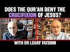

# Does the Qur’an Deny the Crucifixion of Jesus? with Dr Louay Fatoohi (2022-02-02 16:58:46+00:00)

## Description

For further reading: 'Did Muslim Exegetes Ever Accept Jesus’ Crucifixion? Debunking a Recent Myth' by Dr Louay Fatoohi https://www.academia.edu/50736172/Did_Muslim_Exegetes_Ever_Accept_Jesus_Crucifixion_Debunking_a_Recent_Myth

You Can Support My Work on Patreon:
https://www.patreon.com/Bloggingtheology

My Paypal Link: 
https://www.paypal.com/paypalme/bloggingtheology?locale.x=en_GB

## Summary of [Does the Qur’an Deny the Crucifixion of Jesus? with Dr Louay Fatoohi](https://www.youtube.com/watch?v=99AOlNniUXw)

*This is an AI generated summary. There may be inaccuracies. *

### [00:00:00](https://www.youtube.com/watch?v=99AOlNniUXw&t=0) - [01:00:00](https://www.youtube.com/watch?v=99AOlNniUXw&t=3600)

In the video, Dr. Louay Fatoohi discusses the consensus among Muslims that the Quran denies the crucifixion of Jesus. He goes on to discuss the attempts by some to reject this consensus, and argues that denying the consensus is an extreme case of confirmation bias. He also discusses the various interpretations of the Qur'an with regard to the crucifixion of Jesus, and how some Muslims believe that the Qur'an denies the crucifixion of Jesus.

**[00:00:00](https://www.youtube.com/watch?v=99AOlNniUXw&t=0)** The video discusses the history and language of interpretation of the Quran's denial of the crucifixion of Jesus. Dr. Louay Fatoohi discusses the consensus among Muslims that the Quran denies this event, and then discusses the attempts by some non-Muslims to reject this consensus.
* **[00:05:00](https://www.youtube.com/watch?v=99AOlNniUXw&t=300)** The video discusses the consensus among scholars that the Qur'an denies the crucifixion of Jesus. The presenter goes on to discuss the non-crucifixion verse in more detail, highlighting that it is the only verse in the Qur'an that specifically addresses the subject of the crucifixion. The presenter then presents the Muslim consensus on the subject.
* **[00:10:00](https://www.youtube.com/watch?v=99AOlNniUXw&t=600)** The video discusses the various schools of thought among Muslims regarding whether or not the Qur'an denies the crucifixion of Jesus. All schools of thought agree that the Qur'an denies the crucifixion, based on a particular verse in the Quran. The consensus of Muslims on this issue is significant, as it shows the similarities between Muslim scholars of other scriptures in their disagreement and debate.
* **[00:15:00](https://www.youtube.com/watch?v=99AOlNniUXw&t=900)** This video discusses the difference between exegesis and ijtihad, and provides an example of exegesis in the form of a graph showing how scholars approach scripture based on their fundamental assumptions. The video then discusses the concept of double denial in the Quran, and points to evidence that suggets that Jesus did not die on the cross, and was instead taken up to heaven.
* **[00:20:00](https://www.youtube.com/watch?v=99AOlNniUXw&t=1200)** The video discusses the consensus among Muslims that Jesus was crucified. However, there is a movement among some Muslims to question this consensus, and to argue that Jesus was not actually crucified.

Icy Jesus is a term used to describe someone who denies the consensus among Muslims that Jesus was crucified. The presenter argues that denying the consensus is an extreme case of confirmation bias, and that the work of any one scholar should not be generalized.
* **[00:25:00](https://www.youtube.com/watch?v=99AOlNniUXw&t=1500)** This video discusses the various scholars who have suggested that the Qur'an does not deny the crucifixion of Jesus. The main points made are that the idea first appeared in the 18th century, was followed by several other scholars in the 19th century, and that Todd Lawson's book, "The Crucifixion and the Qur'an," is often cited in discussions about the topic.
* **[00:30:00](https://www.youtube.com/watch?v=99AOlNniUXw&t=1800)** In this video, Dr. Louay Fatoohi discusses how early Muslim scholars accepted the crucifixion of Jesus. Fatoohi explains that the earliest of these scholars was the Abu Hatemrazi, who was a contemporary of al-Razi. Fatoohi also discusses the Greek scholar, Fakhr Dinarazi, who collected and reviewed works on the topic. Finally, Fatoohi discusses how Paul's writings refute the idea that the Qur'an denies the crucifixion of Jesus.
* **[00:35:00](https://www.youtube.com/watch?v=99AOlNniUXw&t=2100)** The video discusses the different views on the crucifixion of Jesus in Islam and Christianity, with Louay Fatoohi presenting the view that the Qur'an denies the crucifixion. Fatoohi then goes on to discuss another view, that the Qur'an is not denying that the Jews killed Jesus, but is reminding them of God's role in the crucifixion.
* **[00:40:00](https://www.youtube.com/watch?v=99AOlNniUXw&t=2400)** The video discusses the interpretation of different scholars of a verse in the Qur'an which some say denies the crucifixion of Jesus. Paul responds that the prophet would have spoken about the crucifixion if it were controversial or unclear, but there is no evidence of this in the scripture. There is also no evidence that the Qur'an contradicted the Muslim consensus on the matter. It is possible that later scholars changed the interpretation of the verse, but this does not undermine the fact that it exists in the scripture. The concept of prophets being killed is mentioned in all three of the scripture's extant texts. This would not be seen as a taboo by Muslims, as it is agreed upon by all three texts.
* **[00:45:00](https://www.youtube.com/watch?v=99AOlNniUXw&t=2700)** This video discusses why some scholars have started to question the Qur'an's denial of the crucifixion of Jesus. Christian theologians hope to repair the broken relationship between Islam and Christianity by showing that the Qur'an affirms the death and resurrection of Christ. However, this attempt to present the Qur'an in a more positive light to Christian readers has had unintended consequences, as many Muslims believe that Jesus was not crucified.
* **[00:50:00](https://www.youtube.com/watch?v=99AOlNniUXw&t=3000)** The speaker discusses how some Muslims believe that the Qur'an denies the crucifixion of Jesus, and argues that this is an islamic agenda rather than a historical one. He then goes on to say that because the Qur'an is considered to be the word of God, it should be understood in a theological sense rather than a historical sense.
* **[00:55:00](https://www.youtube.com/watch?v=99AOlNniUXw&t=3300)** The author of the video discusses various interpretations of the Qur'an with regard to the crucifixion of Jesus. He argues that, due to the spiritual nature of some of the Qur'an's statements, it is difficult to determine whether or not it denies the crucifixion. He also mentions that there are attempts to deny the conservation of the Qur'an, and that there are serious issues for Muslims who claim that Muhammad wrote the Qur'an.
### [01:00:00](https://www.youtube.com/watch?v=99AOlNniUXw&t=3600) - [01:45:00](https://www.youtube.com/watch?v=99AOlNniUXw&t=6300)

The YouTube video "Does the Qur'an Deny the Crucifixion of Jesus?" by Dr. Louay Fatoohi discusses the alleged contradiction in the Qur'an between its mention of stoning and crucifixion of Jesus, and the actual historical evidence. Fatoohi argues that the Qur'an's focus is on the belief itself, rather than the history or context of that belief. The video discusses how the Qur'an does not mention any specific books that were used to argue that the Jews tampered with scripture, and how the burden of proof is on those who make that suggestion. Additionally, the video discusses alternative views of the Qur'an's view of the crucifixion of Jesus.

**[01:00:00](https://www.youtube.com/watch?v=99AOlNniUXw&t=3600)** The Qur'an does not deny the crucifixion of Jesus, contrary to what some Christians believe. The verse in question, "Let us come to common terms," is a threat to the success of Muhammad's proselytizing of Christians if he was a fraud.
* **[01:05:00](https://www.youtube.com/watch?v=99AOlNniUXw&t=3900)** This YouTube video discusses a passage in the Talmud which some believe refers to Jesus, and how it differs from the story in the Bible. The main passage in question is about someone called "ben stada" who is accused of bringing witchcraft from Egypt by scratching people's skin. Another passage refers to a soldier called "bin pandey" who is said to have had a relationship with Mary and Jesus. The video concludes that the crucifixion story in the Bible does not match the Talmud passage, and that Jesus was instead born of a virgin.
* **[01:10:00](https://www.youtube.com/watch?v=99AOlNniUXw&t=4200)** The YouTube video "Does the Qur'an Deny the Crucifixion of Jesus?" by Dr. Louay Fatoohi discusses the alleged contradiction in the Qur'an between its mention of stoning and crucifixion of Jesus, and the actual historical evidence. Fatoohi argues that the four words mentioned in the Qur'an - "stoning," "hanging," and "dual punishment" - are not linked to the specific story of Jesus' crucifixion, but are instead general terms that could be applied to any instance of stoning. Furthermore, he argues that the Qur'an's focus is on the belief itself, rather than the history or context of that belief.
* **[01:15:00](https://www.youtube.com/watch?v=99AOlNniUXw&t=4500)** The video discusses how the Qur'an does not mention any specific books that were used to argue that the Jews tampered with scripture. Instead, the burden of proof is on those who make the suggestion that the Qur'an was influenced by the Talmud. There is no evidence that the jews in Arabia had copies of the Talmud, and the Talmud itself makes no mention of the jews in Arabia.
* **[01:20:00](https://www.youtube.com/watch?v=99AOlNniUXw&t=4800)** The Qur'an purportedly has direct access to history, which means that if you have this fundamental belief that the Qur'an is the word of god, then surely that must be reflected in the way you think about the Qur'an. This is a challenge for Muslim scholars, as this is not for western scholars. Mainly for Muslims who believe in that, verses of the Qur'an have been misused to try and prove that the Qur'an does not deny the crucifixion. This is a common method. For example, one verse that is often quoted is this one which talks about something that happened at the battle of Bedr. The problem with this verse is that it mentions that allah killed. This is an obvious problem, as it is clear that the verse is expressly referencing that allah killed.
* **[01:25:00](https://www.youtube.com/watch?v=99AOlNniUXw&t=5100)** According to Dr. Louay Fatoohi, the Qur'an denies the crucifixion of Jesus by citing verses that talk about death and murder being two different verbs. Another verse is also used that denies the crucifixion because it says that raising someone from death is different than dying. Additionally, there are two indirect verses that talk about the children of Israel and how Allah planned everything perfectly. Therefore, it can be inferred that the crucifixion of Jesus was not a part of Allah's plan.
* **[01:30:00](https://www.youtube.com/watch?v=99AOlNniUXw&t=5400)** The video discusses the Qur'an's criticism of the Jews for breaking their covenant, rejecting signs from God, and killing prophets. It also discusses the idea that the Jews had knowledge that they did not need, and that Allah has sealed their hearts so they do not need to learn. This is relevant to the non-construction verse, which discusses cursing the Jews for breaking their covenant.
* **[01:35:00](https://www.youtube.com/watch?v=99AOlNniUXw&t=5700)** The speaker discusses how the Qur'an distinguishes between actions (killing prophets, rejecting signs from God) and statements (saying). He points out that saying is used to negate what follows it, which in this case is false boasting about killing Jesus.
* **[01:40:00](https://www.youtube.com/watch?v=99AOlNniUXw&t=6000)** The video discusses the claim that the Qur'an denies the crucifixion of Jesus. Dr. Louay Fatoohi argues that the language used in the Qur'an does not allow for the denial of this historical event. Claims that the Qur'an is ambiguous about the crucifixion are not supported by the text itself. The video finishes by asking whether the Qur'an is supposed to be intelligible or not, and if not, why.
* **[01:45:00](https://www.youtube.com/watch?v=99AOlNniUXw&t=6300)** The presenter discusses alternative views of the Qur'an's view of the crucifixion of Jesus. He notes that his book, which is still in development, will address the subject in greater detail. The presenter also discusses his paper on the crucifixion, which is currently being considered for submission to an academic journal.

## Full transcript with timestamps

[0:00:02](https://youtu.be/99AOlNniUXw?t=2) well hello everyone and welcome to  
[0:00:04](https://youtu.be/99AOlNniUXw?t=4) blogging theology today i am delighted  
[0:00:07](https://youtu.be/99AOlNniUXw?t=7) to talk to lue fatoui an author and  
[0:00:10](https://youtu.be/99AOlNniUXw?t=10) researcher in islamic studies and  
[0:00:12](https://youtu.be/99AOlNniUXw?t=12) comparative religion you are most  
[0:00:14](https://youtu.be/99AOlNniUXw?t=14) welcome sir  
[0:00:16](https://youtu.be/99AOlNniUXw?t=16) thank you paul i really appreciate your  
[0:00:19](https://youtu.be/99AOlNniUXw?t=19) invitation to your excellent and and  
[0:00:21](https://youtu.be/99AOlNniUXw?t=21) unique channels that's very kind thank  
[0:00:23](https://youtu.be/99AOlNniUXw?t=23) you daughter fertility was born in  
[0:00:25](https://youtu.be/99AOlNniUXw?t=25) baghdad iraq and migrated to the uk in  
[0:00:29](https://youtu.be/99AOlNniUXw?t=29) the 90s  
[0:00:31](https://youtu.be/99AOlNniUXw?t=31) he has a phd in astronomy from durham  
[0:00:34](https://youtu.be/99AOlNniUXw?t=34) university he originally came from a  
[0:00:36](https://youtu.be/99AOlNniUXw?t=36) christian family but reverted to islam  
[0:00:39](https://youtu.be/99AOlNniUXw?t=39) in his early 20s  
[0:00:41](https://youtu.be/99AOlNniUXw?t=41) he has published over 25 books in  
[0:00:44](https://youtu.be/99AOlNniUXw?t=44) english and arabic in the islamic  
[0:00:46](https://youtu.be/99AOlNniUXw?t=46) studies and published over 20 research  
[0:00:49](https://youtu.be/99AOlNniUXw?t=49) papers in cosmology and applied  
[0:00:51](https://youtu.be/99AOlNniUXw?t=51) historical astronomy and on the islamic  
[0:00:54](https://youtu.be/99AOlNniUXw?t=54) calendar  
[0:00:55](https://youtu.be/99AOlNniUXw?t=55) today dr fatoui has kindly agreed to do  
[0:00:58](https://youtu.be/99AOlNniUXw?t=58) a presentation on the question  
[0:01:02](https://youtu.be/99AOlNniUXw?t=62) does the quran deny the crucifixion of  
[0:01:06](https://youtu.be/99AOlNniUXw?t=66) jesus and this is surprisingly  
[0:01:08](https://youtu.be/99AOlNniUXw?t=68) controversial question  
[0:01:10](https://youtu.be/99AOlNniUXw?t=70) to many people um so um  
[0:01:13](https://youtu.be/99AOlNniUXw?t=73) fertility would you kindly just  
[0:01:14](https://youtu.be/99AOlNniUXw?t=74) introduce us to this subject why it's  
[0:01:17](https://youtu.be/99AOlNniUXw?t=77) even a controversial question because  
[0:01:20](https://youtu.be/99AOlNniUXw?t=80) many people perhaps most muslims the  
[0:01:21](https://youtu.be/99AOlNniUXw?t=81) answer is very clear but in fact it's  
[0:01:24](https://youtu.be/99AOlNniUXw?t=84) not so clear to another group of people  
[0:01:25](https://youtu.be/99AOlNniUXw?t=85) who  
[0:01:26](https://youtu.be/99AOlNniUXw?t=86) have queried this um assumption whatever  
[0:01:29](https://youtu.be/99AOlNniUXw?t=89) that might be so would you like to  
[0:01:31](https://youtu.be/99AOlNniUXw?t=91) introduce us to the subject thank you  
[0:01:33](https://youtu.be/99AOlNniUXw?t=93) absolutely uh paul um  
[0:01:35](https://youtu.be/99AOlNniUXw?t=95) this particular subject the crucifixion  
[0:01:38](https://youtu.be/99AOlNniUXw?t=98) of jesus in the quran has been a topic  
[0:01:41](https://youtu.be/99AOlNniUXw?t=101) of discussion um between muslims and  
[0:01:43](https://youtu.be/99AOlNniUXw?t=103) non-muslims for centuries really and the  
[0:01:46](https://youtu.be/99AOlNniUXw?t=106) reason being as you know is that the  
[0:01:48](https://youtu.be/99AOlNniUXw?t=108) crucifixion is that as at the heart of  
[0:01:50](https://youtu.be/99AOlNniUXw?t=110) christian theology  
[0:01:52](https://youtu.be/99AOlNniUXw?t=112) redemption etcetera is all based on the  
[0:01:55](https://youtu.be/99AOlNniUXw?t=115) concept of the suffering messiah of  
[0:01:57](https://youtu.be/99AOlNniUXw?t=117) course  
[0:01:58](https://youtu.be/99AOlNniUXw?t=118) that is something that supposedly uh the  
[0:02:01](https://youtu.be/99AOlNniUXw?t=121) quran denies most muslims believe that  
[0:02:04](https://youtu.be/99AOlNniUXw?t=124) over the centuries as we will discuss  
[0:02:07](https://youtu.be/99AOlNniUXw?t=127) obviously by denying that  
[0:02:09](https://youtu.be/99AOlNniUXw?t=129) um the quran effectively is undermining  
[0:02:12](https://youtu.be/99AOlNniUXw?t=132) a cornerstone of christian theology  
[0:02:16](https://youtu.be/99AOlNniUXw?t=136) as a result this subject has always been  
[0:02:19](https://youtu.be/99AOlNniUXw?t=139) uh a lively debate between muslims and  
[0:02:23](https://youtu.be/99AOlNniUXw?t=143) non-muslims  
[0:02:25](https://youtu.be/99AOlNniUXw?t=145) and  
[0:02:26](https://youtu.be/99AOlNniUXw?t=146) what i would like to do  
[0:02:28](https://youtu.be/99AOlNniUXw?t=148) uh here is to discuss the history  
[0:02:32](https://youtu.be/99AOlNniUXw?t=152) of the  
[0:02:33](https://youtu.be/99AOlNniUXw?t=153) interpretation  
[0:02:34](https://youtu.be/99AOlNniUXw?t=154) of the quran on the subject  
[0:02:36](https://youtu.be/99AOlNniUXw?t=156) uh as well as uh talk in more detail and  
[0:02:40](https://youtu.be/99AOlNniUXw?t=160) kind of present my own view  
[0:02:43](https://youtu.be/99AOlNniUXw?t=163) uh on how to approach and understand  
[0:02:46](https://youtu.be/99AOlNniUXw?t=166) this particular subject in the in the  
[0:02:48](https://youtu.be/99AOlNniUXw?t=168) quran excellent  
[0:02:50](https://youtu.be/99AOlNniUXw?t=170) very good  
[0:02:51](https://youtu.be/99AOlNniUXw?t=171) and  
[0:02:52](https://youtu.be/99AOlNniUXw?t=172) okay now uh i'm going to share  
[0:02:55](https://youtu.be/99AOlNniUXw?t=175) my screen here  
[0:02:57](https://youtu.be/99AOlNniUXw?t=177) because i think it would help  
[0:03:00](https://youtu.be/99AOlNniUXw?t=180) to use  
[0:03:01](https://youtu.be/99AOlNniUXw?t=181) a presentation because we're going to go  
[0:03:03](https://youtu.be/99AOlNniUXw?t=183) through  
[0:03:04](https://youtu.be/99AOlNniUXw?t=184) some technical details really that i  
[0:03:06](https://youtu.be/99AOlNniUXw?t=186) think the audience would find it more  
[0:03:07](https://youtu.be/99AOlNniUXw?t=187) helpful to look at the screen while we  
[0:03:09](https://youtu.be/99AOlNniUXw?t=189) talk about  
[0:03:10](https://youtu.be/99AOlNniUXw?t=190) so i'm going to start by giving an  
[0:03:11](https://youtu.be/99AOlNniUXw?t=191) overview of what we are going to cover  
[0:03:14](https://youtu.be/99AOlNniUXw?t=194) today  
[0:03:17](https://youtu.be/99AOlNniUXw?t=197) uh  
[0:03:18](https://youtu.be/99AOlNniUXw?t=198) i would like first to clarify i'm not  
[0:03:21](https://youtu.be/99AOlNniUXw?t=201) going to speak about the historicity of  
[0:03:23](https://youtu.be/99AOlNniUXw?t=203) the crucifixion of jesus this is a  
[0:03:26](https://youtu.be/99AOlNniUXw?t=206) completely different subject i know it's  
[0:03:28](https://youtu.be/99AOlNniUXw?t=208) again at the heart of disagreement  
[0:03:32](https://youtu.be/99AOlNniUXw?t=212) between muslims and non-muslims and  
[0:03:34](https://youtu.be/99AOlNniUXw?t=214) indeed between muslims and historians in  
[0:03:36](https://youtu.be/99AOlNniUXw?t=216) general who believe that jesus was  
[0:03:38](https://youtu.be/99AOlNniUXw?t=218) crucified so but that isn't actually the  
[0:03:41](https://youtu.be/99AOlNniUXw?t=221) subject of um this particular  
[0:03:44](https://youtu.be/99AOlNniUXw?t=224) discussion it's not to say it's not  
[0:03:47](https://youtu.be/99AOlNniUXw?t=227) worth the discussion but of course we  
[0:03:48](https://youtu.be/99AOlNniUXw?t=228) need to focus here in more detail  
[0:03:51](https://youtu.be/99AOlNniUXw?t=231) about the what the quran says on that  
[0:03:54](https://youtu.be/99AOlNniUXw?t=234) particular issue whether  
[0:03:57](https://youtu.be/99AOlNniUXw?t=237) the crucifixion is historical or not is  
[0:03:59](https://youtu.be/99AOlNniUXw?t=239) is not the subject today  
[0:04:02](https://youtu.be/99AOlNniUXw?t=242) i will be talking about the history  
[0:04:05](https://youtu.be/99AOlNniUXw?t=245) and language  
[0:04:07](https://youtu.be/99AOlNniUXw?t=247) history of the interpretation of what  
[0:04:09](https://youtu.be/99AOlNniUXw?t=249) the quran says and the language of the  
[0:04:11](https://youtu.be/99AOlNniUXw?t=251) quran on this subject i will only touch  
[0:04:14](https://youtu.be/99AOlNniUXw?t=254) very little on theology  
[0:04:16](https://youtu.be/99AOlNniUXw?t=256) there will be instances where that needs  
[0:04:18](https://youtu.be/99AOlNniUXw?t=258) to be mentioned but i will try to avoid  
[0:04:20](https://youtu.be/99AOlNniUXw?t=260) it  
[0:04:23](https://youtu.be/99AOlNniUXw?t=263) i'll talk about the consensus  
[0:04:26](https://youtu.be/99AOlNniUXw?t=266) that has survived the centuries that the  
[0:04:28](https://youtu.be/99AOlNniUXw?t=268) quran denies the crucifixion  
[0:04:31](https://youtu.be/99AOlNniUXw?t=271) and i will also then move on to talk  
[0:04:34](https://youtu.be/99AOlNniUXw?t=274) about uh the  
[0:04:36](https://youtu.be/99AOlNniUXw?t=276) attempt to reject this consensus  
[0:04:40](https://youtu.be/99AOlNniUXw?t=280) and i i'll speak about the motives and  
[0:04:42](https://youtu.be/99AOlNniUXw?t=282) methods uh behind these attempts  
[0:04:45](https://youtu.be/99AOlNniUXw?t=285) so they consider the consensus is  
[0:04:47](https://youtu.be/99AOlNniUXw?t=287) amongst muslims obviously that the quran  
[0:04:49](https://youtu.be/99AOlNniUXw?t=289) denies the crucifixion and the rejecting  
[0:04:51](https://youtu.be/99AOlNniUXw?t=291) the consensus is some other people  
[0:04:53](https://youtu.be/99AOlNniUXw?t=293) non-muslims who mainly who have their  
[0:04:55](https://youtu.be/99AOlNniUXw?t=295) own reasons for rejecting that view i  
[0:04:58](https://youtu.be/99AOlNniUXw?t=298) guess a good question paul actually even  
[0:05:01](https://youtu.be/99AOlNniUXw?t=301) non-muslims  
[0:05:03](https://youtu.be/99AOlNniUXw?t=303) agree that the quran  
[0:05:05](https://youtu.be/99AOlNniUXw?t=305) denies the crucifixion  
[0:05:07](https://youtu.be/99AOlNniUXw?t=307) so historically  
[0:05:09](https://youtu.be/99AOlNniUXw?t=309) scholars muslims non-muslims more or  
[0:05:12](https://youtu.be/99AOlNniUXw?t=312) less agreed that this is what the quran  
[0:05:14](https://youtu.be/99AOlNniUXw?t=314) says however  
[0:05:16](https://youtu.be/99AOlNniUXw?t=316) more recent attempts have been made to  
[0:05:18](https://youtu.be/99AOlNniUXw?t=318) show that the quran actually does not  
[0:05:20](https://youtu.be/99AOlNniUXw?t=320) deny the crucifixion and that involves  
[0:05:23](https://youtu.be/99AOlNniUXw?t=323) uh mainly christian theologians but also  
[0:05:27](https://youtu.be/99AOlNniUXw?t=327) some muslim scholars and i'll i'll  
[0:05:29](https://youtu.be/99AOlNniUXw?t=329) mention some of them so to clarify then  
[0:05:32](https://youtu.be/99AOlNniUXw?t=332) we're focusing you're focusing today on  
[0:05:34](https://youtu.be/99AOlNniUXw?t=334) this question of what the quran itself  
[0:05:37](https://youtu.be/99AOlNniUXw?t=337) says about the crucifixion we're not  
[0:05:39](https://youtu.be/99AOlNniUXw?t=339) dealing with the issue was jesus  
[0:05:40](https://youtu.be/99AOlNniUXw?t=340) crucified or not but just to establish  
[0:05:43](https://youtu.be/99AOlNniUXw?t=343) what is the quran saying because there  
[0:05:44](https://youtu.be/99AOlNniUXw?t=344) have been some christian scholars who  
[0:05:46](https://youtu.be/99AOlNniUXw?t=346) are now claiming that the quran does not  
[0:05:49](https://youtu.be/99AOlNniUXw?t=349) deny the crucifixion of jesus and this  
[0:05:50](https://youtu.be/99AOlNniUXw?t=350) is kind of the issue you're dealing with  
[0:05:52](https://youtu.be/99AOlNniUXw?t=352) today is that right  
[0:05:54](https://youtu.be/99AOlNniUXw?t=354) absolutely paul's authority yes thank  
[0:05:56](https://youtu.be/99AOlNniUXw?t=356) you that's what we're dealing with  
[0:05:58](https://youtu.be/99AOlNniUXw?t=358) um  
[0:05:59](https://youtu.be/99AOlNniUXw?t=359) now in the course of uh discussing the  
[0:06:01](https://youtu.be/99AOlNniUXw?t=361) consensus and otherwise we will have to  
[0:06:04](https://youtu.be/99AOlNniUXw?t=364) touch on the  
[0:06:05](https://youtu.be/99AOlNniUXw?t=365) subject of whether the quran engages  
[0:06:08](https://youtu.be/99AOlNniUXw?t=368) with the talmud  
[0:06:10](https://youtu.be/99AOlNniUXw?t=370) because this is one of the arguments  
[0:06:12](https://youtu.be/99AOlNniUXw?t=372) made  
[0:06:13](https://youtu.be/99AOlNniUXw?t=373) in favor of rejecting the consensus  
[0:06:16](https://youtu.be/99AOlNniUXw?t=376) that survived for a long time uh also in  
[0:06:21](https://youtu.be/99AOlNniUXw?t=381) the course of doing that and because  
[0:06:23](https://youtu.be/99AOlNniUXw?t=383) we're dealing with the language of the  
[0:06:24](https://youtu.be/99AOlNniUXw?t=384) quran  
[0:06:26](https://youtu.be/99AOlNniUXw?t=386) i will also be dealing with exegetical  
[0:06:28](https://youtu.be/99AOlNniUXw?t=388) issues  
[0:06:30](https://youtu.be/99AOlNniUXw?t=390) that relate to various texts um that are  
[0:06:33](https://youtu.be/99AOlNniUXw?t=393) relevant to the subject of course of  
[0:06:36](https://youtu.be/99AOlNniUXw?t=396) crucifixion just because executive or  
[0:06:38](https://youtu.be/99AOlNniUXw?t=398) text simply means you know how we  
[0:06:39](https://youtu.be/99AOlNniUXw?t=399) understand interpret the text how do we  
[0:06:41](https://youtu.be/99AOlNniUXw?t=401) understand what the quran actually says  
[0:06:43](https://youtu.be/99AOlNniUXw?t=403) what its words actually say how how  
[0:06:45](https://youtu.be/99AOlNniUXw?t=405) those that's what exegetical means okay  
[0:06:47](https://youtu.be/99AOlNniUXw?t=407) thank you exegesis means to draw  
[0:06:49](https://youtu.be/99AOlNniUXw?t=409) something out of something else so  
[0:06:51](https://youtu.be/99AOlNniUXw?t=411) effectively to draw the meaning or to  
[0:06:53](https://youtu.be/99AOlNniUXw?t=413) extract the meaning of the text in this  
[0:06:55](https://youtu.be/99AOlNniUXw?t=415) particular instance  
[0:06:57](https://youtu.be/99AOlNniUXw?t=417) and  
[0:06:58](https://youtu.be/99AOlNniUXw?t=418) my presentation  
[0:07:00](https://youtu.be/99AOlNniUXw?t=420) is obviously building uh on works of  
[0:07:02](https://youtu.be/99AOlNniUXw?t=422) others but it will also have a new  
[0:07:05](https://youtu.be/99AOlNniUXw?t=425) insight  
[0:07:06](https://youtu.be/99AOlNniUXw?t=426) some of the  
[0:07:07](https://youtu.be/99AOlNniUXw?t=427) information i'll present there and  
[0:07:09](https://youtu.be/99AOlNniUXw?t=429) readings  
[0:07:10](https://youtu.be/99AOlNniUXw?t=430) um  
[0:07:11](https://youtu.be/99AOlNniUXw?t=431) are my own work  
[0:07:13](https://youtu.be/99AOlNniUXw?t=433) so that's an overview of what we're  
[0:07:14](https://youtu.be/99AOlNniUXw?t=434) going to cover today  
[0:07:18](https://youtu.be/99AOlNniUXw?t=438) i'll start by  
[0:07:20](https://youtu.be/99AOlNniUXw?t=440) first  
[0:07:22](https://youtu.be/99AOlNniUXw?t=442) just showing the verse that in a  
[0:07:24](https://youtu.be/99AOlNniUXw?t=444) question  
[0:07:26](https://youtu.be/99AOlNniUXw?t=446) and i call it the non-crucifixion verse  
[0:07:29](https://youtu.be/99AOlNniUXw?t=449) most would call it the crucifixion  
[0:07:31](https://youtu.be/99AOlNniUXw?t=451) probably you know where i'm going with  
[0:07:32](https://youtu.be/99AOlNniUXw?t=452) that  
[0:07:33](https://youtu.be/99AOlNniUXw?t=453) but  
[0:07:34](https://youtu.be/99AOlNniUXw?t=454) at least on the face of it it denies the  
[0:07:37](https://youtu.be/99AOlNniUXw?t=457) crucifixion nobody would deny that on  
[0:07:39](https://youtu.be/99AOlNniUXw?t=459) the face of it  
[0:07:40](https://youtu.be/99AOlNniUXw?t=460) um now  
[0:07:42](https://youtu.be/99AOlNniUXw?t=462) i have highlighted here um the the  
[0:07:46](https://youtu.be/99AOlNniUXw?t=466) the kind of text that i have quoted here  
[0:07:49](https://youtu.be/99AOlNniUXw?t=469) is a sayings that is attributed to the  
[0:07:52](https://youtu.be/99AOlNniUXw?t=472) jews so the jews the quran says the jews  
[0:07:55](https://youtu.be/99AOlNniUXw?t=475) have made the claim we have killed the  
[0:07:57](https://youtu.be/99AOlNniUXw?t=477) messiah jesus the son of mary the  
[0:08:00](https://youtu.be/99AOlNniUXw?t=480) messenger of allah  
[0:08:02](https://youtu.be/99AOlNniUXw?t=482) and then the quran  
[0:08:04](https://youtu.be/99AOlNniUXw?t=484) responds to that by saying they did not  
[0:08:07](https://youtu.be/99AOlNniUXw?t=487) kill him  
[0:08:10](https://youtu.be/99AOlNniUXw?t=490) nor did they crucify him  
[0:08:14](https://youtu.be/99AOlNniUXw?t=494) but it was made to appear so to them  
[0:08:18](https://youtu.be/99AOlNniUXw?t=498) those who did differ over it are in  
[0:08:20](https://youtu.be/99AOlNniUXw?t=500) doubt about it they have no knowledge of  
[0:08:23](https://youtu.be/99AOlNniUXw?t=503) it except the following  
[0:08:25](https://youtu.be/99AOlNniUXw?t=505) um conjecture they did not kill him was  
[0:08:28](https://youtu.be/99AOlNniUXw?t=508) with certainty so i want just to put it  
[0:08:30](https://youtu.be/99AOlNniUXw?t=510) first here so everybody can see it  
[0:08:32](https://youtu.be/99AOlNniUXw?t=512) before we're gonna deal with it in more  
[0:08:34](https://youtu.be/99AOlNniUXw?t=514) detail later on i want to mention a  
[0:08:36](https://youtu.be/99AOlNniUXw?t=516) couple of things about it though  
[0:08:38](https://youtu.be/99AOlNniUXw?t=518) this is the only  
[0:08:40](https://youtu.be/99AOlNniUXw?t=520) verse that directly deals with the  
[0:08:43](https://youtu.be/99AOlNniUXw?t=523) subject of the crucifixion of jesus  
[0:08:46](https://youtu.be/99AOlNniUXw?t=526) we will be talking about other  
[0:08:48](https://youtu.be/99AOlNniUXw?t=528) verses  
[0:08:49](https://youtu.be/99AOlNniUXw?t=529) that indirectly  
[0:08:52](https://youtu.be/99AOlNniUXw?t=532) linked are linked to the subject of  
[0:08:54](https://youtu.be/99AOlNniUXw?t=534) restriction but this is the only place  
[0:08:56](https://youtu.be/99AOlNniUXw?t=536) where this subject is directly tackled  
[0:08:58](https://youtu.be/99AOlNniUXw?t=538) in the quran  
[0:08:59](https://youtu.be/99AOlNniUXw?t=539) the other important point that i would  
[0:09:01](https://youtu.be/99AOlNniUXw?t=541) like to make  
[0:09:03](https://youtu.be/99AOlNniUXw?t=543) as  
[0:09:04](https://youtu.be/99AOlNniUXw?t=544) most of your audience probably no  
[0:09:07](https://youtu.be/99AOlNniUXw?t=547) there's a concept of  
[0:09:10](https://youtu.be/99AOlNniUXw?t=550) in the quran as in the skeleton text how  
[0:09:12](https://youtu.be/99AOlNniUXw?t=552) the text  
[0:09:13](https://youtu.be/99AOlNniUXw?t=553) is is drawn written  
[0:09:15](https://youtu.be/99AOlNniUXw?t=555) of the quran there are seven uh let's  
[0:09:18](https://youtu.be/99AOlNniUXw?t=558) call official accepted quran readings  
[0:09:22](https://youtu.be/99AOlNniUXw?t=562) there are another three that some accept  
[0:09:24](https://youtu.be/99AOlNniUXw?t=564) so ten in total and there are another  
[0:09:26](https://youtu.be/99AOlNniUXw?t=566) four anomalous readings so if you want  
[0:09:28](https://youtu.be/99AOlNniUXw?t=568) to go except the whole thing there are  
[0:09:30](https://youtu.be/99AOlNniUXw?t=570) 14 of them  
[0:09:31](https://youtu.be/99AOlNniUXw?t=571) this verse appears identical in all of  
[0:09:35](https://youtu.be/99AOlNniUXw?t=575) these verses and the reason i mentioned  
[0:09:38](https://youtu.be/99AOlNniUXw?t=578) this to exclude any suggestion or  
[0:09:41](https://youtu.be/99AOlNniUXw?t=581) anybody thinking that  
[0:09:43](https://youtu.be/99AOlNniUXw?t=583) this there could be some changing in the  
[0:09:45](https://youtu.be/99AOlNniUXw?t=585) world ambiguity yeah yes there is no  
[0:09:49](https://youtu.be/99AOlNniUXw?t=589) ambiguity it's the same in all of these  
[0:09:52](https://youtu.be/99AOlNniUXw?t=592) readings  
[0:09:55](https://youtu.be/99AOlNniUXw?t=595) so i'm gonna start by talking about the  
[0:09:58](https://youtu.be/99AOlNniUXw?t=598) muslim consensus  
[0:10:01](https://youtu.be/99AOlNniUXw?t=601) one thing here  
[0:10:02](https://youtu.be/99AOlNniUXw?t=602) to highlight is that muslims over the  
[0:10:05](https://youtu.be/99AOlNniUXw?t=605) centuries  
[0:10:07](https://youtu.be/99AOlNniUXw?t=607) of all  
[0:10:09](https://youtu.be/99AOlNniUXw?t=609) schools of thought  
[0:10:11](https://youtu.be/99AOlNniUXw?t=611) agreed that the quran denies the  
[0:10:14](https://youtu.be/99AOlNniUXw?t=614) crucifixion  
[0:10:16](https://youtu.be/99AOlNniUXw?t=616) and they base their interpretation on  
[0:10:18](https://youtu.be/99AOlNniUXw?t=618) that particular verse  
[0:10:20](https://youtu.be/99AOlNniUXw?t=620) as well as other references in the quran  
[0:10:23](https://youtu.be/99AOlNniUXw?t=623) and i have to add other extra quranic  
[0:10:26](https://youtu.be/99AOlNniUXw?t=626) material  
[0:10:27](https://youtu.be/99AOlNniUXw?t=627) hadith and some other stuff  
[0:10:30](https://youtu.be/99AOlNniUXw?t=630) and i mention here the main four the  
[0:10:34](https://youtu.be/99AOlNniUXw?t=634) main two really um kind of  
[0:10:37](https://youtu.be/99AOlNniUXw?t=637) uh muslim groups sunnis and shiris  
[0:10:40](https://youtu.be/99AOlNniUXw?t=640) and i have  
[0:10:42](https://youtu.be/99AOlNniUXw?t=642) mentioned as well  
[0:10:44](https://youtu.be/99AOlNniUXw?t=644) some well-known names  
[0:10:46](https://youtu.be/99AOlNniUXw?t=646) in those  
[0:10:47](https://youtu.be/99AOlNniUXw?t=647) schools of thought these are well-known  
[0:10:49](https://youtu.be/99AOlNniUXw?t=649) exegetes  
[0:10:50](https://youtu.be/99AOlNniUXw?t=650) and i have tried to cover  
[0:10:52](https://youtu.be/99AOlNniUXw?t=652) uh the earliest to very recent ones  
[0:10:56](https://youtu.be/99AOlNniUXw?t=656) to show that over the centuries  
[0:10:58](https://youtu.be/99AOlNniUXw?t=658) all of these people went on executes  
[0:11:01](https://youtu.be/99AOlNniUXw?t=661) agreed that the quran denies the  
[0:11:03](https://youtu.be/99AOlNniUXw?t=663) crucifixion right so fabari  
[0:11:07](https://youtu.be/99AOlNniUXw?t=667) etc  
[0:11:08](https://youtu.be/99AOlNniUXw?t=668) today's day again tulsi brazil  
[0:11:12](https://youtu.be/99AOlNniUXw?t=672) all of  
[0:11:12](https://youtu.be/99AOlNniUXw?t=672) them the same applies with the smaller  
[0:11:16](https://youtu.be/99AOlNniUXw?t=676) uh schools mark tassily  
[0:11:18](https://youtu.be/99AOlNniUXw?t=678) who are rationalists  
[0:11:20](https://youtu.be/99AOlNniUXw?t=680) and sufis who are more kind of um  
[0:11:24](https://youtu.be/99AOlNniUXw?t=684) interested in spiritual side of things  
[0:11:26](https://youtu.be/99AOlNniUXw?t=686) again all of these um agreed that the  
[0:11:29](https://youtu.be/99AOlNniUXw?t=689) quran denies the crucifixion  
[0:11:32](https://youtu.be/99AOlNniUXw?t=692) the consensus of muslims on this issue  
[0:11:34](https://youtu.be/99AOlNniUXw?t=694) is really significant  
[0:11:36](https://youtu.be/99AOlNniUXw?t=696) significant in in various ways  
[0:11:39](https://youtu.be/99AOlNniUXw?t=699) muslims muslim exegetes are no different  
[0:11:42](https://youtu.be/99AOlNniUXw?t=702) from scholars of other scriptures  
[0:11:45](https://youtu.be/99AOlNniUXw?t=705) they argued a lot  
[0:11:46](https://youtu.be/99AOlNniUXw?t=706) debated a lot disagreed a lot  
[0:11:49](https://youtu.be/99AOlNniUXw?t=709) so the fact they have this kind of  
[0:11:52](https://youtu.be/99AOlNniUXw?t=712) strange consensus  
[0:11:54](https://youtu.be/99AOlNniUXw?t=714) must be taken into account i'm not  
[0:11:56](https://youtu.be/99AOlNniUXw?t=716) somebody who argues that consensus  
[0:11:59](https://youtu.be/99AOlNniUXw?t=719) is is itself an argument  
[0:12:01](https://youtu.be/99AOlNniUXw?t=721) because people agreed something is you  
[0:12:03](https://youtu.be/99AOlNniUXw?t=723) know a lot of them said this is so and  
[0:12:05](https://youtu.be/99AOlNniUXw?t=725) so so we have to accept it as as true  
[0:12:08](https://youtu.be/99AOlNniUXw?t=728) but here it's quite significant because  
[0:12:10](https://youtu.be/99AOlNniUXw?t=730) they disagree on just about anything if  
[0:12:13](https://youtu.be/99AOlNniUXw?t=733) you pick up for instance tabari tabari  
[0:12:15](https://youtu.be/99AOlNniUXw?t=735) is the oldest earliest  
[0:12:17](https://youtu.be/99AOlNniUXw?t=737) meta exegetical work so it involves  
[0:12:20](https://youtu.be/99AOlNniUXw?t=740) basically the opinions of so many  
[0:12:22](https://youtu.be/99AOlNniUXw?t=742) scholars on  
[0:12:24](https://youtu.be/99AOlNniUXw?t=744) on the quran  
[0:12:26](https://youtu.be/99AOlNniUXw?t=746) and what you find is that  
[0:12:28](https://youtu.be/99AOlNniUXw?t=748) for every ayah verse  
[0:12:31](https://youtu.be/99AOlNniUXw?t=751) the public  
[0:12:32](https://youtu.be/99AOlNniUXw?t=752) cites a variety of opinions at times  
[0:12:36](https://youtu.be/99AOlNniUXw?t=756) exegesis differ even on single words so  
[0:12:40](https://youtu.be/99AOlNniUXw?t=760) at one word in a verse and you have  
[0:12:42](https://youtu.be/99AOlNniUXw?t=762) multiple opinions on them  
[0:12:44](https://youtu.be/99AOlNniUXw?t=764) and that shows you how lively lively the  
[0:12:47](https://youtu.be/99AOlNniUXw?t=767) debate has been within uh islam  
[0:12:50](https://youtu.be/99AOlNniUXw?t=770) scholarship when it comes to the  
[0:12:52](https://youtu.be/99AOlNniUXw?t=772) interpretation of the quran yet all of  
[0:12:53](https://youtu.be/99AOlNniUXw?t=773) these  
[0:12:54](https://youtu.be/99AOlNniUXw?t=774) have agreed that the quran  
[0:12:56](https://youtu.be/99AOlNniUXw?t=776) denies the crucifixion what's  
[0:12:58](https://youtu.be/99AOlNniUXw?t=778) interesting is as well  
[0:13:00](https://youtu.be/99AOlNniUXw?t=780) uh the  
[0:13:02](https://youtu.be/99AOlNniUXw?t=782) uh the denial supposedly in the verse  
[0:13:05](https://youtu.be/99AOlNniUXw?t=785) 157  
[0:13:06](https://youtu.be/99AOlNniUXw?t=786) uh  
[0:13:07](https://youtu.be/99AOlNniUXw?t=787) of chapter four  
[0:13:09](https://youtu.be/99AOlNniUXw?t=789) as soon as you move to 158 so the verse  
[0:13:12](https://youtu.be/99AOlNniUXw?t=792) following the non-classic crucifixion  
[0:13:15](https://youtu.be/99AOlNniUXw?t=795) verse  
[0:13:16](https://youtu.be/99AOlNniUXw?t=796) that consensus breaks down  
[0:13:19](https://youtu.be/99AOlNniUXw?t=799) so immediately the different scholars  
[0:13:22](https://youtu.be/99AOlNniUXw?t=802) start developing different opinions  
[0:13:24](https://youtu.be/99AOlNniUXw?t=804) about what happened exactly when jesus  
[0:13:27](https://youtu.be/99AOlNniUXw?t=807) was spared the crucifixion what happened  
[0:13:30](https://youtu.be/99AOlNniUXw?t=810) to him and then you have a variety of  
[0:13:33](https://youtu.be/99AOlNniUXw?t=813) interpretations  
[0:13:35](https://youtu.be/99AOlNniUXw?t=815) is that all right paul any yeah i was  
[0:13:37](https://youtu.be/99AOlNniUXw?t=817) just going to read i'm looking at my um  
[0:13:40](https://youtu.be/99AOlNniUXw?t=820) translation of that verse 158 uh which  
[0:13:44](https://youtu.be/99AOlNniUXw?t=824) says no god raised him up to himself god  
[0:13:47](https://youtu.be/99AOlNniUXw?t=827) has the power to die so you know was it  
[0:13:50](https://youtu.be/99AOlNniUXw?t=830) an ascension was it what was going on  
[0:13:52](https://youtu.be/99AOlNniUXw?t=832) there so that's where you're saying  
[0:13:53](https://youtu.be/99AOlNniUXw?t=833) there was a lot of exegetical uh  
[0:13:55](https://youtu.be/99AOlNniUXw?t=835) discussion whereas the preceding verse  
[0:13:58](https://youtu.be/99AOlNniUXw?t=838) with its denial of the crucifixion there  
[0:13:59](https://youtu.be/99AOlNniUXw?t=839) is no debate it's clear  
[0:14:02](https://youtu.be/99AOlNniUXw?t=842) and there's a consensus  
[0:14:04](https://youtu.be/99AOlNniUXw?t=844) absolutely and i might add also another  
[0:14:07](https://youtu.be/99AOlNniUXw?t=847) note here important note most muslims  
[0:14:10](https://youtu.be/99AOlNniUXw?t=850) over the centuries believe that jesus  
[0:14:11](https://youtu.be/99AOlNniUXw?t=851) did not die on earth he was raised alive  
[0:14:14](https://youtu.be/99AOlNniUXw?t=854) to heaven and there are you know stories  
[0:14:17](https://youtu.be/99AOlNniUXw?t=857) about what's going to happen afterwards  
[0:14:19](https://youtu.be/99AOlNniUXw?t=859) however um  
[0:14:21](https://youtu.be/99AOlNniUXw?t=861) a new kind of trend among some scholars  
[0:14:24](https://youtu.be/99AOlNniUXw?t=864) they started to develop early in the um  
[0:14:26](https://youtu.be/99AOlNniUXw?t=866) 20th century  
[0:14:28](https://youtu.be/99AOlNniUXw?t=868) i think the first name that we kept  
[0:14:30](https://youtu.be/99AOlNniUXw?t=870) major name we can cite is muhammad abdu  
[0:14:33](https://youtu.be/99AOlNniUXw?t=873) the egyptian reformist the great  
[0:14:35](https://youtu.be/99AOlNniUXw?t=875) muhammad abdu his follower  
[0:14:38](https://youtu.be/99AOlNniUXw?t=878) rasheed  
[0:14:39](https://youtu.be/99AOlNniUXw?t=879) uh other uh as from the as her  
[0:14:42](https://youtu.be/99AOlNniUXw?t=882) school of thought um  
[0:14:49](https://youtu.be/99AOlNniUXw?t=889) others these people  
[0:14:51](https://youtu.be/99AOlNniUXw?t=891) uh went against the consensus and they  
[0:14:54](https://youtu.be/99AOlNniUXw?t=894) suggested that jesus actually died on  
[0:14:56](https://youtu.be/99AOlNniUXw?t=896) earth  
[0:14:58](https://youtu.be/99AOlNniUXw?t=898) what's interesting about that is that  
[0:15:00](https://youtu.be/99AOlNniUXw?t=900) even this group of scholars who believe  
[0:15:02](https://youtu.be/99AOlNniUXw?t=902) that jesus died on earth still believe  
[0:15:05](https://youtu.be/99AOlNniUXw?t=905) he was not crucified right  
[0:15:08](https://youtu.be/99AOlNniUXw?t=908) so and it just shows the strength of  
[0:15:11](https://youtu.be/99AOlNniUXw?t=911) opinion in terms of and let's say the  
[0:15:13](https://youtu.be/99AOlNniUXw?t=913) clarity of the quranic test in the eyes  
[0:15:16](https://youtu.be/99AOlNniUXw?t=916) of all of these scholars  
[0:15:18](https://youtu.be/99AOlNniUXw?t=918) okay okay  
[0:15:20](https://youtu.be/99AOlNniUXw?t=920) now what can we tell say about  
[0:15:23](https://youtu.be/99AOlNniUXw?t=923) non-muslim consensus well um i think we  
[0:15:26](https://youtu.be/99AOlNniUXw?t=926) can go back as far as uh safronius uh  
[0:15:29](https://youtu.be/99AOlNniUXw?t=929) the patriarch of jerusalem  
[0:15:32](https://youtu.be/99AOlNniUXw?t=932) who wrote  
[0:15:33](https://youtu.be/99AOlNniUXw?t=933) uh about  
[0:15:34](https://youtu.be/99AOlNniUXw?t=934) uh you know three four five years after  
[0:15:36](https://youtu.be/99AOlNniUXw?t=936) the death  
[0:15:38](https://youtu.be/99AOlNniUXw?t=938) of prophet muhammad  
[0:15:40](https://youtu.be/99AOlNniUXw?t=940) he was talking about the psarsees that  
[0:15:42](https://youtu.be/99AOlNniUXw?t=942) the muslims and he was arguing why is  
[0:15:45](https://youtu.be/99AOlNniUXw?t=945) the cross mocked now what does he  
[0:15:49](https://youtu.be/99AOlNniUXw?t=949) mean by that clearly  
[0:15:51](https://youtu.be/99AOlNniUXw?t=951) he meant that the muslims did not  
[0:15:53](https://youtu.be/99AOlNniUXw?t=953) believe in the cross it had no  
[0:15:55](https://youtu.be/99AOlNniUXw?t=955) significance for them and he considered  
[0:15:58](https://youtu.be/99AOlNniUXw?t=958) that some form  
[0:15:59](https://youtu.be/99AOlNniUXw?t=959) of mocking  
[0:16:01](https://youtu.be/99AOlNniUXw?t=961) now  
[0:16:02](https://youtu.be/99AOlNniUXw?t=962) by the way he was  
[0:16:03](https://youtu.be/99AOlNniUXw?t=963) he was actually in jerusalem with when  
[0:16:06](https://youtu.be/99AOlNniUXw?t=966) the caleb umar went there met with him  
[0:16:09](https://youtu.be/99AOlNniUXw?t=969) uh and um you know there's a bit of  
[0:16:11](https://youtu.be/99AOlNniUXw?t=971) story uh there  
[0:16:14](https://youtu.be/99AOlNniUXw?t=974) but then we have another reference an  
[0:16:16](https://youtu.be/99AOlNniUXw?t=976) early reference from uh john of damascus  
[0:16:20](https://youtu.be/99AOlNniUXw?t=980) so  
[0:16:21](https://youtu.be/99AOlNniUXw?t=981) he wrote let's say about a hundred years  
[0:16:24](https://youtu.be/99AOlNniUXw?t=984) after um the death of the prophet  
[0:16:26](https://youtu.be/99AOlNniUXw?t=986) muhammad  
[0:16:28](https://youtu.be/99AOlNniUXw?t=988) and i would like to  
[0:16:29](https://youtu.be/99AOlNniUXw?t=989) quote from him what he says here  
[0:16:34](https://youtu.be/99AOlNniUXw?t=994) and he says talking about now he started  
[0:16:36](https://youtu.be/99AOlNniUXw?t=996) the the what's leading to this  
[0:16:38](https://youtu.be/99AOlNniUXw?t=998) particular paragraph is that he accused  
[0:16:41](https://youtu.be/99AOlNniUXw?t=1001) the prophet muhammad of plagiarizing  
[0:16:43](https://youtu.be/99AOlNniUXw?t=1003) from the old testament and new testament  
[0:16:45](https://youtu.be/99AOlNniUXw?t=1005) obviously this is kind of quite a  
[0:16:47](https://youtu.be/99AOlNniUXw?t=1007) standard argument against the quran  
[0:16:50](https://youtu.be/99AOlNniUXw?t=1010) after saying that and also he attributed  
[0:16:54](https://youtu.be/99AOlNniUXw?t=1014) uh that plagiarism uh to the help of an  
[0:16:57](https://youtu.be/99AOlNniUXw?t=1017) unnamed monk so there was somebody who  
[0:17:00](https://youtu.be/99AOlNniUXw?t=1020) was apparently helping the prophet  
[0:17:01](https://youtu.be/99AOlNniUXw?t=1021) muhammad uh to come up with the quran  
[0:17:03](https://youtu.be/99AOlNniUXw?t=1023) using the old testament and new  
[0:17:04](https://youtu.be/99AOlNniUXw?t=1024) testament so he goes on to say and he  
[0:17:07](https://youtu.be/99AOlNniUXw?t=1027) says that's muhammad meaning the quran  
[0:17:10](https://youtu.be/99AOlNniUXw?t=1030) that the jews wanted to crucify him now  
[0:17:12](https://youtu.be/99AOlNniUXw?t=1032) notice wanted to crucify him  
[0:17:15](https://youtu.be/99AOlNniUXw?t=1035) in violation of the law in violation of  
[0:17:17](https://youtu.be/99AOlNniUXw?t=1037) the law that isn't actually  
[0:17:19](https://youtu.be/99AOlNniUXw?t=1039) what the quran strictly says so it looks  
[0:17:22](https://youtu.be/99AOlNniUXw?t=1042) like a bit of interpretation from him  
[0:17:25](https://youtu.be/99AOlNniUXw?t=1045) and that they seized his shadow now  
[0:17:28](https://youtu.be/99AOlNniUXw?t=1048) that's very interesting again the quran  
[0:17:30](https://youtu.be/99AOlNniUXw?t=1050) does not actually say that say that  
[0:17:32](https://youtu.be/99AOlNniUXw?t=1052) because this is a reference to the  
[0:17:34](https://youtu.be/99AOlNniUXw?t=1054) citizen  
[0:17:36](https://youtu.be/99AOlNniUXw?t=1056) the citizen is the  
[0:17:38](https://youtu.be/99AOlNniUXw?t=1058) concept that jesus was  
[0:17:41](https://youtu.be/99AOlNniUXw?t=1061) was more kind of of a spirit really than  
[0:17:44](https://youtu.be/99AOlNniUXw?t=1064) a  
[0:17:45](https://youtu.be/99AOlNniUXw?t=1065) um and uh so a what was um seized if you  
[0:17:49](https://youtu.be/99AOlNniUXw?t=1069) like crucified  
[0:17:51](https://youtu.be/99AOlNniUXw?t=1071) wasn't really the his him really so he  
[0:17:54](https://youtu.be/99AOlNniUXw?t=1074) appeared appeared as um from the greek  
[0:17:57](https://youtu.be/99AOlNniUXw?t=1077) word what you see the citizen came from  
[0:18:00](https://youtu.be/99AOlNniUXw?t=1080) he appeared like  
[0:18:01](https://youtu.be/99AOlNniUXw?t=1081) uh like he had that body but he didn't  
[0:18:04](https://youtu.be/99AOlNniUXw?t=1084) in fact uh muslims actually  
[0:18:07](https://youtu.be/99AOlNniUXw?t=1087) don't accept the uh concept of this the  
[0:18:10](https://youtu.be/99AOlNniUXw?t=1090) citizen  
[0:18:12](https://youtu.be/99AOlNniUXw?t=1092) and so he say and they seized his shadow  
[0:18:15](https://youtu.be/99AOlNniUXw?t=1095) and crucified this  
[0:18:17](https://youtu.be/99AOlNniUXw?t=1097) but the christ himself  
[0:18:19](https://youtu.be/99AOlNniUXw?t=1099) was not crucified  
[0:18:22](https://youtu.be/99AOlNniUXw?t=1102) nor did he die now what's interesting  
[0:18:24](https://youtu.be/99AOlNniUXw?t=1104) here notice how this matches the double  
[0:18:27](https://youtu.be/99AOlNniUXw?t=1107) denier denial in the quran  
[0:18:30](https://youtu.be/99AOlNniUXw?t=1110) they did not kill him not they crucify  
[0:18:33](https://youtu.be/99AOlNniUXw?t=1113) him as if he had  
[0:18:35](https://youtu.be/99AOlNniUXw?t=1115) access to the text itself so he knew  
[0:18:37](https://youtu.be/99AOlNniUXw?t=1117) exactly what he said  
[0:18:39](https://youtu.be/99AOlNniUXw?t=1119) but further than that he goes on to say  
[0:18:42](https://youtu.be/99AOlNniUXw?t=1122) um  
[0:18:43](https://youtu.be/99AOlNniUXw?t=1123) for god out of his love for him took him  
[0:18:46](https://youtu.be/99AOlNniUXw?t=1126) to himself into heaven again this is  
[0:18:48](https://youtu.be/99AOlNniUXw?t=1128) actually what the quran says about jesus  
[0:18:52](https://youtu.be/99AOlNniUXw?t=1132) so what we have here  
[0:18:54](https://youtu.be/99AOlNniUXw?t=1134) is an early um christian theologian  
[0:18:58](https://youtu.be/99AOlNniUXw?t=1138) who effectively agrees that this is what  
[0:19:00](https://youtu.be/99AOlNniUXw?t=1140) the quran said about jesus  
[0:19:05](https://youtu.be/99AOlNniUXw?t=1145) are we okay then boom happy commentary  
[0:19:08](https://youtu.be/99AOlNniUXw?t=1148) very helpful thank you  
[0:19:13](https://youtu.be/99AOlNniUXw?t=1153) now  
[0:19:14](https://youtu.be/99AOlNniUXw?t=1154) i would like to talk about that you  
[0:19:16](https://youtu.be/99AOlNniUXw?t=1156) explained earlier the concept of  
[0:19:17](https://youtu.be/99AOlNniUXw?t=1157) exegesis obviously this is a more kind  
[0:19:19](https://youtu.be/99AOlNniUXw?t=1159) of popular term but  
[0:19:21](https://youtu.be/99AOlNniUXw?t=1161) there's an even more baked them let's  
[0:19:23](https://youtu.be/99AOlNniUXw?t=1163) say which is i see jesus  
[0:19:26](https://youtu.be/99AOlNniUXw?t=1166) um and i probably better  
[0:19:28](https://youtu.be/99AOlNniUXw?t=1168) and i'll explain why i'm  
[0:19:31](https://youtu.be/99AOlNniUXw?t=1171) presenting both ideas exegesis is the  
[0:19:34](https://youtu.be/99AOlNniUXw?t=1174) interpretation of a text  
[0:19:37](https://youtu.be/99AOlNniUXw?t=1177) and i'm going to use this graph just to  
[0:19:39](https://youtu.be/99AOlNniUXw?t=1179) kind of show  
[0:19:41](https://youtu.be/99AOlNniUXw?t=1181) more clearly what it means  
[0:19:43](https://youtu.be/99AOlNniUXw?t=1183) we as  
[0:19:44](https://youtu.be/99AOlNniUXw?t=1184) scholars human beings  
[0:19:46](https://youtu.be/99AOlNniUXw?t=1186) if we want to access a piece of text and  
[0:19:49](https://youtu.be/99AOlNniUXw?t=1189) in this case  
[0:19:50](https://youtu.be/99AOlNniUXw?t=1190) scripture we access it and let's say  
[0:19:53](https://youtu.be/99AOlNniUXw?t=1193) talk in the case of the quran with the  
[0:19:55](https://youtu.be/99AOlNniUXw?t=1195) fundamental assumptions about it  
[0:19:58](https://youtu.be/99AOlNniUXw?t=1198) that could be that the quran is divine  
[0:20:00](https://youtu.be/99AOlNniUXw?t=1200) so the word of god or the quran is was  
[0:20:03](https://youtu.be/99AOlNniUXw?t=1203) authored by muhammad or was authored by  
[0:20:05](https://youtu.be/99AOlNniUXw?t=1205) someone else so this is what i call  
[0:20:07](https://youtu.be/99AOlNniUXw?t=1207) fundamental assumption because it  
[0:20:09](https://youtu.be/99AOlNniUXw?t=1209) actually shapes your possibilities it  
[0:20:12](https://youtu.be/99AOlNniUXw?t=1212) restricts what you can think of  
[0:20:15](https://youtu.be/99AOlNniUXw?t=1215) within that within that framework you  
[0:20:18](https://youtu.be/99AOlNniUXw?t=1218) can have multiple views so people can  
[0:20:20](https://youtu.be/99AOlNniUXw?t=1220) believe that the quran is divine but  
[0:20:23](https://youtu.be/99AOlNniUXw?t=1223) have different views about different  
[0:20:24](https://youtu.be/99AOlNniUXw?t=1224) pieces of text  
[0:20:27](https://youtu.be/99AOlNniUXw?t=1227) then  
[0:20:28](https://youtu.be/99AOlNniUXw?t=1228) they approach the text study it  
[0:20:30](https://youtu.be/99AOlNniUXw?t=1230) and then they come out the other side  
[0:20:33](https://youtu.be/99AOlNniUXw?t=1233) presumably the fundamental assumptions  
[0:20:36](https://youtu.be/99AOlNniUXw?t=1236) uh intact so that's what they started  
[0:20:38](https://youtu.be/99AOlNniUXw?t=1238) with it's very rare that you change your  
[0:20:39](https://youtu.be/99AOlNniUXw?t=1239) fundamental assumption because you  
[0:20:41](https://youtu.be/99AOlNniUXw?t=1241) actually read a piece of text  
[0:20:43](https://youtu.be/99AOlNniUXw?t=1243) but what what should happen in the case  
[0:20:45](https://youtu.be/99AOlNniUXw?t=1245) of proper exegesis is that your views  
[0:20:48](https://youtu.be/99AOlNniUXw?t=1248) your previous views become more informed  
[0:20:52](https://youtu.be/99AOlNniUXw?t=1252) they could be modified you enrich them  
[0:20:55](https://youtu.be/99AOlNniUXw?t=1255) because you genuinely studied the text  
[0:20:58](https://youtu.be/99AOlNniUXw?t=1258) looked at it and you were happy to  
[0:20:59](https://youtu.be/99AOlNniUXw?t=1259) change your views if that's what it  
[0:21:02](https://youtu.be/99AOlNniUXw?t=1262) merited  
[0:21:04](https://youtu.be/99AOlNniUXw?t=1264) that's what happens when you act as an  
[0:21:07](https://youtu.be/99AOlNniUXw?t=1267) exegesis  
[0:21:08](https://youtu.be/99AOlNniUXw?t=1268) now  
[0:21:09](https://youtu.be/99AOlNniUXw?t=1269) i there's something called isaac isaac  
[0:21:12](https://youtu.be/99AOlNniUXw?t=1272) jesus which i called  
[0:21:14](https://youtu.be/99AOlNniUXw?t=1274) interpretation despite the text  
[0:21:16](https://youtu.be/99AOlNniUXw?t=1276) now that's a provocative way of putting  
[0:21:18](https://youtu.be/99AOlNniUXw?t=1278) it  
[0:21:19](https://youtu.be/99AOlNniUXw?t=1279) and  
[0:21:19](https://youtu.be/99AOlNniUXw?t=1279) this is the same diagram  
[0:21:21](https://youtu.be/99AOlNniUXw?t=1281) exactly the same there's one difference  
[0:21:23](https://youtu.be/99AOlNniUXw?t=1283) in these two cases  
[0:21:25](https://youtu.be/99AOlNniUXw?t=1285) the other few views only can get  
[0:21:28](https://youtu.be/99AOlNniUXw?t=1288) confirmed  
[0:21:29](https://youtu.be/99AOlNniUXw?t=1289) so you approach the text  
[0:21:31](https://youtu.be/99AOlNniUXw?t=1291) not really trying to modify inform your  
[0:21:34](https://youtu.be/99AOlNniUXw?t=1294) views check them no  
[0:21:36](https://youtu.be/99AOlNniUXw?t=1296) it's confirmation bias you go there you  
[0:21:39](https://youtu.be/99AOlNniUXw?t=1299) look at it and say okay i am going now  
[0:21:41](https://youtu.be/99AOlNniUXw?t=1301) to work really hard and find a way of  
[0:21:43](https://youtu.be/99AOlNniUXw?t=1303) confirming my views  
[0:21:45](https://youtu.be/99AOlNniUXw?t=1305) now  
[0:21:46](https://youtu.be/99AOlNniUXw?t=1306) i'm pretty sure if you do a search on  
[0:21:48](https://youtu.be/99AOlNniUXw?t=1308) the internet you're not going to find  
[0:21:50](https://youtu.be/99AOlNniUXw?t=1310) somebody calling themselves icg's nobody  
[0:21:53](https://youtu.be/99AOlNniUXw?t=1313) does that everybody's an exegete i'm not  
[0:21:55](https://youtu.be/99AOlNniUXw?t=1315) going to call myself and icg that's for  
[0:21:57](https://youtu.be/99AOlNniUXw?t=1317) sure what i'm trying to say we're human  
[0:22:00](https://youtu.be/99AOlNniUXw?t=1320) beings human beings um just  
[0:22:03](https://youtu.be/99AOlNniUXw?t=1323) we we're not perfect so we may try our  
[0:22:07](https://youtu.be/99AOlNniUXw?t=1327) best but the reality is at any point in  
[0:22:09](https://youtu.be/99AOlNniUXw?t=1329) time there will be an element  
[0:22:12](https://youtu.be/99AOlNniUXw?t=1332) of what you may call exit isa jesus as  
[0:22:16](https://youtu.be/99AOlNniUXw?t=1336) in because different views we attach to  
[0:22:18](https://youtu.be/99AOlNniUXw?t=1338) them not in the same as the same  
[0:22:20](https://youtu.be/99AOlNniUXw?t=1340) strength we are more kind of strongly  
[0:22:22](https://youtu.be/99AOlNniUXw?t=1342) attached strongly attached to certain  
[0:22:24](https://youtu.be/99AOlNniUXw?t=1344) views less so with others  
[0:22:26](https://youtu.be/99AOlNniUXw?t=1346) but generally speaking scholars or human  
[0:22:29](https://youtu.be/99AOlNniUXw?t=1349) beings in general when we say we want to  
[0:22:31](https://youtu.be/99AOlNniUXw?t=1351) be objective we mean we want to be more  
[0:22:34](https://youtu.be/99AOlNniUXw?t=1354) on the side of exegesis not i see jesus  
[0:22:39](https://youtu.be/99AOlNniUXw?t=1359) now why i am presenting um this kind of  
[0:22:42](https://youtu.be/99AOlNniUXw?t=1362) provocative um picture here  
[0:22:45](https://youtu.be/99AOlNniUXw?t=1365) because i am going to conclude that  
[0:22:48](https://youtu.be/99AOlNniUXw?t=1368) actually denying that the quran denies  
[0:22:52](https://youtu.be/99AOlNniUXw?t=1372) the crucifixion is an extreme case of  
[0:22:56](https://youtu.be/99AOlNniUXw?t=1376) icy jesus  
[0:22:58](https://youtu.be/99AOlNniUXw?t=1378) now you're gonna hold me to that and see  
[0:23:00](https://youtu.be/99AOlNniUXw?t=1380) if that i can show that i don't know  
[0:23:02](https://youtu.be/99AOlNniUXw?t=1382) there's a that's very good and i there's  
[0:23:04](https://youtu.be/99AOlNniUXw?t=1384) an interest an amusing kind of footnote  
[0:23:06](https://youtu.be/99AOlNniUXw?t=1386) perhaps um as some wag once said about  
[0:23:09](https://youtu.be/99AOlNniUXw?t=1389) the old testament slightly different  
[0:23:10](https://youtu.be/99AOlNniUXw?t=1390) subject that  
[0:23:12](https://youtu.be/99AOlNniUXw?t=1392) a jewish person once said the way  
[0:23:13](https://youtu.be/99AOlNniUXw?t=1393) christians  
[0:23:14](https://youtu.be/99AOlNniUXw?t=1394) uh view the old testament is a case of  
[0:23:17](https://youtu.be/99AOlNniUXw?t=1397) isages rather than exegesis because i  
[0:23:20](https://youtu.be/99AOlNniUXw?t=1400) see jesus sounds  
[0:23:22](https://youtu.be/99AOlNniUXw?t=1402) i see jesus sounds like i see jesus  
[0:23:27](https://youtu.be/99AOlNniUXw?t=1407) jesus all over the old testament from  
[0:23:29](https://youtu.be/99AOlNniUXw?t=1409) genesis all the way up to malachi  
[0:23:31](https://youtu.be/99AOlNniUXw?t=1411) whatever and that is an example of  
[0:23:33](https://youtu.be/99AOlNniUXw?t=1413) isages which of course the greek means  
[0:23:36](https://youtu.be/99AOlNniUXw?t=1416) to read into whereas x as you said  
[0:23:38](https://youtu.be/99AOlNniUXw?t=1418) earlier exo means to read out of so  
[0:23:41](https://youtu.be/99AOlNniUXw?t=1421) you're pouring your interpretation into  
[0:23:43](https://youtu.be/99AOlNniUXw?t=1423) the bible rather than letting it speak  
[0:23:45](https://youtu.be/99AOlNniUXw?t=1425) so these people see jesus everywhere but  
[0:23:48](https://youtu.be/99AOlNniUXw?t=1428) it's not there they're adding it they're  
[0:23:50](https://youtu.be/99AOlNniUXw?t=1430) putting it into the text according to  
[0:23:52](https://youtu.be/99AOlNniUXw?t=1432) that jewish wag i reflected  
[0:23:54](https://youtu.be/99AOlNniUXw?t=1434) yeah and i should add a note here uh  
[0:23:57](https://youtu.be/99AOlNniUXw?t=1437) paul we are discussing one particular  
[0:23:59](https://youtu.be/99AOlNniUXw?t=1439) issue my conclusions uh are not intended  
[0:24:03](https://youtu.be/99AOlNniUXw?t=1443) to generalize the work of any one  
[0:24:06](https://youtu.be/99AOlNniUXw?t=1446) particular scholar we may mention or  
[0:24:08](https://youtu.be/99AOlNniUXw?t=1448) come across i'm talking just about how a  
[0:24:11](https://youtu.be/99AOlNniUXw?t=1451) particular issue is dealt with  
[0:24:14](https://youtu.be/99AOlNniUXw?t=1454) all of the people we're gonna mention  
[0:24:15](https://youtu.be/99AOlNniUXw?t=1455) here i respect and i value their works  
[0:24:18](https://youtu.be/99AOlNniUXw?t=1458) there's an element of this agreement  
[0:24:20](https://youtu.be/99AOlNniUXw?t=1460) though on this particular point just to  
[0:24:22](https://youtu.be/99AOlNniUXw?t=1462) make that clear  
[0:24:25](https://youtu.be/99AOlNniUXw?t=1465) okay so uh we spoke about the consensus  
[0:24:29](https://youtu.be/99AOlNniUXw?t=1469) and we showed that muslims had  
[0:24:31](https://youtu.be/99AOlNniUXw?t=1471) absolutely no question about that  
[0:24:33](https://youtu.be/99AOlNniUXw?t=1473) we could also find early christian  
[0:24:36](https://youtu.be/99AOlNniUXw?t=1476) sources that confirmed that this is what  
[0:24:39](https://youtu.be/99AOlNniUXw?t=1479) the muslims understood to have happened  
[0:24:41](https://youtu.be/99AOlNniUXw?t=1481) to jesus  
[0:24:43](https://youtu.be/99AOlNniUXw?t=1483) but that consensus uh has been has come  
[0:24:47](https://youtu.be/99AOlNniUXw?t=1487) under questioning in relatively recent  
[0:24:49](https://youtu.be/99AOlNniUXw?t=1489) times  
[0:24:51](https://youtu.be/99AOlNniUXw?t=1491) and i'm going to mention the main kind  
[0:24:54](https://youtu.be/99AOlNniUXw?t=1494) of figures if you like in this movement  
[0:24:56](https://youtu.be/99AOlNniUXw?t=1496) um and use them as milestones to define  
[0:24:59](https://youtu.be/99AOlNniUXw?t=1499) what happened here  
[0:25:01](https://youtu.be/99AOlNniUXw?t=1501) now  
[0:25:02](https://youtu.be/99AOlNniUXw?t=1502) one major name here is  
[0:25:04](https://youtu.be/99AOlNniUXw?t=1504) who from india  
[0:25:06](https://youtu.be/99AOlNniUXw?t=1506) is a reformist scholar  
[0:25:09](https://youtu.be/99AOlNniUXw?t=1509) said  
[0:25:10](https://youtu.be/99AOlNniUXw?t=1510) right in the second half of the 19th  
[0:25:12](https://youtu.be/99AOlNniUXw?t=1512) century  
[0:25:13](https://youtu.be/99AOlNniUXw?t=1513) suggested that jesus was crucified he's  
[0:25:16](https://youtu.be/99AOlNniUXw?t=1516) a muslim father was he crucified but he  
[0:25:19](https://youtu.be/99AOlNniUXw?t=1519) did not die  
[0:25:20](https://youtu.be/99AOlNniUXw?t=1520) according to him jesus was left three  
[0:25:23](https://youtu.be/99AOlNniUXw?t=1523) four five hours on the cross was taken  
[0:25:25](https://youtu.be/99AOlNniUXw?t=1525) down by his disciples taken away hidden  
[0:25:28](https://youtu.be/99AOlNniUXw?t=1528) somewhere so the jews cannot find him  
[0:25:31](https://youtu.be/99AOlNniUXw?t=1531) and he recovered  
[0:25:33](https://youtu.be/99AOlNniUXw?t=1533) and then basically lived uh so his  
[0:25:34](https://youtu.be/99AOlNniUXw?t=1534) interpretation is that he was crucified  
[0:25:37](https://youtu.be/99AOlNniUXw?t=1537) but he did not die  
[0:25:41](https://youtu.be/99AOlNniUXw?t=1541) was a rationalist  
[0:25:43](https://youtu.be/99AOlNniUXw?t=1543) he differed  
[0:25:45](https://youtu.be/99AOlNniUXw?t=1545) with just about you know every muslim  
[0:25:48](https://youtu.be/99AOlNniUXw?t=1548) scholars in the sense that he did not  
[0:25:49](https://youtu.be/99AOlNniUXw?t=1549) for instance believe in miracles the way  
[0:25:51](https://youtu.be/99AOlNniUXw?t=1551) we believe in them muslims usually  
[0:25:53](https://youtu.be/99AOlNniUXw?t=1553) believe them  
[0:25:54](https://youtu.be/99AOlNniUXw?t=1554) he treated them explained them in a  
[0:25:56](https://youtu.be/99AOlNniUXw?t=1556) rational way naturally but not not  
[0:25:59](https://youtu.be/99AOlNniUXw?t=1559) supernatural  
[0:26:01](https://youtu.be/99AOlNniUXw?t=1561) that's what he did and that includes  
[0:26:03](https://youtu.be/99AOlNniUXw?t=1563) things like the virginal conception for  
[0:26:05](https://youtu.be/99AOlNniUXw?t=1565) instance so all of those  
[0:26:08](https://youtu.be/99AOlNniUXw?t=1568) and he was a reformist he was a  
[0:26:10](https://youtu.be/99AOlNniUXw?t=1570) well-known scholar and and obviously  
[0:26:12](https://youtu.be/99AOlNniUXw?t=1572) there were some scholars followed after  
[0:26:15](https://youtu.be/99AOlNniUXw?t=1575) him so picked up from where he left and  
[0:26:17](https://youtu.be/99AOlNniUXw?t=1577) adopted it  
[0:26:18](https://youtu.be/99AOlNniUXw?t=1578) what say  
[0:26:20](https://youtu.be/99AOlNniUXw?t=1580) spoke about the idea wasn't actually his  
[0:26:23](https://youtu.be/99AOlNniUXw?t=1583) as in he was not the first person to  
[0:26:24](https://youtu.be/99AOlNniUXw?t=1584) come up with this non-fatal crucifixion  
[0:26:27](https://youtu.be/99AOlNniUXw?t=1587) theory  
[0:26:28](https://youtu.be/99AOlNniUXw?t=1588) this appeared first at the end of the  
[0:26:30](https://youtu.be/99AOlNniUXw?t=1590) 18th century beginning of the 19th  
[0:26:32](https://youtu.be/99AOlNniUXw?t=1592) century in germany it was suggested by  
[0:26:34](https://youtu.be/99AOlNniUXw?t=1594) two german scholars and  
[0:26:37](https://youtu.be/99AOlNniUXw?t=1597) it looks to me because he was well  
[0:26:39](https://youtu.be/99AOlNniUXw?t=1599) acquainted with western works so he  
[0:26:42](https://youtu.be/99AOlNniUXw?t=1602) might have picked up from there and  
[0:26:44](https://youtu.be/99AOlNniUXw?t=1604) tried to introduce more rationalism if  
[0:26:46](https://youtu.be/99AOlNniUXw?t=1606) you like in the muslim  
[0:26:49](https://youtu.be/99AOlNniUXw?t=1609) statement and believe on this particular  
[0:26:51](https://youtu.be/99AOlNniUXw?t=1611) issue  
[0:26:54](https://youtu.be/99AOlNniUXw?t=1614) another name that's definitely worth  
[0:26:57](https://youtu.be/99AOlNniUXw?t=1617) mentioning is jeffrey barringer he wrote  
[0:27:00](https://youtu.be/99AOlNniUXw?t=1620) a book called jesus in the quran very  
[0:27:02](https://youtu.be/99AOlNniUXw?t=1622) good book  
[0:27:03](https://youtu.be/99AOlNniUXw?t=1623) um  
[0:27:04](https://youtu.be/99AOlNniUXw?t=1624) you agree disagree with it it's really a  
[0:27:06](https://youtu.be/99AOlNniUXw?t=1626) good book probably one of it's  
[0:27:09](https://youtu.be/99AOlNniUXw?t=1629) the first of its kind  
[0:27:11](https://youtu.be/99AOlNniUXw?t=1631) in western scholarship  
[0:27:13](https://youtu.be/99AOlNniUXw?t=1633) uh very uh balanced  
[0:27:16](https://youtu.be/99AOlNniUXw?t=1636) were researched  
[0:27:17](https://youtu.be/99AOlNniUXw?t=1637) jeffrey parente was um  
[0:27:19](https://youtu.be/99AOlNniUXw?t=1639) a professor of comparative religion  
[0:27:22](https://youtu.be/99AOlNniUXw?t=1642) um king's college london  
[0:27:24](https://youtu.be/99AOlNniUXw?t=1644) uh he  
[0:27:25](https://youtu.be/99AOlNniUXw?t=1645) uh he died i think in 2005.  
[0:27:29](https://youtu.be/99AOlNniUXw?t=1649) and in his book  
[0:27:30](https://youtu.be/99AOlNniUXw?t=1650) he again  
[0:27:32](https://youtu.be/99AOlNniUXw?t=1652) uh suggested that in fact jesus was not  
[0:27:36](https://youtu.be/99AOlNniUXw?t=1656) it was crucified and died and the quran  
[0:27:40](https://youtu.be/99AOlNniUXw?t=1660) does not deny that  
[0:27:44](https://youtu.be/99AOlNniUXw?t=1664) the other name  
[0:27:45](https://youtu.be/99AOlNniUXw?t=1665) significant name that should be  
[0:27:46](https://youtu.be/99AOlNniUXw?t=1666) mentioned here is muhammad ali  
[0:27:47](https://youtu.be/99AOlNniUXw?t=1667) muhammadan was  
[0:27:49](https://youtu.be/99AOlNniUXw?t=1669) a lebanese scholar  
[0:27:51](https://youtu.be/99AOlNniUXw?t=1671) um  
[0:27:52](https://youtu.be/99AOlNniUXw?t=1672) i think of  
[0:27:53](https://youtu.be/99AOlNniUXw?t=1673) shia  
[0:27:54](https://youtu.be/99AOlNniUXw?t=1674) he converted to christianity at some  
[0:27:56](https://youtu.be/99AOlNniUXw?t=1676) point and apparently reverted back to  
[0:27:58](https://youtu.be/99AOlNniUXw?t=1678) islam  
[0:27:59](https://youtu.be/99AOlNniUXw?t=1679) and  
[0:28:00](https://youtu.be/99AOlNniUXw?t=1680) in  
[0:28:01](https://youtu.be/99AOlNniUXw?t=1681) 1980 he published a paper called  
[0:28:04](https://youtu.be/99AOlNniUXw?t=1684) toward an islamic christology in which  
[0:28:07](https://youtu.be/99AOlNniUXw?t=1687) he was really quite emphatic  
[0:28:10](https://youtu.be/99AOlNniUXw?t=1690) and we will come to him more in more  
[0:28:11](https://youtu.be/99AOlNniUXw?t=1691) detail later that the quran does not  
[0:28:13](https://youtu.be/99AOlNniUXw?t=1693) deny the crucifixion um he's significant  
[0:28:17](https://youtu.be/99AOlNniUXw?t=1697) because he's a muslim scholar and  
[0:28:19](https://youtu.be/99AOlNniUXw?t=1699) because he's actually quoted quite a bit  
[0:28:22](https://youtu.be/99AOlNniUXw?t=1702) and  
[0:28:23](https://youtu.be/99AOlNniUXw?t=1703) he's you know we should he actually died  
[0:28:26](https://youtu.be/99AOlNniUXw?t=1706) last year  
[0:28:27](https://youtu.be/99AOlNniUXw?t=1707) a very good scholar  
[0:28:30](https://youtu.be/99AOlNniUXw?t=1710) and then we come to uh the most recent  
[0:28:34](https://youtu.be/99AOlNniUXw?t=1714) of these names is todd lawson  
[0:28:37](https://youtu.be/99AOlNniUXw?t=1717) um emerges professor i think at toronto  
[0:28:40](https://youtu.be/99AOlNniUXw?t=1720) university and he published a book  
[0:28:42](https://youtu.be/99AOlNniUXw?t=1722) called the crucifixion and the quran  
[0:28:44](https://youtu.be/99AOlNniUXw?t=1724) he published it in 2010  
[0:28:47](https://youtu.be/99AOlNniUXw?t=1727) um  
[0:28:49](https://youtu.be/99AOlNniUXw?t=1729) yes well that's what the cover looks  
[0:28:51](https://youtu.be/99AOlNniUXw?t=1731) like uh which i i've read this book um  
[0:28:54](https://youtu.be/99AOlNniUXw?t=1734) it's often cited these days um in  
[0:28:56](https://youtu.be/99AOlNniUXw?t=1736) discussions about this question so  
[0:28:59](https://youtu.be/99AOlNniUXw?t=1739) absolutely  
[0:29:01](https://youtu.be/99AOlNniUXw?t=1741) so um  
[0:29:02](https://youtu.be/99AOlNniUXw?t=1742) this book is actually published in 2010  
[0:29:05](https://youtu.be/99AOlNniUXw?t=1745) but it was based on two part paper or he  
[0:29:08](https://youtu.be/99AOlNniUXw?t=1748) published a decade earlier which it was  
[0:29:11](https://youtu.be/99AOlNniUXw?t=1751) itself developed from his m.a thesis  
[0:29:14](https://youtu.be/99AOlNniUXw?t=1754) which he did in 1980  
[0:29:16](https://youtu.be/99AOlNniUXw?t=1756) the significance of lawson's work is  
[0:29:19](https://youtu.be/99AOlNniUXw?t=1759) that it's become  
[0:29:20](https://youtu.be/99AOlNniUXw?t=1760) a kind of  
[0:29:21](https://youtu.be/99AOlNniUXw?t=1761) a frequent frequent reference point for  
[0:29:24](https://youtu.be/99AOlNniUXw?t=1764) those who argue  
[0:29:26](https://youtu.be/99AOlNniUXw?t=1766) that the quran  
[0:29:28](https://youtu.be/99AOlNniUXw?t=1768) does not deny the crucifixion yeah and  
[0:29:32](https://youtu.be/99AOlNniUXw?t=1772) we must add that he actually introduced  
[0:29:34](https://youtu.be/99AOlNniUXw?t=1774) a new angle to the discussion  
[0:29:37](https://youtu.be/99AOlNniUXw?t=1777) that the  
[0:29:38](https://youtu.be/99AOlNniUXw?t=1778) other scholars  
[0:29:40](https://youtu.be/99AOlNniUXw?t=1780) did not and that's why probably he  
[0:29:44](https://youtu.be/99AOlNniUXw?t=1784) became more kind of popular  
[0:29:46](https://youtu.be/99AOlNniUXw?t=1786) these are obviously there are other  
[0:29:47](https://youtu.be/99AOlNniUXw?t=1787) people who spoke and wrote about the  
[0:29:49](https://youtu.be/99AOlNniUXw?t=1789) subject i'm citing what i consider to be  
[0:29:52](https://youtu.be/99AOlNniUXw?t=1792) particularly significant figures uh in  
[0:29:54](https://youtu.be/99AOlNniUXw?t=1794) this movement but of course there are  
[0:29:56](https://youtu.be/99AOlNniUXw?t=1796) other people  
[0:29:58](https://youtu.be/99AOlNniUXw?t=1798) now  
[0:30:01](https://youtu.be/99AOlNniUXw?t=1801) the  
[0:30:02](https://youtu.be/99AOlNniUXw?t=1802) what todd lawson did  
[0:30:04](https://youtu.be/99AOlNniUXw?t=1804) is that he  
[0:30:06](https://youtu.be/99AOlNniUXw?t=1806) um looked at early  
[0:30:10](https://youtu.be/99AOlNniUXw?t=1810) muslim works  
[0:30:12](https://youtu.be/99AOlNniUXw?t=1812) and he showed that at the beginning of  
[0:30:15](https://youtu.be/99AOlNniUXw?t=1815) the 4th century  
[0:30:18](https://youtu.be/99AOlNniUXw?t=1818) there were  
[0:30:19](https://youtu.be/99AOlNniUXw?t=1819) some muslim scholars who actually  
[0:30:21](https://youtu.be/99AOlNniUXw?t=1821) accepted  
[0:30:23](https://youtu.be/99AOlNniUXw?t=1823) the crucifixion of jesus so accepted  
[0:30:25](https://youtu.be/99AOlNniUXw?t=1825) that jesus was crucified  
[0:30:28](https://youtu.be/99AOlNniUXw?t=1828) the earliest of these was the abu hatem  
[0:30:31](https://youtu.be/99AOlNniUXw?t=1831) razi  
[0:30:33](https://youtu.be/99AOlNniUXw?t=1833) and i need to clarify so there's no  
[0:30:35](https://youtu.be/99AOlNniUXw?t=1835) confusion this is not abu bakr al-razi  
[0:30:37](https://youtu.be/99AOlNniUXw?t=1837) the atheist who was contemporary to him  
[0:30:40](https://youtu.be/99AOlNniUXw?t=1840) no  
[0:30:41](https://youtu.be/99AOlNniUXw?t=1841) uh the  
[0:30:43](https://youtu.be/99AOlNniUXw?t=1843) greek scholar fakhr dinarazi who  
[0:30:46](https://youtu.be/99AOlNniUXw?t=1846) was a 7th century  
[0:30:48](https://youtu.be/99AOlNniUXw?t=1848) scholar so  
[0:30:51](https://youtu.be/99AOlNniUXw?t=1851) he collected a number of um  
[0:30:55](https://youtu.be/99AOlNniUXw?t=1855) reviewed a number of works  
[0:30:57](https://youtu.be/99AOlNniUXw?t=1857) the earliest of which like i say go  
[0:30:59](https://youtu.be/99AOlNniUXw?t=1859) goes to the  
[0:31:00](https://youtu.be/99AOlNniUXw?t=1860) 4th century early 4th century  
[0:31:03](https://youtu.be/99AOlNniUXw?t=1863) abu hatimarazi now the the one thing you  
[0:31:06](https://youtu.be/99AOlNniUXw?t=1866) would have noticed here is that uh this  
[0:31:08](https://youtu.be/99AOlNniUXw?t=1868) is quite a late  
[0:31:10](https://youtu.be/99AOlNniUXw?t=1870) piece of work so that work appeared  
[0:31:13](https://youtu.be/99AOlNniUXw?t=1873) quite late um in in three centuries or  
[0:31:17](https://youtu.be/99AOlNniUXw?t=1877) so  
[0:31:18](https://youtu.be/99AOlNniUXw?t=1878) the second point to make is that all  
[0:31:21](https://youtu.be/99AOlNniUXw?t=1881) these works  
[0:31:22](https://youtu.be/99AOlNniUXw?t=1882) belong to the ismaili  
[0:31:24](https://youtu.be/99AOlNniUXw?t=1884) school of thought  
[0:31:26](https://youtu.be/99AOlNniUXw?t=1886) see these are smaller it's a  
[0:31:28](https://youtu.be/99AOlNniUXw?t=1888) it's a smaller branch of shiajin  
[0:31:31](https://youtu.be/99AOlNniUXw?t=1891) who believe in seven imams rather than  
[0:31:35](https://youtu.be/99AOlNniUXw?t=1895) twelve the twelve in  
[0:31:36](https://youtu.be/99AOlNniUXw?t=1896) uh imam  
[0:31:38](https://youtu.be/99AOlNniUXw?t=1898) the shias who believe in twelve imams  
[0:31:40](https://youtu.be/99AOlNniUXw?t=1900) are what you find in iran iraq they're  
[0:31:43](https://youtu.be/99AOlNniUXw?t=1903) the majority but this these are smiley  
[0:31:46](https://youtu.be/99AOlNniUXw?t=1906) theologies can i just clarify for the  
[0:31:48](https://youtu.be/99AOlNniUXw?t=1908) sake of my own thoughts here in the sec  
[0:31:50](https://youtu.be/99AOlNniUXw?t=1910) perhaps secular viewers as well so  
[0:31:52](https://youtu.be/99AOlNniUXw?t=1912) you're saying that todd lawson is saying  
[0:31:56](https://youtu.be/99AOlNniUXw?t=1916) in his book  
[0:31:57](https://youtu.be/99AOlNniUXw?t=1917) now the fourth century just a clever you  
[0:32:00](https://youtu.be/99AOlNniUXw?t=1920) mean the fourth century after hijra this  
[0:32:02](https://youtu.be/99AOlNniUXw?t=1922) is how the islamic calendar works yes  
[0:32:04](https://youtu.be/99AOlNniUXw?t=1924) sorry yes yes we're not talking about  
[0:32:06](https://youtu.be/99AOlNniUXw?t=1926) fourth century a.d obviously we're  
[0:32:08](https://youtu.be/99AOlNniUXw?t=1928) talking about the fourth century after  
[0:32:10](https://youtu.be/99AOlNniUXw?t=1930) uh after uh the compatibility and the  
[0:32:13](https://youtu.be/99AOlNniUXw?t=1933) companions went up to medina in that  
[0:32:14](https://youtu.be/99AOlNniUXw?t=1934) great sort of uh exodus from uh  
[0:32:18](https://youtu.be/99AOlNniUXw?t=1938) so the fourth four centuries after that  
[0:32:21](https://youtu.be/99AOlNniUXw?t=1941) you are saying  
[0:32:22](https://youtu.be/99AOlNniUXw?t=1942) we see the first  
[0:32:24](https://youtu.be/99AOlNniUXw?t=1944) time that um a muslim source the ismaili  
[0:32:28](https://youtu.be/99AOlNniUXw?t=1948) source in a particular instance ever  
[0:32:30](https://youtu.be/99AOlNniUXw?t=1950) mentions the idea that jesus himself  
[0:32:34](https://youtu.be/99AOlNniUXw?t=1954) uh was in fact crucified in on the cross  
[0:32:36](https://youtu.be/99AOlNniUXw?t=1956) according to the understanding of the  
[0:32:38](https://youtu.be/99AOlNniUXw?t=1958) crime so we have a huge  
[0:32:40](https://youtu.be/99AOlNniUXw?t=1960) 3 4 centuries gap from from the time of  
[0:32:43](https://youtu.be/99AOlNniUXw?t=1963) the prophet the hadith companions the  
[0:32:45](https://youtu.be/99AOlNniUXw?t=1965) sahaba the successors and on and on all  
[0:32:49](https://youtu.be/99AOlNniUXw?t=1969) the way up have to wait to the fourth  
[0:32:50](https://youtu.be/99AOlNniUXw?t=1970) centuries up and then we get this claim  
[0:32:53](https://youtu.be/99AOlNniUXw?t=1973) by this  
[0:32:54](https://youtu.be/99AOlNniUXw?t=1974) small well today is a small group but  
[0:32:56](https://youtu.be/99AOlNniUXw?t=1976) then perhaps it was a larger uh group  
[0:32:58](https://youtu.be/99AOlNniUXw?t=1978) that in fact jesus was crucified  
[0:33:01](https://youtu.be/99AOlNniUXw?t=1981) according to the quran is that a crude  
[0:33:03](https://youtu.be/99AOlNniUXw?t=1983) but fair summary of what you've said  
[0:33:06](https://youtu.be/99AOlNniUXw?t=1986) it's very accurate very fast summary  
[0:33:09](https://youtu.be/99AOlNniUXw?t=1989) paul not only that and if we pick the  
[0:33:11](https://youtu.be/99AOlNniUXw?t=1991) earliest of these  
[0:33:14](https://youtu.be/99AOlNniUXw?t=1994) first of all let me just continue with  
[0:33:16](https://youtu.be/99AOlNniUXw?t=1996) this point that those smiley  
[0:33:19](https://youtu.be/99AOlNniUXw?t=1999) theologians were clearly influenced  
[0:33:22](https://youtu.be/99AOlNniUXw?t=2002) by that particular theology  
[0:33:26](https://youtu.be/99AOlNniUXw?t=2006) why this group but why this particular  
[0:33:28](https://youtu.be/99AOlNniUXw?t=2008) niche group who they're not the twelvers  
[0:33:30](https://youtu.be/99AOlNniUXw?t=2010) you know they don't believe that they're  
[0:33:31](https://youtu.be/99AOlNniUXw?t=2011) not the the mainstream ship why this  
[0:33:33](https://youtu.be/99AOlNniUXw?t=2013) particular niche theology what what  
[0:33:35](https://youtu.be/99AOlNniUXw?t=2015) what's going on there you're but you're  
[0:33:36](https://youtu.be/99AOlNniUXw?t=2016) about to explain why they particularly  
[0:33:38](https://youtu.be/99AOlNniUXw?t=2018) might have claimed this as opposed to  
[0:33:41](https://youtu.be/99AOlNniUXw?t=2021) the broader uh sunni community for  
[0:33:43](https://youtu.be/99AOlNniUXw?t=2023) example  
[0:33:44](https://youtu.be/99AOlNniUXw?t=2024) yeah they have their kind of their own  
[0:33:47](https://youtu.be/99AOlNniUXw?t=2027) kind of theology that differs from the  
[0:33:49](https://youtu.be/99AOlNniUXw?t=2029) rest um it's based on the on the on the  
[0:33:53](https://youtu.be/99AOlNniUXw?t=2033) number seven so they have seven imams  
[0:33:55](https://youtu.be/99AOlNniUXw?t=2035) there are seven phases uh they also  
[0:33:58](https://youtu.be/99AOlNniUXw?t=2038) believe in the concept of uh the  
[0:34:01](https://youtu.be/99AOlNniUXw?t=2041) or mehdi  
[0:34:03](https://youtu.be/99AOlNniUXw?t=2043) the awaited  
[0:34:05](https://youtu.be/99AOlNniUXw?t=2045) and they find as you know jesus also is  
[0:34:08](https://youtu.be/99AOlNniUXw?t=2048) supposed to  
[0:34:10](https://youtu.be/99AOlNniUXw?t=2050) return that's that's a  
[0:34:12](https://youtu.be/99AOlNniUXw?t=2052) belief  
[0:34:14](https://youtu.be/99AOlNniUXw?t=2054) that's  
[0:34:14](https://youtu.be/99AOlNniUXw?t=2054) upheld by many muslim most muslims  
[0:34:17](https://youtu.be/99AOlNniUXw?t=2057) so they kind of found a way  
[0:34:20](https://youtu.be/99AOlNniUXw?t=2060) of integrating those their theology with  
[0:34:24](https://youtu.be/99AOlNniUXw?t=2064) this concept  
[0:34:25](https://youtu.be/99AOlNniUXw?t=2065) in the case of  
[0:34:27](https://youtu.be/99AOlNniUXw?t=2067) to give one example um but but these are  
[0:34:29](https://youtu.be/99AOlNniUXw?t=2069) not only always influenced by their kind  
[0:34:32](https://youtu.be/99AOlNniUXw?t=2072) of  
[0:34:32](https://youtu.be/99AOlNniUXw?t=2072) theological work if you think of ahata  
[0:34:35](https://youtu.be/99AOlNniUXw?t=2075) marazzi mahatma razi in the work that  
[0:34:38](https://youtu.be/99AOlNniUXw?t=2078) lawson  
[0:34:39](https://youtu.be/99AOlNniUXw?t=2079) quotes  
[0:34:40](https://youtu.be/99AOlNniUXw?t=2080) he was actually debating with abu bakr  
[0:34:44](https://youtu.be/99AOlNniUXw?t=2084) rajyabhakaraji was a contemporary of his  
[0:34:46](https://youtu.be/99AOlNniUXw?t=2086) but he was an atheist  
[0:34:48](https://youtu.be/99AOlNniUXw?t=2088) this atheist  
[0:34:49](https://youtu.be/99AOlNniUXw?t=2089) razi made the claim he said well  
[0:34:51](https://youtu.be/99AOlNniUXw?t=2091) religions cannot be true because they  
[0:34:54](https://youtu.be/99AOlNniUXw?t=2094) actually differ on just about everything  
[0:34:56](https://youtu.be/99AOlNniUXw?t=2096) so whatever hatha marazzi tried to do is  
[0:34:59](https://youtu.be/99AOlNniUXw?t=2099) to show them no they actually don't they  
[0:35:02](https://youtu.be/99AOlNniUXw?t=2102) agree on a lot of things  
[0:35:03](https://youtu.be/99AOlNniUXw?t=2103) and he presented the case of the  
[0:35:06](https://youtu.be/99AOlNniUXw?t=2106) crucifixion of jesus which was one of  
[0:35:09](https://youtu.be/99AOlNniUXw?t=2109) the points they were debating  
[0:35:11](https://youtu.be/99AOlNniUXw?t=2111) as no you don't need to look at it um as  
[0:35:14](https://youtu.be/99AOlNniUXw?t=2114) as as a point of difference yes the jews  
[0:35:17](https://youtu.be/99AOlNniUXw?t=2117) say we killed them  
[0:35:19](https://youtu.be/99AOlNniUXw?t=2119) christians say the same and actually the  
[0:35:20](https://youtu.be/99AOlNniUXw?t=2120) quran also says that  
[0:35:22](https://youtu.be/99AOlNniUXw?t=2122) what's interesting here is that that  
[0:35:24](https://youtu.be/99AOlNniUXw?t=2124) happens in a non-exegetical exegetical  
[0:35:27](https://youtu.be/99AOlNniUXw?t=2127) work so that's basically some kind of a  
[0:35:30](https://youtu.be/99AOlNniUXw?t=2130) discussion  
[0:35:31](https://youtu.be/99AOlNniUXw?t=2131) piece of work  
[0:35:33](https://youtu.be/99AOlNniUXw?t=2133) the same person  
[0:35:35](https://youtu.be/99AOlNniUXw?t=2135) has a different book that book is more  
[0:35:39](https://youtu.be/99AOlNniUXw?t=2139) of interpretation of the quran in which  
[0:35:41](https://youtu.be/99AOlNniUXw?t=2141) he accepts that the quran  
[0:35:44](https://youtu.be/99AOlNniUXw?t=2144) denies the crucifixion right now that is  
[0:35:47](https://youtu.be/99AOlNniUXw?t=2147) not mentioned in lawson's work which is  
[0:35:51](https://youtu.be/99AOlNniUXw?t=2151) why the incomplete kind of presentation  
[0:35:54](https://youtu.be/99AOlNniUXw?t=2154) can be a bit misleading to those who are  
[0:35:56](https://youtu.be/99AOlNniUXw?t=2156) reading about the subject so  
[0:35:59](https://youtu.be/99AOlNniUXw?t=2159) well but why would the israeli theology  
[0:36:02](https://youtu.be/99AOlNniUXw?t=2162) have an issue with jesus's  
[0:36:05](https://youtu.be/99AOlNniUXw?t=2165) or not have an issue with jesus  
[0:36:06](https://youtu.be/99AOlNniUXw?t=2166) crucifixion what what what's what's the  
[0:36:08](https://youtu.be/99AOlNniUXw?t=2168) theological motivation behind this novel  
[0:36:11](https://youtu.be/99AOlNniUXw?t=2171) interpretation  
[0:36:13](https://youtu.be/99AOlNniUXw?t=2173) it's it has is something to do with i  
[0:36:16](https://youtu.be/99AOlNniUXw?t=2176) mean i can't  
[0:36:17](https://youtu.be/99AOlNniUXw?t=2177) speak with a lot of detail about it but  
[0:36:20](https://youtu.be/99AOlNniUXw?t=2180) it's something to do with their like i  
[0:36:22](https://youtu.be/99AOlNniUXw?t=2182) said cosmology and  
[0:36:24](https://youtu.be/99AOlNniUXw?t=2184) topology and the seven  
[0:36:27](https://youtu.be/99AOlNniUXw?t=2187) kind of the number seven and their  
[0:36:30](https://youtu.be/99AOlNniUXw?t=2190) return the concept of the return of of  
[0:36:33](https://youtu.be/99AOlNniUXw?t=2193) their imam  
[0:36:34](https://youtu.be/99AOlNniUXw?t=2194) um and it's it just linked it that way  
[0:36:36](https://youtu.be/99AOlNniUXw?t=2196) if look if you look at one of the of  
[0:36:38](https://youtu.be/99AOlNniUXw?t=2198) these books let's say uh suggestions  
[0:36:41](https://youtu.be/99AOlNniUXw?t=2201) work which again it's another kind of  
[0:36:43](https://youtu.be/99AOlNniUXw?t=2203) more or less contemporary to abu hatem  
[0:36:45](https://youtu.be/99AOlNniUXw?t=2205) razi and you look at it it's quite  
[0:36:48](https://youtu.be/99AOlNniUXw?t=2208) it's a difficult kind of complex um  
[0:36:51](https://youtu.be/99AOlNniUXw?t=2211) pieces of work i'm pretty sure someone  
[0:36:53](https://youtu.be/99AOlNniUXw?t=2213) else who's more kind of  
[0:36:54](https://youtu.be/99AOlNniUXw?t=2214) um  
[0:36:55](https://youtu.be/99AOlNniUXw?t=2215) accomplished when it comes to the  
[0:36:57](https://youtu.be/99AOlNniUXw?t=2217) theology and presented and explaining  
[0:36:59](https://youtu.be/99AOlNniUXw?t=2219) better  
[0:37:00](https://youtu.be/99AOlNniUXw?t=2220) but what i can say about it is that it's  
[0:37:02](https://youtu.be/99AOlNniUXw?t=2222) clearly linked to their theology second  
[0:37:05](https://youtu.be/99AOlNniUXw?t=2225) they are inconsistent in that view so  
[0:37:08](https://youtu.be/99AOlNniUXw?t=2228) the view is found in works that are not  
[0:37:10](https://youtu.be/99AOlNniUXw?t=2230) exegetical they are actually not well so  
[0:37:14](https://youtu.be/99AOlNniUXw?t=2234) if you want to read about uh what muslim  
[0:37:17](https://youtu.be/99AOlNniUXw?t=2237) the temptation of the quran you don't  
[0:37:19](https://youtu.be/99AOlNniUXw?t=2239) usually pick a book on let's say general  
[0:37:22](https://youtu.be/99AOlNniUXw?t=2242) or joseph you know  
[0:37:24](https://youtu.be/99AOlNniUXw?t=2244) jewish  
[0:37:25](https://youtu.be/99AOlNniUXw?t=2245) prudence it you pick a book that deals  
[0:37:28](https://youtu.be/99AOlNniUXw?t=2248) with  
[0:37:29](https://youtu.be/99AOlNniUXw?t=2249) uh the interpretation of the quran it's  
[0:37:32](https://youtu.be/99AOlNniUXw?t=2252) jesus tabari or someone else  
[0:37:34](https://youtu.be/99AOlNniUXw?t=2254) and like i say as well that those  
[0:37:37](https://youtu.be/99AOlNniUXw?t=2257) the same figure  
[0:37:38](https://youtu.be/99AOlNniUXw?t=2258) seem seem to have  
[0:37:40](https://youtu.be/99AOlNniUXw?t=2260) uh kind of adopted two different views  
[0:37:43](https://youtu.be/99AOlNniUXw?t=2263) depending on the context in which the  
[0:37:45](https://youtu.be/99AOlNniUXw?t=2265) discussion was taking place  
[0:37:47](https://youtu.be/99AOlNniUXw?t=2267) and that's what i meant here by  
[0:37:49](https://youtu.be/99AOlNniUXw?t=2269) contradictory so even though  
[0:37:52](https://youtu.be/99AOlNniUXw?t=2272) todd lawson introduced new information  
[0:37:56](https://youtu.be/99AOlNniUXw?t=2276) to the debate which is the basically  
[0:37:58](https://youtu.be/99AOlNniUXw?t=2278) existence  
[0:38:00](https://youtu.be/99AOlNniUXw?t=2280) of those  
[0:38:02](https://youtu.be/99AOlNniUXw?t=2282) uh scholars  
[0:38:03](https://youtu.be/99AOlNniUXw?t=2283) just it still has quite a few issues  
[0:38:06](https://youtu.be/99AOlNniUXw?t=2286) with it and you look at it and you it  
[0:38:09](https://youtu.be/99AOlNniUXw?t=2289) raises questions  
[0:38:11](https://youtu.be/99AOlNniUXw?t=2291) that makes you wonder so why did they  
[0:38:13](https://youtu.be/99AOlNniUXw?t=2293) wait until the fourth century oh yeah  
[0:38:15](https://youtu.be/99AOlNniUXw?t=2295) why other shias did not join in that  
[0:38:18](https://youtu.be/99AOlNniUXw?t=2298) because other shares the the general um  
[0:38:21](https://youtu.be/99AOlNniUXw?t=2301) view of shia scholars is that uh he was  
[0:38:24](https://youtu.be/99AOlNniUXw?t=2304) not crucified right so the twelve of  
[0:38:26](https://youtu.be/99AOlNniUXw?t=2306) shias the the the great bulk of shias uh  
[0:38:29](https://youtu.be/99AOlNniUXw?t=2309) agree with the the sunni perspective and  
[0:38:31](https://youtu.be/99AOlNniUXw?t=2311) the quran obviously that he wasn't  
[0:38:32](https://youtu.be/99AOlNniUXw?t=2312) crucified it's just this particular uh  
[0:38:35](https://youtu.be/99AOlNniUXw?t=2315) sect if you like uh suddenly in the  
[0:38:37](https://youtu.be/99AOlNniUXw?t=2317) fourth century they appear to have or  
[0:38:38](https://youtu.be/99AOlNniUXw?t=2318) some of them appear to have  
[0:38:39](https://youtu.be/99AOlNniUXw?t=2319) contradictory um views but uh at least  
[0:38:43](https://youtu.be/99AOlNniUXw?t=2323) some of them uh questioned that reading  
[0:38:45](https://youtu.be/99AOlNniUXw?t=2325) so this is a new thing  
[0:38:47](https://youtu.be/99AOlNniUXw?t=2327) in a as a small sect uh okay yeah  
[0:38:51](https://youtu.be/99AOlNniUXw?t=2331) and and  
[0:38:51](https://youtu.be/99AOlNniUXw?t=2331) the other question also to kind of to  
[0:38:53](https://youtu.be/99AOlNniUXw?t=2333) try and deal with it why do they do that  
[0:38:55](https://youtu.be/99AOlNniUXw?t=2335) why are they trying  
[0:38:58](https://youtu.be/99AOlNniUXw?t=2338) to question the consensus yeah now we're  
[0:39:01](https://youtu.be/99AOlNniUXw?t=2341) going to get to that but there is what  
[0:39:03](https://youtu.be/99AOlNniUXw?t=2343) do we do with then with this verse that  
[0:39:05](https://youtu.be/99AOlNniUXw?t=2345) seems to suggest that the jews  
[0:39:07](https://youtu.be/99AOlNniUXw?t=2347) did not kill him  
[0:39:09](https://youtu.be/99AOlNniUXw?t=2349) so how do you deal with that well  
[0:39:11](https://youtu.be/99AOlNniUXw?t=2351) the  
[0:39:12](https://youtu.be/99AOlNniUXw?t=2352) kind of general uh view here is that  
[0:39:15](https://youtu.be/99AOlNniUXw?t=2355) what the quran the alternative view they  
[0:39:16](https://youtu.be/99AOlNniUXw?t=2356) present is that  
[0:39:18](https://youtu.be/99AOlNniUXw?t=2358) the quran is not denying  
[0:39:20](https://youtu.be/99AOlNniUXw?t=2360) that those  
[0:39:22](https://youtu.be/99AOlNniUXw?t=2362) the jews  
[0:39:24](https://youtu.be/99AOlNniUXw?t=2364) killed  
[0:39:25](https://youtu.be/99AOlNniUXw?t=2365) jesus but they are denying their  
[0:39:28](https://youtu.be/99AOlNniUXw?t=2368) culpability responsibility meaning by  
[0:39:31](https://youtu.be/99AOlNniUXw?t=2371) that it was ultimately god who allowed  
[0:39:35](https://youtu.be/99AOlNniUXw?t=2375) the jews to kill jesus so the verse as  
[0:39:40](https://youtu.be/99AOlNniUXw?t=2380) it stands  
[0:39:41](https://youtu.be/99AOlNniUXw?t=2381) it does mean that the jews killed jesus  
[0:39:44](https://youtu.be/99AOlNniUXw?t=2384) but it's reminding them god is reminding  
[0:39:47](https://youtu.be/99AOlNniUXw?t=2387) them well you killed him but it's  
[0:39:48](https://youtu.be/99AOlNniUXw?t=2388) actually because i allowed you  
[0:39:50](https://youtu.be/99AOlNniUXw?t=2390) to kill him  
[0:39:52](https://youtu.be/99AOlNniUXw?t=2392) not because you think so that's the  
[0:39:54](https://youtu.be/99AOlNniUXw?t=2394) alternative interpretation  
[0:39:56](https://youtu.be/99AOlNniUXw?t=2396) that is presented for this verse  
[0:40:00](https://youtu.be/99AOlNniUXw?t=2400) okay  
[0:40:00](https://youtu.be/99AOlNniUXw?t=2400) okay  
[0:40:03](https://youtu.be/99AOlNniUXw?t=2403) right now  
[0:40:05](https://youtu.be/99AOlNniUXw?t=2405) we've been talking about the  
[0:40:06](https://youtu.be/99AOlNniUXw?t=2406) interpretation of  
[0:40:08](https://youtu.be/99AOlNniUXw?t=2408) different scholars here  
[0:40:10](https://youtu.be/99AOlNniUXw?t=2410) what we  
[0:40:11](https://youtu.be/99AOlNniUXw?t=2411) uh obviously  
[0:40:13](https://youtu.be/99AOlNniUXw?t=2413) we have a huge um  
[0:40:15](https://youtu.be/99AOlNniUXw?t=2415) literature corpus of writings on the  
[0:40:18](https://youtu.be/99AOlNniUXw?t=2418) hadith of the prophet sallam as well as  
[0:40:21](https://youtu.be/99AOlNniUXw?t=2421) historical accounts of what he did the  
[0:40:24](https://youtu.be/99AOlNniUXw?t=2424) question is  
[0:40:25](https://youtu.be/99AOlNniUXw?t=2425) what was his interpretation  
[0:40:28](https://youtu.be/99AOlNniUXw?t=2428) of this particular verse and i'm i'm  
[0:40:31](https://youtu.be/99AOlNniUXw?t=2431) actually uh  
[0:40:33](https://youtu.be/99AOlNniUXw?t=2433) i would like to ask you a question here  
[0:40:35](https://youtu.be/99AOlNniUXw?t=2435) paul what do you think  
[0:40:37](https://youtu.be/99AOlNniUXw?t=2437) with the prophet  
[0:40:39](https://youtu.be/99AOlNniUXw?t=2439) would he have spoken about the  
[0:40:41](https://youtu.be/99AOlNniUXw?t=2441) crucifixion or not  
[0:40:43](https://youtu.be/99AOlNniUXw?t=2443) do we know that he  
[0:40:44](https://youtu.be/99AOlNniUXw?t=2444) debated with the christians with jews  
[0:40:47](https://youtu.be/99AOlNniUXw?t=2447) and the quran tells us that as well so  
[0:40:50](https://youtu.be/99AOlNniUXw?t=2450) do you think this subject would have  
[0:40:51](https://youtu.be/99AOlNniUXw?t=2451) would have come up at all or was avoided  
[0:40:54](https://youtu.be/99AOlNniUXw?t=2454) for whatever reason well indeed it's uh  
[0:40:57](https://youtu.be/99AOlNniUXw?t=2457) this question would have uh come up as  
[0:40:59](https://youtu.be/99AOlNniUXw?t=2459) you say there are narrations where he  
[0:41:01](https://youtu.be/99AOlNniUXw?t=2461) did meet with christians even in in the  
[0:41:03](https://youtu.be/99AOlNniUXw?t=2463) mosque they were invited in to  
[0:41:04](https://youtu.be/99AOlNniUXw?t=2464) have discussions over several days  
[0:41:07](https://youtu.be/99AOlNniUXw?t=2467) so um if he had spoken clearly  
[0:41:10](https://youtu.be/99AOlNniUXw?t=2470) um  
[0:41:12](https://youtu.be/99AOlNniUXw?t=2472) well we would have trace of it in the  
[0:41:13](https://youtu.be/99AOlNniUXw?t=2473) tradition if there was something  
[0:41:15](https://youtu.be/99AOlNniUXw?t=2475) surprising shall we say or against the  
[0:41:18](https://youtu.be/99AOlNniUXw?t=2478) muslim consensus we would have heard  
[0:41:19](https://youtu.be/99AOlNniUXw?t=2479) about it uh but you're going to tell me  
[0:41:21](https://youtu.be/99AOlNniUXw?t=2481) of that i'm sure you're going to clarify  
[0:41:23](https://youtu.be/99AOlNniUXw?t=2483) absolutely absolutely think about that  
[0:41:25](https://youtu.be/99AOlNniUXw?t=2485) this is a major issue because it's at  
[0:41:27](https://youtu.be/99AOlNniUXw?t=2487) the  
[0:41:28](https://youtu.be/99AOlNniUXw?t=2488) it's the foundation of christian  
[0:41:29](https://youtu.be/99AOlNniUXw?t=2489) theology  
[0:41:31](https://youtu.be/99AOlNniUXw?t=2491) so if it must have come up at some point  
[0:41:34](https://youtu.be/99AOlNniUXw?t=2494) in in a discussion and the prophet  
[0:41:37](https://youtu.be/99AOlNniUXw?t=2497) sallallahu alaihi must have said  
[0:41:39](https://youtu.be/99AOlNniUXw?t=2499) something about it  
[0:41:41](https://youtu.be/99AOlNniUXw?t=2501) yet  
[0:41:41](https://youtu.be/99AOlNniUXw?t=2501) what's interesting  
[0:41:43](https://youtu.be/99AOlNniUXw?t=2503) um  
[0:41:44](https://youtu.be/99AOlNniUXw?t=2504) there is no  
[0:41:47](https://youtu.be/99AOlNniUXw?t=2507) uh no trace of that  
[0:41:50](https://youtu.be/99AOlNniUXw?t=2510) there's no  
[0:41:52](https://youtu.be/99AOlNniUXw?t=2512) um  
[0:41:53](https://youtu.be/99AOlNniUXw?t=2513) reference to the prophet talking about  
[0:41:56](https://youtu.be/99AOlNniUXw?t=2516) this particular issue anywhere  
[0:42:00](https://youtu.be/99AOlNniUXw?t=2520) now  
[0:42:00](https://youtu.be/99AOlNniUXw?t=2520) let's think about it  
[0:42:02](https://youtu.be/99AOlNniUXw?t=2522) if it was controversial  
[0:42:04](https://youtu.be/99AOlNniUXw?t=2524) if it was unclear  
[0:42:06](https://youtu.be/99AOlNniUXw?t=2526) if there was any doubt about it if  
[0:42:08](https://youtu.be/99AOlNniUXw?t=2528) there's any ambiguity about it  
[0:42:11](https://youtu.be/99AOlNniUXw?t=2531) surely it would have become the subject  
[0:42:13](https://youtu.be/99AOlNniUXw?t=2533) of discussion of some form he would have  
[0:42:16](https://youtu.be/99AOlNniUXw?t=2536) needed to come out to say oh by the way  
[0:42:19](https://youtu.be/99AOlNniUXw?t=2539) this verse  
[0:42:20](https://youtu.be/99AOlNniUXw?t=2540) even though it looks like it says he  
[0:42:23](https://youtu.be/99AOlNniUXw?t=2543) wasn't crucified actually he was but it  
[0:42:26](https://youtu.be/99AOlNniUXw?t=2546) means xyz  
[0:42:28](https://youtu.be/99AOlNniUXw?t=2548) none of this whatsoever  
[0:42:31](https://youtu.be/99AOlNniUXw?t=2551) is it possible  
[0:42:32](https://youtu.be/99AOlNniUXw?t=2552) that this individual interpretation was  
[0:42:35](https://youtu.be/99AOlNniUXw?t=2555) lost i don't think so why is that  
[0:42:38](https://youtu.be/99AOlNniUXw?t=2558) because let's say  
[0:42:39](https://youtu.be/99AOlNniUXw?t=2559) he spoke about it and for whatever  
[0:42:41](https://youtu.be/99AOlNniUXw?t=2561) reason muslim  
[0:42:43](https://youtu.be/99AOlNniUXw?t=2563) historians scholars  
[0:42:45](https://youtu.be/99AOlNniUXw?t=2565) failed to record it  
[0:42:47](https://youtu.be/99AOlNniUXw?t=2567) but don't you think the christian  
[0:42:50](https://youtu.be/99AOlNniUXw?t=2570) theologians would have recorded it  
[0:42:52](https://youtu.be/99AOlNniUXw?t=2572) because they would have wanted to use it  
[0:42:53](https://youtu.be/99AOlNniUXw?t=2573) in the discussion and then it would have  
[0:42:55](https://youtu.be/99AOlNniUXw?t=2575) come up at some point they would have  
[0:42:57](https://youtu.be/99AOlNniUXw?t=2577) gone gone to the muslims and said you're  
[0:42:59](https://youtu.be/99AOlNniUXw?t=2579) a prophet said one day so and so but  
[0:43:01](https://youtu.be/99AOlNniUXw?t=2581) indeed you've already quoted from this  
[0:43:03](https://youtu.be/99AOlNniUXw?t=2583) guy this monk john of damascus um he was  
[0:43:06](https://youtu.be/99AOlNniUXw?t=2586) a a century or so uh later in the life  
[0:43:08](https://youtu.be/99AOlNniUXw?t=2588) of the prophet and he's actually a  
[0:43:10](https://youtu.be/99AOlNniUXw?t=2590) doctor of the church he's a really  
[0:43:11](https://youtu.be/99AOlNniUXw?t=2591) senior theologian and scholar in in the  
[0:43:14](https://youtu.be/99AOlNniUXw?t=2594) in the church  
[0:43:15](https://youtu.be/99AOlNniUXw?t=2595) and he doesn't  
[0:43:17](https://youtu.be/99AOlNniUXw?t=2597) contradict the muslim consensus at all i  
[0:43:19](https://youtu.be/99AOlNniUXw?t=2599) mean he would have said so because he  
[0:43:21](https://youtu.be/99AOlNniUXw?t=2601) worked for muslims he was part of the  
[0:43:22](https://youtu.be/99AOlNniUXw?t=2602) the empire at the time he was right in  
[0:43:25](https://youtu.be/99AOlNniUXw?t=2605) there and he would have known um and he  
[0:43:27](https://youtu.be/99AOlNniUXw?t=2607) reports no view uh to the country the  
[0:43:31](https://youtu.be/99AOlNniUXw?t=2611) one you're uh advocating it seems yeah  
[0:43:34](https://youtu.be/99AOlNniUXw?t=2614) and  
[0:43:36](https://youtu.be/99AOlNniUXw?t=2616) obviously the other question  
[0:43:37](https://youtu.be/99AOlNniUXw?t=2617) is it possible that later scholars  
[0:43:40](https://youtu.be/99AOlNniUXw?t=2620) changed it well  
[0:43:42](https://youtu.be/99AOlNniUXw?t=2622) again forget about the fact that there  
[0:43:43](https://youtu.be/99AOlNniUXw?t=2623) is no trace of it but why would muslim  
[0:43:46](https://youtu.be/99AOlNniUXw?t=2626) scholars want to change that first of  
[0:43:48](https://youtu.be/99AOlNniUXw?t=2628) all  
[0:43:49](https://youtu.be/99AOlNniUXw?t=2629) the  
[0:43:50](https://youtu.be/99AOlNniUXw?t=2630) crucifixion of jesus if he was crucified  
[0:43:53](https://youtu.be/99AOlNniUXw?t=2633) would not have  
[0:43:55](https://youtu.be/99AOlNniUXw?t=2635) made any difference to islamic theology  
[0:43:58](https://youtu.be/99AOlNniUXw?t=2638) because  
[0:43:59](https://youtu.be/99AOlNniUXw?t=2639) it has islamic theology has no concept  
[0:44:01](https://youtu.be/99AOlNniUXw?t=2641) of redemption  
[0:44:02](https://youtu.be/99AOlNniUXw?t=2642) in the way  
[0:44:04](https://youtu.be/99AOlNniUXw?t=2644) it's accepted in the christianity  
[0:44:07](https://youtu.be/99AOlNniUXw?t=2647) so it had no threat if you like to the  
[0:44:10](https://youtu.be/99AOlNniUXw?t=2650) islamic faith  
[0:44:12](https://youtu.be/99AOlNniUXw?t=2652) the other point which is really  
[0:44:13](https://youtu.be/99AOlNniUXw?t=2653) significant to remember the quran does  
[0:44:16](https://youtu.be/99AOlNniUXw?t=2656) talk about the killing of prophets  
[0:44:19](https://youtu.be/99AOlNniUXw?t=2659) it does mention prophets were killed so  
[0:44:23](https://youtu.be/99AOlNniUXw?t=2663) the concept is not a taboo to muslims  
[0:44:26](https://youtu.be/99AOlNniUXw?t=2666) and it would not have a kind of  
[0:44:28](https://youtu.be/99AOlNniUXw?t=2668) defamed those  
[0:44:30](https://youtu.be/99AOlNniUXw?t=2670) prophets if you like if they were  
[0:44:33](https://youtu.be/99AOlNniUXw?t=2673) killed if jesus was killed absolutely  
[0:44:35](https://youtu.be/99AOlNniUXw?t=2675) not indeed all the three scriptures the  
[0:44:37](https://youtu.be/99AOlNniUXw?t=2677) the jewish bible that we have now the  
[0:44:39](https://youtu.be/99AOlNniUXw?t=2679) new testament and the quran all state  
[0:44:41](https://youtu.be/99AOlNniUXw?t=2681) that the the prophets were killed  
[0:44:44](https://youtu.be/99AOlNniUXw?t=2684) in large in large numbers actually so  
[0:44:46](https://youtu.be/99AOlNniUXw?t=2686) this is something that all three  
[0:44:47](https://youtu.be/99AOlNniUXw?t=2687) scriptures agree with that uh prophets  
[0:44:50](https://youtu.be/99AOlNniUXw?t=2690) were killed and sometimes in the in the  
[0:44:52](https://youtu.be/99AOlNniUXw?t=2692) in the bible there are  
[0:44:54](https://youtu.be/99AOlNniUXw?t=2694) mass murders of prophets in some  
[0:44:55](https://youtu.be/99AOlNniUXw?t=2695) sections there seems to be multiple  
[0:44:57](https://youtu.be/99AOlNniUXw?t=2697) murders of prophets so uh this is  
[0:44:59](https://youtu.be/99AOlNniUXw?t=2699) something that actually everyone agrees  
[0:45:00](https://youtu.be/99AOlNniUXw?t=2700) with the prophets were absolutely  
[0:45:02](https://youtu.be/99AOlNniUXw?t=2702) absolutely absolutely both  
[0:45:06](https://youtu.be/99AOlNniUXw?t=2706) so  
[0:45:07](https://youtu.be/99AOlNniUXw?t=2707) let's move now  
[0:45:09](https://youtu.be/99AOlNniUXw?t=2709) to talk about  
[0:45:10](https://youtu.be/99AOlNniUXw?t=2710) why scholars have started to  
[0:45:14](https://youtu.be/99AOlNniUXw?t=2714) question  
[0:45:15](https://youtu.be/99AOlNniUXw?t=2715) the denial of the quran of the  
[0:45:17](https://youtu.be/99AOlNniUXw?t=2717) crucifixion  
[0:45:18](https://youtu.be/99AOlNniUXw?t=2718) one motive  
[0:45:20](https://youtu.be/99AOlNniUXw?t=2720) is that they try to bring together  
[0:45:22](https://youtu.be/99AOlNniUXw?t=2722) muslims and christians  
[0:45:25](https://youtu.be/99AOlNniUXw?t=2725) and i'm going to quote from two  
[0:45:27](https://youtu.be/99AOlNniUXw?t=2727) theologians christian theologians  
[0:45:30](https://youtu.be/99AOlNniUXw?t=2730) to show what is what underlines that so  
[0:45:33](https://youtu.be/99AOlNniUXw?t=2733) here we go  
[0:45:34](https://youtu.be/99AOlNniUXw?t=2734) so one of them says those two verses  
[0:45:37](https://youtu.be/99AOlNniUXw?t=2737) um has become an important exegetical  
[0:45:39](https://youtu.be/99AOlNniUXw?t=2739) site for repairing the broken  
[0:45:41](https://youtu.be/99AOlNniUXw?t=2741) relationship between christianity and  
[0:45:42](https://youtu.be/99AOlNniUXw?t=2742) islam  
[0:45:44](https://youtu.be/99AOlNniUXw?t=2744) authors with this goal have hoped to  
[0:45:46](https://youtu.be/99AOlNniUXw?t=2746) shift attention away from the quran's  
[0:45:48](https://youtu.be/99AOlNniUXw?t=2748) supposed denial of the crucifixion and  
[0:45:51](https://youtu.be/99AOlNniUXw?t=2751) instead attempt to find common ground in  
[0:45:53](https://youtu.be/99AOlNniUXw?t=2753) its uh affirmation in q158 meaning the  
[0:45:57](https://youtu.be/99AOlNniUXw?t=2757) uh taking of a  
[0:45:59](https://youtu.be/99AOlNniUXw?t=2759) raising jesus that's what he's talking  
[0:46:02](https://youtu.be/99AOlNniUXw?t=2762) about  
[0:46:03](https://youtu.be/99AOlNniUXw?t=2763) christian scholars hoping to present the  
[0:46:06](https://youtu.be/99AOlNniUXw?t=2766) quran in a more positive light to  
[0:46:08](https://youtu.be/99AOlNniUXw?t=2768) christian readers have labored to prove  
[0:46:10](https://youtu.be/99AOlNniUXw?t=2770) that these verses need to not to be  
[0:46:12](https://youtu.be/99AOlNniUXw?t=2772) interpreted as a denial of the  
[0:46:14](https://youtu.be/99AOlNniUXw?t=2774) crucifixion  
[0:46:16](https://youtu.be/99AOlNniUXw?t=2776) as a fan right i like the word labored  
[0:46:18](https://youtu.be/99AOlNniUXw?t=2778) there uh that these guys have labored to  
[0:46:21](https://youtu.be/99AOlNniUXw?t=2781) prove it's not it's not just  
[0:46:24](https://youtu.be/99AOlNniUXw?t=2784) they've had to really put a lot of  
[0:46:25](https://youtu.be/99AOlNniUXw?t=2785) effort to make sure this interpretation  
[0:46:27](https://youtu.be/99AOlNniUXw?t=2787) is not absolutely not the crucifixion  
[0:46:30](https://youtu.be/99AOlNniUXw?t=2790) the word labeling is very interesting  
[0:46:32](https://youtu.be/99AOlNniUXw?t=2792) absolutely and again this is again from  
[0:46:36](https://youtu.be/99AOlNniUXw?t=2796) a professor from the university of  
[0:46:38](https://youtu.be/99AOlNniUXw?t=2798) rochester as you can see these verses  
[0:46:40](https://youtu.be/99AOlNniUXw?t=2800) affirm the death and resurrection of  
[0:46:43](https://youtu.be/99AOlNniUXw?t=2803) christ wow  
[0:46:45](https://youtu.be/99AOlNniUXw?t=2805) now  
[0:46:46](https://youtu.be/99AOlNniUXw?t=2806) yeah  
[0:46:48](https://youtu.be/99AOlNniUXw?t=2808) wow  
[0:46:50](https://youtu.be/99AOlNniUXw?t=2810) so what starts off with the christians  
[0:46:52](https://youtu.be/99AOlNniUXw?t=2812) wanting rapprochement you know which  
[0:46:55](https://youtu.be/99AOlNniUXw?t=2815) might sound really quite good ends up  
[0:46:57](https://youtu.be/99AOlNniUXw?t=2817) with this christian saying aha the quran  
[0:47:00](https://youtu.be/99AOlNniUXw?t=2820) after all affirms our beliefs our faith  
[0:47:02](https://youtu.be/99AOlNniUXw?t=2822) in the death and resurrection of christ  
[0:47:04](https://youtu.be/99AOlNniUXw?t=2824) what a coincidence  
[0:47:06](https://youtu.be/99AOlNniUXw?t=2826) yes exactly  
[0:47:08](https://youtu.be/99AOlNniUXw?t=2828) and and also the let's just look at this  
[0:47:12](https://youtu.be/99AOlNniUXw?t=2832) kind of a little more uh closely  
[0:47:15](https://youtu.be/99AOlNniUXw?t=2835) so  
[0:47:16](https://youtu.be/99AOlNniUXw?t=2836) you have the muslims who believe that  
[0:47:17](https://youtu.be/99AOlNniUXw?t=2837) jesus was not crucified  
[0:47:19](https://youtu.be/99AOlNniUXw?t=2839) but then they believe that he was such a  
[0:47:22](https://youtu.be/99AOlNniUXw?t=2842) noble prophet a unique prophet  
[0:47:26](https://youtu.be/99AOlNniUXw?t=2846) described in the most beautiful terms in  
[0:47:29](https://youtu.be/99AOlNniUXw?t=2849) the quran  
[0:47:31](https://youtu.be/99AOlNniUXw?t=2851) some of the miracles attributed to him  
[0:47:33](https://youtu.be/99AOlNniUXw?t=2853) are not attributed to any other or  
[0:47:36](https://youtu.be/99AOlNniUXw?t=2856) linked with any other prophet  
[0:47:38](https://youtu.be/99AOlNniUXw?t=2858) no one else is described as uh was  
[0:47:41](https://youtu.be/99AOlNniUXw?t=2861) having born after virgil conception for  
[0:47:44](https://youtu.be/99AOlNniUXw?t=2864) instance or other terms and descriptions  
[0:47:46](https://youtu.be/99AOlNniUXw?t=2866) in the quran so it's such a very special  
[0:47:49](https://youtu.be/99AOlNniUXw?t=2869) prophet in the quran the only thing that  
[0:47:52](https://youtu.be/99AOlNniUXw?t=2872) muslims  
[0:47:54](https://youtu.be/99AOlNniUXw?t=2874) kind of  
[0:47:55](https://youtu.be/99AOlNniUXw?t=2875) don't say about jesus is that he was  
[0:47:57](https://youtu.be/99AOlNniUXw?t=2877) crucified so they spare him the  
[0:48:00](https://youtu.be/99AOlNniUXw?t=2880) humiliation  
[0:48:01](https://youtu.be/99AOlNniUXw?t=2881) of the crucifixion  
[0:48:03](https://youtu.be/99AOlNniUXw?t=2883) on the other hand  
[0:48:04](https://youtu.be/99AOlNniUXw?t=2884) so that supposedly is a problem  
[0:48:08](https://youtu.be/99AOlNniUXw?t=2888) to the relationships between muslims and  
[0:48:11](https://youtu.be/99AOlNniUXw?t=2891) christians on the other hand on the  
[0:48:12](https://youtu.be/99AOlNniUXw?t=2892) other side  
[0:48:13](https://youtu.be/99AOlNniUXw?t=2893) christians in general of course  
[0:48:16](https://youtu.be/99AOlNniUXw?t=2896) believe that muhammad wasn't a genuine  
[0:48:18](https://youtu.be/99AOlNniUXw?t=2898) prophet  
[0:48:19](https://youtu.be/99AOlNniUXw?t=2899) charlatan  
[0:48:20](https://youtu.be/99AOlNniUXw?t=2900) effectively for fraudster made up the  
[0:48:23](https://youtu.be/99AOlNniUXw?t=2903) quran israel was completely confused if  
[0:48:25](https://youtu.be/99AOlNniUXw?t=2905) not deliberate he was just not came up  
[0:48:27](https://youtu.be/99AOlNniUXw?t=2907) with this thing that he called the new  
[0:48:29](https://youtu.be/99AOlNniUXw?t=2909) religion which was wrong false evil etc  
[0:48:34](https://youtu.be/99AOlNniUXw?t=2914) now  
[0:48:34](https://youtu.be/99AOlNniUXw?t=2914) if we want and to try and bring these  
[0:48:37](https://youtu.be/99AOlNniUXw?t=2917) two views closer to each other which one  
[0:48:40](https://youtu.be/99AOlNniUXw?t=2920) really would we need to work on  
[0:48:43](https://youtu.be/99AOlNniUXw?t=2923) would we want to convince  
[0:48:46](https://youtu.be/99AOlNniUXw?t=2926) the muslims to accept that this noble  
[0:48:50](https://youtu.be/99AOlNniUXw?t=2930) kind of much  
[0:48:51](https://youtu.be/99AOlNniUXw?t=2931) revered prophet  
[0:48:53](https://youtu.be/99AOlNniUXw?t=2933) has to be kind of considered to have  
[0:48:55](https://youtu.be/99AOlNniUXw?t=2935) died on the cross  
[0:48:57](https://youtu.be/99AOlNniUXw?t=2937) or do we need actually to convince our  
[0:48:59](https://youtu.be/99AOlNniUXw?t=2939) christian brothers and sisters that how  
[0:49:01](https://youtu.be/99AOlNniUXw?t=2941) about accepting that muhammad might be  
[0:49:04](https://youtu.be/99AOlNniUXw?t=2944) actually genuine a prophet with genuine  
[0:49:07](https://youtu.be/99AOlNniUXw?t=2947) message  
[0:49:08](https://youtu.be/99AOlNniUXw?t=2948) and that's that's a problem here and and  
[0:49:11](https://youtu.be/99AOlNniUXw?t=2951) you look at it and say well that's not  
[0:49:13](https://youtu.be/99AOlNniUXw?t=2953) fair is it  
[0:49:14](https://youtu.be/99AOlNniUXw?t=2954) um but that's one one way of looking at  
[0:49:16](https://youtu.be/99AOlNniUXw?t=2956) it  
[0:49:17](https://youtu.be/99AOlNniUXw?t=2957) the other way  
[0:49:19](https://youtu.be/99AOlNniUXw?t=2959) going beyond that  
[0:49:20](https://youtu.be/99AOlNniUXw?t=2960) i mean  
[0:49:21](https://youtu.be/99AOlNniUXw?t=2961) professor neil robinson called it uh  
[0:49:24](https://youtu.be/99AOlNniUXw?t=2964) called these attempts as in  
[0:49:26](https://youtu.be/99AOlNniUXw?t=2966) um disingenuous in the extreme on the  
[0:49:29](https://youtu.be/99AOlNniUXw?t=2969) part of christian theologians to try and  
[0:49:31](https://youtu.be/99AOlNniUXw?t=2971) show that because the agenda is clear  
[0:49:33](https://youtu.be/99AOlNniUXw?t=2973) here now if you go kind of a little bit  
[0:49:35](https://youtu.be/99AOlNniUXw?t=2975) look at it from different angle i really  
[0:49:38](https://youtu.be/99AOlNniUXw?t=2978) don't believe that  
[0:49:40](https://youtu.be/99AOlNniUXw?t=2980) those relationships are broken because  
[0:49:43](https://youtu.be/99AOlNniUXw?t=2983) muslims don't believe that jesus was  
[0:49:44](https://youtu.be/99AOlNniUXw?t=2984) crucified the reality is that christians  
[0:49:49](https://youtu.be/99AOlNniUXw?t=2989) fought among themselves muslims didn't  
[0:49:51](https://youtu.be/99AOlNniUXw?t=2991) do  
[0:49:52](https://youtu.be/99AOlNniUXw?t=2992) other religions did the same  
[0:49:55](https://youtu.be/99AOlNniUXw?t=2995) theology is only one pretext that was  
[0:49:58](https://youtu.be/99AOlNniUXw?t=2998) used in those conflicts those conflicts  
[0:50:01](https://youtu.be/99AOlNniUXw?t=3001) are  
[0:50:02](https://youtu.be/99AOlNniUXw?t=3002) mostly  
[0:50:03](https://youtu.be/99AOlNniUXw?t=3003) political  
[0:50:05](https://youtu.be/99AOlNniUXw?t=3005) economic it's about conflict of interest  
[0:50:09](https://youtu.be/99AOlNniUXw?t=3009) if we  
[0:50:10](https://youtu.be/99AOlNniUXw?t=3010) convinced all muslims  
[0:50:12](https://youtu.be/99AOlNniUXw?t=3012) to accept that jesus was crucified do we  
[0:50:15](https://youtu.be/99AOlNniUXw?t=3015) really believe that will suddenly turn  
[0:50:17](https://youtu.be/99AOlNniUXw?t=3017) the relationship between christians and  
[0:50:19](https://youtu.be/99AOlNniUXw?t=3019) muslims take it a completely different  
[0:50:21](https://youtu.be/99AOlNniUXw?t=3021) level on the basis of what  
[0:50:24](https://youtu.be/99AOlNniUXw?t=3024) there's no it's just it's kind of  
[0:50:26](https://youtu.be/99AOlNniUXw?t=3026) really it's a it's a christian agenda  
[0:50:29](https://youtu.be/99AOlNniUXw?t=3029) theological agenda  
[0:50:30](https://youtu.be/99AOlNniUXw?t=3030) unfortunately there's no real substance  
[0:50:33](https://youtu.be/99AOlNniUXw?t=3033) behind it other than that that's that's  
[0:50:35](https://youtu.be/99AOlNniUXw?t=3035) i i i make a good point i just note by  
[0:50:38](https://youtu.be/99AOlNniUXw?t=3038) the way that um in judaism um  
[0:50:41](https://youtu.be/99AOlNniUXw?t=3041) and in the jewish scriptures there was  
[0:50:43](https://youtu.be/99AOlNniUXw?t=3043) no expectation that the messiah would be  
[0:50:46](https://youtu.be/99AOlNniUXw?t=3046) crucified  
[0:50:47](https://youtu.be/99AOlNniUXw?t=3047) and died or  
[0:50:49](https://youtu.be/99AOlNniUXw?t=3049) and raised to death this is not a view  
[0:50:51](https://youtu.be/99AOlNniUXw?t=3051) that's found anywhere in the jewish  
[0:50:52](https://youtu.be/99AOlNniUXw?t=3052) sources or in the jewish bible  
[0:50:54](https://youtu.be/99AOlNniUXw?t=3054) prior to christianity itself which  
[0:50:56](https://youtu.be/99AOlNniUXw?t=3056) obviously then did have that view  
[0:50:58](https://youtu.be/99AOlNniUXw?t=3058) um so it's not just crime that's  
[0:51:00](https://youtu.be/99AOlNniUXw?t=3060) problematic allegedly it's also the  
[0:51:02](https://youtu.be/99AOlNniUXw?t=3062) christian claim that the messiah who was  
[0:51:04](https://youtu.be/99AOlNniUXw?t=3064) to come who was to do this would be was  
[0:51:06](https://youtu.be/99AOlNniUXw?t=3066) expected to be crucified that that that  
[0:51:09](https://youtu.be/99AOlNniUXw?t=3069) view is absent from the jewish religions  
[0:51:11](https://youtu.be/99AOlNniUXw?t=3071) and no dude expected that according to  
[0:51:14](https://youtu.be/99AOlNniUXw?t=3074) our historical records there's no jew  
[0:51:16](https://youtu.be/99AOlNniUXw?t=3076) prior to christianity who's ever  
[0:51:17](https://youtu.be/99AOlNniUXw?t=3077) expecting that to happen so it's a new  
[0:51:19](https://youtu.be/99AOlNniUXw?t=3079) thing an unexpected uh uh and unlocked  
[0:51:22](https://youtu.be/99AOlNniUXw?t=3082) for and on the contrary the messiah was  
[0:51:24](https://youtu.be/99AOlNniUXw?t=3084) supposed to be victorious he's not  
[0:51:25](https://youtu.be/99AOlNniUXw?t=3085) supposed to be humiliated and degraded  
[0:51:28](https://youtu.be/99AOlNniUXw?t=3088) by crucifixion and muslims agree it  
[0:51:30](https://youtu.be/99AOlNniUXw?t=3090) seems that indeed he wasn't so  
[0:51:33](https://youtu.be/99AOlNniUXw?t=3093) absolutely  
[0:51:34](https://youtu.be/99AOlNniUXw?t=3094) absolutely absolutely and as you know in  
[0:51:37](https://youtu.be/99AOlNniUXw?t=3097) corinthians um paul called it a  
[0:51:40](https://youtu.be/99AOlNniUXw?t=3100) stumbling block to jews the concept of  
[0:51:43](https://youtu.be/99AOlNniUXw?t=3103) suffering messiah it just he wouldn't  
[0:51:46](https://youtu.be/99AOlNniUXw?t=3106) have it it was a problem for jews to  
[0:51:48](https://youtu.be/99AOlNniUXw?t=3108) convert to christianity if that's what  
[0:51:50](https://youtu.be/99AOlNniUXw?t=3110) it what it meant you're absolutely right  
[0:51:52](https://youtu.be/99AOlNniUXw?t=3112) you weren't expecting it it's not  
[0:51:53](https://youtu.be/99AOlNniUXw?t=3113) prophecy  
[0:51:55](https://youtu.be/99AOlNniUXw?t=3115) no no absolutely not  
[0:52:05](https://youtu.be/99AOlNniUXw?t=3125) now there's a completely different  
[0:52:07](https://youtu.be/99AOlNniUXw?t=3127) motive  
[0:52:08](https://youtu.be/99AOlNniUXw?t=3128) behind trying to  
[0:52:11](https://youtu.be/99AOlNniUXw?t=3131) deny the denial of the crucifixion in  
[0:52:14](https://youtu.be/99AOlNniUXw?t=3134) the quran this is an islamic agenda now  
[0:52:18](https://youtu.be/99AOlNniUXw?t=3138) which is we spoke about christian agenda  
[0:52:20](https://youtu.be/99AOlNniUXw?t=3140) this is an islamic agenda  
[0:52:22](https://youtu.be/99AOlNniUXw?t=3142) and this is a quote from  
[0:52:24](https://youtu.be/99AOlNniUXw?t=3144) uh mahmoud ayoub  
[0:52:27](https://youtu.be/99AOlNniUXw?t=3147) why then it must be asked does the quran  
[0:52:30](https://youtu.be/99AOlNniUXw?t=3150) deny the pacific crucifixion of christ  
[0:52:32](https://youtu.be/99AOlNniUXw?t=3152) in the face of apparently overwhelming  
[0:52:35](https://youtu.be/99AOlNniUXw?t=3155) evidence  
[0:52:36](https://youtu.be/99AOlNniUXw?t=3156) meaning what he means is that it's  
[0:52:38](https://youtu.be/99AOlNniUXw?t=3158) clearly historically speaking jesus was  
[0:52:41](https://youtu.be/99AOlNniUXw?t=3161) crucified  
[0:52:42](https://youtu.be/99AOlNniUXw?t=3162) why would the quran deny that  
[0:52:45](https://youtu.be/99AOlNniUXw?t=3165) and then he goes on to say muslim  
[0:52:47](https://youtu.be/99AOlNniUXw?t=3167) commentators have not been able to  
[0:52:49](https://youtu.be/99AOlNniUXw?t=3169) convincingly to disprove the crucifixion  
[0:52:52](https://youtu.be/99AOlNniUXw?t=3172) well i that's something we can get to  
[0:52:55](https://youtu.be/99AOlNniUXw?t=3175) later i don't know how you can approve  
[0:52:56](https://youtu.be/99AOlNniUXw?t=3176) or disprove the crucifixion but you  
[0:52:59](https://youtu.be/99AOlNniUXw?t=3179) can't disprove a historical event as  
[0:53:01](https://youtu.be/99AOlNniUXw?t=3181) such strictly speaking  
[0:53:03](https://youtu.be/99AOlNniUXw?t=3183) rather they have compounded the problem  
[0:53:05](https://youtu.be/99AOlNniUXw?t=3185) by adding the conclusion of their  
[0:53:06](https://youtu.be/99AOlNniUXw?t=3186) substitutionist theories what he's  
[0:53:09](https://youtu.be/99AOlNniUXw?t=3189) talking about is the  
[0:53:10](https://youtu.be/99AOlNniUXw?t=3190) general uh kind of widely accepted  
[0:53:13](https://youtu.be/99AOlNniUXw?t=3193) interpretation among muslims is that  
[0:53:15](https://youtu.be/99AOlNniUXw?t=3195) jesus there was a crucifixion but it  
[0:53:18](https://youtu.be/99AOlNniUXw?t=3198) wasn't jesus it was someone else who was  
[0:53:20](https://youtu.be/99AOlNniUXw?t=3200) crucified so it's referring to that  
[0:53:23](https://youtu.be/99AOlNniUXw?t=3203) in that concept someone else yeah  
[0:53:26](https://youtu.be/99AOlNniUXw?t=3206) and and then he goes on the problem has  
[0:53:28](https://youtu.be/99AOlNniUXw?t=3208) been we believe one of understanding  
[0:53:31](https://youtu.be/99AOlNniUXw?t=3211) so now he's gonna proceed to make a  
[0:53:34](https://youtu.be/99AOlNniUXw?t=3214) really big statement commentators the  
[0:53:36](https://youtu.be/99AOlNniUXw?t=3216) stoke and muslim commentators have  
[0:53:38](https://youtu.be/99AOlNniUXw?t=3218) generally taken the verse to be a  
[0:53:39](https://youtu.be/99AOlNniUXw?t=3219) historical statement  
[0:53:41](https://youtu.be/99AOlNniUXw?t=3221) that's the statement on  
[0:53:43](https://youtu.be/99AOlNniUXw?t=3223) jesus they did not they did not kill him  
[0:53:46](https://youtu.be/99AOlNniUXw?t=3226) nor did they crucified this statement he  
[0:53:49](https://youtu.be/99AOlNniUXw?t=3229) says like all other statements  
[0:53:51](https://youtu.be/99AOlNniUXw?t=3231) concerning jesus in the quran belongs  
[0:53:54](https://youtu.be/99AOlNniUXw?t=3234) not to history but to theology in the  
[0:53:56](https://youtu.be/99AOlNniUXw?t=3236) broadest sense  
[0:53:59](https://youtu.be/99AOlNniUXw?t=3239) uh well i guess  
[0:54:01](https://youtu.be/99AOlNniUXw?t=3241) where do we start here  
[0:54:03](https://youtu.be/99AOlNniUXw?t=3243) the the the what he's saying effectively  
[0:54:05](https://youtu.be/99AOlNniUXw?t=3245) he's accepting the historicity of the  
[0:54:08](https://youtu.be/99AOlNniUXw?t=3248) crucifixion  
[0:54:09](https://youtu.be/99AOlNniUXw?t=3249) and because he's accepting that and he's  
[0:54:12](https://youtu.be/99AOlNniUXw?t=3252) implying that quran is the word of god  
[0:54:14](https://youtu.be/99AOlNniUXw?t=3254) and i why would it actually deny the  
[0:54:17](https://youtu.be/99AOlNniUXw?t=3257) historicity  
[0:54:19](https://youtu.be/99AOlNniUXw?t=3259) then  
[0:54:20](https://youtu.be/99AOlNniUXw?t=3260) commentators exegetes must have  
[0:54:22](https://youtu.be/99AOlNniUXw?t=3262) misunderstood the quran  
[0:54:25](https://youtu.be/99AOlNniUXw?t=3265) for let's say 14 centuries  
[0:54:28](https://youtu.be/99AOlNniUXw?t=3268) um and then but he goes on further and  
[0:54:30](https://youtu.be/99AOlNniUXw?t=3270) he says this statement is actually  
[0:54:34](https://youtu.be/99AOlNniUXw?t=3274) should be understood about jesus  
[0:54:36](https://youtu.be/99AOlNniUXw?t=3276) and all other statements about jesus  
[0:54:39](https://youtu.be/99AOlNniUXw?t=3279) should be understood in kind of  
[0:54:41](https://youtu.be/99AOlNniUXw?t=3281) theological sense rather than historical  
[0:54:43](https://youtu.be/99AOlNniUXw?t=3283) sense  
[0:54:44](https://youtu.be/99AOlNniUXw?t=3284) now  
[0:54:47](https://youtu.be/99AOlNniUXw?t=3287) before you go  
[0:54:49](https://youtu.be/99AOlNniUXw?t=3289) i'm not going to comment on this passage  
[0:54:50](https://youtu.be/99AOlNniUXw?t=3290) just to make this strikes me that last  
[0:54:52](https://youtu.be/99AOlNniUXw?t=3292) sentence belongs not to history but to  
[0:54:54](https://youtu.be/99AOlNniUXw?t=3294) theology in the broadest sense  
[0:54:56](https://youtu.be/99AOlNniUXw?t=3296) this language almost i recognize it you  
[0:54:58](https://youtu.be/99AOlNniUXw?t=3298) often find it in christian interpreters  
[0:55:00](https://youtu.be/99AOlNniUXw?t=3300) commentaries on on this on the bible in  
[0:55:03](https://youtu.be/99AOlNniUXw?t=3303) the hermeneutics this is a very kind of  
[0:55:05](https://youtu.be/99AOlNniUXw?t=3305) christian theme oh well you know this  
[0:55:07](https://youtu.be/99AOlNniUXw?t=3307) event in the bible well belongs not to  
[0:55:10](https://youtu.be/99AOlNniUXw?t=3310) history but maybe more it's more to do  
[0:55:12](https://youtu.be/99AOlNniUXw?t=3312) with theology so we can still believe it  
[0:55:14](https://youtu.be/99AOlNniUXw?t=3314) but we don't believe it happened so to  
[0:55:16](https://youtu.be/99AOlNniUXw?t=3316) speak so this is this has a whiff of  
[0:55:19](https://youtu.be/99AOlNniUXw?t=3319) christian hermeneutics about it to me  
[0:55:22](https://youtu.be/99AOlNniUXw?t=3322) that's what it sounds like it's  
[0:55:24](https://youtu.be/99AOlNniUXw?t=3324) certainly not an islamic view but it may  
[0:55:26](https://youtu.be/99AOlNniUXw?t=3326) be a more of a christian uh hermeneutics  
[0:55:28](https://youtu.be/99AOlNniUXw?t=3328) so i just wanted to get it off my chest  
[0:55:30](https://youtu.be/99AOlNniUXw?t=3330) absolutely paul absolutely you're spot  
[0:55:33](https://youtu.be/99AOlNniUXw?t=3333) on i think um i as i mentioned mohammed  
[0:55:36](https://youtu.be/99AOlNniUXw?t=3336) you  
[0:55:36](https://youtu.be/99AOlNniUXw?t=3336) actually converted to christianity and  
[0:55:38](https://youtu.be/99AOlNniUXw?t=3338) then he went back to islam so whether  
[0:55:41](https://youtu.be/99AOlNniUXw?t=3341) that was you know  
[0:55:43](https://youtu.be/99AOlNniUXw?t=3343) you know influenced by  
[0:55:45](https://youtu.be/99AOlNniUXw?t=3345) that conversion experience i don't know  
[0:55:46](https://youtu.be/99AOlNniUXw?t=3346) but that's um that will say what's  
[0:55:48](https://youtu.be/99AOlNniUXw?t=3348) interesting here is  
[0:55:50](https://youtu.be/99AOlNniUXw?t=3350) you've just spoken about the concept of  
[0:55:52](https://youtu.be/99AOlNniUXw?t=3352) the suffering messiah it's not  
[0:55:54](https://youtu.be/99AOlNniUXw?t=3354) historical so what he's saying  
[0:55:55](https://youtu.be/99AOlNniUXw?t=3355) effectively well what the quran says  
[0:55:59](https://youtu.be/99AOlNniUXw?t=3359) is not historical  
[0:56:00](https://youtu.be/99AOlNniUXw?t=3360) what the gospels say is historical yet  
[0:56:04](https://youtu.be/99AOlNniUXw?t=3364) yet what the gospels say is actually  
[0:56:06](https://youtu.be/99AOlNniUXw?t=3366) according to history is not historical  
[0:56:09](https://youtu.be/99AOlNniUXw?t=3369) because if jesus was the messiah the  
[0:56:11](https://youtu.be/99AOlNniUXw?t=3371) messiah is not supposed to die  
[0:56:15](https://youtu.be/99AOlNniUXw?t=3375) the way he he did anyway so he's  
[0:56:17](https://youtu.be/99AOlNniUXw?t=3377) basically turned it upside down  
[0:56:20](https://youtu.be/99AOlNniUXw?t=3380) then  
[0:56:21](https://youtu.be/99AOlNniUXw?t=3381) if that wasn't  
[0:56:23](https://youtu.be/99AOlNniUXw?t=3383) enough  
[0:56:24](https://youtu.be/99AOlNniUXw?t=3384) he goes on to say everything that the  
[0:56:26](https://youtu.be/99AOlNniUXw?t=3386) quran says about jesus is actually  
[0:56:28](https://youtu.be/99AOlNniUXw?t=3388) theological should not be understood  
[0:56:30](https://youtu.be/99AOlNniUXw?t=3390) as historical very strange i think the  
[0:56:32](https://youtu.be/99AOlNniUXw?t=3392) problem here is  
[0:56:34](https://youtu.be/99AOlNniUXw?t=3394) well if you  
[0:56:35](https://youtu.be/99AOlNniUXw?t=3395) treat why jesus why not moses moses  
[0:56:39](https://youtu.be/99AOlNniUXw?t=3399) is mentioned more than any other prophet  
[0:56:40](https://youtu.be/99AOlNniUXw?t=3400) in the quran now if you follow this line  
[0:56:43](https://youtu.be/99AOlNniUXw?t=3403) of thinking  
[0:56:44](https://youtu.be/99AOlNniUXw?t=3404) the quran  
[0:56:46](https://youtu.be/99AOlNniUXw?t=3406) becomes basically open to just about any  
[0:56:49](https://youtu.be/99AOlNniUXw?t=3409) interpretation and it's very difficult  
[0:56:51](https://youtu.be/99AOlNniUXw?t=3411) to see how two different people can get  
[0:56:53](https://youtu.be/99AOlNniUXw?t=3413) the same meaning out of the text if  
[0:56:55](https://youtu.be/99AOlNniUXw?t=3415) actually it goes that far these are  
[0:56:58](https://youtu.be/99AOlNniUXw?t=3418) statements according to the quran  
[0:57:01](https://youtu.be/99AOlNniUXw?t=3421) are supposed to be statements of fact so  
[0:57:04](https://youtu.be/99AOlNniUXw?t=3424) there are statements about faith  
[0:57:06](https://youtu.be/99AOlNniUXw?t=3426) theology  
[0:57:07](https://youtu.be/99AOlNniUXw?t=3427) um you know things that we can't see the  
[0:57:10](https://youtu.be/99AOlNniUXw?t=3430) spirit  
[0:57:11](https://youtu.be/99AOlNniUXw?t=3431) spiritual world paradise etc and there  
[0:57:14](https://youtu.be/99AOlNniUXw?t=3434) are statements about history about the  
[0:57:16](https://youtu.be/99AOlNniUXw?t=3436) past  
[0:57:17](https://youtu.be/99AOlNniUXw?t=3437) when the quran  
[0:57:19](https://youtu.be/99AOlNniUXw?t=3439) talks about the past it claims to re  
[0:57:22](https://youtu.be/99AOlNniUXw?t=3442) reporting history  
[0:57:24](https://youtu.be/99AOlNniUXw?t=3444) not to be making some kind of general  
[0:57:27](https://youtu.be/99AOlNniUXw?t=3447) theological statements that have the  
[0:57:30](https://youtu.be/99AOlNniUXw?t=3450) appearance of history to it  
[0:57:32](https://youtu.be/99AOlNniUXw?t=3452) yeah very strange another point  
[0:57:34](https://youtu.be/99AOlNniUXw?t=3454) to raise here paul is that now the  
[0:57:37](https://youtu.be/99AOlNniUXw?t=3457) concept of suffering messiah is of no  
[0:57:40](https://youtu.be/99AOlNniUXw?t=3460) significance to muslims  
[0:57:42](https://youtu.be/99AOlNniUXw?t=3462) so which one is likely to have fallen in  
[0:57:45](https://youtu.be/99AOlNniUXw?t=3465) the theological trap here  
[0:57:47](https://youtu.be/99AOlNniUXw?t=3467) the muslims or the christians  
[0:57:50](https://youtu.be/99AOlNniUXw?t=3470) it's it looks like  
[0:57:53](https://youtu.be/99AOlNniUXw?t=3473) uh christians to me  
[0:57:54](https://youtu.be/99AOlNniUXw?t=3474) um so these are two motives you can kind  
[0:57:58](https://youtu.be/99AOlNniUXw?t=3478) of major motives one um is christian and  
[0:58:01](https://youtu.be/99AOlNniUXw?t=3481) the other is islamic  
[0:58:04](https://youtu.be/99AOlNniUXw?t=3484) i would like to mention there are some  
[0:58:06](https://youtu.be/99AOlNniUXw?t=3486) smaller kind of  
[0:58:07](https://youtu.be/99AOlNniUXw?t=3487) attempts as well  
[0:58:09](https://youtu.be/99AOlNniUXw?t=3489) to deny the denial of the conservation  
[0:58:11](https://youtu.be/99AOlNniUXw?t=3491) of the quran for instance in a recent  
[0:58:13](https://youtu.be/99AOlNniUXw?t=3493) paper by john cole  
[0:58:15](https://youtu.be/99AOlNniUXw?t=3495) um an excellent scholar  
[0:58:18](https://youtu.be/99AOlNniUXw?t=3498) he also said that  
[0:58:20](https://youtu.be/99AOlNniUXw?t=3500) the quran is actually denying some kind  
[0:58:22](https://youtu.be/99AOlNniUXw?t=3502) of propaganda statement  
[0:58:25](https://youtu.be/99AOlNniUXw?t=3505) made by the sasanians about  
[0:58:28](https://youtu.be/99AOlNniUXw?t=3508) um the jews killing  
[0:58:30](https://youtu.be/99AOlNniUXw?t=3510) jesus because it was demoralizing uh to  
[0:58:34](https://youtu.be/99AOlNniUXw?t=3514) the christians and the quran kind of  
[0:58:36](https://youtu.be/99AOlNniUXw?t=3516) came out in in in defense of that  
[0:58:39](https://youtu.be/99AOlNniUXw?t=3519) now obviously  
[0:58:41](https://youtu.be/99AOlNniUXw?t=3521) these are kind of speculations um  
[0:58:45](https://youtu.be/99AOlNniUXw?t=3525) and theories can be you know can be  
[0:58:48](https://youtu.be/99AOlNniUXw?t=3528) developed but i think  
[0:58:49](https://youtu.be/99AOlNniUXw?t=3529) what i hope to show as we progress  
[0:58:52](https://youtu.be/99AOlNniUXw?t=3532) further is that it really very hard  
[0:58:55](https://youtu.be/99AOlNniUXw?t=3535) to um you know to stick to this  
[0:58:57](https://youtu.be/99AOlNniUXw?t=3537) interpretation that the quran does not  
[0:59:00](https://youtu.be/99AOlNniUXw?t=3540) deny the crucifixion  
[0:59:04](https://youtu.be/99AOlNniUXw?t=3544) now there's a problem here uh for if  
[0:59:08](https://youtu.be/99AOlNniUXw?t=3548) somebody believes that uh the quran was  
[0:59:11](https://youtu.be/99AOlNniUXw?t=3551) is divine and was inspired by god then  
[0:59:16](https://youtu.be/99AOlNniUXw?t=3556) they would argue that the quran is  
[0:59:18](https://youtu.be/99AOlNniUXw?t=3558) correct jesus was not crucified  
[0:59:21](https://youtu.be/99AOlNniUXw?t=3561) um and then and and the crucifixion  
[0:59:23](https://youtu.be/99AOlNniUXw?t=3563) story is just um false  
[0:59:26](https://youtu.be/99AOlNniUXw?t=3566) but  
[0:59:27](https://youtu.be/99AOlNniUXw?t=3567) for those who think that the quran  
[0:59:32](https://youtu.be/99AOlNniUXw?t=3572) was  
[0:59:34](https://youtu.be/99AOlNniUXw?t=3574) authored by muhammad  
[0:59:36](https://youtu.be/99AOlNniUXw?t=3576) there's actually a problem there  
[0:59:38](https://youtu.be/99AOlNniUXw?t=3578) so if muhammad  
[0:59:40](https://youtu.be/99AOlNniUXw?t=3580) wrote  
[0:59:42](https://youtu.be/99AOlNniUXw?t=3582) the  
[0:59:42](https://youtu.be/99AOlNniUXw?t=3582) the quran  
[0:59:44](https://youtu.be/99AOlNniUXw?t=3584) here's the question  
[0:59:47](https://youtu.be/99AOlNniUXw?t=3587) there are actually serious  
[0:59:51](https://youtu.be/99AOlNniUXw?t=3591) issues for him something that both  
[0:59:54](https://youtu.be/99AOlNniUXw?t=3594) groups who are concerned with jesus  
[0:59:56](https://youtu.be/99AOlNniUXw?t=3596) agree on  
[0:59:58](https://youtu.be/99AOlNniUXw?t=3598) so the jews say  
[0:59:59](https://youtu.be/99AOlNniUXw?t=3599) we killed him  
[1:00:01](https://youtu.be/99AOlNniUXw?t=3601) and the christians say  
[1:00:03](https://youtu.be/99AOlNniUXw?t=3603) we killed him  
[1:00:04](https://youtu.be/99AOlNniUXw?t=3604) he's at the same time trying to attract  
[1:00:07](https://youtu.be/99AOlNniUXw?t=3607) both grooves  
[1:00:08](https://youtu.be/99AOlNniUXw?t=3608) the killing of the chris of jesus is of  
[1:00:12](https://youtu.be/99AOlNniUXw?t=3612) no significance to him to the quran  
[1:00:15](https://youtu.be/99AOlNniUXw?t=3615) he trying to unify all of those  
[1:00:18](https://youtu.be/99AOlNniUXw?t=3618) yet he comes out with what looks like a  
[1:00:20](https://youtu.be/99AOlNniUXw?t=3620) statement that stands in the face of  
[1:00:22](https://youtu.be/99AOlNniUXw?t=3622) history everybody he knew every jew  
[1:00:25](https://youtu.be/99AOlNniUXw?t=3625) every christian believed that jesus was  
[1:00:27](https://youtu.be/99AOlNniUXw?t=3627) a crucified and he's trying to tell them  
[1:00:29](https://youtu.be/99AOlNniUXw?t=3629) we believe in the same god i believe in  
[1:00:32](https://youtu.be/99AOlNniUXw?t=3632) the torah and the injil jesus is so and  
[1:00:35](https://youtu.be/99AOlNniUXw?t=3635) so moses is so-and-so however what you  
[1:00:38](https://youtu.be/99AOlNniUXw?t=3638) say about this particular issue i'm  
[1:00:40](https://youtu.be/99AOlNniUXw?t=3640) disagreeing with what sense does that  
[1:00:42](https://youtu.be/99AOlNniUXw?t=3642) mean i think it's actually a very very  
[1:00:44](https://youtu.be/99AOlNniUXw?t=3644) good point and there's even that verse  
[1:00:45](https://youtu.be/99AOlNniUXw?t=3645) in the quran says to people  
[1:00:47](https://youtu.be/99AOlNniUXw?t=3647) let us come to common terms he's  
[1:00:48](https://youtu.be/99AOlNniUXw?t=3648) inviting them to come to an agreement so  
[1:00:51](https://youtu.be/99AOlNniUXw?t=3651) the emphasis here is on consensus let us  
[1:00:54](https://youtu.be/99AOlNniUXw?t=3654) understand what we share in common  
[1:00:56](https://youtu.be/99AOlNniUXw?t=3656) and then you come across this verse  
[1:00:58](https://youtu.be/99AOlNniUXw?t=3658) which is so counter-intuitive in some  
[1:01:00](https://youtu.be/99AOlNniUXw?t=3660) ways if particularly if you're a  
[1:01:02](https://youtu.be/99AOlNniUXw?t=3662) christian um in in denying the  
[1:01:04](https://youtu.be/99AOlNniUXw?t=3664) crucifixion so why would muhammad  
[1:01:06](https://youtu.be/99AOlNniUXw?t=3666) inverted commas being the supposed  
[1:01:08](https://youtu.be/99AOlNniUXw?t=3668) author of the quran  
[1:01:10](https://youtu.be/99AOlNniUXw?t=3670) what motive would you have for including  
[1:01:12](https://youtu.be/99AOlNniUXw?t=3672) a verse which really puts the the spoke  
[1:01:15](https://youtu.be/99AOlNniUXw?t=3675) in the wheels of this whole agenda of  
[1:01:17](https://youtu.be/99AOlNniUXw?t=3677) let us agree let us come to common terms  
[1:01:19](https://youtu.be/99AOlNniUXw?t=3679) does it make any sense as you say  
[1:01:21](https://youtu.be/99AOlNniUXw?t=3681) absolutely it basically dents um the  
[1:01:25](https://youtu.be/99AOlNniUXw?t=3685) credibility of the quran  
[1:01:26](https://youtu.be/99AOlNniUXw?t=3686) because they think this is a simple  
[1:01:29](https://youtu.be/99AOlNniUXw?t=3689) basic historical fact how do we know  
[1:01:32](https://youtu.be/99AOlNniUXw?t=3692) well the quran since then has always  
[1:01:35](https://youtu.be/99AOlNniUXw?t=3695) been criticized on this particular point  
[1:01:38](https://youtu.be/99AOlNniUXw?t=3698) the  
[1:01:39](https://youtu.be/99AOlNniUXw?t=3699) the claim the historic claim that has  
[1:01:41](https://youtu.be/99AOlNniUXw?t=3701) received the most criticism from  
[1:01:43](https://youtu.be/99AOlNniUXw?t=3703) scholars non-scholars is the crucifixion  
[1:01:46](https://youtu.be/99AOlNniUXw?t=3706) of jesus  
[1:01:47](https://youtu.be/99AOlNniUXw?t=3707) now he comes out and basically puts out  
[1:01:49](https://youtu.be/99AOlNniUXw?t=3709) the statement that he'd make kind of if  
[1:01:52](https://youtu.be/99AOlNniUXw?t=3712) you like threaten  
[1:01:53](https://youtu.be/99AOlNniUXw?t=3713) his whole messaging and mission because  
[1:01:56](https://youtu.be/99AOlNniUXw?t=3716) this is an indirect argument for the  
[1:01:58](https://youtu.be/99AOlNniUXw?t=3718) authenticity of the prophet if he was a  
[1:02:00](https://youtu.be/99AOlNniUXw?t=3720) charlatan if he was a fake a fraud then  
[1:02:02](https://youtu.be/99AOlNniUXw?t=3722) he wouldn't use a verse of course which  
[1:02:04](https://youtu.be/99AOlNniUXw?t=3724) threatened to jeopardize his successful  
[1:02:07](https://youtu.be/99AOlNniUXw?t=3727) proselytizing of of christians for  
[1:02:09](https://youtu.be/99AOlNniUXw?t=3729) example why would he do that he wouldn't  
[1:02:12](https://youtu.be/99AOlNniUXw?t=3732) no no one would do that so that kind of  
[1:02:13](https://youtu.be/99AOlNniUXw?t=3733) suggests indirectly that that he is uh  
[1:02:17](https://youtu.be/99AOlNniUXw?t=3737) but putting the truth over  
[1:02:19](https://youtu.be/99AOlNniUXw?t=3739) any interests  
[1:02:20](https://youtu.be/99AOlNniUXw?t=3740) of a self-aggrandizement or any  
[1:02:23](https://youtu.be/99AOlNniUXw?t=3743) fraudulent claim to prophethood  
[1:02:25](https://youtu.be/99AOlNniUXw?t=3745) that that paul unless you actually go  
[1:02:28](https://youtu.be/99AOlNniUXw?t=3748) out to try and prove that the quran does  
[1:02:31](https://youtu.be/99AOlNniUXw?t=3751) not deny the crucifixion  
[1:02:33](https://youtu.be/99AOlNniUXw?t=3753) so that's one way out of this dilemma so  
[1:02:36](https://youtu.be/99AOlNniUXw?t=3756) we are in a corner  
[1:02:38](https://youtu.be/99AOlNniUXw?t=3758) but there is a way out of it if we  
[1:02:40](https://youtu.be/99AOlNniUXw?t=3760) actually say the quran does not deny the  
[1:02:42](https://youtu.be/99AOlNniUXw?t=3762) crucifixion  
[1:02:44](https://youtu.be/99AOlNniUXw?t=3764) um  
[1:02:45](https://youtu.be/99AOlNniUXw?t=3765) any advantages of denying the  
[1:02:47](https://youtu.be/99AOlNniUXw?t=3767) crucifixion well history tells us none  
[1:02:50](https://youtu.be/99AOlNniUXw?t=3770) absolutely none 14th century of  
[1:02:52](https://youtu.be/99AOlNniUXw?t=3772) criticism disagreement  
[1:02:54](https://youtu.be/99AOlNniUXw?t=3774) um  
[1:02:56](https://youtu.be/99AOlNniUXw?t=3776) you know accusing the creators of the  
[1:02:57](https://youtu.be/99AOlNniUXw?t=3777) quran absolutely none that's that's  
[1:02:59](https://youtu.be/99AOlNniUXw?t=3779) really what we  
[1:03:01](https://youtu.be/99AOlNniUXw?t=3781) uh what we have here  
[1:03:05](https://youtu.be/99AOlNniUXw?t=3785) okay  
[1:03:07](https://youtu.be/99AOlNniUXw?t=3787) now jesus and mary in little mood  
[1:03:10](https://youtu.be/99AOlNniUXw?t=3790) where where does this fit in what we're  
[1:03:12](https://youtu.be/99AOlNniUXw?t=3792) talking about  
[1:03:13](https://youtu.be/99AOlNniUXw?t=3793) um one argument that was used  
[1:03:17](https://youtu.be/99AOlNniUXw?t=3797) to show that the quran does not deny the  
[1:03:21](https://youtu.be/99AOlNniUXw?t=3801) crucifixion is to link it to some  
[1:03:24](https://youtu.be/99AOlNniUXw?t=3804) statements in the talmud  
[1:03:26](https://youtu.be/99AOlNniUXw?t=3806) and to say it was actually engaging with  
[1:03:28](https://youtu.be/99AOlNniUXw?t=3808) the talmud and that is the um  
[1:03:31](https://youtu.be/99AOlNniUXw?t=3811) that's what it was doing and it's not  
[1:03:33](https://youtu.be/99AOlNniUXw?t=3813) denying actually  
[1:03:35](https://youtu.be/99AOlNniUXw?t=3815) the  
[1:03:35](https://youtu.be/99AOlNniUXw?t=3815) the killing of jesus itself so i'm gonna  
[1:03:38](https://youtu.be/99AOlNniUXw?t=3818) go through um a couple of um statements  
[1:03:42](https://youtu.be/99AOlNniUXw?t=3822) from the mode and then we see how these  
[1:03:45](https://youtu.be/99AOlNniUXw?t=3825) kind of  
[1:03:46](https://youtu.be/99AOlNniUXw?t=3826) link into the discussion we have okay i  
[1:03:48](https://youtu.be/99AOlNniUXw?t=3828) just want to very briefly just to share  
[1:03:50](https://youtu.be/99AOlNniUXw?t=3830) and just declare what the tao mood is uh  
[1:03:52](https://youtu.be/99AOlNniUXw?t=3832) is obviously a jewish uh collection of  
[1:03:54](https://youtu.be/99AOlNniUXw?t=3834) writings uh very simplistically in in  
[1:03:57](https://youtu.be/99AOlNniUXw?t=3837) five seconds it includes what's called  
[1:03:59](https://youtu.be/99AOlNniUXw?t=3839) the oral torso the written torah you  
[1:04:01](https://youtu.be/99AOlNniUXw?t=3841) know the first five books of moses the  
[1:04:03](https://youtu.be/99AOlNniUXw?t=3843) talmud includes the oral torah an oral  
[1:04:06](https://youtu.be/99AOlNniUXw?t=3846) revelation given to moses plus a whole  
[1:04:08](https://youtu.be/99AOlNniUXw?t=3848) bunch of rabbinic the rabbis having  
[1:04:10](https://youtu.be/99AOlNniUXw?t=3850) conversations and arguments and  
[1:04:12](https://youtu.be/99AOlNniUXw?t=3852) discussions um about what this is and  
[1:04:14](https://youtu.be/99AOlNniUXw?t=3854) there are many many volumes there's a  
[1:04:16](https://youtu.be/99AOlNniUXw?t=3856) babylonian talmud there's the jerusalem  
[1:04:18](https://youtu.be/99AOlNniUXw?t=3858) talmud but the babylonian one is the big  
[1:04:20](https://youtu.be/99AOlNniUXw?t=3860) one in babylon in modern iraq of course  
[1:04:23](https://youtu.be/99AOlNniUXw?t=3863) and uh  
[1:04:24](https://youtu.be/99AOlNniUXw?t=3864) and it's studied by jews today all  
[1:04:26](https://youtu.be/99AOlNniUXw?t=3866) around the world you can study it online  
[1:04:28](https://youtu.be/99AOlNniUXw?t=3868) or on on an app on your iphone um so  
[1:04:30](https://youtu.be/99AOlNniUXw?t=3870) that this is what it was written perhaps  
[1:04:32](https://youtu.be/99AOlNniUXw?t=3872) over several hundred years from from i  
[1:04:34](https://youtu.be/99AOlNniUXw?t=3874) know i'll go into all the details but  
[1:04:36](https://youtu.be/99AOlNniUXw?t=3876) that's kind of very crudely i think what  
[1:04:38](https://youtu.be/99AOlNniUXw?t=3878) it's about  
[1:04:39](https://youtu.be/99AOlNniUXw?t=3879) absolutely and and i i should add that  
[1:04:42](https://youtu.be/99AOlNniUXw?t=3882) uh the quotes that we have uh are  
[1:04:45](https://youtu.be/99AOlNniUXw?t=3885) specifically from the babylonian  
[1:04:47](https://youtu.be/99AOlNniUXw?t=3887) talmud because this was not censored  
[1:04:50](https://youtu.be/99AOlNniUXw?t=3890) unlike the talmud of jerusalem which was  
[1:04:53](https://youtu.be/99AOlNniUXw?t=3893) effectively and  
[1:04:55](https://youtu.be/99AOlNniUXw?t=3895) christian down and they had to be  
[1:04:57](https://youtu.be/99AOlNniUXw?t=3897) careful about what they say so what  
[1:04:59](https://youtu.be/99AOlNniUXw?t=3899) you're going to see now are all from b  
[1:05:01](https://youtu.be/99AOlNniUXw?t=3901) stands for talmud and shabbat is a book  
[1:05:03](https://youtu.be/99AOlNniUXw?t=3903) from um from the talmud so what i have  
[1:05:07](https://youtu.be/99AOlNniUXw?t=3907) what you have here is it's a quite  
[1:05:09](https://youtu.be/99AOlNniUXw?t=3909) unique kind of format you have in the  
[1:05:11](https://youtu.be/99AOlNniUXw?t=3911) talmud as you know poll a discussion  
[1:05:13](https://youtu.be/99AOlNniUXw?t=3913) among uh jewish scholars it's quite a  
[1:05:16](https://youtu.be/99AOlNniUXw?t=3916) unique kind of uh format and this is  
[1:05:18](https://youtu.be/99AOlNniUXw?t=3918) discussion about  
[1:05:20](https://youtu.be/99AOlNniUXw?t=3920) somebody called ben stada  
[1:05:23](https://youtu.be/99AOlNniUXw?t=3923) but at times is called  
[1:05:25](https://youtu.be/99AOlNniUXw?t=3925) uh ben pandeira ben means son of  
[1:05:29](https://youtu.be/99AOlNniUXw?t=3929) um and as you can see scholars think  
[1:05:32](https://youtu.be/99AOlNniUXw?t=3932) that stada  
[1:05:34](https://youtu.be/99AOlNniUXw?t=3934) and pandera uh are potentially names uh  
[1:05:38](https://youtu.be/99AOlNniUXw?t=3938) for um jesus referred to jesus  
[1:05:41](https://youtu.be/99AOlNniUXw?t=3941) ben pandey  
[1:05:42](https://youtu.be/99AOlNniUXw?t=3942) so here you have  
[1:05:44](https://youtu.be/99AOlNniUXw?t=3944) uh somebody's asking  
[1:05:46](https://youtu.be/99AOlNniUXw?t=3946) did uh benstad not bring forth  
[1:05:48](https://youtu.be/99AOlNniUXw?t=3948) witchcraft from egypt  
[1:05:51](https://youtu.be/99AOlNniUXw?t=3951) by mean of scratches um meaning on the  
[1:05:53](https://youtu.be/99AOlNniUXw?t=3953) skin some kind of  
[1:05:55](https://youtu.be/99AOlNniUXw?t=3955) practice of sorcery  
[1:05:57](https://youtu.be/99AOlNniUXw?t=3957) um and then another says he was full  
[1:06:00](https://youtu.be/99AOlNniUXw?t=3960) answered and proof cannot be abused from  
[1:06:03](https://youtu.be/99AOlNniUXw?t=3963) fools was then the son uh was he then  
[1:06:06](https://youtu.be/99AOlNniUXw?t=3966) the son of stada so that's one  
[1:06:09](https://youtu.be/99AOlNniUXw?t=3969) suggestion he son of somebody called  
[1:06:10](https://youtu.be/99AOlNniUXw?t=3970) stada  
[1:06:11](https://youtu.be/99AOlNniUXw?t=3971) but then another replies uh or you know  
[1:06:14](https://youtu.be/99AOlNniUXw?t=3974) i replied to that statement he was the  
[1:06:16](https://youtu.be/99AOlNniUXw?t=3976) son of pandera maybe  
[1:06:19](https://youtu.be/99AOlNniUXw?t=3979) one  
[1:06:20](https://youtu.be/99AOlNniUXw?t=3980) sage goes on to say the husband was that  
[1:06:23](https://youtu.be/99AOlNniUXw?t=3983) her so the husband of his mother was  
[1:06:25](https://youtu.be/99AOlNniUXw?t=3985) called stada  
[1:06:27](https://youtu.be/99AOlNniUXw?t=3987) and the lover was pandera  
[1:06:30](https://youtu.be/99AOlNniUXw?t=3990) and then you have another statement the  
[1:06:32](https://youtu.be/99AOlNniUXw?t=3992) husband was papo has been judah  
[1:06:35](https://youtu.be/99AOlNniUXw?t=3995) the mother was stada you have another  
[1:06:37](https://youtu.be/99AOlNniUXw?t=3997) confusion here it's just you can't see  
[1:06:39](https://youtu.be/99AOlNniUXw?t=3999) the names are a bit confused um but then  
[1:06:42](https://youtu.be/99AOlNniUXw?t=4002) the mother is called miriam  
[1:06:44](https://youtu.be/99AOlNniUXw?t=4004) mary and mary the hairdresser and then  
[1:06:47](https://youtu.be/99AOlNniUXw?t=4007) this mary is uh is told is said to have  
[1:06:51](https://youtu.be/99AOlNniUXw?t=4011) been unfaithful to her husband  
[1:06:55](https://youtu.be/99AOlNniUXw?t=4015) most scholars  
[1:06:57](https://youtu.be/99AOlNniUXw?t=4017) uh accept that  
[1:06:58](https://youtu.be/99AOlNniUXw?t=4018) ben panderer is a reference to jesus  
[1:07:02](https://youtu.be/99AOlNniUXw?t=4022) uh some except ben stead as well  
[1:07:06](https://youtu.be/99AOlNniUXw?t=4026) but the majority been pandered pandera  
[1:07:09](https://youtu.be/99AOlNniUXw?t=4029) is a name that was used by the romans  
[1:07:11](https://youtu.be/99AOlNniUXw?t=4031) it is particularly um  
[1:07:14](https://youtu.be/99AOlNniUXw?t=4034) found um used for roman soldiers which  
[1:07:18](https://youtu.be/99AOlNniUXw?t=4038) is why uh son of um you know ben pandey  
[1:07:21](https://youtu.be/99AOlNniUXw?t=4041) pandey was supposedly a roman soldier  
[1:07:23](https://youtu.be/99AOlNniUXw?t=4043) who had a relationship with mary  
[1:07:26](https://youtu.be/99AOlNniUXw?t=4046) and jesus effectively was  
[1:07:28](https://youtu.be/99AOlNniUXw?t=4048) uh the product of this illicit  
[1:07:31](https://youtu.be/99AOlNniUXw?t=4051) uh relationship  
[1:07:34](https://youtu.be/99AOlNniUXw?t=4054) and  
[1:07:35](https://youtu.be/99AOlNniUXw?t=4055) this is a quote  
[1:07:37](https://youtu.be/99AOlNniUXw?t=4057) from a christian theologian from the 3rd  
[1:07:40](https://youtu.be/99AOlNniUXw?t=4060) century organ and he's quoting a greek  
[1:07:43](https://youtu.be/99AOlNniUXw?t=4063) critic  
[1:07:45](https://youtu.be/99AOlNniUXw?t=4065) of christianity called celsius  
[1:07:47](https://youtu.be/99AOlNniUXw?t=4067) and according to celsius he's talking  
[1:07:49](https://youtu.be/99AOlNniUXw?t=4069) about what the jews said about jesus  
[1:07:53](https://youtu.be/99AOlNniUXw?t=4073) when she was pregnant his mother she was  
[1:07:55](https://youtu.be/99AOlNniUXw?t=4075) turned out of those by the carpenter to  
[1:07:58](https://youtu.be/99AOlNniUXw?t=4078) whom she had been betrothed  
[1:08:00](https://youtu.be/99AOlNniUXw?t=4080) as having been guilty of adultery and  
[1:08:03](https://youtu.be/99AOlNniUXw?t=4083) that she bought a child to a certain  
[1:08:05](https://youtu.be/99AOlNniUXw?t=4085) soldier no name pantera pantera pandera  
[1:08:10](https://youtu.be/99AOlNniUXw?t=4090) the same name  
[1:08:12](https://youtu.be/99AOlNniUXw?t=4092) and in fact even  
[1:08:14](https://youtu.be/99AOlNniUXw?t=4094) tertullian the christian author from the  
[1:08:17](https://youtu.be/99AOlNniUXw?t=4097) 2nd century also  
[1:08:19](https://youtu.be/99AOlNniUXw?t=4099) referred to a jewish belief  
[1:08:22](https://youtu.be/99AOlNniUXw?t=4102) that jesus was called the son of the  
[1:08:25](https://youtu.be/99AOlNniUXw?t=4105) carpenter  
[1:08:27](https://youtu.be/99AOlNniUXw?t=4107) or  
[1:08:27](https://youtu.be/99AOlNniUXw?t=4107) uh the harlot  
[1:08:29](https://youtu.be/99AOlNniUXw?t=4109) so it's a kind of quite uh  
[1:08:32](https://youtu.be/99AOlNniUXw?t=4112) and it's clear that these accusations  
[1:08:34](https://youtu.be/99AOlNniUXw?t=4114) are targeted at the virginal conception  
[1:08:37](https://youtu.be/99AOlNniUXw?t=4117) so the concept the christian concept  
[1:08:40](https://youtu.be/99AOlNniUXw?t=4120) which is accepted in the quran  
[1:08:42](https://youtu.be/99AOlNniUXw?t=4122) that  
[1:08:43](https://youtu.be/99AOlNniUXw?t=4123) jesus was born of virginal  
[1:08:46](https://youtu.be/99AOlNniUXw?t=4126) conception  
[1:08:51](https://youtu.be/99AOlNniUXw?t=4131) now  
[1:08:52](https://youtu.be/99AOlNniUXw?t=4132) as for the crucifixion itself there's  
[1:08:55](https://youtu.be/99AOlNniUXw?t=4135) actually only one passage in the talmud  
[1:08:58](https://youtu.be/99AOlNniUXw?t=4138) that talks about it  
[1:09:00](https://youtu.be/99AOlNniUXw?t=4140) and i have quoted it here and  
[1:09:02](https://youtu.be/99AOlNniUXw?t=4142) highlighted certain parts of it so on  
[1:09:05](https://youtu.be/99AOlNniUXw?t=4145) the eve of the passover  
[1:09:07](https://youtu.be/99AOlNniUXw?t=4147) yeshua that jesus was hanged  
[1:09:10](https://youtu.be/99AOlNniUXw?t=4150) for 40 days before the execution took  
[1:09:13](https://youtu.be/99AOlNniUXw?t=4153) place a herald went forth and cried he's  
[1:09:16](https://youtu.be/99AOlNniUXw?t=4156) going forth to be stoned because he had  
[1:09:18](https://youtu.be/99AOlNniUXw?t=4158) he has a practice sorcery and enticed  
[1:09:20](https://youtu.be/99AOlNniUXw?t=4160) israel to apostasy  
[1:09:22](https://youtu.be/99AOlNniUXw?t=4162) anyone who can say anything in his favor  
[1:09:25](https://youtu.be/99AOlNniUXw?t=4165) let him come forward and plead on his  
[1:09:27](https://youtu.be/99AOlNniUXw?t=4167) behalf but since nothing was brought  
[1:09:30](https://youtu.be/99AOlNniUXw?t=4170) forward in his favor he was hanged on  
[1:09:32](https://youtu.be/99AOlNniUXw?t=4172) the eve on the eve of the passover  
[1:09:35](https://youtu.be/99AOlNniUXw?t=4175) this is the  
[1:09:36](https://youtu.be/99AOlNniUXw?t=4176) only  
[1:09:37](https://youtu.be/99AOlNniUXw?t=4177) statement  
[1:09:39](https://youtu.be/99AOlNniUXw?t=4179) uh about the  
[1:09:41](https://youtu.be/99AOlNniUXw?t=4181) um  
[1:09:41](https://youtu.be/99AOlNniUXw?t=4181) about joshua here there's another one  
[1:09:44](https://youtu.be/99AOlNniUXw?t=4184) that kind of links  
[1:09:45](https://youtu.be/99AOlNniUXw?t=4185) this particular passage with the passage  
[1:09:48](https://youtu.be/99AOlNniUXw?t=4188) about um  
[1:09:49](https://youtu.be/99AOlNniUXw?t=4189) benstada  
[1:09:51](https://youtu.be/99AOlNniUXw?t=4191) and  
[1:09:52](https://youtu.be/99AOlNniUXw?t=4192) bin pandey but this is really the main  
[1:09:54](https://youtu.be/99AOlNniUXw?t=4194) passage we're talking about as you can  
[1:09:55](https://youtu.be/99AOlNniUXw?t=4195) see this doesn't actually match the the  
[1:09:58](https://youtu.be/99AOlNniUXw?t=4198) story in the gospels  
[1:10:00](https://youtu.be/99AOlNniUXw?t=4200) um  
[1:10:01](https://youtu.be/99AOlNniUXw?t=4201) the 40 days thing yes there's the  
[1:10:04](https://youtu.be/99AOlNniUXw?t=4204) passover there's joshua there's no  
[1:10:06](https://youtu.be/99AOlNniUXw?t=4206) stoning involved you've got stoning here  
[1:10:11](https://youtu.be/99AOlNniUXw?t=4211) what  
[1:10:12](https://youtu.be/99AOlNniUXw?t=4212) those who link the quran  
[1:10:14](https://youtu.be/99AOlNniUXw?t=4214) to this account say  
[1:10:17](https://youtu.be/99AOlNniUXw?t=4217) is that you have mention of stoning  
[1:10:21](https://youtu.be/99AOlNniUXw?t=4221) and hanging  
[1:10:23](https://youtu.be/99AOlNniUXw?t=4223) and this kind of dual punishment  
[1:10:26](https://youtu.be/99AOlNniUXw?t=4226) matches  
[1:10:27](https://youtu.be/99AOlNniUXw?t=4227) the double denial in the quran  
[1:10:30](https://youtu.be/99AOlNniUXw?t=4230) um  
[1:10:31](https://youtu.be/99AOlNniUXw?t=4231) he was not they did not kill him nor did  
[1:10:34](https://youtu.be/99AOlNniUXw?t=4234) they  
[1:10:35](https://youtu.be/99AOlNniUXw?t=4235) crucify him  
[1:10:37](https://youtu.be/99AOlNniUXw?t=4237) and i think  
[1:10:39](https://youtu.be/99AOlNniUXw?t=4239) the question is i'm terribly impressed  
[1:10:40](https://youtu.be/99AOlNniUXw?t=4240) with that  
[1:10:41](https://youtu.be/99AOlNniUXw?t=4241) it's not  
[1:10:42](https://youtu.be/99AOlNniUXw?t=4242) there's no strong argument at all it's  
[1:10:44](https://youtu.be/99AOlNniUXw?t=4244) also very uh uh  
[1:10:46](https://youtu.be/99AOlNniUXw?t=4246) tenuous and uh unpersuasive i think  
[1:10:49](https://youtu.be/99AOlNniUXw?t=4249) yeah and and if you look at it uh first  
[1:10:53](https://youtu.be/99AOlNniUXw?t=4253) of all  
[1:10:54](https://youtu.be/99AOlNniUXw?t=4254) uh the quran talks about stoning it  
[1:10:57](https://youtu.be/99AOlNniUXw?t=4257) doesn't about other kind of instances of  
[1:11:00](https://youtu.be/99AOlNniUXw?t=4260) stoning the term exist in the quran it's  
[1:11:02](https://youtu.be/99AOlNniUXw?t=4262) never used in the case of jesus  
[1:11:06](https://youtu.be/99AOlNniUXw?t=4266) but  
[1:11:07](https://youtu.be/99AOlNniUXw?t=4267) i mean what we have here is really four  
[1:11:09](https://youtu.be/99AOlNniUXw?t=4269) word statement in arabic by the quran  
[1:11:14](https://youtu.be/99AOlNniUXw?t=4274) these are four words  
[1:11:15](https://youtu.be/99AOlNniUXw?t=4275) and we have a huge passage of 360 70  
[1:11:19](https://youtu.be/99AOlNniUXw?t=4279) words or so in one english translation  
[1:11:23](https://youtu.be/99AOlNniUXw?t=4283) and we're trying to say those four words  
[1:11:26](https://youtu.be/99AOlNniUXw?t=4286) somehow are linked to the story this  
[1:11:28](https://youtu.be/99AOlNniUXw?t=4288) story is so detailed none of those  
[1:11:31](https://youtu.be/99AOlNniUXw?t=4291) details are accepted by the quran for  
[1:11:33](https://youtu.be/99AOlNniUXw?t=4293) instance take this piece which is not  
[1:11:35](https://youtu.be/99AOlNniUXw?t=4295) quoted by the way um in the previous  
[1:11:37](https://youtu.be/99AOlNniUXw?t=4297) passage but it's part of it  
[1:11:39](https://youtu.be/99AOlNniUXw?t=4299) the same passage names five disciples of  
[1:11:44](https://youtu.be/99AOlNniUXw?t=4304) joshua these are matthias  
[1:11:49](https://youtu.be/99AOlNniUXw?t=4309) and toda now  
[1:11:51](https://youtu.be/99AOlNniUXw?t=4311) only five and then goes on to say um  
[1:11:54](https://youtu.be/99AOlNniUXw?t=4314) that they were executed  
[1:11:56](https://youtu.be/99AOlNniUXw?t=4316) like um you know their teacher  
[1:11:58](https://youtu.be/99AOlNniUXw?t=4318) obviously this is just i'm trying one  
[1:12:00](https://youtu.be/99AOlNniUXw?t=4320) example to show  
[1:12:01](https://youtu.be/99AOlNniUXw?t=4321) well linking those four words and the  
[1:12:04](https://youtu.be/99AOlNniUXw?t=4324) quranic verse to this passage i mean if  
[1:12:08](https://youtu.be/99AOlNniUXw?t=4328) you do that you frankly you can well  
[1:12:10](https://youtu.be/99AOlNniUXw?t=4330) just link anything in the quran to just  
[1:12:12](https://youtu.be/99AOlNniUXw?t=4332) about any text it doesn't even need to  
[1:12:15](https://youtu.be/99AOlNniUXw?t=4335) be scripture  
[1:12:20](https://youtu.be/99AOlNniUXw?t=4340) right  
[1:12:23](https://youtu.be/99AOlNniUXw?t=4343) now let's just think about how much the  
[1:12:26](https://youtu.be/99AOlNniUXw?t=4346) quran could have actually engaged with  
[1:12:28](https://youtu.be/99AOlNniUXw?t=4348) the talmud  
[1:12:30](https://youtu.be/99AOlNniUXw?t=4350) we know from the quran that  
[1:12:33](https://youtu.be/99AOlNniUXw?t=4353) the it engaged with the beliefs of a  
[1:12:36](https://youtu.be/99AOlNniUXw?t=4356) variety of people  
[1:12:37](https://youtu.be/99AOlNniUXw?t=4357) engaged with the jews christians  
[1:12:41](https://youtu.be/99AOlNniUXw?t=4361) um  
[1:12:42](https://youtu.be/99AOlNniUXw?t=4362) those who worshiped idols and also talks  
[1:12:46](https://youtu.be/99AOlNniUXw?t=4366) about actually ancient  
[1:12:48](https://youtu.be/99AOlNniUXw?t=4368) nations as well so it talks about all of  
[1:12:51](https://youtu.be/99AOlNniUXw?t=4371) those  
[1:12:52](https://youtu.be/99AOlNniUXw?t=4372) in its  
[1:12:53](https://youtu.be/99AOlNniUXw?t=4373) engagement with all of that the focus of  
[1:12:56](https://youtu.be/99AOlNniUXw?t=4376) the quran  
[1:12:57](https://youtu.be/99AOlNniUXw?t=4377) is actually the belief itself so what  
[1:13:00](https://youtu.be/99AOlNniUXw?t=4380) these people are saying  
[1:13:02](https://youtu.be/99AOlNniUXw?t=4382) it doesn't engage with the history of  
[1:13:05](https://youtu.be/99AOlNniUXw?t=4385) that belief it doesn't kind of follow  
[1:13:07](https://youtu.be/99AOlNniUXw?t=4387) where this come from etc  
[1:13:09](https://youtu.be/99AOlNniUXw?t=4389) none of that that's not really of a kind  
[1:13:12](https://youtu.be/99AOlNniUXw?t=4392) of subject of interest  
[1:13:14](https://youtu.be/99AOlNniUXw?t=4394) in the quran  
[1:13:16](https://youtu.be/99AOlNniUXw?t=4396) the quran only focused on this is true  
[1:13:19](https://youtu.be/99AOlNniUXw?t=4399) this is not true  
[1:13:21](https://youtu.be/99AOlNniUXw?t=4401) it doesn't say oh this came from here  
[1:13:23](https://youtu.be/99AOlNniUXw?t=4403) this conflict the other thing is  
[1:13:26](https://youtu.be/99AOlNniUXw?t=4406) the as you  
[1:13:28](https://youtu.be/99AOlNniUXw?t=4408) uh mentioned about the talmud the talmud  
[1:13:30](https://youtu.be/99AOlNniUXw?t=4410) was written over centuries  
[1:13:32](https://youtu.be/99AOlNniUXw?t=4412) completed probably in the 5th 6th  
[1:13:34](https://youtu.be/99AOlNniUXw?t=4414) century  
[1:13:36](https://youtu.be/99AOlNniUXw?t=4416) now the concept or the belief that jesus  
[1:13:40](https://youtu.be/99AOlNniUXw?t=4420) was not born of virginal conception  
[1:13:43](https://youtu.be/99AOlNniUXw?t=4423) that jesus was crucified by the jews  
[1:13:47](https://youtu.be/99AOlNniUXw?t=4427) clearly these are beliefs that the jews  
[1:13:49](https://youtu.be/99AOlNniUXw?t=4429) at the time held about jesus  
[1:13:52](https://youtu.be/99AOlNniUXw?t=4432) all the talmud did is to document those  
[1:13:56](https://youtu.be/99AOlNniUXw?t=4436) beliefs so the the passages in the  
[1:13:59](https://youtu.be/99AOlNniUXw?t=4439) talmud about jesus and mary the earliest  
[1:14:01](https://youtu.be/99AOlNniUXw?t=4441) ones are believed to go back to the  
[1:14:03](https://youtu.be/99AOlNniUXw?t=4443) third century  
[1:14:04](https://youtu.be/99AOlNniUXw?t=4444) so you have first century there's no one  
[1:14:07](https://youtu.be/99AOlNniUXw?t=4447) no one would say that those beliefs  
[1:14:09](https://youtu.be/99AOlNniUXw?t=4449) started at the time of the talmud  
[1:14:12](https://youtu.be/99AOlNniUXw?t=4452) so when the quran was engaging with  
[1:14:15](https://youtu.be/99AOlNniUXw?t=4455) those beliefs  
[1:14:16](https://youtu.be/99AOlNniUXw?t=4456) it was in it was engaging with what jews  
[1:14:19](https://youtu.be/99AOlNniUXw?t=4459) believed over the centuries it the  
[1:14:22](https://youtu.be/99AOlNniUXw?t=4462) talmud was effectively irrelevant to  
[1:14:24](https://youtu.be/99AOlNniUXw?t=4464) this discussion  
[1:14:25](https://youtu.be/99AOlNniUXw?t=4465) whether it was written not written how  
[1:14:27](https://youtu.be/99AOlNniUXw?t=4467) many of these jews actually had access  
[1:14:30](https://youtu.be/99AOlNniUXw?t=4470) to the talmud that's different story but  
[1:14:33](https://youtu.be/99AOlNniUXw?t=4473) it was just engaging with the belief  
[1:14:35](https://youtu.be/99AOlNniUXw?t=4475) itself  
[1:14:37](https://youtu.be/99AOlNniUXw?t=4477) the quran mentions four scriptures as  
[1:14:40](https://youtu.be/99AOlNniUXw?t=4480) well names them the torah of moses  
[1:14:44](https://youtu.be/99AOlNniUXw?t=4484) indeed of jesus and zaboor of dao zebur  
[1:14:47](https://youtu.be/99AOlNniUXw?t=4487) is another word for book  
[1:14:49](https://youtu.be/99AOlNniUXw?t=4489) and sahab of  
[1:14:50](https://youtu.be/99AOlNniUXw?t=4490) abraham  
[1:14:51](https://youtu.be/99AOlNniUXw?t=4491) ibrahim sahib means  
[1:14:54](https://youtu.be/99AOlNniUXw?t=4494) pages  
[1:14:55](https://youtu.be/99AOlNniUXw?t=4495) so again  
[1:14:57](https://youtu.be/99AOlNniUXw?t=4497) yes and  
[1:14:59](https://youtu.be/99AOlNniUXw?t=4499) the singular is sahih  
[1:15:01](https://youtu.be/99AOlNniUXw?t=4501) uh so what you have here is um  
[1:15:05](https://youtu.be/99AOlNniUXw?t=4505) is his books been named mentioned  
[1:15:08](https://youtu.be/99AOlNniUXw?t=4508) specifically now the quran does say  
[1:15:11](https://youtu.be/99AOlNniUXw?t=4511) the jews  
[1:15:12](https://youtu.be/99AOlNniUXw?t=4512) tampered with  
[1:15:14](https://youtu.be/99AOlNniUXw?t=4514) certain scripture  
[1:15:16](https://youtu.be/99AOlNniUXw?t=4516) wrote  
[1:15:17](https://youtu.be/99AOlNniUXw?t=4517) something and they called the scripture  
[1:15:19](https://youtu.be/99AOlNniUXw?t=4519) etc but it doesn't name any particular  
[1:15:22](https://youtu.be/99AOlNniUXw?t=4522) book there but these books are  
[1:15:25](https://youtu.be/99AOlNniUXw?t=4525) specifically mentioned in the quran  
[1:15:28](https://youtu.be/99AOlNniUXw?t=4528) the point i'm trying to make here paul  
[1:15:31](https://youtu.be/99AOlNniUXw?t=4531) is that  
[1:15:32](https://youtu.be/99AOlNniUXw?t=4532) if somebody would like to  
[1:15:34](https://youtu.be/99AOlNniUXw?t=4534) suggest that the quran engaged with the  
[1:15:36](https://youtu.be/99AOlNniUXw?t=4536) talmud specifically  
[1:15:38](https://youtu.be/99AOlNniUXw?t=4538) the burden of proof is on them  
[1:15:42](https://youtu.be/99AOlNniUXw?t=4542) not the other way around they have to  
[1:15:44](https://youtu.be/99AOlNniUXw?t=4544) show how this was the case when we knew  
[1:15:48](https://youtu.be/99AOlNniUXw?t=4548) everybody believed  
[1:15:50](https://youtu.be/99AOlNniUXw?t=4550) that jesus as in the jews did not  
[1:15:52](https://youtu.be/99AOlNniUXw?t=4552) believe in the virgin of conception and  
[1:15:54](https://youtu.be/99AOlNniUXw?t=4554) also believe they killed him  
[1:15:56](https://youtu.be/99AOlNniUXw?t=4556) that's their beliefs at the time  
[1:15:57](https://youtu.be/99AOlNniUXw?t=4557) everybody the quran did not need to go  
[1:15:59](https://youtu.be/99AOlNniUXw?t=4559) and look for where this come from  
[1:16:01](https://youtu.be/99AOlNniUXw?t=4561) actually and let me kind of engage with  
[1:16:03](https://youtu.be/99AOlNniUXw?t=4563) that  
[1:16:04](https://youtu.be/99AOlNniUXw?t=4564) source yeah  
[1:16:08](https://youtu.be/99AOlNniUXw?t=4568) okay  
[1:16:09](https://youtu.be/99AOlNniUXw?t=4569) when talking about  
[1:16:11](https://youtu.be/99AOlNniUXw?t=4571) the quran  
[1:16:13](https://youtu.be/99AOlNniUXw?t=4573) um its arguments its engagement with the  
[1:16:16](https://youtu.be/99AOlNniUXw?t=4576) jews and christians  
[1:16:18](https://youtu.be/99AOlNniUXw?t=4578) often  
[1:16:19](https://youtu.be/99AOlNniUXw?t=4579) when you read some of uh  
[1:16:21](https://youtu.be/99AOlNniUXw?t=4581) uh writings is  
[1:16:23](https://youtu.be/99AOlNniUXw?t=4583) western scholarship  
[1:16:25](https://youtu.be/99AOlNniUXw?t=4585) you get the impression that we  
[1:16:27](https://youtu.be/99AOlNniUXw?t=4587) know so much about what went on there  
[1:16:30](https://youtu.be/99AOlNniUXw?t=4590) what this switch was was like  
[1:16:33](https://youtu.be/99AOlNniUXw?t=4593) so it's just very easy to develop this  
[1:16:35](https://youtu.be/99AOlNniUXw?t=4595) idea and the idea is that well um the  
[1:16:38](https://youtu.be/99AOlNniUXw?t=4598) jews had so so beliefs uh scriptures and  
[1:16:42](https://youtu.be/99AOlNniUXw?t=4602) the quran engaged with them meaning was  
[1:16:44](https://youtu.be/99AOlNniUXw?t=4604) influenced by them uh one way or another  
[1:16:48](https://youtu.be/99AOlNniUXw?t=4608) the reality however is this  
[1:16:53](https://youtu.be/99AOlNniUXw?t=4613) we don't know  
[1:16:55](https://youtu.be/99AOlNniUXw?t=4615) who the arabian jews were  
[1:16:58](https://youtu.be/99AOlNniUXw?t=4618) and we have  
[1:16:59](https://youtu.be/99AOlNniUXw?t=4619) no idea  
[1:17:01](https://youtu.be/99AOlNniUXw?t=4621) what type of judaism  
[1:17:03](https://youtu.be/99AOlNniUXw?t=4623) they had  
[1:17:05](https://youtu.be/99AOlNniUXw?t=4625) nobody there's no one that can come out  
[1:17:08](https://youtu.be/99AOlNniUXw?t=4628) and say well this is what they believed  
[1:17:10](https://youtu.be/99AOlNniUXw?t=4630) in we don't know that so this is a  
[1:17:13](https://youtu.be/99AOlNniUXw?t=4633) unknown  
[1:17:14](https://youtu.be/99AOlNniUXw?t=4634) and  
[1:17:15](https://youtu.be/99AOlNniUXw?t=4635) further  
[1:17:18](https://youtu.be/99AOlNniUXw?t=4638) the  
[1:17:20](https://youtu.be/99AOlNniUXw?t=4640) the contact  
[1:17:22](https://youtu.be/99AOlNniUXw?t=4642) between these  
[1:17:25](https://youtu.be/99AOlNniUXw?t=4645) groups  
[1:17:26](https://youtu.be/99AOlNniUXw?t=4646) and the early muslims  
[1:17:28](https://youtu.be/99AOlNniUXw?t=4648) was not clear so we don't know how they  
[1:17:31](https://youtu.be/99AOlNniUXw?t=4651) are interacted in the way we know they  
[1:17:33](https://youtu.be/99AOlNniUXw?t=4653) were you know they visited each other  
[1:17:36](https://youtu.be/99AOlNniUXw?t=4656) but what happened beyond that what  
[1:17:38](https://youtu.be/99AOlNniUXw?t=4658) happened to for us to claim that this  
[1:17:41](https://youtu.be/99AOlNniUXw?t=4661) specific book so did they come for  
[1:17:42](https://youtu.be/99AOlNniUXw?t=4662) instance one day to the prophet and say  
[1:17:44](https://youtu.be/99AOlNniUXw?t=4664) well here we go that's the talmud and  
[1:17:46](https://youtu.be/99AOlNniUXw?t=4666) this is what it says what do you say and  
[1:17:49](https://youtu.be/99AOlNniUXw?t=4669) then he would go and okay wait for me a  
[1:17:50](https://youtu.be/99AOlNniUXw?t=4670) few days and i'll let you know  
[1:17:52](https://youtu.be/99AOlNniUXw?t=4672) that that just there's there's no  
[1:17:54](https://youtu.be/99AOlNniUXw?t=4674) information whatsoever and had that such  
[1:17:57](https://youtu.be/99AOlNniUXw?t=4677) contact kind of more details um existed  
[1:18:01](https://youtu.be/99AOlNniUXw?t=4681) as in substantive details will probably  
[1:18:03](https://youtu.be/99AOlNniUXw?t=4683) would have been recorded anyway  
[1:18:06](https://youtu.be/99AOlNniUXw?t=4686) um so so we don't know what what what  
[1:18:09](https://youtu.be/99AOlNniUXw?t=4689) the relation was the other thing is that  
[1:18:12](https://youtu.be/99AOlNniUXw?t=4692) the jews  
[1:18:14](https://youtu.be/99AOlNniUXw?t=4694) there is no we don't  
[1:18:16](https://youtu.be/99AOlNniUXw?t=4696) have any evidence that the jews in  
[1:18:18](https://youtu.be/99AOlNniUXw?t=4698) arabia  
[1:18:20](https://youtu.be/99AOlNniUXw?t=4700) were in possession of the emerging  
[1:18:24](https://youtu.be/99AOlNniUXw?t=4704) rabbanic writings  
[1:18:27](https://youtu.be/99AOlNniUXw?t=4707) so there is no evidence that the jews in  
[1:18:29](https://youtu.be/99AOlNniUXw?t=4709) arabia  
[1:18:30](https://youtu.be/99AOlNniUXw?t=4710) actually had copies of the talmud  
[1:18:33](https://youtu.be/99AOlNniUXw?t=4713) there's no such  
[1:18:35](https://youtu.be/99AOlNniUXw?t=4715) proof anywhere  
[1:18:37](https://youtu.be/99AOlNniUXw?t=4717) furthermore  
[1:18:38](https://youtu.be/99AOlNniUXw?t=4718) the talmud itself  
[1:18:41](https://youtu.be/99AOlNniUXw?t=4721) makes no mention  
[1:18:42](https://youtu.be/99AOlNniUXw?t=4722) of the and the mishna  
[1:18:45](https://youtu.be/99AOlNniUXw?t=4725) make no mention of the jews in arabia  
[1:18:48](https://youtu.be/99AOlNniUXw?t=4728) the jews in arabia as far as the talmud  
[1:18:50](https://youtu.be/99AOlNniUXw?t=4730) and mission are concerned just don't  
[1:18:52](https://youtu.be/99AOlNniUXw?t=4732) exist that's interesting so  
[1:18:55](https://youtu.be/99AOlNniUXw?t=4735) that that vacuum of information makes it  
[1:18:58](https://youtu.be/99AOlNniUXw?t=4738) really hard and completely speculative  
[1:19:00](https://youtu.be/99AOlNniUXw?t=4740) to try and develop you know those kind  
[1:19:03](https://youtu.be/99AOlNniUXw?t=4743) of detailed links between the quran and  
[1:19:05](https://youtu.be/99AOlNniUXw?t=4745) the  
[1:19:06](https://youtu.be/99AOlNniUXw?t=4746) and those  
[1:19:07](https://youtu.be/99AOlNniUXw?t=4747) writings and beliefs  
[1:19:09](https://youtu.be/99AOlNniUXw?t=4749) okay  
[1:19:10](https://youtu.be/99AOlNniUXw?t=4750) i would mention one particular scholar i  
[1:19:12](https://youtu.be/99AOlNniUXw?t=4752) think i would suggest uh people who  
[1:19:14](https://youtu.be/99AOlNniUXw?t=4754) would like to read on this subject for  
[1:19:16](https://youtu.be/99AOlNniUXw?t=4756) is aaron hughes  
[1:19:18](https://youtu.be/99AOlNniUXw?t=4758) and the  
[1:19:19](https://youtu.be/99AOlNniUXw?t=4759) of the university of  
[1:19:22](https://youtu.be/99AOlNniUXw?t=4762) rochester i think is written on the  
[1:19:24](https://youtu.be/99AOlNniUXw?t=4764) subject and it's  
[1:19:26](https://youtu.be/99AOlNniUXw?t=4766) it's worth reading about it for those  
[1:19:28](https://youtu.be/99AOlNniUXw?t=4768) who are  
[1:19:29](https://youtu.be/99AOlNniUXw?t=4769) interested  
[1:19:36](https://youtu.be/99AOlNniUXw?t=4776) there is a concept that i would like to  
[1:19:39](https://youtu.be/99AOlNniUXw?t=4779) suggest here because it has implications  
[1:19:40](https://youtu.be/99AOlNniUXw?t=4780) to how you approach the quran  
[1:19:43](https://youtu.be/99AOlNniUXw?t=4783) um  
[1:19:44](https://youtu.be/99AOlNniUXw?t=4784) if somebody doesn't believe that the  
[1:19:46](https://youtu.be/99AOlNniUXw?t=4786) quran  
[1:19:47](https://youtu.be/99AOlNniUXw?t=4787) is is  
[1:19:48](https://youtu.be/99AOlNniUXw?t=4788) revealed by god then obviously it's  
[1:19:51](https://youtu.be/99AOlNniUXw?t=4791) muhammad if not muhammad through some  
[1:19:53](https://youtu.be/99AOlNniUXw?t=4793) means muhammad got his information  
[1:19:56](https://youtu.be/99AOlNniUXw?t=4796) from another party from a book etc  
[1:19:58](https://youtu.be/99AOlNniUXw?t=4798) but for muslims  
[1:20:00](https://youtu.be/99AOlNniUXw?t=4800) the  
[1:20:01](https://youtu.be/99AOlNniUXw?t=4801) the quran supposedly has direct access  
[1:20:05](https://youtu.be/99AOlNniUXw?t=4805) to history now this is one verse that i  
[1:20:08](https://youtu.be/99AOlNniUXw?t=4808) would like to quote here it's going to  
[1:20:10](https://youtu.be/99AOlNniUXw?t=4810) say  
[1:20:12](https://youtu.be/99AOlNniUXw?t=4812) that talking to the prophet say oh allah  
[1:20:14](https://youtu.be/99AOlNniUXw?t=4814) creator of the heavens and the  
[1:20:16](https://youtu.be/99AOlNniUXw?t=4816) noah of the unseen reign  
[1:20:19](https://youtu.be/99AOlNniUXw?t=4819) in in arabic a word that stands to  
[1:20:21](https://youtu.be/99AOlNniUXw?t=4821) anything that we don't know we don't see  
[1:20:23](https://youtu.be/99AOlNniUXw?t=4823) we can't access so the past is right the  
[1:20:26](https://youtu.be/99AOlNniUXw?t=4826) future is rape what we can't see with  
[1:20:29](https://youtu.be/99AOlNniUXw?t=4829) our eyes even in our own time is rape  
[1:20:33](https://youtu.be/99AOlNniUXw?t=4833) so he's the uh noah he knows the ray  
[1:20:37](https://youtu.be/99AOlNniUXw?t=4837) and  
[1:20:38](https://youtu.be/99AOlNniUXw?t=4838) the whatever what what can be witnessed  
[1:20:41](https://youtu.be/99AOlNniUXw?t=4841) anything that is visible  
[1:20:43](https://youtu.be/99AOlNniUXw?t=4843) the idea here is that the quran claims  
[1:20:47](https://youtu.be/99AOlNniUXw?t=4847) to have direct access to history that's  
[1:20:50](https://youtu.be/99AOlNniUXw?t=4850) effectively what it means  
[1:20:51](https://youtu.be/99AOlNniUXw?t=4851) which means if you have this fundamental  
[1:20:55](https://youtu.be/99AOlNniUXw?t=4855) belief  
[1:20:56](https://youtu.be/99AOlNniUXw?t=4856) that the quran is the word of god then  
[1:20:59](https://youtu.be/99AOlNniUXw?t=4859) surely that must be reflected in the way  
[1:21:03](https://youtu.be/99AOlNniUXw?t=4863) you think about the quran this is a  
[1:21:05](https://youtu.be/99AOlNniUXw?t=4865) challenge for muslim scholars this is  
[1:21:07](https://youtu.be/99AOlNniUXw?t=4867) not for western scholars this is mainly  
[1:21:09](https://youtu.be/99AOlNniUXw?t=4869) for muslims who believe in that  
[1:21:11](https://youtu.be/99AOlNniUXw?t=4871) so if you look at the following verse  
[1:21:13](https://youtu.be/99AOlNniUXw?t=4873) again talking to muhammad this is at the  
[1:21:15](https://youtu.be/99AOlNniUXw?t=4875) beginning of the  
[1:21:17](https://youtu.be/99AOlNniUXw?t=4877) chapter of uh surah of yusuf yusuf is is  
[1:21:20](https://youtu.be/99AOlNniUXw?t=4880) very unique chapter because it's the  
[1:21:22](https://youtu.be/99AOlNniUXw?t=4882) chapter that consists mainly of one  
[1:21:24](https://youtu.be/99AOlNniUXw?t=4884) story so it's in this regard it's unlike  
[1:21:27](https://youtu.be/99AOlNniUXw?t=4887) anything else and it's very detailed  
[1:21:29](https://youtu.be/99AOlNniUXw?t=4889) story so we narrate to you o muhammad  
[1:21:32](https://youtu.be/99AOlNniUXw?t=4892) the best of narratives  
[1:21:34](https://youtu.be/99AOlNniUXw?t=4894) and he's talking about the details of  
[1:21:36](https://youtu.be/99AOlNniUXw?t=4896) the story of  
[1:21:37](https://youtu.be/99AOlNniUXw?t=4897) joseph by revealing this quran to you  
[1:21:40](https://youtu.be/99AOlNniUXw?t=4900) before it you were one of the unaware  
[1:21:44](https://youtu.be/99AOlNniUXw?t=4904) you did not know before we reveal to you  
[1:21:47](https://youtu.be/99AOlNniUXw?t=4907) what was there  
[1:21:49](https://youtu.be/99AOlNniUXw?t=4909) so this is again confirmation that the  
[1:21:51](https://youtu.be/99AOlNniUXw?t=4911) quran claims to have direct access to  
[1:21:54](https://youtu.be/99AOlNniUXw?t=4914) history and it claims that the prophet's  
[1:21:58](https://youtu.be/99AOlNniUXw?t=4918) access to history happened through the  
[1:22:01](https://youtu.be/99AOlNniUXw?t=4921) quran  
[1:22:02](https://youtu.be/99AOlNniUXw?t=4922) not through any other meaning  
[1:22:04](https://youtu.be/99AOlNniUXw?t=4924) now if you're a muslim scholar and doing  
[1:22:06](https://youtu.be/99AOlNniUXw?t=4926) historical research  
[1:22:08](https://youtu.be/99AOlNniUXw?t=4928) you're going find face a bit of a  
[1:22:10](https://youtu.be/99AOlNniUXw?t=4930) dilemma  
[1:22:11](https://youtu.be/99AOlNniUXw?t=4931) because if you say the  
[1:22:14](https://youtu.be/99AOlNniUXw?t=4934) quran was influenced somehow  
[1:22:17](https://youtu.be/99AOlNniUXw?t=4937) by uh that what's going on around it  
[1:22:21](https://youtu.be/99AOlNniUXw?t=4941) you have to be careful and not to go  
[1:22:24](https://youtu.be/99AOlNniUXw?t=4944) further than a claim that the koran has  
[1:22:26](https://youtu.be/99AOlNniUXw?t=4946) copied from other sources because the  
[1:22:29](https://youtu.be/99AOlNniUXw?t=4949) claim here is that it has direct access  
[1:22:33](https://youtu.be/99AOlNniUXw?t=4953) to um to the to history  
[1:22:36](https://youtu.be/99AOlNniUXw?t=4956) now we know from the quran that uh the  
[1:22:39](https://youtu.be/99AOlNniUXw?t=4959) the prophet  
[1:22:40](https://youtu.be/99AOlNniUXw?t=4960) the revelations were at times made as a  
[1:22:44](https://youtu.be/99AOlNniUXw?t=4964) result of certain encounters so there  
[1:22:46](https://youtu.be/99AOlNniUXw?t=4966) are number of places where it says  
[1:22:48](https://youtu.be/99AOlNniUXw?t=4968) um  
[1:22:50](https://youtu.be/99AOlNniUXw?t=4970) um yes alunac they ask you so start the  
[1:22:54](https://youtu.be/99AOlNniUXw?t=4974) verse starts yes they ask you so and so  
[1:22:57](https://youtu.be/99AOlNniUXw?t=4977) and then  
[1:22:58](https://youtu.be/99AOlNniUXw?t=4978) a reply uh comes forward so somebody has  
[1:23:02](https://youtu.be/99AOlNniUXw?t=4982) asked the prophet about something and  
[1:23:03](https://youtu.be/99AOlNniUXw?t=4983) then he replied so clearly there's  
[1:23:05](https://youtu.be/99AOlNniUXw?t=4985) engagement here  
[1:23:06](https://youtu.be/99AOlNniUXw?t=4986) but the quran is clear that the reply is  
[1:23:09](https://youtu.be/99AOlNniUXw?t=4989) coming from god so the question is  
[1:23:11](https://youtu.be/99AOlNniUXw?t=4991) coming from people the information the  
[1:23:13](https://youtu.be/99AOlNniUXw?t=4993) reply is coming for god this model  
[1:23:16](https://youtu.be/99AOlNniUXw?t=4996) applies to everything that the quran  
[1:23:18](https://youtu.be/99AOlNniUXw?t=4998) says even when it comes to things about  
[1:23:20](https://youtu.be/99AOlNniUXw?t=5000) faith  
[1:23:21](https://youtu.be/99AOlNniUXw?t=5001) beliefs and history  
[1:23:25](https://youtu.be/99AOlNniUXw?t=5005) okay good point anything there paul no  
[1:23:28](https://youtu.be/99AOlNniUXw?t=5008) no that's a very good point  
[1:23:33](https://youtu.be/99AOlNniUXw?t=5013) now i'm gonna proceed to show how verses  
[1:23:36](https://youtu.be/99AOlNniUXw?t=5016) of the quran have been misused to try  
[1:23:39](https://youtu.be/99AOlNniUXw?t=5019) and prove that the quran does not deny  
[1:23:42](https://youtu.be/99AOlNniUXw?t=5022) the crucifixion this is quite the common  
[1:23:45](https://youtu.be/99AOlNniUXw?t=5025) kind of  
[1:23:46](https://youtu.be/99AOlNniUXw?t=5026) method  
[1:23:47](https://youtu.be/99AOlNniUXw?t=5027) this is one  
[1:23:49](https://youtu.be/99AOlNniUXw?t=5029) verse that's often quoted  
[1:23:52](https://youtu.be/99AOlNniUXw?t=5032) this verse talks about something  
[1:23:53](https://youtu.be/99AOlNniUXw?t=5033) happened at the battle of bed  
[1:23:56](https://youtu.be/99AOlNniUXw?t=5036) um  
[1:23:56](https://youtu.be/99AOlNniUXw?t=5036) the earliest battle in medina  
[1:24:00](https://youtu.be/99AOlNniUXw?t=5040) you or you who have believed did not  
[1:24:02](https://youtu.be/99AOlNniUXw?t=5042) kill them as and did not kill the  
[1:24:04](https://youtu.be/99AOlNniUXw?t=5044) polytheists but it was allah who killed  
[1:24:07](https://youtu.be/99AOlNniUXw?t=5047) them  
[1:24:08](https://youtu.be/99AOlNniUXw?t=5048) and then it goes on to talk to address  
[1:24:10](https://youtu.be/99AOlNniUXw?t=5050) the prophet you  
[1:24:12](https://youtu.be/99AOlNniUXw?t=5052) did not throw  
[1:24:13](https://youtu.be/99AOlNniUXw?t=5053) when you threw  
[1:24:15](https://youtu.be/99AOlNniUXw?t=5055) it was allahu through meaning whatever  
[1:24:17](https://youtu.be/99AOlNniUXw?t=5057) they were throwing at the enemy  
[1:24:19](https://youtu.be/99AOlNniUXw?t=5059) that he might test the believers etc  
[1:24:22](https://youtu.be/99AOlNniUXw?t=5062) what they say  
[1:24:24](https://youtu.be/99AOlNniUXw?t=5064) here we have a statement that an action  
[1:24:27](https://youtu.be/99AOlNniUXw?t=5067) was taken by the prophet  
[1:24:29](https://youtu.be/99AOlNniUXw?t=5069) and was taken by the believers that  
[1:24:31](https://youtu.be/99AOlNniUXw?t=5071) allah is attributing to himself  
[1:24:34](https://youtu.be/99AOlNniUXw?t=5074) similarly  
[1:24:36](https://youtu.be/99AOlNniUXw?t=5076) when it denies that the jews killed or  
[1:24:39](https://youtu.be/99AOlNniUXw?t=5079) crucified jesus  
[1:24:42](https://youtu.be/99AOlNniUXw?t=5082) what it means is that it was god  
[1:24:45](https://youtu.be/99AOlNniUXw?t=5085) who crucified him it was god who killed  
[1:24:47](https://youtu.be/99AOlNniUXw?t=5087) him  
[1:24:49](https://youtu.be/99AOlNniUXw?t=5089) now obviously  
[1:24:50](https://youtu.be/99AOlNniUXw?t=5090) one obvious problem here is that  
[1:24:53](https://youtu.be/99AOlNniUXw?t=5093) this verse is  
[1:24:56](https://youtu.be/99AOlNniUXw?t=5096) explicitly  
[1:24:58](https://youtu.be/99AOlNniUXw?t=5098) mentions that allah killed  
[1:25:01](https://youtu.be/99AOlNniUXw?t=5101) those it's obviously a metaphor  
[1:25:04](https://youtu.be/99AOlNniUXw?t=5104) so it's saying that it you took the  
[1:25:06](https://youtu.be/99AOlNniUXw?t=5106) action but actually i was behind it i  
[1:25:08](https://youtu.be/99AOlNniUXw?t=5108) supported you it's like i took the  
[1:25:10](https://youtu.be/99AOlNniUXw?t=5110) action it's a metaphor that metaphor  
[1:25:13](https://youtu.be/99AOlNniUXw?t=5113) does not exist in the non-crucifixion  
[1:25:15](https://youtu.be/99AOlNniUXw?t=5115) verse so the conservation world does not  
[1:25:17](https://youtu.be/99AOlNniUXw?t=5117) say  
[1:25:18](https://youtu.be/99AOlNniUXw?t=5118) the jews did not kill jesus or because  
[1:25:21](https://youtu.be/99AOlNniUXw?t=5121) it was god would it that so there's no  
[1:25:23](https://youtu.be/99AOlNniUXw?t=5123) actually likening these two it's just  
[1:25:26](https://youtu.be/99AOlNniUXw?t=5126) it's not valid  
[1:25:29](https://youtu.be/99AOlNniUXw?t=5129) another point to make here is um allah  
[1:25:32](https://youtu.be/99AOlNniUXw?t=5132) here attributes to himself an act that's  
[1:25:35](https://youtu.be/99AOlNniUXw?t=5135) intrinsically good because this is an  
[1:25:39](https://youtu.be/99AOlNniUXw?t=5139) act by the believers to defend  
[1:25:40](https://youtu.be/99AOlNniUXw?t=5140) themselves  
[1:25:41](https://youtu.be/99AOlNniUXw?t=5141) yet the act that the jews were  
[1:25:44](https://youtu.be/99AOlNniUXw?t=5144) tried to take was intrinsically evil  
[1:25:48](https://youtu.be/99AOlNniUXw?t=5148) according to the quran  
[1:25:49](https://youtu.be/99AOlNniUXw?t=5149) so it cannot be attributed to god  
[1:25:52](https://youtu.be/99AOlNniUXw?t=5152) so theologically this is not terrible  
[1:25:54](https://youtu.be/99AOlNniUXw?t=5154) either  
[1:25:55](https://youtu.be/99AOlNniUXw?t=5155) so  
[1:25:56](https://youtu.be/99AOlNniUXw?t=5156) this argument it doesn't really hold  
[1:25:58](https://youtu.be/99AOlNniUXw?t=5158) much water  
[1:26:01](https://youtu.be/99AOlNniUXw?t=5161) another verse that was used is this this  
[1:26:04](https://youtu.be/99AOlNniUXw?t=5164) is a statement attributed to jesus in  
[1:26:06](https://youtu.be/99AOlNniUXw?t=5166) the quran peace is on me  
[1:26:09](https://youtu.be/99AOlNniUXw?t=5169) on the day i was born the day i will die  
[1:26:12](https://youtu.be/99AOlNniUXw?t=5172) and the day i'm brought back  
[1:26:14](https://youtu.be/99AOlNniUXw?t=5174) alive  
[1:26:15](https://youtu.be/99AOlNniUXw?t=5175) and they say because jesus said i will  
[1:26:18](https://youtu.be/99AOlNniUXw?t=5178) die he must have died and when did he  
[1:26:21](https://youtu.be/99AOlNniUXw?t=5181) die surely that must have happened  
[1:26:23](https://youtu.be/99AOlNniUXw?t=5183) uh when he was crucified sorry paul you  
[1:26:26](https://youtu.be/99AOlNniUXw?t=5186) have something to say no i'm just  
[1:26:27](https://youtu.be/99AOlNniUXw?t=5187) looking it up in the please i was just  
[1:26:28](https://youtu.be/99AOlNniUXw?t=5188) looking it up in the translation here  
[1:26:30](https://youtu.be/99AOlNniUXw?t=5190) yeah sure  
[1:26:31](https://youtu.be/99AOlNniUXw?t=5191) now  
[1:26:32](https://youtu.be/99AOlNniUXw?t=5192) what's interesting about this um  
[1:26:34](https://youtu.be/99AOlNniUXw?t=5194) the use of this particular verse is that  
[1:26:37](https://youtu.be/99AOlNniUXw?t=5197) it uses the the word  
[1:26:40](https://youtu.be/99AOlNniUXw?t=5200) uh it's it's it's a word for death  
[1:26:43](https://youtu.be/99AOlNniUXw?t=5203) die i die  
[1:26:45](https://youtu.be/99AOlNniUXw?t=5205) the quran  
[1:26:47](https://youtu.be/99AOlNniUXw?t=5207) distinguishes between  
[1:26:49](https://youtu.be/99AOlNniUXw?t=5209) death and murder or being killed  
[1:26:53](https://youtu.be/99AOlNniUXw?t=5213) these are two different verbs if  
[1:26:56](https://youtu.be/99AOlNniUXw?t=5216) anything this ver this verse actually  
[1:26:59](https://youtu.be/99AOlNniUXw?t=5219) denies the crucifixion because it talks  
[1:27:02](https://youtu.be/99AOlNniUXw?t=5222) about death he doesn't say the day i was  
[1:27:05](https://youtu.be/99AOlNniUXw?t=5225) born the day i will be killed  
[1:27:08](https://youtu.be/99AOlNniUXw?t=5228) further  
[1:27:09](https://youtu.be/99AOlNniUXw?t=5229) uh on it says it it takes about one  
[1:27:12](https://youtu.be/99AOlNniUXw?t=5232) uh raised one raising from death  
[1:27:16](https://youtu.be/99AOlNniUXw?t=5236) it wasn't like he died then he was  
[1:27:18](https://youtu.be/99AOlNniUXw?t=5238) raised  
[1:27:19](https://youtu.be/99AOlNniUXw?t=5239) to heaven and then he will die again and  
[1:27:22](https://youtu.be/99AOlNniUXw?t=5242) then he will be brought back there isn't  
[1:27:24](https://youtu.be/99AOlNniUXw?t=5244) there's just  
[1:27:26](https://youtu.be/99AOlNniUXw?t=5246) one death  
[1:27:27](https://youtu.be/99AOlNniUXw?t=5247) and one time that he will be resurrected  
[1:27:29](https://youtu.be/99AOlNniUXw?t=5249) so it must refer to the natural death  
[1:27:32](https://youtu.be/99AOlNniUXw?t=5252) and it must also mean the time when  
[1:27:34](https://youtu.be/99AOlNniUXw?t=5254) everybody is brought back to life  
[1:27:38](https://youtu.be/99AOlNniUXw?t=5258) and the finally um i wanted to mention  
[1:27:41](https://youtu.be/99AOlNniUXw?t=5261) this  
[1:27:42](https://youtu.be/99AOlNniUXw?t=5262) it's an even weaker link i have to say  
[1:27:45](https://youtu.be/99AOlNniUXw?t=5265) um  
[1:27:47](https://youtu.be/99AOlNniUXw?t=5267) it talks about the martyrs the martyrs  
[1:27:49](https://youtu.be/99AOlNniUXw?t=5269) who are considered to be alive in heaven  
[1:27:52](https://youtu.be/99AOlNniUXw?t=5272) and what they people who argue using  
[1:27:55](https://youtu.be/99AOlNniUXw?t=5275) this uh  
[1:27:56](https://youtu.be/99AOlNniUXw?t=5276) verse suggest that  
[1:27:58](https://youtu.be/99AOlNniUXw?t=5278) in the same way that martyrs uh were  
[1:28:02](https://youtu.be/99AOlNniUXw?t=5282) killed  
[1:28:03](https://youtu.be/99AOlNniUXw?t=5283) but they are treated as or considered  
[1:28:05](https://youtu.be/99AOlNniUXw?t=5285) alive jesus was also killed  
[1:28:08](https://youtu.be/99AOlNniUXw?t=5288) but basically  
[1:28:09](https://youtu.be/99AOlNniUXw?t=5289) he is alive there  
[1:28:11](https://youtu.be/99AOlNniUXw?t=5291) the reality is that just there is no  
[1:28:13](https://youtu.be/99AOlNniUXw?t=5293) link between this and what the what  
[1:28:16](https://youtu.be/99AOlNniUXw?t=5296) verse  
[1:28:17](https://youtu.be/99AOlNniUXw?t=5297) 157 says  
[1:28:22](https://youtu.be/99AOlNniUXw?t=5302) now there are two other verses and i  
[1:28:25](https://youtu.be/99AOlNniUXw?t=5305) said that there's only one direct verse  
[1:28:27](https://youtu.be/99AOlNniUXw?t=5307) that talks about the crucifixion but  
[1:28:28](https://youtu.be/99AOlNniUXw?t=5308) there are two verses that talk about it  
[1:28:30](https://youtu.be/99AOlNniUXw?t=5310) indirectly  
[1:28:33](https://youtu.be/99AOlNniUXw?t=5313) this is one of them  
[1:28:35](https://youtu.be/99AOlNniUXw?t=5315) this is  
[1:28:37](https://youtu.be/99AOlNniUXw?t=5317) a lot talking about the children of  
[1:28:39](https://youtu.be/99AOlNniUXw?t=5319) israel and it says  
[1:28:40](https://youtu.be/99AOlNniUXw?t=5320) um they planned  
[1:28:43](https://youtu.be/99AOlNniUXw?t=5323) talking about the risk to jesus here the  
[1:28:45](https://youtu.be/99AOlNniUXw?t=5325) context and allah planned allah is the  
[1:28:48](https://youtu.be/99AOlNniUXw?t=5328) best of planners  
[1:28:50](https://youtu.be/99AOlNniUXw?t=5330) now clearly um  
[1:28:52](https://youtu.be/99AOlNniUXw?t=5332) what the plan there is talking about  
[1:28:54](https://youtu.be/99AOlNniUXw?t=5334) here is a plan against jesus so this is  
[1:28:57](https://youtu.be/99AOlNniUXw?t=5337) a reference indirect admittedly but it's  
[1:28:59](https://youtu.be/99AOlNniUXw?t=5339) a reference to the fact that allah  
[1:29:02](https://youtu.be/99AOlNniUXw?t=5342) foiled if you like the plan of the jews  
[1:29:05](https://youtu.be/99AOlNniUXw?t=5345) that's what what it says here  
[1:29:08](https://youtu.be/99AOlNniUXw?t=5348) and it goes on to say uh i'm taking you  
[1:29:11](https://youtu.be/99AOlNniUXw?t=5351) raising you to me and the cleansing of  
[1:29:14](https://youtu.be/99AOlNniUXw?t=5354) those who disbelieve now think about it  
[1:29:18](https://youtu.be/99AOlNniUXw?t=5358) what sense would it make if  
[1:29:21](https://youtu.be/99AOlNniUXw?t=5361) god would was going to allow jesus  
[1:29:24](https://youtu.be/99AOlNniUXw?t=5364) to be  
[1:29:25](https://youtu.be/99AOlNniUXw?t=5365) tortured  
[1:29:27](https://youtu.be/99AOlNniUXw?t=5367) uh put on through that ordeal but then  
[1:29:30](https://youtu.be/99AOlNniUXw?t=5370) to console him but telling him i will  
[1:29:33](https://youtu.be/99AOlNniUXw?t=5373) raise your dead body to me  
[1:29:35](https://youtu.be/99AOlNniUXw?t=5375) well  
[1:29:36](https://youtu.be/99AOlNniUXw?t=5376) whether even if you were jesus i don't  
[1:29:39](https://youtu.be/99AOlNniUXw?t=5379) think that would be much consolation  
[1:29:40](https://youtu.be/99AOlNniUXw?t=5380) with it  
[1:29:42](https://youtu.be/99AOlNniUXw?t=5382) so  
[1:29:42](https://youtu.be/99AOlNniUXw?t=5382) it's a problem here it doesn't make much  
[1:29:45](https://youtu.be/99AOlNniUXw?t=5385) sense and cleansing you of those who  
[1:29:47](https://youtu.be/99AOlNniUXw?t=5387) disbelieve in what sense the body would  
[1:29:49](https://youtu.be/99AOlNniUXw?t=5389) have been already tortured damaged what  
[1:29:52](https://youtu.be/99AOlNniUXw?t=5392) is left they would basically according  
[1:29:54](https://youtu.be/99AOlNniUXw?t=5394) to the jewish tradition they would bury  
[1:29:56](https://youtu.be/99AOlNniUXw?t=5396) him anyway  
[1:29:57](https://youtu.be/99AOlNniUXw?t=5397) so what does it mean actually to take  
[1:29:59](https://youtu.be/99AOlNniUXw?t=5399) that body and cleanse them of those who  
[1:30:01](https://youtu.be/99AOlNniUXw?t=5401) disbelieve it can only mean that he was  
[1:30:04](https://youtu.be/99AOlNniUXw?t=5404) being taken away from them and if you  
[1:30:07](https://youtu.be/99AOlNniUXw?t=5407) link this to the earlier statement that  
[1:30:09](https://youtu.be/99AOlNniUXw?t=5409) allah is the best of planners as a reply  
[1:30:11](https://youtu.be/99AOlNniUXw?t=5411) to their plan then it can only mean he  
[1:30:13](https://youtu.be/99AOlNniUXw?t=5413) saved them somehow  
[1:30:16](https://youtu.be/99AOlNniUXw?t=5416) this is even clearer in the second verse  
[1:30:20](https://youtu.be/99AOlNniUXw?t=5420) this verse is a dialogue taken from  
[1:30:22](https://youtu.be/99AOlNniUXw?t=5422) dialogue between god and jesus most  
[1:30:25](https://youtu.be/99AOlNniUXw?t=5425) scholars think that this happened or  
[1:30:27](https://youtu.be/99AOlNniUXw?t=5427) will happen on the day of resurrection a  
[1:30:30](https://youtu.be/99AOlNniUXw?t=5430) minority including tabari  
[1:30:32](https://youtu.be/99AOlNniUXw?t=5432) i think it happened after he was raised  
[1:30:35](https://youtu.be/99AOlNniUXw?t=5435) to heaven after he was saved i happen to  
[1:30:38](https://youtu.be/99AOlNniUXw?t=5438) be uh in the minority group but that's  
[1:30:40](https://youtu.be/99AOlNniUXw?t=5440) different it's irrelevant whether you  
[1:30:42](https://youtu.be/99AOlNniUXw?t=5442) believe it will happen on the day of  
[1:30:44](https://youtu.be/99AOlNniUXw?t=5444) resurrection or it happened after he was  
[1:30:46](https://youtu.be/99AOlNniUXw?t=5446) raised the meaning is the same  
[1:30:49](https://youtu.be/99AOlNniUXw?t=5449) god here says i restrained the children  
[1:30:51](https://youtu.be/99AOlNniUXw?t=5451) of israel from you  
[1:30:54](https://youtu.be/99AOlNniUXw?t=5454) now  
[1:30:55](https://youtu.be/99AOlNniUXw?t=5455) how can he argue  
[1:30:57](https://youtu.be/99AOlNniUXw?t=5457) and remind jesus of his favor that he  
[1:31:00](https://youtu.be/99AOlNniUXw?t=5460) protected him from the genders around  
[1:31:02](https://youtu.be/99AOlNniUXw?t=5462) when he's going to shortly allow him to  
[1:31:05](https://youtu.be/99AOlNniUXw?t=5465) be tortured on the cross what what sense  
[1:31:07](https://youtu.be/99AOlNniUXw?t=5467) would that make  
[1:31:09](https://youtu.be/99AOlNniUXw?t=5469) i think  
[1:31:10](https://youtu.be/99AOlNniUXw?t=5470) no i think this this second verse  
[1:31:12](https://youtu.be/99AOlNniUXw?t=5472) particularly uh sir mayor 5110 is a very  
[1:31:16](https://youtu.be/99AOlNniUXw?t=5476) is very relevant to your presentation uh  
[1:31:19](https://youtu.be/99AOlNniUXw?t=5479) because you know  
[1:31:20](https://youtu.be/99AOlNniUXw?t=5480) god is stating how he protected jesus  
[1:31:23](https://youtu.be/99AOlNniUXw?t=5483) from the uh the jews um  
[1:31:26](https://youtu.be/99AOlNniUXw?t=5486) but  
[1:31:27](https://youtu.be/99AOlNniUXw?t=5487) what sense would that make if ultimately  
[1:31:29](https://youtu.be/99AOlNniUXw?t=5489) the jews got their way and crucified him  
[1:31:31](https://youtu.be/99AOlNniUXw?t=5491) so uh it would be a very hollow claim to  
[1:31:34](https://youtu.be/99AOlNniUXw?t=5494) make um particularly then with the other  
[1:31:37](https://youtu.be/99AOlNniUXw?t=5497) verse 354 as well so  
[1:31:39](https://youtu.be/99AOlNniUXw?t=5499) these are good verses that can can be  
[1:31:41](https://youtu.be/99AOlNniUXw?t=5501) added adduced to this debate you know  
[1:31:43](https://youtu.be/99AOlNniUXw?t=5503) and uh  
[1:31:44](https://youtu.be/99AOlNniUXw?t=5504) well done for highlighting them  
[1:31:47](https://youtu.be/99AOlNniUXw?t=5507) and and paul think about it also now uh  
[1:31:50](https://youtu.be/99AOlNniUXw?t=5510) in particular the second verse  
[1:31:52](https://youtu.be/99AOlNniUXw?t=5512) this verse was  
[1:31:54](https://youtu.be/99AOlNniUXw?t=5514) revealed obviously uh 600 years after  
[1:31:56](https://youtu.be/99AOlNniUXw?t=5516) jesus now  
[1:31:58](https://youtu.be/99AOlNniUXw?t=5518) if the muslims believed or the quran  
[1:32:01](https://youtu.be/99AOlNniUXw?t=5521) told them that jesus was crucified  
[1:32:04](https://youtu.be/99AOlNniUXw?t=5524) i mean  
[1:32:06](https://youtu.be/99AOlNniUXw?t=5526) what would this what was this sound to  
[1:32:08](https://youtu.be/99AOlNniUXw?t=5528) them  
[1:32:09](https://youtu.be/99AOlNniUXw?t=5529) so  
[1:32:09](https://youtu.be/99AOlNniUXw?t=5529) i restrained the children of israel from  
[1:32:12](https://youtu.be/99AOlNniUXw?t=5532) you  
[1:32:12](https://youtu.be/99AOlNniUXw?t=5532) well they've been supposedly told  
[1:32:15](https://youtu.be/99AOlNniUXw?t=5535) that he was crucified by the same book  
[1:32:18](https://youtu.be/99AOlNniUXw?t=5538) there's no way it wouldn't make any  
[1:32:19](https://youtu.be/99AOlNniUXw?t=5539) sense so if you put yourself in there  
[1:32:21](https://youtu.be/99AOlNniUXw?t=5541) just saying he was crucified there was  
[1:32:23](https://youtu.be/99AOlNniUXw?t=5543) the bible says that jesus was arrested  
[1:32:25](https://youtu.be/99AOlNniUXw?t=5545) and tortured and uh scourged and spat  
[1:32:28](https://youtu.be/99AOlNniUXw?t=5548) upon and and then crucified to true uh  
[1:32:32](https://youtu.be/99AOlNniUXw?t=5552) but the quran says no i restrained the  
[1:32:34](https://youtu.be/99AOlNniUXw?t=5554) children of israel from you when you  
[1:32:36](https://youtu.be/99AOlNniUXw?t=5556) came to them uh with clear proof so it's  
[1:32:39](https://youtu.be/99AOlNniUXw?t=5559) it's uh it clearly refutes that idea  
[1:32:42](https://youtu.be/99AOlNniUXw?t=5562) yeah  
[1:32:43](https://youtu.be/99AOlNniUXw?t=5563) absolutely absolutely  
[1:32:46](https://youtu.be/99AOlNniUXw?t=5566) okay now we're going to move to the  
[1:32:48](https://youtu.be/99AOlNniUXw?t=5568) verse where after but i'm going to first  
[1:32:51](https://youtu.be/99AOlNniUXw?t=5571) look at the kind of context in which it  
[1:32:53](https://youtu.be/99AOlNniUXw?t=5573) occurs the non-construction verse  
[1:32:56](https://youtu.be/99AOlNniUXw?t=5576) and  
[1:32:57](https://youtu.be/99AOlNniUXw?t=5577) we  
[1:32:58](https://youtu.be/99AOlNniUXw?t=5578) the verses leading to that  
[1:33:01](https://youtu.be/99AOlNniUXw?t=5581) are criticized the jews for a variety of  
[1:33:04](https://youtu.be/99AOlNniUXw?t=5584) things so it says that the demanding  
[1:33:07](https://youtu.be/99AOlNniUXw?t=5587) demanded that the prophet would kind of  
[1:33:10](https://youtu.be/99AOlNniUXw?t=5590) make a book descend on them from heaven  
[1:33:12](https://youtu.be/99AOlNniUXw?t=5592) as in to believe that the quran was from  
[1:33:15](https://youtu.be/99AOlNniUXw?t=5595) there  
[1:33:16](https://youtu.be/99AOlNniUXw?t=5596) also it says that and they asked moses  
[1:33:19](https://youtu.be/99AOlNniUXw?t=5599) something even worse  
[1:33:21](https://youtu.be/99AOlNniUXw?t=5601) because they wanted him to show them god  
[1:33:24](https://youtu.be/99AOlNniUXw?t=5604) this is actually there's a mention  
[1:33:26](https://youtu.be/99AOlNniUXw?t=5606) something similar in the old testament  
[1:33:27](https://youtu.be/99AOlNniUXw?t=5607) about moses when he went to  
[1:33:29](https://youtu.be/99AOlNniUXw?t=5609) mount sinai and he was told and the jews  
[1:33:32](https://youtu.be/99AOlNniUXw?t=5612) were  
[1:33:33](https://youtu.be/99AOlNniUXw?t=5613) kind of um instructed not to go past the  
[1:33:36](https://youtu.be/99AOlNniUXw?t=5616) particular point and then uh god send  
[1:33:39](https://youtu.be/99AOlNniUXw?t=5619) them back and well they transgressed etc  
[1:33:42](https://youtu.be/99AOlNniUXw?t=5622) so it looks like these are um the same  
[1:33:44](https://youtu.be/99AOlNniUXw?t=5624) event uh potentially and also the quran  
[1:33:47](https://youtu.be/99AOlNniUXw?t=5627) criticizing them for taking  
[1:33:49](https://youtu.be/99AOlNniUXw?t=5629) taking a call  
[1:33:51](https://youtu.be/99AOlNniUXw?t=5631) for god  
[1:33:52](https://youtu.be/99AOlNniUXw?t=5632) and try and transgressing on the seventh  
[1:33:54](https://youtu.be/99AOlNniUXw?t=5634) the last three are actually mentioned in  
[1:33:57](https://youtu.be/99AOlNniUXw?t=5637) the new testament in different places  
[1:34:00](https://youtu.be/99AOlNniUXw?t=5640) and not that necessarily relevant here  
[1:34:02](https://youtu.be/99AOlNniUXw?t=5642) but  
[1:34:03](https://youtu.be/99AOlNniUXw?t=5643) just to confirm that so these two  
[1:34:06](https://youtu.be/99AOlNniUXw?t=5646) verses are then followed by the  
[1:34:08](https://youtu.be/99AOlNniUXw?t=5648) immediate context  
[1:34:10](https://youtu.be/99AOlNniUXw?t=5650) of the verse we're interested in so  
[1:34:14](https://youtu.be/99AOlNniUXw?t=5654) here we go uh we curse them that's what  
[1:34:17](https://youtu.be/99AOlNniUXw?t=5657) the quran took remember they the quran  
[1:34:19](https://youtu.be/99AOlNniUXw?t=5659) was criticizing did you use and then it  
[1:34:22](https://youtu.be/99AOlNniUXw?t=5662) goes on to say we curse them for  
[1:34:24](https://youtu.be/99AOlNniUXw?t=5664) breaking their covenant  
[1:34:27](https://youtu.be/99AOlNniUXw?t=5667) rejecting the signs of allah and killing  
[1:34:31](https://youtu.be/99AOlNniUXw?t=5671) prophets and justly  
[1:34:33](https://youtu.be/99AOlNniUXw?t=5673) and then saying our hearts are covered  
[1:34:37](https://youtu.be/99AOlNniUXw?t=5677) rather allah has sealed them our hearts  
[1:34:39](https://youtu.be/99AOlNniUXw?t=5679) are covered as a reference to miss  
[1:34:42](https://youtu.be/99AOlNniUXw?t=5682) scholars think it's it means that they  
[1:34:44](https://youtu.be/99AOlNniUXw?t=5684) claim they did not need any knowledge so  
[1:34:47](https://youtu.be/99AOlNniUXw?t=5687) when prophets came to them  
[1:34:48](https://youtu.be/99AOlNniUXw?t=5688) they didn't need any of that  
[1:34:50](https://youtu.be/99AOlNniUXw?t=5690) their hearts were covered they have  
[1:34:52](https://youtu.be/99AOlNniUXw?t=5692) already knowledge so they did not need  
[1:34:54](https://youtu.be/99AOlNniUXw?t=5694) any profit  
[1:34:56](https://youtu.be/99AOlNniUXw?t=5696) now  
[1:34:57](https://youtu.be/99AOlNniUXw?t=5697) what's interesting about that is like  
[1:34:59](https://youtu.be/99AOlNniUXw?t=5699) look at the first three  
[1:35:01](https://youtu.be/99AOlNniUXw?t=5701) uh  
[1:35:02](https://youtu.be/99AOlNniUXw?t=5702) kind of  
[1:35:04](https://youtu.be/99AOlNniUXw?t=5704) words that i've highlighted these are  
[1:35:06](https://youtu.be/99AOlNniUXw?t=5706) actions that the jews took so they broke  
[1:35:10](https://youtu.be/99AOlNniUXw?t=5710) their covenant  
[1:35:11](https://youtu.be/99AOlNniUXw?t=5711) they rejected the signs of god and they  
[1:35:14](https://youtu.be/99AOlNniUXw?t=5714) killed prophets  
[1:35:16](https://youtu.be/99AOlNniUXw?t=5716) so three actions things they did  
[1:35:19](https://youtu.be/99AOlNniUXw?t=5719) the fourth is the saying they claimed so  
[1:35:23](https://youtu.be/99AOlNniUXw?t=5723) they say so-so so the fourth is denied  
[1:35:26](https://youtu.be/99AOlNniUXw?t=5726) by the quran because they clearly their  
[1:35:29](https://youtu.be/99AOlNniUXw?t=5729) hearts were not full of knowledge they  
[1:35:31](https://youtu.be/99AOlNniUXw?t=5731) did need so look at the clever and the  
[1:35:35](https://youtu.be/99AOlNniUXw?t=5735) subtle and accurate precise distinction  
[1:35:38](https://youtu.be/99AOlNniUXw?t=5738) in the wording between the first three  
[1:35:40](https://youtu.be/99AOlNniUXw?t=5740) which are verbs effectively obviously in  
[1:35:42](https://youtu.be/99AOlNniUXw?t=5742) the you know in the form of gerund here  
[1:35:44](https://youtu.be/99AOlNniUXw?t=5744) but they're verbs  
[1:35:46](https://youtu.be/99AOlNniUXw?t=5746) and actions and the fourth which is  
[1:35:49](https://youtu.be/99AOlNniUXw?t=5749) saying  
[1:35:50](https://youtu.be/99AOlNniUXw?t=5750) now  
[1:35:51](https://youtu.be/99AOlNniUXw?t=5751) this then  
[1:35:52](https://youtu.be/99AOlNniUXw?t=5752) leads  
[1:35:55](https://youtu.be/99AOlNniUXw?t=5755) to this verse  
[1:35:57](https://youtu.be/99AOlNniUXw?t=5757) and for their disbelief and they are  
[1:35:59](https://youtu.be/99AOlNniUXw?t=5759) saying against mary a grave slander  
[1:36:03](https://youtu.be/99AOlNniUXw?t=5763) look at the word saying again being used  
[1:36:06](https://youtu.be/99AOlNniUXw?t=5766) here  
[1:36:07](https://youtu.be/99AOlNniUXw?t=5767) it's again confirming any time every  
[1:36:10](https://youtu.be/99AOlNniUXw?t=5770) time  
[1:36:10](https://youtu.be/99AOlNniUXw?t=5770) uh  
[1:36:11](https://youtu.be/99AOlNniUXw?t=5771) the quran distinguishes between an  
[1:36:13](https://youtu.be/99AOlNniUXw?t=5773) action as saying the saying means it's a  
[1:36:15](https://youtu.be/99AOlNniUXw?t=5775) false statement  
[1:36:17](https://youtu.be/99AOlNniUXw?t=5777) so they said so-and-so but it was saying  
[1:36:19](https://youtu.be/99AOlNniUXw?t=5779) they said but it is not true  
[1:36:23](https://youtu.be/99AOlNniUXw?t=5783) look at the verse in the question  
[1:36:27](https://youtu.be/99AOlNniUXw?t=5787) and saying  
[1:36:28](https://youtu.be/99AOlNniUXw?t=5788) we have killed the messiah  
[1:36:31](https://youtu.be/99AOlNniUXw?t=5791) now when you look at this picture  
[1:36:34](https://youtu.be/99AOlNniUXw?t=5794) is there really any doubt  
[1:36:36](https://youtu.be/99AOlNniUXw?t=5796) as to what the quran is talking about  
[1:36:38](https://youtu.be/99AOlNniUXw?t=5798) here  
[1:36:39](https://youtu.be/99AOlNniUXw?t=5799) breaking rejecting killing all of them  
[1:36:41](https://youtu.be/99AOlNniUXw?t=5801) actions that took place  
[1:36:43](https://youtu.be/99AOlNniUXw?t=5803) saying saying saying all of them are  
[1:36:45](https://youtu.be/99AOlNniUXw?t=5805) being denied  
[1:36:47](https://youtu.be/99AOlNniUXw?t=5807) saying means just claiming  
[1:36:50](https://youtu.be/99AOlNniUXw?t=5810) furthermore  
[1:36:52](https://youtu.be/99AOlNniUXw?t=5812) there's a mention of killing prophets  
[1:36:55](https://youtu.be/99AOlNniUXw?t=5815) and justly  
[1:36:56](https://youtu.be/99AOlNniUXw?t=5816) killing prophets and jesus now does it  
[1:36:59](https://youtu.be/99AOlNniUXw?t=5819) really make any sense for the quran  
[1:37:02](https://youtu.be/99AOlNniUXw?t=5822) to  
[1:37:03](https://youtu.be/99AOlNniUXw?t=5823) accept that the jews killed jesus and  
[1:37:06](https://youtu.be/99AOlNniUXw?t=5826) then to criticize them for bragging  
[1:37:09](https://youtu.be/99AOlNniUXw?t=5829) about that  
[1:37:11](https://youtu.be/99AOlNniUXw?t=5831) so it's not it's criticized them for  
[1:37:13](https://youtu.be/99AOlNniUXw?t=5833) killing the prophets earlier  
[1:37:16](https://youtu.be/99AOlNniUXw?t=5836) but here  
[1:37:17](https://youtu.be/99AOlNniUXw?t=5837) apparently it's to criticize bragging  
[1:37:20](https://youtu.be/99AOlNniUXw?t=5840) about killing jesus  
[1:37:22](https://youtu.be/99AOlNniUXw?t=5842) it doesn't concern itself with the fact  
[1:37:24](https://youtu.be/99AOlNniUXw?t=5844) that they killed him no that's all right  
[1:37:26](https://youtu.be/99AOlNniUXw?t=5846) however to say that we've killed them  
[1:37:28](https://youtu.be/99AOlNniUXw?t=5848) that's not acceptable  
[1:37:31](https://youtu.be/99AOlNniUXw?t=5851) is this really reasonable  
[1:37:36](https://youtu.be/99AOlNniUXw?t=5856) any comment here paul no no you're doing  
[1:37:39](https://youtu.be/99AOlNniUXw?t=5859) an excellent job actually very helpful  
[1:37:41](https://youtu.be/99AOlNniUXw?t=5861) just checking in my abdomen translation  
[1:37:43](https://youtu.be/99AOlNniUXw?t=5863) yeah yeah sure  
[1:37:45](https://youtu.be/99AOlNniUXw?t=5865) um now i'm gonna show quranic arabic  
[1:37:47](https://youtu.be/99AOlNniUXw?t=5867) construct um i believe this has not been  
[1:37:50](https://youtu.be/99AOlNniUXw?t=5870) published before but  
[1:37:53](https://youtu.be/99AOlNniUXw?t=5873) this is  
[1:37:54](https://youtu.be/99AOlNniUXw?t=5874) used in the verse  
[1:37:56](https://youtu.be/99AOlNniUXw?t=5876) we are concerned with so the verse goes  
[1:37:59](https://youtu.be/99AOlNniUXw?t=5879) in arabic  
[1:38:03](https://youtu.be/99AOlNniUXw?t=5883) meaning  
[1:38:06](https://youtu.be/99AOlNniUXw?t=5886) this is the construct we're talking  
[1:38:07](https://youtu.be/99AOlNniUXw?t=5887) about  
[1:38:08](https://youtu.be/99AOlNniUXw?t=5888) means we did not  
[1:38:10](https://youtu.be/99AOlNniUXw?t=5890) walk in but  
[1:38:12](https://youtu.be/99AOlNniUXw?t=5892) we did not but and the verse in the  
[1:38:14](https://youtu.be/99AOlNniUXw?t=5894) question says  
[1:38:17](https://youtu.be/99AOlNniUXw?t=5897) so  
[1:38:17](https://youtu.be/99AOlNniUXw?t=5897) um did not kill him  
[1:38:21](https://youtu.be/99AOlNniUXw?t=5901) nor did they crucify him while acting  
[1:38:24](https://youtu.be/99AOlNniUXw?t=5904) but  
[1:38:25](https://youtu.be/99AOlNniUXw?t=5905) it was made to appear so to them  
[1:38:27](https://youtu.be/99AOlNniUXw?t=5907) and this is the interesting point here  
[1:38:30](https://youtu.be/99AOlNniUXw?t=5910) this  
[1:38:31](https://youtu.be/99AOlNniUXw?t=5911) construct appears in the quran  
[1:38:34](https://youtu.be/99AOlNniUXw?t=5914) tens of times  
[1:38:37](https://youtu.be/99AOlNniUXw?t=5917) not indeed tens of times  
[1:38:40](https://youtu.be/99AOlNniUXw?t=5920) in every single instance of it  
[1:38:43](https://youtu.be/99AOlNniUXw?t=5923) what follows  
[1:38:45](https://youtu.be/99AOlNniUXw?t=5925) is is false  
[1:38:47](https://youtu.be/99AOlNniUXw?t=5927) what follows walakin is true  
[1:38:52](https://youtu.be/99AOlNniUXw?t=5932) interesting what follows  
[1:38:55](https://youtu.be/99AOlNniUXw?t=5935) is false  
[1:38:56](https://youtu.be/99AOlNniUXw?t=5936) what follows walakin is true because  
[1:38:58](https://youtu.be/99AOlNniUXw?t=5938) walakin is a is a corrective  
[1:39:01](https://youtu.be/99AOlNniUXw?t=5941) to the preceding statement  
[1:39:03](https://youtu.be/99AOlNniUXw?t=5943) so but is a corrective here that's how  
[1:39:05](https://youtu.be/99AOlNniUXw?t=5945) it's used in the quran tensor verses  
[1:39:08](https://youtu.be/99AOlNniUXw?t=5948) now this is one example  
[1:39:11](https://youtu.be/99AOlNniUXw?t=5951) and they did not wanna wrongers talking  
[1:39:15](https://youtu.be/99AOlNniUXw?t=5955) about the wrongdoers but we were like  
[1:39:19](https://youtu.be/99AOlNniUXw?t=5959) they were wrong in themselves so  
[1:39:21](https://youtu.be/99AOlNniUXw?t=5961) whatever evil they did they have you  
[1:39:23](https://youtu.be/99AOlNniUXw?t=5963) know hummed themselves they cannot harm  
[1:39:25](https://youtu.be/99AOlNniUXw?t=5965) us god is talking about himself  
[1:39:28](https://youtu.be/99AOlNniUXw?t=5968) now for an arab  
[1:39:30](https://youtu.be/99AOlNniUXw?t=5970) who is used to this expression  
[1:39:33](https://youtu.be/99AOlNniUXw?t=5973) and which occurs in the quran tens of  
[1:39:35](https://youtu.be/99AOlNniUXw?t=5975) times  
[1:39:36](https://youtu.be/99AOlNniUXw?t=5976) what sense would it make to be used in  
[1:39:39](https://youtu.be/99AOlNniUXw?t=5979) the opposite  
[1:39:41](https://youtu.be/99AOlNniUXw?t=5981) way in that particular how would they  
[1:39:44](https://youtu.be/99AOlNniUXw?t=5984) know it was meant to be the opposite to  
[1:39:46](https://youtu.be/99AOlNniUXw?t=5986) what that what it used to be yeah  
[1:39:49](https://youtu.be/99AOlNniUXw?t=5989) no idea  
[1:39:52](https://youtu.be/99AOlNniUXw?t=5992) okay  
[1:39:52](https://youtu.be/99AOlNniUXw?t=5992) i'm gonna go through a quick breakdown  
[1:39:54](https://youtu.be/99AOlNniUXw?t=5994) of the verse now  
[1:39:56](https://youtu.be/99AOlNniUXw?t=5996) um the verse basically the jewish claim  
[1:39:59](https://youtu.be/99AOlNniUXw?t=5999) is stated we have killed the messiah  
[1:40:01](https://youtu.be/99AOlNniUXw?t=6001) jesus the son of mary the messenger of  
[1:40:03](https://youtu.be/99AOlNniUXw?t=6003) allah  
[1:40:04](https://youtu.be/99AOlNniUXw?t=6004) claim is unambiguously denied  
[1:40:07](https://youtu.be/99AOlNniUXw?t=6007) they did not kill him nor did they  
[1:40:10](https://youtu.be/99AOlNniUXw?t=6010) crucify him confusion is explained  
[1:40:14](https://youtu.be/99AOlNniUXw?t=6014) but it was made to appear so to them  
[1:40:17](https://youtu.be/99AOlNniUXw?t=6017) claimants are uncertain  
[1:40:19](https://youtu.be/99AOlNniUXw?t=6019) those who differ over it are in doubt  
[1:40:22](https://youtu.be/99AOlNniUXw?t=6022) about it  
[1:40:23](https://youtu.be/99AOlNniUXw?t=6023) claims is not based on facts but  
[1:40:25](https://youtu.be/99AOlNniUXw?t=6025) guessing and speculation they have no  
[1:40:28](https://youtu.be/99AOlNniUXw?t=6028) knowledge of it except the following of  
[1:40:30](https://youtu.be/99AOlNniUXw?t=6030) conjecture  
[1:40:32](https://youtu.be/99AOlNniUXw?t=6032) and then the conclusion is another  
[1:40:34](https://youtu.be/99AOlNniUXw?t=6034) confirmation  
[1:40:35](https://youtu.be/99AOlNniUXw?t=6035) that the claim is false and is not based  
[1:40:37](https://youtu.be/99AOlNniUXw?t=6037) on  
[1:40:38](https://youtu.be/99AOlNniUXw?t=6038) uncertainty they did not kill him with  
[1:40:41](https://youtu.be/99AOlNniUXw?t=6041) certainty what i'm really doing just  
[1:40:44](https://youtu.be/99AOlNniUXw?t=6044) catching the vessel from just about  
[1:40:46](https://youtu.be/99AOlNniUXw?t=6046) every angle i can think of  
[1:40:48](https://youtu.be/99AOlNniUXw?t=6048) to try and show for an arab  
[1:40:51](https://youtu.be/99AOlNniUXw?t=6051) how can this be read to mean anything  
[1:40:54](https://youtu.be/99AOlNniUXw?t=6054) other than denying the crucifixion  
[1:40:57](https://youtu.be/99AOlNniUXw?t=6057) how  
[1:40:59](https://youtu.be/99AOlNniUXw?t=6059) now i'm gonna do one last  
[1:41:02](https://youtu.be/99AOlNniUXw?t=6062) analysis of the language here's what i'm  
[1:41:04](https://youtu.be/99AOlNniUXw?t=6064) going to look at  
[1:41:05](https://youtu.be/99AOlNniUXw?t=6065) they claim they did x we have killed the  
[1:41:08](https://youtu.be/99AOlNniUXw?t=6068) messiah  
[1:41:09](https://youtu.be/99AOlNniUXw?t=6069) they did neither x nor y they did not  
[1:41:13](https://youtu.be/99AOlNniUXw?t=6073) kill him nor did they crucify him  
[1:41:17](https://youtu.be/99AOlNniUXw?t=6077) but it appeared to them they did but it  
[1:41:20](https://youtu.be/99AOlNniUXw?t=6080) was made to appear to them so  
[1:41:24](https://youtu.be/99AOlNniUXw?t=6084) again  
[1:41:25](https://youtu.be/99AOlNniUXw?t=6085) just looking at the structure in a more  
[1:41:26](https://youtu.be/99AOlNniUXw?t=6086) generic way to show that it can only  
[1:41:29](https://youtu.be/99AOlNniUXw?t=6089) mean that what what they claimed was  
[1:41:31](https://youtu.be/99AOlNniUXw?t=6091) being negated  
[1:41:35](https://youtu.be/99AOlNniUXw?t=6095) finally  
[1:41:36](https://youtu.be/99AOlNniUXw?t=6096) the  
[1:41:38](https://youtu.be/99AOlNniUXw?t=6098) after denying the crucifixion god  
[1:41:42](https://youtu.be/99AOlNniUXw?t=6102) says this about it rather  
[1:41:45](https://youtu.be/99AOlNniUXw?t=6105) allah raised him to himself so  
[1:41:48](https://youtu.be/99AOlNniUXw?t=6108) this is effectively the alternative to  
[1:41:52](https://youtu.be/99AOlNniUXw?t=6112) the story that was being claimed by the  
[1:41:55](https://youtu.be/99AOlNniUXw?t=6115) jews  
[1:41:56](https://youtu.be/99AOlNniUXw?t=6116) what he's saying is that you could not  
[1:41:59](https://youtu.be/99AOlNniUXw?t=6119) kill him you did not kill him you did  
[1:42:00](https://youtu.be/99AOlNniUXw?t=6120) not crucify him rather  
[1:42:03](https://youtu.be/99AOlNniUXw?t=6123) instead  
[1:42:04](https://youtu.be/99AOlNniUXw?t=6124) allah raised him to himself  
[1:42:07](https://youtu.be/99AOlNniUXw?t=6127) and as you can see the use of the  
[1:42:09](https://youtu.be/99AOlNniUXw?t=6129) reference to his invisibility here  
[1:42:12](https://youtu.be/99AOlNniUXw?t=6132) is to say that you cannot  
[1:42:15](https://youtu.be/99AOlNniUXw?t=6135) win  
[1:42:16](https://youtu.be/99AOlNniUXw?t=6136) if you compete with me effectively  
[1:42:17](https://youtu.be/99AOlNniUXw?t=6137) because i wanted to save  
[1:42:20](https://youtu.be/99AOlNniUXw?t=6140) jesus  
[1:42:22](https://youtu.be/99AOlNniUXw?t=6142) um  
[1:42:24](https://youtu.be/99AOlNniUXw?t=6144) finally just to  
[1:42:26](https://youtu.be/99AOlNniUXw?t=6146) conclude  
[1:42:28](https://youtu.be/99AOlNniUXw?t=6148) i've got a few questions that i hope to  
[1:42:30](https://youtu.be/99AOlNniUXw?t=6150) have raised here and to leave  
[1:42:34](https://youtu.be/99AOlNniUXw?t=6154) everybody  
[1:42:35](https://youtu.be/99AOlNniUXw?t=6155) to think for themselves and try and to  
[1:42:37](https://youtu.be/99AOlNniUXw?t=6157) answer them so where does the balance of  
[1:42:40](https://youtu.be/99AOlNniUXw?t=6160) arguments lie i have  
[1:42:42](https://youtu.be/99AOlNniUXw?t=6162) um presented  
[1:42:44](https://youtu.be/99AOlNniUXw?t=6164) every argument i'm aware of  
[1:42:47](https://youtu.be/99AOlNniUXw?t=6167) that denies the quran's denial over  
[1:42:50](https://youtu.be/99AOlNniUXw?t=6170) of the crucifixion i don't believe there  
[1:42:52](https://youtu.be/99AOlNniUXw?t=6172) is anything left outside this  
[1:42:53](https://youtu.be/99AOlNniUXw?t=6173) presentation and i haven't represented  
[1:42:56](https://youtu.be/99AOlNniUXw?t=6176) some known arguments any new arguments  
[1:42:59](https://youtu.be/99AOlNniUXw?t=6179) i've added the question for anybody is  
[1:43:02](https://youtu.be/99AOlNniUXw?t=6182) where do they think the balance of  
[1:43:04](https://youtu.be/99AOlNniUXw?t=6184) arguments lie  
[1:43:06](https://youtu.be/99AOlNniUXw?t=6186) the other question i have and these are  
[1:43:07](https://youtu.be/99AOlNniUXw?t=6187) all relevant  
[1:43:09](https://youtu.be/99AOlNniUXw?t=6189) is the quran clear or ambiguous about  
[1:43:12](https://youtu.be/99AOlNniUXw?t=6192) the crucifixion  
[1:43:14](https://youtu.be/99AOlNniUXw?t=6194) what should we expect it to be what i  
[1:43:16](https://youtu.be/99AOlNniUXw?t=6196) mean by that  
[1:43:18](https://youtu.be/99AOlNniUXw?t=6198) it was such a huge issue for christians  
[1:43:21](https://youtu.be/99AOlNniUXw?t=6201) do we think that the quran went out of  
[1:43:23](https://youtu.be/99AOlNniUXw?t=6203) each way to be particularly ambiguous  
[1:43:25](https://youtu.be/99AOlNniUXw?t=6205) about that why would he do that so if  
[1:43:28](https://youtu.be/99AOlNniUXw?t=6208) you come out and say he wasn't crucified  
[1:43:30](https://youtu.be/99AOlNniUXw?t=6210) he wasn't which one  
[1:43:32](https://youtu.be/99AOlNniUXw?t=6212) so you have to give the view you can't  
[1:43:35](https://youtu.be/99AOlNniUXw?t=6215) just sit on the fence and say what the  
[1:43:36](https://youtu.be/99AOlNniUXw?t=6216) quran is then because some scholars have  
[1:43:38](https://youtu.be/99AOlNniUXw?t=6218) made this argument it's ambiguous yeah  
[1:43:40](https://youtu.be/99AOlNniUXw?t=6220) but there's no point in being ambiguous  
[1:43:42](https://youtu.be/99AOlNniUXw?t=6222) why would the quran do that it's a  
[1:43:44](https://youtu.be/99AOlNniUXw?t=6224) loss-loss situation basically if it's  
[1:43:46](https://youtu.be/99AOlNniUXw?t=6226) immigrant ambiguous  
[1:43:48](https://youtu.be/99AOlNniUXw?t=6228) another question i would like to ask  
[1:43:51](https://youtu.be/99AOlNniUXw?t=6231) which view  
[1:43:53](https://youtu.be/99AOlNniUXw?t=6233) is more of an integration interpretation  
[1:43:55](https://youtu.be/99AOlNniUXw?t=6235) of the text and which of you is more of  
[1:43:57](https://youtu.be/99AOlNniUXw?t=6237) an interpretation despite the text  
[1:44:00](https://youtu.be/99AOlNniUXw?t=6240) again i'll leave that  
[1:44:02](https://youtu.be/99AOlNniUXw?t=6242) with the audience  
[1:44:05](https://youtu.be/99AOlNniUXw?t=6245) is finally  
[1:44:05](https://youtu.be/99AOlNniUXw?t=6245) quran supposed to be intelligible or not  
[1:44:09](https://youtu.be/99AOlNniUXw?t=6249) and if this verse  
[1:44:11](https://youtu.be/99AOlNniUXw?t=6251) can mean  
[1:44:13](https://youtu.be/99AOlNniUXw?t=6253) that the quran does not deny the  
[1:44:15](https://youtu.be/99AOlNniUXw?t=6255) crucifixion i would find it really hard  
[1:44:17](https://youtu.be/99AOlNniUXw?t=6257) to understand the quran  
[1:44:19](https://youtu.be/99AOlNniUXw?t=6259) yeah i'd find it really  
[1:44:21](https://youtu.be/99AOlNniUXw?t=6261) difficult to read and comprehend because  
[1:44:24](https://youtu.be/99AOlNniUXw?t=6264) the i'm talking about the basics of  
[1:44:26](https://youtu.be/99AOlNniUXw?t=6266) arabic here and that what underlines  
[1:44:29](https://youtu.be/99AOlNniUXw?t=6269) that consensus not because muslim  
[1:44:31](https://youtu.be/99AOlNniUXw?t=6271) scholars hated the concept of  
[1:44:33](https://youtu.be/99AOlNniUXw?t=6273) crucifixion  
[1:44:34](https://youtu.be/99AOlNniUXw?t=6274) they knew that prophets were killed not  
[1:44:37](https://youtu.be/99AOlNniUXw?t=6277) for any other reason other than they saw  
[1:44:39](https://youtu.be/99AOlNniUXw?t=6279) it just clear statement alternative to  
[1:44:42](https://youtu.be/99AOlNniUXw?t=6282) which never existed  
[1:44:43](https://youtu.be/99AOlNniUXw?t=6283) so nobody actually propagated the  
[1:44:46](https://youtu.be/99AOlNniUXw?t=6286) alternative view and that's why we have  
[1:44:48](https://youtu.be/99AOlNniUXw?t=6288) this consensus  
[1:44:50](https://youtu.be/99AOlNniUXw?t=6290) and uh thank you very much paul sorry i  
[1:44:52](https://youtu.be/99AOlNniUXw?t=6292) might have taken a bit longer than no no  
[1:44:54](https://youtu.be/99AOlNniUXw?t=6294) it's uh it's it's thorough academic  
[1:44:56](https://youtu.be/99AOlNniUXw?t=6296) scholarly and um covering all the bases  
[1:44:59](https://youtu.be/99AOlNniUXw?t=6299) as we say which is um which is really  
[1:45:02](https://youtu.be/99AOlNniUXw?t=6302) helpful so thank you so much uh for that  
[1:45:04](https://youtu.be/99AOlNniUXw?t=6304) um thorough academic scholarly  
[1:45:07](https://youtu.be/99AOlNniUXw?t=6307) presentation i personally find it  
[1:45:09](https://youtu.be/99AOlNniUXw?t=6309) compelling um i was aware of the  
[1:45:12](https://youtu.be/99AOlNniUXw?t=6312) alternative views having read uh todd  
[1:45:14](https://youtu.be/99AOlNniUXw?t=6314) lawson's book uh but this i think um  
[1:45:16](https://youtu.be/99AOlNniUXw?t=6316) adds new uh to me new evidence new  
[1:45:19](https://youtu.be/99AOlNniUXw?t=6319) perspectives additional chronic verses  
[1:45:21](https://youtu.be/99AOlNniUXw?t=6321) as well which i think helped to shape  
[1:45:23](https://youtu.be/99AOlNniUXw?t=6323) the interpretive context of um our  
[1:45:26](https://youtu.be/99AOlNniUXw?t=6326) engagement with that particular verse  
[1:45:28](https://youtu.be/99AOlNniUXw?t=6328) about the crucifixion so i i find that  
[1:45:30](https://youtu.be/99AOlNniUXw?t=6330) as i say compelling what you've done  
[1:45:33](https://youtu.be/99AOlNniUXw?t=6333) um  
[1:45:33](https://youtu.be/99AOlNniUXw?t=6333) just a further question for you um  
[1:45:36](https://youtu.be/99AOlNniUXw?t=6336) is is have you written about this online  
[1:45:38](https://youtu.be/99AOlNniUXw?t=6338) or in any other works that people might  
[1:45:40](https://youtu.be/99AOlNniUXw?t=6340) follow up or access and  
[1:45:43](https://youtu.be/99AOlNniUXw?t=6343) i recently about less than a year ago  
[1:45:45](https://youtu.be/99AOlNniUXw?t=6345) published a book on the crucifixion  
[1:45:47](https://youtu.be/99AOlNniUXw?t=6347) called the crucifixion of jesus right  
[1:45:51](https://youtu.be/99AOlNniUXw?t=6351) uh in which i deal with this subject  
[1:45:54](https://youtu.be/99AOlNniUXw?t=6354) obviously and now that is different  
[1:45:56](https://youtu.be/99AOlNniUXw?t=6356) because i the first part deals with um  
[1:45:58](https://youtu.be/99AOlNniUXw?t=6358) the historicity question  
[1:46:00](https://youtu.be/99AOlNniUXw?t=6360) uh and then  
[1:46:02](https://youtu.be/99AOlNniUXw?t=6362) i deal also with theology and i deal  
[1:46:04](https://youtu.be/99AOlNniUXw?t=6364) also with the quranic perspective and i  
[1:46:07](https://youtu.be/99AOlNniUXw?t=6367) have recently  
[1:46:08](https://youtu.be/99AOlNniUXw?t=6368) written a paper uh on this particular  
[1:46:12](https://youtu.be/99AOlNniUXw?t=6372) basically similar to the subject of this  
[1:46:14](https://youtu.be/99AOlNniUXw?t=6374) um uh discussion uh which is under  
[1:46:17](https://youtu.be/99AOlNniUXw?t=6377) consideration uh with an academic  
[1:46:20](https://youtu.be/99AOlNniUXw?t=6380) journal  
[1:46:21](https://youtu.be/99AOlNniUXw?t=6381) i see so that's not published yet so  
[1:46:22](https://youtu.be/99AOlNniUXw?t=6382) hopefully that will be uh maybe not no  
[1:46:25](https://youtu.be/99AOlNniUXw?t=6385) the paper exactly but obviously the book  
[1:46:26](https://youtu.be/99AOlNniUXw?t=6386) is which which you mentioned so that is  
[1:46:28](https://youtu.be/99AOlNniUXw?t=6388) available to you to consult excellent  
[1:46:31](https://youtu.be/99AOlNniUXw?t=6391) um well once again thank you so much uh  
[1:46:34](https://youtu.be/99AOlNniUXw?t=6394) for your uh valuable presentation i i  
[1:46:36](https://youtu.be/99AOlNniUXw?t=6396) think um going forward this particular  
[1:46:38](https://youtu.be/99AOlNniUXw?t=6398) presentation uh on this video will be a  
[1:46:40](https://youtu.be/99AOlNniUXw?t=6400) resource for students  
[1:46:42](https://youtu.be/99AOlNniUXw?t=6402) uh and scholars to um to access and to  
[1:46:46](https://youtu.be/99AOlNniUXw?t=6406) um you know  
[1:46:48](https://youtu.be/99AOlNniUXw?t=6408) as a help towards forming their own  
[1:46:49](https://youtu.be/99AOlNniUXw?t=6409) conclusions about what the verse  
[1:46:51](https://youtu.be/99AOlNniUXw?t=6411) actually says so it's a valuable  
[1:46:53](https://youtu.be/99AOlNniUXw?t=6413) resource for the future thank you for  
[1:46:55](https://youtu.be/99AOlNniUXw?t=6415) that  
[1:46:56](https://youtu.be/99AOlNniUXw?t=6416) thank you paul  
[1:46:58](https://youtu.be/99AOlNniUXw?t=6418) um well we'll leave it there and um  
[1:47:00](https://youtu.be/99AOlNniUXw?t=6420) thank you until next time  
[1:47:02](https://youtu.be/99AOlNniUXw?t=6422) thank you paul thank you very much thank  
[1:47:04](https://youtu.be/99AOlNniUXw?t=6424) you  
