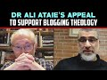

# Dr Ali Ataie's appeal to support Blogging Theology (2023-01-01)

## Description

You Can Support My Work on Patreon:
https://www.patreon.com/Bloggingtheology

My Paypal Link: 
https://www.paypal.com/paypalme/bloggingtheology?locale.x=en_GB

## Summary of [Dr Ali Ataie's appeal to support Blogging Theology](https://www.youtube.com/watch?v=C7xHWKjK-uI)

*This summary is AI generated - there may be inaccuracies. *

### [00:00:00](https://www.youtube.com/watch?v=C7xHWKjK-uI&t=0) - [00:00:00](https://www.youtube.com/watch?v=C7xHWKjK-uI&t=0)

In his video, Dr. Ali Ataie asks for viewers' support in continuing his work blogging about theology. He expresses his gratitude for the ability to do this work, and thanks God for the opportunity.

**[00:00:00](https://www.youtube.com/watch?v=C7xHWKjK-uI&t=0)** Dr. Ali Ataie urges viewers to subscribe to his channel and consider supporting him through Patreon, as he dedicates a lot of time and effort into blogging theology. He thanks God for the means to do this work and thanks his creator alone.

## Full transcript with timestamps

[0:00:00](https://youtu.be/C7xHWKjK-uI?t=0) and then also I wanted to conclude by  
[0:00:01](https://youtu.be/C7xHWKjK-uI?t=1) saying to the viewers to you know  
[0:00:04](https://youtu.be/C7xHWKjK-uI?t=4) support your channel  
[0:00:06](https://youtu.be/C7xHWKjK-uI?t=6) um you're obviously doing fantastic work  
[0:00:08](https://youtu.be/C7xHWKjK-uI?t=8) I think I think most viewers know how I  
[0:00:10](https://youtu.be/C7xHWKjK-uI?t=10) feel about blogging Theology and it's  
[0:00:12](https://youtu.be/C7xHWKjK-uI?t=12) the best Channel on YouTube I said it  
[0:00:13](https://youtu.be/C7xHWKjK-uI?t=13) many times you know thousands upon  
[0:00:15](https://youtu.be/C7xHWKjK-uI?t=15) thousands of people perhaps millions of  
[0:00:17](https://youtu.be/C7xHWKjK-uI?t=17) people have benefited and are benefiting  
[0:00:19](https://youtu.be/C7xHWKjK-uI?t=19) uh from your efforts or contributions to  
[0:00:20](https://youtu.be/C7xHWKjK-uI?t=20) the public discourse  
[0:00:22](https://youtu.be/C7xHWKjK-uI?t=22) um so to the viewers you know please  
[0:00:24](https://youtu.be/C7xHWKjK-uI?t=24) subscribe uh to this channel consider  
[0:00:26](https://youtu.be/C7xHWKjK-uI?t=26) supporting brother Paul on patreon  
[0:00:30](https://youtu.be/C7xHWKjK-uI?t=30) making high uh quality educational  
[0:00:33](https://youtu.be/C7xHWKjK-uI?t=33) podcasts this takes a lot of work and a  
[0:00:35](https://youtu.be/C7xHWKjK-uI?t=35) lot of dedication so at the very least I  
[0:00:38](https://youtu.be/C7xHWKjK-uI?t=38) ask people to keep you and blogging  
[0:00:40](https://youtu.be/C7xHWKjK-uI?t=40) theology in their in their prayers  
[0:00:41](https://youtu.be/C7xHWKjK-uI?t=41) inshallah I'm very I'm very very blessed  
[0:00:44](https://youtu.be/C7xHWKjK-uI?t=44) and I'm very humbled by by that and and  
[0:00:46](https://youtu.be/C7xHWKjK-uI?t=46) uh the work that I do and I'm clear  
[0:00:49](https://youtu.be/C7xHWKjK-uI?t=49) where this comes from it comes from our  
[0:00:51](https://youtu.be/C7xHWKjK-uI?t=51) creator  
[0:00:52](https://youtu.be/C7xHWKjK-uI?t=52) um uh who is uh gracious and kind and  
[0:00:55](https://youtu.be/C7xHWKjK-uI?t=55) has provided me and others with the  
[0:00:57](https://youtu.be/C7xHWKjK-uI?t=57) means to to do this work so I'm I'm uh  
[0:01:00](https://youtu.be/C7xHWKjK-uI?t=60) or or gratitude and thanks belong to him  
[0:01:03](https://youtu.be/C7xHWKjK-uI?t=63) alone so  
