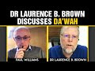

# Dr Laurence B. Brown Discusses Da'wah (2021-10-14 20:13:25+00:00)

## Description

Dr Brown graduated from Cornell University College of Arts and Sciences, Brown University Medical School, and George Washington University Hospital residency program. He is a retired Air Force officer, the medical director and chief ophthalmologist of a major eye center in the Middle East, an ordained interfaith minister, and the author of four books of comparative religion.  

Dr Brown’s most recent book is a novel The Eighth Scroll which draws on the three Abrahamic faiths of Judaism, Christianity, and Islam to create a powerful thriller involving the Dead Sea Scrolls.  

My favourite work by Dr Brown is 'The First and Final Commandment: A Search for Truth in Revelation within the Abrahamic Religions' which examines the doctrinal differences between the faiths and how their Scriptures differ.  

You can purchase all of Dr Brown's books here: https://www.amazon.co.uk/Laurence-B.-Brown/e/B006UTVPGI?ref_=dbs_p_pbk_r00_abau_000000

## Summary of [Dr Laurence B. Brown Discusses Da'wah](https://www.youtube.com/watch?v=6zMpe1hui7g)

*This is an AI generated summary. There may be inaccuracies. *

### [00:00:00](https://www.youtube.com/watch?v=6zMpe1hui7g&t=0) - [01:00:00](https://www.youtube.com/watch?v=6zMpe1hui7g&t=3600)

Dr. Laurence B. Brown discusses the importance of da'wah, or preaching Islam. He argues that it is important to share the message of Islam in a novel format, such as fiction, in order to engage a larger audience. He also discusses how his own journey from atheism to Islam was spurred by the death of his second child.

**[00:00:00](https://www.youtube.com/watch?v=6zMpe1hui7g&t=0)** Dr. Laurence Brown discusses the importance of da'wah, or preaching Islam, in a novel format. He feels that fiction is a more engaging way to share the message of Islam, as it can be enjoyed by a larger audience.
* **[00:05:00](https://www.youtube.com/watch?v=6zMpe1hui7g&t=300)** Dr. Laurence Brown discusses his journey from atheism to Islam, which was spurred by the death of his second child.
* **[00:10:00](https://www.youtube.com/watch?v=6zMpe1hui7g&t=600)** This man tells the story of how he became an Islamic convert, and how his daughter's life was saved by a rare congenital heart defect. He reflects on his journey, and how he eventually found the religion that made sense to him.
* **[00:15:00](https://www.youtube.com/watch?v=6zMpe1hui7g&t=900)** Dr. Laurence Brown discusses Da'wah, or the Islamic outreach to Christians and other religions. He says that while it would be easy to take on Christianity and become part of a community of like-minded people, he found many things in the Bible that he could not accept, including the idea of God becoming a human being. He argues that the only way to truly be christian is to define what that means for oneself.
* **[00:20:00](https://www.youtube.com/watch?v=6zMpe1hui7g&t=1200)** The video discusses how people can misinterpret certain passages in the Bible. Specifically, it points to verses in which the term 'son of god' is applied to multiple individuals and groups, and how this concept is problematic because it was most likely metaphorical at the time the Bible was written.
* **[00:25:00](https://www.youtube.com/watch?v=6zMpe1hui7g&t=1500)** Dr. Laurence B. Brown discusses how the concept of a unique son of God falls apart due to contradicting passages in the Bible. He also discusses how some people convert to Islam after realizing that Christianity does not satisfactorily answer their religious questions.
* **[00:30:00](https://www.youtube.com/watch?v=6zMpe1hui7g&t=1800)** The video discusses the idea of prophethood and revelation, and how the progression from three prophets in the Old Testament to two prophets in the New Testament corresponds with the idea of a continuous chain of revelation. John the Baptist and Jesus Christ are the two prophets predicted in the New Testament, and a third prophet is predicted in the New Testament itself.
* **[00:35:00](https://www.youtube.com/watch?v=6zMpe1hui7g&t=2100)** Dr. Laurence B. Brown discusses how someone's conversion to Islam can be a personal journey of discovery and growth. He recounts the story of a patient who contacted him asking to become a Muslim, and how he eventually pieced together that she had faced a similar situation with her son. Brown advises patience and honesty when investigating a person's motivations for conversion.
* **[00:40:00](https://www.youtube.com/watch?v=6zMpe1hui7g&t=2400)** Dr. Laurence B. Brown discusses the threat of militant atheism to Muslims, and how to combat it. He notes that this new form of atheism is something new, and that its effects are damaging.
* **[00:45:00](https://www.youtube.com/watch?v=6zMpe1hui7g&t=2700)** Dr. Laurence Brown discusses the philosophy of atheism and how it challenges believers by asking where everything came from, why the universe is finely-tuned, and why life exists. He argues that atheism is only plausible if one assumes a lot of givens that are not explained by science.
* **[00:50:00](https://www.youtube.com/watch?v=6zMpe1hui7g&t=3000)** Dr. Laurence B. Brown discusses the similarities and differences between atheism and religion, pointing out that atheism cannot exist without energy, and that entropy is increasing in the universe. He argues that there must be a transcendent creator, because the laws of thermodynamics would not be possible without someone creating them.
* **[00:55:00](https://www.youtube.com/watch?v=6zMpe1hui7g&t=3300)** Dr. Laurence B. Brown discusses the compatibility of the concepts of the big bang and natural selection with religion. He argues that Islam is the only religion that is compatible with these concepts.
### [01:00:00](https://www.youtube.com/watch?v=6zMpe1hui7g&t=3600) - [01:05:00](https://www.youtube.com/watch?v=6zMpe1hui7g&t=3900)

Dr. Laurence Brown discusses the importance of Da'wah in a peaceful and respectful manner. He reminds the viewer that it is not in our hands to determine who will be guided to the truth, but that Allah will guide whomever He wills. Dr Brown's tips on how to make Da'wah successful include understanding the person you're talking to, having good manners, and using good intellect.

**[01:00:00](https://www.youtube.com/watch?v=6zMpe1hui7g&t=3600)** Dr. Brown discusses how to make Da'wah (religion) successful by understanding the person you're talking to, having good manners, and using good intellect. He also mentions the power of a book in the process of making Da'wah.
* **[01:05:00](https://www.youtube.com/watch?v=6zMpe1hui7g&t=3900)** Dr. Laurence Brown discusses the importance of da'wah in a peaceful and respectful manner. He reminds the viewer that it is not in our hands to determine who will be guided to the truth, but that Allah will guide whomever He wills.

## Full transcript with timestamps

[0:00:02](https://youtu.be/6zMpe1hui7g?t=2) well hello everyone and welcome to  
[0:00:04](https://youtu.be/6zMpe1hui7g?t=4) blogging theology and today i am very  
[0:00:08](https://youtu.be/6zMpe1hui7g?t=8) happy and thrilled to have as a guest dr  
[0:00:10](https://youtu.be/6zMpe1hui7g?t=10) lawrence b brown on the show good good  
[0:00:13](https://youtu.be/6zMpe1hui7g?t=13) afternoon to you  
[0:00:14](https://youtu.be/6zMpe1hui7g?t=14) sir afternoon  
[0:00:17](https://youtu.be/6zMpe1hui7g?t=17) good afternoon  
[0:00:20](https://youtu.be/6zMpe1hui7g?t=20) it's wonderful to have you on as a guest  
[0:00:21](https://youtu.be/6zMpe1hui7g?t=21) and i'll just uh for those viewers who  
[0:00:24](https://youtu.be/6zMpe1hui7g?t=24) might not be familiar with uh dr brown  
[0:00:26](https://youtu.be/6zMpe1hui7g?t=26) and his work i'll just introduce you  
[0:00:28](https://youtu.be/6zMpe1hui7g?t=28) briefly dr lawrence b brown graduated  
[0:00:31](https://youtu.be/6zMpe1hui7g?t=31) from cornell university college of arts  
[0:00:34](https://youtu.be/6zMpe1hui7g?t=34) and sciences this is in the united  
[0:00:36](https://youtu.be/6zMpe1hui7g?t=36) states of course  
[0:00:37](https://youtu.be/6zMpe1hui7g?t=37) brown university medical school and  
[0:00:40](https://youtu.be/6zMpe1hui7g?t=40) george washington university hospital  
[0:00:42](https://youtu.be/6zMpe1hui7g?t=42) residency program he's a retired air  
[0:00:45](https://youtu.be/6zMpe1hui7g?t=45) force officer  
[0:00:46](https://youtu.be/6zMpe1hui7g?t=46) the medical director and chief eye  
[0:00:49](https://youtu.be/6zMpe1hui7g?t=49) surgeon of a major eye center in the  
[0:00:51](https://youtu.be/6zMpe1hui7g?t=51) middle east  
[0:00:52](https://youtu.be/6zMpe1hui7g?t=52) an ordained interfaith minister and the  
[0:00:55](https://youtu.be/6zMpe1hui7g?t=55) author of four books of comparative  
[0:00:58](https://youtu.be/6zMpe1hui7g?t=58) religion  
[0:00:59](https://youtu.be/6zMpe1hui7g?t=59) and dr brown's most recent book is a  
[0:01:02](https://youtu.be/6zMpe1hui7g?t=62) novel called the eighth scroll  
[0:01:05](https://youtu.be/6zMpe1hui7g?t=65) which draws on the three abrahamic  
[0:01:07](https://youtu.be/6zMpe1hui7g?t=67) faiths of judaism christianity and islam  
[0:01:10](https://youtu.be/6zMpe1hui7g?t=70) to create a powerful thriller involving  
[0:01:13](https://youtu.be/6zMpe1hui7g?t=73) the dead sea scrolls  
[0:01:15](https://youtu.be/6zMpe1hui7g?t=75) and much more  
[0:01:17](https://youtu.be/6zMpe1hui7g?t=77) now my favorite uh work by dr brown is  
[0:01:20](https://youtu.be/6zMpe1hui7g?t=80) his book called the first and final  
[0:01:24](https://youtu.be/6zMpe1hui7g?t=84) commandment a search for truth in  
[0:01:26](https://youtu.be/6zMpe1hui7g?t=86) revelation within the abrahamic  
[0:01:29](https://youtu.be/6zMpe1hui7g?t=89) religions  
[0:01:30](https://youtu.be/6zMpe1hui7g?t=90) which examines amongst many things the  
[0:01:32](https://youtu.be/6zMpe1hui7g?t=92) doctrinal differences between the faiths  
[0:01:35](https://youtu.be/6zMpe1hui7g?t=95) and how their scriptures differ on a  
[0:01:37](https://youtu.be/6zMpe1hui7g?t=97) whole range of issues you know the  
[0:01:38](https://youtu.be/6zMpe1hui7g?t=98) nature of jesus and his life and so on  
[0:01:41](https://youtu.be/6zMpe1hui7g?t=101) so um so dr brown um  
[0:01:44](https://youtu.be/6zMpe1hui7g?t=104) just i know you're passionate about um  
[0:01:47](https://youtu.be/6zMpe1hui7g?t=107) communicating and sharing the message of  
[0:01:50](https://youtu.be/6zMpe1hui7g?t=110) islam in fiction  
[0:01:52](https://youtu.be/6zMpe1hui7g?t=112) and in scholarly works but why have you  
[0:01:54](https://youtu.be/6zMpe1hui7g?t=114) chosen to do dour via novels  
[0:01:56](https://youtu.be/6zMpe1hui7g?t=116) particularly  
[0:01:59](https://youtu.be/6zMpe1hui7g?t=119) well um  
[0:02:02](https://youtu.be/6zMpe1hui7g?t=122) it's a much talked about pathway right  
[0:02:04](https://youtu.be/6zMpe1hui7g?t=124) now actually and i think it's basically  
[0:02:07](https://youtu.be/6zMpe1hui7g?t=127) driven  
[0:02:08](https://youtu.be/6zMpe1hui7g?t=128) by what people are reading  
[0:02:10](https://youtu.be/6zMpe1hui7g?t=130) um i think the short answer is that when  
[0:02:13](https://youtu.be/6zMpe1hui7g?t=133) i started out i was really only  
[0:02:15](https://youtu.be/6zMpe1hui7g?t=135) interested  
[0:02:16](https://youtu.be/6zMpe1hui7g?t=136) in  
[0:02:17](https://youtu.be/6zMpe1hui7g?t=137) doing scholastic works of comparative  
[0:02:20](https://youtu.be/6zMpe1hui7g?t=140) religion  
[0:02:21](https://youtu.be/6zMpe1hui7g?t=141) and um  
[0:02:22](https://youtu.be/6zMpe1hui7g?t=142) [Music]  
[0:02:23](https://youtu.be/6zMpe1hui7g?t=143) once i did that  
[0:02:24](https://youtu.be/6zMpe1hui7g?t=144) the first and final commandment was my  
[0:02:26](https://youtu.be/6zMpe1hui7g?t=146) first book and  
[0:02:29](https://youtu.be/6zMpe1hui7g?t=149) i will totally unabashedly hold up the  
[0:02:31](https://youtu.be/6zMpe1hui7g?t=151) cover so everybody can see it okay  
[0:02:34](https://youtu.be/6zMpe1hui7g?t=154) yep this is this is um  
[0:02:36](https://youtu.be/6zMpe1hui7g?t=156) this is the book okay this was my this  
[0:02:39](https://youtu.be/6zMpe1hui7g?t=159) was my first book  
[0:02:40](https://youtu.be/6zMpe1hui7g?t=160) but as you can see it was rather thick  
[0:02:43](https://youtu.be/6zMpe1hui7g?t=163) and so  
[0:02:45](https://youtu.be/6zMpe1hui7g?t=165) some people uh suggested that i  
[0:02:47](https://youtu.be/6zMpe1hui7g?t=167) cut it in two which is what we did with  
[0:02:50](https://youtu.be/6zMpe1hui7g?t=170) basically two thinner volumes  
[0:02:53](https://youtu.be/6zMpe1hui7g?t=173) those those are misguided  
[0:02:55](https://youtu.be/6zMpe1hui7g?t=175) and then  
[0:02:56](https://youtu.be/6zMpe1hui7g?t=176) gutted  
[0:02:58](https://youtu.be/6zMpe1hui7g?t=178) okay these two books  
[0:02:59](https://youtu.be/6zMpe1hui7g?t=179) well  
[0:03:00](https://youtu.be/6zMpe1hui7g?t=180) the end of the story is though  
[0:03:02](https://youtu.be/6zMpe1hui7g?t=182) after i had these books out  
[0:03:05](https://youtu.be/6zMpe1hui7g?t=185) um  
[0:03:06](https://youtu.be/6zMpe1hui7g?t=186) i felt like i had pretty much  
[0:03:08](https://youtu.be/6zMpe1hui7g?t=188) accomplished what i had set out to do  
[0:03:10](https://youtu.be/6zMpe1hui7g?t=190) which was to present the information  
[0:03:14](https://youtu.be/6zMpe1hui7g?t=194) and i started uh sort of casting around  
[0:03:18](https://youtu.be/6zMpe1hui7g?t=198) for other ways of presenting the same  
[0:03:19](https://youtu.be/6zMpe1hui7g?t=199) message and  
[0:03:22](https://youtu.be/6zMpe1hui7g?t=202) i think anybody who has been into a  
[0:03:24](https://youtu.be/6zMpe1hui7g?t=204) western bookstore  
[0:03:26](https://youtu.be/6zMpe1hui7g?t=206) notices that the non-fiction section is  
[0:03:30](https://youtu.be/6zMpe1hui7g?t=210) quite small  
[0:03:31](https://youtu.be/6zMpe1hui7g?t=211) and the fiction section is is vast  
[0:03:35](https://youtu.be/6zMpe1hui7g?t=215) the majority of the audience are going  
[0:03:37](https://youtu.be/6zMpe1hui7g?t=217) for  
[0:03:39](https://youtu.be/6zMpe1hui7g?t=219) pleasure reading basically rather than  
[0:03:42](https://youtu.be/6zMpe1hui7g?t=222) rather than information  
[0:03:44](https://youtu.be/6zMpe1hui7g?t=224) and so i decided well let's uh  
[0:03:47](https://youtu.be/6zMpe1hui7g?t=227) let's approach that avenue  
[0:03:49](https://youtu.be/6zMpe1hui7g?t=229) and so i wrote the eighth scroll as an  
[0:03:52](https://youtu.be/6zMpe1hui7g?t=232) action adventure  
[0:03:53](https://youtu.be/6zMpe1hui7g?t=233) um a fun book  
[0:03:55](https://youtu.be/6zMpe1hui7g?t=235) something people would enjoy reading but  
[0:03:57](https://youtu.be/6zMpe1hui7g?t=237) also  
[0:03:58](https://youtu.be/6zMpe1hui7g?t=238) as  
[0:04:00](https://youtu.be/6zMpe1hui7g?t=240) not only a different way of introducing  
[0:04:03](https://youtu.be/6zMpe1hui7g?t=243) uh  
[0:04:03](https://youtu.be/6zMpe1hui7g?t=243) the subject of comparative religion but  
[0:04:06](https://youtu.be/6zMpe1hui7g?t=246) as a different kind of a  
[0:04:08](https://youtu.be/6zMpe1hui7g?t=248) dawah tool  
[0:04:11](https://youtu.be/6zMpe1hui7g?t=251) because  
[0:04:12](https://youtu.be/6zMpe1hui7g?t=252) for example i mean just imagine you have  
[0:04:14](https://youtu.be/6zMpe1hui7g?t=254) a  
[0:04:15](https://youtu.be/6zMpe1hui7g?t=255) a friend or a neighbor or  
[0:04:17](https://youtu.be/6zMpe1hui7g?t=257) a colleague who you would like to  
[0:04:20](https://youtu.be/6zMpe1hui7g?t=260) present islam to  
[0:04:22](https://youtu.be/6zMpe1hui7g?t=262) and um  
[0:04:23](https://youtu.be/6zMpe1hui7g?t=263) yet you're shy to do so because they're  
[0:04:26](https://youtu.be/6zMpe1hui7g?t=266) your boss or they're your colleague or  
[0:04:28](https://youtu.be/6zMpe1hui7g?t=268) um it's a family member for whom  
[0:04:30](https://youtu.be/6zMpe1hui7g?t=270) religious discussions are a sensitive  
[0:04:33](https://youtu.be/6zMpe1hui7g?t=273) matter  
[0:04:34](https://youtu.be/6zMpe1hui7g?t=274) so you could go to them with a book  
[0:04:36](https://youtu.be/6zMpe1hui7g?t=276) about islam and say you know look i  
[0:04:39](https://youtu.be/6zMpe1hui7g?t=279) i mean i really love you uh  
[0:04:42](https://youtu.be/6zMpe1hui7g?t=282) i want to see the best for both of us  
[0:04:44](https://youtu.be/6zMpe1hui7g?t=284) and so on i would like to share this  
[0:04:45](https://youtu.be/6zMpe1hui7g?t=285) with you it's meant so much to me i  
[0:04:47](https://youtu.be/6zMpe1hui7g?t=287) would like to share it with you and  
[0:04:48](https://youtu.be/6zMpe1hui7g?t=288) they're going to ask well what's it  
[0:04:50](https://youtu.be/6zMpe1hui7g?t=290) about and you're going to be forced to  
[0:04:51](https://youtu.be/6zMpe1hui7g?t=291) say well it's about islam  
[0:04:54](https://youtu.be/6zMpe1hui7g?t=294) but if you approach them with and where  
[0:04:56](https://youtu.be/6zMpe1hui7g?t=296) is it over here  
[0:04:58](https://youtu.be/6zMpe1hui7g?t=298) yeah if you approach them with the eight  
[0:05:00](https://youtu.be/6zMpe1hui7g?t=300) scroll  
[0:05:02](https://youtu.be/6zMpe1hui7g?t=302) or one of my other novels now there i  
[0:05:04](https://youtu.be/6zMpe1hui7g?t=304) have three novels out  
[0:05:06](https://youtu.be/6zMpe1hui7g?t=306) um  
[0:05:07](https://youtu.be/6zMpe1hui7g?t=307) it's a totally different dynamic because  
[0:05:09](https://youtu.be/6zMpe1hui7g?t=309) you can  
[0:05:11](https://youtu.be/6zMpe1hui7g?t=311) you could just say to somebody uh hey  
[0:05:13](https://youtu.be/6zMpe1hui7g?t=313) look i read something the other day uh  
[0:05:15](https://youtu.be/6zMpe1hui7g?t=315) it's a fun read i think you'll like it  
[0:05:18](https://youtu.be/6zMpe1hui7g?t=318) and if they ask you what's it about you  
[0:05:20](https://youtu.be/6zMpe1hui7g?t=320) can just say well do you like  
[0:05:22](https://youtu.be/6zMpe1hui7g?t=322) did you like dan brown's books um it's  
[0:05:24](https://youtu.be/6zMpe1hui7g?t=324) kind of like that um do you like james  
[0:05:27](https://youtu.be/6zMpe1hui7g?t=327) wand action adventure intrigue  
[0:05:30](https://youtu.be/6zMpe1hui7g?t=330) you know and so it's a totally different  
[0:05:32](https://youtu.be/6zMpe1hui7g?t=332) dynamic  
[0:05:34](https://youtu.be/6zMpe1hui7g?t=334) it certainly struck me as a similar kind  
[0:05:35](https://youtu.be/6zMpe1hui7g?t=335) of genre that the dan the dan brown um  
[0:05:39](https://youtu.be/6zMpe1hui7g?t=339) the books that you mentioned but i i  
[0:05:41](https://youtu.be/6zMpe1hui7g?t=341) must say that the sorry  
[0:05:43](https://youtu.be/6zMpe1hui7g?t=343) well actually i mean it's kind of funny  
[0:05:45](https://youtu.be/6zMpe1hui7g?t=345) because i was writing i was writing and  
[0:05:47](https://youtu.be/6zMpe1hui7g?t=347) working on my books  
[0:05:49](https://youtu.be/6zMpe1hui7g?t=349) uh around the time that he was working  
[0:05:52](https://youtu.be/6zMpe1hui7g?t=352) on  
[0:05:53](https://youtu.be/6zMpe1hui7g?t=353) his famous ones angels and demons and uh  
[0:05:56](https://youtu.be/6zMpe1hui7g?t=356) of course vinci code and so on but  
[0:05:59](https://youtu.be/6zMpe1hui7g?t=359) but  
[0:06:00](https://youtu.be/6zMpe1hui7g?t=360) it i uh  
[0:06:02](https://youtu.be/6zMpe1hui7g?t=362) yeah you know i did i just missed the uh  
[0:06:04](https://youtu.be/6zMpe1hui7g?t=364) the start line he um he published uh  
[0:06:07](https://youtu.be/6zMpe1hui7g?t=367) well before i did  
[0:06:09](https://youtu.be/6zMpe1hui7g?t=369) and  
[0:06:10](https://youtu.be/6zMpe1hui7g?t=370) it's one of those things you look back  
[0:06:12](https://youtu.be/6zMpe1hui7g?t=372) on and just say uh you know dang but you  
[0:06:14](https://youtu.be/6zMpe1hui7g?t=374) know everything has its purpose and uh  
[0:06:16](https://youtu.be/6zMpe1hui7g?t=376) there's a reason for everything  
[0:06:18](https://youtu.be/6zMpe1hui7g?t=378) wow that's interesting um but i i i do  
[0:06:21](https://youtu.be/6zMpe1hui7g?t=381) as i said already the the the book the  
[0:06:23](https://youtu.be/6zMpe1hui7g?t=383) first and final commandment i think  
[0:06:25](https://youtu.be/6zMpe1hui7g?t=385) for me is is is your your best work and  
[0:06:27](https://youtu.be/6zMpe1hui7g?t=387) your magnum opus and your first one  
[0:06:30](https://youtu.be/6zMpe1hui7g?t=390) actually because  
[0:06:31](https://youtu.be/6zMpe1hui7g?t=391) scholarly work that investigates the uh  
[0:06:34](https://youtu.be/6zMpe1hui7g?t=394) the doc as i mentioned before the  
[0:06:35](https://youtu.be/6zMpe1hui7g?t=395) doctrinal differences between the  
[0:06:37](https://youtu.be/6zMpe1hui7g?t=397) concept of god in the different  
[0:06:39](https://youtu.be/6zMpe1hui7g?t=399) abrahamic faiths  
[0:06:40](https://youtu.be/6zMpe1hui7g?t=400) and you look at the life of jesus and a  
[0:06:42](https://youtu.be/6zMpe1hui7g?t=402) great deal of detail and the doctrine of  
[0:06:43](https://youtu.be/6zMpe1hui7g?t=403) the trinity and the crucifixion and and  
[0:06:46](https://youtu.be/6zMpe1hui7g?t=406) so on and so forth and you look at the  
[0:06:48](https://youtu.be/6zMpe1hui7g?t=408) quran of course and and and look at the  
[0:06:50](https://youtu.be/6zMpe1hui7g?t=410) various claims to truth that these  
[0:06:52](https://youtu.be/6zMpe1hui7g?t=412) different religions have and you  
[0:06:53](https://youtu.be/6zMpe1hui7g?t=413) conclude um in a very kind of as a  
[0:06:56](https://youtu.be/6zMpe1hui7g?t=416) scholarly and rigorous way that islam uh  
[0:06:59](https://youtu.be/6zMpe1hui7g?t=419) is the the final revelation of god and  
[0:07:02](https://youtu.be/6zMpe1hui7g?t=422) you give lots of reasons why that is the  
[0:07:05](https://youtu.be/6zMpe1hui7g?t=425) case so i do recommend people to get a  
[0:07:08](https://youtu.be/6zMpe1hui7g?t=428) hold of this copy in the  
[0:07:10](https://youtu.be/6zMpe1hui7g?t=430) what the longer big version or the the  
[0:07:12](https://youtu.be/6zMpe1hui7g?t=432) shorter ones uh whichever but it's a  
[0:07:14](https://youtu.be/6zMpe1hui7g?t=434) it's a good resource to have for um  
[0:07:17](https://youtu.be/6zMpe1hui7g?t=437) uh information about these different  
[0:07:19](https://youtu.be/6zMpe1hui7g?t=439) faiths from written obviously from an  
[0:07:20](https://youtu.be/6zMpe1hui7g?t=440) islamic point of view but we're coming  
[0:07:23](https://youtu.be/6zMpe1hui7g?t=443) back to your own conversion to islam and  
[0:07:26](https://youtu.be/6zMpe1hui7g?t=446) i know you've written about this  
[0:07:28](https://youtu.be/6zMpe1hui7g?t=448) extensively and you appeared on many  
[0:07:29](https://youtu.be/6zMpe1hui7g?t=449) channels and you've talked about this  
[0:07:30](https://youtu.be/6zMpe1hui7g?t=450) but  
[0:07:31](https://youtu.be/6zMpe1hui7g?t=451) would you want just to share um your  
[0:07:33](https://youtu.be/6zMpe1hui7g?t=453) story again and i understand there might  
[0:07:36](https://youtu.be/6zMpe1hui7g?t=456) be one or two facets of this  
[0:07:38](https://youtu.be/6zMpe1hui7g?t=458) adventure which has become for you um  
[0:07:40](https://youtu.be/6zMpe1hui7g?t=460) after your conversion that perhaps  
[0:07:42](https://youtu.be/6zMpe1hui7g?t=462) you've not made public before  
[0:07:45](https://youtu.be/6zMpe1hui7g?t=465) um sure  
[0:07:47](https://youtu.be/6zMpe1hui7g?t=467) yeah um  
[0:07:49](https://youtu.be/6zMpe1hui7g?t=469) it might be a little bit of a skinny  
[0:07:51](https://youtu.be/6zMpe1hui7g?t=471) down version because i used to i used to  
[0:07:53](https://youtu.be/6zMpe1hui7g?t=473) enjoy talking about this and uh  
[0:07:56](https://youtu.be/6zMpe1hui7g?t=476) and so i hope you understand i'll try to  
[0:08:00](https://youtu.be/6zMpe1hui7g?t=480) compress it a little but um  
[0:08:03](https://youtu.be/6zMpe1hui7g?t=483) the the bottom line is that i was  
[0:08:05](https://youtu.be/6zMpe1hui7g?t=485) atheist before i became religious and uh  
[0:08:09](https://youtu.be/6zMpe1hui7g?t=489) a lot of people think that i was  
[0:08:10](https://youtu.be/6zMpe1hui7g?t=490) christian before but i never was  
[0:08:14](https://youtu.be/6zMpe1hui7g?t=494) so  
[0:08:15](https://youtu.be/6zMpe1hui7g?t=495) i had lived as an atheist for 30 some  
[0:08:17](https://youtu.be/6zMpe1hui7g?t=497) years  
[0:08:18](https://youtu.be/6zMpe1hui7g?t=498) and  
[0:08:21](https://youtu.be/6zMpe1hui7g?t=501) what what happened was that  
[0:08:24](https://youtu.be/6zMpe1hui7g?t=504) my second child was  
[0:08:26](https://youtu.be/6zMpe1hui7g?t=506) born  
[0:08:27](https://youtu.be/6zMpe1hui7g?t=507) with  
[0:08:29](https://youtu.be/6zMpe1hui7g?t=509) what appeared to be a  
[0:08:31](https://youtu.be/6zMpe1hui7g?t=511) lethal  
[0:08:33](https://youtu.be/6zMpe1hui7g?t=513) heart defect and  
[0:08:36](https://youtu.be/6zMpe1hui7g?t=516) so she went straight from the birthing  
[0:08:38](https://youtu.be/6zMpe1hui7g?t=518) suite to the neonatal intensive care  
[0:08:41](https://youtu.be/6zMpe1hui7g?t=521) unit  
[0:08:43](https://youtu.be/6zMpe1hui7g?t=523) and uh she was gun metal blue from  
[0:08:47](https://youtu.be/6zMpe1hui7g?t=527) the chest to down i mean as dusky and as  
[0:08:50](https://youtu.be/6zMpe1hui7g?t=530) blue as my scrub suit here maybe even  
[0:08:53](https://youtu.be/6zMpe1hui7g?t=533) maybe even more dusky  
[0:08:55](https://youtu.be/6zMpe1hui7g?t=535) uh for reasons that i think everybody  
[0:08:57](https://youtu.be/6zMpe1hui7g?t=537) understands when when the body is not  
[0:08:59](https://youtu.be/6zMpe1hui7g?t=539) getting oxygen the blood becomes blue  
[0:09:01](https://youtu.be/6zMpe1hui7g?t=541) you know arterial blood is red right you  
[0:09:04](https://youtu.be/6zMpe1hui7g?t=544) know  
[0:09:04](https://youtu.be/6zMpe1hui7g?t=544) and the uh  
[0:09:06](https://youtu.be/6zMpe1hui7g?t=546) the venous blood is blue because it's  
[0:09:08](https://youtu.be/6zMpe1hui7g?t=548) deoxygen deoxygenated  
[0:09:11](https://youtu.be/6zMpe1hui7g?t=551) so  
[0:09:12](https://youtu.be/6zMpe1hui7g?t=552) because she had this uh defect in the  
[0:09:15](https://youtu.be/6zMpe1hui7g?t=555) heart the  
[0:09:16](https://youtu.be/6zMpe1hui7g?t=556) lower body was just not getting any  
[0:09:18](https://youtu.be/6zMpe1hui7g?t=558) oxygen and was suffocating  
[0:09:22](https://youtu.be/6zMpe1hui7g?t=562) they did a  
[0:09:23](https://youtu.be/6zMpe1hui7g?t=563) they did an immediate um ultrasound  
[0:09:28](https://youtu.be/6zMpe1hui7g?t=568) cardiac ultrasound  
[0:09:30](https://youtu.be/6zMpe1hui7g?t=570) and they found a correct coartation of  
[0:09:33](https://youtu.be/6zMpe1hui7g?t=573) the aorta which means that the aorta the  
[0:09:35](https://youtu.be/6zMpe1hui7g?t=575) major vessel that comes off of the heart  
[0:09:38](https://youtu.be/6zMpe1hui7g?t=578) and carries the blood down to the body  
[0:09:40](https://youtu.be/6zMpe1hui7g?t=580) was  
[0:09:41](https://youtu.be/6zMpe1hui7g?t=581) that the lumen of the aorta was  
[0:09:43](https://youtu.be/6zMpe1hui7g?t=583) constricted  
[0:09:45](https://youtu.be/6zMpe1hui7g?t=585) so that  
[0:09:46](https://youtu.be/6zMpe1hui7g?t=586) barely any blood was getting through  
[0:09:50](https://youtu.be/6zMpe1hui7g?t=590) well um  
[0:09:51](https://youtu.be/6zMpe1hui7g?t=591) the uh intensivist  
[0:09:54](https://youtu.be/6zMpe1hui7g?t=594) the uh the doctor in the intensive care  
[0:09:56](https://youtu.be/6zMpe1hui7g?t=596) ward  
[0:09:57](https://youtu.be/6zMpe1hui7g?t=597) and i both thought that this was a  
[0:10:01](https://youtu.be/6zMpe1hui7g?t=601) you know probably  
[0:10:02](https://youtu.be/6zMpe1hui7g?t=602) a lethal defect  
[0:10:04](https://youtu.be/6zMpe1hui7g?t=604) and that she was unlikely to survive it  
[0:10:07](https://youtu.be/6zMpe1hui7g?t=607) and um  
[0:10:09](https://youtu.be/6zMpe1hui7g?t=609) we got  
[0:10:10](https://youtu.be/6zMpe1hui7g?t=610) you know i mean there it was obviously  
[0:10:12](https://youtu.be/6zMpe1hui7g?t=612) an emotional and disturbing  
[0:10:14](https://youtu.be/6zMpe1hui7g?t=614) moment  
[0:10:15](https://youtu.be/6zMpe1hui7g?t=615) but we were in washington dc they called  
[0:10:18](https://youtu.be/6zMpe1hui7g?t=618) in a cardiothoracic consultant who was  
[0:10:21](https://youtu.be/6zMpe1hui7g?t=621) specialized in pediatrics  
[0:10:23](https://youtu.be/6zMpe1hui7g?t=623) and while he was  
[0:10:25](https://youtu.be/6zMpe1hui7g?t=625) examining my daughter they asked me to  
[0:10:27](https://youtu.be/6zMpe1hui7g?t=627) leave which is pretty standard procedure  
[0:10:30](https://youtu.be/6zMpe1hui7g?t=630) um  
[0:10:31](https://youtu.be/6zMpe1hui7g?t=631) and so  
[0:10:32](https://youtu.be/6zMpe1hui7g?t=632) i left the neonatal intense intensive  
[0:10:35](https://youtu.be/6zMpe1hui7g?t=635) care unit and i just made a bee line for  
[0:10:37](https://youtu.be/6zMpe1hui7g?t=637) the prayer room in the hospital  
[0:10:40](https://youtu.be/6zMpe1hui7g?t=640) it's kind of a funny thing when you  
[0:10:41](https://youtu.be/6zMpe1hui7g?t=641) think about it because as i said i was  
[0:10:43](https://youtu.be/6zMpe1hui7g?t=643) an atheist  
[0:10:47](https://youtu.be/6zMpe1hui7g?t=647) for an atheist to just  
[0:10:50](https://youtu.be/6zMpe1hui7g?t=650) go straight to the prayer room  
[0:10:51](https://youtu.be/6zMpe1hui7g?t=651) uh  
[0:10:52](https://youtu.be/6zMpe1hui7g?t=652) and  
[0:10:53](https://youtu.be/6zMpe1hui7g?t=653) i just i just remember feeling as i left  
[0:10:56](https://youtu.be/6zMpe1hui7g?t=656) the intensive care unit that this was  
[0:10:59](https://youtu.be/6zMpe1hui7g?t=659) where i had to go  
[0:11:01](https://youtu.be/6zMpe1hui7g?t=661) and um  
[0:11:04](https://youtu.be/6zMpe1hui7g?t=664) it was the first time in my life when i  
[0:11:06](https://youtu.be/6zMpe1hui7g?t=666) ever really prayed and i just prayed a  
[0:11:08](https://youtu.be/6zMpe1hui7g?t=668) fairly simple  
[0:11:10](https://youtu.be/6zMpe1hui7g?t=670) uh  
[0:11:11](https://youtu.be/6zMpe1hui7g?t=671) what  
[0:11:12](https://youtu.be/6zMpe1hui7g?t=672) is kind of a normal format for an  
[0:11:15](https://youtu.be/6zMpe1hui7g?t=675) atheist prayer i just prayed oh god if  
[0:11:18](https://youtu.be/6zMpe1hui7g?t=678) you are there i need help  
[0:11:20](https://youtu.be/6zMpe1hui7g?t=680) right  
[0:11:21](https://youtu.be/6zMpe1hui7g?t=681) and uh  
[0:11:22](https://youtu.be/6zMpe1hui7g?t=682) and i pledged if you save my daughter  
[0:11:25](https://youtu.be/6zMpe1hui7g?t=685) and guide me to the religion most  
[0:11:27](https://youtu.be/6zMpe1hui7g?t=687) pleasing to you  
[0:11:29](https://youtu.be/6zMpe1hui7g?t=689) not necessarily most pleasing to me but  
[0:11:31](https://youtu.be/6zMpe1hui7g?t=691) mostly to you then i will follow  
[0:11:35](https://youtu.be/6zMpe1hui7g?t=695) and  
[0:11:36](https://youtu.be/6zMpe1hui7g?t=696) i was away from the intensive care unit  
[0:11:39](https://youtu.be/6zMpe1hui7g?t=699) for maybe  
[0:11:40](https://youtu.be/6zMpe1hui7g?t=700) 10 minutes 15 minutes  
[0:11:43](https://youtu.be/6zMpe1hui7g?t=703) when i went back when i entered  
[0:11:46](https://youtu.be/6zMpe1hui7g?t=706) the doctors were kind of all huddled  
[0:11:47](https://youtu.be/6zMpe1hui7g?t=707) around my daughter in her little you  
[0:11:50](https://youtu.be/6zMpe1hui7g?t=710) know  
[0:11:51](https://youtu.be/6zMpe1hui7g?t=711) warmer bassinet and  
[0:11:54](https://youtu.be/6zMpe1hui7g?t=714) they looked up and i could see  
[0:11:56](https://youtu.be/6zMpe1hui7g?t=716) from across the room i could see the  
[0:11:58](https://youtu.be/6zMpe1hui7g?t=718) look on their faces i could see that  
[0:11:59](https://youtu.be/6zMpe1hui7g?t=719) something had changed and i  
[0:12:02](https://youtu.be/6zMpe1hui7g?t=722) you know didn't know what but as i  
[0:12:03](https://youtu.be/6zMpe1hui7g?t=723) approached  
[0:12:05](https://youtu.be/6zMpe1hui7g?t=725) this uh this consultant  
[0:12:08](https://youtu.be/6zMpe1hui7g?t=728) just looked up at me and he said uh  
[0:12:10](https://youtu.be/6zMpe1hui7g?t=730) she's going to be okay  
[0:12:12](https://youtu.be/6zMpe1hui7g?t=732) wow  
[0:12:13](https://youtu.be/6zMpe1hui7g?t=733) which was a shock to me but  
[0:12:16](https://youtu.be/6zMpe1hui7g?t=736) here's the rub  
[0:12:19](https://youtu.be/6zMpe1hui7g?t=739) i was on the path to becoming an  
[0:12:21](https://youtu.be/6zMpe1hui7g?t=741) ophthalmologist an eye surgery okay so i  
[0:12:24](https://youtu.be/6zMpe1hui7g?t=744) had left my um my  
[0:12:27](https://youtu.be/6zMpe1hui7g?t=747) cardiothoracic training behind what  
[0:12:30](https://youtu.be/6zMpe1hui7g?t=750) little i had had  
[0:12:31](https://youtu.be/6zMpe1hui7g?t=751) and um so as he started to explain  
[0:12:35](https://youtu.be/6zMpe1hui7g?t=755) the condition  
[0:12:37](https://youtu.be/6zMpe1hui7g?t=757) which was a patent ductus arteriosus  
[0:12:40](https://youtu.be/6zMpe1hui7g?t=760) uh  
[0:12:42](https://youtu.be/6zMpe1hui7g?t=762) the memory started to click in  
[0:12:44](https://youtu.be/6zMpe1hui7g?t=764) i started to understand how okay yeah  
[0:12:46](https://youtu.be/6zMpe1hui7g?t=766) this does make sense  
[0:12:48](https://youtu.be/6zMpe1hui7g?t=768) and uh  
[0:12:49](https://youtu.be/6zMpe1hui7g?t=769) okay i  
[0:12:51](https://youtu.be/6zMpe1hui7g?t=771) i can under i can buy the medical  
[0:12:53](https://youtu.be/6zMpe1hui7g?t=773) explanation for this  
[0:12:56](https://youtu.be/6zMpe1hui7g?t=776) and i looked around the faces and i saw  
[0:12:58](https://youtu.be/6zMpe1hui7g?t=778) that everybody else was going through  
[0:13:00](https://youtu.be/6zMpe1hui7g?t=780) the same process everybody else was  
[0:13:02](https://youtu.be/6zMpe1hui7g?t=782) buying his story but what was going on  
[0:13:05](https://youtu.be/6zMpe1hui7g?t=785) in  
[0:13:06](https://youtu.be/6zMpe1hui7g?t=786) my mind  
[0:13:08](https://youtu.be/6zMpe1hui7g?t=788) was i was just thinking you all weren't  
[0:13:10](https://youtu.be/6zMpe1hui7g?t=790) there a few minutes ago when i was  
[0:13:11](https://youtu.be/6zMpe1hui7g?t=791) making a promise to god first time in my  
[0:13:14](https://youtu.be/6zMpe1hui7g?t=794) life  
[0:13:15](https://youtu.be/6zMpe1hui7g?t=795) and  
[0:13:16](https://youtu.be/6zMpe1hui7g?t=796) this happens you know  
[0:13:18](https://youtu.be/6zMpe1hui7g?t=798) um so  
[0:13:22](https://youtu.be/6zMpe1hui7g?t=802) she went on to become  
[0:13:23](https://youtu.be/6zMpe1hui7g?t=803) a totally normal child  
[0:13:25](https://youtu.be/6zMpe1hui7g?t=805) her condition reversed in a couple of  
[0:13:27](https://youtu.be/6zMpe1hui7g?t=807) days  
[0:13:29](https://youtu.be/6zMpe1hui7g?t=809) she did not need  
[0:13:30](https://youtu.be/6zMpe1hui7g?t=810) any medicine any surgery  
[0:13:32](https://youtu.be/6zMpe1hui7g?t=812) um  
[0:13:33](https://youtu.be/6zMpe1hui7g?t=813) she uh  
[0:13:35](https://youtu.be/6zMpe1hui7g?t=815) she developed as a normal child she's  
[0:13:37](https://youtu.be/6zMpe1hui7g?t=817) she's now married in her own life uh you  
[0:13:40](https://youtu.be/6zMpe1hui7g?t=820) know being a  
[0:13:41](https://youtu.be/6zMpe1hui7g?t=821) you know typical um  
[0:13:43](https://youtu.be/6zMpe1hui7g?t=823) yeah well-adjusted life in the west  
[0:13:47](https://youtu.be/6zMpe1hui7g?t=827) and uh  
[0:13:48](https://youtu.be/6zMpe1hui7g?t=828) at the time  
[0:13:50](https://youtu.be/6zMpe1hui7g?t=830) at the time it put me on a  
[0:13:53](https://youtu.be/6zMpe1hui7g?t=833) pathway of just  
[0:13:54](https://youtu.be/6zMpe1hui7g?t=834) searching for  
[0:13:57](https://youtu.be/6zMpe1hui7g?t=837) a religion of truth because i had made  
[0:13:59](https://youtu.be/6zMpe1hui7g?t=839) this promise i said  
[0:14:01](https://youtu.be/6zMpe1hui7g?t=841) if you guide me i will follow you know  
[0:14:03](https://youtu.be/6zMpe1hui7g?t=843) if you save my daughter  
[0:14:06](https://youtu.be/6zMpe1hui7g?t=846) then guide me  
[0:14:07](https://youtu.be/6zMpe1hui7g?t=847) to the religion that's most pleasing to  
[0:14:09](https://youtu.be/6zMpe1hui7g?t=849) you that i will follow  
[0:14:12](https://youtu.be/6zMpe1hui7g?t=852) the tough part about that  
[0:14:15](https://youtu.be/6zMpe1hui7g?t=855) was that  
[0:14:16](https://youtu.be/6zMpe1hui7g?t=856) i explored so many religions  
[0:14:20](https://youtu.be/6zMpe1hui7g?t=860) and i just couldn't find  
[0:14:22](https://youtu.be/6zMpe1hui7g?t=862) one that made sense to me  
[0:14:25](https://youtu.be/6zMpe1hui7g?t=865) so  
[0:14:27](https://youtu.be/6zMpe1hui7g?t=867) for  
[0:14:28](https://youtu.be/6zMpe1hui7g?t=868) three or four years  
[0:14:31](https://youtu.be/6zMpe1hui7g?t=871) i was living this kind of tortured  
[0:14:32](https://youtu.be/6zMpe1hui7g?t=872) existence  
[0:14:34](https://youtu.be/6zMpe1hui7g?t=874) where i realized i had made a promise to  
[0:14:36](https://youtu.be/6zMpe1hui7g?t=876) god at the same time i felt like  
[0:14:38](https://youtu.be/6zMpe1hui7g?t=878) i wasn't holding up my  
[0:14:41](https://youtu.be/6zMpe1hui7g?t=881) bargain um  
[0:14:44](https://youtu.be/6zMpe1hui7g?t=884) i wasn't i wasn't finding a religion  
[0:14:46](https://youtu.be/6zMpe1hui7g?t=886) that made  
[0:14:47](https://youtu.be/6zMpe1hui7g?t=887) me  
[0:14:48](https://youtu.be/6zMpe1hui7g?t=888) but it wasn't until i found islam that  
[0:14:50](https://youtu.be/6zMpe1hui7g?t=890) everything basically  
[0:14:52](https://youtu.be/6zMpe1hui7g?t=892) fell into place and i realized now this  
[0:14:55](https://youtu.be/6zMpe1hui7g?t=895) is  
[0:14:56](https://youtu.be/6zMpe1hui7g?t=896) this answered all my questions this is  
[0:14:58](https://youtu.be/6zMpe1hui7g?t=898) my mouthful of my intellectual and  
[0:15:02](https://youtu.be/6zMpe1hui7g?t=902) religious views and  
[0:15:04](https://youtu.be/6zMpe1hui7g?t=904) i became most  
[0:15:06](https://youtu.be/6zMpe1hui7g?t=906) is it possible just to ask  
[0:15:08](https://youtu.be/6zMpe1hui7g?t=908) you you were born in you're born in the  
[0:15:10](https://youtu.be/6zMpe1hui7g?t=910) united states  
[0:15:11](https://youtu.be/6zMpe1hui7g?t=911) so you would have  
[0:15:12](https://youtu.be/6zMpe1hui7g?t=912) been familiar with christianity um you  
[0:15:15](https://youtu.be/6zMpe1hui7g?t=915) know churches have dotted everywhere  
[0:15:17](https://youtu.be/6zMpe1hui7g?t=917) most people identify or identified as  
[0:15:19](https://youtu.be/6zMpe1hui7g?t=919) christian  
[0:15:20](https://youtu.be/6zMpe1hui7g?t=920) so why did you have a problem with  
[0:15:22](https://youtu.be/6zMpe1hui7g?t=922) christianity i mean it would surely be  
[0:15:24](https://youtu.be/6zMpe1hui7g?t=924) the most natural and easy religion just  
[0:15:26](https://youtu.be/6zMpe1hui7g?t=926) to take on board and start practicing  
[0:15:28](https://youtu.be/6zMpe1hui7g?t=928) you walk into your local catholic church  
[0:15:30](https://youtu.be/6zMpe1hui7g?t=930) hey presto it's all there for you  
[0:15:32](https://youtu.be/6zMpe1hui7g?t=932) there's no cultural distance it's it's  
[0:15:34](https://youtu.be/6zMpe1hui7g?t=934) accessible  
[0:15:36](https://youtu.be/6zMpe1hui7g?t=936) so  
[0:15:37](https://youtu.be/6zMpe1hui7g?t=937) why is it  
[0:15:38](https://youtu.be/6zMpe1hui7g?t=938) instead of that the obvious and the easy  
[0:15:40](https://youtu.be/6zMpe1hui7g?t=940) answer you took the most difficult  
[0:15:42](https://youtu.be/6zMpe1hui7g?t=942) answer which is a religion that  
[0:15:44](https://youtu.be/6zMpe1hui7g?t=944) historically shall be said it's not  
[0:15:45](https://youtu.be/6zMpe1hui7g?t=945) always had the easiest relationship with  
[0:15:47](https://youtu.be/6zMpe1hui7g?t=947) the west  
[0:15:48](https://youtu.be/6zMpe1hui7g?t=948) so why take this more difficult route  
[0:15:50](https://youtu.be/6zMpe1hui7g?t=950) you say it made most sense to you but i  
[0:15:52](https://youtu.be/6zMpe1hui7g?t=952) don't quite understand why  
[0:15:54](https://youtu.be/6zMpe1hui7g?t=954) the christian root which was right in  
[0:15:56](https://youtu.be/6zMpe1hui7g?t=956) front of you the easiest and obvious one  
[0:15:58](https://youtu.be/6zMpe1hui7g?t=958) didn't make sense to you  
[0:16:00](https://youtu.be/6zMpe1hui7g?t=960) that if you understand my question  
[0:16:02](https://youtu.be/6zMpe1hui7g?t=962) yeah yeah i do but it's the difference  
[0:16:05](https://youtu.be/6zMpe1hui7g?t=965) between seeking convenience and seeking  
[0:16:08](https://youtu.be/6zMpe1hui7g?t=968) truth  
[0:16:09](https://youtu.be/6zMpe1hui7g?t=969) um there are a lot of quotes about this  
[0:16:11](https://youtu.be/6zMpe1hui7g?t=971) beautiful quotes about how you know many  
[0:16:14](https://youtu.be/6zMpe1hui7g?t=974) people trip over the truth and then just  
[0:16:17](https://youtu.be/6zMpe1hui7g?t=977) continue on without looking back you  
[0:16:19](https://youtu.be/6zMpe1hui7g?t=979) know  
[0:16:20](https://youtu.be/6zMpe1hui7g?t=980) and  
[0:16:21](https://youtu.be/6zMpe1hui7g?t=981) truth is often sacrificed to convenience  
[0:16:25](https://youtu.be/6zMpe1hui7g?t=985) so yeah i mean most certainly it would  
[0:16:27](https://youtu.be/6zMpe1hui7g?t=987) have been it would have been very  
[0:16:28](https://youtu.be/6zMpe1hui7g?t=988) convenient socially acceptable uh easy  
[0:16:32](https://youtu.be/6zMpe1hui7g?t=992) to uh to just duck into the neighborhood  
[0:16:34](https://youtu.be/6zMpe1hui7g?t=994) church and  
[0:16:36](https://youtu.be/6zMpe1hui7g?t=996) buy into whatever they're selling but  
[0:16:40](https://youtu.be/6zMpe1hui7g?t=1000) basically that is what i tried i mean uh  
[0:16:43](https://youtu.be/6zMpe1hui7g?t=1003) i i started with studying the old  
[0:16:46](https://youtu.be/6zMpe1hui7g?t=1006) testament  
[0:16:48](https://youtu.be/6zMpe1hui7g?t=1008) and uh i i found in the old testament  
[0:16:52](https://youtu.be/6zMpe1hui7g?t=1012) very clear predictions of three prophets  
[0:16:54](https://youtu.be/6zMpe1hui7g?t=1014) to follow and so my immediate conclusion  
[0:16:57](https://youtu.be/6zMpe1hui7g?t=1017) was well  
[0:16:58](https://youtu.be/6zMpe1hui7g?t=1018) okay let's go look for those prophets  
[0:17:01](https://youtu.be/6zMpe1hui7g?t=1021) you know instead of getting stuck on on  
[0:17:04](https://youtu.be/6zMpe1hui7g?t=1024) this religion let's go looking for those  
[0:17:06](https://youtu.be/6zMpe1hui7g?t=1026) prophets  
[0:17:07](https://youtu.be/6zMpe1hui7g?t=1027) so i started studying the new testament  
[0:17:09](https://youtu.be/6zMpe1hui7g?t=1029) and at the same time visiting a variety  
[0:17:11](https://youtu.be/6zMpe1hui7g?t=1031) of different denominations  
[0:17:13](https://youtu.be/6zMpe1hui7g?t=1033) and  
[0:17:14](https://youtu.be/6zMpe1hui7g?t=1034) i mean i went i attended roman catholic  
[0:17:17](https://youtu.be/6zMpe1hui7g?t=1037) church greek orthodox  
[0:17:19](https://youtu.be/6zMpe1hui7g?t=1039) and a variety of protestant churches and  
[0:17:24](https://youtu.be/6zMpe1hui7g?t=1044) trying to make  
[0:17:26](https://youtu.be/6zMpe1hui7g?t=1046) sense of  
[0:17:28](https://youtu.be/6zMpe1hui7g?t=1048) of it all  
[0:17:29](https://youtu.be/6zMpe1hui7g?t=1049) and i always came up against the same  
[0:17:32](https://youtu.be/6zMpe1hui7g?t=1052) issues  
[0:17:34](https://youtu.be/6zMpe1hui7g?t=1054) i always came to a point where  
[0:17:36](https://youtu.be/6zMpe1hui7g?t=1056) i would agree with some things  
[0:17:39](https://youtu.be/6zMpe1hui7g?t=1059) and disagree with others and i would say  
[0:17:41](https://youtu.be/6zMpe1hui7g?t=1061) well okay if i can if i can agree with  
[0:17:44](https://youtu.be/6zMpe1hui7g?t=1064) the whole package i can accept it  
[0:17:46](https://youtu.be/6zMpe1hui7g?t=1066) but  
[0:17:48](https://youtu.be/6zMpe1hui7g?t=1068) these things that i i cannot agree with  
[0:17:50](https://youtu.be/6zMpe1hui7g?t=1070) they're deal breakers  
[0:17:54](https://youtu.be/6zMpe1hui7g?t=1074) or one particular issue that was uh just  
[0:17:57](https://youtu.be/6zMpe1hui7g?t=1077) a total  
[0:17:58](https://youtu.be/6zMpe1hui7g?t=1078) block to you prevented you from  
[0:17:59](https://youtu.be/6zMpe1hui7g?t=1079) accepting the whole package of the  
[0:18:01](https://youtu.be/6zMpe1hui7g?t=1081) christian faith  
[0:18:03](https://youtu.be/6zMpe1hui7g?t=1083) well not just one many i mean the  
[0:18:05](https://youtu.be/6zMpe1hui7g?t=1085) trinity  
[0:18:06](https://youtu.be/6zMpe1hui7g?t=1086) the the concept of the divine sonship  
[0:18:09](https://youtu.be/6zMpe1hui7g?t=1089) the concept of jesus being the son of  
[0:18:11](https://youtu.be/6zMpe1hui7g?t=1091) god  
[0:18:12](https://youtu.be/6zMpe1hui7g?t=1092) uh the concept of original sin and uh  
[0:18:15](https://youtu.be/6zMpe1hui7g?t=1095) that you know that remaining with us  
[0:18:18](https://youtu.be/6zMpe1hui7g?t=1098) until this day  
[0:18:20](https://youtu.be/6zMpe1hui7g?t=1100) um  
[0:18:21](https://youtu.be/6zMpe1hui7g?t=1101) the uh the whole story of the  
[0:18:23](https://youtu.be/6zMpe1hui7g?t=1103) crucifixion never really made sense to  
[0:18:25](https://youtu.be/6zMpe1hui7g?t=1105) me and uh so on um there there are many  
[0:18:29](https://youtu.be/6zMpe1hui7g?t=1109) examples but the  
[0:18:30](https://youtu.be/6zMpe1hui7g?t=1110) god incarnate one is the one i think i  
[0:18:33](https://youtu.be/6zMpe1hui7g?t=1113) found most you know untenable  
[0:18:36](https://youtu.be/6zMpe1hui7g?t=1116) um  
[0:18:38](https://youtu.be/6zMpe1hui7g?t=1118) explain to briefly why what what is the  
[0:18:41](https://youtu.be/6zMpe1hui7g?t=1121) problem with the idea of god becoming a  
[0:18:42](https://youtu.be/6zMpe1hui7g?t=1122) human being after all many people in the  
[0:18:44](https://youtu.be/6zMpe1hui7g?t=1124) world believe that so  
[0:18:46](https://youtu.be/6zMpe1hui7g?t=1126) why would that of course  
[0:18:48](https://youtu.be/6zMpe1hui7g?t=1128) you know a lot of different religions  
[0:18:49](https://youtu.be/6zMpe1hui7g?t=1129) propose that um  
[0:18:51](https://youtu.be/6zMpe1hui7g?t=1131) but what do they have to back it up i  
[0:18:53](https://youtu.be/6zMpe1hui7g?t=1133) mean this is  
[0:18:55](https://youtu.be/6zMpe1hui7g?t=1135) you know this is the issue i mean if  
[0:18:58](https://youtu.be/6zMpe1hui7g?t=1138) uh the the whole point to me was  
[0:19:02](https://youtu.be/6zMpe1hui7g?t=1142) basically  
[0:19:03](https://youtu.be/6zMpe1hui7g?t=1143) what became the crux of my argument in  
[0:19:06](https://youtu.be/6zMpe1hui7g?t=1146) my book the books that we talked about  
[0:19:08](https://youtu.be/6zMpe1hui7g?t=1148) earlier  
[0:19:09](https://youtu.be/6zMpe1hui7g?t=1149) is just basically that if a person is  
[0:19:11](https://youtu.be/6zMpe1hui7g?t=1151) going to say that they are christian  
[0:19:13](https://youtu.be/6zMpe1hui7g?t=1153) they have to define what that means  
[0:19:17](https://youtu.be/6zMpe1hui7g?t=1157) now  
[0:19:18](https://youtu.be/6zMpe1hui7g?t=1158) we might think that that sounds easy but  
[0:19:21](https://youtu.be/6zMpe1hui7g?t=1161) it actually isn't  
[0:19:23](https://youtu.be/6zMpe1hui7g?t=1163) because if  
[0:19:25](https://youtu.be/6zMpe1hui7g?t=1165) if a person says that to be christian  
[0:19:27](https://youtu.be/6zMpe1hui7g?t=1167) means to follow the teachings of jesus  
[0:19:29](https://youtu.be/6zMpe1hui7g?t=1169) christ well  
[0:19:31](https://youtu.be/6zMpe1hui7g?t=1171) muslims follow the teachings of jesus  
[0:19:33](https://youtu.be/6zMpe1hui7g?t=1173) christ as well  
[0:19:35](https://youtu.be/6zMpe1hui7g?t=1175) so are they christian definitely not  
[0:19:38](https://youtu.be/6zMpe1hui7g?t=1178) okay  
[0:19:39](https://youtu.be/6zMpe1hui7g?t=1179) but so what is your operational  
[0:19:41](https://youtu.be/6zMpe1hui7g?t=1181) definition  
[0:19:42](https://youtu.be/6zMpe1hui7g?t=1182) um  
[0:19:43](https://youtu.be/6zMpe1hui7g?t=1183) and  
[0:19:44](https://youtu.be/6zMpe1hui7g?t=1184) so when you ask most christians  
[0:19:47](https://youtu.be/6zMpe1hui7g?t=1187) what it means to be christian  
[0:19:50](https://youtu.be/6zMpe1hui7g?t=1190) their answer is usually well you know  
[0:19:51](https://youtu.be/6zMpe1hui7g?t=1191) what it means  
[0:19:53](https://youtu.be/6zMpe1hui7g?t=1193) so well i i mean i know what it means to  
[0:19:55](https://youtu.be/6zMpe1hui7g?t=1195) different people but what does it mean  
[0:19:56](https://youtu.be/6zMpe1hui7g?t=1196) to you  
[0:19:58](https://youtu.be/6zMpe1hui7g?t=1198) you know  
[0:19:59](https://youtu.be/6zMpe1hui7g?t=1199) and um  
[0:20:01](https://youtu.be/6zMpe1hui7g?t=1201) by the way you can hear the adam in the  
[0:20:03](https://youtu.be/6zMpe1hui7g?t=1203) background is is that a problem shall i  
[0:20:05](https://youtu.be/6zMpe1hui7g?t=1205) just continue it's nice are you actually  
[0:20:07](https://youtu.be/6zMpe1hui7g?t=1207) in saudi arabia aren't you at the moment  
[0:20:10](https://youtu.be/6zMpe1hui7g?t=1210) excuse me yes  
[0:20:13](https://youtu.be/6zMpe1hui7g?t=1213) saudi arabia live thank you that's good  
[0:20:17](https://youtu.be/6zMpe1hui7g?t=1217) yeah i mean  
[0:20:19](https://youtu.be/6zMpe1hui7g?t=1219) i have lived and worked in uh in the one  
[0:20:21](https://youtu.be/6zMpe1hui7g?t=1221) of the two holy holy cities which is  
[0:20:23](https://youtu.be/6zMpe1hui7g?t=1223) medina  
[0:20:24](https://youtu.be/6zMpe1hui7g?t=1224) for the last 22 years alhamdulillah it's  
[0:20:26](https://youtu.be/6zMpe1hui7g?t=1226) been a great blessing  
[0:20:28](https://youtu.be/6zMpe1hui7g?t=1228) um  
[0:20:30](https://youtu.be/6zMpe1hui7g?t=1230) but so yeah so the point is the point is  
[0:20:32](https://youtu.be/6zMpe1hui7g?t=1232) that when you you know when you start to  
[0:20:34](https://youtu.be/6zMpe1hui7g?t=1234) look for justification within the  
[0:20:36](https://youtu.be/6zMpe1hui7g?t=1236) scripture for these various beliefs  
[0:20:40](https://youtu.be/6zMpe1hui7g?t=1240) um  
[0:20:41](https://youtu.be/6zMpe1hui7g?t=1241) there's something  
[0:20:43](https://youtu.be/6zMpe1hui7g?t=1243) very concerning when you don't find it  
[0:20:44](https://youtu.be/6zMpe1hui7g?t=1244) okay let's just take a simple example  
[0:20:47](https://youtu.be/6zMpe1hui7g?t=1247) okay um the son of god example  
[0:20:50](https://youtu.be/6zMpe1hui7g?t=1250) calling jesus the son of god  
[0:20:53](https://youtu.be/6zMpe1hui7g?t=1253) right  
[0:20:54](https://youtu.be/6zMpe1hui7g?t=1254) okay  
[0:20:55](https://youtu.be/6zMpe1hui7g?t=1255) now back to the uh you know back to the  
[0:20:57](https://youtu.be/6zMpe1hui7g?t=1257) definition of what it is to be christian  
[0:20:59](https://youtu.be/6zMpe1hui7g?t=1259) i basically remind most christians well  
[0:21:01](https://youtu.be/6zMpe1hui7g?t=1261) you know  
[0:21:02](https://youtu.be/6zMpe1hui7g?t=1262) being christian doesn't that mean  
[0:21:04](https://youtu.be/6zMpe1hui7g?t=1264) essentially that you follow the  
[0:21:06](https://youtu.be/6zMpe1hui7g?t=1266) teachings of jesus christ and they will  
[0:21:08](https://youtu.be/6zMpe1hui7g?t=1268) say yes yes of course  
[0:21:10](https://youtu.be/6zMpe1hui7g?t=1270) and i will say well then you know  
[0:21:12](https://youtu.be/6zMpe1hui7g?t=1272) there's a problem because the  
[0:21:14](https://youtu.be/6zMpe1hui7g?t=1274) tenets of faith  
[0:21:16](https://youtu.be/6zMpe1hui7g?t=1276) are more dependent upon the teachings of  
[0:21:18](https://youtu.be/6zMpe1hui7g?t=1278) paul than they are on the teachings of  
[0:21:20](https://youtu.be/6zMpe1hui7g?t=1280) jesus christ and  
[0:21:23](https://youtu.be/6zMpe1hui7g?t=1283) i cannot think of a single example  
[0:21:26](https://youtu.be/6zMpe1hui7g?t=1286) except that the teachings of these two  
[0:21:28](https://youtu.be/6zMpe1hui7g?t=1288) conflict  
[0:21:30](https://youtu.be/6zMpe1hui7g?t=1290) i cannot think of a single example where  
[0:21:32](https://youtu.be/6zMpe1hui7g?t=1292) the teachings of paul align with the  
[0:21:35](https://youtu.be/6zMpe1hui7g?t=1295) teachings of jesus christ  
[0:21:37](https://youtu.be/6zMpe1hui7g?t=1297) and the  
[0:21:38](https://youtu.be/6zMpe1hui7g?t=1298) you know the concept of the son of god  
[0:21:40](https://youtu.be/6zMpe1hui7g?t=1300) is a perfect example although  
[0:21:43](https://youtu.be/6zMpe1hui7g?t=1303) um it's arguable whether or not paul  
[0:21:45](https://youtu.be/6zMpe1hui7g?t=1305) ever proposed that during his lifetime  
[0:21:47](https://youtu.be/6zMpe1hui7g?t=1307) that is something that was probably more  
[0:21:49](https://youtu.be/6zMpe1hui7g?t=1309) contrived by pauline theologians later  
[0:21:53](https://youtu.be/6zMpe1hui7g?t=1313) the point is the point is that  
[0:21:55](https://youtu.be/6zMpe1hui7g?t=1315) in the bible  
[0:21:57](https://youtu.be/6zMpe1hui7g?t=1317) 88 times jesus christ refers to himself  
[0:22:00](https://youtu.be/6zMpe1hui7g?t=1320) as the son  
[0:22:02](https://youtu.be/6zMpe1hui7g?t=1322) of man  
[0:22:04](https://youtu.be/6zMpe1hui7g?t=1324) not the son of god the son of man 88  
[0:22:07](https://youtu.be/6zMpe1hui7g?t=1327) never once does he call himself the son  
[0:22:09](https://youtu.be/6zMpe1hui7g?t=1329) of god  
[0:22:11](https://youtu.be/6zMpe1hui7g?t=1331) well  
[0:22:12](https://youtu.be/6zMpe1hui7g?t=1332) it returns to the question who are you  
[0:22:14](https://youtu.be/6zMpe1hui7g?t=1334) going to follow are you going to follow  
[0:22:16](https://youtu.be/6zMpe1hui7g?t=1336) what your priests and pastors your  
[0:22:17](https://youtu.be/6zMpe1hui7g?t=1337) ministers and  
[0:22:19](https://youtu.be/6zMpe1hui7g?t=1339) bishops and so on are telling you or are  
[0:22:21](https://youtu.be/6zMpe1hui7g?t=1341) you going to follow what your scripture  
[0:22:23](https://youtu.be/6zMpe1hui7g?t=1343) says  
[0:22:24](https://youtu.be/6zMpe1hui7g?t=1344) that the prophet taught himself  
[0:22:27](https://youtu.be/6zMpe1hui7g?t=1347) so there's a difference here between the  
[0:22:29](https://youtu.be/6zMpe1hui7g?t=1349) uh the religion of jesus which you are  
[0:22:32](https://youtu.be/6zMpe1hui7g?t=1352) uh describing  
[0:22:34](https://youtu.be/6zMpe1hui7g?t=1354) um as a very similar to islam and then  
[0:22:37](https://youtu.be/6zMpe1hui7g?t=1357) the religion about jesus  
[0:22:39](https://youtu.be/6zMpe1hui7g?t=1359) which is quite different it puts jesus  
[0:22:41](https://youtu.be/6zMpe1hui7g?t=1361) at the center worships him  
[0:22:43](https://youtu.be/6zMpe1hui7g?t=1363) uh  
[0:22:44](https://youtu.be/6zMpe1hui7g?t=1364) and and has faith in him but that's not  
[0:22:46](https://youtu.be/6zMpe1hui7g?t=1366) what you're saying i think the religion  
[0:22:48](https://youtu.be/6zMpe1hui7g?t=1368) that jesus himself went around preaching  
[0:22:50](https://youtu.be/6zMpe1hui7g?t=1370) he didn't go around preaching saying i  
[0:22:52](https://youtu.be/6zMpe1hui7g?t=1372) am god uh you know believe in me and i  
[0:22:54](https://youtu.be/6zMpe1hui7g?t=1374) must die for the sins of the world he he  
[0:22:56](https://youtu.be/6zMpe1hui7g?t=1376) went around preaching quite a different  
[0:22:57](https://youtu.be/6zMpe1hui7g?t=1377) message and calling himself by this  
[0:22:59](https://youtu.be/6zMpe1hui7g?t=1379) mysterious title the son of man and i  
[0:23:02](https://youtu.be/6zMpe1hui7g?t=1382) know there's much dispute among scholars  
[0:23:04](https://youtu.be/6zMpe1hui7g?t=1384) what it means or did i have several  
[0:23:06](https://youtu.be/6zMpe1hui7g?t=1386) different meanings and so on and the  
[0:23:08](https://youtu.be/6zMpe1hui7g?t=1388) authenticity of these sayings as well in  
[0:23:10](https://youtu.be/6zMpe1hui7g?t=1390) the different contexts so paul seems to  
[0:23:12](https://youtu.be/6zMpe1hui7g?t=1392) be proclaiming the son of god and jesus  
[0:23:14](https://youtu.be/6zMpe1hui7g?t=1394) is talking about something else a  
[0:23:16](https://youtu.be/6zMpe1hui7g?t=1396) different almost a different religion  
[0:23:17](https://youtu.be/6zMpe1hui7g?t=1397) perhaps  
[0:23:18](https://youtu.be/6zMpe1hui7g?t=1398) yeah of course there's great argument  
[0:23:20](https://youtu.be/6zMpe1hui7g?t=1400) about this because did paul ever really  
[0:23:22](https://youtu.be/6zMpe1hui7g?t=1402) call himself the son of god i i think if  
[0:23:24](https://youtu.be/6zMpe1hui7g?t=1404) he literally called himself the son of  
[0:23:26](https://youtu.be/6zMpe1hui7g?t=1406) god he would have been stoned because  
[0:23:28](https://youtu.be/6zMpe1hui7g?t=1408) during that time the people were strict  
[0:23:30](https://youtu.be/6zMpe1hui7g?t=1410) monotheists  
[0:23:31](https://youtu.be/6zMpe1hui7g?t=1411) and they would not have accepted that i  
[0:23:34](https://youtu.be/6zMpe1hui7g?t=1414) think it's far more likely that son of  
[0:23:35](https://youtu.be/6zMpe1hui7g?t=1415) god was a metaphorical term yeah it was  
[0:23:38](https://youtu.be/6zMpe1hui7g?t=1418) applied to many many individuals uh at  
[0:23:41](https://youtu.be/6zMpe1hui7g?t=1421) you know at this point in time and  
[0:23:44](https://youtu.be/6zMpe1hui7g?t=1424) you actually you actually find the term  
[0:23:46](https://youtu.be/6zMpe1hui7g?t=1426) son of god  
[0:23:47](https://youtu.be/6zMpe1hui7g?t=1427) referring to multiple individuals  
[0:23:50](https://youtu.be/6zMpe1hui7g?t=1430) in uh in the bible  
[0:23:52](https://youtu.be/6zMpe1hui7g?t=1432) and um  
[0:23:53](https://youtu.be/6zMpe1hui7g?t=1433) even to uh entire groups  
[0:23:56](https://youtu.be/6zMpe1hui7g?t=1436) um so it's  
[0:23:58](https://youtu.be/6zMpe1hui7g?t=1438) you know it's it's a big it's it's a  
[0:24:00](https://youtu.be/6zMpe1hui7g?t=1440) major stumbling point  
[0:24:02](https://youtu.be/6zMpe1hui7g?t=1442) so you know this whole this this whole  
[0:24:04](https://youtu.be/6zMpe1hui7g?t=1444) con this whole concept of sonship is  
[0:24:08](https://youtu.be/6zMpe1hui7g?t=1448) problematic in that  
[0:24:10](https://youtu.be/6zMpe1hui7g?t=1450) uh it was it was most likely  
[0:24:12](https://youtu.be/6zMpe1hui7g?t=1452) metaphorical in the time that the bible  
[0:24:15](https://youtu.be/6zMpe1hui7g?t=1455) was written  
[0:24:16](https://youtu.be/6zMpe1hui7g?t=1456) but even more problematic than that  
[0:24:19](https://youtu.be/6zMpe1hui7g?t=1459) is that  
[0:24:21](https://youtu.be/6zMpe1hui7g?t=1461) um  
[0:24:21](https://youtu.be/6zMpe1hui7g?t=1461) people tend to quote matthew 3 17 and  
[0:24:25](https://youtu.be/6zMpe1hui7g?t=1465) the quote there is and suddenly a voice  
[0:24:27](https://youtu.be/6zMpe1hui7g?t=1467) came from heaven saying this is my  
[0:24:28](https://youtu.be/6zMpe1hui7g?t=1468) beloved son and who i am well pleased  
[0:24:31](https://youtu.be/6zMpe1hui7g?t=1471) and they say you know look look that you  
[0:24:33](https://youtu.be/6zMpe1hui7g?t=1473) know um you know this is my beloved son  
[0:24:36](https://youtu.be/6zMpe1hui7g?t=1476) okay  
[0:24:37](https://youtu.be/6zMpe1hui7g?t=1477) um but the bible describes israel  
[0:24:42](https://youtu.be/6zMpe1hui7g?t=1482) described adam as sons of god  
[0:24:44](https://youtu.be/6zMpe1hui7g?t=1484) um samuel ii samuels 7 13-14 and first  
[0:24:49](https://youtu.be/6zMpe1hui7g?t=1489) chronicles 22  
[0:24:51](https://youtu.be/6zMpe1hui7g?t=1491) 10 they read he solomon shall build a  
[0:24:53](https://youtu.be/6zMpe1hui7g?t=1493) house for my name and i will establish  
[0:24:55](https://youtu.be/6zMpe1hui7g?t=1495) the trump the throne of his kingdom  
[0:24:57](https://youtu.be/6zMpe1hui7g?t=1497) forever  
[0:24:58](https://youtu.be/6zMpe1hui7g?t=1498) i will be his father and he shall be my  
[0:25:00](https://youtu.be/6zMpe1hui7g?t=1500) son  
[0:25:01](https://youtu.be/6zMpe1hui7g?t=1501) you know genesis 6 2 that the sons of  
[0:25:04](https://youtu.be/6zMpe1hui7g?t=1504) gods are the daughters of men  
[0:25:06](https://youtu.be/6zMpe1hui7g?t=1506) genesis 6 4 there were giants on the  
[0:25:08](https://youtu.be/6zMpe1hui7g?t=1508) earth in those days and also afterwards  
[0:25:10](https://youtu.be/6zMpe1hui7g?t=1510) when the sons of god et cetera et cetera  
[0:25:12](https://youtu.be/6zMpe1hui7g?t=1512) et cetera you find you find over and  
[0:25:15](https://youtu.be/6zMpe1hui7g?t=1515) over children's of the children of the  
[0:25:17](https://youtu.be/6zMpe1hui7g?t=1517) lord sons of god here and so on and you  
[0:25:21](https://youtu.be/6zMpe1hui7g?t=1521) find  
[0:25:22](https://youtu.be/6zMpe1hui7g?t=1522) you know people specifically referred to  
[0:25:25](https://youtu.be/6zMpe1hui7g?t=1525) uh you know solomon israel adam etc as  
[0:25:28](https://youtu.be/6zMpe1hui7g?t=1528) sons of god  
[0:25:30](https://youtu.be/6zMpe1hui7g?t=1530) so the  
[0:25:31](https://youtu.be/6zMpe1hui7g?t=1531) you know the whole concept of a unique  
[0:25:33](https://youtu.be/6zMpe1hui7g?t=1533) son of god begins to fall apart  
[0:25:36](https://youtu.be/6zMpe1hui7g?t=1536) and the thing is you can't you can't  
[0:25:39](https://youtu.be/6zMpe1hui7g?t=1539) hang your objections just on one hook  
[0:25:41](https://youtu.be/6zMpe1hui7g?t=1541) well i guess you could but but the  
[0:25:43](https://youtu.be/6zMpe1hui7g?t=1543) problem is when you start to encounter  
[0:25:45](https://youtu.be/6zMpe1hui7g?t=1545) multiple  
[0:25:46](https://youtu.be/6zMpe1hui7g?t=1546) issues such as these  
[0:25:49](https://youtu.be/6zMpe1hui7g?t=1549) and it really becomes uh  
[0:25:52](https://youtu.be/6zMpe1hui7g?t=1552) disillusioning at the absolute least so  
[0:25:55](https://youtu.be/6zMpe1hui7g?t=1555) for example trinity you were asking me  
[0:25:58](https://youtu.be/6zMpe1hui7g?t=1558) what were the issues that yeah that  
[0:26:01](https://youtu.be/6zMpe1hui7g?t=1561) that kept me from just going to the  
[0:26:03](https://youtu.be/6zMpe1hui7g?t=1563) church next door and as i said you know  
[0:26:05](https://youtu.be/6zMpe1hui7g?t=1565) i'm the thing is i i did go and i did i  
[0:26:07](https://youtu.be/6zMpe1hui7g?t=1567) did pose these questions and tried to  
[0:26:10](https://youtu.be/6zMpe1hui7g?t=1570) seek justification  
[0:26:12](https://youtu.be/6zMpe1hui7g?t=1572) and i never got a sufficient answer  
[0:26:16](https://youtu.be/6zMpe1hui7g?t=1576) the one passage in the bible the  
[0:26:19](https://youtu.be/6zMpe1hui7g?t=1579) johannine comma  
[0:26:22](https://youtu.be/6zMpe1hui7g?t=1582) which is held up to support the concept  
[0:26:24](https://youtu.be/6zMpe1hui7g?t=1584) of the trinity  
[0:26:26](https://youtu.be/6zMpe1hui7g?t=1586) uh has now now been recognized to be an  
[0:26:29](https://youtu.be/6zMpe1hui7g?t=1589) interpolation uh  
[0:26:31](https://youtu.be/6zMpe1hui7g?t=1591) it it's uh even the christian  
[0:26:34](https://youtu.be/6zMpe1hui7g?t=1594) scholarship has cast it out  
[0:26:36](https://youtu.be/6zMpe1hui7g?t=1596) so you know we're talking of course  
[0:26:38](https://youtu.be/6zMpe1hui7g?t=1598) about the first epistle of john  
[0:26:40](https://youtu.be/6zMpe1hui7g?t=1600) uh five seven through eight which  
[0:26:43](https://youtu.be/6zMpe1hui7g?t=1603) which read three who bear witness in  
[0:26:45](https://youtu.be/6zMpe1hui7g?t=1605) heaven the father the word and the holy  
[0:26:46](https://youtu.be/6zMpe1hui7g?t=1606) spirit and these three are one  
[0:26:48](https://youtu.be/6zMpe1hui7g?t=1608) uh and that there are three who bear  
[0:26:50](https://youtu.be/6zMpe1hui7g?t=1610) witness on earth the spirit the water  
[0:26:52](https://youtu.be/6zMpe1hui7g?t=1612) and the blood and these three agree as  
[0:26:54](https://youtu.be/6zMpe1hui7g?t=1614) one but the problem is that  
[0:26:56](https://youtu.be/6zMpe1hui7g?t=1616) as i said  
[0:26:58](https://youtu.be/6zMpe1hui7g?t=1618) these have been  
[0:27:00](https://youtu.be/6zMpe1hui7g?t=1620) recognized as a misleading insertion  
[0:27:03](https://youtu.be/6zMpe1hui7g?t=1623) the interpreter's bible  
[0:27:06](https://youtu.be/6zMpe1hui7g?t=1626) says clearly that this passage was not  
[0:27:09](https://youtu.be/6zMpe1hui7g?t=1629) in any of the ancient greek manuscripts  
[0:27:12](https://youtu.be/6zMpe1hui7g?t=1632) and um  
[0:27:14](https://youtu.be/6zMpe1hui7g?t=1634) of all of the ver of all of the versions  
[0:27:16](https://youtu.be/6zMpe1hui7g?t=1636) only the latin contained it  
[0:27:18](https://youtu.be/6zMpe1hui7g?t=1638) and  
[0:27:19](https://youtu.be/6zMpe1hui7g?t=1639) even then not in any of the ancient  
[0:27:22](https://youtu.be/6zMpe1hui7g?t=1642) sources and so  
[0:27:24](https://youtu.be/6zMpe1hui7g?t=1644) they identify this  
[0:27:26](https://youtu.be/6zMpe1hui7g?t=1646) this verse as a verse that needs to be  
[0:27:29](https://youtu.be/6zMpe1hui7g?t=1649) discarded  
[0:27:30](https://youtu.be/6zMpe1hui7g?t=1650) um  
[0:27:31](https://youtu.be/6zMpe1hui7g?t=1651) the scofield bible  
[0:27:34](https://youtu.be/6zMpe1hui7g?t=1654) not the not the ordinary book but the uh  
[0:27:37](https://youtu.be/6zMpe1hui7g?t=1657) the one that's reserved for the scholars  
[0:27:39](https://youtu.be/6zMpe1hui7g?t=1659) comments quote it is generally agreed  
[0:27:42](https://youtu.be/6zMpe1hui7g?t=1662) that this verse has no manuscript  
[0:27:44](https://youtu.be/6zMpe1hui7g?t=1664) authority and has been inserted  
[0:27:47](https://youtu.be/6zMpe1hui7g?t=1667) and this is one of many comments and  
[0:27:50](https://youtu.be/6zMpe1hui7g?t=1670) it's for this reason that if you look to  
[0:27:53](https://youtu.be/6zMpe1hui7g?t=1673) more modern bibles  
[0:27:55](https://youtu.be/6zMpe1hui7g?t=1675) you find that this verse has actually  
[0:27:57](https://youtu.be/6zMpe1hui7g?t=1677) been altered or actually expunged from  
[0:28:00](https://youtu.be/6zMpe1hui7g?t=1680) the bible  
[0:28:01](https://youtu.be/6zMpe1hui7g?t=1681) true so all i'm saying is that you know  
[0:28:03](https://youtu.be/6zMpe1hui7g?t=1683) there's there's a great deal of  
[0:28:04](https://youtu.be/6zMpe1hui7g?t=1684) reasonable objection which is is not  
[0:28:08](https://youtu.be/6zMpe1hui7g?t=1688) um  
[0:28:10](https://youtu.be/6zMpe1hui7g?t=1690) is not adequately answered i mean i  
[0:28:12](https://youtu.be/6zMpe1hui7g?t=1692) think the bottom the bottom line and you  
[0:28:14](https://youtu.be/6zMpe1hui7g?t=1694) know this this became the crux of my  
[0:28:17](https://youtu.be/6zMpe1hui7g?t=1697) uh you know of my book was the many  
[0:28:20](https://youtu.be/6zMpe1hui7g?t=1700) objections i had and by the way i just  
[0:28:21](https://youtu.be/6zMpe1hui7g?t=1701) don't think that this is a unique  
[0:28:23](https://youtu.be/6zMpe1hui7g?t=1703) experience  
[0:28:24](https://youtu.be/6zMpe1hui7g?t=1704) um  
[0:28:25](https://youtu.be/6zMpe1hui7g?t=1705) i think uh i think many christians  
[0:28:27](https://youtu.be/6zMpe1hui7g?t=1707) discover these things for themselves the  
[0:28:29](https://youtu.be/6zMpe1hui7g?t=1709) serious ones the the ones who actually  
[0:28:31](https://youtu.be/6zMpe1hui7g?t=1711) read their own bible and  
[0:28:33](https://youtu.be/6zMpe1hui7g?t=1713) and um and actually analyze it with an  
[0:28:36](https://youtu.be/6zMpe1hui7g?t=1716) open mind i  
[0:28:37](https://youtu.be/6zMpe1hui7g?t=1717) i think they begin to question things  
[0:28:39](https://youtu.be/6zMpe1hui7g?t=1719) like the trinity they begin to question  
[0:28:41](https://youtu.be/6zMpe1hui7g?t=1721) the  
[0:28:43](https://youtu.be/6zMpe1hui7g?t=1723) uh concept of divine sonship and uh  
[0:28:46](https://youtu.be/6zMpe1hui7g?t=1726) the um  
[0:28:47](https://youtu.be/6zMpe1hui7g?t=1727) you know  
[0:28:49](https://youtu.be/6zMpe1hui7g?t=1729) the uh for example that just the concept  
[0:28:51](https://youtu.be/6zMpe1hui7g?t=1731) of justification by faith um  
[0:28:54](https://youtu.be/6zMpe1hui7g?t=1734) that rings wrong with a lot of people a  
[0:28:56](https://youtu.be/6zMpe1hui7g?t=1736) lot of people just say um i don't get it  
[0:28:59](https://youtu.be/6zMpe1hui7g?t=1739) i mean how can that how can that how can  
[0:29:01](https://youtu.be/6zMpe1hui7g?t=1741) it be that simple  
[0:29:02](https://youtu.be/6zMpe1hui7g?t=1742) um  
[0:29:04](https://youtu.be/6zMpe1hui7g?t=1744) so i you know i mean i've spoken with a  
[0:29:06](https://youtu.be/6zMpe1hui7g?t=1746) lot of christians who have converted to  
[0:29:09](https://youtu.be/6zMpe1hui7g?t=1749) islam  
[0:29:10](https://youtu.be/6zMpe1hui7g?t=1750) and i find that a rather common theme  
[0:29:12](https://youtu.be/6zMpe1hui7g?t=1752) there is that they discovered  
[0:29:15](https://youtu.be/6zMpe1hui7g?t=1755) these issues on themselves  
[0:29:18](https://youtu.be/6zMpe1hui7g?t=1758) the difficulty then became  
[0:29:20](https://youtu.be/6zMpe1hui7g?t=1760) that  
[0:29:21](https://youtu.be/6zMpe1hui7g?t=1761) they  
[0:29:22](https://youtu.be/6zMpe1hui7g?t=1762) you know it put them in a position where  
[0:29:25](https://youtu.be/6zMpe1hui7g?t=1765) like me they were searching  
[0:29:27](https://youtu.be/6zMpe1hui7g?t=1767) they realized that christianity did not  
[0:29:30](https://youtu.be/6zMpe1hui7g?t=1770) answer their  
[0:29:31](https://youtu.be/6zMpe1hui7g?t=1771) uh religious questions did not satisfy  
[0:29:34](https://youtu.be/6zMpe1hui7g?t=1774) their  
[0:29:35](https://youtu.be/6zMpe1hui7g?t=1775) spiritual  
[0:29:36](https://youtu.be/6zMpe1hui7g?t=1776) code  
[0:29:37](https://youtu.be/6zMpe1hui7g?t=1777) and  
[0:29:38](https://youtu.be/6zMpe1hui7g?t=1778) and they didn't know where to find a  
[0:29:40](https://youtu.be/6zMpe1hui7g?t=1780) religion that did  
[0:29:42](https://youtu.be/6zMpe1hui7g?t=1782) um so  
[0:29:45](https://youtu.be/6zMpe1hui7g?t=1785) this you know this book the first and  
[0:29:47](https://youtu.be/6zMpe1hui7g?t=1787) final commandment was my effort to  
[0:29:50](https://youtu.be/6zMpe1hui7g?t=1790) to explain these issues to those who are  
[0:29:53](https://youtu.be/6zMpe1hui7g?t=1793) interested and also to give satisfaction  
[0:29:55](https://youtu.be/6zMpe1hui7g?t=1795) to those who needed to understand  
[0:29:59](https://youtu.be/6zMpe1hui7g?t=1799) how all of this does align to an  
[0:30:02](https://youtu.be/6zMpe1hui7g?t=1802) understandable conclusion  
[0:30:05](https://youtu.be/6zMpe1hui7g?t=1805) how did you  
[0:30:06](https://youtu.be/6zMpe1hui7g?t=1806) develop is the next question obviously  
[0:30:08](https://youtu.be/6zMpe1hui7g?t=1808) from  
[0:30:09](https://youtu.be/6zMpe1hui7g?t=1809) an american who uh living in the states  
[0:30:12](https://youtu.be/6zMpe1hui7g?t=1812) trying out christianity finding it  
[0:30:14](https://youtu.be/6zMpe1hui7g?t=1814) wanting for some really serious reasons  
[0:30:17](https://youtu.be/6zMpe1hui7g?t=1817) but how then do you move to islam how  
[0:30:19](https://youtu.be/6zMpe1hui7g?t=1819) did you discover that faith  
[0:30:23](https://youtu.be/6zMpe1hui7g?t=1823) well  
[0:30:24](https://youtu.be/6zMpe1hui7g?t=1824) yeah it was pretty much the last  
[0:30:25](https://youtu.be/6zMpe1hui7g?t=1825) religion i  
[0:30:26](https://youtu.be/6zMpe1hui7g?t=1826) i studied  
[0:30:28](https://youtu.be/6zMpe1hui7g?t=1828) um  
[0:30:30](https://youtu.be/6zMpe1hui7g?t=1830) but  
[0:30:32](https://youtu.be/6zMpe1hui7g?t=1832) as i said it it's the one that just  
[0:30:35](https://youtu.be/6zMpe1hui7g?t=1835) it  
[0:30:36](https://youtu.be/6zMpe1hui7g?t=1836) it became the ultimate conclusion for me  
[0:30:40](https://youtu.be/6zMpe1hui7g?t=1840) you know for example it it's kind of  
[0:30:41](https://youtu.be/6zMpe1hui7g?t=1841) interesting you know as christians  
[0:30:44](https://youtu.be/6zMpe1hui7g?t=1844) christians read the bible and they read  
[0:30:45](https://youtu.be/6zMpe1hui7g?t=1845) the chain of prophethood  
[0:30:48](https://youtu.be/6zMpe1hui7g?t=1848) but  
[0:30:49](https://youtu.be/6zMpe1hui7g?t=1849) let's ask ourselves  
[0:30:50](https://youtu.be/6zMpe1hui7g?t=1850) why there is a chain of prophethood to  
[0:30:52](https://youtu.be/6zMpe1hui7g?t=1852) begin with  
[0:30:53](https://youtu.be/6zMpe1hui7g?t=1853) uh  
[0:30:54](https://youtu.be/6zMpe1hui7g?t=1854) why did god need to  
[0:30:58](https://youtu.be/6zMpe1hui7g?t=1858) you know send anybody after adam why  
[0:31:01](https://youtu.be/6zMpe1hui7g?t=1861) didn't he give the message to adam and  
[0:31:03](https://youtu.be/6zMpe1hui7g?t=1863) that message carried on to all of  
[0:31:05](https://youtu.be/6zMpe1hui7g?t=1865) mankind  
[0:31:06](https://youtu.be/6zMpe1hui7g?t=1866) but he didn't do that you know so why  
[0:31:08](https://youtu.be/6zMpe1hui7g?t=1868) didn't why didn't the  
[0:31:10](https://youtu.be/6zMpe1hui7g?t=1870) revelation stop at abraham or at ishmael  
[0:31:13](https://youtu.be/6zMpe1hui7g?t=1873) or isaac or at  
[0:31:15](https://youtu.be/6zMpe1hui7g?t=1875) moses or at  
[0:31:17](https://youtu.be/6zMpe1hui7g?t=1877) jesus etc you know why  
[0:31:20](https://youtu.be/6zMpe1hui7g?t=1880) why was it necessary  
[0:31:22](https://youtu.be/6zMpe1hui7g?t=1882) to continue to renew prophethood and  
[0:31:24](https://youtu.be/6zMpe1hui7g?t=1884) renew revelation well the answer is  
[0:31:27](https://youtu.be/6zMpe1hui7g?t=1887) fairly simple it's because we as human  
[0:31:29](https://youtu.be/6zMpe1hui7g?t=1889) beings are very good at corrupting  
[0:31:31](https://youtu.be/6zMpe1hui7g?t=1891) revelation  
[0:31:32](https://youtu.be/6zMpe1hui7g?t=1892) we like to take out the things that we  
[0:31:34](https://youtu.be/6zMpe1hui7g?t=1894) don't like and insert the things that we  
[0:31:36](https://youtu.be/6zMpe1hui7g?t=1896) do like and then hold it up and say this  
[0:31:38](https://youtu.be/6zMpe1hui7g?t=1898) is from god  
[0:31:40](https://youtu.be/6zMpe1hui7g?t=1900) well  
[0:31:41](https://youtu.be/6zMpe1hui7g?t=1901) it's not it's not godly  
[0:31:44](https://youtu.be/6zMpe1hui7g?t=1904) for our creator to leave mankind  
[0:31:47](https://youtu.be/6zMpe1hui7g?t=1907) without guidance and so in that  
[0:31:49](https://youtu.be/6zMpe1hui7g?t=1909) situation it is incumbent upon him to  
[0:31:52](https://youtu.be/6zMpe1hui7g?t=1912) send  
[0:31:53](https://youtu.be/6zMpe1hui7g?t=1913) another prophet with a clarifying  
[0:31:54](https://youtu.be/6zMpe1hui7g?t=1914) revelation  
[0:31:56](https://youtu.be/6zMpe1hui7g?t=1916) right i mean after all jesus christ is  
[0:31:58](https://youtu.be/6zMpe1hui7g?t=1918) quoted as having said  
[0:32:00](https://youtu.be/6zMpe1hui7g?t=1920) that he was not sent but to the lost  
[0:32:03](https://youtu.be/6zMpe1hui7g?t=1923) sheep of the house of israel lost  
[0:32:06](https://youtu.be/6zMpe1hui7g?t=1926) you know what the what they had was no  
[0:32:09](https://youtu.be/6zMpe1hui7g?t=1929) longer  
[0:32:10](https://youtu.be/6zMpe1hui7g?t=1930) the uh  
[0:32:11](https://youtu.be/6zMpe1hui7g?t=1931) pristine unadulterated revelation that  
[0:32:14](https://youtu.be/6zMpe1hui7g?t=1934) they started out with  
[0:32:17](https://youtu.be/6zMpe1hui7g?t=1937) so  
[0:32:19](https://youtu.be/6zMpe1hui7g?t=1939) you know you have to be fairly content  
[0:32:21](https://youtu.be/6zMpe1hui7g?t=1941) to sit back and say we have the final  
[0:32:23](https://youtu.be/6zMpe1hui7g?t=1943) prophet and there is no other to follow  
[0:32:26](https://youtu.be/6zMpe1hui7g?t=1946) if you look at the old testament the old  
[0:32:29](https://youtu.be/6zMpe1hui7g?t=1949) testament  
[0:32:30](https://youtu.be/6zMpe1hui7g?t=1950) describes three prophets to follow  
[0:32:33](https://youtu.be/6zMpe1hui7g?t=1953) the new testament  
[0:32:35](https://youtu.be/6zMpe1hui7g?t=1955) has a passage in in john  
[0:32:38](https://youtu.be/6zMpe1hui7g?t=1958) in which the jews sent  
[0:32:40](https://youtu.be/6zMpe1hui7g?t=1960) their priests and their levites  
[0:32:43](https://youtu.be/6zMpe1hui7g?t=1963) to  
[0:32:44](https://youtu.be/6zMpe1hui7g?t=1964) to john the baptist  
[0:32:46](https://youtu.be/6zMpe1hui7g?t=1966) to ask him who are you and they ask you  
[0:32:48](https://youtu.be/6zMpe1hui7g?t=1968) know him to identify himself and they  
[0:32:50](https://youtu.be/6zMpe1hui7g?t=1970) ask you know  
[0:32:52](https://youtu.be/6zMpe1hui7g?t=1972) are you elijah and he said no and are  
[0:32:54](https://youtu.be/6zMpe1hui7g?t=1974) you the christ no are you that prophet  
[0:32:56](https://youtu.be/6zMpe1hui7g?t=1976) no one two three  
[0:32:59](https://youtu.be/6zMpe1hui7g?t=1979) and then to clarify  
[0:33:01](https://youtu.be/6zMpe1hui7g?t=1981) one more time they say well if you are  
[0:33:03](https://youtu.be/6zMpe1hui7g?t=1983) not elijah returned if you are not the  
[0:33:06](https://youtu.be/6zMpe1hui7g?t=1986) christ if you are not that prophet  
[0:33:08](https://youtu.be/6zMpe1hui7g?t=1988) who are you so even in the new testament  
[0:33:12](https://youtu.be/6zMpe1hui7g?t=1992) we find evidence of three prophets  
[0:33:14](https://youtu.be/6zMpe1hui7g?t=1994) predicted to follow moses  
[0:33:17](https://youtu.be/6zMpe1hui7g?t=1997) now let's just  
[0:33:18](https://youtu.be/6zMpe1hui7g?t=1998) let's just chalk up john the baptist is  
[0:33:20](https://youtu.be/6zMpe1hui7g?t=2000) number one and jesus christ is number  
[0:33:22](https://youtu.be/6zMpe1hui7g?t=2002) two and that leaves us with  
[0:33:24](https://youtu.be/6zMpe1hui7g?t=2004) a third unaccounted for  
[0:33:28](https://youtu.be/6zMpe1hui7g?t=2008) now if you  
[0:33:30](https://youtu.be/6zMpe1hui7g?t=2010) if you want to stop there you can but um  
[0:33:33](https://youtu.be/6zMpe1hui7g?t=2013) and again this is probably getting a  
[0:33:34](https://youtu.be/6zMpe1hui7g?t=2014) little bit thick for what you want to  
[0:33:36](https://youtu.be/6zMpe1hui7g?t=2016) discuss but but  
[0:33:40](https://youtu.be/6zMpe1hui7g?t=2020) jesus christ himself  
[0:33:42](https://youtu.be/6zMpe1hui7g?t=2022) spoke of alos paracletos  
[0:33:46](https://youtu.be/6zMpe1hui7g?t=2026) basically god sending another  
[0:33:48](https://youtu.be/6zMpe1hui7g?t=2028) paraquatos however you want to translate  
[0:33:50](https://youtu.be/6zMpe1hui7g?t=2030) that  
[0:33:51](https://youtu.be/6zMpe1hui7g?t=2031) but the key term the key term that most  
[0:33:54](https://youtu.be/6zMpe1hui7g?t=2034) people ignore is aloes  
[0:33:56](https://youtu.be/6zMpe1hui7g?t=2036) aloe spirocletus alice means another  
[0:34:00](https://youtu.be/6zMpe1hui7g?t=2040) okay and  
[0:34:02](https://youtu.be/6zMpe1hui7g?t=2042) in one passage in the bible jesus christ  
[0:34:05](https://youtu.be/6zMpe1hui7g?t=2045) is identified as a paraclete  
[0:34:08](https://youtu.be/6zMpe1hui7g?t=2048) so when we're when we're reading of god  
[0:34:11](https://youtu.be/6zMpe1hui7g?t=2051) sending alos paracletus another  
[0:34:14](https://youtu.be/6zMpe1hui7g?t=2054) paraclete  
[0:34:15](https://youtu.be/6zMpe1hui7g?t=2055) and jesus christ is one  
[0:34:17](https://youtu.be/6zMpe1hui7g?t=2057) it makes us think of another prophet  
[0:34:19](https://youtu.be/6zMpe1hui7g?t=2059) right  
[0:34:21](https://youtu.be/6zMpe1hui7g?t=2061) interestingly enough in greek there are  
[0:34:23](https://youtu.be/6zMpe1hui7g?t=2063) two ways of saying another one is  
[0:34:24](https://youtu.be/6zMpe1hui7g?t=2064) heteros one is allows heteros is another  
[0:34:27](https://youtu.be/6zMpe1hui7g?t=2067) one there are two aloes another when  
[0:34:29](https://youtu.be/6zMpe1hui7g?t=2069) there are many and so  
[0:34:31](https://youtu.be/6zMpe1hui7g?t=2071) you have to you have to give credence to  
[0:34:34](https://youtu.be/6zMpe1hui7g?t=2074) the you know the wisdom of the word elos  
[0:34:38](https://youtu.be/6zMpe1hui7g?t=2078) it conforms with the concept of the  
[0:34:41](https://youtu.be/6zMpe1hui7g?t=2081) continuity in the chain of revelation  
[0:34:45](https://youtu.be/6zMpe1hui7g?t=2085) and it puts all the pieces together you  
[0:34:48](https://youtu.be/6zMpe1hui7g?t=2088) you understand how the prediction of  
[0:34:50](https://youtu.be/6zMpe1hui7g?t=2090) three prophets in the old testament  
[0:34:52](https://youtu.be/6zMpe1hui7g?t=2092) progresses to two prophets in the new  
[0:34:54](https://youtu.be/6zMpe1hui7g?t=2094) testament john the baptist and jesus  
[0:34:56](https://youtu.be/6zMpe1hui7g?t=2096) christ  
[0:34:57](https://youtu.be/6zMpe1hui7g?t=2097) leaving a third that the new testament  
[0:34:58](https://youtu.be/6zMpe1hui7g?t=2098) itself predicts  
[0:35:02](https://youtu.be/6zMpe1hui7g?t=2102) you know  
[0:35:03](https://youtu.be/6zMpe1hui7g?t=2103) and um you know and then it's for each  
[0:35:06](https://youtu.be/6zMpe1hui7g?t=2106) person  
[0:35:08](https://youtu.be/6zMpe1hui7g?t=2108) uh assessing the efforts to decide for  
[0:35:10](https://youtu.be/6zMpe1hui7g?t=2110) themselves  
[0:35:15](https://youtu.be/6zMpe1hui7g?t=2115) so you went through this process uh this  
[0:35:17](https://youtu.be/6zMpe1hui7g?t=2117) analysis and you with an open mind and  
[0:35:19](https://youtu.be/6zMpe1hui7g?t=2119) inquiring mind  
[0:35:21](https://youtu.be/6zMpe1hui7g?t=2121) you came to uh embrace islam obviously  
[0:35:24](https://youtu.be/6zMpe1hui7g?t=2124) and what happened then and what happened  
[0:35:26](https://youtu.be/6zMpe1hui7g?t=2126) after uh after your uh embracing of  
[0:35:29](https://youtu.be/6zMpe1hui7g?t=2129) islam  
[0:35:32](https://youtu.be/6zMpe1hui7g?t=2132) well actually okay interesting story uh  
[0:35:36](https://youtu.be/6zMpe1hui7g?t=2136) you you uh you said that there were some  
[0:35:38](https://youtu.be/6zMpe1hui7g?t=2138) elements to my conversion story and this  
[0:35:40](https://youtu.be/6zMpe1hui7g?t=2140) is where some of those come into play um  
[0:35:44](https://youtu.be/6zMpe1hui7g?t=2144) you know after i became muslim i uh i  
[0:35:46](https://youtu.be/6zMpe1hui7g?t=2146) sort of had the what we call the  
[0:35:48](https://youtu.be/6zMpe1hui7g?t=2148) reformed smoker syndrome you know when  
[0:35:51](https://youtu.be/6zMpe1hui7g?t=2151) you're a reformed smoker you want all  
[0:35:53](https://youtu.be/6zMpe1hui7g?t=2153) other smokers to follow in your path you  
[0:35:55](https://youtu.be/6zMpe1hui7g?t=2155) know  
[0:35:55](https://youtu.be/6zMpe1hui7g?t=2155) can't you see how great i feel i can get  
[0:35:57](https://youtu.be/6zMpe1hui7g?t=2157) a full lung of air you know i feel so  
[0:36:00](https://youtu.be/6zMpe1hui7g?t=2160) much more energetic and athletic than  
[0:36:02](https://youtu.be/6zMpe1hui7g?t=2162) before etc etc but  
[0:36:04](https://youtu.be/6zMpe1hui7g?t=2164) uh you know so i went through this  
[0:36:05](https://youtu.be/6zMpe1hui7g?t=2165) period of trying to trying so hard to  
[0:36:08](https://youtu.be/6zMpe1hui7g?t=2168) get other people to see what i felt  
[0:36:11](https://youtu.be/6zMpe1hui7g?t=2171) i had you know discovered  
[0:36:14](https://youtu.be/6zMpe1hui7g?t=2174) and  
[0:36:16](https://youtu.be/6zMpe1hui7g?t=2176) about two years in  
[0:36:18](https://youtu.be/6zMpe1hui7g?t=2178) i i had a patient now as you said i was  
[0:36:22](https://youtu.be/6zMpe1hui7g?t=2182) i was in the air force when you're in  
[0:36:23](https://youtu.be/6zMpe1hui7g?t=2183) the air force it's a fairly tight  
[0:36:25](https://youtu.be/6zMpe1hui7g?t=2185) tight-knit community  
[0:36:27](https://youtu.be/6zMpe1hui7g?t=2187) the chaplain's office  
[0:36:32](https://youtu.be/6zMpe1hui7g?t=2192) excuse me  
[0:36:34](https://youtu.be/6zMpe1hui7g?t=2194) the chaplain's office  
[0:36:37](https://youtu.be/6zMpe1hui7g?t=2197) might have a  
[0:36:39](https://youtu.be/6zMpe1hui7g?t=2199) priest who services most of the  
[0:36:41](https://youtu.be/6zMpe1hui7g?t=2201) christians may be a rabbi for the jews  
[0:36:43](https://youtu.be/6zMpe1hui7g?t=2203) but they don't have a representative of  
[0:36:45](https://youtu.be/6zMpe1hui7g?t=2205) each and every faith  
[0:36:47](https://youtu.be/6zMpe1hui7g?t=2207) so they have different people in the  
[0:36:49](https://youtu.be/6zMpe1hui7g?t=2209) local community who they identify as  
[0:36:52](https://youtu.be/6zMpe1hui7g?t=2212) contacts within that religion so  
[0:36:55](https://youtu.be/6zMpe1hui7g?t=2215) i was the contact for islam  
[0:36:58](https://youtu.be/6zMpe1hui7g?t=2218) so one day i was in my office and i got  
[0:37:00](https://youtu.be/6zMpe1hui7g?t=2220) a phone call from a woman who was who  
[0:37:03](https://youtu.be/6zMpe1hui7g?t=2223) just said to me dr brown i want to  
[0:37:05](https://youtu.be/6zMpe1hui7g?t=2225) become muslim  
[0:37:07](https://youtu.be/6zMpe1hui7g?t=2227) it's the only religion that makes sense  
[0:37:09](https://youtu.be/6zMpe1hui7g?t=2229) to me  
[0:37:10](https://youtu.be/6zMpe1hui7g?t=2230) uh i i i need to do this etc etc etc but  
[0:37:13](https://youtu.be/6zMpe1hui7g?t=2233) i could tell  
[0:37:14](https://youtu.be/6zMpe1hui7g?t=2234) from the way she was talking she sounded  
[0:37:16](https://youtu.be/6zMpe1hui7g?t=2236) a little drunk  
[0:37:18](https://youtu.be/6zMpe1hui7g?t=2238) and  
[0:37:19](https://youtu.be/6zMpe1hui7g?t=2239) so i didn't want to take advantage of  
[0:37:21](https://youtu.be/6zMpe1hui7g?t=2241) that i said okay look come in tomorrow  
[0:37:22](https://youtu.be/6zMpe1hui7g?t=2242) you know  
[0:37:24](https://youtu.be/6zMpe1hui7g?t=2244) when she's sober sobered up and let's  
[0:37:26](https://youtu.be/6zMpe1hui7g?t=2246) talk  
[0:37:27](https://youtu.be/6zMpe1hui7g?t=2247) you know when you when you have a  
[0:37:29](https://youtu.be/6zMpe1hui7g?t=2249) straight mind so to speak and know what  
[0:37:31](https://youtu.be/6zMpe1hui7g?t=2251) you're talking about  
[0:37:32](https://youtu.be/6zMpe1hui7g?t=2252) and she never came in  
[0:37:35](https://youtu.be/6zMpe1hui7g?t=2255) uh well i should should not say never  
[0:37:37](https://youtu.be/6zMpe1hui7g?t=2257) but she didn't come in  
[0:37:39](https://youtu.be/6zMpe1hui7g?t=2259) about three or four days later a couple  
[0:37:42](https://youtu.be/6zMpe1hui7g?t=2262) came in a man and woman came in with  
[0:37:43](https://youtu.be/6zMpe1hui7g?t=2263) their  
[0:37:44](https://youtu.be/6zMpe1hui7g?t=2264) son and their son was quite sick now i  
[0:37:48](https://youtu.be/6zMpe1hui7g?t=2268) knew about this boy but i had not seen  
[0:37:50](https://youtu.be/6zMpe1hui7g?t=2270) him  
[0:37:51](https://youtu.be/6zMpe1hui7g?t=2271) um  
[0:37:52](https://youtu.be/6zMpe1hui7g?t=2272) he had been born at the base hospital  
[0:37:55](https://youtu.be/6zMpe1hui7g?t=2275) and he had had a heart condition and  
[0:37:57](https://youtu.be/6zMpe1hui7g?t=2277) they had consulted me to come over and  
[0:38:00](https://youtu.be/6zMpe1hui7g?t=2280) check him out for  
[0:38:01](https://youtu.be/6zMpe1hui7g?t=2281) retinopathy of prematurity an eye  
[0:38:03](https://youtu.be/6zMpe1hui7g?t=2283) condition that can develop in premature  
[0:38:06](https://youtu.be/6zMpe1hui7g?t=2286) children especially if they're given  
[0:38:07](https://youtu.be/6zMpe1hui7g?t=2287) supplemental oxygen  
[0:38:10](https://youtu.be/6zMpe1hui7g?t=2290) but by the time i went over to fulfill  
[0:38:12](https://youtu.be/6zMpe1hui7g?t=2292) the consult he had been discharged which  
[0:38:15](https://youtu.be/6zMpe1hui7g?t=2295) was  
[0:38:16](https://youtu.be/6zMpe1hui7g?t=2296) kind of a surprise  
[0:38:17](https://youtu.be/6zMpe1hui7g?t=2297) but so here he was coming into my office  
[0:38:19](https://youtu.be/6zMpe1hui7g?t=2299) to have this examination now  
[0:38:23](https://youtu.be/6zMpe1hui7g?t=2303) um so i examined the child and as i was  
[0:38:25](https://youtu.be/6zMpe1hui7g?t=2305) examining the child i was listening to  
[0:38:27](https://youtu.be/6zMpe1hui7g?t=2307) the husband and the wife  
[0:38:28](https://youtu.be/6zMpe1hui7g?t=2308) talking and  
[0:38:30](https://youtu.be/6zMpe1hui7g?t=2310) i was thinking where have i heard this  
[0:38:32](https://youtu.be/6zMpe1hui7g?t=2312) woman's voice before  
[0:38:35](https://youtu.be/6zMpe1hui7g?t=2315) and suddenly i realized oh my gosh this  
[0:38:38](https://youtu.be/6zMpe1hui7g?t=2318) this is the lady who called me a few  
[0:38:39](https://youtu.be/6zMpe1hui7g?t=2319) days ago  
[0:38:41](https://youtu.be/6zMpe1hui7g?t=2321) i finished my exam told them that their  
[0:38:43](https://youtu.be/6zMpe1hui7g?t=2323) son was fine and then i said you know um  
[0:38:47](https://youtu.be/6zMpe1hui7g?t=2327) didn't you call me a few days ago saying  
[0:38:49](https://youtu.be/6zMpe1hui7g?t=2329) you wanted to become she would not let  
[0:38:51](https://youtu.be/6zMpe1hui7g?t=2331) me finish the sentence  
[0:38:53](https://youtu.be/6zMpe1hui7g?t=2333) okay  
[0:38:54](https://youtu.be/6zMpe1hui7g?t=2334) she she cut me off  
[0:38:56](https://youtu.be/6zMpe1hui7g?t=2336) now her son  
[0:38:58](https://youtu.be/6zMpe1hui7g?t=2338) was out of the hospital but he was by no  
[0:39:01](https://youtu.be/6zMpe1hui7g?t=2341) means out of the woods so to speak he  
[0:39:04](https://youtu.be/6zMpe1hui7g?t=2344) was very unhealthy looking his skin was  
[0:39:06](https://youtu.be/6zMpe1hui7g?t=2346) pale  
[0:39:07](https://youtu.be/6zMpe1hui7g?t=2347) he had oxygen portable oxygen by nasal  
[0:39:11](https://youtu.be/6zMpe1hui7g?t=2351) prongs he had a feeding tube he had he  
[0:39:13](https://youtu.be/6zMpe1hui7g?t=2353) had a hep lock you know in his arm for  
[0:39:16](https://youtu.be/6zMpe1hui7g?t=2356) uh ongoing intravenous medication he was  
[0:39:19](https://youtu.be/6zMpe1hui7g?t=2359) lethargic not nearly as active as you  
[0:39:22](https://youtu.be/6zMpe1hui7g?t=2362) would expect and so on um he was clearly  
[0:39:25](https://youtu.be/6zMpe1hui7g?t=2365) sick but well enough to have been  
[0:39:27](https://youtu.be/6zMpe1hui7g?t=2367) discharged so i asked her you know  
[0:39:29](https://youtu.be/6zMpe1hui7g?t=2369) weren't you saying you wanted to become  
[0:39:31](https://youtu.be/6zMpe1hui7g?t=2371) and she just cut me off and she said oh  
[0:39:32](https://youtu.be/6zMpe1hui7g?t=2372) yeah yeah yeah yeah and she said but as  
[0:39:35](https://youtu.be/6zMpe1hui7g?t=2375) you can see  
[0:39:36](https://youtu.be/6zMpe1hui7g?t=2376) my son is better now so i don't need god  
[0:39:39](https://youtu.be/6zMpe1hui7g?t=2379) anymore  
[0:39:42](https://youtu.be/6zMpe1hui7g?t=2382) now i pieced things together later and  
[0:39:44](https://youtu.be/6zMpe1hui7g?t=2384) you know basically it it became clear  
[0:39:47](https://youtu.be/6zMpe1hui7g?t=2387) that what had happened was that she had  
[0:39:49](https://youtu.be/6zMpe1hui7g?t=2389) faced a very similar situation her son  
[0:39:51](https://youtu.be/6zMpe1hui7g?t=2391) had been born  
[0:39:52](https://youtu.be/6zMpe1hui7g?t=2392) they had this this period of panic in  
[0:39:55](https://youtu.be/6zMpe1hui7g?t=2395) which they thought that their son was  
[0:39:56](https://youtu.be/6zMpe1hui7g?t=2396) going to die she had  
[0:39:58](https://youtu.be/6zMpe1hui7g?t=2398) you know she had prayed and promised and  
[0:40:01](https://youtu.be/6zMpe1hui7g?t=2401) so on and so forth and like you know in  
[0:40:03](https://youtu.be/6zMpe1hui7g?t=2403) similar fashion to how i i had  
[0:40:06](https://youtu.be/6zMpe1hui7g?t=2406) but then when her son became well well  
[0:40:08](https://youtu.be/6zMpe1hui7g?t=2408) that was the end of that you know  
[0:40:11](https://youtu.be/6zMpe1hui7g?t=2411) and we know how allah describes in the  
[0:40:14](https://youtu.be/6zMpe1hui7g?t=2414) uh in the holy quran how  
[0:40:16](https://youtu.be/6zMpe1hui7g?t=2416) you know people go through these you  
[0:40:18](https://youtu.be/6zMpe1hui7g?t=2418) know panic episodes they make promises  
[0:40:20](https://youtu.be/6zMpe1hui7g?t=2420) and then revert to their ways like the  
[0:40:22](https://youtu.be/6zMpe1hui7g?t=2422) sailors  
[0:40:24](https://youtu.be/6zMpe1hui7g?t=2424) caught in a storm promising that they  
[0:40:26](https://youtu.be/6zMpe1hui7g?t=2426) will believe if they're saved and then  
[0:40:28](https://youtu.be/6zMpe1hui7g?t=2428) once they're on on solid land they say  
[0:40:30](https://youtu.be/6zMpe1hui7g?t=2430) oh it was just a storm you know storms  
[0:40:33](https://youtu.be/6zMpe1hui7g?t=2433) come storms go and and that's that  
[0:40:37](https://youtu.be/6zMpe1hui7g?t=2437) so but the point the the point is that  
[0:40:39](https://youtu.be/6zMpe1hui7g?t=2439) the effect that had on me was that up  
[0:40:41](https://youtu.be/6zMpe1hui7g?t=2441) until that time i had been kind of  
[0:40:43](https://youtu.be/6zMpe1hui7g?t=2443) cocky about my  
[0:40:45](https://youtu.be/6zMpe1hui7g?t=2445) you know having  
[0:40:47](https://youtu.be/6zMpe1hui7g?t=2447) figured out islam  
[0:40:50](https://youtu.be/6zMpe1hui7g?t=2450) and it was when i saw that i realized  
[0:40:53](https://youtu.be/6zMpe1hui7g?t=2453) subhanallah allah could have given her  
[0:40:55](https://youtu.be/6zMpe1hui7g?t=2455) faith  
[0:40:56](https://youtu.be/6zMpe1hui7g?t=2456) and removed it from my heart  
[0:40:58](https://youtu.be/6zMpe1hui7g?t=2458) it's not that i figured out anything  
[0:41:01](https://youtu.be/6zMpe1hui7g?t=2461) is that  
[0:41:02](https://youtu.be/6zMpe1hui7g?t=2462) it's that allah truly chooses who he  
[0:41:04](https://youtu.be/6zMpe1hui7g?t=2464) guides and who he leaves astray  
[0:41:07](https://youtu.be/6zMpe1hui7g?t=2467) very humbling  
[0:41:08](https://youtu.be/6zMpe1hui7g?t=2468) you know very hot  
[0:41:12](https://youtu.be/6zMpe1hui7g?t=2472) yeah  
[0:41:13](https://youtu.be/6zMpe1hui7g?t=2473) so you know it was it was a sequence of  
[0:41:15](https://youtu.be/6zMpe1hui7g?t=2475) events like that  
[0:41:17](https://youtu.be/6zMpe1hui7g?t=2477) that served to strengthen my iman my  
[0:41:21](https://youtu.be/6zMpe1hui7g?t=2481) belief  
[0:41:22](https://youtu.be/6zMpe1hui7g?t=2482) and  
[0:41:23](https://youtu.be/6zMpe1hui7g?t=2483) just make me from those points on  
[0:41:26](https://youtu.be/6zMpe1hui7g?t=2486) just  
[0:41:27](https://youtu.be/6zMpe1hui7g?t=2487) more and more committed to my faith  
[0:41:29](https://youtu.be/6zMpe1hui7g?t=2489) and then of course research i did and  
[0:41:32](https://youtu.be/6zMpe1hui7g?t=2492) everything else to  
[0:41:35](https://youtu.be/6zMpe1hui7g?t=2495) justify my religious choice which  
[0:41:38](https://youtu.be/6zMpe1hui7g?t=2498) uh i've outlined in my books my lectures  
[0:41:41](https://youtu.be/6zMpe1hui7g?t=2501) my videos et cetera et cetera that just  
[0:41:44](https://youtu.be/6zMpe1hui7g?t=2504) cemented things for me more and more  
[0:41:46](https://youtu.be/6zMpe1hui7g?t=2506) that's extraordinary extraordinary  
[0:41:48](https://youtu.be/6zMpe1hui7g?t=2508) uh just to change the subject if if we  
[0:41:50](https://youtu.be/6zMpe1hui7g?t=2510) may um  
[0:41:52](https://youtu.be/6zMpe1hui7g?t=2512) how serious a threat today is militant  
[0:41:56](https://youtu.be/6zMpe1hui7g?t=2516) atheism to muslims  
[0:41:58](https://youtu.be/6zMpe1hui7g?t=2518) and by which i mean i don't just mean i  
[0:42:00](https://youtu.be/6zMpe1hui7g?t=2520) mean two things really the ideology of  
[0:42:03](https://youtu.be/6zMpe1hui7g?t=2523) atheism as aggressively um propounded by  
[0:42:07](https://youtu.be/6zMpe1hui7g?t=2527) people like richard dawkins the english  
[0:42:09](https://youtu.be/6zMpe1hui7g?t=2529) atheist and but also militant secularism  
[0:42:12](https://youtu.be/6zMpe1hui7g?t=2532) um i mean i'm in france and we have a  
[0:42:14](https://youtu.be/6zMpe1hui7g?t=2534) problem with secularism here it's the  
[0:42:16](https://youtu.be/6zMpe1hui7g?t=2536) official ideology and i don't want to go  
[0:42:17](https://youtu.be/6zMpe1hui7g?t=2537) into that so much but more the atheist  
[0:42:20](https://youtu.be/6zMpe1hui7g?t=2540) ideology and how serious a threat is it  
[0:42:23](https://youtu.be/6zMpe1hui7g?t=2543) to to muslims now do you think  
[0:42:29](https://youtu.be/6zMpe1hui7g?t=2549) multifaceted answer i'm afraid uh  
[0:42:33](https://youtu.be/6zMpe1hui7g?t=2553) you know obviously it's very noticeable  
[0:42:35](https://youtu.be/6zMpe1hui7g?t=2555) it is kind of odd isn't it i mean  
[0:42:37](https://youtu.be/6zMpe1hui7g?t=2557) atheists in the past used to be very  
[0:42:40](https://youtu.be/6zMpe1hui7g?t=2560) quiet and and they were  
[0:42:43](https://youtu.be/6zMpe1hui7g?t=2563) embarrassed about their position  
[0:42:46](https://youtu.be/6zMpe1hui7g?t=2566) of course there was a time when they  
[0:42:47](https://youtu.be/6zMpe1hui7g?t=2567) were afraid they they could not proclaim  
[0:42:50](https://youtu.be/6zMpe1hui7g?t=2570) their atheism because  
[0:42:52](https://youtu.be/6zMpe1hui7g?t=2572) they would have been you know they would  
[0:42:54](https://youtu.be/6zMpe1hui7g?t=2574) have been imprisoned and maybe even  
[0:42:56](https://youtu.be/6zMpe1hui7g?t=2576) executed  
[0:42:57](https://youtu.be/6zMpe1hui7g?t=2577) but  
[0:42:58](https://youtu.be/6zMpe1hui7g?t=2578) but even after the time  
[0:43:01](https://youtu.be/6zMpe1hui7g?t=2581) that those punitive measures were not  
[0:43:04](https://youtu.be/6zMpe1hui7g?t=2584) applied they tend to be  
[0:43:06](https://youtu.be/6zMpe1hui7g?t=2586) quiet and you know to themselves  
[0:43:08](https://youtu.be/6zMpe1hui7g?t=2588) this militant atheism as you as you say  
[0:43:11](https://youtu.be/6zMpe1hui7g?t=2591) is is something very new  
[0:43:13](https://youtu.be/6zMpe1hui7g?t=2593) seeing it atheists  
[0:43:15](https://youtu.be/6zMpe1hui7g?t=2595) proselytizing atheism is is bizarre um  
[0:43:20](https://youtu.be/6zMpe1hui7g?t=2600) and and really quite shocking  
[0:43:22](https://youtu.be/6zMpe1hui7g?t=2602) what are the overall effects uh yeah i  
[0:43:25](https://youtu.be/6zMpe1hui7g?t=2605) mean of course they are damaging  
[0:43:28](https://youtu.be/6zMpe1hui7g?t=2608) um you see a lot of people gravitating  
[0:43:30](https://youtu.be/6zMpe1hui7g?t=2610) in that direction because  
[0:43:32](https://youtu.be/6zMpe1hui7g?t=2612) i think it's a combination of things  
[0:43:34](https://youtu.be/6zMpe1hui7g?t=2614) it's  
[0:43:36](https://youtu.be/6zMpe1hui7g?t=2616) it's come to be seen as fashionable they  
[0:43:39](https://youtu.be/6zMpe1hui7g?t=2619) you know they trumpet atheism as being  
[0:43:42](https://youtu.be/6zMpe1hui7g?t=2622) the intelligent choice  
[0:43:44](https://youtu.be/6zMpe1hui7g?t=2624) uh  
[0:43:44](https://youtu.be/6zMpe1hui7g?t=2624) they try to make people of faith look  
[0:43:47](https://youtu.be/6zMpe1hui7g?t=2627) backward and unintelligent  
[0:43:49](https://youtu.be/6zMpe1hui7g?t=2629) as if that their choices the choices of  
[0:43:51](https://youtu.be/6zMpe1hui7g?t=2631) a religious person are not reasoned  
[0:43:53](https://youtu.be/6zMpe1hui7g?t=2633) choices  
[0:43:55](https://youtu.be/6zMpe1hui7g?t=2635) um and um  
[0:43:58](https://youtu.be/6zMpe1hui7g?t=2638) and uh it's potentially very destructive  
[0:44:00](https://youtu.be/6zMpe1hui7g?t=2640) i mean i i right now am um  
[0:44:04](https://youtu.be/6zMpe1hui7g?t=2644) focusing a lot of effort on refuting  
[0:44:06](https://youtu.be/6zMpe1hui7g?t=2646) atheism  
[0:44:08](https://youtu.be/6zMpe1hui7g?t=2648) and  
[0:44:09](https://youtu.be/6zMpe1hui7g?t=2649) taking a great deal of pleasure in doing  
[0:44:11](https://youtu.be/6zMpe1hui7g?t=2651) so because  
[0:44:13](https://youtu.be/6zMpe1hui7g?t=2653) i think that  
[0:44:14](https://youtu.be/6zMpe1hui7g?t=2654) i think that their arguments  
[0:44:16](https://youtu.be/6zMpe1hui7g?t=2656) are are really very  
[0:44:19](https://youtu.be/6zMpe1hui7g?t=2659) very easily refuted  
[0:44:21](https://youtu.be/6zMpe1hui7g?t=2661) so how do you how are you uh what work  
[0:44:24](https://youtu.be/6zMpe1hui7g?t=2664) are you currently doing then in daoa to  
[0:44:26](https://youtu.be/6zMpe1hui7g?t=2666) engage with the the threat of uh atheism  
[0:44:30](https://youtu.be/6zMpe1hui7g?t=2670) well um  
[0:44:31](https://youtu.be/6zMpe1hui7g?t=2671) the first okay um in the past i i wrote  
[0:44:33](https://youtu.be/6zMpe1hui7g?t=2673) a bunch of books okay but um  
[0:44:36](https://youtu.be/6zMpe1hui7g?t=2676) i i've given in to sort of recognizing  
[0:44:39](https://youtu.be/6zMpe1hui7g?t=2679) that um  
[0:44:40](https://youtu.be/6zMpe1hui7g?t=2680) people are much more tuned into  
[0:44:43](https://youtu.be/6zMpe1hui7g?t=2683) audiovisual now than they are to books  
[0:44:44](https://youtu.be/6zMpe1hui7g?t=2684) anymore so i've started filming a series  
[0:44:47](https://youtu.be/6zMpe1hui7g?t=2687) of talks uh refuting atheism  
[0:44:50](https://youtu.be/6zMpe1hui7g?t=2690) i have about 50 talks that are already  
[0:44:54](https://youtu.be/6zMpe1hui7g?t=2694) scripted we have  
[0:44:56](https://youtu.be/6zMpe1hui7g?t=2696) finished four of them we have about  
[0:44:58](https://youtu.be/6zMpe1hui7g?t=2698) another 30 that have been filmed but but  
[0:45:00](https://youtu.be/6zMpe1hui7g?t=2700) we have to process  
[0:45:02](https://youtu.be/6zMpe1hui7g?t=2702) um  
[0:45:03](https://youtu.be/6zMpe1hui7g?t=2703) and uh so  
[0:45:05](https://youtu.be/6zMpe1hui7g?t=2705) i have not uploaded them yet i'll be  
[0:45:07](https://youtu.be/6zMpe1hui7g?t=2707) uploading them to my youtube channel uh  
[0:45:10](https://youtu.be/6zMpe1hui7g?t=2710) when i feel it's time to launch  
[0:45:14](https://youtu.be/6zMpe1hui7g?t=2714) but just to give you  
[0:45:15](https://youtu.be/6zMpe1hui7g?t=2715) you know a little insight to my approach  
[0:45:18](https://youtu.be/6zMpe1hui7g?t=2718) my approach is basically to turn the  
[0:45:20](https://youtu.be/6zMpe1hui7g?t=2720) atheist arguments back upon them  
[0:45:22](https://youtu.be/6zMpe1hui7g?t=2722) so  
[0:45:23](https://youtu.be/6zMpe1hui7g?t=2723) you know for example uh the atheists  
[0:45:26](https://youtu.be/6zMpe1hui7g?t=2726) like to play this game in which they  
[0:45:28](https://youtu.be/6zMpe1hui7g?t=2728) uh they talk to a person of religion and  
[0:45:31](https://youtu.be/6zMpe1hui7g?t=2731) say well who made rocks and you know the  
[0:45:33](https://youtu.be/6zMpe1hui7g?t=2733) believer says god who made trees god who  
[0:45:36](https://youtu.be/6zMpe1hui7g?t=2736) made animals god humans god etc and then  
[0:45:39](https://youtu.be/6zMpe1hui7g?t=2739) they say well who made god and  
[0:45:42](https://youtu.be/6zMpe1hui7g?t=2742) when the when the believer you know says  
[0:45:45](https://youtu.be/6zMpe1hui7g?t=2745) well you know  
[0:45:46](https://youtu.be/6zMpe1hui7g?t=2746) god always was and always will be uh  
[0:45:50](https://youtu.be/6zMpe1hui7g?t=2750) they say say you know gotcha gotcha  
[0:45:51](https://youtu.be/6zMpe1hui7g?t=2751) gotcha you can't answer that  
[0:45:54](https://youtu.be/6zMpe1hui7g?t=2754) well  
[0:45:55](https://youtu.be/6zMpe1hui7g?t=2755) fine turn it around okay and ask the  
[0:45:58](https://youtu.be/6zMpe1hui7g?t=2758) atheist where did everything come from  
[0:46:00](https://youtu.be/6zMpe1hui7g?t=2760) where did the earth come from  
[0:46:03](https://youtu.be/6zMpe1hui7g?t=2763) the big bang and prior to that the  
[0:46:05](https://youtu.be/6zMpe1hui7g?t=2765) singularity and where did the you know  
[0:46:08](https://youtu.be/6zMpe1hui7g?t=2768) local supercluster come from the big  
[0:46:10](https://youtu.be/6zMpe1hui7g?t=2770) bang and the universe the big bang et  
[0:46:12](https://youtu.be/6zMpe1hui7g?t=2772) cetera et cetera same question  
[0:46:15](https://youtu.be/6zMpe1hui7g?t=2775) where did the big bang come from well  
[0:46:17](https://youtu.be/6zMpe1hui7g?t=2777) they say the singularity okay so where  
[0:46:19](https://youtu.be/6zMpe1hui7g?t=2779) did the singularity come from  
[0:46:21](https://youtu.be/6zMpe1hui7g?t=2781) now it's our turn to say gotcha you  
[0:46:23](https://youtu.be/6zMpe1hui7g?t=2783) can't answer that  
[0:46:25](https://youtu.be/6zMpe1hui7g?t=2785) the most the most popular model of the  
[0:46:27](https://youtu.be/6zMpe1hui7g?t=2787) singularity is the penrose hawking model  
[0:46:30](https://youtu.be/6zMpe1hui7g?t=2790) which proposes that prior to the  
[0:46:32](https://youtu.be/6zMpe1hui7g?t=2792) singularity there was no matter there  
[0:46:34](https://youtu.be/6zMpe1hui7g?t=2794) was no energy there was no time and get  
[0:46:36](https://youtu.be/6zMpe1hui7g?t=2796) this there was no space there was not  
[0:46:38](https://youtu.be/6zMpe1hui7g?t=2798) even the space in which a perfect  
[0:46:40](https://youtu.be/6zMpe1hui7g?t=2800) nothingness could exist there was  
[0:46:42](https://youtu.be/6zMpe1hui7g?t=2802) there was nothing  
[0:46:44](https://youtu.be/6zMpe1hui7g?t=2804) okay  
[0:46:45](https://youtu.be/6zMpe1hui7g?t=2805) so now in that scenario what you're what  
[0:46:47](https://youtu.be/6zMpe1hui7g?t=2807) the atheists are basically asking us to  
[0:46:50](https://youtu.be/6zMpe1hui7g?t=2810) believe  
[0:46:51](https://youtu.be/6zMpe1hui7g?t=2811) is that a singularity arose out of  
[0:46:53](https://youtu.be/6zMpe1hui7g?t=2813) nothing exploded for reasons that they  
[0:46:56](https://youtu.be/6zMpe1hui7g?t=2816) cannot explain  
[0:46:57](https://youtu.be/6zMpe1hui7g?t=2817) in a controlled fashion that led to a  
[0:47:00](https://youtu.be/6zMpe1hui7g?t=2820) finely tuned universe which  
[0:47:02](https://youtu.be/6zMpe1hui7g?t=2822) violates the uh the principle of entropy  
[0:47:07](https://youtu.be/6zMpe1hui7g?t=2827) and everything we know i mean we we all  
[0:47:09](https://youtu.be/6zMpe1hui7g?t=2829) know that explosions lead to chaos not  
[0:47:12](https://youtu.be/6zMpe1hui7g?t=2832) to uh you know a fine-tuned product  
[0:47:15](https://youtu.be/6zMpe1hui7g?t=2835) and so you know a believer can can say  
[0:47:19](https://youtu.be/6zMpe1hui7g?t=2839) look i believe in a creator  
[0:47:22](https://youtu.be/6zMpe1hui7g?t=2842) and that explains all else  
[0:47:25](https://youtu.be/6zMpe1hui7g?t=2845) but an atheist has to say  
[0:47:27](https://youtu.be/6zMpe1hui7g?t=2847) that they believe in multiple things  
[0:47:30](https://youtu.be/6zMpe1hui7g?t=2850) which lack explanation  
[0:47:32](https://youtu.be/6zMpe1hui7g?t=2852) you know where did the singularity come  
[0:47:34](https://youtu.be/6zMpe1hui7g?t=2854) from  
[0:47:35](https://youtu.be/6zMpe1hui7g?t=2855) why did it explode  
[0:47:36](https://youtu.be/6zMpe1hui7g?t=2856) what were the forces that governed that  
[0:47:39](https://youtu.be/6zMpe1hui7g?t=2859) expansion  
[0:47:41](https://youtu.be/6zMpe1hui7g?t=2861) what contained that expansion into what  
[0:47:43](https://youtu.be/6zMpe1hui7g?t=2863) has become our finely tuned universe et  
[0:47:45](https://youtu.be/6zMpe1hui7g?t=2865) cetera et cetera et cetera  
[0:47:47](https://youtu.be/6zMpe1hui7g?t=2867) well  
[0:47:49](https://youtu.be/6zMpe1hui7g?t=2869) now who starts to look a little silly in  
[0:47:51](https://youtu.be/6zMpe1hui7g?t=2871) their blind belief  
[0:47:54](https://youtu.be/6zMpe1hui7g?t=2874) you know and in the same way you can  
[0:47:55](https://youtu.be/6zMpe1hui7g?t=2875) talk about evolution  
[0:47:57](https://youtu.be/6zMpe1hui7g?t=2877) okay  
[0:47:58](https://youtu.be/6zMpe1hui7g?t=2878) they  
[0:47:58](https://youtu.be/6zMpe1hui7g?t=2878) you know the the atheists track  
[0:48:00](https://youtu.be/6zMpe1hui7g?t=2880) everything back to a  
[0:48:02](https://youtu.be/6zMpe1hui7g?t=2882) to chemical evolution leading to  
[0:48:04](https://youtu.be/6zMpe1hui7g?t=2884) biological evolution and out of that one  
[0:48:07](https://youtu.be/6zMpe1hui7g?t=2887) primordial cell came all else  
[0:48:11](https://youtu.be/6zMpe1hui7g?t=2891) i have one question  
[0:48:14](https://youtu.be/6zMpe1hui7g?t=2894) where did life come from  
[0:48:17](https://youtu.be/6zMpe1hui7g?t=2897) life  
[0:48:19](https://youtu.be/6zMpe1hui7g?t=2899) that  
[0:48:20](https://youtu.be/6zMpe1hui7g?t=2900) that ineffable property that makes  
[0:48:22](https://youtu.be/6zMpe1hui7g?t=2902) things alive  
[0:48:24](https://youtu.be/6zMpe1hui7g?t=2904) that is not something that can evolve  
[0:48:26](https://youtu.be/6zMpe1hui7g?t=2906) that is not something that can be the  
[0:48:29](https://youtu.be/6zMpe1hui7g?t=2909) process of natural selection  
[0:48:31](https://youtu.be/6zMpe1hui7g?t=2911) we as human beings have tried to  
[0:48:33](https://youtu.be/6zMpe1hui7g?t=2913) frankenstein together  
[0:48:35](https://youtu.be/6zMpe1hui7g?t=2915) animals from living organisms  
[0:48:38](https://youtu.be/6zMpe1hui7g?t=2918) we've put together completely you know a  
[0:48:41](https://youtu.be/6zMpe1hui7g?t=2921) complete complete  
[0:48:43](https://youtu.be/6zMpe1hui7g?t=2923) animals  
[0:48:44](https://youtu.be/6zMpe1hui7g?t=2924) from functioning organisms but there's  
[0:48:46](https://youtu.be/6zMpe1hui7g?t=2926) one thing that we cannot do we cannot  
[0:48:48](https://youtu.be/6zMpe1hui7g?t=2928) make it live  
[0:48:50](https://youtu.be/6zMpe1hui7g?t=2930) and this is a very important point that  
[0:48:51](https://youtu.be/6zMpe1hui7g?t=2931) dr brown because  
[0:48:53](https://youtu.be/6zMpe1hui7g?t=2933) the atheist kind of takes for granted a  
[0:48:55](https://youtu.be/6zMpe1hui7g?t=2935) whole swathe of realities just to get  
[0:48:58](https://youtu.be/6zMpe1hui7g?t=2938) his argument going so oh the theory of  
[0:49:00](https://youtu.be/6zMpe1hui7g?t=2940) evolution explains everything well it  
[0:49:02](https://youtu.be/6zMpe1hui7g?t=2942) doesn't explain the the finely tuned  
[0:49:05](https://youtu.be/6zMpe1hui7g?t=2945) laws of physics in the universe which  
[0:49:06](https://youtu.be/6zMpe1hui7g?t=2946) make life  
[0:49:08](https://youtu.be/6zMpe1hui7g?t=2948) habitable uh in the first place it  
[0:49:10](https://youtu.be/6zMpe1hui7g?t=2950) doesn't explain the existence of life as  
[0:49:12](https://youtu.be/6zMpe1hui7g?t=2952) you've just said in the first place it  
[0:49:15](https://youtu.be/6zMpe1hui7g?t=2955) assumes all of these things and then  
[0:49:17](https://youtu.be/6zMpe1hui7g?t=2957) turns it back on the believer in saying  
[0:49:19](https://youtu.be/6zMpe1hui7g?t=2959) atheism but but it hasn't explained  
[0:49:21](https://youtu.be/6zMpe1hui7g?t=2961) anything it it starts from a whole bunch  
[0:49:24](https://youtu.be/6zMpe1hui7g?t=2964) of givens which they cannot explain  
[0:49:26](https://youtu.be/6zMpe1hui7g?t=2966) which suggests design intelligence a  
[0:49:28](https://youtu.be/6zMpe1hui7g?t=2968) creator  
[0:49:30](https://youtu.be/6zMpe1hui7g?t=2970) and then somehow operate within that and  
[0:49:33](https://youtu.be/6zMpe1hui7g?t=2973) shall atheism it's it's a it's very  
[0:49:35](https://youtu.be/6zMpe1hui7g?t=2975) implausible it's only the way you put it  
[0:49:37](https://youtu.be/6zMpe1hui7g?t=2977) sounds uh  
[0:49:38](https://youtu.be/6zMpe1hui7g?t=2978) it's a huge challenge to atheism to  
[0:49:40](https://youtu.be/6zMpe1hui7g?t=2980) explain any of this i agree  
[0:49:43](https://youtu.be/6zMpe1hui7g?t=2983) well i think that you know i think that  
[0:49:44](https://youtu.be/6zMpe1hui7g?t=2984) the thing that the atheists uh find  
[0:49:48](https://youtu.be/6zMpe1hui7g?t=2988) most difficult to to stand is themselves  
[0:49:51](https://youtu.be/6zMpe1hui7g?t=2991) being ridiculed i i mean  
[0:49:53](https://youtu.be/6zMpe1hui7g?t=2993) i watched videos in which  
[0:49:55](https://youtu.be/6zMpe1hui7g?t=2995) richard dawkins was talking and people  
[0:49:57](https://youtu.be/6zMpe1hui7g?t=2997) laughed and it's like why are people  
[0:49:58](https://youtu.be/6zMpe1hui7g?t=2998) laughing he's very sensitive to this you  
[0:50:00](https://youtu.be/6zMpe1hui7g?t=3000) know  
[0:50:01](https://youtu.be/6zMpe1hui7g?t=3001) like most atheists because  
[0:50:03](https://youtu.be/6zMpe1hui7g?t=3003) they have a god i mean atheists have a  
[0:50:06](https://youtu.be/6zMpe1hui7g?t=3006) god  
[0:50:06](https://youtu.be/6zMpe1hui7g?t=3006) something that they worship and what  
[0:50:08](https://youtu.be/6zMpe1hui7g?t=3008) that is what that is is their intellect  
[0:50:11](https://youtu.be/6zMpe1hui7g?t=3011) you know they have basically  
[0:50:13](https://youtu.be/6zMpe1hui7g?t=3013) they have a holy prophet his name is  
[0:50:15](https://youtu.be/6zMpe1hui7g?t=3015) dawkins or or darwin depending on which  
[0:50:17](https://youtu.be/6zMpe1hui7g?t=3017) one they have a holy book the origin of  
[0:50:19](https://youtu.be/6zMpe1hui7g?t=3019) species or the latest book by dawkins um  
[0:50:23](https://youtu.be/6zMpe1hui7g?t=3023) and and they get very offended if people  
[0:50:25](https://youtu.be/6zMpe1hui7g?t=3025) criticize their their religion  
[0:50:27](https://youtu.be/6zMpe1hui7g?t=3027) and  
[0:50:28](https://youtu.be/6zMpe1hui7g?t=3028) yeah  
[0:50:29](https://youtu.be/6zMpe1hui7g?t=3029) but the but the fact is i mean  
[0:50:32](https://youtu.be/6zMpe1hui7g?t=3032) the fact is that actually  
[0:50:34](https://youtu.be/6zMpe1hui7g?t=3034) uh i believe that if you take an  
[0:50:36](https://youtu.be/6zMpe1hui7g?t=3036) intelligent approach to atheism such as  
[0:50:38](https://youtu.be/6zMpe1hui7g?t=3038) what i've described uh you can actually  
[0:50:41](https://youtu.be/6zMpe1hui7g?t=3041) you can actually come up with more  
[0:50:44](https://youtu.be/6zMpe1hui7g?t=3044) intellectual ridicule for atheism  
[0:50:47](https://youtu.be/6zMpe1hui7g?t=3047) than you can for faith i mean let me  
[0:50:48](https://youtu.be/6zMpe1hui7g?t=3048) just just as an example okay i mean we  
[0:50:51](https://youtu.be/6zMpe1hui7g?t=3051) were talking about we were talking about  
[0:50:53](https://youtu.be/6zMpe1hui7g?t=3053) the singularity okay  
[0:50:57](https://youtu.be/6zMpe1hui7g?t=3057) the uh the model of the singularity  
[0:50:59](https://youtu.be/6zMpe1hui7g?t=3059) saying that prior to the singularity  
[0:51:01](https://youtu.be/6zMpe1hui7g?t=3061) there was no matter no energy no time no  
[0:51:04](https://youtu.be/6zMpe1hui7g?t=3064) space there was nothing  
[0:51:06](https://youtu.be/6zMpe1hui7g?t=3066) well that leaves no room  
[0:51:08](https://youtu.be/6zMpe1hui7g?t=3068) for anything other than a transcendent  
[0:51:11](https://youtu.be/6zMpe1hui7g?t=3071) creator  
[0:51:13](https://youtu.be/6zMpe1hui7g?t=3073) nothing  
[0:51:14](https://youtu.be/6zMpe1hui7g?t=3074) because what you're basically saying is  
[0:51:16](https://youtu.be/6zMpe1hui7g?t=3076) that  
[0:51:17](https://youtu.be/6zMpe1hui7g?t=3077) a singularity that contained the  
[0:51:20](https://youtu.be/6zMpe1hui7g?t=3080) everything that would become this  
[0:51:21](https://youtu.be/6zMpe1hui7g?t=3081) universe  
[0:51:22](https://youtu.be/6zMpe1hui7g?t=3082) appeared out of nowhere  
[0:51:24](https://youtu.be/6zMpe1hui7g?t=3084) exploded exploded on its own  
[0:51:28](https://youtu.be/6zMpe1hui7g?t=3088) expanded and continues to expand in the  
[0:51:31](https://youtu.be/6zMpe1hui7g?t=3091) universe that we now have  
[0:51:33](https://youtu.be/6zMpe1hui7g?t=3093) and nothing touched it off  
[0:51:37](https://youtu.be/6zMpe1hui7g?t=3097) it's like saying that the atom bomb at  
[0:51:40](https://youtu.be/6zMpe1hui7g?t=3100) hiroshima  
[0:51:41](https://youtu.be/6zMpe1hui7g?t=3101) came from nowhere  
[0:51:43](https://youtu.be/6zMpe1hui7g?t=3103) dropped out of the sky  
[0:51:45](https://youtu.be/6zMpe1hui7g?t=3105) from  
[0:51:46](https://youtu.be/6zMpe1hui7g?t=3106) no process  
[0:51:48](https://youtu.be/6zMpe1hui7g?t=3108) exploded by itself and inflicted all  
[0:51:50](https://youtu.be/6zMpe1hui7g?t=3110) that damage spontaneously any but  
[0:51:53](https://youtu.be/6zMpe1hui7g?t=3113) anybody who claims that the entire world  
[0:51:55](https://youtu.be/6zMpe1hui7g?t=3115) of intellectuals would stand up and say  
[0:51:56](https://youtu.be/6zMpe1hui7g?t=3116) you're an idiot  
[0:51:58](https://youtu.be/6zMpe1hui7g?t=3118) obviously somebody had to have made that  
[0:52:00](https://youtu.be/6zMpe1hui7g?t=3120) bomb somebody had to have put it in  
[0:52:03](https://youtu.be/6zMpe1hui7g?t=3123) motion somebody had to have set it off  
[0:52:06](https://youtu.be/6zMpe1hui7g?t=3126) well that's the argument  
[0:52:08](https://youtu.be/6zMpe1hui7g?t=3128) you know if you're talking about the  
[0:52:10](https://youtu.be/6zMpe1hui7g?t=3130) similarity it had  
[0:52:12](https://youtu.be/6zMpe1hui7g?t=3132) there had to have been a transcendental  
[0:52:16](https://youtu.be/6zMpe1hui7g?t=3136) creator  
[0:52:17](https://youtu.be/6zMpe1hui7g?t=3137) who orchestrated everything from the  
[0:52:19](https://youtu.be/6zMpe1hui7g?t=3139) beginning  
[0:52:20](https://youtu.be/6zMpe1hui7g?t=3140) and controlled the process which is why  
[0:52:24](https://youtu.be/6zMpe1hui7g?t=3144) instead of getting chaos out of an  
[0:52:26](https://youtu.be/6zMpe1hui7g?t=3146) explosion which is what you normally get  
[0:52:28](https://youtu.be/6zMpe1hui7g?t=3148) we got a finely tuned universe  
[0:52:31](https://youtu.be/6zMpe1hui7g?t=3151) that was the part i was going to mention  
[0:52:32](https://youtu.be/6zMpe1hui7g?t=3152) about because the the asymbom analogy  
[0:52:34](https://youtu.be/6zMpe1hui7g?t=3154) hiroshima what it produced was not uh  
[0:52:37](https://youtu.be/6zMpe1hui7g?t=3157) the the exploding bomb it didn't produce  
[0:52:39](https://youtu.be/6zMpe1hui7g?t=3159) uh finely ordered life it produced  
[0:52:43](https://youtu.be/6zMpe1hui7g?t=3163) destruction and death  
[0:52:44](https://youtu.be/6zMpe1hui7g?t=3164) um and you mentioned the the the the law  
[0:52:47](https://youtu.be/6zMpe1hui7g?t=3167) of entropy there  
[0:52:49](https://youtu.be/6zMpe1hui7g?t=3169) a moment ago in passing  
[0:52:51](https://youtu.be/6zMpe1hui7g?t=3171) isn't that to do with how things become  
[0:52:53](https://youtu.be/6zMpe1hui7g?t=3173) disordered over time that they don't  
[0:52:55](https://youtu.be/6zMpe1hui7g?t=3175) become more elegant and sophisticated  
[0:52:59](https://youtu.be/6zMpe1hui7g?t=3179) that they break down is that right  
[0:53:02](https://youtu.be/6zMpe1hui7g?t=3182) right so  
[0:53:04](https://youtu.be/6zMpe1hui7g?t=3184) so what we're here we're dealing with an  
[0:53:06](https://youtu.be/6zMpe1hui7g?t=3186) explosion that from the the singularity  
[0:53:08](https://youtu.be/6zMpe1hui7g?t=3188) point that you mentioned  
[0:53:10](https://youtu.be/6zMpe1hui7g?t=3190) which didn't just produce the chaos and  
[0:53:13](https://youtu.be/6zMpe1hui7g?t=3193) the the uh but actually produces ever  
[0:53:15](https://youtu.be/6zMpe1hui7g?t=3195) more ordered and sophisticated and  
[0:53:18](https://youtu.be/6zMpe1hui7g?t=3198) elegant uni uh laws of physics and life  
[0:53:20](https://youtu.be/6zMpe1hui7g?t=3200) and so on  
[0:53:22](https://youtu.be/6zMpe1hui7g?t=3202) which which it goes against entropy but  
[0:53:24](https://youtu.be/6zMpe1hui7g?t=3204) so can you just explain what energy is  
[0:53:26](https://youtu.be/6zMpe1hui7g?t=3206) and why why it's  
[0:53:28](https://youtu.be/6zMpe1hui7g?t=3208) a significant point in your general  
[0:53:30](https://youtu.be/6zMpe1hui7g?t=3210) argument here  
[0:53:32](https://youtu.be/6zMpe1hui7g?t=3212) well okay i mean the concept of entropy  
[0:53:34](https://youtu.be/6zMpe1hui7g?t=3214) is  
[0:53:35](https://youtu.be/6zMpe1hui7g?t=3215) that in any isolated system  
[0:53:38](https://youtu.be/6zMpe1hui7g?t=3218) okay here is  
[0:53:40](https://youtu.be/6zMpe1hui7g?t=3220) isolated right  
[0:53:42](https://youtu.be/6zMpe1hui7g?t=3222) um in any isolated system the entropy  
[0:53:45](https://youtu.be/6zMpe1hui7g?t=3225) increases  
[0:53:46](https://youtu.be/6zMpe1hui7g?t=3226) right  
[0:53:47](https://youtu.be/6zMpe1hui7g?t=3227) meaning meaning that the level of  
[0:53:49](https://youtu.be/6zMpe1hui7g?t=3229) disorder or randomness increases okay  
[0:53:53](https://youtu.be/6zMpe1hui7g?t=3233) but the key word is isolated okay so the  
[0:53:56](https://youtu.be/6zMpe1hui7g?t=3236) example i use in the in the you know the  
[0:53:59](https://youtu.be/6zMpe1hui7g?t=3239) talks that i give is just simple simple  
[0:54:02](https://youtu.be/6zMpe1hui7g?t=3242) examples that we all understand i mean  
[0:54:03](https://youtu.be/6zMpe1hui7g?t=3243) your child's bedroom  
[0:54:05](https://youtu.be/6zMpe1hui7g?t=3245) okay becomes progressively  
[0:54:09](https://youtu.be/6zMpe1hui7g?t=3249) you know progressively messier the  
[0:54:11](https://youtu.be/6zMpe1hui7g?t=3251) kitchen sink the dishes pile up and so  
[0:54:13](https://youtu.be/6zMpe1hui7g?t=3253) on um that's an isolated system unless  
[0:54:16](https://youtu.be/6zMpe1hui7g?t=3256) somebody steps in  
[0:54:17](https://youtu.be/6zMpe1hui7g?t=3257) right and cleans the dishes or steps in  
[0:54:20](https://youtu.be/6zMpe1hui7g?t=3260) and puts the room in order  
[0:54:22](https://youtu.be/6zMpe1hui7g?t=3262) okay when you're talking about a bomb  
[0:54:24](https://youtu.be/6zMpe1hui7g?t=3264) for example  
[0:54:26](https://youtu.be/6zMpe1hui7g?t=3266) it's an isolated system until somebody  
[0:54:28](https://youtu.be/6zMpe1hui7g?t=3268) steps in and lights the wick and boom it  
[0:54:30](https://youtu.be/6zMpe1hui7g?t=3270) blows up okay  
[0:54:32](https://youtu.be/6zMpe1hui7g?t=3272) and  
[0:54:32](https://youtu.be/6zMpe1hui7g?t=3272) and and uh so i i would have to say no  
[0:54:36](https://youtu.be/6zMpe1hui7g?t=3276) you know first of all entropy is  
[0:54:38](https://youtu.be/6zMpe1hui7g?t=3278) increasing in the universe it's just not  
[0:54:39](https://youtu.be/6zMpe1hui7g?t=3279) increasing at the rate that we would  
[0:54:41](https://youtu.be/6zMpe1hui7g?t=3281) expect from such a cataclysmic explosion  
[0:54:44](https://youtu.be/6zMpe1hui7g?t=3284) um  
[0:54:45](https://youtu.be/6zMpe1hui7g?t=3285) the uh you know the arguments to be made  
[0:54:48](https://youtu.be/6zMpe1hui7g?t=3288) here are that for you know with regard  
[0:54:51](https://youtu.be/6zMpe1hui7g?t=3291) to the laws of thermodynamics  
[0:54:54](https://youtu.be/6zMpe1hui7g?t=3294) the first law of thermodynamics is the  
[0:54:56](https://youtu.be/6zMpe1hui7g?t=3296) law of conservation of energy  
[0:54:59](https://youtu.be/6zMpe1hui7g?t=3299) you don't get something from nothing  
[0:55:01](https://youtu.be/6zMpe1hui7g?t=3301) right but of course that's the exact  
[0:55:03](https://youtu.be/6zMpe1hui7g?t=3303) opposite to what atheists are saying  
[0:55:05](https://youtu.be/6zMpe1hui7g?t=3305) with regard to the origin of the  
[0:55:06](https://youtu.be/6zMpe1hui7g?t=3306) universe they're saying they're not just  
[0:55:08](https://youtu.be/6zMpe1hui7g?t=3308) saying that we get something from  
[0:55:09](https://youtu.be/6zMpe1hui7g?t=3309) nothing they're saying we get everything  
[0:55:11](https://youtu.be/6zMpe1hui7g?t=3311) from nothing  
[0:55:13](https://youtu.be/6zMpe1hui7g?t=3313) okay and then when it comes to  
[0:55:15](https://youtu.be/6zMpe1hui7g?t=3315) applying the concept of entropy  
[0:55:19](https://youtu.be/6zMpe1hui7g?t=3319) once again as i said the key word is an  
[0:55:21](https://youtu.be/6zMpe1hui7g?t=3321) isolated system entropy increases in an  
[0:55:24](https://youtu.be/6zMpe1hui7g?t=3324) isolated system unless  
[0:55:26](https://youtu.be/6zMpe1hui7g?t=3326) a higher power establishes order so if  
[0:55:29](https://youtu.be/6zMpe1hui7g?t=3329) you have a if you have a chemical  
[0:55:31](https://youtu.be/6zMpe1hui7g?t=3331) reaction  
[0:55:33](https://youtu.be/6zMpe1hui7g?t=3333) that's going to continue to  
[0:55:36](https://youtu.be/6zMpe1hui7g?t=3336) to  
[0:55:36](https://youtu.be/6zMpe1hui7g?t=3336) become more and more disordered  
[0:55:39](https://youtu.be/6zMpe1hui7g?t=3339) unless for example the scientist in the  
[0:55:41](https://youtu.be/6zMpe1hui7g?t=3341) lab  
[0:55:42](https://youtu.be/6zMpe1hui7g?t=3342) steps in to contain it  
[0:55:44](https://youtu.be/6zMpe1hui7g?t=3344) all right  
[0:55:46](https://youtu.be/6zMpe1hui7g?t=3346) now so if if all of this is beginning to  
[0:55:49](https://youtu.be/6zMpe1hui7g?t=3349) sound  
[0:55:50](https://youtu.be/6zMpe1hui7g?t=3350) like creation it should because  
[0:55:53](https://youtu.be/6zMpe1hui7g?t=3353) the  
[0:55:54](https://youtu.be/6zMpe1hui7g?t=3354) the point is that  
[0:55:56](https://youtu.be/6zMpe1hui7g?t=3356) in an isolated system where there is  
[0:55:59](https://youtu.be/6zMpe1hui7g?t=3359) nothing  
[0:56:00](https://youtu.be/6zMpe1hui7g?t=3360) if number one you cannot get  
[0:56:03](https://youtu.be/6zMpe1hui7g?t=3363) everything from nothing unless it's  
[0:56:05](https://youtu.be/6zMpe1hui7g?t=3365) created by  
[0:56:06](https://youtu.be/6zMpe1hui7g?t=3366) a higher source  
[0:56:08](https://youtu.be/6zMpe1hui7g?t=3368) number two  
[0:56:10](https://youtu.be/6zMpe1hui7g?t=3370) you would expect to see  
[0:56:13](https://youtu.be/6zMpe1hui7g?t=3373) much greater increase in entropy to what  
[0:56:15](https://youtu.be/6zMpe1hui7g?t=3375) is actually happening after the big bang  
[0:56:19](https://youtu.be/6zMpe1hui7g?t=3379) and and that could only be if there is  
[0:56:22](https://youtu.be/6zMpe1hui7g?t=3382) the influence of an outside higher power  
[0:56:26](https://youtu.be/6zMpe1hui7g?t=3386) controlling things  
[0:56:28](https://youtu.be/6zMpe1hui7g?t=3388) now the more relevant question uh i  
[0:56:32](https://youtu.be/6zMpe1hui7g?t=3392) think at this point  
[0:56:34](https://youtu.be/6zMpe1hui7g?t=3394) is is really  
[0:56:36](https://youtu.be/6zMpe1hui7g?t=3396) well  
[0:56:38](https://youtu.be/6zMpe1hui7g?t=3398) are the processes of the big bang is the  
[0:56:41](https://youtu.be/6zMpe1hui7g?t=3401) concept of the big bang and  
[0:56:43](https://youtu.be/6zMpe1hui7g?t=3403) is the concept of natural selection  
[0:56:47](https://youtu.be/6zMpe1hui7g?t=3407) compatible with any religion and the  
[0:56:49](https://youtu.be/6zMpe1hui7g?t=3409) answer is yes  
[0:56:51](https://youtu.be/6zMpe1hui7g?t=3411) that answer and that religion is islam  
[0:56:54](https://youtu.be/6zMpe1hui7g?t=3414) islam is the only religion i know  
[0:56:57](https://youtu.be/6zMpe1hui7g?t=3417) which  
[0:56:58](https://youtu.be/6zMpe1hui7g?t=3418) which is compatible with the concept of  
[0:57:00](https://youtu.be/6zMpe1hui7g?t=3420) the big bang  
[0:57:02](https://youtu.be/6zMpe1hui7g?t=3422) and is compatible with concept of  
[0:57:04](https://youtu.be/6zMpe1hui7g?t=3424) natural selection there are provisions  
[0:57:08](https://youtu.be/6zMpe1hui7g?t=3428) okay well we just we just don't say that  
[0:57:10](https://youtu.be/6zMpe1hui7g?t=3430) the big bang happened  
[0:57:12](https://youtu.be/6zMpe1hui7g?t=3432) uh you know out of nowhere now we say  
[0:57:15](https://youtu.be/6zMpe1hui7g?t=3435) that that it was you know if if this was  
[0:57:18](https://youtu.be/6zMpe1hui7g?t=3438) the path by which our creator brought  
[0:57:21](https://youtu.be/6zMpe1hui7g?t=3441) the universe into uh existence this was  
[0:57:24](https://youtu.be/6zMpe1hui7g?t=3444) under  
[0:57:25](https://youtu.be/6zMpe1hui7g?t=3445) you know under his design  
[0:57:28](https://youtu.be/6zMpe1hui7g?t=3448) same thing with evolution there are some  
[0:57:30](https://youtu.be/6zMpe1hui7g?t=3450) steps here you know that that we have to  
[0:57:32](https://youtu.be/6zMpe1hui7g?t=3452) clarify that human beings were a  
[0:57:35](https://youtu.be/6zMpe1hui7g?t=3455) separate creation and so on  
[0:57:37](https://youtu.be/6zMpe1hui7g?t=3457) but i mean i have no problem with the  
[0:57:39](https://youtu.be/6zMpe1hui7g?t=3459) concept of natural selection i  
[0:57:42](https://youtu.be/6zMpe1hui7g?t=3462) i have no difficulty imagining that you  
[0:57:45](https://youtu.be/6zMpe1hui7g?t=3465) know dinosaurs walk the earth the dogs  
[0:57:47](https://youtu.be/6zMpe1hui7g?t=3467) used to be big and now they're small  
[0:57:49](https://youtu.be/6zMpe1hui7g?t=3469) horses used to be small and now they're  
[0:57:50](https://youtu.be/6zMpe1hui7g?t=3470) big  
[0:57:53](https://youtu.be/6zMpe1hui7g?t=3473) and um  
[0:57:54](https://youtu.be/6zMpe1hui7g?t=3474) i i even have no problem with  
[0:57:57](https://youtu.be/6zMpe1hui7g?t=3477) that you know a species creation  
[0:57:58](https://youtu.be/6zMpe1hui7g?t=3478) although i would say the evidence is  
[0:58:00](https://youtu.be/6zMpe1hui7g?t=3480) against it  
[0:58:02](https://youtu.be/6zMpe1hui7g?t=3482) but but the point that you can you can  
[0:58:04](https://youtu.be/6zMpe1hui7g?t=3484) believe in evolution  
[0:58:06](https://youtu.be/6zMpe1hui7g?t=3486) and be a muslim you can believe in the  
[0:58:07](https://youtu.be/6zMpe1hui7g?t=3487) big bang and be a muslim you don't have  
[0:58:09](https://youtu.be/6zMpe1hui7g?t=3489) to erase your intellectual foundation  
[0:58:13](https://youtu.be/6zMpe1hui7g?t=3493) let us let us remember islam was the  
[0:58:16](https://youtu.be/6zMpe1hui7g?t=3496) fountainhead of the sciences  
[0:58:17](https://youtu.be/6zMpe1hui7g?t=3497) look back i mean choose your science i  
[0:58:19](https://youtu.be/6zMpe1hui7g?t=3499) mean choose your science physics  
[0:58:21](https://youtu.be/6zMpe1hui7g?t=3501) chemistry  
[0:58:24](https://youtu.be/6zMpe1hui7g?t=3504) strongly uh i mean choose your science  
[0:58:27](https://youtu.be/6zMpe1hui7g?t=3507) it all came from from the muslims back  
[0:58:30](https://youtu.be/6zMpe1hui7g?t=3510) in the intellectual revolution of that  
[0:58:32](https://youtu.be/6zMpe1hui7g?t=3512) period of time and the centuries that  
[0:58:34](https://youtu.be/6zMpe1hui7g?t=3514) followed will you be covering that in  
[0:58:36](https://youtu.be/6zMpe1hui7g?t=3516) your videos by the way the the the  
[0:58:39](https://youtu.be/6zMpe1hui7g?t=3519) history of the origins of these sciences  
[0:58:41](https://youtu.be/6zMpe1hui7g?t=3521) physics chemistry biology in the islamic  
[0:58:44](https://youtu.be/6zMpe1hui7g?t=3524) world because there are these uh roots  
[0:58:46](https://youtu.be/6zMpe1hui7g?t=3526) in the islamic world  
[0:58:48](https://youtu.be/6zMpe1hui7g?t=3528) i i give it passing mention i mean the  
[0:58:49](https://youtu.be/6zMpe1hui7g?t=3529) main point i make is that my choice of  
[0:58:52](https://youtu.be/6zMpe1hui7g?t=3532) religion intimately involved  
[0:58:54](https://youtu.be/6zMpe1hui7g?t=3534) looking for a religion that matched not  
[0:58:57](https://youtu.be/6zMpe1hui7g?t=3537) only my my spiritual template but also  
[0:59:01](https://youtu.be/6zMpe1hui7g?t=3541) matched my intellectual requirements  
[0:59:04](https://youtu.be/6zMpe1hui7g?t=3544) okay i wasn't going i wasn't going to  
[0:59:06](https://youtu.be/6zMpe1hui7g?t=3546) accept it i mean sorry to say it so  
[0:59:08](https://youtu.be/6zMpe1hui7g?t=3548) bluntly but a stupid religion  
[0:59:10](https://youtu.be/6zMpe1hui7g?t=3550) you know i wasn't going to give up i  
[0:59:12](https://youtu.be/6zMpe1hui7g?t=3552) wasn't going to give up  
[0:59:13](https://youtu.be/6zMpe1hui7g?t=3553) i wasn't going to give up my capacity  
[0:59:15](https://youtu.be/6zMpe1hui7g?t=3555) for critical thought just to embrace a  
[0:59:18](https://youtu.be/6zMpe1hui7g?t=3558) religion i think that's one of the  
[0:59:19](https://youtu.be/6zMpe1hui7g?t=3559) reasons why  
[0:59:21](https://youtu.be/6zMpe1hui7g?t=3561) you know sort of going full circle back  
[0:59:23](https://youtu.be/6zMpe1hui7g?t=3563) to you know some of the things that that  
[0:59:25](https://youtu.be/6zMpe1hui7g?t=3565) you uh mentioned earlier i think that's  
[0:59:27](https://youtu.be/6zMpe1hui7g?t=3567) one of the reasons why i never bought  
[0:59:29](https://youtu.be/6zMpe1hui7g?t=3569) into christianity four years four years  
[0:59:31](https://youtu.be/6zMpe1hui7g?t=3571) of searching different uh sects of  
[0:59:33](https://youtu.be/6zMpe1hui7g?t=3573) christianity trying to find one that  
[0:59:35](https://youtu.be/6zMpe1hui7g?t=3575) made sense  
[0:59:37](https://youtu.be/6zMpe1hui7g?t=3577) and the crux of it never  
[0:59:39](https://youtu.be/6zMpe1hui7g?t=3579) for example for example  
[0:59:41](https://youtu.be/6zMpe1hui7g?t=3581) you know the concept of original sin  
[0:59:44](https://youtu.be/6zMpe1hui7g?t=3584) well if original sin were true  
[0:59:46](https://youtu.be/6zMpe1hui7g?t=3586) then why do we find in the old testament  
[0:59:48](https://youtu.be/6zMpe1hui7g?t=3588) it's saying that the son does not you  
[0:59:50](https://youtu.be/6zMpe1hui7g?t=3590) know inherit the sins of his father  
[0:59:53](https://youtu.be/6zMpe1hui7g?t=3593) original sin would have been before that  
[0:59:55](https://youtu.be/6zMpe1hui7g?t=3595) original sin was from the beginning and  
[0:59:57](https://youtu.be/6zMpe1hui7g?t=3597) here you have a book of revelation  
[0:59:59](https://youtu.be/6zMpe1hui7g?t=3599) saying that you know the uh the son will  
[1:00:01](https://youtu.be/6zMpe1hui7g?t=3601) not inherit the sins of the father  
[1:00:04](https://youtu.be/6zMpe1hui7g?t=3604) and then you jesus christ  
[1:00:06](https://youtu.be/6zMpe1hui7g?t=3606) you know speaking of the children and  
[1:00:08](https://youtu.be/6zMpe1hui7g?t=3608) saying you know some of the children not  
[1:00:10](https://youtu.be/6zMpe1hui7g?t=3610) to come to unto me because four of thine  
[1:00:13](https://youtu.be/6zMpe1hui7g?t=3613) is the kingdom of heaven well how can  
[1:00:15](https://youtu.be/6zMpe1hui7g?t=3615) how can the kingdom of heaven be for the  
[1:00:17](https://youtu.be/6zMpe1hui7g?t=3617) children if they're born with original  
[1:00:19](https://youtu.be/6zMpe1hui7g?t=3619) sin yeah yeah  
[1:00:21](https://youtu.be/6zMpe1hui7g?t=3621) i mean  
[1:00:22](https://youtu.be/6zMpe1hui7g?t=3622) you can reason out so many things like  
[1:00:25](https://youtu.be/6zMpe1hui7g?t=3625) this and  
[1:00:27](https://youtu.be/6zMpe1hui7g?t=3627) and and uh  
[1:00:28](https://youtu.be/6zMpe1hui7g?t=3628) you know and  
[1:00:30](https://youtu.be/6zMpe1hui7g?t=3630) you come to you come to the conclusion  
[1:00:33](https://youtu.be/6zMpe1hui7g?t=3633) that in order in order to embrace this  
[1:00:36](https://youtu.be/6zMpe1hui7g?t=3636) way of thinking  
[1:00:38](https://youtu.be/6zMpe1hui7g?t=3638) you have to take something from your  
[1:00:40](https://youtu.be/6zMpe1hui7g?t=3640) intellect and discard it well i don't  
[1:00:41](https://youtu.be/6zMpe1hui7g?t=3641) accept that  
[1:00:44](https://youtu.be/6zMpe1hui7g?t=3644) you know  
[1:00:45](https://youtu.be/6zMpe1hui7g?t=3645) when i when i see that i'm being i'm  
[1:00:47](https://youtu.be/6zMpe1hui7g?t=3647) being told i have to accept original sin  
[1:00:49](https://youtu.be/6zMpe1hui7g?t=3649) which you know just doesn't make sense  
[1:00:51](https://youtu.be/6zMpe1hui7g?t=3651) to me  
[1:00:52](https://youtu.be/6zMpe1hui7g?t=3652) okay if my father committed a crime i i  
[1:00:54](https://youtu.be/6zMpe1hui7g?t=3654) don't expect to go to prison for that  
[1:00:56](https://youtu.be/6zMpe1hui7g?t=3656) you know but then accept it even when  
[1:00:59](https://youtu.be/6zMpe1hui7g?t=3659) the prophets themselves  
[1:01:01](https://youtu.be/6zMpe1hui7g?t=3661) are giving the evidence against it in  
[1:01:03](https://youtu.be/6zMpe1hui7g?t=3663) your own book of revelation i mean come  
[1:01:05](https://youtu.be/6zMpe1hui7g?t=3665) on really i mean you're asking me to  
[1:01:08](https://youtu.be/6zMpe1hui7g?t=3668) suspect critical thought  
[1:01:10](https://youtu.be/6zMpe1hui7g?t=3670) to buy into your theology when you  
[1:01:13](https://youtu.be/6zMpe1hui7g?t=3673) yourself cannot even explain it  
[1:01:19](https://youtu.be/6zMpe1hui7g?t=3679) yeah  
[1:01:20](https://youtu.be/6zMpe1hui7g?t=3680) well i do have your videos will be  
[1:01:23](https://youtu.be/6zMpe1hui7g?t=3683) published uh soon um i certainly look uh  
[1:01:26](https://youtu.be/6zMpe1hui7g?t=3686) forward to watching those now how many  
[1:01:28](https://youtu.be/6zMpe1hui7g?t=3688) again have are you planning to do is a  
[1:01:30](https://youtu.be/6zMpe1hui7g?t=3690) very large number isn't it  
[1:01:32](https://youtu.be/6zMpe1hui7g?t=3692) well it is i mean like i said i've got  
[1:01:34](https://youtu.be/6zMpe1hui7g?t=3694) 51 episodes  
[1:01:36](https://youtu.be/6zMpe1hui7g?t=3696) wow  
[1:01:37](https://youtu.be/6zMpe1hui7g?t=3697) but but they're all short i mean they're  
[1:01:39](https://youtu.be/6zMpe1hui7g?t=3699) all five to ten minutes because people  
[1:01:40](https://youtu.be/6zMpe1hui7g?t=3700) nowadays don't you know they don't  
[1:01:42](https://youtu.be/6zMpe1hui7g?t=3702) really want to stick with one hour video  
[1:01:45](https://youtu.be/6zMpe1hui7g?t=3705) um and uh  
[1:01:47](https://youtu.be/6zMpe1hui7g?t=3707) so soon soon inshallah  
[1:01:52](https://youtu.be/6zMpe1hui7g?t=3712) look forward to seeing those well this  
[1:01:54](https://youtu.be/6zMpe1hui7g?t=3714) might be a a a natural time to draw this  
[1:01:58](https://youtu.be/6zMpe1hui7g?t=3718) to a conclusion um but  
[1:02:00](https://youtu.be/6zMpe1hui7g?t=3720) in conclusion uh dr brown is there  
[1:02:02](https://youtu.be/6zMpe1hui7g?t=3722) anything you wanted just to share with  
[1:02:03](https://youtu.be/6zMpe1hui7g?t=3723) us about your work or uh you've  
[1:02:05](https://youtu.be/6zMpe1hui7g?t=3725) mentioned your future work of course and  
[1:02:07](https://youtu.be/6zMpe1hui7g?t=3727) publishing the videos but uh about your  
[1:02:09](https://youtu.be/6zMpe1hui7g?t=3729) your general thoughts on daoa perhaps  
[1:02:16](https://youtu.be/6zMpe1hui7g?t=3736) well i guess one thing that i would say  
[1:02:18](https://youtu.be/6zMpe1hui7g?t=3738) is is that i i have changed a lot in my  
[1:02:21](https://youtu.be/6zMpe1hui7g?t=3741) way of making dawah i used to be much  
[1:02:23](https://youtu.be/6zMpe1hui7g?t=3743) more fiery much more outspoken uh much  
[1:02:26](https://youtu.be/6zMpe1hui7g?t=3746) much more argumentative  
[1:02:28](https://youtu.be/6zMpe1hui7g?t=3748) and uh  
[1:02:30](https://youtu.be/6zMpe1hui7g?t=3750) i've found i've become much less  
[1:02:32](https://youtu.be/6zMpe1hui7g?t=3752) uh argumentative over time  
[1:02:35](https://youtu.be/6zMpe1hui7g?t=3755) uh one of the reasons i wrote my book is  
[1:02:38](https://youtu.be/6zMpe1hui7g?t=3758) because i got tired of talking  
[1:02:40](https://youtu.be/6zMpe1hui7g?t=3760) i wanted to just be able to tell a  
[1:02:42](https://youtu.be/6zMpe1hui7g?t=3762) person look here it is if you want it's  
[1:02:45](https://youtu.be/6zMpe1hui7g?t=3765) there i mean if you want  
[1:02:46](https://youtu.be/6zMpe1hui7g?t=3766) if you want to  
[1:02:48](https://youtu.be/6zMpe1hui7g?t=3768) just fight with me i'm not really  
[1:02:50](https://youtu.be/6zMpe1hui7g?t=3770) interested in that but if you want to  
[1:02:51](https://youtu.be/6zMpe1hui7g?t=3771) know what i'm thinking  
[1:02:53](https://youtu.be/6zMpe1hui7g?t=3773) you know there's the book  
[1:02:55](https://youtu.be/6zMpe1hui7g?t=3775) it's there for you if you want it  
[1:03:00](https://youtu.be/6zMpe1hui7g?t=3780) and  
[1:03:00](https://youtu.be/6zMpe1hui7g?t=3780) that's just served me very well over the  
[1:03:03](https://youtu.be/6zMpe1hui7g?t=3783) years another thing that i would remind  
[1:03:05](https://youtu.be/6zMpe1hui7g?t=3785) people of is just the power of a book  
[1:03:08](https://youtu.be/6zMpe1hui7g?t=3788) in the process of making dawah  
[1:03:10](https://youtu.be/6zMpe1hui7g?t=3790) a book has a physical presence it sits  
[1:03:14](https://youtu.be/6zMpe1hui7g?t=3794) there it invites the reader to  
[1:03:15](https://youtu.be/6zMpe1hui7g?t=3795) eventually crack the cover  
[1:03:18](https://youtu.be/6zMpe1hui7g?t=3798) i've known of a number of people who  
[1:03:20](https://youtu.be/6zMpe1hui7g?t=3800) have taken my book or other books not  
[1:03:22](https://youtu.be/6zMpe1hui7g?t=3802) necessarily mine and you know even in  
[1:03:25](https://youtu.be/6zMpe1hui7g?t=3805) some cases people who have been given a  
[1:03:27](https://youtu.be/6zMpe1hui7g?t=3807) quran or  
[1:03:28](https://youtu.be/6zMpe1hui7g?t=3808) a book of religion who it's literally  
[1:03:31](https://youtu.be/6zMpe1hui7g?t=3811) sit with them for years  
[1:03:33](https://youtu.be/6zMpe1hui7g?t=3813) and  
[1:03:34](https://youtu.be/6zMpe1hui7g?t=3814) something at some point  
[1:03:36](https://youtu.be/6zMpe1hui7g?t=3816) you know stimulates that person to open  
[1:03:39](https://youtu.be/6zMpe1hui7g?t=3819) that book and look at it for the first  
[1:03:40](https://youtu.be/6zMpe1hui7g?t=3820) time  
[1:03:42](https://youtu.be/6zMpe1hui7g?t=3822) and  
[1:03:43](https://youtu.be/6zMpe1hui7g?t=3823) uh so i  
[1:03:45](https://youtu.be/6zMpe1hui7g?t=3825) i remember one one man who described to  
[1:03:48](https://youtu.be/6zMpe1hui7g?t=3828) me how he had a used copy of the quran  
[1:03:50](https://youtu.be/6zMpe1hui7g?t=3830) that was gifted to him by a neighbor  
[1:03:52](https://youtu.be/6zMpe1hui7g?t=3832) he said it sat so long until it  
[1:03:54](https://youtu.be/6zMpe1hui7g?t=3834) collected dust and one day he read  
[1:03:57](https://youtu.be/6zMpe1hui7g?t=3837) al-fatiha and just said this is it  
[1:04:00](https://youtu.be/6zMpe1hui7g?t=3840) and um  
[1:04:01](https://youtu.be/6zMpe1hui7g?t=3841) yeah and um you know other stories of  
[1:04:04](https://youtu.be/6zMpe1hui7g?t=3844) people who have  
[1:04:06](https://youtu.be/6zMpe1hui7g?t=3846) you know left a book out  
[1:04:08](https://youtu.be/6zMpe1hui7g?t=3848) hoping somebody in their house will read  
[1:04:09](https://youtu.be/6zMpe1hui7g?t=3849) it and  
[1:04:10](https://youtu.be/6zMpe1hui7g?t=3850) you know and and  
[1:04:12](https://youtu.be/6zMpe1hui7g?t=3852) so a book has a physical presence and uh  
[1:04:15](https://youtu.be/6zMpe1hui7g?t=3855) it's useful  
[1:04:17](https://youtu.be/6zMpe1hui7g?t=3857) um  
[1:04:18](https://youtu.be/6zMpe1hui7g?t=3858) one thing i would say  
[1:04:20](https://youtu.be/6zMpe1hui7g?t=3860) uh however  
[1:04:22](https://youtu.be/6zMpe1hui7g?t=3862) is  
[1:04:24](https://youtu.be/6zMpe1hui7g?t=3864) just for everybody out there to remember  
[1:04:26](https://youtu.be/6zMpe1hui7g?t=3866) that the process of tawa  
[1:04:28](https://youtu.be/6zMpe1hui7g?t=3868) is a process of  
[1:04:30](https://youtu.be/6zMpe1hui7g?t=3870) getting to know the person you're  
[1:04:31](https://youtu.be/6zMpe1hui7g?t=3871) talking with  
[1:04:33](https://youtu.be/6zMpe1hui7g?t=3873) you have to understand what they're  
[1:04:34](https://youtu.be/6zMpe1hui7g?t=3874) thinking you have to understand what  
[1:04:36](https://youtu.be/6zMpe1hui7g?t=3876) their priorities are  
[1:04:39](https://youtu.be/6zMpe1hui7g?t=3879) you have to understand  
[1:04:41](https://youtu.be/6zMpe1hui7g?t=3881) that  
[1:04:42](https://youtu.be/6zMpe1hui7g?t=3882) allah guides those he  
[1:04:44](https://youtu.be/6zMpe1hui7g?t=3884) he means to guide  
[1:04:46](https://youtu.be/6zMpe1hui7g?t=3886) we don't we don't have to get a  
[1:04:48](https://youtu.be/6zMpe1hui7g?t=3888) five-minute shahada you know it's  
[1:04:50](https://youtu.be/6zMpe1hui7g?t=3890) something that i'm rather critical of  
[1:04:52](https://youtu.be/6zMpe1hui7g?t=3892) you know  
[1:04:53](https://youtu.be/6zMpe1hui7g?t=3893) the the idea is to  
[1:04:55](https://youtu.be/6zMpe1hui7g?t=3895) point a person in the right direction  
[1:04:57](https://youtu.be/6zMpe1hui7g?t=3897) and that can only be done with  
[1:04:59](https://youtu.be/6zMpe1hui7g?t=3899) with intellect good manners  
[1:05:02](https://youtu.be/6zMpe1hui7g?t=3902) um  
[1:05:03](https://youtu.be/6zMpe1hui7g?t=3903) and uh approaching dawa in a in a calm  
[1:05:07](https://youtu.be/6zMpe1hui7g?t=3907) you know peaceful manner  
[1:05:11](https://youtu.be/6zMpe1hui7g?t=3911) all i would all i would say yeah that's  
[1:05:13](https://youtu.be/6zMpe1hui7g?t=3913) a beautiful summary of how to give dara  
[1:05:15](https://youtu.be/6zMpe1hui7g?t=3915) well actually yeah uh calmly  
[1:05:18](https://youtu.be/6zMpe1hui7g?t=3918) respectfully and understanding the  
[1:05:20](https://youtu.be/6zMpe1hui7g?t=3920) person you're talking to not just  
[1:05:22](https://youtu.be/6zMpe1hui7g?t=3922) speaking at them but addressing them as  
[1:05:24](https://youtu.be/6zMpe1hui7g?t=3924) a person and  
[1:05:25](https://youtu.be/6zMpe1hui7g?t=3925) understanding that the level they're at  
[1:05:27](https://youtu.be/6zMpe1hui7g?t=3927) and so on very very good thank you and  
[1:05:29](https://youtu.be/6zMpe1hui7g?t=3929) being just kind of relaxed about it i  
[1:05:31](https://youtu.be/6zMpe1hui7g?t=3931) mean i remember one time once one person  
[1:05:34](https://youtu.be/6zMpe1hui7g?t=3934) asked me  
[1:05:36](https://youtu.be/6zMpe1hui7g?t=3936) they learned that i'd become muslim and  
[1:05:37](https://youtu.be/6zMpe1hui7g?t=3937) they asked what's that all about and  
[1:05:41](https://youtu.be/6zMpe1hui7g?t=3941) you know i used to when somebody asked  
[1:05:42](https://youtu.be/6zMpe1hui7g?t=3942) me i used to just jump on them and you  
[1:05:44](https://youtu.be/6zMpe1hui7g?t=3944) know i was so eager to talk  
[1:05:47](https://youtu.be/6zMpe1hui7g?t=3947) you know  
[1:05:47](https://youtu.be/6zMpe1hui7g?t=3947) so eager to unload all the information i  
[1:05:50](https://youtu.be/6zMpe1hui7g?t=3950) had and so on  
[1:05:51](https://youtu.be/6zMpe1hui7g?t=3951) but but i've just changed like i said  
[1:05:52](https://youtu.be/6zMpe1hui7g?t=3952) this person asked me what you know islam  
[1:05:54](https://youtu.be/6zMpe1hui7g?t=3954) what's that about and i just said to him  
[1:05:55](https://youtu.be/6zMpe1hui7g?t=3955) uh you don't want to know  
[1:05:59](https://youtu.be/6zMpe1hui7g?t=3959) and  
[1:06:00](https://youtu.be/6zMpe1hui7g?t=3960) and the interesting  
[1:06:01](https://youtu.be/6zMpe1hui7g?t=3961) well the interesting thing is that the  
[1:06:04](https://youtu.be/6zMpe1hui7g?t=3964) guy actually paused  
[1:06:06](https://youtu.be/6zMpe1hui7g?t=3966) it it forced him to think it forced him  
[1:06:09](https://youtu.be/6zMpe1hui7g?t=3969) to think you know it's it's a soft cell  
[1:06:11](https://youtu.be/6zMpe1hui7g?t=3971) tactic i guess you could say but you  
[1:06:13](https://youtu.be/6zMpe1hui7g?t=3973) know it forced him to think if he really  
[1:06:15](https://youtu.be/6zMpe1hui7g?t=3975) did want to know or not was he just  
[1:06:16](https://youtu.be/6zMpe1hui7g?t=3976) being you know socially polite or or  
[1:06:19](https://youtu.be/6zMpe1hui7g?t=3979) what you know and he he actually posted  
[1:06:21](https://youtu.be/6zMpe1hui7g?t=3981) he said  
[1:06:23](https://youtu.be/6zMpe1hui7g?t=3983) no i do want to know you know what what  
[1:06:26](https://youtu.be/6zMpe1hui7g?t=3986) is that about  
[1:06:27](https://youtu.be/6zMpe1hui7g?t=3987) and  
[1:06:28](https://youtu.be/6zMpe1hui7g?t=3988) he  
[1:06:29](https://youtu.be/6zMpe1hui7g?t=3989) he asked me a few more questions and i  
[1:06:30](https://youtu.be/6zMpe1hui7g?t=3990) just did the same thing you know i just  
[1:06:32](https://youtu.be/6zMpe1hui7g?t=3992) said look you're not you're not serious  
[1:06:34](https://youtu.be/6zMpe1hui7g?t=3994) i mean you're not you can't possibly be  
[1:06:36](https://youtu.be/6zMpe1hui7g?t=3996) sincere and you know each time he paused  
[1:06:39](https://youtu.be/6zMpe1hui7g?t=3999) thought about it and came back at me and  
[1:06:41](https://youtu.be/6zMpe1hui7g?t=4001) we ended up having a very nice  
[1:06:42](https://youtu.be/6zMpe1hui7g?t=4002) discussion  
[1:06:43](https://youtu.be/6zMpe1hui7g?t=4003) so you know you just have to  
[1:06:45](https://youtu.be/6zMpe1hui7g?t=4005) relax about it and  
[1:06:47](https://youtu.be/6zMpe1hui7g?t=4007) you know be be trusting that uh  
[1:06:51](https://youtu.be/6zMpe1hui7g?t=4011) if allah means for a person to uh  
[1:06:54](https://youtu.be/6zMpe1hui7g?t=4014) you know be guided in that direction  
[1:06:56](https://youtu.be/6zMpe1hui7g?t=4016) allah will guide him with or without you  
[1:07:00](https://youtu.be/6zMpe1hui7g?t=4020) well that's a perfect conclusion  
[1:07:03](https://youtu.be/6zMpe1hui7g?t=4023) actually um those last words um this  
[1:07:05](https://youtu.be/6zMpe1hui7g?t=4025) ultimately not in our hands uh god will  
[1:07:08](https://youtu.be/6zMpe1hui7g?t=4028) guide whom he will  
[1:07:09](https://youtu.be/6zMpe1hui7g?t=4029) to the truth um uh we we carry words but  
[1:07:14](https://youtu.be/6zMpe1hui7g?t=4034) he makes them effective um  
[1:07:16](https://youtu.be/6zMpe1hui7g?t=4036) so um dr lawrence b brown thank you so  
[1:07:19](https://youtu.be/6zMpe1hui7g?t=4039) much um an outstanding one of the  
[1:07:21](https://youtu.be/6zMpe1hui7g?t=4041) world's outstanding dara carriers if i  
[1:07:23](https://youtu.be/6zMpe1hui7g?t=4043) can say that uh without meaning to  
[1:07:24](https://youtu.be/6zMpe1hui7g?t=4044) embarrass you um and i i certainly i'm  
[1:07:27](https://youtu.be/6zMpe1hui7g?t=4047) sure we all look forward to uh watching  
[1:07:30](https://youtu.be/6zMpe1hui7g?t=4050) these videos uh which uh certainly  
[1:07:32](https://youtu.be/6zMpe1hui7g?t=4052) promised to be absolutely fascinating so  
[1:07:35](https://youtu.be/6zMpe1hui7g?t=4055) thank you very much dr brown for your  
[1:07:36](https://youtu.be/6zMpe1hui7g?t=4056) time and um until next time very nice to  
[1:07:40](https://youtu.be/6zMpe1hui7g?t=4060) be with you  
[1:07:41](https://youtu.be/6zMpe1hui7g?t=4061) thank you so much mr williams all of us  
[1:07:44](https://youtu.be/6zMpe1hui7g?t=4064) thank you  
