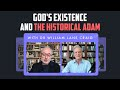

# Dr William Lane Craig Discusses God's Existence And The Historical Adam (2022-05-25)

## Description

Cosmological Argument (Stanford Encyclopedia of Philosophy): https://plato.stanford.edu/entries/cosmological-argument/

You Can Support My Work on Patreon:
https://www.patreon.com/Bloggingtheology

My Paypal Link: 
https://www.paypal.com/paypalme/bloggingtheology?locale.x=en_GB

## Summary of [Dr William Lane Craig Discusses God's Existence And The Historical Adam](https://www.youtube.com/watch?v=RCBG4Bx9HEI)

*This summary is AI generated - there may be inaccuracies. *

### [00:00:00](https://www.youtube.com/watch?v=RCBG4Bx9HEI&t=0) - [00:45:00](https://www.youtube.com/watch?v=RCBG4Bx9HEI&t=2700)

 Dr. William Lane Craig discusses the historicity of Adam and Eve, the fall of Adam and Eve, and the origins of humanity. He argues that the biblical stories exhibit family resemblances and mythological imagery, and that while some details of the story are meant to be taken figuratively, the fall itself is historicity. He also discusses how to discern which details of the story are meant to be taken figuratively and which are meant to be taken historically.

**[00:00:00](https://www.youtube.com/watch?v=RCBG4Bx9HEI&t=0)** The historical Adam is a topic of debate between Christian and Muslim theologians. Dr. William Lane Craig discusses the historical Adam and the cosmological argument for the existence of God. He explains that premise one of the argument is uncontested, but that there are several objections to the argument. He argues that premise two of the argument is true, and that from this, several theologically striking properties of the uncaused first cause of the universe emerge. He concludes that the argument is successful and proves the existence of a beginning, last, changeless, spaceless, timeless, personal creator of the universe.
* **[00:05:00](https://www.youtube.com/watch?v=RCBG4Bx9HEI&t=300)**  Dr. William Lane Craig discusses the principle of causation and how it applies to the existence of God. He points out that, according to the principle, everything that begins to exist has a cause, which appears to break down when things seemingly just come into existence out of nothing. However, he contends that this is not actually the case, as there are still ways for things to come into existence without a prior cause. He also points out that Lawrence Krauss's misuse of science in his book "A Universe from Nothing" does not undermine the principle. In fact, Craig argues that the principle is quite secure and there is no good reason to doubt its truth. Finally, he addresses an objection that suggests the conclusion of the argument (that an uncaused personal creator of the universe exists) is not a premise, which would seemingly lead to a non-sequitur. Craig responds by explaining that the conclusion is actually a premise, as it is the first premise of the argument. He goes on to argue that this god is still a way off from being the God of classical theism, let alone the God of the Abrahamic faiths.
* **[00:10:00](https://www.youtube.com/watch?v=RCBG4Bx9HEI&t=600)** Dr. William Lane Craig discusses the arguments for and against the historicity of Jesus Christ, and how most historians agree on the central historical facts surrounding his resurrection. He also discusses the importance of the disciples' belief in Jesus' resurrection, and how it establishes the plausibility of the argument for the existence of God.
* **[00:15:00](https://www.youtube.com/watch?v=RCBG4Bx9HEI&t=900)** Dr. William Lane Craig discusses the biblical and scientific evidence for the existence of Adam. He argues that the scriptural basis for Adam's existence is important for understanding the beginning of the Bible.
* **[00:20:00](https://www.youtube.com/watch?v=RCBG4Bx9HEI&t=1200)**  Dr. William Lane Craig discusses the biblical stories of God creating heaven and Earth, Adam and Eve, and the fall of Adam and Eve. He argues that these stories exhibit family resemblances and mythological imagery, and that while some details of the story are meant to be taken figuratively, the fall itself is historicity. He also discusses how to discern which details of the story are meant to be taken figuratively and which are meant to be taken historically.
* **[00:25:00](https://www.youtube.com/watch?v=RCBG4Bx9HEI&t=1500)**  Dr. William Lane Craig discusses the inconsistency and contradiction found in the narratives of the Bible, specifically in the accounts of creation and the history of Adam and Eve. He points out that this is due to the Bible's multiple authorship, which is evidence that it is not a single, unified work. Craig also discusses the source and form criticism of Genesis 1-11, which shows that the author(s) of these chapters had different backgrounds and outlooks on creation.
* **[00:30:00](https://www.youtube.com/watch?v=RCBG4Bx9HEI&t=1800)**  Dr. William Lane Craig discusses the historicity of Adam. He asserts that Adam was an historical individual who is mentioned in the New Testament, and that the question of when humanity originated on this planet is a scientific question, not a biblical question. He points out that there are two ways to determine when human beings first appeared on Earth- through anatomical similarity to us or through cognitive behaviors. He concludes that humanity did originate sometime in this window between Homo erectus and the cave paintings, and that the book he is writing will help close this window more tightly.
* **[00:35:00](https://www.youtube.com/watch?v=RCBG4Bx9HEI&t=2100)** Dr. William Lane Craig discusses the origins of humanity, pointing to evidence for symbolic thinking, technological innovation, and planning for the future found in archaeological signatures. He argues that humanity did not originate with Homo sapiens, but instead arose with Neandertals and their descendants Denisovans. The creation of Adam is a miracle according to the Quran.
* **[00:40:00](https://www.youtube.com/watch?v=RCBG4Bx9HEI&t=2400)** Dr. William Lane Craig discusses the existence of a historical Adam and Eve, and how this is consistent with what we know from modern paleoanthropology and evolutionary theory. If someone wishes to posit that the original members of Homo heidelbergensis were created miraculously by God, Craig is open to this idea. He also has plans to write a systematic philosophical theology, which he anticipates will take about 10 years to complete. Craig is a Christian and a dualist, and he finds great pleasure in this project.
* **[00:45:00](https://www.youtube.com/watch?v=RCBG4Bx9HEI&t=2700)** Dr. William Lane Craig discusses the history and arguments surrounding the existence of God. He encourages viewers to look at the evidence for and against God with an open mind and heart.

<h2>Full transcript with timestamps: CLICK TO EXPAND</h2>

[0:00:05](https://youtu.be/RCBG4Bx9HEI?t=5) well hello everyone and welcome to  
[0:00:07](https://youtu.be/RCBG4Bx9HEI?t=7) blogging theology today i am delighted  
[0:00:10](https://youtu.be/RCBG4Bx9HEI?t=10) to talk to dr william lane craig you are  
[0:00:13](https://youtu.be/RCBG4Bx9HEI?t=13) most welcome sir  
[0:00:15](https://youtu.be/RCBG4Bx9HEI?t=15) thank you paul  
[0:00:17](https://youtu.be/RCBG4Bx9HEI?t=17) um for those who don't know if there are  
[0:00:18](https://youtu.be/RCBG4Bx9HEI?t=18) any people out there dr craig is an  
[0:00:20](https://youtu.be/RCBG4Bx9HEI?t=20) american analytic philosopher and  
[0:00:23](https://youtu.be/RCBG4Bx9HEI?t=23) christian apologist he is visiting  
[0:00:25](https://youtu.be/RCBG4Bx9HEI?t=25) scholar of philosophy at the talbot  
[0:00:27](https://youtu.be/RCBG4Bx9HEI?t=27) school of theology and professor of  
[0:00:30](https://youtu.be/RCBG4Bx9HEI?t=30) philosophy at houston baptist university  
[0:00:34](https://youtu.be/RCBG4Bx9HEI?t=34) dr craig is probably the most prolific  
[0:00:36](https://youtu.be/RCBG4Bx9HEI?t=36) and well-known defender of a calam  
[0:00:38](https://youtu.be/RCBG4Bx9HEI?t=38) cosmological argument for the existence  
[0:00:41](https://youtu.be/RCBG4Bx9HEI?t=41) of god  
[0:00:42](https://youtu.be/RCBG4Bx9HEI?t=42) this argument was originally formulated  
[0:00:44](https://youtu.be/RCBG4Bx9HEI?t=44) by the famous muslim theologian and  
[0:00:46](https://youtu.be/RCBG4Bx9HEI?t=46) philosopher alcazali who died in a.d 11  
[0:00:50](https://youtu.be/RCBG4Bx9HEI?t=50) 11.  
[0:00:51](https://youtu.be/RCBG4Bx9HEI?t=51) but it has acquired a new lease of life  
[0:00:54](https://youtu.be/RCBG4Bx9HEI?t=54) thanks entirely to dr craig's celebrated  
[0:00:57](https://youtu.be/RCBG4Bx9HEI?t=57) and prolific defense of the argument  
[0:01:01](https://youtu.be/RCBG4Bx9HEI?t=61) today dr craig has kindly agreed to  
[0:01:03](https://youtu.be/RCBG4Bx9HEI?t=63) discuss two subjects  
[0:01:05](https://youtu.be/RCBG4Bx9HEI?t=65) firstly he will outline for us the calam  
[0:01:08](https://youtu.be/RCBG4Bx9HEI?t=68) cosmological argument for the existence  
[0:01:10](https://youtu.be/RCBG4Bx9HEI?t=70) of god and look perhaps at some of the  
[0:01:12](https://youtu.be/RCBG4Bx9HEI?t=72) objections that have been advanced  
[0:01:15](https://youtu.be/RCBG4Bx9HEI?t=75) against it  
[0:01:16](https://youtu.be/RCBG4Bx9HEI?t=76) and secondly we will discuss his latest  
[0:01:19](https://youtu.be/RCBG4Bx9HEI?t=79) book on his quest for the historical  
[0:01:22](https://youtu.be/RCBG4Bx9HEI?t=82) adam this is the first human being in  
[0:01:24](https://youtu.be/RCBG4Bx9HEI?t=84) the light of scripture christian  
[0:01:26](https://youtu.be/RCBG4Bx9HEI?t=86) scripture and modern science  
[0:01:30](https://youtu.be/RCBG4Bx9HEI?t=90) so dr craig to start with could you  
[0:01:33](https://youtu.be/RCBG4Bx9HEI?t=93) outline for us the historical origin of  
[0:01:36](https://youtu.be/RCBG4Bx9HEI?t=96) calam cosmological argument and what  
[0:01:38](https://youtu.be/RCBG4Bx9HEI?t=98) form the argument takes  
[0:01:41](https://youtu.be/RCBG4Bx9HEI?t=101) certainly  
[0:01:42](https://youtu.be/RCBG4Bx9HEI?t=102) the argument originated in the attempts  
[0:01:46](https://youtu.be/RCBG4Bx9HEI?t=106) of early  
[0:01:47](https://youtu.be/RCBG4Bx9HEI?t=107) christian commentators on aristotle  
[0:01:51](https://youtu.be/RCBG4Bx9HEI?t=111) to refute aristotle's doctrine of the  
[0:01:54](https://youtu.be/RCBG4Bx9HEI?t=114) eternity of the world aristotle believed  
[0:01:59](https://youtu.be/RCBG4Bx9HEI?t=119) that god and the universe were  
[0:02:01](https://youtu.be/RCBG4Bx9HEI?t=121) co-eternal  
[0:02:02](https://youtu.be/RCBG4Bx9HEI?t=122) and because of their commitment to the  
[0:02:05](https://youtu.be/RCBG4Bx9HEI?t=125) biblical doctrine of creation certain  
[0:02:07](https://youtu.be/RCBG4Bx9HEI?t=127) early christian commentators uh devised  
[0:02:11](https://youtu.be/RCBG4Bx9HEI?t=131) very clever and sophisticated arguments  
[0:02:14](https://youtu.be/RCBG4Bx9HEI?t=134) against the past eternity of the  
[0:02:16](https://youtu.be/RCBG4Bx9HEI?t=136) universe one of the most important of  
[0:02:18](https://youtu.be/RCBG4Bx9HEI?t=138) these was named john philopponus who  
[0:02:21](https://youtu.be/RCBG4Bx9HEI?t=141) died in the 5th century  
[0:02:23](https://youtu.be/RCBG4Bx9HEI?t=143) and this tradition  
[0:02:25](https://youtu.be/RCBG4Bx9HEI?t=145) was absorbed by islam when islam swept  
[0:02:29](https://youtu.be/RCBG4Bx9HEI?t=149) across egypt and alexandria where  
[0:02:32](https://youtu.be/RCBG4Bx9HEI?t=152) philoponus was active and it became the  
[0:02:37](https://youtu.be/RCBG4Bx9HEI?t=157) centerpiece of  
[0:02:39](https://youtu.be/RCBG4Bx9HEI?t=159) uh islamic um  
[0:02:41](https://youtu.be/RCBG4Bx9HEI?t=161) philosophy  
[0:02:43](https://youtu.be/RCBG4Bx9HEI?t=163) uh and natural theology and as you say  
[0:02:46](https://youtu.be/RCBG4Bx9HEI?t=166) it was developed into very sophisticated  
[0:02:48](https://youtu.be/RCBG4Bx9HEI?t=168) forms by someone like alhazali who was  
[0:02:52](https://youtu.be/RCBG4Bx9HEI?t=172) actually the heir to several centuries  
[0:02:55](https://youtu.be/RCBG4Bx9HEI?t=175) of tradition  
[0:02:56](https://youtu.be/RCBG4Bx9HEI?t=176) so it's an argument that has a great  
[0:02:58](https://youtu.be/RCBG4Bx9HEI?t=178) intersectarian appeal it's been  
[0:03:01](https://youtu.be/RCBG4Bx9HEI?t=181) propounded by jews by muslims by  
[0:03:05](https://youtu.be/RCBG4Bx9HEI?t=185) christians both catholic and protestant  
[0:03:09](https://youtu.be/RCBG4Bx9HEI?t=189) as for the formulation of the argument  
[0:03:11](https://youtu.be/RCBG4Bx9HEI?t=191) rosalie's  
[0:03:13](https://youtu.be/RCBG4Bx9HEI?t=193) formulation is perhaps the simplest and  
[0:03:15](https://youtu.be/RCBG4Bx9HEI?t=195) most accessible it goes like this  
[0:03:17](https://youtu.be/RCBG4Bx9HEI?t=197) premise one  
[0:03:19](https://youtu.be/RCBG4Bx9HEI?t=199) is that everything that begins to exist  
[0:03:23](https://youtu.be/RCBG4Bx9HEI?t=203) has a cause of its beginning  
[0:03:26](https://youtu.be/RCBG4Bx9HEI?t=206) premise two is that the universe began  
[0:03:29](https://youtu.be/RCBG4Bx9HEI?t=209) to exist  
[0:03:31](https://youtu.be/RCBG4Bx9HEI?t=211) and from that you can conclude three  
[0:03:33](https://youtu.be/RCBG4Bx9HEI?t=213) therefore the universe has a cause of  
[0:03:36](https://youtu.be/RCBG4Bx9HEI?t=216) its beginning and then you do a  
[0:03:38](https://youtu.be/RCBG4Bx9HEI?t=218) conceptual analysis of what it is to be  
[0:03:41](https://youtu.be/RCBG4Bx9HEI?t=221) a cause of the universe  
[0:03:43](https://youtu.be/RCBG4Bx9HEI?t=223) and several theologically striking  
[0:03:46](https://youtu.be/RCBG4Bx9HEI?t=226) properties of this  
[0:03:48](https://youtu.be/RCBG4Bx9HEI?t=228) uncaused first cause emerge from such an  
[0:03:52](https://youtu.be/RCBG4Bx9HEI?t=232) analysis the argument i think is  
[0:03:54](https://youtu.be/RCBG4Bx9HEI?t=234) successful proves the existence of a  
[0:03:58](https://youtu.be/RCBG4Bx9HEI?t=238) beginning last uncaused  
[0:04:02](https://youtu.be/RCBG4Bx9HEI?t=242) immaterial  
[0:04:03](https://youtu.be/RCBG4Bx9HEI?t=243) changeless  
[0:04:05](https://youtu.be/RCBG4Bx9HEI?t=245) spaceless  
[0:04:07](https://youtu.be/RCBG4Bx9HEI?t=247) timeless  
[0:04:09](https://youtu.be/RCBG4Bx9HEI?t=249) personal  
[0:04:10](https://youtu.be/RCBG4Bx9HEI?t=250) uh creator of the universe who is  
[0:04:13](https://youtu.be/RCBG4Bx9HEI?t=253) unimaginably powerful  
[0:04:16](https://youtu.be/RCBG4Bx9HEI?t=256) well that that's very helpful but  
[0:04:18](https://youtu.be/RCBG4Bx9HEI?t=258) looking at premise one there uh and  
[0:04:21](https://youtu.be/RCBG4Bx9HEI?t=261) they've been i've noticed in in looking  
[0:04:23](https://youtu.be/RCBG4Bx9HEI?t=263) uh into this a little bit of detail that  
[0:04:25](https://youtu.be/RCBG4Bx9HEI?t=265) every statement of the cosmological  
[0:04:27](https://youtu.be/RCBG4Bx9HEI?t=267) argument the kind of generic uh label  
[0:04:30](https://youtu.be/RCBG4Bx9HEI?t=270) for all the variants that we see  
[0:04:31](https://youtu.be/RCBG4Bx9HEI?t=271) including the kalam cosmological  
[0:04:33](https://youtu.be/RCBG4Bx9HEI?t=273) argument that they have been countered  
[0:04:34](https://youtu.be/RCBG4Bx9HEI?t=274) by others and then counter statements  
[0:04:36](https://youtu.be/RCBG4Bx9HEI?t=276) have been made and everything is  
[0:04:38](https://youtu.be/RCBG4Bx9HEI?t=278) contested but one of the i think one of  
[0:04:40](https://youtu.be/RCBG4Bx9HEI?t=280) the more interesting  
[0:04:42](https://youtu.be/RCBG4Bx9HEI?t=282) objections to premise one of your  
[0:04:45](https://youtu.be/RCBG4Bx9HEI?t=285) argument as you formulate it whatever  
[0:04:47](https://youtu.be/RCBG4Bx9HEI?t=287) begins to exist has a cause and a common  
[0:04:50](https://youtu.be/RCBG4Bx9HEI?t=290) objection appeals to the phenomenon of  
[0:04:53](https://youtu.be/RCBG4Bx9HEI?t=293) what's called quantum indeterminacy this  
[0:04:55](https://youtu.be/RCBG4Bx9HEI?t=295) is in physics obviously in quantum  
[0:04:57](https://youtu.be/RCBG4Bx9HEI?t=297) mechanics where at a subatomic level the  
[0:05:00](https://youtu.be/RCBG4Bx9HEI?t=300) causal principle everything that begins  
[0:05:02](https://youtu.be/RCBG4Bx9HEI?t=302) to exist has a cause  
[0:05:04](https://youtu.be/RCBG4Bx9HEI?t=304) appears to break down things apparently  
[0:05:07](https://youtu.be/RCBG4Bx9HEI?t=307) just come out of come into existence out  
[0:05:10](https://youtu.be/RCBG4Bx9HEI?t=310) of nothing almost ex nihilo and there's  
[0:05:13](https://youtu.be/RCBG4Bx9HEI?t=313) a famous founder of this um uh lawrence  
[0:05:16](https://youtu.be/RCBG4Bx9HEI?t=316) krauss the canadian american physicist  
[0:05:18](https://youtu.be/RCBG4Bx9HEI?t=318) and cosmologist in his book which is  
[0:05:20](https://youtu.be/RCBG4Bx9HEI?t=320) entitled a universe from nothing he  
[0:05:23](https://youtu.be/RCBG4Bx9HEI?t=323) actually literally states at least the  
[0:05:25](https://youtu.be/RCBG4Bx9HEI?t=325) title states that something came from  
[0:05:27](https://youtu.be/RCBG4Bx9HEI?t=327) nothing and this would appear to uh a  
[0:05:30](https://youtu.be/RCBG4Bx9HEI?t=330) challenge the the the premise the first  
[0:05:32](https://youtu.be/RCBG4Bx9HEI?t=332) premise of your argument how would you  
[0:05:34](https://youtu.be/RCBG4Bx9HEI?t=334) respond to that  
[0:05:35](https://youtu.be/RCBG4Bx9HEI?t=335) well i think uh there are a number of  
[0:05:37](https://youtu.be/RCBG4Bx9HEI?t=337) ways to respond  
[0:05:38](https://youtu.be/RCBG4Bx9HEI?t=338) in the first place we need to understand  
[0:05:41](https://youtu.be/RCBG4Bx9HEI?t=341) that any physical theory  
[0:05:43](https://youtu.be/RCBG4Bx9HEI?t=343) is comprised of a mathematical core the  
[0:05:47](https://youtu.be/RCBG4Bx9HEI?t=347) equations that are the center of the  
[0:05:50](https://youtu.be/RCBG4Bx9HEI?t=350) theory and then there is a physical  
[0:05:52](https://youtu.be/RCBG4Bx9HEI?t=352) interpretation of that theory  
[0:05:54](https://youtu.be/RCBG4Bx9HEI?t=354) and in fact with respect to quantum  
[0:05:57](https://youtu.be/RCBG4Bx9HEI?t=357) mechanics there are at least 10  
[0:06:01](https://youtu.be/RCBG4Bx9HEI?t=361) different  
[0:06:02](https://youtu.be/RCBG4Bx9HEI?t=362) physical interpretations of the  
[0:06:04](https://youtu.be/RCBG4Bx9HEI?t=364) mathematical core of that theory and  
[0:06:06](https://youtu.be/RCBG4Bx9HEI?t=366) some of these uh theories are fully  
[0:06:09](https://youtu.be/RCBG4Bx9HEI?t=369) deterministic theories so it's simply  
[0:06:13](https://youtu.be/RCBG4Bx9HEI?t=373) not true  
[0:06:14](https://youtu.be/RCBG4Bx9HEI?t=374) that  
[0:06:15](https://youtu.be/RCBG4Bx9HEI?t=375) um  
[0:06:16](https://youtu.be/RCBG4Bx9HEI?t=376) quantum mechanics is a proven counter  
[0:06:18](https://youtu.be/RCBG4Bx9HEI?t=378) example to the principle that every  
[0:06:22](https://youtu.be/RCBG4Bx9HEI?t=382) event or everything that begins to exist  
[0:06:24](https://youtu.be/RCBG4Bx9HEI?t=384) has a cause  
[0:06:26](https://youtu.be/RCBG4Bx9HEI?t=386) secondly  
[0:06:27](https://youtu.be/RCBG4Bx9HEI?t=387) the premise is formulated in such a way  
[0:06:30](https://youtu.be/RCBG4Bx9HEI?t=390) as to allow for there to be on caused  
[0:06:33](https://youtu.be/RCBG4Bx9HEI?t=393) events it the premise is not every event  
[0:06:36](https://youtu.be/RCBG4Bx9HEI?t=396) has a cause but everything that begins  
[0:06:39](https://youtu.be/RCBG4Bx9HEI?t=399) to exist has a cause that is to say  
[0:06:42](https://youtu.be/RCBG4Bx9HEI?t=402) things can't come into being  
[0:06:46](https://youtu.be/RCBG4Bx9HEI?t=406) without some sort of causal  
[0:06:48](https://youtu.be/RCBG4Bx9HEI?t=408) antecedents but that's perfectly  
[0:06:51](https://youtu.be/RCBG4Bx9HEI?t=411) uh consistent with saying that the time  
[0:06:54](https://youtu.be/RCBG4Bx9HEI?t=414) of uh the decay of a radioactive isotope  
[0:06:57](https://youtu.be/RCBG4Bx9HEI?t=417) for example is indeterminate um  
[0:07:00](https://youtu.be/RCBG4Bx9HEI?t=420) what the  
[0:07:01](https://youtu.be/RCBG4Bx9HEI?t=421) premise excludes is that things  
[0:07:04](https://youtu.be/RCBG4Bx9HEI?t=424) substances can come into being out of  
[0:07:06](https://youtu.be/RCBG4Bx9HEI?t=426) nothing  
[0:07:07](https://youtu.be/RCBG4Bx9HEI?t=427) and that leads me to lawrence krauss's  
[0:07:10](https://youtu.be/RCBG4Bx9HEI?t=430) uh  
[0:07:11](https://youtu.be/RCBG4Bx9HEI?t=431) deliberate misuse of science in this  
[0:07:13](https://youtu.be/RCBG4Bx9HEI?t=433) regard  
[0:07:14](https://youtu.be/RCBG4Bx9HEI?t=434) krause knows  
[0:07:17](https://youtu.be/RCBG4Bx9HEI?t=437) that the word nothing as he uses it is  
[0:07:20](https://youtu.be/RCBG4Bx9HEI?t=440) being used equivocally he does not mean  
[0:07:23](https://youtu.be/RCBG4Bx9HEI?t=443) non-being or not anything what krause is  
[0:07:28](https://youtu.be/RCBG4Bx9HEI?t=448) talking about is either the quantum  
[0:07:31](https://youtu.be/RCBG4Bx9HEI?t=451) vacuum or quantum mechanical fields  
[0:07:35](https://youtu.be/RCBG4Bx9HEI?t=455) which are quite definitely  
[0:07:38](https://youtu.be/RCBG4Bx9HEI?t=458) something  
[0:07:39](https://youtu.be/RCBG4Bx9HEI?t=459) so his models do not in any way suggest  
[0:07:43](https://youtu.be/RCBG4Bx9HEI?t=463) that it's plausible  
[0:07:45](https://youtu.be/RCBG4Bx9HEI?t=465) that the universe could come into being  
[0:07:47](https://youtu.be/RCBG4Bx9HEI?t=467) from literally nothing that is to say  
[0:07:50](https://youtu.be/RCBG4Bx9HEI?t=470) non-being indeed when you think about it  
[0:07:52](https://youtu.be/RCBG4Bx9HEI?t=472) paul  
[0:07:53](https://youtu.be/RCBG4Bx9HEI?t=473) there is no physics of non-being  
[0:07:56](https://youtu.be/RCBG4Bx9HEI?t=476) physics only applies  
[0:07:59](https://youtu.be/RCBG4Bx9HEI?t=479) the moment the universe begins to exist  
[0:08:01](https://youtu.be/RCBG4Bx9HEI?t=481) so it's  
[0:08:03](https://youtu.be/RCBG4Bx9HEI?t=483) impossible for there to be a physical  
[0:08:05](https://youtu.be/RCBG4Bx9HEI?t=485) explanation  
[0:08:06](https://youtu.be/RCBG4Bx9HEI?t=486) of how the universe could originate from  
[0:08:08](https://youtu.be/RCBG4Bx9HEI?t=488) nothing that's a meta physical question  
[0:08:11](https://youtu.be/RCBG4Bx9HEI?t=491) perhaps the the title i don't know maybe  
[0:08:13](https://youtu.be/RCBG4Bx9HEI?t=493) the publisher uh rather than himself uh  
[0:08:15](https://youtu.be/RCBG4Bx9HEI?t=495) who knows thought of the the title of  
[0:08:17](https://youtu.be/RCBG4Bx9HEI?t=497) the book a universe from nothing but  
[0:08:18](https://youtu.be/RCBG4Bx9HEI?t=498) nothing doesn't really mean nothing  
[0:08:20](https://youtu.be/RCBG4Bx9HEI?t=500) because there is a cons you spoke of a  
[0:08:22](https://youtu.be/RCBG4Bx9HEI?t=502) quantum field which is something  
[0:08:24](https://youtu.be/RCBG4Bx9HEI?t=504) i don't know if it has mass or not but  
[0:08:25](https://youtu.be/RCBG4Bx9HEI?t=505) presumably there's energy that there's  
[0:08:28](https://youtu.be/RCBG4Bx9HEI?t=508) probability waves whatever there's  
[0:08:30](https://youtu.be/RCBG4Bx9HEI?t=510) something going on there which is not  
[0:08:32](https://youtu.be/RCBG4Bx9HEI?t=512) nothing so exactly so your your premise  
[0:08:35](https://youtu.be/RCBG4Bx9HEI?t=515) then premise one would would seem  
[0:08:38](https://youtu.be/RCBG4Bx9HEI?t=518) therefore to  
[0:08:39](https://youtu.be/RCBG4Bx9HEI?t=519) to not be defeated  
[0:08:42](https://youtu.be/RCBG4Bx9HEI?t=522) exactly so long as we understand that  
[0:08:44](https://youtu.be/RCBG4Bx9HEI?t=524) premise one  
[0:08:46](https://youtu.be/RCBG4Bx9HEI?t=526) expresses a metaphysical principle  
[0:08:49](https://youtu.be/RCBG4Bx9HEI?t=529) uh i think that it's quite secure  
[0:08:52](https://youtu.be/RCBG4Bx9HEI?t=532) and that there is no good reason to  
[0:08:54](https://youtu.be/RCBG4Bx9HEI?t=534) doubt its truth  
[0:08:55](https://youtu.be/RCBG4Bx9HEI?t=535) um  
[0:08:57](https://youtu.be/RCBG4Bx9HEI?t=537) another objection which is what one i i  
[0:08:58](https://youtu.be/RCBG4Bx9HEI?t=538) think has some uh some plausibility uh  
[0:09:02](https://youtu.be/RCBG4Bx9HEI?t=542) unlike perhaps clausius krause's one is  
[0:09:05](https://youtu.be/RCBG4Bx9HEI?t=545) your characterization your conclusion  
[0:09:07](https://youtu.be/RCBG4Bx9HEI?t=547) rather this is not a premise there's a  
[0:09:08](https://youtu.be/RCBG4Bx9HEI?t=548) conclusion  
[0:09:09](https://youtu.be/RCBG4Bx9HEI?t=549) that uh therefore  
[0:09:12](https://youtu.be/RCBG4Bx9HEI?t=552) ergo an uncaused personal creator of the  
[0:09:14](https://youtu.be/RCBG4Bx9HEI?t=554) universe exists  
[0:09:16](https://youtu.be/RCBG4Bx9HEI?t=556) um  
[0:09:17](https://youtu.be/RCBG4Bx9HEI?t=557) now i don't quite get  
[0:09:19](https://youtu.be/RCBG4Bx9HEI?t=559) the it seemed a little bit like a  
[0:09:21](https://youtu.be/RCBG4Bx9HEI?t=561) non-sequitur  
[0:09:22](https://youtu.be/RCBG4Bx9HEI?t=562) i i okay i grant that you've established  
[0:09:25](https://youtu.be/RCBG4Bx9HEI?t=565) that there is an uncaused cause  
[0:09:27](https://youtu.be/RCBG4Bx9HEI?t=567) unnecessary being perhaps i see that  
[0:09:29](https://youtu.be/RCBG4Bx9HEI?t=569) from the contingency of the universe but  
[0:09:31](https://youtu.be/RCBG4Bx9HEI?t=571) to describe this god in with all the  
[0:09:34](https://youtu.be/RCBG4Bx9HEI?t=574) adjectives that you attribute to it or  
[0:09:36](https://youtu.be/RCBG4Bx9HEI?t=576) him uh shall we say  
[0:09:38](https://youtu.be/RCBG4Bx9HEI?t=578) is still quite a way i think from the  
[0:09:40](https://youtu.be/RCBG4Bx9HEI?t=580) god of classical theism let alone the  
[0:09:43](https://youtu.be/RCBG4Bx9HEI?t=583) god of the abrahamic faith the god of  
[0:09:45](https://youtu.be/RCBG4Bx9HEI?t=585) abraham of isaac  
[0:09:47](https://youtu.be/RCBG4Bx9HEI?t=587) and and so on uh there seems to be quite  
[0:09:50](https://youtu.be/RCBG4Bx9HEI?t=590) a gap um a metaphysical gap or that you  
[0:09:53](https://youtu.be/RCBG4Bx9HEI?t=593) haven't quite  
[0:09:54](https://youtu.be/RCBG4Bx9HEI?t=594) justified in any detailed way  
[0:09:57](https://youtu.be/RCBG4Bx9HEI?t=597) um could you elaborate why why you think  
[0:10:00](https://youtu.be/RCBG4Bx9HEI?t=600) therefore uh the god of abraham to give  
[0:10:02](https://youtu.be/RCBG4Bx9HEI?t=602) begin  
[0:10:04](https://youtu.be/RCBG4Bx9HEI?t=604) actually i have elaborated this in quite  
[0:10:06](https://youtu.be/RCBG4Bx9HEI?t=606) a detailed way  
[0:10:08](https://youtu.be/RCBG4Bx9HEI?t=608) in my published work but this tends to  
[0:10:10](https://youtu.be/RCBG4Bx9HEI?t=610) be ignored  
[0:10:12](https://youtu.be/RCBG4Bx9HEI?t=612) by people who are just responding  
[0:10:15](https://youtu.be/RCBG4Bx9HEI?t=615) on youtube videos i go through each of  
[0:10:18](https://youtu.be/RCBG4Bx9HEI?t=618) those properties that i mentioned  
[0:10:20](https://youtu.be/RCBG4Bx9HEI?t=620) timeless spaceless uncaused immaterial  
[0:10:24](https://youtu.be/RCBG4Bx9HEI?t=624) enormously powerful  
[0:10:26](https://youtu.be/RCBG4Bx9HEI?t=626) and give  
[0:10:27](https://youtu.be/RCBG4Bx9HEI?t=627) philosophical arguments as to why  
[0:10:30](https://youtu.be/RCBG4Bx9HEI?t=630) this first uncaused cause must have that  
[0:10:32](https://youtu.be/RCBG4Bx9HEI?t=632) property in particular and this is very  
[0:10:35](https://youtu.be/RCBG4Bx9HEI?t=635) important  
[0:10:36](https://youtu.be/RCBG4Bx9HEI?t=636) i give three independent arguments as to  
[0:10:40](https://youtu.be/RCBG4Bx9HEI?t=640) why this cause must be personal so that  
[0:10:43](https://youtu.be/RCBG4Bx9HEI?t=643) we're brought not merely to some sort of  
[0:10:45](https://youtu.be/RCBG4Bx9HEI?t=645) an impersonal first principle but to a  
[0:10:48](https://youtu.be/RCBG4Bx9HEI?t=648) personal creator of the universe and so  
[0:10:51](https://youtu.be/RCBG4Bx9HEI?t=651) i would refer  
[0:10:52](https://youtu.be/RCBG4Bx9HEI?t=652) our listeners today to my book  
[0:10:55](https://youtu.be/RCBG4Bx9HEI?t=655) reasonable faith  
[0:10:57](https://youtu.be/RCBG4Bx9HEI?t=657) look at the chapter on the arguments for  
[0:10:59](https://youtu.be/RCBG4Bx9HEI?t=659) god's existence and you'll find these  
[0:11:01](https://youtu.be/RCBG4Bx9HEI?t=661) laid out  
[0:11:02](https://youtu.be/RCBG4Bx9HEI?t=662) now in making the transition to the god  
[0:11:05](https://youtu.be/RCBG4Bx9HEI?t=665) of the abrahamic religions  
[0:11:08](https://youtu.be/RCBG4Bx9HEI?t=668) there i think the argument doesn't take  
[0:11:10](https://youtu.be/RCBG4Bx9HEI?t=670) you that far the argument gives you a  
[0:11:12](https://youtu.be/RCBG4Bx9HEI?t=672) kind of generic theism  
[0:11:15](https://youtu.be/RCBG4Bx9HEI?t=675) that is common to all of the world's  
[0:11:17](https://youtu.be/RCBG4Bx9HEI?t=677) great monotheistic faiths including  
[0:11:20](https://youtu.be/RCBG4Bx9HEI?t=680) deism deism would be perfectly  
[0:11:22](https://youtu.be/RCBG4Bx9HEI?t=682) consistent with the argument to move to  
[0:11:25](https://youtu.be/RCBG4Bx9HEI?t=685) the abrahamic faiths i think we have to  
[0:11:28](https://youtu.be/RCBG4Bx9HEI?t=688) look at the person of jesus of nazareth  
[0:11:31](https://youtu.be/RCBG4Bx9HEI?t=691) and ask ourself who was  
[0:11:34](https://youtu.be/RCBG4Bx9HEI?t=694) jesus of nazareth because he claimed to  
[0:11:36](https://youtu.be/RCBG4Bx9HEI?t=696) be  
[0:11:37](https://youtu.be/RCBG4Bx9HEI?t=697) the exclusive and decisive revelation of  
[0:11:41](https://youtu.be/RCBG4Bx9HEI?t=701) the god of the universe  
[0:11:43](https://youtu.be/RCBG4Bx9HEI?t=703) and so it will be on that basis i think  
[0:11:46](https://youtu.be/RCBG4Bx9HEI?t=706) that we will determine whether or not  
[0:11:48](https://youtu.be/RCBG4Bx9HEI?t=708) deism or judaism or  
[0:11:51](https://youtu.be/RCBG4Bx9HEI?t=711) islam or  
[0:11:52](https://youtu.be/RCBG4Bx9HEI?t=712) christianity  
[0:11:54](https://youtu.be/RCBG4Bx9HEI?t=714) is true and as you know as a christian  
[0:11:56](https://youtu.be/RCBG4Bx9HEI?t=716) philosopher i'm persuaded that uh  
[0:11:59](https://youtu.be/RCBG4Bx9HEI?t=719) christianity gives us the best account  
[0:12:02](https://youtu.be/RCBG4Bx9HEI?t=722) of who the historical person jesus of  
[0:12:04](https://youtu.be/RCBG4Bx9HEI?t=724) nazareth was  
[0:12:06](https://youtu.be/RCBG4Bx9HEI?t=726) yeah and that is of course as a separate  
[0:12:08](https://youtu.be/RCBG4Bx9HEI?t=728) argument from the cosmological argument  
[0:12:10](https://youtu.be/RCBG4Bx9HEI?t=730) which is to do uh with the existence of  
[0:12:12](https://youtu.be/RCBG4Bx9HEI?t=732) uncaused cause the the arguments for uh  
[0:12:15](https://youtu.be/RCBG4Bx9HEI?t=735) and against the uh  
[0:12:17](https://youtu.be/RCBG4Bx9HEI?t=737) who jesus was an historical person are a  
[0:12:20](https://youtu.be/RCBG4Bx9HEI?t=740) separate set of considerations and have  
[0:12:21](https://youtu.be/RCBG4Bx9HEI?t=741) been investigated by biblical  
[0:12:23](https://youtu.be/RCBG4Bx9HEI?t=743) scholarship the last two thousand years  
[0:12:25](https://youtu.be/RCBG4Bx9HEI?t=745) and uh but many historians have  
[0:12:27](https://youtu.be/RCBG4Bx9HEI?t=747) concluded that jesus himself didn't  
[0:12:28](https://youtu.be/RCBG4Bx9HEI?t=748) think he was god for example but that  
[0:12:30](https://youtu.be/RCBG4Bx9HEI?t=750) that that's a a separate uh issue from  
[0:12:33](https://youtu.be/RCBG4Bx9HEI?t=753) this uh that this argument is  
[0:12:35](https://youtu.be/RCBG4Bx9HEI?t=755) after i finished my  
[0:12:37](https://youtu.be/RCBG4Bx9HEI?t=757) doctoral work on the kalam cosmological  
[0:12:40](https://youtu.be/RCBG4Bx9HEI?t=760) argument at the university of birmingham  
[0:12:42](https://youtu.be/RCBG4Bx9HEI?t=762) under john hick we moved to germany and  
[0:12:45](https://youtu.be/RCBG4Bx9HEI?t=765) i did my doctoral work in theology  
[0:12:48](https://youtu.be/RCBG4Bx9HEI?t=768) under wallhack pollenbach on this very  
[0:12:51](https://youtu.be/RCBG4Bx9HEI?t=771) question of the historicity of the  
[0:12:53](https://youtu.be/RCBG4Bx9HEI?t=773) resurrection of jesus so those two  
[0:12:56](https://youtu.be/RCBG4Bx9HEI?t=776) bodies of work complement  
[0:12:59](https://youtu.be/RCBG4Bx9HEI?t=779) each other in making  
[0:13:01](https://youtu.be/RCBG4Bx9HEI?t=781) a full-orbed case for the christian  
[0:13:04](https://youtu.be/RCBG4Bx9HEI?t=784) faith i think i think someone might say  
[0:13:06](https://youtu.be/RCBG4Bx9HEI?t=786) that your your your arguments you per  
[0:13:09](https://youtu.be/RCBG4Bx9HEI?t=789) pound for the cosmological uh argument  
[0:13:11](https://youtu.be/RCBG4Bx9HEI?t=791) the clan cosmological argument are are  
[0:13:13](https://youtu.be/RCBG4Bx9HEI?t=793) very good that they are  
[0:13:15](https://youtu.be/RCBG4Bx9HEI?t=795) they are highly respected um generate a  
[0:13:18](https://youtu.be/RCBG4Bx9HEI?t=798) great deal of interest and have a lot of  
[0:13:19](https://youtu.be/RCBG4Bx9HEI?t=799) plausibility rigorous philosophy i think  
[0:13:22](https://youtu.be/RCBG4Bx9HEI?t=802) the argument for the historical jesus  
[0:13:24](https://youtu.be/RCBG4Bx9HEI?t=804) believed that he was god for example and  
[0:13:26](https://youtu.be/RCBG4Bx9HEI?t=806) this is a separate issue we're not  
[0:13:28](https://youtu.be/RCBG4Bx9HEI?t=808) discussing us today on are not are not  
[0:13:30](https://youtu.be/RCBG4Bx9HEI?t=810) beliefs that are widely held by  
[0:13:32](https://youtu.be/RCBG4Bx9HEI?t=812) uh historical historical jesus for  
[0:13:35](https://youtu.be/RCBG4Bx9HEI?t=815) example ep saunders and and others  
[0:13:38](https://youtu.be/RCBG4Bx9HEI?t=818) you said we weren't going to discuss it  
[0:13:40](https://youtu.be/RCBG4Bx9HEI?t=820) but you just said something there that i  
[0:13:42](https://youtu.be/RCBG4Bx9HEI?t=822) need to respond to  
[0:13:44](https://youtu.be/RCBG4Bx9HEI?t=824) one of the surprising things that came  
[0:13:47](https://youtu.be/RCBG4Bx9HEI?t=827) out of this study at the university of  
[0:13:49](https://youtu.be/RCBG4Bx9HEI?t=829) munich  
[0:13:50](https://youtu.be/RCBG4Bx9HEI?t=830) was the realization that the central  
[0:13:52](https://youtu.be/RCBG4Bx9HEI?t=832) historical facts that undergird the  
[0:13:55](https://youtu.be/RCBG4Bx9HEI?t=835) inference to jesus resurrection  
[0:13:57](https://youtu.be/RCBG4Bx9HEI?t=837) are in fact agreed upon  
[0:14:00](https://youtu.be/RCBG4Bx9HEI?t=840) by the wide majority of new testament  
[0:14:04](https://youtu.be/RCBG4Bx9HEI?t=844) critics today and these would be  
[0:14:07](https://youtu.be/RCBG4Bx9HEI?t=847) the honorable burial of jesus by joseph  
[0:14:09](https://youtu.be/RCBG4Bx9HEI?t=849) of arimathea in a tomb  
[0:14:12](https://youtu.be/RCBG4Bx9HEI?t=852) the discovery of the empty tomb by a  
[0:14:14](https://youtu.be/RCBG4Bx9HEI?t=854) group of jesus women followers on the  
[0:14:16](https://youtu.be/RCBG4Bx9HEI?t=856) first day of the week after his  
[0:14:18](https://youtu.be/RCBG4Bx9HEI?t=858) crucifixion  
[0:14:19](https://youtu.be/RCBG4Bx9HEI?t=859) the  
[0:14:20](https://youtu.be/RCBG4Bx9HEI?t=860) post-mortem appearances of jesus to  
[0:14:22](https://youtu.be/RCBG4Bx9HEI?t=862) various individuals and groups and then  
[0:14:25](https://youtu.be/RCBG4Bx9HEI?t=865) finally number four um the  
[0:14:29](https://youtu.be/RCBG4Bx9HEI?t=869) very origin  
[0:14:31](https://youtu.be/RCBG4Bx9HEI?t=871) of the disciples belief  
[0:14:33](https://youtu.be/RCBG4Bx9HEI?t=873) that god raised jesus from the dead  
[0:14:35](https://youtu.be/RCBG4Bx9HEI?t=875) despite every predisposition to the  
[0:14:37](https://youtu.be/RCBG4Bx9HEI?t=877) contrary so i think the historical facts  
[0:14:40](https://youtu.be/RCBG4Bx9HEI?t=880) are  
[0:14:41](https://youtu.be/RCBG4Bx9HEI?t=881) pretty  
[0:14:42](https://youtu.be/RCBG4Bx9HEI?t=882) firmly established the question is  
[0:14:45](https://youtu.be/RCBG4Bx9HEI?t=885) what's the best explanation of those and  
[0:14:47](https://youtu.be/RCBG4Bx9HEI?t=887) there you're quite right in saying that  
[0:14:49](https://youtu.be/RCBG4Bx9HEI?t=889) a good many scholars will say well  
[0:14:51](https://youtu.be/RCBG4Bx9HEI?t=891) that's not for us as historians  
[0:14:55](https://youtu.be/RCBG4Bx9HEI?t=895) to speak to that that's a different  
[0:14:57](https://youtu.be/RCBG4Bx9HEI?t=897) question and so they will remain  
[0:14:59](https://youtu.be/RCBG4Bx9HEI?t=899) agnostic about it  
[0:15:01](https://youtu.be/RCBG4Bx9HEI?t=901) i wasn't referring to the resurrection  
[0:15:03](https://youtu.be/RCBG4Bx9HEI?t=903) at all i i was talking about christology  
[0:15:05](https://youtu.be/RCBG4Bx9HEI?t=905) the understanding who the person and  
[0:15:06](https://youtu.be/RCBG4Bx9HEI?t=906) nature of jesus and my impression i i  
[0:15:09](https://youtu.be/RCBG4Bx9HEI?t=909) could be wrong and the reason i mention  
[0:15:11](https://youtu.be/RCBG4Bx9HEI?t=911) this is to the the the riga the  
[0:15:13](https://youtu.be/RCBG4Bx9HEI?t=913) philosophical rigor of the other climb  
[0:15:14](https://youtu.be/RCBG4Bx9HEI?t=914) argument that as you articulated is very  
[0:15:16](https://youtu.be/RCBG4Bx9HEI?t=916) strong i think but yeah  
[0:15:19](https://youtu.be/RCBG4Bx9HEI?t=919) to couple that uh  
[0:15:20](https://youtu.be/RCBG4Bx9HEI?t=920) as if they had equal um uh probative um  
[0:15:24](https://youtu.be/RCBG4Bx9HEI?t=924) strength with a a claim that jesus uh  
[0:15:28](https://youtu.be/RCBG4Bx9HEI?t=928) claimed to be god  
[0:15:29](https://youtu.be/RCBG4Bx9HEI?t=929) i'm not talking about the resurrection  
[0:15:30](https://youtu.be/RCBG4Bx9HEI?t=930) god it is something i don't find in in  
[0:15:33](https://youtu.be/RCBG4Bx9HEI?t=933) his in mainstream historical research at  
[0:15:35](https://youtu.be/RCBG4Bx9HEI?t=935) all in fact the consensus as i  
[0:15:38](https://youtu.be/RCBG4Bx9HEI?t=938) understand it is that jesus understood  
[0:15:40](https://youtu.be/RCBG4Bx9HEI?t=940) himself to be a prophet an  
[0:15:42](https://youtu.be/RCBG4Bx9HEI?t=942) eschatological problem that seems to be  
[0:15:43](https://youtu.be/RCBG4Bx9HEI?t=943) the overwhelming consensus of scotland  
[0:15:45](https://youtu.be/RCBG4Bx9HEI?t=945) rather than uh the second person of the  
[0:15:47](https://youtu.be/RCBG4Bx9HEI?t=947) trinity and so on the argument about the  
[0:15:49](https://youtu.be/RCBG4Bx9HEI?t=949) resurrection is a separate issue to do  
[0:15:50](https://youtu.be/RCBG4Bx9HEI?t=950) with an historical event which  
[0:15:52](https://youtu.be/RCBG4Bx9HEI?t=952) the historical critical method as you  
[0:15:54](https://youtu.be/RCBG4Bx9HEI?t=954) know better than i is not really able to  
[0:15:56](https://youtu.be/RCBG4Bx9HEI?t=956) address because how do you address a  
[0:15:58](https://youtu.be/RCBG4Bx9HEI?t=958) supernatural uh you may think there are  
[0:16:00](https://youtu.be/RCBG4Bx9HEI?t=960) very good arguments for it by the way  
[0:16:02](https://youtu.be/RCBG4Bx9HEI?t=962) but but but the the point i'm making is  
[0:16:05](https://youtu.be/RCBG4Bx9HEI?t=965) uh your initial claim  
[0:16:07](https://youtu.be/RCBG4Bx9HEI?t=967) that jesus uh thought he was god or was  
[0:16:10](https://youtu.be/RCBG4Bx9HEI?t=970) god uh uh the god that that the  
[0:16:13](https://youtu.be/RCBG4Bx9HEI?t=973) cosmological argument points to and i i  
[0:16:16](https://youtu.be/RCBG4Bx9HEI?t=976) think one argument is much stronger than  
[0:16:18](https://youtu.be/RCBG4Bx9HEI?t=978) the other uh in terms of the academic  
[0:16:21](https://youtu.be/RCBG4Bx9HEI?t=981) work that i've looked at well i would  
[0:16:23](https://youtu.be/RCBG4Bx9HEI?t=983) invite readers again to read what i've  
[0:16:26](https://youtu.be/RCBG4Bx9HEI?t=986) written on this  
[0:16:27](https://youtu.be/RCBG4Bx9HEI?t=987) this  
[0:16:28](https://youtu.be/RCBG4Bx9HEI?t=988) i published my doctoral work that was  
[0:16:30](https://youtu.be/RCBG4Bx9HEI?t=990) done at munich i think it's rigorous  
[0:16:33](https://youtu.be/RCBG4Bx9HEI?t=993) and i don't claim that jesus  
[0:16:35](https://youtu.be/RCBG4Bx9HEI?t=995) claimed to be god what i argue is that  
[0:16:38](https://youtu.be/RCBG4Bx9HEI?t=998) jesus claimed to be  
[0:16:40](https://youtu.be/RCBG4Bx9HEI?t=1000) the jewish messiah  
[0:16:41](https://youtu.be/RCBG4Bx9HEI?t=1001) the son of god in a unique sense and  
[0:16:45](https://youtu.be/RCBG4Bx9HEI?t=1005) the  
[0:16:46](https://youtu.be/RCBG4Bx9HEI?t=1006) son of man prophesied by the prophet  
[0:16:49](https://youtu.be/RCBG4Bx9HEI?t=1009) daniel  
[0:16:51](https://youtu.be/RCBG4Bx9HEI?t=1011) and that these  
[0:16:52](https://youtu.be/RCBG4Bx9HEI?t=1012) radical personal claims were ratified by  
[0:16:56](https://youtu.be/RCBG4Bx9HEI?t=1016) god's raising him from the dead so that  
[0:16:58](https://youtu.be/RCBG4Bx9HEI?t=1018) we have good reason to believe  
[0:17:00](https://youtu.be/RCBG4Bx9HEI?t=1020) that jesus is in fact god's decisive  
[0:17:04](https://youtu.be/RCBG4Bx9HEI?t=1024) revelation to us uh in human history  
[0:17:07](https://youtu.be/RCBG4Bx9HEI?t=1027) yeah they claim that he was uh believed  
[0:17:09](https://youtu.be/RCBG4Bx9HEI?t=1029) himself to be a messiah or seen as a  
[0:17:11](https://youtu.be/RCBG4Bx9HEI?t=1031) mascara figure is is is is more uh  
[0:17:13](https://youtu.be/RCBG4Bx9HEI?t=1033) widely accepted by historians than the  
[0:17:15](https://youtu.be/RCBG4Bx9HEI?t=1035) characters  
[0:17:17](https://youtu.be/RCBG4Bx9HEI?t=1037) of god or believes himself to be god i  
[0:17:19](https://youtu.be/RCBG4Bx9HEI?t=1039) think it's that claim that i  
[0:17:21](https://youtu.be/RCBG4Bx9HEI?t=1041) i i i was surprised to see you uh  
[0:17:23](https://youtu.be/RCBG4Bx9HEI?t=1043) putting on the same level as your the  
[0:17:25](https://youtu.be/RCBG4Bx9HEI?t=1045) very strong uh those were your words  
[0:17:28](https://youtu.be/RCBG4Bx9HEI?t=1048) paul i didn't say that  
[0:17:30](https://youtu.be/RCBG4Bx9HEI?t=1050) um said was that we have good reason to  
[0:17:33](https://youtu.be/RCBG4Bx9HEI?t=1053) believe that jesus is  
[0:17:35](https://youtu.be/RCBG4Bx9HEI?t=1055) the decisive revelation of god  
[0:17:38](https://youtu.be/RCBG4Bx9HEI?t=1058) to us and i think that's on the basis of  
[0:17:41](https://youtu.be/RCBG4Bx9HEI?t=1061) the personal claims i mentioned and then  
[0:17:43](https://youtu.be/RCBG4Bx9HEI?t=1063) god's raising him from the dead um  
[0:17:47](https://youtu.be/RCBG4Bx9HEI?t=1067) and i i i think that this excludes  
[0:17:50](https://youtu.be/RCBG4Bx9HEI?t=1070) looking at jesus as merely a human  
[0:17:52](https://youtu.be/RCBG4Bx9HEI?t=1072) prophet  
[0:17:54](https://youtu.be/RCBG4Bx9HEI?t=1074) in my opinion  
[0:17:55](https://youtu.be/RCBG4Bx9HEI?t=1075) we're always not here to debate that but  
[0:17:57](https://youtu.be/RCBG4Bx9HEI?t=1077) i thank you for your clarification of  
[0:17:59](https://youtu.be/RCBG4Bx9HEI?t=1079) exactly what you you do believe that's  
[0:18:01](https://youtu.be/RCBG4Bx9HEI?t=1081) extremely useful uh on the subject of  
[0:18:03](https://youtu.be/RCBG4Bx9HEI?t=1083) very useful things i i have looked at  
[0:18:05](https://youtu.be/RCBG4Bx9HEI?t=1085) the uh the stanford encyclopedia of  
[0:18:06](https://youtu.be/RCBG4Bx9HEI?t=1086) philosophy the online uh article on the  
[0:18:10](https://youtu.be/RCBG4Bx9HEI?t=1090) cosmological argument because there  
[0:18:12](https://youtu.be/RCBG4Bx9HEI?t=1092) isn't a thing called the cosmological  
[0:18:14](https://youtu.be/RCBG4Bx9HEI?t=1094) argument i've discovered is actually  
[0:18:15](https://youtu.be/RCBG4Bx9HEI?t=1095) that's more like a type of argument and  
[0:18:17](https://youtu.be/RCBG4Bx9HEI?t=1097) there are many discrete variants uh or  
[0:18:20](https://youtu.be/RCBG4Bx9HEI?t=1100) instantiations or manifestations of this  
[0:18:23](https://youtu.be/RCBG4Bx9HEI?t=1103) uh  
[0:18:24](https://youtu.be/RCBG4Bx9HEI?t=1104) argument of this type anyway the stamped  
[0:18:26](https://youtu.be/RCBG4Bx9HEI?t=1106) encyclopedia philosophy online has a  
[0:18:28](https://youtu.be/RCBG4Bx9HEI?t=1108) very useful article i think uh  
[0:18:30](https://youtu.be/RCBG4Bx9HEI?t=1110) discussion of how the argument developed  
[0:18:32](https://youtu.be/RCBG4Bx9HEI?t=1112) from plato and aristotle through  
[0:18:34](https://youtu.be/RCBG4Bx9HEI?t=1114) alcazali who we mentioned hume of course  
[0:18:37](https://youtu.be/RCBG4Bx9HEI?t=1117) and kant had a great deal to write about  
[0:18:38](https://youtu.be/RCBG4Bx9HEI?t=1118) it up to the lively contemporary debate  
[0:18:41](https://youtu.be/RCBG4Bx9HEI?t=1121) to which dr craig has made such a  
[0:18:43](https://youtu.be/RCBG4Bx9HEI?t=1123) seminal uh contribution so i i do i  
[0:18:46](https://youtu.be/RCBG4Bx9HEI?t=1126) don't know what you recommend that or  
[0:18:47](https://youtu.be/RCBG4Bx9HEI?t=1127) not but i thought it was a a very very  
[0:18:49](https://youtu.be/RCBG4Bx9HEI?t=1129) uh helpful article and you just googled  
[0:18:51](https://youtu.be/RCBG4Bx9HEI?t=1131) the stanford video philosophy so and he  
[0:18:53](https://youtu.be/RCBG4Bx9HEI?t=1133) mentioned you many times across so um  
[0:18:56](https://youtu.be/RCBG4Bx9HEI?t=1136) well thank you very past moving on to  
[0:18:58](https://youtu.be/RCBG4Bx9HEI?t=1138) the uh our second subject for discussion  
[0:19:01](https://youtu.be/RCBG4Bx9HEI?t=1141) and this is your latest book uh  
[0:19:03](https://youtu.be/RCBG4Bx9HEI?t=1143) published just last year um entitled um  
[0:19:06](https://youtu.be/RCBG4Bx9HEI?t=1146) i like the title actually in  
[0:19:08](https://youtu.be/RCBG4Bx9HEI?t=1148) question in quest of the historical adam  
[0:19:11](https://youtu.be/RCBG4Bx9HEI?t=1151) a biblical and scientific expert the  
[0:19:13](https://youtu.be/RCBG4Bx9HEI?t=1153) reason i like it is because obviously  
[0:19:15](https://youtu.be/RCBG4Bx9HEI?t=1155) you're referring um to the the classic  
[0:19:18](https://youtu.be/RCBG4Bx9HEI?t=1158) in the question of the historical jesus  
[0:19:20](https://youtu.be/RCBG4Bx9HEI?t=1160) and you're exactly very good paul i'm  
[0:19:22](https://youtu.be/RCBG4Bx9HEI?t=1162) glad you picked out on that that that is  
[0:19:25](https://youtu.be/RCBG4Bx9HEI?t=1165) a a an interesting um  
[0:19:27](https://youtu.be/RCBG4Bx9HEI?t=1167) reference there to to that and i like i  
[0:19:29](https://youtu.be/RCBG4Bx9HEI?t=1169) like that anyway in in this book which i  
[0:19:31](https://youtu.be/RCBG4Bx9HEI?t=1171) confess i i have not read but um so  
[0:19:34](https://youtu.be/RCBG4Bx9HEI?t=1174) apologies for that um where you set out  
[0:19:36](https://youtu.be/RCBG4Bx9HEI?t=1176) i'm told you set out to answer the  
[0:19:38](https://youtu.be/RCBG4Bx9HEI?t=1178) questions about adam now this is the  
[0:19:40](https://youtu.be/RCBG4Bx9HEI?t=1180) first human being of course through a  
[0:19:43](https://youtu.be/RCBG4Bx9HEI?t=1183) detailed biblical and scientific  
[0:19:45](https://youtu.be/RCBG4Bx9HEI?t=1185) investigation so i think a really  
[0:19:48](https://youtu.be/RCBG4Bx9HEI?t=1188) important place to begin our discussion  
[0:19:50](https://youtu.be/RCBG4Bx9HEI?t=1190) is to understand the scriptural basis of  
[0:19:53](https://youtu.be/RCBG4Bx9HEI?t=1193) this and um obviously adam has referred  
[0:19:55](https://youtu.be/RCBG4Bx9HEI?t=1195) to the beginning of the bible in a book  
[0:19:57](https://youtu.be/RCBG4Bx9HEI?t=1197) called genesis the first book of the  
[0:19:58](https://youtu.be/RCBG4Bx9HEI?t=1198) bible in the beginning god created the  
[0:20:00](https://youtu.be/RCBG4Bx9HEI?t=1200) heavens and the earth and he created  
[0:20:01](https://youtu.be/RCBG4Bx9HEI?t=1201) adam and eve this is found in genesis 1  
[0:20:04](https://youtu.be/RCBG4Bx9HEI?t=1204) to 11. they're usually treated as a a a  
[0:20:07](https://youtu.be/RCBG4Bx9HEI?t=1207) a discrete uh section like that by  
[0:20:09](https://youtu.be/RCBG4Bx9HEI?t=1209) scholars so according to biblical  
[0:20:11](https://youtu.be/RCBG4Bx9HEI?t=1211) scholar what kind of literature is it  
[0:20:13](https://youtu.be/RCBG4Bx9HEI?t=1213) what kind of genre is genesis chapters 1  
[0:20:16](https://youtu.be/RCBG4Bx9HEI?t=1216) to 11  
[0:20:17](https://youtu.be/RCBG4Bx9HEI?t=1217) this is the critical question for the  
[0:20:20](https://youtu.be/RCBG4Bx9HEI?t=1220) interpretation of these passages  
[0:20:23](https://youtu.be/RCBG4Bx9HEI?t=1223) and i argue in the book  
[0:20:25](https://youtu.be/RCBG4Bx9HEI?t=1225) that  
[0:20:27](https://youtu.be/RCBG4Bx9HEI?t=1227) these chapters exhibit  
[0:20:30](https://youtu.be/RCBG4Bx9HEI?t=1230) family resemblances  
[0:20:32](https://youtu.be/RCBG4Bx9HEI?t=1232) belonging to  
[0:20:34](https://youtu.be/RCBG4Bx9HEI?t=1234) ancient near eastern and contemporary  
[0:20:37](https://youtu.be/RCBG4Bx9HEI?t=1237) myths  
[0:20:38](https://youtu.be/RCBG4Bx9HEI?t=1238) especially these narratives try to  
[0:20:41](https://youtu.be/RCBG4Bx9HEI?t=1241) ground  
[0:20:42](https://youtu.be/RCBG4Bx9HEI?t=1242) the realities and the values  
[0:20:45](https://youtu.be/RCBG4Bx9HEI?t=1245) of the contemporary author in his  
[0:20:47](https://youtu.be/RCBG4Bx9HEI?t=1247) society  
[0:20:49](https://youtu.be/RCBG4Bx9HEI?t=1249) in events of the deep primordial past  
[0:20:52](https://youtu.be/RCBG4Bx9HEI?t=1252) this is called etiology and the this  
[0:20:55](https://youtu.be/RCBG4Bx9HEI?t=1255) motif of etiology permeates  
[0:20:59](https://youtu.be/RCBG4Bx9HEI?t=1259) these first 11 chapters of genesis and  
[0:21:02](https://youtu.be/RCBG4Bx9HEI?t=1262) yet at the same time these stories also  
[0:21:05](https://youtu.be/RCBG4Bx9HEI?t=1265) are structured  
[0:21:06](https://youtu.be/RCBG4Bx9HEI?t=1266) along a kind of backbone  
[0:21:09](https://youtu.be/RCBG4Bx9HEI?t=1269) of genealogies listing historical  
[0:21:12](https://youtu.be/RCBG4Bx9HEI?t=1272) persons  
[0:21:14](https://youtu.be/RCBG4Bx9HEI?t=1274) and their descendants which terminate in  
[0:21:17](https://youtu.be/RCBG4Bx9HEI?t=1277) indisputably uh historical persons like  
[0:21:21](https://youtu.be/RCBG4Bx9HEI?t=1281) abraham  
[0:21:22](https://youtu.be/RCBG4Bx9HEI?t=1282) and so  
[0:21:23](https://youtu.be/RCBG4Bx9HEI?t=1283) i accept the genre analysis  
[0:21:26](https://youtu.be/RCBG4Bx9HEI?t=1286) uh called mytho history  
[0:21:29](https://youtu.be/RCBG4Bx9HEI?t=1289) uh  
[0:21:30](https://youtu.be/RCBG4Bx9HEI?t=1290) that is to say these are  
[0:21:32](https://youtu.be/RCBG4Bx9HEI?t=1292) stories about events and people  
[0:21:35](https://youtu.be/RCBG4Bx9HEI?t=1295) that really happened really lived  
[0:21:38](https://youtu.be/RCBG4Bx9HEI?t=1298) but it is told in the figurative and  
[0:21:42](https://youtu.be/RCBG4Bx9HEI?t=1302) colorful and imaginative language of  
[0:21:44](https://youtu.be/RCBG4Bx9HEI?t=1304) myth  
[0:21:46](https://youtu.be/RCBG4Bx9HEI?t=1306) um well that's very teasing very teasing  
[0:21:48](https://youtu.be/RCBG4Bx9HEI?t=1308) indeed  
[0:21:50](https://youtu.be/RCBG4Bx9HEI?t=1310) just like one thing i might disagree  
[0:21:52](https://youtu.be/RCBG4Bx9HEI?t=1312) with you on that about the indisputable  
[0:21:54](https://youtu.be/RCBG4Bx9HEI?t=1314) historicity of abraham  
[0:21:56](https://youtu.be/RCBG4Bx9HEI?t=1316) one of the things that shocked me when i  
[0:21:57](https://youtu.be/RCBG4Bx9HEI?t=1317) went to university and i was asked to  
[0:21:59](https://youtu.be/RCBG4Bx9HEI?t=1319) write an essay on exeter exodus of  
[0:22:01](https://youtu.be/RCBG4Bx9HEI?t=1321) israel from egypt and by moses when i  
[0:22:04](https://youtu.be/RCBG4Bx9HEI?t=1324) was told very clearly by my professors  
[0:22:06](https://youtu.be/RCBG4Bx9HEI?t=1326) the most the existence of moses was far  
[0:22:09](https://youtu.be/RCBG4Bx9HEI?t=1329) from being an accepted historical  
[0:22:11](https://youtu.be/RCBG4Bx9HEI?t=1331) reality and moses were much later than  
[0:22:14](https://youtu.be/RCBG4Bx9HEI?t=1334) abraham um i think people like abraham  
[0:22:16](https://youtu.be/RCBG4Bx9HEI?t=1336) and moses are usually seen now this  
[0:22:18](https://youtu.be/RCBG4Bx9HEI?t=1338) there are some have been developments  
[0:22:19](https://youtu.be/RCBG4Bx9HEI?t=1339) recently where some prominent uh experts  
[0:22:22](https://youtu.be/RCBG4Bx9HEI?t=1342) in the field are now talking about the  
[0:22:24](https://youtu.be/RCBG4Bx9HEI?t=1344) evidence for moses existing and i i on  
[0:22:26](https://youtu.be/RCBG4Bx9HEI?t=1346) faith believe that abraham existed of  
[0:22:28](https://youtu.be/RCBG4Bx9HEI?t=1348) course but i'm not sure it's an  
[0:22:30](https://youtu.be/RCBG4Bx9HEI?t=1350) historically established figure in  
[0:22:32](https://youtu.be/RCBG4Bx9HEI?t=1352) history yeah  
[0:22:33](https://youtu.be/RCBG4Bx9HEI?t=1353) abraham  
[0:22:34](https://youtu.be/RCBG4Bx9HEI?t=1354) that's that's a very fair comment and i  
[0:22:36](https://youtu.be/RCBG4Bx9HEI?t=1356) think  
[0:22:37](https://youtu.be/RCBG4Bx9HEI?t=1357) um  
[0:22:38](https://youtu.be/RCBG4Bx9HEI?t=1358) if i were to rephrase what i just said  
[0:22:41](https://youtu.be/RCBG4Bx9HEI?t=1361) i would say that the genealogies um  
[0:22:44](https://youtu.be/RCBG4Bx9HEI?t=1364) terminate in persons who are  
[0:22:47](https://youtu.be/RCBG4Bx9HEI?t=1367) indisputably presented as historical  
[0:22:50](https://youtu.be/RCBG4Bx9HEI?t=1370) characters  
[0:22:52](https://youtu.be/RCBG4Bx9HEI?t=1372) as opposed to say mythical figures uh  
[0:22:56](https://youtu.be/RCBG4Bx9HEI?t=1376) abraham and and his descendants are not  
[0:22:59](https://youtu.be/RCBG4Bx9HEI?t=1379) presented  
[0:23:00](https://youtu.be/RCBG4Bx9HEI?t=1380) as  
[0:23:01](https://youtu.be/RCBG4Bx9HEI?t=1381) mythological figures but as real  
[0:23:04](https://youtu.be/RCBG4Bx9HEI?t=1384) historical persons who give rise to  
[0:23:07](https://youtu.be/RCBG4Bx9HEI?t=1387) uh the nation of israel so i i accept  
[0:23:10](https://youtu.be/RCBG4Bx9HEI?t=1390) your your correction uh in in that well  
[0:23:14](https://youtu.be/RCBG4Bx9HEI?t=1394) that's very gracious but i i just want  
[0:23:15](https://youtu.be/RCBG4Bx9HEI?t=1395) to also clarify what elements then of  
[0:23:18](https://youtu.be/RCBG4Bx9HEI?t=1398) the genesis story of adam and eve of  
[0:23:20](https://youtu.be/RCBG4Bx9HEI?t=1400) course and there are two creation  
[0:23:21](https://youtu.be/RCBG4Bx9HEI?t=1401) narratives but presumably you're  
[0:23:23](https://youtu.be/RCBG4Bx9HEI?t=1403) alluding to the second creation story  
[0:23:24](https://youtu.be/RCBG4Bx9HEI?t=1404) rather than the first one for your  
[0:23:26](https://youtu.be/RCBG4Bx9HEI?t=1406) detailed understand  
[0:23:28](https://youtu.be/RCBG4Bx9HEI?t=1408) how much of that is myth and how much of  
[0:23:29](https://youtu.be/RCBG4Bx9HEI?t=1409) that is history and more importantly how  
[0:23:31](https://youtu.be/RCBG4Bx9HEI?t=1411) how on earth does one make that that  
[0:23:33](https://youtu.be/RCBG4Bx9HEI?t=1413) decision how does one hermeneutically  
[0:23:35](https://youtu.be/RCBG4Bx9HEI?t=1415) engage the text and says well this  
[0:23:37](https://youtu.be/RCBG4Bx9HEI?t=1417) element the eating of the of the the the  
[0:23:40](https://youtu.be/RCBG4Bx9HEI?t=1420) fruit  
[0:23:41](https://youtu.be/RCBG4Bx9HEI?t=1421) uh is myth i don't know what you believe  
[0:23:43](https://youtu.be/RCBG4Bx9HEI?t=1423) on this but say it is but the fall  
[0:23:45](https://youtu.be/RCBG4Bx9HEI?t=1425) itself is history because the fall  
[0:23:47](https://youtu.be/RCBG4Bx9HEI?t=1427) itself of adam and eve is a prerequisite  
[0:23:50](https://youtu.be/RCBG4Bx9HEI?t=1430) it's a really absolute um foundation for  
[0:23:53](https://youtu.be/RCBG4Bx9HEI?t=1433) christian soteriology uh obviously as  
[0:23:56](https://youtu.be/RCBG4Bx9HEI?t=1436) presents in the new testament that you  
[0:23:58](https://youtu.be/RCBG4Bx9HEI?t=1438) have a fall and then you have the second  
[0:23:59](https://youtu.be/RCBG4Bx9HEI?t=1439) adam the second adam yes with him jesus  
[0:24:02](https://youtu.be/RCBG4Bx9HEI?t=1442) i mean um so you've got to have that but  
[0:24:06](https://youtu.be/RCBG4Bx9HEI?t=1446) are you saying that these details of the  
[0:24:07](https://youtu.be/RCBG4Bx9HEI?t=1447) fruit and the tree and the serpent and  
[0:24:10](https://youtu.be/RCBG4Bx9HEI?t=1450) whatnot are not historical and myth is  
[0:24:13](https://youtu.be/RCBG4Bx9HEI?t=1453) that your argument or yes that is my my  
[0:24:15](https://youtu.be/RCBG4Bx9HEI?t=1455) position i would say that these are  
[0:24:18](https://youtu.be/RCBG4Bx9HEI?t=1458) mythic images  
[0:24:20](https://youtu.be/RCBG4Bx9HEI?t=1460) in which the story of the fall is told  
[0:24:24](https://youtu.be/RCBG4Bx9HEI?t=1464) so that while there was an adam and eve  
[0:24:27](https://youtu.be/RCBG4Bx9HEI?t=1467) who did commit some sort of sin  
[0:24:30](https://youtu.be/RCBG4Bx9HEI?t=1470) against god i think this is told in the  
[0:24:33](https://youtu.be/RCBG4Bx9HEI?t=1473) dramatic imagery of a tree of good and  
[0:24:36](https://youtu.be/RCBG4Bx9HEI?t=1476) evil and then a tree of life and a  
[0:24:39](https://youtu.be/RCBG4Bx9HEI?t=1479) talking snake who seems to be a symbol  
[0:24:42](https://youtu.be/RCBG4Bx9HEI?t=1482) of evil and so forth uh and i suggest a  
[0:24:45](https://youtu.be/RCBG4Bx9HEI?t=1485) number of ways in which one can discern  
[0:24:48](https://youtu.be/RCBG4Bx9HEI?t=1488) which portions of the narrative are  
[0:24:52](https://youtu.be/RCBG4Bx9HEI?t=1492) meant to be understood figuratively and  
[0:24:55](https://youtu.be/RCBG4Bx9HEI?t=1495) which are not  
[0:24:57](https://youtu.be/RCBG4Bx9HEI?t=1497) three my question how how do you make  
[0:24:59](https://youtu.be/RCBG4Bx9HEI?t=1499) that hermeneutical move how do you  
[0:25:01](https://youtu.be/RCBG4Bx9HEI?t=1501) discern what is and what isn't so that  
[0:25:03](https://youtu.be/RCBG4Bx9HEI?t=1503) was really my question well one way  
[0:25:05](https://youtu.be/RCBG4Bx9HEI?t=1505) would be  
[0:25:06](https://youtu.be/RCBG4Bx9HEI?t=1506) when  
[0:25:07](https://youtu.be/RCBG4Bx9HEI?t=1507) the narratives relate things that are  
[0:25:10](https://youtu.be/RCBG4Bx9HEI?t=1510) explicitly contradictory to what the  
[0:25:12](https://youtu.be/RCBG4Bx9HEI?t=1512) author of the pentateuch believes and a  
[0:25:16](https://youtu.be/RCBG4Bx9HEI?t=1516) great example of this  
[0:25:18](https://youtu.be/RCBG4Bx9HEI?t=1518) would be that in chapter one  
[0:25:20](https://youtu.be/RCBG4Bx9HEI?t=1520) he presents this image or picture of god  
[0:25:24](https://youtu.be/RCBG4Bx9HEI?t=1524) as a transcendent  
[0:25:26](https://youtu.be/RCBG4Bx9HEI?t=1526) creator of the universe in the beginning  
[0:25:29](https://youtu.be/RCBG4Bx9HEI?t=1529) god created the heavens and the earth so  
[0:25:32](https://youtu.be/RCBG4Bx9HEI?t=1532) we have here this transcendent god who  
[0:25:35](https://youtu.be/RCBG4Bx9HEI?t=1535) creates all of the universe but in  
[0:25:38](https://youtu.be/RCBG4Bx9HEI?t=1538) chapters two and three and the stories  
[0:25:40](https://youtu.be/RCBG4Bx9HEI?t=1540) of adam and eve you have these very  
[0:25:44](https://youtu.be/RCBG4Bx9HEI?t=1544) anthropomorphic descriptions of god  
[0:25:47](https://youtu.be/RCBG4Bx9HEI?t=1547) as a sort of finite humanoid  
[0:25:50](https://youtu.be/RCBG4Bx9HEI?t=1550) a deity who is walking in the garden who  
[0:25:53](https://youtu.be/RCBG4Bx9HEI?t=1553) forms adam out of the dust of the ground  
[0:25:56](https://youtu.be/RCBG4Bx9HEI?t=1556) who does  
[0:25:56](https://youtu.be/RCBG4Bx9HEI?t=1556) surgery on adam and takes out a rib and  
[0:25:59](https://youtu.be/RCBG4Bx9HEI?t=1559) makes a woman who is walking in the  
[0:26:02](https://youtu.be/RCBG4Bx9HEI?t=1562) garden in the cool of the day calling  
[0:26:04](https://youtu.be/RCBG4Bx9HEI?t=1564) out to adam and this is clearly  
[0:26:06](https://youtu.be/RCBG4Bx9HEI?t=1566) incompatible with what the pentateuch  
[0:26:09](https://youtu.be/RCBG4Bx9HEI?t=1569) author himself  
[0:26:10](https://youtu.be/RCBG4Bx9HEI?t=1570) believes about god and so i think gives  
[0:26:13](https://youtu.be/RCBG4Bx9HEI?t=1573) us indication that these  
[0:26:15](https://youtu.be/RCBG4Bx9HEI?t=1575) descriptions should be understood as  
[0:26:17](https://youtu.be/RCBG4Bx9HEI?t=1577) anthropomorphic  
[0:26:19](https://youtu.be/RCBG4Bx9HEI?t=1579) uh imagery  
[0:26:21](https://youtu.be/RCBG4Bx9HEI?t=1581) essentially john calvin i remember  
[0:26:23](https://youtu.be/RCBG4Bx9HEI?t=1583) rightly the uh the reformation uh  
[0:26:25](https://youtu.be/RCBG4Bx9HEI?t=1585) scholar and pastor and so on uh if i  
[0:26:27](https://youtu.be/RCBG4Bx9HEI?t=1587) remember at least in english  
[0:26:29](https://youtu.be/RCBG4Bx9HEI?t=1589) remarking on this kind of language in  
[0:26:31](https://youtu.be/RCBG4Bx9HEI?t=1591) the second the two creation accounts  
[0:26:33](https://youtu.be/RCBG4Bx9HEI?t=1593) people may not know this in genesis it's  
[0:26:35](https://youtu.be/RCBG4Bx9HEI?t=1595) not like there's just one account of god  
[0:26:37](https://youtu.be/RCBG4Bx9HEI?t=1597) creating adam and eve there are two  
[0:26:39](https://youtu.be/RCBG4Bx9HEI?t=1599) accounts  
[0:26:40](https://youtu.be/RCBG4Bx9HEI?t=1600) and some scholars would say that they  
[0:26:41](https://youtu.be/RCBG4Bx9HEI?t=1601) are mutually contradictory and you seem  
[0:26:43](https://youtu.be/RCBG4Bx9HEI?t=1603) to be implying that they are  
[0:26:44](https://youtu.be/RCBG4Bx9HEI?t=1604) contradictory so you prefer one the  
[0:26:47](https://youtu.be/RCBG4Bx9HEI?t=1607) earlier rather than not the  
[0:26:48](https://youtu.be/RCBG4Bx9HEI?t=1608) chronologically early i mean chapter one  
[0:26:51](https://youtu.be/RCBG4Bx9HEI?t=1611) rather than chapter two um but  
[0:26:54](https://youtu.be/RCBG4Bx9HEI?t=1614) calvin seemed to be suggests that god  
[0:26:56](https://youtu.be/RCBG4Bx9HEI?t=1616) uses language he lisps uh to his  
[0:27:00](https://youtu.be/RCBG4Bx9HEI?t=1620) children he uses languages that  
[0:27:02](https://youtu.be/RCBG4Bx9HEI?t=1622) people can understand not sophisticated  
[0:27:05](https://youtu.be/RCBG4Bx9HEI?t=1625) intellectuals but  
[0:27:07](https://youtu.be/RCBG4Bx9HEI?t=1627) so-called ordinary people can relate to  
[0:27:09](https://youtu.be/RCBG4Bx9HEI?t=1629) this and this was the purpose in using  
[0:27:11](https://youtu.be/RCBG4Bx9HEI?t=1631) this language which um is not to be  
[0:27:14](https://youtu.be/RCBG4Bx9HEI?t=1634) taken i i think he's implying but he  
[0:27:16](https://youtu.be/RCBG4Bx9HEI?t=1636) didn't say this not to be taken with you  
[0:27:18](https://youtu.be/RCBG4Bx9HEI?t=1638) know scientific precision perhaps  
[0:27:21](https://youtu.be/RCBG4Bx9HEI?t=1641) yes i that's exactly right this is the  
[0:27:23](https://youtu.be/RCBG4Bx9HEI?t=1643) so-called accommodation  
[0:27:25](https://youtu.be/RCBG4Bx9HEI?t=1645) theory of inspiration  
[0:27:27](https://youtu.be/RCBG4Bx9HEI?t=1647) uh and it that has to be true when you  
[0:27:30](https://youtu.be/RCBG4Bx9HEI?t=1650) think about it even in revealing himself  
[0:27:34](https://youtu.be/RCBG4Bx9HEI?t=1654) in hebrew or greek  
[0:27:37](https://youtu.be/RCBG4Bx9HEI?t=1657) god is already accommodating himself  
[0:27:40](https://youtu.be/RCBG4Bx9HEI?t=1660) to the limits of human language  
[0:27:43](https://youtu.be/RCBG4Bx9HEI?t=1663) and it's not at all surprising  
[0:27:45](https://youtu.be/RCBG4Bx9HEI?t=1665) that god would further accommodate  
[0:27:48](https://youtu.be/RCBG4Bx9HEI?t=1668) himself in  
[0:27:49](https://youtu.be/RCBG4Bx9HEI?t=1669) um  
[0:27:50](https://youtu.be/RCBG4Bx9HEI?t=1670) making things so simple that  
[0:27:53](https://youtu.be/RCBG4Bx9HEI?t=1673) everyone can understand them and not  
[0:27:54](https://youtu.be/RCBG4Bx9HEI?t=1674) just  
[0:27:55](https://youtu.be/RCBG4Bx9HEI?t=1675) philosophers or modern physicists  
[0:27:59](https://youtu.be/RCBG4Bx9HEI?t=1679) yeah i think that's as a huge huge  
[0:28:01](https://youtu.be/RCBG4Bx9HEI?t=1681) really uh but of course the the the  
[0:28:04](https://youtu.be/RCBG4Bx9HEI?t=1684) standard academic uh uh understanding of  
[0:28:06](https://youtu.be/RCBG4Bx9HEI?t=1686) the pentateuch which you uh mentioned is  
[0:28:08](https://youtu.be/RCBG4Bx9HEI?t=1688) the so-called documentary hypothesis  
[0:28:10](https://youtu.be/RCBG4Bx9HEI?t=1690) that in fact we we're actually seeing  
[0:28:12](https://youtu.be/RCBG4Bx9HEI?t=1692) at least four um separate distinct  
[0:28:15](https://youtu.be/RCBG4Bx9HEI?t=1695) authors jepd now i know this has come  
[0:28:17](https://youtu.be/RCBG4Bx9HEI?t=1697) under some criticism and there have been  
[0:28:19](https://youtu.be/RCBG4Bx9HEI?t=1699) some refinements of it but nevertheless  
[0:28:21](https://youtu.be/RCBG4Bx9HEI?t=1701) the fundamentals still seem to be intact  
[0:28:23](https://youtu.be/RCBG4Bx9HEI?t=1703) in old testament studies the idea that  
[0:28:25](https://youtu.be/RCBG4Bx9HEI?t=1705) that moses is definitely not the author  
[0:28:27](https://youtu.be/RCBG4Bx9HEI?t=1707) of of genesis or pentateuch at all the  
[0:28:30](https://youtu.be/RCBG4Bx9HEI?t=1710) first five books of moses i mean he  
[0:28:32](https://youtu.be/RCBG4Bx9HEI?t=1712) didn't actually write them indeed  
[0:28:33](https://youtu.be/RCBG4Bx9HEI?t=1713) nowhere in the book does it claim that  
[0:28:35](https://youtu.be/RCBG4Bx9HEI?t=1715) he did write them and uh so  
[0:28:38](https://youtu.be/RCBG4Bx9HEI?t=1718) it the point i'm getting at here is not  
[0:28:40](https://youtu.be/RCBG4Bx9HEI?t=1720) just to mention that the authorship  
[0:28:42](https://youtu.be/RCBG4Bx9HEI?t=1722) question is quite interesting uh that  
[0:28:44](https://youtu.be/RCBG4Bx9HEI?t=1724) moses didn't write any of this anyway it  
[0:28:46](https://youtu.be/RCBG4Bx9HEI?t=1726) would seem according to most scholars  
[0:28:48](https://youtu.be/RCBG4Bx9HEI?t=1728) today but that this second creation  
[0:28:50](https://youtu.be/RCBG4Bx9HEI?t=1730) account is written by someone other than  
[0:28:52](https://youtu.be/RCBG4Bx9HEI?t=1732) the first creation account and so it's  
[0:28:55](https://youtu.be/RCBG4Bx9HEI?t=1735) not surprising we had two different  
[0:28:56](https://youtu.be/RCBG4Bx9HEI?t=1736) people with different outlooks and  
[0:28:58](https://youtu.be/RCBG4Bx9HEI?t=1738) understandings of creation and god  
[0:29:00](https://youtu.be/RCBG4Bx9HEI?t=1740) himself one very transcendent  
[0:29:03](https://youtu.be/RCBG4Bx9HEI?t=1743) uh of a very uh  
[0:29:05](https://youtu.be/RCBG4Bx9HEI?t=1745) very uh attractive to philosophers and  
[0:29:08](https://youtu.be/RCBG4Bx9HEI?t=1748) the second very anthropomorphic as you  
[0:29:10](https://youtu.be/RCBG4Bx9HEI?t=1750) say where god is portrayed in a humanoid  
[0:29:13](https://youtu.be/RCBG4Bx9HEI?t=1753) figure who gets involved in the you know  
[0:29:16](https://youtu.be/RCBG4Bx9HEI?t=1756) asking what where are you adam are you  
[0:29:18](https://youtu.be/RCBG4Bx9HEI?t=1758) sort of asking in the call of the day  
[0:29:19](https://youtu.be/RCBG4Bx9HEI?t=1759) you know um  
[0:29:21](https://youtu.be/RCBG4Bx9HEI?t=1761) a very very different portrayal so what  
[0:29:23](https://youtu.be/RCBG4Bx9HEI?t=1763) would another way of looking at this be  
[0:29:25](https://youtu.be/RCBG4Bx9HEI?t=1765) to say we're we're looking at a  
[0:29:26](https://youtu.be/RCBG4Bx9HEI?t=1766) scripture which is not entirely  
[0:29:29](https://youtu.be/RCBG4Bx9HEI?t=1769) harmonious and consistent because of its  
[0:29:31](https://youtu.be/RCBG4Bx9HEI?t=1771) multiple authorship by different people  
[0:29:33](https://youtu.be/RCBG4Bx9HEI?t=1773) with different views of god the eloise  
[0:29:36](https://youtu.be/RCBG4Bx9HEI?t=1776) the priestly the yahwest the  
[0:29:38](https://youtu.be/RCBG4Bx9HEI?t=1778) deuteronomist i mean these are these the  
[0:29:39](https://youtu.be/RCBG4Bx9HEI?t=1779) technical terms for the four documentary  
[0:29:42](https://youtu.be/RCBG4Bx9HEI?t=1782) authors of documentary hypothesis  
[0:29:45](https://youtu.be/RCBG4Bx9HEI?t=1785) would you become uh  
[0:29:46](https://youtu.be/RCBG4Bx9HEI?t=1786) i have a nice discussion in the book  
[0:29:49](https://youtu.be/RCBG4Bx9HEI?t=1789) about the sources behind genesis 1 to 11  
[0:29:52](https://youtu.be/RCBG4Bx9HEI?t=1792) in terms of both source criticism  
[0:29:55](https://youtu.be/RCBG4Bx9HEI?t=1795) and form criticism  
[0:29:57](https://youtu.be/RCBG4Bx9HEI?t=1797) and fortunately with genesis 1 to 11  
[0:30:00](https://youtu.be/RCBG4Bx9HEI?t=1800) which is the center of our attention  
[0:30:02](https://youtu.be/RCBG4Bx9HEI?t=1802) only the j  
[0:30:04](https://youtu.be/RCBG4Bx9HEI?t=1804) source and the p source come into view  
[0:30:08](https://youtu.be/RCBG4Bx9HEI?t=1808) the other two don't even play a role in  
[0:30:11](https://youtu.be/RCBG4Bx9HEI?t=1811) genesis 1 to 11 and so can be left aside  
[0:30:14](https://youtu.be/RCBG4Bx9HEI?t=1814) and  
[0:30:16](https://youtu.be/RCBG4Bx9HEI?t=1816) there's no  
[0:30:17](https://youtu.be/RCBG4Bx9HEI?t=1817) reason  
[0:30:18](https://youtu.be/RCBG4Bx9HEI?t=1818) or or argument or evidence that these  
[0:30:21](https://youtu.be/RCBG4Bx9HEI?t=1821) are in fact written documents rather  
[0:30:24](https://youtu.be/RCBG4Bx9HEI?t=1824) than oral traditions  
[0:30:26](https://youtu.be/RCBG4Bx9HEI?t=1826) which were then collected uh and put  
[0:30:29](https://youtu.be/RCBG4Bx9HEI?t=1829) into the final form by the pentateucal  
[0:30:31](https://youtu.be/RCBG4Bx9HEI?t=1831) author  
[0:30:32](https://youtu.be/RCBG4Bx9HEI?t=1832) and so  
[0:30:34](https://youtu.be/RCBG4Bx9HEI?t=1834) i think the final authorship of the book  
[0:30:36](https://youtu.be/RCBG4Bx9HEI?t=1836) is in one sense really irrelevant what's  
[0:30:39](https://youtu.be/RCBG4Bx9HEI?t=1839) important is  
[0:30:40](https://youtu.be/RCBG4Bx9HEI?t=1840) this  
[0:30:41](https://youtu.be/RCBG4Bx9HEI?t=1841) pre-literary tradition  
[0:30:44](https://youtu.be/RCBG4Bx9HEI?t=1844) that gets taken up  
[0:30:46](https://youtu.be/RCBG4Bx9HEI?t=1846) and put together and i think you're  
[0:30:48](https://youtu.be/RCBG4Bx9HEI?t=1848) absolutely right that it's very clear  
[0:30:50](https://youtu.be/RCBG4Bx9HEI?t=1850) even to the english reader that in  
[0:30:53](https://youtu.be/RCBG4Bx9HEI?t=1853) genesis 1  
[0:30:54](https://youtu.be/RCBG4Bx9HEI?t=1854) you have a different tradition  
[0:30:57](https://youtu.be/RCBG4Bx9HEI?t=1857) than what you have in genesis 2  
[0:30:59](https://youtu.be/RCBG4Bx9HEI?t=1859) and that the pentateucal author  
[0:31:02](https://youtu.be/RCBG4Bx9HEI?t=1862) juxtaposes these without very much  
[0:31:06](https://youtu.be/RCBG4Bx9HEI?t=1866) concern about ironing out any sort of  
[0:31:09](https://youtu.be/RCBG4Bx9HEI?t=1869) inconsistencies  
[0:31:10](https://youtu.be/RCBG4Bx9HEI?t=1870) uh between the two and i think again  
[0:31:13](https://youtu.be/RCBG4Bx9HEI?t=1873) that is characteristic of myth  
[0:31:16](https://youtu.be/RCBG4Bx9HEI?t=1876) the authors of myth are not  
[0:31:18](https://youtu.be/RCBG4Bx9HEI?t=1878) terribly bothered by  
[0:31:20](https://youtu.be/RCBG4Bx9HEI?t=1880) logical  
[0:31:21](https://youtu.be/RCBG4Bx9HEI?t=1881) inconsistencies or fantastic elements um  
[0:31:26](https://youtu.be/RCBG4Bx9HEI?t=1886) because that's not the main point that  
[0:31:27](https://youtu.be/RCBG4Bx9HEI?t=1887) they're trying to make the only thing i  
[0:31:29](https://youtu.be/RCBG4Bx9HEI?t=1889) would add here though paul is i would  
[0:31:32](https://youtu.be/RCBG4Bx9HEI?t=1892) follow uh the commentator klaus vestimon  
[0:31:36](https://youtu.be/RCBG4Bx9HEI?t=1896) in saying that what we have in genesis 2  
[0:31:39](https://youtu.be/RCBG4Bx9HEI?t=1899) is not a second creation  
[0:31:41](https://youtu.be/RCBG4Bx9HEI?t=1901) account  
[0:31:42](https://youtu.be/RCBG4Bx9HEI?t=1902) genesis 2 contains nothing about the  
[0:31:44](https://youtu.be/RCBG4Bx9HEI?t=1904) creation of the heavens the sun and the  
[0:31:47](https://youtu.be/RCBG4Bx9HEI?t=1907) moon and the stars  
[0:31:49](https://youtu.be/RCBG4Bx9HEI?t=1909) rather it's a it's a story about the  
[0:31:51](https://youtu.be/RCBG4Bx9HEI?t=1911) origin of humanity  
[0:31:54](https://youtu.be/RCBG4Bx9HEI?t=1914) and as such it resembles other ancient  
[0:31:56](https://youtu.be/RCBG4Bx9HEI?t=1916) near eastern mesopotamian  
[0:31:59](https://youtu.be/RCBG4Bx9HEI?t=1919) about humanity and how it came to be so  
[0:32:02](https://youtu.be/RCBG4Bx9HEI?t=1922) i think in genesis 1 you do have a  
[0:32:05](https://youtu.be/RCBG4Bx9HEI?t=1925) creation story  
[0:32:07](https://youtu.be/RCBG4Bx9HEI?t=1927) and then in genesis 2 the focus  
[0:32:09](https://youtu.be/RCBG4Bx9HEI?t=1929) radically narrows  
[0:32:12](https://youtu.be/RCBG4Bx9HEI?t=1932) down to the earth and you have a story  
[0:32:15](https://youtu.be/RCBG4Bx9HEI?t=1935) about the origin of humanity yeah no i  
[0:32:17](https://youtu.be/RCBG4Bx9HEI?t=1937) think that that's that's fair comment um  
[0:32:20](https://youtu.be/RCBG4Bx9HEI?t=1940) that moving changing gear slightly now  
[0:32:22](https://youtu.be/RCBG4Bx9HEI?t=1942) we looked at the genre question which is  
[0:32:24](https://youtu.be/RCBG4Bx9HEI?t=1944) actually a fascinating area of of study  
[0:32:26](https://youtu.be/RCBG4Bx9HEI?t=1946) according to biblical scholarship  
[0:32:28](https://youtu.be/RCBG4Bx9HEI?t=1948) um  
[0:32:29](https://youtu.be/RCBG4Bx9HEI?t=1949) you you assert and and i i understand  
[0:32:32](https://youtu.be/RCBG4Bx9HEI?t=1952) why you do that adam was an historical  
[0:32:33](https://youtu.be/RCBG4Bx9HEI?t=1953) individual he reappears in the new  
[0:32:35](https://youtu.be/RCBG4Bx9HEI?t=1955) testament of course uh he's mentioned on  
[0:32:37](https://youtu.be/RCBG4Bx9HEI?t=1957) the lips of jesus in the uh in the  
[0:32:39](https://youtu.be/RCBG4Bx9HEI?t=1959) gospels uh mentioned by paul and so on  
[0:32:42](https://youtu.be/RCBG4Bx9HEI?t=1962) so you know  
[0:32:44](https://youtu.be/RCBG4Bx9HEI?t=1964) we are constrained to accept his  
[0:32:45](https://youtu.be/RCBG4Bx9HEI?t=1965) historicity if we're to take this uh  
[0:32:48](https://youtu.be/RCBG4Bx9HEI?t=1968) this scripture with great seriousness  
[0:32:50](https://youtu.be/RCBG4Bx9HEI?t=1970) but the question is um when did he live  
[0:32:54](https://youtu.be/RCBG4Bx9HEI?t=1974) uh and and and this this kind of goes  
[0:32:56](https://youtu.be/RCBG4Bx9HEI?t=1976) into the whole issue of contemporary  
[0:32:57](https://youtu.be/RCBG4Bx9HEI?t=1977) scientific accounts of human evolution  
[0:32:59](https://youtu.be/RCBG4Bx9HEI?t=1979) so we're looking at when did he live uh  
[0:33:01](https://youtu.be/RCBG4Bx9HEI?t=1981) and we we're going now into archaeology  
[0:33:04](https://youtu.be/RCBG4Bx9HEI?t=1984) we're going into genetics or whatever it  
[0:33:06](https://youtu.be/RCBG4Bx9HEI?t=1986) is you propose we use as a way of  
[0:33:08](https://youtu.be/RCBG4Bx9HEI?t=1988) determining the age of the human race  
[0:33:11](https://youtu.be/RCBG4Bx9HEI?t=1991) that we as contemporary people are  
[0:33:13](https://youtu.be/RCBG4Bx9HEI?t=1993) physically descended from we're sons of  
[0:33:15](https://youtu.be/RCBG4Bx9HEI?t=1995) adam literally i i think so can you just  
[0:33:18](https://youtu.be/RCBG4Bx9HEI?t=1998) explain how you connect this up with yes  
[0:33:22](https://youtu.be/RCBG4Bx9HEI?t=2002) we lived and and the contemporary  
[0:33:24](https://youtu.be/RCBG4Bx9HEI?t=2004) scientific accounts of human evolution  
[0:33:27](https://youtu.be/RCBG4Bx9HEI?t=2007) yes the question of when  
[0:33:30](https://youtu.be/RCBG4Bx9HEI?t=2010) humanity originated on this planet is a  
[0:33:32](https://youtu.be/RCBG4Bx9HEI?t=2012) scientific question not a biblical  
[0:33:35](https://youtu.be/RCBG4Bx9HEI?t=2015) question  
[0:33:36](https://youtu.be/RCBG4Bx9HEI?t=2016) and i think we can first set up some  
[0:33:38](https://youtu.be/RCBG4Bx9HEI?t=2018) very broad parameters  
[0:33:41](https://youtu.be/RCBG4Bx9HEI?t=2021) i i think that when you get to the  
[0:33:43](https://youtu.be/RCBG4Bx9HEI?t=2023) beautiful cave paintings  
[0:33:46](https://youtu.be/RCBG4Bx9HEI?t=2026) for example in france at trovay and  
[0:33:48](https://youtu.be/RCBG4Bx9HEI?t=2028) lasco  
[0:33:50](https://youtu.be/RCBG4Bx9HEI?t=2030) these are clearly the products of human  
[0:33:52](https://youtu.be/RCBG4Bx9HEI?t=2032) artists they are  
[0:33:54](https://youtu.be/RCBG4Bx9HEI?t=2034) beautiful breathtaking uh images so that  
[0:33:57](https://youtu.be/RCBG4Bx9HEI?t=2037) at least by this time  
[0:34:00](https://youtu.be/RCBG4Bx9HEI?t=2040) humanity is already there  
[0:34:03](https://youtu.be/RCBG4Bx9HEI?t=2043) on the other hand if you push far back  
[0:34:05](https://youtu.be/RCBG4Bx9HEI?t=2045) into the past i think when you get to  
[0:34:07](https://youtu.be/RCBG4Bx9HEI?t=2047) homo erectus a million years or so ago  
[0:34:11](https://youtu.be/RCBG4Bx9HEI?t=2051) then you're dealing with hominins who  
[0:34:13](https://youtu.be/RCBG4Bx9HEI?t=2053) have a brain  
[0:34:15](https://youtu.be/RCBG4Bx9HEI?t=2055) case that is too small to support  
[0:34:18](https://youtu.be/RCBG4Bx9HEI?t=2058) modern human consciousness  
[0:34:20](https://youtu.be/RCBG4Bx9HEI?t=2060) so that sometime in this window between  
[0:34:23](https://youtu.be/RCBG4Bx9HEI?t=2063) homo erectus and these  
[0:34:26](https://youtu.be/RCBG4Bx9HEI?t=2066) beautiful cave paintings humanity  
[0:34:28](https://youtu.be/RCBG4Bx9HEI?t=2068) originated now what i try to do in the  
[0:34:30](https://youtu.be/RCBG4Bx9HEI?t=2070) book is to close that window  
[0:34:33](https://youtu.be/RCBG4Bx9HEI?t=2073) more tightly to determine the time at  
[0:34:36](https://youtu.be/RCBG4Bx9HEI?t=2076) which um  
[0:34:38](https://youtu.be/RCBG4Bx9HEI?t=2078) adam and eve existed  
[0:34:40](https://youtu.be/RCBG4Bx9HEI?t=2080) and what i point out is that we are  
[0:34:43](https://youtu.be/RCBG4Bx9HEI?t=2083) looking for  
[0:34:45](https://youtu.be/RCBG4Bx9HEI?t=2085) people like us  
[0:34:47](https://youtu.be/RCBG4Bx9HEI?t=2087) in the past when did people like us  
[0:34:50](https://youtu.be/RCBG4Bx9HEI?t=2090) first make their appearance and that  
[0:34:53](https://youtu.be/RCBG4Bx9HEI?t=2093) will involve not simply anatomical  
[0:34:56](https://youtu.be/RCBG4Bx9HEI?t=2096) similarity to us  
[0:34:57](https://youtu.be/RCBG4Bx9HEI?t=2097) but more importantly  
[0:34:59](https://youtu.be/RCBG4Bx9HEI?t=2099) cognitive behaviors  
[0:35:02](https://youtu.be/RCBG4Bx9HEI?t=2102) that we exhibit  
[0:35:04](https://youtu.be/RCBG4Bx9HEI?t=2104) and  
[0:35:05](https://youtu.be/RCBG4Bx9HEI?t=2105) the  
[0:35:06](https://youtu.be/RCBG4Bx9HEI?t=2106) anthropologists sally mcbrearty and  
[0:35:08](https://youtu.be/RCBG4Bx9HEI?t=2108) allison brooks list four of these modern  
[0:35:11](https://youtu.be/RCBG4Bx9HEI?t=2111) cognitive behaviors  
[0:35:13](https://youtu.be/RCBG4Bx9HEI?t=2113) including things like planning depth  
[0:35:16](https://youtu.be/RCBG4Bx9HEI?t=2116) abstract thinking  
[0:35:18](https://youtu.be/RCBG4Bx9HEI?t=2118) technological innovation and symbolic  
[0:35:22](https://youtu.be/RCBG4Bx9HEI?t=2122) thinking now  
[0:35:24](https://youtu.be/RCBG4Bx9HEI?t=2124) obviously those are  
[0:35:26](https://youtu.be/RCBG4Bx9HEI?t=2126) intangible we we can't detect them  
[0:35:30](https://youtu.be/RCBG4Bx9HEI?t=2130) there's a wonderful criteria but how on  
[0:35:31](https://youtu.be/RCBG4Bx9HEI?t=2131) earth do you connect that with the  
[0:35:33](https://youtu.be/RCBG4Bx9HEI?t=2133) archaeological yes well  
[0:35:35](https://youtu.be/RCBG4Bx9HEI?t=2135) so rarely and brooks say is that we have  
[0:35:38](https://youtu.be/RCBG4Bx9HEI?t=2138) to look for what they call  
[0:35:40](https://youtu.be/RCBG4Bx9HEI?t=2140) archaeological signatures right of these  
[0:35:43](https://youtu.be/RCBG4Bx9HEI?t=2143) modern cognitive behaviors and so they  
[0:35:46](https://youtu.be/RCBG4Bx9HEI?t=2146) list around two dozen  
[0:35:48](https://youtu.be/RCBG4Bx9HEI?t=2148) of these archaeological signatures  
[0:35:51](https://youtu.be/RCBG4Bx9HEI?t=2151) that give evidence for  
[0:35:54](https://youtu.be/RCBG4Bx9HEI?t=2154) symbolic thinking or  
[0:35:57](https://youtu.be/RCBG4Bx9HEI?t=2157) technological innovativeness or planning  
[0:36:00](https://youtu.be/RCBG4Bx9HEI?t=2160) for the future  
[0:36:01](https://youtu.be/RCBG4Bx9HEI?t=2161) and it is stunning how  
[0:36:04](https://youtu.be/RCBG4Bx9HEI?t=2164) deep  
[0:36:05](https://youtu.be/RCBG4Bx9HEI?t=2165) into the past these archaeological  
[0:36:08](https://youtu.be/RCBG4Bx9HEI?t=2168) signatures go on the basis of these i  
[0:36:11](https://youtu.be/RCBG4Bx9HEI?t=2171) argue  
[0:36:12](https://youtu.be/RCBG4Bx9HEI?t=2172) that  
[0:36:13](https://youtu.be/RCBG4Bx9HEI?t=2173) humanity did not originate  
[0:36:16](https://youtu.be/RCBG4Bx9HEI?t=2176) with homo sapiens  
[0:36:18](https://youtu.be/RCBG4Bx9HEI?t=2178) that in fact neanderthals  
[0:36:20](https://youtu.be/RCBG4Bx9HEI?t=2180) and their descendants denisovans were  
[0:36:23](https://youtu.be/RCBG4Bx9HEI?t=2183) equally human  
[0:36:25](https://youtu.be/RCBG4Bx9HEI?t=2185) with homo sapiens that they also  
[0:36:27](https://youtu.be/RCBG4Bx9HEI?t=2187) exhibited these modern cognitive  
[0:36:28](https://youtu.be/RCBG4Bx9HEI?t=2188) behaviors  
[0:36:30](https://youtu.be/RCBG4Bx9HEI?t=2190) and therefore the origin of humanity  
[0:36:32](https://youtu.be/RCBG4Bx9HEI?t=2192) must go back even further  
[0:36:35](https://youtu.be/RCBG4Bx9HEI?t=2195) to at least  
[0:36:36](https://youtu.be/RCBG4Bx9HEI?t=2196) the last common ancestor  
[0:36:39](https://youtu.be/RCBG4Bx9HEI?t=2199) of homo sapiens and neanderthals and  
[0:36:42](https://youtu.be/RCBG4Bx9HEI?t=2202) this is the so-called homo  
[0:36:43](https://youtu.be/RCBG4Bx9HEI?t=2203) heidelbergensis  
[0:36:45](https://youtu.be/RCBG4Bx9HEI?t=2205) or heidelberg man who had a brain  
[0:36:49](https://youtu.be/RCBG4Bx9HEI?t=2209) there was some guy called heidelberg who  
[0:36:52](https://youtu.be/RCBG4Bx9HEI?t=2212) was  
[0:36:53](https://youtu.be/RCBG4Bx9HEI?t=2213) he a german guy who discovered this was  
[0:36:54](https://youtu.be/RCBG4Bx9HEI?t=2214) he i i don't know  
[0:36:57](https://youtu.be/RCBG4Bx9HEI?t=2217) well it's named after the city of  
[0:36:59](https://youtu.be/RCBG4Bx9HEI?t=2219) heidelberg  
[0:37:00](https://youtu.be/RCBG4Bx9HEI?t=2220) where a jaw  
[0:37:02](https://youtu.be/RCBG4Bx9HEI?t=2222) of this  
[0:37:04](https://youtu.be/RCBG4Bx9HEI?t=2224) hominin was first  
[0:37:06](https://youtu.be/RCBG4Bx9HEI?t=2226) found um  
[0:37:09](https://youtu.be/RCBG4Bx9HEI?t=2229) and then since then it's been found in  
[0:37:12](https://youtu.be/RCBG4Bx9HEI?t=2232) various places around the world  
[0:37:14](https://youtu.be/RCBG4Bx9HEI?t=2234) uh and so  
[0:37:16](https://youtu.be/RCBG4Bx9HEI?t=2236) this suggests  
[0:37:18](https://youtu.be/RCBG4Bx9HEI?t=2238) that humanity originated somewhere  
[0:37:21](https://youtu.be/RCBG4Bx9HEI?t=2241) around 750 000 years ago  
[0:37:25](https://youtu.be/RCBG4Bx9HEI?t=2245) we don't know exactly where  
[0:37:27](https://youtu.be/RCBG4Bx9HEI?t=2247) perhaps in the middle east perhaps in  
[0:37:29](https://youtu.be/RCBG4Bx9HEI?t=2249) africa  
[0:37:30](https://youtu.be/RCBG4Bx9HEI?t=2250) but then from then it spread into africa  
[0:37:34](https://youtu.be/RCBG4Bx9HEI?t=2254) where it evolved into homo sapiens and  
[0:37:37](https://youtu.be/RCBG4Bx9HEI?t=2257) into europe where it evolved into  
[0:37:39](https://youtu.be/RCBG4Bx9HEI?t=2259) neanderthals and denisovans so that we  
[0:37:42](https://youtu.be/RCBG4Bx9HEI?t=2262) all are part of this common human family  
[0:37:46](https://youtu.be/RCBG4Bx9HEI?t=2266) yeah so this is very interesting you  
[0:37:47](https://youtu.be/RCBG4Bx9HEI?t=2267) said something so i haven't read the  
[0:37:48](https://youtu.be/RCBG4Bx9HEI?t=2268) book i i confess i have ordered it by  
[0:37:50](https://youtu.be/RCBG4Bx9HEI?t=2270) the way it's arriving tomorrow after the  
[0:37:52](https://youtu.be/RCBG4Bx9HEI?t=2272) interview not before but hey that's  
[0:37:53](https://youtu.be/RCBG4Bx9HEI?t=2273) that's the way it is um  
[0:37:55](https://youtu.be/RCBG4Bx9HEI?t=2275) unfortunately what you just said there i  
[0:37:57](https://youtu.be/RCBG4Bx9HEI?t=2277) wasn't expecting you to say this you  
[0:37:59](https://youtu.be/RCBG4Bx9HEI?t=2279) said that it looks as if humanity had  
[0:38:01](https://youtu.be/RCBG4Bx9HEI?t=2281) their origin in the middle east not in  
[0:38:04](https://youtu.be/RCBG4Bx9HEI?t=2284) africa because the prevailing popular  
[0:38:06](https://youtu.be/RCBG4Bx9HEI?t=2286) perception it may not be based on the  
[0:38:08](https://youtu.be/RCBG4Bx9HEI?t=2288) latest research of course is that we all  
[0:38:10](https://youtu.be/RCBG4Bx9HEI?t=2290) came out of africa but you're saying the  
[0:38:12](https://youtu.be/RCBG4Bx9HEI?t=2292) middle east and then went into africa  
[0:38:13](https://youtu.be/RCBG4Bx9HEI?t=2293) that i was very surprised to hear that  
[0:38:15](https://youtu.be/RCBG4Bx9HEI?t=2295) yeah  
[0:38:16](https://youtu.be/RCBG4Bx9HEI?t=2296) that that is an option uh  
[0:38:19](https://youtu.be/RCBG4Bx9HEI?t=2299) the famous out of africa migration  
[0:38:22](https://youtu.be/RCBG4Bx9HEI?t=2302) is talking about the migration of homo  
[0:38:25](https://youtu.be/RCBG4Bx9HEI?t=2305) sapiens out of africa into europe and  
[0:38:28](https://youtu.be/RCBG4Bx9HEI?t=2308) the middle east but that's far too late  
[0:38:32](https://youtu.be/RCBG4Bx9HEI?t=2312) i've already pushed the origin of  
[0:38:34](https://youtu.be/RCBG4Bx9HEI?t=2314) humanity back  
[0:38:36](https://youtu.be/RCBG4Bx9HEI?t=2316) to the last common ancestor of  
[0:38:38](https://youtu.be/RCBG4Bx9HEI?t=2318) neanderthals and homo sapiens  
[0:38:40](https://youtu.be/RCBG4Bx9HEI?t=2320) and that  
[0:38:42](https://youtu.be/RCBG4Bx9HEI?t=2322) could have been in the middle east it  
[0:38:44](https://youtu.be/RCBG4Bx9HEI?t=2324) could have been elsewhere and then these  
[0:38:47](https://youtu.be/RCBG4Bx9HEI?t=2327) homo heidelbergensis  
[0:38:49](https://youtu.be/RCBG4Bx9HEI?t=2329) migrated to these other areas where  
[0:38:52](https://youtu.be/RCBG4Bx9HEI?t=2332) geographically isolated from one another  
[0:38:54](https://youtu.be/RCBG4Bx9HEI?t=2334) they evolved into these different human  
[0:38:56](https://youtu.be/RCBG4Bx9HEI?t=2336) species right that the the my kind of  
[0:38:59](https://youtu.be/RCBG4Bx9HEI?t=2339) next question is gonna bring in the  
[0:39:00](https://youtu.be/RCBG4Bx9HEI?t=2340) quran here as a muslim but i'll just  
[0:39:02](https://youtu.be/RCBG4Bx9HEI?t=2342) mention this but in the quran um  
[0:39:05](https://youtu.be/RCBG4Bx9HEI?t=2345) it talks about  
[0:39:07](https://youtu.be/RCBG4Bx9HEI?t=2347) adam being a special creation of god  
[0:39:09](https://youtu.be/RCBG4Bx9HEI?t=2349) okay and this is like non-negotiable  
[0:39:11](https://youtu.be/RCBG4Bx9HEI?t=2351) really for for many people i've spoken  
[0:39:14](https://youtu.be/RCBG4Bx9HEI?t=2354) to um you know you can believe in  
[0:39:16](https://youtu.be/RCBG4Bx9HEI?t=2356) evolution you can believe a macro  
[0:39:17](https://youtu.be/RCBG4Bx9HEI?t=2357) evolution of other species but the red  
[0:39:20](https://youtu.be/RCBG4Bx9HEI?t=2360) line the line in the sand is adam is a  
[0:39:22](https://youtu.be/RCBG4Bx9HEI?t=2362) special creation of god because he is  
[0:39:24](https://youtu.be/RCBG4Bx9HEI?t=2364) spoken of in those terms  
[0:39:26](https://youtu.be/RCBG4Bx9HEI?t=2366) interestingly in the in the genesis  
[0:39:29](https://youtu.be/RCBG4Bx9HEI?t=2369) account we have a similar kind of story  
[0:39:31](https://youtu.be/RCBG4Bx9HEI?t=2371) where adam is also a special creation  
[0:39:34](https://youtu.be/RCBG4Bx9HEI?t=2374) and by what i mean by that i mean a  
[0:39:36](https://youtu.be/RCBG4Bx9HEI?t=2376) supernatural miraculous creation by god  
[0:39:38](https://youtu.be/RCBG4Bx9HEI?t=2378) ex nihilo perhaps on the analogy and the  
[0:39:41](https://youtu.be/RCBG4Bx9HEI?t=2381) quran itself gives this analogy of jesus  
[0:39:44](https://youtu.be/RCBG4Bx9HEI?t=2384) jesus being born of a virgin his  
[0:39:46](https://youtu.be/RCBG4Bx9HEI?t=2386) conception is holy without male input  
[0:39:50](https://youtu.be/RCBG4Bx9HEI?t=2390) shall we say right  
[0:39:51](https://youtu.be/RCBG4Bx9HEI?t=2391) it's a miraculous thing so  
[0:39:53](https://youtu.be/RCBG4Bx9HEI?t=2393) scientifically of course that that can't  
[0:39:55](https://youtu.be/RCBG4Bx9HEI?t=2395) be accounted for but that's okay because  
[0:39:56](https://youtu.be/RCBG4Bx9HEI?t=2396) it's a miracle  
[0:39:58](https://youtu.be/RCBG4Bx9HEI?t=2398) uh in the same way the creation of adam  
[0:40:00](https://youtu.be/RCBG4Bx9HEI?t=2400) is also analogously and the analogy is  
[0:40:02](https://youtu.be/RCBG4Bx9HEI?t=2402) drawn in the cross uh uh with adam so my  
[0:40:05](https://youtu.be/RCBG4Bx9HEI?t=2405) question really to you is where do you  
[0:40:07](https://youtu.be/RCBG4Bx9HEI?t=2407) fit into do you identify with this  
[0:40:09](https://youtu.be/RCBG4Bx9HEI?t=2409) spectrum of used do you posit an adam  
[0:40:12](https://youtu.be/RCBG4Bx9HEI?t=2412) who is supernaturally created by god as  
[0:40:14](https://youtu.be/RCBG4Bx9HEI?t=2414) it says in genesis or do you have a more  
[0:40:17](https://youtu.be/RCBG4Bx9HEI?t=2417) a different understanding of the  
[0:40:18](https://youtu.be/RCBG4Bx9HEI?t=2418) trajectory of the evolution of hominid  
[0:40:21](https://youtu.be/RCBG4Bx9HEI?t=2421) forms that became  
[0:40:23](https://youtu.be/RCBG4Bx9HEI?t=2423) something else  
[0:40:24](https://youtu.be/RCBG4Bx9HEI?t=2424) my book leaves this an open question  
[0:40:27](https://youtu.be/RCBG4Bx9HEI?t=2427) the  
[0:40:28](https://youtu.be/RCBG4Bx9HEI?t=2428) question that i'm interested in is when  
[0:40:32](https://youtu.be/RCBG4Bx9HEI?t=2432) did humanity originate on this planet uh  
[0:40:35](https://youtu.be/RCBG4Bx9HEI?t=2435) not how  
[0:40:36](https://youtu.be/RCBG4Bx9HEI?t=2436) so in the book i assume  
[0:40:39](https://youtu.be/RCBG4Bx9HEI?t=2439) for the sake of argument the standard  
[0:40:41](https://youtu.be/RCBG4Bx9HEI?t=2441) evolutionary account and try to show how  
[0:40:45](https://youtu.be/RCBG4Bx9HEI?t=2445) the existence of a historical adam and  
[0:40:47](https://youtu.be/RCBG4Bx9HEI?t=2447) eve as a founding pair of the human race  
[0:40:51](https://youtu.be/RCBG4Bx9HEI?t=2451) is consistent with what we know from  
[0:40:55](https://youtu.be/RCBG4Bx9HEI?t=2455) uh modern  
[0:40:56](https://youtu.be/RCBG4Bx9HEI?t=2456) paleoanthropology and evolutionary  
[0:40:59](https://youtu.be/RCBG4Bx9HEI?t=2459) theory but if someone wants to say well  
[0:41:02](https://youtu.be/RCBG4Bx9HEI?t=2462) these original  
[0:41:04](https://youtu.be/RCBG4Bx9HEI?t=2464) members of homo heidelbergensis were  
[0:41:06](https://youtu.be/RCBG4Bx9HEI?t=2466) created  
[0:41:08](https://youtu.be/RCBG4Bx9HEI?t=2468) out of the dust of the earth  
[0:41:09](https://youtu.be/RCBG4Bx9HEI?t=2469) miraculously by god uh he's certainly  
[0:41:12](https://youtu.be/RCBG4Bx9HEI?t=2472) open  
[0:41:13](https://youtu.be/RCBG4Bx9HEI?t=2473) uh to believe that um  
[0:41:16](https://youtu.be/RCBG4Bx9HEI?t=2476) my my theory doesn't um take a position  
[0:41:20](https://youtu.be/RCBG4Bx9HEI?t=2480) on that okay that's for you you're  
[0:41:22](https://youtu.be/RCBG4Bx9HEI?t=2482) agnostic on that for that that's fine it  
[0:41:24](https://youtu.be/RCBG4Bx9HEI?t=2484) just seems to me that the the biblical  
[0:41:25](https://youtu.be/RCBG4Bx9HEI?t=2485) scriptures require that or at least  
[0:41:27](https://youtu.be/RCBG4Bx9HEI?t=2487) state that uh in pretty ambiguous terms  
[0:41:32](https://youtu.be/RCBG4Bx9HEI?t=2492) um i would say paul that that's only  
[0:41:35](https://youtu.be/RCBG4Bx9HEI?t=2495) true if you read these narratives in a  
[0:41:38](https://youtu.be/RCBG4Bx9HEI?t=2498) literalistic way  
[0:41:39](https://youtu.be/RCBG4Bx9HEI?t=2499) but if i'm right that this is mytho  
[0:41:42](https://youtu.be/RCBG4Bx9HEI?t=2502) history and not to be read literally  
[0:41:44](https://youtu.be/RCBG4Bx9HEI?t=2504) i think it's quite consistent  
[0:41:47](https://youtu.be/RCBG4Bx9HEI?t=2507) with the  
[0:41:48](https://youtu.be/RCBG4Bx9HEI?t=2508) creation story in genesis 2 where god  
[0:41:51](https://youtu.be/RCBG4Bx9HEI?t=2511) forms adam out of the dust of the earth  
[0:41:54](https://youtu.be/RCBG4Bx9HEI?t=2514) and breathes into his nostrils the  
[0:41:55](https://youtu.be/RCBG4Bx9HEI?t=2515) breath of life  
[0:41:57](https://youtu.be/RCBG4Bx9HEI?t=2517) then this is a figurative image for god  
[0:42:00](https://youtu.be/RCBG4Bx9HEI?t=2520) taking a pre-human hominin  
[0:42:03](https://youtu.be/RCBG4Bx9HEI?t=2523) and elevating it to the status of full  
[0:42:06](https://youtu.be/RCBG4Bx9HEI?t=2526) humanity  
[0:42:09](https://youtu.be/RCBG4Bx9HEI?t=2529) infusing a rational soul into this form  
[0:42:13](https://youtu.be/RCBG4Bx9HEI?t=2533) right so if there was uh an account of  
[0:42:15](https://youtu.be/RCBG4Bx9HEI?t=2535) the supernatural dimension in what  
[0:42:17](https://youtu.be/RCBG4Bx9HEI?t=2537) you've just said it would be the as you  
[0:42:19](https://youtu.be/RCBG4Bx9HEI?t=2539) put it the infusion of a supernatural  
[0:42:20](https://youtu.be/RCBG4Bx9HEI?t=2540) soul into yes and there may have been a  
[0:42:23](https://youtu.be/RCBG4Bx9HEI?t=2543) biological  
[0:42:25](https://youtu.be/RCBG4Bx9HEI?t=2545) there might have been a biological  
[0:42:27](https://youtu.be/RCBG4Bx9HEI?t=2547) miracle involved as well maybe a  
[0:42:29](https://youtu.be/RCBG4Bx9HEI?t=2549) systemic genetic  
[0:42:31](https://youtu.be/RCBG4Bx9HEI?t=2551) mutation that would uh enable this  
[0:42:34](https://youtu.be/RCBG4Bx9HEI?t=2554) hominin to support  
[0:42:36](https://youtu.be/RCBG4Bx9HEI?t=2556) the capacities of a rational soul but  
[0:42:39](https://youtu.be/RCBG4Bx9HEI?t=2559) yes as as a dualist  
[0:42:41](https://youtu.be/RCBG4Bx9HEI?t=2561) uh who thinks that we're more than just  
[0:42:44](https://youtu.be/RCBG4Bx9HEI?t=2564) bags of chemicals on bones that we have  
[0:42:46](https://youtu.be/RCBG4Bx9HEI?t=2566) souls that would definitely be a  
[0:42:48](https://youtu.be/RCBG4Bx9HEI?t=2568) supernatural element the infusion of a  
[0:42:51](https://youtu.be/RCBG4Bx9HEI?t=2571) rational soul right so you're a  
[0:42:53](https://youtu.be/RCBG4Bx9HEI?t=2573) christian obviously you're a dualist uh  
[0:42:55](https://youtu.be/RCBG4Bx9HEI?t=2575) i'm i'm also i'm an idealist  
[0:42:57](https://youtu.be/RCBG4Bx9HEI?t=2577) philosophically speaking so it's very  
[0:42:58](https://youtu.be/RCBG4Bx9HEI?t=2578) similar to that there has to be some uh  
[0:43:01](https://youtu.be/RCBG4Bx9HEI?t=2581) top-down um input if you like as well as  
[0:43:03](https://youtu.be/RCBG4Bx9HEI?t=2583) a bottom-up input in terms of  
[0:43:06](https://youtu.be/RCBG4Bx9HEI?t=2586) the the the end product if we use that  
[0:43:08](https://youtu.be/RCBG4Bx9HEI?t=2588) crude language  
[0:43:09](https://youtu.be/RCBG4Bx9HEI?t=2589) you'd accept that obviously yes  
[0:43:11](https://youtu.be/RCBG4Bx9HEI?t=2591) yeah okay fair enough um well i think um  
[0:43:14](https://youtu.be/RCBG4Bx9HEI?t=2594) that that i i've come to the at the end  
[0:43:16](https://youtu.be/RCBG4Bx9HEI?t=2596) of my uh questions and you've been very  
[0:43:18](https://youtu.be/RCBG4Bx9HEI?t=2598) generous in in  
[0:43:19](https://youtu.be/RCBG4Bx9HEI?t=2599) hearing my questions and my pushback on  
[0:43:21](https://youtu.be/RCBG4Bx9HEI?t=2601) one or two points it's a very kind of  
[0:43:23](https://youtu.be/RCBG4Bx9HEI?t=2603) you and  
[0:43:25](https://youtu.be/RCBG4Bx9HEI?t=2605) you are a prolific author i i was uh  
[0:43:27](https://youtu.be/RCBG4Bx9HEI?t=2607) very impressed to see that very very  
[0:43:29](https://youtu.be/RCBG4Bx9HEI?t=2609) long list of books i wouldn't begin to  
[0:43:30](https://youtu.be/RCBG4Bx9HEI?t=2610) recite the litany of works you've done  
[0:43:33](https://youtu.be/RCBG4Bx9HEI?t=2613) but do you have a dare i ask do you have  
[0:43:35](https://youtu.be/RCBG4Bx9HEI?t=2615) any further projects in mind or or is  
[0:43:37](https://youtu.be/RCBG4Bx9HEI?t=2617) this exhausted your  
[0:43:41](https://youtu.be/RCBG4Bx9HEI?t=2621) i have not exhausted my resources  
[0:43:45](https://youtu.be/RCBG4Bx9HEI?t=2625) i have now embarked  
[0:43:48](https://youtu.be/RCBG4Bx9HEI?t=2628) upon  
[0:43:49](https://youtu.be/RCBG4Bx9HEI?t=2629) my greatest project which is to write a  
[0:43:52](https://youtu.be/RCBG4Bx9HEI?t=2632) multi-volume systematic philosophical  
[0:43:55](https://youtu.be/RCBG4Bx9HEI?t=2635) theology i'm anticipating that this will  
[0:43:58](https://youtu.be/RCBG4Bx9HEI?t=2638) take about 10 years to complete  
[0:44:01](https://youtu.be/RCBG4Bx9HEI?t=2641) i have finished the first volume which  
[0:44:04](https://youtu.be/RCBG4Bx9HEI?t=2644) is on doctrine of scripture doctrine of  
[0:44:06](https://youtu.be/RCBG4Bx9HEI?t=2646) faith and doctrine of god  
[0:44:08](https://youtu.be/RCBG4Bx9HEI?t=2648) and i am now commencing the second  
[0:44:11](https://youtu.be/RCBG4Bx9HEI?t=2651) volume and currently working on the  
[0:44:13](https://youtu.be/RCBG4Bx9HEI?t=2653) doctrine of the trinity which i think  
[0:44:15](https://youtu.be/RCBG4Bx9HEI?t=2655) you would find very interesting  
[0:44:18](https://youtu.be/RCBG4Bx9HEI?t=2658) so  
[0:44:19](https://youtu.be/RCBG4Bx9HEI?t=2659) i am having a great deal of fun doing  
[0:44:22](https://youtu.be/RCBG4Bx9HEI?t=2662) this it is tremendous challenge but i'm  
[0:44:24](https://youtu.be/RCBG4Bx9HEI?t=2664) learning  
[0:44:25](https://youtu.be/RCBG4Bx9HEI?t=2665) so much every week  
[0:44:28](https://youtu.be/RCBG4Bx9HEI?t=2668) deepening my understanding of  
[0:44:31](https://youtu.be/RCBG4Bx9HEI?t=2671) philosophical theology and  
[0:44:33](https://youtu.be/RCBG4Bx9HEI?t=2673) therefore  
[0:44:34](https://youtu.be/RCBG4Bx9HEI?t=2674) really really enjoying this great  
[0:44:36](https://youtu.be/RCBG4Bx9HEI?t=2676) project well that's i i'm glad i asked  
[0:44:39](https://youtu.be/RCBG4Bx9HEI?t=2679) because that's an extraordinary piece of  
[0:44:40](https://youtu.be/RCBG4Bx9HEI?t=2680) news so you're very much in the  
[0:44:41](https://youtu.be/RCBG4Bx9HEI?t=2681) tradition of thomas aquinas his summers  
[0:44:43](https://youtu.be/RCBG4Bx9HEI?t=2683) you know the summer theologica and the  
[0:44:44](https://youtu.be/RCBG4Bx9HEI?t=2684) summer gentiles john calvin and in his  
[0:44:48](https://youtu.be/RCBG4Bx9HEI?t=2688) great uh work as well and you're kind of  
[0:44:50](https://youtu.be/RCBG4Bx9HEI?t=2690) in this tradition of systematic  
[0:44:51](https://youtu.be/RCBG4Bx9HEI?t=2691) theologians even or systematic  
[0:44:53](https://youtu.be/RCBG4Bx9HEI?t=2693) philosophers yeah  
[0:44:55](https://youtu.be/RCBG4Bx9HEI?t=2695) so this is the the the summer of william  
[0:44:58](https://youtu.be/RCBG4Bx9HEI?t=2698) lane craig  
[0:45:00](https://youtu.be/RCBG4Bx9HEI?t=2700) in history  
[0:45:02](https://youtu.be/RCBG4Bx9HEI?t=2702) okay now um  
[0:45:03](https://youtu.be/RCBG4Bx9HEI?t=2703) people by the way can uh explore dr  
[0:45:06](https://youtu.be/RCBG4Bx9HEI?t=2706) craig's library of writings videos and  
[0:45:08](https://youtu.be/RCBG4Bx9HEI?t=2708) podcasts on his website  
[0:45:11](https://youtu.be/RCBG4Bx9HEI?t=2711) which is called  
[0:45:13](https://youtu.be/RCBG4Bx9HEI?t=2713) reasonableface.org  
[0:45:14](https://youtu.be/RCBG4Bx9HEI?t=2714) reasonablefaith.org where i think  
[0:45:16](https://youtu.be/RCBG4Bx9HEI?t=2716) there's this huge library and of course  
[0:45:17](https://youtu.be/RCBG4Bx9HEI?t=2717) you have a youtube channel or two i  
[0:45:19](https://youtu.be/RCBG4Bx9HEI?t=2719) think and  
[0:45:21](https://youtu.be/RCBG4Bx9HEI?t=2721) um you found all over the place actually  
[0:45:24](https://youtu.be/RCBG4Bx9HEI?t=2724) so but um i i do just mention again the  
[0:45:26](https://youtu.be/RCBG4Bx9HEI?t=2726) stanford encyclopedia philosophy online  
[0:45:28](https://youtu.be/RCBG4Bx9HEI?t=2728) article on the cosmological i was i just  
[0:45:30](https://youtu.be/RCBG4Bx9HEI?t=2730) found it so so helpful in really  
[0:45:32](https://youtu.be/RCBG4Bx9HEI?t=2732) clarifying the the history and the the  
[0:45:35](https://youtu.be/RCBG4Bx9HEI?t=2735) debates of this i think it's a  
[0:45:38](https://youtu.be/RCBG4Bx9HEI?t=2738) perennially it perennially interesting  
[0:45:40](https://youtu.be/RCBG4Bx9HEI?t=2740) argument and i think it will work yeah  
[0:45:43](https://youtu.be/RCBG4Bx9HEI?t=2743) and um credit to you  
[0:45:45](https://youtu.be/RCBG4Bx9HEI?t=2745) for keeping this very much uh in the  
[0:45:47](https://youtu.be/RCBG4Bx9HEI?t=2747) public uh mind uh and um it's been i  
[0:45:51](https://youtu.be/RCBG4Bx9HEI?t=2751) think i think your presentation of it  
[0:45:52](https://youtu.be/RCBG4Bx9HEI?t=2752) has been  
[0:45:53](https://youtu.be/RCBG4Bx9HEI?t=2753) the the most published and argued about  
[0:45:55](https://youtu.be/RCBG4Bx9HEI?t=2755) presentation of the argument uh in in  
[0:45:58](https://youtu.be/RCBG4Bx9HEI?t=2758) recent decades it's been very very  
[0:46:00](https://youtu.be/RCBG4Bx9HEI?t=2760) well argued about  
[0:46:03](https://youtu.be/RCBG4Bx9HEI?t=2763) um is there anything in in conclusion uh  
[0:46:06](https://youtu.be/RCBG4Bx9HEI?t=2766) by the way you'd like to say about  
[0:46:07](https://youtu.be/RCBG4Bx9HEI?t=2767) either these subjects uh to our viewers  
[0:46:09](https://youtu.be/RCBG4Bx9HEI?t=2769) before we close  
[0:46:12](https://youtu.be/RCBG4Bx9HEI?t=2772) well only that if there are some of our  
[0:46:14](https://youtu.be/RCBG4Bx9HEI?t=2774) listeners who are not yet uh believers i  
[0:46:17](https://youtu.be/RCBG4Bx9HEI?t=2777) want to encourage them to  
[0:46:19](https://youtu.be/RCBG4Bx9HEI?t=2779) look at the evidence because i believe  
[0:46:22](https://youtu.be/RCBG4Bx9HEI?t=2782) that um  
[0:46:24](https://youtu.be/RCBG4Bx9HEI?t=2784) the  
[0:46:25](https://youtu.be/RCBG4Bx9HEI?t=2785) best  
[0:46:26](https://youtu.be/RCBG4Bx9HEI?t=2786) uh and most plausible um view of  
[0:46:30](https://youtu.be/RCBG4Bx9HEI?t=2790) reality is christian theism and i would  
[0:46:33](https://youtu.be/RCBG4Bx9HEI?t=2793) simply  
[0:46:34](https://youtu.be/RCBG4Bx9HEI?t=2794) encourage them to look at the evidence  
[0:46:36](https://youtu.be/RCBG4Bx9HEI?t=2796) and arguments with an open mind and an  
[0:46:38](https://youtu.be/RCBG4Bx9HEI?t=2798) open heart  
[0:46:40](https://youtu.be/RCBG4Bx9HEI?t=2800) okay that's fair enough yeah i certainly  
[0:46:41](https://youtu.be/RCBG4Bx9HEI?t=2801) would encourage people to look at all  
[0:46:43](https://youtu.be/RCBG4Bx9HEI?t=2803) the evidence with an open mind and open  
[0:46:45](https://youtu.be/RCBG4Bx9HEI?t=2805) heart whatever conclusions they reach  
[0:46:46](https://youtu.be/RCBG4Bx9HEI?t=2806) well thank you very much uh dr william  
[0:46:48](https://youtu.be/RCBG4Bx9HEI?t=2808) lane craig for your time and your  
[0:46:50](https://youtu.be/RCBG4Bx9HEI?t=2810) expertise and your good humor and um i'm  
[0:46:53](https://youtu.be/RCBG4Bx9HEI?t=2813) very much looking forward to reading  
[0:46:54](https://youtu.be/RCBG4Bx9HEI?t=2814) your book on the quest for the  
[0:46:55](https://youtu.be/RCBG4Bx9HEI?t=2815) historical adam i'm sure there's going  
[0:46:57](https://youtu.be/RCBG4Bx9HEI?t=2817) to be much  
[0:46:58](https://youtu.be/RCBG4Bx9HEI?t=2818) of interest in that and yours and your  
[0:47:00](https://youtu.be/RCBG4Bx9HEI?t=2820) forthcoming summer as i'm now going to  
[0:47:02](https://youtu.be/RCBG4Bx9HEI?t=2822) call it  
[0:47:05](https://youtu.be/RCBG4Bx9HEI?t=2825) because that's what it is it sounds like  
[0:47:06](https://youtu.be/RCBG4Bx9HEI?t=2826) so uh thank you very much  
[0:47:08](https://youtu.be/RCBG4Bx9HEI?t=2828) well thank you paul and the lord bless  
[0:47:10](https://youtu.be/RCBG4Bx9HEI?t=2830) you  
[0:47:11](https://youtu.be/RCBG4Bx9HEI?t=2831) on youtube until next time  

