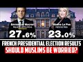

# French Presidential Election Results - Should Muslims Be Worried? (2022-04-11 19:54:03+00:00)

## Description

Follow Imran Muller on Twitter: @Osmani268
 
You Can Support My Work on Patreon:
https://www.patreon.com/Bloggingtheology

My Paypal Link: 
https://www.paypal.com/paypalme/bloggingtheology?locale.x=en_GB

## Summary of [French Presidential Election Results - Should Muslims Be Worried?](https://www.youtube.com/watch?v=Gzqb26NhuAI)

*This is an AI generated summary. There may be inaccuracies. *

### [00:00:00](https://www.youtube.com/watch?v=Gzqb26NhuAI&t=0) - [00:30:00](https://www.youtube.com/watch?v=Gzqb26NhuAI&t=1800)

 discusses the results of the French Presidential election, and how Muslims in France should be worried about the possible outcomes. Marine Le Pen, the far-right candidate, has a history of anti-Muslim rhetoric and could potentially become the next French President.

**[00:00:00](https://www.youtube.com/watch?v=Gzqb26NhuAI&t=0)** The French Presidential election resulted in some surprising results, with the far-right politician Marine Le Pen obtaining her highest result ever. President Macron is leading her in a final vote on the 24th of April. Other surprising results include the Socialist Party's loss of power, and the rise of the far-right candidate, Eric Zuma. French Muslims should not be worried about the possible outcome of the election as it has changed so much in the past few years.
* **[00:05:00](https://www.youtube.com/watch?v=Gzqb26NhuAI&t=300)** discusses the French Presidential Election results, and mentions that while Melonshone (the far-right candidate) didn't win, he did surprisingly well. It also mentions that Marine Le Pen, the far-right candidate, has a history of anti-muslim rhetoric and wanting to stop immigration.  stresses the importance of looking at each individual, and notes that while French society is fractured, Marine Le Pen could still become the next French President.
* **[00:10:00](https://www.youtube.com/watch?v=Gzqb26NhuAI&t=600)**  discusses the recent French Presidential election, in which Marine Le Pen - an anti-Muslim politician - was elected. Many Muslims in France are worried about the potential consequences of Le Pen's policies, which could result in mass persecution of Muslims. However, there is some hope that her policies would be unworkable and she would not be able to implement them.
* **[00:15:00](https://www.youtube.com/watch?v=Gzqb26NhuAI&t=900)**  discusses the French Presidential Election results, and highlights the fact that Marine Le Pen, the far-right candidate, is likely to benefit from the other parties who are not in the second round. Macron, the centrist candidate, may still win, but it is not clear yet.
* **[00:20:00](https://www.youtube.com/watch?v=Gzqb26NhuAI&t=1200)**  discusses the French Presidential election, in which both candidates have a lot to lose. Many supporters of the Green candidate, Emmanuel Macron, say that they will abstain from voting, effectively letting Marine Le Pen into the office. Macron's biggest worry is that melancholic supporters will not vote for him out of disgust for the other candidates.
* **[00:25:00](https://www.youtube.com/watch?v=Gzqb26NhuAI&t=1500)**  discusses the French Presidential election, in which centrist Emmanuel Macron narrowly beat far-right Marine Le Pen. Macron's policies on Islam, which are seen as hostile, may have helped Le Pen gain ground. Macron is fighting against a growing far-right movement in France, and may need the support of moderate Muslims to win the election.
* **[00:30:00](https://www.youtube.com/watch?v=Gzqb26NhuAI&t=1800)** of the YouTube video discusses the French presidential election and how Muslims should be concerned about the result. He notes that the political division in his village seems to be national, rather than local. He also warns that the political environment in France is uncertain and worrying.

('js', new Date());

('config', 'G-LN9LMB0VNS');

## Full transcript with timestamps

[0:00:03](https://youtu.be/Gzqb26NhuAI?t=3) hello everyone and welcome to blogging  
[0:00:05](https://youtu.be/Gzqb26NhuAI?t=5) theology today i am delighted to talk to  
[0:00:08](https://youtu.be/Gzqb26NhuAI?t=8) imran muller welcome back sir  
[0:00:11](https://youtu.be/Gzqb26NhuAI?t=11) thank you very much for having me  
[0:00:13](https://youtu.be/Gzqb26NhuAI?t=13) imran as you i'm sure you know is a  
[0:00:15](https://youtu.be/Gzqb26NhuAI?t=15) specialist on britain's policies towards  
[0:00:17](https://youtu.be/Gzqb26NhuAI?t=17) muslims domestically and he has done  
[0:00:20](https://youtu.be/Gzqb26NhuAI?t=20) work assisting award-winning journalist  
[0:00:22](https://youtu.be/Gzqb26NhuAI?t=22) peter aborn on research for his  
[0:00:24](https://youtu.be/Gzqb26NhuAI?t=24) forthcoming book which is entitled the  
[0:00:27](https://youtu.be/Gzqb26NhuAI?t=27) fate of abraham why the west is wrong  
[0:00:31](https://youtu.be/Gzqb26NhuAI?t=31) about islam that's due to be published  
[0:00:33](https://youtu.be/Gzqb26NhuAI?t=33) next month  
[0:00:35](https://youtu.be/Gzqb26NhuAI?t=35) imran has also studied the french  
[0:00:37](https://youtu.be/Gzqb26NhuAI?t=37) attitude to its muslim population and is  
[0:00:40](https://youtu.be/Gzqb26NhuAI?t=40) particularly interested in france as a  
[0:00:43](https://youtu.be/Gzqb26NhuAI?t=43) comparison with britain  
[0:00:45](https://youtu.be/Gzqb26NhuAI?t=45) he is a student of history at cambridge  
[0:00:48](https://youtu.be/Gzqb26NhuAI?t=48) university and has written for  
[0:00:50](https://youtu.be/Gzqb26NhuAI?t=50) publications including traversing  
[0:00:52](https://youtu.be/Gzqb26NhuAI?t=52) tradition athwart and conservative home  
[0:00:56](https://youtu.be/Gzqb26NhuAI?t=56) and you can follow him on his twitter  
[0:00:58](https://youtu.be/Gzqb26NhuAI?t=58) handle uh at osmani 268 that's o s m a n  
[0:01:04](https://youtu.be/Gzqb26NhuAI?t=64) i  
[0:01:04](https://youtu.be/Gzqb26NhuAI?t=64) 2 6 8.  
[0:01:07](https://youtu.be/Gzqb26NhuAI?t=67) so  
[0:01:08](https://youtu.be/Gzqb26NhuAI?t=68) the 2022  
[0:01:10](https://youtu.be/Gzqb26NhuAI?t=70) present french presidential elections  
[0:01:12](https://youtu.be/Gzqb26NhuAI?t=72) took place yesterday with some  
[0:01:15](https://youtu.be/Gzqb26NhuAI?t=75) surprising results  
[0:01:17](https://youtu.be/Gzqb26NhuAI?t=77) uh here's one example the the far-right  
[0:01:19](https://youtu.be/Gzqb26NhuAI?t=79) politician marine le pen obtained her  
[0:01:22](https://youtu.be/Gzqb26NhuAI?t=82) highest result ever at the first round  
[0:01:25](https://youtu.be/Gzqb26NhuAI?t=85) of a presidential election on sunday  
[0:01:29](https://youtu.be/Gzqb26NhuAI?t=89) now she'll now go head-to-head with  
[0:01:31](https://youtu.be/Gzqb26NhuAI?t=91) president macron in a final vote on the  
[0:01:34](https://youtu.be/Gzqb26NhuAI?t=94) 24th of april and many will want to know  
[0:01:38](https://youtu.be/Gzqb26NhuAI?t=98) me included  
[0:01:39](https://youtu.be/Gzqb26NhuAI?t=99) how different could france be with le  
[0:01:42](https://youtu.be/Gzqb26NhuAI?t=102) pen as president  
[0:01:45](https://youtu.be/Gzqb26NhuAI?t=105) so could you kindly give us an update on  
[0:01:47](https://youtu.be/Gzqb26NhuAI?t=107) what is going on there other surprising  
[0:01:49](https://youtu.be/Gzqb26NhuAI?t=109) results as well and how worried should  
[0:01:52](https://youtu.be/Gzqb26NhuAI?t=112) french muslims be about the possible  
[0:01:55](https://youtu.be/Gzqb26NhuAI?t=115) outcome  
[0:01:55](https://youtu.be/Gzqb26NhuAI?t=115) [Music]  
[0:01:57](https://youtu.be/Gzqb26NhuAI?t=117) well i mean  
[0:01:58](https://youtu.be/Gzqb26NhuAI?t=118) that's a very good introduction very  
[0:02:00](https://youtu.be/Gzqb26NhuAI?t=120) good summary of the situation  
[0:02:02](https://youtu.be/Gzqb26NhuAI?t=122) the first thing that i would note is  
[0:02:04](https://youtu.be/Gzqb26NhuAI?t=124) that french politics  
[0:02:06](https://youtu.be/Gzqb26NhuAI?t=126) has changed so much  
[0:02:08](https://youtu.be/Gzqb26NhuAI?t=128) in the past few years so much so that  
[0:02:10](https://youtu.be/Gzqb26NhuAI?t=130) the two parties that used to be the main  
[0:02:13](https://youtu.be/Gzqb26NhuAI?t=133) political forces in the country so the  
[0:02:16](https://youtu.be/Gzqb26NhuAI?t=136) socialist party and the republicans have  
[0:02:18](https://youtu.be/Gzqb26NhuAI?t=138) been obliterated at this election so the  
[0:02:21](https://youtu.be/Gzqb26NhuAI?t=141) socialists um the socialist party  
[0:02:23](https://youtu.be/Gzqb26NhuAI?t=143) actually used to govern the country uh  
[0:02:25](https://youtu.be/Gzqb26NhuAI?t=145) not that long ago the socialist  
[0:02:27](https://youtu.be/Gzqb26NhuAI?t=147) candidate this time got one point eight  
[0:02:29](https://youtu.be/Gzqb26NhuAI?t=149) percent of the vote  
[0:02:31](https://youtu.be/Gzqb26NhuAI?t=151) yeah i mean  
[0:02:33](https://youtu.be/Gzqb26NhuAI?t=153) hello  
[0:02:34](https://youtu.be/Gzqb26NhuAI?t=154) it's very dramatic actually a dramatic  
[0:02:37](https://youtu.be/Gzqb26NhuAI?t=157) decline that basically is no socialist  
[0:02:39](https://youtu.be/Gzqb26NhuAI?t=159) party anymore essentially um and then  
[0:02:42](https://youtu.be/Gzqb26NhuAI?t=162) valerie cress who  
[0:02:44](https://youtu.be/Gzqb26NhuAI?t=164) at one point  
[0:02:48](https://youtu.be/Gzqb26NhuAI?t=168) looked like the front runner to  
[0:02:49](https://youtu.be/Gzqb26NhuAI?t=169) challenge macron so she's the republican  
[0:02:52](https://youtu.be/Gzqb26NhuAI?t=172) party candidate uh the center-right  
[0:02:54](https://youtu.be/Gzqb26NhuAI?t=174) candidate she only got 4.8 percent so uh  
[0:02:58](https://youtu.be/Gzqb26NhuAI?t=178) the republicans have essentially been  
[0:02:59](https://youtu.be/Gzqb26NhuAI?t=179) completely decimated as well uh  
[0:03:01](https://youtu.be/Gzqb26NhuAI?t=181) meanwhile eric zuma got 7.1 percent  
[0:03:04](https://youtu.be/Gzqb26NhuAI?t=184) which is  
[0:03:06](https://youtu.be/Gzqb26NhuAI?t=186) very disappointing for him and his  
[0:03:08](https://youtu.be/Gzqb26NhuAI?t=188) followers but on the other hand um it is  
[0:03:10](https://youtu.be/Gzqb26NhuAI?t=190) a significant achievement that he  
[0:03:12](https://youtu.be/Gzqb26NhuAI?t=192) started a political movement from  
[0:03:14](https://youtu.be/Gzqb26NhuAI?t=194) essentially nothing he got enough  
[0:03:16](https://youtu.be/Gzqb26NhuAI?t=196) signatures from elected officials to  
[0:03:18](https://youtu.be/Gzqb26NhuAI?t=198) actually be able to compete in the  
[0:03:20](https://youtu.be/Gzqb26NhuAI?t=200) election and then he got 7.1 percent of  
[0:03:23](https://youtu.be/Gzqb26NhuAI?t=203) the vote i mean that's nearly yeah one  
[0:03:25](https://youtu.be/Gzqb26NhuAI?t=205) in 10 french voters uh cast their vote  
[0:03:29](https://youtu.be/Gzqb26NhuAI?t=209) for eric zamor just a quick reminder  
[0:03:31](https://youtu.be/Gzqb26NhuAI?t=211) he's the guy who called for a ban on the  
[0:03:35](https://youtu.be/Gzqb26NhuAI?t=215) name muhammad that's how extreme his  
[0:03:38](https://youtu.be/Gzqb26NhuAI?t=218) anti-muslim rhetoric has been um but it  
[0:03:41](https://youtu.be/Gzqb26NhuAI?t=221) could be much it could have been much  
[0:03:42](https://youtu.be/Gzqb26NhuAI?t=222) worse he could have done much better um  
[0:03:45](https://youtu.be/Gzqb26NhuAI?t=225) the two candidates who will be heading  
[0:03:47](https://youtu.be/Gzqb26NhuAI?t=227) into the final vote on the 24th of april  
[0:03:51](https://youtu.be/Gzqb26NhuAI?t=231) are president macron and as you  
[0:03:53](https://youtu.be/Gzqb26NhuAI?t=233) mentioned marine le pen so macron has  
[0:03:56](https://youtu.be/Gzqb26NhuAI?t=236) got  
[0:03:57](https://youtu.be/Gzqb26NhuAI?t=237) 27.8 percent of the vote which is  
[0:03:59](https://youtu.be/Gzqb26NhuAI?t=239) actually um  
[0:04:01](https://youtu.be/Gzqb26NhuAI?t=241) very good for him he he did much better  
[0:04:04](https://youtu.be/Gzqb26NhuAI?t=244) than some people were expecting and then  
[0:04:06](https://youtu.be/Gzqb26NhuAI?t=246) it looked like he would do earlier in  
[0:04:09](https://youtu.be/Gzqb26NhuAI?t=249) the race and i think he was really  
[0:04:10](https://youtu.be/Gzqb26NhuAI?t=250) helped by actually russia's horrific  
[0:04:13](https://youtu.be/Gzqb26NhuAI?t=253) invasion of ukraine because he began to  
[0:04:16](https://youtu.be/Gzqb26NhuAI?t=256) look like more of a statesman and a lot  
[0:04:18](https://youtu.be/Gzqb26NhuAI?t=258) of french people who maybe didn't like  
[0:04:21](https://youtu.be/Gzqb26NhuAI?t=261) macron thought well at least he's  
[0:04:23](https://youtu.be/Gzqb26NhuAI?t=263) someone who actually looks like he can  
[0:04:25](https://youtu.be/Gzqb26NhuAI?t=265) be a proper president and lead the  
[0:04:27](https://youtu.be/Gzqb26NhuAI?t=267) country and we don't really trust marine  
[0:04:30](https://youtu.be/Gzqb26NhuAI?t=270) le pen to do that so uh macron is  
[0:04:33](https://youtu.be/Gzqb26NhuAI?t=273) leading le pen by about four percentage  
[0:04:35](https://youtu.be/Gzqb26NhuAI?t=275) points um and it it's not ultimately  
[0:04:38](https://youtu.be/Gzqb26NhuAI?t=278) that much he's done well but he faces a  
[0:04:41](https://youtu.be/Gzqb26NhuAI?t=281) significant uh challenge because you  
[0:04:43](https://youtu.be/Gzqb26NhuAI?t=283) know it's gonna be macron versus le pen  
[0:04:46](https://youtu.be/Gzqb26NhuAI?t=286) just those two uh in the final round i  
[0:04:48](https://youtu.be/Gzqb26NhuAI?t=288) think though the truly remarkable thing  
[0:04:51](https://youtu.be/Gzqb26NhuAI?t=291) about this election is that uh melon  
[0:04:57](https://youtu.be/Gzqb26NhuAI?t=297) uh the main left wing uh candidate he  
[0:04:59](https://youtu.be/Gzqb26NhuAI?t=299) got 22 percent of the vote  
[0:05:02](https://youtu.be/Gzqb26NhuAI?t=302) i was i was very surprised to see that i  
[0:05:05](https://youtu.be/Gzqb26NhuAI?t=305) mean  
[0:05:06](https://youtu.be/Gzqb26NhuAI?t=306) incredible um advance for him  
[0:05:08](https://youtu.be/Gzqb26NhuAI?t=308) politically i didn't see that happening  
[0:05:10](https://youtu.be/Gzqb26NhuAI?t=310) it is and he just got you know so it's  
[0:05:12](https://youtu.be/Gzqb26NhuAI?t=312) just like one  
[0:05:14](https://youtu.be/Gzqb26NhuAI?t=314) one percent less than le pen actually i  
[0:05:16](https://youtu.be/Gzqb26NhuAI?t=316) mean that's extraordinary now melons  
[0:05:19](https://youtu.be/Gzqb26NhuAI?t=319) supporters will all say that well the  
[0:05:21](https://youtu.be/Gzqb26NhuAI?t=321) fact that we have a divided left is why  
[0:05:24](https://youtu.be/Gzqb26NhuAI?t=324) melon shawn uh isn't placing macron in  
[0:05:27](https://youtu.be/Gzqb26NhuAI?t=327) the final round because you know four  
[0:05:29](https://youtu.be/Gzqb26NhuAI?t=329) point six percent of the vote went to  
[0:05:31](https://youtu.be/Gzqb26NhuAI?t=331) the green candidate uh yannick jadal um  
[0:05:34](https://youtu.be/Gzqb26NhuAI?t=334) the communist party candidate got 2.3  
[0:05:37](https://youtu.be/Gzqb26NhuAI?t=337) percent so actually if the left hadn't  
[0:05:39](https://youtu.be/Gzqb26NhuAI?t=339) been divided like that melonshone would  
[0:05:41](https://youtu.be/Gzqb26NhuAI?t=341) easily have surpassed uh le pen but you  
[0:05:45](https://youtu.be/Gzqb26NhuAI?t=345) know it's not to be but it is  
[0:05:46](https://youtu.be/Gzqb26NhuAI?t=346) extraordinary that people voted for that  
[0:05:48](https://youtu.be/Gzqb26NhuAI?t=348) melon he's rejected the  
[0:05:52](https://youtu.be/Gzqb26NhuAI?t=352) anti-immigrant rhetoric of both eric  
[0:05:54](https://youtu.be/Gzqb26NhuAI?t=354) zamor marine le pen and actually  
[0:05:56](https://youtu.be/Gzqb26NhuAI?t=356) procrasti as well he's also uh so he he  
[0:05:59](https://youtu.be/Gzqb26NhuAI?t=359) has a islamophobic record i should say  
[0:06:02](https://youtu.be/Gzqb26NhuAI?t=362) this islamophobia in france um straddles  
[0:06:06](https://youtu.be/Gzqb26NhuAI?t=366) the entire political spectrum so  
[0:06:09](https://youtu.be/Gzqb26NhuAI?t=369) melonshone has a record of saying uh you  
[0:06:12](https://youtu.be/Gzqb26NhuAI?t=372) know in france we don't wear the  
[0:06:13](https://youtu.be/Gzqb26NhuAI?t=373) headscarf he's been against muslim women  
[0:06:16](https://youtu.be/Gzqb26NhuAI?t=376) wearing the headscarf actually le pen a  
[0:06:19](https://youtu.be/Gzqb26NhuAI?t=379) few years ago she went to lebanon and  
[0:06:21](https://youtu.be/Gzqb26NhuAI?t=381) she entered a mosque she refused to  
[0:06:24](https://youtu.be/Gzqb26NhuAI?t=384) cover her head and melanchol defended  
[0:06:26](https://youtu.be/Gzqb26NhuAI?t=386) her and said no one tells french people  
[0:06:29](https://youtu.be/Gzqb26NhuAI?t=389) what to wear so how's this great  
[0:06:30](https://youtu.be/Gzqb26NhuAI?t=390) actually i actually remember that i  
[0:06:32](https://youtu.be/Gzqb26NhuAI?t=392) remember thinking what you know how can  
[0:06:34](https://youtu.be/Gzqb26NhuAI?t=394) the political left be supporting the far  
[0:06:36](https://youtu.be/Gzqb26NhuAI?t=396) right over what issue oh bashing muslims  
[0:06:39](https://youtu.be/Gzqb26NhuAI?t=399) that's when they're united oh god  
[0:06:42](https://youtu.be/Gzqb26NhuAI?t=402) yeah  
[0:06:42](https://youtu.be/Gzqb26NhuAI?t=402) exactly support for legacy for france's  
[0:06:45](https://youtu.be/Gzqb26NhuAI?t=405) secularism has been um it is hegemonic  
[0:06:49](https://youtu.be/Gzqb26NhuAI?t=409) uh but melon shawn he's shifted uh  
[0:06:52](https://youtu.be/Gzqb26NhuAI?t=412) more recently in the past few years so  
[0:06:54](https://youtu.be/Gzqb26NhuAI?t=414) in in 2020 when uh macron was ramping up  
[0:06:57](https://youtu.be/Gzqb26NhuAI?t=417) his um assault on muslim civil society  
[0:07:00](https://youtu.be/Gzqb26NhuAI?t=420) an anti-muslim rhetoric was really  
[0:07:02](https://youtu.be/Gzqb26NhuAI?t=422) reaching fever pitch  
[0:07:05](https://youtu.be/Gzqb26NhuAI?t=425) melancholism doesn't mean that we have  
[0:07:07](https://youtu.be/Gzqb26NhuAI?t=427) to hate a religion he said that in  
[0:07:09](https://youtu.be/Gzqb26NhuAI?t=429) france there is hatred of muslims dis uh  
[0:07:12](https://youtu.be/Gzqb26NhuAI?t=432) disguised as secularism so he has come  
[0:07:15](https://youtu.be/Gzqb26NhuAI?t=435) out against you know zamor's rhetoric he  
[0:07:18](https://youtu.be/Gzqb26NhuAI?t=438) ferociously debated zamor on what it  
[0:07:21](https://youtu.be/Gzqb26NhuAI?t=441) means to be french zamora was suggesting  
[0:07:23](https://youtu.be/Gzqb26NhuAI?t=443) that muslim migration is a threat to  
[0:07:25](https://youtu.be/Gzqb26NhuAI?t=445) france uh melanchol was opposing this  
[0:07:28](https://youtu.be/Gzqb26NhuAI?t=448) and he does have significant support  
[0:07:30](https://youtu.be/Gzqb26NhuAI?t=450) from uh ethnic minorities in france uh  
[0:07:33](https://youtu.be/Gzqb26NhuAI?t=453) and particularly uh north africans  
[0:07:36](https://youtu.be/Gzqb26NhuAI?t=456) actually so melancholy recognized that  
[0:07:38](https://youtu.be/Gzqb26NhuAI?t=458) um he needs to tap into that electorate  
[0:07:41](https://youtu.be/Gzqb26NhuAI?t=461) and uh that is not helpful for him to  
[0:07:44](https://youtu.be/Gzqb26NhuAI?t=464) also be jumping on the kind of uh  
[0:07:47](https://youtu.be/Gzqb26NhuAI?t=467) anti-muslim bandwagon so it's very  
[0:07:49](https://youtu.be/Gzqb26NhuAI?t=469) interesting that uh 22  
[0:07:52](https://youtu.be/Gzqb26NhuAI?t=472) of voters decided to back melonshot with  
[0:07:55](https://youtu.be/Gzqb26NhuAI?t=475) his rejection of the far-right populism  
[0:07:59](https://youtu.be/Gzqb26NhuAI?t=479) of uh marine le pen and eric zuma and  
[0:08:02](https://youtu.be/Gzqb26NhuAI?t=482) very significant and it really shows  
[0:08:04](https://youtu.be/Gzqb26NhuAI?t=484) that we can't you know we should never  
[0:08:06](https://youtu.be/Gzqb26NhuAI?t=486) judge um an entire people by you know  
[0:08:09](https://youtu.be/Gzqb26NhuAI?t=489) the actions or opinions of some some  
[0:08:12](https://youtu.be/Gzqb26NhuAI?t=492) within them you always look for the  
[0:08:13](https://youtu.be/Gzqb26NhuAI?t=493) individual there are individuals there  
[0:08:15](https://youtu.be/Gzqb26NhuAI?t=495) are there are many many people in france  
[0:08:18](https://youtu.be/Gzqb26NhuAI?t=498) who oppose the persecution of muslims  
[0:08:20](https://youtu.be/Gzqb26NhuAI?t=500) and say well  
[0:08:21](https://youtu.be/Gzqb26NhuAI?t=501) they are french citizens as well they  
[0:08:24](https://youtu.be/Gzqb26NhuAI?t=504) have the right to be here we shouldn't  
[0:08:25](https://youtu.be/Gzqb26NhuAI?t=505) oppose them there are lots of french  
[0:08:27](https://youtu.be/Gzqb26NhuAI?t=507) people who do think that and i would  
[0:08:29](https://youtu.be/Gzqb26NhuAI?t=509) stress that point to um the listeners  
[0:08:32](https://youtu.be/Gzqb26NhuAI?t=512) no no it's a very good point and  
[0:08:34](https://youtu.be/Gzqb26NhuAI?t=514) intriguing in my region of france where  
[0:08:35](https://youtu.be/Gzqb26NhuAI?t=515) i live in the in the shares which is  
[0:08:37](https://youtu.be/Gzqb26NhuAI?t=517) sort of south west france the uh the  
[0:08:39](https://youtu.be/Gzqb26NhuAI?t=519) split and the vote was pretty much the  
[0:08:41](https://youtu.be/Gzqb26NhuAI?t=521) same actually in that in that particular  
[0:08:43](https://youtu.be/Gzqb26NhuAI?t=523) region as it was uh nationally and even  
[0:08:46](https://youtu.be/Gzqb26NhuAI?t=526) in my village the the split has been  
[0:08:48](https://youtu.be/Gzqb26NhuAI?t=528) exactly the same so it looks as if  
[0:08:50](https://youtu.be/Gzqb26NhuAI?t=530) french society is uh fractured uh in in  
[0:08:54](https://youtu.be/Gzqb26NhuAI?t=534) in that way across the board but the the  
[0:08:56](https://youtu.be/Gzqb26NhuAI?t=536) the question i really have is about uh  
[0:08:59](https://youtu.be/Gzqb26NhuAI?t=539) this politician marine le pen who now i  
[0:09:02](https://youtu.be/Gzqb26NhuAI?t=542) mean there's a couple there's a couple  
[0:09:03](https://youtu.be/Gzqb26NhuAI?t=543) of weeks really now uh until the  
[0:09:05](https://youtu.be/Gzqb26NhuAI?t=545) election and anything as we know as  
[0:09:07](https://youtu.be/Gzqb26NhuAI?t=547) you've said anything can happen uh in  
[0:09:10](https://youtu.be/Gzqb26NhuAI?t=550) you know weak the cliche in britain is a  
[0:09:12](https://youtu.be/Gzqb26NhuAI?t=552) weak as a long term in politics two  
[0:09:13](https://youtu.be/Gzqb26NhuAI?t=553) weeks in france is even longer um  
[0:09:16](https://youtu.be/Gzqb26NhuAI?t=556) anything can happen so if she was  
[0:09:19](https://youtu.be/Gzqb26NhuAI?t=559) to become the next president of the  
[0:09:22](https://youtu.be/Gzqb26NhuAI?t=562) republic um what kind of france can we  
[0:09:25](https://youtu.be/Gzqb26NhuAI?t=565) expect to see what's going to happen to  
[0:09:28](https://youtu.be/Gzqb26NhuAI?t=568) what's what's she going to do do you  
[0:09:30](https://youtu.be/Gzqb26NhuAI?t=570) think  
[0:09:31](https://youtu.be/Gzqb26NhuAI?t=571) well i think it will be  
[0:09:33](https://youtu.be/Gzqb26NhuAI?t=573) very troubling she's not  
[0:09:35](https://youtu.be/Gzqb26NhuAI?t=575) her platform is not so dramatic as eric  
[0:09:38](https://youtu.be/Gzqb26NhuAI?t=578) zuma's who wanted to stop immigration  
[0:09:40](https://youtu.be/Gzqb26NhuAI?t=580) and you know ban arabic names um but le  
[0:09:44](https://youtu.be/Gzqb26NhuAI?t=584) pen is from the national rally party  
[0:09:46](https://youtu.be/Gzqb26NhuAI?t=586) which is renamed it used to be the  
[0:09:48](https://youtu.be/Gzqb26NhuAI?t=588) national front  
[0:09:49](https://youtu.be/Gzqb26NhuAI?t=589) um  
[0:09:50](https://youtu.be/Gzqb26NhuAI?t=590) and her father jean-marie le pen uh was  
[0:09:54](https://youtu.be/Gzqb26NhuAI?t=594) a very famous politician now this party  
[0:09:57](https://youtu.be/Gzqb26NhuAI?t=597) uh is a far-right party actually one of  
[0:09:59](https://youtu.be/Gzqb26NhuAI?t=599) their main barriers still today is that  
[0:10:02](https://youtu.be/Gzqb26NhuAI?t=602) many elderly people in france really see  
[0:10:05](https://youtu.be/Gzqb26NhuAI?t=605) them as having this far-right stigma  
[0:10:07](https://youtu.be/Gzqb26NhuAI?t=607) because they were  
[0:10:08](https://youtu.be/Gzqb26NhuAI?t=608) it was known for being a very  
[0:10:10](https://youtu.be/Gzqb26NhuAI?t=610) anti-semitic party actually a couple of  
[0:10:13](https://youtu.be/Gzqb26NhuAI?t=613) decades ago uh and uh this is a party  
[0:10:16](https://youtu.be/Gzqb26NhuAI?t=616) that opposed algerian independence so it  
[0:10:19](https://youtu.be/Gzqb26NhuAI?t=619) absolutely opposed france giving up  
[0:10:22](https://youtu.be/Gzqb26NhuAI?t=622) algeria so it has that legacy le pen has  
[0:10:25](https://youtu.be/Gzqb26NhuAI?t=625) always been  
[0:10:27](https://youtu.be/Gzqb26NhuAI?t=627) anti-muslim in her politics  
[0:10:30](https://youtu.be/Gzqb26NhuAI?t=630) ferociously so um her current platform  
[0:10:33](https://youtu.be/Gzqb26NhuAI?t=633) is that she wants to  
[0:10:35](https://youtu.be/Gzqb26NhuAI?t=635) ban  
[0:10:36](https://youtu.be/Gzqb26NhuAI?t=636) the  
[0:10:37](https://youtu.be/Gzqb26NhuAI?t=637) hijab  
[0:10:38](https://youtu.be/Gzqb26NhuAI?t=638) in all public places so currently the  
[0:10:40](https://youtu.be/Gzqb26NhuAI?t=640) hijab is banned in you know schools the  
[0:10:43](https://youtu.be/Gzqb26NhuAI?t=643) face veil is banned everywhere le pen  
[0:10:45](https://youtu.be/Gzqb26NhuAI?t=645) says no hijab in public places which is  
[0:10:48](https://youtu.be/Gzqb26NhuAI?t=648) remarkable because people are still  
[0:10:50](https://youtu.be/Gzqb26NhuAI?t=650) allowed to wear hoodies  
[0:10:52](https://youtu.be/Gzqb26NhuAI?t=652) so you can cover your head in some ways  
[0:10:54](https://youtu.be/Gzqb26NhuAI?t=654) but if it's if it's seen as a sign of  
[0:10:56](https://youtu.be/Gzqb26NhuAI?t=656) muslimness or islamic practice then it's  
[0:10:59](https://youtu.be/Gzqb26NhuAI?t=659) unacceptable  
[0:11:02](https://youtu.be/Gzqb26NhuAI?t=662) but that would result in mass  
[0:11:04](https://youtu.be/Gzqb26NhuAI?t=664) persecution of muslims in france i i i  
[0:11:07](https://youtu.be/Gzqb26NhuAI?t=667) mean  
[0:11:08](https://youtu.be/Gzqb26NhuAI?t=668) in my kind of subjective impression i i  
[0:11:10](https://youtu.be/Gzqb26NhuAI?t=670) don't get the impression that  
[0:11:12](https://youtu.be/Gzqb26NhuAI?t=672) muslim sisters wear the hijab as much as  
[0:11:14](https://youtu.be/Gzqb26NhuAI?t=674) they do in britain i mean in my kind of  
[0:11:16](https://youtu.be/Gzqb26NhuAI?t=676) toulouse and that but nevertheless it  
[0:11:18](https://youtu.be/Gzqb26NhuAI?t=678) will if the police have to enforce this  
[0:11:20](https://youtu.be/Gzqb26NhuAI?t=680) that means they're going to be basically  
[0:11:22](https://youtu.be/Gzqb26NhuAI?t=682) agents of persecution  
[0:11:24](https://youtu.be/Gzqb26NhuAI?t=684) on a massive  
[0:11:27](https://youtu.be/Gzqb26NhuAI?t=687) industrial scale targeting muslim women  
[0:11:29](https://youtu.be/Gzqb26NhuAI?t=689) and forcing them to deny their faith by  
[0:11:32](https://youtu.be/Gzqb26NhuAI?t=692) taking off  
[0:11:33](https://youtu.be/Gzqb26NhuAI?t=693) what is very  
[0:11:34](https://youtu.be/Gzqb26NhuAI?t=694) in a sense trivial a head scarf is not a  
[0:11:36](https://youtu.be/Gzqb26NhuAI?t=696) big deal and it would just  
[0:11:38](https://youtu.be/Gzqb26NhuAI?t=698) it would almost be like civil war it  
[0:11:40](https://youtu.be/Gzqb26NhuAI?t=700) would be  
[0:11:41](https://youtu.be/Gzqb26NhuAI?t=701) unspeakable in a an allegedly modern  
[0:11:44](https://youtu.be/Gzqb26NhuAI?t=704) liberal democracy in the west for that  
[0:11:46](https://youtu.be/Gzqb26NhuAI?t=706) to happen you know just reminds me of  
[0:11:49](https://youtu.be/Gzqb26NhuAI?t=709) similar incidents in the 1930s even it  
[0:11:52](https://youtu.be/Gzqb26NhuAI?t=712) would just be absolutely extraordinary i  
[0:11:54](https://youtu.be/Gzqb26NhuAI?t=714) just can't imagine how it would work in  
[0:11:55](https://youtu.be/Gzqb26NhuAI?t=715) practice as i'm trying to say  
[0:11:57](https://youtu.be/Gzqb26NhuAI?t=717) um yeah no  
[0:11:59](https://youtu.be/Gzqb26NhuAI?t=719) neither can i actually um and it it  
[0:12:02](https://youtu.be/Gzqb26NhuAI?t=722) would be um forced forced assimilation  
[0:12:05](https://youtu.be/Gzqb26NhuAI?t=725) um  
[0:12:07](https://youtu.be/Gzqb26NhuAI?t=727) it would make life  
[0:12:08](https://youtu.be/Gzqb26NhuAI?t=728) unlivable for many  
[0:12:11](https://youtu.be/Gzqb26NhuAI?t=731) women across the country actually they'd  
[0:12:13](https://youtu.be/Gzqb26NhuAI?t=733) have to make they'd have to make that  
[0:12:15](https://youtu.be/Gzqb26NhuAI?t=735) decision you know um  
[0:12:18](https://youtu.be/Gzqb26NhuAI?t=738) for the police it would be an  
[0:12:19](https://youtu.be/Gzqb26NhuAI?t=739) extraordinary task i mean it's it's  
[0:12:22](https://youtu.be/Gzqb26NhuAI?t=742) one can imagine that what would actually  
[0:12:24](https://youtu.be/Gzqb26NhuAI?t=744) happen is that in many areas where there  
[0:12:27](https://youtu.be/Gzqb26NhuAI?t=747) are lots of muslims uh women actually  
[0:12:30](https://youtu.be/Gzqb26NhuAI?t=750) would walk around  
[0:12:31](https://youtu.be/Gzqb26NhuAI?t=751) still wearing  
[0:12:33](https://youtu.be/Gzqb26NhuAI?t=753) the head stuff and um you know and then  
[0:12:35](https://youtu.be/Gzqb26NhuAI?t=755) a police car would come past and  
[0:12:37](https://youtu.be/Gzqb26NhuAI?t=757) everyone would say look police and  
[0:12:39](https://youtu.be/Gzqb26NhuAI?t=759) you can imagine it it'll be absolute  
[0:12:41](https://youtu.be/Gzqb26NhuAI?t=761) chaos and and people would uh resist it  
[0:12:44](https://youtu.be/Gzqb26NhuAI?t=764) reasonably uh they wouldn't want to just  
[0:12:47](https://youtu.be/Gzqb26NhuAI?t=767) so obey everyone wouldn't say yes this  
[0:12:49](https://youtu.be/Gzqb26NhuAI?t=769) is fine but there'd also be um  
[0:12:52](https://youtu.be/Gzqb26NhuAI?t=772) significant pushback from uh  
[0:12:56](https://youtu.be/Gzqb26NhuAI?t=776) the judiciary i think uh i think the  
[0:13:00](https://youtu.be/Gzqb26NhuAI?t=780) the machinery of the state would be  
[0:13:02](https://youtu.be/Gzqb26NhuAI?t=782) against le pen if she came into power  
[0:13:05](https://youtu.be/Gzqb26NhuAI?t=785) and wouldn't allow her to uh actually  
[0:13:08](https://youtu.be/Gzqb26NhuAI?t=788) implement some of this more extreme  
[0:13:10](https://youtu.be/Gzqb26NhuAI?t=790) stuff so so there is that hope because  
[0:13:13](https://youtu.be/Gzqb26NhuAI?t=793) they you know um these people don't they  
[0:13:15](https://youtu.be/Gzqb26NhuAI?t=795) don't agree with le pen's platform and  
[0:13:18](https://youtu.be/Gzqb26NhuAI?t=798) actually  
[0:13:19](https://youtu.be/Gzqb26NhuAI?t=799) the judiciary has a record of sometimes  
[0:13:22](https://youtu.be/Gzqb26NhuAI?t=802) actually reigning in some of the extreme  
[0:13:25](https://youtu.be/Gzqb26NhuAI?t=805) uh populism and saying that no this is  
[0:13:28](https://youtu.be/Gzqb26NhuAI?t=808) discrimination this isn't fair so there  
[0:13:30](https://youtu.be/Gzqb26NhuAI?t=810) is that hope uh that a lot of le pen's  
[0:13:33](https://youtu.be/Gzqb26NhuAI?t=813) platform would be unworkable and that  
[0:13:35](https://youtu.be/Gzqb26NhuAI?t=815) she won't be able to do it but imagine  
[0:13:37](https://youtu.be/Gzqb26NhuAI?t=817) being a muslim and having a president  
[0:13:40](https://youtu.be/Gzqb26NhuAI?t=820) who wants to do that stuff even if it's  
[0:13:42](https://youtu.be/Gzqb26NhuAI?t=822) not actually being implemented it's  
[0:13:44](https://youtu.be/Gzqb26NhuAI?t=824) still very significant and then you can  
[0:13:46](https://youtu.be/Gzqb26NhuAI?t=826) imagine how the rhetoric might escalate  
[0:13:48](https://youtu.be/Gzqb26NhuAI?t=828) as well but le pen she also has other  
[0:13:50](https://youtu.be/Gzqb26NhuAI?t=830) policies targeting muslims and she has  
[0:13:53](https://youtu.be/Gzqb26NhuAI?t=833) blatantly nativist political policies so  
[0:13:55](https://youtu.be/Gzqb26NhuAI?t=835) she says um we should prioritize native  
[0:13:59](https://youtu.be/Gzqb26NhuAI?t=839) french citizens when it comes to um  
[0:14:03](https://youtu.be/Gzqb26NhuAI?t=843) health care and housing and that kind of  
[0:14:05](https://youtu.be/Gzqb26NhuAI?t=845) thing i mean all this would be  
[0:14:06](https://youtu.be/Gzqb26NhuAI?t=846) absolutely unthinkable in britain you  
[0:14:09](https://youtu.be/Gzqb26NhuAI?t=849) couldn't i mean the conservative  
[0:14:10](https://youtu.be/Gzqb26NhuAI?t=850) government you couldn't imagine  
[0:14:13](https://youtu.be/Gzqb26NhuAI?t=853) them saying anything like that it'd be  
[0:14:15](https://youtu.be/Gzqb26NhuAI?t=855) completely beyond the pale but that is  
[0:14:17](https://youtu.be/Gzqb26NhuAI?t=857) being proposed by le pen she's also  
[0:14:20](https://youtu.be/Gzqb26NhuAI?t=860) saying something extraordinary which is  
[0:14:22](https://youtu.be/Gzqb26NhuAI?t=862) that we should strip french citizenship  
[0:14:25](https://youtu.be/Gzqb26NhuAI?t=865) from those who espouse extreme islamist  
[0:14:28](https://youtu.be/Gzqb26NhuAI?t=868) views now the problem is is that you  
[0:14:31](https://youtu.be/Gzqb26NhuAI?t=871) know  
[0:14:32](https://youtu.be/Gzqb26NhuAI?t=872) how is extreme islamists being defined  
[0:14:35](https://youtu.be/Gzqb26NhuAI?t=875) because japan defines islamists as you  
[0:14:38](https://youtu.be/Gzqb26NhuAI?t=878) know just conservative muslim practice  
[0:14:41](https://youtu.be/Gzqb26NhuAI?t=881) and  
[0:14:41](https://youtu.be/Gzqb26NhuAI?t=881) defending the hijab for example wouldn't  
[0:14:43](https://youtu.be/Gzqb26NhuAI?t=883) women have a right  
[0:14:45](https://youtu.be/Gzqb26NhuAI?t=885) extreme radical stripping of history but  
[0:14:48](https://youtu.be/Gzqb26NhuAI?t=888) by the way a lot of muslims are  
[0:14:49](https://youtu.be/Gzqb26NhuAI?t=889) obviously uh in france are born in  
[0:14:51](https://youtu.be/Gzqb26NhuAI?t=891) france um  
[0:14:53](https://youtu.be/Gzqb26NhuAI?t=893) stripped of their citizenship where they  
[0:14:55](https://youtu.be/Gzqb26NhuAI?t=895) gonna go  
[0:14:56](https://youtu.be/Gzqb26NhuAI?t=896) iceland norway i mean seriously i mean  
[0:14:59](https://youtu.be/Gzqb26NhuAI?t=899) where do you go to a stateless person  
[0:15:01](https://youtu.be/Gzqb26NhuAI?t=901) who's actually born in the country  
[0:15:02](https://youtu.be/Gzqb26NhuAI?t=902) you've just taken his country from i  
[0:15:03](https://youtu.be/Gzqb26NhuAI?t=903) don't get the logic of that um anyway  
[0:15:06](https://youtu.be/Gzqb26NhuAI?t=906) it's a completely unworkable plan and it  
[0:15:08](https://youtu.be/Gzqb26NhuAI?t=908) sends a quite chilling message to um you  
[0:15:12](https://youtu.be/Gzqb26NhuAI?t=912) know to to muslims that they're not as  
[0:15:14](https://youtu.be/Gzqb26NhuAI?t=914) french as other people because their  
[0:15:16](https://youtu.be/Gzqb26NhuAI?t=916) citizenship is conditional on them  
[0:15:18](https://youtu.be/Gzqb26NhuAI?t=918) actually having the right views so it's  
[0:15:20](https://youtu.be/Gzqb26NhuAI?t=920) it's an extreme uh implementation of  
[0:15:23](https://youtu.be/Gzqb26NhuAI?t=923) thought crime actually very very  
[0:15:26](https://youtu.be/Gzqb26NhuAI?t=926) worrying uh for french muslims so the  
[0:15:28](https://youtu.be/Gzqb26NhuAI?t=928) platform is it's not quite as extreme as  
[0:15:30](https://youtu.be/Gzqb26NhuAI?t=930) zamus and she has she she hasn't  
[0:15:33](https://youtu.be/Gzqb26NhuAI?t=933) exactly  
[0:15:34](https://youtu.be/Gzqb26NhuAI?t=934) prioritized um the discussion of islam  
[0:15:38](https://youtu.be/Gzqb26NhuAI?t=938) in her election campaign because she's  
[0:15:40](https://youtu.be/Gzqb26NhuAI?t=940) wanted to distinguish herself from zamos  
[0:15:43](https://youtu.be/Gzqb26NhuAI?t=943) so she's wanted to say well summer's the  
[0:15:45](https://youtu.be/Gzqb26NhuAI?t=945) kind of um the crazy far right one uh  
[0:15:48](https://youtu.be/Gzqb26NhuAI?t=948) that you should be scared of compared to  
[0:15:50](https://youtu.be/Gzqb26NhuAI?t=950) him i'm reasonable i have all these um  
[0:15:53](https://youtu.be/Gzqb26NhuAI?t=953) you know views on the economy she does  
[0:15:54](https://youtu.be/Gzqb26NhuAI?t=954) have lots of other policies economic  
[0:15:57](https://youtu.be/Gzqb26NhuAI?t=957) policies um but she does there is this  
[0:16:00](https://youtu.be/Gzqb26NhuAI?t=960) core um  
[0:16:02](https://youtu.be/Gzqb26NhuAI?t=962) anti-muslim impetus to uh le pen's  
[0:16:05](https://youtu.be/Gzqb26NhuAI?t=965) politics but i think people should be  
[0:16:07](https://youtu.be/Gzqb26NhuAI?t=967) very worried about  
[0:16:09](https://youtu.be/Gzqb26NhuAI?t=969) doesn't she want to get france out of  
[0:16:11](https://youtu.be/Gzqb26NhuAI?t=971) nato and and possibly out of the eu as  
[0:16:14](https://youtu.be/Gzqb26NhuAI?t=974) well i mean she so she's gone back on on  
[0:16:16](https://youtu.be/Gzqb26NhuAI?t=976) some of those older she used to be  
[0:16:18](https://youtu.be/Gzqb26NhuAI?t=978) anti-eu now she's actually she's given  
[0:16:21](https://youtu.be/Gzqb26NhuAI?t=981) up on that because it was proving  
[0:16:23](https://youtu.be/Gzqb26NhuAI?t=983) a lot of these positions were just  
[0:16:24](https://youtu.be/Gzqb26NhuAI?t=984) proving too toxic you know previously  
[0:16:27](https://youtu.be/Gzqb26NhuAI?t=987) she had some sort of sympathy for putin  
[0:16:30](https://youtu.be/Gzqb26NhuAI?t=990) as well she's obviously gone back on  
[0:16:32](https://youtu.be/Gzqb26NhuAI?t=992) that now because it's so it's considered  
[0:16:34](https://youtu.be/Gzqb26NhuAI?t=994) a little bit unacceptable yeah yeah yeah  
[0:16:38](https://youtu.be/Gzqb26NhuAI?t=998) exactly so le pen has undergone a  
[0:16:40](https://youtu.be/Gzqb26NhuAI?t=1000) rebranding and actually is quite a  
[0:16:42](https://youtu.be/Gzqb26NhuAI?t=1002) successful uh rebranding i think  
[0:16:45](https://youtu.be/Gzqb26NhuAI?t=1005) right so she doesn't want to leave nato  
[0:16:47](https://youtu.be/Gzqb26NhuAI?t=1007) anymore as well is that still no no as  
[0:16:50](https://youtu.be/Gzqb26NhuAI?t=1010) as far as i'm as far as i know um that's  
[0:16:52](https://youtu.be/Gzqb26NhuAI?t=1012) not on the table anymore right so she's  
[0:16:54](https://youtu.be/Gzqb26NhuAI?t=1014) clipped back a lot of her more radical  
[0:16:56](https://youtu.be/Gzqb26NhuAI?t=1016) policies uh except when it comes uh  
[0:16:59](https://youtu.be/Gzqb26NhuAI?t=1019) uh to to muslims it seems so next  
[0:17:02](https://youtu.be/Gzqb26NhuAI?t=1022) question really is we got a couple of  
[0:17:03](https://youtu.be/Gzqb26NhuAI?t=1023) weeks then until the uh final vote on  
[0:17:06](https://youtu.be/Gzqb26NhuAI?t=1026) the 24th of april in france a lot can  
[0:17:09](https://youtu.be/Gzqb26NhuAI?t=1029) happen between now and then but just  
[0:17:12](https://youtu.be/Gzqb26NhuAI?t=1032) just speculating for a second so i'm  
[0:17:14](https://youtu.be/Gzqb26NhuAI?t=1034) assuming that zamor's support the seven  
[0:17:17](https://youtu.be/Gzqb26NhuAI?t=1037) point whatever it was support that went  
[0:17:19](https://youtu.be/Gzqb26NhuAI?t=1039) to him during the first round will  
[0:17:21](https://youtu.be/Gzqb26NhuAI?t=1041) automatically go to le pen i mean who  
[0:17:23](https://youtu.be/Gzqb26NhuAI?t=1043) else they're going to vote for they're  
[0:17:23](https://youtu.be/Gzqb26NhuAI?t=1043) not going to vote for  
[0:17:25](https://youtu.be/Gzqb26NhuAI?t=1045) the socialists or macron are they so  
[0:17:27](https://youtu.be/Gzqb26NhuAI?t=1047) okay so she'll benefit from that  
[0:17:29](https://youtu.be/Gzqb26NhuAI?t=1049) but then macron may well benefit from  
[0:17:33](https://youtu.be/Gzqb26NhuAI?t=1053) uh the the other parties uh who are not  
[0:17:36](https://youtu.be/Gzqb26NhuAI?t=1056) in the in the second round so  
[0:17:38](https://youtu.be/Gzqb26NhuAI?t=1058) how's this all gonna balance out do you  
[0:17:40](https://youtu.be/Gzqb26NhuAI?t=1060) think in the maths  
[0:17:41](https://youtu.be/Gzqb26NhuAI?t=1061) is macron gonna win because he will get  
[0:17:44](https://youtu.be/Gzqb26NhuAI?t=1064) the others supporting him during the  
[0:17:46](https://youtu.be/Gzqb26NhuAI?t=1066) second round  
[0:17:48](https://youtu.be/Gzqb26NhuAI?t=1068) um  
[0:17:49](https://youtu.be/Gzqb26NhuAI?t=1069) unfortunately i don't think it uh i  
[0:17:51](https://youtu.be/Gzqb26NhuAI?t=1071) don't think it is very clear that macron  
[0:17:54](https://youtu.be/Gzqb26NhuAI?t=1074) will win um the the maths doesn't  
[0:17:56](https://youtu.be/Gzqb26NhuAI?t=1076) support of course uh you know  
[0:17:58](https://youtu.be/Gzqb26NhuAI?t=1078) there are two weeks left a lot can  
[0:18:02](https://youtu.be/Gzqb26NhuAI?t=1082) happen in two weeks so anyway we can't  
[0:18:04](https://youtu.be/Gzqb26NhuAI?t=1084) sort of look at the picture today and  
[0:18:06](https://youtu.be/Gzqb26NhuAI?t=1086) say and map that onto two weeks from now  
[0:18:09](https://youtu.be/Gzqb26NhuAI?t=1089) um but also there is  
[0:18:11](https://youtu.be/Gzqb26NhuAI?t=1091) it's not so straightforward as uh  
[0:18:14](https://youtu.be/Gzqb26NhuAI?t=1094) melancholic supporters will uh go to  
[0:18:16](https://youtu.be/Gzqb26NhuAI?t=1096) macron or even though some more  
[0:18:18](https://youtu.be/Gzqb26NhuAI?t=1098) supporters actually will vote for le pen  
[0:18:21](https://youtu.be/Gzqb26NhuAI?t=1101) so i think the first thing i'd say is  
[0:18:23](https://youtu.be/Gzqb26NhuAI?t=1103) that le pen is the candidate that macron  
[0:18:26](https://youtu.be/Gzqb26NhuAI?t=1106) wanted to face uh in  
[0:18:29](https://youtu.be/Gzqb26NhuAI?t=1109) in the second round of the election he  
[0:18:30](https://youtu.be/Gzqb26NhuAI?t=1110) didn't want to go up against zamur and  
[0:18:33](https://youtu.be/Gzqb26NhuAI?t=1113) that's because zamora was an  
[0:18:35](https://youtu.be/Gzqb26NhuAI?t=1115) unpredictable candidate um le pen she  
[0:18:38](https://youtu.be/Gzqb26NhuAI?t=1118) has the support of the  
[0:18:39](https://youtu.be/Gzqb26NhuAI?t=1119) anti-establishment nationalist right but  
[0:18:42](https://youtu.be/Gzqb26NhuAI?t=1122) the establishment right really doesn't  
[0:18:45](https://youtu.be/Gzqb26NhuAI?t=1125) like le pen and samoa um was gaining a  
[0:18:48](https://youtu.be/Gzqb26NhuAI?t=1128) lot of support from the establishment  
[0:18:50](https://youtu.be/Gzqb26NhuAI?t=1130) right so there was the fear that if it's  
[0:18:53](https://youtu.be/Gzqb26NhuAI?t=1133) zamor versus  
[0:18:55](https://youtu.be/Gzqb26NhuAI?t=1135) macron and people had to choose actually  
[0:18:57](https://youtu.be/Gzqb26NhuAI?t=1137) zamur could end up somehow reuniting the  
[0:19:01](https://youtu.be/Gzqb26NhuAI?t=1141) establishment right with the  
[0:19:02](https://youtu.be/Gzqb26NhuAI?t=1142) anti-establishment nationalist run and  
[0:19:04](https://youtu.be/Gzqb26NhuAI?t=1144) then he could win and le pen  
[0:19:07](https://youtu.be/Gzqb26NhuAI?t=1147) doesn't have that same kind of mass  
[0:19:09](https://youtu.be/Gzqb26NhuAI?t=1149) appeal she's predictable macron's faced  
[0:19:12](https://youtu.be/Gzqb26NhuAI?t=1152) her before so he didn't want to go up  
[0:19:14](https://youtu.be/Gzqb26NhuAI?t=1154) against le pen so he'll be happy uh  
[0:19:17](https://youtu.be/Gzqb26NhuAI?t=1157) right now to be facing uh le pen um  
[0:19:21](https://youtu.be/Gzqb26NhuAI?t=1161) but it's it you know 76 percent of the  
[0:19:25](https://youtu.be/Gzqb26NhuAI?t=1165) most supporters will vote for le pen uh  
[0:19:28](https://youtu.be/Gzqb26NhuAI?t=1168) four percent bizarrely for macron for  
[0:19:31](https://youtu.be/Gzqb26NhuAI?t=1171) whatever reason  
[0:19:33](https://youtu.be/Gzqb26NhuAI?t=1173) okay potentially because they they're  
[0:19:35](https://youtu.be/Gzqb26NhuAI?t=1175) hoping that things will get worse and  
[0:19:37](https://youtu.be/Gzqb26NhuAI?t=1177) then um some more can sort of make an  
[0:19:40](https://youtu.be/Gzqb26NhuAI?t=1180) epic comeback in a few years  
[0:19:42](https://youtu.be/Gzqb26NhuAI?t=1182) that kind of thing but but the rest this  
[0:19:44](https://youtu.be/Gzqb26NhuAI?t=1184) is a significant part 20  
[0:19:46](https://youtu.be/Gzqb26NhuAI?t=1186) of the more supporters don't aren't  
[0:19:48](https://youtu.be/Gzqb26NhuAI?t=1188) gonna vote they say that they'll abstain  
[0:19:52](https://youtu.be/Gzqb26NhuAI?t=1192) so actually  
[0:19:53](https://youtu.be/Gzqb26NhuAI?t=1193) le pen's challenge is to try and draw in  
[0:19:56](https://youtu.be/Gzqb26NhuAI?t=1196) a lot of these supporters and they'll  
[0:19:57](https://youtu.be/Gzqb26NhuAI?t=1197) abstain because you know they don't like  
[0:19:59](https://youtu.be/Gzqb26NhuAI?t=1199) le pen uh a lot of these are more  
[0:20:01](https://youtu.be/Gzqb26NhuAI?t=1201) supporters  
[0:20:03](https://youtu.be/Gzqb26NhuAI?t=1203) so why why do they like le pen i mean  
[0:20:05](https://youtu.be/Gzqb26NhuAI?t=1205) basically they're kind of cut off from  
[0:20:07](https://youtu.be/Gzqb26NhuAI?t=1207) the same cloth aren't they they're not  
[0:20:09](https://youtu.be/Gzqb26NhuAI?t=1209) that different so what why on earth  
[0:20:11](https://youtu.be/Gzqb26NhuAI?t=1211) would they not vote for le pen to keep  
[0:20:13](https://youtu.be/Gzqb26NhuAI?t=1213) out  
[0:20:14](https://youtu.be/Gzqb26NhuAI?t=1214) macro i i don't see what's there  
[0:20:17](https://youtu.be/Gzqb26NhuAI?t=1217) le pen comes from a different um  
[0:20:20](https://youtu.be/Gzqb26NhuAI?t=1220) political tradition so you know she's  
[0:20:23](https://youtu.be/Gzqb26NhuAI?t=1223) seen as quite toxic uh by many people  
[0:20:26](https://youtu.be/Gzqb26NhuAI?t=1226) who sort of revere uh  
[0:20:28](https://youtu.be/Gzqb26NhuAI?t=1228) de gaulle and  
[0:20:30](https://youtu.be/Gzqb26NhuAI?t=1230) you know a kind of more traditional  
[0:20:32](https://youtu.be/Gzqb26NhuAI?t=1232) establishment vision of france and the  
[0:20:34](https://youtu.be/Gzqb26NhuAI?t=1234) national front uh le pen's party was  
[0:20:38](https://youtu.be/Gzqb26NhuAI?t=1238) always sort of defined in opposition to  
[0:20:40](https://youtu.be/Gzqb26NhuAI?t=1240) that and so among  
[0:20:42](https://youtu.be/Gzqb26NhuAI?t=1242) elderly  
[0:20:43](https://youtu.be/Gzqb26NhuAI?t=1243) voters in particular they really don't  
[0:20:46](https://youtu.be/Gzqb26NhuAI?t=1246) you know a lot of them don't like le pen  
[0:20:48](https://youtu.be/Gzqb26NhuAI?t=1248) because of this connection whereas zamor  
[0:20:51](https://youtu.be/Gzqb26NhuAI?t=1251) doesn't have that problem and that's why  
[0:20:53](https://youtu.be/Gzqb26NhuAI?t=1253) they've got all that baggage then that  
[0:20:55](https://youtu.be/Gzqb26NhuAI?t=1255) uh le pen and particularly her father of  
[0:20:57](https://youtu.be/Gzqb26NhuAI?t=1257) course uh most famously has he is his  
[0:21:00](https://youtu.be/Gzqb26NhuAI?t=1260) neo-nazi uh connections historically and  
[0:21:03](https://youtu.be/Gzqb26NhuAI?t=1263) she's from that kind of family tree  
[0:21:06](https://youtu.be/Gzqb26NhuAI?t=1266) whereas zimmer perhaps being jewish  
[0:21:08](https://youtu.be/Gzqb26NhuAI?t=1268) you know ancestry-wise algerian and so  
[0:21:11](https://youtu.be/Gzqb26NhuAI?t=1271) on doesn't obviously doesn't have that  
[0:21:12](https://youtu.be/Gzqb26NhuAI?t=1272) baggage  
[0:21:14](https://youtu.be/Gzqb26NhuAI?t=1274) yeah and also zamora is able to get um  
[0:21:17](https://youtu.be/Gzqb26NhuAI?t=1277) some catholic support that le pen isn't  
[0:21:19](https://youtu.be/Gzqb26NhuAI?t=1279) able to get because le pen is an avowed  
[0:21:22](https://youtu.be/Gzqb26NhuAI?t=1282) secularist so she says islam shouldn't  
[0:21:24](https://youtu.be/Gzqb26NhuAI?t=1284) be allowed in the public sphere but you  
[0:21:26](https://youtu.be/Gzqb26NhuAI?t=1286) know neither should christianity whereas  
[0:21:29](https://youtu.be/Gzqb26NhuAI?t=1289) the more zuma's rhetoric was all about  
[0:21:31](https://youtu.be/Gzqb26NhuAI?t=1291) um  
[0:21:32](https://youtu.be/Gzqb26NhuAI?t=1292) you know asserting a kind of christian  
[0:21:34](https://youtu.be/Gzqb26NhuAI?t=1294) frenchness so for that reason actually  
[0:21:36](https://youtu.be/Gzqb26NhuAI?t=1296) uh  
[0:21:37](https://youtu.be/Gzqb26NhuAI?t=1297) some zamur supporters  
[0:21:39](https://youtu.be/Gzqb26NhuAI?t=1299) won't want to vote for le pen so that's  
[0:21:41](https://youtu.be/Gzqb26NhuAI?t=1301) a challenge for le pen um now valerie  
[0:21:45](https://youtu.be/Gzqb26NhuAI?t=1305) the cress she told her supporters to  
[0:21:47](https://youtu.be/Gzqb26NhuAI?t=1307) vote for macron so she said le pen she  
[0:21:50](https://youtu.be/Gzqb26NhuAI?t=1310) said this last night she gave a speech  
[0:21:52](https://youtu.be/Gzqb26NhuAI?t=1312) she said yeah i've lost um le pen's too  
[0:21:55](https://youtu.be/Gzqb26NhuAI?t=1315) extreme so vote for macron but they're  
[0:21:58](https://youtu.be/Gzqb26NhuAI?t=1318) not going to do this uh 30  
[0:22:00](https://youtu.be/Gzqb26NhuAI?t=1320) of picrest supporters will actually  
[0:22:02](https://youtu.be/Gzqb26NhuAI?t=1322) abstain i mean levels of abstention  
[0:22:06](https://youtu.be/Gzqb26NhuAI?t=1326) clearly in this election this is the  
[0:22:08](https://youtu.be/Gzqb26NhuAI?t=1328) wild card isn't it this is the joker in  
[0:22:10](https://youtu.be/Gzqb26NhuAI?t=1330) the pack abstentions you can't just as  
[0:22:12](https://youtu.be/Gzqb26NhuAI?t=1332) as you've said you can't just transfer  
[0:22:14](https://youtu.be/Gzqb26NhuAI?t=1334) they voted this way they're now gonna  
[0:22:16](https://youtu.be/Gzqb26NhuAI?t=1336) vote this way because that's the natural  
[0:22:18](https://youtu.be/Gzqb26NhuAI?t=1338) they may abstain and and this is really  
[0:22:21](https://youtu.be/Gzqb26NhuAI?t=1341) wild because how can you predict this  
[0:22:23](https://youtu.be/Gzqb26NhuAI?t=1343) outcome if you've got so many people who  
[0:22:25](https://youtu.be/Gzqb26NhuAI?t=1345) just simply may refuse to vote at all  
[0:22:28](https://youtu.be/Gzqb26NhuAI?t=1348) because they're just disgusted by the  
[0:22:30](https://youtu.be/Gzqb26NhuAI?t=1350) alternatives i suppose  
[0:22:32](https://youtu.be/Gzqb26NhuAI?t=1352) this is why both le pen and macron have  
[0:22:34](https://youtu.be/Gzqb26NhuAI?t=1354) to work so hard over the next few weeks  
[0:22:36](https://youtu.be/Gzqb26NhuAI?t=1356) to try and you know encourage voter  
[0:22:39](https://youtu.be/Gzqb26NhuAI?t=1359) turnout and to say to people who don't  
[0:22:41](https://youtu.be/Gzqb26NhuAI?t=1361) want to vote for anyone that you should  
[0:22:43](https://youtu.be/Gzqb26NhuAI?t=1363) vote for me so  
[0:22:45](https://youtu.be/Gzqb26NhuAI?t=1365) 35 percent of procrasti supporters say  
[0:22:49](https://youtu.be/Gzqb26NhuAI?t=1369) they'll vote le pen despite picres  
[0:22:52](https://youtu.be/Gzqb26NhuAI?t=1372) saying  
[0:22:53](https://youtu.be/Gzqb26NhuAI?t=1373) um don't vote for le pen 35  
[0:22:56](https://youtu.be/Gzqb26NhuAI?t=1376) 35 of them say they'll vote for macron  
[0:22:58](https://youtu.be/Gzqb26NhuAI?t=1378) so it's sort of evenly split and then  
[0:23:00](https://youtu.be/Gzqb26NhuAI?t=1380) you've got the 30 who are going to  
[0:23:01](https://youtu.be/Gzqb26NhuAI?t=1381) abstain so it's not looking too good for  
[0:23:05](https://youtu.be/Gzqb26NhuAI?t=1385) macron in that sense either meanwhile  
[0:23:07](https://youtu.be/Gzqb26NhuAI?t=1387) supporters of the green candidate uh a  
[0:23:10](https://youtu.be/Gzqb26NhuAI?t=1390) shocking  
[0:23:11](https://youtu.be/Gzqb26NhuAI?t=1391) 38  
[0:23:12](https://youtu.be/Gzqb26NhuAI?t=1392) of them say that they'll abstain from  
[0:23:15](https://youtu.be/Gzqb26NhuAI?t=1395) voting so they won't support macron now  
[0:23:18](https://youtu.be/Gzqb26NhuAI?t=1398) we might think you know this is strange  
[0:23:20](https://youtu.be/Gzqb26NhuAI?t=1400) but why but  
[0:23:22](https://youtu.be/Gzqb26NhuAI?t=1402) why would they not because okay macron  
[0:23:24](https://youtu.be/Gzqb26NhuAI?t=1404) may be bad but it's not as bad as the  
[0:23:26](https://youtu.be/Gzqb26NhuAI?t=1406) alternative so why would they sit on  
[0:23:27](https://youtu.be/Gzqb26NhuAI?t=1407) their hands and  
[0:23:29](https://youtu.be/Gzqb26NhuAI?t=1409) maybe even effectively let le pen in by  
[0:23:32](https://youtu.be/Gzqb26NhuAI?t=1412) refusing to participate i just don't see  
[0:23:34](https://youtu.be/Gzqb26NhuAI?t=1414) the logic in there unless i'm missing  
[0:23:36](https://youtu.be/Gzqb26NhuAI?t=1416) some obvious point here they don't uh  
[0:23:38](https://youtu.be/Gzqb26NhuAI?t=1418) many of them don't necessarily see le  
[0:23:40](https://youtu.be/Gzqb26NhuAI?t=1420) pen as um  
[0:23:42](https://youtu.be/Gzqb26NhuAI?t=1422) that terrible because you know the green  
[0:23:44](https://youtu.be/Gzqb26NhuAI?t=1424) candidate actually uh he's anti-muslim  
[0:23:48](https://youtu.be/Gzqb26NhuAI?t=1428) um as well to an extent  
[0:23:50](https://youtu.be/Gzqb26NhuAI?t=1430) on the one hand um he has opposed some  
[0:23:53](https://youtu.be/Gzqb26NhuAI?t=1433) of the kind of you know anti-muslim  
[0:23:55](https://youtu.be/Gzqb26NhuAI?t=1435) rhetoric he has that's true but he's  
[0:23:58](https://youtu.be/Gzqb26NhuAI?t=1438) also uh supported a ban on ritual  
[0:24:01](https://youtu.be/Gzqb26NhuAI?t=1441) slaughter so that's halal and kosher  
[0:24:03](https://youtu.be/Gzqb26NhuAI?t=1443) slaughter so it's not so clear for many  
[0:24:06](https://youtu.be/Gzqb26NhuAI?t=1446) of these supporters of the the green  
[0:24:07](https://youtu.be/Gzqb26NhuAI?t=1447) candidate that le pen is uh you know  
[0:24:10](https://youtu.be/Gzqb26NhuAI?t=1450) completely evil anything and that's why  
[0:24:12](https://youtu.be/Gzqb26NhuAI?t=1452) you've got this kind of nearly 40  
[0:24:14](https://youtu.be/Gzqb26NhuAI?t=1454) percent that are actually going to  
[0:24:15](https://youtu.be/Gzqb26NhuAI?t=1455) abstain 50 56  
[0:24:18](https://youtu.be/Gzqb26NhuAI?t=1458) i think um are gonna vote macron and  
[0:24:21](https://youtu.be/Gzqb26NhuAI?t=1461) then you'll have a few you know about  
[0:24:23](https://youtu.be/Gzqb26NhuAI?t=1463) five five six percent i think that will  
[0:24:25](https://youtu.be/Gzqb26NhuAI?t=1465) go for uh le pen but it's still you know  
[0:24:29](https://youtu.be/Gzqb26NhuAI?t=1469) it's it's a race where um both  
[0:24:31](https://youtu.be/Gzqb26NhuAI?t=1471) candidates have a lot to to win and to  
[0:24:34](https://youtu.be/Gzqb26NhuAI?t=1474) lose now most worrying for macron of  
[0:24:36](https://youtu.be/Gzqb26NhuAI?t=1476) course is that melancholic supporters  
[0:24:39](https://youtu.be/Gzqb26NhuAI?t=1479) are not just going to straightforwardly  
[0:24:41](https://youtu.be/Gzqb26NhuAI?t=1481) go over to his side i mean 44  
[0:24:45](https://youtu.be/Gzqb26NhuAI?t=1485) say  
[0:24:46](https://youtu.be/Gzqb26NhuAI?t=1486) will abstain or at least you know  
[0:24:48](https://youtu.be/Gzqb26NhuAI?t=1488) they'll vote a blank so they'll go and  
[0:24:50](https://youtu.be/Gzqb26NhuAI?t=1490) vote they'll leave it blank so and  
[0:24:52](https://youtu.be/Gzqb26NhuAI?t=1492) that's because a lot of these supporters  
[0:24:54](https://youtu.be/Gzqb26NhuAI?t=1494) they say well both these candidates um  
[0:24:56](https://youtu.be/Gzqb26NhuAI?t=1496) are awful we hate macron we can't  
[0:25:00](https://youtu.be/Gzqb26NhuAI?t=1500) justify voting for him it's actually is  
[0:25:03](https://youtu.be/Gzqb26NhuAI?t=1503) it's understandable uh in a sense uh but  
[0:25:06](https://youtu.be/Gzqb26NhuAI?t=1506) of course  
[0:25:07](https://youtu.be/Gzqb26NhuAI?t=1507) this  
[0:25:09](https://youtu.be/Gzqb26NhuAI?t=1509) le pen and then  
[0:25:14](https://youtu.be/Gzqb26NhuAI?t=1514) you know we've got a bit of a freeze on  
[0:25:15](https://youtu.be/Gzqb26NhuAI?t=1515) the screen here i don't know if um  
[0:25:18](https://youtu.be/Gzqb26NhuAI?t=1518) the the other this is another problem  
[0:25:19](https://youtu.be/Gzqb26NhuAI?t=1519) for macron is that the other 56 percent  
[0:25:21](https://youtu.be/Gzqb26NhuAI?t=1521) who are going 23 of them say yeah will  
[0:25:24](https://youtu.be/Gzqb26NhuAI?t=1524) vote for macron the other 23 say will  
[0:25:27](https://youtu.be/Gzqb26NhuAI?t=1527) support mary le pen so um it's it's not  
[0:25:30](https://youtu.be/Gzqb26NhuAI?t=1530) completely secure for macron at all he  
[0:25:33](https://youtu.be/Gzqb26NhuAI?t=1533) has to try and win melons from  
[0:25:35](https://youtu.be/Gzqb26NhuAI?t=1535) supporters he has to mainly focus on  
[0:25:37](https://youtu.be/Gzqb26NhuAI?t=1537) those who want to abstain um  
[0:25:39](https://youtu.be/Gzqb26NhuAI?t=1539) and le pen has to try and make sure that  
[0:25:42](https://youtu.be/Gzqb26NhuAI?t=1542) more melanchol supporters vote for her  
[0:25:46](https://youtu.be/Gzqb26NhuAI?t=1546) i mean this this uncertainty it just  
[0:25:48](https://youtu.be/Gzqb26NhuAI?t=1548) reminds me of political earthquakes  
[0:25:50](https://youtu.be/Gzqb26NhuAI?t=1550) we've had elsewhere in in the west i i  
[0:25:53](https://youtu.be/Gzqb26NhuAI?t=1553) mean i i vividly remember the the day  
[0:25:56](https://youtu.be/Gzqb26NhuAI?t=1556) before the brexit vote i didn't bother  
[0:25:58](https://youtu.be/Gzqb26NhuAI?t=1558) voting i would confess i didn't vote in  
[0:26:00](https://youtu.be/Gzqb26NhuAI?t=1560) the brexit um uh referendum because i  
[0:26:03](https://youtu.be/Gzqb26NhuAI?t=1563) thought there's no way we're going to  
[0:26:04](https://youtu.be/Gzqb26NhuAI?t=1564) vote for brexit this is not going to  
[0:26:06](https://youtu.be/Gzqb26NhuAI?t=1566) happen so why bother you know what an  
[0:26:08](https://youtu.be/Gzqb26NhuAI?t=1568) idiot i was so brexit happened that was  
[0:26:10](https://youtu.be/Gzqb26NhuAI?t=1570) one earthquake and then another  
[0:26:12](https://youtu.be/Gzqb26NhuAI?t=1572) earthquake of course the earthquake of  
[0:26:13](https://youtu.be/Gzqb26NhuAI?t=1573) earthquakes was donald trump in the  
[0:26:16](https://youtu.be/Gzqb26NhuAI?t=1576) united states i didn't see that coming  
[0:26:18](https://youtu.be/Gzqb26NhuAI?t=1578) at all and um neither did anyone else i  
[0:26:21](https://youtu.be/Gzqb26NhuAI?t=1581) think trump saw it coming to be honest  
[0:26:22](https://youtu.be/Gzqb26NhuAI?t=1582) uh he got elected  
[0:26:24](https://youtu.be/Gzqb26NhuAI?t=1584) so you know we've had some pretty  
[0:26:26](https://youtu.be/Gzqb26NhuAI?t=1586) unexpected earthquakes and um as you  
[0:26:29](https://youtu.be/Gzqb26NhuAI?t=1589) know i'm going with this could le pen be  
[0:26:31](https://youtu.be/Gzqb26NhuAI?t=1591) the next earthquake in the western  
[0:26:33](https://youtu.be/Gzqb26NhuAI?t=1593) political system um  
[0:26:37](https://youtu.be/Gzqb26NhuAI?t=1597) well i suppose um  
[0:26:39](https://youtu.be/Gzqb26NhuAI?t=1599) it's possible i would still say it's  
[0:26:42](https://youtu.be/Gzqb26NhuAI?t=1602) unlikely she's got an uphill climb it's  
[0:26:44](https://youtu.be/Gzqb26NhuAI?t=1604) macron's race to lose but it's  
[0:26:46](https://youtu.be/Gzqb26NhuAI?t=1606) definitely possible so it's something  
[0:26:48](https://youtu.be/Gzqb26NhuAI?t=1608) it's something to be worried about uh  
[0:26:50](https://youtu.be/Gzqb26NhuAI?t=1610) and to pray doesn't happen that there  
[0:26:53](https://youtu.be/Gzqb26NhuAI?t=1613) could be some you know it's within the  
[0:26:54](https://youtu.be/Gzqb26NhuAI?t=1614) margin of error the polling actually  
[0:26:56](https://youtu.be/Gzqb26NhuAI?t=1616) when you actually pull um  
[0:26:59](https://youtu.be/Gzqb26NhuAI?t=1619) the voting population and say who would  
[0:27:01](https://youtu.be/Gzqb26NhuAI?t=1621) you vote for macron or le pen it's about  
[0:27:03](https://youtu.be/Gzqb26NhuAI?t=1623) 51  
[0:27:04](https://youtu.be/Gzqb26NhuAI?t=1624) say uh macron 49 sailor pen so it's so  
[0:27:08](https://youtu.be/Gzqb26NhuAI?t=1628) close and actually that is well within  
[0:27:10](https://youtu.be/Gzqb26NhuAI?t=1630) the margin of error i mean you know if  
[0:27:12](https://youtu.be/Gzqb26NhuAI?t=1632) the poles are just a bit off if things  
[0:27:14](https://youtu.be/Gzqb26NhuAI?t=1634) change in the next two weeks uh le pen  
[0:27:16](https://youtu.be/Gzqb26NhuAI?t=1636) could actually uh end up winning now the  
[0:27:20](https://youtu.be/Gzqb26NhuAI?t=1640) the challenge in the paradox for macron  
[0:27:22](https://youtu.be/Gzqb26NhuAI?t=1642) is that he decided to combat the far  
[0:27:25](https://youtu.be/Gzqb26NhuAI?t=1645) right by adopting a really hard-line  
[0:27:27](https://youtu.be/Gzqb26NhuAI?t=1647) attitude towards islam so under his uh  
[0:27:30](https://youtu.be/Gzqb26NhuAI?t=1650) presidency there's been a massive  
[0:27:32](https://youtu.be/Gzqb26NhuAI?t=1652) assault on muslim civil society hundreds  
[0:27:35](https://youtu.be/Gzqb26NhuAI?t=1655) of muslim organizations uh closed down  
[0:27:38](https://youtu.be/Gzqb26NhuAI?t=1658) yeah all of that so he so he sort of  
[0:27:40](https://youtu.be/Gzqb26NhuAI?t=1660) sort of moved to the far right on the  
[0:27:43](https://youtu.be/Gzqb26NhuAI?t=1663) issue of islam um and in that sense the  
[0:27:46](https://youtu.be/Gzqb26NhuAI?t=1666) the hope is that you know this will um  
[0:27:50](https://youtu.be/Gzqb26NhuAI?t=1670) get rid of some of these fears about  
[0:27:53](https://youtu.be/Gzqb26NhuAI?t=1673) islam among the population they'll be  
[0:27:55](https://youtu.be/Gzqb26NhuAI?t=1675) more willing to support macron but  
[0:27:57](https://youtu.be/Gzqb26NhuAI?t=1677) actually paradoxically what i think is  
[0:28:00](https://youtu.be/Gzqb26NhuAI?t=1680) done is it's normalized depends so there  
[0:28:02](https://youtu.be/Gzqb26NhuAI?t=1682) is no longer this kind of um toxic cloud  
[0:28:06](https://youtu.be/Gzqb26NhuAI?t=1686) around le pen that you couldn't possibly  
[0:28:07](https://youtu.be/Gzqb26NhuAI?t=1687) vote for her she's she's against  
[0:28:10](https://youtu.be/Gzqb26NhuAI?t=1690) she she's beyond the pale now it's like  
[0:28:12](https://youtu.be/Gzqb26NhuAI?t=1692) well you know even the president um is  
[0:28:14](https://youtu.be/Gzqb26NhuAI?t=1694) implementing some of these uh policies a  
[0:28:17](https://youtu.be/Gzqb26NhuAI?t=1697) few years ago would have been  
[0:28:19](https://youtu.be/Gzqb26NhuAI?t=1699) unthinkable so le pen's anti-muslim  
[0:28:21](https://youtu.be/Gzqb26NhuAI?t=1701) policies are just sort of the logical  
[0:28:23](https://youtu.be/Gzqb26NhuAI?t=1703) next step so we've actually seen the  
[0:28:26](https://youtu.be/Gzqb26NhuAI?t=1706) normalization of le pen's previously  
[0:28:30](https://youtu.be/Gzqb26NhuAI?t=1710) and this is this is different because i  
[0:28:31](https://youtu.be/Gzqb26NhuAI?t=1711) remember the last time around when these  
[0:28:32](https://youtu.be/Gzqb26NhuAI?t=1712) two characters faced each other in the  
[0:28:34](https://youtu.be/Gzqb26NhuAI?t=1714) presidential election the toxicity of  
[0:28:38](https://youtu.be/Gzqb26NhuAI?t=1718) le pen was a big big problem a big issue  
[0:28:41](https://youtu.be/Gzqb26NhuAI?t=1721) and i think it obviously  
[0:28:42](https://youtu.be/Gzqb26NhuAI?t=1722) probably sunk her in the end but now  
[0:28:44](https://youtu.be/Gzqb26NhuAI?t=1724) you're saying the normalization of the  
[0:28:46](https://youtu.be/Gzqb26NhuAI?t=1726) rhetoric through macron's perhaps  
[0:28:48](https://youtu.be/Gzqb26NhuAI?t=1728) ill-conceived taking over some of her  
[0:28:50](https://youtu.be/Gzqb26NhuAI?t=1730) ground and  
[0:28:52](https://youtu.be/Gzqb26NhuAI?t=1732) making it mainstream she's now become  
[0:28:54](https://youtu.be/Gzqb26NhuAI?t=1734) more of a respected uh figure and she's  
[0:28:56](https://youtu.be/Gzqb26NhuAI?t=1736) her campaign has focused as you say on  
[0:28:58](https://youtu.be/Gzqb26NhuAI?t=1738) much more mainstream issues like the  
[0:28:59](https://youtu.be/Gzqb26NhuAI?t=1739) economy stand of living and other issues  
[0:29:02](https://youtu.be/Gzqb26NhuAI?t=1742) that voters also care about so this is  
[0:29:04](https://youtu.be/Gzqb26NhuAI?t=1744) different i think isn't it this this  
[0:29:06](https://youtu.be/Gzqb26NhuAI?t=1746) time round same guys  
[0:29:09](https://youtu.be/Gzqb26NhuAI?t=1749) slightly different way of some different  
[0:29:11](https://youtu.be/Gzqb26NhuAI?t=1751) feel about it and is to her advantage i  
[0:29:14](https://youtu.be/Gzqb26NhuAI?t=1754) think you're saying this time around  
[0:29:16](https://youtu.be/Gzqb26NhuAI?t=1756) because she's no longer got this  
[0:29:18](https://youtu.be/Gzqb26NhuAI?t=1758) edge that perhaps would put people off  
[0:29:21](https://youtu.be/Gzqb26NhuAI?t=1761) now she's almost mainstream you seem to  
[0:29:24](https://youtu.be/Gzqb26NhuAI?t=1764) be saying yeah and especially because uh  
[0:29:27](https://youtu.be/Gzqb26NhuAI?t=1767) eric zumer has outflanked her on the far  
[0:29:29](https://youtu.be/Gzqb26NhuAI?t=1769) right so now out the murrah seems like  
[0:29:31](https://youtu.be/Gzqb26NhuAI?t=1771) the far right candidate with all the  
[0:29:33](https://youtu.be/Gzqb26NhuAI?t=1773) extreme anti-muslim policies and le pen  
[0:29:35](https://youtu.be/Gzqb26NhuAI?t=1775) is and then you've got marathron so le  
[0:29:37](https://youtu.be/Gzqb26NhuAI?t=1777) pen is sort of in the middle she's  
[0:29:39](https://youtu.be/Gzqb26NhuAI?t=1779) saying well actually i have the moderate  
[0:29:41](https://youtu.be/Gzqb26NhuAI?t=1781) stance on islam now that's how far to  
[0:29:43](https://youtu.be/Gzqb26NhuAI?t=1783) the right france has lurched and and  
[0:29:46](https://youtu.be/Gzqb26NhuAI?t=1786) macron actually this is um he mentioned  
[0:29:49](https://youtu.be/Gzqb26NhuAI?t=1789) uh islamist separatism in his speech  
[0:29:52](https://youtu.be/Gzqb26NhuAI?t=1792) last night he said you know we're gonna  
[0:29:55](https://youtu.be/Gzqb26NhuAI?t=1795) continue to crack down on islamist  
[0:29:57](https://youtu.be/Gzqb26NhuAI?t=1797) secretism so this is only gonna um  
[0:30:00](https://youtu.be/Gzqb26NhuAI?t=1800) you know if you're if you're a muslim a  
[0:30:02](https://youtu.be/Gzqb26NhuAI?t=1802) french muslim this is only gonna make  
[0:30:04](https://youtu.be/Gzqb26NhuAI?t=1804) you more likely to want to abstain and  
[0:30:06](https://youtu.be/Gzqb26NhuAI?t=1806) to think well i can't vote for  
[0:30:08](https://youtu.be/Gzqb26NhuAI?t=1808) macron actually and and macron needs to  
[0:30:11](https://youtu.be/Gzqb26NhuAI?t=1811) be getting melanchom supporters um to  
[0:30:15](https://youtu.be/Gzqb26NhuAI?t=1815) vote there many of them won't want to  
[0:30:17](https://youtu.be/Gzqb26NhuAI?t=1817) because they perceive him to have  
[0:30:20](https://youtu.be/Gzqb26NhuAI?t=1820) pandered to the far right and so it's  
[0:30:22](https://youtu.be/Gzqb26NhuAI?t=1822) going to be it's going to be very  
[0:30:23](https://youtu.be/Gzqb26NhuAI?t=1823) difficult for macron to actually um  
[0:30:26](https://youtu.be/Gzqb26NhuAI?t=1826) you know he's going to have to put up a  
[0:30:28](https://youtu.be/Gzqb26NhuAI?t=1828) big  
[0:30:29](https://youtu.be/Gzqb26NhuAI?t=1829) show  
[0:30:30](https://youtu.be/Gzqb26NhuAI?t=1830) to try and get these medal insurance  
[0:30:31](https://youtu.be/Gzqb26NhuAI?t=1831) supporters to come on board and vote for  
[0:30:34](https://youtu.be/Gzqb26NhuAI?t=1834) him  
[0:30:35](https://youtu.be/Gzqb26NhuAI?t=1835) and it's unclear whether it will  
[0:30:37](https://youtu.be/Gzqb26NhuAI?t=1837) ultimately happen  
[0:30:39](https://youtu.be/Gzqb26NhuAI?t=1839) gosh  
[0:30:40](https://youtu.be/Gzqb26NhuAI?t=1840) this very very troubling and  
[0:30:41](https://youtu.be/Gzqb26NhuAI?t=1841) unpredictable uh times we live in well  
[0:30:44](https://youtu.be/Gzqb26NhuAI?t=1844) thank you uh very much uh in indeed uh  
[0:30:47](https://youtu.be/Gzqb26NhuAI?t=1847) imran for your insights your expertise  
[0:30:50](https://youtu.be/Gzqb26NhuAI?t=1850) and keeping a careful eye on what's  
[0:30:52](https://youtu.be/Gzqb26NhuAI?t=1852) going on there and uh god willing um  
[0:30:56](https://youtu.be/Gzqb26NhuAI?t=1856) you might come back um after the 24th  
[0:30:58](https://youtu.be/Gzqb26NhuAI?t=1858) maybe the 25th of april whenever it is  
[0:31:00](https://youtu.be/Gzqb26NhuAI?t=1860) just to give us the uh  
[0:31:02](https://youtu.be/Gzqb26NhuAI?t=1862) uh that the final verdict on what has  
[0:31:04](https://youtu.be/Gzqb26NhuAI?t=1864) happened um  
[0:31:05](https://youtu.be/Gzqb26NhuAI?t=1865) in france um i'm going back on uh  
[0:31:09](https://youtu.be/Gzqb26NhuAI?t=1869) on wednesday and uh  
[0:31:11](https://youtu.be/Gzqb26NhuAI?t=1871) uh a week or two um i'll have a chat  
[0:31:14](https://youtu.be/Gzqb26NhuAI?t=1874) with some people there and see what they  
[0:31:15](https://youtu.be/Gzqb26NhuAI?t=1875) think um  
[0:31:17](https://youtu.be/Gzqb26NhuAI?t=1877) yeah you're observe observe the  
[0:31:18](https://youtu.be/Gzqb26NhuAI?t=1878) political environment there  
[0:31:21](https://youtu.be/Gzqb26NhuAI?t=1881) yeah uh as i said before the election  
[0:31:23](https://youtu.be/Gzqb26NhuAI?t=1883) was uh in in the the he said what it was  
[0:31:26](https://youtu.be/Gzqb26NhuAI?t=1886) the village i live in uh the the uh the  
[0:31:28](https://youtu.be/Gzqb26NhuAI?t=1888) division political division seemed to be  
[0:31:30](https://youtu.be/Gzqb26NhuAI?t=1890) pretty much uh the standard national  
[0:31:32](https://youtu.be/Gzqb26NhuAI?t=1892) division doesn't seem to be any local  
[0:31:33](https://youtu.be/Gzqb26NhuAI?t=1893) variants there uh in the the jais uh  
[0:31:37](https://youtu.be/Gzqb26NhuAI?t=1897) department in southwest france so um  
[0:31:40](https://youtu.be/Gzqb26NhuAI?t=1900) it's strange i actually don't know how  
[0:31:41](https://youtu.be/Gzqb26NhuAI?t=1901) my neighbors vote i mean to think that  
[0:31:42](https://youtu.be/Gzqb26NhuAI?t=1902) my my neighbor on my left may have  
[0:31:44](https://youtu.be/Gzqb26NhuAI?t=1904) supported le pen and the neighbor on the  
[0:31:46](https://youtu.be/Gzqb26NhuAI?t=1906) right most supported the greens i just  
[0:31:48](https://youtu.be/Gzqb26NhuAI?t=1908) don't know and i i don't really want to  
[0:31:50](https://youtu.be/Gzqb26NhuAI?t=1910) know actually because how will that  
[0:31:52](https://youtu.be/Gzqb26NhuAI?t=1912) affect my relationships with people if i  
[0:31:54](https://youtu.be/Gzqb26NhuAI?t=1914) if i know that they are well you know i  
[0:31:57](https://youtu.be/Gzqb26NhuAI?t=1917) don't know what to say really it's  
[0:31:58](https://youtu.be/Gzqb26NhuAI?t=1918) difficult anyway um  
[0:32:01](https://youtu.be/Gzqb26NhuAI?t=1921) well that does say thank you very much  
[0:32:03](https://youtu.be/Gzqb26NhuAI?t=1923) indeed imran for your time and uh and  
[0:32:05](https://youtu.be/Gzqb26NhuAI?t=1925) your expertise and um  
[0:32:07](https://youtu.be/Gzqb26NhuAI?t=1927) hopefully see you again god willing um  
[0:32:09](https://youtu.be/Gzqb26NhuAI?t=1929) take care thank you  
[0:32:11](https://youtu.be/Gzqb26NhuAI?t=1931) thank you  
[0:32:12](https://youtu.be/Gzqb26NhuAI?t=1932) okay until next time  
