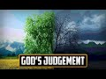

# GOD'S JUDGEMENT #shorts (2022-07-17 21:11:49+00:00)

## Description

You Can Support My Work on Patreon:
https://www.patreon.com/Bloggingtheology

My Paypal Link: 
https://www.paypal.com/paypalme/bloggingtheology?locale.x=en_GB

## Full transcript with timestamps

[0:00:00](https://youtu.be/_-qhqj7ZySU?t=0) here i am at speaker's corner  
[0:00:02](https://youtu.be/_-qhqj7ZySU?t=2) and judge between them o prophet by what  
[0:00:05](https://youtu.be/_-qhqj7ZySU?t=5) allah has revealed and do not follow  
[0:00:07](https://youtu.be/_-qhqj7ZySU?t=7) their desires and beware so they do not  
[0:00:10](https://youtu.be/_-qhqj7ZySU?t=10) lure you away from some of what allah  
[0:00:12](https://youtu.be/_-qhqj7ZySU?t=12) has revealed to you  
[0:00:14](https://youtu.be/_-qhqj7ZySU?t=14) if they turn away from allah's judgment  
[0:00:16](https://youtu.be/_-qhqj7ZySU?t=16) then know that it is allah's will to  
[0:00:18](https://youtu.be/_-qhqj7ZySU?t=18) repay them for some of their sins and  
[0:00:21](https://youtu.be/_-qhqj7ZySU?t=21) that many people are indeed rebellious  
[0:00:24](https://youtu.be/_-qhqj7ZySU?t=24) is it the judgment of pre-islamic  
[0:00:26](https://youtu.be/_-qhqj7ZySU?t=26) ignorance they seek who could be a  
[0:00:28](https://youtu.be/_-qhqj7ZySU?t=28) better judge than allah for people of  
[0:00:31](https://youtu.be/_-qhqj7ZySU?t=31) sure faith  
