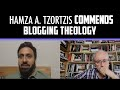

# Hamza A. Tzortzis commends Blogging Theology (2022-06-10)

## Description

You Can Support My Work on Patreon:
https://www.patreon.com/Bloggingtheology

My Paypal Link: 
https://www.paypal.com/paypalme/bloggingtheology?locale.x=en_GB

## Summary of [Hamza A. Tzortzis commends Blogging Theology](https://www.youtube.com/watch?v=xv32S5e-AUI)

*This summary is AI generated - there may be inaccuracies. *

### [00:00:00](https://www.youtube.com/watch?v=xv32S5e-AUI&t=0) - [00:00:00](https://www.youtube.com/watch?v=xv32S5e-AUI&t=0)

Hamza A. Tzortzis commends Blogging Theology for its "mature, intellectual, and spiritually vibrant" content. He also praises its guests, including himself, for their contributions. This is a positive review of the blog and its content.

**[00:00:00](https://www.youtube.com/watch?v=xv32S5e-AUI&t=0)** Hamza A. Tzortzis commends Blogging Theology for its "mature, intellectual, and spiritually vibrant" content. He also praises its guests, including himself, for their contributions.

<h2>Full transcript with timestamps: CLICK TO EXPAND</h2>

[0:00:01](https://youtu.be/xv32S5e-AUI?t=1) by the way i forgot to mention paul and  
[0:00:03](https://youtu.be/xv32S5e-AUI?t=3) i'm not saying this just to you know you  
[0:00:05](https://youtu.be/xv32S5e-AUI?t=5) know throw dust in your face but i have  
[0:00:06](https://youtu.be/xv32S5e-AUI?t=6) to admit your channel is probably the  
[0:00:09](https://youtu.be/xv32S5e-AUI?t=9) most  
[0:00:10](https://youtu.be/xv32S5e-AUI?t=10) mature  
[0:00:12](https://youtu.be/xv32S5e-AUI?t=12) intellectual spiritually vibrant channel  
[0:00:15](https://youtu.be/xv32S5e-AUI?t=15) uh that exists on youtube at the moment  
[0:00:18](https://youtu.be/xv32S5e-AUI?t=18) it is you know one of my favorite  
[0:00:21](https://youtu.be/xv32S5e-AUI?t=21) channels i do promote it often on  
[0:00:22](https://youtu.be/xv32S5e-AUI?t=22) twitter and i just have to say that it's  
[0:00:25](https://youtu.be/xv32S5e-AUI?t=25) an inspiration like you're an  
[0:00:27](https://youtu.be/xv32S5e-AUI?t=27) inspiration right  
[0:00:31](https://youtu.be/xv32S5e-AUI?t=31) if it is if it isn't inspiration it is  
[0:00:32](https://youtu.be/xv32S5e-AUI?t=32) because besides because of guests like  
[0:00:34](https://youtu.be/xv32S5e-AUI?t=34) yourself who come on and and bring that  
[0:00:36](https://youtu.be/xv32S5e-AUI?t=36) uh that that  
[0:00:38](https://youtu.be/xv32S5e-AUI?t=38) that content which uh  
[0:00:40](https://youtu.be/xv32S5e-AUI?t=40) is often not found in many other media  
[0:00:42](https://youtu.be/xv32S5e-AUI?t=42) so i i know the credit belongs to god  
[0:00:44](https://youtu.be/xv32S5e-AUI?t=44) but also to the guests who bring this  
[0:00:47](https://youtu.be/xv32S5e-AUI?t=47) content uh uh to to a wider audience to  
[0:00:50](https://youtu.be/xv32S5e-AUI?t=50) me obviously as well so thank you  
[0:00:52](https://youtu.be/xv32S5e-AUI?t=52) for that i mean i mean but yeah i wanted  
[0:00:54](https://youtu.be/xv32S5e-AUI?t=54) to say because as a form of  
[0:00:55](https://youtu.be/xv32S5e-AUI?t=55) encouragement we've known of each other  
[0:00:58](https://youtu.be/xv32S5e-AUI?t=58) for for years i think over a decade i've  
[0:01:00](https://youtu.be/xv32S5e-AUI?t=60) never had like proper conversations like  
[0:01:02](https://youtu.be/xv32S5e-AUI?t=62) this but just seeing what you've been  
[0:01:04](https://youtu.be/xv32S5e-AUI?t=64) able to achieve  
[0:01:05](https://youtu.be/xv32S5e-AUI?t=65) is phenomenal and also  
[0:01:07](https://youtu.be/xv32S5e-AUI?t=67) brothers and sisters coming from  
[0:01:09](https://youtu.be/xv32S5e-AUI?t=69) different spectrums of islamic thought i  
[0:01:11](https://youtu.be/xv32S5e-AUI?t=71) appreciate like there's one uh uh shafty  
[0:01:14](https://youtu.be/xv32S5e-AUI?t=74) scholar brother that i know from grenade  
[0:01:16](https://youtu.be/xv32S5e-AUI?t=76) mosque he called your he could  
[0:01:19](https://youtu.be/xv32S5e-AUI?t=79) he called your youtube channel the  
[0:01:20](https://youtu.be/xv32S5e-AUI?t=80) switzerland of the internet or something  
[0:01:22](https://youtu.be/xv32S5e-AUI?t=82) yeah yeah i heard that i had no idea  
[0:01:24](https://youtu.be/xv32S5e-AUI?t=84) what he meant by that and i asked some  
[0:01:26](https://youtu.be/xv32S5e-AUI?t=86) friends what does he mean and they come  
[0:01:28](https://youtu.be/xv32S5e-AUI?t=88) with different theories all of them very  
[0:01:29](https://youtu.be/xv32S5e-AUI?t=89) worrying actually  
[0:01:31](https://youtu.be/xv32S5e-AUI?t=91) so i thought okay i'll park that to one  
[0:01:33](https://youtu.be/xv32S5e-AUI?t=93) side and just move on  

