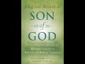

# How Jesus became a god. Two Yale Professors describe the historical process. (2021-02-07)

## Description

I read from 'King and Messiah as Son of God: Divine, Human, and Angelic Messianic Figures in Biblical and Related Literature' by Adela Yarbro Collins and John J Collins https://www.amazon.co.uk/King-Messiah-Son-God-Literature/dp/0802807720

## Summary of [How Jesus became a god. Two Yale Professors describe the historical process.](https://www.youtube.com/watch?v=EyFB37JK-m0)

*This summary is AI generated - there may be inaccuracies. *

### [00:00:00](https://www.youtube.com/watch?v=EyFB37JK-m0&t=0) - [00:10:00](https://www.youtube.com/watch?v=EyFB37JK-m0&t=600)

 two Yale professors explore how Jesus became a god in the first century. They discuss how his divinity was first perceived in functional terms and how his worship became an alternative to the worship of other agents of god. The authors conclude that this was a response to the imperial cults.

**[00:00:00](https://www.youtube.com/watch?v=EyFB37JK-m0&t=0)** The two Yale professors describe how Jesus became a god, focusing on how his divinity was first perceived in functional terms and how his worship became an alternative to the worship of other agents of god.
* **[00:05:00](https://www.youtube.com/watch?v=EyFB37JK-m0&t=300)** The authors of this book explore how the development of worship of Jesus as a god in the first century may have been influenced by the practices of the imperial Roman cults. Thomas' acclamation in John 20:28 is one example of this.
* **[00:10:00](https://www.youtube.com/watch?v=EyFB37JK-m0&t=600)** The two Yale professors describe how Jesus became a god, concluding that this was a response to the imperial cults.

<h2>Full transcript with timestamps: CLICK TO EXPAND</h2>

[0:00:01](https://youtu.be/EyFB37JK-m0?t=1) i've always found it interesting to 
consider historically how jesus became a god .  
[0:00:07](https://youtu.be/EyFB37JK-m0?t=7) and this particularly interesting work 
by two yale professors "king and messiah as    
[0:00:15](https://youtu.be/EyFB37JK-m0?t=15) son of god divine human and angelic messianic 
figures in biblical and related literature"   
[0:00:22](https://youtu.be/EyFB37JK-m0?t=22) this is an academic book written by scholars 
obviously for scholars and students of the new    
[0:00:28](https://youtu.be/EyFB37JK-m0?t=28) testament but these two yale professors  
describe the historical process by which    
[0:00:36](https://youtu.be/EyFB37JK-m0?t=36) jesus became a god . i just wanted to read 
a couple of paragraphs from a chapter i'll    
[0:00:43](https://youtu.be/EyFB37JK-m0?t=43) just read the text it is an academic language and 
then i'll make some interpretive comments on it    
[0:00:49](https://youtu.be/EyFB37JK-m0?t=49) and try and unpack what they are saying so bear 
with me as i read the text and then hopefully    
[0:00:54](https://youtu.be/EyFB37JK-m0?t=54) i'll make it clearer what i think they're getting 
at . i'm reading from a page 174 and the     
[0:01:02](https://youtu.be/EyFB37JK-m0?t=62) subheading here is the issue of worship : one of 
the key questions they say in the debate about the    
[0:01:08](https://youtu.be/EyFB37JK-m0?t=68) divinity of jesus has been whether he is worshiped 
in a way that principle agents of god are not .  
[0:01:18](https://youtu.be/EyFB37JK-m0?t=78) it is difficult to distinguish ancient 
texts and practices expressing political   
[0:01:23](https://youtu.be/EyFB37JK-m0?t=83) submission and respect on the one hand 
from practices that we will call religious    
[0:01:29](https://youtu.be/EyFB37JK-m0?t=89) which express worship and devotion on the other 
if jesus was seen as taking over god's functions    
[0:01:37](https://youtu.be/EyFB37JK-m0?t=97) as king , warrior and judge at the 
End (with a capital "E") as god's agent    
[0:01:44](https://youtu.be/EyFB37JK-m0?t=104) his divinity may have been perceived 
primarily in functional terms at first    
[0:01:50](https://youtu.be/EyFB37JK-m0?t=110) but the idea of a heavenly messiah opens the door 
to speculation and rhetoric about pre-existence .  
[0:01:57](https://youtu.be/EyFB37JK-m0?t=117) the notion of pre-existence intensifies the divine 
status of the heavenly messiah , similarly the    
[0:02:04](https://youtu.be/EyFB37JK-m0?t=124) honorific recognition as god's son is intensified 
in language about a virginal conception .  
[0:02:13](https://youtu.be/EyFB37JK-m0?t=133) the cultural environment must also be taken 
into account . in the hellenistic ruler cults and    
[0:02:21](https://youtu.be/EyFB37JK-m0?t=141) especially in the imperial cults men who were once 
human beings were honored and worshipped as gods .  
[0:02:30](https://youtu.be/EyFB37JK-m0?t=150) some were even worshipped as gods during their 
earthly lifetimes . the messiah of israel was    
[0:02:35](https://youtu.be/EyFB37JK-m0?t=155) conceived at first primarily as a king of his own 
nation first of all and then of the whole world .  
[0:02:45](https://youtu.be/EyFB37JK-m0?t=165) the understanding of jesus that emerged after his 
resurrection involved his kingship over israel and    
[0:02:52](https://youtu.be/EyFB37JK-m0?t=172) over the entire world . given the practices of 
imperial cults , it is not surprising that jesus    
[0:02:59](https://youtu.be/EyFB37JK-m0?t=179) was viewed as a god and that worship of him became 
an alternative to the worship of the emperor .  
[0:03:08](https://youtu.be/EyFB37JK-m0?t=188) end quote . so that's quite a tightly packed 
academic bit of analysis there . going back to    
[0:03:15](https://youtu.be/EyFB37JK-m0?t=195) the first paragraph one of the key questions 
about the divinity of jesus has been whether he    
[0:03:20](https://youtu.be/EyFB37JK-m0?t=200) is worshiped in a way that principle agents of 
god are not , so in other words is there something    
[0:03:26](https://youtu.be/EyFB37JK-m0?t=206) special about the divinity of the worship of 
jesus that is unique and quite different from    
[0:03:33](https://youtu.be/EyFB37JK-m0?t=213) the way that other agents of god were worshiped 
in a secondary sense not in the worship    
[0:03:38](https://youtu.be/EyFB37JK-m0?t=218) given to the one true god . and you talk about the 
difficulty of distinguishing in ancient texts    
[0:03:44](https://youtu.be/EyFB37JK-m0?t=224) and their practices . the differences between 
the political submission and respect    
[0:03:51](https://youtu.be/EyFB37JK-m0?t=231) on the one hand that's given to say a ruler and 
on the other what we would call now religious  
[0:03:59](https://youtu.be/EyFB37JK-m0?t=239) worship . now there's a footnote here and this is 
where it goes into the greek : the use of the verb    
[0:04:06](https://youtu.be/EyFB37JK-m0?t=246) proskunéō in the book of revelation 
with god and the lamb as objects (proskunéō  
[0:04:14](https://youtu.be/EyFB37JK-m0?t=254) is sometimes translated as worship so in the book 
of revelation god and the lamb meaning jesus are    
[0:04:21](https://youtu.be/EyFB37JK-m0?t=261) objects of worship) and then the same word is 
used with the community in philadelphia    
[0:04:28](https://youtu.be/EyFB37JK-m0?t=268) also as the object of proskunéō in chapter 
three verse nine , is a case in point they say .  
[0:04:37](https://youtu.be/EyFB37JK-m0?t=277) so the verb proskunéō 
(to worship) can have a political meaning    
[0:04:44](https://youtu.be/EyFB37JK-m0?t=284) even to the community in philadelphia and 
revelation 3 9 as well as be used in a more    
[0:04:50](https://youtu.be/EyFB37JK-m0?t=290) religious sense of worship . so then they 
talk about how jesus was first the king of    
[0:04:59](https://youtu.be/EyFB37JK-m0?t=299) israel this is after the ascension of jesus 
and then how his kingship was extended globally    
[0:05:07](https://youtu.be/EyFB37JK-m0?t=307) later on , but what i find particularly interesting 
in this paragraph is the penultimate paragraph , it    
[0:05:12](https://youtu.be/EyFB37JK-m0?t=312) says : the cultural environment must also be taken 
into account when we discuss the issue of worship    
[0:05:18](https://youtu.be/EyFB37JK-m0?t=318) was jesus worshipped as god . and 
they talk about the hellenistic ruler cults  
[0:05:24](https://youtu.be/EyFB37JK-m0?t=324) these are the the ruler cults in the greater 
roman world particularly the imperial cards to    
[0:05:29](https://youtu.be/EyFB37JK-m0?t=329) do with the roman emperor himself where men 
(emperors) who were once human beings were honored    
[0:05:36](https://youtu.be/EyFB37JK-m0?t=336) subsequently and worshipped as god . sometimes at 
their death the senate would in an honorific    
[0:05:43](https://youtu.be/EyFB37JK-m0?t=343) way say that they are now divine . but some were 
worshipped as gods even during their own lifetimes    
[0:05:50](https://youtu.be/EyFB37JK-m0?t=350) and they say : the messiah of israel jesus was 
conceived at first primarily as a king of his own    
[0:05:56](https://youtu.be/EyFB37JK-m0?t=356) nation israel and then of the whole world . and they 
say that : the understanding of jesus that emerged    
[0:06:03](https://youtu.be/EyFB37JK-m0?t=363) in the church after his resurrection ascension 
given the practices of the imperial roman cults .  
[0:06:12](https://youtu.be/EyFB37JK-m0?t=372) it's not surprising that as the gospel 
spread outside of israel into the great    
[0:06:18](https://youtu.be/EyFB37JK-m0?t=378) roman world mainly through the preaching of 
paul of course and the hellenistic christians    
[0:06:23](https://youtu.be/EyFB37JK-m0?t=383) not surprising that jesus also came 
to be viewed as a god and that worship was given    
[0:06:28](https://youtu.be/EyFB37JK-m0?t=388) to him as an alternative to the worship of the 
emperor . so this is how they say it's    
[0:06:37](https://youtu.be/EyFB37JK-m0?t=397) important that we look at the historical and 
cultural environment in the development of the    
[0:06:41](https://youtu.be/EyFB37JK-m0?t=401) worship of jesus as a god in the first century .
there's a fascinating little footnote here in  
[0:06:48](https://youtu.be/EyFB37JK-m0?t=408) the next chapter . chapter eight when the 
authors of this book are talking about how    
[0:06:56](https://youtu.be/EyFB37JK-m0?t=416) to translate the third clause of john 
1 1. this is john's gospel chapter one verse one .  
[0:07:02](https://youtu.be/EyFB37JK-m0?t=422) and the word was god in the beginning was the 
word and the word was with god and the word was    
[0:07:07](https://youtu.be/EyFB37JK-m0?t=427) god is the traditional christian translation .
they say john 1 1 may be translated either  
[0:07:14](https://youtu.be/EyFB37JK-m0?t=434) the word was god or the word was a god the 
word was a god . and then the footnote here   
[0:07:23](https://youtu.be/EyFB37JK-m0?t=443) talks about someone B.A. Mastin considers it 
overwhelmingly probable that john 1 1 describes    
[0:07:32](https://youtu.be/EyFB37JK-m0?t=452) the pre-existent logos as god in a particular work .
this conclusion though (they say) however is based  
[0:07:40](https://youtu.be/EyFB37JK-m0?t=460) on his view that thomas's acclamation in john 20 
28 . you remember where thomas acclaims jesus    
[0:07:48](https://youtu.be/EyFB37JK-m0?t=468) my lord and my god yeah an extraordinary statement .
so they say that : thomas's acclimation in 20 28    
[0:07:57](https://youtu.be/EyFB37JK-m0?t=477) is the one verse in the new testament which 
does unquestionably describe christ as god    
[0:08:02](https://youtu.be/EyFB37JK-m0?t=482) but they criticize this view . this view fails to 
recognize however that the phrase dominus edeus    
[0:08:10](https://youtu.be/EyFB37JK-m0?t=490) and presumably its greek equivalent is an 
honorific exclamation used for example by    
[0:08:17](https://youtu.be/EyFB37JK-m0?t=497) those who wish to flatter domitian ( domitian is 
the roman emperor) . so what are they saying here  
[0:08:23](https://youtu.be/EyFB37JK-m0?t=503) that they're saying : my lord and my god they're 
saying that john at the end of the first century    
[0:08:28](https://youtu.be/EyFB37JK-m0?t=508) is calling has thomas a claim to jesus my 
lord and my god which in latin is dominus deus .  
[0:08:37](https://youtu.be/EyFB37JK-m0?t=517) this is an honorific acclamation known to being 
used by those at that time in the end of the    
[0:08:44](https://youtu.be/EyFB37JK-m0?t=524) first century who wish to flatter domitian . 
domitian was a roman emperor of course . so what  
[0:08:49](https://youtu.be/EyFB37JK-m0?t=529) john is doing , he's saying no jesus is the lord 
and god not the roman emperor . so but of course the    
[0:08:58](https://youtu.be/EyFB37JK-m0?t=538) roman emperor wasn't really the absolute one high 
god of the universe he wasn't yahweh he wasn't    
[0:09:05](https://youtu.be/EyFB37JK-m0?t=545) the original . no one thought that he was zeus in 
an absolute sense . it was an honorific title . it  
[0:09:12](https://youtu.be/EyFB37JK-m0?t=552) was given to flatter him (the flash of the roman 
emperor) oh you're so marvelous you are the king    
[0:09:16](https://youtu.be/EyFB37JK-m0?t=556) you are the lord and god but they 
didn't really think that he was zeus or yahweh .  
[0:09:23](https://youtu.be/EyFB37JK-m0?t=563) in the same way on the lips of thomas , thomas 
is saying in effect : no jesus is dominus edeus    
[0:09:32](https://youtu.be/EyFB37JK-m0?t=572) not the roman emperor . so in a similar way we 
shouldn't take these words in the strongest    
[0:09:38](https://youtu.be/EyFB37JK-m0?t=578) sense of actually asserting that jesus is yahweh 
no that's not quite what's going on here .  
[0:09:44](https://youtu.be/EyFB37JK-m0?t=584) it's the greek gospel equivalent or 
the title that was known to be used to flatter  
[0:09:51](https://youtu.be/EyFB37JK-m0?t=591) the roman emperor and that's what the gospel 
writer is using that term to make his own point .  
[0:09:57](https://youtu.be/EyFB37JK-m0?t=597) that kind of makes sense . so i think these 
two writers i'll just perhaps say a bit    
[0:10:04](https://youtu.be/EyFB37JK-m0?t=604) more about them one is Adela Yarbro Collins professor 
of new testament criticism interpretation at yale    
[0:10:10](https://youtu.be/EyFB37JK-m0?t=610) university . the other is John J. Collins professor 
of old testament criticism interpretation at yale    
[0:10:16](https://youtu.be/EyFB37JK-m0?t=616) university . i get the impression they are a 
married couple have an extraordinary marriage    
[0:10:19](https://youtu.be/EyFB37JK-m0?t=619) one is professor in the new testament . the other is a  
professor in the old testament both at yale . they    
[0:10:24](https://youtu.be/EyFB37JK-m0?t=624) both co-authored this . so the chapters to do 
with the old testament written by one person    
[0:10:28](https://youtu.be/EyFB37JK-m0?t=628) and the new testament by the other person
in the marriage so to speak .  
[0:10:35](https://youtu.be/EyFB37JK-m0?t=635) but these are world-class experts and they 
clearly see the issue of worship    
[0:10:42](https://youtu.be/EyFB37JK-m0?t=642) we need to take into the cultural environment 
take that into account when we understand    
[0:10:49](https://youtu.be/EyFB37JK-m0?t=649) why gentile christians ultimately came to 
worship jesus as god as a counterpoint    
[0:10:56](https://youtu.be/EyFB37JK-m0?t=656) as a way of saying no we don't we're not going to 
worship the emperor we're going to worship jesus .  
[0:11:01](https://youtu.be/EyFB37JK-m0?t=661) you know he is our king but of course this is 
a later development it's not something that    
[0:11:06](https://youtu.be/EyFB37JK-m0?t=666) we find in the earliest jesus tradition . the 
evidence suggests that wasn't present at all .  
[0:11:13](https://youtu.be/EyFB37JK-m0?t=673) so as they say in the last sentence 
given : the practice of the imperial    
[0:11:17](https://youtu.be/EyFB37JK-m0?t=677) cults (the roman imperial cults) it's not 
surprising that jesus was viewed as a god    
[0:11:22](https://youtu.be/EyFB37JK-m0?t=682) and that worship of him became an alternative to 
the worship of the roman emperor . so that's their    
[0:11:30](https://youtu.be/EyFB37JK-m0?t=690) insight . i think that's quite an astute comment 
and yeah what do you think . till next time  

