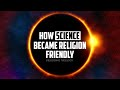

# How Science Became Religion Friendly with Prof Keith Ward (2022-05-02)

## Description

The Priority of Mind by Keith Ward https://www.amazon.co.uk/gp/product/1666735280/ref=ox_sc_act_title_2?smid=A3P5ROKL5A1OLE&psc=1
Religion and the quantum world lecture https://www.gresham.ac.uk/watch-now/religion-and-quantum-world
For a Muslim view of science and quantum mechanics see: https://thehumblei.com/2012/11/17/look-and-ye-shall-see/

You Can Support My Work on Patreon:
https://www.patreon.com/Bloggingtheology

My Paypal Link: 
https://www.paypal.com/paypalme/bloggingtheology?locale.x=en_GB

## Summary of [How Science Became Religion Friendly with Prof Keith Ward](https://www.youtube.com/watch?v=SqfTLlb1lSw)

*This summary is AI generated - there may be inaccuracies. *

### [00:00:00](https://www.youtube.com/watch?v=SqfTLlb1lSw&t=0) - [00:45:00](https://www.youtube.com/watch?v=SqfTLlb1lSw&t=2700)

 Keith Ward discusses how science has become more religion-friendly in recent years, with the introduction of quantum mechanics and field theory. These theories suggest that there is no certain reality, only probabilities. Although this change in perspective may be difficult to accept at first, it is ultimately a more accurate portrayal of reality.

**[00:00:00](https://www.youtube.com/watch?v=SqfTLlb1lSw&t=0)** Keith Ward discusses how the quantum revolution has led to a new understanding of reality, which includes the idea of an infinite field that gives mass to particles. He explains how the wave-particle duality is accepted by most particle physicists, but is still difficult to understand.
* **[00:05:00](https://www.youtube.com/watch?v=SqfTLlb1lSw&t=300)** Keith Ward explains how science has become more religion-friendly, with the introduction of quantum mechanics and field theory. These theories suggest that there is no certain reality, only probabilities. Although this change in perspective may be difficult to accept at first, it is ultimately a more accurate portrayal of reality.
* **[00:10:00](https://www.youtube.com/watch?v=SqfTLlb1lSw&t=600)* Discusses how science has become more religion-friendly, with Prof. Keith Ward stating that the bottom line is that what we seem to have in reality is constructs, or mathematical waves. When we observe these waves, they turn into particles. This raises the question of whether or not materialism is appropriate or adequate for quantum mechanics, which some say is much more complex than simply dealing with discrete balls. It is still a widely held belief among some quantum theorists that every possible universe exists, and that our universe is just one of many.
* **[00:15:00](https://www.youtube.com/watch?v=SqfTLlb1lSw&t=900)* Discusses how science has become more religion-friendly in recent years, with Keith Ward stating that reality is not like we think it is, and that there are fundamental particles that are not located in specific places or with specific momentum.
* **[00:20:00](https://www.youtube.com/watch?v=SqfTLlb1lSw&t=1200)* Discusses how science has become more religion-friendly over the years, with the introduction of concepts such as indeterminacy, entanglement, and the principle of indeterminacy. It argues that these concepts are more realistic and allow for divine action in the universe without violating any laws.
* **[00:25:00](https://www.youtube.com/watch?v=SqfTLlb1lSw&t=1500)* Discusses how science has become more religion-friendly over the years, with some physicists rejecting the idea of a divine being. They argue that consciousness is fundamental matter and that all real things are consciousnesses' contents.
* **[00:30:00](https://www.youtube.com/watch?v=SqfTLlb1lSw&t=1800)**  theologian Keith Ward discusses how science has become more religious-friendly in recent years, with quantum physicists such as John Paul Cohen recognizing that the world has changed and we need to see matter not as the one important and ultimate reality, but as something manifesting something more mysterious beyond it. Ward also points out that although biology is difficult for believers to understand, it ultimately depends on physics for its understanding.
* **[00:35:00](https://www.youtube.com/watch?v=SqfTLlb1lSw&t=2100)** Keith Ward discusses how science has become religion-friendly by exploring the biology side of things. He argues that, if our minds are prior to our conscious minds, then our brains are the product of a more fundamental consciousness. Ward also makes the distinction between ideas in God and those that are perceptible to humans. He reassures us that, even though the concepts of matter and consciousness are relative, they are still reassuring.
* **[00:40:00](https://www.youtube.com/watch?v=SqfTLlb1lSw&t=2400)** Keith Ward discusses how science has become more religion-friendly, with probabilistic processes leading to increased complexity and organization over time. He likens this trajectory to the development of a baby, and says that if everyone accepts this as not being "progress," then they do not know what progress is.
* **[00:45:00](https://www.youtube.com/watch?v=SqfTLlb1lSw&t=2700)** Keith Ward discusses how science has become more religion-friendly in recent years, including one recent development that he discusses.

## Full transcript with timestamps

[0:00:02](https://youtu.be/SqfTLlb1lSw?t=2) okay so hello everyone and welcome to  
[0:00:06](https://youtu.be/SqfTLlb1lSw?t=6) blogging theology uh today i'm delighted  
[0:00:09](https://youtu.be/SqfTLlb1lSw?t=9) to talk again to professor keith ward  
[0:00:12](https://youtu.be/SqfTLlb1lSw?t=12) you're most welcome sir  
[0:00:14](https://youtu.be/SqfTLlb1lSw?t=14) hello yeah thank you um we we spoke to  
[0:00:18](https://youtu.be/SqfTLlb1lSw?t=18) uh keith ward uh i think it was april  
[0:00:19](https://youtu.be/SqfTLlb1lSw?t=19) last year so it's been just over a year  
[0:00:22](https://youtu.be/SqfTLlb1lSw?t=22) since um he was a guest on blogging  
[0:00:24](https://youtu.be/SqfTLlb1lSw?t=24) theology and for those who don't know  
[0:00:25](https://youtu.be/SqfTLlb1lSw?t=25) keith is actually an english anglican  
[0:00:28](https://youtu.be/SqfTLlb1lSw?t=28) priest philosopher and  
[0:00:30](https://youtu.be/SqfTLlb1lSw?t=30) theologian  
[0:00:31](https://youtu.be/SqfTLlb1lSw?t=31) he is a fellow of the british academy  
[0:00:34](https://youtu.be/SqfTLlb1lSw?t=34) and a priest of the church of england  
[0:00:37](https://youtu.be/SqfTLlb1lSw?t=37) comparative theology and the  
[0:00:38](https://youtu.be/SqfTLlb1lSw?t=38) relationship between science and  
[0:00:41](https://youtu.be/SqfTLlb1lSw?t=41) religion are two of his main topics of  
[0:00:44](https://youtu.be/SqfTLlb1lSw?t=44) interest  
[0:00:45](https://youtu.be/SqfTLlb1lSw?t=45) and he was regis professor of divinity  
[0:00:47](https://youtu.be/SqfTLlb1lSw?t=47) at the university of oxford from 1991 to  
[0:00:51](https://youtu.be/SqfTLlb1lSw?t=51) 2004. now some years ago when i worked  
[0:00:55](https://youtu.be/SqfTLlb1lSw?t=55) in holborn which is part of central  
[0:00:57](https://youtu.be/SqfTLlb1lSw?t=57) london i was in the audience when keith  
[0:01:00](https://youtu.be/SqfTLlb1lSw?t=60) gave a lunchtime lecture at gresham  
[0:01:03](https://youtu.be/SqfTLlb1lSw?t=63) college which by the way has been giving  
[0:01:05](https://youtu.be/SqfTLlb1lSw?t=65) lectures to the public since 1592. i kid  
[0:01:08](https://youtu.be/SqfTLlb1lSw?t=68) you not and the lecture was entitled  
[0:01:11](https://youtu.be/SqfTLlb1lSw?t=71) religion and the quantum world religion  
[0:01:13](https://youtu.be/SqfTLlb1lSw?t=73) in the quantum world and i remember  
[0:01:15](https://youtu.be/SqfTLlb1lSw?t=75) being utterly enthralled and fascinated  
[0:01:18](https://youtu.be/SqfTLlb1lSw?t=78) by the presentation which amongst other  
[0:01:21](https://youtu.be/SqfTLlb1lSw?t=81) things  
[0:01:22](https://youtu.be/SqfTLlb1lSw?t=82) demonstrated why materialism this uh  
[0:01:25](https://youtu.be/SqfTLlb1lSw?t=85) materialist doctrine is no longer  
[0:01:28](https://youtu.be/SqfTLlb1lSw?t=88) terrible  
[0:01:29](https://youtu.be/SqfTLlb1lSw?t=89) and why idealism philosophical idealism  
[0:01:32](https://youtu.be/SqfTLlb1lSw?t=92) is a much more plausible worldview now  
[0:01:34](https://youtu.be/SqfTLlb1lSw?t=94) all this in the light of quantum  
[0:01:37](https://youtu.be/SqfTLlb1lSw?t=97) mechanics in other words in light of the  
[0:01:39](https://youtu.be/SqfTLlb1lSw?t=99) new physics modern physics  
[0:01:41](https://youtu.be/SqfTLlb1lSw?t=101) so today keith has very kindly agreed to  
[0:01:44](https://youtu.be/SqfTLlb1lSw?t=104) discuss this subject again on blogging  
[0:01:46](https://youtu.be/SqfTLlb1lSw?t=106) theology so would you like to introduce  
[0:01:49](https://youtu.be/SqfTLlb1lSw?t=109) us to this topic keith  
[0:01:51](https://youtu.be/SqfTLlb1lSw?t=111) right well thank you paul um yes i can't  
[0:01:54](https://youtu.be/SqfTLlb1lSw?t=114) remember my  
[0:01:56](https://youtu.be/SqfTLlb1lSw?t=116) gresham college lecture but i i've  
[0:01:58](https://youtu.be/SqfTLlb1lSw?t=118) gotten some more things i can say  
[0:02:01](https://youtu.be/SqfTLlb1lSw?t=121) and i do think you're right you stated  
[0:02:04](https://youtu.be/SqfTLlb1lSw?t=124) it very carefully and accurately i  
[0:02:06](https://youtu.be/SqfTLlb1lSw?t=126) thought that materialism is no longer a  
[0:02:09](https://youtu.be/SqfTLlb1lSw?t=129) scientific option  
[0:02:11](https://youtu.be/SqfTLlb1lSw?t=131) but  
[0:02:12](https://youtu.be/SqfTLlb1lSw?t=132) idealism is more plausible it's not  
[0:02:16](https://youtu.be/SqfTLlb1lSw?t=136) overwhelmingly obvious  
[0:02:18](https://youtu.be/SqfTLlb1lSw?t=138) even the quantum physicists but lots of  
[0:02:21](https://youtu.be/SqfTLlb1lSw?t=141) them do accept it so what i do is i take  
[0:02:24](https://youtu.be/SqfTLlb1lSw?t=144) three of the major themes of quantum  
[0:02:27](https://youtu.be/SqfTLlb1lSw?t=147) theory  
[0:02:28](https://youtu.be/SqfTLlb1lSw?t=148) and i won't be technical so there's a  
[0:02:31](https://youtu.be/SqfTLlb1lSw?t=151) bit of over simplification going on  
[0:02:33](https://youtu.be/SqfTLlb1lSw?t=153) there are no equations or diagrams  
[0:02:37](https://youtu.be/SqfTLlb1lSw?t=157) but these three things  
[0:02:39](https://youtu.be/SqfTLlb1lSw?t=159) are what have changed physics out of all  
[0:02:43](https://youtu.be/SqfTLlb1lSw?t=163) recognition  
[0:02:44](https://youtu.be/SqfTLlb1lSw?t=164) since 1905.  
[0:02:47](https://youtu.be/SqfTLlb1lSw?t=167) the quantum revolution started in 1905  
[0:02:50](https://youtu.be/SqfTLlb1lSw?t=170) with a paper by einstein  
[0:02:52](https://youtu.be/SqfTLlb1lSw?t=172) which proved that  
[0:02:55](https://youtu.be/SqfTLlb1lSw?t=175) light  
[0:02:56](https://youtu.be/SqfTLlb1lSw?t=176) doesn't only move in waves  
[0:02:58](https://youtu.be/SqfTLlb1lSw?t=178) light waves but  
[0:03:01](https://youtu.be/SqfTLlb1lSw?t=181) moves in particles  
[0:03:02](https://youtu.be/SqfTLlb1lSw?t=182) uh quanta  
[0:03:04](https://youtu.be/SqfTLlb1lSw?t=184) and that's why it's called the quantum  
[0:03:06](https://youtu.be/SqfTLlb1lSw?t=186) revelation and so the first thing i want  
[0:03:08](https://youtu.be/SqfTLlb1lSw?t=188) to talk about briefly  
[0:03:10](https://youtu.be/SqfTLlb1lSw?t=190) is the wave  
[0:03:11](https://youtu.be/SqfTLlb1lSw?t=191) particle duality which all particle  
[0:03:15](https://youtu.be/SqfTLlb1lSw?t=195) physicists accept  
[0:03:17](https://youtu.be/SqfTLlb1lSw?t=197) but nobody understands as richard  
[0:03:20](https://youtu.be/SqfTLlb1lSw?t=200) feynman a very leading practitioner said  
[0:03:23](https://youtu.be/SqfTLlb1lSw?t=203) no one understands quantum mechanics so  
[0:03:26](https://youtu.be/SqfTLlb1lSw?t=206) i'm not going to pretend that i do if  
[0:03:28](https://youtu.be/SqfTLlb1lSw?t=208) richard feynman did i certainly couldn't  
[0:03:31](https://youtu.be/SqfTLlb1lSw?t=211) possibly  
[0:03:32](https://youtu.be/SqfTLlb1lSw?t=212) but it works that is to say we wouldn't  
[0:03:34](https://youtu.be/SqfTLlb1lSw?t=214) have mobile phones or any the computers  
[0:03:37](https://youtu.be/SqfTLlb1lSw?t=217) anything like that without quantum  
[0:03:39](https://youtu.be/SqfTLlb1lSw?t=219) mechanics it definitely works it's what  
[0:03:41](https://youtu.be/SqfTLlb1lSw?t=221) it means or what it implies about  
[0:03:44](https://youtu.be/SqfTLlb1lSw?t=224) reality that is so difficult  
[0:03:47](https://youtu.be/SqfTLlb1lSw?t=227) and the way particle duality can be put  
[0:03:49](https://youtu.be/SqfTLlb1lSw?t=229) um picturesquely by looking at higgs  
[0:03:52](https://youtu.be/SqfTLlb1lSw?t=232) boson  
[0:03:53](https://youtu.be/SqfTLlb1lSw?t=233) that was in the news fairly recently uh  
[0:03:56](https://youtu.be/SqfTLlb1lSw?t=236) when i say recently i mean in the last  
[0:03:58](https://youtu.be/SqfTLlb1lSw?t=238) 10 years i suppose and uh  
[0:04:01](https://youtu.be/SqfTLlb1lSw?t=241) higgs boson  
[0:04:03](https://youtu.be/SqfTLlb1lSw?t=243) is was said to be a particle a particle  
[0:04:06](https://youtu.be/SqfTLlb1lSw?t=246) discovered in cern in geneva  
[0:04:09](https://youtu.be/SqfTLlb1lSw?t=249) uh which uh that battle gives mass  
[0:04:13](https://youtu.be/SqfTLlb1lSw?t=253) to all objects in the universe  
[0:04:16](https://youtu.be/SqfTLlb1lSw?t=256) and you may say how can a particle give  
[0:04:18](https://youtu.be/SqfTLlb1lSw?t=258) master everything in the universe  
[0:04:20](https://youtu.be/SqfTLlb1lSw?t=260) and the answer to that is totally weird  
[0:04:23](https://youtu.be/SqfTLlb1lSw?t=263) but correct  
[0:04:24](https://youtu.be/SqfTLlb1lSw?t=264) and it is  
[0:04:25](https://youtu.be/SqfTLlb1lSw?t=265) that the higgs boson as a particle  
[0:04:29](https://youtu.be/SqfTLlb1lSw?t=269) is the signature particle of an infinite  
[0:04:32](https://youtu.be/SqfTLlb1lSw?t=272) field  
[0:04:33](https://youtu.be/SqfTLlb1lSw?t=273) which ascends like gravity throughout  
[0:04:36](https://youtu.be/SqfTLlb1lSw?t=276) the whole universe and it does in fact  
[0:04:38](https://youtu.be/SqfTLlb1lSw?t=278) give mass to particles which pass  
[0:04:42](https://youtu.be/SqfTLlb1lSw?t=282) through it  
[0:04:43](https://youtu.be/SqfTLlb1lSw?t=283) so it's not just a particle it's a field  
[0:04:45](https://youtu.be/SqfTLlb1lSw?t=285) and feel the theory as what is taken  
[0:04:48](https://youtu.be/SqfTLlb1lSw?t=288) over really from particle theory so  
[0:04:50](https://youtu.be/SqfTLlb1lSw?t=290) people used to think well atoms are like  
[0:04:52](https://youtu.be/SqfTLlb1lSw?t=292) little billiard balls and they bump into  
[0:04:54](https://youtu.be/SqfTLlb1lSw?t=294) one another and they make up more  
[0:04:56](https://youtu.be/SqfTLlb1lSw?t=296) complicated things well  
[0:04:58](https://youtu.be/SqfTLlb1lSw?t=298) nowadays  
[0:05:00](https://youtu.be/SqfTLlb1lSw?t=300) quantum mechanisms say well it's not  
[0:05:02](https://youtu.be/SqfTLlb1lSw?t=302) that items don't exist it's that they're  
[0:05:05](https://youtu.be/SqfTLlb1lSw?t=305) actually um things that we seem to  
[0:05:08](https://youtu.be/SqfTLlb1lSw?t=308) observe but show a deeper reality which  
[0:05:12](https://youtu.be/SqfTLlb1lSw?t=312) are fields of force you know everybody  
[0:05:14](https://youtu.be/SqfTLlb1lSw?t=314) knows the one equation i'm sorry i'm  
[0:05:16](https://youtu.be/SqfTLlb1lSw?t=316) going to mention one equation but  
[0:05:18](https://youtu.be/SqfTLlb1lSw?t=318) everybody knows this one e equals m c  
[0:05:20](https://youtu.be/SqfTLlb1lSw?t=320) squared  
[0:05:22](https://youtu.be/SqfTLlb1lSw?t=322) energy is mass times the speed of light  
[0:05:25](https://youtu.be/SqfTLlb1lSw?t=325) squared  
[0:05:27](https://youtu.be/SqfTLlb1lSw?t=327) energy and mass are equivalent in other  
[0:05:29](https://youtu.be/SqfTLlb1lSw?t=329) words so  
[0:05:30](https://youtu.be/SqfTLlb1lSw?t=330) mass that's which makes little particles  
[0:05:32](https://youtu.be/SqfTLlb1lSw?t=332) which is things which makes them heavy  
[0:05:35](https://youtu.be/SqfTLlb1lSw?t=335) uh is identical with energy which takes  
[0:05:38](https://youtu.be/SqfTLlb1lSw?t=338) many different forms so it doesn't have  
[0:05:40](https://youtu.be/SqfTLlb1lSw?t=340) to be material it doesn't have to be  
[0:05:43](https://youtu.be/SqfTLlb1lSw?t=343) stuff heavy stuff right  
[0:05:46](https://youtu.be/SqfTLlb1lSw?t=346) so when you talk about waves and  
[0:05:47](https://youtu.be/SqfTLlb1lSw?t=347) particles um you're saying something  
[0:05:50](https://youtu.be/SqfTLlb1lSw?t=350) rather complex so i'll give you the  
[0:05:51](https://youtu.be/SqfTLlb1lSw?t=351) formula straight away in english and  
[0:05:53](https://youtu.be/SqfTLlb1lSw?t=353) that is that um  
[0:05:57](https://youtu.be/SqfTLlb1lSw?t=357) there are probability waves these are  
[0:06:00](https://youtu.be/SqfTLlb1lSw?t=360) waves they're  
[0:06:01](https://youtu.be/SqfTLlb1lSw?t=361) not physical waves they're probability  
[0:06:03](https://youtu.be/SqfTLlb1lSw?t=363) waves  
[0:06:05](https://youtu.be/SqfTLlb1lSw?t=365) and if you take the square of the  
[0:06:08](https://youtu.be/SqfTLlb1lSw?t=368) amplitude of a probability wave  
[0:06:12](https://youtu.be/SqfTLlb1lSw?t=372) it will give you the probability of  
[0:06:14](https://youtu.be/SqfTLlb1lSw?t=374) finding a particle at some point well  
[0:06:17](https://youtu.be/SqfTLlb1lSw?t=377) that's a big complicated but what it  
[0:06:19](https://youtu.be/SqfTLlb1lSw?t=379) means is um there's a huge argument in  
[0:06:22](https://youtu.be/SqfTLlb1lSw?t=382) quantum mechanics about whether waves  
[0:06:24](https://youtu.be/SqfTLlb1lSw?t=384) actually exist or whether they are  
[0:06:26](https://youtu.be/SqfTLlb1lSw?t=386) mathematical constructs which because  
[0:06:29](https://youtu.be/SqfTLlb1lSw?t=389) you've got to square them together the  
[0:06:31](https://youtu.be/SqfTLlb1lSw?t=391) probability of founding particle the  
[0:06:34](https://youtu.be/SqfTLlb1lSw?t=394) important thing is that probability has  
[0:06:36](https://youtu.be/SqfTLlb1lSw?t=396) taken over from certainty right if you  
[0:06:39](https://youtu.be/SqfTLlb1lSw?t=399) look at newtonian physics it looks as  
[0:06:41](https://youtu.be/SqfTLlb1lSw?t=401) though everything's certain if you get  
[0:06:43](https://youtu.be/SqfTLlb1lSw?t=403) your initial parameters correct you can  
[0:06:46](https://youtu.be/SqfTLlb1lSw?t=406) predict what's going to happen next  
[0:06:48](https://youtu.be/SqfTLlb1lSw?t=408) incidentally uh um newton himself didn't  
[0:06:51](https://youtu.be/SqfTLlb1lSw?t=411) believe that but that's what other  
[0:06:52](https://youtu.be/SqfTLlb1lSw?t=412) people made of newton so they  
[0:06:54](https://youtu.be/SqfTLlb1lSw?t=414) yeah no  
[0:06:56](https://youtu.be/SqfTLlb1lSw?t=416) i didn't realize that that's an  
[0:06:57](https://youtu.be/SqfTLlb1lSw?t=417) interesting caveat there yeah right  
[0:06:59](https://youtu.be/SqfTLlb1lSw?t=419) but um he thought  
[0:07:01](https://youtu.be/SqfTLlb1lSw?t=421) gravity was actually  
[0:07:03](https://youtu.be/SqfTLlb1lSw?t=423) objects were connected at a distance by  
[0:07:06](https://youtu.be/SqfTLlb1lSw?t=426) god  
[0:07:07](https://youtu.be/SqfTLlb1lSw?t=427) but he didn't say that in his physics he  
[0:07:09](https://youtu.be/SqfTLlb1lSw?t=429) just said we won't talk about that  
[0:07:11](https://youtu.be/SqfTLlb1lSw?t=431) um so anyway he did i have the things  
[0:07:14](https://youtu.be/SqfTLlb1lSw?t=434) other people interpret it as a a  
[0:07:17](https://youtu.be/SqfTLlb1lSw?t=437) deterministic  
[0:07:20](https://youtu.be/SqfTLlb1lSw?t=440) relationship between things so you could  
[0:07:21](https://youtu.be/SqfTLlb1lSw?t=441) predict everything from one initial  
[0:07:23](https://youtu.be/SqfTLlb1lSw?t=443) state  
[0:07:25](https://youtu.be/SqfTLlb1lSw?t=445) now in field theory and quantum  
[0:07:27](https://youtu.be/SqfTLlb1lSw?t=447) mechanics that's not true you can only  
[0:07:29](https://youtu.be/SqfTLlb1lSw?t=449) predict probabilities  
[0:07:31](https://youtu.be/SqfTLlb1lSw?t=451) and that's very important because of  
[0:07:32](https://youtu.be/SqfTLlb1lSw?t=452) course the improbable things can happen  
[0:07:35](https://youtu.be/SqfTLlb1lSw?t=455) in fact some uh quantum mechanisms  
[0:07:38](https://youtu.be/SqfTLlb1lSw?t=458) including um  
[0:07:40](https://youtu.be/SqfTLlb1lSw?t=460) brian cox of television fame  
[0:07:43](https://youtu.be/SqfTLlb1lSw?t=463) he actually wrote a book called  
[0:07:45](https://youtu.be/SqfTLlb1lSw?t=465) everything that can happen  
[0:07:47](https://youtu.be/SqfTLlb1lSw?t=467) does happen so he really wants even the  
[0:07:50](https://youtu.be/SqfTLlb1lSw?t=470) very improbable things to happen  
[0:07:52](https://youtu.be/SqfTLlb1lSw?t=472) somewhere maybe not in this universe but  
[0:07:54](https://youtu.be/SqfTLlb1lSw?t=474) it's in some universe that's just to  
[0:07:56](https://youtu.be/SqfTLlb1lSw?t=476) show you how far quantum mechanics has  
[0:07:59](https://youtu.be/SqfTLlb1lSw?t=479) moved away from newton's idea of one  
[0:08:03](https://youtu.be/SqfTLlb1lSw?t=483) absolute space in which you locate  
[0:08:06](https://youtu.be/SqfTLlb1lSw?t=486) little massive  
[0:08:07](https://youtu.be/SqfTLlb1lSw?t=487) heavy  
[0:08:08](https://youtu.be/SqfTLlb1lSw?t=488) gravitational bodies and instead you've  
[0:08:11](https://youtu.be/SqfTLlb1lSw?t=491) got an einsteinian space which is bendy  
[0:08:14](https://youtu.be/SqfTLlb1lSw?t=494) which space time bends  
[0:08:17](https://youtu.be/SqfTLlb1lSw?t=497) and moves around and shifts so it's not  
[0:08:20](https://youtu.be/SqfTLlb1lSw?t=500) an absolute reality  
[0:08:22](https://youtu.be/SqfTLlb1lSw?t=502) uh and you have a probabilistic wave  
[0:08:25](https://youtu.be/SqfTLlb1lSw?t=505) fields which give you the probability of  
[0:08:28](https://youtu.be/SqfTLlb1lSw?t=508) finding particles but they're not  
[0:08:29](https://youtu.be/SqfTLlb1lSw?t=509) themselves particles  
[0:08:32](https://youtu.be/SqfTLlb1lSw?t=512) one other example i'll take simply is  
[0:08:34](https://youtu.be/SqfTLlb1lSw?t=514) that an electron when i was in school i  
[0:08:36](https://youtu.be/SqfTLlb1lSw?t=516) was told that electron was a little  
[0:08:38](https://youtu.be/SqfTLlb1lSw?t=518) thing like a planet  
[0:08:40](https://youtu.be/SqfTLlb1lSw?t=520) uh of negative electric charge moved  
[0:08:43](https://youtu.be/SqfTLlb1lSw?t=523) around the nucleus of an atom which had  
[0:08:45](https://youtu.be/SqfTLlb1lSw?t=525) a positive charge now that is is totally  
[0:08:48](https://youtu.be/SqfTLlb1lSw?t=528) wrong because electrons aren't  
[0:08:52](https://youtu.be/SqfTLlb1lSw?t=532) just particles that there are  
[0:08:54](https://youtu.be/SqfTLlb1lSw?t=534) probabilities of fatty particles under  
[0:08:57](https://youtu.be/SqfTLlb1lSw?t=537) certain experimental conditions but if  
[0:08:59](https://youtu.be/SqfTLlb1lSw?t=539) you say what is really there it's not a  
[0:09:02](https://youtu.be/SqfTLlb1lSw?t=542) particle well the particle comes about  
[0:09:04](https://youtu.be/SqfTLlb1lSw?t=544) when it's observed  
[0:09:06](https://youtu.be/SqfTLlb1lSw?t=546) um  
[0:09:07](https://youtu.be/SqfTLlb1lSw?t=547) quantum mechanisms talk about collapsing  
[0:09:10](https://youtu.be/SqfTLlb1lSw?t=550) the wave function so you have a wave  
[0:09:12](https://youtu.be/SqfTLlb1lSw?t=552) function which is a very mathematical uh  
[0:09:15](https://youtu.be/SqfTLlb1lSw?t=555) entity and you collapse that  
[0:09:17](https://youtu.be/SqfTLlb1lSw?t=557) and you see a particle  
[0:09:19](https://youtu.be/SqfTLlb1lSw?t=559) uh let me  
[0:09:21](https://youtu.be/SqfTLlb1lSw?t=561) just final remark about that  
[0:09:23](https://youtu.be/SqfTLlb1lSw?t=563) element that i'm talking about i'm going  
[0:09:25](https://youtu.be/SqfTLlb1lSw?t=565) to mention uh the the john wheeler uh  
[0:09:29](https://youtu.be/SqfTLlb1lSw?t=569) delayed choice  
[0:09:31](https://youtu.be/SqfTLlb1lSw?t=571) a double split experiment or drum um  
[0:09:35](https://youtu.be/SqfTLlb1lSw?t=575) so what this is is you have a you fire  
[0:09:39](https://youtu.be/SqfTLlb1lSw?t=579) photons  
[0:09:40](https://youtu.be/SqfTLlb1lSw?t=580) uh through  
[0:09:42](https://youtu.be/SqfTLlb1lSw?t=582) two slits  
[0:09:43](https://youtu.be/SqfTLlb1lSw?t=583) and uh if it's a photon that you've got  
[0:09:46](https://youtu.be/SqfTLlb1lSw?t=586) if it's a particle then it will go  
[0:09:49](https://youtu.be/SqfTLlb1lSw?t=589) through one slit or the other slit but  
[0:09:51](https://youtu.be/SqfTLlb1lSw?t=591) not both right and it will produce on a  
[0:09:55](https://youtu.be/SqfTLlb1lSw?t=595) screen on the other side of the slit it  
[0:09:58](https://youtu.be/SqfTLlb1lSw?t=598) will produce a wave interference pattern  
[0:10:00](https://youtu.be/SqfTLlb1lSw?t=600) which is like a  
[0:10:01](https://youtu.be/SqfTLlb1lSw?t=601) bad widths of uh bandwidth as if waves  
[0:10:04](https://youtu.be/SqfTLlb1lSw?t=604) went to the shore you get a pattern of  
[0:10:06](https://youtu.be/SqfTLlb1lSw?t=606) sounds right  
[0:10:08](https://youtu.be/SqfTLlb1lSw?t=608) so that shows that light is a wave but  
[0:10:12](https://youtu.be/SqfTLlb1lSw?t=612) if you shoot a photon through a double  
[0:10:14](https://youtu.be/SqfTLlb1lSw?t=614) slit and you  
[0:10:16](https://youtu.be/SqfTLlb1lSw?t=616) record you observe  
[0:10:19](https://youtu.be/SqfTLlb1lSw?t=619) it's doing so by having a device which  
[0:10:21](https://youtu.be/SqfTLlb1lSw?t=621) will record which slit it goes through  
[0:10:24](https://youtu.be/SqfTLlb1lSw?t=624) remember it's supposed to only go  
[0:10:25](https://youtu.be/SqfTLlb1lSw?t=625) through one or  
[0:10:27](https://youtu.be/SqfTLlb1lSw?t=627) it goes through both we don't know which  
[0:10:30](https://youtu.be/SqfTLlb1lSw?t=630) well if you observe it it turns into a  
[0:10:33](https://youtu.be/SqfTLlb1lSw?t=633) particle so  
[0:10:35](https://youtu.be/SqfTLlb1lSw?t=635) fire a photon through a double slit and  
[0:10:38](https://youtu.be/SqfTLlb1lSw?t=638) you get a wave pattern  
[0:10:40](https://youtu.be/SqfTLlb1lSw?t=640) right but observe it going through the  
[0:10:42](https://youtu.be/SqfTLlb1lSw?t=642) slit and you get a particle hitting the  
[0:10:44](https://youtu.be/SqfTLlb1lSw?t=644) screen and partly so you get little  
[0:10:46](https://youtu.be/SqfTLlb1lSw?t=646) spots on the screen it's not a wave  
[0:10:47](https://youtu.be/SqfTLlb1lSw?t=647) pattern at all  
[0:10:49](https://youtu.be/SqfTLlb1lSw?t=649) so observing it changes what it does it  
[0:10:52](https://youtu.be/SqfTLlb1lSw?t=652) changes what it is so  
[0:10:54](https://youtu.be/SqfTLlb1lSw?t=654) uh he would say wheeler would say but  
[0:10:56](https://youtu.be/SqfTLlb1lSw?t=656) that means the wave is changed into a  
[0:10:58](https://youtu.be/SqfTLlb1lSw?t=658) particle when you observe it  
[0:11:01](https://youtu.be/SqfTLlb1lSw?t=661) uh it's even worse than that because if  
[0:11:04](https://youtu.be/SqfTLlb1lSw?t=664) you let the photon go through the split  
[0:11:06](https://youtu.be/SqfTLlb1lSw?t=666) you don't know where it has gone through  
[0:11:08](https://youtu.be/SqfTLlb1lSw?t=668) both  
[0:11:09](https://youtu.be/SqfTLlb1lSw?t=669) to be a wave or one to be a particle you  
[0:11:12](https://youtu.be/SqfTLlb1lSw?t=672) don't know that  
[0:11:13](https://youtu.be/SqfTLlb1lSw?t=673) after it's gone through the split you  
[0:11:15](https://youtu.be/SqfTLlb1lSw?t=675) observe it you have a little device for  
[0:11:17](https://youtu.be/SqfTLlb1lSw?t=677) observing it you still find it turns  
[0:11:19](https://youtu.be/SqfTLlb1lSw?t=679) into a particle even after it's gone  
[0:11:22](https://youtu.be/SqfTLlb1lSw?t=682) through the slits  
[0:11:23](https://youtu.be/SqfTLlb1lSw?t=683) so  
[0:11:24](https://youtu.be/SqfTLlb1lSw?t=684) that is why it's incomprehensible nobody  
[0:11:27](https://youtu.be/SqfTLlb1lSw?t=687) knows why that happens at all but the  
[0:11:28](https://youtu.be/SqfTLlb1lSw?t=688) bottom line is this because the bottom  
[0:11:30](https://youtu.be/SqfTLlb1lSw?t=690) line is what you seem to have in reality  
[0:11:33](https://youtu.be/SqfTLlb1lSw?t=693) is wavelengths which are  
[0:11:35](https://youtu.be/SqfTLlb1lSw?t=695) not physical they're more mathematical  
[0:11:38](https://youtu.be/SqfTLlb1lSw?t=698) really they're  
[0:11:39](https://youtu.be/SqfTLlb1lSw?t=699) like constructs more than anything else  
[0:11:41](https://youtu.be/SqfTLlb1lSw?t=701) they stand for something but we not  
[0:11:43](https://youtu.be/SqfTLlb1lSw?t=703) certainly not particles  
[0:11:45](https://youtu.be/SqfTLlb1lSw?t=705) but when you observe them you will get  
[0:11:47](https://youtu.be/SqfTLlb1lSw?t=707) particles and the bottom line there is  
[0:11:50](https://youtu.be/SqfTLlb1lSw?t=710) observation creates particles i.e mass  
[0:11:55](https://youtu.be/SqfTLlb1lSw?t=715) my parents are massive things they've  
[0:11:57](https://youtu.be/SqfTLlb1lSw?t=717) got mass  
[0:11:58](https://youtu.be/SqfTLlb1lSw?t=718) so  
[0:11:59](https://youtu.be/SqfTLlb1lSw?t=719) uh  
[0:12:00](https://youtu.be/SqfTLlb1lSw?t=720) that that's  
[0:12:01](https://youtu.be/SqfTLlb1lSw?t=721) that makes the link between mind  
[0:12:03](https://youtu.be/SqfTLlb1lSw?t=723) consciousness observation and physical  
[0:12:06](https://youtu.be/SqfTLlb1lSw?t=726) reality and so that's why materialism  
[0:12:09](https://youtu.be/SqfTLlb1lSw?t=729) doesn't seem  
[0:12:10](https://youtu.be/SqfTLlb1lSw?t=730) uh to be  
[0:12:12](https://youtu.be/SqfTLlb1lSw?t=732) appropriate or adequate for quantum  
[0:12:13](https://youtu.be/SqfTLlb1lSw?t=733) mechanics  
[0:12:15](https://youtu.be/SqfTLlb1lSw?t=735) it's just not loves of matter  
[0:12:17](https://youtu.be/SqfTLlb1lSw?t=737) it's a much more complicated process so  
[0:12:20](https://youtu.be/SqfTLlb1lSw?t=740) people like roger penrose for example  
[0:12:22](https://youtu.be/SqfTLlb1lSw?t=742) who with stephen hawking did the  
[0:12:26](https://youtu.be/SqfTLlb1lSw?t=746) black holes mathematics um he's he says  
[0:12:30](https://youtu.be/SqfTLlb1lSw?t=750) uh actually the platonic he calls it  
[0:12:33](https://youtu.be/SqfTLlb1lSw?t=753) platonic reality of mathematics is more  
[0:12:37](https://youtu.be/SqfTLlb1lSw?t=757) real  
[0:12:38](https://youtu.be/SqfTLlb1lSw?t=758) than the physical things that we observe  
[0:12:41](https://youtu.be/SqfTLlb1lSw?t=761) so matter is not even totally real it's  
[0:12:43](https://youtu.be/SqfTLlb1lSw?t=763) just an appearance to us so the human  
[0:12:46](https://youtu.be/SqfTLlb1lSw?t=766) mind of something which  
[0:12:48](https://youtu.be/SqfTLlb1lSw?t=768) is mathematically expressible but  
[0:12:51](https://youtu.be/SqfTLlb1lSw?t=771) whatever it is it's not matter but it's  
[0:12:53](https://youtu.be/SqfTLlb1lSw?t=773) it's something we can't  
[0:12:55](https://youtu.be/SqfTLlb1lSw?t=775) picture at all i mean  
[0:12:58](https://youtu.be/SqfTLlb1lSw?t=778) he's invoking the name of plato this  
[0:13:00](https://youtu.be/SqfTLlb1lSw?t=780) ancient greek philosopher who was  
[0:13:01](https://youtu.be/SqfTLlb1lSw?t=781) basically out of a respectable society  
[0:13:04](https://youtu.be/SqfTLlb1lSw?t=784) with the rise of modern science at the  
[0:13:06](https://youtu.be/SqfTLlb1lSw?t=786) beginning which was uh much more  
[0:13:08](https://youtu.be/SqfTLlb1lSw?t=788) focusing on the materiality of this  
[0:13:10](https://youtu.be/SqfTLlb1lSw?t=790) world rather than the transcendent  
[0:13:12](https://youtu.be/SqfTLlb1lSw?t=792) reality of ideas and forms and so on so  
[0:13:15](https://youtu.be/SqfTLlb1lSw?t=795) you're saying that  
[0:13:16](https://youtu.be/SqfTLlb1lSw?t=796) the plato seems to have come back  
[0:13:18](https://youtu.be/SqfTLlb1lSw?t=798) through the coming again through the  
[0:13:19](https://youtu.be/SqfTLlb1lSw?t=799) back door back back in credibility very  
[0:13:22](https://youtu.be/SqfTLlb1lSw?t=802) much very much so i mean nowadays  
[0:13:24](https://youtu.be/SqfTLlb1lSw?t=804) quantum mechanists are speaking about  
[0:13:27](https://youtu.be/SqfTLlb1lSw?t=807) the multiverse and the multiverses many  
[0:13:30](https://youtu.be/SqfTLlb1lSw?t=810) many many universes may be  
[0:13:33](https://youtu.be/SqfTLlb1lSw?t=813) infinitely but a huge number of other  
[0:13:35](https://youtu.be/SqfTLlb1lSw?t=815) universes now if you think about that  
[0:13:38](https://youtu.be/SqfTLlb1lSw?t=818) these are space times which are not in  
[0:13:42](https://youtu.be/SqfTLlb1lSw?t=822) our space time  
[0:13:44](https://youtu.be/SqfTLlb1lSw?t=824) so if you ask the question where are  
[0:13:45](https://youtu.be/SqfTLlb1lSw?t=825) they the answer is they're not anywhere  
[0:13:48](https://youtu.be/SqfTLlb1lSw?t=828) not anywhere in our space time  
[0:13:51](https://youtu.be/SqfTLlb1lSw?t=831) so you said well some  
[0:13:53](https://youtu.be/SqfTLlb1lSw?t=833) quantum theorists talk about super space  
[0:13:56](https://youtu.be/SqfTLlb1lSw?t=836) but they're just inventing a word for  
[0:13:57](https://youtu.be/SqfTLlb1lSw?t=837) that it has been there are completely  
[0:14:00](https://youtu.be/SqfTLlb1lSw?t=840) different space times and they perhaps  
[0:14:02](https://youtu.be/SqfTLlb1lSw?t=842) operate on different principles we don't  
[0:14:04](https://youtu.be/SqfTLlb1lSw?t=844) know as brian cox said maybe every  
[0:14:07](https://youtu.be/SqfTLlb1lSw?t=847) possible universe exists maybe there are  
[0:14:09](https://youtu.be/SqfTLlb1lSw?t=849) millions of them um and i think the  
[0:14:11](https://youtu.be/SqfTLlb1lSw?t=851) astronomer role believes that as well so  
[0:14:13](https://youtu.be/SqfTLlb1lSw?t=853) it's quite a widely held belief but  
[0:14:16](https://youtu.be/SqfTLlb1lSw?t=856) it's very controversial i mean what's  
[0:14:18](https://youtu.be/SqfTLlb1lSw?t=858) controversial is is it sensible to talk  
[0:14:21](https://youtu.be/SqfTLlb1lSw?t=861) about many many different universes  
[0:14:24](https://youtu.be/SqfTLlb1lSw?t=864) um or is it sensible or platonic  
[0:14:26](https://youtu.be/SqfTLlb1lSw?t=866) mathematical entities which somehow are  
[0:14:29](https://youtu.be/SqfTLlb1lSw?t=869) seen by us as physical things that's the  
[0:14:31](https://youtu.be/SqfTLlb1lSw?t=871) plato bit  
[0:14:33](https://youtu.be/SqfTLlb1lSw?t=873) or  
[0:14:34](https://youtu.be/SqfTLlb1lSw?t=874) do you just give up and say i'm not  
[0:14:35](https://youtu.be/SqfTLlb1lSw?t=875) going to ask that question i'm just  
[0:14:37](https://youtu.be/SqfTLlb1lSw?t=877) going to do the maths right and  
[0:14:40](https://youtu.be/SqfTLlb1lSw?t=880) it's not materialism is dead therefore  
[0:14:45](https://youtu.be/SqfTLlb1lSw?t=885) extraordinary probabilities and  
[0:14:47](https://youtu.be/SqfTLlb1lSw?t=887) complexities of quantum quantum fields  
[0:14:49](https://youtu.be/SqfTLlb1lSw?t=889) not dealing with discrete bill uh you  
[0:14:51](https://youtu.be/SqfTLlb1lSw?t=891) know like balls or billiard balls where  
[0:14:54](https://youtu.be/SqfTLlb1lSw?t=894) you could just tap and see nothing like  
[0:14:56](https://youtu.be/SqfTLlb1lSw?t=896) that to do a probability field no  
[0:14:58](https://youtu.be/SqfTLlb1lSw?t=898) billiard balls  
[0:15:00](https://youtu.be/SqfTLlb1lSw?t=900) and all that jazz um but uh  
[0:15:02](https://youtu.be/SqfTLlb1lSw?t=902) so but  
[0:15:03](https://youtu.be/SqfTLlb1lSw?t=903) so idealism then is is an obvious thing  
[0:15:06](https://youtu.be/SqfTLlb1lSw?t=906) to look to but also you can simply shrug  
[0:15:07](https://youtu.be/SqfTLlb1lSw?t=907) your shoulders like like the french do  
[0:15:09](https://youtu.be/SqfTLlb1lSw?t=909) here and say  
[0:15:10](https://youtu.be/SqfTLlb1lSw?t=910) we don't know we're agnostic  
[0:15:12](https://youtu.be/SqfTLlb1lSw?t=912) that that's right i think that that is a  
[0:15:14](https://youtu.be/SqfTLlb1lSw?t=914) very widespread view when people like  
[0:15:17](https://youtu.be/SqfTLlb1lSw?t=917) brian cox uh is visibly contemptuous of  
[0:15:20](https://youtu.be/SqfTLlb1lSw?t=920) religion he doesn't he doesn't have any  
[0:15:23](https://youtu.be/SqfTLlb1lSw?t=923) time for religion but that means he's  
[0:15:25](https://youtu.be/SqfTLlb1lSw?t=925) failing to make the link between  
[0:15:28](https://youtu.be/SqfTLlb1lSw?t=928) the fact that all these many universes  
[0:15:31](https://youtu.be/SqfTLlb1lSw?t=931) are no longer made of matter  
[0:15:34](https://youtu.be/SqfTLlb1lSw?t=934) it's energy in different way forms and  
[0:15:37](https://youtu.be/SqfTLlb1lSw?t=937) probabilities but where are you to say  
[0:15:40](https://youtu.be/SqfTLlb1lSw?t=940) that those exist well  
[0:15:42](https://youtu.be/SqfTLlb1lSw?t=942) now this is the bit that is that is that  
[0:15:44](https://youtu.be/SqfTLlb1lSw?t=944) wouldn't be accepted but would be  
[0:15:47](https://youtu.be/SqfTLlb1lSw?t=947) respectfully heard by all quantum  
[0:15:50](https://youtu.be/SqfTLlb1lSw?t=950) mechanisms it could be the mind of god  
[0:15:53](https://youtu.be/SqfTLlb1lSw?t=953) you say well mathematical entities you  
[0:15:55](https://youtu.be/SqfTLlb1lSw?t=955) know  
[0:15:56](https://youtu.be/SqfTLlb1lSw?t=956) pleasure didn't put them anywhere he  
[0:15:58](https://youtu.be/SqfTLlb1lSw?t=958) just said well they are they just are  
[0:16:00](https://youtu.be/SqfTLlb1lSw?t=960) mathematical energies but in fact  
[0:16:02](https://youtu.be/SqfTLlb1lSw?t=962) mathematics exists in minds that's where  
[0:16:05](https://youtu.be/SqfTLlb1lSw?t=965) maths exists and  
[0:16:07](https://youtu.be/SqfTLlb1lSw?t=967) so to say that the mathematical reality  
[0:16:10](https://youtu.be/SqfTLlb1lSw?t=970) which is behind the appearances of the  
[0:16:13](https://youtu.be/SqfTLlb1lSw?t=973) material universe is the mind of god  
[0:16:16](https://youtu.be/SqfTLlb1lSw?t=976) makes sense now i've never met a quantum  
[0:16:18](https://youtu.be/SqfTLlb1lSw?t=978) mechanist and i know a lot of them  
[0:16:21](https://youtu.be/SqfTLlb1lSw?t=981) who thinks that's ridiculous so they  
[0:16:23](https://youtu.be/SqfTLlb1lSw?t=983) don't all believe it or even if they  
[0:16:26](https://youtu.be/SqfTLlb1lSw?t=986) believe in the mind of god they say well  
[0:16:28](https://youtu.be/SqfTLlb1lSw?t=988) i don't mean  
[0:16:29](https://youtu.be/SqfTLlb1lSw?t=989) the jewish god i don't mean the old  
[0:16:31](https://youtu.be/SqfTLlb1lSw?t=991) testament god i don't mean the christian  
[0:16:33](https://youtu.be/SqfTLlb1lSw?t=993) god right because they they don't like  
[0:16:35](https://youtu.be/SqfTLlb1lSw?t=995) those  
[0:16:36](https://youtu.be/SqfTLlb1lSw?t=996) legends as einstein would have called  
[0:16:38](https://youtu.be/SqfTLlb1lSw?t=998) them for example but einstein himself  
[0:16:41](https://youtu.be/SqfTLlb1lSw?t=1001) believed in a vast intelligence  
[0:16:44](https://youtu.be/SqfTLlb1lSw?t=1004) a mathematically elegant intelligence  
[0:16:47](https://youtu.be/SqfTLlb1lSw?t=1007) underlying the universe and that's why  
[0:16:49](https://youtu.be/SqfTLlb1lSw?t=1009) he said things like god doesn't adjust  
[0:16:52](https://youtu.be/SqfTLlb1lSw?t=1012) with the universe because  
[0:16:54](https://youtu.be/SqfTLlb1lSw?t=1014) he had this idea of a mind like reality  
[0:16:58](https://youtu.be/SqfTLlb1lSw?t=1018) which underlies the physical reality  
[0:17:00](https://youtu.be/SqfTLlb1lSw?t=1020) that we see so that's  
[0:17:03](https://youtu.be/SqfTLlb1lSw?t=1023) that's the first part i want to make  
[0:17:04](https://youtu.be/SqfTLlb1lSw?t=1024) just as a a general acceptance that um  
[0:17:08](https://youtu.be/SqfTLlb1lSw?t=1028) there are wave fields  
[0:17:10](https://youtu.be/SqfTLlb1lSw?t=1030) and the particles are probably produced  
[0:17:13](https://youtu.be/SqfTLlb1lSw?t=1033) by observation  
[0:17:14](https://youtu.be/SqfTLlb1lSw?t=1034) but how you interpret that further  
[0:17:16](https://youtu.be/SqfTLlb1lSw?t=1036) whether you get to god or not seems to  
[0:17:19](https://youtu.be/SqfTLlb1lSw?t=1039) me very likely that you do but to many  
[0:17:21](https://youtu.be/SqfTLlb1lSw?t=1041) people they'd prefer to remain agnostic  
[0:17:24](https://youtu.be/SqfTLlb1lSw?t=1044) about that they'd say but it's not  
[0:17:25](https://youtu.be/SqfTLlb1lSw?t=1045) matter anyway it's something more than  
[0:17:27](https://youtu.be/SqfTLlb1lSw?t=1047) matter you know even stephen hawking who  
[0:17:29](https://youtu.be/SqfTLlb1lSw?t=1049) was not a theist at all even he did say  
[0:17:33](https://youtu.be/SqfTLlb1lSw?t=1053) that  
[0:17:34](https://youtu.be/SqfTLlb1lSw?t=1054) the big bang when the universe  
[0:17:36](https://youtu.be/SqfTLlb1lSw?t=1056) originated and the whole existence of  
[0:17:39](https://youtu.be/SqfTLlb1lSw?t=1059) the universe  
[0:17:40](https://youtu.be/SqfTLlb1lSw?t=1060) springs from something beyond space and  
[0:17:43](https://youtu.be/SqfTLlb1lSw?t=1063) time which is mathematically elegant and  
[0:17:45](https://youtu.be/SqfTLlb1lSw?t=1065) that's the move that's the revolution  
[0:17:48](https://youtu.be/SqfTLlb1lSw?t=1068) so that's the first part  
[0:17:52](https://youtu.be/SqfTLlb1lSw?t=1072) the second the seconds are  
[0:17:53](https://youtu.be/SqfTLlb1lSw?t=1073) interconnected and they won't take as  
[0:17:55](https://youtu.be/SqfTLlb1lSw?t=1075) long uh the second one is indeterminacy  
[0:17:58](https://youtu.be/SqfTLlb1lSw?t=1078) this is the heisenberg indeterminacy  
[0:18:00](https://youtu.be/SqfTLlb1lSw?t=1080) principle  
[0:18:02](https://youtu.be/SqfTLlb1lSw?t=1082) again  
[0:18:03](https://youtu.be/SqfTLlb1lSw?t=1083) it is just a fact has been  
[0:18:05](https://youtu.be/SqfTLlb1lSw?t=1085) experimentally proved many times  
[0:18:08](https://youtu.be/SqfTLlb1lSw?t=1088) that it is  
[0:18:09](https://youtu.be/SqfTLlb1lSw?t=1089) absolutely impossible to predict  
[0:18:12](https://youtu.be/SqfTLlb1lSw?t=1092) to tell to describe to pin down  
[0:18:15](https://youtu.be/SqfTLlb1lSw?t=1095) uh both the location  
[0:18:17](https://youtu.be/SqfTLlb1lSw?t=1097) and  
[0:18:18](https://youtu.be/SqfTLlb1lSw?t=1098) the  
[0:18:19](https://youtu.be/SqfTLlb1lSw?t=1099) momentum the of the speed really are of  
[0:18:22](https://youtu.be/SqfTLlb1lSw?t=1102) a fundamental particle right given when  
[0:18:24](https://youtu.be/SqfTLlb1lSw?t=1104) looking at particles with  
[0:18:27](https://youtu.be/SqfTLlb1lSw?t=1107) particle accelerators and so on you can  
[0:18:30](https://youtu.be/SqfTLlb1lSw?t=1110) if you know their location you can't  
[0:18:32](https://youtu.be/SqfTLlb1lSw?t=1112) know their momentum  
[0:18:33](https://youtu.be/SqfTLlb1lSw?t=1113) and if you know their momentum you can't  
[0:18:36](https://youtu.be/SqfTLlb1lSw?t=1116) tell their location that's because  
[0:18:38](https://youtu.be/SqfTLlb1lSw?t=1118) they're waves  
[0:18:39](https://youtu.be/SqfTLlb1lSw?t=1119) right a wave  
[0:18:41](https://youtu.be/SqfTLlb1lSw?t=1121) you might know what speed is going to be  
[0:18:43](https://youtu.be/SqfTLlb1lSw?t=1123) you can't say where it is because it's  
[0:18:45](https://youtu.be/SqfTLlb1lSw?t=1125) spread out it's spread out over the  
[0:18:46](https://youtu.be/SqfTLlb1lSw?t=1126) whole universe in fact so it has no  
[0:18:49](https://youtu.be/SqfTLlb1lSw?t=1129) location  
[0:18:50](https://youtu.be/SqfTLlb1lSw?t=1130) if you get a location you're making it  
[0:18:52](https://youtu.be/SqfTLlb1lSw?t=1132) into a particle really and then you  
[0:18:54](https://youtu.be/SqfTLlb1lSw?t=1134) can't say what speed is going  
[0:18:56](https://youtu.be/SqfTLlb1lSw?t=1136) so again that's totally  
[0:18:58](https://youtu.be/SqfTLlb1lSw?t=1138) counter-intuitive  
[0:19:00](https://youtu.be/SqfTLlb1lSw?t=1140) and quattro magnus i think totally  
[0:19:03](https://youtu.be/SqfTLlb1lSw?t=1143) agreed on saying this is not just human  
[0:19:06](https://youtu.be/SqfTLlb1lSw?t=1146) ignorance it's a fact about the world  
[0:19:09](https://youtu.be/SqfTLlb1lSw?t=1149) but that's a really important point  
[0:19:10](https://youtu.be/SqfTLlb1lSw?t=1150) because i know people who say i know  
[0:19:11](https://youtu.be/SqfTLlb1lSw?t=1151) it's simply because of our ignorance  
[0:19:12](https://youtu.be/SqfTLlb1lSw?t=1152) that we can't comprehend this but you're  
[0:19:14](https://youtu.be/SqfTLlb1lSw?t=1154) saying it's intrinsically intrinsically  
[0:19:17](https://youtu.be/SqfTLlb1lSw?t=1157) uh um unknowable and that's a really  
[0:19:19](https://youtu.be/SqfTLlb1lSw?t=1159) important so it doesn't matter about the  
[0:19:20](https://youtu.be/SqfTLlb1lSw?t=1160) advance of science we cannot know  
[0:19:22](https://youtu.be/SqfTLlb1lSw?t=1162) intrinsically the position and the  
[0:19:24](https://youtu.be/SqfTLlb1lSw?t=1164) momentum of  
[0:19:26](https://youtu.be/SqfTLlb1lSw?t=1166) of these things  
[0:19:28](https://youtu.be/SqfTLlb1lSw?t=1168) that's true and uh the reason for that  
[0:19:31](https://youtu.be/SqfTLlb1lSw?t=1171) is they're not really particles  
[0:19:33](https://youtu.be/SqfTLlb1lSw?t=1173) right so they're speaking of them as  
[0:19:36](https://youtu.be/SqfTLlb1lSw?t=1176) their particles it's helpful in some  
[0:19:38](https://youtu.be/SqfTLlb1lSw?t=1178) ways but actually it's not true to  
[0:19:41](https://youtu.be/SqfTLlb1lSw?t=1181) reality so  
[0:19:42](https://youtu.be/SqfTLlb1lSw?t=1182) um so it's very important this is called  
[0:19:45](https://youtu.be/SqfTLlb1lSw?t=1185) objective  
[0:19:47](https://youtu.be/SqfTLlb1lSw?t=1187) uh indeterminacy it's not subjective  
[0:19:49](https://youtu.be/SqfTLlb1lSw?t=1189) it's not i just can't tell it's that  
[0:19:52](https://youtu.be/SqfTLlb1lSw?t=1192) actually  
[0:19:53](https://youtu.be/SqfTLlb1lSw?t=1193) reality is not like that at all  
[0:19:56](https://youtu.be/SqfTLlb1lSw?t=1196) now what we're bringing you don't have  
[0:19:58](https://youtu.be/SqfTLlb1lSw?t=1198) to bring religion in here either but if  
[0:20:00](https://youtu.be/SqfTLlb1lSw?t=1200) you did want to bring god in you'd be  
[0:20:02](https://youtu.be/SqfTLlb1lSw?t=1202) able to say actually we can show that  
[0:20:05](https://youtu.be/SqfTLlb1lSw?t=1205) the universe is not deterministic  
[0:20:08](https://youtu.be/SqfTLlb1lSw?t=1208) just by physical laws it is  
[0:20:11](https://youtu.be/SqfTLlb1lSw?t=1211) indeterminate there are open futures  
[0:20:13](https://youtu.be/SqfTLlb1lSw?t=1213) there are different ways in which ways  
[0:20:16](https://youtu.be/SqfTLlb1lSw?t=1216) could thing could go and we simply don't  
[0:20:18](https://youtu.be/SqfTLlb1lSw?t=1218) know we we can prove that we can't  
[0:20:22](https://youtu.be/SqfTLlb1lSw?t=1222) know all the causal factors  
[0:20:24](https://youtu.be/SqfTLlb1lSw?t=1224) which make things happen as they do  
[0:20:26](https://youtu.be/SqfTLlb1lSw?t=1226) because his location and momentum we  
[0:20:29](https://youtu.be/SqfTLlb1lSw?t=1229) improve you can't know both of those and  
[0:20:31](https://youtu.be/SqfTLlb1lSw?t=1231) of course there's also dark energy and  
[0:20:33](https://youtu.be/SqfTLlb1lSw?t=1233) dark matter there are hundreds of things  
[0:20:35](https://youtu.be/SqfTLlb1lSw?t=1235) we don't know so it would be stupid to  
[0:20:37](https://youtu.be/SqfTLlb1lSw?t=1237) say i know every causal thing in the  
[0:20:40](https://youtu.be/SqfTLlb1lSw?t=1240) universe and so i can prove that a  
[0:20:42](https://youtu.be/SqfTLlb1lSw?t=1242) deterministic view is true you can't say  
[0:20:44](https://youtu.be/SqfTLlb1lSw?t=1244) that  
[0:20:45](https://youtu.be/SqfTLlb1lSw?t=1245) so you must see the universe as open and  
[0:20:48](https://youtu.be/SqfTLlb1lSw?t=1248) that leaves it open for there to be  
[0:20:50](https://youtu.be/SqfTLlb1lSw?t=1250) divine action in the universe without  
[0:20:53](https://youtu.be/SqfTLlb1lSw?t=1253) breaking any laws  
[0:20:55](https://youtu.be/SqfTLlb1lSw?t=1255) because the laws are only probabilistic  
[0:20:57](https://youtu.be/SqfTLlb1lSw?t=1257) i think that's an advance in  
[0:20:59](https://youtu.be/SqfTLlb1lSw?t=1259) understanding so that that's the  
[0:21:00](https://youtu.be/SqfTLlb1lSw?t=1260) principle of indeterminacy  
[0:21:03](https://youtu.be/SqfTLlb1lSw?t=1263) the third one the last one i'll talk  
[0:21:05](https://youtu.be/SqfTLlb1lSw?t=1265) about is entanglement now that's a very  
[0:21:08](https://youtu.be/SqfTLlb1lSw?t=1268) interesting one um it was john bell in  
[0:21:11](https://youtu.be/SqfTLlb1lSw?t=1271) 1964 in geneva  
[0:21:14](https://youtu.be/SqfTLlb1lSw?t=1274) who came with the bell theorem and the  
[0:21:17](https://youtu.be/SqfTLlb1lSw?t=1277) notion of entanglement she's very new  
[0:21:19](https://youtu.be/SqfTLlb1lSw?t=1279) 1964 it's not all that long here  
[0:21:22](https://youtu.be/SqfTLlb1lSw?t=1282) uh an entanglement he said if two  
[0:21:25](https://youtu.be/SqfTLlb1lSw?t=1285) fundamental particles talk about  
[0:21:27](https://youtu.be/SqfTLlb1lSw?t=1287) particles again remembering they're not  
[0:21:29](https://youtu.be/SqfTLlb1lSw?t=1289) just particles but let's say if two  
[0:21:31](https://youtu.be/SqfTLlb1lSw?t=1291) fundamental particles interact so  
[0:21:34](https://youtu.be/SqfTLlb1lSw?t=1294) exchange electric charge for example  
[0:21:37](https://youtu.be/SqfTLlb1lSw?t=1297) with each other  
[0:21:38](https://youtu.be/SqfTLlb1lSw?t=1298) and then they separate and go off  
[0:21:40](https://youtu.be/SqfTLlb1lSw?t=1300) perhaps light years away from each other  
[0:21:43](https://youtu.be/SqfTLlb1lSw?t=1303) they continue to interact  
[0:21:45](https://youtu.be/SqfTLlb1lSw?t=1305) forever  
[0:21:46](https://youtu.be/SqfTLlb1lSw?t=1306) so if the electric charge on one of them  
[0:21:49](https://youtu.be/SqfTLlb1lSw?t=1309) say  
[0:21:50](https://youtu.be/SqfTLlb1lSw?t=1310) four light years away  
[0:21:52](https://youtu.be/SqfTLlb1lSw?t=1312) changed from positive to negative then  
[0:21:54](https://youtu.be/SqfTLlb1lSw?t=1314) the other particle it interacted with  
[0:21:56](https://youtu.be/SqfTLlb1lSw?t=1316) which is let us suppose still on earth  
[0:21:59](https://youtu.be/SqfTLlb1lSw?t=1319) will change from negative to positive  
[0:22:02](https://youtu.be/SqfTLlb1lSw?t=1322) and  
[0:22:03](https://youtu.be/SqfTLlb1lSw?t=1323) this happens instantaneously does it not  
[0:22:05](https://youtu.be/SqfTLlb1lSw?t=1325) it's not wrong  
[0:22:06](https://youtu.be/SqfTLlb1lSw?t=1326) after 10 hours or a million years it's  
[0:22:08](https://youtu.be/SqfTLlb1lSw?t=1328) instantaneously it's instantaneous and  
[0:22:11](https://youtu.be/SqfTLlb1lSw?t=1331) because for einstein's theory of  
[0:22:13](https://youtu.be/SqfTLlb1lSw?t=1333) relative temperature nothing can go  
[0:22:15](https://youtu.be/SqfTLlb1lSw?t=1335) faster than the speed of light so this  
[0:22:16](https://youtu.be/SqfTLlb1lSw?t=1336) is quite impossible absolutely  
[0:22:19](https://youtu.be/SqfTLlb1lSw?t=1339) and yet it's been pretty empirically  
[0:22:21](https://youtu.be/SqfTLlb1lSw?t=1341) demonstrated now  
[0:22:24](https://youtu.be/SqfTLlb1lSw?t=1344) this is an empirical fact  
[0:22:26](https://youtu.be/SqfTLlb1lSw?t=1346) it's an empirical fact um there are  
[0:22:29](https://youtu.be/SqfTLlb1lSw?t=1349) different attempts to understand it but  
[0:22:31](https://youtu.be/SqfTLlb1lSw?t=1351) remember john wheeler or richard feynman  
[0:22:33](https://youtu.be/SqfTLlb1lSw?t=1353) sorry who said you can't really  
[0:22:35](https://youtu.be/SqfTLlb1lSw?t=1355) understand it you just gotta accept  
[0:22:37](https://youtu.be/SqfTLlb1lSw?t=1357) that's what it's like  
[0:22:38](https://youtu.be/SqfTLlb1lSw?t=1358) but  
[0:22:39](https://youtu.be/SqfTLlb1lSw?t=1359) the thing is if the big bang theory is  
[0:22:42](https://youtu.be/SqfTLlb1lSw?t=1362) true which it probably is  
[0:22:44](https://youtu.be/SqfTLlb1lSw?t=1364) then at the beginning of this universe  
[0:22:46](https://youtu.be/SqfTLlb1lSw?t=1366) every particle when they started to  
[0:22:49](https://youtu.be/SqfTLlb1lSw?t=1369) originate  
[0:22:50](https://youtu.be/SqfTLlb1lSw?t=1370) uh and come into existence was entangled  
[0:22:53](https://youtu.be/SqfTLlb1lSw?t=1373) with every other  
[0:22:55](https://youtu.be/SqfTLlb1lSw?t=1375) and that means that every particle in  
[0:22:57](https://youtu.be/SqfTLlb1lSw?t=1377) the universe as it's expanded is still  
[0:23:00](https://youtu.be/SqfTLlb1lSw?t=1380) affected by every other particle in the  
[0:23:03](https://youtu.be/SqfTLlb1lSw?t=1383) universe  
[0:23:04](https://youtu.be/SqfTLlb1lSw?t=1384) in other words you can only understand  
[0:23:06](https://youtu.be/SqfTLlb1lSw?t=1386) what's happening in one part of the  
[0:23:08](https://youtu.be/SqfTLlb1lSw?t=1388) universe if you  
[0:23:10](https://youtu.be/SqfTLlb1lSw?t=1390) understand the whole universe and the  
[0:23:12](https://youtu.be/SqfTLlb1lSw?t=1392) way that it's entangled with things as  
[0:23:14](https://youtu.be/SqfTLlb1lSw?t=1394) john parkinghorn who taught me most what  
[0:23:17](https://youtu.be/SqfTLlb1lSw?t=1397) i know about quantum physics as he used  
[0:23:20](https://youtu.be/SqfTLlb1lSw?t=1400) to say um  
[0:23:22](https://youtu.be/SqfTLlb1lSw?t=1402) he  
[0:23:23](https://youtu.be/SqfTLlb1lSw?t=1403) uh if a particle  
[0:23:25](https://youtu.be/SqfTLlb1lSw?t=1405) uh a million light years away from here  
[0:23:28](https://youtu.be/SqfTLlb1lSw?t=1408) changes its electric charge  
[0:23:32](https://youtu.be/SqfTLlb1lSw?t=1412) then that will affect  
[0:23:34](https://youtu.be/SqfTLlb1lSw?t=1414) things on the earth  
[0:23:36](https://youtu.be/SqfTLlb1lSw?t=1416) now those effects are usually subatomic  
[0:23:38](https://youtu.be/SqfTLlb1lSw?t=1418) so we're not going to usually  
[0:23:41](https://youtu.be/SqfTLlb1lSw?t=1421) notice them  
[0:23:42](https://youtu.be/SqfTLlb1lSw?t=1422) but of course sometimes they will  
[0:23:44](https://youtu.be/SqfTLlb1lSw?t=1424) at critical points have huge effects  
[0:23:48](https://youtu.be/SqfTLlb1lSw?t=1428) and we can never tell when that will  
[0:23:50](https://youtu.be/SqfTLlb1lSw?t=1430) happen because  
[0:23:52](https://youtu.be/SqfTLlb1lSw?t=1432) we can't get a million light years away  
[0:23:54](https://youtu.be/SqfTLlb1lSw?t=1434) so  
[0:23:55](https://youtu.be/SqfTLlb1lSw?t=1435) uh the causal  
[0:23:57](https://youtu.be/SqfTLlb1lSw?t=1437) nexus of the universe is very it's more  
[0:23:59](https://youtu.be/SqfTLlb1lSw?t=1439) holistic it's more interwoven than  
[0:24:02](https://youtu.be/SqfTLlb1lSw?t=1442) anything that newton might have imagined  
[0:24:05](https://youtu.be/SqfTLlb1lSw?t=1445) actually  
[0:24:06](https://youtu.be/SqfTLlb1lSw?t=1446) we talked about newtonian very briefly  
[0:24:08](https://youtu.be/SqfTLlb1lSw?t=1448) and let me quote what he said in  
[0:24:10](https://youtu.be/SqfTLlb1lSw?t=1450) procedure mathematica his great work he  
[0:24:13](https://youtu.be/SqfTLlb1lSw?t=1453) um he actually said  
[0:24:15](https://youtu.be/SqfTLlb1lSw?t=1455) no nobody with any intelligence  
[0:24:19](https://youtu.be/SqfTLlb1lSw?t=1459) would think that it was possible for  
[0:24:22](https://youtu.be/SqfTLlb1lSw?t=1462) objects to influence one another at a  
[0:24:25](https://youtu.be/SqfTLlb1lSw?t=1465) distance  
[0:24:27](https://youtu.be/SqfTLlb1lSw?t=1467) and that's newton  
[0:24:30](https://youtu.be/SqfTLlb1lSw?t=1470) wrong unfortunately  
[0:24:32](https://youtu.be/SqfTLlb1lSw?t=1472) well yes he was wrong about that but it  
[0:24:35](https://youtu.be/SqfTLlb1lSw?t=1475) remains a problem and it it that's  
[0:24:38](https://youtu.be/SqfTLlb1lSw?t=1478) because of the fields in quantum  
[0:24:41](https://youtu.be/SqfTLlb1lSw?t=1481) mechanics in field theory which are  
[0:24:43](https://youtu.be/SqfTLlb1lSw?t=1483) infinite of course um there's there  
[0:24:46](https://youtu.be/SqfTLlb1lSw?t=1486) isn't a gap between them  
[0:24:48](https://youtu.be/SqfTLlb1lSw?t=1488) like grab the gravitational field it  
[0:24:51](https://youtu.be/SqfTLlb1lSw?t=1491) operates throughout the universe you if  
[0:24:53](https://youtu.be/SqfTLlb1lSw?t=1493) you say where is it it's just everywhere  
[0:24:56](https://youtu.be/SqfTLlb1lSw?t=1496) and that's what newton didn't get he  
[0:24:58](https://youtu.be/SqfTLlb1lSw?t=1498) couldn't see how these objects  
[0:25:01](https://youtu.be/SqfTLlb1lSw?t=1501) because um although newton was a uh  
[0:25:04](https://youtu.be/SqfTLlb1lSw?t=1504) christian believer he um  
[0:25:07](https://youtu.be/SqfTLlb1lSw?t=1507) did he was a mechanist as well actually  
[0:25:09](https://youtu.be/SqfTLlb1lSw?t=1509) he did he didn't think the matter  
[0:25:13](https://youtu.be/SqfTLlb1lSw?t=1513) with lumps of stuff yes but when you get  
[0:25:15](https://youtu.be/SqfTLlb1lSw?t=1515) away from that idea then of course there  
[0:25:18](https://youtu.be/SqfTLlb1lSw?t=1518) can be cause like connections  
[0:25:20](https://youtu.be/SqfTLlb1lSw?t=1520) which are not  
[0:25:22](https://youtu.be/SqfTLlb1lSw?t=1522) physical they don't obey einstein's  
[0:25:24](https://youtu.be/SqfTLlb1lSw?t=1524) theory of relativity  
[0:25:26](https://youtu.be/SqfTLlb1lSw?t=1526) and this is one of the problems of  
[0:25:28](https://youtu.be/SqfTLlb1lSw?t=1528) modern physics  
[0:25:30](https://youtu.be/SqfTLlb1lSw?t=1530) is i've checked this out with many  
[0:25:32](https://youtu.be/SqfTLlb1lSw?t=1532) physicists and they all assure me it's  
[0:25:35](https://youtu.be/SqfTLlb1lSw?t=1535) true  
[0:25:36](https://youtu.be/SqfTLlb1lSw?t=1536) but they don't think it's relevant  
[0:25:38](https://youtu.be/SqfTLlb1lSw?t=1538) but what is true is that einstein's  
[0:25:40](https://youtu.be/SqfTLlb1lSw?t=1540) theory of relativity  
[0:25:42](https://youtu.be/SqfTLlb1lSw?t=1542) contradicts quantum mechanics  
[0:25:46](https://youtu.be/SqfTLlb1lSw?t=1546) there's a contradiction they don't worry  
[0:25:48](https://youtu.be/SqfTLlb1lSw?t=1548) about it because quantum mechanics is  
[0:25:50](https://youtu.be/SqfTLlb1lSw?t=1550) about very very small things subatomic  
[0:25:53](https://youtu.be/SqfTLlb1lSw?t=1553) things  
[0:25:53](https://youtu.be/SqfTLlb1lSw?t=1553) and  
[0:25:55](https://youtu.be/SqfTLlb1lSw?t=1555) relativity is about very large things so  
[0:25:58](https://youtu.be/SqfTLlb1lSw?t=1558) it doesn't  
[0:25:59](https://youtu.be/SqfTLlb1lSw?t=1559) they don't have to worry about about it  
[0:26:02](https://youtu.be/SqfTLlb1lSw?t=1562) but they will admit that theoretically  
[0:26:04](https://youtu.be/SqfTLlb1lSw?t=1564) something's got to give one day some  
[0:26:07](https://youtu.be/SqfTLlb1lSw?t=1567) genius will come along and unite there'd  
[0:26:10](https://youtu.be/SqfTLlb1lSw?t=1570) be a new paradigm and some somehow this  
[0:26:12](https://youtu.be/SqfTLlb1lSw?t=1572) will this will make sense on a on a big  
[0:26:14](https://youtu.be/SqfTLlb1lSw?t=1574) scale and a small scale together yeah  
[0:26:18](https://youtu.be/SqfTLlb1lSw?t=1578) so  
[0:26:19](https://youtu.be/SqfTLlb1lSw?t=1579) let me try to bring that to a conclusion  
[0:26:21](https://youtu.be/SqfTLlb1lSw?t=1581) though i mean i think one thing it shows  
[0:26:23](https://youtu.be/SqfTLlb1lSw?t=1583) is that science is only the beginning of  
[0:26:25](https://youtu.be/SqfTLlb1lSw?t=1585) understanding the universe there are  
[0:26:28](https://youtu.be/SqfTLlb1lSw?t=1588) many things that science does not  
[0:26:30](https://youtu.be/SqfTLlb1lSw?t=1590) understand that doesn't mean religion is  
[0:26:32](https://youtu.be/SqfTLlb1lSw?t=1592) going to explain it just means science  
[0:26:34](https://youtu.be/SqfTLlb1lSw?t=1594) can't  
[0:26:35](https://youtu.be/SqfTLlb1lSw?t=1595) exclude it so you can't say we've got a  
[0:26:39](https://youtu.be/SqfTLlb1lSw?t=1599) completely adequate picture of the  
[0:26:41](https://youtu.be/SqfTLlb1lSw?t=1601) universe like richard dawkins has said  
[0:26:43](https://youtu.be/SqfTLlb1lSw?t=1603) to me on occasion we've got a complete  
[0:26:45](https://youtu.be/SqfTLlb1lSw?t=1605) understanding of the universe we don't  
[0:26:47](https://youtu.be/SqfTLlb1lSw?t=1607) need anything else well that's as far  
[0:26:48](https://youtu.be/SqfTLlb1lSw?t=1608) from the truth as you could possibly can  
[0:26:51](https://youtu.be/SqfTLlb1lSw?t=1611) we now know we understand hardly  
[0:26:52](https://youtu.be/SqfTLlb1lSw?t=1612) anything we know nothing about dark  
[0:26:55](https://youtu.be/SqfTLlb1lSw?t=1615) energy really so  
[0:26:57](https://youtu.be/SqfTLlb1lSw?t=1617) uh we've got uh wave particle duality  
[0:27:01](https://youtu.be/SqfTLlb1lSw?t=1621) we've got the entanglement of all things  
[0:27:03](https://youtu.be/SqfTLlb1lSw?t=1623) in the universe with each other even on  
[0:27:05](https://youtu.be/SqfTLlb1lSw?t=1625) a physical level  
[0:27:06](https://youtu.be/SqfTLlb1lSw?t=1626) we've got probab probability and  
[0:27:10](https://youtu.be/SqfTLlb1lSw?t=1630) indeterminacy in the universe  
[0:27:12](https://youtu.be/SqfTLlb1lSw?t=1632) well that's a very different huge it's  
[0:27:14](https://youtu.be/SqfTLlb1lSw?t=1634) more it's more dynamic it's more open  
[0:27:18](https://youtu.be/SqfTLlb1lSw?t=1638) it's more relational  
[0:27:20](https://youtu.be/SqfTLlb1lSw?t=1640) uh and the causal factors in such a  
[0:27:23](https://youtu.be/SqfTLlb1lSw?t=1643) uterus are much more open  
[0:27:26](https://youtu.be/SqfTLlb1lSw?t=1646) to  
[0:27:27](https://youtu.be/SqfTLlb1lSw?t=1647) non-physical influences  
[0:27:29](https://youtu.be/SqfTLlb1lSw?t=1649) and i presume god would of course be a  
[0:27:32](https://youtu.be/SqfTLlb1lSw?t=1652) non-physical influence so  
[0:27:34](https://youtu.be/SqfTLlb1lSw?t=1654) my understanding is  
[0:27:37](https://youtu.be/SqfTLlb1lSw?t=1657) a lot of  
[0:27:38](https://youtu.be/SqfTLlb1lSw?t=1658) quantum physicists do not like talking  
[0:27:41](https://youtu.be/SqfTLlb1lSw?t=1661) about god because they think they would  
[0:27:44](https://youtu.be/SqfTLlb1lSw?t=1664) have to play guitars and wave their  
[0:27:45](https://youtu.be/SqfTLlb1lSw?t=1665) hands in the air and do all sorts of  
[0:27:47](https://youtu.be/SqfTLlb1lSw?t=1667) things like they don't like that bit of  
[0:27:48](https://youtu.be/SqfTLlb1lSw?t=1668) gods in churches  
[0:27:52](https://youtu.be/SqfTLlb1lSw?t=1672) but if you talk about um  
[0:27:55](https://youtu.be/SqfTLlb1lSw?t=1675) uh the elegant mathematical structure of  
[0:27:57](https://youtu.be/SqfTLlb1lSw?t=1677) the universe and uh its beauty and  
[0:28:00](https://youtu.be/SqfTLlb1lSw?t=1680) awesomeness and  
[0:28:02](https://youtu.be/SqfTLlb1lSw?t=1682) its openness and its probabilistic  
[0:28:04](https://youtu.be/SqfTLlb1lSw?t=1684) nature they'll say yes uh  
[0:28:07](https://youtu.be/SqfTLlb1lSw?t=1687) it is much more mysterious and much more  
[0:28:10](https://youtu.be/SqfTLlb1lSw?t=1690) awesome than we ever thought um  
[0:28:14](https://youtu.be/SqfTLlb1lSw?t=1694) if you want to call that garden they  
[0:28:16](https://youtu.be/SqfTLlb1lSw?t=1696) might say well you can do that  
[0:28:18](https://youtu.be/SqfTLlb1lSw?t=1698) you know um it's certainly we're  
[0:28:20](https://youtu.be/SqfTLlb1lSw?t=1700) certainly open to the idea but  
[0:28:23](https://youtu.be/SqfTLlb1lSw?t=1703) we're not going to become religious  
[0:28:25](https://youtu.be/SqfTLlb1lSw?t=1705) that's that's the general attitude  
[0:28:27](https://youtu.be/SqfTLlb1lSw?t=1707) although some are religious let me let  
[0:28:29](https://youtu.be/SqfTLlb1lSw?t=1709) me end my  
[0:28:31](https://youtu.be/SqfTLlb1lSw?t=1711) exposition with with one of your quotes  
[0:28:34](https://youtu.be/SqfTLlb1lSw?t=1714) oh please uh from max planck i mean  
[0:28:37](https://youtu.be/SqfTLlb1lSw?t=1717) these are all  
[0:28:38](https://youtu.be/SqfTLlb1lSw?t=1718) absolutely top rated nobel prize winning  
[0:28:42](https://youtu.be/SqfTLlb1lSw?t=1722) physicists i think they're all right  
[0:28:44](https://youtu.be/SqfTLlb1lSw?t=1724) wheeler and others are all physicists at  
[0:28:46](https://youtu.be/SqfTLlb1lSw?t=1726) the highest level yeah they are yeah and  
[0:28:48](https://youtu.be/SqfTLlb1lSw?t=1728) max planck says i regard consciousness  
[0:28:51](https://youtu.be/SqfTLlb1lSw?t=1731) as fundamental matter is derivative from  
[0:28:55](https://youtu.be/SqfTLlb1lSw?t=1735) consciousness  
[0:28:58](https://youtu.be/SqfTLlb1lSw?t=1738) eugene vigner  
[0:29:00](https://youtu.be/SqfTLlb1lSw?t=1740) the content of consciousness is an  
[0:29:02](https://youtu.be/SqfTLlb1lSw?t=1742) ultimate reality  
[0:29:05](https://youtu.be/SqfTLlb1lSw?t=1745) john von neumann perhaps the best  
[0:29:06](https://youtu.be/SqfTLlb1lSw?t=1746) mathematician of them all said all real  
[0:29:10](https://youtu.be/SqfTLlb1lSw?t=1750) things are contents of consciousness  
[0:29:13](https://youtu.be/SqfTLlb1lSw?t=1753) so that's just three quotes and there  
[0:29:15](https://youtu.be/SqfTLlb1lSw?t=1755) are lots of others too  
[0:29:16](https://youtu.be/SqfTLlb1lSw?t=1756) to show that that idealistic view the  
[0:29:19](https://youtu.be/SqfTLlb1lSw?t=1759) consciousness and things in their mind  
[0:29:21](https://youtu.be/SqfTLlb1lSw?t=1761) are actually prior to  
[0:29:24](https://youtu.be/SqfTLlb1lSw?t=1764) and causes of physical things and the  
[0:29:27](https://youtu.be/SqfTLlb1lSw?t=1767) physical things are appearances to us to  
[0:29:29](https://youtu.be/SqfTLlb1lSw?t=1769) our brains  
[0:29:30](https://youtu.be/SqfTLlb1lSw?t=1770) of things um  
[0:29:33](https://youtu.be/SqfTLlb1lSw?t=1773) that we can't even  
[0:29:34](https://youtu.be/SqfTLlb1lSw?t=1774) picture though mathematics gives us a  
[0:29:37](https://youtu.be/SqfTLlb1lSw?t=1777) little um  
[0:29:39](https://youtu.be/SqfTLlb1lSw?t=1779) exploration of how things work so so the  
[0:29:42](https://youtu.be/SqfTLlb1lSw?t=1782) world of science since 1905 it's as new  
[0:29:46](https://youtu.be/SqfTLlb1lSw?t=1786) as  
[0:29:46](https://youtu.be/SqfTLlb1lSw?t=1786) has changed out of all recognition  
[0:29:49](https://youtu.be/SqfTLlb1lSw?t=1789) and  
[0:29:50](https://youtu.be/SqfTLlb1lSw?t=1790) the sad thing is that in schools this  
[0:29:53](https://youtu.be/SqfTLlb1lSw?t=1793) because quantum physics is so difficult  
[0:29:56](https://youtu.be/SqfTLlb1lSw?t=1796) it's not usually  
[0:29:57](https://youtu.be/SqfTLlb1lSw?t=1797) made the big thing of  
[0:29:59](https://youtu.be/SqfTLlb1lSw?t=1799) and i think clergy in particular or  
[0:30:02](https://youtu.be/SqfTLlb1lSw?t=1802) theologians don't like to get involved  
[0:30:05](https://youtu.be/SqfTLlb1lSw?t=1805) in science too much again because  
[0:30:07](https://youtu.be/SqfTLlb1lSw?t=1807) it's a it's a different subject  
[0:30:09](https://youtu.be/SqfTLlb1lSw?t=1809) altogether um  
[0:30:11](https://youtu.be/SqfTLlb1lSw?t=1811) but i think people like john paul cohen  
[0:30:13](https://youtu.be/SqfTLlb1lSw?t=1813) and there are many others too um  
[0:30:16](https://youtu.be/SqfTLlb1lSw?t=1816) who who are  
[0:30:17](https://youtu.be/SqfTLlb1lSw?t=1817) um quantum physicists um understand that  
[0:30:21](https://youtu.be/SqfTLlb1lSw?t=1821) the world has changed and we need to see  
[0:30:23](https://youtu.be/SqfTLlb1lSw?t=1823) matter not as the one  
[0:30:26](https://youtu.be/SqfTLlb1lSw?t=1826) important and ultimate reality but as  
[0:30:29](https://youtu.be/SqfTLlb1lSw?t=1829) something  
[0:30:30](https://youtu.be/SqfTLlb1lSw?t=1830) manifesting something more mysterious  
[0:30:33](https://youtu.be/SqfTLlb1lSw?t=1833) beyond it something mathematically  
[0:30:35](https://youtu.be/SqfTLlb1lSw?t=1835) elegant and maybe something very like a  
[0:30:38](https://youtu.be/SqfTLlb1lSw?t=1838) cosmic mind and  
[0:30:40](https://youtu.be/SqfTLlb1lSw?t=1840) i think that that's the most plausible  
[0:30:43](https://youtu.be/SqfTLlb1lSw?t=1843) view that i myself can think of so  
[0:30:46](https://youtu.be/SqfTLlb1lSw?t=1846) well thank you thank you for the  
[0:30:47](https://youtu.be/SqfTLlb1lSw?t=1847) exposition absolutely fascinating and i  
[0:30:49](https://youtu.be/SqfTLlb1lSw?t=1849) think some sort of key theme struck me  
[0:30:52](https://youtu.be/SqfTLlb1lSw?t=1852) there the mysteriousness of this new  
[0:30:54](https://youtu.be/SqfTLlb1lSw?t=1854) science this new physics since 1905 or  
[0:30:56](https://youtu.be/SqfTLlb1lSw?t=1856) something where einstein you know he  
[0:30:58](https://youtu.be/SqfTLlb1lSw?t=1858) worked as a clerk in a patents office  
[0:31:00](https://youtu.be/SqfTLlb1lSw?t=1860) didn't he yes  
[0:31:02](https://youtu.be/SqfTLlb1lSw?t=1862) he was his humble car writing uh stuff  
[0:31:06](https://youtu.be/SqfTLlb1lSw?t=1866) physics which would just overthrow uh uh  
[0:31:09](https://youtu.be/SqfTLlb1lSw?t=1869) the received 19th century paradigm and  
[0:31:12](https://youtu.be/SqfTLlb1lSw?t=1872) for that small  
[0:31:14](https://youtu.be/SqfTLlb1lSw?t=1874) almost like the butterfly effect in  
[0:31:16](https://youtu.be/SqfTLlb1lSw?t=1876) chaos you know at this lingering effect  
[0:31:18](https://youtu.be/SqfTLlb1lSw?t=1878) and changed absolutely everything but  
[0:31:20](https://youtu.be/SqfTLlb1lSw?t=1880) but also that the universe is in some  
[0:31:22](https://youtu.be/SqfTLlb1lSw?t=1882) sense an expression of consciousness  
[0:31:24](https://youtu.be/SqfTLlb1lSw?t=1884) this idea of the the primacy of  
[0:31:26](https://youtu.be/SqfTLlb1lSw?t=1886) consciousness  
[0:31:28](https://youtu.be/SqfTLlb1lSw?t=1888) which for religious persons just another  
[0:31:29](https://youtu.be/SqfTLlb1lSw?t=1889) word for something else of course the g  
[0:31:31](https://youtu.be/SqfTLlb1lSw?t=1891) word which we yeah we can't mention like  
[0:31:34](https://youtu.be/SqfTLlb1lSw?t=1894) society in many places but it's just a  
[0:31:37](https://youtu.be/SqfTLlb1lSw?t=1897) kind of a secularized way of speaking of  
[0:31:39](https://youtu.be/SqfTLlb1lSw?t=1899) the same reality the consciousness is  
[0:31:41](https://youtu.be/SqfTLlb1lSw?t=1901) the fundamental you're given these  
[0:31:43](https://youtu.be/SqfTLlb1lSw?t=1903) incredible quotes uh here and yeah i'm  
[0:31:45](https://youtu.be/SqfTLlb1lSw?t=1905) also struck by uh talking to to people  
[0:31:48](https://youtu.be/SqfTLlb1lSw?t=1908) not religious people how  
[0:31:50](https://youtu.be/SqfTLlb1lSw?t=1910) that materialism still see seems to be a  
[0:31:53](https://youtu.be/SqfTLlb1lSw?t=1913) thing out there  
[0:31:55](https://youtu.be/SqfTLlb1lSw?t=1915) in the media  
[0:31:56](https://youtu.be/SqfTLlb1lSw?t=1916) uh yeah and yet we're kind of behind the  
[0:31:59](https://youtu.be/SqfTLlb1lSw?t=1919) curve on this are we not if we're still  
[0:32:02](https://youtu.be/SqfTLlb1lSw?t=1922) inhabiting this paradigm because as you  
[0:32:04](https://youtu.be/SqfTLlb1lSw?t=1924) say the physics has moved on since a  
[0:32:07](https://youtu.be/SqfTLlb1lSw?t=1927) peyton's clerk in 1905 in switzerland um  
[0:32:10](https://youtu.be/SqfTLlb1lSw?t=1930) and a revolution in our understanding of  
[0:32:12](https://youtu.be/SqfTLlb1lSw?t=1932) physics so i thought interesting how  
[0:32:15](https://youtu.be/SqfTLlb1lSw?t=1935) things lag behind in the in in society  
[0:32:19](https://youtu.be/SqfTLlb1lSw?t=1939) behind our understandings in physics  
[0:32:23](https://youtu.be/SqfTLlb1lSw?t=1943) part of this is because a lot of the  
[0:32:25](https://youtu.be/SqfTLlb1lSw?t=1945) understanding of the scientific world is  
[0:32:28](https://youtu.be/SqfTLlb1lSw?t=1948) not from physicists but from biologists  
[0:32:32](https://youtu.be/SqfTLlb1lSw?t=1952) like richard dawkins for example who is  
[0:32:34](https://youtu.be/SqfTLlb1lSw?t=1954) his neurologist and  
[0:32:37](https://youtu.be/SqfTLlb1lSw?t=1957) they don't  
[0:32:38](https://youtu.be/SqfTLlb1lSw?t=1958) really concern themselves professionally  
[0:32:40](https://youtu.be/SqfTLlb1lSw?t=1960) with ultimate questions about the nature  
[0:32:42](https://youtu.be/SqfTLlb1lSw?t=1962) of the universe and  
[0:32:44](https://youtu.be/SqfTLlb1lSw?t=1964) whether waves or particles are  
[0:32:47](https://youtu.be/SqfTLlb1lSw?t=1967) important they don't deal with that they  
[0:32:49](https://youtu.be/SqfTLlb1lSw?t=1969) deal with things they can touch and feel  
[0:32:51](https://youtu.be/SqfTLlb1lSw?t=1971) and cells and dna which they can see  
[0:32:54](https://youtu.be/SqfTLlb1lSw?t=1974) with microscopes  
[0:32:56](https://youtu.be/SqfTLlb1lSw?t=1976) and  
[0:32:57](https://youtu.be/SqfTLlb1lSw?t=1977) also biology is notoriously difficult  
[0:33:00](https://youtu.be/SqfTLlb1lSw?t=1980) for us for a believer because  
[0:33:03](https://youtu.be/SqfTLlb1lSw?t=1983) there are so many tragedies and deaths  
[0:33:05](https://youtu.be/SqfTLlb1lSw?t=1985) and extinctions and and so for a  
[0:33:07](https://youtu.be/SqfTLlb1lSw?t=1987) biologist they don't like to think there  
[0:33:10](https://youtu.be/SqfTLlb1lSw?t=1990) is purpose they hate that that there is  
[0:33:12](https://youtu.be/SqfTLlb1lSw?t=1992) purpose in the universe and i think  
[0:33:14](https://youtu.be/SqfTLlb1lSw?t=1994) that's what's contributed to the  
[0:33:16](https://youtu.be/SqfTLlb1lSw?t=1996) understanding but  
[0:33:18](https://youtu.be/SqfTLlb1lSw?t=1998) they don't always see and i'll be i'm  
[0:33:20](https://youtu.be/SqfTLlb1lSw?t=2000) afraid i'm sorry to say richard dawkins  
[0:33:22](https://youtu.be/SqfTLlb1lSw?t=2002) doesn't always see that actually biology  
[0:33:24](https://youtu.be/SqfTLlb1lSw?t=2004) depends upon physics and in the end  
[0:33:28](https://youtu.be/SqfTLlb1lSw?t=2008) the things that happen in biology are  
[0:33:30](https://youtu.be/SqfTLlb1lSw?t=2010) going to be physically  
[0:33:32](https://youtu.be/SqfTLlb1lSw?t=2012) um  
[0:33:32](https://youtu.be/SqfTLlb1lSw?t=2012) caused so you have to know the nature of  
[0:33:35](https://youtu.be/SqfTLlb1lSw?t=2015) the physical  
[0:33:36](https://youtu.be/SqfTLlb1lSw?t=2016) before you can fully understand the  
[0:33:38](https://youtu.be/SqfTLlb1lSw?t=2018) biological so i myself think biology  
[0:33:41](https://youtu.be/SqfTLlb1lSw?t=2021) will have a similar revolution  
[0:33:44](https://youtu.be/SqfTLlb1lSw?t=2024) to the quantum revolution in physics uh  
[0:33:47](https://youtu.be/SqfTLlb1lSw?t=2027) quite soon i should think it well i i  
[0:33:50](https://youtu.be/SqfTLlb1lSw?t=2030) hope you're right but but if  
[0:33:52](https://youtu.be/SqfTLlb1lSw?t=2032) consciousness is the the fundamental  
[0:33:53](https://youtu.be/SqfTLlb1lSw?t=2033) reality out of which emerges or is  
[0:33:56](https://youtu.be/SqfTLlb1lSw?t=2036) expressed by the consciousness the  
[0:33:58](https://youtu.be/SqfTLlb1lSw?t=2038) physical universe we have if that's the  
[0:34:00](https://youtu.be/SqfTLlb1lSw?t=2040) the underlying philosophical premise of  
[0:34:02](https://youtu.be/SqfTLlb1lSw?t=2042) of of idealism or the world view  
[0:34:05](https://youtu.be/SqfTLlb1lSw?t=2045) you're articulating then we as  
[0:34:08](https://youtu.be/SqfTLlb1lSw?t=2048) conscious beings as particular instances  
[0:34:10](https://youtu.be/SqfTLlb1lSw?t=2050) of consciousness um our brains then are  
[0:34:14](https://youtu.be/SqfTLlb1lSw?t=2054) uh is kind of a top down to use poking  
[0:34:17](https://youtu.be/SqfTLlb1lSw?t=2057) horns top down bottom up in that  
[0:34:19](https://youtu.be/SqfTLlb1lSw?t=2059) language he uses in his books but people  
[0:34:21](https://youtu.be/SqfTLlb1lSw?t=2061) don't know john paulkenhorn who  
[0:34:23](https://youtu.be/SqfTLlb1lSw?t=2063) very sadly recently passed away was  
[0:34:24](https://youtu.be/SqfTLlb1lSw?t=2064) professor of uh physics theoretical  
[0:34:27](https://youtu.be/SqfTLlb1lSw?t=2067) mathematical physics i should say at the  
[0:34:28](https://youtu.be/SqfTLlb1lSw?t=2068) university of cambridge he was a leading  
[0:34:31](https://youtu.be/SqfTLlb1lSw?t=2071) physicist he worked at cern and then  
[0:34:33](https://youtu.be/SqfTLlb1lSw?t=2073) later in his career he resigned and  
[0:34:35](https://youtu.be/SqfTLlb1lSw?t=2075) became an uh like keith a priest of the  
[0:34:38](https://youtu.be/SqfTLlb1lSw?t=2078) church of england uh but also like keith  
[0:34:41](https://youtu.be/SqfTLlb1lSw?t=2081) a major christian theologian he was a  
[0:34:43](https://youtu.be/SqfTLlb1lSw?t=2083) scientist slash theologian uh  
[0:34:46](https://youtu.be/SqfTLlb1lSw?t=2086) distinguished in both fields which  
[0:34:48](https://youtu.be/SqfTLlb1lSw?t=2088) is a remarkable uh achievement um and  
[0:34:51](https://youtu.be/SqfTLlb1lSw?t=2091) and you've obviously uh referenced him  
[0:34:53](https://youtu.be/SqfTLlb1lSw?t=2093) there but so coming back to the  
[0:34:55](https://youtu.be/SqfTLlb1lSw?t=2095) particular minds that we inhabit if  
[0:34:57](https://youtu.be/SqfTLlb1lSw?t=2097) that's the right way  
[0:34:58](https://youtu.be/SqfTLlb1lSw?t=2098) are you saying that and this this  
[0:35:00](https://youtu.be/SqfTLlb1lSw?t=2100) touches on the biology side of things  
[0:35:02](https://youtu.be/SqfTLlb1lSw?t=2102) right  
[0:35:03](https://youtu.be/SqfTLlb1lSw?t=2103) if our minds um are if consciousness is  
[0:35:07](https://youtu.be/SqfTLlb1lSw?t=2107) prior and our conscious minds are in  
[0:35:09](https://youtu.be/SqfTLlb1lSw?t=2109) some sense an expression of  
[0:35:12](https://youtu.be/SqfTLlb1lSw?t=2112) this  
[0:35:12](https://youtu.be/SqfTLlb1lSw?t=2112) more fundamental consciousness are our  
[0:35:15](https://youtu.be/SqfTLlb1lSw?t=2115) brains then  
[0:35:17](https://youtu.be/SqfTLlb1lSw?t=2117) how do we how do we describe our brain  
[0:35:19](https://youtu.be/SqfTLlb1lSw?t=2119) are the material  
[0:35:21](https://youtu.be/SqfTLlb1lSw?t=2121) yes physical brain within that paragraph  
[0:35:23](https://youtu.be/SqfTLlb1lSw?t=2123) are they conduits or mechanisms or what  
[0:35:26](https://youtu.be/SqfTLlb1lSw?t=2126) kind of language do we use to express  
[0:35:28](https://youtu.be/SqfTLlb1lSw?t=2128) our brains in that parent  
[0:35:31](https://youtu.be/SqfTLlb1lSw?t=2131) instruments i would say the brain is the  
[0:35:33](https://youtu.be/SqfTLlb1lSw?t=2133) instrument of consciousness  
[0:35:36](https://youtu.be/SqfTLlb1lSw?t=2136) and the brain is what  
[0:35:39](https://youtu.be/SqfTLlb1lSw?t=2139) filters out information from that  
[0:35:41](https://youtu.be/SqfTLlb1lSw?t=2141) unknown quantum world and turns it into  
[0:35:45](https://youtu.be/SqfTLlb1lSw?t=2145) things which we can understand like  
[0:35:47](https://youtu.be/SqfTLlb1lSw?t=2147) colors the colors um you know we're  
[0:35:50](https://youtu.be/SqfTLlb1lSw?t=2150) wearing bluish shirts  
[0:35:52](https://youtu.be/SqfTLlb1lSw?t=2152) but blue doesn't exist in the world of  
[0:35:54](https://youtu.be/SqfTLlb1lSw?t=2154) physics i mean it's just a wavelength of  
[0:35:56](https://youtu.be/SqfTLlb1lSw?t=2156) life  
[0:35:58](https://youtu.be/SqfTLlb1lSw?t=2158) but  
[0:35:59](https://youtu.be/SqfTLlb1lSw?t=2159) our brain actually turns that  
[0:36:02](https://youtu.be/SqfTLlb1lSw?t=2162) into a  
[0:36:04](https://youtu.be/SqfTLlb1lSw?t=2164) conscious experience of blue so the  
[0:36:06](https://youtu.be/SqfTLlb1lSw?t=2166) brain is a sort of instrument a medium  
[0:36:09](https://youtu.be/SqfTLlb1lSw?t=2169) a channel  
[0:36:10](https://youtu.be/SqfTLlb1lSw?t=2170) between a physical universe and uh the  
[0:36:14](https://youtu.be/SqfTLlb1lSw?t=2174) nature of mind so  
[0:36:16](https://youtu.be/SqfTLlb1lSw?t=2176) i what i when we're talking about  
[0:36:18](https://youtu.be/SqfTLlb1lSw?t=2178) idealism i don't mean there is no  
[0:36:20](https://youtu.be/SqfTLlb1lSw?t=2180) physical universe i mean there is a  
[0:36:22](https://youtu.be/SqfTLlb1lSw?t=2182) physical universe but it couldn't exist  
[0:36:25](https://youtu.be/SqfTLlb1lSw?t=2185) without mind  
[0:36:27](https://youtu.be/SqfTLlb1lSw?t=2187) so you're just agreeing with george  
[0:36:28](https://youtu.be/SqfTLlb1lSw?t=2188) berkeley or bishop berkeley uh who  
[0:36:30](https://youtu.be/SqfTLlb1lSw?t=2190) famously held to immaterialism it seems  
[0:36:33](https://youtu.be/SqfTLlb1lSw?t=2193) to be saying that he  
[0:36:34](https://youtu.be/SqfTLlb1lSw?t=2194) deny the existence of material substance  
[0:36:37](https://youtu.be/SqfTLlb1lSw?t=2197) altogether and what what we perceive is  
[0:36:40](https://youtu.be/SqfTLlb1lSw?t=2200) simply  
[0:36:41](https://youtu.be/SqfTLlb1lSw?t=2201) everything is ideas perceived by the  
[0:36:43](https://youtu.be/SqfTLlb1lSw?t=2203) mind you're saying no no there is a  
[0:36:46](https://youtu.be/SqfTLlb1lSw?t=2206) mind independent objective reality of a  
[0:36:48](https://youtu.be/SqfTLlb1lSw?t=2208) material nature out there so you haven't  
[0:36:51](https://youtu.be/SqfTLlb1lSw?t=2211) gone as far as barclay did in his  
[0:36:53](https://youtu.be/SqfTLlb1lSw?t=2213) material well i think barclay did  
[0:36:55](https://youtu.be/SqfTLlb1lSw?t=2215) actually  
[0:36:56](https://youtu.be/SqfTLlb1lSw?t=2216) uh say what i'm saying and that he's he  
[0:36:59](https://youtu.be/SqfTLlb1lSw?t=2219) is widely misunderstood by other people  
[0:37:02](https://youtu.be/SqfTLlb1lSw?t=2222) but um  
[0:37:03](https://youtu.be/SqfTLlb1lSw?t=2223) the thing is that um the consciousness  
[0:37:07](https://youtu.be/SqfTLlb1lSw?t=2227) has evolved is how you get conscious at  
[0:37:10](https://youtu.be/SqfTLlb1lSw?t=2230) various levels i mean  
[0:37:12](https://youtu.be/SqfTLlb1lSw?t=2232) animals et cetera humans are the best  
[0:37:14](https://youtu.be/SqfTLlb1lSw?t=2234) things we know on this planet probably  
[0:37:17](https://youtu.be/SqfTLlb1lSw?t=2237) for a particular consciousness  
[0:37:19](https://youtu.be/SqfTLlb1lSw?t=2239) but it has evolved in a certain way  
[0:37:22](https://youtu.be/SqfTLlb1lSw?t=2242) and but the evolving world itself is a  
[0:37:26](https://youtu.be/SqfTLlb1lSw?t=2246) content of the divine mind  
[0:37:29](https://youtu.be/SqfTLlb1lSw?t=2249) and i think this is what barkley was  
[0:37:30](https://youtu.be/SqfTLlb1lSw?t=2250) saying he wasn't saying there's  
[0:37:33](https://youtu.be/SqfTLlb1lSw?t=2253) he raises the question in one of his  
[0:37:35](https://youtu.be/SqfTLlb1lSw?t=2255) books um  
[0:37:36](https://youtu.be/SqfTLlb1lSw?t=2256) what if there was a desert with no human  
[0:37:39](https://youtu.be/SqfTLlb1lSw?t=2259) beings ever seeing it would it exist  
[0:37:42](https://youtu.be/SqfTLlb1lSw?t=2262) and he said yes it would because the  
[0:37:44](https://youtu.be/SqfTLlb1lSw?t=2264) mind of god would make it exist there is  
[0:37:46](https://youtu.be/SqfTLlb1lSw?t=2266) a mind but it's not your mind it's the  
[0:37:49](https://youtu.be/SqfTLlb1lSw?t=2269) mind of god so barkley did think there  
[0:37:52](https://youtu.be/SqfTLlb1lSw?t=2272) were physical things but the physical  
[0:37:54](https://youtu.be/SqfTLlb1lSw?t=2274) things were were actually ideas in the  
[0:37:57](https://youtu.be/SqfTLlb1lSw?t=2277) mind of god  
[0:37:58](https://youtu.be/SqfTLlb1lSw?t=2278) not in your mind so they they're there  
[0:38:00](https://youtu.be/SqfTLlb1lSw?t=2280) whether you're or not  
[0:38:02](https://youtu.be/SqfTLlb1lSw?t=2282) right  
[0:38:06](https://youtu.be/SqfTLlb1lSw?t=2286) when i leave my room and this has  
[0:38:07](https://youtu.be/SqfTLlb1lSw?t=2287) various colors when i when i leave the  
[0:38:09](https://youtu.be/SqfTLlb1lSw?t=2289) room uh as far as i'm concerned that the  
[0:38:11](https://youtu.be/SqfTLlb1lSw?t=2291) colors don't exist they're just they're  
[0:38:12](https://youtu.be/SqfTLlb1lSw?t=2292) just products of wave uh particles about  
[0:38:16](https://youtu.be/SqfTLlb1lSw?t=2296) what waves  
[0:38:18](https://youtu.be/SqfTLlb1lSw?t=2298) are you saying because god perceives it  
[0:38:20](https://youtu.be/SqfTLlb1lSw?t=2300) therefore the colors do actually exist  
[0:38:22](https://youtu.be/SqfTLlb1lSw?t=2302) in the mind of god and persist in some  
[0:38:24](https://youtu.be/SqfTLlb1lSw?t=2304) way well balcony had two senses of the  
[0:38:28](https://youtu.be/SqfTLlb1lSw?t=2308) word idea when he said we're all ideas  
[0:38:30](https://youtu.be/SqfTLlb1lSw?t=2310) are in the mind one sense is what we see  
[0:38:32](https://youtu.be/SqfTLlb1lSw?t=2312) the colored world of three-dimensional  
[0:38:35](https://youtu.be/SqfTLlb1lSw?t=2315) solid objects if we  
[0:38:37](https://youtu.be/SqfTLlb1lSw?t=2317) didn't exist or if we weren't looking if  
[0:38:40](https://youtu.be/SqfTLlb1lSw?t=2320) we weren't in the room that wouldn't  
[0:38:42](https://youtu.be/SqfTLlb1lSw?t=2322) exist but there would be something that  
[0:38:44](https://youtu.be/SqfTLlb1lSw?t=2324) existed which would be the idea in the  
[0:38:46](https://youtu.be/SqfTLlb1lSw?t=2326) mind of god that would be the quantum  
[0:38:48](https://youtu.be/SqfTLlb1lSw?t=2328) world  
[0:38:49](https://youtu.be/SqfTLlb1lSw?t=2329) oh it says the quantum world and he he  
[0:38:52](https://youtu.be/SqfTLlb1lSw?t=2332) didn't say that of course he didn't know  
[0:38:54](https://youtu.be/SqfTLlb1lSw?t=2334) about the quantum world but he did make  
[0:38:56](https://youtu.be/SqfTLlb1lSw?t=2336) a distinction between  
[0:38:58](https://youtu.be/SqfTLlb1lSw?t=2338) ideas in god and ideas that god made  
[0:39:01](https://youtu.be/SqfTLlb1lSw?t=2341) perceptible to humans right right so  
[0:39:05](https://youtu.be/SqfTLlb1lSw?t=2345) there's that distinction so  
[0:39:07](https://youtu.be/SqfTLlb1lSw?t=2347) um  
[0:39:08](https://youtu.be/SqfTLlb1lSw?t=2348) in fact it's not as barclay's not as bad  
[0:39:10](https://youtu.be/SqfTLlb1lSw?t=2350) as he sounds if so there's no matter  
[0:39:13](https://youtu.be/SqfTLlb1lSw?t=2353) there is much it widely misunderstood  
[0:39:15](https://youtu.be/SqfTLlb1lSw?t=2355) because i i misunderstood in the in  
[0:39:17](https://youtu.be/SqfTLlb1lSw?t=2357) immaterial sense of denying anyway but  
[0:39:20](https://youtu.be/SqfTLlb1lSw?t=2360) we've covered that but uh he said i i  
[0:39:22](https://youtu.be/SqfTLlb1lSw?t=2362) agree i see why you said because he did  
[0:39:24](https://youtu.be/SqfTLlb1lSw?t=2364) call himself an immaterialist  
[0:39:27](https://youtu.be/SqfTLlb1lSw?t=2367) but he also said if you want to call  
[0:39:30](https://youtu.be/SqfTLlb1lSw?t=2370) these ideas in the mind of god matter  
[0:39:32](https://youtu.be/SqfTLlb1lSw?t=2372) that's all right by me  
[0:39:35](https://youtu.be/SqfTLlb1lSw?t=2375) okay  
[0:39:36](https://youtu.be/SqfTLlb1lSw?t=2376) reassuring i suppose so just to tease  
[0:39:38](https://youtu.be/SqfTLlb1lSw?t=2378) this one a bit further so uh  
[0:39:40](https://youtu.be/SqfTLlb1lSw?t=2380) we we've agreed that consciousness is  
[0:39:42](https://youtu.be/SqfTLlb1lSw?t=2382) the fundamental reality it's prior to uh  
[0:39:45](https://youtu.be/SqfTLlb1lSw?t=2385) any uh particular material extents that  
[0:39:49](https://youtu.be/SqfTLlb1lSw?t=2389) we see and and these material realities  
[0:39:51](https://youtu.be/SqfTLlb1lSw?t=2391) are expressive or the products or  
[0:39:54](https://youtu.be/SqfTLlb1lSw?t=2394) created uh are being created ongoing  
[0:39:57](https://youtu.be/SqfTLlb1lSw?t=2397) crazier continuum by this consciousness  
[0:40:00](https://youtu.be/SqfTLlb1lSw?t=2400) so does that not mean that the in terms  
[0:40:02](https://youtu.be/SqfTLlb1lSw?t=2402) of uh  
[0:40:03](https://youtu.be/SqfTLlb1lSw?t=2403) evolution of human evolution other  
[0:40:05](https://youtu.be/SqfTLlb1lSw?t=2405) possibilities that we are dealing with a  
[0:40:08](https://youtu.be/SqfTLlb1lSw?t=2408) mind-directed process  
[0:40:10](https://youtu.be/SqfTLlb1lSw?t=2410) and not as some  
[0:40:12](https://youtu.be/SqfTLlb1lSw?t=2412) biologists or zoologists you might have  
[0:40:14](https://youtu.be/SqfTLlb1lSw?t=2414) mentioned before believe a purely  
[0:40:16](https://youtu.be/SqfTLlb1lSw?t=2416) non-teleological non-directed process  
[0:40:19](https://youtu.be/SqfTLlb1lSw?t=2419) which is utterly random and purposeless  
[0:40:22](https://youtu.be/SqfTLlb1lSw?t=2422) we're dealing with teleology here that's  
[0:40:23](https://youtu.be/SqfTLlb1lSw?t=2423) what i'm trying is that now coming back  
[0:40:25](https://youtu.be/SqfTLlb1lSw?t=2425) in  
[0:40:26](https://youtu.be/SqfTLlb1lSw?t=2426) well um  
[0:40:29](https://youtu.be/SqfTLlb1lSw?t=2429) i think it is utterly wrong to say that  
[0:40:31](https://youtu.be/SqfTLlb1lSw?t=2431) the processes of mutation in biology are  
[0:40:35](https://youtu.be/SqfTLlb1lSw?t=2435) random they're not random they're  
[0:40:38](https://youtu.be/SqfTLlb1lSw?t=2438) probabilistic  
[0:40:40](https://youtu.be/SqfTLlb1lSw?t=2440) that's their whole point i mean that  
[0:40:42](https://youtu.be/SqfTLlb1lSw?t=2442) they're governed by the laws of physics  
[0:40:44](https://youtu.be/SqfTLlb1lSw?t=2444) and there are laws of physics i mean  
[0:40:46](https://youtu.be/SqfTLlb1lSw?t=2446) there are laws you can't turn into an  
[0:40:48](https://youtu.be/SqfTLlb1lSw?t=2448) elephant overnight i mean there are laws  
[0:40:50](https://youtu.be/SqfTLlb1lSw?t=2450) which did direct give you certain  
[0:40:53](https://youtu.be/SqfTLlb1lSw?t=2453) possibilities but the laws are  
[0:40:55](https://youtu.be/SqfTLlb1lSw?t=2455) probabilistic so they give  
[0:40:57](https://youtu.be/SqfTLlb1lSw?t=2457) open alternatives but not infinitely  
[0:41:00](https://youtu.be/SqfTLlb1lSw?t=2460) extended alternatives just within a  
[0:41:02](https://youtu.be/SqfTLlb1lSw?t=2462) limited range so to talk about  
[0:41:04](https://youtu.be/SqfTLlb1lSw?t=2464) randomness is a bit misleading i've  
[0:41:07](https://youtu.be/SqfTLlb1lSw?t=2467) heard biologists  
[0:41:08](https://youtu.be/SqfTLlb1lSw?t=2468) talk about um  
[0:41:11](https://youtu.be/SqfTLlb1lSw?t=2471) errors transmission errors when you when  
[0:41:14](https://youtu.be/SqfTLlb1lSw?t=2474) cells mutate as they do  
[0:41:17](https://youtu.be/SqfTLlb1lSw?t=2477) and they say there are copying errors in  
[0:41:19](https://youtu.be/SqfTLlb1lSw?t=2479) mutation but these copying errors led to  
[0:41:22](https://youtu.be/SqfTLlb1lSw?t=2482) us i mean that's hard to see them as  
[0:41:24](https://youtu.be/SqfTLlb1lSw?t=2484) errors  
[0:41:25](https://youtu.be/SqfTLlb1lSw?t=2485) really they're changes and mutations in  
[0:41:28](https://youtu.be/SqfTLlb1lSw?t=2488) accordance with the probabilistic laws  
[0:41:30](https://youtu.be/SqfTLlb1lSw?t=2490) of physics so that's what many  
[0:41:33](https://youtu.be/SqfTLlb1lSw?t=2493) publishers hadn't grasped the  
[0:41:34](https://youtu.be/SqfTLlb1lSw?t=2494) probabilistic nature  
[0:41:37](https://youtu.be/SqfTLlb1lSw?t=2497) of things which has  
[0:41:41](https://youtu.be/SqfTLlb1lSw?t=2501) changed the universe from  
[0:41:43](https://youtu.be/SqfTLlb1lSw?t=2503) an unconscious  
[0:41:45](https://youtu.be/SqfTLlb1lSw?t=2505) uncomplicated unstructured inelegant  
[0:41:48](https://youtu.be/SqfTLlb1lSw?t=2508) beginning the big bang  
[0:41:50](https://youtu.be/SqfTLlb1lSw?t=2510) when there was no complexity and no  
[0:41:52](https://youtu.be/SqfTLlb1lSw?t=2512) organization at all to the existence of  
[0:41:55](https://youtu.be/SqfTLlb1lSw?t=2515) life forms which are able to understand  
[0:41:58](https://youtu.be/SqfTLlb1lSw?t=2518) their own natures and change them to  
[0:42:01](https://youtu.be/SqfTLlb1lSw?t=2521) some degree now if that's not progress i  
[0:42:04](https://youtu.be/SqfTLlb1lSw?t=2524) don't know what is really then there's  
[0:42:05](https://youtu.be/SqfTLlb1lSw?t=2525) clearly progress  
[0:42:07](https://youtu.be/SqfTLlb1lSw?t=2527) so  
[0:42:08](https://youtu.be/SqfTLlb1lSw?t=2528) it looks as though  
[0:42:09](https://youtu.be/SqfTLlb1lSw?t=2529) uh mutations are probabilistic changes  
[0:42:13](https://youtu.be/SqfTLlb1lSw?t=2533) which tend towards increasing organized  
[0:42:16](https://youtu.be/SqfTLlb1lSw?t=2536) complexity over millions of years  
[0:42:20](https://youtu.be/SqfTLlb1lSw?t=2540) and that's so obvious i don't see how  
[0:42:22](https://youtu.be/SqfTLlb1lSw?t=2542) anybody could deny it really  
[0:42:25](https://youtu.be/SqfTLlb1lSw?t=2545) but they do because they've got they're  
[0:42:27](https://youtu.be/SqfTLlb1lSw?t=2547) myopic relief biologists i hope you're  
[0:42:30](https://youtu.be/SqfTLlb1lSw?t=2550) all listening bulgers  
[0:42:32](https://youtu.be/SqfTLlb1lSw?t=2552) they just think that uh  
[0:42:34](https://youtu.be/SqfTLlb1lSw?t=2554) this we take this little bit of organic  
[0:42:37](https://youtu.be/SqfTLlb1lSw?t=2557) history and look at that and look at all  
[0:42:39](https://youtu.be/SqfTLlb1lSw?t=2559) the mistakes that happen but they forget  
[0:42:41](https://youtu.be/SqfTLlb1lSw?t=2561) about the overall change from  
[0:42:43](https://youtu.be/SqfTLlb1lSw?t=2563) unconscious rocks  
[0:42:45](https://youtu.be/SqfTLlb1lSw?t=2565) to conscious human beings capable of  
[0:42:48](https://youtu.be/SqfTLlb1lSw?t=2568) love and understanding and wisdom  
[0:42:50](https://youtu.be/SqfTLlb1lSw?t=2570) and that's the universe changing growing  
[0:42:53](https://youtu.be/SqfTLlb1lSw?t=2573) developing unfolding surely  
[0:42:55](https://youtu.be/SqfTLlb1lSw?t=2575) teleology is fundamental right so the  
[0:42:58](https://youtu.be/SqfTLlb1lSw?t=2578) teleology the trajectory is is clear  
[0:43:00](https://youtu.be/SqfTLlb1lSw?t=2580) there's a there is a a a trajectory from  
[0:43:03](https://youtu.be/SqfTLlb1lSw?t=2583) uh as you say that this point of  
[0:43:05](https://youtu.be/SqfTLlb1lSw?t=2585) singularity at the very beginning if i  
[0:43:07](https://youtu.be/SqfTLlb1lSw?t=2587) can talk in temporal turns to  
[0:43:09](https://youtu.be/SqfTLlb1lSw?t=2589) today when the universe has become  
[0:43:10](https://youtu.be/SqfTLlb1lSw?t=2590) conscious through us very least to us  
[0:43:13](https://youtu.be/SqfTLlb1lSw?t=2593) and that's remarkable and you see this  
[0:43:15](https://youtu.be/SqfTLlb1lSw?t=2595) ever increasing  
[0:43:17](https://youtu.be/SqfTLlb1lSw?t=2597) uh complexity and order and beauty and  
[0:43:20](https://youtu.be/SqfTLlb1lSw?t=2600) wisdom and you mentioned and the higher  
[0:43:22](https://youtu.be/SqfTLlb1lSw?t=2602) the higher uh values of love and uh joy  
[0:43:26](https://youtu.be/SqfTLlb1lSw?t=2606) and many other things also are part of  
[0:43:28](https://youtu.be/SqfTLlb1lSw?t=2608) that they're not just  
[0:43:29](https://youtu.be/SqfTLlb1lSw?t=2609) random  
[0:43:31](https://youtu.be/SqfTLlb1lSw?t=2611) phenomena they're just kind of  
[0:43:32](https://youtu.be/SqfTLlb1lSw?t=2612) byproducts they seem to be  
[0:43:34](https://youtu.be/SqfTLlb1lSw?t=2614) the as one physicist said the universe  
[0:43:36](https://youtu.be/SqfTLlb1lSw?t=2616) seemed to know we were coming there  
[0:43:37](https://youtu.be/SqfTLlb1lSw?t=2617) seems to have been  
[0:43:38](https://youtu.be/SqfTLlb1lSw?t=2618) babies  
[0:43:40](https://youtu.be/SqfTLlb1lSw?t=2620) is a lovely uh expression yeah yeah i  
[0:43:44](https://youtu.be/SqfTLlb1lSw?t=2624) think that's right and um  
[0:43:47](https://youtu.be/SqfTLlb1lSw?t=2627) it's very hard to deny and and of course  
[0:43:50](https://youtu.be/SqfTLlb1lSw?t=2630) uh  
[0:43:51](https://youtu.be/SqfTLlb1lSw?t=2631) a lot of  
[0:43:52](https://youtu.be/SqfTLlb1lSw?t=2632) scientists actually calling themselves  
[0:43:55](https://youtu.be/SqfTLlb1lSw?t=2635) transhumanists  
[0:43:56](https://youtu.be/SqfTLlb1lSw?t=2636) are aware that the process will go on  
[0:43:59](https://youtu.be/SqfTLlb1lSw?t=2639) we're not the end of it the  
[0:44:00](https://youtu.be/SqfTLlb1lSw?t=2640) consciousness will  
[0:44:02](https://youtu.be/SqfTLlb1lSw?t=2642) carry on and  
[0:44:03](https://youtu.be/SqfTLlb1lSw?t=2643) presumably evolve further so that gives  
[0:44:06](https://youtu.be/SqfTLlb1lSw?t=2646) a perspective to it which uh  
[0:44:08](https://youtu.be/SqfTLlb1lSw?t=2648) um  
[0:44:10](https://youtu.be/SqfTLlb1lSw?t=2650) is more attractive you know than uh some  
[0:44:12](https://youtu.be/SqfTLlb1lSw?t=2652) people think evolution means we're all  
[0:44:14](https://youtu.be/SqfTLlb1lSw?t=2654) monkeys actually it means no  
[0:44:17](https://youtu.be/SqfTLlb1lSw?t=2657) that uh we we were little eggs at one  
[0:44:19](https://youtu.be/SqfTLlb1lSw?t=2659) point and literally all of us  
[0:44:22](https://youtu.be/SqfTLlb1lSw?t=2662) but we're developing into conscious  
[0:44:24](https://youtu.be/SqfTLlb1lSw?t=2664) rational feeling thinking beings and  
[0:44:28](https://youtu.be/SqfTLlb1lSw?t=2668) that  
[0:44:29](https://youtu.be/SqfTLlb1lSw?t=2669) if everybody says that's not  
[0:44:31](https://youtu.be/SqfTLlb1lSw?t=2671) a progress i  
[0:44:33](https://youtu.be/SqfTLlb1lSw?t=2673) i don't know what what they would think  
[0:44:34](https://youtu.be/SqfTLlb1lSw?t=2674) progress was  
[0:44:36](https://youtu.be/SqfTLlb1lSw?t=2676) yeah  
[0:44:37](https://youtu.be/SqfTLlb1lSw?t=2677) just striking the odds is the elephant  
[0:44:39](https://youtu.be/SqfTLlb1lSw?t=2679) to use the elephant again the elephant  
[0:44:40](https://youtu.be/SqfTLlb1lSw?t=2680) elephant in the room is this  
[0:44:42](https://youtu.be/SqfTLlb1lSw?t=2682) extraordinary trajectory uh which uh is  
[0:44:45](https://youtu.be/SqfTLlb1lSw?t=2685) apparently denied by some anyway um  
[0:44:48](https://youtu.be/SqfTLlb1lSw?t=2688) just in conclusion  
[0:44:51](https://youtu.be/SqfTLlb1lSw?t=2691) to end uh are you working on any any uh  
[0:44:54](https://youtu.be/SqfTLlb1lSw?t=2694) projects at the moment in terms of books  
[0:44:56](https://youtu.be/SqfTLlb1lSw?t=2696) or other projects yourself  
[0:44:58](https://youtu.be/SqfTLlb1lSw?t=2698) well i'm thinking that i ought to stop  
[0:45:00](https://youtu.be/SqfTLlb1lSw?t=2700) really i i i've written quite a lot of  
[0:45:03](https://youtu.be/SqfTLlb1lSw?t=2703) books and um the i suppose i prefer what  
[0:45:08](https://youtu.be/SqfTLlb1lSw?t=2708) i talk about the the one that i just  
[0:45:10](https://youtu.be/SqfTLlb1lSw?t=2710) happened to have with me  
[0:45:13](https://youtu.be/SqfTLlb1lSw?t=2713) wherever i put it i can't get it  
[0:45:15](https://youtu.be/SqfTLlb1lSw?t=2715) anywhere  
[0:45:18](https://youtu.be/SqfTLlb1lSw?t=2718) yes i can see it the priority of mind  
[0:45:20](https://youtu.be/SqfTLlb1lSw?t=2720) yes it's quite a short book  
[0:45:22](https://youtu.be/SqfTLlb1lSw?t=2722) um but that really puts the points that  
[0:45:25](https://youtu.be/SqfTLlb1lSw?t=2725) um  
[0:45:26](https://youtu.be/SqfTLlb1lSw?t=2726) that we've been talking about today so  
[0:45:29](https://youtu.be/SqfTLlb1lSw?t=2729) i've just finished that and um  
[0:45:32](https://youtu.be/SqfTLlb1lSw?t=2732) it's just been published and oh it has  
[0:45:35](https://youtu.be/SqfTLlb1lSw?t=2735) been published so i can link so we can i  
[0:45:36](https://youtu.be/SqfTLlb1lSw?t=2736) can link to it in the description below  
[0:45:38](https://youtu.be/SqfTLlb1lSw?t=2738) can i on the yes yes yes it's published  
[0:45:41](https://youtu.be/SqfTLlb1lSw?t=2741) by cascade  
[0:45:42](https://youtu.be/SqfTLlb1lSw?t=2742) right it's american publisher anyway um  
[0:45:46](https://youtu.be/SqfTLlb1lSw?t=2746) so i've done that so i'm having a rest  
[0:45:48](https://youtu.be/SqfTLlb1lSw?t=2748) at the moment i'm i haven't stopped  
[0:45:50](https://youtu.be/SqfTLlb1lSw?t=2750) thinking but uh  
[0:45:51](https://youtu.be/SqfTLlb1lSw?t=2751) no  
[0:45:53](https://youtu.be/SqfTLlb1lSw?t=2753) it's impossible if you stop thinking  
[0:45:54](https://youtu.be/SqfTLlb1lSw?t=2754) well no i'll link to that that's  
[0:45:55](https://youtu.be/SqfTLlb1lSw?t=2755) fantastic priority of mine i like the  
[0:45:57](https://youtu.be/SqfTLlb1lSw?t=2757) title there suggests a world of  
[0:45:59](https://youtu.be/SqfTLlb1lSw?t=2759) possibilities so yes  
[0:46:01](https://youtu.be/SqfTLlb1lSw?t=2761) very very good uh well thank you very  
[0:46:02](https://youtu.be/SqfTLlb1lSw?t=2762) much indeed professor keith wall for  
[0:46:04](https://youtu.be/SqfTLlb1lSw?t=2764) your valuable uh time really appreciate  
[0:46:07](https://youtu.be/SqfTLlb1lSw?t=2767) it um i think i actually might link also  
[0:46:09](https://youtu.be/SqfTLlb1lSw?t=2769) to um the uh gresham college lecture  
[0:46:12](https://youtu.be/SqfTLlb1lSw?t=2772) which is actually still online uh yeah  
[0:46:14](https://youtu.be/SqfTLlb1lSw?t=2774) all right  
[0:46:15](https://youtu.be/SqfTLlb1lSw?t=2775) um because i i dug it up earlier on to  
[0:46:18](https://youtu.be/SqfTLlb1lSw?t=2778) see if it was around it is that's  
[0:46:20](https://youtu.be/SqfTLlb1lSw?t=2780) the same  
[0:46:21](https://youtu.be/SqfTLlb1lSw?t=2781) did i say the same things do you think  
[0:46:23](https://youtu.be/SqfTLlb1lSw?t=2783) yes well um  
[0:46:25](https://youtu.be/SqfTLlb1lSw?t=2785) no you didn't mention the um the  
[0:46:29](https://youtu.be/SqfTLlb1lSw?t=2789) um  
[0:46:30](https://youtu.be/SqfTLlb1lSw?t=2790) uh so there was something that was  
[0:46:31](https://youtu.be/SqfTLlb1lSw?t=2791) discovered in the last 10 years that you  
[0:46:33](https://youtu.be/SqfTLlb1lSw?t=2793) uh you mentioned um i've got what it was  
[0:46:35](https://youtu.be/SqfTLlb1lSw?t=2795) called now but there's one more recent  
[0:46:37](https://youtu.be/SqfTLlb1lSw?t=2797) scientific development you you couldn't  
[0:46:39](https://youtu.be/SqfTLlb1lSw?t=2799) have because this lecture was more than  
[0:46:41](https://youtu.be/SqfTLlb1lSw?t=2801) 10 years ago but other than that um  
[0:46:43](https://youtu.be/SqfTLlb1lSw?t=2803) broadly yeah it's the same yeah yeah i  
[0:46:45](https://youtu.be/SqfTLlb1lSw?t=2805) think actually  
[0:46:47](https://youtu.be/SqfTLlb1lSw?t=2807) yeah you haven't changed your mind now  
[0:46:49](https://youtu.be/SqfTLlb1lSw?t=2809) oh good good good um  
[0:46:52](https://youtu.be/SqfTLlb1lSw?t=2812) um so yeah so that's it so thank you  
[0:46:53](https://youtu.be/SqfTLlb1lSw?t=2813) very much indeed  
[0:46:55](https://youtu.be/SqfTLlb1lSw?t=2815) and there's been an absolute pleasure  
[0:46:56](https://youtu.be/SqfTLlb1lSw?t=2816) thank you okay bye  
[0:46:58](https://youtu.be/SqfTLlb1lSw?t=2818) thank you  
[0:46:59](https://youtu.be/SqfTLlb1lSw?t=2819) sorry about  
