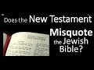

# How the New Testament MISQUOTES the Hebrew Bible to CREATE Christian beliefs (2021-01-29 20:16:48+00:00)

## Description

I read from 'Escaping from Fundamentalism' by Professor James Barr 
https://www.amazon.co.uk/Escaping-Fundamentalism-James-Barr/dp/0334003857

## Full transcript with timestamps

[0:00:01](https://youtu.be/yBkRvJZtuiI?t=1) it will doubtless come as a shock to many 
people when they discover that the new testament    
[0:00:07](https://youtu.be/yBkRvJZtuiI?t=7) sometimes misquote the old testament to create 
christian beliefs which are not there in the old    
[0:00:16](https://youtu.be/yBkRvJZtuiI?t=16) testament . just give you a bit of background 
here before i come to a particular example which    
[0:00:22](https://youtu.be/yBkRvJZtuiI?t=22) is not very well known but it's totally important .
so the original jewish bible is in hebrew .    
[0:00:31](https://youtu.be/yBkRvJZtuiI?t=31) the jews believe that god revealed the torah 
to moses on mount sinai in the hebrew language  .  
[0:00:38](https://youtu.be/yBkRvJZtuiI?t=38) now later on when the jews were scattered 
across the world during the graco roman empire ,  
[0:00:45](https://youtu.be/yBkRvJZtuiI?t=45) most jews spoke greek which was the lingua franca 
the common language of the day from about the    
[0:00:53](https://youtu.be/yBkRvJZtuiI?t=53) third / fourth century bc onwards most jews 
spoke greek . obviously there were some in    
[0:00:59](https://youtu.be/yBkRvJZtuiI?t=59) palestine who spoke hebrew or aramaic in fact .
so the translation was made of the hebrew    
[0:01:07](https://youtu.be/yBkRvJZtuiI?t=67) scriptures into greek and that's called the 
septuagint . and this is my copy of the english    
[0:01:14](https://youtu.be/yBkRvJZtuiI?t=74) translation of the septuagint . published by oxford 
university press . so this is the bible that most    
[0:01:24](https://youtu.be/yBkRvJZtuiI?t=84) jews at the time of jesus would have read . and 
it's also the bible that the new testament writers    
[0:01:30](https://youtu.be/yBkRvJZtuiI?t=90) quote from when they quote from the bible so they 
don't quote from the hebrew bible ( the original )  
[0:01:37](https://youtu.be/yBkRvJZtuiI?t=97) they quote from a translation : the septuagints , the 
greek version , the greek translation of the bible    
[0:01:44](https://youtu.be/yBkRvJZtuiI?t=104) so it's important you grasp that when i move on 
to give you the example which is to do with the    
[0:01:49](https://youtu.be/yBkRvJZtuiI?t=109) languages where you get this extraordinary 
misquote in the new testament . now to help us    
[0:01:57](https://youtu.be/yBkRvJZtuiI?t=117) understand this better , i'm going to quote 
from this book Escaping from Fundamentalism by    
[0:02:03](https://youtu.be/yBkRvJZtuiI?t=123) james barr . now this is an old book i've had this 
since my teens and it's a    
[0:02:09](https://youtu.be/yBkRvJZtuiI?t=129) very precious book to me , but james barr was a 
scottish old testament scholar at the university    
[0:02:16](https://youtu.be/yBkRvJZtuiI?t=136) of oxford , he was the oriole professor of 
the interpretation of holy scripture    
[0:02:22](https://youtu.be/yBkRvJZtuiI?t=142) until 1978 and then he became the regis professor 
of hebrew . so he is one of the world's top    
[0:02:29](https://youtu.be/yBkRvJZtuiI?t=149) old testament scholars a specialist in biblical 
hebrew and a man eminently qualified to talk    
[0:02:36](https://youtu.be/yBkRvJZtuiI?t=156) about this subject and in the chapter in 
this book called texts and translations he's    
[0:02:42](https://youtu.be/yBkRvJZtuiI?t=162) dealing with fundamentalist christianity and 
how it distorts the bible . and he gives    
[0:02:49](https://youtu.be/yBkRvJZtuiI?t=169) the example i want to share with you about 
the misquotation now this is a bit technical so    
[0:02:56](https://youtu.be/yBkRvJZtuiI?t=176) bear with me but do look the passages up in the 
bible for yourself just to check that what i'm    
[0:03:02](https://youtu.be/yBkRvJZtuiI?t=182) saying is true what james barr is saying 
is accurate and i find it quite shocking i    
[0:03:07](https://youtu.be/yBkRvJZtuiI?t=187) mean you'll see why it's quite shocking at 
the end so james barr says on page 142 :  
[0:03:14](https://youtu.be/yBkRvJZtuiI?t=194) the new testament writers generally quote from the 
septuagint and so does jesus as depicted by them    
[0:03:22](https://youtu.be/yBkRvJZtuiI?t=202) now the scepter again is a work of epoch making 
importance the first full-scale translation of    
[0:03:29](https://youtu.be/yBkRvJZtuiI?t=209) a body of works like the old testament to be 
made on this scale and in a scope that involves    
[0:03:35](https://youtu.be/yBkRvJZtuiI?t=215) languages as different as hebrew and greek and 
cultural ameliors as different as the jewish    
[0:03:41](https://youtu.be/yBkRvJZtuiI?t=221) and the hellenistic but under the circumstances 
it was not surprisingly as a translation a work of    
[0:03:49](https://youtu.be/yBkRvJZtuiI?t=229) very mixed quality so it's not a particularly good 
translation in parts it differed from book to book    
[0:03:57](https://youtu.be/yBkRvJZtuiI?t=237) since different techniques of translation were 
used at some places it must have had a hebrew text    
[0:04:03](https://youtu.be/yBkRvJZtuiI?t=243) different from ours while at other times it 
seriously misread or misunderstood the hebrew    
[0:04:11](https://youtu.be/yBkRvJZtuiI?t=251) so sometimes the bible the early christians 
used in quoting from it in the new testament    
[0:04:18](https://youtu.be/yBkRvJZtuiI?t=258) was misread or misunderstood the hebrew which 
is interesting . no scholar who knows the material    
[0:04:25](https://youtu.be/yBkRvJZtuiI?t=265) doubts that this is so but this makes a 
difference when we consider the new testament    
[0:04:31](https://youtu.be/yBkRvJZtuiI?t=271) for it does not only use the septuagint in 
a general way it often uses the exact words    
[0:04:37](https://youtu.be/yBkRvJZtuiI?t=277) as an argument or proof of a theological point 
and now we come to the example take this passage    
[0:04:46](https://youtu.be/yBkRvJZtuiI?t=286) now here he's quoting from a letter in the new 
testament that's traditionally thought to be    
[0:04:51](https://youtu.be/yBkRvJZtuiI?t=291) by paul although it's not actually by paul it 
doesn't claim to be by paul this is the letter    
[0:04:55](https://youtu.be/yBkRvJZtuiI?t=295) to the hebrews okay letter to the hebrews in the 
new testament , and in hebrews chapter 10 verse    
[0:05:02](https://youtu.be/yBkRvJZtuiI?t=302) 5 invite you to stop the video and go and 
look it up and read it for yourself in a    
[0:05:07](https://youtu.be/yBkRvJZtuiI?t=307) any modern translation will do you will read 
and i'll read it in my own translation here :  
[0:05:14](https://youtu.be/yBkRvJZtuiI?t=314) consequently when christ came into the world 
he said sacrifices and offerings you have not    
[0:05:21](https://youtu.be/yBkRvJZtuiI?t=321) desired but a body you have prepared for me so 
when christ came into the world he became man he    
[0:05:29](https://youtu.be/yBkRvJZtuiI?t=329) became incarnate incarnate means to take on flesh 
and god became a human being took on a body and    
[0:05:36](https://youtu.be/yBkRvJZtuiI?t=336) this is prophesied in the old testament and 
it's quoting an old testament passage which says    
[0:05:43](https://youtu.be/yBkRvJZtuiI?t=343) sacrifices and offerings you have not desired 
but a body you have prepared for me . so god    
[0:05:49](https://youtu.be/yBkRvJZtuiI?t=349) prepared a body for jesus according 
to the old testament prophecy yeah  .  
[0:05:54](https://youtu.be/yBkRvJZtuiI?t=354) now the passage which continues for another few 
lines is a quotation from psalm 40 verse 7 onwards    
[0:06:03](https://youtu.be/yBkRvJZtuiI?t=363) psalm 40 verse 7 onwards and you can certainly 
look that up if you want to now so you can    
[0:06:11](https://youtu.be/yBkRvJZtuiI?t=371) check what it says in any modern translation 
it doesn't matter which translation it is .   
[0:06:15](https://youtu.be/yBkRvJZtuiI?t=375) in the hebrew which is translated in 
our english bibles we find the following    
[0:06:23](https://youtu.be/yBkRvJZtuiI?t=383) in psalm 40 verse 6. : sacrifice an offering you 
do not desire but you have given me an open ear    
[0:06:33](https://youtu.be/yBkRvJZtuiI?t=393) did that come from sacrifice and offering 
you do not desire yeah that sounds familiar    
[0:06:37](https://youtu.be/yBkRvJZtuiI?t=397) but you have given me an open ear well that's odd 
that's not what we read in in the letter was it    
[0:06:44](https://youtu.be/yBkRvJZtuiI?t=404) so the rsv margin , this is a translation a very 
scholarly accurate translation adds in the ma as    
[0:06:52](https://youtu.be/yBkRvJZtuiI?t=412) in the footnotes at the bottom ears 
thou hast dug for me which is a literal rending of    
[0:06:59](https://youtu.be/yBkRvJZtuiI?t=419) the hebrew says professor barr now the whole point 
of the quotation in the letter to the hebrews    
[0:07:07](https://youtu.be/yBkRvJZtuiI?t=427) is that it mentions the preparation of a 
body for the christ coming into the world    
[0:07:15](https://youtu.be/yBkRvJZtuiI?t=435) the writer of the letter to the hebrews 
at the culmination of his argument    
[0:07:19](https://youtu.be/yBkRvJZtuiI?t=439) comes back to exactly this in hebrews 10 10 a few 
verses later it says : and by that will we have been    
[0:07:28](https://youtu.be/yBkRvJZtuiI?t=448) sanctified through the offering of the body of 
jesus christ once and for all hebrews 10 10.    
[0:07:36](https://youtu.be/yBkRvJZtuiI?t=456) but there was nothing about a body in 
the original hebrew as you can see in    
[0:07:41](https://youtu.be/yBkRvJZtuiI?t=461) your modern bibles which translate from 
the hebrew in the old testament nothing at    
[0:07:47](https://youtu.be/yBkRvJZtuiI?t=467) all it is often said to be a mistranslation but 
it seems more likely in j professor james barr's    
[0:07:55](https://youtu.be/yBkRvJZtuiI?t=475) view that it was a mere copying error in the 
transmission of the greek text and by the way i    
[0:08:02](https://youtu.be/yBkRvJZtuiI?t=482) disagree here i think it was deliberate but we'll 
see what james barr says and then we'll discuss it    
[0:08:08](https://youtu.be/yBkRvJZtuiI?t=488) the best editions of the septuagint 
have but ears you have prepared for me    
[0:08:14](https://youtu.be/yBkRvJZtuiI?t=494) which at least in regard to the noun is a correct 
and exact rendering of the hebrew the words as    
[0:08:20](https://youtu.be/yBkRvJZtuiI?t=500) quoted in the letter to the hebrews gave him a 
copying error the word was ears which is greek    
[0:08:28](https://youtu.be/yBkRvJZtuiI?t=508) otia written in unsealed script like capitals this 
is where it gets technical by the way the S at the    
[0:08:35](https://youtu.be/yBkRvJZtuiI?t=515) end of the previous word was read twice and the 
T the T I in the middle was read as the letter M    
[0:08:43](https://youtu.be/yBkRvJZtuiI?t=523) producing the word " soma " body , soma in greek 
thus to sum up the word was ears in the hebrew    
[0:08:52](https://youtu.be/yBkRvJZtuiI?t=532) was correctly translated into the greek as ears 
but in the transmission of the greek text it    
[0:08:59](https://youtu.be/yBkRvJZtuiI?t=539) became it was misread and there was wrongly copied 
as soma which is body this mistaken reading was    
[0:09:07](https://youtu.be/yBkRvJZtuiI?t=547) then used by the letter to the hebrews it was also 
supported by the use of it in hebrews transmitted    
[0:09:16](https://youtu.be/yBkRvJZtuiI?t=556) in many manuscripts of the greek psalms thus 
even if some details of this explanation may    
[0:09:22](https://youtu.be/yBkRvJZtuiI?t=562) be questioned there is no doubt that the letter to 
the hebrews was proving a point of doctrine and a    
[0:09:28](https://youtu.be/yBkRvJZtuiI?t=568) point of central importance in its argument from a 
word that did not exist at all in the hebrew bible    
[0:09:35](https://youtu.be/yBkRvJZtuiI?t=575) that's the original and was a straightforward 
product of an error in transmission the matter    
[0:09:41](https://youtu.be/yBkRvJZtuiI?t=581) was theologically important for it was the 
question of whether there was a scripture    
[0:09:46](https://youtu.be/yBkRvJZtuiI?t=586) so the question was : whether there was 
in scripture that is the old testament a previous    
[0:09:53](https://youtu.be/yBkRvJZtuiI?t=593) reference to the clothing of christ in a body of 
incarnation with sacrificial scope ? because the    
[0:10:01](https://youtu.be/yBkRvJZtuiI?t=601) left of the hebrew says this is a prophecy that 
god will provide christ with a body this difficult    
[0:10:10](https://youtu.be/yBkRvJZtuiI?t=610) demonstration says bar is accomplished 
entirely through the appeal to the verbal    
[0:10:16](https://youtu.be/yBkRvJZtuiI?t=616) form of an erroneous text in this case then far 
from the inspiration of scripture leading to a    
[0:10:24](https://youtu.be/yBkRvJZtuiI?t=624) uniquely good preservation of the bible it is the 
faulty preservation of the original inspired text    
[0:10:31](https://youtu.be/yBkRvJZtuiI?t=631) that has been essential for the production of the 
second inspired text now that's quite complex and    
[0:10:38](https://youtu.be/yBkRvJZtuiI?t=638) you might want to listen to that a couple of 
times and i do recommend the book by the way    
[0:10:42](https://youtu.be/yBkRvJZtuiI?t=642) but the point is this a misreading a 
mistranslation perhaps or an error in transmission    
[0:10:52](https://youtu.be/yBkRvJZtuiI?t=652) those are the theories that baal suggests has 
led to the letter to the hebrews the new testament    
[0:10:59](https://youtu.be/yBkRvJZtuiI?t=659) misquoting a text to prove an important point 
of christian doctrine i.e the incarnation of    
[0:11:05](https://youtu.be/yBkRvJZtuiI?t=665) jesus himself he came to earth in a body but that 
is not prophesied in the original text at best    
[0:11:12](https://youtu.be/yBkRvJZtuiI?t=672) it's based on a mistake . now my own personal view 
for what it's worth is that this is deliberate    
[0:11:18](https://youtu.be/yBkRvJZtuiI?t=678) that the original text was known 
whether in the hebrew but even in the best    
[0:11:24](https://youtu.be/yBkRvJZtuiI?t=684) greek manuscripts the best ones there 
was no problem with the translation    
[0:11:29](https://youtu.be/yBkRvJZtuiI?t=689) i think the scribe chose he came across how 
fortunate he would have been in his own mind    
[0:11:34](https://youtu.be/yBkRvJZtuiI?t=694) wow i've come across a version of this greek 
text which says body now the fact that it's wrong    
[0:11:42](https://youtu.be/yBkRvJZtuiI?t=702) it's not in the hebrew it's not in the best greek 
manuscript suggests to me that he probably picked    
[0:11:47](https://youtu.be/yBkRvJZtuiI?t=707) how fortuitous for him how felicitous for him 
that this accident was there in this dodgy greek    
[0:11:55](https://youtu.be/yBkRvJZtuiI?t=715) manuscript it provided some kind of providential 
proof from the bible of the incarnation of jesus    
[0:12:02](https://youtu.be/yBkRvJZtuiI?t=722) but actually it was a dodgy translation and i 
think it was deliberately used to justify    
[0:12:10](https://youtu.be/yBkRvJZtuiI?t=730) and create a doctrine in the letter of hebrews so 
these are the kind of issues that we're dealing    
[0:12:17](https://youtu.be/yBkRvJZtuiI?t=737) when you look carefully at the new testament 
particularly the way it uses old testament texts    
[0:12:23](https://youtu.be/yBkRvJZtuiI?t=743) it usually misquotes them it usually mangles them 
sometimes it invents prophecies out of nothing    
[0:12:31](https://youtu.be/yBkRvJZtuiI?t=751) i kid you not it's not a very pretty site when you 
look at it and that's just the reality this is not    
[0:12:38](https://youtu.be/yBkRvJZtuiI?t=758) me being negative this is just surveying the facts .
so i hope that was of interest . until next time  
