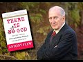

# How the world's leading atheist changed his mind about God (2021-02-13)

## Description

https://www.patreon.com/Bloggingtheology

https://twitter.com/freemonotheist

I read from 'There Is a God: How the World's Most Notorious Atheist Changed His Mind' by Antony Flew https://www.amazon.co.uk/There-God-Notorious-Atheist-Changed/dp/0061335304

## Summary of [How the world's leading atheist changed his mind about God](https://www.youtube.com/watch?v=Gc-3QVEkfbM)

*This summary is AI generated - there may be inaccuracies. *

### [00:00:00](https://www.youtube.com/watch?v=Gc-3QVEkfbM&t=0) - [00:10:00](https://www.youtube.com/watch?v=Gc-3QVEkfbM&t=600)

Atheist philosopher Anthony Flew changed his mind about the existence of God after studying evidence, and now believes in an intelligent creator of the universe.  Flew discusses his reasons for changing his belief, and how his colleagues and fellow atheists reacted to his change.

**[00:00:00](https://www.youtube.com/watch?v=Gc-3QVEkfbM&t=0)** Philosopher Anthony Flew changed his mind about God after studying evidence. He now believes in the existence of an intelligent creator of the universe.

 Anthony Flew discusses how he changed his mind about God after studying evidence. He now believes in the existence of an intelligent creator of the universe. Flew's colleagues and fellow atheists were shocked by his change of belief, but he remains committed to going wherever the evidence leads.
* **[00:05:00](https://www.youtube.com/watch?v=Gc-3QVEkfbM&t=300)** The video's speaker discusses how he changed his mind about god, and cites scientific reasons why he believes in theism. He also discusses the challenges of biogenesis, and quotes a Nobel Prize-winning physiologist who argues that we must believe in the impossible that life arose spontaneously by chance.
* **[00:10:00](https://www.youtube.com/watch?v=Gc-3QVEkfbM&t=600)** Nobel Prize-winning scientist Richard Dawkins discusses his gradual realization that there must be a Mind or God behind the universe, citing scientific discoveries such as the role of genes and proteins in producing life.

## Full transcript with timestamps

[0:00:01](https://youtu.be/Gc-3QVEkfbM?t=1) in this video , I want to look at how the world's 
leading philosopher changed his mind about God .  
[0:00:09](https://youtu.be/Gc-3QVEkfbM?t=9) Professor Anthony Flew is an English philosopher ,
most notable for his work related to the  
[0:00:15](https://youtu.be/Gc-3QVEkfbM?t=15) philosophy of religion . during the course of his 
career he taught at the universities of Oxford ,   
[0:00:20](https://youtu.be/Gc-3QVEkfbM?t=20) Aberdeen (Scotland) , Keel , Reading and at York university 
in Toronto . for much of his career , Anthony Flew  
[0:00:27](https://youtu.be/Gc-3QVEkfbM?t=27) was known as a strong advocate of atheism arguing 
that one should presuppose atheism until empirical  
[0:00:35](https://youtu.be/Gc-3QVEkfbM?t=35) evidence of a god surfaces . he also criticized the 
idea of life after death , the free will defense to    
[0:00:43](https://youtu.be/Gc-3QVEkfbM?t=43) the problem of evil and the meaningfulness of 
the concept of god . however in 2004 , he changed    
[0:00:51](https://youtu.be/Gc-3QVEkfbM?t=51) his position , he changed his mind and stated 
that he now believed in the existence of an    
[0:00:58](https://youtu.be/Gc-3QVEkfbM?t=58) intelligent creator of the universe . shocking 
his colleagues and fellow atheists . in order    
[0:01:05](https://youtu.be/Gc-3QVEkfbM?t=65) to further clarify his personal concept of god ,
Anthony Flew openly made an allegiance to deism    
[0:01:12](https://youtu.be/Gc-3QVEkfbM?t=72) more specifically a belief in the Aristotelian god 
which he will define in his book in a second . and    
[0:01:19](https://youtu.be/Gc-3QVEkfbM?t=79) dismissed on many occasions any call to convert 
to christianity , islam or any other religion .  
[0:01:26](https://youtu.be/Gc-3QVEkfbM?t=86) he stated that in keeping with his lifelong 
commitment to go wherever the evidence leads .  
[0:01:32](https://youtu.be/Gc-3QVEkfbM?t=92) he now believed in the existence of a god . i just 
want to quote some passages from his last book   
[0:01:40](https://youtu.be/Gc-3QVEkfbM?t=100) "THERE IS NO GOD" where the N has been crossed 
off gotten "THERE IS A GOD : how the world's most    
[0:01:47](https://youtu.be/Gc-3QVEkfbM?t=107) notorious atheist changed his mind" by Anthony Flew .
and I've read all this book and I wanted to  
[0:01:53](https://youtu.be/Gc-3QVEkfbM?t=113) quote some of the juicier passages from it . in 
chapter four entitled "a pilgrimage of reason"    
[0:02:00](https://youtu.be/Gc-3QVEkfbM?t=120) he writes : let us begin with a parable , imagine 
that a satellite phone is washed ashore on a    
[0:02:08](https://youtu.be/Gc-3QVEkfbM?t=128) remote island inhabited by a tribe that has never 
had contact with modern civilization . the natives    
[0:02:16](https://youtu.be/Gc-3QVEkfbM?t=136) play with the numbers on the dial pad and hear 
different voices upon hitting certain sequences .  
[0:02:23](https://youtu.be/Gc-3QVEkfbM?t=143) they assume first that it's the device that 
makes these noises , some of the cleverer    
[0:02:29](https://youtu.be/Gc-3QVEkfbM?t=149) natives , the scientists of the tribe assemble 
an exact replica and hit the numbers again .  
[0:02:37](https://youtu.be/Gc-3QVEkfbM?t=157) they hear the voices again , the conclusion 
seems obvious to them . this  
[0:02:43](https://youtu.be/Gc-3QVEkfbM?t=163) particular combination of crystals and metals 
and chemicals produce what seems like human    
[0:02:49](https://youtu.be/Gc-3QVEkfbM?t=169) voices and this means that the voices are simply 
properties of the device . but the tribal sage    
[0:02:58](https://youtu.be/Gc-3QVEkfbM?t=178) (by sage Flew probably means a philosopher) a tribal 
sage summons the scientists for a discussion .  
[0:03:05](https://youtu.be/Gc-3QVEkfbM?t=185) he has thought long and hard on the matter 
and has reached the following conclusion :   
[0:03:10](https://youtu.be/Gc-3QVEkfbM?t=190) the voices coming through the instrument must 
be coming from people like themselves , people  
[0:03:17](https://youtu.be/Gc-3QVEkfbM?t=197) who are living and conscious although speaking in 
a different language . instead of assuming that the  
[0:03:24](https://youtu.be/Gc-3QVEkfbM?t=204) voices are simply properties of the handset , they 
should investigate the possibility that through    
[0:03:30](https://youtu.be/Gc-3QVEkfbM?t=210) some mysterious communication network they 
are in touch with other humans . perhaps further    
[0:03:36](https://youtu.be/Gc-3QVEkfbM?t=216) study along these lines could lead to a greater 
understanding of the world beyond their island .  
[0:03:43](https://youtu.be/Gc-3QVEkfbM?t=223) but the scientists simply laugh at the 
sage and say , look when we damage the    
[0:03:49](https://youtu.be/Gc-3QVEkfbM?t=229) instrument the voices stop coming , so they're 
obviously nothing more than sounds produced by  
[0:03:56](https://youtu.be/Gc-3QVEkfbM?t=236) a unique combination of lithium and printed 
circuit boards and light and missing diodes .  
[0:04:04](https://youtu.be/Gc-3QVEkfbM?t=244) and a parable . in this parable we see how 
easy it is to let preconceived theories    
[0:04:12](https://youtu.be/Gc-3QVEkfbM?t=252) shape the way we view evidence ,
instead of letting the evidence    
[0:04:16](https://youtu.be/Gc-3QVEkfbM?t=256) shape our theories . a copernican leap may thus 
be prevented by a thousand ptolemaic epicycles .  
[0:04:26](https://youtu.be/Gc-3QVEkfbM?t=266) defenders of ptolemy's geocentric model of the 
solar system resisted copernicus's heliocentric    
[0:04:33](https://youtu.be/Gc-3QVEkfbM?t=273) model by using the concept of epicycles to 
explain away observations of planetary motion that    
[0:04:41](https://youtu.be/Gc-3QVEkfbM?t=281) conflicted with their model . and in this it seems 
to me lies the peculiar danger , the endemic evil    
[0:04:50](https://youtu.be/Gc-3QVEkfbM?t=290) of dogmatic atheism . (remember Anthony Flew was himself 
a dogmatic atheist) . take such utterances as quote :  
[0:04:59](https://youtu.be/Gc-3QVEkfbM?t=299) we should not ask for an explanation of how it is 
that the world exists , it is here and that's all . or :   
[0:05:07](https://youtu.be/Gc-3QVEkfbM?t=307) since we cannot accept a transcendent source 
of life , we choose to believe the impossible    
[0:05:15](https://youtu.be/Gc-3QVEkfbM?t=315) that life arose spontaneously by chance 
for matter . or : the laws of physics    
[0:05:23](https://youtu.be/Gc-3QVEkfbM?t=323) are lawless laws that arise from the void , end of 
discussion . these quotes look at first sight like   
[0:05:31](https://youtu.be/Gc-3QVEkfbM?t=331) rational arguments that have a special 
authority because they have a no-nonsense    
[0:05:37](https://youtu.be/Gc-3QVEkfbM?t=337) air about them . of course this is no more sign 
that they are either rational or arguments .  
[0:05:47](https://youtu.be/Gc-3QVEkfbM?t=347) and then the next quote : as for my new position 
on the classical philosophical debates    
[0:05:55](https://youtu.be/Gc-3QVEkfbM?t=355) about god , in this area i was persuaded above 
all by the philosopher David Conway's argument   
[0:06:02](https://youtu.be/Gc-3QVEkfbM?t=362) for god's existence in his book "The Recovery of 
Wisdom : From Here to Antiquity in Quest of Sophia"  
[0:06:10](https://youtu.be/Gc-3QVEkfbM?t=370) Conway is a distinguished British Philosopher 
at Middlesex University , who is equally at home   
[0:06:15](https://youtu.be/Gc-3QVEkfbM?t=375) with classical and modern philosophy . the god whose 
existence is defended by Conway and myself (writes  
[0:06:23](https://youtu.be/Gc-3QVEkfbM?t=383) Flew) is the god of aristotle .Conway writes : in sum ,
to the Being  
[0:06:33](https://youtu.be/Gc-3QVEkfbM?t=393) whom he considered to be the explanation of the 
world and its broad form , Aristotle ascribed the  
[0:06:41](https://youtu.be/Gc-3QVEkfbM?t=401) following attributes : immutability , immateriality , 
omnipotence , omniscience , oneness or indivisibility ,  
[0:06:50](https://youtu.be/Gc-3QVEkfbM?t=410) perfect goodness and necessary existence . there is 
an impressive correspondence between this set of   
[0:06:58](https://youtu.be/Gc-3QVEkfbM?t=418) attributes and those traditionally ascribed 
to god within the judeo-christian tradition ,  
[0:07:04](https://youtu.be/Gc-3QVEkfbM?t=424) it is one that fully justifies us in 
viewing Aristotle as having had the same divine  
[0:07:11](https://youtu.be/Gc-3QVEkfbM?t=431) being in mind as the cause of the world that is 
the object of worship of these two religions . end  
[0:07:18](https://youtu.be/Gc-3QVEkfbM?t=438) quote . for some reason Flew doesn't even think about 
Islam but obviously this applies to Islam as well .  
[0:07:24](https://youtu.be/Gc-3QVEkfbM?t=444) so that clarifies Flew's own concept 
of god that he embraced after leaving atheism .  
[0:07:33](https://youtu.be/Gc-3QVEkfbM?t=453) and now some of the reasons , the scientific reasons 
why he began to embrace theism or belief in god  
[0:07:40](https://youtu.be/Gc-3QVEkfbM?t=460) and he quotes Paul Davis the famous 
astrophysicist : Paul Davis highlights the  
[0:07:45](https://youtu.be/Gc-3QVEkfbM?t=465) same problem he writes . he observes that most 
theories of biogenesis (biogenesis is the idea  
[0:07:53](https://youtu.be/Gc-3QVEkfbM?t=473) of life just coming about , apparently out 
of nowhere) most theories of biogenesis  
[0:07:58](https://youtu.be/Gc-3QVEkfbM?t=478) have concentrated on the chemistry of life . but 
life is more than just complex chemical reactions .  
[0:08:06](https://youtu.be/Gc-3QVEkfbM?t=486) the cell also is an information storing processing 
and replicating system . we need to explain the  
[0:08:15](https://youtu.be/Gc-3QVEkfbM?t=495) origin of this system , of this information and the 
way in which the information processing machinery  
[0:08:22](https://youtu.be/Gc-3QVEkfbM?t=502) came to exist . he emphasizes the fact that the 
gene is nothing but a set of coded instructions  
[0:08:30](https://youtu.be/Gc-3QVEkfbM?t=510) with a precise recipe for manufacturing proteins .
most important these genetic instructions are  
[0:08:38](https://youtu.be/Gc-3QVEkfbM?t=518) not the kind of information you find in 
thermodynamics and statistical mechanics  
[0:08:43](https://youtu.be/Gc-3QVEkfbM?t=523) rather they constitute semantic information .
in other words , they have a specific meaning .  
[0:08:52](https://youtu.be/Gc-3QVEkfbM?t=532) these instructions can be effective only in a 
molecular environment capable of interpreting the  
[0:08:59](https://youtu.be/Gc-3QVEkfbM?t=539) meaning in the genetic code . the origin question 
of biogenesis rises to the top at this point ,  
[0:09:08](https://youtu.be/Gc-3QVEkfbM?t=548) the problem of how meaningful or semantic 
information can emerge spontaneously from a  
[0:09:14](https://youtu.be/Gc-3QVEkfbM?t=554) collection of mindless molecules subject to 
blind and purposeless forces present a deep    
[0:09:21](https://youtu.be/Gc-3QVEkfbM?t=561) conceptual challenge . there's the end of that quote . 
so you can see some of the reasons why Flew in the  
[0:09:29](https://youtu.be/Gc-3QVEkfbM?t=569) light of modern science abandoned atheism . and 
the last quote here because there are so many .  
[0:09:39](https://youtu.be/Gc-3QVEkfbM?t=579) is again to do with the origin of life , 
so how do we account for the origin of life  
[0:09:43](https://youtu.be/Gc-3QVEkfbM?t=583) (professor Flew asks) the nobel prize winning 
physiologist George Wald  
[0:09:52](https://youtu.be/Gc-3QVEkfbM?t=592) once famously argued that we choose to believe the 
impossible that life arose spontaneously by chance .  
[0:10:01](https://youtu.be/Gc-3QVEkfbM?t=601) now of course this is what Flew himself 
believed , this is what atheists believe .  
[0:10:06](https://youtu.be/Gc-3QVEkfbM?t=606) this Noble prize winning scientist says : in later 
years however , he concluded that a pre-existing    
[0:10:13](https://youtu.be/Gc-3QVEkfbM?t=613) mind which he posits as the matrix of physical 
reality compose the physical universe that breeds  
[0:10:20](https://youtu.be/Gc-3QVEkfbM?t=620) life.  then he quotes the nobel
prize-winning professor    
[0:10:28](https://youtu.be/Gc-3QVEkfbM?t=628) who says as follows : how is it that 
with so many other apparent options  
[0:10:35](https://youtu.be/Gc-3QVEkfbM?t=635) we are in a universe that possesses just that 
peculiar nexus or properties that breeds life .  
[0:10:43](https://youtu.be/Gc-3QVEkfbM?t=643) it has occurred to me lately i must confess with 
some shock at first to my scientific sensibilities  
[0:10:50](https://youtu.be/Gc-3QVEkfbM?t=650) that both questions might be brought 
into some degree of congruence .  
[0:10:55](https://youtu.be/Gc-3QVEkfbM?t=655) this is with the assumption that mind rather than 
emerging as a late outgrowth in the evolution of  
[0:11:02](https://youtu.be/Gc-3QVEkfbM?t=662) life has existed always as the matrix the 
source and condition of physical reality    
[0:11:11](https://youtu.be/Gc-3QVEkfbM?t=671) that the stuff of which physical reality is 
constructed is mind stuff . it is mind that has  
[0:11:19](https://youtu.be/Gc-3QVEkfbM?t=679) composed a physical universe that breeds life . so 
eventually evolves creatures that know and create  
[0:11:28](https://youtu.be/Gc-3QVEkfbM?t=688) science , art , technology making creatures .
that's the end quote there . and then Flew says :  
[0:11:35](https://youtu.be/Gc-3QVEkfbM?t=695) this too is my conclusion , the only 
satisfactory explanation for the origin of such    
[0:11:42](https://youtu.be/Gc-3QVEkfbM?t=702) end directing self-replicating life as we 
see on earth is an infinitely intelligent    
[0:11:49](https://youtu.be/Gc-3QVEkfbM?t=709) Mind (with a capital M) . and of 
course we call that mind "God" .  
[0:11:57](https://youtu.be/Gc-3QVEkfbM?t=717) so there we go , that's the book . it's 
very interesting his arguments are based he says    
[0:12:04](https://youtu.be/Gc-3QVEkfbM?t=724) his whole position has not really changed , he 
only goes where the evidence leads so he says    
[0:12:10](https://youtu.be/Gc-3QVEkfbM?t=730) that in his earlier career he didn't see any 
good evidence for the existence of god he says    
[0:12:15](https://youtu.be/Gc-3QVEkfbM?t=735) but now with the advent of the discovery of DNA 
and the role of genes and producing proteins and  
[0:12:22](https://youtu.be/Gc-3QVEkfbM?t=742) this the semantic nature of genes 
requiring a meaningful understanding of the    
[0:12:29](https://youtu.be/Gc-3QVEkfbM?t=749) whole process of producing genes and life .  
this goes way beyond atheism and this suggests  
[0:12:35](https://youtu.be/Gc-3QVEkfbM?t=755) intelligence , it suggests mind and thus it's just 
God not just the DNA but a whole host of other   
[0:12:42](https://youtu.be/Gc-3QVEkfbM?t=762) scientific discoveries lead professor Flew to 
abandon atheism and embrace this belief in god .  
[0:12:50](https://youtu.be/Gc-3QVEkfbM?t=770) so i think this is a great story , a great story 
of a man who had the courage to admit that he  
[0:12:56](https://youtu.be/Gc-3QVEkfbM?t=776) was wrong . here's a man who was the world's most 
notorious atheist , he spent decades arguing against    
[0:13:02](https://youtu.be/Gc-3QVEkfbM?t=782) believers in god , ridiculing their beliefs , 
refuting them philosophically , he came to believe    
[0:13:08](https://youtu.be/Gc-3QVEkfbM?t=788) that was wrong in fact god does exist because 
the evidence he says led him to believe that .  
[0:13:15](https://youtu.be/Gc-3QVEkfbM?t=795) so there we go , that's the story of 
how the world's most notorious atheist changed    
[0:13:21](https://youtu.be/Gc-3QVEkfbM?t=801) his mind and to my knowledge he never
actually converted to any other religion i    
[0:13:26](https://youtu.be/Gc-3QVEkfbM?t=806) think he was warming towards the christian 
faith given his own cultural background    
[0:13:32](https://youtu.be/Gc-3QVEkfbM?t=812) but i don't think he ever converted to any 
other religion and let's hope , let's pray    
[0:13:36](https://youtu.be/Gc-3QVEkfbM?t=816) that he found a merciful god who 
accepted him into paradise . till next time  
