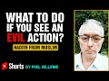

# If You See An Evil Action | #shorts By Paul Williams (2021-09-13 18:19:04+00:00)

## Description

If You See An Evil Action: hadith from Muslim

#shorts by Paul Williams

## Summary of [If You See An Evil Action | #shorts By Paul Williams](https://www.youtube.com/watch?v=coNRG83gUyY)

*This is an AI generated summary. There may be inaccuracies. *

### [00:00:00](https://www.youtube.com/watch?v=coNRG83gUyY&t=0) - [00:00:00](https://www.youtube.com/watch?v=coNRG83gUyY&t=0)

The YouTube video urges Muslims to take action against evil, even if they can't do everything themselves.

**[00:00:00](https://www.youtube.com/watch?v=coNRG83gUyY&t=0)** The Hadith quoted above urges Muslims to take action when they see evil happening, even if they can't do everything themselves.

## Full transcript with timestamps

[0:00:01](https://youtu.be/coNRG83gUyY?t=1)   Mohammad (Upon Whom Be Peace) Said,  
[0:00:03](https://youtu.be/coNRG83gUyY?t=3) "Whoever Among You
Sees an Evil Action  
[0:00:06](https://youtu.be/coNRG83gUyY?t=6) Let Him Change it With His Hand  
[0:00:09](https://youtu.be/coNRG83gUyY?t=9) (i.e by Taking Action)  
[0:00:11](https://youtu.be/coNRG83gUyY?t=11) if He Cannot, Then With his Tongue  
[0:00:14](https://youtu.be/coNRG83gUyY?t=14) (by Speaking Out)  
[0:00:15](https://youtu.be/coNRG83gUyY?t=15) And if He Cannot, Then With His Heart  
[0:00:18](https://youtu.be/coNRG83gUyY?t=18) (by Hating it and feeling it is Wrong)  
[0:00:21](https://youtu.be/coNRG83gUyY?t=21) And That, is the Weakest of Faith."  
[0:00:24](https://youtu.be/coNRG83gUyY?t=24) - Hadith From Muslim  
