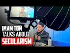

# Imam Tom Talks About Secularism (2022-06-30)

## Description

UTICA MASJID https://www.youtube.com/c/UTICAMASJID

You Can Support My Work on Patreon:
https://www.patreon.com/Bloggingtheology

My Paypal Link: 
https://www.paypal.com/paypalme/bloggingtheology?locale.x=en_GB

## Summary of [Imam Tom Talks About Secularism](https://www.youtube.com/watch?v=Sjsnmp-PqI0)

*This summary is AI generated - there may be inaccuracies. *

### [00:00:00](https://www.youtube.com/watch?v=Sjsnmp-PqI0&t=0) - [01:00:00](https://www.youtube.com/watch?v=Sjsnmp-PqI0&t=3600)

Imam Tom discusses secularism and how it has changed the way Muslims interact with their faith. He argues that, while there are some negative aspects to secularism, it can be more beneficial than traditional methods. He also discusses how secularism has changed the way people experience and understand the world.

**[00:00:00](https://www.youtube.com/watch?v=Sjsnmp-PqI0&t=0)** Imam Tom discusses how a book he read many years ago, Formation of the Secular, is still very relevant to the current political climate in North America. He recommends a book called The Political Ideas of the Laïcites by Olivier Roy.
* **[00:05:00](https://www.youtube.com/watch?v=Sjsnmp-PqI0&t=300)* Discusses ecularism, its definition, and its effects on religion, ethics, and politics. He also discusses how secularism produces different concepts of religion that were not present before.
* **[00:10:00](https://www.youtube.com/watch?v=Sjsnmp-PqI0&t=600)* Discusses how secularism is a political goal within modernity and the west, and how this concept is often misunderstood. He points out that there is a precedent for secularism within islam, and that this does not mean that religiosity has a monopoly on violence.
* **[00:15:00](https://www.youtube.com/watch?v=Sjsnmp-PqI0&t=900)** Imam Tom discusses secularism and its various goals, including the autonomy of women. He compares this to the metaphysics of different religious perspectives, and points out that there is a fundamental clash of worldviews between feminists and those who adhere to a religious perspective.
* **[00:20:00](https://www.youtube.com/watch?v=Sjsnmp-PqI0&t=1200)** Imam Tom discusses secularism, the idea that morality and ethics are relative to time, and how this mindset has led to various catastrophes.
* **[00:25:00](https://www.youtube.com/watch?v=Sjsnmp-PqI0&t=1500)* Discusses increasing prevalence of secularism, which is seen by many as a negative trend. argues that Islam is an optimistic religion that is based on hope. He points out that the different interpretations of events in the world are due to people's beliefs about an afterlife. He also says that people's sense of morality and imperatives are based on their belief in an afterlife. He believes that unless people try real communism, which is based on the shared goals of people, we will continue to make the same mistakes.
* **[00:30:00](https://www.youtube.com/watch?v=Sjsnmp-PqI0&t=1800)** Imam Tom discusses secularism, its effects on the masses, and its relationship to technology and metaphysics. He argues that secularism is one of the goals of western modernity and that it carries with it a shift in how the masses experience time.
* **[00:35:00](https://www.youtube.com/watch?v=Sjsnmp-PqI0&t=2100)* Discusses effects of secularism on the way people experience and understand the world. It points out that, in contrast to pre-modern societies where knowledge was based on religious authority, in modern secular societies individuals are more reliant on their own intelligence and reasoning. This shift creates a different type of authority, as individuals are now authorized to form their own opinions about things, rather than relying on a scholar or authority figure.
* **[00:40:00](https://www.youtube.com/watch?v=Sjsnmp-PqI0&t=2400)** Imam Tom discusses secularism, how it has changed the way Muslims interact with their faith, and how it can be more beneficial than traditional methods. He also mentions how there are some negative aspects to secularism, such as the detachment of sexuality from real life.
* **[00:45:00](https://www.youtube.com/watch?v=Sjsnmp-PqI0&t=2700)** Imam Tom discusses secularism and its effects on Muslims in the United States. He talks about how mainline Protestant denominations became secularized and how this created a split between evangelical and mainline denominations. He also points out that the Muslim American experience is different depending on where one lives.
* **[00:50:00](https://www.youtube.com/watch?v=Sjsnmp-PqI0&t=3000)** Imam Tom discusses secularism and how it is legitimized. He quotes Charles Taylor and shows how the assumption that religious conviction leads to violence is false.
* **[00:55:00](https://www.youtube.com/watch?v=Sjsnmp-PqI0&t=3300)** Imam Tom discusses secularism, its benefits and drawbacks, and how it shapes the way politics are shaped in secular societies.
### [01:00:00](https://www.youtube.com/watch?v=Sjsnmp-PqI0&t=3600) - [01:25:00](https://www.youtube.com/watch?v=Sjsnmp-PqI0&t=5100)

Imam Tom discusses secularism and its advantages and disadvantages. He argues that secularism is not just about separating religious life into the private sphere but also the determination of the state of what religion is and is not. Secularism is the murder of god by the state, and this is the ultimate hindrance to Muslims because it gives the state too much power.

**[01:00:00](https://www.youtube.com/watch?v=Sjsnmp-PqI0&t=3600)** The imam discusses how pressure groups and closed meetings play a significant role in the formation of opinion and the shaping of emotion in a democracy. He also points to opinion polls as a tool used to anticipate and influence public opinion.
* **[01:05:00](https://www.youtube.com/watch?v=Sjsnmp-PqI0&t=3900)** Imam Tom discusses secularism and its advantages and disadvantages. He argues that secularism is not just about separating religious life into the private sphere but also the determination of the state of what religion is and is not. Secularism is the murder of god by the state, and this is the ultimate hindrance to Muslims because it gives the state too much power.
* **[01:10:00](https://www.youtube.com/watch?v=Sjsnmp-PqI0&t=4200)**  Imam Tom talks about secularism and how it is a form of power that enables certain statements to be made about religion. He also mentions how secularism is the production of a certain type of religion that is amenable to the secular state.
* **[01:15:00](https://www.youtube.com/watch?v=Sjsnmp-PqI0&t=4500)** According to Imam Tom, Muslims who commit terrorist acts are usually influenced by either secular or religious ideology, but are not always "terrorism" as understood in the West. He goes on to say that the inconsistency in labeling terrorists is due to the fact that Islam is a particularly anti-secular force, and that this makes it a legitimate target of discipline and violence by secular authorities.
* **[01:20:00](https://www.youtube.com/watch?v=Sjsnmp-PqI0&t=4800)** The Imam discusses secularism, arguing that while moral autonomy is a important concept, the reality of the secular order is that it upholds religious violence. He finishes the talk by discussing how other types of violence are justified and considered necessary.
* **[01:25:00](https://www.youtube.com/watch?v=Sjsnmp-PqI0&t=5100)** Imam Tom discusses secularism and its relationship to Christianity and Islam. He argues that secular democracies have committed atrocities in the name of freedom and that many of them are proud of these actions. He recommends reading Professor Talau Assad's book "Formations of the Secular: Christianity, Islam, and Modernity" and Plato's "Republic."

<h2>Full transcript with timestamps: CLICK TO EXPAND</h2>

[0:00:02](https://youtu.be/Sjsnmp-PqI0?t=2) hello everyone and welcome to blogging  
[0:00:05](https://youtu.be/Sjsnmp-PqI0?t=5) theology today i am delighted to talk  
[0:00:07](https://youtu.be/Sjsnmp-PqI0?t=7) again to imam  
[0:00:09](https://youtu.be/Sjsnmp-PqI0?t=9) tom fakini welcome back sir  
[0:00:12](https://youtu.be/Sjsnmp-PqI0?t=12) thank you very much thank you for having  
[0:00:14](https://youtu.be/Sjsnmp-PqI0?t=14) me i'm so happy to be back well for  
[0:00:16](https://youtu.be/Sjsnmp-PqI0?t=16) those who don't know um imam  
[0:00:19](https://youtu.be/Sjsnmp-PqI0?t=19) tom has kindly agreed to continue  
[0:00:21](https://youtu.be/Sjsnmp-PqI0?t=21) discussing the books that have made a  
[0:00:23](https://youtu.be/Sjsnmp-PqI0?t=23) significant difference to him  
[0:00:25](https://youtu.be/Sjsnmp-PqI0?t=25) intellectually and apart from the  
[0:00:28](https://youtu.be/Sjsnmp-PqI0?t=28) intrinsic interest in what he might say  
[0:00:30](https://youtu.be/Sjsnmp-PqI0?t=30) it will hopefully encourage us all to  
[0:00:32](https://youtu.be/Sjsnmp-PqI0?t=32) read good books  
[0:00:34](https://youtu.be/Sjsnmp-PqI0?t=34) for ourselves  
[0:00:35](https://youtu.be/Sjsnmp-PqI0?t=35) and for those who don't know tom  
[0:00:37](https://youtu.be/Sjsnmp-PqI0?t=37) accepted islam in his early twenties and  
[0:00:40](https://youtu.be/Sjsnmp-PqI0?t=40) he holds a ba in political science from  
[0:00:44](https://youtu.be/Sjsnmp-PqI0?t=44) vassar college and a ba in islamic law  
[0:00:47](https://youtu.be/Sjsnmp-PqI0?t=47) from the islamic university of medina  
[0:00:50](https://youtu.be/Sjsnmp-PqI0?t=50) where he graduated in 2020 and he's also  
[0:00:54](https://youtu.be/Sjsnmp-PqI0?t=54) a qualified chaplain  
[0:00:56](https://youtu.be/Sjsnmp-PqI0?t=56) and imam thomas coney the imam and  
[0:00:59](https://youtu.be/Sjsnmp-PqI0?t=59) program director of utica masjid in new  
[0:01:02](https://youtu.be/Sjsnmp-PqI0?t=62) york obviously in america  
[0:01:04](https://youtu.be/Sjsnmp-PqI0?t=64) now he has a fantastic youtube channel  
[0:01:07](https://youtu.be/Sjsnmp-PqI0?t=67) entitled uh itica masjid i got that  
[0:01:10](https://youtu.be/Sjsnmp-PqI0?t=70) right which i will link to in the  
[0:01:12](https://youtu.be/Sjsnmp-PqI0?t=72) description below now i never recommend  
[0:01:14](https://youtu.be/Sjsnmp-PqI0?t=74) youtube so but on this occasion i do say  
[0:01:18](https://youtu.be/Sjsnmp-PqI0?t=78) please subscribe and you won't regret it  
[0:01:21](https://youtu.be/Sjsnmp-PqI0?t=81) so without um any more ado tom i know  
[0:01:24](https://youtu.be/Sjsnmp-PqI0?t=84) you have some notes uh prepared about a  
[0:01:26](https://youtu.be/Sjsnmp-PqI0?t=86) particularly interesting book which i  
[0:01:28](https://youtu.be/Sjsnmp-PqI0?t=88) have started to read myself which i  
[0:01:30](https://youtu.be/Sjsnmp-PqI0?t=90) think um you'd want to say a few words  
[0:01:32](https://youtu.be/Sjsnmp-PqI0?t=92) about so um over to you sir  
[0:01:35](https://youtu.be/Sjsnmp-PqI0?t=95) sure well after bismuth  
[0:01:38](https://youtu.be/Sjsnmp-PqI0?t=98) um you we had talked about kind of the  
[0:01:41](https://youtu.be/Sjsnmp-PqI0?t=101) books that had made the largest  
[0:01:42](https://youtu.be/Sjsnmp-PqI0?t=102) impression on me previously and  
[0:01:44](https://youtu.be/Sjsnmp-PqI0?t=104) certainly up there is this by  
[0:01:48](https://youtu.be/Sjsnmp-PqI0?t=108) called formations of the secular  
[0:01:50](https://youtu.be/Sjsnmp-PqI0?t=110) and  
[0:01:51](https://youtu.be/Sjsnmp-PqI0?t=111) we kind of kicked around the idea of  
[0:01:54](https://youtu.be/Sjsnmp-PqI0?t=114) okay let's have a second session what  
[0:01:56](https://youtu.be/Sjsnmp-PqI0?t=116) book should we read or you know what  
[0:01:58](https://youtu.be/Sjsnmp-PqI0?t=118) book should we discuss and  
[0:02:00](https://youtu.be/Sjsnmp-PqI0?t=120) this one came to mind because even  
[0:02:02](https://youtu.be/Sjsnmp-PqI0?t=122) though it was written almost exactly 20  
[0:02:04](https://youtu.be/Sjsnmp-PqI0?t=124) years ago  
[0:02:06](https://youtu.be/Sjsnmp-PqI0?t=126) it is very very timely especially for  
[0:02:09](https://youtu.be/Sjsnmp-PqI0?t=129) everything that has been unfolding in  
[0:02:12](https://youtu.be/Sjsnmp-PqI0?t=132) uh kind of the muslim anglosphere in the  
[0:02:15](https://youtu.be/Sjsnmp-PqI0?t=135) past month or two  
[0:02:17](https://youtu.be/Sjsnmp-PqI0?t=137) at least here in north america we've had  
[0:02:19](https://youtu.be/Sjsnmp-PqI0?t=139) something of a reckoning i think  
[0:02:21](https://youtu.be/Sjsnmp-PqI0?t=141) with uh the lgbtq lobby uh and movement  
[0:02:26](https://youtu.be/Sjsnmp-PqI0?t=146) with the muslim  
[0:02:27](https://youtu.be/Sjsnmp-PqI0?t=147) population so i think going back some  
[0:02:31](https://youtu.be/Sjsnmp-PqI0?t=151) years  
[0:02:32](https://youtu.be/Sjsnmp-PqI0?t=152) most of the kind of  
[0:02:34](https://youtu.be/Sjsnmp-PqI0?t=154) scholars they were  
[0:02:36](https://youtu.be/Sjsnmp-PqI0?t=156) fairly um i think they underestimated  
[0:02:39](https://youtu.be/Sjsnmp-PqI0?t=159) where all of this would go  
[0:02:41](https://youtu.be/Sjsnmp-PqI0?t=161) uh they kind of took a fairly soft  
[0:02:44](https://youtu.be/Sjsnmp-PqI0?t=164) stance on things  
[0:02:45](https://youtu.be/Sjsnmp-PqI0?t=165) um and we've kind of reached a point now  
[0:02:48](https://youtu.be/Sjsnmp-PqI0?t=168) where it seems and i hope that the tide  
[0:02:50](https://youtu.be/Sjsnmp-PqI0?t=170) is starting to change where we've had a  
[0:02:52](https://youtu.be/Sjsnmp-PqI0?t=172) lot of people kind of come out and say  
[0:02:55](https://youtu.be/Sjsnmp-PqI0?t=175) um  
[0:02:56](https://youtu.be/Sjsnmp-PqI0?t=176) you know okay no this has to stop and  
[0:02:58](https://youtu.be/Sjsnmp-PqI0?t=178) we've had certain flash points  
[0:03:02](https://youtu.be/Sjsnmp-PqI0?t=182) things happening in canada as well which  
[0:03:04](https://youtu.be/Sjsnmp-PqI0?t=184) we'll probably get to in a bit um  
[0:03:06](https://youtu.be/Sjsnmp-PqI0?t=186) that have have kind of stirred a  
[0:03:08](https://youtu.be/Sjsnmp-PqI0?t=188) critical mass what i hope is a critical  
[0:03:10](https://youtu.be/Sjsnmp-PqI0?t=190) mass to start pushing back and asserting  
[0:03:12](https://youtu.be/Sjsnmp-PqI0?t=192) themselves and what sort of struck me as  
[0:03:14](https://youtu.be/Sjsnmp-PqI0?t=194) significant was that if you listen to um  
[0:03:18](https://youtu.be/Sjsnmp-PqI0?t=198) many of the folks who are  
[0:03:20](https://youtu.be/Sjsnmp-PqI0?t=200) on the scene in the north american kind  
[0:03:22](https://youtu.be/Sjsnmp-PqI0?t=202) of taoist scene  
[0:03:23](https://youtu.be/Sjsnmp-PqI0?t=203) folks who  
[0:03:24](https://youtu.be/Sjsnmp-PqI0?t=204) are way more knowledgeable than i am  
[0:03:26](https://youtu.be/Sjsnmp-PqI0?t=206) about islam and have studied  
[0:03:28](https://youtu.be/Sjsnmp-PqI0?t=208) way longer than i have i mean  
[0:03:30](https://youtu.be/Sjsnmp-PqI0?t=210) have been studying for longer than i've  
[0:03:32](https://youtu.be/Sjsnmp-PqI0?t=212) been a muslim so i don't mean to  
[0:03:34](https://youtu.be/Sjsnmp-PqI0?t=214) take anything away from anybody but  
[0:03:37](https://youtu.be/Sjsnmp-PqI0?t=217) i hear certain  
[0:03:39](https://youtu.be/Sjsnmp-PqI0?t=219) i guess  
[0:03:41](https://youtu.be/Sjsnmp-PqI0?t=221) political ideas or ideas that are kind  
[0:03:44](https://youtu.be/Sjsnmp-PqI0?t=224) of  
[0:03:45](https://youtu.be/Sjsnmp-PqI0?t=225) common knowledge of supposedly  
[0:03:46](https://youtu.be/Sjsnmp-PqI0?t=226) conventional wisdom keep being  
[0:03:48](https://youtu.be/Sjsnmp-PqI0?t=228) regurgitated regarding the arrangement  
[0:03:51](https://youtu.be/Sjsnmp-PqI0?t=231) of secular politics or religion within a  
[0:03:54](https://youtu.be/Sjsnmp-PqI0?t=234) secular society  
[0:03:56](https://youtu.be/Sjsnmp-PqI0?t=236) and um  
[0:03:57](https://youtu.be/Sjsnmp-PqI0?t=237) with all due respect to everybody  
[0:03:59](https://youtu.be/Sjsnmp-PqI0?t=239) involved  
[0:04:00](https://youtu.be/Sjsnmp-PqI0?t=240) that ideas that are that are quite naive  
[0:04:03](https://youtu.be/Sjsnmp-PqI0?t=243) and ideas that don't really illustrate  
[0:04:06](https://youtu.be/Sjsnmp-PqI0?t=246) that we've got a mature grasp as a  
[0:04:08](https://youtu.be/Sjsnmp-PqI0?t=248) muslim community as to how  
[0:04:10](https://youtu.be/Sjsnmp-PqI0?t=250) politics in a secular space work  
[0:04:12](https://youtu.be/Sjsnmp-PqI0?t=252) how religion can and cannot and does and  
[0:04:16](https://youtu.be/Sjsnmp-PqI0?t=256) does not enter into uh politics in a  
[0:04:19](https://youtu.be/Sjsnmp-PqI0?t=259) secular space  
[0:04:21](https://youtu.be/Sjsnmp-PqI0?t=261) and so i thought that it would be a  
[0:04:23](https://youtu.be/Sjsnmp-PqI0?t=263) really  
[0:04:24](https://youtu.be/Sjsnmp-PqI0?t=264) opportune time to revisit this book uh  
[0:04:26](https://youtu.be/Sjsnmp-PqI0?t=266) and sort of uh reacquaint myself with  
[0:04:29](https://youtu.be/Sjsnmp-PqI0?t=269) something that had you know  
[0:04:32](https://youtu.be/Sjsnmp-PqI0?t=272) shaped me in ways that i can't even  
[0:04:33](https://youtu.be/Sjsnmp-PqI0?t=273) account for at this point you know but  
[0:04:35](https://youtu.be/Sjsnmp-PqI0?t=275) um  
[0:04:36](https://youtu.be/Sjsnmp-PqI0?t=276) but also thinking that it would give us  
[0:04:38](https://youtu.be/Sjsnmp-PqI0?t=278) some  
[0:04:39](https://youtu.be/Sjsnmp-PqI0?t=279) novel and interesting ways to look on  
[0:04:41](https://youtu.be/Sjsnmp-PqI0?t=281) look at how things are are going on now  
[0:04:44](https://youtu.be/Sjsnmp-PqI0?t=284) um  
[0:04:45](https://youtu.be/Sjsnmp-PqI0?t=285) so and that's honestly what i found to  
[0:04:48](https://youtu.be/Sjsnmp-PqI0?t=288) be frank right and even just from the  
[0:04:50](https://youtu.be/Sjsnmp-PqI0?t=290) introduction you know uh he kind of  
[0:04:53](https://youtu.be/Sjsnmp-PqI0?t=293) the author he talks about  
[0:04:55](https://youtu.be/Sjsnmp-PqI0?t=295) how are we conceiving  
[0:04:57](https://youtu.be/Sjsnmp-PqI0?t=297) of this thing that's called secularism  
[0:04:59](https://youtu.be/Sjsnmp-PqI0?t=299) and many of the points that i that i  
[0:05:01](https://youtu.be/Sjsnmp-PqI0?t=301) heard um repeated by by  
[0:05:04](https://youtu.be/Sjsnmp-PqI0?t=304) famous more qualified speakers uh and  
[0:05:06](https://youtu.be/Sjsnmp-PqI0?t=306) scholars than myself  
[0:05:08](https://youtu.be/Sjsnmp-PqI0?t=308) is kind of this taking secularism at its  
[0:05:11](https://youtu.be/Sjsnmp-PqI0?t=311) word for being a simple clean break and  
[0:05:15](https://youtu.be/Sjsnmp-PqI0?t=315) separation right secularism as  
[0:05:16](https://youtu.be/Sjsnmp-PqI0?t=316) separation right so you know the  
[0:05:18](https://youtu.be/Sjsnmp-PqI0?t=318) religious commitments are going to be  
[0:05:20](https://youtu.be/Sjsnmp-PqI0?t=320) separated from the political ethic  
[0:05:22](https://youtu.be/Sjsnmp-PqI0?t=322) and that's what's going to enable us to  
[0:05:24](https://youtu.be/Sjsnmp-PqI0?t=324) all get along  
[0:05:26](https://youtu.be/Sjsnmp-PqI0?t=326) right  
[0:05:27](https://youtu.be/Sjsnmp-PqI0?t=327) and when we talk about a lot of people  
[0:05:28](https://youtu.be/Sjsnmp-PqI0?t=328) have remarked this comes into play and  
[0:05:30](https://youtu.be/Sjsnmp-PqI0?t=330) is significant when we're talking about  
[0:05:32](https://youtu.be/Sjsnmp-PqI0?t=332) well okay  
[0:05:33](https://youtu.be/Sjsnmp-PqI0?t=333) we might  
[0:05:35](https://youtu.be/Sjsnmp-PqI0?t=335) personally  
[0:05:36](https://youtu.be/Sjsnmp-PqI0?t=336) disagree with homosexual unions or uh  
[0:05:40](https://youtu.be/Sjsnmp-PqI0?t=340) transgender you know ideology or surgery  
[0:05:43](https://youtu.be/Sjsnmp-PqI0?t=343) or these sorts of things but do we have  
[0:05:45](https://youtu.be/Sjsnmp-PqI0?t=345) the right then to assert our  
[0:05:47](https://youtu.be/Sjsnmp-PqI0?t=347) political will or to assert our  
[0:05:51](https://youtu.be/Sjsnmp-PqI0?t=351) personal moral convictions in law  
[0:05:54](https://youtu.be/Sjsnmp-PqI0?t=354) right and i hear most people saying  
[0:05:57](https://youtu.be/Sjsnmp-PqI0?t=357) regretfully i hear most people saying  
[0:05:58](https://youtu.be/Sjsnmp-PqI0?t=358) that no they have to be completely  
[0:06:00](https://youtu.be/Sjsnmp-PqI0?t=360) separate  
[0:06:01](https://youtu.be/Sjsnmp-PqI0?t=361) is that i can have my own personal  
[0:06:02](https://youtu.be/Sjsnmp-PqI0?t=362) morality and ethics and it and then  
[0:06:05](https://youtu.be/Sjsnmp-PqI0?t=365) political rights are an entirely  
[0:06:06](https://youtu.be/Sjsnmp-PqI0?t=366) different thing  
[0:06:07](https://youtu.be/Sjsnmp-PqI0?t=367) um so this is kind of taking for granted  
[0:06:10](https://youtu.be/Sjsnmp-PqI0?t=370) this kind of  
[0:06:11](https://youtu.be/Sjsnmp-PqI0?t=371) assumption that a secular sphere or a  
[0:06:13](https://youtu.be/Sjsnmp-PqI0?t=373) secular politics or a secular society is  
[0:06:16](https://youtu.be/Sjsnmp-PqI0?t=376) one of separation that is true that it  
[0:06:18](https://youtu.be/Sjsnmp-PqI0?t=378) is can i just be before you continue  
[0:06:20](https://youtu.be/Sjsnmp-PqI0?t=380) thank you for those i just want to  
[0:06:21](https://youtu.be/Sjsnmp-PqI0?t=381) introduce people to this book again i've  
[0:06:22](https://youtu.be/Sjsnmp-PqI0?t=382) got my own copy uh here it is snap uh  
[0:06:26](https://youtu.be/Sjsnmp-PqI0?t=386) form it's a very unglamorous title um  
[0:06:28](https://youtu.be/Sjsnmp-PqI0?t=388) which betrays fascinating content form  
[0:06:31](https://youtu.be/Sjsnmp-PqI0?t=391) uh formations of the secular  
[0:06:33](https://youtu.be/Sjsnmp-PqI0?t=393) christianity islam and modernity is the  
[0:06:36](https://youtu.be/Sjsnmp-PqI0?t=396) subtitle the author is chap called talil  
[0:06:39](https://youtu.be/Sjsnmp-PqI0?t=399) assad who is  
[0:06:40](https://youtu.be/Sjsnmp-PqI0?t=400) a distinguished professor of  
[0:06:42](https://youtu.be/Sjsnmp-PqI0?t=402) anthropology at the graduate center of  
[0:06:44](https://youtu.be/Sjsnmp-PqI0?t=404) the city university of new york so he's  
[0:06:46](https://youtu.be/Sjsnmp-PqI0?t=406) actually from the same part of the us as  
[0:06:49](https://youtu.be/Sjsnmp-PqI0?t=409) yourself and it's published by stanford  
[0:06:51](https://youtu.be/Sjsnmp-PqI0?t=411) university press um as you say it was  
[0:06:53](https://youtu.be/Sjsnmp-PqI0?t=413) published a while ago 2003 anyway here  
[0:06:56](https://youtu.be/Sjsnmp-PqI0?t=416) and um without going through all the  
[0:06:58](https://youtu.be/Sjsnmp-PqI0?t=418) chapters but the the first section is on  
[0:07:01](https://youtu.be/Sjsnmp-PqI0?t=421) the secular what that is he defines it  
[0:07:03](https://youtu.be/Sjsnmp-PqI0?t=423) thinking about secularism and then he uh  
[0:07:06](https://youtu.be/Sjsnmp-PqI0?t=426) goes into the various religious um  
[0:07:08](https://youtu.be/Sjsnmp-PqI0?t=428) challenges and understandings of that so  
[0:07:11](https://youtu.be/Sjsnmp-PqI0?t=431) it's a very richly uh narrated book uh  
[0:07:14](https://youtu.be/Sjsnmp-PqI0?t=434) it's actually quite readable  
[0:07:15](https://youtu.be/Sjsnmp-PqI0?t=435) surprisingly um  
[0:07:17](https://youtu.be/Sjsnmp-PqI0?t=437) and so i i've read the introduction i  
[0:07:19](https://youtu.be/Sjsnmp-PqI0?t=439) actually do recommend it if you uh  
[0:07:21](https://youtu.be/Sjsnmp-PqI0?t=441) wanted a more theoretical understanding  
[0:07:23](https://youtu.be/Sjsnmp-PqI0?t=443) of the issues so just wanted to um  
[0:07:25](https://youtu.be/Sjsnmp-PqI0?t=445) introduce people to that book you can  
[0:07:27](https://youtu.be/Sjsnmp-PqI0?t=447) easily google it it's available  
[0:07:29](https://youtu.be/Sjsnmp-PqI0?t=449) mainstream publishing platforms as well  
[0:07:30](https://youtu.be/Sjsnmp-PqI0?t=450) i've discovered so yes thank you yeah i  
[0:07:33](https://youtu.be/Sjsnmp-PqI0?t=453) i get carried away easily with this book  
[0:07:35](https://youtu.be/Sjsnmp-PqI0?t=455) uh for anybody who wants a bird's eye  
[0:07:36](https://youtu.be/Sjsnmp-PqI0?t=456) view of the whole book uh so he  
[0:07:38](https://youtu.be/Sjsnmp-PqI0?t=458) essentially divides the book into thirds  
[0:07:40](https://youtu.be/Sjsnmp-PqI0?t=460) um so the first third is about the  
[0:07:43](https://youtu.be/Sjsnmp-PqI0?t=463) secular kind of as a as a as a  
[0:07:45](https://youtu.be/Sjsnmp-PqI0?t=465) ontological or whatever we're going to  
[0:07:47](https://youtu.be/Sjsnmp-PqI0?t=467) call it category and then the second  
[0:07:49](https://youtu.be/Sjsnmp-PqI0?t=469) third is about secularism so that's the  
[0:07:50](https://youtu.be/Sjsnmp-PqI0?t=470) political project which seeks to advance  
[0:07:53](https://youtu.be/Sjsnmp-PqI0?t=473) or enshrine or institute the secular  
[0:07:56](https://youtu.be/Sjsnmp-PqI0?t=476) something called the secular and then  
[0:07:57](https://youtu.be/Sjsnmp-PqI0?t=477) the third the final third is about uh  
[0:08:00](https://youtu.be/Sjsnmp-PqI0?t=480) secularization so it's about  
[0:08:02](https://youtu.be/Sjsnmp-PqI0?t=482) historically how does secularism play  
[0:08:04](https://youtu.be/Sjsnmp-PqI0?t=484) out and he looks at some case studies i  
[0:08:07](https://youtu.be/Sjsnmp-PqI0?t=487) believe in egypt and  
[0:08:08](https://youtu.be/Sjsnmp-PqI0?t=488) otherwise  
[0:08:09](https://youtu.be/Sjsnmp-PqI0?t=489) um  
[0:08:10](https://youtu.be/Sjsnmp-PqI0?t=490) so yeah so in the intro he talked about  
[0:08:13](https://youtu.be/Sjsnmp-PqI0?t=493) this kind of okay this is how secularism  
[0:08:15](https://youtu.be/Sjsnmp-PqI0?t=495) kind of accounts for itself as this kind  
[0:08:17](https://youtu.be/Sjsnmp-PqI0?t=497) of separation as this kind of break from  
[0:08:19](https://youtu.be/Sjsnmp-PqI0?t=499) the past the past we had um  
[0:08:23](https://youtu.be/Sjsnmp-PqI0?t=503) religious violence right like the the  
[0:08:25](https://youtu.be/Sjsnmp-PqI0?t=505) thing that we're all afraid of uh  
[0:08:27](https://youtu.be/Sjsnmp-PqI0?t=507) religious intolerance people who were  
[0:08:29](https://youtu.be/Sjsnmp-PqI0?t=509) not able to live together  
[0:08:32](https://youtu.be/Sjsnmp-PqI0?t=512) with disparate religious commitments and  
[0:08:35](https://youtu.be/Sjsnmp-PqI0?t=515) so in came secularism and saved the day  
[0:08:38](https://youtu.be/Sjsnmp-PqI0?t=518) it found us a an arrangement where  
[0:08:40](https://youtu.be/Sjsnmp-PqI0?t=520) everybody could privately believe what  
[0:08:42](https://youtu.be/Sjsnmp-PqI0?t=522) they wanted and publicly not kill each  
[0:08:44](https://youtu.be/Sjsnmp-PqI0?t=524) other right that's kind of the  
[0:08:46](https://youtu.be/Sjsnmp-PqI0?t=526) the account that they would have you  
[0:08:48](https://youtu.be/Sjsnmp-PqI0?t=528) believe and so as said says now hold on  
[0:08:50](https://youtu.be/Sjsnmp-PqI0?t=530) a minute it's not that simple that  
[0:08:55](https://youtu.be/Sjsnmp-PqI0?t=535) the secularism is not merely about  
[0:08:56](https://youtu.be/Sjsnmp-PqI0?t=536) separating religion or religious  
[0:08:58](https://youtu.be/Sjsnmp-PqI0?t=538) commitments actually uh the secular or  
[0:09:01](https://youtu.be/Sjsnmp-PqI0?t=541) secularism is as much about producing  
[0:09:05](https://youtu.be/Sjsnmp-PqI0?t=545) certain commitments and certain  
[0:09:06](https://youtu.be/Sjsnmp-PqI0?t=546) religiosity  
[0:09:08](https://youtu.be/Sjsnmp-PqI0?t=548) closing down others so he kind of says  
[0:09:10](https://youtu.be/Sjsnmp-PqI0?t=550) that it's about um  
[0:09:14](https://youtu.be/Sjsnmp-PqI0?t=554) three things that he that he kind of  
[0:09:16](https://youtu.be/Sjsnmp-PqI0?t=556) focused on that secularism produces new  
[0:09:19](https://youtu.be/Sjsnmp-PqI0?t=559) concepts of religion that did not exist  
[0:09:22](https://youtu.be/Sjsnmp-PqI0?t=562) before  
[0:09:23](https://youtu.be/Sjsnmp-PqI0?t=563) uh it produces new concepts of ethics  
[0:09:25](https://youtu.be/Sjsnmp-PqI0?t=565) that did not exist before and it  
[0:09:28](https://youtu.be/Sjsnmp-PqI0?t=568) produces new concepts of politics that  
[0:09:31](https://youtu.be/Sjsnmp-PqI0?t=571) did not exist before  
[0:09:32](https://youtu.be/Sjsnmp-PqI0?t=572) and all of these new concepts they form  
[0:09:36](https://youtu.be/Sjsnmp-PqI0?t=576) certain imperatives right they are uh  
[0:09:39](https://youtu.be/Sjsnmp-PqI0?t=579) guaranteed by certain actions and  
[0:09:41](https://youtu.be/Sjsnmp-PqI0?t=581) threatened by other sorts of things and  
[0:09:43](https://youtu.be/Sjsnmp-PqI0?t=583) so they need to be  
[0:09:44](https://youtu.be/Sjsnmp-PqI0?t=584) maybe defended with a certain type of  
[0:09:46](https://youtu.be/Sjsnmp-PqI0?t=586) violence even depending on uh on what's  
[0:09:49](https://youtu.be/Sjsnmp-PqI0?t=589) going to happen but the main idea and we  
[0:09:50](https://youtu.be/Sjsnmp-PqI0?t=590) actually to you know to bring it to bear  
[0:09:53](https://youtu.be/Sjsnmp-PqI0?t=593) and to make it very obvious for people  
[0:09:55](https://youtu.be/Sjsnmp-PqI0?t=595) uh people might say well how does  
[0:09:57](https://youtu.be/Sjsnmp-PqI0?t=597) secularism produce a new kind of  
[0:09:58](https://youtu.be/Sjsnmp-PqI0?t=598) religiosity well let's see what exactly  
[0:10:00](https://youtu.be/Sjsnmp-PqI0?t=600) was happening in canada recently right  
[0:10:02](https://youtu.be/Sjsnmp-PqI0?t=602) this past week or this past two weeks we  
[0:10:04](https://youtu.be/Sjsnmp-PqI0?t=604) have the canadian government supposedly  
[0:10:06](https://youtu.be/Sjsnmp-PqI0?t=606) a secular government  
[0:10:08](https://youtu.be/Sjsnmp-PqI0?t=608) who is trying to  
[0:10:10](https://youtu.be/Sjsnmp-PqI0?t=610) actually teach muslim children  
[0:10:13](https://youtu.be/Sjsnmp-PqI0?t=613) that uh it's okay to be muslim and not  
[0:10:16](https://youtu.be/Sjsnmp-PqI0?t=616) straight or what if i'm not straight or  
[0:10:18](https://youtu.be/Sjsnmp-PqI0?t=618) all these sorts of then there was a  
[0:10:19](https://youtu.be/Sjsnmp-PqI0?t=619) poster with a supposedly homosexual uh  
[0:10:23](https://youtu.be/Sjsnmp-PqI0?t=623) muslim couple on it that there was a big  
[0:10:25](https://youtu.be/Sjsnmp-PqI0?t=625) petition and they eventually got to be  
[0:10:27](https://youtu.be/Sjsnmp-PqI0?t=627) uh taken down as as offensive here we  
[0:10:30](https://youtu.be/Sjsnmp-PqI0?t=630) have the the secular government  
[0:10:32](https://youtu.be/Sjsnmp-PqI0?t=632) producing a type of religiosity right a  
[0:10:36](https://youtu.be/Sjsnmp-PqI0?t=636) type of religiosity that  
[0:10:38](https://youtu.be/Sjsnmp-PqI0?t=638) is unprecedented did not exist before  
[0:10:41](https://youtu.be/Sjsnmp-PqI0?t=641) right so we can't accept we can't accept  
[0:10:43](https://youtu.be/Sjsnmp-PqI0?t=643) this uh  
[0:10:44](https://youtu.be/Sjsnmp-PqI0?t=644) the the surface level claim that  
[0:10:47](https://youtu.be/Sjsnmp-PqI0?t=647) secularism is just about  
[0:10:49](https://youtu.be/Sjsnmp-PqI0?t=649) separating what's religious from what's  
[0:10:51](https://youtu.be/Sjsnmp-PqI0?t=651) uh not or separating religion from  
[0:10:54](https://youtu.be/Sjsnmp-PqI0?t=654) politics no it's much much more  
[0:10:55](https://youtu.be/Sjsnmp-PqI0?t=655) complicated than that and that's what  
[0:10:56](https://youtu.be/Sjsnmp-PqI0?t=656) the author is striving to  
[0:10:59](https://youtu.be/Sjsnmp-PqI0?t=659) uh get us time of course i mean is the  
[0:11:01](https://youtu.be/Sjsnmp-PqI0?t=661) obvious point is the usual whipping boy  
[0:11:03](https://youtu.be/Sjsnmp-PqI0?t=663) uh france of course which is the uh you  
[0:11:05](https://youtu.be/Sjsnmp-PqI0?t=665) know the the epitome of securism that  
[0:11:08](https://youtu.be/Sjsnmp-PqI0?t=668) they would certainly see themselves  
[0:11:09](https://youtu.be/Sjsnmp-PqI0?t=669) directly telling muslims uh in france uh  
[0:11:12](https://youtu.be/Sjsnmp-PqI0?t=672) imams in mosques what they can and  
[0:11:14](https://youtu.be/Sjsnmp-PqI0?t=674) cannot say about their own faith and if  
[0:11:17](https://youtu.be/Sjsnmp-PqI0?t=677) they don't say the right thing they  
[0:11:18](https://youtu.be/Sjsnmp-PqI0?t=678) literally expel from the country as an  
[0:11:20](https://youtu.be/Sjsnmp-PqI0?t=680) imam was literally weeks ago simply for  
[0:11:22](https://youtu.be/Sjsnmp-PqI0?t=682) reciting the quran hadith um on gender  
[0:11:25](https://youtu.be/Sjsnmp-PqI0?t=685) relations which uh allegedly offended  
[0:11:28](https://youtu.be/Sjsnmp-PqI0?t=688) the french state and the man was  
[0:11:29](https://youtu.be/Sjsnmp-PqI0?t=689) literally deported um so  
[0:11:32](https://youtu.be/Sjsnmp-PqI0?t=692) that there the state is managing and  
[0:11:34](https://youtu.be/Sjsnmp-PqI0?t=694) crafting the religion into an acceptable  
[0:11:36](https://youtu.be/Sjsnmp-PqI0?t=696) secularist form uh and the penalties are  
[0:11:39](https://youtu.be/Sjsnmp-PqI0?t=699) ultimately violent physical removal from  
[0:11:41](https://youtu.be/Sjsnmp-PqI0?t=701) your home and expulsion from your  
[0:11:44](https://youtu.be/Sjsnmp-PqI0?t=704) country i mean that's pretty extreme  
[0:11:47](https://youtu.be/Sjsnmp-PqI0?t=707) right yeah who who could call that  
[0:11:48](https://youtu.be/Sjsnmp-PqI0?t=708) tolerance right and so you see that  
[0:11:50](https://youtu.be/Sjsnmp-PqI0?t=710) in a certain surface level there's this  
[0:11:52](https://youtu.be/Sjsnmp-PqI0?t=712) whole um self-perception or maybe we can  
[0:11:55](https://youtu.be/Sjsnmp-PqI0?t=715) say like legitimizing discourse like  
[0:11:58](https://youtu.be/Sjsnmp-PqI0?t=718) what do  
[0:11:59](https://youtu.be/Sjsnmp-PqI0?t=719) secularists want us to believe that  
[0:12:01](https://youtu.be/Sjsnmp-PqI0?t=721) secularism is about or maybe we can call  
[0:12:02](https://youtu.be/Sjsnmp-PqI0?t=722) it a myth right this is the secularist  
[0:12:04](https://youtu.be/Sjsnmp-PqI0?t=724) myth but then you have to actually look  
[0:12:06](https://youtu.be/Sjsnmp-PqI0?t=726) at what's going on in the reality of it  
[0:12:08](https://youtu.be/Sjsnmp-PqI0?t=728) and ask ourselves how different is it  
[0:12:11](https://youtu.be/Sjsnmp-PqI0?t=731) really  
[0:12:13](https://youtu.be/Sjsnmp-PqI0?t=733) or what are the points where there's  
[0:12:15](https://youtu.be/Sjsnmp-PqI0?t=735) overlap okay there's this other type of  
[0:12:17](https://youtu.be/Sjsnmp-PqI0?t=737) intolerance going on or perhaps even  
[0:12:19](https://youtu.be/Sjsnmp-PqI0?t=739) just the contours of the map have  
[0:12:21](https://youtu.be/Sjsnmp-PqI0?t=741) changed who gets to be tolerated and who  
[0:12:24](https://youtu.be/Sjsnmp-PqI0?t=744) doesn't perhaps grant it granted you  
[0:12:26](https://youtu.be/Sjsnmp-PqI0?t=746) know  
[0:12:26](https://youtu.be/Sjsnmp-PqI0?t=746) we're talking you know uh 1600s england  
[0:12:29](https://youtu.be/Sjsnmp-PqI0?t=749) and europe you know yes bloodbath you  
[0:12:32](https://youtu.be/Sjsnmp-PqI0?t=752) know when it comes to different creeds  
[0:12:33](https://youtu.be/Sjsnmp-PqI0?t=753) and different religious commitments and  
[0:12:35](https://youtu.be/Sjsnmp-PqI0?t=755) we could say that certainly religion was  
[0:12:37](https://youtu.be/Sjsnmp-PqI0?t=757) the cause of intolerance or we could say  
[0:12:39](https://youtu.be/Sjsnmp-PqI0?t=759) that um if religion was not the cause  
[0:12:42](https://youtu.be/Sjsnmp-PqI0?t=762) then it was at least used to legitimize  
[0:12:44](https://youtu.be/Sjsnmp-PqI0?t=764) a lot of violence and bloodshed and  
[0:12:45](https://youtu.be/Sjsnmp-PqI0?t=765) things like that but it doesn't  
[0:12:47](https://youtu.be/Sjsnmp-PqI0?t=767) necessarily logically follow that  
[0:12:49](https://youtu.be/Sjsnmp-PqI0?t=769) secularism would have any less of a hand  
[0:12:52](https://youtu.be/Sjsnmp-PqI0?t=772) in violence or intolerance or anything  
[0:12:55](https://youtu.be/Sjsnmp-PqI0?t=775) like that right is violence uh do does  
[0:12:58](https://youtu.be/Sjsnmp-PqI0?t=778) religiosity have a monopoly on violence  
[0:13:01](https://youtu.be/Sjsnmp-PqI0?t=781) such that if we remove religiosity then  
[0:13:03](https://youtu.be/Sjsnmp-PqI0?t=783) suddenly we're going to live in peace  
[0:13:05](https://youtu.be/Sjsnmp-PqI0?t=785) and prosperity that seems to be the  
[0:13:06](https://youtu.be/Sjsnmp-PqI0?t=786) assumption  
[0:13:07](https://youtu.be/Sjsnmp-PqI0?t=787) and i think we've lived long enough now  
[0:13:09](https://youtu.be/Sjsnmp-PqI0?t=789) in  
[0:13:10](https://youtu.be/Sjsnmp-PqI0?t=790) in secular societies to find that that's  
[0:13:12](https://youtu.be/Sjsnmp-PqI0?t=792) very much not the case uh it's simply  
[0:13:15](https://youtu.be/Sjsnmp-PqI0?t=795) shifted the map as to  
[0:13:17](https://youtu.be/Sjsnmp-PqI0?t=797) what types of violence are seen as  
[0:13:19](https://youtu.be/Sjsnmp-PqI0?t=799) acceptable uh necessary even right and  
[0:13:22](https://youtu.be/Sjsnmp-PqI0?t=802) what types of violence are seen as  
[0:13:23](https://youtu.be/Sjsnmp-PqI0?t=803) gratuitous barbaric and need to be kind  
[0:13:26](https://youtu.be/Sjsnmp-PqI0?t=806) of corrected and and removed  
[0:13:29](https://youtu.be/Sjsnmp-PqI0?t=809) um  
[0:13:30](https://youtu.be/Sjsnmp-PqI0?t=810) so  
[0:13:31](https://youtu.be/Sjsnmp-PqI0?t=811) with all that being said  
[0:13:32](https://youtu.be/Sjsnmp-PqI0?t=812) he situates uh the secular project and i  
[0:13:36](https://youtu.be/Sjsnmp-PqI0?t=816) really appreciate that he goes into this  
[0:13:39](https://youtu.be/Sjsnmp-PqI0?t=819) um  
[0:13:40](https://youtu.be/Sjsnmp-PqI0?t=820) somebody had recently asked in a  
[0:13:42](https://youtu.be/Sjsnmp-PqI0?t=822) whatsapp group that i'm in well uh  
[0:13:44](https://youtu.be/Sjsnmp-PqI0?t=824) does that mean let's say though  
[0:13:46](https://youtu.be/Sjsnmp-PqI0?t=826) we can say that there's a precedent for  
[0:13:48](https://youtu.be/Sjsnmp-PqI0?t=828) secularism within islam that was the  
[0:13:50](https://youtu.be/Sjsnmp-PqI0?t=830) claim right because there's deen and  
[0:13:52](https://youtu.be/Sjsnmp-PqI0?t=832) dunya so we can separate between uh what  
[0:13:55](https://youtu.be/Sjsnmp-PqI0?t=835) is secular and what is religious perhaps  
[0:13:57](https://youtu.be/Sjsnmp-PqI0?t=837) we can translate it into that idiom and  
[0:14:00](https://youtu.be/Sjsnmp-PqI0?t=840) it might appear to be a similar thing  
[0:14:02](https://youtu.be/Sjsnmp-PqI0?t=842) right um but  
[0:14:04](https://youtu.be/Sjsnmp-PqI0?t=844) essen makes the point and it's a  
[0:14:05](https://youtu.be/Sjsnmp-PqI0?t=845) significant one that what we're talking  
[0:14:08](https://youtu.be/Sjsnmp-PqI0?t=848) about here is not  
[0:14:09](https://youtu.be/Sjsnmp-PqI0?t=849) describing reality  
[0:14:11](https://youtu.be/Sjsnmp-PqI0?t=851) we're talking about a hegemonic  
[0:14:14](https://youtu.be/Sjsnmp-PqI0?t=854) political project right so he talks  
[0:14:17](https://youtu.be/Sjsnmp-PqI0?t=857) about this situating secularism as a  
[0:14:19](https://youtu.be/Sjsnmp-PqI0?t=859) political goal  
[0:14:20](https://youtu.be/Sjsnmp-PqI0?t=860) within modernity and the west okay so  
[0:14:23](https://youtu.be/Sjsnmp-PqI0?t=863) you always have your like  
[0:14:25](https://youtu.be/Sjsnmp-PqI0?t=865) your group of academics that says hold  
[0:14:27](https://youtu.be/Sjsnmp-PqI0?t=867) on now like the west is not really a  
[0:14:29](https://youtu.be/Sjsnmp-PqI0?t=869) coherent category right you know you  
[0:14:31](https://youtu.be/Sjsnmp-PqI0?t=871) have uh i don't know the basque country  
[0:14:34](https://youtu.be/Sjsnmp-PqI0?t=874) in spain they're not really part of the  
[0:14:36](https://youtu.be/Sjsnmp-PqI0?t=876) dominant cultural west or you might have  
[0:14:38](https://youtu.be/Sjsnmp-PqI0?t=878) um you know mexico they're just as much  
[0:14:41](https://youtu.be/Sjsnmp-PqI0?t=881) west as  
[0:14:43](https://youtu.be/Sjsnmp-PqI0?t=883) the united states of america  
[0:14:44](https://youtu.be/Sjsnmp-PqI0?t=884) so how are you going to use this concept  
[0:14:46](https://youtu.be/Sjsnmp-PqI0?t=886) called the west and they do the same  
[0:14:48](https://youtu.be/Sjsnmp-PqI0?t=888) thing with modernity they say but what  
[0:14:50](https://youtu.be/Sjsnmp-PqI0?t=890) do you mean modernity like we have uh  
[0:14:53](https://youtu.be/Sjsnmp-PqI0?t=893) india is also has modernity and these  
[0:14:55](https://youtu.be/Sjsnmp-PqI0?t=895) other places have modernity and you  
[0:14:57](https://youtu.be/Sjsnmp-PqI0?t=897) can't just say that modernity is a  
[0:14:58](https://youtu.be/Sjsnmp-PqI0?t=898) european thing  
[0:15:00](https://youtu.be/Sjsnmp-PqI0?t=900) as it says you're missing the point  
[0:15:01](https://youtu.be/Sjsnmp-PqI0?t=901) we're not trying to describe a reality  
[0:15:04](https://youtu.be/Sjsnmp-PqI0?t=904) that exists we're trying to account for  
[0:15:06](https://youtu.be/Sjsnmp-PqI0?t=906) a hegemonic political project  
[0:15:08](https://youtu.be/Sjsnmp-PqI0?t=908) right so you know the west is an idea  
[0:15:11](https://youtu.be/Sjsnmp-PqI0?t=911) yet to be realized europe even is an  
[0:15:15](https://youtu.be/Sjsnmp-PqI0?t=915) idea that's yet to be realized right uh  
[0:15:17](https://youtu.be/Sjsnmp-PqI0?t=917) who's not all of europe is part of the  
[0:15:19](https://youtu.be/Sjsnmp-PqI0?t=919) eu not all of europe is a  
[0:15:22](https://youtu.be/Sjsnmp-PqI0?t=922) cultural you know uh monolith or even  
[0:15:24](https://youtu.be/Sjsnmp-PqI0?t=924) subscribes to the same values not at all  
[0:15:26](https://youtu.be/Sjsnmp-PqI0?t=926) right ukraine and russia have you know  
[0:15:28](https://youtu.be/Sjsnmp-PqI0?t=928) bore this out um and the same thing with  
[0:15:30](https://youtu.be/Sjsnmp-PqI0?t=930) modernity right modernity is the same  
[0:15:32](https://youtu.be/Sjsnmp-PqI0?t=932) modernity is a hegemonic project it  
[0:15:35](https://youtu.be/Sjsnmp-PqI0?t=935) doesn't do us any good to stop and say  
[0:15:37](https://youtu.be/Sjsnmp-PqI0?t=937) well wait a second well these other  
[0:15:38](https://youtu.be/Sjsnmp-PqI0?t=938) people have modernity  
[0:15:40](https://youtu.be/Sjsnmp-PqI0?t=940) it doesn't matter people are dying  
[0:15:42](https://youtu.be/Sjsnmp-PqI0?t=942) people are dying because  
[0:15:44](https://youtu.be/Sjsnmp-PqI0?t=944) some people in the world that have a lot  
[0:15:46](https://youtu.be/Sjsnmp-PqI0?t=946) of power think that modernity is a  
[0:15:48](https://youtu.be/Sjsnmp-PqI0?t=948) project that makes it worthwhile to kill  
[0:15:50](https://youtu.be/Sjsnmp-PqI0?t=950) other people in certain circumstances  
[0:15:53](https://youtu.be/Sjsnmp-PqI0?t=953) yeah or that the west  
[0:15:54](https://youtu.be/Sjsnmp-PqI0?t=954) is a significant enough project to  
[0:15:57](https://youtu.be/Sjsnmp-PqI0?t=957) impose violence upon other people who  
[0:15:59](https://youtu.be/Sjsnmp-PqI0?t=959) don't get in line with the project  
[0:16:01](https://youtu.be/Sjsnmp-PqI0?t=961) right and so we've seen this in in  
[0:16:02](https://youtu.be/Sjsnmp-PqI0?t=962) britain at least with tony blair in the  
[0:16:04](https://youtu.be/Sjsnmp-PqI0?t=964) past and other politicians who uh  
[0:16:07](https://youtu.be/Sjsnmp-PqI0?t=967) subscribe to what some people call a  
[0:16:08](https://youtu.be/Sjsnmp-PqI0?t=968) neocon agenda which is to export freedom  
[0:16:11](https://youtu.be/Sjsnmp-PqI0?t=971) uh to the rest of the world with  
[0:16:13](https://youtu.be/Sjsnmp-PqI0?t=973) military force and that literally it  
[0:16:16](https://youtu.be/Sjsnmp-PqI0?t=976) involved uh wars uh wars on iraq and  
[0:16:18](https://youtu.be/Sjsnmp-PqI0?t=978) libya afghanistan militia it's funny how  
[0:16:20](https://youtu.be/Sjsnmp-PqI0?t=980) they always end up being muslim  
[0:16:21](https://youtu.be/Sjsnmp-PqI0?t=981) countries but anyway um so this is not  
[0:16:24](https://youtu.be/Sjsnmp-PqI0?t=984) just a a benign  
[0:16:26](https://youtu.be/Sjsnmp-PqI0?t=986) intellectual uh space it is actually  
[0:16:28](https://youtu.be/Sjsnmp-PqI0?t=988) weaponized and um  
[0:16:31](https://youtu.be/Sjsnmp-PqI0?t=991) and the countries have been attacked and  
[0:16:33](https://youtu.be/Sjsnmp-PqI0?t=993) literally hundreds of thousands not  
[0:16:34](https://youtu.be/Sjsnmp-PqI0?t=994) millions of people have been killed in  
[0:16:36](https://youtu.be/Sjsnmp-PqI0?t=996) the name of freedom which is western  
[0:16:38](https://youtu.be/Sjsnmp-PqI0?t=998) liberal secular freedom of course it's  
[0:16:40](https://youtu.be/Sjsnmp-PqI0?t=1000) not some abstraction it has a particular  
[0:16:42](https://youtu.be/Sjsnmp-PqI0?t=1002) as you say hegemonic uh configuration it  
[0:16:45](https://youtu.be/Sjsnmp-PqI0?t=1005) has a particular asymmet the asymmetry  
[0:16:47](https://youtu.be/Sjsnmp-PqI0?t=1007) of power is very clear because you know  
[0:16:50](https://youtu.be/Sjsnmp-PqI0?t=1010) we send bases into the far east america  
[0:16:52](https://youtu.be/Sjsnmp-PqI0?t=1012) does to near china and so how many  
[0:16:55](https://youtu.be/Sjsnmp-PqI0?t=1015) chinese bases are there off the coast of  
[0:16:57](https://youtu.be/Sjsnmp-PqI0?t=1017) california or how many uh are off the  
[0:17:00](https://youtu.be/Sjsnmp-PqI0?t=1020) coast of france  
[0:17:01](https://youtu.be/Sjsnmp-PqI0?t=1021) none so you clearly get a sense of where  
[0:17:04](https://youtu.be/Sjsnmp-PqI0?t=1024) the direction of travel is when it comes  
[0:17:05](https://youtu.be/Sjsnmp-PqI0?t=1025) to military power and ideology and um so  
[0:17:09](https://youtu.be/Sjsnmp-PqI0?t=1029) and of course everyone sees this apart  
[0:17:10](https://youtu.be/Sjsnmp-PqI0?t=1030) from the west i think we the west which  
[0:17:12](https://youtu.be/Sjsnmp-PqI0?t=1032) anything we're just  
[0:17:13](https://youtu.be/Sjsnmp-PqI0?t=1033) hanging out and just doing good things  
[0:17:15](https://youtu.be/Sjsnmp-PqI0?t=1035) but actually there is a lot more going  
[0:17:17](https://youtu.be/Sjsnmp-PqI0?t=1037) on there under the surface of the  
[0:17:18](https://youtu.be/Sjsnmp-PqI0?t=1038) ideology  
[0:17:20](https://youtu.be/Sjsnmp-PqI0?t=1040) yes it's the same thing that also you  
[0:17:22](https://youtu.be/Sjsnmp-PqI0?t=1042) know this is the same kind of critique  
[0:17:24](https://youtu.be/Sjsnmp-PqI0?t=1044) that enriches uh our sense of racism  
[0:17:26](https://youtu.be/Sjsnmp-PqI0?t=1046) right we deal with this a lot in the  
[0:17:28](https://youtu.be/Sjsnmp-PqI0?t=1048) united states so people say  
[0:17:30](https://youtu.be/Sjsnmp-PqI0?t=1050) they they tend to want to reduce racism  
[0:17:32](https://youtu.be/Sjsnmp-PqI0?t=1052) to intent  
[0:17:34](https://youtu.be/Sjsnmp-PqI0?t=1054) the intent of the individual or a  
[0:17:36](https://youtu.be/Sjsnmp-PqI0?t=1056) prejudice that someone holds and so  
[0:17:38](https://youtu.be/Sjsnmp-PqI0?t=1058) you know there can be uh white is racist  
[0:17:41](https://youtu.be/Sjsnmp-PqI0?t=1061) against black and black can also be  
[0:17:42](https://youtu.be/Sjsnmp-PqI0?t=1062) racist against white and it's sort of  
[0:17:44](https://youtu.be/Sjsnmp-PqI0?t=1064) the same response well one of those  
[0:17:46](https://youtu.be/Sjsnmp-PqI0?t=1066) types of racism is hegemonic  
[0:17:48](https://youtu.be/Sjsnmp-PqI0?t=1068) right and the other one isn't okay you  
[0:17:50](https://youtu.be/Sjsnmp-PqI0?t=1070) know so that's not to diminish the fact  
[0:17:53](https://youtu.be/Sjsnmp-PqI0?t=1073) that prejudice and uh bigotry and all  
[0:17:55](https://youtu.be/Sjsnmp-PqI0?t=1075) these sorts of things exist yes but when  
[0:17:58](https://youtu.be/Sjsnmp-PqI0?t=1078) one side is sort of supported by guns  
[0:18:00](https://youtu.be/Sjsnmp-PqI0?t=1080) and bombs and the police state and  
[0:18:02](https://youtu.be/Sjsnmp-PqI0?t=1082) surveillance and uh penalty like you're  
[0:18:05](https://youtu.be/Sjsnmp-PqI0?t=1085) saying you know with law and extended  
[0:18:07](https://youtu.be/Sjsnmp-PqI0?t=1087) prison sentences and all these sorts of  
[0:18:09](https://youtu.be/Sjsnmp-PqI0?t=1089) things then it we need to not  
[0:18:12](https://youtu.be/Sjsnmp-PqI0?t=1092) not succumb to like the technicalities  
[0:18:15](https://youtu.be/Sjsnmp-PqI0?t=1095) okay yes all categories are  
[0:18:17](https://youtu.be/Sjsnmp-PqI0?t=1097) oversimplifications sure but the  
[0:18:19](https://youtu.be/Sjsnmp-PqI0?t=1099) categories enable us to get at a real  
[0:18:21](https://youtu.be/Sjsnmp-PqI0?t=1101) truth that's happening in a real  
[0:18:22](https://youtu.be/Sjsnmp-PqI0?t=1102) violence that's happening and hopefully  
[0:18:24](https://youtu.be/Sjsnmp-PqI0?t=1104) enables us to do something about that  
[0:18:26](https://youtu.be/Sjsnmp-PqI0?t=1106) violence right so that's sort of the  
[0:18:28](https://youtu.be/Sjsnmp-PqI0?t=1108) point that he's making by situating  
[0:18:30](https://youtu.be/Sjsnmp-PqI0?t=1110) secularism as a political goal within  
[0:18:33](https://youtu.be/Sjsnmp-PqI0?t=1113) modernity and within western modernity  
[0:18:36](https://youtu.be/Sjsnmp-PqI0?t=1116) um  
[0:18:37](https://youtu.be/Sjsnmp-PqI0?t=1117) and so he says that it's not the only  
[0:18:38](https://youtu.be/Sjsnmp-PqI0?t=1118) political goal there's other political  
[0:18:40](https://youtu.be/Sjsnmp-PqI0?t=1120) goals of western modernity among them he  
[0:18:42](https://youtu.be/Sjsnmp-PqI0?t=1122) identifies constitutionalism he  
[0:18:44](https://youtu.be/Sjsnmp-PqI0?t=1124) identifies  
[0:18:46](https://youtu.be/Sjsnmp-PqI0?t=1126) moral autonomy this is a big one when it  
[0:18:48](https://youtu.be/Sjsnmp-PqI0?t=1128) comes to now we're  
[0:18:50](https://youtu.be/Sjsnmp-PqI0?t=1130) trying to express our autonomy with our  
[0:18:52](https://youtu.be/Sjsnmp-PqI0?t=1132) gender and choosing it or debates about  
[0:18:55](https://youtu.be/Sjsnmp-PqI0?t=1135) the hijab and who's able to choose and  
[0:18:57](https://youtu.be/Sjsnmp-PqI0?t=1137) who has false consciousness and these  
[0:18:59](https://youtu.be/Sjsnmp-PqI0?t=1139) sorts of things right and also i mean i  
[0:19:01](https://youtu.be/Sjsnmp-PqI0?t=1141) i did a tweet i know it's slightly off  
[0:19:03](https://youtu.be/Sjsnmp-PqI0?t=1143) the subject that uh there's a wonderful  
[0:19:04](https://youtu.be/Sjsnmp-PqI0?t=1144) photograph uh  
[0:19:06](https://youtu.be/Sjsnmp-PqI0?t=1146) in the london times i think it's in  
[0:19:08](https://youtu.be/Sjsnmp-PqI0?t=1148) reuters i uh taken america uh protesters  
[0:19:11](https://youtu.be/Sjsnmp-PqI0?t=1151) uh against the recent roe versus wade uh  
[0:19:14](https://youtu.be/Sjsnmp-PqI0?t=1154) in court decision uh basically  
[0:19:16](https://youtu.be/Sjsnmp-PqI0?t=1156) rendering that history and the  
[0:19:18](https://youtu.be/Sjsnmp-PqI0?t=1158) photograph showed a woman holding a  
[0:19:19](https://youtu.be/Sjsnmp-PqI0?t=1159) placard saying my body my choice so i  
[0:19:22](https://youtu.be/Sjsnmp-PqI0?t=1162) took that photograph and i put above it  
[0:19:24](https://youtu.be/Sjsnmp-PqI0?t=1164) i put a beautiful quote from the quran  
[0:19:26](https://youtu.be/Sjsnmp-PqI0?t=1166) but very roughly paraphrasing saying  
[0:19:28](https://youtu.be/Sjsnmp-PqI0?t=1168) everything in the universe belongs to  
[0:19:30](https://youtu.be/Sjsnmp-PqI0?t=1170) god um in other words it's like a  
[0:19:33](https://youtu.be/Sjsnmp-PqI0?t=1173) counter narrative  
[0:19:35](https://youtu.be/Sjsnmp-PqI0?t=1175) woman's bodies our bodies everything in  
[0:19:37](https://youtu.be/Sjsnmp-PqI0?t=1177) the universe the universe itself belongs  
[0:19:39](https://youtu.be/Sjsnmp-PqI0?t=1179) to god actually it doesn't belong it's  
[0:19:41](https://youtu.be/Sjsnmp-PqI0?t=1181) not our private property we can use and  
[0:19:43](https://youtu.be/Sjsnmp-PqI0?t=1183) abuse as we see fit there's a  
[0:19:45](https://youtu.be/Sjsnmp-PqI0?t=1185) fundamental clash of metaphysics or  
[0:19:48](https://youtu.be/Sjsnmp-PqI0?t=1188) world view there between the the  
[0:19:50](https://youtu.be/Sjsnmp-PqI0?t=1190) feminist moral autonomy argument and any  
[0:19:53](https://youtu.be/Sjsnmp-PqI0?t=1193) i think religious perspective be a  
[0:19:55](https://youtu.be/Sjsnmp-PqI0?t=1195) catholic muslim  
[0:19:57](https://youtu.be/Sjsnmp-PqI0?t=1197) jewish and so on i mean it has a very  
[0:19:59](https://youtu.be/Sjsnmp-PqI0?t=1199) different metaphysics and and this for  
[0:20:01](https://youtu.be/Sjsnmp-PqI0?t=1201) me is the fundamental philosophical  
[0:20:03](https://youtu.be/Sjsnmp-PqI0?t=1203) clash of of the of the world between  
[0:20:06](https://youtu.be/Sjsnmp-PqI0?t=1206) those who reject the transcendent and  
[0:20:08](https://youtu.be/Sjsnmp-PqI0?t=1208) want to focus exclusively on the dunya  
[0:20:10](https://youtu.be/Sjsnmp-PqI0?t=1210) and those who have uh recognized the the  
[0:20:12](https://youtu.be/Sjsnmp-PqI0?t=1212) transcendent however they may  
[0:20:14](https://youtu.be/Sjsnmp-PqI0?t=1214) characterize it but nevertheless they  
[0:20:15](https://youtu.be/Sjsnmp-PqI0?t=1215) recognize it  
[0:20:16](https://youtu.be/Sjsnmp-PqI0?t=1216) fantastic yes and and the irony is that  
[0:20:19](https://youtu.be/Sjsnmp-PqI0?t=1219) people of faith realize that they are  
[0:20:21](https://youtu.be/Sjsnmp-PqI0?t=1221) making metaphysical claims and that they  
[0:20:23](https://youtu.be/Sjsnmp-PqI0?t=1223) have metaphysical commitments whereas  
[0:20:25](https://youtu.be/Sjsnmp-PqI0?t=1225) people who believe in the what halaqa  
[0:20:28](https://youtu.be/Sjsnmp-PqI0?t=1228) call the theology of progress they don't  
[0:20:30](https://youtu.be/Sjsnmp-PqI0?t=1230) realize that they indeed have  
[0:20:32](https://youtu.be/Sjsnmp-PqI0?t=1232) metaphysical commitments they would  
[0:20:34](https://youtu.be/Sjsnmp-PqI0?t=1234) rather argue their uh case based off of  
[0:20:37](https://youtu.be/Sjsnmp-PqI0?t=1237) other sort of tactics like the  
[0:20:38](https://youtu.be/Sjsnmp-PqI0?t=1238) inevitability inevitability of history  
[0:20:40](https://youtu.be/Sjsnmp-PqI0?t=1240) and progress and these sorts of things  
[0:20:42](https://youtu.be/Sjsnmp-PqI0?t=1242) um moral autonomy they don't realize  
[0:20:44](https://youtu.be/Sjsnmp-PqI0?t=1244) that  
[0:20:45](https://youtu.be/Sjsnmp-PqI0?t=1245) just sorry i probably just wanna  
[0:20:47](https://youtu.be/Sjsnmp-PqI0?t=1247) a friend of mine has seriously said to  
[0:20:49](https://youtu.be/Sjsnmp-PqI0?t=1249) me as an argument uh because my views  
[0:20:51](https://youtu.be/Sjsnmp-PqI0?t=1251) are not necessarily completely in accord  
[0:20:53](https://youtu.be/Sjsnmp-PqI0?t=1253) with the zeitgeist he says how can you  
[0:20:55](https://youtu.be/Sjsnmp-PqI0?t=1255) how can you say these things in 2022 and  
[0:20:58](https://youtu.be/Sjsnmp-PqI0?t=1258) i'm thinking  
[0:20:59](https://youtu.be/Sjsnmp-PqI0?t=1259) so what's the time what's the calendar  
[0:21:01](https://youtu.be/Sjsnmp-PqI0?t=1261) date got to do with anything but this  
[0:21:03](https://youtu.be/Sjsnmp-PqI0?t=1263) this was meant to be a serious part he's  
[0:21:05](https://youtu.be/Sjsnmp-PqI0?t=1265) made this point several times  
[0:21:08](https://youtu.be/Sjsnmp-PqI0?t=1268) as if the mere flow of time can have any  
[0:21:10](https://youtu.be/Sjsnmp-PqI0?t=1270) relevance to uh morality ethics god  
[0:21:14](https://youtu.be/Sjsnmp-PqI0?t=1274) obligations to the transcendent but for  
[0:21:17](https://youtu.be/Sjsnmp-PqI0?t=1277) him this was a serious point and it's  
[0:21:19](https://youtu.be/Sjsnmp-PqI0?t=1279) not an unusual point uh but this this  
[0:21:20](https://youtu.be/Sjsnmp-PqI0?t=1280) kind of inevitability of progress so  
[0:21:23](https://youtu.be/Sjsnmp-PqI0?t=1283) yesterday so today is better than  
[0:21:25](https://youtu.be/Sjsnmp-PqI0?t=1285) yesterday and yesterday was better than  
[0:21:26](https://youtu.be/Sjsnmp-PqI0?t=1286) the day before it's kind of inexorable  
[0:21:28](https://youtu.be/Sjsnmp-PqI0?t=1288) which is completely false i mean it's  
[0:21:31](https://youtu.be/Sjsnmp-PqI0?t=1291) been debunked uh by many uh thinkers who  
[0:21:34](https://youtu.be/Sjsnmp-PqI0?t=1294) who just reflect on it for five minutes  
[0:21:35](https://youtu.be/Sjsnmp-PqI0?t=1295) is completely false obviously as our  
[0:21:37](https://youtu.be/Sjsnmp-PqI0?t=1297) world goes into environmental  
[0:21:39](https://youtu.be/Sjsnmp-PqI0?t=1299) catastrophe and and war  
[0:21:42](https://youtu.be/Sjsnmp-PqI0?t=1302) we're not going in and we're going in a  
[0:21:44](https://youtu.be/Sjsnmp-PqI0?t=1304) very different way unfortunately  
[0:21:46](https://youtu.be/Sjsnmp-PqI0?t=1306) yes excellent and uh asset actually uh  
[0:21:49](https://youtu.be/Sjsnmp-PqI0?t=1309) unpacks a lot of things that go into  
[0:21:50](https://youtu.be/Sjsnmp-PqI0?t=1310) what makes that viewpoint possible in  
[0:21:52](https://youtu.be/Sjsnmp-PqI0?t=1312) the first place um doesn't get to it in  
[0:21:54](https://youtu.be/Sjsnmp-PqI0?t=1314) the intro but he gets to it later in the  
[0:21:56](https://youtu.be/Sjsnmp-PqI0?t=1316) book  
[0:21:57](https://youtu.be/Sjsnmp-PqI0?t=1317) talking about uh  
[0:21:59](https://youtu.be/Sjsnmp-PqI0?t=1319) and this is why he calls his book  
[0:22:01](https://youtu.be/Sjsnmp-PqI0?t=1321) formations which is kind of like you  
[0:22:02](https://youtu.be/Sjsnmp-PqI0?t=1322) said a mysterious title but what he  
[0:22:04](https://youtu.be/Sjsnmp-PqI0?t=1324) means by formations are basically like  
[0:22:07](https://youtu.be/Sjsnmp-PqI0?t=1327) categories and concepts through which we  
[0:22:10](https://youtu.be/Sjsnmp-PqI0?t=1330) think about things and how they  
[0:22:13](https://youtu.be/Sjsnmp-PqI0?t=1333) not only come and go but they shift over  
[0:22:15](https://youtu.be/Sjsnmp-PqI0?t=1335) time right so uh he wants us to pay  
[0:22:18](https://youtu.be/Sjsnmp-PqI0?t=1338) particular attention to certain concepts  
[0:22:20](https://youtu.be/Sjsnmp-PqI0?t=1340) such as the sacred such as secular  
[0:22:22](https://youtu.be/Sjsnmp-PqI0?t=1342) religious right these are fairly new  
[0:22:25](https://youtu.be/Sjsnmp-PqI0?t=1345) concepts um and he'll go into further  
[0:22:28](https://youtu.be/Sjsnmp-PqI0?t=1348) detail about that later in the book but  
[0:22:29](https://youtu.be/Sjsnmp-PqI0?t=1349) the idea is that the formation of the  
[0:22:32](https://youtu.be/Sjsnmp-PqI0?t=1352) concept itself and it's being kind of  
[0:22:35](https://youtu.be/Sjsnmp-PqI0?t=1355) packed in with meaning and associations  
[0:22:37](https://youtu.be/Sjsnmp-PqI0?t=1357) and oppositions to other things shapes  
[0:22:40](https://youtu.be/Sjsnmp-PqI0?t=1360) the way the shapes the possible opinions  
[0:22:43](https://youtu.be/Sjsnmp-PqI0?t=1363) that we can have about something and  
[0:22:45](https://youtu.be/Sjsnmp-PqI0?t=1365) shapes our our sensibilities right so  
[0:22:47](https://youtu.be/Sjsnmp-PqI0?t=1367) that somebody would have that  
[0:22:48](https://youtu.be/Sjsnmp-PqI0?t=1368) sensibility  
[0:22:49](https://youtu.be/Sjsnmp-PqI0?t=1369) and they've been saying this for you  
[0:22:51](https://youtu.be/Sjsnmp-PqI0?t=1371) know probably over 100 years it's like  
[0:22:52](https://youtu.be/Sjsnmp-PqI0?t=1372) maybe someone 100 years ago was saying  
[0:22:54](https://youtu.be/Sjsnmp-PqI0?t=1374) like come on you know uh great grand  
[0:22:57](https://youtu.be/Sjsnmp-PqI0?t=1377) great great great grandfather of paul  
[0:22:58](https://youtu.be/Sjsnmp-PqI0?t=1378) williams you know like uh it's 1913 like  
[0:23:02](https://youtu.be/Sjsnmp-PqI0?t=1382) get with the time right so you get with  
[0:23:04](https://youtu.be/Sjsnmp-PqI0?t=1384) the national socialist times yeah the  
[0:23:06](https://youtu.be/Sjsnmp-PqI0?t=1386) latest thing on the block yeah exactly  
[0:23:08](https://youtu.be/Sjsnmp-PqI0?t=1388) so there's a certain there's there's  
[0:23:10](https://youtu.be/Sjsnmp-PqI0?t=1390) certain um philosophical moves that have  
[0:23:13](https://youtu.be/Sjsnmp-PqI0?t=1393) been put into place historically that  
[0:23:15](https://youtu.be/Sjsnmp-PqI0?t=1395) enable that viewpoint to to even emerge  
[0:23:17](https://youtu.be/Sjsnmp-PqI0?t=1397) in the first place uh and and have  
[0:23:20](https://youtu.be/Sjsnmp-PqI0?t=1400) somebody come to the conclusion that  
[0:23:21](https://youtu.be/Sjsnmp-PqI0?t=1401) that just makes sense a sensibility like  
[0:23:23](https://youtu.be/Sjsnmp-PqI0?t=1403) you said why would you even assume that  
[0:23:26](https://youtu.be/Sjsnmp-PqI0?t=1406) things would progress that that assumes  
[0:23:28](https://youtu.be/Sjsnmp-PqI0?t=1408) a certain subject right it assumes a  
[0:23:30](https://youtu.be/Sjsnmp-PqI0?t=1410) certain teleology of history it assumes  
[0:23:33](https://youtu.be/Sjsnmp-PqI0?t=1413) a certain as we said metaphysics right  
[0:23:35](https://youtu.be/Sjsnmp-PqI0?t=1415) that um  
[0:23:37](https://youtu.be/Sjsnmp-PqI0?t=1417) we have this and i don't want to tip the  
[0:23:39](https://youtu.be/Sjsnmp-PqI0?t=1419) hand too much because he'll get into  
[0:23:41](https://youtu.be/Sjsnmp-PqI0?t=1421) basically how when secularism kind of uh  
[0:23:44](https://youtu.be/Sjsnmp-PqI0?t=1424) took over or displaced other ways of  
[0:23:47](https://youtu.be/Sjsnmp-PqI0?t=1427) experiencing the world  
[0:23:49](https://youtu.be/Sjsnmp-PqI0?t=1429) it created a certain  
[0:23:51](https://youtu.be/Sjsnmp-PqI0?t=1431) imperative of moral progress and this  
[0:23:54](https://youtu.be/Sjsnmp-PqI0?t=1434) idea that uh history was just  
[0:23:57](https://youtu.be/Sjsnmp-PqI0?t=1437) accumulating progress which is very  
[0:23:59](https://youtu.be/Sjsnmp-PqI0?t=1439) different from the teleologies that we  
[0:24:01](https://youtu.be/Sjsnmp-PqI0?t=1441) find within traditional faiths or other  
[0:24:04](https://youtu.be/Sjsnmp-PqI0?t=1444) pre-modern teleologies which is like the  
[0:24:06](https://youtu.be/Sjsnmp-PqI0?t=1446) world's going to end and it ain't going  
[0:24:07](https://youtu.be/Sjsnmp-PqI0?t=1447) to be pretty right is is kind of you  
[0:24:09](https://youtu.be/Sjsnmp-PqI0?t=1449) know most world religions kind of take  
[0:24:11](https://youtu.be/Sjsnmp-PqI0?t=1451) that side of perspective now we've got  
[0:24:13](https://youtu.be/Sjsnmp-PqI0?t=1453) this very very radically different one  
[0:24:15](https://youtu.be/Sjsnmp-PqI0?t=1455) uh i'm not  
[0:24:17](https://youtu.be/Sjsnmp-PqI0?t=1457) you know vain enough to say that it's  
[0:24:19](https://youtu.be/Sjsnmp-PqI0?t=1459) unprecedented but i'm not aware of any  
[0:24:21](https://youtu.be/Sjsnmp-PqI0?t=1461) other sort of worldview  
[0:24:23](https://youtu.be/Sjsnmp-PqI0?t=1463) that and that antecedes this sort of  
[0:24:25](https://youtu.be/Sjsnmp-PqI0?t=1465) enlightenment worldview that no actually  
[0:24:27](https://youtu.be/Sjsnmp-PqI0?t=1467) things are just going to get better and  
[0:24:28](https://youtu.be/Sjsnmp-PqI0?t=1468) better and better and work constantly  
[0:24:30](https://youtu.be/Sjsnmp-PqI0?t=1470) because now we're using reason and  
[0:24:32](https://youtu.be/Sjsnmp-PqI0?t=1472) reason is cumulative and we're just  
[0:24:33](https://youtu.be/Sjsnmp-PqI0?t=1473) going to keep building building building  
[0:24:35](https://youtu.be/Sjsnmp-PqI0?t=1475) there might be bumps in the road right  
[0:24:38](https://youtu.be/Sjsnmp-PqI0?t=1478) but we're going to keep on  
[0:24:40](https://youtu.be/Sjsnmp-PqI0?t=1480) getting better until we reach this  
[0:24:42](https://youtu.be/Sjsnmp-PqI0?t=1482) utopia of human pleasure and autonomy  
[0:24:45](https://youtu.be/Sjsnmp-PqI0?t=1485) as i said this is clearly uh not the  
[0:24:47](https://youtu.be/Sjsnmp-PqI0?t=1487) case i i'm not sure how many people  
[0:24:49](https://youtu.be/Sjsnmp-PqI0?t=1489) still subscribe to this myth uh well  
[0:24:51](https://youtu.be/Sjsnmp-PqI0?t=1491) maybe that's the popular zeitgeist  
[0:24:52](https://youtu.be/Sjsnmp-PqI0?t=1492) actually but anyone who reflects as i  
[0:24:54](https://youtu.be/Sjsnmp-PqI0?t=1494) say we're talking about environmental  
[0:24:56](https://youtu.be/Sjsnmp-PqI0?t=1496) catastrophe uh which is a planetary  
[0:24:58](https://youtu.be/Sjsnmp-PqI0?t=1498) issue and possible uh catastrophe in an  
[0:25:01](https://youtu.be/Sjsnmp-PqI0?t=1501) unprecedented way i mean that this is  
[0:25:03](https://youtu.be/Sjsnmp-PqI0?t=1503) obvious and  
[0:25:04](https://youtu.be/Sjsnmp-PqI0?t=1504) and it's in our face and it's beginning  
[0:25:06](https://youtu.be/Sjsnmp-PqI0?t=1506) to happen now and no one denies that  
[0:25:08](https://youtu.be/Sjsnmp-PqI0?t=1508) even though those who deny them that you  
[0:25:11](https://youtu.be/Sjsnmp-PqI0?t=1511) know man may have caused an attribute  
[0:25:12](https://youtu.be/Sjsnmp-PqI0?t=1512) it's a natural psych everyone's agreed  
[0:25:14](https://youtu.be/Sjsnmp-PqI0?t=1514) it's happening uh so we we can't look  
[0:25:17](https://youtu.be/Sjsnmp-PqI0?t=1517) complacently on our future um we are  
[0:25:20](https://youtu.be/Sjsnmp-PqI0?t=1520) using radical action but you're right  
[0:25:21](https://youtu.be/Sjsnmp-PqI0?t=1521) traditional faiths traditional  
[0:25:22](https://youtu.be/Sjsnmp-PqI0?t=1522) worldviews have always seen as kind of  
[0:25:25](https://youtu.be/Sjsnmp-PqI0?t=1525) downward spiral towards an eschatology  
[0:25:28](https://youtu.be/Sjsnmp-PqI0?t=1528) which is not very rosy but the kind of  
[0:25:31](https://youtu.be/Sjsnmp-PqI0?t=1531) star trek idea of you know going boldly  
[0:25:33](https://youtu.be/Sjsnmp-PqI0?t=1533) forth into the universe with captain  
[0:25:35](https://youtu.be/Sjsnmp-PqI0?t=1535) kirk or charlie picard you know always  
[0:25:37](https://youtu.be/Sjsnmp-PqI0?t=1537) the rosy future where all these species  
[0:25:39](https://youtu.be/Sjsnmp-PqI0?t=1539) or  
[0:25:40](https://youtu.be/Sjsnmp-PqI0?t=1540) you know this is just um pie in the sky  
[0:25:42](https://youtu.be/Sjsnmp-PqI0?t=1542) we're we're living in a in extremely  
[0:25:45](https://youtu.be/Sjsnmp-PqI0?t=1545) dangerous times and there's no guarantee  
[0:25:47](https://youtu.be/Sjsnmp-PqI0?t=1547) that we'll come out of it alive but of  
[0:25:49](https://youtu.be/Sjsnmp-PqI0?t=1549) course for muslims as i was saying  
[0:25:51](https://youtu.be/Sjsnmp-PqI0?t=1551) earlier to anot another friend i think  
[0:25:53](https://youtu.be/Sjsnmp-PqI0?t=1553) islam is an optimistic religion is a  
[0:25:55](https://youtu.be/Sjsnmp-PqI0?t=1555) religion of hope that sunnah is hope  
[0:25:57](https://youtu.be/Sjsnmp-PqI0?t=1557) because god is in control it is very  
[0:26:00](https://youtu.be/Sjsnmp-PqI0?t=1560) clear it's clear in the bible too  
[0:26:01](https://youtu.be/Sjsnmp-PqI0?t=1561) actually that god is not only the owner  
[0:26:03](https://youtu.be/Sjsnmp-PqI0?t=1563) but has control over all things and at  
[0:26:06](https://youtu.be/Sjsnmp-PqI0?t=1566) the end of the day all things will be  
[0:26:08](https://youtu.be/Sjsnmp-PqI0?t=1568) well uh god will i mean will will  
[0:26:10](https://youtu.be/Sjsnmp-PqI0?t=1570) prevail regardless of the seeming chaos  
[0:26:13](https://youtu.be/Sjsnmp-PqI0?t=1573) in our own lived situations i think  
[0:26:16](https://youtu.be/Sjsnmp-PqI0?t=1576) very much yes and uh you said a really  
[0:26:18](https://youtu.be/Sjsnmp-PqI0?t=1578) interesting thing which is about how  
[0:26:20](https://youtu.be/Sjsnmp-PqI0?t=1580) it's in everybody's face and but what  
[0:26:23](https://youtu.be/Sjsnmp-PqI0?t=1583) what accounts for the differences and  
[0:26:25](https://youtu.be/Sjsnmp-PqI0?t=1585) how we view it is our interpretation of  
[0:26:27](https://youtu.be/Sjsnmp-PqI0?t=1587) those facts right and so uh the person  
[0:26:30](https://youtu.be/Sjsnmp-PqI0?t=1590) who thinks so you know come on paul get  
[0:26:31](https://youtu.be/Sjsnmp-PqI0?t=1591) with the times it's 2022. you know they  
[0:26:34](https://youtu.be/Sjsnmp-PqI0?t=1594) would view all of those catastrophes as  
[0:26:38](https://youtu.be/Sjsnmp-PqI0?t=1598) only indicating the incompleteness of  
[0:26:40](https://youtu.be/Sjsnmp-PqI0?t=1600) the liberal project  
[0:26:42](https://youtu.be/Sjsnmp-PqI0?t=1602) right and so what we need is more  
[0:26:46](https://youtu.be/Sjsnmp-PqI0?t=1606) more more poison  
[0:26:48](https://youtu.be/Sjsnmp-PqI0?t=1608) we get better  
[0:26:50](https://youtu.be/Sjsnmp-PqI0?t=1610) that's right that's right whereas you  
[0:26:51](https://youtu.be/Sjsnmp-PqI0?t=1611) know if you if you know and that's a  
[0:26:53](https://youtu.be/Sjsnmp-PqI0?t=1613) metaphysical position but you know a  
[0:26:55](https://youtu.be/Sjsnmp-PqI0?t=1615) different metaphysical position it's  
[0:26:56](https://youtu.be/Sjsnmp-PqI0?t=1616) like actually no this is indicative of  
[0:26:59](https://youtu.be/Sjsnmp-PqI0?t=1619) the  
[0:26:59](https://youtu.be/Sjsnmp-PqI0?t=1619) soon-to-be collapse perhaps of this  
[0:27:02](https://youtu.be/Sjsnmp-PqI0?t=1622) entire uh worldview or at least an  
[0:27:04](https://youtu.be/Sjsnmp-PqI0?t=1624) indication that it's not sustainable  
[0:27:06](https://youtu.be/Sjsnmp-PqI0?t=1626) that this is not an uh a blip that this  
[0:27:10](https://youtu.be/Sjsnmp-PqI0?t=1630) is actually the results of the system  
[0:27:12](https://youtu.be/Sjsnmp-PqI0?t=1632) that you're pursuing uh so fighting the  
[0:27:14](https://youtu.be/Sjsnmp-PqI0?t=1634) ground for people who are interested in  
[0:27:15](https://youtu.be/Sjsnmp-PqI0?t=1635) dawah you know that's one of the grounds  
[0:27:17](https://youtu.be/Sjsnmp-PqI0?t=1637) upon which dawa has to be fought you  
[0:27:18](https://youtu.be/Sjsnmp-PqI0?t=1638) know you take somebody who is a feminist  
[0:27:21](https://youtu.be/Sjsnmp-PqI0?t=1641) uh or sort of you know a radical uh  
[0:27:24](https://youtu.be/Sjsnmp-PqI0?t=1644) supporter of some of the more modern  
[0:27:26](https://youtu.be/Sjsnmp-PqI0?t=1646) ideologies  
[0:27:27](https://youtu.be/Sjsnmp-PqI0?t=1647) and they they they have this tension in  
[0:27:30](https://youtu.be/Sjsnmp-PqI0?t=1650) them where they simultaneously believe  
[0:27:32](https://youtu.be/Sjsnmp-PqI0?t=1652) that we're getting more and more free  
[0:27:34](https://youtu.be/Sjsnmp-PqI0?t=1654) when it comes to individual autonomy and  
[0:27:36](https://youtu.be/Sjsnmp-PqI0?t=1656) yet the world is  
[0:27:38](https://youtu.be/Sjsnmp-PqI0?t=1658) more and more sick and the environment  
[0:27:40](https://youtu.be/Sjsnmp-PqI0?t=1660) is you know teetering upon destruction  
[0:27:42](https://youtu.be/Sjsnmp-PqI0?t=1662) right that's a real weakness to exploit  
[0:27:45](https://youtu.be/Sjsnmp-PqI0?t=1665) when it comes to a conversation with  
[0:27:46](https://youtu.be/Sjsnmp-PqI0?t=1666) somebody because uh it is a point of  
[0:27:48](https://youtu.be/Sjsnmp-PqI0?t=1668) tension and it's it's not apparent and  
[0:27:51](https://youtu.be/Sjsnmp-PqI0?t=1671) despite the lip service that you know  
[0:27:53](https://youtu.be/Sjsnmp-PqI0?t=1673) feminist ecologies and and this and that  
[0:27:55](https://youtu.be/Sjsnmp-PqI0?t=1675) you know sort of subfield of uh of  
[0:27:58](https://youtu.be/Sjsnmp-PqI0?t=1678) academia kind of give lip service to  
[0:28:00](https://youtu.be/Sjsnmp-PqI0?t=1680) well if only we implemented feminism  
[0:28:02](https://youtu.be/Sjsnmp-PqI0?t=1682) better then we would have a non-coercive  
[0:28:05](https://youtu.be/Sjsnmp-PqI0?t=1685) non-violent etc etc a relationship to  
[0:28:08](https://youtu.be/Sjsnmp-PqI0?t=1688) the environment but the proof is in the  
[0:28:10](https://youtu.be/Sjsnmp-PqI0?t=1690) pudding where are we you know what's  
[0:28:12](https://youtu.be/Sjsnmp-PqI0?t=1692) happening right now i mean i mean it's  
[0:28:14](https://youtu.be/Sjsnmp-PqI0?t=1694) the old trip i know but you know the  
[0:28:15](https://youtu.be/Sjsnmp-PqI0?t=1695) marxists are often reproached for you  
[0:28:17](https://youtu.be/Sjsnmp-PqI0?t=1697) know look what's happened to communi how  
[0:28:18](https://youtu.be/Sjsnmp-PqI0?t=1698) awful communism has been in history ah  
[0:28:21](https://youtu.be/Sjsnmp-PqI0?t=1701) but we haven't really tried real  
[0:28:22](https://youtu.be/Sjsnmp-PqI0?t=1702) communism yet yes you've never been in  
[0:28:24](https://youtu.be/Sjsnmp-PqI0?t=1704) the soviet union between china  
[0:28:26](https://youtu.be/Sjsnmp-PqI0?t=1706) here and then they result in literally  
[0:28:28](https://youtu.be/Sjsnmp-PqI0?t=1708) hundreds of millions of deaths still we  
[0:28:30](https://youtu.be/Sjsnmp-PqI0?t=1710) need to try again and  
[0:28:32](https://youtu.be/Sjsnmp-PqI0?t=1712) come right this time how many times we  
[0:28:35](https://youtu.be/Sjsnmp-PqI0?t=1715) have to make the same mistake before we  
[0:28:36](https://youtu.be/Sjsnmp-PqI0?t=1716) realize there might be something wrong  
[0:28:38](https://youtu.be/Sjsnmp-PqI0?t=1718) with the idea in itself that we can  
[0:28:40](https://youtu.be/Sjsnmp-PqI0?t=1720) create you that the fault being in my  
[0:28:42](https://youtu.be/Sjsnmp-PqI0?t=1722) view that we can create a utopia on  
[0:28:44](https://youtu.be/Sjsnmp-PqI0?t=1724) earth  
[0:28:45](https://youtu.be/Sjsnmp-PqI0?t=1725) without recognizing i mean it's a  
[0:28:47](https://youtu.be/Sjsnmp-PqI0?t=1727) different subject but i think there's a  
[0:28:48](https://youtu.be/Sjsnmp-PqI0?t=1728) fundamental flaw in the whole idea of  
[0:28:51](https://youtu.be/Sjsnmp-PqI0?t=1731) this dunya inspired utopian vision which  
[0:28:54](https://youtu.be/Sjsnmp-PqI0?t=1734) uh islam mercifully is completely free  
[0:28:56](https://youtu.be/Sjsnmp-PqI0?t=1736) of and you know the the the perfect  
[0:28:58](https://youtu.be/Sjsnmp-PqI0?t=1738) world where we aspire to of course is uh  
[0:29:01](https://youtu.be/Sjsnmp-PqI0?t=1741) uh heaven or paradise uh god willing so  
[0:29:03](https://youtu.be/Sjsnmp-PqI0?t=1743) oh it's right it's right there it's  
[0:29:04](https://youtu.be/Sjsnmp-PqI0?t=1744) right in the conversation because it  
[0:29:06](https://youtu.be/Sjsnmp-PqI0?t=1746) depends on you know and i think that  
[0:29:08](https://youtu.be/Sjsnmp-PqI0?t=1748) there's no more fundamental difference  
[0:29:09](https://youtu.be/Sjsnmp-PqI0?t=1749) between a person who believes in an  
[0:29:11](https://youtu.be/Sjsnmp-PqI0?t=1751) afterlife and a person who doesn't right  
[0:29:13](https://youtu.be/Sjsnmp-PqI0?t=1753) that's that's one of the more sort of  
[0:29:16](https://youtu.be/Sjsnmp-PqI0?t=1756) exposing i think tensions or points  
[0:29:19](https://youtu.be/Sjsnmp-PqI0?t=1759) for those who believe in kind of the the  
[0:29:21](https://youtu.be/Sjsnmp-PqI0?t=1761) secular account that oh your personal  
[0:29:24](https://youtu.be/Sjsnmp-PqI0?t=1764) beliefs don't matter  
[0:29:26](https://youtu.be/Sjsnmp-PqI0?t=1766) no they do actually like the theological  
[0:29:28](https://youtu.be/Sjsnmp-PqI0?t=1768) commitments that you hold matter  
[0:29:30](https://youtu.be/Sjsnmp-PqI0?t=1770) everything honestly and somebody's uh  
[0:29:34](https://youtu.be/Sjsnmp-PqI0?t=1774) their sense of morality their sense of  
[0:29:36](https://youtu.be/Sjsnmp-PqI0?t=1776) imperatives what are the things that  
[0:29:38](https://youtu.be/Sjsnmp-PqI0?t=1778) threaten them what are the things that  
[0:29:39](https://youtu.be/Sjsnmp-PqI0?t=1779) guarantee their security and safety  
[0:29:41](https://youtu.be/Sjsnmp-PqI0?t=1781) they're  
[0:29:42](https://youtu.be/Sjsnmp-PqI0?t=1782) perhaps not influenced by anything more  
[0:29:45](https://youtu.be/Sjsnmp-PqI0?t=1785) than whether they believe in an  
[0:29:47](https://youtu.be/Sjsnmp-PqI0?t=1787) afterlife or not um and i think it's one  
[0:29:50](https://youtu.be/Sjsnmp-PqI0?t=1790) of the great mystic of our time that  
[0:29:51](https://youtu.be/Sjsnmp-PqI0?t=1791) because we live in a mass society oh a  
[0:29:53](https://youtu.be/Sjsnmp-PqI0?t=1793) little old me i'm i'm just one little  
[0:29:55](https://youtu.be/Sjsnmp-PqI0?t=1795) atom amongst many many many people it  
[0:29:57](https://youtu.be/Sjsnmp-PqI0?t=1797) doesn't really matter what i believe is  
[0:29:59](https://youtu.be/Sjsnmp-PqI0?t=1799) of no consequence because i'm just one  
[0:30:01](https://youtu.be/Sjsnmp-PqI0?t=1801) individual and that this sense of that  
[0:30:03](https://youtu.be/Sjsnmp-PqI0?t=1803) the mass dilution of moral  
[0:30:05](https://youtu.be/Sjsnmp-PqI0?t=1805) responsibility of just one person  
[0:30:07](https://youtu.be/Sjsnmp-PqI0?t=1807) because it's not the case because before  
[0:30:09](https://youtu.be/Sjsnmp-PqI0?t=1809) god we are ultimately one to one or what  
[0:30:11](https://youtu.be/Sjsnmp-PqI0?t=1811) we are alone with god and so our beliefs  
[0:30:14](https://youtu.be/Sjsnmp-PqI0?t=1814) do matter but the the kind of mass  
[0:30:16](https://youtu.be/Sjsnmp-PqI0?t=1816) secularism gives the illusion to some  
[0:30:18](https://youtu.be/Sjsnmp-PqI0?t=1818) that they can kind of hide away in a  
[0:30:20](https://youtu.be/Sjsnmp-PqI0?t=1820) corner of a crowd and it doesn't really  
[0:30:22](https://youtu.be/Sjsnmp-PqI0?t=1822) matter what they think but of course we  
[0:30:24](https://youtu.be/Sjsnmp-PqI0?t=1824) know metaphysically or theologically  
[0:30:25](https://youtu.be/Sjsnmp-PqI0?t=1825) actually we our beliefs are held to  
[0:30:27](https://youtu.be/Sjsnmp-PqI0?t=1827) account by one who takes us seriously in  
[0:30:30](https://youtu.be/Sjsnmp-PqI0?t=1830) that sense i suppose yes yes i mean even  
[0:30:32](https://youtu.be/Sjsnmp-PqI0?t=1832) the i mean and this is a tangent but uh  
[0:30:35](https://youtu.be/Sjsnmp-PqI0?t=1835) even bad theology has horrible side  
[0:30:38](https://youtu.be/Sjsnmp-PqI0?t=1838) effects like look at sort of the  
[0:30:40](https://youtu.be/Sjsnmp-PqI0?t=1840) look at all the repercussions that we're  
[0:30:42](https://youtu.be/Sjsnmp-PqI0?t=1842) still living out because christianity  
[0:30:44](https://youtu.be/Sjsnmp-PqI0?t=1844) has based its theology upon  
[0:30:46](https://youtu.be/Sjsnmp-PqI0?t=1846) false revelation  
[0:30:48](https://youtu.be/Sjsnmp-PqI0?t=1848) right  
[0:30:48](https://youtu.be/Sjsnmp-PqI0?t=1848) inauthentic revelation we have uh  
[0:30:51](https://youtu.be/Sjsnmp-PqI0?t=1851) excesses to this side and excesses to  
[0:30:53](https://youtu.be/Sjsnmp-PqI0?t=1853) that side and you know this kind of  
[0:30:55](https://youtu.be/Sjsnmp-PqI0?t=1855) doubling down  
[0:30:57](https://youtu.be/Sjsnmp-PqI0?t=1857) uh on sort of things that aren't true to  
[0:31:00](https://youtu.be/Sjsnmp-PqI0?t=1860) the point where now people have gotten a  
[0:31:02](https://youtu.be/Sjsnmp-PqI0?t=1862) bad taste of it and they've said well  
[0:31:03](https://youtu.be/Sjsnmp-PqI0?t=1863) you know all religion is bunker all  
[0:31:05](https://youtu.be/Sjsnmp-PqI0?t=1865) organized religion is bunk really  
[0:31:07](https://youtu.be/Sjsnmp-PqI0?t=1867) they're speaking from their experience  
[0:31:08](https://youtu.be/Sjsnmp-PqI0?t=1868) with christianity um the the rivalry  
[0:31:11](https://youtu.be/Sjsnmp-PqI0?t=1871) between quote unquote science and faith  
[0:31:13](https://youtu.be/Sjsnmp-PqI0?t=1873) is really the rivalry between the  
[0:31:15](https://youtu.be/Sjsnmp-PqI0?t=1875) ecclesiastical church and and  
[0:31:18](https://youtu.be/Sjsnmp-PqI0?t=1878) science you know we find no such sort of  
[0:31:21](https://youtu.be/Sjsnmp-PqI0?t=1881) parallel within muslim traditional  
[0:31:23](https://youtu.be/Sjsnmp-PqI0?t=1883) civilization so you've still got people  
[0:31:25](https://youtu.be/Sjsnmp-PqI0?t=1885) living out the consequences of bad  
[0:31:27](https://youtu.be/Sjsnmp-PqI0?t=1887) theology  
[0:31:28](https://youtu.be/Sjsnmp-PqI0?t=1888) why would we not expect similar or even  
[0:31:31](https://youtu.be/Sjsnmp-PqI0?t=1891) more consequences from having uh even  
[0:31:33](https://youtu.be/Sjsnmp-PqI0?t=1893) worse theology  
[0:31:35](https://youtu.be/Sjsnmp-PqI0?t=1895) believing that there's no afterlife  
[0:31:36](https://youtu.be/Sjsnmp-PqI0?t=1896) believing that this is the only arena of  
[0:31:38](https://youtu.be/Sjsnmp-PqI0?t=1898) action and reward that we have and so  
[0:31:41](https://youtu.be/Sjsnmp-PqI0?t=1901) therefore we have to  
[0:31:43](https://youtu.be/Sjsnmp-PqI0?t=1903) achieve the utopia we have to move  
[0:31:44](https://youtu.be/Sjsnmp-PqI0?t=1904) towards the utopia here because there is  
[0:31:47](https://youtu.be/Sjsnmp-PqI0?t=1907) nothing after after we die that's kind  
[0:31:49](https://youtu.be/Sjsnmp-PqI0?t=1909) of a scary prospect  
[0:31:51](https://youtu.be/Sjsnmp-PqI0?t=1911) [Music]  
[0:31:52](https://youtu.be/Sjsnmp-PqI0?t=1912) but anyway so so essen puts secularism  
[0:31:55](https://youtu.be/Sjsnmp-PqI0?t=1915) as one of the political goals of western  
[0:31:58](https://youtu.be/Sjsnmp-PqI0?t=1918) modernity among others consumerism  
[0:32:00](https://youtu.be/Sjsnmp-PqI0?t=1920) another one industry  
[0:32:02](https://youtu.be/Sjsnmp-PqI0?t=1922) um civil equality  
[0:32:04](https://youtu.be/Sjsnmp-PqI0?t=1924) human rights democracy and the ones  
[0:32:07](https://youtu.be/Sjsnmp-PqI0?t=1927) we've mentioned before moral autonomy  
[0:32:09](https://youtu.be/Sjsnmp-PqI0?t=1929) and constitutionalism  
[0:32:11](https://youtu.be/Sjsnmp-PqI0?t=1931) he also points out that  
[0:32:13](https://youtu.be/Sjsnmp-PqI0?t=1933) modernity is about the proliferation of  
[0:32:16](https://youtu.be/Sjsnmp-PqI0?t=1936) certain technologies  
[0:32:17](https://youtu.be/Sjsnmp-PqI0?t=1937) uh so he talks about the technologies of  
[0:32:20](https://youtu.be/Sjsnmp-PqI0?t=1940) production the assembly line industry uh  
[0:32:23](https://youtu.be/Sjsnmp-PqI0?t=1943) technology is certainly of warfare  
[0:32:25](https://youtu.be/Sjsnmp-PqI0?t=1945) uh the nuclear weapon right we were  
[0:32:27](https://youtu.be/Sjsnmp-PqI0?t=1947) talking about previously travel  
[0:32:30](https://youtu.be/Sjsnmp-PqI0?t=1950) entertainment medicine these are all  
[0:32:32](https://youtu.be/Sjsnmp-PqI0?t=1952) sort of proliferating technologies that  
[0:32:34](https://youtu.be/Sjsnmp-PqI0?t=1954) are sort of uh def  
[0:32:37](https://youtu.be/Sjsnmp-PqI0?t=1957) they help define modernity not so much  
[0:32:40](https://youtu.be/Sjsnmp-PqI0?t=1960) in  
[0:32:41](https://youtu.be/Sjsnmp-PqI0?t=1961) what they are or the newness of them but  
[0:32:44](https://youtu.be/Sjsnmp-PqI0?t=1964) in their ability to create new  
[0:32:46](https://youtu.be/Sjsnmp-PqI0?t=1966) experiences of space new experiences of  
[0:32:50](https://youtu.be/Sjsnmp-PqI0?t=1970) time new experiences of cruelty new  
[0:32:53](https://youtu.be/Sjsnmp-PqI0?t=1973) experiences of health new experiences  
[0:32:56](https://youtu.be/Sjsnmp-PqI0?t=1976) of consumption and knowledge all of  
[0:32:59](https://youtu.be/Sjsnmp-PqI0?t=1979) these sorts of things um  
[0:33:01](https://youtu.be/Sjsnmp-PqI0?t=1981) mark the modern epoch right um if we  
[0:33:04](https://youtu.be/Sjsnmp-PqI0?t=1984) want to give  
[0:33:06](https://youtu.be/Sjsnmp-PqI0?t=1986) and they might even be able to be  
[0:33:08](https://youtu.be/Sjsnmp-PqI0?t=1988) described qualitatively so he talks  
[0:33:10](https://youtu.be/Sjsnmp-PqI0?t=1990) about disenchantment that's one of the  
[0:33:11](https://youtu.be/Sjsnmp-PqI0?t=1991) big ones that marks  
[0:33:14](https://youtu.be/Sjsnmp-PqI0?t=1994) what's the quality of this new  
[0:33:16](https://youtu.be/Sjsnmp-PqI0?t=1996) experience generated by the  
[0:33:18](https://youtu.be/Sjsnmp-PqI0?t=1998) proliferation of these technologies one  
[0:33:20](https://youtu.be/Sjsnmp-PqI0?t=2000) of them is disenchantment to imagine  
[0:33:22](https://youtu.be/Sjsnmp-PqI0?t=2002) that  
[0:33:23](https://youtu.be/Sjsnmp-PqI0?t=2003) by explaining the way that things happen  
[0:33:26](https://youtu.be/Sjsnmp-PqI0?t=2006) to work mechanistically  
[0:33:28](https://youtu.be/Sjsnmp-PqI0?t=2008) we're giving the real account of what  
[0:33:30](https://youtu.be/Sjsnmp-PqI0?t=2010) actually happens right right we're now  
[0:33:32](https://youtu.be/Sjsnmp-PqI0?t=2012) giving you the knowledge that you get  
[0:33:34](https://youtu.be/Sjsnmp-PqI0?t=2014) isn't just any knowledge it's direct  
[0:33:36](https://youtu.be/Sjsnmp-PqI0?t=2016) access to reality  
[0:33:38](https://youtu.be/Sjsnmp-PqI0?t=2018) as opposed to some sort of myth that you  
[0:33:41](https://youtu.be/Sjsnmp-PqI0?t=2021) might have believed in before  
[0:33:43](https://youtu.be/Sjsnmp-PqI0?t=2023) um you know  
[0:33:45](https://youtu.be/Sjsnmp-PqI0?t=2025) one thing that we can like look at for  
[0:33:46](https://youtu.be/Sjsnmp-PqI0?t=2026) an example we're trying to make it real  
[0:33:48](https://youtu.be/Sjsnmp-PqI0?t=2028) uh time okay how do we experience time  
[0:33:50](https://youtu.be/Sjsnmp-PqI0?t=2030) when i was in medina medina was still a  
[0:33:53](https://youtu.be/Sjsnmp-PqI0?t=2033) place where people met up according to  
[0:33:55](https://youtu.be/Sjsnmp-PqI0?t=2035) the prayer times right which was kind of  
[0:33:57](https://youtu.be/Sjsnmp-PqI0?t=2037) pleasant it was also kind of maddening  
[0:33:59](https://youtu.be/Sjsnmp-PqI0?t=2039) if you're used to being very punctual  
[0:34:00](https://youtu.be/Sjsnmp-PqI0?t=2040) but  
[0:34:01](https://youtu.be/Sjsnmp-PqI0?t=2041) it was kind of enjoyable to say okay  
[0:34:04](https://youtu.be/Sjsnmp-PqI0?t=2044) i'll come over after asser  
[0:34:06](https://youtu.be/Sjsnmp-PqI0?t=2046) and maybe they don't show up until  
[0:34:08](https://youtu.be/Sjsnmp-PqI0?t=2048) maghrib  
[0:34:09](https://youtu.be/Sjsnmp-PqI0?t=2049) i have five minutes before before this  
[0:34:11](https://youtu.be/Sjsnmp-PqI0?t=2051) was something normal right there wasn't  
[0:34:13](https://youtu.be/Sjsnmp-PqI0?t=2053) people look at you if you were like you  
[0:34:15](https://youtu.be/Sjsnmp-PqI0?t=2055) were nuts if you said i'll see you at  
[0:34:17](https://youtu.be/Sjsnmp-PqI0?t=2057) six o'clock like on the dot they didn't  
[0:34:19](https://youtu.be/Sjsnmp-PqI0?t=2059) have that culturally at least in in most  
[0:34:21](https://youtu.be/Sjsnmp-PqI0?t=2061) of the city so this is a different  
[0:34:23](https://youtu.be/Sjsnmp-PqI0?t=2063) experience of time right you're in the  
[0:34:25](https://youtu.be/Sjsnmp-PqI0?t=2065) masjid and two people are arguing you  
[0:34:27](https://youtu.be/Sjsnmp-PqI0?t=2067) know do we make the event at 844 or 846  
[0:34:30](https://youtu.be/Sjsnmp-PqI0?t=2070) right and it's like well is this how  
[0:34:32](https://youtu.be/Sjsnmp-PqI0?t=2072) we've been experiencing time since the  
[0:34:35](https://youtu.be/Sjsnmp-PqI0?t=2075) time of the prophet  
[0:34:36](https://youtu.be/Sjsnmp-PqI0?t=2076) or is this a very new experience of time  
[0:34:39](https://youtu.be/Sjsnmp-PqI0?t=2079) right and is there and it's not just a  
[0:34:41](https://youtu.be/Sjsnmp-PqI0?t=2081) matter of technology technology is not  
[0:34:43](https://youtu.be/Sjsnmp-PqI0?t=2083) neutral technology carries with it  
[0:34:45](https://youtu.be/Sjsnmp-PqI0?t=2085) metaphysics so if we break down time  
[0:34:48](https://youtu.be/Sjsnmp-PqI0?t=2088) into numbers yeah quantity now every  
[0:34:51](https://youtu.be/Sjsnmp-PqI0?t=2091) second is substitutable it's homogenized  
[0:34:53](https://youtu.be/Sjsnmp-PqI0?t=2093) right everything is like everything else  
[0:34:56](https://youtu.be/Sjsnmp-PqI0?t=2096) this is different from how we experience  
[0:34:58](https://youtu.be/Sjsnmp-PqI0?t=2098) time if we say that oh this particular  
[0:35:00](https://youtu.be/Sjsnmp-PqI0?t=2100) time is blessed this has a blessing  
[0:35:02](https://youtu.be/Sjsnmp-PqI0?t=2102) in this time right or if i uh pray  
[0:35:05](https://youtu.be/Sjsnmp-PqI0?t=2105) federer in the masjid then my whole day  
[0:35:08](https://youtu.be/Sjsnmp-PqI0?t=2108) is going to be blessed allah will bless  
[0:35:09](https://youtu.be/Sjsnmp-PqI0?t=2109) my time yes right  
[0:35:11](https://youtu.be/Sjsnmp-PqI0?t=2111) two completely different ways of  
[0:35:12](https://youtu.be/Sjsnmp-PqI0?t=2112) experiencing time and so the modern  
[0:35:16](https://youtu.be/Sjsnmp-PqI0?t=2116) proliferation of these sorts of  
[0:35:17](https://youtu.be/Sjsnmp-PqI0?t=2117) technologies shape the way that we  
[0:35:19](https://youtu.be/Sjsnmp-PqI0?t=2119) experience things that's what and  
[0:35:21](https://youtu.be/Sjsnmp-PqI0?t=2121) understand the only years i agree i  
[0:35:22](https://youtu.be/Sjsnmp-PqI0?t=2122) think you put very eloquently and  
[0:35:24](https://youtu.be/Sjsnmp-PqI0?t=2124) beautifully there but the irony is at  
[0:35:25](https://youtu.be/Sjsnmp-PqI0?t=2125) the same time we live in a world after  
[0:35:26](https://youtu.be/Sjsnmp-PqI0?t=2126) einstein when there is the general  
[0:35:28](https://youtu.be/Sjsnmp-PqI0?t=2128) theory of relativity where we now know  
[0:35:30](https://youtu.be/Sjsnmp-PqI0?t=2130) that space time as a continuum  
[0:35:33](https://youtu.be/Sjsnmp-PqI0?t=2133) is relative so it's no longer this  
[0:35:35](https://youtu.be/Sjsnmp-PqI0?t=2135) absolute as you say unit following unit  
[0:35:38](https://youtu.be/Sjsnmp-PqI0?t=2138) this is kind of a mechanistic a linear  
[0:35:41](https://youtu.be/Sjsnmp-PqI0?t=2141) understanding of time it's all very  
[0:35:43](https://youtu.be/Sjsnmp-PqI0?t=2143) relative to the observer anyway so the  
[0:35:45](https://youtu.be/Sjsnmp-PqI0?t=2145) paradox is even in this the technology  
[0:35:48](https://youtu.be/Sjsnmp-PqI0?t=2148) as you say does it does make it just  
[0:35:50](https://youtu.be/Sjsnmp-PqI0?t=2150) produce these metaphysical effects but  
[0:35:51](https://youtu.be/Sjsnmp-PqI0?t=2151) we know in science actually this is not  
[0:35:53](https://youtu.be/Sjsnmp-PqI0?t=2153) how reality is anyway  
[0:35:55](https://youtu.be/Sjsnmp-PqI0?t=2155) it's dependent on the observer um about  
[0:35:58](https://youtu.be/Sjsnmp-PqI0?t=2158) going into  
[0:35:59](https://youtu.be/Sjsnmp-PqI0?t=2159) uh quantum mechanics and general  
[0:36:00](https://youtu.be/Sjsnmp-PqI0?t=2160) relativity but it's uh it's all very um  
[0:36:03](https://youtu.be/Sjsnmp-PqI0?t=2163) all very bizarre  
[0:36:04](https://youtu.be/Sjsnmp-PqI0?t=2164) and that's very fascinating too because  
[0:36:06](https://youtu.be/Sjsnmp-PqI0?t=2166) that shows you that what really is going  
[0:36:08](https://youtu.be/Sjsnmp-PqI0?t=2168) on isn't reality as such but what  
[0:36:12](https://youtu.be/Sjsnmp-PqI0?t=2172) account of reality is is most amenable  
[0:36:15](https://youtu.be/Sjsnmp-PqI0?t=2175) to the state  
[0:36:16](https://youtu.be/Sjsnmp-PqI0?t=2176) right because the state is what benefits  
[0:36:19](https://youtu.be/Sjsnmp-PqI0?t=2179) from from uh administering time in a  
[0:36:22](https://youtu.be/Sjsnmp-PqI0?t=2182) homogeneous  
[0:36:24](https://youtu.be/Sjsnmp-PqI0?t=2184) fungible way right it doesn't really do  
[0:36:27](https://youtu.be/Sjsnmp-PqI0?t=2187) for the state you know to work very  
[0:36:29](https://youtu.be/Sjsnmp-PqI0?t=2189) efficiently for us to acknowledge uh we  
[0:36:32](https://youtu.be/Sjsnmp-PqI0?t=2192) might acknowledge it as a curio right  
[0:36:34](https://youtu.be/Sjsnmp-PqI0?t=2194) okay yeah relativity okay great you know  
[0:36:36](https://youtu.be/Sjsnmp-PqI0?t=2196) quantum physics you know you look at  
[0:36:37](https://youtu.be/Sjsnmp-PqI0?t=2197) something and it changes position that's  
[0:36:39](https://youtu.be/Sjsnmp-PqI0?t=2199) very cute but when it comes to you know  
[0:36:41](https://youtu.be/Sjsnmp-PqI0?t=2201) what time is the bomb gonna drop on  
[0:36:44](https://youtu.be/Sjsnmp-PqI0?t=2204) this village in in yemen right it's by  
[0:36:46](https://youtu.be/Sjsnmp-PqI0?t=2206) the it's by the clock and it's by the  
[0:36:48](https://youtu.be/Sjsnmp-PqI0?t=2208) second and it's by the number right so  
[0:36:51](https://youtu.be/Sjsnmp-PqI0?t=2211) uh it comes back to kind of what way of  
[0:36:53](https://youtu.be/Sjsnmp-PqI0?t=2213) looking at the world is most amenable to  
[0:36:55](https://youtu.be/Sjsnmp-PqI0?t=2215) the secular state  
[0:36:56](https://youtu.be/Sjsnmp-PqI0?t=2216) um  
[0:36:58](https://youtu.be/Sjsnmp-PqI0?t=2218) good stuff right so another sort of  
[0:37:01](https://youtu.be/Sjsnmp-PqI0?t=2221) thing so one of the qualitative ways of  
[0:37:03](https://youtu.be/Sjsnmp-PqI0?t=2223) of describing what are these new  
[0:37:05](https://youtu.be/Sjsnmp-PqI0?t=2225) experiences being produced by uh by  
[0:37:08](https://youtu.be/Sjsnmp-PqI0?t=2228) secularism by western modernity one of  
[0:37:11](https://youtu.be/Sjsnmp-PqI0?t=2231) the ways of of describing it is  
[0:37:13](https://youtu.be/Sjsnmp-PqI0?t=2233) disenchantment like that's one of the  
[0:37:14](https://youtu.be/Sjsnmp-PqI0?t=2234) qualities  
[0:37:16](https://youtu.be/Sjsnmp-PqI0?t=2236) and then another way to look at it is  
[0:37:19](https://youtu.be/Sjsnmp-PqI0?t=2239) what sort of subject is being assumed or  
[0:37:21](https://youtu.be/Sjsnmp-PqI0?t=2241) subject is being produced  
[0:37:24](https://youtu.be/Sjsnmp-PqI0?t=2244) so if we have all these technologies  
[0:37:26](https://youtu.be/Sjsnmp-PqI0?t=2246) that are being proliferated they're part  
[0:37:28](https://youtu.be/Sjsnmp-PqI0?t=2248) of modernity they carry with them a  
[0:37:30](https://youtu.be/Sjsnmp-PqI0?t=2250) certain logic a certain even metaphysics  
[0:37:33](https://youtu.be/Sjsnmp-PqI0?t=2253) what's the assumed subject let's take  
[0:37:35](https://youtu.be/Sjsnmp-PqI0?t=2255) like the let's take the cell phone right  
[0:37:37](https://youtu.be/Sjsnmp-PqI0?t=2257) you've got we've got these things in our  
[0:37:38](https://youtu.be/Sjsnmp-PqI0?t=2258) pockets right  
[0:37:39](https://youtu.be/Sjsnmp-PqI0?t=2259) certainly it assumes a certain  
[0:37:41](https://youtu.be/Sjsnmp-PqI0?t=2261) individualistic subject  
[0:37:44](https://youtu.be/Sjsnmp-PqI0?t=2264) right it's not um meant to be a communal  
[0:37:46](https://youtu.be/Sjsnmp-PqI0?t=2266) device right somebody looks over your  
[0:37:48](https://youtu.be/Sjsnmp-PqI0?t=2268) shoulder at your your text messages  
[0:37:51](https://youtu.be/Sjsnmp-PqI0?t=2271) what are you doing get out of my  
[0:37:52](https://youtu.be/Sjsnmp-PqI0?t=2272) business right  
[0:37:54](https://youtu.be/Sjsnmp-PqI0?t=2274) and even  
[0:37:56](https://youtu.be/Sjsnmp-PqI0?t=2276) that's kind of a quaint example but it  
[0:37:57](https://youtu.be/Sjsnmp-PqI0?t=2277) even affects how we interact with other  
[0:38:01](https://youtu.be/Sjsnmp-PqI0?t=2281) things this is like we're talking about  
[0:38:02](https://youtu.be/Sjsnmp-PqI0?t=2282) and the big stake for us as muslims is  
[0:38:05](https://youtu.be/Sjsnmp-PqI0?t=2285) how is our religion changing  
[0:38:08](https://youtu.be/Sjsnmp-PqI0?t=2288) how is our relationship to our religion  
[0:38:10](https://youtu.be/Sjsnmp-PqI0?t=2290) changing  
[0:38:11](https://youtu.be/Sjsnmp-PqI0?t=2291) right through the proliferation of these  
[0:38:13](https://youtu.be/Sjsnmp-PqI0?t=2293) technologies that have certain  
[0:38:15](https://youtu.be/Sjsnmp-PqI0?t=2295) metaphysical commitments right so i  
[0:38:19](https://youtu.be/Sjsnmp-PqI0?t=2299) recently read an article on the  
[0:38:20](https://youtu.be/Sjsnmp-PqI0?t=2300) dililification of of fip and i thought  
[0:38:24](https://youtu.be/Sjsnmp-PqI0?t=2304) that it was kind of an interesting point  
[0:38:25](https://youtu.be/Sjsnmp-PqI0?t=2305) they talked about for example  
[0:38:27](https://youtu.be/Sjsnmp-PqI0?t=2307) the way that fick arguments  
[0:38:30](https://youtu.be/Sjsnmp-PqI0?t=2310) used to be justified  
[0:38:32](https://youtu.be/Sjsnmp-PqI0?t=2312) historically right  
[0:38:34](https://youtu.be/Sjsnmp-PqI0?t=2314) in the modern era people put a lot more  
[0:38:37](https://youtu.be/Sjsnmp-PqI0?t=2317) emphasis on the leo show me the evidence  
[0:38:39](https://youtu.be/Sjsnmp-PqI0?t=2319) right now  
[0:38:40](https://youtu.be/Sjsnmp-PqI0?t=2320) this is not to paint this as a bad  
[0:38:43](https://youtu.be/Sjsnmp-PqI0?t=2323) development this is actually a good  
[0:38:44](https://youtu.be/Sjsnmp-PqI0?t=2324) development in the sense that  
[0:38:46](https://youtu.be/Sjsnmp-PqI0?t=2326) um it's getting people closer to the  
[0:38:48](https://youtu.be/Sjsnmp-PqI0?t=2328) scriptures the texts and it's getting  
[0:38:50](https://youtu.be/Sjsnmp-PqI0?t=2330) people kind of renewed in almost a  
[0:38:52](https://youtu.be/Sjsnmp-PqI0?t=2332) revivalist sense of reacquainting  
[0:38:54](https://youtu.be/Sjsnmp-PqI0?t=2334) themselves with this  
[0:38:56](https://youtu.be/Sjsnmp-PqI0?t=2336) scholarly tradition that we have but  
[0:38:58](https://youtu.be/Sjsnmp-PqI0?t=2338) there is also a point there that  
[0:39:00](https://youtu.be/Sjsnmp-PqI0?t=2340) this  
[0:39:01](https://youtu.be/Sjsnmp-PqI0?t=2341) system of legitimizing knowledge  
[0:39:04](https://youtu.be/Sjsnmp-PqI0?t=2344) is a little bit different from what we  
[0:39:05](https://youtu.be/Sjsnmp-PqI0?t=2345) had before where if a person didn't have  
[0:39:08](https://youtu.be/Sjsnmp-PqI0?t=2348) access to the scholarly literature they  
[0:39:11](https://youtu.be/Sjsnmp-PqI0?t=2351) would be dependent upon a certain  
[0:39:13](https://youtu.be/Sjsnmp-PqI0?t=2353) scholarly figure  
[0:39:14](https://youtu.be/Sjsnmp-PqI0?t=2354) they would basically have to take that  
[0:39:15](https://youtu.be/Sjsnmp-PqI0?t=2355) person's word for it as an authority and  
[0:39:18](https://youtu.be/Sjsnmp-PqI0?t=2358) whether they were right or wrong  
[0:39:20](https://youtu.be/Sjsnmp-PqI0?t=2360) they would have to be like well that's  
[0:39:21](https://youtu.be/Sjsnmp-PqI0?t=2361) as far as i can reasonably go and i'm  
[0:39:23](https://youtu.be/Sjsnmp-PqI0?t=2363) going to have to take this person's word  
[0:39:24](https://youtu.be/Sjsnmp-PqI0?t=2364) for it  
[0:39:25](https://youtu.be/Sjsnmp-PqI0?t=2365) now we have the proliferation of digital  
[0:39:27](https://youtu.be/Sjsnmp-PqI0?t=2367) technology and all these sorts of things  
[0:39:29](https://youtu.be/Sjsnmp-PqI0?t=2369) we have access in a different sort of  
[0:39:30](https://youtu.be/Sjsnmp-PqI0?t=2370) way so the authority changes now we we  
[0:39:33](https://youtu.be/Sjsnmp-PqI0?t=2373) authorize and legitimize our own  
[0:39:36](https://youtu.be/Sjsnmp-PqI0?t=2376) individual convictions uh am i going to  
[0:39:39](https://youtu.be/Sjsnmp-PqI0?t=2379) you know hold my hands in prayer above  
[0:39:41](https://youtu.be/Sjsnmp-PqI0?t=2381) my belly button or below my belly button  
[0:39:43](https://youtu.be/Sjsnmp-PqI0?t=2383) or you know i want to see the evidence  
[0:39:45](https://youtu.be/Sjsnmp-PqI0?t=2385) right and that assumes a certain  
[0:39:47](https://youtu.be/Sjsnmp-PqI0?t=2387) subjectivity that assumes a certain  
[0:39:49](https://youtu.be/Sjsnmp-PqI0?t=2389) power of the autonomous subject like you  
[0:39:52](https://youtu.be/Sjsnmp-PqI0?t=2392) know who am i to be able to  
[0:39:54](https://youtu.be/Sjsnmp-PqI0?t=2394) be able to gather everything and sort  
[0:39:56](https://youtu.be/Sjsnmp-PqI0?t=2396) everything and prioritize between this  
[0:39:57](https://youtu.be/Sjsnmp-PqI0?t=2397) and that and the other again that's not  
[0:39:59](https://youtu.be/Sjsnmp-PqI0?t=2399) saying that this is bad per se but  
[0:40:02](https://youtu.be/Sjsnmp-PqI0?t=2402) it might have changed the way that we  
[0:40:04](https://youtu.be/Sjsnmp-PqI0?t=2404) interact with our faith right  
[0:40:07](https://youtu.be/Sjsnmp-PqI0?t=2407) another way which is possibly uh more  
[0:40:09](https://youtu.be/Sjsnmp-PqI0?t=2409) beneficial i mean like you i've got my  
[0:40:11](https://youtu.be/Sjsnmp-PqI0?t=2411) my iphone just to give two round  
[0:40:12](https://youtu.be/Sjsnmp-PqI0?t=2412) examples uh one of my apps is is  
[0:40:14](https://youtu.be/Sjsnmp-PqI0?t=2414) clubhouse um which people may know is is  
[0:40:17](https://youtu.be/Sjsnmp-PqI0?t=2417) a you know perfectly halal i can see way  
[0:40:20](https://youtu.be/Sjsnmp-PqI0?t=2420) of interacting in various kind of rooms  
[0:40:23](https://youtu.be/Sjsnmp-PqI0?t=2423) or something with people um  
[0:40:25](https://youtu.be/Sjsnmp-PqI0?t=2425) and um that there are many uh muslim and  
[0:40:27](https://youtu.be/Sjsnmp-PqI0?t=2427) christian and other uh rooms where  
[0:40:29](https://youtu.be/Sjsnmp-PqI0?t=2429) muslims and others discourse and argue  
[0:40:31](https://youtu.be/Sjsnmp-PqI0?t=2431) or debate or or just hear lectures and  
[0:40:34](https://youtu.be/Sjsnmp-PqI0?t=2434) you know and anot another space is  
[0:40:36](https://youtu.be/Sjsnmp-PqI0?t=2436) twitter space actually i i've opened a  
[0:40:38](https://youtu.be/Sjsnmp-PqI0?t=2438) few of those up and on one occasion  
[0:40:41](https://youtu.be/Sjsnmp-PqI0?t=2441) uh  
[0:40:42](https://youtu.be/Sjsnmp-PqI0?t=2442) they pledge to speak to a brother at  
[0:40:43](https://youtu.be/Sjsnmp-PqI0?t=2443) cambridge university who is very  
[0:40:45](https://youtu.be/Sjsnmp-PqI0?t=2445) familiar with what's going on in india  
[0:40:46](https://youtu.be/Sjsnmp-PqI0?t=2446) at the moment particularly the way  
[0:40:48](https://youtu.be/Sjsnmp-PqI0?t=2448) muslims are being persecuted in quite  
[0:40:50](https://youtu.be/Sjsnmp-PqI0?t=2450) extraordinary horrendous ways and open  
[0:40:52](https://youtu.be/Sjsnmp-PqI0?t=2452) up a twitter space and we were able to  
[0:40:54](https://youtu.be/Sjsnmp-PqI0?t=2454) talk about this globally with  
[0:40:56](https://youtu.be/Sjsnmp-PqI0?t=2456) unknown hundreds of people but there was  
[0:40:59](https://youtu.be/Sjsnmp-PqI0?t=2459) a sense of a global community um  
[0:41:01](https://youtu.be/Sjsnmp-PqI0?t=2461) speaking from india pakistan america  
[0:41:04](https://youtu.be/Sjsnmp-PqI0?t=2464) britain france  
[0:41:05](https://youtu.be/Sjsnmp-PqI0?t=2465) uh all over the world just talking about  
[0:41:07](https://youtu.be/Sjsnmp-PqI0?t=2467) our concerns and learning about what's  
[0:41:09](https://youtu.be/Sjsnmp-PqI0?t=2469) really happening people were in india  
[0:41:10](https://youtu.be/Sjsnmp-PqI0?t=2470) we're giving their feedback  
[0:41:11](https://youtu.be/Sjsnmp-PqI0?t=2471) extraordinary the real-time actual  
[0:41:14](https://youtu.be/Sjsnmp-PqI0?t=2474) connection even though it was just over  
[0:41:16](https://youtu.be/Sjsnmp-PqI0?t=2476) twitter of all things um but that's  
[0:41:18](https://youtu.be/Sjsnmp-PqI0?t=2478) unprecedented i think in the history of  
[0:41:20](https://youtu.be/Sjsnmp-PqI0?t=2480) the umma where people can just  
[0:41:22](https://youtu.be/Sjsnmp-PqI0?t=2482) spontaneously gather  
[0:41:24](https://youtu.be/Sjsnmp-PqI0?t=2484) virtually throughout the planet um and  
[0:41:26](https://youtu.be/Sjsnmp-PqI0?t=2486) just share their concerns about what's  
[0:41:28](https://youtu.be/Sjsnmp-PqI0?t=2488) going on in the umma and and it doesn't  
[0:41:31](https://youtu.be/Sjsnmp-PqI0?t=2491) cost anything and it's reasonably  
[0:41:32](https://youtu.be/Sjsnmp-PqI0?t=2492) efficient so those are kind of two  
[0:41:34](https://youtu.be/Sjsnmp-PqI0?t=2494) examples where technology facilitates  
[0:41:36](https://youtu.be/Sjsnmp-PqI0?t=2496) global uh interaction and information  
[0:41:39](https://youtu.be/Sjsnmp-PqI0?t=2499) exchange and uh feelings of out feelings  
[0:41:42](https://youtu.be/Sjsnmp-PqI0?t=2502) of empathy and sympathy as well for  
[0:41:43](https://youtu.be/Sjsnmp-PqI0?t=2503) those who  
[0:41:44](https://youtu.be/Sjsnmp-PqI0?t=2504) are suffering um  
[0:41:47](https://youtu.be/Sjsnmp-PqI0?t=2507) which i never would have encountered  
[0:41:48](https://youtu.be/Sjsnmp-PqI0?t=2508) before and this is uh an extraordinary  
[0:41:51](https://youtu.be/Sjsnmp-PqI0?t=2511) development uh of course there's a dark  
[0:41:53](https://youtu.be/Sjsnmp-PqI0?t=2513) side as well the the detachment of  
[0:41:55](https://youtu.be/Sjsnmp-PqI0?t=2515) sexuality from  
[0:41:57](https://youtu.be/Sjsnmp-PqI0?t=2517) real life bodily you know communion with  
[0:41:59](https://youtu.be/Sjsnmp-PqI0?t=2519) male and female and so on it through  
[0:42:01](https://youtu.be/Sjsnmp-PqI0?t=2521) pornography and online is is a terrible  
[0:42:04](https://youtu.be/Sjsnmp-PqI0?t=2524) um scar on our civilization or about  
[0:42:07](https://youtu.be/Sjsnmp-PqI0?t=2527) globally even and that's something um to  
[0:42:09](https://youtu.be/Sjsnmp-PqI0?t=2529) be addressed at another time so there's  
[0:42:10](https://youtu.be/Sjsnmp-PqI0?t=2530) some real dark sides to this technology  
[0:42:12](https://youtu.be/Sjsnmp-PqI0?t=2532) as well as  
[0:42:13](https://youtu.be/Sjsnmp-PqI0?t=2533) some rather beautiful kind of  
[0:42:15](https://youtu.be/Sjsnmp-PqI0?t=2535) opportunities to share with other people  
[0:42:18](https://youtu.be/Sjsnmp-PqI0?t=2538) of faith throughout the world  
[0:42:20](https://youtu.be/Sjsnmp-PqI0?t=2540) and that's one of the takeaways  
[0:42:21](https://youtu.be/Sjsnmp-PqI0?t=2541) definitely is that instead of just kind  
[0:42:23](https://youtu.be/Sjsnmp-PqI0?t=2543) of uh slavishly uh accepting what  
[0:42:25](https://youtu.be/Sjsnmp-PqI0?t=2545) everybody is is telling us or being  
[0:42:28](https://youtu.be/Sjsnmp-PqI0?t=2548) we want to be intentional right we we  
[0:42:30](https://youtu.be/Sjsnmp-PqI0?t=2550) want to see the developments as they're  
[0:42:32](https://youtu.be/Sjsnmp-PqI0?t=2552) happening and so we want to be able to  
[0:42:34](https://youtu.be/Sjsnmp-PqI0?t=2554) use the good uh and maybe even exploit  
[0:42:37](https://youtu.be/Sjsnmp-PqI0?t=2557) the weaknesses we were just talking  
[0:42:38](https://youtu.be/Sjsnmp-PqI0?t=2558) about points of tension within kind of  
[0:42:40](https://youtu.be/Sjsnmp-PqI0?t=2560) the the theology of progress and you  
[0:42:43](https://youtu.be/Sjsnmp-PqI0?t=2563) know  
[0:42:43](https://youtu.be/Sjsnmp-PqI0?t=2563) how like we want to be able to be aware  
[0:42:46](https://youtu.be/Sjsnmp-PqI0?t=2566) of those points of tension to exploit  
[0:42:47](https://youtu.be/Sjsnmp-PqI0?t=2567) them for down purposes and you know  
[0:42:49](https://youtu.be/Sjsnmp-PqI0?t=2569) justify and prove sort of our own  
[0:42:51](https://youtu.be/Sjsnmp-PqI0?t=2571) metaphysical commitments and we also  
[0:42:53](https://youtu.be/Sjsnmp-PqI0?t=2573) want to see the the possibilities that  
[0:42:55](https://youtu.be/Sjsnmp-PqI0?t=2575) are being opened up um for for us to  
[0:42:58](https://youtu.be/Sjsnmp-PqI0?t=2578) collaborate for us to uh move forward  
[0:43:00](https://youtu.be/Sjsnmp-PqI0?t=2580) for us to actually  
[0:43:02](https://youtu.be/Sjsnmp-PqI0?t=2582) shape the direction in which we're going  
[0:43:04](https://youtu.be/Sjsnmp-PqI0?t=2584) so that we're actually uh helping to  
[0:43:07](https://youtu.be/Sjsnmp-PqI0?t=2587) shape instead of just consuming  
[0:43:08](https://youtu.be/Sjsnmp-PqI0?t=2588) consuming consuming everything and  
[0:43:10](https://youtu.be/Sjsnmp-PqI0?t=2590) that's the worry with if somebody just  
[0:43:12](https://youtu.be/Sjsnmp-PqI0?t=2592) gets up on stage and says well uh i'm  
[0:43:14](https://youtu.be/Sjsnmp-PqI0?t=2594) going to have my own personal opinions  
[0:43:17](https://youtu.be/Sjsnmp-PqI0?t=2597) about x issue but i support the  
[0:43:19](https://youtu.be/Sjsnmp-PqI0?t=2599) political rights that to me doesn't seem  
[0:43:21](https://youtu.be/Sjsnmp-PqI0?t=2601) like a very intentional aware uh  
[0:43:24](https://youtu.be/Sjsnmp-PqI0?t=2604) positionality as to how all of these  
[0:43:26](https://youtu.be/Sjsnmp-PqI0?t=2606) things are being affected and which way  
[0:43:28](https://youtu.be/Sjsnmp-PqI0?t=2608) influence is going one way or the other  
[0:43:30](https://youtu.be/Sjsnmp-PqI0?t=2610) i think we have to be a little bit more  
[0:43:31](https://youtu.be/Sjsnmp-PqI0?t=2611) aware so that we're able to sort of  
[0:43:33](https://youtu.be/Sjsnmp-PqI0?t=2613) shape  
[0:43:34](https://youtu.be/Sjsnmp-PqI0?t=2614) uh these sorts of things and help steer  
[0:43:37](https://youtu.be/Sjsnmp-PqI0?t=2617) them as much as possible in a way that's  
[0:43:39](https://youtu.be/Sjsnmp-PqI0?t=2619) beneficial to them  
[0:43:41](https://youtu.be/Sjsnmp-PqI0?t=2621) i think we can be i think that subject  
[0:43:42](https://youtu.be/Sjsnmp-PqI0?t=2622) has been revisited um without some  
[0:43:44](https://youtu.be/Sjsnmp-PqI0?t=2624) mentioning names certain senior muslim  
[0:43:46](https://youtu.be/Sjsnmp-PqI0?t=2626) uh academics in in america have made  
[0:43:49](https://youtu.be/Sjsnmp-PqI0?t=2629) very bold statements and made a  
[0:43:50](https://youtu.be/Sjsnmp-PqI0?t=2630) supporting gay marriage  
[0:43:52](https://youtu.be/Sjsnmp-PqI0?t=2632) uh  
[0:43:53](https://youtu.be/Sjsnmp-PqI0?t=2633) he says it's not a quid pro quo but it  
[0:43:55](https://youtu.be/Sjsnmp-PqI0?t=2635) does seem like it to me you know uh well  
[0:43:57](https://youtu.be/Sjsnmp-PqI0?t=2637) maybe the public space with them respect  
[0:43:59](https://youtu.be/Sjsnmp-PqI0?t=2639) our rights as muslims if we respect  
[0:44:01](https://youtu.be/Sjsnmp-PqI0?t=2641) their rights to do their thing it sounds  
[0:44:02](https://youtu.be/Sjsnmp-PqI0?t=2642) like quit procrastination is not but  
[0:44:04](https://youtu.be/Sjsnmp-PqI0?t=2644) there seems to be a little bit of  
[0:44:05](https://youtu.be/Sjsnmp-PqI0?t=2645) backtracking there to some extent uh by  
[0:44:08](https://youtu.be/Sjsnmp-PqI0?t=2648) him and by others because i mean i i  
[0:44:10](https://youtu.be/Sjsnmp-PqI0?t=2650) always had always thought you know it  
[0:44:12](https://youtu.be/Sjsnmp-PqI0?t=2652) must i don't mean to be disrespectful  
[0:44:13](https://youtu.be/Sjsnmp-PqI0?t=2653) about america but it must be very  
[0:44:15](https://youtu.be/Sjsnmp-PqI0?t=2655) difficult being a muslim in america  
[0:44:16](https://youtu.be/Sjsnmp-PqI0?t=2656) because the pressures uh because the  
[0:44:19](https://youtu.be/Sjsnmp-PqI0?t=2659) population muslim population america i  
[0:44:20](https://youtu.be/Sjsnmp-PqI0?t=2660) think is much smaller than uh  
[0:44:22](https://youtu.be/Sjsnmp-PqI0?t=2662) proportionately i mean than say in  
[0:44:24](https://youtu.be/Sjsnmp-PqI0?t=2664) france or even in britain and and so the  
[0:44:27](https://youtu.be/Sjsnmp-PqI0?t=2667) the pressure to conform and you know say  
[0:44:29](https://youtu.be/Sjsnmp-PqI0?t=2669) the right things just to get on in life  
[0:44:31](https://youtu.be/Sjsnmp-PqI0?t=2671) and not be victimized or lose your job  
[0:44:33](https://youtu.be/Sjsnmp-PqI0?t=2673) must be huge i'm not saying they're not  
[0:44:35](https://youtu.be/Sjsnmp-PqI0?t=2675) huge in france but at least we've got  
[0:44:37](https://youtu.be/Sjsnmp-PqI0?t=2677) numbers in france and so i kind of think  
[0:44:39](https://youtu.be/Sjsnmp-PqI0?t=2679) oh you know i i kind of the pressures  
[0:44:41](https://youtu.be/Sjsnmp-PqI0?t=2681) must be great but i think that the price  
[0:44:43](https://youtu.be/Sjsnmp-PqI0?t=2683) one pays in a in a faith that is  
[0:44:46](https://youtu.be/Sjsnmp-PqI0?t=2686) warped out of almost recognition just to  
[0:44:49](https://youtu.be/Sjsnmp-PqI0?t=2689) kind of make peace in a secular hostile  
[0:44:52](https://youtu.be/Sjsnmp-PqI0?t=2692) society and it's not really peace it's  
[0:44:53](https://youtu.be/Sjsnmp-PqI0?t=2693) kind of surrender really isn't it it's  
[0:44:55](https://youtu.be/Sjsnmp-PqI0?t=2695) like okay we recognize the hegemony here  
[0:44:57](https://youtu.be/Sjsnmp-PqI0?t=2697) we're gonna  
[0:44:58](https://youtu.be/Sjsnmp-PqI0?t=2698) kind of concede this and concede to  
[0:45:00](https://youtu.be/Sjsnmp-PqI0?t=2700) having concede that and you end up being  
[0:45:03](https://youtu.be/Sjsnmp-PqI0?t=2703) i don't mean to be rude about christians  
[0:45:04](https://youtu.be/Sjsnmp-PqI0?t=2704) but you know certainly in britain you  
[0:45:06](https://youtu.be/Sjsnmp-PqI0?t=2706) end up um having kind of a secular  
[0:45:08](https://youtu.be/Sjsnmp-PqI0?t=2708) humanist faith with a religious veneer  
[0:45:10](https://youtu.be/Sjsnmp-PqI0?t=2710) which is a lot of christianity in  
[0:45:11](https://youtu.be/Sjsnmp-PqI0?t=2711) britain it is frankly it's just secular  
[0:45:13](https://youtu.be/Sjsnmp-PqI0?t=2713) humanism uh which says the word jesus  
[0:45:15](https://youtu.be/Sjsnmp-PqI0?t=2715) occasionally but that's about it it's  
[0:45:17](https://youtu.be/Sjsnmp-PqI0?t=2717) not the guts of it the heart of it is  
[0:45:19](https://youtu.be/Sjsnmp-PqI0?t=2719) gone completely and being replaced by  
[0:45:22](https://youtu.be/Sjsnmp-PqI0?t=2722) secular liberalism although people don't  
[0:45:24](https://youtu.be/Sjsnmp-PqI0?t=2724) acknowledge that but it's obvious i  
[0:45:25](https://youtu.be/Sjsnmp-PqI0?t=2725) think  
[0:45:26](https://youtu.be/Sjsnmp-PqI0?t=2726) very much so yeah and um you know it's  
[0:45:28](https://youtu.be/Sjsnmp-PqI0?t=2728) interesting because sometimes the uh  
[0:45:31](https://youtu.be/Sjsnmp-PqI0?t=2731) the old traditional scholars like they  
[0:45:34](https://youtu.be/Sjsnmp-PqI0?t=2734) can be written off as you know kind of  
[0:45:36](https://youtu.be/Sjsnmp-PqI0?t=2736) they're out of touch and they don't  
[0:45:37](https://youtu.be/Sjsnmp-PqI0?t=2737) understand what's going on but sometimes  
[0:45:39](https://youtu.be/Sjsnmp-PqI0?t=2739) they can be so remarkably perceptive so  
[0:45:40](https://youtu.be/Sjsnmp-PqI0?t=2740) one of the scholars that i was closer to  
[0:45:43](https://youtu.be/Sjsnmp-PqI0?t=2743) in medina umpiti  
[0:45:46](https://youtu.be/Sjsnmp-PqI0?t=2746) some people know of him  
[0:45:48](https://youtu.be/Sjsnmp-PqI0?t=2748) he  
[0:45:49](https://youtu.be/Sjsnmp-PqI0?t=2749) would always tell me because he knew i  
[0:45:50](https://youtu.be/Sjsnmp-PqI0?t=2750) was from america and he said the one of  
[0:45:52](https://youtu.be/Sjsnmp-PqI0?t=2752) the most important things  
[0:45:54](https://youtu.be/Sjsnmp-PqI0?t=2754) live together the muslims have to live  
[0:45:56](https://youtu.be/Sjsnmp-PqI0?t=2756) together in america they have to live  
[0:45:58](https://youtu.be/Sjsnmp-PqI0?t=2758) side by side it was almost as if he  
[0:46:00](https://youtu.be/Sjsnmp-PqI0?t=2760) understood the the gravity and we have  
[0:46:02](https://youtu.be/Sjsnmp-PqI0?t=2762) this in the hadith of the prophet  
[0:46:04](https://youtu.be/Sjsnmp-PqI0?t=2764) about the the jamaa right there's a sort  
[0:46:06](https://youtu.be/Sjsnmp-PqI0?t=2766) of inertia that is really really  
[0:46:09](https://youtu.be/Sjsnmp-PqI0?t=2769) important for us  
[0:46:11](https://youtu.be/Sjsnmp-PqI0?t=2771) being together neighbors a critical mass  
[0:46:14](https://youtu.be/Sjsnmp-PqI0?t=2774) because it's going to keep someone from  
[0:46:16](https://youtu.be/Sjsnmp-PqI0?t=2776) being in that isolated situation where  
[0:46:18](https://youtu.be/Sjsnmp-PqI0?t=2778) they feel like they need to make a  
[0:46:19](https://youtu.be/Sjsnmp-PqI0?t=2779) compromise or they feel like they need  
[0:46:21](https://youtu.be/Sjsnmp-PqI0?t=2781) to um step down or package things in too  
[0:46:24](https://youtu.be/Sjsnmp-PqI0?t=2784) soft of a way  
[0:46:26](https://youtu.be/Sjsnmp-PqI0?t=2786) um you're definitely right you're  
[0:46:27](https://youtu.be/Sjsnmp-PqI0?t=2787) playing on your own like me or going to  
[0:46:29](https://youtu.be/Sjsnmp-PqI0?t=2789) the mosque to play uh either fajr or us  
[0:46:32](https://youtu.be/Sjsnmp-PqI0?t=2792) or whatever it is there is a big  
[0:46:34](https://youtu.be/Sjsnmp-PqI0?t=2794) difference even though physically i'm  
[0:46:35](https://youtu.be/Sjsnmp-PqI0?t=2795) doing the same we're doing the same  
[0:46:37](https://youtu.be/Sjsnmp-PqI0?t=2797) thing but to actually be with uh uh  
[0:46:40](https://youtu.be/Sjsnmp-PqI0?t=2800) other muslims and waiting for the prayer  
[0:46:42](https://youtu.be/Sjsnmp-PqI0?t=2802) and then the prayer itself and then  
[0:46:43](https://youtu.be/Sjsnmp-PqI0?t=2803) afterwards this makes a big difference  
[0:46:45](https://youtu.be/Sjsnmp-PqI0?t=2805) and it kind of creates uh uh uh  
[0:46:48](https://youtu.be/Sjsnmp-PqI0?t=2808) something that's greater than the sum of  
[0:46:49](https://youtu.be/Sjsnmp-PqI0?t=2809) its parts you're creating an uma as you  
[0:46:52](https://youtu.be/Sjsnmp-PqI0?t=2812) say so um there's wisdom in what that uh  
[0:46:55](https://youtu.be/Sjsnmp-PqI0?t=2815) your shake in medina said i'm sure  
[0:46:58](https://youtu.be/Sjsnmp-PqI0?t=2818) yeah very much so yeah we we do have  
[0:47:00](https://youtu.be/Sjsnmp-PqI0?t=2820) that problem and i'm hopeful that we're  
[0:47:02](https://youtu.be/Sjsnmp-PqI0?t=2822) we're becoming more aware of it and as  
[0:47:03](https://youtu.be/Sjsnmp-PqI0?t=2823) you said sort of walking some things  
[0:47:04](https://youtu.be/Sjsnmp-PqI0?t=2824) back now um but uh especially previously  
[0:47:08](https://youtu.be/Sjsnmp-PqI0?t=2828) we had talked about redemption and  
[0:47:09](https://youtu.be/Sjsnmp-PqI0?t=2829) islam's ability to redeem the space and  
[0:47:12](https://youtu.be/Sjsnmp-PqI0?t=2832) it's ripe for being redeemed but we have  
[0:47:14](https://youtu.be/Sjsnmp-PqI0?t=2834) to have the confidence and even the  
[0:47:15](https://youtu.be/Sjsnmp-PqI0?t=2835) boldness um to allow it to  
[0:47:19](https://youtu.be/Sjsnmp-PqI0?t=2839) redeem and not change it for a small  
[0:47:21](https://youtu.be/Sjsnmp-PqI0?t=2841) gain and i'm sure you're probably aware  
[0:47:24](https://youtu.be/Sjsnmp-PqI0?t=2844) but uh there's a history a historical  
[0:47:26](https://youtu.be/Sjsnmp-PqI0?t=2846) precedent to kind of what happens to  
[0:47:28](https://youtu.be/Sjsnmp-PqI0?t=2848) religious sects and denominations in the  
[0:47:30](https://youtu.be/Sjsnmp-PqI0?t=2850) united states especially and the  
[0:47:32](https://youtu.be/Sjsnmp-PqI0?t=2852) christians dealt with this pretty much  
[0:47:34](https://youtu.be/Sjsnmp-PqI0?t=2854) exactly 100 years ago like when uh  
[0:47:36](https://youtu.be/Sjsnmp-PqI0?t=2856) evolutionary theory was first like  
[0:47:38](https://youtu.be/Sjsnmp-PqI0?t=2858) really really going mainstream and you  
[0:47:39](https://youtu.be/Sjsnmp-PqI0?t=2859) had these sorts of things this is the  
[0:47:41](https://youtu.be/Sjsnmp-PqI0?t=2861) split between the mainline protestant  
[0:47:43](https://youtu.be/Sjsnmp-PqI0?t=2863) denominations and the evangelical  
[0:47:45](https://youtu.be/Sjsnmp-PqI0?t=2865) denominations and essentially the uh the  
[0:47:48](https://youtu.be/Sjsnmp-PqI0?t=2868) mainline protestant denominations got  
[0:47:50](https://youtu.be/Sjsnmp-PqI0?t=2870) bit by the bug of reform in the sense of  
[0:47:53](https://youtu.be/Sjsnmp-PqI0?t=2873) uh very much secularizing and now we're  
[0:47:56](https://youtu.be/Sjsnmp-PqI0?t=2876) buying up their churches and turning  
[0:47:57](https://youtu.be/Sjsnmp-PqI0?t=2877) them into mosques yes right so that it's  
[0:48:00](https://youtu.be/Sjsnmp-PqI0?t=2880) the writings on the wall and i feel like  
[0:48:02](https://youtu.be/Sjsnmp-PqI0?t=2882) we're we exist in a very much a similar  
[0:48:05](https://youtu.be/Sjsnmp-PqI0?t=2885) moment  
[0:48:06](https://youtu.be/Sjsnmp-PqI0?t=2886) as muslims in north america and our  
[0:48:08](https://youtu.be/Sjsnmp-PqI0?t=2888) issues are different but it's the same  
[0:48:10](https://youtu.be/Sjsnmp-PqI0?t=2890) sort of principle are we going to let  
[0:48:11](https://youtu.be/Sjsnmp-PqI0?t=2891) ourselves become the secularized uh you  
[0:48:14](https://youtu.be/Sjsnmp-PqI0?t=2894) know sort of islam or are we going to  
[0:48:16](https://youtu.be/Sjsnmp-PqI0?t=2896) kind of  
[0:48:17](https://youtu.be/Sjsnmp-PqI0?t=2897) hold at the barricade and kind of uh  
[0:48:19](https://youtu.be/Sjsnmp-PqI0?t=2899) keep our our identity yes i know i don't  
[0:48:22](https://youtu.be/Sjsnmp-PqI0?t=2902) know  
[0:48:23](https://youtu.be/Sjsnmp-PqI0?t=2903) obviously i'm not in in the states and  
[0:48:25](https://youtu.be/Sjsnmp-PqI0?t=2905) you're obviously american but  
[0:48:27](https://youtu.be/Sjsnmp-PqI0?t=2907) what's your sense amongst american  
[0:48:29](https://youtu.be/Sjsnmp-PqI0?t=2909) muslims is there a lively awareness of  
[0:48:32](https://youtu.be/Sjsnmp-PqI0?t=2912) being part of a global ummah or is it  
[0:48:34](https://youtu.be/Sjsnmp-PqI0?t=2914) very much oh we're american muslims and  
[0:48:36](https://youtu.be/Sjsnmp-PqI0?t=2916) this is our this is our reality in our  
[0:48:38](https://youtu.be/Sjsnmp-PqI0?t=2918) country and our you know or because you  
[0:48:41](https://youtu.be/Sjsnmp-PqI0?t=2921) you are a small part of a  
[0:48:43](https://youtu.be/Sjsnmp-PqI0?t=2923) huge vast global umma which is what two  
[0:48:46](https://youtu.be/Sjsnmp-PqI0?t=2926) billion people and uh you know with a  
[0:48:49](https://youtu.be/Sjsnmp-PqI0?t=2929) great history that goes back 1 400 years  
[0:48:51](https://youtu.be/Sjsnmp-PqI0?t=2931) obviously  
[0:48:52](https://youtu.be/Sjsnmp-PqI0?t=2932) is there that awareness because that  
[0:48:53](https://youtu.be/Sjsnmp-PqI0?t=2933) seems to me part of the solution if one  
[0:48:55](https://youtu.be/Sjsnmp-PqI0?t=2935) is  
[0:48:56](https://youtu.be/Sjsnmp-PqI0?t=2936) aware of this global interconnectedness  
[0:48:59](https://youtu.be/Sjsnmp-PqI0?t=2939) a communion to use a christian word or  
[0:49:01](https://youtu.be/Sjsnmp-PqI0?t=2941) or fellowship uh or is one looking or or  
[0:49:05](https://youtu.be/Sjsnmp-PqI0?t=2945) do muslim american muslims are are they  
[0:49:07](https://youtu.be/Sjsnmp-PqI0?t=2947) quite insular because notoriously  
[0:49:09](https://youtu.be/Sjsnmp-PqI0?t=2949) politically i mean i've been to the  
[0:49:11](https://youtu.be/Sjsnmp-PqI0?t=2951) states a few times as well known that  
[0:49:12](https://youtu.be/Sjsnmp-PqI0?t=2952) americans generally don't tend to be  
[0:49:15](https://youtu.be/Sjsnmp-PqI0?t=2955) that politically aware of what's going  
[0:49:17](https://youtu.be/Sjsnmp-PqI0?t=2957) on in other parts of the world you know  
[0:49:18](https://youtu.be/Sjsnmp-PqI0?t=2958) if you read the press at all it tends to  
[0:49:21](https://youtu.be/Sjsnmp-PqI0?t=2961) be quite insulin of course america is a  
[0:49:22](https://youtu.be/Sjsnmp-PqI0?t=2962) superpower so it's what  
[0:49:24](https://youtu.be/Sjsnmp-PqI0?t=2964) you know it's understandable if they're  
[0:49:26](https://youtu.be/Sjsnmp-PqI0?t=2966) a bit lazy about thinking about other  
[0:49:27](https://youtu.be/Sjsnmp-PqI0?t=2967) people's needs and concerns but but but  
[0:49:30](https://youtu.be/Sjsnmp-PqI0?t=2970) so is that reflected in the american  
[0:49:32](https://youtu.be/Sjsnmp-PqI0?t=2972) muslim experience or is this awareness  
[0:49:34](https://youtu.be/Sjsnmp-PqI0?t=2974) of a global community do you think yeah  
[0:49:36](https://youtu.be/Sjsnmp-PqI0?t=2976) i think you know one of the problems  
[0:49:38](https://youtu.be/Sjsnmp-PqI0?t=2978) about the united states is that it's so  
[0:49:40](https://youtu.be/Sjsnmp-PqI0?t=2980) big  
[0:49:41](https://youtu.be/Sjsnmp-PqI0?t=2981) that you know the just enormously vast  
[0:49:44](https://youtu.be/Sjsnmp-PqI0?t=2984) that the experiences vary so much right  
[0:49:47](https://youtu.be/Sjsnmp-PqI0?t=2987) so you have in our city utica you have  
[0:49:49](https://youtu.be/Sjsnmp-PqI0?t=2989) people who just came and they  
[0:49:51](https://youtu.be/Sjsnmp-PqI0?t=2991) live on a block with people from their  
[0:49:54](https://youtu.be/Sjsnmp-PqI0?t=2994) own village and they have a very dense  
[0:49:57](https://youtu.be/Sjsnmp-PqI0?t=2997) social fabric and they have this sort of  
[0:49:59](https://youtu.be/Sjsnmp-PqI0?t=2999) sense of connectivity there's some  
[0:50:01](https://youtu.be/Sjsnmp-PqI0?t=3001) families that go on umrah every single  
[0:50:02](https://youtu.be/Sjsnmp-PqI0?t=3002) year right um and they they do feel that  
[0:50:05](https://youtu.be/Sjsnmp-PqI0?t=3005) connect they have the you know the  
[0:50:07](https://youtu.be/Sjsnmp-PqI0?t=3007) television channel with the kaaba you  
[0:50:09](https://youtu.be/Sjsnmp-PqI0?t=3009) know on 24 7  
[0:50:12](https://youtu.be/Sjsnmp-PqI0?t=3012) and they homeschool or they go to  
[0:50:13](https://youtu.be/Sjsnmp-PqI0?t=3013) islamic school and so  
[0:50:15](https://youtu.be/Sjsnmp-PqI0?t=3015) you can structure and that's the benefit  
[0:50:17](https://youtu.be/Sjsnmp-PqI0?t=3017) of the united states is that we still  
[0:50:18](https://youtu.be/Sjsnmp-PqI0?t=3018) have the freedom and the traditions to  
[0:50:21](https://youtu.be/Sjsnmp-PqI0?t=3021) structure your life as you want so that  
[0:50:23](https://youtu.be/Sjsnmp-PqI0?t=3023) whoever wants to create that sensation  
[0:50:25](https://youtu.be/Sjsnmp-PqI0?t=3025) of connectivity can  
[0:50:26](https://youtu.be/Sjsnmp-PqI0?t=3026) right but but  
[0:50:28](https://youtu.be/Sjsnmp-PqI0?t=3028) if you come at it with sort of an  
[0:50:31](https://youtu.be/Sjsnmp-PqI0?t=3031) assimilationist  
[0:50:32](https://youtu.be/Sjsnmp-PqI0?t=3032) mentality where you want to kind of okay  
[0:50:35](https://youtu.be/Sjsnmp-PqI0?t=3035) what's shaping your decision making okay  
[0:50:37](https://youtu.be/Sjsnmp-PqI0?t=3037) maybe you're going to move to the  
[0:50:38](https://youtu.be/Sjsnmp-PqI0?t=3038) suburbs because you can get a bigger  
[0:50:40](https://youtu.be/Sjsnmp-PqI0?t=3040) house there and it can be a better  
[0:50:41](https://youtu.be/Sjsnmp-PqI0?t=3041) school district but you're going to be  
[0:50:43](https://youtu.be/Sjsnmp-PqI0?t=3043) the only muslim in class  
[0:50:45](https://youtu.be/Sjsnmp-PqI0?t=3045) right  
[0:50:46](https://youtu.be/Sjsnmp-PqI0?t=3046) now the gravity has completely changed  
[0:50:49](https://youtu.be/Sjsnmp-PqI0?t=3049) you know you're concerned this is you  
[0:50:50](https://youtu.be/Sjsnmp-PqI0?t=3050) know dean and dunya you're making you're  
[0:50:52](https://youtu.be/Sjsnmp-PqI0?t=3052) making choices at the end of the day and  
[0:50:53](https://youtu.be/Sjsnmp-PqI0?t=3053) you're showing your priorities if you're  
[0:50:54](https://youtu.be/Sjsnmp-PqI0?t=3054) going to  
[0:50:56](https://youtu.be/Sjsnmp-PqI0?t=3056) get into a better school system but the  
[0:50:58](https://youtu.be/Sjsnmp-PqI0?t=3058) trade-off might be that yeah you're  
[0:50:59](https://youtu.be/Sjsnmp-PqI0?t=3059) going to have  
[0:51:00](https://youtu.be/Sjsnmp-PqI0?t=3060) much less of a sense of ummah  
[0:51:03](https://youtu.be/Sjsnmp-PqI0?t=3063) much less of a sense of and that's not  
[0:51:04](https://youtu.be/Sjsnmp-PqI0?t=3064) to paint things with a simple brush  
[0:51:06](https://youtu.be/Sjsnmp-PqI0?t=3066) there's ways of of tweaking it and kind  
[0:51:08](https://youtu.be/Sjsnmp-PqI0?t=3068) of building your own experience but  
[0:51:10](https://youtu.be/Sjsnmp-PqI0?t=3070) these are the sorts of things you can  
[0:51:11](https://youtu.be/Sjsnmp-PqI0?t=3071) find extremely different experiences and  
[0:51:13](https://youtu.be/Sjsnmp-PqI0?t=3073) extremely different sensibilities even  
[0:51:15](https://youtu.be/Sjsnmp-PqI0?t=3075) with a very very small geographical  
[0:51:17](https://youtu.be/Sjsnmp-PqI0?t=3077) space  
[0:51:18](https://youtu.be/Sjsnmp-PqI0?t=3078) um depending on  
[0:51:19](https://youtu.be/Sjsnmp-PqI0?t=3079) how kind of the the families going about  
[0:51:22](https://youtu.be/Sjsnmp-PqI0?t=3082) things  
[0:51:23](https://youtu.be/Sjsnmp-PqI0?t=3083) so i can't speak to one particular  
[0:51:24](https://youtu.be/Sjsnmp-PqI0?t=3084) overall experience but  
[0:51:26](https://youtu.be/Sjsnmp-PqI0?t=3086) yes you find everything  
[0:51:28](https://youtu.be/Sjsnmp-PqI0?t=3088) okay that's fair enough it is a huge  
[0:51:30](https://youtu.be/Sjsnmp-PqI0?t=3090) country it's one thing that impresses  
[0:51:32](https://youtu.be/Sjsnmp-PqI0?t=3092) visitors i know you go to the us  
[0:51:34](https://youtu.be/Sjsnmp-PqI0?t=3094) it's it's a a vast well as a federation  
[0:51:37](https://youtu.be/Sjsnmp-PqI0?t=3097) is a collection  
[0:51:38](https://youtu.be/Sjsnmp-PqI0?t=3098) of different spaces and almost different  
[0:51:40](https://youtu.be/Sjsnmp-PqI0?t=3100) countries in in their field and their  
[0:51:42](https://youtu.be/Sjsnmp-PqI0?t=3102) geographical location and the weather  
[0:51:44](https://youtu.be/Sjsnmp-PqI0?t=3104) and the cuisine and uh it's not like  
[0:51:47](https://youtu.be/Sjsnmp-PqI0?t=3107) france which is not any smaller but much  
[0:51:49](https://youtu.be/Sjsnmp-PqI0?t=3109) more homogeneous uh with a single  
[0:51:51](https://youtu.be/Sjsnmp-PqI0?t=3111) unitary state here you have a a much  
[0:51:54](https://youtu.be/Sjsnmp-PqI0?t=3114) more diffuse and vastly systematic yes  
[0:51:57](https://youtu.be/Sjsnmp-PqI0?t=3117) and so we this comes into play like when  
[0:51:58](https://youtu.be/Sjsnmp-PqI0?t=3118) we see reactions like when we saw the  
[0:52:00](https://youtu.be/Sjsnmp-PqI0?t=3120) reactions for in birmingham for example  
[0:52:02](https://youtu.be/Sjsnmp-PqI0?t=3122) uh standing up to kind of the imposition  
[0:52:04](https://youtu.be/Sjsnmp-PqI0?t=3124) of the of the sexual education quote  
[0:52:07](https://youtu.be/Sjsnmp-PqI0?t=3127) unquote that they were trying to impose  
[0:52:08](https://youtu.be/Sjsnmp-PqI0?t=3128) there you know  
[0:52:09](https://youtu.be/Sjsnmp-PqI0?t=3129) the sort of denseness of social fabric  
[0:52:12](https://youtu.be/Sjsnmp-PqI0?t=3132) really does aid those sorts of things  
[0:52:13](https://youtu.be/Sjsnmp-PqI0?t=3133) right uh being so diffuse and so spread  
[0:52:17](https://youtu.be/Sjsnmp-PqI0?t=3137) out in the united states is is probably  
[0:52:18](https://youtu.be/Sjsnmp-PqI0?t=3138) a challenge  
[0:52:20](https://youtu.be/Sjsnmp-PqI0?t=3140) um more than it is a benefit though you  
[0:52:22](https://youtu.be/Sjsnmp-PqI0?t=3142) know it might have  
[0:52:23](https://youtu.be/Sjsnmp-PqI0?t=3143) some sort of benefits when  
[0:52:25](https://youtu.be/Sjsnmp-PqI0?t=3145) if something gets bad somewhere you can  
[0:52:26](https://youtu.be/Sjsnmp-PqI0?t=3146) easily go somewhere completely different  
[0:52:28](https://youtu.be/Sjsnmp-PqI0?t=3148) but there's uh there's  
[0:52:31](https://youtu.be/Sjsnmp-PqI0?t=3151) most of the united states remains  
[0:52:32](https://youtu.be/Sjsnmp-PqI0?t=3152) unexplored to me i've been in some  
[0:52:34](https://youtu.be/Sjsnmp-PqI0?t=3154) states and i haven't ever been to the  
[0:52:35](https://youtu.be/Sjsnmp-PqI0?t=3155) west coast and you know it's just have  
[0:52:37](https://youtu.be/Sjsnmp-PqI0?t=3157) you ever been to california yet no never  
[0:52:39](https://youtu.be/Sjsnmp-PqI0?t=3159) i've never been  
[0:52:40](https://youtu.be/Sjsnmp-PqI0?t=3160) passed uh past minnesota it's the  
[0:52:42](https://youtu.be/Sjsnmp-PqI0?t=3162) farthest west had gone okay the whole  
[0:52:45](https://youtu.be/Sjsnmp-PqI0?t=3165) area past minnesota i've never been out  
[0:52:47](https://youtu.be/Sjsnmp-PqI0?t=3167) that far so it's i i spoke to a guy at  
[0:52:49](https://youtu.be/Sjsnmp-PqI0?t=3169) speaker's corner on sunday from  
[0:52:50](https://youtu.be/Sjsnmp-PqI0?t=3170) california he said it's a different  
[0:52:52](https://youtu.be/Sjsnmp-PqI0?t=3172) world i mean you're very as an american  
[0:52:54](https://youtu.be/Sjsnmp-PqI0?t=3174) speaking about them is completely  
[0:52:56](https://youtu.be/Sjsnmp-PqI0?t=3176) different from the rest of the united  
[0:52:57](https://youtu.be/Sjsnmp-PqI0?t=3177) states he said anywhere  
[0:53:02](https://youtu.be/Sjsnmp-PqI0?t=3182) um  
[0:53:03](https://youtu.be/Sjsnmp-PqI0?t=3183) so yeah so i mean uh getting back i  
[0:53:05](https://youtu.be/Sjsnmp-PqI0?t=3185) guess the last sort of main thread that  
[0:53:10](https://youtu.be/Sjsnmp-PqI0?t=3190) kind of brings up in this introduction  
[0:53:11](https://youtu.be/Sjsnmp-PqI0?t=3191) of the book is he's going to kind of  
[0:53:14](https://youtu.be/Sjsnmp-PqI0?t=3194) tackle head-on uh secularism's account  
[0:53:17](https://youtu.be/Sjsnmp-PqI0?t=3197) of itself so he brings up charles taylor  
[0:53:19](https://youtu.be/Sjsnmp-PqI0?t=3199) and charles taylor is you know the  
[0:53:21](https://youtu.be/Sjsnmp-PqI0?t=3201) exponent par excellence of of secularism  
[0:53:24](https://youtu.be/Sjsnmp-PqI0?t=3204) and he kind of recreates some of his  
[0:53:26](https://youtu.be/Sjsnmp-PqI0?t=3206) arguments and justifications for  
[0:53:27](https://youtu.be/Sjsnmp-PqI0?t=3207) secularism and he basically exposes them  
[0:53:30](https://youtu.be/Sjsnmp-PqI0?t=3210) or or contradicts them that's one of the  
[0:53:32](https://youtu.be/Sjsnmp-PqI0?t=3212) things i enjoy most about i've just read  
[0:53:34](https://youtu.be/Sjsnmp-PqI0?t=3214) the introduction to be honest is  
[0:53:35](https://youtu.be/Sjsnmp-PqI0?t=3215) interaction and critique of charles  
[0:53:36](https://youtu.be/Sjsnmp-PqI0?t=3216) taylor who is a very famous uh  
[0:53:38](https://youtu.be/Sjsnmp-PqI0?t=3218) philosopher  
[0:53:39](https://youtu.be/Sjsnmp-PqI0?t=3219) and expert on hegel that's how i know  
[0:53:41](https://youtu.be/Sjsnmp-PqI0?t=3221) about him but but yes he beautifully  
[0:53:43](https://youtu.be/Sjsnmp-PqI0?t=3223) deconstructs his his thought and shows  
[0:53:46](https://youtu.be/Sjsnmp-PqI0?t=3226) the the implicit assumptions that are  
[0:53:48](https://youtu.be/Sjsnmp-PqI0?t=3228) operational there in a very nice way i  
[0:53:50](https://youtu.be/Sjsnmp-PqI0?t=3230) enjoyed that  
[0:53:52](https://youtu.be/Sjsnmp-PqI0?t=3232) yes so so he he talks about okay so how  
[0:53:54](https://youtu.be/Sjsnmp-PqI0?t=3234) is uh secularism legitimized what's the  
[0:53:56](https://youtu.be/Sjsnmp-PqI0?t=3236) myth right so um he talks about the one  
[0:53:59](https://youtu.be/Sjsnmp-PqI0?t=3239) that usually gains the most traction and  
[0:54:01](https://youtu.be/Sjsnmp-PqI0?t=3241) he quotes charles taylor at length is  
[0:54:04](https://youtu.be/Sjsnmp-PqI0?t=3244) about as we said before creating a  
[0:54:06](https://youtu.be/Sjsnmp-PqI0?t=3246) political ethic that is independent of  
[0:54:08](https://youtu.be/Sjsnmp-PqI0?t=3248) religious conviction right the  
[0:54:09](https://youtu.be/Sjsnmp-PqI0?t=3249) assumption there that religious  
[0:54:11](https://youtu.be/Sjsnmp-PqI0?t=3251) conviction when it formulates  
[0:54:14](https://youtu.be/Sjsnmp-PqI0?t=3254) and constitutes the political ethic that  
[0:54:16](https://youtu.be/Sjsnmp-PqI0?t=3256) it's going to result in violence so what  
[0:54:18](https://youtu.be/Sjsnmp-PqI0?t=3258) do we do easy we separate the two we put  
[0:54:21](https://youtu.be/Sjsnmp-PqI0?t=3261) religious conviction into a private  
[0:54:23](https://youtu.be/Sjsnmp-PqI0?t=3263) sphere we put  
[0:54:24](https://youtu.be/Sjsnmp-PqI0?t=3264) your political ethic is independent of  
[0:54:26](https://youtu.be/Sjsnmp-PqI0?t=3266) that that governs your public life and  
[0:54:28](https://youtu.be/Sjsnmp-PqI0?t=3268) everybody gets along  
[0:54:31](https://youtu.be/Sjsnmp-PqI0?t=3271) he notes he notes that embedded in this  
[0:54:34](https://youtu.be/Sjsnmp-PqI0?t=3274) is some sense of the good  
[0:54:37](https://youtu.be/Sjsnmp-PqI0?t=3277) purposely left undefined right so  
[0:54:39](https://youtu.be/Sjsnmp-PqI0?t=3279) whereas before the thing that you would  
[0:54:41](https://youtu.be/Sjsnmp-PqI0?t=3281) pursue  
[0:54:42](https://youtu.be/Sjsnmp-PqI0?t=3282) as somebody whose political ethic was  
[0:54:45](https://youtu.be/Sjsnmp-PqI0?t=3285) rooted in your religious conviction  
[0:54:47](https://youtu.be/Sjsnmp-PqI0?t=3287) right would yes be a sense of good but  
[0:54:49](https://youtu.be/Sjsnmp-PqI0?t=3289) something that is much more tethered  
[0:54:51](https://youtu.be/Sjsnmp-PqI0?t=3291) something that is much more uh  
[0:54:53](https://youtu.be/Sjsnmp-PqI0?t=3293) grounded in a textual tradition right an  
[0:54:56](https://youtu.be/Sjsnmp-PqI0?t=3296) interpretive tradition a spiritual kind  
[0:54:59](https://youtu.be/Sjsnmp-PqI0?t=3299) of uh we could say scriptural a  
[0:55:01](https://youtu.be/Sjsnmp-PqI0?t=3301) scriptural tradition  
[0:55:03](https://youtu.be/Sjsnmp-PqI0?t=3303) now it's completely unmoored  
[0:55:05](https://youtu.be/Sjsnmp-PqI0?t=3305) right it's completely unmoored from  
[0:55:06](https://youtu.be/Sjsnmp-PqI0?t=3306) those foundations  
[0:55:08](https://youtu.be/Sjsnmp-PqI0?t=3308) now that has consequences one of those  
[0:55:10](https://youtu.be/Sjsnmp-PqI0?t=3310) consequences  
[0:55:11](https://youtu.be/Sjsnmp-PqI0?t=3311) is that  
[0:55:13](https://youtu.be/Sjsnmp-PqI0?t=3313) it's in a constant state of  
[0:55:15](https://youtu.be/Sjsnmp-PqI0?t=3315) renegotiation  
[0:55:17](https://youtu.be/Sjsnmp-PqI0?t=3317) so what is the good  
[0:55:19](https://youtu.be/Sjsnmp-PqI0?t=3319) now you've  
[0:55:21](https://youtu.be/Sjsnmp-PqI0?t=3321) severed the the link to the scripture to  
[0:55:23](https://youtu.be/Sjsnmp-PqI0?t=3323) the scholars into the clergy now it's  
[0:55:26](https://youtu.be/Sjsnmp-PqI0?t=3326) just floating in space  
[0:55:27](https://youtu.be/Sjsnmp-PqI0?t=3327) it has to constantly be negotiated what  
[0:55:29](https://youtu.be/Sjsnmp-PqI0?t=3329) is the good what's the good thing and  
[0:55:31](https://youtu.be/Sjsnmp-PqI0?t=3331) that's why we see now in this last  
[0:55:33](https://youtu.be/Sjsnmp-PqI0?t=3333) however many hundreds of years or  
[0:55:34](https://youtu.be/Sjsnmp-PqI0?t=3334) whatever that we've had secular society  
[0:55:37](https://youtu.be/Sjsnmp-PqI0?t=3337) things have changed so much so quickly  
[0:55:39](https://youtu.be/Sjsnmp-PqI0?t=3339) right because the horizons it's not just  
[0:55:41](https://youtu.be/Sjsnmp-PqI0?t=3341) about change the horizons for possible  
[0:55:44](https://youtu.be/Sjsnmp-PqI0?t=3344) change have been just exploded  
[0:55:46](https://youtu.be/Sjsnmp-PqI0?t=3346) because the good has become much more  
[0:55:48](https://youtu.be/Sjsnmp-PqI0?t=3348) liquid and much more malleable  
[0:55:50](https://youtu.be/Sjsnmp-PqI0?t=3350) um there is no authoritative answer when  
[0:55:53](https://youtu.be/Sjsnmp-PqI0?t=3353) it comes to what the good is it can be  
[0:55:55](https://youtu.be/Sjsnmp-PqI0?t=3355) redefined it can be it can shift this  
[0:55:57](https://youtu.be/Sjsnmp-PqI0?t=3357) way it can shift that way  
[0:55:59](https://youtu.be/Sjsnmp-PqI0?t=3359) the second thing of note not just in  
[0:56:01](https://youtu.be/Sjsnmp-PqI0?t=3361) that it has to be consistently  
[0:56:03](https://youtu.be/Sjsnmp-PqI0?t=3363) renegotiated and it actually sets us up  
[0:56:06](https://youtu.be/Sjsnmp-PqI0?t=3366) for  
[0:56:07](https://youtu.be/Sjsnmp-PqI0?t=3367) um  
[0:56:08](https://youtu.be/Sjsnmp-PqI0?t=3368) very dramatic shifts and that this is a  
[0:56:10](https://youtu.be/Sjsnmp-PqI0?t=3370) constant sort of conflict but it's  
[0:56:12](https://youtu.be/Sjsnmp-PqI0?t=3372) renegotiated as politics  
[0:56:15](https://youtu.be/Sjsnmp-PqI0?t=3375) and this is how politics takes the  
[0:56:17](https://youtu.be/Sjsnmp-PqI0?t=3377) center stage as opposed to your faith as  
[0:56:19](https://youtu.be/Sjsnmp-PqI0?t=3379) opposed to religion and your religious  
[0:56:20](https://youtu.be/Sjsnmp-PqI0?t=3380) convictions and things like that now  
[0:56:23](https://youtu.be/Sjsnmp-PqI0?t=3383) your religious conviction is something  
[0:56:24](https://youtu.be/Sjsnmp-PqI0?t=3384) private if you want to have a say or  
[0:56:27](https://youtu.be/Sjsnmp-PqI0?t=3387) argue about what's good in society it  
[0:56:29](https://youtu.be/Sjsnmp-PqI0?t=3389) has to be argued as politics  
[0:56:31](https://youtu.be/Sjsnmp-PqI0?t=3391) and negotiated with everybody else in  
[0:56:34](https://youtu.be/Sjsnmp-PqI0?t=3394) your society  
[0:56:35](https://youtu.be/Sjsnmp-PqI0?t=3395) um  
[0:56:36](https://youtu.be/Sjsnmp-PqI0?t=3396) so this is kind of the the  
[0:56:38](https://youtu.be/Sjsnmp-PqI0?t=3398) how secularism is kind of for better or  
[0:56:40](https://youtu.be/Sjsnmp-PqI0?t=3400) for worse but this is kind of how it's  
[0:56:42](https://youtu.be/Sjsnmp-PqI0?t=3402) uh it's being framed here  
[0:56:45](https://youtu.be/Sjsnmp-PqI0?t=3405) so when we come to  
[0:56:47](https://youtu.be/Sjsnmp-PqI0?t=3407) the features and this is one of the main  
[0:56:49](https://youtu.be/Sjsnmp-PqI0?t=3409) features of this kind of setup the the  
[0:56:52](https://youtu.be/Sjsnmp-PqI0?t=3412) secular setup  
[0:56:53](https://youtu.be/Sjsnmp-PqI0?t=3413) supposedly according to charles taylor  
[0:56:55](https://youtu.be/Sjsnmp-PqI0?t=3415) is that  
[0:56:56](https://youtu.be/Sjsnmp-PqI0?t=3416) yes we have to negotiate this good but  
[0:56:59](https://youtu.be/Sjsnmp-PqI0?t=3419) here's the silver lining here's why it's  
[0:57:01](https://youtu.be/Sjsnmp-PqI0?t=3421) better than previous society now we have  
[0:57:04](https://youtu.be/Sjsnmp-PqI0?t=3424) a horizontally organized direct access  
[0:57:07](https://youtu.be/Sjsnmp-PqI0?t=3427) society  
[0:57:08](https://youtu.be/Sjsnmp-PqI0?t=3428) whereas previously it was hierarchical  
[0:57:11](https://youtu.be/Sjsnmp-PqI0?t=3431) previously it was vertically organized  
[0:57:13](https://youtu.be/Sjsnmp-PqI0?t=3433) previously it was a very very hard  
[0:57:17](https://youtu.be/Sjsnmp-PqI0?t=3437) non-permeable barrier between the clergy  
[0:57:19](https://youtu.be/Sjsnmp-PqI0?t=3439) and the laity and if you weren't clergy  
[0:57:21](https://youtu.be/Sjsnmp-PqI0?t=3441) you had nothing to do with defining what  
[0:57:22](https://youtu.be/Sjsnmp-PqI0?t=3442) was good so now yes we're going to  
[0:57:24](https://youtu.be/Sjsnmp-PqI0?t=3444) consistently redefine what is good every  
[0:57:27](https://youtu.be/Sjsnmp-PqI0?t=3447) year now  
[0:57:28](https://youtu.be/Sjsnmp-PqI0?t=3448) every five years 10 years 30 years maybe  
[0:57:30](https://youtu.be/Sjsnmp-PqI0?t=3450) in the past but at least everybody gets  
[0:57:33](https://youtu.be/Sjsnmp-PqI0?t=3453) a say now that is we know is incredibly  
[0:57:36](https://youtu.be/Sjsnmp-PqI0?t=3456) critical of this idea and beautifully  
[0:57:38](https://youtu.be/Sjsnmp-PqI0?t=3458) deconstructs it and well better what is  
[0:57:40](https://youtu.be/Sjsnmp-PqI0?t=3460) debunks it i think it's important to be  
[0:57:42](https://youtu.be/Sjsnmp-PqI0?t=3462) more accurate he he shows that this is  
[0:57:44](https://youtu.be/Sjsnmp-PqI0?t=3464) uh just buncombe it's not true yes and  
[0:57:47](https://youtu.be/Sjsnmp-PqI0?t=3467) he points to three specific things to  
[0:57:49](https://youtu.be/Sjsnmp-PqI0?t=3469) kind of uh illustrate the fact and his  
[0:57:51](https://youtu.be/Sjsnmp-PqI0?t=3471) assertion that  
[0:57:52](https://youtu.be/Sjsnmp-PqI0?t=3472) it's patently not true that there is no  
[0:57:55](https://youtu.be/Sjsnmp-PqI0?t=3475) true free equal exchange between members  
[0:57:58](https://youtu.be/Sjsnmp-PqI0?t=3478) of society um but he wants to point our  
[0:58:01](https://youtu.be/Sjsnmp-PqI0?t=3481) attention first to notice what has been  
[0:58:03](https://youtu.be/Sjsnmp-PqI0?t=3483) created as a concept is society in the  
[0:58:06](https://youtu.be/Sjsnmp-PqI0?t=3486) first place right before this sort of  
[0:58:08](https://youtu.be/Sjsnmp-PqI0?t=3488) arrangement there was no such thing as  
[0:58:09](https://youtu.be/Sjsnmp-PqI0?t=3489) society there was we were talking about  
[0:58:12](https://youtu.be/Sjsnmp-PqI0?t=3492) the ummah right your sense of ummah  
[0:58:14](https://youtu.be/Sjsnmp-PqI0?t=3494) that's not society  
[0:58:15](https://youtu.be/Sjsnmp-PqI0?t=3495) right so we've had now an entirely new  
[0:58:19](https://youtu.be/Sjsnmp-PqI0?t=3499) way of thinking about our relations with  
[0:58:21](https://youtu.be/Sjsnmp-PqI0?t=3501) other people the idea of a society is  
[0:58:24](https://youtu.be/Sjsnmp-PqI0?t=3504) predicated upon you with your personal  
[0:58:27](https://youtu.be/Sjsnmp-PqI0?t=3507) religious convictions and your kind of  
[0:58:29](https://youtu.be/Sjsnmp-PqI0?t=3509) public law me with my personal religious  
[0:58:32](https://youtu.be/Sjsnmp-PqI0?t=3512) convictions and the public law that we  
[0:58:34](https://youtu.be/Sjsnmp-PqI0?t=3514) share that we have to  
[0:58:36](https://youtu.be/Sjsnmp-PqI0?t=3516) consistently negotiate  
[0:58:38](https://youtu.be/Sjsnmp-PqI0?t=3518) and so he points to three things he  
[0:58:39](https://youtu.be/Sjsnmp-PqI0?t=3519) points to uh interest groups pressure  
[0:58:41](https://youtu.be/Sjsnmp-PqI0?t=3521) groups right lobbies basically he says  
[0:58:44](https://youtu.be/Sjsnmp-PqI0?t=3524) look at aipac right look at uh these  
[0:58:46](https://youtu.be/Sjsnmp-PqI0?t=3526) sorts of lobbies that  
[0:58:48](https://youtu.be/Sjsnmp-PqI0?t=3528) exert immense control well what got me  
[0:58:51](https://youtu.be/Sjsnmp-PqI0?t=3531) in arena it's interesting got me reading  
[0:58:52](https://youtu.be/Sjsnmp-PqI0?t=3532) this it is um where is it  
[0:58:55](https://youtu.be/Sjsnmp-PqI0?t=3535) um  
[0:58:56](https://youtu.be/Sjsnmp-PqI0?t=3536) this book  
[0:58:58](https://youtu.be/Sjsnmp-PqI0?t=3538) this is a bit random this plato's  
[0:59:00](https://youtu.be/Sjsnmp-PqI0?t=3540) republic now i mentioned this written  
[0:59:01](https://youtu.be/Sjsnmp-PqI0?t=3541) two and a half thousand years ago i do  
[0:59:03](https://youtu.be/Sjsnmp-PqI0?t=3543) recommend this by the way so very  
[0:59:05](https://youtu.be/Sjsnmp-PqI0?t=3545) up-to-date now the reason i mentioned  
[0:59:06](https://youtu.be/Sjsnmp-PqI0?t=3546) this is there's a wonderful a beautiful  
[0:59:08](https://youtu.be/Sjsnmp-PqI0?t=3548) critique of democracy as he calls it in  
[0:59:10](https://youtu.be/Sjsnmp-PqI0?t=3550) here he surveys a whole ninja system  
[0:59:12](https://youtu.be/Sjsnmp-PqI0?t=3552) democracy autocracy monarchy tyranny  
[0:59:15](https://youtu.be/Sjsnmp-PqI0?t=3555) you name it oligarchy and democracy and  
[0:59:18](https://youtu.be/Sjsnmp-PqI0?t=3558) one of the problems of democracy that  
[0:59:19](https://youtu.be/Sjsnmp-PqI0?t=3559) plato said two and a half thousand years  
[0:59:22](https://youtu.be/Sjsnmp-PqI0?t=3562) ago was precisely what you have just  
[0:59:24](https://youtu.be/Sjsnmp-PqI0?t=3564) said you mentioned aipac and the  
[0:59:25](https://youtu.be/Sjsnmp-PqI0?t=3565) pressure groups but he talked about to  
[0:59:28](https://youtu.be/Sjsnmp-PqI0?t=3568) use modern language the vulnerability of  
[0:59:30](https://youtu.be/Sjsnmp-PqI0?t=3570) this democratic system to pressure from  
[0:59:33](https://youtu.be/Sjsnmp-PqI0?t=3573) the these uh interest groups that that  
[0:59:35](https://youtu.be/Sjsnmp-PqI0?t=3575) basically assert their will over the  
[0:59:37](https://youtu.be/Sjsnmp-PqI0?t=3577) demos over the people so this is  
[0:59:39](https://youtu.be/Sjsnmp-PqI0?t=3579) actually a weakness in democracy and the  
[0:59:41](https://youtu.be/Sjsnmp-PqI0?t=3581) democratic system according to plato so  
[0:59:43](https://youtu.be/Sjsnmp-PqI0?t=3583) i i thought there's an interesting segue  
[0:59:45](https://youtu.be/Sjsnmp-PqI0?t=3585) and he didn't mention that plato had  
[0:59:47](https://youtu.be/Sjsnmp-PqI0?t=3587) actually come up with this idea  
[0:59:48](https://youtu.be/Sjsnmp-PqI0?t=3588) theoretically uh a couple of thousand  
[0:59:50](https://youtu.be/Sjsnmp-PqI0?t=3590) years ago but anyway he did  
[0:59:52](https://youtu.be/Sjsnmp-PqI0?t=3592) he has some interesting things to say  
[0:59:54](https://youtu.be/Sjsnmp-PqI0?t=3594) about plato in the in the next part of  
[0:59:55](https://youtu.be/Sjsnmp-PqI0?t=3595) the book about uh i've read that so  
[0:59:57](https://youtu.be/Sjsnmp-PqI0?t=3597) maybe he does i beg your pardon  
[0:59:59](https://youtu.be/Sjsnmp-PqI0?t=3599) no he doesn't make the point that you're  
[1:00:01](https://youtu.be/Sjsnmp-PqI0?t=3601) saying about democracy but he does he  
[1:00:02](https://youtu.be/Sjsnmp-PqI0?t=3602) does talk about plato and sort of the  
[1:00:04](https://youtu.be/Sjsnmp-PqI0?t=3604) the role of poets versus philosophers  
[1:00:07](https://youtu.be/Sjsnmp-PqI0?t=3607) the idea of mythos versus logos and kind  
[1:00:10](https://youtu.be/Sjsnmp-PqI0?t=3610) of which is the privileged form of  
[1:00:12](https://youtu.be/Sjsnmp-PqI0?t=3612) knowledge and that actually comes it  
[1:00:14](https://youtu.be/Sjsnmp-PqI0?t=3614) ends up being very significant for how  
[1:00:16](https://youtu.be/Sjsnmp-PqI0?t=3616) religion the category of religion was  
[1:00:17](https://youtu.be/Sjsnmp-PqI0?t=3617) formed and what we associate with  
[1:00:19](https://youtu.be/Sjsnmp-PqI0?t=3619) religion religion as sort of like uh the  
[1:00:22](https://youtu.be/Sjsnmp-PqI0?t=3622) modern myth uh as opposed to the  
[1:00:24](https://youtu.be/Sjsnmp-PqI0?t=3624) verifiable truth which is kind of logos  
[1:00:26](https://youtu.be/Sjsnmp-PqI0?t=3626) but we'll get there that's another  
[1:00:29](https://youtu.be/Sjsnmp-PqI0?t=3629) conversation there but so he points to  
[1:00:31](https://youtu.be/Sjsnmp-PqI0?t=3631) pressure groups right he points to these  
[1:00:33](https://youtu.be/Sjsnmp-PqI0?t=3633) lobbyists and how that this is actually  
[1:00:34](https://youtu.be/Sjsnmp-PqI0?t=3634) a very very small elite right that you  
[1:00:37](https://youtu.be/Sjsnmp-PqI0?t=3637) have the oil lobby and the israeli lobby  
[1:00:39](https://youtu.be/Sjsnmp-PqI0?t=3639) and these closed meetings dinners you  
[1:00:41](https://youtu.be/Sjsnmp-PqI0?t=3641) know fundraiser galas and these sorts of  
[1:00:43](https://youtu.be/Sjsnmp-PqI0?t=3643) things this is where policy is being  
[1:00:45](https://youtu.be/Sjsnmp-PqI0?t=3645) formed this is where policy has been  
[1:00:47](https://youtu.be/Sjsnmp-PqI0?t=3647) politicians are being influenced it's  
[1:00:48](https://youtu.be/Sjsnmp-PqI0?t=3648) not an open access society not open  
[1:00:51](https://youtu.be/Sjsnmp-PqI0?t=3651) access horizontal access this is an  
[1:00:53](https://youtu.be/Sjsnmp-PqI0?t=3653) elite elite occupation you say often  
[1:00:54](https://youtu.be/Sjsnmp-PqI0?t=3654) clandestine that's not elected or and so  
[1:00:57](https://youtu.be/Sjsnmp-PqI0?t=3657) on and yet it is has a massive  
[1:00:59](https://youtu.be/Sjsnmp-PqI0?t=3659) disproportionate influence on the  
[1:01:00](https://youtu.be/Sjsnmp-PqI0?t=3660) democratic process and and sets the tone  
[1:01:03](https://youtu.be/Sjsnmp-PqI0?t=3663) that the media then follow or media  
[1:01:04](https://youtu.be/Sjsnmp-PqI0?t=3664) maybe are part of this the only thing i  
[1:01:06](https://youtu.be/Sjsnmp-PqI0?t=3666) mean and they form what we should think  
[1:01:09](https://youtu.be/Sjsnmp-PqI0?t=3669) what is acceptable opinion what we  
[1:01:11](https://youtu.be/Sjsnmp-PqI0?t=3671) should think about israel or lgbt or  
[1:01:13](https://youtu.be/Sjsnmp-PqI0?t=3673) american foreign policy or or anything  
[1:01:15](https://youtu.be/Sjsnmp-PqI0?t=3675) it it and this is how it kind of it  
[1:01:17](https://youtu.be/Sjsnmp-PqI0?t=3677) works i guess yes fantastic and that's  
[1:01:19](https://youtu.be/Sjsnmp-PqI0?t=3679) actually his his second uh his number  
[1:01:22](https://youtu.be/Sjsnmp-PqI0?t=3682) two and number three points that kind of  
[1:01:24](https://youtu.be/Sjsnmp-PqI0?t=3684) subvert and undermine this claim of an  
[1:01:27](https://youtu.be/Sjsnmp-PqI0?t=3687) open access public space opinion polls  
[1:01:29](https://youtu.be/Sjsnmp-PqI0?t=3689) and mass media so he says that we assume  
[1:01:32](https://youtu.be/Sjsnmp-PqI0?t=3692) and we see an opinion poll that this is  
[1:01:34](https://youtu.be/Sjsnmp-PqI0?t=3694) merely descriptive of reality and we  
[1:01:36](https://youtu.be/Sjsnmp-PqI0?t=3696) don't realize that this is actually  
[1:01:38](https://youtu.be/Sjsnmp-PqI0?t=3698) used it's a tool to anticipate and also  
[1:01:41](https://youtu.be/Sjsnmp-PqI0?t=3701) to influence  
[1:01:42](https://youtu.be/Sjsnmp-PqI0?t=3702) right um and  
[1:01:43](https://youtu.be/Sjsnmp-PqI0?t=3703) anybody you know can go  
[1:01:45](https://youtu.be/Sjsnmp-PqI0?t=3705) search online about how statistics can  
[1:01:47](https://youtu.be/Sjsnmp-PqI0?t=3707) be manipulated but even as you just said  
[1:01:49](https://youtu.be/Sjsnmp-PqI0?t=3709) what questions get asked yes right in  
[1:01:51](https://youtu.be/Sjsnmp-PqI0?t=3711) the first place like this is something  
[1:01:53](https://youtu.be/Sjsnmp-PqI0?t=3713) that is it's not just describing reality  
[1:01:56](https://youtu.be/Sjsnmp-PqI0?t=3716) in a benign way to us it's actually  
[1:01:58](https://youtu.be/Sjsnmp-PqI0?t=3718) controlling and managing the ways in  
[1:02:00](https://youtu.be/Sjsnmp-PqI0?t=3720) which we think about things and even our  
[1:02:02](https://youtu.be/Sjsnmp-PqI0?t=3722) emotion emotional responses to things a  
[1:02:05](https://youtu.be/Sjsnmp-PqI0?t=3725) an interesting example came up recently  
[1:02:06](https://youtu.be/Sjsnmp-PqI0?t=3726) in the last few  
[1:02:10](https://youtu.be/Sjsnmp-PqI0?t=3730) weeks where there's two there's a muslim  
[1:02:12](https://youtu.be/Sjsnmp-PqI0?t=3732) think tank that  
[1:02:14](https://youtu.be/Sjsnmp-PqI0?t=3734) released some sort of muslims and  
[1:02:16](https://youtu.be/Sjsnmp-PqI0?t=3736) suicide  
[1:02:19](https://youtu.be/Sjsnmp-PqI0?t=3739) data that was being presented was sort  
[1:02:20](https://youtu.be/Sjsnmp-PqI0?t=3740) of indicating that muslims were at a  
[1:02:22](https://youtu.be/Sjsnmp-PqI0?t=3742) very very high risk of suicide if i'm  
[1:02:23](https://youtu.be/Sjsnmp-PqI0?t=3743) not mistaken and it's less it's less  
[1:02:25](https://youtu.be/Sjsnmp-PqI0?t=3745) important uh as to the um uh  
[1:02:29](https://youtu.be/Sjsnmp-PqI0?t=3749) the kind of facts on the ground as it is  
[1:02:31](https://youtu.be/Sjsnmp-PqI0?t=3751) to kind of like this point about  
[1:02:33](https://youtu.be/Sjsnmp-PqI0?t=3753) how  
[1:02:34](https://youtu.be/Sjsnmp-PqI0?t=3754) our  
[1:02:35](https://youtu.be/Sjsnmp-PqI0?t=3755) different data produces different  
[1:02:37](https://youtu.be/Sjsnmp-PqI0?t=3757) imperatives right um and someone within  
[1:02:40](https://youtu.be/Sjsnmp-PqI0?t=3760) the muslim academic sort of sphere  
[1:02:42](https://youtu.be/Sjsnmp-PqI0?t=3762) challenged these findings and said that  
[1:02:43](https://youtu.be/Sjsnmp-PqI0?t=3763) this is a mess that these are not you  
[1:02:45](https://youtu.be/Sjsnmp-PqI0?t=3765) know there's this problem with the  
[1:02:46](https://youtu.be/Sjsnmp-PqI0?t=3766) method and this problem with the way  
[1:02:47](https://youtu.be/Sjsnmp-PqI0?t=3767) that the research was conducted and this  
[1:02:49](https://youtu.be/Sjsnmp-PqI0?t=3769) is not actually true you can't make  
[1:02:51](https://youtu.be/Sjsnmp-PqI0?t=3771) those conclusions at all and the stake  
[1:02:54](https://youtu.be/Sjsnmp-PqI0?t=3774) what is at stake in that sort of debate  
[1:02:56](https://youtu.be/Sjsnmp-PqI0?t=3776) and argument  
[1:02:57](https://youtu.be/Sjsnmp-PqI0?t=3777) there's a little bit of back and forth  
[1:02:58](https://youtu.be/Sjsnmp-PqI0?t=3778) on twitter as far as i understand like  
[1:03:00](https://youtu.be/Sjsnmp-PqI0?t=3780) no like this wasn't like whatever yes it  
[1:03:02](https://youtu.be/Sjsnmp-PqI0?t=3782) was but what's at stake is there there  
[1:03:04](https://youtu.be/Sjsnmp-PqI0?t=3784) are imperatives and there are  
[1:03:05](https://youtu.be/Sjsnmp-PqI0?t=3785) assumptions and there are kind of action  
[1:03:07](https://youtu.be/Sjsnmp-PqI0?t=3787) points that are at stake when it comes  
[1:03:09](https://youtu.be/Sjsnmp-PqI0?t=3789) to  
[1:03:10](https://youtu.be/Sjsnmp-PqI0?t=3790) which one is true okay if it's true that  
[1:03:13](https://youtu.be/Sjsnmp-PqI0?t=3793) muslims are somehow uniquely in the  
[1:03:15](https://youtu.be/Sjsnmp-PqI0?t=3795) united states uh likely to  
[1:03:18](https://youtu.be/Sjsnmp-PqI0?t=3798) experience suicidal thoughts or this or  
[1:03:20](https://youtu.be/Sjsnmp-PqI0?t=3800) depression or these sort of things then  
[1:03:24](https://youtu.be/Sjsnmp-PqI0?t=3804) people will point the finger where  
[1:03:25](https://youtu.be/Sjsnmp-PqI0?t=3805) they'll point it towards out-of-touch  
[1:03:26](https://youtu.be/Sjsnmp-PqI0?t=3806) leadership and they'll point it towards  
[1:03:28](https://youtu.be/Sjsnmp-PqI0?t=3808) you know oh maybe this is a backwards  
[1:03:30](https://youtu.be/Sjsnmp-PqI0?t=3810) religion or maybe that you know it's not  
[1:03:32](https://youtu.be/Sjsnmp-PqI0?t=3812) uh you know getting with the times  
[1:03:34](https://youtu.be/Sjsnmp-PqI0?t=3814) there's all these sorts of uh  
[1:03:36](https://youtu.be/Sjsnmp-PqI0?t=3816) imperatives that could be formed  
[1:03:38](https://youtu.be/Sjsnmp-PqI0?t=3818) whereas if the findings are the opposite  
[1:03:40](https://youtu.be/Sjsnmp-PqI0?t=3820) if we're actually doing better than  
[1:03:41](https://youtu.be/Sjsnmp-PqI0?t=3821) everybody else with suicide the the  
[1:03:44](https://youtu.be/Sjsnmp-PqI0?t=3824) script is completely opposite it's like  
[1:03:45](https://youtu.be/Sjsnmp-PqI0?t=3825) oh well look at how amazing islam is it  
[1:03:47](https://youtu.be/Sjsnmp-PqI0?t=3827) actually regulates our emotions much  
[1:03:49](https://youtu.be/Sjsnmp-PqI0?t=3829) better than anybody else and so we have  
[1:03:51](https://youtu.be/Sjsnmp-PqI0?t=3831) less pressure to conform less pressure  
[1:03:53](https://youtu.be/Sjsnmp-PqI0?t=3833) to reform less pressure to do all these  
[1:03:55](https://youtu.be/Sjsnmp-PqI0?t=3835) other sorts of things so  
[1:03:56](https://youtu.be/Sjsnmp-PqI0?t=3836) opinion polls are not merely descriptive  
[1:03:58](https://youtu.be/Sjsnmp-PqI0?t=3838) they're all they're often used to  
[1:03:59](https://youtu.be/Sjsnmp-PqI0?t=3839) anticipate and to influence and  
[1:04:01](https://youtu.be/Sjsnmp-PqI0?t=3841) similarly as you said the mass media  
[1:04:03](https://youtu.be/Sjsnmp-PqI0?t=3843) right the mass media how things are  
[1:04:04](https://youtu.be/Sjsnmp-PqI0?t=3844) presented obviously we see this every  
[1:04:06](https://youtu.be/Sjsnmp-PqI0?t=3846) time palestine is attacked uh you know  
[1:04:09](https://youtu.be/Sjsnmp-PqI0?t=3849) all of the images are from the israeli  
[1:04:11](https://youtu.be/Sjsnmp-PqI0?t=3851) cafe where somebody had to put down  
[1:04:13](https://youtu.be/Sjsnmp-PqI0?t=3853) their latte and they were afraid for  
[1:04:15](https://youtu.be/Sjsnmp-PqI0?t=3855) their puppy right where the um you know  
[1:04:18](https://youtu.be/Sjsnmp-PqI0?t=3858) the palestinian children are starving  
[1:04:20](https://youtu.be/Sjsnmp-PqI0?t=3860) and getting slaughtered and you know  
[1:04:21](https://youtu.be/Sjsnmp-PqI0?t=3861) torn apart limb from limb which we don't  
[1:04:24](https://youtu.be/Sjsnmp-PqI0?t=3864) see right because we're kind of  
[1:04:25](https://youtu.be/Sjsnmp-PqI0?t=3865) presented with certain images and we're  
[1:04:27](https://youtu.be/Sjsnmp-PqI0?t=3867) presented with uh when when uh  
[1:04:30](https://youtu.be/Sjsnmp-PqI0?t=3870) palestinians kill you know it it's  
[1:04:32](https://youtu.be/Sjsnmp-PqI0?t=3872) always you know in that sort of active  
[1:04:34](https://youtu.be/Sjsnmp-PqI0?t=3874) tense where in the palestinian is killed  
[1:04:37](https://youtu.be/Sjsnmp-PqI0?t=3877) it's always in the passive voice and all  
[1:04:39](https://youtu.be/Sjsnmp-PqI0?t=3879) these sorts of things that are very very  
[1:04:41](https://youtu.be/Sjsnmp-PqI0?t=3881) well known that they do in order to kind  
[1:04:42](https://youtu.be/Sjsnmp-PqI0?t=3882) of shape the way that we're emotionally  
[1:04:44](https://youtu.be/Sjsnmp-PqI0?t=3884) responding and processing these sorts of  
[1:04:46](https://youtu.be/Sjsnmp-PqI0?t=3886) realities  
[1:04:48](https://youtu.be/Sjsnmp-PqI0?t=3888) so all of this to say that yes that this  
[1:04:49](https://youtu.be/Sjsnmp-PqI0?t=3889) is not a um  
[1:04:51](https://youtu.be/Sjsnmp-PqI0?t=3891) this is not at all a uh an equal  
[1:04:54](https://youtu.be/Sjsnmp-PqI0?t=3894) free  
[1:04:55](https://youtu.be/Sjsnmp-PqI0?t=3895) public space society to exchange ideas  
[1:04:58](https://youtu.be/Sjsnmp-PqI0?t=3898) and and and things like that um that and  
[1:05:01](https://youtu.be/Sjsnmp-PqI0?t=3901) and essendon has a very useful way of  
[1:05:03](https://youtu.be/Sjsnmp-PqI0?t=3903) thinking about it he's like if  
[1:05:05](https://youtu.be/Sjsnmp-PqI0?t=3905) pre-modern governance is about brute  
[1:05:08](https://youtu.be/Sjsnmp-PqI0?t=3908) compulsion and force  
[1:05:10](https://youtu.be/Sjsnmp-PqI0?t=3910) liberal governance is not based on the  
[1:05:13](https://youtu.be/Sjsnmp-PqI0?t=3913) opposite which would be consent and  
[1:05:14](https://youtu.be/Sjsnmp-PqI0?t=3914) negotiation but rather something perhaps  
[1:05:16](https://youtu.be/Sjsnmp-PqI0?t=3916) in the middle that he calls statecraft  
[1:05:18](https://youtu.be/Sjsnmp-PqI0?t=3918) or what foucault would call  
[1:05:19](https://youtu.be/Sjsnmp-PqI0?t=3919) governmentality so basically it's you  
[1:05:22](https://youtu.be/Sjsnmp-PqI0?t=3922) know this method of discipline  
[1:05:25](https://youtu.be/Sjsnmp-PqI0?t=3925) right in  
[1:05:26](https://youtu.be/Sjsnmp-PqI0?t=3926) attempting to  
[1:05:28](https://youtu.be/Sjsnmp-PqI0?t=3928) put discipline in spheres that are  
[1:05:30](https://youtu.be/Sjsnmp-PqI0?t=3930) fairly secretive and not very apparent  
[1:05:33](https://youtu.be/Sjsnmp-PqI0?t=3933) but then when we have to  
[1:05:35](https://youtu.be/Sjsnmp-PqI0?t=3935) we always have the emergency powers and  
[1:05:37](https://youtu.be/Sjsnmp-PqI0?t=3937) we always have the martial law we can  
[1:05:39](https://youtu.be/Sjsnmp-PqI0?t=3939) resort to if necessary  
[1:05:40](https://youtu.be/Sjsnmp-PqI0?t=3940) um  
[1:05:42](https://youtu.be/Sjsnmp-PqI0?t=3942) that was the the one main sort of uh  
[1:05:45](https://youtu.be/Sjsnmp-PqI0?t=3945) feature that that essa takes issue with  
[1:05:47](https://youtu.be/Sjsnmp-PqI0?t=3947) when it comes to the main sort of  
[1:05:49](https://youtu.be/Sjsnmp-PqI0?t=3949) account of what secularism is  
[1:05:52](https://youtu.be/Sjsnmp-PqI0?t=3952) or why it's good or why it should exist  
[1:05:54](https://youtu.be/Sjsnmp-PqI0?t=3954) so he says okay well if  
[1:05:57](https://youtu.be/Sjsnmp-PqI0?t=3957) we don't have a horizontal direct access  
[1:05:59](https://youtu.be/Sjsnmp-PqI0?t=3959) society a free open public space then  
[1:06:02](https://youtu.be/Sjsnmp-PqI0?t=3962) perhaps we should rethink this entire  
[1:06:04](https://youtu.be/Sjsnmp-PqI0?t=3964) thing that why is secularism  
[1:06:06](https://youtu.be/Sjsnmp-PqI0?t=3966) particularly advantageous over another  
[1:06:08](https://youtu.be/Sjsnmp-PqI0?t=3968) sort of system of of  
[1:06:10](https://youtu.be/Sjsnmp-PqI0?t=3970) managing sort of uh belief and  
[1:06:14](https://youtu.be/Sjsnmp-PqI0?t=3974) non-belief or or whatever have you  
[1:06:16](https://youtu.be/Sjsnmp-PqI0?t=3976) perhaps there are other ways the other  
[1:06:19](https://youtu.be/Sjsnmp-PqI0?t=3979) thing that he points to is the  
[1:06:21](https://youtu.be/Sjsnmp-PqI0?t=3981) the move that happens  
[1:06:23](https://youtu.be/Sjsnmp-PqI0?t=3983) within secular societies is one towards  
[1:06:25](https://youtu.be/Sjsnmp-PqI0?t=3985) individualist citizenship so this is one  
[1:06:27](https://youtu.be/Sjsnmp-PqI0?t=3987) of the main main features of uh  
[1:06:30](https://youtu.be/Sjsnmp-PqI0?t=3990) secularism whereas and this is the  
[1:06:33](https://youtu.be/Sjsnmp-PqI0?t=3993) second aspect of where the political  
[1:06:35](https://youtu.be/Sjsnmp-PqI0?t=3995) becomes the real  
[1:06:36](https://youtu.be/Sjsnmp-PqI0?t=3996) right um it's the transcend  
[1:06:39](https://youtu.be/Sjsnmp-PqI0?t=3999) the the transcendent political identity  
[1:06:42](https://youtu.be/Sjsnmp-PqI0?t=4002) is the real identity who are you really  
[1:06:44](https://youtu.be/Sjsnmp-PqI0?t=4004) paul you're really british right what  
[1:06:45](https://youtu.be/Sjsnmp-PqI0?t=4005) does your passport say you look at the  
[1:06:47](https://youtu.be/Sjsnmp-PqI0?t=4007) map and it's all beautiful colors and  
[1:06:49](https://youtu.be/Sjsnmp-PqI0?t=4009) it's all thinking through the nation  
[1:06:51](https://youtu.be/Sjsnmp-PqI0?t=4011) state we almost can't think through  
[1:06:53](https://youtu.be/Sjsnmp-PqI0?t=4013) anything but the nation-state we have  
[1:06:55](https://youtu.be/Sjsnmp-PqI0?t=4015) and we have all these sorts of rituals  
[1:06:56](https://youtu.be/Sjsnmp-PqI0?t=4016) to to reify and fortify this way of  
[1:06:59](https://youtu.be/Sjsnmp-PqI0?t=4019) thinking about we have the world cup we  
[1:07:00](https://youtu.be/Sjsnmp-PqI0?t=4020) have the olympics we have you know all  
[1:07:02](https://youtu.be/Sjsnmp-PqI0?t=4022) these sorts of things that you know we  
[1:07:04](https://youtu.be/Sjsnmp-PqI0?t=4024) actually are  
[1:07:05](https://youtu.be/Sjsnmp-PqI0?t=4025) in our  
[1:07:06](https://youtu.be/Sjsnmp-PqI0?t=4026) town  
[1:07:07](https://youtu.be/Sjsnmp-PqI0?t=4027) where there's actually sort of uh a  
[1:07:09](https://youtu.be/Sjsnmp-PqI0?t=4029) soccer tournament that happens or a  
[1:07:10](https://youtu.be/Sjsnmp-PqI0?t=4030) football tournament and for for you all  
[1:07:13](https://youtu.be/Sjsnmp-PqI0?t=4033) where it's organized by nationality and  
[1:07:15](https://youtu.be/Sjsnmp-PqI0?t=4035) so we were actually as a as a message  
[1:07:17](https://youtu.be/Sjsnmp-PqI0?t=4037) thinking let's organize a team for the  
[1:07:19](https://youtu.be/Sjsnmp-PqI0?t=4039) masjid but we can't because the logic of  
[1:07:22](https://youtu.be/Sjsnmp-PqI0?t=4042) the tournament is based off of  
[1:07:23](https://youtu.be/Sjsnmp-PqI0?t=4043) nationality so you see how this kind of  
[1:07:26](https://youtu.be/Sjsnmp-PqI0?t=4046) foregrounding of the political as the  
[1:07:28](https://youtu.be/Sjsnmp-PqI0?t=4048) real is actually and this gets into to  
[1:07:32](https://youtu.be/Sjsnmp-PqI0?t=4052) actually a hindrance to us as muslims  
[1:07:34](https://youtu.be/Sjsnmp-PqI0?t=4054) because part of this muslim power has  
[1:07:36](https://youtu.be/Sjsnmp-PqI0?t=4056) been built off of this sort of  
[1:07:38](https://youtu.be/Sjsnmp-PqI0?t=4058) transnational or supranational sort of  
[1:07:41](https://youtu.be/Sjsnmp-PqI0?t=4061) super political sort of organization now  
[1:07:43](https://youtu.be/Sjsnmp-PqI0?t=4063) we're forced through the nation state i  
[1:07:45](https://youtu.be/Sjsnmp-PqI0?t=4065) know i've just come across as a a quote  
[1:07:47](https://youtu.be/Sjsnmp-PqI0?t=4067) uh  
[1:07:48](https://youtu.be/Sjsnmp-PqI0?t=4068) quote i keep on my iphone it's so good  
[1:07:51](https://youtu.be/Sjsnmp-PqI0?t=4071) um he's a professor at clumber  
[1:07:53](https://youtu.be/Sjsnmp-PqI0?t=4073) university um he um let me have a look  
[1:07:56](https://youtu.be/Sjsnmp-PqI0?t=4076) uh he's written lots of amazing books  
[1:07:57](https://youtu.be/Sjsnmp-PqI0?t=4077) this is another one i'm reading at the  
[1:07:58](https://youtu.be/Sjsnmp-PqI0?t=4078) moment called the impossible state um  
[1:08:02](https://youtu.be/Sjsnmp-PqI0?t=4082) islam politics modernity's moral  
[1:08:03](https://youtu.be/Sjsnmp-PqI0?t=4083) predicament so it overlaps uh quite a  
[1:08:06](https://youtu.be/Sjsnmp-PqI0?t=4086) bit in some ways with this book we're  
[1:08:08](https://youtu.be/Sjsnmp-PqI0?t=4088) reviewing uh today that imam tom is  
[1:08:10](https://youtu.be/Sjsnmp-PqI0?t=4090) telling us about but this quote um from  
[1:08:13](https://youtu.be/Sjsnmp-PqI0?t=4093) professor halak one of my favorites if i  
[1:08:15](https://youtu.be/Sjsnmp-PqI0?t=4095) may just read it out it's a short one  
[1:08:17](https://youtu.be/Sjsnmp-PqI0?t=4097) let us remember what secularism is  
[1:08:21](https://youtu.be/Sjsnmp-PqI0?t=4101) secularism is not just segregating  
[1:08:23](https://youtu.be/Sjsnmp-PqI0?t=4103) religious life into the private sphere  
[1:08:26](https://youtu.be/Sjsnmp-PqI0?t=4106) it is rather the determination of the  
[1:08:29](https://youtu.be/Sjsnmp-PqI0?t=4109) state of what religion is and is not  
[1:08:34](https://youtu.be/Sjsnmp-PqI0?t=4114) where and how it can be and where and  
[1:08:36](https://youtu.be/Sjsnmp-PqI0?t=4116) how it can be exercised  
[1:08:39](https://youtu.be/Sjsnmp-PqI0?t=4119) in terms of political theology  
[1:08:41](https://youtu.be/Sjsnmp-PqI0?t=4121) secularism is the murder of god by the  
[1:08:44](https://youtu.be/Sjsnmp-PqI0?t=4124) state this is the quote earlier on i  
[1:08:46](https://youtu.be/Sjsnmp-PqI0?t=4126) couldn't quite remember in terms of  
[1:08:48](https://youtu.be/Sjsnmp-PqI0?t=4128) political theology secularism is the  
[1:08:50](https://youtu.be/Sjsnmp-PqI0?t=4130) murder of god by the state the state can  
[1:08:53](https://youtu.be/Sjsnmp-PqI0?t=4133) delimit limit exclude or could tell any  
[1:08:57](https://youtu.be/Sjsnmp-PqI0?t=4137) religious practice and thus has the  
[1:08:59](https://youtu.be/Sjsnmp-PqI0?t=4139) power to determine the quality and the  
[1:09:02](https://youtu.be/Sjsnmp-PqI0?t=4142) quantity of the religious sphere as it  
[1:09:05](https://youtu.be/Sjsnmp-PqI0?t=4145) sees fit  
[1:09:07](https://youtu.be/Sjsnmp-PqI0?t=4147) that's professor um  
[1:09:08](https://youtu.be/Sjsnmp-PqI0?t=4148) and i think that is an extraordinary  
[1:09:11](https://youtu.be/Sjsnmp-PqI0?t=4151) extraordinarily insightful um unveiling  
[1:09:14](https://youtu.be/Sjsnmp-PqI0?t=4154) of the realities of secularism  
[1:09:16](https://youtu.be/Sjsnmp-PqI0?t=4156) his official  
[1:09:17](https://youtu.be/Sjsnmp-PqI0?t=4157) self-presented ideology and the  
[1:09:19](https://youtu.be/Sjsnmp-PqI0?t=4159) realities of it particularly in terms of  
[1:09:21](https://youtu.be/Sjsnmp-PqI0?t=4161) its political theology it murders  
[1:09:24](https://youtu.be/Sjsnmp-PqI0?t=4164) secular is a murder of god by the  
[1:09:25](https://youtu.be/Sjsnmp-PqI0?t=4165) doesn't mean literally of course but he  
[1:09:27](https://youtu.be/Sjsnmp-PqI0?t=4167) means in terms of uh political theology  
[1:09:30](https://youtu.be/Sjsnmp-PqI0?t=4170) uh this state replaces god the state  
[1:09:32](https://youtu.be/Sjsnmp-PqI0?t=4172) becomes a god and of course that is the  
[1:09:35](https://youtu.be/Sjsnmp-PqI0?t=4175) ultimate uh kuffar is the ultimate shook  
[1:09:38](https://youtu.be/Sjsnmp-PqI0?t=4178) i should say uh dynamic point of view of  
[1:09:40](https://youtu.be/Sjsnmp-PqI0?t=4180) course because um well for obvious  
[1:09:42](https://youtu.be/Sjsnmp-PqI0?t=4182) reasons  
[1:09:43](https://youtu.be/Sjsnmp-PqI0?t=4183) yes and this is where we really need to  
[1:09:45](https://youtu.be/Sjsnmp-PqI0?t=4185) be aware and careful about all this quid  
[1:09:48](https://youtu.be/Sjsnmp-PqI0?t=4188) pro quo stuff right because if we think  
[1:09:51](https://youtu.be/Sjsnmp-PqI0?t=4191) that by  
[1:09:52](https://youtu.be/Sjsnmp-PqI0?t=4192) gaining access to a certain kind of  
[1:09:54](https://youtu.be/Sjsnmp-PqI0?t=4194) power and making certain sort of  
[1:09:56](https://youtu.be/Sjsnmp-PqI0?t=4196) concessions to get approval  
[1:09:59](https://youtu.be/Sjsnmp-PqI0?t=4199) within the kind of arrangement of  
[1:10:01](https://youtu.be/Sjsnmp-PqI0?t=4201) politics as is  
[1:10:02](https://youtu.be/Sjsnmp-PqI0?t=4202) we might think that we're guaranteeing  
[1:10:04](https://youtu.be/Sjsnmp-PqI0?t=4204) our rights and we might think that we're  
[1:10:06](https://youtu.be/Sjsnmp-PqI0?t=4206) guaranteeing our safety but what we  
[1:10:08](https://youtu.be/Sjsnmp-PqI0?t=4208) might not realize that we're doing we  
[1:10:10](https://youtu.be/Sjsnmp-PqI0?t=4210) might be actually submitting ourselves  
[1:10:12](https://youtu.be/Sjsnmp-PqI0?t=4212) to these forces to shape what our  
[1:10:14](https://youtu.be/Sjsnmp-PqI0?t=4214) religion is and what we call it right  
[1:10:16](https://youtu.be/Sjsnmp-PqI0?t=4216) and so we might end up with something  
[1:10:18](https://youtu.be/Sjsnmp-PqI0?t=4218) that they're calling islam and they are  
[1:10:20](https://youtu.be/Sjsnmp-PqI0?t=4220) teaching our children as islam and we  
[1:10:21](https://youtu.be/Sjsnmp-PqI0?t=4221) even have certain people within the  
[1:10:23](https://youtu.be/Sjsnmp-PqI0?t=4223) muslim sort of scholarly sphere or  
[1:10:26](https://youtu.be/Sjsnmp-PqI0?t=4226) academic sphere telling us that this is  
[1:10:27](https://youtu.be/Sjsnmp-PqI0?t=4227) islam and in reality it's actually i  
[1:10:30](https://youtu.be/Sjsnmp-PqI0?t=4230) think you had used the word previously  
[1:10:31](https://youtu.be/Sjsnmp-PqI0?t=4231) truncated uh version or this sort of  
[1:10:34](https://youtu.be/Sjsnmp-PqI0?t=4234) reformed remember islam which is really  
[1:10:37](https://youtu.be/Sjsnmp-PqI0?t=4237) something that is within the  
[1:10:39](https://youtu.be/Sjsnmp-PqI0?t=4239) within the control and disciplinary kind  
[1:10:41](https://youtu.be/Sjsnmp-PqI0?t=4241) of structures exactly and the problem  
[1:10:43](https://youtu.be/Sjsnmp-PqI0?t=4243) there of course is there is a president  
[1:10:44](https://youtu.be/Sjsnmp-PqI0?t=4244) in christianity which has reformed  
[1:10:46](https://youtu.be/Sjsnmp-PqI0?t=4246) itself quite literally at the  
[1:10:47](https://youtu.be/Sjsnmp-PqI0?t=4247) reformation but you know that they'll  
[1:10:49](https://youtu.be/Sjsnmp-PqI0?t=4249) point to christianity christianity has  
[1:10:51](https://youtu.be/Sjsnmp-PqI0?t=4251) changed its fundamentals it's  
[1:10:52](https://youtu.be/Sjsnmp-PqI0?t=4252) continually changing its fundamentals in  
[1:10:54](https://youtu.be/Sjsnmp-PqI0?t=4254) some churches i would argue so why can't  
[1:10:56](https://youtu.be/Sjsnmp-PqI0?t=4256) muslims do the same well it's not like  
[1:10:58](https://youtu.be/Sjsnmp-PqI0?t=4258) that it's completely dynamic and islam  
[1:11:00](https://youtu.be/Sjsnmp-PqI0?t=4260) is the fundamental uh final statement of  
[1:11:03](https://youtu.be/Sjsnmp-PqI0?t=4263) god to mankind it doesn't need to be  
[1:11:05](https://youtu.be/Sjsnmp-PqI0?t=4265) reformed it just needs to be understood  
[1:11:07](https://youtu.be/Sjsnmp-PqI0?t=4267) and obviously followed so there's a  
[1:11:09](https://youtu.be/Sjsnmp-PqI0?t=4269) misunderstanding a whole the nature of  
[1:11:10](https://youtu.be/Sjsnmp-PqI0?t=4270) the mechanism uh in equating  
[1:11:13](https://youtu.be/Sjsnmp-PqI0?t=4273) christianity and islam as if it was  
[1:11:15](https://youtu.be/Sjsnmp-PqI0?t=4275) somehow comparable in that sense they're  
[1:11:16](https://youtu.be/Sjsnmp-PqI0?t=4276) not christianity is seen by muslims  
[1:11:18](https://youtu.be/Sjsnmp-PqI0?t=4278) obviously it's something that has gone  
[1:11:20](https://youtu.be/Sjsnmp-PqI0?t=4280) astray in certain fundamental ways and  
[1:11:22](https://youtu.be/Sjsnmp-PqI0?t=4282) certain of his doctrines and and so that  
[1:11:24](https://youtu.be/Sjsnmp-PqI0?t=4284) islam is the final statement the  
[1:11:26](https://youtu.be/Sjsnmp-PqI0?t=4286) pristine final statement of god to man  
[1:11:28](https://youtu.be/Sjsnmp-PqI0?t=4288) and  
[1:11:29](https://youtu.be/Sjsnmp-PqI0?t=4289) there's nothing more to change  
[1:11:31](https://youtu.be/Sjsnmp-PqI0?t=4291) that's it  
[1:11:32](https://youtu.be/Sjsnmp-PqI0?t=4292) right they're essentially asking us to  
[1:11:34](https://youtu.be/Sjsnmp-PqI0?t=4294) unmoor ourselves or untether ourselves  
[1:11:36](https://youtu.be/Sjsnmp-PqI0?t=4296) from that that inertia that gravity of  
[1:11:39](https://youtu.be/Sjsnmp-PqI0?t=4299) the text of the you know um  
[1:11:42](https://youtu.be/Sjsnmp-PqI0?t=4302) i said references in kind of passing  
[1:11:45](https://youtu.be/Sjsnmp-PqI0?t=4305) reading the bible as literature this  
[1:11:47](https://youtu.be/Sjsnmp-PqI0?t=4307) kind of movement to read the bible as  
[1:11:48](https://youtu.be/Sjsnmp-PqI0?t=4308) literature and how you know despite  
[1:11:51](https://youtu.be/Sjsnmp-PqI0?t=4311) claims from uh  
[1:11:53](https://youtu.be/Sjsnmp-PqI0?t=4313) the people who are engaged in this sort  
[1:11:54](https://youtu.be/Sjsnmp-PqI0?t=4314) of project that this isn't offensive to  
[1:11:56](https://youtu.be/Sjsnmp-PqI0?t=4316) religion um it's exactly an exercise of  
[1:11:59](https://youtu.be/Sjsnmp-PqI0?t=4319) secular power that enables that  
[1:12:01](https://youtu.be/Sjsnmp-PqI0?t=4321) statement in the first place yes right  
[1:12:03](https://youtu.be/Sjsnmp-PqI0?t=4323) to think to even consider reading the  
[1:12:06](https://youtu.be/Sjsnmp-PqI0?t=4326) bible as as literature or the quran for  
[1:12:08](https://youtu.be/Sjsnmp-PqI0?t=4328) that matter and then to assert that this  
[1:12:10](https://youtu.be/Sjsnmp-PqI0?t=4330) is not offensive to religion right this  
[1:12:12](https://youtu.be/Sjsnmp-PqI0?t=4332) is secular power for excellence  
[1:12:14](https://youtu.be/Sjsnmp-PqI0?t=4334) absolutely right now i read that i  
[1:12:16](https://youtu.be/Sjsnmp-PqI0?t=4336) thought that was a brilliant thing  
[1:12:16](https://youtu.be/Sjsnmp-PqI0?t=4336) because it is a secular it's a secular  
[1:12:19](https://youtu.be/Sjsnmp-PqI0?t=4339) takeover of the bible in this particular  
[1:12:21](https://youtu.be/Sjsnmp-PqI0?t=4341) case and whilst pretending that nothing  
[1:12:23](https://youtu.be/Sjsnmp-PqI0?t=4343) has happened it's just a just treating  
[1:12:25](https://youtu.be/Sjsnmp-PqI0?t=4345) us no you you have just detached it from  
[1:12:27](https://youtu.be/Sjsnmp-PqI0?t=4347) the whole point of the bible as  
[1:12:29](https://youtu.be/Sjsnmp-PqI0?t=4349) christians conceive it anyway which is  
[1:12:30](https://youtu.be/Sjsnmp-PqI0?t=4350) revelation or word of god and it's no  
[1:12:32](https://youtu.be/Sjsnmp-PqI0?t=4352) longer a sacred text it's a secular text  
[1:12:35](https://youtu.be/Sjsnmp-PqI0?t=4355) like i don't know a sherlock holmes or  
[1:12:37](https://youtu.be/Sjsnmp-PqI0?t=4357) shakespeare or something else um right  
[1:12:39](https://youtu.be/Sjsnmp-PqI0?t=4359) religious literature  
[1:12:41](https://youtu.be/Sjsnmp-PqI0?t=4361) yes yes exactly and so the last points  
[1:12:44](https://youtu.be/Sjsnmp-PqI0?t=4364) that i had written down on my notes were  
[1:12:45](https://youtu.be/Sjsnmp-PqI0?t=4365) exactly sort of it's very very um  
[1:12:47](https://youtu.be/Sjsnmp-PqI0?t=4367) appropriate that you had brought that  
[1:12:49](https://youtu.be/Sjsnmp-PqI0?t=4369) quote from halak because  
[1:12:51](https://youtu.be/Sjsnmp-PqI0?t=4371) the points that assad makes are  
[1:12:53](https://youtu.be/Sjsnmp-PqI0?t=4373) essentially just fleshing out those  
[1:12:55](https://youtu.be/Sjsnmp-PqI0?t=4375) points that halaq had stated so  
[1:12:57](https://youtu.be/Sjsnmp-PqI0?t=4377) eloquently and succinctly about okay if  
[1:13:00](https://youtu.be/Sjsnmp-PqI0?t=4380) the secular  
[1:13:01](https://youtu.be/Sjsnmp-PqI0?t=4381) state is going to tell us that it is a  
[1:13:03](https://youtu.be/Sjsnmp-PqI0?t=4383) reduction of violence and a reduction of  
[1:13:05](https://youtu.be/Sjsnmp-PqI0?t=4385) religious violence and this is actually  
[1:13:07](https://youtu.be/Sjsnmp-PqI0?t=4387) the only way to live in peace uh assad  
[1:13:10](https://youtu.be/Sjsnmp-PqI0?t=4390) and others definitely had luck would say  
[1:13:11](https://youtu.be/Sjsnmp-PqI0?t=4391) that no it's just that the objects or  
[1:13:14](https://youtu.be/Sjsnmp-PqI0?t=4394) targets of the violence have changed and  
[1:13:17](https://youtu.be/Sjsnmp-PqI0?t=4397) have been kind of hidden from us in  
[1:13:18](https://youtu.be/Sjsnmp-PqI0?t=4398) certain ways so where is the violence we  
[1:13:20](https://youtu.be/Sjsnmp-PqI0?t=4400) talked about you know reading the bible  
[1:13:22](https://youtu.be/Sjsnmp-PqI0?t=4402) as literature that is a type of violence  
[1:13:24](https://youtu.be/Sjsnmp-PqI0?t=4404) but um  
[1:13:26](https://youtu.be/Sjsnmp-PqI0?t=4406) being able to first of all  
[1:13:29](https://youtu.be/Sjsnmp-PqI0?t=4409) define what is granted status  
[1:13:32](https://youtu.be/Sjsnmp-PqI0?t=4412) as  
[1:13:33](https://youtu.be/Sjsnmp-PqI0?t=4413) private what belongs is private religion  
[1:13:35](https://youtu.be/Sjsnmp-PqI0?t=4415) and what belongs in public law that is a  
[1:13:37](https://youtu.be/Sjsnmp-PqI0?t=4417) form of power right like that's the  
[1:13:39](https://youtu.be/Sjsnmp-PqI0?t=4419) secular power kind of at the most  
[1:13:41](https://youtu.be/Sjsnmp-PqI0?t=4421) foundational level  
[1:13:42](https://youtu.be/Sjsnmp-PqI0?t=4422) right the secular state gets to define  
[1:13:44](https://youtu.be/Sjsnmp-PqI0?t=4424) what is a religion and we've seen this  
[1:13:46](https://youtu.be/Sjsnmp-PqI0?t=4426) before when it comes to in the united  
[1:13:47](https://youtu.be/Sjsnmp-PqI0?t=4427) states we have religious exemptions for  
[1:13:49](https://youtu.be/Sjsnmp-PqI0?t=4429) various things for vaccinate vaccines  
[1:13:52](https://youtu.be/Sjsnmp-PqI0?t=4432) sometimes and for military service or  
[1:13:54](https://youtu.be/Sjsnmp-PqI0?t=4434) whatever and so the supreme court often  
[1:13:57](https://youtu.be/Sjsnmp-PqI0?t=4437) has to adjudicate what is a religion and  
[1:13:59](https://youtu.be/Sjsnmp-PqI0?t=4439) what is not a religion you know what is  
[1:14:01](https://youtu.be/Sjsnmp-PqI0?t=4441) even sincere religious belief and what  
[1:14:04](https://youtu.be/Sjsnmp-PqI0?t=4444) isn't which is kind of an irony for  
[1:14:06](https://youtu.be/Sjsnmp-PqI0?t=4446) people who really would like to cling to  
[1:14:08](https://youtu.be/Sjsnmp-PqI0?t=4448) the idea that secularism is simply  
[1:14:11](https://youtu.be/Sjsnmp-PqI0?t=4451) separation of church and state that's  
[1:14:12](https://youtu.be/Sjsnmp-PqI0?t=4452) not true at all uh secularism is the  
[1:14:15](https://youtu.be/Sjsnmp-PqI0?t=4455) production of a certain type of religion  
[1:14:16](https://youtu.be/Sjsnmp-PqI0?t=4456) that's amenable to the secular state um  
[1:14:19](https://youtu.be/Sjsnmp-PqI0?t=4459) and so that is sort of the first arena  
[1:14:21](https://youtu.be/Sjsnmp-PqI0?t=4461) where do you divide the line what's  
[1:14:23](https://youtu.be/Sjsnmp-PqI0?t=4463) religion and therefore private what is  
[1:14:26](https://youtu.be/Sjsnmp-PqI0?t=4466) uh or which religion gets to be private  
[1:14:28](https://youtu.be/Sjsnmp-PqI0?t=4468) and as we've talked about before which  
[1:14:30](https://youtu.be/Sjsnmp-PqI0?t=4470) religion gets to be public like for  
[1:14:32](https://youtu.be/Sjsnmp-PqI0?t=4472) example the public evangelical support  
[1:14:34](https://youtu.be/Sjsnmp-PqI0?t=4474) of israel and et cetera et cetera uh one  
[1:14:36](https://youtu.be/Sjsnmp-PqI0?t=4476) nation under god this this gets to be  
[1:14:38](https://youtu.be/Sjsnmp-PqI0?t=4478) public this gets to be enshrined within  
[1:14:40](https://youtu.be/Sjsnmp-PqI0?t=4480) institutions um and then others don't  
[1:14:43](https://youtu.be/Sjsnmp-PqI0?t=4483) right so this is all power right this is  
[1:14:44](https://youtu.be/Sjsnmp-PqI0?t=4484) all power that gets to the side of where  
[1:14:46](https://youtu.be/Sjsnmp-PqI0?t=4486) do we put this what gets considered here  
[1:14:48](https://youtu.be/Sjsnmp-PqI0?t=4488) what gets considered where  
[1:14:50](https://youtu.be/Sjsnmp-PqI0?t=4490) the second  
[1:14:52](https://youtu.be/Sjsnmp-PqI0?t=4492) uh arena of secular power who is granted  
[1:14:55](https://youtu.be/Sjsnmp-PqI0?t=4495) the ability to reason privately and who  
[1:14:57](https://youtu.be/Sjsnmp-PqI0?t=4497) is not okay so um  
[1:14:59](https://youtu.be/Sjsnmp-PqI0?t=4499) this is one thing where asset gives kind  
[1:15:01](https://youtu.be/Sjsnmp-PqI0?t=4501) of the the situation of some sort of  
[1:15:04](https://youtu.be/Sjsnmp-PqI0?t=4504) terrorist event or terrorist act okay if  
[1:15:07](https://youtu.be/Sjsnmp-PqI0?t=4507) it's a a muslim who commits the act  
[1:15:10](https://youtu.be/Sjsnmp-PqI0?t=4510) what's the response people go grasping  
[1:15:13](https://youtu.be/Sjsnmp-PqI0?t=4513) for motives and ideology or was he  
[1:15:15](https://youtu.be/Sjsnmp-PqI0?t=4515) influenced by  
[1:15:17](https://youtu.be/Sjsnmp-PqI0?t=4517) or was he like a wahabi or salafi  
[1:15:19](https://youtu.be/Sjsnmp-PqI0?t=4519) influence did he even say mia right uh  
[1:15:21](https://youtu.be/Sjsnmp-PqI0?t=4521) oh this verse in the quran and that  
[1:15:23](https://youtu.be/Sjsnmp-PqI0?t=4523) verse  
[1:15:26](https://youtu.be/Sjsnmp-PqI0?t=4526) it's every single time this happens this  
[1:15:28](https://youtu.be/Sjsnmp-PqI0?t=4528) is the kind of uh attention that that  
[1:15:29](https://youtu.be/Sjsnmp-PqI0?t=4529) comes through the media and there's a  
[1:15:32](https://youtu.be/Sjsnmp-PqI0?t=4532) secular power that's at play here  
[1:15:33](https://youtu.be/Sjsnmp-PqI0?t=4533) because the muslim subject is considered  
[1:15:36](https://youtu.be/Sjsnmp-PqI0?t=4536) unable to  
[1:15:37](https://youtu.be/Sjsnmp-PqI0?t=4537) exercise any sort of interpretive  
[1:15:39](https://youtu.be/Sjsnmp-PqI0?t=4539) reading he is constricted but he's not  
[1:15:42](https://youtu.be/Sjsnmp-PqI0?t=4542) able to to privately reason he's bound  
[1:15:45](https://youtu.be/Sjsnmp-PqI0?t=4545) or constrained to read the text in only  
[1:15:47](https://youtu.be/Sjsnmp-PqI0?t=4547) one way yeah and so  
[1:15:49](https://youtu.be/Sjsnmp-PqI0?t=4549) islam either is essentially violent or  
[1:15:52](https://youtu.be/Sjsnmp-PqI0?t=4552) this particular subsect of islam is  
[1:15:54](https://youtu.be/Sjsnmp-PqI0?t=4554) essentially violent and he read this and  
[1:15:56](https://youtu.be/Sjsnmp-PqI0?t=4556) he saw this and therefore he had to go  
[1:15:58](https://youtu.be/Sjsnmp-PqI0?t=4558) do what he did whereas if a christian or  
[1:16:00](https://youtu.be/Sjsnmp-PqI0?t=4560) an atheist or anybody else nobody would  
[1:16:02](https://youtu.be/Sjsnmp-PqI0?t=4562) say well okay there's an atheist that  
[1:16:04](https://youtu.be/Sjsnmp-PqI0?t=4564) just shot up a school and this happens  
[1:16:05](https://youtu.be/Sjsnmp-PqI0?t=4565) to us in the united states a lot it's  
[1:16:07](https://youtu.be/Sjsnmp-PqI0?t=4567) like oh he must have read marx you know  
[1:16:09](https://youtu.be/Sjsnmp-PqI0?t=4569) it's like nobody would say that it  
[1:16:11](https://youtu.be/Sjsnmp-PqI0?t=4571) literally wouldn't make any sense  
[1:16:12](https://youtu.be/Sjsnmp-PqI0?t=4572) because if you are of a certain  
[1:16:14](https://youtu.be/Sjsnmp-PqI0?t=4574) positionality or subjectivity you're  
[1:16:16](https://youtu.be/Sjsnmp-PqI0?t=4576) granted  
[1:16:17](https://youtu.be/Sjsnmp-PqI0?t=4577) the  
[1:16:18](https://youtu.be/Sjsnmp-PqI0?t=4578) right of privately reasoning right  
[1:16:20](https://youtu.be/Sjsnmp-PqI0?t=4580) you're assumed to be able to reason  
[1:16:21](https://youtu.be/Sjsnmp-PqI0?t=4581) privately so this is another power of a  
[1:16:23](https://youtu.be/Sjsnmp-PqI0?t=4583) secular state in deciding who  
[1:16:25](https://youtu.be/Sjsnmp-PqI0?t=4585) who gets the reason privately uh and who  
[1:16:28](https://youtu.be/Sjsnmp-PqI0?t=4588) even who gets labeled as a terrorist in  
[1:16:30](https://youtu.be/Sjsnmp-PqI0?t=4590) the first place i know  
[1:16:31](https://youtu.be/Sjsnmp-PqI0?t=4591) when terrorist events i mean i'm not  
[1:16:33](https://youtu.be/Sjsnmp-PqI0?t=4593) going to go into all the news events but  
[1:16:34](https://youtu.be/Sjsnmp-PqI0?t=4594) there are a whole series of uh violent  
[1:16:36](https://youtu.be/Sjsnmp-PqI0?t=4596) events motivated by uh ideology nothing  
[1:16:38](https://youtu.be/Sjsnmp-PqI0?t=4598) to do with islam where these these  
[1:16:40](https://youtu.be/Sjsnmp-PqI0?t=4600) people are not called terrorists even  
[1:16:41](https://youtu.be/Sjsnmp-PqI0?t=4601) though they have clearly targeted the  
[1:16:44](https://youtu.be/Sjsnmp-PqI0?t=4604) public to kill them  
[1:16:46](https://youtu.be/Sjsnmp-PqI0?t=4606) in the name of an ideology right and  
[1:16:48](https://youtu.be/Sjsnmp-PqI0?t=4608) it's still not called terrorist but  
[1:16:50](https://youtu.be/Sjsnmp-PqI0?t=4610) hello if a muslim does it ah immediately  
[1:16:52](https://youtu.be/Sjsnmp-PqI0?t=4612) they're terrible and i'm just staggered  
[1:16:54](https://youtu.be/Sjsnmp-PqI0?t=4614) that no one would say no one sees it  
[1:16:55](https://youtu.be/Sjsnmp-PqI0?t=4615) because a lot of people see this  
[1:16:56](https://youtu.be/Sjsnmp-PqI0?t=4616) extraordinary uh islamophobic  
[1:16:58](https://youtu.be/Sjsnmp-PqI0?t=4618) inconsistency but it just seems that the  
[1:17:00](https://youtu.be/Sjsnmp-PqI0?t=4620) media i mean  
[1:17:02](https://youtu.be/Sjsnmp-PqI0?t=4622) apparently respectable journalists and  
[1:17:03](https://youtu.be/Sjsnmp-PqI0?t=4623) you and  
[1:17:05](https://youtu.be/Sjsnmp-PqI0?t=4625) and news channels just repeat this and  
[1:17:08](https://youtu.be/Sjsnmp-PqI0?t=4628) like bbc does it as well you know and  
[1:17:10](https://youtu.be/Sjsnmp-PqI0?t=4630) i'm just i'm constantly constantly  
[1:17:12](https://youtu.be/Sjsnmp-PqI0?t=4632) struck by the inconsistency of labeling  
[1:17:15](https://youtu.be/Sjsnmp-PqI0?t=4635) there  
[1:17:16](https://youtu.be/Sjsnmp-PqI0?t=4636) well the question we have to ask is why  
[1:17:18](https://youtu.be/Sjsnmp-PqI0?t=4638) like why this like this this  
[1:17:20](https://youtu.be/Sjsnmp-PqI0?t=4640) inconsistency is ubiquitous everybody  
[1:17:22](https://youtu.be/Sjsnmp-PqI0?t=4642) knows it but why does it exist it exists  
[1:17:25](https://youtu.be/Sjsnmp-PqI0?t=4645) because  
[1:17:26](https://youtu.be/Sjsnmp-PqI0?t=4646) islam is a particularly anti-secular  
[1:17:28](https://youtu.be/Sjsnmp-PqI0?t=4648) force and so it is the legitimate object  
[1:17:31](https://youtu.be/Sjsnmp-PqI0?t=4651) of  
[1:17:34](https://youtu.be/Sjsnmp-PqI0?t=4654) discipline and legit right whereas  
[1:17:39](https://youtu.be/Sjsnmp-PqI0?t=4659) other types of subjectivities or other  
[1:17:42](https://youtu.be/Sjsnmp-PqI0?t=4662) types of traditions or targets don't  
[1:17:45](https://youtu.be/Sjsnmp-PqI0?t=4665) attract the same attention right like  
[1:17:47](https://youtu.be/Sjsnmp-PqI0?t=4667) this is why you know one is rendered as  
[1:17:48](https://youtu.be/Sjsnmp-PqI0?t=4668) a security risk and this is essence  
[1:17:50](https://youtu.be/Sjsnmp-PqI0?t=4670) whole thing it's like you want to talk  
[1:17:50](https://youtu.be/Sjsnmp-PqI0?t=4670) about secularism we're talking about  
[1:17:52](https://youtu.be/Sjsnmp-PqI0?t=4672) violence if you're talking about  
[1:17:53](https://youtu.be/Sjsnmp-PqI0?t=4673) secularism just because the the borders  
[1:17:56](https://youtu.be/Sjsnmp-PqI0?t=4676) have changed just because the map has  
[1:17:58](https://youtu.be/Sjsnmp-PqI0?t=4678) changed right  
[1:18:00](https://youtu.be/Sjsnmp-PqI0?t=4680) they're still  
[1:18:01](https://youtu.be/Sjsnmp-PqI0?t=4681) the secular state is guaranteed or  
[1:18:04](https://youtu.be/Sjsnmp-PqI0?t=4684) threatened by certain things  
[1:18:05](https://youtu.be/Sjsnmp-PqI0?t=4685) and whatever threatens the secular state  
[1:18:08](https://youtu.be/Sjsnmp-PqI0?t=4688) is the target of the good violence  
[1:18:11](https://youtu.be/Sjsnmp-PqI0?t=4691) right and in this case you know yeah  
[1:18:12](https://youtu.be/Sjsnmp-PqI0?t=4692) okay like somebody who's trying to uh  
[1:18:15](https://youtu.be/Sjsnmp-PqI0?t=4695) somebody who's a particular type of  
[1:18:16](https://youtu.be/Sjsnmp-PqI0?t=4696) muslim subject is  
[1:18:18](https://youtu.be/Sjsnmp-PqI0?t=4698) you know the par the enemy par  
[1:18:20](https://youtu.be/Sjsnmp-PqI0?t=4700) excellence of this kind of uh  
[1:18:22](https://youtu.be/Sjsnmp-PqI0?t=4702) of this kind of way of seeing the world  
[1:18:24](https://youtu.be/Sjsnmp-PqI0?t=4704) another example kind of a little uh less  
[1:18:26](https://youtu.be/Sjsnmp-PqI0?t=4706) dramatic is how people  
[1:18:28](https://youtu.be/Sjsnmp-PqI0?t=4708) uh read women who wear hijab right we  
[1:18:31](https://youtu.be/Sjsnmp-PqI0?t=4711) have this whole idea of uh  
[1:18:34](https://youtu.be/Sjsnmp-PqI0?t=4714) well  
[1:18:34](https://youtu.be/Sjsnmp-PqI0?t=4714) are you forced to do it or not right  
[1:18:36](https://youtu.be/Sjsnmp-PqI0?t=4716) that's always the question on the  
[1:18:37](https://youtu.be/Sjsnmp-PqI0?t=4717) western journalist's mind right  
[1:18:39](https://youtu.be/Sjsnmp-PqI0?t=4719) especially especially in france the  
[1:18:41](https://youtu.be/Sjsnmp-PqI0?t=4721) default position i've discovered much to  
[1:18:42](https://youtu.be/Sjsnmp-PqI0?t=4722) my shot is otherwise intelligent  
[1:18:45](https://youtu.be/Sjsnmp-PqI0?t=4725) young people uh who i've met in france  
[1:18:48](https://youtu.be/Sjsnmp-PqI0?t=4728) the automatic assumption is a woman who  
[1:18:50](https://youtu.be/Sjsnmp-PqI0?t=4730) has a hijab is forced to do it and the  
[1:18:52](https://youtu.be/Sjsnmp-PqI0?t=4732) question is  
[1:18:53](https://youtu.be/Sjsnmp-PqI0?t=4733) you know that there's a man making her  
[1:18:55](https://youtu.be/Sjsnmp-PqI0?t=4735) wear it and that is incredibly stupid  
[1:18:57](https://youtu.be/Sjsnmp-PqI0?t=4737) and ignorant assumption is obviously  
[1:18:58](https://youtu.be/Sjsnmp-PqI0?t=4738) completely false but but otherwise  
[1:19:00](https://youtu.be/Sjsnmp-PqI0?t=4740) enlightened educated people have this  
[1:19:03](https://youtu.be/Sjsnmp-PqI0?t=4743) view and that's why i still i still find  
[1:19:05](https://youtu.be/Sjsnmp-PqI0?t=4745) difficulty in processing that actually  
[1:19:07](https://youtu.be/Sjsnmp-PqI0?t=4747) because if you ask someone any other  
[1:19:08](https://youtu.be/Sjsnmp-PqI0?t=4748) subject they'll be quite enlightened  
[1:19:09](https://youtu.be/Sjsnmp-PqI0?t=4749) when it comes to muslims they're not  
[1:19:12](https://youtu.be/Sjsnmp-PqI0?t=4752) right well yeah well then that's the  
[1:19:13](https://youtu.be/Sjsnmp-PqI0?t=4753) other thing too it's like if we're  
[1:19:14](https://youtu.be/Sjsnmp-PqI0?t=4754) looking at what are the hegemonic  
[1:19:17](https://youtu.be/Sjsnmp-PqI0?t=4757) political goals of secular modernity and  
[1:19:19](https://youtu.be/Sjsnmp-PqI0?t=4759) which ones are being offended why is it  
[1:19:21](https://youtu.be/Sjsnmp-PqI0?t=4761) so offensive  
[1:19:23](https://youtu.be/Sjsnmp-PqI0?t=4763) to a secular modern that the possibility  
[1:19:26](https://youtu.be/Sjsnmp-PqI0?t=4766) of a woman wearing hijab even the  
[1:19:28](https://youtu.be/Sjsnmp-PqI0?t=4768) possibility of her being forced to wear  
[1:19:30](https://youtu.be/Sjsnmp-PqI0?t=4770) it why because it violates the political  
[1:19:32](https://youtu.be/Sjsnmp-PqI0?t=4772) project of  
[1:19:33](https://youtu.be/Sjsnmp-PqI0?t=4773) moral autonomy right to imagine that you  
[1:19:36](https://youtu.be/Sjsnmp-PqI0?t=4776) would have to be obligated or let's just  
[1:19:37](https://youtu.be/Sjsnmp-PqI0?t=4777) say duty let's not use the word force  
[1:19:39](https://youtu.be/Sjsnmp-PqI0?t=4779) because force is actually like a very  
[1:19:40](https://youtu.be/Sjsnmp-PqI0?t=4780) slippery concept but like if someone had  
[1:19:43](https://youtu.be/Sjsnmp-PqI0?t=4783) the felt the duty  
[1:19:44](https://youtu.be/Sjsnmp-PqI0?t=4784) right to do something or felt obliged  
[1:19:48](https://youtu.be/Sjsnmp-PqI0?t=4788) obligated to do something we could say  
[1:19:50](https://youtu.be/Sjsnmp-PqI0?t=4790) you could make an argument that there's  
[1:19:51](https://youtu.be/Sjsnmp-PqI0?t=4791) some force in there somewhere  
[1:19:53](https://youtu.be/Sjsnmp-PqI0?t=4793) right or some coercion in there  
[1:19:54](https://youtu.be/Sjsnmp-PqI0?t=4794) somewhere why is it so offensive it's  
[1:19:57](https://youtu.be/Sjsnmp-PqI0?t=4797) offensive to the secular modern because  
[1:19:58](https://youtu.be/Sjsnmp-PqI0?t=4798) it violates this hegemonic political  
[1:20:00](https://youtu.be/Sjsnmp-PqI0?t=4800) project and this hegemonic political  
[1:20:02](https://youtu.be/Sjsnmp-PqI0?t=4802) goal right and which is why we trap  
[1:20:04](https://youtu.be/Sjsnmp-PqI0?t=4804) ourselves when women justify themselves  
[1:20:07](https://youtu.be/Sjsnmp-PqI0?t=4807) by saying  
[1:20:09](https://youtu.be/Sjsnmp-PqI0?t=4809) it's my choice  
[1:20:10](https://youtu.be/Sjsnmp-PqI0?t=4810) yes  
[1:20:11](https://youtu.be/Sjsnmp-PqI0?t=4811) they say i'm arguing for the hijab  
[1:20:13](https://youtu.be/Sjsnmp-PqI0?t=4813) because i chose it okay that's great i  
[1:20:15](https://youtu.be/Sjsnmp-PqI0?t=4815) support you and your choice but the fact  
[1:20:17](https://youtu.be/Sjsnmp-PqI0?t=4817) that we don't get recognition  
[1:20:20](https://youtu.be/Sjsnmp-PqI0?t=4820) unless we resort to moral autonomy shows  
[1:20:23](https://youtu.be/Sjsnmp-PqI0?t=4823) us the centrality and the hegemony of  
[1:20:25](https://youtu.be/Sjsnmp-PqI0?t=4825) that concept right you can't tell a  
[1:20:28](https://youtu.be/Sjsnmp-PqI0?t=4828) secular modern  
[1:20:29](https://youtu.be/Sjsnmp-PqI0?t=4829) i feel obliged to wear it because that's  
[1:20:32](https://youtu.be/Sjsnmp-PqI0?t=4832) what allah said  
[1:20:33](https://youtu.be/Sjsnmp-PqI0?t=4833) or i feel duty bound to wear it because  
[1:20:36](https://youtu.be/Sjsnmp-PqI0?t=4836) my family would be embarrassed if i  
[1:20:38](https://youtu.be/Sjsnmp-PqI0?t=4838) don't they would say you're oppressed  
[1:20:40](https://youtu.be/Sjsnmp-PqI0?t=4840) they would say you have a false  
[1:20:41](https://youtu.be/Sjsnmp-PqI0?t=4841) consciousness you need to liberate  
[1:20:42](https://youtu.be/Sjsnmp-PqI0?t=4842) yourself you need to run away from your  
[1:20:44](https://youtu.be/Sjsnmp-PqI0?t=4844) family and we've got all these sort of  
[1:20:45](https://youtu.be/Sjsnmp-PqI0?t=4845) movies and you know comic books where  
[1:20:47](https://youtu.be/Sjsnmp-PqI0?t=4847) you can be just like them right like so  
[1:20:50](https://youtu.be/Sjsnmp-PqI0?t=4850) this is this is what assad is trying to  
[1:20:51](https://youtu.be/Sjsnmp-PqI0?t=4851) get at not just the hypocrisy everybody  
[1:20:53](https://youtu.be/Sjsnmp-PqI0?t=4853) can see the hypocrisy but what's the  
[1:20:55](https://youtu.be/Sjsnmp-PqI0?t=4855) allergy the allergy of a secular modern  
[1:20:57](https://youtu.be/Sjsnmp-PqI0?t=4857) sort of order is the are these things  
[1:20:59](https://youtu.be/Sjsnmp-PqI0?t=4859) that that undermine its projects of  
[1:21:01](https://youtu.be/Sjsnmp-PqI0?t=4861) moral autonomy and of um you know  
[1:21:04](https://youtu.be/Sjsnmp-PqI0?t=4864) this sort of um  
[1:21:06](https://youtu.be/Sjsnmp-PqI0?t=4866) particular secular order and of course  
[1:21:07](https://youtu.be/Sjsnmp-PqI0?t=4867) the idea of autonomy is a philosophical  
[1:21:09](https://youtu.be/Sjsnmp-PqI0?t=4869) concept it has roots and a certain  
[1:21:11](https://youtu.be/Sjsnmp-PqI0?t=4871) understanding of metaphysics it's not  
[1:21:13](https://youtu.be/Sjsnmp-PqI0?t=4873) neutral it's certainly not modern in  
[1:21:14](https://youtu.be/Sjsnmp-PqI0?t=4874) some kind of clinical  
[1:21:16](https://youtu.be/Sjsnmp-PqI0?t=4876) uh progressive sense  
[1:21:18](https://youtu.be/Sjsnmp-PqI0?t=4878) it it is a philosophical position which  
[1:21:21](https://youtu.be/Sjsnmp-PqI0?t=4881) is extremely controversial and arguably  
[1:21:23](https://youtu.be/Sjsnmp-PqI0?t=4883) completely untenable anyway  
[1:21:25](https://youtu.be/Sjsnmp-PqI0?t=4885) theoretically and and in reality and  
[1:21:27](https://youtu.be/Sjsnmp-PqI0?t=4887) islam of course recognizes the reality  
[1:21:29](https://youtu.be/Sjsnmp-PqI0?t=4889) the absolute reality of god as creator  
[1:21:31](https://youtu.be/Sjsnmp-PqI0?t=4891) and sustainer of the universe and owner  
[1:21:32](https://youtu.be/Sjsnmp-PqI0?t=4892) of everything and which is uh also the  
[1:21:35](https://youtu.be/Sjsnmp-PqI0?t=4895) traditional christian view and the  
[1:21:37](https://youtu.be/Sjsnmp-PqI0?t=4897) traditional jewish view um  
[1:21:39](https://youtu.be/Sjsnmp-PqI0?t=4899) and and that is sustainable and more  
[1:21:41](https://youtu.be/Sjsnmp-PqI0?t=4901) profoundly human and humanizing actually  
[1:21:44](https://youtu.be/Sjsnmp-PqI0?t=4904) than this narrow moral autonomy argument  
[1:21:46](https://youtu.be/Sjsnmp-PqI0?t=4906) which leads to uh terrible atrocities uh  
[1:21:49](https://youtu.be/Sjsnmp-PqI0?t=4909) for example the roe versus waiting when  
[1:21:51](https://youtu.be/Sjsnmp-PqI0?t=4911) uh that that was um thrown out or  
[1:21:53](https://youtu.be/Sjsnmp-PqI0?t=4913) nullified on the word is by the supreme  
[1:21:55](https://youtu.be/Sjsnmp-PqI0?t=4915) court few days ago president  
[1:21:57](https://youtu.be/Sjsnmp-PqI0?t=4917) uh the president of france uh no less  
[1:22:00](https://youtu.be/Sjsnmp-PqI0?t=4920) tweeted in english  
[1:22:02](https://youtu.be/Sjsnmp-PqI0?t=4922) um  
[1:22:03](https://youtu.be/Sjsnmp-PqI0?t=4923) lecturing lecturing you in the united  
[1:22:05](https://youtu.be/Sjsnmp-PqI0?t=4925) states about what you shouldn't  
[1:22:06](https://youtu.be/Sjsnmp-PqI0?t=4926) shouldn't be doing extraordinary  
[1:22:07](https://youtu.be/Sjsnmp-PqI0?t=4927) outbursts but it was it was based on um  
[1:22:10](https://youtu.be/Sjsnmp-PqI0?t=4930) uh on moral autonomy argument that was  
[1:22:13](https://youtu.be/Sjsnmp-PqI0?t=4933) his position um uh an extraordinary  
[1:22:16](https://youtu.be/Sjsnmp-PqI0?t=4936) thing but maybe the french uh like to  
[1:22:18](https://youtu.be/Sjsnmp-PqI0?t=4938) lecture other people though about what  
[1:22:20](https://youtu.be/Sjsnmp-PqI0?t=4940) they should be doing with their oh sure  
[1:22:21](https://youtu.be/Sjsnmp-PqI0?t=4941) of course yeah that's rich but but  
[1:22:23](https://youtu.be/Sjsnmp-PqI0?t=4943) that's a perfect actual segue to the the  
[1:22:25](https://youtu.be/Sjsnmp-PqI0?t=4945) third point and the third sort of uh  
[1:22:26](https://youtu.be/Sjsnmp-PqI0?t=4946) exercise of secular power and this is my  
[1:22:29](https://youtu.be/Sjsnmp-PqI0?t=4949) last note for the intro is that um when  
[1:22:31](https://youtu.be/Sjsnmp-PqI0?t=4951) is violence necessary or what type of  
[1:22:33](https://youtu.be/Sjsnmp-PqI0?t=4953) violence is necessary right so you look  
[1:22:36](https://youtu.be/Sjsnmp-PqI0?t=4956) at you can't deny that aborting a  
[1:22:39](https://youtu.be/Sjsnmp-PqI0?t=4959) six-month old fetus  
[1:22:41](https://youtu.be/Sjsnmp-PqI0?t=4961) is a violence it's violence  
[1:22:44](https://youtu.be/Sjsnmp-PqI0?t=4964) and that's why actually you know the  
[1:22:46](https://youtu.be/Sjsnmp-PqI0?t=4966) pro-life a certain segment of the  
[1:22:48](https://youtu.be/Sjsnmp-PqI0?t=4968) pro-life movement has tried to bring the  
[1:22:50](https://youtu.be/Sjsnmp-PqI0?t=4970) that violence back into people's  
[1:22:52](https://youtu.be/Sjsnmp-PqI0?t=4972) cognition  
[1:22:53](https://youtu.be/Sjsnmp-PqI0?t=4973) and despite their graphic and i don't  
[1:22:55](https://youtu.be/Sjsnmp-PqI0?t=4975) like looking at you know they have  
[1:22:56](https://youtu.be/Sjsnmp-PqI0?t=4976) websites and they have posters and it's  
[1:22:58](https://youtu.be/Sjsnmp-PqI0?t=4978) quite graphic stuff uh i find it very  
[1:23:00](https://youtu.be/Sjsnmp-PqI0?t=4980) hard to stomach it but you know despite  
[1:23:02](https://youtu.be/Sjsnmp-PqI0?t=4982) their efforts it still falls upon so  
[1:23:05](https://youtu.be/Sjsnmp-PqI0?t=4985) many deaf ears  
[1:23:07](https://youtu.be/Sjsnmp-PqI0?t=4987) why  
[1:23:07](https://youtu.be/Sjsnmp-PqI0?t=4987) why because that violence is seen as  
[1:23:10](https://youtu.be/Sjsnmp-PqI0?t=4990) legitimate that violence is seen as  
[1:23:13](https://youtu.be/Sjsnmp-PqI0?t=4993) acceptable because it violates moral  
[1:23:15](https://youtu.be/Sjsnmp-PqI0?t=4995) autonomy  
[1:23:16](https://youtu.be/Sjsnmp-PqI0?t=4996) it violates the autonomy of the secular  
[1:23:18](https://youtu.be/Sjsnmp-PqI0?t=4998) self who's able to who has and  
[1:23:22](https://youtu.be/Sjsnmp-PqI0?t=5002) cites a very damning quote of simone de  
[1:23:24](https://youtu.be/Sjsnmp-PqI0?t=5004) beauvoir later on in the book about how  
[1:23:26](https://youtu.be/Sjsnmp-PqI0?t=5006) uh birthing and nursing are inherently  
[1:23:30](https://youtu.be/Sjsnmp-PqI0?t=5010) dehumanizing to women um simply because  
[1:23:32](https://youtu.be/Sjsnmp-PqI0?t=5012) they're not chosen right so we have uh  
[1:23:35](https://youtu.be/Sjsnmp-PqI0?t=5015) something that that has to do with uh  
[1:23:37](https://youtu.be/Sjsnmp-PqI0?t=5017) with freeing the secular  
[1:23:40](https://youtu.be/Sjsnmp-PqI0?t=5020) moral autonomous self is legitimate  
[1:23:42](https://youtu.be/Sjsnmp-PqI0?t=5022) violence right invading afghanistan to  
[1:23:46](https://youtu.be/Sjsnmp-PqI0?t=5026) free the women who are stuck in their  
[1:23:47](https://youtu.be/Sjsnmp-PqI0?t=5027) homes and not allowed to go  
[1:23:49](https://youtu.be/Sjsnmp-PqI0?t=5029) you know uh leave the homes et cetera  
[1:23:51](https://youtu.be/Sjsnmp-PqI0?t=5031) that's legitimate violence let's drop  
[1:23:52](https://youtu.be/Sjsnmp-PqI0?t=5032) bombs on them that's the idea right are  
[1:23:55](https://youtu.be/Sjsnmp-PqI0?t=5035) we able what about the half a million  
[1:23:57](https://youtu.be/Sjsnmp-PqI0?t=5037) iraqi children like madeleine albright  
[1:23:58](https://youtu.be/Sjsnmp-PqI0?t=5038) was asked worth it right so  
[1:24:02](https://youtu.be/Sjsnmp-PqI0?t=5042) again people who are imagining that the  
[1:24:03](https://youtu.be/Sjsnmp-PqI0?t=5043) secular arrangement of things is a less  
[1:24:06](https://youtu.be/Sjsnmp-PqI0?t=5046) violent or a non-violent arrangement  
[1:24:07](https://youtu.be/Sjsnmp-PqI0?t=5047) they're completely completely wrong like  
[1:24:09](https://youtu.be/Sjsnmp-PqI0?t=5049) it couldn't be further from the truth  
[1:24:10](https://youtu.be/Sjsnmp-PqI0?t=5050) it's just that the goal posts have shift  
[1:24:12](https://youtu.be/Sjsnmp-PqI0?t=5052) what violence is considered legitimate  
[1:24:14](https://youtu.be/Sjsnmp-PqI0?t=5054) and what what violence is considered  
[1:24:16](https://youtu.be/Sjsnmp-PqI0?t=5056) illegitimate the illegitimate violence  
[1:24:18](https://youtu.be/Sjsnmp-PqI0?t=5058) within the secular order is the  
[1:24:19](https://youtu.be/Sjsnmp-PqI0?t=5059) religious violence religiously motivated  
[1:24:21](https://youtu.be/Sjsnmp-PqI0?t=5061) violence the jihad that's why jihad is  
[1:24:23](https://youtu.be/Sjsnmp-PqI0?t=5063) such a bad word right because it's not  
[1:24:25](https://youtu.be/Sjsnmp-PqI0?t=5065) just about uh islam versus christianity  
[1:24:27](https://youtu.be/Sjsnmp-PqI0?t=5067) it's not just about islam versus the  
[1:24:29](https://youtu.be/Sjsnmp-PqI0?t=5069) west it's the category of violence that  
[1:24:31](https://youtu.be/Sjsnmp-PqI0?t=5071) there would be somebody it's like and  
[1:24:33](https://youtu.be/Sjsnmp-PqI0?t=5073) it's like trauma response it's a trigger  
[1:24:36](https://youtu.be/Sjsnmp-PqI0?t=5076) for the the western christian world  
[1:24:38](https://youtu.be/Sjsnmp-PqI0?t=5078) right to have a religiously motivated  
[1:24:40](https://youtu.be/Sjsnmp-PqI0?t=5080) violence it's like the worst possible  
[1:24:43](https://youtu.be/Sjsnmp-PqI0?t=5083) type of violence that you could commit  
[1:24:45](https://youtu.be/Sjsnmp-PqI0?t=5085) we will register every one person killed  
[1:24:47](https://youtu.be/Sjsnmp-PqI0?t=5087) for a religious motive as as if it were  
[1:24:50](https://youtu.be/Sjsnmp-PqI0?t=5090) a million people killed for a  
[1:24:52](https://youtu.be/Sjsnmp-PqI0?t=5092) non-religious mode that's basically the  
[1:24:53](https://youtu.be/Sjsnmp-PqI0?t=5093) calculus that's at play here whereas  
[1:24:55](https://youtu.be/Sjsnmp-PqI0?t=5095) other types of violence  
[1:24:57](https://youtu.be/Sjsnmp-PqI0?t=5097) they are not only justified but  
[1:24:58](https://youtu.be/Sjsnmp-PqI0?t=5098) considered necessary  
[1:25:00](https://youtu.be/Sjsnmp-PqI0?t=5100) right like whether it's aborting a fetus  
[1:25:02](https://youtu.be/Sjsnmp-PqI0?t=5102) or whether it's uh you know it's trying  
[1:25:04](https://youtu.be/Sjsnmp-PqI0?t=5104) to uh you know kill the terrorists or  
[1:25:06](https://youtu.be/Sjsnmp-PqI0?t=5106) this this threat to the nation state or  
[1:25:08](https://youtu.be/Sjsnmp-PqI0?t=5108) this threat to the secular order  
[1:25:10](https://youtu.be/Sjsnmp-PqI0?t=5110) whatever it is you know we will we will  
[1:25:12](https://youtu.be/Sjsnmp-PqI0?t=5112) exterminate and we won't hesitate uh  
[1:25:15](https://youtu.be/Sjsnmp-PqI0?t=5115) because it's the right type of violence  
[1:25:16](https://youtu.be/Sjsnmp-PqI0?t=5116) it's the good type of violence  
[1:25:19](https://youtu.be/Sjsnmp-PqI0?t=5119) gosh that's a very succinct and  
[1:25:21](https://youtu.be/Sjsnmp-PqI0?t=5121) insightful summary um is that me feeling  
[1:25:23](https://youtu.be/Sjsnmp-PqI0?t=5123) rather depressed  
[1:25:31](https://youtu.be/Sjsnmp-PqI0?t=5131) um i'm just thinking um randomly the  
[1:25:33](https://youtu.be/Sjsnmp-PqI0?t=5133) only country in history that has  
[1:25:36](https://youtu.be/Sjsnmp-PqI0?t=5136) intentionally deliberately dropped  
[1:25:37](https://youtu.be/Sjsnmp-PqI0?t=5137) nuclear weapons yes civilian populations  
[1:25:41](https://youtu.be/Sjsnmp-PqI0?t=5141) not once  
[1:25:42](https://youtu.be/Sjsnmp-PqI0?t=5142) but twice  
[1:25:43](https://youtu.be/Sjsnmp-PqI0?t=5143) yes  
[1:25:44](https://youtu.be/Sjsnmp-PqI0?t=5144) and i'm obviously everyone knows who  
[1:25:46](https://youtu.be/Sjsnmp-PqI0?t=5146) that country is and when that happened  
[1:25:48](https://youtu.be/Sjsnmp-PqI0?t=5148) uh in the name of freedom um literally  
[1:25:52](https://youtu.be/Sjsnmp-PqI0?t=5152) wiping out hundreds of thousands of  
[1:25:53](https://youtu.be/Sjsnmp-PqI0?t=5153) people  
[1:25:54](https://youtu.be/Sjsnmp-PqI0?t=5154) in an instant and some of these people  
[1:25:56](https://youtu.be/Sjsnmp-PqI0?t=5156) are still affected by that even today  
[1:25:58](https://youtu.be/Sjsnmp-PqI0?t=5158) from radiation poisoning i mean i mean  
[1:26:01](https://youtu.be/Sjsnmp-PqI0?t=5161) there are arguments  
[1:26:02](https://youtu.be/Sjsnmp-PqI0?t=5162) to be had about that but nevertheless  
[1:26:04](https://youtu.be/Sjsnmp-PqI0?t=5164) islamically  
[1:26:06](https://youtu.be/Sjsnmp-PqI0?t=5166) it is a highness crime to exterminate  
[1:26:09](https://youtu.be/Sjsnmp-PqI0?t=5169) civilians because islam of course  
[1:26:10](https://youtu.be/Sjsnmp-PqI0?t=5170) civilians non-combatants are a protected  
[1:26:13](https://youtu.be/Sjsnmp-PqI0?t=5173) group they simply uh forbidden in sharia  
[1:26:16](https://youtu.be/Sjsnmp-PqI0?t=5176) to slaughter civilians intentionally  
[1:26:19](https://youtu.be/Sjsnmp-PqI0?t=5179) targeting them but it was a an  
[1:26:22](https://youtu.be/Sjsnmp-PqI0?t=5182) instrument of a certain country's  
[1:26:23](https://youtu.be/Sjsnmp-PqI0?t=5183) foreign policy um within living memory  
[1:26:26](https://youtu.be/Sjsnmp-PqI0?t=5186) um anyway  
[1:26:28](https://youtu.be/Sjsnmp-PqI0?t=5188) even without even without the the  
[1:26:30](https://youtu.be/Sjsnmp-PqI0?t=5190) victims let's even assume that they  
[1:26:31](https://youtu.be/Sjsnmp-PqI0?t=5191) never drop it on japan even the even the  
[1:26:34](https://youtu.be/Sjsnmp-PqI0?t=5194) testing of the weapons they had to  
[1:26:36](https://youtu.be/Sjsnmp-PqI0?t=5196) evacuate islands they had to they  
[1:26:38](https://youtu.be/Sjsnmp-PqI0?t=5198) completely rendered those places  
[1:26:40](https://youtu.be/Sjsnmp-PqI0?t=5200) uninhabitable yeah like perhaps  
[1:26:42](https://youtu.be/Sjsnmp-PqI0?t=5202) permanently right it's like it's  
[1:26:44](https://youtu.be/Sjsnmp-PqI0?t=5204) different  
[1:26:45](https://youtu.be/Sjsnmp-PqI0?t=5205) it's a different order of barbarity and  
[1:26:47](https://youtu.be/Sjsnmp-PqI0?t=5207) violence and it was all considered  
[1:26:49](https://youtu.be/Sjsnmp-PqI0?t=5209) completely justifiable  
[1:26:51](https://youtu.be/Sjsnmp-PqI0?t=5211) because it's it's for the secular state  
[1:26:54](https://youtu.be/Sjsnmp-PqI0?t=5214) yeah or for secular secular freedom but  
[1:26:57](https://youtu.be/Sjsnmp-PqI0?t=5217) it's the only country in history has  
[1:26:57](https://youtu.be/Sjsnmp-PqI0?t=5217) ever done you use these weapons uh and  
[1:27:00](https://youtu.be/Sjsnmp-PqI0?t=5220) um  
[1:27:01](https://youtu.be/Sjsnmp-PqI0?t=5221) yeah we all know who they are and  
[1:27:02](https://youtu.be/Sjsnmp-PqI0?t=5222) so on so i'm not trying to make an  
[1:27:04](https://youtu.be/Sjsnmp-PqI0?t=5224) anti-back country point i'm just saying  
[1:27:06](https://youtu.be/Sjsnmp-PqI0?t=5226) that secular  
[1:27:08](https://youtu.be/Sjsnmp-PqI0?t=5228) democracies have committed these  
[1:27:10](https://youtu.be/Sjsnmp-PqI0?t=5230) atrocities and as far as i've never  
[1:27:12](https://youtu.be/Sjsnmp-PqI0?t=5232) never repented of them it's an accepted  
[1:27:14](https://youtu.be/Sjsnmp-PqI0?t=5234) practice or accepted event in history  
[1:27:16](https://youtu.be/Sjsnmp-PqI0?t=5236) and many of them are proud of it even um  
[1:27:19](https://youtu.be/Sjsnmp-PqI0?t=5239) uh extraordinary anyway um  
[1:27:22](https://youtu.be/Sjsnmp-PqI0?t=5242) perhaps we should uh leave it there i  
[1:27:24](https://youtu.be/Sjsnmp-PqI0?t=5244) think um  
[1:27:25](https://youtu.be/Sjsnmp-PqI0?t=5245) thank you very much indeed i imam tom  
[1:27:27](https://youtu.be/Sjsnmp-PqI0?t=5247) for your your time your expertise your  
[1:27:29](https://youtu.be/Sjsnmp-PqI0?t=5249) eloquence your wisdom your insights uh  
[1:27:32](https://youtu.be/Sjsnmp-PqI0?t=5252) and uh is you're always welcome on  
[1:27:35](https://youtu.be/Sjsnmp-PqI0?t=5255) blogging theology i hope uh god willing  
[1:27:37](https://youtu.be/Sjsnmp-PqI0?t=5257) you will come back again um and for  
[1:27:39](https://youtu.be/Sjsnmp-PqI0?t=5259) those who are not aware we've been  
[1:27:40](https://youtu.be/Sjsnmp-PqI0?t=5260) talking or imam tom has been talking  
[1:27:42](https://youtu.be/Sjsnmp-PqI0?t=5262) about this book uh formations of the  
[1:27:45](https://youtu.be/Sjsnmp-PqI0?t=5265) secular subtitles christianity islam and  
[1:27:48](https://youtu.be/Sjsnmp-PqI0?t=5268) modernity by professor talau assad um i  
[1:27:52](https://youtu.be/Sjsnmp-PqI0?t=5272) have my copy i've only  
[1:27:53](https://youtu.be/Sjsnmp-PqI0?t=5273) read the introduction but it in my view  
[1:27:56](https://youtu.be/Sjsnmp-PqI0?t=5276) it is certainly worth having a read um  
[1:27:59](https://youtu.be/Sjsnmp-PqI0?t=5279) along with um my other favorite book of  
[1:28:01](https://youtu.be/Sjsnmp-PqI0?t=5281) the moment um by um uh halaq of course  
[1:28:04](https://youtu.be/Sjsnmp-PqI0?t=5284) the impossible state islam politics and  
[1:28:06](https://youtu.be/Sjsnmp-PqI0?t=5286) modernity's moral predicament these are  
[1:28:08](https://youtu.be/Sjsnmp-PqI0?t=5288) hot books um if you want to and one of  
[1:28:11](https://youtu.be/Sjsnmp-PqI0?t=5291) my all-time favorites  
[1:28:13](https://youtu.be/Sjsnmp-PqI0?t=5293) uh just written a few years ago by i  
[1:28:15](https://youtu.be/Sjsnmp-PqI0?t=5295) call mr plato and his republic um a new  
[1:28:19](https://youtu.be/Sjsnmp-PqI0?t=5299) translation in the oxford world classics  
[1:28:21](https://youtu.be/Sjsnmp-PqI0?t=5301) fact there are many editions  
[1:28:23](https://youtu.be/Sjsnmp-PqI0?t=5303) you could probably even read it in the  
[1:28:24](https://youtu.be/Sjsnmp-PqI0?t=5304) original greek if you were so minded um  
[1:28:27](https://youtu.be/Sjsnmp-PqI0?t=5307) so there's some recommendations today so  
[1:28:29](https://youtu.be/Sjsnmp-PqI0?t=5309) thank you very much uh iman tom again  
[1:28:32](https://youtu.be/Sjsnmp-PqI0?t=5312) thank you pleasures online until next  
[1:28:34](https://youtu.be/Sjsnmp-PqI0?t=5314) time inshallah  

