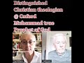

# In 32 seconds: Distinguished Oxford theologian: Muhammad true Prophet of God #shorts (2021-05-04 07:38:25+00:00)

## Description

Not only does Professor Keith Ward say Muhammad was a genuine prophet of God but nearly all of his Christian theologian colleagues think so too!

Keith Ward is an English Anglican priest, philosopher, and theologian. He is a fellow of the British Academy, a priest of the Church of England, and Professor of Divinity at the University of Oxford from 1991 to 2004.

## Full transcript with timestamps

[0:00:00](https://youtu.be/aTa_l0EwBpM?t=0) what do you as a christian theologian  
[0:00:02](https://youtu.be/aTa_l0EwBpM?t=2) make of the prophethood of muhammad  
[0:00:05](https://youtu.be/aTa_l0EwBpM?t=5) um do you have any thoughts about that  
[0:00:07](https://youtu.be/aTa_l0EwBpM?t=7) oh yes  
[0:00:11](https://youtu.be/aTa_l0EwBpM?t=11) i do think uh that muhammad was a  
[0:00:14](https://youtu.be/aTa_l0EwBpM?t=14) genuine prophet of god  
[0:00:15](https://youtu.be/aTa_l0EwBpM?t=15) and that he was raised up by god and  
[0:00:18](https://youtu.be/aTa_l0EwBpM?t=18) that the quran  
[0:00:19](https://youtu.be/aTa_l0EwBpM?t=19) is in some way an expression  
[0:00:23](https://youtu.be/aTa_l0EwBpM?t=23) of god's revelation  
[0:00:27](https://youtu.be/aTa_l0EwBpM?t=27) so i do think that  
[0:00:31](https://youtu.be/aTa_l0EwBpM?t=31) um  
