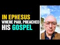

# In Ephesus where Paul preached his Gospel #shorts (2021-10-30)

## Description

## Summary of [In Ephesus where Paul preached his Gospel #shorts](https://www.youtube.com/watch?v=GG6A7U1XVh4)

*This summary is AI generated - there may be inaccuracies. *

### [00:00:00](https://www.youtube.com/watch?v=GG6A7U1XVh4&t=0) - [00:00:00](https://www.youtube.com/watch?v=GG6A7U1XVh4&t=0)

is a reminder to believers that they are all human and should not be proud of their lineage. Piety and consciousness are more important than any other attribute.

**[00:00:00](https://www.youtube.com/watch?v=GG6A7U1XVh4&t=0)** In Ephesus, where Paul preached his gospel, the Hadith reminds believers that they are all human and should not be proud of their lineage. Piety and consciousness are more important than any other attribute.

<h2>Full transcript with timestamps: CLICK TO EXPAND</h2>

[0:00:00](https://youtu.be/GG6A7U1XVh4?t=0) well here i am in ephesus where paul  
[0:00:03](https://youtu.be/GG6A7U1XVh4?t=3) preached his gospel and i'm reminded of  
[0:00:05](https://youtu.be/GG6A7U1XVh4?t=5) this hadith  
[0:00:08](https://youtu.be/GG6A7U1XVh4?t=8) related at the messenger of god upon  
[0:00:10](https://youtu.be/GG6A7U1XVh4?t=10) whom be peace said  
[0:00:12](https://youtu.be/GG6A7U1XVh4?t=12) these lineages of yours do not make you  
[0:00:15](https://youtu.be/GG6A7U1XVh4?t=15) superior to anyone you are all human  
[0:00:18](https://youtu.be/GG6A7U1XVh4?t=18) no one has superiority over another  
[0:00:21](https://youtu.be/GG6A7U1XVh4?t=21) except in piety and consciousness  
[0:00:25](https://youtu.be/GG6A7U1XVh4?t=25) it is sufficient shame for one to be  
[0:00:28](https://youtu.be/GG6A7U1XVh4?t=28) foul evil or stingy  
[0:00:31](https://youtu.be/GG6A7U1XVh4?t=31) hadith in ahmad and behaki  

