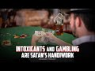

# Intoxicants and gambling are Satan’s handiwork (2022-09-03)

## Description

You Can Support My Work on Patreon:
https://www.patreon.com/Bloggingtheology

My Paypal Link: 
https://www.paypal.com/paypalme/bloggingtheology?locale.x=en_GB

## Summary of [Intoxicants and gambling are Satan’s handiwork](https://www.youtube.com/watch?v=7Yy0dnQUe0U)

*This summary is AI generated - there may be inaccuracies. *

### [00:00:00](https://www.youtube.com/watch?v=7Yy0dnQUe0U&t=0) - [00:00:00](https://www.youtube.com/watch?v=7Yy0dnQUe0U&t=0)

in this video sermonizes against the use of intoxicants and gambling, calling them the handiwork of Satan. He urges people to avoid them in order to achieve success.

**[00:00:00](https://www.youtube.com/watch?v=7Yy0dnQUe0U&t=0)**  is a sermon at a mosque open day, in which the speaker condemns intoxicants and gambling as evil works of Satan. He encourages people to shun them in order to achieve success.

## Full transcript with timestamps

[0:00:00](https://youtu.be/7Yy0dnQUe0U?t=0) well here i am at the mosque open day at  
[0:00:03](https://youtu.be/7Yy0dnQUe0U?t=3) regents park mosque here in london  
[0:00:06](https://youtu.be/7Yy0dnQUe0U?t=6) oh believers intoxicants gambling idols  
[0:00:09](https://youtu.be/7Yy0dnQUe0U?t=9) and drawing lots for decisions  
[0:00:11](https://youtu.be/7Yy0dnQUe0U?t=11) are all evil of satan's handiwork so  
[0:00:15](https://youtu.be/7Yy0dnQUe0U?t=15) shun them so that you may be successful  
[0:00:18](https://youtu.be/7Yy0dnQUe0U?t=18) satan's plan is to stir up hostility and  
[0:00:21](https://youtu.be/7Yy0dnQUe0U?t=21) hatred between you with intoxicants and  
[0:00:24](https://youtu.be/7Yy0dnQUe0U?t=24) gambling and to prevent you from  
[0:00:26](https://youtu.be/7Yy0dnQUe0U?t=26) remembering god and praying will you not  
[0:00:30](https://youtu.be/7Yy0dnQUe0U?t=30) then abstain  
[0:00:32](https://youtu.be/7Yy0dnQUe0U?t=32) obey god and obey the messenger and  
[0:00:34](https://youtu.be/7Yy0dnQUe0U?t=34) beware  
[0:00:36](https://youtu.be/7Yy0dnQUe0U?t=36) but if you turn away then know that our  
[0:00:38](https://youtu.be/7Yy0dnQUe0U?t=38) messenger's duty is only to deliver the  
[0:00:41](https://youtu.be/7Yy0dnQUe0U?t=41) message clearly  
