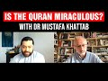

# Is the Quran miraculous? With Dr Mustafa Khattab (2022-03-10 18:45:08+00:00)

## Description

To check out the Clear Quran translation, the Clear Quran for Kids, the Clear Quran Dictionary, or the app visit: https://www.theclearquran.org/

You Can Support My Work on Patreon:
https://www.patreon.com/Bloggingtheology

My Paypal Link: 
https://www.paypal.com/paypalme/bloggingtheology?locale.x=en_GB

## Summary of [Is the Quran miraculous? With Dr Mustafa Khattab](https://www.youtube.com/watch?v=UB4gOfl0ets)

*This is an AI generated summary. There may be inaccuracies. *

### [00:00:00](https://www.youtube.com/watch?v=UB4gOfl0ets&t=0) - [00:45:00](https://www.youtube.com/watch?v=UB4gOfl0ets&t=2700)

 discusses the Quran's origins and poetic properties. Dr. Mustafa Khattab points out that the Quran is composed of 2000 roots, making it easy to understand for non-Arabic speakers. He also provides a website where people can access the Quran in Arabic.

**[00:00:00](https://www.youtube.com/watch?v=UB4gOfl0ets&t=0)** explains that the Quran is a higher authority than human beings, and that translations of the Quran are always being made to keep up with the changing understanding of the scripture by different generations. He says that the Quranic translations currently available in English are not perfect, and that there are always new translations being created to meet the needs of different people.
* **[00:05:00](https://www.youtube.com/watch?v=UB4gOfl0ets&t=300)**  discusses the criticism that the Quran is copied from the Bible. All Muslims agree that the Quran and the Injil (Gospel) are from the same source, but they disagree on how the Quran was preserved. The Quran was memorized by the prophet, and as a result, it has fewer mistakes than other translations.
* **[00:10:00](https://www.youtube.com/watch?v=UB4gOfl0ets&t=600)** Dr. Khattab discusses some of the differences between the Quran and the Bible, including the miracles found in the Quran. He also discusses some of the predictions that were made about the future and which actually came true.
* **[00:15:00](https://www.youtube.com/watch?v=UB4gOfl0ets&t=900)**  discusses the differences between the grammar and rhetoric used in the Quran compared to other ancient texts, explaining that it is used to emphasize the magnitude of divine power and miracles. It also discusses how, in some cases, the Quran uses different pronouns to show the lack of importance of certain people in comparison to others.
* **[00:20:00](https://www.youtube.com/watch?v=UB4gOfl0ets&t=1200)**  discusses how different translations of a Qur'anic verse can be interpreted, with Dr. Mustafa Khattab discussing his translation which is softer than Abdel Haleem's. Khattab argues that this softer interpretation is based on the teachings of the Prophet Muhammad and the context of the verses.
* **[00:25:00](https://www.youtube.com/watch?v=UB4gOfl0ets&t=1500)** The Qur'an is said to have a special quality that no human speech can match; a claim made by some in dawa in Britain. Abdul Halim discusses this claim in detail in his book, "Understanding the Quran: Themes and Style."
* **[00:30:00](https://www.youtube.com/watch?v=UB4gOfl0ets&t=1800)**  discusses the Quran's miraculous nature, discussing how the prophet Muhammad's teachings are similar to, but different from, the teachings found in the Quran. The narrator also compares the two languages and how the Arabic version is more concise and beautiful than the English translations.
* **[00:35:00](https://www.youtube.com/watch?v=UB4gOfl0ets&t=2100)**  discusses various scientific references found in the Quran, some of which have been confirmed by science. Islam is compatible with science, according to some Muslims, because the Quran contains scientific references.
* **[00:40:00](https://www.youtube.com/watch?v=UB4gOfl0ets&t=2400)** Dr. Mustafa Khattab discusses the scientific references in the Quran, which include references to the Earth being in a circle, the sun being a source of light, footnotes and historical background to make it difficult for islamophobes to take things out of context, and a translation for kids ages 7-up.
* **[00:45:00](https://www.youtube.com/watch?v=UB4gOfl0ets&t=2700)** This YouTube video, hosted by Dr. Mustafa Khattab, discusses the Quran's origins and poetic properties. Khattab points out that the Quran is composed of 2000 roots, making it easy to understand for non-Arabic speakers. He also provides a website where people can access the Quran in Arabic.

## Full transcript with timestamps

[0:00:02](https://youtu.be/UB4gOfl0ets?t=2) hello everyone and welcome to blogging  
[0:00:05](https://youtu.be/UB4gOfl0ets?t=5) theology today i am delighted to talk to  
[0:00:08](https://youtu.be/UB4gOfl0ets?t=8) dr mustapha katab you are most welcome  
[0:00:10](https://youtu.be/UB4gOfl0ets?t=10) sir  
[0:00:11](https://youtu.be/UB4gOfl0ets?t=11) thank you my pleasure thanks for having  
[0:00:13](https://youtu.be/UB4gOfl0ets?t=13) me my pleasure uh mustafa received his  
[0:00:16](https://youtu.be/UB4gOfl0ets?t=16) phd in islamic studies from al-azhar  
[0:00:19](https://youtu.be/UB4gOfl0ets?t=19) university's faculty of languages and  
[0:00:22](https://youtu.be/UB4gOfl0ets?t=22) translation and held the position of  
[0:00:25](https://youtu.be/UB4gOfl0ets?t=25) lecturer at al-azhar university for over  
[0:00:28](https://youtu.be/UB4gOfl0ets?t=28) 10 years he is also a member of the  
[0:00:31](https://youtu.be/UB4gOfl0ets?t=31) canadian council of imams and a  
[0:00:33](https://youtu.be/UB4gOfl0ets?t=33) fulbright interfaith scholar  
[0:00:36](https://youtu.be/UB4gOfl0ets?t=36) perhaps he is most famous as the  
[0:00:39](https://youtu.be/UB4gOfl0ets?t=39) translator of the clear quran which is  
[0:00:42](https://youtu.be/UB4gOfl0ets?t=42) here and that's a beautiful cover by the  
[0:00:45](https://youtu.be/UB4gOfl0ets?t=45) way it's very very nice  
[0:00:47](https://youtu.be/UB4gOfl0ets?t=47) um the translation has been officially  
[0:00:49](https://youtu.be/UB4gOfl0ets?t=49) approved by al-azhar and endorsed by the  
[0:00:52](https://youtu.be/UB4gOfl0ets?t=52) canadian council of imams and many  
[0:00:55](https://youtu.be/UB4gOfl0ets?t=55) muslim organizations and scholars  
[0:00:57](https://youtu.be/UB4gOfl0ets?t=57) worldwide  
[0:01:00](https://youtu.be/UB4gOfl0ets?t=60) so i would like to begin if i may by  
[0:01:02](https://youtu.be/UB4gOfl0ets?t=62) asking a really fundamental question  
[0:01:06](https://youtu.be/UB4gOfl0ets?t=66) why is the quran so central to the life  
[0:01:09](https://youtu.be/UB4gOfl0ets?t=69) of muslims  
[0:01:11](https://youtu.be/UB4gOfl0ets?t=71) well thank you uh this is a very good  
[0:01:13](https://youtu.be/UB4gOfl0ets?t=73) question  
[0:01:14](https://youtu.be/UB4gOfl0ets?t=74) uh we know that we as human beings who  
[0:01:16](https://youtu.be/UB4gOfl0ets?t=76) are very intelligent  
[0:01:19](https://youtu.be/UB4gOfl0ets?t=79) but sometimes we disagree  
[0:01:21](https://youtu.be/UB4gOfl0ets?t=81) so let's say for example uh here in in  
[0:01:24](https://youtu.be/UB4gOfl0ets?t=84) canada um  
[0:01:27](https://youtu.be/UB4gOfl0ets?t=87) marijuana weed has been legalized in the  
[0:01:29](https://youtu.be/UB4gOfl0ets?t=89) last couple of years that's it so let's  
[0:01:31](https://youtu.be/UB4gOfl0ets?t=91) say if i smoke weed here in toronto  
[0:01:35](https://youtu.be/UB4gOfl0ets?t=95) and i drive one hour to the south new  
[0:01:37](https://youtu.be/UB4gOfl0ets?t=97) york buffalo new york is only one hour  
[0:01:39](https://youtu.be/UB4gOfl0ets?t=99) away from here  
[0:01:41](https://youtu.be/UB4gOfl0ets?t=101) if i cross the border and i have  
[0:01:43](https://youtu.be/UB4gOfl0ets?t=103) marijuana or weed with me i'm going to  
[0:01:45](https://youtu.be/UB4gOfl0ets?t=105) be arrested in buffalo even though it's  
[0:01:48](https://youtu.be/UB4gOfl0ets?t=108) it's legal in canada  
[0:01:50](https://youtu.be/UB4gOfl0ets?t=110) canada and the us are two democracies  
[0:01:53](https://youtu.be/UB4gOfl0ets?t=113) first world  
[0:01:54](https://youtu.be/UB4gOfl0ets?t=114) but they disagree on the legality of  
[0:01:57](https://youtu.be/UB4gOfl0ets?t=117) marijuana and the same goes for so many  
[0:01:59](https://youtu.be/UB4gOfl0ets?t=119) different things  
[0:02:01](https://youtu.be/UB4gOfl0ets?t=121) mercy killing  
[0:02:03](https://youtu.be/UB4gOfl0ets?t=123) so many different things  
[0:02:05](https://youtu.be/UB4gOfl0ets?t=125) also at some point in history apartheid  
[0:02:08](https://youtu.be/UB4gOfl0ets?t=128) was legal in south america  
[0:02:11](https://youtu.be/UB4gOfl0ets?t=131) and the jim crow laws in the u.s that  
[0:02:15](https://youtu.be/UB4gOfl0ets?t=135) you know black people were were not as  
[0:02:17](https://youtu.be/UB4gOfl0ets?t=137) equal as white people and so on and so  
[0:02:20](https://youtu.be/UB4gOfl0ets?t=140) forth and i'm talking about intelligent  
[0:02:22](https://youtu.be/UB4gOfl0ets?t=142) people uh women were allowed to vote  
[0:02:25](https://youtu.be/UB4gOfl0ets?t=145) only 70 years ago right so in these  
[0:02:28](https://youtu.be/UB4gOfl0ets?t=148) democracies and in these  
[0:02:30](https://youtu.be/UB4gOfl0ets?t=150) first world countries they still debate  
[0:02:33](https://youtu.be/UB4gOfl0ets?t=153) and disagree on certain concepts how do  
[0:02:36](https://youtu.be/UB4gOfl0ets?t=156) you settle this debate we need a higher  
[0:02:39](https://youtu.be/UB4gOfl0ets?t=159) authority and this is how we look at the  
[0:02:41](https://youtu.be/UB4gOfl0ets?t=161) quran that the quran is a higher  
[0:02:42](https://youtu.be/UB4gOfl0ets?t=162) authority from god he created us  
[0:02:45](https://youtu.be/UB4gOfl0ets?t=165) and he sent us our  
[0:02:47](https://youtu.be/UB4gOfl0ets?t=167) manufacturer's manual the quran to teach  
[0:02:51](https://youtu.be/UB4gOfl0ets?t=171) us this is what you need to do when you  
[0:02:53](https://youtu.be/UB4gOfl0ets?t=173) disagree this is good for you this is  
[0:02:56](https://youtu.be/UB4gOfl0ets?t=176) bad for you so the quran the way we see  
[0:02:58](https://youtu.be/UB4gOfl0ets?t=178) it as muslims is like the manufacturer's  
[0:03:00](https://youtu.be/UB4gOfl0ets?t=180) manual that comes with your phone or  
[0:03:02](https://youtu.be/UB4gOfl0ets?t=182) with your car it tells you how to  
[0:03:04](https://youtu.be/UB4gOfl0ets?t=184) function in the best way as an  
[0:03:06](https://youtu.be/UB4gOfl0ets?t=186) individual as a family and as a society  
[0:03:10](https://youtu.be/UB4gOfl0ets?t=190) well that's very interesting now you  
[0:03:12](https://youtu.be/UB4gOfl0ets?t=192) held up your copy and i have my copy of  
[0:03:14](https://youtu.be/UB4gOfl0ets?t=194) the quran  
[0:03:16](https://youtu.be/UB4gOfl0ets?t=196) now i understand because you told me  
[0:03:18](https://youtu.be/UB4gOfl0ets?t=198) earlier on there are about 150  
[0:03:20](https://youtu.be/UB4gOfl0ets?t=200) translations of the quran in english  
[0:03:22](https://youtu.be/UB4gOfl0ets?t=202) alone that have been made in the last  
[0:03:24](https://youtu.be/UB4gOfl0ets?t=204) 100 200 years or so so why do we need  
[0:03:28](https://youtu.be/UB4gOfl0ets?t=208) yet another translation why have you  
[0:03:30](https://youtu.be/UB4gOfl0ets?t=210) produced this translation when we have  
[0:03:32](https://youtu.be/UB4gOfl0ets?t=212) so many translations to choose from  
[0:03:34](https://youtu.be/UB4gOfl0ets?t=214) already  
[0:03:35](https://youtu.be/UB4gOfl0ets?t=215) i think if we understand the nature of  
[0:03:37](https://youtu.be/UB4gOfl0ets?t=217) the quran  
[0:03:38](https://youtu.be/UB4gOfl0ets?t=218) we will be able to explain this issue  
[0:03:42](https://youtu.be/UB4gOfl0ets?t=222) so  
[0:03:43](https://youtu.be/UB4gOfl0ets?t=223) we have powers we have knowledge we can  
[0:03:46](https://youtu.be/UB4gOfl0ets?t=226) talk  
[0:03:47](https://youtu.be/UB4gOfl0ets?t=227) but our talk our speech  
[0:03:49](https://youtu.be/UB4gOfl0ets?t=229) is nothing compared to god  
[0:03:52](https://youtu.be/UB4gOfl0ets?t=232) and our ability and our knowledge is  
[0:03:54](https://youtu.be/UB4gOfl0ets?t=234) nothing compared to his  
[0:03:56](https://youtu.be/UB4gOfl0ets?t=236) only the quran in arabic is perfect  
[0:03:59](https://youtu.be/UB4gOfl0ets?t=239) and we as human beings we have  
[0:04:01](https://youtu.be/UB4gOfl0ets?t=241) limitations  
[0:04:02](https://youtu.be/UB4gOfl0ets?t=242) and this is why  
[0:04:04](https://youtu.be/UB4gOfl0ets?t=244) every generation has a different  
[0:04:07](https://youtu.be/UB4gOfl0ets?t=247) understanding of the quran a different  
[0:04:09](https://youtu.be/UB4gOfl0ets?t=249) layer of understanding and this is why  
[0:04:11](https://youtu.be/UB4gOfl0ets?t=251) there are always new tafsirs or exegesis  
[0:04:15](https://youtu.be/UB4gOfl0ets?t=255) in in arabic that come out all the time  
[0:04:18](https://youtu.be/UB4gOfl0ets?t=258) from the time of the companions like ibn  
[0:04:21](https://youtu.be/UB4gOfl0ets?t=261) abbas the who who was related to the  
[0:04:23](https://youtu.be/UB4gOfl0ets?t=263) prophet  
[0:04:25](https://youtu.be/UB4gOfl0ets?t=265) the rest of the companions some of them  
[0:04:27](https://youtu.be/UB4gOfl0ets?t=267) they given their own interpretations the  
[0:04:30](https://youtu.be/UB4gOfl0ets?t=270) following generations until this day  
[0:04:32](https://youtu.be/UB4gOfl0ets?t=272) they always find gems in the quran  
[0:04:35](https://youtu.be/UB4gOfl0ets?t=275) and  
[0:04:36](https://youtu.be/UB4gOfl0ets?t=276) by the same extension translations or  
[0:04:39](https://youtu.be/UB4gOfl0ets?t=279) tafsir or exegesis but not in arabic in  
[0:04:42](https://youtu.be/UB4gOfl0ets?t=282) a different language in english or  
[0:04:44](https://youtu.be/UB4gOfl0ets?t=284) french or any other language for that  
[0:04:47](https://youtu.be/UB4gOfl0ets?t=287) matter  
[0:04:48](https://youtu.be/UB4gOfl0ets?t=288) so when i look at the quranic  
[0:04:50](https://youtu.be/UB4gOfl0ets?t=290) translations  
[0:04:52](https://youtu.be/UB4gOfl0ets?t=292) everyone is gifted in a different way  
[0:04:54](https://youtu.be/UB4gOfl0ets?t=294) even the the scholars of exegesis in the  
[0:04:58](https://youtu.be/UB4gOfl0ets?t=298) arabic language  
[0:05:00](https://youtu.be/UB4gOfl0ets?t=300) everyone had a specialization so if you  
[0:05:02](https://youtu.be/UB4gOfl0ets?t=302) look at  
[0:05:03](https://youtu.be/UB4gOfl0ets?t=303) he looked at the jurisprudence or the in  
[0:05:06](https://youtu.be/UB4gOfl0ets?t=306) the quran  
[0:05:08](https://youtu.be/UB4gOfl0ets?t=308) if you look at someone like al-khashev  
[0:05:10](https://youtu.be/UB4gOfl0ets?t=310) azam is a big scholar of he was a  
[0:05:13](https://youtu.be/UB4gOfl0ets?t=313) linguist he looked at the quran from a  
[0:05:15](https://youtu.be/UB4gOfl0ets?t=315) linguistic point of view so everyone  
[0:05:18](https://youtu.be/UB4gOfl0ets?t=318) focus on the tafsir or the understanding  
[0:05:20](https://youtu.be/UB4gOfl0ets?t=320) of the quran based on their niche or  
[0:05:24](https://youtu.be/UB4gOfl0ets?t=324) their expertise  
[0:05:26](https://youtu.be/UB4gOfl0ets?t=326) in the same way when you you look at  
[0:05:28](https://youtu.be/UB4gOfl0ets?t=328) different translations  
[0:05:30](https://youtu.be/UB4gOfl0ets?t=330) some translators have been you know were  
[0:05:33](https://youtu.be/UB4gOfl0ets?t=333) qualified many were not because for you  
[0:05:36](https://youtu.be/UB4gOfl0ets?t=336) to translate the quran just like  
[0:05:38](https://youtu.be/UB4gOfl0ets?t=338) any proficient like a doctor  
[0:05:40](https://youtu.be/UB4gOfl0ets?t=340) you have to have some training you have  
[0:05:43](https://youtu.be/UB4gOfl0ets?t=343) to have some expertise to be able to to  
[0:05:45](https://youtu.be/UB4gOfl0ets?t=345) to practice  
[0:05:47](https://youtu.be/UB4gOfl0ets?t=347) and if you look at many people who  
[0:05:49](https://youtu.be/UB4gOfl0ets?t=349) translated the quran they were not  
[0:05:51](https://youtu.be/UB4gOfl0ets?t=351) qualified to translate sorry to say in  
[0:05:53](https://youtu.be/UB4gOfl0ets?t=353) the first place  
[0:05:54](https://youtu.be/UB4gOfl0ets?t=354) because historically in the last 200 300  
[0:05:57](https://youtu.be/UB4gOfl0ets?t=357) years  
[0:05:59](https://youtu.be/UB4gOfl0ets?t=359) the quran was not translated  
[0:06:01](https://youtu.be/UB4gOfl0ets?t=361) basically by muslims except  
[0:06:04](https://youtu.be/UB4gOfl0ets?t=364) in the first half of the 20th century  
[0:06:06](https://youtu.be/UB4gOfl0ets?t=366) which means  
[0:06:08](https://youtu.be/UB4gOfl0ets?t=368) for about 1300 years the quran was only  
[0:06:11](https://youtu.be/UB4gOfl0ets?t=371) translated by missionaries and  
[0:06:13](https://youtu.be/UB4gOfl0ets?t=373) orientalists and so on and so forth  
[0:06:16](https://youtu.be/UB4gOfl0ets?t=376) so muslims in the indian subcontinent  
[0:06:19](https://youtu.be/UB4gOfl0ets?t=379) because you know the british came with  
[0:06:21](https://youtu.be/UB4gOfl0ets?t=381) their missionaries and they had their  
[0:06:22](https://youtu.be/UB4gOfl0ets?t=382) own mistranslations of the quran so the  
[0:06:26](https://youtu.be/UB4gOfl0ets?t=386) the most first muslim translations were  
[0:06:28](https://youtu.be/UB4gOfl0ets?t=388) reactionary they wanted to respond  
[0:06:31](https://youtu.be/UB4gOfl0ets?t=391) right but the first people who started  
[0:06:33](https://youtu.be/UB4gOfl0ets?t=393) to translate the quran  
[0:06:34](https://youtu.be/UB4gOfl0ets?t=394) they were not particularly  
[0:06:37](https://youtu.be/UB4gOfl0ets?t=397) qualified to translate because arabic is  
[0:06:40](https://youtu.be/UB4gOfl0ets?t=400) not their native tongue english is not  
[0:06:42](https://youtu.be/UB4gOfl0ets?t=402) their native tongue they speak hindu or  
[0:06:44](https://youtu.be/UB4gOfl0ets?t=404) urdu so basically they learned both to  
[0:06:47](https://youtu.be/UB4gOfl0ets?t=407) be able to translate and  
[0:06:49](https://youtu.be/UB4gOfl0ets?t=409) in the process they made mistakes  
[0:06:52](https://youtu.be/UB4gOfl0ets?t=412) other translators who came after muslim  
[0:06:54](https://youtu.be/UB4gOfl0ets?t=414) and non-muslims you know sometimes they  
[0:06:56](https://youtu.be/UB4gOfl0ets?t=416) copied older translations and this is  
[0:06:59](https://youtu.be/UB4gOfl0ets?t=419) why you still see words like infidel and  
[0:07:02](https://youtu.be/UB4gOfl0ets?t=422) holy war we don't have these words in  
[0:07:04](https://youtu.be/UB4gOfl0ets?t=424) the arabic but they just copy outdated  
[0:07:07](https://youtu.be/UB4gOfl0ets?t=427) uh translations so for someone to  
[0:07:09](https://youtu.be/UB4gOfl0ets?t=429) translate the quran they have to be  
[0:07:11](https://youtu.be/UB4gOfl0ets?t=431) qualified and so on and so forth and  
[0:07:14](https://youtu.be/UB4gOfl0ets?t=434) every translator uh you know they look  
[0:07:17](https://youtu.be/UB4gOfl0ets?t=437) at previous translations  
[0:07:19](https://youtu.be/UB4gOfl0ets?t=439) they see shortcomings so they come in to  
[0:07:22](https://youtu.be/UB4gOfl0ets?t=442) fill in the gap and to do something  
[0:07:24](https://youtu.be/UB4gOfl0ets?t=444) better  
[0:07:24](https://youtu.be/UB4gOfl0ets?t=444) just like i did with the clear quran  
[0:07:26](https://youtu.be/UB4gOfl0ets?t=446) maybe someone is going to come after  
[0:07:28](https://youtu.be/UB4gOfl0ets?t=448) 5-10 years and say oh this is not a good  
[0:07:30](https://youtu.be/UB4gOfl0ets?t=450) translations and they are going to do  
[0:07:32](https://youtu.be/UB4gOfl0ets?t=452) something better  
[0:07:33](https://youtu.be/UB4gOfl0ets?t=453) no translation is perfect so we have to  
[0:07:35](https://youtu.be/UB4gOfl0ets?t=455) agree on this one the only thing that is  
[0:07:37](https://youtu.be/UB4gOfl0ets?t=457) perfect is the arabic text and this is  
[0:07:40](https://youtu.be/UB4gOfl0ets?t=460) why you will always see new attempts  
[0:07:43](https://youtu.be/UB4gOfl0ets?t=463) to translate the quran making it uh  
[0:07:45](https://youtu.be/UB4gOfl0ets?t=465) accessible and relatable to uh people of  
[0:07:48](https://youtu.be/UB4gOfl0ets?t=468) our time so just to clarify for for  
[0:07:51](https://youtu.be/UB4gOfl0ets?t=471) muslims this book here um which contains  
[0:07:54](https://youtu.be/UB4gOfl0ets?t=474) your translation is not actually the  
[0:07:55](https://youtu.be/UB4gOfl0ets?t=475) quran is it this is not it's a  
[0:07:58](https://youtu.be/UB4gOfl0ets?t=478) translation of the quran so we use the  
[0:08:00](https://youtu.be/UB4gOfl0ets?t=480) quran for the arabic text yeah the  
[0:08:03](https://youtu.be/UB4gOfl0ets?t=483) english is  
[0:08:04](https://youtu.be/UB4gOfl0ets?t=484) uh the humble human effort to explain  
[0:08:07](https://youtu.be/UB4gOfl0ets?t=487) the divine  
[0:08:08](https://youtu.be/UB4gOfl0ets?t=488) right  
[0:08:09](https://youtu.be/UB4gOfl0ets?t=489) so yeah it's not the english translation  
[0:08:11](https://youtu.be/UB4gOfl0ets?t=491) is not infallible it's not the inerrant  
[0:08:13](https://youtu.be/UB4gOfl0ets?t=493) word of god the original arabic  
[0:08:16](https://youtu.be/UB4gOfl0ets?t=496) revelation is then that's an important  
[0:08:17](https://youtu.be/UB4gOfl0ets?t=497) distinction because uh often with  
[0:08:19](https://youtu.be/UB4gOfl0ets?t=499) christian bibles not that they're the  
[0:08:21](https://youtu.be/UB4gOfl0ets?t=501) same thing i know that people think oh  
[0:08:23](https://youtu.be/UB4gOfl0ets?t=503) my my bible in english is the word of  
[0:08:25](https://youtu.be/UB4gOfl0ets?t=505) god that is what god has inspired but of  
[0:08:27](https://youtu.be/UB4gOfl0ets?t=507) course it's not the original language  
[0:08:29](https://youtu.be/UB4gOfl0ets?t=509) not even the language necessary jesus  
[0:08:31](https://youtu.be/UB4gOfl0ets?t=511) spoke even so uh this important  
[0:08:33](https://youtu.be/UB4gOfl0ets?t=513) distinction i think yeah this is why  
[0:08:35](https://youtu.be/UB4gOfl0ets?t=515) when missionaries for example use  
[0:08:37](https://youtu.be/UB4gOfl0ets?t=517) english translations to say that the  
[0:08:38](https://youtu.be/UB4gOfl0ets?t=518) quran has mistakes contradictions  
[0:08:41](https://youtu.be/UB4gOfl0ets?t=521) and they refer to the english  
[0:08:42](https://youtu.be/UB4gOfl0ets?t=522) translations  
[0:08:44](https://youtu.be/UB4gOfl0ets?t=524) not the arabic  
[0:08:45](https://youtu.be/UB4gOfl0ets?t=525) they're totally different things  
[0:08:47](https://youtu.be/UB4gOfl0ets?t=527) right so the arabic has no  
[0:08:49](https://youtu.be/UB4gOfl0ets?t=529) contradictions no mistakes right  
[0:08:52](https://youtu.be/UB4gOfl0ets?t=532) translators make mistakes but not the  
[0:08:54](https://youtu.be/UB4gOfl0ets?t=534) arabic right so they need to make the  
[0:08:56](https://youtu.be/UB4gOfl0ets?t=536) distinction  
[0:08:58](https://youtu.be/UB4gOfl0ets?t=538) okay now i mentioned briefly uh the  
[0:09:00](https://youtu.be/UB4gOfl0ets?t=540) bible but  
[0:09:01](https://youtu.be/UB4gOfl0ets?t=541) a question or a criticism of the quran  
[0:09:03](https://youtu.be/UB4gOfl0ets?t=543) or an allegation made about the quran by  
[0:09:07](https://youtu.be/UB4gOfl0ets?t=547) by some people  
[0:09:08](https://youtu.be/UB4gOfl0ets?t=548) was  
[0:09:09](https://youtu.be/UB4gOfl0ets?t=549) basically was the quran copied from the  
[0:09:11](https://youtu.be/UB4gOfl0ets?t=551) bible how do you account for the  
[0:09:14](https://youtu.be/UB4gOfl0ets?t=554) similarities between the quran and the  
[0:09:17](https://youtu.be/UB4gOfl0ets?t=557) bible they say especially historical  
[0:09:19](https://youtu.be/UB4gOfl0ets?t=559) stories such as that of joseph moses  
[0:09:22](https://youtu.be/UB4gOfl0ets?t=562) and jesus so this is a really an  
[0:09:24](https://youtu.be/UB4gOfl0ets?t=564) argument against the divine origin of  
[0:09:26](https://youtu.be/UB4gOfl0ets?t=566) the quran by saying well it's copied  
[0:09:29](https://youtu.be/UB4gOfl0ets?t=569) from the bible how can it be divine how  
[0:09:31](https://youtu.be/UB4gOfl0ets?t=571) would you respond to that do you think  
[0:09:34](https://youtu.be/UB4gOfl0ets?t=574) well all muslims agree that the uh the  
[0:09:36](https://youtu.be/UB4gOfl0ets?t=576) all the uh  
[0:09:38](https://youtu.be/UB4gOfl0ets?t=578) injil the gospel that was given to jesus  
[0:09:41](https://youtu.be/UB4gOfl0ets?t=581) and the torah that was revealed to moses  
[0:09:43](https://youtu.be/UB4gOfl0ets?t=583) the psalms that was given to  
[0:09:46](https://youtu.be/UB4gOfl0ets?t=586) david and the scrolls of abraham all  
[0:09:48](https://youtu.be/UB4gOfl0ets?t=588) these revelations they came from the  
[0:09:50](https://youtu.be/UB4gOfl0ets?t=590) same source  
[0:09:51](https://youtu.be/UB4gOfl0ets?t=591) however they were not preserved the same  
[0:09:54](https://youtu.be/UB4gOfl0ets?t=594) way that the quran has been preserved  
[0:09:57](https://youtu.be/UB4gOfl0ets?t=597) the quran has been memorized  
[0:09:59](https://youtu.be/UB4gOfl0ets?t=599) cover to cover by the prophet thousands  
[0:10:02](https://youtu.be/UB4gOfl0ets?t=602) of his companions millions of muslims  
[0:10:04](https://youtu.be/UB4gOfl0ets?t=604) throughout history including myself  
[0:10:07](https://youtu.be/UB4gOfl0ets?t=607) so i completed my memorization at the  
[0:10:09](https://youtu.be/UB4gOfl0ets?t=609) age of 12. i've seen kids at the age of  
[0:10:11](https://youtu.be/UB4gOfl0ets?t=611) five or six they memorized the quran in  
[0:10:14](https://youtu.be/UB4gOfl0ets?t=614) arabic  
[0:10:15](https://youtu.be/UB4gOfl0ets?t=615) and it's interesting to know that most  
[0:10:18](https://youtu.be/UB4gOfl0ets?t=618) of the people who win international  
[0:10:20](https://youtu.be/UB4gOfl0ets?t=620) quran competitions the memorization  
[0:10:22](https://youtu.be/UB4gOfl0ets?t=622) competitions every year they don't even  
[0:10:24](https://youtu.be/UB4gOfl0ets?t=624) speak the arabic language we're talking  
[0:10:26](https://youtu.be/UB4gOfl0ets?t=626) about people from indonesia nigeria  
[0:10:29](https://youtu.be/UB4gOfl0ets?t=629) other places so the quran has been  
[0:10:31](https://youtu.be/UB4gOfl0ets?t=631) written down  
[0:10:32](https://youtu.be/UB4gOfl0ets?t=632) from the time of the prophet uh the  
[0:10:35](https://youtu.be/UB4gOfl0ets?t=635) quran has been memorized and so on and  
[0:10:37](https://youtu.be/UB4gOfl0ets?t=637) so forth and the the bible has not been  
[0:10:40](https://youtu.be/UB4gOfl0ets?t=640) treated the same way and this is why  
[0:10:42](https://youtu.be/UB4gOfl0ets?t=642) there are always  
[0:10:43](https://youtu.be/UB4gOfl0ets?t=643) editions and  
[0:10:45](https://youtu.be/UB4gOfl0ets?t=645) versions you know the catholic bible has  
[0:10:48](https://youtu.be/UB4gOfl0ets?t=648) you know seven extra chapters that the  
[0:10:49](https://youtu.be/UB4gOfl0ets?t=649) protestant bible uh doesn't have and  
[0:10:52](https://youtu.be/UB4gOfl0ets?t=652) and uh and so on and so forth uh you can  
[0:10:54](https://youtu.be/UB4gOfl0ets?t=654) read about this  
[0:10:56](https://youtu.be/UB4gOfl0ets?t=656) uh also when you read the stories in the  
[0:10:58](https://youtu.be/UB4gOfl0ets?t=658) quran and in the bible there are some  
[0:11:00](https://youtu.be/UB4gOfl0ets?t=660) similarities but when you dig deeper  
[0:11:02](https://youtu.be/UB4gOfl0ets?t=662) there are major differences  
[0:11:05](https://youtu.be/UB4gOfl0ets?t=665) so both the bible and the quran  
[0:11:08](https://youtu.be/UB4gOfl0ets?t=668) they talk about god's nature  
[0:11:10](https://youtu.be/UB4gOfl0ets?t=670) god is loving and caring uh they talk  
[0:11:13](https://youtu.be/UB4gOfl0ets?t=673) about  
[0:11:14](https://youtu.be/UB4gOfl0ets?t=674) the universal values the need to be kind  
[0:11:17](https://youtu.be/UB4gOfl0ets?t=677) and generous and good to everyone but  
[0:11:19](https://youtu.be/UB4gOfl0ets?t=679) the theology is different  
[0:11:21](https://youtu.be/UB4gOfl0ets?t=681) so if you look at the new testament for  
[0:11:22](https://youtu.be/UB4gOfl0ets?t=682) example you know there is the focus on  
[0:11:25](https://youtu.be/UB4gOfl0ets?t=685) the divine nature of jesus and um  
[0:11:28](https://youtu.be/UB4gOfl0ets?t=688) salvation and  
[0:11:30](https://youtu.be/UB4gOfl0ets?t=690) jesus's crucifixion and resurrection and  
[0:11:33](https://youtu.be/UB4gOfl0ets?t=693) the quran talks uh you know the opposite  
[0:11:36](https://youtu.be/UB4gOfl0ets?t=696) about these things so  
[0:11:38](https://youtu.be/UB4gOfl0ets?t=698) there's no trinity in the quran just one  
[0:11:40](https://youtu.be/UB4gOfl0ets?t=700) jesus was not crucified and so on and so  
[0:11:43](https://youtu.be/UB4gOfl0ets?t=703) forth  
[0:11:44](https://youtu.be/UB4gOfl0ets?t=704) so these are some of the differences and  
[0:11:47](https://youtu.be/UB4gOfl0ets?t=707) if you started the book of genesis for  
[0:11:50](https://youtu.be/UB4gOfl0ets?t=710) example it puts the blame completely on  
[0:11:53](https://youtu.be/UB4gOfl0ets?t=713) eve for the fall from the garden  
[0:11:57](https://youtu.be/UB4gOfl0ets?t=717) and the quran gives you the opposite if  
[0:11:59](https://youtu.be/UB4gOfl0ets?t=719) you go to chapter 20 it says that adam  
[0:12:02](https://youtu.be/UB4gOfl0ets?t=722) made a mistake  
[0:12:03](https://youtu.be/UB4gOfl0ets?t=723) so it puts the blame on adam  
[0:12:06](https://youtu.be/UB4gOfl0ets?t=726) even though both of them ate but he put  
[0:12:08](https://youtu.be/UB4gOfl0ets?t=728) it clearly puts the uh the blame on uh  
[0:12:11](https://youtu.be/UB4gOfl0ets?t=731) on on adam  
[0:12:13](https://youtu.be/UB4gOfl0ets?t=733) uh there are so many uh so many examples  
[0:12:16](https://youtu.be/UB4gOfl0ets?t=736) like when you read in the quran for  
[0:12:17](https://youtu.be/UB4gOfl0ets?t=737) example you will see some miracles of  
[0:12:20](https://youtu.be/UB4gOfl0ets?t=740) jesus in the quran that are not in the  
[0:12:22](https://youtu.be/UB4gOfl0ets?t=742) bible yeah i can give you three now uh  
[0:12:25](https://youtu.be/UB4gOfl0ets?t=745) one of them the fact that jesus spoke  
[0:12:28](https://youtu.be/UB4gOfl0ets?t=748) when he was only a few days old to  
[0:12:30](https://youtu.be/UB4gOfl0ets?t=750) defend his the dignity of his mother  
[0:12:32](https://youtu.be/UB4gOfl0ets?t=752) uh when he created birds out of clay and  
[0:12:34](https://youtu.be/UB4gOfl0ets?t=754) breathed into them and they became birds  
[0:12:36](https://youtu.be/UB4gOfl0ets?t=756) and they flew away and also when the  
[0:12:39](https://youtu.be/UB4gOfl0ets?t=759) disciples demanded a sign when he first  
[0:12:42](https://youtu.be/UB4gOfl0ets?t=762) introduced his message to them he said  
[0:12:44](https://youtu.be/UB4gOfl0ets?t=764) what do you want they said we need a  
[0:12:46](https://youtu.be/UB4gOfl0ets?t=766) table full of food to come down from  
[0:12:48](https://youtu.be/UB4gOfl0ets?t=768) heaven these three are not there  
[0:12:51](https://youtu.be/UB4gOfl0ets?t=771) there is also the story of moses and the  
[0:12:54](https://youtu.be/UB4gOfl0ets?t=774) man of knowledge known as  
[0:12:56](https://youtu.be/UB4gOfl0ets?t=776) who is mentioned in chapter 18. this  
[0:12:58](https://youtu.be/UB4gOfl0ets?t=778) story is not in in the bible the bible  
[0:13:01](https://youtu.be/UB4gOfl0ets?t=781) has some stories like isaiah and this  
[0:13:03](https://youtu.be/UB4gOfl0ets?t=783) story is not in the quran  
[0:13:06](https://youtu.be/UB4gOfl0ets?t=786) and so on and so forth and and also if  
[0:13:08](https://youtu.be/UB4gOfl0ets?t=788) the prophet copied the quran from the  
[0:13:10](https://youtu.be/UB4gOfl0ets?t=790) bible  
[0:13:11](https://youtu.be/UB4gOfl0ets?t=791) how come that he didn't copy some of  
[0:13:13](https://youtu.be/UB4gOfl0ets?t=793) those  
[0:13:14](https://youtu.be/UB4gOfl0ets?t=794) you know  
[0:13:15](https://youtu.be/UB4gOfl0ets?t=795) well-known contradictions in in the  
[0:13:17](https://youtu.be/UB4gOfl0ets?t=797) bible  
[0:13:18](https://youtu.be/UB4gOfl0ets?t=798) like i know a student in egypt uh you  
[0:13:22](https://youtu.be/UB4gOfl0ets?t=802) know the he was  
[0:13:24](https://youtu.be/UB4gOfl0ets?t=804) copying the answer sheet of the student  
[0:13:26](https://youtu.be/UB4gOfl0ets?t=806) who was sitting next to him  
[0:13:28](https://youtu.be/UB4gOfl0ets?t=808) he copied the correct answers and the  
[0:13:30](https://youtu.be/UB4gOfl0ets?t=810) wrong answers including the guy's name  
[0:13:36](https://youtu.be/UB4gOfl0ets?t=816) he didn't know but the prophet couldn't  
[0:13:38](https://youtu.be/UB4gOfl0ets?t=818) read or write  
[0:13:39](https://youtu.be/UB4gOfl0ets?t=819) how about the scientific  
[0:13:42](https://youtu.be/UB4gOfl0ets?t=822) miracles in the quran how the baby  
[0:13:44](https://youtu.be/UB4gOfl0ets?t=824) develops inside the mother of the  
[0:13:45](https://youtu.be/UB4gOfl0ets?t=825) expansion of the universe everything was  
[0:13:47](https://youtu.be/UB4gOfl0ets?t=827) created from water and so on and so  
[0:13:50](https://youtu.be/UB4gOfl0ets?t=830) forth this information is not in the  
[0:13:52](https://youtu.be/UB4gOfl0ets?t=832) bible so he couldn't have copied it from  
[0:13:54](https://youtu.be/UB4gOfl0ets?t=834) there because it is not there but some  
[0:13:56](https://youtu.be/UB4gOfl0ets?t=836) of these particularly missionaries will  
[0:13:58](https://youtu.be/UB4gOfl0ets?t=838) say well there's the some of the stories  
[0:13:59](https://youtu.be/UB4gOfl0ets?t=839) you mentioned about jesus speaking in  
[0:14:01](https://youtu.be/UB4gOfl0ets?t=841) the in the womb and so on are found in  
[0:14:03](https://youtu.be/UB4gOfl0ets?t=843) apocryphal gospels uh from the early  
[0:14:06](https://youtu.be/UB4gOfl0ets?t=846) church so it looks as if he's got the  
[0:14:08](https://youtu.be/UB4gOfl0ets?t=848) information from there so how would you  
[0:14:10](https://youtu.be/UB4gOfl0ets?t=850) respond to that because they're not in  
[0:14:11](https://youtu.be/UB4gOfl0ets?t=851) the bible we agree but they're found in  
[0:14:13](https://youtu.be/UB4gOfl0ets?t=853) other christian uh sources  
[0:14:16](https://youtu.be/UB4gOfl0ets?t=856) well there are so many other information  
[0:14:18](https://youtu.be/UB4gOfl0ets?t=858) you know i i give some examples but  
[0:14:20](https://youtu.be/UB4gOfl0ets?t=860) there are so many other details like the  
[0:14:22](https://youtu.be/UB4gOfl0ets?t=862) scientific data and  
[0:14:24](https://youtu.be/UB4gOfl0ets?t=864) uh you know the stories that are in the  
[0:14:25](https://youtu.be/UB4gOfl0ets?t=865) quran that are not in the bible and vice  
[0:14:27](https://youtu.be/UB4gOfl0ets?t=867) versa and some of the predictions  
[0:14:30](https://youtu.be/UB4gOfl0ets?t=870) things that were going to happen in the  
[0:14:32](https://youtu.be/UB4gOfl0ets?t=872) future which actually came true  
[0:14:34](https://youtu.be/UB4gOfl0ets?t=874) and these things are not in the bible  
[0:14:36](https://youtu.be/UB4gOfl0ets?t=876) like let's say for example the story of  
[0:14:38](https://youtu.be/UB4gOfl0ets?t=878) the romans being defeated by the  
[0:14:40](https://youtu.be/UB4gOfl0ets?t=880) persians and how the quran predicted  
[0:14:43](https://youtu.be/UB4gOfl0ets?t=883) that the romans are going to win uh you  
[0:14:46](https://youtu.be/UB4gOfl0ets?t=886) know within three to nine years this is  
[0:14:48](https://youtu.be/UB4gOfl0ets?t=888) not in the bible it's not even an  
[0:14:50](https://youtu.be/UB4gOfl0ets?t=890) apocrypha you know  
[0:14:52](https://youtu.be/UB4gOfl0ets?t=892) so there are so many different things  
[0:14:53](https://youtu.be/UB4gOfl0ets?t=893) and there are some also details in the  
[0:14:55](https://youtu.be/UB4gOfl0ets?t=895) quran  
[0:14:57](https://youtu.be/UB4gOfl0ets?t=897) that don't exist elsewhere like let's  
[0:14:59](https://youtu.be/UB4gOfl0ets?t=899) say for example  
[0:15:01](https://youtu.be/UB4gOfl0ets?t=901) uh the story of the women in sora joseph  
[0:15:05](https://youtu.be/UB4gOfl0ets?t=905) yusuf uh when  
[0:15:07](https://youtu.be/UB4gOfl0ets?t=907) joseph came in front of them they were  
[0:15:08](https://youtu.be/UB4gOfl0ets?t=908) so shocked by his beauty they cut off  
[0:15:10](https://youtu.be/UB4gOfl0ets?t=910) you know they cut their fingers  
[0:15:12](https://youtu.be/UB4gOfl0ets?t=912) or the story of noah in chapter 11  
[0:15:15](https://youtu.be/UB4gOfl0ets?t=915) when he called his son to be on board  
[0:15:17](https://youtu.be/UB4gOfl0ets?t=917) the ark with him and he refused these  
[0:15:20](https://youtu.be/UB4gOfl0ets?t=920) details are not in the bible they cannot  
[0:15:21](https://youtu.be/UB4gOfl0ets?t=921) be found anywhere  
[0:15:23](https://youtu.be/UB4gOfl0ets?t=923) and it's very interesting  
[0:15:25](https://youtu.be/UB4gOfl0ets?t=925) every time the quran mentions a piece of  
[0:15:28](https://youtu.be/UB4gOfl0ets?t=928) information or a detail  
[0:15:30](https://youtu.be/UB4gOfl0ets?t=930) a historical incident that is not in the  
[0:15:33](https://youtu.be/UB4gOfl0ets?t=933) bible  
[0:15:34](https://youtu.be/UB4gOfl0ets?t=934) the quran says you prophet muhammad were  
[0:15:37](https://youtu.be/UB4gOfl0ets?t=937) not there  
[0:15:38](https://youtu.be/UB4gOfl0ets?t=938) nobody knew about this how did you know  
[0:15:41](https://youtu.be/UB4gOfl0ets?t=941) about these things it's by divine  
[0:15:43](https://youtu.be/UB4gOfl0ets?t=943) revelation so we agreed that both the  
[0:15:45](https://youtu.be/UB4gOfl0ets?t=945) quran and the previous uh revelations  
[0:15:48](https://youtu.be/UB4gOfl0ets?t=948) like the gospel and  
[0:15:49](https://youtu.be/UB4gOfl0ets?t=949) and the torah they came from the divine  
[0:15:51](https://youtu.be/UB4gOfl0ets?t=951) source but because the quran has been  
[0:15:53](https://youtu.be/UB4gOfl0ets?t=953) preserved  
[0:15:54](https://youtu.be/UB4gOfl0ets?t=954) and these previous books have been uh  
[0:15:57](https://youtu.be/UB4gOfl0ets?t=957) preserved in the proper way you will  
[0:15:59](https://youtu.be/UB4gOfl0ets?t=959) always find differences because the  
[0:16:00](https://youtu.be/UB4gOfl0ets?t=960) quran the the bible is always being  
[0:16:02](https://youtu.be/UB4gOfl0ets?t=962) edited there's always a new version all  
[0:16:04](https://youtu.be/UB4gOfl0ets?t=964) the time and because of this there are  
[0:16:07](https://youtu.be/UB4gOfl0ets?t=967) also uh discrepancies between the two uh  
[0:16:10](https://youtu.be/UB4gOfl0ets?t=970) two books  
[0:16:11](https://youtu.be/UB4gOfl0ets?t=971) okay um but the next question really is  
[0:16:14](https://youtu.be/UB4gOfl0ets?t=974) is it something i i'm sure all readers  
[0:16:16](https://youtu.be/UB4gOfl0ets?t=976) of the quran uh in english or arabic  
[0:16:18](https://youtu.be/UB4gOfl0ets?t=978) will notice why does god when he is  
[0:16:20](https://youtu.be/UB4gOfl0ets?t=980) speaking in the quran seem to alternate  
[0:16:23](https://youtu.be/UB4gOfl0ets?t=983) between speaking in the third person  
[0:16:26](https://youtu.be/UB4gOfl0ets?t=986) to the first person so  
[0:16:28](https://youtu.be/UB4gOfl0ets?t=988) we or he and sometimes we see a change  
[0:16:31](https://youtu.be/UB4gOfl0ets?t=991) from the first person i to the third  
[0:16:33](https://youtu.be/UB4gOfl0ets?t=993) person  
[0:16:34](https://youtu.be/UB4gOfl0ets?t=994) we or the second person you then to  
[0:16:37](https://youtu.be/UB4gOfl0ets?t=997) switch to the third person so this seems  
[0:16:39](https://youtu.be/UB4gOfl0ets?t=999) to be a feature of god's speech in the  
[0:16:41](https://youtu.be/UB4gOfl0ets?t=1001) quran why is why is this this alternate  
[0:16:44](https://youtu.be/UB4gOfl0ets?t=1004) alternation between persons in the in  
[0:16:46](https://youtu.be/UB4gOfl0ets?t=1006) the quran do you think yeah that's a  
[0:16:48](https://youtu.be/UB4gOfl0ets?t=1008) very good point we call it  
[0:16:50](https://youtu.be/UB4gOfl0ets?t=1010) in arabic in arabic uh eloquence uh  
[0:16:53](https://youtu.be/UB4gOfl0ets?t=1013) rhetoric we call it  
[0:16:56](https://youtu.be/UB4gOfl0ets?t=1016) like turning of pronouns  
[0:16:58](https://youtu.be/UB4gOfl0ets?t=1018) and a good example for this  
[0:17:01](https://youtu.be/UB4gOfl0ets?t=1021) you will find it in at the beginning of  
[0:17:03](https://youtu.be/UB4gOfl0ets?t=1023) chapter 17 verse 1. so it says he  
[0:17:07](https://youtu.be/UB4gOfl0ets?t=1027) we  
[0:17:08](https://youtu.be/UB4gOfl0ets?t=1028) he  
[0:17:09](https://youtu.be/UB4gOfl0ets?t=1029) right  
[0:17:09](https://youtu.be/UB4gOfl0ets?t=1029) so this is a rhetorical device that is  
[0:17:12](https://youtu.be/UB4gOfl0ets?t=1032) usually used in the quran so when god  
[0:17:15](https://youtu.be/UB4gOfl0ets?t=1035) speaks about something so powerful or  
[0:17:17](https://youtu.be/UB4gOfl0ets?t=1037) something that is very miraculous  
[0:17:20](https://youtu.be/UB4gOfl0ets?t=1040) uh or when he talks about creating and  
[0:17:23](https://youtu.be/UB4gOfl0ets?t=1043) providing god usually speaks in the  
[0:17:26](https://youtu.be/UB4gOfl0ets?t=1046) plural the plural the what we call the  
[0:17:28](https://youtu.be/UB4gOfl0ets?t=1048) royal we  
[0:17:30](https://youtu.be/UB4gOfl0ets?t=1050) just like the queen in in the uk it says  
[0:17:32](https://youtu.be/UB4gOfl0ets?t=1052) we the queen by the way she's your queen  
[0:17:35](https://youtu.be/UB4gOfl0ets?t=1055) as well in canada by the way i just  
[0:17:36](https://youtu.be/UB4gOfl0ets?t=1056) thought yes okay  
[0:17:38](https://youtu.be/UB4gOfl0ets?t=1058) technically yes i agree  
[0:17:40](https://youtu.be/UB4gOfl0ets?t=1060) yeah so  
[0:17:41](https://youtu.be/UB4gOfl0ets?t=1061) it's it's called the royal week  
[0:17:44](https://youtu.be/UB4gOfl0ets?t=1064) and also as a show of magnificence and  
[0:17:46](https://youtu.be/UB4gOfl0ets?t=1066) majesty uh especially when god talks  
[0:17:49](https://youtu.be/UB4gOfl0ets?t=1069) about his ability to create and bring  
[0:17:51](https://youtu.be/UB4gOfl0ets?t=1071) people back to life for judgment he  
[0:17:54](https://youtu.be/UB4gOfl0ets?t=1074) always uses way but it's very  
[0:17:56](https://youtu.be/UB4gOfl0ets?t=1076) interesting every single time the god  
[0:17:59](https://youtu.be/UB4gOfl0ets?t=1079) says we in the quran he uses i or he or  
[0:18:03](https://youtu.be/UB4gOfl0ets?t=1083) god right before or after to remind you  
[0:18:06](https://youtu.be/UB4gOfl0ets?t=1086) that he is one wow every single time wow  
[0:18:10](https://youtu.be/UB4gOfl0ets?t=1090) interesting i didn't know that  
[0:18:11](https://youtu.be/UB4gOfl0ets?t=1091) interesting  
[0:18:12](https://youtu.be/UB4gOfl0ets?t=1092) so what okay so we've got the majesty of  
[0:18:14](https://youtu.be/UB4gOfl0ets?t=1094) god the the royal we uh i get that so  
[0:18:17](https://youtu.be/UB4gOfl0ets?t=1097) why would he then use uh he okay is it  
[0:18:20](https://youtu.be/UB4gOfl0ets?t=1100) just to emphasize the the unity of god  
[0:18:22](https://youtu.be/UB4gOfl0ets?t=1102) or is there more a different dynamic at  
[0:18:25](https://youtu.be/UB4gOfl0ets?t=1105) work in god's relationship with people  
[0:18:27](https://youtu.be/UB4gOfl0ets?t=1107) or his creation when he uses  
[0:18:29](https://youtu.be/UB4gOfl0ets?t=1109) love it's a different dynamic to to show  
[0:18:32](https://youtu.be/UB4gOfl0ets?t=1112) magnitude in the air in the arabic  
[0:18:34](https://youtu.be/UB4gOfl0ets?t=1114) language so for example if i if i'm  
[0:18:36](https://youtu.be/UB4gOfl0ets?t=1116) talking to you paul  
[0:18:38](https://youtu.be/UB4gOfl0ets?t=1118) paul did me wrong  
[0:18:40](https://youtu.be/UB4gOfl0ets?t=1120) right so if i say you did me wrong i'm  
[0:18:43](https://youtu.be/UB4gOfl0ets?t=1123) gonna show you what mustafa what he is  
[0:18:46](https://youtu.be/UB4gOfl0ets?t=1126) gonna do to you  
[0:18:48](https://youtu.be/UB4gOfl0ets?t=1128) so we do this turning of pronouns in the  
[0:18:50](https://youtu.be/UB4gOfl0ets?t=1130) arabic language to as uh to show  
[0:18:52](https://youtu.be/UB4gOfl0ets?t=1132) magnitude right like this even though  
[0:18:55](https://youtu.be/UB4gOfl0ets?t=1135) i'm talking  
[0:18:56](https://youtu.be/UB4gOfl0ets?t=1136) i'm using a third person to show  
[0:18:58](https://youtu.be/UB4gOfl0ets?t=1138) magnitude the the massive  
[0:19:01](https://youtu.be/UB4gOfl0ets?t=1141) punishment that is coming your way or  
[0:19:03](https://youtu.be/UB4gOfl0ets?t=1143) maybe the reward as well okay like i'm  
[0:19:06](https://youtu.be/UB4gOfl0ets?t=1146) talking to you  
[0:19:07](https://youtu.be/UB4gOfl0ets?t=1147) you know  
[0:19:08](https://youtu.be/UB4gOfl0ets?t=1148) uh  
[0:19:09](https://youtu.be/UB4gOfl0ets?t=1149) he is going to make you a millionaire  
[0:19:12](https://youtu.be/UB4gOfl0ets?t=1152) right so this is the sense we use it in  
[0:19:15](https://youtu.be/UB4gOfl0ets?t=1155) the arabic language to show magnitude  
[0:19:17](https://youtu.be/UB4gOfl0ets?t=1157) very interesting oh that's fascinating  
[0:19:18](https://youtu.be/UB4gOfl0ets?t=1158) first example thank you for that now and  
[0:19:20](https://youtu.be/UB4gOfl0ets?t=1160) also one more thing when god talks to  
[0:19:23](https://youtu.be/UB4gOfl0ets?t=1163) people  
[0:19:24](https://youtu.be/UB4gOfl0ets?t=1164) like the people who deny him or deny his  
[0:19:27](https://youtu.be/UB4gOfl0ets?t=1167) ability to bring them back to life when  
[0:19:29](https://youtu.be/UB4gOfl0ets?t=1169) he talks to them like you  
[0:19:31](https://youtu.be/UB4gOfl0ets?t=1171) then sometimes he says  
[0:19:33](https://youtu.be/UB4gOfl0ets?t=1173) they  
[0:19:35](https://youtu.be/UB4gOfl0ets?t=1175) like you are so  
[0:19:36](https://youtu.be/UB4gOfl0ets?t=1176) insignificant i'm not going to continue  
[0:19:39](https://youtu.be/UB4gOfl0ets?t=1179) talking to you i'm going to talk about  
[0:19:40](https://youtu.be/UB4gOfl0ets?t=1180) you and the third person as if you don't  
[0:19:42](https://youtu.be/UB4gOfl0ets?t=1182) exist you don't matter to me yeah yeah  
[0:19:44](https://youtu.be/UB4gOfl0ets?t=1184) yeah so there are so many uh you know  
[0:19:47](https://youtu.be/UB4gOfl0ets?t=1187) rhetorical dynamics that are happening  
[0:19:49](https://youtu.be/UB4gOfl0ets?t=1189) in in the quran it's great because this  
[0:19:51](https://youtu.be/UB4gOfl0ets?t=1191) this style is not used in the english  
[0:19:53](https://youtu.be/UB4gOfl0ets?t=1193) language sometimes  
[0:19:54](https://youtu.be/UB4gOfl0ets?t=1194) the whole point is is missed yes yeah oh  
[0:19:57](https://youtu.be/UB4gOfl0ets?t=1197) there's a fascinating explanation  
[0:19:59](https://youtu.be/UB4gOfl0ets?t=1199) actually there's moving on to um a more  
[0:20:01](https://youtu.be/UB4gOfl0ets?t=1201) controversial um area of uh allegedly  
[0:20:04](https://youtu.be/UB4gOfl0ets?t=1204) controversially of the khan's teaching  
[0:20:05](https://youtu.be/UB4gOfl0ets?t=1205) and that's verse 434  
[0:20:08](https://youtu.be/UB4gOfl0ets?t=1208) now um probably the most respected or  
[0:20:11](https://youtu.be/UB4gOfl0ets?t=1211) one of the most respected academic  
[0:20:12](https://youtu.be/UB4gOfl0ets?t=1212) translations is that a professor abdel  
[0:20:14](https://youtu.be/UB4gOfl0ets?t=1214) haleem he's a professor here in london  
[0:20:16](https://youtu.be/UB4gOfl0ets?t=1216) at psoas he's one of the world's  
[0:20:18](https://youtu.be/UB4gOfl0ets?t=1218) greatest uh arabic translators and he's  
[0:20:21](https://youtu.be/UB4gOfl0ets?t=1221) his translation is published by oxford  
[0:20:23](https://youtu.be/UB4gOfl0ets?t=1223) university press and there it is i do  
[0:20:27](https://youtu.be/UB4gOfl0ets?t=1227) recommend this by the way as well i'd  
[0:20:28](https://youtu.be/UB4gOfl0ets?t=1228) like to ask you about a particular verse  
[0:20:31](https://youtu.be/UB4gOfl0ets?t=1231) which is translated quite differently in  
[0:20:33](https://youtu.be/UB4gOfl0ets?t=1233) your translation so i'm going to look at  
[0:20:35](https://youtu.be/UB4gOfl0ets?t=1235) abdel haleem's translation of this verse  
[0:20:38](https://youtu.be/UB4gOfl0ets?t=1238) to begin with 4 34. i'll just uh get it  
[0:20:42](https://youtu.be/UB4gOfl0ets?t=1242) here  
[0:20:46](https://youtu.be/UB4gOfl0ets?t=1246) so in this uh translation he writes  
[0:20:49](https://youtu.be/UB4gOfl0ets?t=1249) if you fear high-handedness from your  
[0:20:52](https://youtu.be/UB4gOfl0ets?t=1252) wives remind them of the teachings of  
[0:20:55](https://youtu.be/UB4gOfl0ets?t=1255) god  
[0:20:56](https://youtu.be/UB4gOfl0ets?t=1256) then ignore them in bed  
[0:20:59](https://youtu.be/UB4gOfl0ets?t=1259) then hit them if they obey you you have  
[0:21:02](https://youtu.be/UB4gOfl0ets?t=1262) no right to act against them god is most  
[0:21:04](https://youtu.be/UB4gOfl0ets?t=1264) high and great now the particular clause  
[0:21:07](https://youtu.be/UB4gOfl0ets?t=1267) i want to focus on  
[0:21:09](https://youtu.be/UB4gOfl0ets?t=1269) is this these three words in english  
[0:21:12](https://youtu.be/UB4gOfl0ets?t=1272) then hit them or strike them in other  
[0:21:15](https://youtu.be/UB4gOfl0ets?t=1275) translations  
[0:21:16](https://youtu.be/UB4gOfl0ets?t=1276) um that's abdul haleem and in your um  
[0:21:19](https://youtu.be/UB4gOfl0ets?t=1279) translation of the same verse i'll just  
[0:21:21](https://youtu.be/UB4gOfl0ets?t=1281) read it and if you sense ill conduct  
[0:21:24](https://youtu.be/UB4gOfl0ets?t=1284) from your women advise them first if  
[0:21:27](https://youtu.be/UB4gOfl0ets?t=1287) they persist do not share their beds but  
[0:21:30](https://youtu.be/UB4gOfl0ets?t=1290) if they still persist then discipline  
[0:21:33](https://youtu.be/UB4gOfl0ets?t=1293) them lightly  
[0:21:35](https://youtu.be/UB4gOfl0ets?t=1295) but if they change their ways do not be  
[0:21:37](https://youtu.be/UB4gOfl0ets?t=1297) unjust to them surely god is most high  
[0:21:40](https://youtu.be/UB4gOfl0ets?t=1300) most great  
[0:21:42](https://youtu.be/UB4gOfl0ets?t=1302) so can you talk us through the reasoning  
[0:21:45](https://youtu.be/UB4gOfl0ets?t=1305) behind your translation which is  
[0:21:47](https://youtu.be/UB4gOfl0ets?t=1307) considerably softer shall we say than uh  
[0:21:50](https://youtu.be/UB4gOfl0ets?t=1310) abdul haleem's translation and why they  
[0:21:52](https://youtu.be/UB4gOfl0ets?t=1312) are different what do you  
[0:21:54](https://youtu.be/UB4gOfl0ets?t=1314) what is your working your reasoning in  
[0:21:55](https://youtu.be/UB4gOfl0ets?t=1315) this translation that's good that's a  
[0:21:57](https://youtu.be/UB4gOfl0ets?t=1317) very good question and this is one of  
[0:21:58](https://youtu.be/UB4gOfl0ets?t=1318) the very  
[0:21:59](https://youtu.be/UB4gOfl0ets?t=1319) controversial  
[0:22:01](https://youtu.be/UB4gOfl0ets?t=1321) concepts in the quran  
[0:22:03](https://youtu.be/UB4gOfl0ets?t=1323) but i as a translator when i look at the  
[0:22:06](https://youtu.be/UB4gOfl0ets?t=1326) quran in arabic  
[0:22:08](https://youtu.be/UB4gOfl0ets?t=1328) of course abdul halem is a highly  
[0:22:10](https://youtu.be/UB4gOfl0ets?t=1330) respected translation and i used it as  
[0:22:12](https://youtu.be/UB4gOfl0ets?t=1332) one of my references  
[0:22:14](https://youtu.be/UB4gOfl0ets?t=1334) so basically  
[0:22:16](https://youtu.be/UB4gOfl0ets?t=1336) i asked myself  
[0:22:18](https://youtu.be/UB4gOfl0ets?t=1338) uh  
[0:22:19](https://youtu.be/UB4gOfl0ets?t=1339) is the is this the only verse that deals  
[0:22:22](https://youtu.be/UB4gOfl0ets?t=1342) with the family dynamics in the quran  
[0:22:25](https://youtu.be/UB4gOfl0ets?t=1345) did the prophet peace be upon him say  
[0:22:27](https://youtu.be/UB4gOfl0ets?t=1347) anything about this issue because this  
[0:22:29](https://youtu.be/UB4gOfl0ets?t=1349) verse we believe it was not said in a  
[0:22:30](https://youtu.be/UB4gOfl0ets?t=1350) vacuum there are so many other verses  
[0:22:33](https://youtu.be/UB4gOfl0ets?t=1353) and so many uh statements uh from the  
[0:22:36](https://youtu.be/UB4gOfl0ets?t=1356) prophet that deal with this issue so we  
[0:22:38](https://youtu.be/UB4gOfl0ets?t=1358) look at all the verses and we look at  
[0:22:40](https://youtu.be/UB4gOfl0ets?t=1360) the uh uh teachings from the prophet and  
[0:22:42](https://youtu.be/UB4gOfl0ets?t=1362) i have this in my mind when i translate  
[0:22:45](https://youtu.be/UB4gOfl0ets?t=1365) there are two styles when people  
[0:22:47](https://youtu.be/UB4gOfl0ets?t=1367) translate  
[0:22:48](https://youtu.be/UB4gOfl0ets?t=1368) imam al-fakher  
[0:22:50](https://youtu.be/UB4gOfl0ets?t=1370) razi al-fakhrazi one of the greatest  
[0:22:54](https://youtu.be/UB4gOfl0ets?t=1374) interpreters of the quran in arabic he  
[0:22:56](https://youtu.be/UB4gOfl0ets?t=1376) passed away centuries ago  
[0:22:58](https://youtu.be/UB4gOfl0ets?t=1378) he says  
[0:23:00](https://youtu.be/UB4gOfl0ets?t=1380) words in the quran they're just like  
[0:23:02](https://youtu.be/UB4gOfl0ets?t=1382) human beings so there is the physical  
[0:23:04](https://youtu.be/UB4gOfl0ets?t=1384) body and there is a spirit within god so  
[0:23:10](https://youtu.be/UB4gOfl0ets?t=1390) translators for example uh dr abdullah  
[0:23:13](https://youtu.be/UB4gOfl0ets?t=1393) when he translated he looked at the  
[0:23:15](https://youtu.be/UB4gOfl0ets?t=1395) physical body  
[0:23:16](https://youtu.be/UB4gOfl0ets?t=1396) but when i translated i looked at the  
[0:23:19](https://youtu.be/UB4gOfl0ets?t=1399) spirit within  
[0:23:20](https://youtu.be/UB4gOfl0ets?t=1400) so this is what the word uh means in  
[0:23:23](https://youtu.be/UB4gOfl0ets?t=1403) this case it's not about this is what it  
[0:23:25](https://youtu.be/UB4gOfl0ets?t=1405) means i look at the sayings of the  
[0:23:27](https://youtu.be/UB4gOfl0ets?t=1407) prophet he said that dignified men don't  
[0:23:29](https://youtu.be/UB4gOfl0ets?t=1409) beat their wives he himself  
[0:23:32](https://youtu.be/UB4gOfl0ets?t=1412) never hit a wife or a servant  
[0:23:34](https://youtu.be/UB4gOfl0ets?t=1414) uh and so on and so forth and he said  
[0:23:36](https://youtu.be/UB4gOfl0ets?t=1416) that men and women there are like twin  
[0:23:38](https://youtu.be/UB4gOfl0ets?t=1418) brothers and sisters and so on and so  
[0:23:40](https://youtu.be/UB4gOfl0ets?t=1420) forth uh of course when you look at the  
[0:23:42](https://youtu.be/UB4gOfl0ets?t=1422) historical background some of the  
[0:23:44](https://youtu.be/UB4gOfl0ets?t=1424) scholars say it talks about the wife  
[0:23:47](https://youtu.be/UB4gOfl0ets?t=1427) being condescendent or looking down upon  
[0:23:49](https://youtu.be/UB4gOfl0ets?t=1429) her husband mistreating him and so on  
[0:23:52](https://youtu.be/UB4gOfl0ets?t=1432) and so forth and some scholars actually  
[0:23:54](https://youtu.be/UB4gOfl0ets?t=1434) say that this verse talks about sexual  
[0:23:57](https://youtu.be/UB4gOfl0ets?t=1437) misconduct  
[0:23:58](https://youtu.be/UB4gOfl0ets?t=1438) and that this this ruling was  
[0:24:02](https://youtu.be/UB4gOfl0ets?t=1442) abrogated by later revelations that talk  
[0:24:04](https://youtu.be/UB4gOfl0ets?t=1444) about the punishment  
[0:24:06](https://youtu.be/UB4gOfl0ets?t=1446) for uh adultery and fornication and so  
[0:24:09](https://youtu.be/UB4gOfl0ets?t=1449) on and so forth so it's a big discussion  
[0:24:11](https://youtu.be/UB4gOfl0ets?t=1451) among the scholars but i believe based  
[0:24:14](https://youtu.be/UB4gOfl0ets?t=1454) on my understanding of other verses in  
[0:24:16](https://youtu.be/UB4gOfl0ets?t=1456) the quran and statements from the  
[0:24:18](https://youtu.be/UB4gOfl0ets?t=1458) prophet peace be upon him i believe the  
[0:24:20](https://youtu.be/UB4gOfl0ets?t=1460) discipline is the right way because when  
[0:24:23](https://youtu.be/UB4gOfl0ets?t=1463) you use hit or maybe yusuf ali he said  
[0:24:27](https://youtu.be/UB4gOfl0ets?t=1467) strike others say spank  
[0:24:30](https://youtu.be/UB4gOfl0ets?t=1470) these words have a bad connotation and  
[0:24:33](https://youtu.be/UB4gOfl0ets?t=1473) they when they read the word hit or  
[0:24:35](https://youtu.be/UB4gOfl0ets?t=1475) strike they wouldn't get the same  
[0:24:38](https://youtu.be/UB4gOfl0ets?t=1478) concept that i as an arab get when i  
[0:24:40](https://youtu.be/UB4gOfl0ets?t=1480) read the arabic word  
[0:24:42](https://youtu.be/UB4gOfl0ets?t=1482) given the fact that the prophet said so  
[0:24:44](https://youtu.be/UB4gOfl0ets?t=1484) many things about this concept you know  
[0:24:46](https://youtu.be/UB4gOfl0ets?t=1486) being with something small like a tooth  
[0:24:50](https://youtu.be/UB4gOfl0ets?t=1490) stick and just to show to show objection  
[0:24:52](https://youtu.be/UB4gOfl0ets?t=1492) or disapproval and so on and so forth  
[0:24:55](https://youtu.be/UB4gOfl0ets?t=1495) and it it would be much easier to just  
[0:24:57](https://youtu.be/UB4gOfl0ets?t=1497) give her divorce  
[0:24:59](https://youtu.be/UB4gOfl0ets?t=1499) than to start a fight with her because  
[0:25:01](https://youtu.be/UB4gOfl0ets?t=1501) technically if the husband is abusive  
[0:25:04](https://youtu.be/UB4gOfl0ets?t=1504) then her guardian her brothers her  
[0:25:07](https://youtu.be/UB4gOfl0ets?t=1507) father would come and  
[0:25:09](https://youtu.be/UB4gOfl0ets?t=1509) fix him up or you know deal with him  
[0:25:11](https://youtu.be/UB4gOfl0ets?t=1511) it's not like the wife is is on her own  
[0:25:14](https://youtu.be/UB4gOfl0ets?t=1514) right  
[0:25:15](https://youtu.be/UB4gOfl0ets?t=1515) but again the whole issue should be  
[0:25:17](https://youtu.be/UB4gOfl0ets?t=1517) looked at from uh in a holistic manner  
[0:25:20](https://youtu.be/UB4gOfl0ets?t=1520) not just taking a word out of context  
[0:25:22](https://youtu.be/UB4gOfl0ets?t=1522) and and saying oh it should be like this  
[0:25:25](https://youtu.be/UB4gOfl0ets?t=1525) so you're you're allowing the the sunnah  
[0:25:27](https://youtu.be/UB4gOfl0ets?t=1527) of the prophet uh which of course the  
[0:25:29](https://youtu.be/UB4gOfl0ets?t=1529) quran references as key to understanding  
[0:25:32](https://youtu.be/UB4gOfl0ets?t=1532) the quran in the first place you're  
[0:25:33](https://youtu.be/UB4gOfl0ets?t=1533) allowing that to interpret uh or uh  
[0:25:37](https://youtu.be/UB4gOfl0ets?t=1537) be the lens through which you try you  
[0:25:40](https://youtu.be/UB4gOfl0ets?t=1540) interpret and translate these words  
[0:25:42](https://youtu.be/UB4gOfl0ets?t=1542) whereas you're saying abraham is giving  
[0:25:44](https://youtu.be/UB4gOfl0ets?t=1544) a more literal translation a more  
[0:25:48](https://youtu.be/UB4gOfl0ets?t=1548) academic translation which doesn't make  
[0:25:50](https://youtu.be/UB4gOfl0ets?t=1550) those other references in the act of the  
[0:25:52](https://youtu.be/UB4gOfl0ets?t=1552) translation itself would that be a  
[0:25:54](https://youtu.be/UB4gOfl0ets?t=1554) fairly so yes interesting yeah the the  
[0:25:57](https://youtu.be/UB4gOfl0ets?t=1557) uh  
[0:25:58](https://youtu.be/UB4gOfl0ets?t=1558) sunnah or the hadith the statements from  
[0:26:00](https://youtu.be/UB4gOfl0ets?t=1560) the prophet they supplement  
[0:26:02](https://youtu.be/UB4gOfl0ets?t=1562) the quran and this is why when we  
[0:26:04](https://youtu.be/UB4gOfl0ets?t=1564) interpret different verses in the quran  
[0:26:05](https://youtu.be/UB4gOfl0ets?t=1565) we look at what the prophet said  
[0:26:08](https://youtu.be/UB4gOfl0ets?t=1568) his companions understanding of the  
[0:26:09](https://youtu.be/UB4gOfl0ets?t=1569) statements the historical reasons to be  
[0:26:12](https://youtu.be/UB4gOfl0ets?t=1572) able to choose the the right words to  
[0:26:14](https://youtu.be/UB4gOfl0ets?t=1574) translate  
[0:26:15](https://youtu.be/UB4gOfl0ets?t=1575) okay um just for uh reader's benefit um  
[0:26:18](https://youtu.be/UB4gOfl0ets?t=1578) abdul halim has also written this book  
[0:26:20](https://youtu.be/UB4gOfl0ets?t=1580) understanding the quran themes and style  
[0:26:23](https://youtu.be/UB4gOfl0ets?t=1583) uh there's a there's a whole section uh  
[0:26:26](https://youtu.be/UB4gOfl0ets?t=1586) in this book uh uh in the pages 45 or  
[0:26:28](https://youtu.be/UB4gOfl0ets?t=1588) something onwards which trends which  
[0:26:30](https://youtu.be/UB4gOfl0ets?t=1590) discuss this very issue uh in much  
[0:26:32](https://youtu.be/UB4gOfl0ets?t=1592) academic detail and much else besides  
[0:26:34](https://youtu.be/UB4gOfl0ets?t=1594) it's an amazing book actually i do uh  
[0:26:36](https://youtu.be/UB4gOfl0ets?t=1596) recommend it uh for further reference  
[0:26:38](https://youtu.be/UB4gOfl0ets?t=1598) thank you for that  
[0:26:40](https://youtu.be/UB4gOfl0ets?t=1600) um  
[0:26:41](https://youtu.be/UB4gOfl0ets?t=1601) the next question really is uh the  
[0:26:42](https://youtu.be/UB4gOfl0ets?t=1602) inimitability of the quran in islam the  
[0:26:45](https://youtu.be/UB4gOfl0ets?t=1605) inimitability of the quran is the  
[0:26:46](https://youtu.be/UB4gOfl0ets?t=1606) doctrine which holds that the quran has  
[0:26:49](https://youtu.be/UB4gOfl0ets?t=1609) a miraculous quality both in content and  
[0:26:53](https://youtu.be/UB4gOfl0ets?t=1613) in form that no human speech can match  
[0:26:57](https://youtu.be/UB4gOfl0ets?t=1617) now there is a particular verse 1788  
[0:27:00](https://youtu.be/UB4gOfl0ets?t=1620) which i will read from your translation  
[0:27:03](https://youtu.be/UB4gOfl0ets?t=1623) which says uh and you've headed it in  
[0:27:05](https://youtu.be/UB4gOfl0ets?t=1625) italics the quran challenge  
[0:27:08](https://youtu.be/UB4gOfl0ets?t=1628) say o prophet if all humans and jinn  
[0:27:11](https://youtu.be/UB4gOfl0ets?t=1631) were to come together to produce the  
[0:27:13](https://youtu.be/UB4gOfl0ets?t=1633) equivalent of this quran they could not  
[0:27:16](https://youtu.be/UB4gOfl0ets?t=1636) produce its equal no matter how they  
[0:27:19](https://youtu.be/UB4gOfl0ets?t=1639) supported each other  
[0:27:21](https://youtu.be/UB4gOfl0ets?t=1641) at 1788.  
[0:27:24](https://youtu.be/UB4gOfl0ets?t=1644) could you talk a little bit about this  
[0:27:26](https://youtu.be/UB4gOfl0ets?t=1646) concept and how  
[0:27:28](https://youtu.be/UB4gOfl0ets?t=1648) and this is really my question and how  
[0:27:31](https://youtu.be/UB4gOfl0ets?t=1651) english-speaking people with no  
[0:27:33](https://youtu.be/UB4gOfl0ets?t=1653) knowledge of arabic can appreciate this  
[0:27:35](https://youtu.be/UB4gOfl0ets?t=1655) claim a claim is often made in dawa in  
[0:27:39](https://youtu.be/UB4gOfl0ets?t=1659) britain  
[0:27:41](https://youtu.be/UB4gOfl0ets?t=1661) by british people obviously to other  
[0:27:43](https://youtu.be/UB4gOfl0ets?t=1663) british people who don't necessarily  
[0:27:44](https://youtu.be/UB4gOfl0ets?t=1664) speak arabic themselves  
[0:27:46](https://youtu.be/UB4gOfl0ets?t=1666) thank you i have to introduce my answer  
[0:27:49](https://youtu.be/UB4gOfl0ets?t=1669) with a story  
[0:27:51](https://youtu.be/UB4gOfl0ets?t=1671) please and uh it's a true story i i love  
[0:27:54](https://youtu.be/UB4gOfl0ets?t=1674) stories so  
[0:27:55](https://youtu.be/UB4gOfl0ets?t=1675) basically  
[0:27:57](https://youtu.be/UB4gOfl0ets?t=1677) nasa hired a man with no education or  
[0:28:00](https://youtu.be/UB4gOfl0ets?t=1680) training whatsoever to lead its uh space  
[0:28:03](https://youtu.be/UB4gOfl0ets?t=1683) missions uh even though he couldn't read  
[0:28:06](https://youtu.be/UB4gOfl0ets?t=1686) all right he authored a detailed manual  
[0:28:08](https://youtu.be/UB4gOfl0ets?t=1688) for sending astronauts to space  
[0:28:12](https://youtu.be/UB4gOfl0ets?t=1692) bringing them backsly and fixing the  
[0:28:14](https://youtu.be/UB4gOfl0ets?t=1694) most complicated  
[0:28:16](https://youtu.be/UB4gOfl0ets?t=1696) technical issues even knew the secrets  
[0:28:19](https://youtu.be/UB4gOfl0ets?t=1699) of space that he knew before him he  
[0:28:21](https://youtu.be/UB4gOfl0ets?t=1701) predicted future discoveries and  
[0:28:22](https://youtu.be/UB4gOfl0ets?t=1702) corrected mistakes in earlier manuals  
[0:28:25](https://youtu.be/UB4gOfl0ets?t=1705) and all space experts have been  
[0:28:28](https://youtu.be/UB4gOfl0ets?t=1708) challenged to write a manual similar to  
[0:28:30](https://youtu.be/UB4gOfl0ets?t=1710) his but they failed  
[0:28:32](https://youtu.be/UB4gOfl0ets?t=1712) and he has been recognized by time  
[0:28:34](https://youtu.be/UB4gOfl0ets?t=1714) magazine as an expert or the greatest  
[0:28:37](https://youtu.be/UB4gOfl0ets?t=1717) expert of all time on space technology  
[0:28:40](https://youtu.be/UB4gOfl0ets?t=1720) artificial intelligence and rocket  
[0:28:41](https://youtu.be/UB4gOfl0ets?t=1721) science and so on and so forth so paul  
[0:28:44](https://youtu.be/UB4gOfl0ets?t=1724) will say wait a minute this is crazy  
[0:28:46](https://youtu.be/UB4gOfl0ets?t=1726) doesn't make any sense this is a  
[0:28:48](https://youtu.be/UB4gOfl0ets?t=1728) fictional story and i agree it doesn't  
[0:28:50](https://youtu.be/UB4gOfl0ets?t=1730) make any sense so  
[0:28:53](https://youtu.be/UB4gOfl0ets?t=1733) i made up this story  
[0:28:55](https://youtu.be/UB4gOfl0ets?t=1735) to introduce uh the fact that the quran  
[0:28:59](https://youtu.be/UB4gOfl0ets?t=1739) could not have been possibly made by the  
[0:29:02](https://youtu.be/UB4gOfl0ets?t=1742) prophet for different reasons number one  
[0:29:05](https://youtu.be/UB4gOfl0ets?t=1745) he couldn't read or write  
[0:29:07](https://youtu.be/UB4gOfl0ets?t=1747) even if he could read or write the bible  
[0:29:10](https://youtu.be/UB4gOfl0ets?t=1750) was not translated during the time of  
[0:29:12](https://youtu.be/UB4gOfl0ets?t=1752) the prophet the first translation of the  
[0:29:14](https://youtu.be/UB4gOfl0ets?t=1754) new testament took place 400 years after  
[0:29:17](https://youtu.be/UB4gOfl0ets?t=1757) his death  
[0:29:18](https://youtu.be/UB4gOfl0ets?t=1758) uh the quran does not talk  
[0:29:21](https://youtu.be/UB4gOfl0ets?t=1761) you know say anything about some of the  
[0:29:23](https://youtu.be/UB4gOfl0ets?t=1763) most  
[0:29:24](https://youtu.be/UB4gOfl0ets?t=1764) difficult moments in the prophet's life  
[0:29:26](https://youtu.be/UB4gOfl0ets?t=1766) like the death of his wife khadijah or  
[0:29:28](https://youtu.be/UB4gOfl0ets?t=1768) the death of his son ibrahim for example  
[0:29:32](https://youtu.be/UB4gOfl0ets?t=1772) uh  
[0:29:33](https://youtu.be/UB4gOfl0ets?t=1773) if he wrote the the quran like what was  
[0:29:36](https://youtu.be/UB4gOfl0ets?t=1776) the last time you read a book about  
[0:29:39](https://youtu.be/UB4gOfl0ets?t=1779) someone like a dignitary or the queen  
[0:29:41](https://youtu.be/UB4gOfl0ets?t=1781) in that book they criticized themselves  
[0:29:44](https://youtu.be/UB4gOfl0ets?t=1784) i did this and this was not the best  
[0:29:46](https://youtu.be/UB4gOfl0ets?t=1786) thing to do i should not have done this  
[0:29:48](https://youtu.be/UB4gOfl0ets?t=1788) but in the quran the prophet is  
[0:29:52](https://youtu.be/UB4gOfl0ets?t=1792) criticized several times and one of them  
[0:29:54](https://youtu.be/UB4gOfl0ets?t=1794) is in chapter 80 in this incident with a  
[0:29:56](https://youtu.be/UB4gOfl0ets?t=1796) blind man and you can read chapter 80  
[0:29:59](https://youtu.be/UB4gOfl0ets?t=1799) the first half of the story  
[0:30:01](https://youtu.be/UB4gOfl0ets?t=1801) also anyone who studies the style of the  
[0:30:05](https://youtu.be/UB4gOfl0ets?t=1805) quran and the style of hadith the way  
[0:30:07](https://youtu.be/UB4gOfl0ets?t=1807) the prophet spoke his statements like  
[0:30:10](https://youtu.be/UB4gOfl0ets?t=1810) none of you truly believes until he  
[0:30:12](https://youtu.be/UB4gOfl0ets?t=1812) loves for his brother what he loves for  
[0:30:14](https://youtu.be/UB4gOfl0ets?t=1814) himself this style is totally different  
[0:30:17](https://youtu.be/UB4gOfl0ets?t=1817) from the style of the quran even though  
[0:30:19](https://youtu.be/UB4gOfl0ets?t=1819) they came through the prophet  
[0:30:21](https://youtu.be/UB4gOfl0ets?t=1821) but the quran the word and the meaning  
[0:30:23](https://youtu.be/UB4gOfl0ets?t=1823) came directly from allah it inspired  
[0:30:27](https://youtu.be/UB4gOfl0ets?t=1827) but the  
[0:30:28](https://youtu.be/UB4gOfl0ets?t=1828) hadith the narrations from the prophet  
[0:30:30](https://youtu.be/UB4gOfl0ets?t=1830) the meaning is from allah but the  
[0:30:31](https://youtu.be/UB4gOfl0ets?t=1831) wording is from the prophet anyone who  
[0:30:33](https://youtu.be/UB4gOfl0ets?t=1833) speaks arabic is not going to confuse  
[0:30:35](https://youtu.be/UB4gOfl0ets?t=1835) both  
[0:30:36](https://youtu.be/UB4gOfl0ets?t=1836) uh also  
[0:30:38](https://youtu.be/UB4gOfl0ets?t=1838) the prophet lived in the desert like  
[0:30:40](https://youtu.be/UB4gOfl0ets?t=1840) 1500 years ago  
[0:30:42](https://youtu.be/UB4gOfl0ets?t=1842) uh no education no civilization no  
[0:30:44](https://youtu.be/UB4gOfl0ets?t=1844) microscopes no telescopes nothing  
[0:30:48](https://youtu.be/UB4gOfl0ets?t=1848) how in the world could he come up with  
[0:30:51](https://youtu.be/UB4gOfl0ets?t=1851) things like  
[0:30:52](https://youtu.be/UB4gOfl0ets?t=1852) the you know the expansion of the  
[0:30:53](https://youtu.be/UB4gOfl0ets?t=1853) universe which is stated clearly in the  
[0:30:55](https://youtu.be/UB4gOfl0ets?t=1855) quran  
[0:30:56](https://youtu.be/UB4gOfl0ets?t=1856) how the baby develops inside the mother  
[0:30:58](https://youtu.be/UB4gOfl0ets?t=1858) how the fact that everything came from  
[0:31:00](https://youtu.be/UB4gOfl0ets?t=1860) water and and so on and so forth  
[0:31:03](https://youtu.be/UB4gOfl0ets?t=1863) so basically if he had no training no  
[0:31:06](https://youtu.be/UB4gOfl0ets?t=1866) education nothing  
[0:31:07](https://youtu.be/UB4gOfl0ets?t=1867) and  
[0:31:09](https://youtu.be/UB4gOfl0ets?t=1869) how did he come up with these perfect  
[0:31:11](https://youtu.be/UB4gOfl0ets?t=1871) teachings about family laws inheritance  
[0:31:13](https://youtu.be/UB4gOfl0ets?t=1873) laws women's rights human rights animal  
[0:31:16](https://youtu.be/UB4gOfl0ets?t=1876) rights diet health business counseling  
[0:31:19](https://youtu.be/UB4gOfl0ets?t=1879) politics history and so on and so forth  
[0:31:22](https://youtu.be/UB4gOfl0ets?t=1882) how in the world could he come up with  
[0:31:24](https://youtu.be/UB4gOfl0ets?t=1884) something like this every single muslim  
[0:31:27](https://youtu.be/UB4gOfl0ets?t=1887) whether you have a phd from the  
[0:31:29](https://youtu.be/UB4gOfl0ets?t=1889) university of oxford or you can't read  
[0:31:31](https://youtu.be/UB4gOfl0ets?t=1891) or write  
[0:31:32](https://youtu.be/UB4gOfl0ets?t=1892) we follow the example of the prophet and  
[0:31:35](https://youtu.be/UB4gOfl0ets?t=1895) we follow his teachings and his  
[0:31:36](https://youtu.be/UB4gOfl0ets?t=1896) teachings still hold till this day  
[0:31:39](https://youtu.be/UB4gOfl0ets?t=1899) you know in in the 1920s during the  
[0:31:41](https://youtu.be/UB4gOfl0ets?t=1901) great depression in the u.s  
[0:31:44](https://youtu.be/UB4gOfl0ets?t=1904) the the lawmakers in the u.s they try to  
[0:31:48](https://youtu.be/UB4gOfl0ets?t=1908) ban alcohol  
[0:31:49](https://youtu.be/UB4gOfl0ets?t=1909) the sale of alcohol the consumption of  
[0:31:52](https://youtu.be/UB4gOfl0ets?t=1912) and they couldn't  
[0:31:53](https://youtu.be/UB4gOfl0ets?t=1913) you know thousands of people were thrown  
[0:31:55](https://youtu.be/UB4gOfl0ets?t=1915) in jail millions of dollars were paid in  
[0:31:57](https://youtu.be/UB4gOfl0ets?t=1917) fines they couldn't stop the consumption  
[0:32:00](https://youtu.be/UB4gOfl0ets?t=1920) and the sale of alcohol  
[0:32:02](https://youtu.be/UB4gOfl0ets?t=1922) the grave majority of muslims 1.7  
[0:32:05](https://youtu.be/UB4gOfl0ets?t=1925) billion people the great majority of  
[0:32:07](https://youtu.be/UB4gOfl0ets?t=1927) them  
[0:32:08](https://youtu.be/UB4gOfl0ets?t=1928) uh don't drink alcohol because of the  
[0:32:11](https://youtu.be/UB4gOfl0ets?t=1931) one word from this man who lived and  
[0:32:13](https://youtu.be/UB4gOfl0ets?t=1933) died 1500 years ago he said don't drink  
[0:32:16](https://youtu.be/UB4gOfl0ets?t=1936) alcohol it's not good for you  
[0:32:20](https://youtu.be/UB4gOfl0ets?t=1940) so this is this is something amazing so  
[0:32:23](https://youtu.be/UB4gOfl0ets?t=1943) when you look at all these things  
[0:32:24](https://youtu.be/UB4gOfl0ets?t=1944) combined  
[0:32:26](https://youtu.be/UB4gOfl0ets?t=1946) and the fact that he predicted future  
[0:32:28](https://youtu.be/UB4gOfl0ets?t=1948) things  
[0:32:29](https://youtu.be/UB4gOfl0ets?t=1949) and they actually came true  
[0:32:31](https://youtu.be/UB4gOfl0ets?t=1951) and the fact that  
[0:32:33](https://youtu.be/UB4gOfl0ets?t=1953) you know he corrected some of the  
[0:32:35](https://youtu.be/UB4gOfl0ets?t=1955) mistakes in the bible i'll just give you  
[0:32:37](https://youtu.be/UB4gOfl0ets?t=1957) one example  
[0:32:38](https://youtu.be/UB4gOfl0ets?t=1958) so basically in the story of joseph in  
[0:32:42](https://youtu.be/UB4gOfl0ets?t=1962) the quran the king of egypt the ruler of  
[0:32:45](https://youtu.be/UB4gOfl0ets?t=1965) egypt at the time of joseph is called  
[0:32:46](https://youtu.be/UB4gOfl0ets?t=1966) the king in the quran and he's called a  
[0:32:49](https://youtu.be/UB4gOfl0ets?t=1969) pharaoh in the bible and this is a clear  
[0:32:51](https://youtu.be/UB4gOfl0ets?t=1971) mistake if you read the jewish  
[0:32:53](https://youtu.be/UB4gOfl0ets?t=1973) encyclopedia it says that the rulers of  
[0:32:55](https://youtu.be/UB4gOfl0ets?t=1975) egypt during the time of joseph they  
[0:32:58](https://youtu.be/UB4gOfl0ets?t=1978) were the in from the invading jesus who  
[0:33:00](https://youtu.be/UB4gOfl0ets?t=1980) ruled egypt for like 200 300 years  
[0:33:03](https://youtu.be/UB4gOfl0ets?t=1983) and it was not from egyptian you know  
[0:33:06](https://youtu.be/UB4gOfl0ets?t=1986) ancient egyptian dynasties they were not  
[0:33:08](https://youtu.be/UB4gOfl0ets?t=1988) called pharaohs they were called kings  
[0:33:10](https://youtu.be/UB4gOfl0ets?t=1990) right he could not have possibly come up  
[0:33:13](https://youtu.be/UB4gOfl0ets?t=1993) with something like the quran and this  
[0:33:15](https://youtu.be/UB4gOfl0ets?t=1995) shows  
[0:33:16](https://youtu.be/UB4gOfl0ets?t=1996) the the miraculous nature of the quran  
[0:33:19](https://youtu.be/UB4gOfl0ets?t=1999) it was revealed to him it is not  
[0:33:20](https://youtu.be/UB4gOfl0ets?t=2000) something that he made up  
[0:33:22](https://youtu.be/UB4gOfl0ets?t=2002) yeah i know when  
[0:33:25](https://youtu.be/UB4gOfl0ets?t=2005) you read the quran in english the  
[0:33:27](https://youtu.be/UB4gOfl0ets?t=2007) english translation  
[0:33:28](https://youtu.be/UB4gOfl0ets?t=2008) it it doesn't sound miraculous  
[0:33:31](https://youtu.be/UB4gOfl0ets?t=2011) you know it's not in  
[0:33:33](https://youtu.be/UB4gOfl0ets?t=2013) a chronological order like the bible  
[0:33:36](https://youtu.be/UB4gOfl0ets?t=2016) uh and so on and so forth but when you  
[0:33:38](https://youtu.be/UB4gOfl0ets?t=2018) read it in the arabic language it is  
[0:33:40](https://youtu.be/UB4gOfl0ets?t=2020) something else and i always say that the  
[0:33:43](https://youtu.be/UB4gOfl0ets?t=2023) difference between the quran in arabic  
[0:33:45](https://youtu.be/UB4gOfl0ets?t=2025) and in translation is like the  
[0:33:47](https://youtu.be/UB4gOfl0ets?t=2027) difference between eating fresh and  
[0:33:49](https://youtu.be/UB4gOfl0ets?t=2029) canned food  
[0:33:51](https://youtu.be/UB4gOfl0ets?t=2031) completely different i like that that's  
[0:33:53](https://youtu.be/UB4gOfl0ets?t=2033) just i mean there are i only know a  
[0:33:55](https://youtu.be/UB4gOfl0ets?t=2035) couple of sur as well in arabic and  
[0:33:57](https://youtu.be/UB4gOfl0ets?t=2037) obviously i know they've been english as  
[0:33:58](https://youtu.be/UB4gOfl0ets?t=2038) well and i can certainly agree that the  
[0:34:00](https://youtu.be/UB4gOfl0ets?t=2040) the the arabic has the same meaning  
[0:34:02](https://youtu.be/UB4gOfl0ets?t=2042) perhaps as the english translations but  
[0:34:04](https://youtu.be/UB4gOfl0ets?t=2044) the way  
[0:34:05](https://youtu.be/UB4gOfl0ets?t=2045) it's expressed the beauty of language is  
[0:34:07](https://youtu.be/UB4gOfl0ets?t=2047) very concise and so on it is quite  
[0:34:09](https://youtu.be/UB4gOfl0ets?t=2049) different and it's not completely lost  
[0:34:11](https://youtu.be/UB4gOfl0ets?t=2051) obviously in any translation to any any  
[0:34:13](https://youtu.be/UB4gOfl0ets?t=2053) language it's just the way it is the  
[0:34:16](https://youtu.be/UB4gOfl0ets?t=2056) style is lost yeah the rhetorical  
[0:34:19](https://youtu.be/UB4gOfl0ets?t=2059) devices are lost the music is lost the  
[0:34:21](https://youtu.be/UB4gOfl0ets?t=2061) rhymes yeah uh i tried to reflect some  
[0:34:24](https://youtu.be/UB4gOfl0ets?t=2064) of the beauty in the english okay but of  
[0:34:26](https://youtu.be/UB4gOfl0ets?t=2066) course i couldn't do this with the whole  
[0:34:28](https://youtu.be/UB4gOfl0ets?t=2068) text but every now and then you will  
[0:34:30](https://youtu.be/UB4gOfl0ets?t=2070) find some rhymes  
[0:34:32](https://youtu.be/UB4gOfl0ets?t=2072) something you know very smooth like  
[0:34:34](https://youtu.be/UB4gOfl0ets?t=2074) chapter 55 verses 5 to 7 you know in  
[0:34:37](https://youtu.be/UB4gOfl0ets?t=2077) arabic it says  
[0:34:44](https://youtu.be/UB4gOfl0ets?t=2084) you can see the music and the  
[0:34:46](https://youtu.be/UB4gOfl0ets?t=2086) rhymes the way we did it in the english  
[0:34:49](https://youtu.be/UB4gOfl0ets?t=2089) the sun and the moon travel with  
[0:34:50](https://youtu.be/UB4gOfl0ets?t=2090) precision the stars and the trees bowed  
[0:34:53](https://youtu.be/UB4gOfl0ets?t=2093) down in submission as for the sky he  
[0:34:56](https://youtu.be/UB4gOfl0ets?t=2096) raised it high and set the balance of  
[0:34:58](https://youtu.be/UB4gOfl0ets?t=2098) justice so wow we tried to keep you know  
[0:35:01](https://youtu.be/UB4gOfl0ets?t=2101) some of the beauty in there but whatever  
[0:35:03](https://youtu.be/UB4gOfl0ets?t=2103) you know  
[0:35:04](https://youtu.be/UB4gOfl0ets?t=2104) that's just lovely yes i didn't know you  
[0:35:06](https://youtu.be/UB4gOfl0ets?t=2106) you tried to bring to retain some of the  
[0:35:08](https://youtu.be/UB4gOfl0ets?t=2108) uh the endings there i just reminded uh  
[0:35:11](https://youtu.be/UB4gOfl0ets?t=2111) a couple of years ago i remember  
[0:35:12](https://youtu.be/UB4gOfl0ets?t=2112) president jonathan brown alluded to an  
[0:35:14](https://youtu.be/UB4gOfl0ets?t=2114) academic study which i subsequently  
[0:35:16](https://youtu.be/UB4gOfl0ets?t=2116) found actually by a couple of um  
[0:35:18](https://youtu.be/UB4gOfl0ets?t=2118) researchers i think they may have been  
[0:35:20](https://youtu.be/UB4gOfl0ets?t=2120) from turkey who used uh the very  
[0:35:23](https://youtu.be/UB4gOfl0ets?t=2123) advanced software uh that could uh  
[0:35:26](https://youtu.be/UB4gOfl0ets?t=2126) read and understand the sounds of  
[0:35:28](https://youtu.be/UB4gOfl0ets?t=2128) languages um and that that can indicate  
[0:35:32](https://youtu.be/UB4gOfl0ets?t=2132) authorship  
[0:35:33](https://youtu.be/UB4gOfl0ets?t=2133) and they they process the quran's  
[0:35:35](https://youtu.be/UB4gOfl0ets?t=2135) language and they process sahih hadiths  
[0:35:38](https://youtu.be/UB4gOfl0ets?t=2138) uh in in this computer program this  
[0:35:40](https://youtu.be/UB4gOfl0ets?t=2140) software which could detect authors if  
[0:35:43](https://youtu.be/UB4gOfl0ets?t=2143) they're the same authors or two  
[0:35:44](https://youtu.be/UB4gOfl0ets?t=2144) different authors or composite authors  
[0:35:47](https://youtu.be/UB4gOfl0ets?t=2147) and the program showed that the author  
[0:35:50](https://youtu.be/UB4gOfl0ets?t=2150) of the quran and the  
[0:35:52](https://youtu.be/UB4gOfl0ets?t=2152) muhammad's speech are from two  
[0:35:55](https://youtu.be/UB4gOfl0ets?t=2155) completely different sources they're  
[0:35:57](https://youtu.be/UB4gOfl0ets?t=2157) from two different people so to speak um  
[0:36:00](https://youtu.be/UB4gOfl0ets?t=2160) that's interesting that even advanced  
[0:36:01](https://youtu.be/UB4gOfl0ets?t=2161) technology has confirmed that so because  
[0:36:03](https://youtu.be/UB4gOfl0ets?t=2163) the subtleties of expression and  
[0:36:06](https://youtu.be/UB4gOfl0ets?t=2166) intonation are easily portrayed in any  
[0:36:08](https://youtu.be/UB4gOfl0ets?t=2168) you know if i try and speak in a  
[0:36:09](https://youtu.be/UB4gOfl0ets?t=2169) different way there's going to be some  
[0:36:11](https://youtu.be/UB4gOfl0ets?t=2171) bits and pieces of me still in it you  
[0:36:13](https://youtu.be/UB4gOfl0ets?t=2173) know my normal speech  
[0:36:15](https://youtu.be/UB4gOfl0ets?t=2175) but that's not the case with the quran  
[0:36:17](https://youtu.be/UB4gOfl0ets?t=2177) the quran is actually not by muhammad  
[0:36:18](https://youtu.be/UB4gOfl0ets?t=2178) it's not authored by him  
[0:36:20](https://youtu.be/UB4gOfl0ets?t=2180) and likewise  
[0:36:22](https://youtu.be/UB4gOfl0ets?t=2182) his speech is not the same as the  
[0:36:23](https://youtu.be/UB4gOfl0ets?t=2183) language of the quran according to  
[0:36:25](https://youtu.be/UB4gOfl0ets?t=2185) academic research his computer program  
[0:36:27](https://youtu.be/UB4gOfl0ets?t=2187) and i thought that was that what that  
[0:36:29](https://youtu.be/UB4gOfl0ets?t=2189) will not surprise any muslims don't get  
[0:36:31](https://youtu.be/UB4gOfl0ets?t=2191) me wrong  
[0:36:32](https://youtu.be/UB4gOfl0ets?t=2192) but um this is kind of indirect  
[0:36:34](https://youtu.be/UB4gOfl0ets?t=2194) confirmation of the authorship of the  
[0:36:36](https://youtu.be/UB4gOfl0ets?t=2196) quran as you say not being muhammad but  
[0:36:38](https://youtu.be/UB4gOfl0ets?t=2198) being from another source what that  
[0:36:40](https://youtu.be/UB4gOfl0ets?t=2200) source is of course is up to you that  
[0:36:42](https://youtu.be/UB4gOfl0ets?t=2202) they're not by the same person there's a  
[0:36:44](https://youtu.be/UB4gOfl0ets?t=2204) different source and and that is how the  
[0:36:46](https://youtu.be/UB4gOfl0ets?t=2206) quran reads anyway if you read it as you  
[0:36:49](https://youtu.be/UB4gOfl0ets?t=2209) say it addresses muhammad it corrects  
[0:36:51](https://youtu.be/UB4gOfl0ets?t=2211) muhammad it dresses mankind it's not  
[0:36:54](https://youtu.be/UB4gOfl0ets?t=2214) about muhammad it's about whatever it's  
[0:36:56](https://youtu.be/UB4gOfl0ets?t=2216) about  
[0:36:57](https://youtu.be/UB4gOfl0ets?t=2217) yes yeah  
[0:36:59](https://youtu.be/UB4gOfl0ets?t=2219) yes  
[0:37:00](https://youtu.be/UB4gOfl0ets?t=2220) okay well the last question i was going  
[0:37:02](https://youtu.be/UB4gOfl0ets?t=2222) to ask is actually you've already  
[0:37:03](https://youtu.be/UB4gOfl0ets?t=2223) covered it a little bit but i'm asking  
[0:37:05](https://youtu.be/UB4gOfl0ets?t=2225) is islam  
[0:37:06](https://youtu.be/UB4gOfl0ets?t=2226) compatible with science um there's a  
[0:37:09](https://youtu.be/UB4gOfl0ets?t=2229) popular muslim belief uh that there are  
[0:37:12](https://youtu.be/UB4gOfl0ets?t=2232) many scientific references in the quran  
[0:37:15](https://youtu.be/UB4gOfl0ets?t=2235) that have become known only in the past  
[0:37:17](https://youtu.be/UB4gOfl0ets?t=2237) few centuries could you give us a few  
[0:37:20](https://youtu.be/UB4gOfl0ets?t=2240) examples of this phenomena you already  
[0:37:22](https://youtu.be/UB4gOfl0ets?t=2242) have perhaps you could offer a little  
[0:37:24](https://youtu.be/UB4gOfl0ets?t=2244) bit of a more expensive uh information  
[0:37:25](https://youtu.be/UB4gOfl0ets?t=2245) about those examples yes so we believe  
[0:37:28](https://youtu.be/UB4gOfl0ets?t=2248) that the quran is not a book of science  
[0:37:30](https://youtu.be/UB4gOfl0ets?t=2250) it's a book of science  
[0:37:32](https://youtu.be/UB4gOfl0ets?t=2252) the god is detailing you know these  
[0:37:35](https://youtu.be/UB4gOfl0ets?t=2255) references in the quran and we believe  
[0:37:38](https://youtu.be/UB4gOfl0ets?t=2258) that  
[0:37:39](https://youtu.be/UB4gOfl0ets?t=2259) there are two qurans there is a quran  
[0:37:42](https://youtu.be/UB4gOfl0ets?t=2262) that you can see and visualize it says  
[0:37:44](https://youtu.be/UB4gOfl0ets?t=2264) in the quran repeatedly look around you  
[0:37:47](https://youtu.be/UB4gOfl0ets?t=2267) look at this sign  
[0:37:48](https://youtu.be/UB4gOfl0ets?t=2268) and the quran uses the word ayah to  
[0:37:51](https://youtu.be/UB4gOfl0ets?t=2271) refer to a sign in nature like the sun  
[0:37:54](https://youtu.be/UB4gOfl0ets?t=2274) and the moon the galaxies and  
[0:37:56](https://youtu.be/UB4gOfl0ets?t=2276) you know science within yourself your  
[0:37:58](https://youtu.be/UB4gOfl0ets?t=2278) eye how it functions your heart and so  
[0:38:00](https://youtu.be/UB4gOfl0ets?t=2280) on and so forth so these are visual  
[0:38:02](https://youtu.be/UB4gOfl0ets?t=2282) signs  
[0:38:03](https://youtu.be/UB4gOfl0ets?t=2283) but it also refers to written signs  
[0:38:06](https://youtu.be/UB4gOfl0ets?t=2286) in in the quran the style of the quran  
[0:38:08](https://youtu.be/UB4gOfl0ets?t=2288) and the beauty of the quran and so on  
[0:38:10](https://youtu.be/UB4gOfl0ets?t=2290) and so forth  
[0:38:11](https://youtu.be/UB4gOfl0ets?t=2291) so there are many scientific references  
[0:38:14](https://youtu.be/UB4gOfl0ets?t=2294) in the quran we mentioned how the baby  
[0:38:15](https://youtu.be/UB4gOfl0ets?t=2295) develops inside the mother which is  
[0:38:18](https://youtu.be/UB4gOfl0ets?t=2298) something that has become known at least  
[0:38:20](https://youtu.be/UB4gOfl0ets?t=2300) in the west in the last century or two  
[0:38:24](https://youtu.be/UB4gOfl0ets?t=2304) the expansion of the universe how the  
[0:38:26](https://youtu.be/UB4gOfl0ets?t=2306) wind is used for pollination  
[0:38:29](https://youtu.be/UB4gOfl0ets?t=2309) internal waves in the ocean nobody knew  
[0:38:31](https://youtu.be/UB4gOfl0ets?t=2311) about this historically it's mentioned  
[0:38:33](https://youtu.be/UB4gOfl0ets?t=2313) in chapter 24  
[0:38:35](https://youtu.be/UB4gOfl0ets?t=2315) everything is created from water  
[0:38:38](https://youtu.be/UB4gOfl0ets?t=2318) it says in chapter 6 that when you go up  
[0:38:40](https://youtu.be/UB4gOfl0ets?t=2320) in space your chest will be so  
[0:38:42](https://youtu.be/UB4gOfl0ets?t=2322) constricted you can't breathe  
[0:38:44](https://youtu.be/UB4gOfl0ets?t=2324) and the prophet didn't go to space he  
[0:38:47](https://youtu.be/UB4gOfl0ets?t=2327) didn't go inside the ocean to see the  
[0:38:49](https://youtu.be/UB4gOfl0ets?t=2329) internal waves and and so on and so  
[0:38:51](https://youtu.be/UB4gOfl0ets?t=2331) forth so there are so many other you  
[0:38:53](https://youtu.be/UB4gOfl0ets?t=2333) know details some of them have been  
[0:38:55](https://youtu.be/UB4gOfl0ets?t=2335) confirmed by science  
[0:38:57](https://youtu.be/UB4gOfl0ets?t=2337) you know some are debatable among  
[0:38:59](https://youtu.be/UB4gOfl0ets?t=2339) scholars and so on and so forth so for  
[0:39:01](https://youtu.be/UB4gOfl0ets?t=2341) example at the end of chapter 27  
[0:39:04](https://youtu.be/UB4gOfl0ets?t=2344) it says that when you look at the  
[0:39:06](https://youtu.be/UB4gOfl0ets?t=2346) mountains you think they are firmly  
[0:39:08](https://youtu.be/UB4gOfl0ets?t=2348) fixed  
[0:39:09](https://youtu.be/UB4gOfl0ets?t=2349) but they are floating just like the  
[0:39:11](https://youtu.be/UB4gOfl0ets?t=2351) clouds and this is the perfect design of  
[0:39:13](https://youtu.be/UB4gOfl0ets?t=2353) god  
[0:39:14](https://youtu.be/UB4gOfl0ets?t=2354) it's a very powerful statement because  
[0:39:17](https://youtu.be/UB4gOfl0ets?t=2357) every time god talks about his ability  
[0:39:19](https://youtu.be/UB4gOfl0ets?t=2359) to bring people back to life for  
[0:39:21](https://youtu.be/UB4gOfl0ets?t=2361) judgment he always references some of  
[0:39:23](https://youtu.be/UB4gOfl0ets?t=2363) the wonders the marvels of his creation  
[0:39:26](https://youtu.be/UB4gOfl0ets?t=2366) in the universe and in this case  
[0:39:28](https://youtu.be/UB4gOfl0ets?t=2368) he talks about the alternation of day  
[0:39:30](https://youtu.be/UB4gOfl0ets?t=2370) and night then he talks about judgment  
[0:39:32](https://youtu.be/UB4gOfl0ets?t=2372) day then he goes back to talking about  
[0:39:34](https://youtu.be/UB4gOfl0ets?t=2374) earth's rotation how the mountains float  
[0:39:37](https://youtu.be/UB4gOfl0ets?t=2377) just like clouds uh in chapter 21 it  
[0:39:41](https://youtu.be/UB4gOfl0ets?t=2381) talks about how the earth  
[0:39:43](https://youtu.be/UB4gOfl0ets?t=2383) and everything else they used to be one  
[0:39:46](https://youtu.be/UB4gOfl0ets?t=2386) mass then they were split apart some  
[0:39:48](https://youtu.be/UB4gOfl0ets?t=2388) scientists say this is a reference to  
[0:39:50](https://youtu.be/UB4gOfl0ets?t=2390) the big bang  
[0:39:52](https://youtu.be/UB4gOfl0ets?t=2392) but again we don't know for sure uh you  
[0:39:55](https://youtu.be/UB4gOfl0ets?t=2395) know maybe in the future somebody is  
[0:39:57](https://youtu.be/UB4gOfl0ets?t=2397) going to have a different theory  
[0:39:59](https://youtu.be/UB4gOfl0ets?t=2399) the quran talks about  
[0:40:02](https://youtu.be/UB4gOfl0ets?t=2402) the fact that  
[0:40:03](https://youtu.be/UB4gOfl0ets?t=2403) you know the day and the night when they  
[0:40:06](https://youtu.be/UB4gOfl0ets?t=2406) rotate it says you  
[0:40:08](https://youtu.be/UB4gOfl0ets?t=2408) layla the word that is used to describe  
[0:40:10](https://youtu.be/UB4gOfl0ets?t=2410) the movement of the day and the night  
[0:40:12](https://youtu.be/UB4gOfl0ets?t=2412) comes from quran quran in arabic means  
[0:40:15](https://youtu.be/UB4gOfl0ets?t=2415) ball  
[0:40:16](https://youtu.be/UB4gOfl0ets?t=2416) yukawa he makes the day and night rotate  
[0:40:18](https://youtu.be/UB4gOfl0ets?t=2418) in the form of a ball  
[0:40:21](https://youtu.be/UB4gOfl0ets?t=2421) in surah nazyat close to the end of the  
[0:40:24](https://youtu.be/UB4gOfl0ets?t=2424) quran it talks about the earth  
[0:40:26](https://youtu.be/UB4gOfl0ets?t=2426) being  
[0:40:28](https://youtu.be/UB4gOfl0ets?t=2428) in the arabic the verb is used  
[0:40:31](https://youtu.be/UB4gOfl0ets?t=2431) is when the ostrich the bird  
[0:40:33](https://youtu.be/UB4gOfl0ets?t=2433) creates its  
[0:40:35](https://youtu.be/UB4gOfl0ets?t=2435) nest in the sand  
[0:40:37](https://youtu.be/UB4gOfl0ets?t=2437) in the form of a circle  
[0:40:39](https://youtu.be/UB4gOfl0ets?t=2439) so he said that he had the earth he made  
[0:40:41](https://youtu.be/UB4gOfl0ets?t=2441) it look like a circle and so on and so  
[0:40:44](https://youtu.be/UB4gOfl0ets?t=2444) forth he used the same verb that you  
[0:40:46](https://youtu.be/UB4gOfl0ets?t=2446) know that is used to describe the nest  
[0:40:48](https://youtu.be/UB4gOfl0ets?t=2448) uh of an ostrich in the sand there are  
[0:40:51](https://youtu.be/UB4gOfl0ets?t=2451) so many other uh references  
[0:40:53](https://youtu.be/UB4gOfl0ets?t=2453) uh in the quran i've just given you like  
[0:40:55](https://youtu.be/UB4gOfl0ets?t=2455) a flavor but if you go to the back of  
[0:40:57](https://youtu.be/UB4gOfl0ets?t=2457) the clear quran  
[0:40:59](https://youtu.be/UB4gOfl0ets?t=2459) you can find a whole list  
[0:41:01](https://youtu.be/UB4gOfl0ets?t=2461) uh page yeah page  
[0:41:05](https://youtu.be/UB4gOfl0ets?t=2465) scientific references in the quran  
[0:41:08](https://youtu.be/UB4gOfl0ets?t=2468) you know  
[0:41:09](https://youtu.be/UB4gOfl0ets?t=2469) how  
[0:41:10](https://youtu.be/UB4gOfl0ets?t=2470) the the word this used for to describe  
[0:41:13](https://youtu.be/UB4gOfl0ets?t=2473) the sun it says a source of  
[0:41:16](https://youtu.be/UB4gOfl0ets?t=2476) light and when it talks about the moon  
[0:41:18](https://youtu.be/UB4gOfl0ets?t=2478) it says the reflected light  
[0:41:21](https://youtu.be/UB4gOfl0ets?t=2481) the quran is very specific when it talks  
[0:41:23](https://youtu.be/UB4gOfl0ets?t=2483) about these things how the mountains are  
[0:41:26](https://youtu.be/UB4gOfl0ets?t=2486) used as pegs  
[0:41:28](https://youtu.be/UB4gOfl0ets?t=2488) to stabilize the earth and and so on and  
[0:41:30](https://youtu.be/UB4gOfl0ets?t=2490) so forth there are so many  
[0:41:32](https://youtu.be/UB4gOfl0ets?t=2492) so many  
[0:41:35](https://youtu.be/UB4gOfl0ets?t=2495) you mentioned that fingertips so the in  
[0:41:37](https://youtu.be/UB4gOfl0ets?t=2497) the back of this um  
[0:41:39](https://youtu.be/UB4gOfl0ets?t=2499) uh uh edition you you have all the  
[0:41:42](https://youtu.be/UB4gOfl0ets?t=2502) references wind pollination mountains as  
[0:41:44](https://youtu.be/UB4gOfl0ets?t=2504) pegs iron sent down pain receptors  
[0:41:47](https://youtu.be/UB4gOfl0ets?t=2507) the sun is a radiant source and the moon  
[0:41:48](https://youtu.be/UB4gOfl0ets?t=2508) has a reflected light um  
[0:41:51](https://youtu.be/UB4gOfl0ets?t=2511) and internal waves the preservation of  
[0:41:53](https://youtu.be/UB4gOfl0ets?t=2513) pharaoh's body  
[0:41:55](https://youtu.be/UB4gOfl0ets?t=2515) and so on so yeah that's these the  
[0:41:56](https://youtu.be/UB4gOfl0ets?t=2516) scientific references in the quran  
[0:41:59](https://youtu.be/UB4gOfl0ets?t=2519) they're very interesting well thank you  
[0:42:00](https://youtu.be/UB4gOfl0ets?t=2520) for that um explanation  
[0:42:02](https://youtu.be/UB4gOfl0ets?t=2522) um thank you as we just draw to a close  
[0:42:05](https://youtu.be/UB4gOfl0ets?t=2525) um what um what else have you published  
[0:42:08](https://youtu.be/UB4gOfl0ets?t=2528) and what else are you working on in the  
[0:42:10](https://youtu.be/UB4gOfl0ets?t=2530) area of the crime  
[0:42:11](https://youtu.be/UB4gOfl0ets?t=2531) thank you i've dedicated the last uh 10  
[0:42:14](https://youtu.be/UB4gOfl0ets?t=2534) years of my life to making the quran  
[0:42:18](https://youtu.be/UB4gOfl0ets?t=2538) accessible to people especially the  
[0:42:20](https://youtu.be/UB4gOfl0ets?t=2540) english-speaking world  
[0:42:21](https://youtu.be/UB4gOfl0ets?t=2541) so of course we have the original  
[0:42:24](https://youtu.be/UB4gOfl0ets?t=2544) english translation similar to one that  
[0:42:26](https://youtu.be/UB4gOfl0ets?t=2546) you have and it uses the word god  
[0:42:28](https://youtu.be/UB4gOfl0ets?t=2548) because non-muslims can relate to this  
[0:42:30](https://youtu.be/UB4gOfl0ets?t=2550) one  
[0:42:31](https://youtu.be/UB4gOfl0ets?t=2551) for muslims we have the arabic and  
[0:42:34](https://youtu.be/UB4gOfl0ets?t=2554) english texts together and we use the  
[0:42:36](https://youtu.be/UB4gOfl0ets?t=2556) word allah  
[0:42:38](https://youtu.be/UB4gOfl0ets?t=2558) and we broke  
[0:42:39](https://youtu.be/UB4gOfl0ets?t=2559) down the text and i put titles to make  
[0:42:42](https://youtu.be/UB4gOfl0ets?t=2562) it easy for people to understand what  
[0:42:44](https://youtu.be/UB4gOfl0ets?t=2564) the passage is talking about footnotes  
[0:42:47](https://youtu.be/UB4gOfl0ets?t=2567) historical background to make it  
[0:42:49](https://youtu.be/UB4gOfl0ets?t=2569) difficult really for islamophobes to to  
[0:42:52](https://youtu.be/UB4gOfl0ets?t=2572) take things out of context because it  
[0:42:54](https://youtu.be/UB4gOfl0ets?t=2574) has to be read in a context and also i  
[0:42:58](https://youtu.be/UB4gOfl0ets?t=2578) did a translation of the quran for kids  
[0:43:02](https://youtu.be/UB4gOfl0ets?t=2582) ages seven and up  
[0:43:03](https://youtu.be/UB4gOfl0ets?t=2583) so based on a hadith from the prophet in  
[0:43:06](https://youtu.be/UB4gOfl0ets?t=2586) which he divided the chapters of the  
[0:43:08](https://youtu.be/UB4gOfl0ets?t=2588) quran into four sections  
[0:43:10](https://youtu.be/UB4gOfl0ets?t=2590) so he said the first section is made up  
[0:43:12](https://youtu.be/UB4gOfl0ets?t=2592) of the long chapters which deal mostly  
[0:43:14](https://youtu.be/UB4gOfl0ets?t=2594) with rulings  
[0:43:16](https://youtu.be/UB4gOfl0ets?t=2596) uh from  
[0:43:17](https://youtu.be/UB4gOfl0ets?t=2597) chapter 2 to chapter 9  
[0:43:20](https://youtu.be/UB4gOfl0ets?t=2600) then from chapter 10 to chapter 28  
[0:43:25](https://youtu.be/UB4gOfl0ets?t=2605) which deal mostly stories right then uh  
[0:43:28](https://youtu.be/UB4gOfl0ets?t=2608) from chapter 29 to chapter 40 uh 49 and  
[0:43:31](https://youtu.be/UB4gOfl0ets?t=2611) they deal mostly with god's blessings  
[0:43:34](https://youtu.be/UB4gOfl0ets?t=2614) then from chapter  
[0:43:36](https://youtu.be/UB4gOfl0ets?t=2616) 49 to the end they deal with faith and  
[0:43:39](https://youtu.be/UB4gOfl0ets?t=2619) the next life  
[0:43:41](https://youtu.be/UB4gOfl0ets?t=2621) so i divided the quran for kids based on  
[0:43:43](https://youtu.be/UB4gOfl0ets?t=2623) these four sections so volume one was  
[0:43:46](https://youtu.be/UB4gOfl0ets?t=2626) released two years ago this ramadan this  
[0:43:49](https://youtu.be/UB4gOfl0ets?t=2629) volume this is the first copy in canada  
[0:43:52](https://youtu.be/UB4gOfl0ets?t=2632) uh will be released around ramadan it  
[0:43:54](https://youtu.be/UB4gOfl0ets?t=2634) covers the the third volume because i'm  
[0:43:57](https://youtu.be/UB4gOfl0ets?t=2637) starting from the back the shorter  
[0:43:59](https://youtu.be/UB4gOfl0ets?t=2639) chapters that kids usually memorize and  
[0:44:01](https://youtu.be/UB4gOfl0ets?t=2641) study  
[0:44:02](https://youtu.be/UB4gOfl0ets?t=2642) and over the next couple of years insha  
[0:44:03](https://youtu.be/UB4gOfl0ets?t=2643) allah will with god's help we will do  
[0:44:06](https://youtu.be/UB4gOfl0ets?t=2646) the rest of the quran  
[0:44:08](https://youtu.be/UB4gOfl0ets?t=2648) and finally  
[0:44:10](https://youtu.be/UB4gOfl0ets?t=2650) this is very special uh it was released  
[0:44:12](https://youtu.be/UB4gOfl0ets?t=2652) last year  
[0:44:14](https://youtu.be/UB4gOfl0ets?t=2654) and basically this is for our brothers  
[0:44:16](https://youtu.be/UB4gOfl0ets?t=2656) and sisters who don't speak the arabic  
[0:44:18](https://youtu.be/UB4gOfl0ets?t=2658) language i'm talking about 85 percent of  
[0:44:20](https://youtu.be/UB4gOfl0ets?t=2660) muslims they don't speak or understand  
[0:44:22](https://youtu.be/UB4gOfl0ets?t=2662) the arabic language only 15 of muslims  
[0:44:25](https://youtu.be/UB4gOfl0ets?t=2665) are error  
[0:44:27](https://youtu.be/UB4gOfl0ets?t=2667) so basically  
[0:44:28](https://youtu.be/UB4gOfl0ets?t=2668) some of them complain you know we come  
[0:44:30](https://youtu.be/UB4gOfl0ets?t=2670) to the prayers the prayers are in arabic  
[0:44:32](https://youtu.be/UB4gOfl0ets?t=2672) and we don't understand most of what is  
[0:44:34](https://youtu.be/UB4gOfl0ets?t=2674) being recited so you know this is a true  
[0:44:37](https://youtu.be/UB4gOfl0ets?t=2677) situation that happened with me six  
[0:44:39](https://youtu.be/UB4gOfl0ets?t=2679) years ago so over the next five years  
[0:44:41](https://youtu.be/UB4gOfl0ets?t=2681) i've worked on this dictionary  
[0:44:44](https://youtu.be/UB4gOfl0ets?t=2684) it's the first picture dictionary of the  
[0:44:45](https://youtu.be/UB4gOfl0ets?t=2685) quran  
[0:44:46](https://youtu.be/UB4gOfl0ets?t=2686) covering the 2000 roots root words of  
[0:44:50](https://youtu.be/UB4gOfl0ets?t=2690) the quran the quran is made up of  
[0:44:52](https://youtu.be/UB4gOfl0ets?t=2692) 2 000 roots that's it 2 000 roots  
[0:44:55](https://youtu.be/UB4gOfl0ets?t=2695) repeated in different forms  
[0:44:57](https://youtu.be/UB4gOfl0ets?t=2697) verbs nouns and particles  
[0:44:59](https://youtu.be/UB4gOfl0ets?t=2699) and  
[0:45:00](https://youtu.be/UB4gOfl0ets?t=2700) i connected the words that come from the  
[0:45:01](https://youtu.be/UB4gOfl0ets?t=2701) same root i use pictures and at the end  
[0:45:04](https://youtu.be/UB4gOfl0ets?t=2704) of the dictionary we have a poem this is  
[0:45:07](https://youtu.be/UB4gOfl0ets?t=2707) this is very unique this is the first  
[0:45:08](https://youtu.be/UB4gOfl0ets?t=2708) time this has been done  
[0:45:10](https://youtu.be/UB4gOfl0ets?t=2710) a poem of nine pages  
[0:45:13](https://youtu.be/UB4gOfl0ets?t=2713) and these nine pages have the 2000 roots  
[0:45:16](https://youtu.be/UB4gOfl0ets?t=2716) of the quran in a poem form the rhyme  
[0:45:19](https://youtu.be/UB4gOfl0ets?t=2719) right so if you're a student of the  
[0:45:20](https://youtu.be/UB4gOfl0ets?t=2720) quran you memorize those 249 lines of  
[0:45:23](https://youtu.be/UB4gOfl0ets?t=2723) poetry or the nine pages you know all  
[0:45:26](https://youtu.be/UB4gOfl0ets?t=2726) the rules of the quran it's it's very  
[0:45:28](https://youtu.be/UB4gOfl0ets?t=2728) easy so this is basically for the  
[0:45:31](https://youtu.be/UB4gOfl0ets?t=2731) non-arabs who want to study the quran in  
[0:45:33](https://youtu.be/UB4gOfl0ets?t=2733) arabic in four to six months depending  
[0:45:36](https://youtu.be/UB4gOfl0ets?t=2736) on your taste  
[0:45:37](https://youtu.be/UB4gOfl0ets?t=2737) then you should be able to understand  
[0:45:39](https://youtu.be/UB4gOfl0ets?t=2739) the whole quran in arabic you don't need  
[0:45:40](https://youtu.be/UB4gOfl0ets?t=2740) the translation anymore that's amazing  
[0:45:43](https://youtu.be/UB4gOfl0ets?t=2743) gosh that's amazing i'll link to that do  
[0:45:45](https://youtu.be/UB4gOfl0ets?t=2745) you have a website as well that people  
[0:45:46](https://youtu.be/UB4gOfl0ets?t=2746) can visit yeah you can go to our website  
[0:45:49](https://youtu.be/UB4gOfl0ets?t=2749) that clear quran.org the clearcore.org  
[0:45:52](https://youtu.be/UB4gOfl0ets?t=2752) and we can put it in the description and  
[0:45:54](https://youtu.be/UB4gOfl0ets?t=2754) i'll i'll certainly put that in in the  
[0:45:55](https://youtu.be/UB4gOfl0ets?t=2755) scripture that's amazing you're doing  
[0:45:57](https://youtu.be/UB4gOfl0ets?t=2757) extraordinary work sir um thank you very  
[0:45:58](https://youtu.be/UB4gOfl0ets?t=2758) much indeed and um well that's it thank  
[0:46:01](https://youtu.be/UB4gOfl0ets?t=2761) you very much uh dr mustafa kitab for  
[0:46:03](https://youtu.be/UB4gOfl0ets?t=2763) your time and your expertise and the  
[0:46:05](https://youtu.be/UB4gOfl0ets?t=2765) extraordinary uh work uh that you're  
[0:46:08](https://youtu.be/UB4gOfl0ets?t=2768) still doing on the quran making it  
[0:46:09](https://youtu.be/UB4gOfl0ets?t=2769) accessible to  
[0:46:10](https://youtu.be/UB4gOfl0ets?t=2770) uh the english-speaking world in canada  
[0:46:13](https://youtu.be/UB4gOfl0ets?t=2773) and britain and elsewhere so thank you  
[0:46:15](https://youtu.be/UB4gOfl0ets?t=2775) very much indeed thank you thanks for  
[0:46:17](https://youtu.be/UB4gOfl0ets?t=2777) having me thank you until next time  
[0:46:19](https://youtu.be/UB4gOfl0ets?t=2779) thank you  
