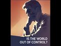

# Is the world out of control? #Shorts (2022-03-05 16:07:48+00:00)

## Description

You Can Support My Work on Patreon:
https://www.patreon.com/Bloggingtheology

My Paypal Link: 
https://www.paypal.com/paypalme/bloggingtheology?locale.x=en_GB

## Full transcript with timestamps

[0:00:00](https://youtu.be/7oqEl21yGFs?t=0) people feel frightened because the world  
[0:00:01](https://youtu.be/7oqEl21yGFs?t=1) seems to be out of control  
[0:00:03](https://youtu.be/7oqEl21yGFs?t=3) what if what if what if and the believer  
[0:00:06](https://youtu.be/7oqEl21yGFs?t=6) is not like that  
[0:00:07](https://youtu.be/7oqEl21yGFs?t=7) the believer has tawakkul  
[0:00:09](https://youtu.be/7oqEl21yGFs?t=9) and knows that whatever afflicts him is  
[0:00:12](https://youtu.be/7oqEl21yGFs?t=12) from allah subhana  
[0:00:13](https://youtu.be/7oqEl21yGFs?t=13) and whatever blessing comes to him is  
[0:00:15](https://youtu.be/7oqEl21yGFs?t=15) from allah subhanahu wa he believes in  
[0:00:20](https://youtu.be/7oqEl21yGFs?t=20) he believes in destiny it's good and  
[0:00:22](https://youtu.be/7oqEl21yGFs?t=22) it's evil what is good and it's bitter  
[0:00:25](https://youtu.be/7oqEl21yGFs?t=25) the bitter and the sweet of it and this  
[0:00:27](https://youtu.be/7oqEl21yGFs?t=27) is the essence of what it is to be  
[0:00:28](https://youtu.be/7oqEl21yGFs?t=28) muslim surrendered accepting how things  
[0:00:30](https://youtu.be/7oqEl21yGFs?t=30) are  
[0:00:31](https://youtu.be/7oqEl21yGFs?t=31) that behind the outward show the scenery  
[0:00:33](https://youtu.be/7oqEl21yGFs?t=33) of cause and effect there is the reality  
[0:00:36](https://youtu.be/7oqEl21yGFs?t=36) of the total unopposed divine control  
[0:00:39](https://youtu.be/7oqEl21yGFs?t=39) and when we have that  
[0:00:40](https://youtu.be/7oqEl21yGFs?t=40) tiwakul comes and again the healing  
[0:00:43](https://youtu.be/7oqEl21yGFs?t=43) ensues and this at least used to be one  
[0:00:45](https://youtu.be/7oqEl21yGFs?t=45) of the great gifts of the muslim  
