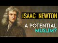

# Isaac Newton : A Potential Muslim? (2021-10-12 19:25:29+00:00)

## Description

I read from Priest of Nature: The Religious Worlds of Isaac Newton by Professor Rob Iliffe of the University of Oxford https://www.amazon.co.uk/Priest-Nature-Religious-Worlds-Newton/dp/0190931590/ref=sr_1_1?dchild=1&keywords=Priest+of+Nature%3A+The+Religious+Worlds+of+Isaac+Newton&qid=1634066316&sr=8-1

## Full transcript with timestamps

[0:00:01](https://youtu.be/TFGKFMGf3ww?t=1) i want to share with you some thoughts  
[0:00:02](https://youtu.be/TFGKFMGf3ww?t=2) about one of the  
[0:00:04](https://youtu.be/TFGKFMGf3ww?t=4) greatest mathematicians physicists and  
[0:00:07](https://youtu.be/TFGKFMGf3ww?t=7) most influential scientists of all time  
[0:00:11](https://youtu.be/TFGKFMGf3ww?t=11) sir isaac newton  
[0:00:13](https://youtu.be/TFGKFMGf3ww?t=13) and one of the things about his life  
[0:00:15](https://youtu.be/TFGKFMGf3ww?t=15) that's much less well known is his  
[0:00:18](https://youtu.be/TFGKFMGf3ww?t=18) passionate christian faith he was a  
[0:00:21](https://youtu.be/TFGKFMGf3ww?t=21) protestant who was obsessed with the  
[0:00:23](https://youtu.be/TFGKFMGf3ww?t=23) bible particularly with end times  
[0:00:26](https://youtu.be/TFGKFMGf3ww?t=26) prophecies the book of revelation but  
[0:00:28](https://youtu.be/TFGKFMGf3ww?t=28) also uh he was a passionate  
[0:00:31](https://youtu.be/TFGKFMGf3ww?t=31) anti-trinitarian  
[0:00:33](https://youtu.be/TFGKFMGf3ww?t=33) and this was not made known during his  
[0:00:35](https://youtu.be/TFGKFMGf3ww?t=35) lifetime and perhaps for a long long  
[0:00:37](https://youtu.be/TFGKFMGf3ww?t=37) time after only recently has just become  
[0:00:40](https://youtu.be/TFGKFMGf3ww?t=40) much more widely known and i want to  
[0:00:42](https://youtu.be/TFGKFMGf3ww?t=42) share with you uh some thoughts from  
[0:00:44](https://youtu.be/TFGKFMGf3ww?t=44) this book recently published priest of  
[0:00:47](https://youtu.be/TFGKFMGf3ww?t=47) nature the religious worlds of isaac  
[0:00:49](https://youtu.be/TFGKFMGf3ww?t=49) newton by the author rob iliff the  
[0:00:53](https://youtu.be/TFGKFMGf3ww?t=53) author is professor of history at the  
[0:00:55](https://youtu.be/TFGKFMGf3ww?t=55) university of oxford he's a general  
[0:00:58](https://youtu.be/TFGKFMGf3ww?t=58) editor of the online newton project and  
[0:01:01](https://youtu.be/TFGKFMGf3ww?t=61) author of newton a very short  
[0:01:03](https://youtu.be/TFGKFMGf3ww?t=63) introduction this is a big thick tone  
[0:01:06](https://youtu.be/TFGKFMGf3ww?t=66) and its overwhelming focus is on isaac  
[0:01:09](https://youtu.be/TFGKFMGf3ww?t=69) newton the believer the christian  
[0:01:11](https://youtu.be/TFGKFMGf3ww?t=71) believer so why is this of interest to  
[0:01:14](https://youtu.be/TFGKFMGf3ww?t=74) us today well it's because of his heresy  
[0:01:18](https://youtu.be/TFGKFMGf3ww?t=78) uh isaac newton uh had to keep his  
[0:01:20](https://youtu.be/TFGKFMGf3ww?t=80) beliefs uh secret during his own  
[0:01:23](https://youtu.be/TFGKFMGf3ww?t=83) lifetime and i'll come to explain why  
[0:01:26](https://youtu.be/TFGKFMGf3ww?t=86) and also exactly what he said  
[0:01:28](https://youtu.be/TFGKFMGf3ww?t=88) much of his thought was written down and  
[0:01:31](https://youtu.be/TFGKFMGf3ww?t=91) the writings have only now  
[0:01:33](https://youtu.be/TFGKFMGf3ww?t=93) now become published and this uh  
[0:01:36](https://youtu.be/TFGKFMGf3ww?t=96) particular work for the first time  
[0:01:39](https://youtu.be/TFGKFMGf3ww?t=99) reveals many  
[0:01:40](https://youtu.be/TFGKFMGf3ww?t=100) writings of isaac newton that were  
[0:01:42](https://youtu.be/TFGKFMGf3ww?t=102) hidden  
[0:01:43](https://youtu.be/TFGKFMGf3ww?t=103) because they were considered to be too  
[0:01:45](https://youtu.be/TFGKFMGf3ww?t=105) dangerous to make public  
[0:01:47](https://youtu.be/TFGKFMGf3ww?t=107) but newton was the dominant intellectual  
[0:01:50](https://youtu.be/TFGKFMGf3ww?t=110) figure of his age  
[0:01:52](https://youtu.be/TFGKFMGf3ww?t=112) he was born in 1642 died in 1726.  
[0:01:56](https://youtu.be/TFGKFMGf3ww?t=116) his famous published works include the  
[0:01:59](https://youtu.be/TFGKFMGf3ww?t=119) principia mathematica  
[0:02:01](https://youtu.be/TFGKFMGf3ww?t=121) and optics so he's a mathematician also  
[0:02:04](https://youtu.be/TFGKFMGf3ww?t=124) concerned with optics  
[0:02:05](https://youtu.be/TFGKFMGf3ww?t=125) and he reached across the scientific  
[0:02:07](https://youtu.be/TFGKFMGf3ww?t=127) spectrum revealing the degree of his  
[0:02:10](https://youtu.be/TFGKFMGf3ww?t=130) interdisciplinary genius  
[0:02:13](https://youtu.be/TFGKFMGf3ww?t=133) and his fame opened doors throughout his  
[0:02:15](https://youtu.be/TFGKFMGf3ww?t=135) career securing him prestigious  
[0:02:18](https://youtu.be/TFGKFMGf3ww?t=138) positions at cambridge university the  
[0:02:21](https://youtu.be/TFGKFMGf3ww?t=141) royal mint and the royal society  
[0:02:24](https://youtu.be/TFGKFMGf3ww?t=144) yet alongside his public success and his  
[0:02:27](https://youtu.be/TFGKFMGf3ww?t=147) public profile sir isaac newton harbored  
[0:02:30](https://youtu.be/TFGKFMGf3ww?t=150) private religious convictions that set  
[0:02:33](https://youtu.be/TFGKFMGf3ww?t=153) him at odds with the established law of  
[0:02:36](https://youtu.be/TFGKFMGf3ww?t=156) england and anglican doctrine that's the  
[0:02:39](https://youtu.be/TFGKFMGf3ww?t=159) doctrine of the church of england and if  
[0:02:41](https://youtu.be/TFGKFMGf3ww?t=161) revealed threaten not just his  
[0:02:43](https://youtu.be/TFGKFMGf3ww?t=163) livelihood but his life itself i'll come  
[0:02:46](https://youtu.be/TFGKFMGf3ww?t=166) to this in a second  
[0:02:48](https://youtu.be/TFGKFMGf3ww?t=168) now religion and faith dominated much of  
[0:02:51](https://youtu.be/TFGKFMGf3ww?t=171) newton's thought and his manuscripts in  
[0:02:54](https://youtu.be/TFGKFMGf3ww?t=174) various states of completion and  
[0:02:56](https://youtu.be/TFGKFMGf3ww?t=176) numbering in the thousands of pages are  
[0:02:59](https://youtu.be/TFGKFMGf3ww?t=179) filled with biblical speculation and  
[0:03:02](https://youtu.be/TFGKFMGf3ww?t=182) prophecies and timelines  
[0:03:05](https://youtu.be/TFGKFMGf3ww?t=185) along with many passengers that  
[0:03:06](https://youtu.be/TFGKFMGf3ww?t=186) excoriated the early  
[0:03:09](https://youtu.be/TFGKFMGf3ww?t=189) church fathers these are the leaders of  
[0:03:10](https://youtu.be/TFGKFMGf3ww?t=190) the early church like athanasius who he  
[0:03:12](https://youtu.be/TFGKFMGf3ww?t=192) detested he thought he was a fraud we'll  
[0:03:15](https://youtu.be/TFGKFMGf3ww?t=195) come to that as well  
[0:03:17](https://youtu.be/TFGKFMGf3ww?t=197) these letters make clear that his  
[0:03:19](https://youtu.be/TFGKFMGf3ww?t=199) theological positions rendered him a  
[0:03:22](https://youtu.be/TFGKFMGf3ww?t=202) heretic by the stands of his day  
[0:03:25](https://youtu.be/TFGKFMGf3ww?t=205) newton believed that the central concept  
[0:03:27](https://youtu.be/TFGKFMGf3ww?t=207) of the trinity was a diabolical fraud  
[0:03:32](https://youtu.be/TFGKFMGf3ww?t=212) and load the idolatry cruelty and  
[0:03:35](https://youtu.be/TFGKFMGf3ww?t=215) persecution that had come to  
[0:03:37](https://youtu.be/TFGKFMGf3ww?t=217) characterize so-called orthodox  
[0:03:39](https://youtu.be/TFGKFMGf3ww?t=219) christianity that the catholic church  
[0:03:41](https://youtu.be/TFGKFMGf3ww?t=221) and the church of england and instead  
[0:03:44](https://youtu.be/TFGKFMGf3ww?t=224) what he wanted was a return to simple  
[0:03:47](https://youtu.be/TFGKFMGf3ww?t=227) christianity  
[0:03:49](https://youtu.be/TFGKFMGf3ww?t=229) that would focus on just a few  
[0:03:51](https://youtu.be/TFGKFMGf3ww?t=231) central beliefs  
[0:03:53](https://youtu.be/TFGKFMGf3ww?t=233) now he was totally original both in his  
[0:03:56](https://youtu.be/TFGKFMGf3ww?t=236) science and in his religious thinking he  
[0:03:59](https://youtu.be/TFGKFMGf3ww?t=239) was a bit obsessive this comes out in  
[0:04:02](https://youtu.be/TFGKFMGf3ww?t=242) his writings  
[0:04:03](https://youtu.be/TFGKFMGf3ww?t=243) but um what he did more than uh any one  
[0:04:06](https://youtu.be/TFGKFMGf3ww?t=246) of his time he went back to the uh the  
[0:04:09](https://youtu.be/TFGKFMGf3ww?t=249) new testament in its original greek uh  
[0:04:12](https://youtu.be/TFGKFMGf3ww?t=252) which he knew extremely well uh he read  
[0:04:15](https://youtu.be/TFGKFMGf3ww?t=255) many many of the works of the early  
[0:04:16](https://youtu.be/TFGKFMGf3ww?t=256) theologians and the early fathers  
[0:04:19](https://youtu.be/TFGKFMGf3ww?t=259) and um he engaged with them uh in a very  
[0:04:22](https://youtu.be/TFGKFMGf3ww?t=262) intellectually rigorous way so i wanted  
[0:04:25](https://youtu.be/TFGKFMGf3ww?t=265) to share with you a few passages from  
[0:04:28](https://youtu.be/TFGKFMGf3ww?t=268) this book which uh hopefully will make  
[0:04:30](https://youtu.be/TFGKFMGf3ww?t=270) that clear  
[0:04:32](https://youtu.be/TFGKFMGf3ww?t=272) so in the introduction on page nine our  
[0:04:35](https://youtu.be/TFGKFMGf3ww?t=275) author writes  
[0:04:37](https://youtu.be/TFGKFMGf3ww?t=277) although newton attacked what he took to  
[0:04:39](https://youtu.be/TFGKFMGf3ww?t=279) be the excessive const concentration on  
[0:04:42](https://youtu.be/TFGKFMGf3ww?t=282) doctrinal forms in church matters he was  
[0:04:46](https://youtu.be/TFGKFMGf3ww?t=286) very anti-catholic he treated the  
[0:04:48](https://youtu.be/TFGKFMGf3ww?t=288) doctrine of the trinity differently  
[0:04:51](https://youtu.be/TFGKFMGf3ww?t=291) over half a century he expended vast  
[0:04:55](https://youtu.be/TFGKFMGf3ww?t=295) energies attempting to understand the  
[0:04:57](https://youtu.be/TFGKFMGf3ww?t=297) nature and origins what he believed was  
[0:05:01](https://youtu.be/TFGKFMGf3ww?t=301) a diabolical notion in other words it  
[0:05:04](https://youtu.be/TFGKFMGf3ww?t=304) was evil the doctrine of the trinity  
[0:05:06](https://youtu.be/TFGKFMGf3ww?t=306) the doctrine lay at the heart of  
[0:05:08](https://youtu.be/TFGKFMGf3ww?t=308) christianity at its time  
[0:05:10](https://youtu.be/TFGKFMGf3ww?t=310) and it was the first of the 39 articles  
[0:05:13](https://youtu.be/TFGKFMGf3ww?t=313) of the church of england there's a list  
[0:05:14](https://youtu.be/TFGKFMGf3ww?t=314) of beliefs that everyone in the church  
[0:05:16](https://youtu.be/TFGKFMGf3ww?t=316) of england is supposed to follow the  
[0:05:18](https://youtu.be/TFGKFMGf3ww?t=318) very first one is about the trinity  
[0:05:21](https://youtu.be/TFGKFMGf3ww?t=321) this stated that there was one living  
[0:05:24](https://youtu.be/TFGKFMGf3ww?t=324) true god eternal incorporeal that is  
[0:05:27](https://youtu.be/TFGKFMGf3ww?t=327) without a body omnipotent or powerful  
[0:05:31](https://youtu.be/TFGKFMGf3ww?t=331) infinitely wise and good and quote the  
[0:05:34](https://youtu.be/TFGKFMGf3ww?t=334) creator and preserve of all things  
[0:05:37](https://youtu.be/TFGKFMGf3ww?t=337) visible and invisible unquote  
[0:05:40](https://youtu.be/TFGKFMGf3ww?t=340) this was fine for anti-trinitarians such  
[0:05:42](https://youtu.be/TFGKFMGf3ww?t=342) as newton  
[0:05:43](https://youtu.be/TFGKFMGf3ww?t=343) but  
[0:05:44](https://youtu.be/TFGKFMGf3ww?t=344) less acceptably the text went on to  
[0:05:47](https://youtu.be/TFGKFMGf3ww?t=347) assert that in unity of this godhead  
[0:05:51](https://youtu.be/TFGKFMGf3ww?t=351) there were three persons who together  
[0:05:54](https://youtu.be/TFGKFMGf3ww?t=354) made one substance power and eternity  
[0:05:59](https://youtu.be/TFGKFMGf3ww?t=359) in the second article this is of the 39  
[0:06:01](https://youtu.be/TFGKFMGf3ww?t=361) articles the son  
[0:06:03](https://youtu.be/TFGKFMGf3ww?t=363) was identified as the word of the father  
[0:06:06](https://youtu.be/TFGKFMGf3ww?t=366) he was truly begotten or genetous in the  
[0:06:10](https://youtu.be/TFGKFMGf3ww?t=370) latin  
[0:06:11](https://youtu.be/TFGKFMGf3ww?t=371) of the father from everlasting and of  
[0:06:13](https://youtu.be/TFGKFMGf3ww?t=373) the same substance  
[0:06:15](https://youtu.be/TFGKFMGf3ww?t=375) constantialis in others is homousion of  
[0:06:18](https://youtu.be/TFGKFMGf3ww?t=378) one being with the father  
[0:06:20](https://youtu.be/TFGKFMGf3ww?t=380) though he inherited his human nature  
[0:06:23](https://youtu.be/TFGKFMGf3ww?t=383) from the womb of the virgin mary  
[0:06:26](https://youtu.be/TFGKFMGf3ww?t=386) these two natures were indivisibly  
[0:06:29](https://youtu.be/TFGKFMGf3ww?t=389) united in one person from which there  
[0:06:32](https://youtu.be/TFGKFMGf3ww?t=392) was one christ truly god and truly man  
[0:06:36](https://youtu.be/TFGKFMGf3ww?t=396) this being really suffered on the cross  
[0:06:39](https://youtu.be/TFGKFMGf3ww?t=399) died and was buried a sacrifice not  
[0:06:42](https://youtu.be/TFGKFMGf3ww?t=402) merely for original sin but for all the  
[0:06:45](https://youtu.be/TFGKFMGf3ww?t=405) sins of mankind i note here that in this  
[0:06:48](https://youtu.be/TFGKFMGf3ww?t=408) definition god himself died on the cross  
[0:06:51](https://youtu.be/TFGKFMGf3ww?t=411) even though the bible says that god  
[0:06:53](https://youtu.be/TFGKFMGf3ww?t=413) doesn't die that he's immortal anyway in  
[0:06:56](https://youtu.be/TFGKFMGf3ww?t=416) the fifth article of the 39 articles the  
[0:06:58](https://youtu.be/TFGKFMGf3ww?t=418) holy ghost this is an old-fashioned  
[0:07:00](https://youtu.be/TFGKFMGf3ww?t=420) phrase by the way meaning the holy  
[0:07:02](https://youtu.be/TFGKFMGf3ww?t=422) spirit the third person of the trinity  
[0:07:04](https://youtu.be/TFGKFMGf3ww?t=424) the holy ghost was asserted to be of the  
[0:07:07](https://youtu.be/TFGKFMGf3ww?t=427) same substance majesty and glory as the  
[0:07:10](https://youtu.be/TFGKFMGf3ww?t=430) first two members of the godhead  
[0:07:12](https://youtu.be/TFGKFMGf3ww?t=432) although newton devoted little time to  
[0:07:15](https://youtu.be/TFGKFMGf3ww?t=435) the third person of the holy trinity  
[0:07:18](https://youtu.be/TFGKFMGf3ww?t=438) his own position can thus be  
[0:07:20](https://youtu.be/TFGKFMGf3ww?t=440) characterized by his flat denial of the  
[0:07:24](https://youtu.be/TFGKFMGf3ww?t=444) key features of orthodox christianity  
[0:07:28](https://youtu.be/TFGKFMGf3ww?t=448) that asserted the identity of power and  
[0:07:32](https://youtu.be/TFGKFMGf3ww?t=452) substance between the three persons of  
[0:07:34](https://youtu.be/TFGKFMGf3ww?t=454) the trinity  
[0:07:36](https://youtu.be/TFGKFMGf3ww?t=456) newton always invade against any notion  
[0:07:39](https://youtu.be/TFGKFMGf3ww?t=459) that the members of the godhead were  
[0:07:41](https://youtu.be/TFGKFMGf3ww?t=461) co-equal and in particular he condemned  
[0:07:45](https://youtu.be/TFGKFMGf3ww?t=465) as abominations the notions that jesus  
[0:07:48](https://youtu.be/TFGKFMGf3ww?t=468) christ was uncreated  
[0:07:51](https://youtu.be/TFGKFMGf3ww?t=471) and was formed of the same substance as  
[0:07:54](https://youtu.be/TFGKFMGf3ww?t=474) god the father so his implacable enemy  
[0:07:58](https://youtu.be/TFGKFMGf3ww?t=478) but notices all in secret of course he  
[0:08:00](https://youtu.be/TFGKFMGf3ww?t=480) couldn't make this public and we'll come  
[0:08:02](https://youtu.be/TFGKFMGf3ww?t=482) to that in a minute  
[0:08:04](https://youtu.be/TFGKFMGf3ww?t=484) for orthodox anglicans  
[0:08:06](https://youtu.be/TFGKFMGf3ww?t=486) the doctrine of the trinity was the  
[0:08:08](https://youtu.be/TFGKFMGf3ww?t=488) foundation of the human relationship  
[0:08:11](https://youtu.be/TFGKFMGf3ww?t=491) with the divine  
[0:08:12](https://youtu.be/TFGKFMGf3ww?t=492) and of the connection between the  
[0:08:14](https://youtu.be/TFGKFMGf3ww?t=494) supplicant and his or her church  
[0:08:18](https://youtu.be/TFGKFMGf3ww?t=498) the trinity linked the visible church to  
[0:08:20](https://youtu.be/TFGKFMGf3ww?t=500) christ's body and to his continuing  
[0:08:23](https://youtu.be/TFGKFMGf3ww?t=503) presence which justified and made sacred  
[0:08:27](https://youtu.be/TFGKFMGf3ww?t=507) the central religious and secular  
[0:08:30](https://youtu.be/TFGKFMGf3ww?t=510) institutions in newton's society  
[0:08:34](https://youtu.be/TFGKFMGf3ww?t=514) it was on these grounds that denial of  
[0:08:37](https://youtu.be/TFGKFMGf3ww?t=517) the trinity was a highness offense  
[0:08:40](https://youtu.be/TFGKFMGf3ww?t=520) that merited the ultimate punishment  
[0:08:44](https://youtu.be/TFGKFMGf3ww?t=524) in 1612 a chap called bartholomew  
[0:08:47](https://youtu.be/TFGKFMGf3ww?t=527) leggett and another called edward white  
[0:08:50](https://youtu.be/TFGKFMGf3ww?t=530) man  
[0:08:50](https://youtu.be/TFGKFMGf3ww?t=530) were the last martyrs burned alive for  
[0:08:54](https://youtu.be/TFGKFMGf3ww?t=534) this crime in england  
[0:08:56](https://youtu.be/TFGKFMGf3ww?t=536) but the death penalty was reasserted in  
[0:08:59](https://youtu.be/TFGKFMGf3ww?t=539) legislation of 14 1648  
[0:09:04](https://youtu.be/TFGKFMGf3ww?t=544) so in other words that was during his  
[0:09:06](https://youtu.be/TFGKFMGf3ww?t=546) own lifetime newton's own lifetime  
[0:09:08](https://youtu.be/TFGKFMGf3ww?t=548) following the publication of a number of  
[0:09:10](https://youtu.be/TFGKFMGf3ww?t=550) anti-trinitarian texts the ordinance for  
[0:09:13](https://youtu.be/TFGKFMGf3ww?t=553) the punishment of several blasphemies  
[0:09:16](https://youtu.be/TFGKFMGf3ww?t=556) and heresies  
[0:09:17](https://youtu.be/TFGKFMGf3ww?t=557) prescribed capital punishment for those  
[0:09:20](https://youtu.be/TFGKFMGf3ww?t=560) who continue to maintain  
[0:09:22](https://youtu.be/TFGKFMGf3ww?t=562) the error  
[0:09:24](https://youtu.be/TFGKFMGf3ww?t=564) the blasphemy act as it was called was  
[0:09:27](https://youtu.be/TFGKFMGf3ww?t=567) superseded by another act passed just  
[0:09:29](https://youtu.be/TFGKFMGf3ww?t=569) over two years later which did not carry  
[0:09:32](https://youtu.be/TFGKFMGf3ww?t=572) the threat of capital punishment however  
[0:09:36](https://youtu.be/TFGKFMGf3ww?t=576) after the restoration of charles ii  
[0:09:39](https://youtu.be/TFGKFMGf3ww?t=579) in 1660 this was after cromwell of  
[0:09:42](https://youtu.be/TFGKFMGf3ww?t=582) course was uh he died of course his son  
[0:09:44](https://youtu.be/TFGKFMGf3ww?t=584) had a very brief reign completely  
[0:09:46](https://youtu.be/TFGKFMGf3ww?t=586) incompetent and basically people  
[0:09:48](https://youtu.be/TFGKFMGf3ww?t=588) welcomed back the the son of charles the  
[0:09:50](https://youtu.be/TFGKFMGf3ww?t=590) first who have been executed uh famously  
[0:09:53](https://youtu.be/TFGKFMGf3ww?t=593) in london by cromwell and his uh cronies  
[0:09:56](https://youtu.be/TFGKFMGf3ww?t=596) so uh charles ii comes back that's  
[0:09:58](https://youtu.be/TFGKFMGf3ww?t=598) called the restoration and this was in  
[0:10:00](https://youtu.be/TFGKFMGf3ww?t=600) 1660 of course during um  
[0:10:04](https://youtu.be/TFGKFMGf3ww?t=604) newton's lifetime  
[0:10:06](https://youtu.be/TFGKFMGf3ww?t=606) after the restoration the public denial  
[0:10:08](https://youtu.be/TFGKFMGf3ww?t=608) of the trinity would have meant  
[0:10:10](https://youtu.be/TFGKFMGf3ww?t=610) exclusion from office  
[0:10:12](https://youtu.be/TFGKFMGf3ww?t=612) social disgrace and the possibility of  
[0:10:15](https://youtu.be/TFGKFMGf3ww?t=615) prosecution so these are the stakes you  
[0:10:17](https://youtu.be/TFGKFMGf3ww?t=617) know literally that newton had to deal  
[0:10:19](https://youtu.be/TFGKFMGf3ww?t=619) with given the nature of newton's  
[0:10:22](https://youtu.be/TFGKFMGf3ww?t=622) religious views it's entirely  
[0:10:24](https://youtu.be/TFGKFMGf3ww?t=624) unsurprising that he should have wanted  
[0:10:26](https://youtu.be/TFGKFMGf3ww?t=626) to keep them  
[0:10:27](https://youtu.be/TFGKFMGf3ww?t=627) private says our author  
[0:10:31](https://youtu.be/TFGKFMGf3ww?t=631) and continuing  
[0:10:34](https://youtu.be/TFGKFMGf3ww?t=634) newton's extensive writings on trinity  
[0:10:37](https://youtu.be/TFGKFMGf3ww?t=637) on the trinitarian corruption of  
[0:10:39](https://youtu.be/TFGKFMGf3ww?t=639) christianity are among the most daring  
[0:10:42](https://youtu.be/TFGKFMGf3ww?t=642) works of any writer in the early modern  
[0:10:45](https://youtu.be/TFGKFMGf3ww?t=645) period now this is interesting because  
[0:10:47](https://youtu.be/TFGKFMGf3ww?t=647) newton as i say who knew new testament  
[0:10:49](https://youtu.be/TFGKFMGf3ww?t=649) greek very well  
[0:10:51](https://youtu.be/TFGKFMGf3ww?t=651) he was able to look at the manuscripts  
[0:10:54](https://youtu.be/TFGKFMGf3ww?t=654) he knew about the johannine comma by the  
[0:10:56](https://youtu.be/TFGKFMGf3ww?t=656) way this trinitarian verse that was  
[0:10:58](https://youtu.be/TFGKFMGf3ww?t=658) inserted later he knew that was a fake  
[0:11:01](https://youtu.be/TFGKFMGf3ww?t=661) so he he was a kind of a very early  
[0:11:03](https://youtu.be/TFGKFMGf3ww?t=663) biblical scholar and textual critic in  
[0:11:06](https://youtu.be/TFGKFMGf3ww?t=666) some ways  
[0:11:07](https://youtu.be/TFGKFMGf3ww?t=667) back to our author  
[0:11:09](https://youtu.be/TFGKFMGf3ww?t=669) and uh not only were his extensive  
[0:11:12](https://youtu.be/TFGKFMGf3ww?t=672) writings on trinitarianism daring  
[0:11:15](https://youtu.be/TFGKFMGf3ww?t=675) as anyone in the age they would merit  
[0:11:18](https://youtu.be/TFGKFMGf3ww?t=678) careful study even if they had not been  
[0:11:21](https://youtu.be/TFGKFMGf3ww?t=681) composed by the author of the principia  
[0:11:24](https://youtu.be/TFGKFMGf3ww?t=684) so even if he wasn't known as a  
[0:11:26](https://youtu.be/TFGKFMGf3ww?t=686) scientist his writings on religion were  
[0:11:28](https://youtu.be/TFGKFMGf3ww?t=688) still highly regarded or are highly  
[0:11:31](https://youtu.be/TFGKFMGf3ww?t=691) regarded for their insight and their  
[0:11:34](https://youtu.be/TFGKFMGf3ww?t=694) expertise  
[0:11:35](https://youtu.be/TFGKFMGf3ww?t=695) as a window into the rich private world  
[0:11:38](https://youtu.be/TFGKFMGf3ww?t=698) of a 17th century english protestant  
[0:11:41](https://youtu.be/TFGKFMGf3ww?t=701) which he was  
[0:11:42](https://youtu.be/TFGKFMGf3ww?t=702) they stand in comparison with the  
[0:11:45](https://youtu.be/TFGKFMGf3ww?t=705) manuscript remains of other writers such  
[0:11:47](https://youtu.be/TFGKFMGf3ww?t=707) as the great non-conformist richard  
[0:11:50](https://youtu.be/TFGKFMGf3ww?t=710) baxter non-conformist means someone who  
[0:11:52](https://youtu.be/TFGKFMGf3ww?t=712) didn't adhere to the church of england  
[0:11:54](https://youtu.be/TFGKFMGf3ww?t=714) who would say like a baptist someone  
[0:11:56](https://youtu.be/TFGKFMGf3ww?t=716) like that  
[0:11:57](https://youtu.be/TFGKFMGf3ww?t=717) and the puritan craftsman nehemiah  
[0:12:00](https://youtu.be/TFGKFMGf3ww?t=720) wallington  
[0:12:01](https://youtu.be/TFGKFMGf3ww?t=721) however what marks out newton's writings  
[0:12:05](https://youtu.be/TFGKFMGf3ww?t=725) are the independence of thought they  
[0:12:07](https://youtu.be/TFGKFMGf3ww?t=727) display this is typical by the way of  
[0:12:09](https://youtu.be/TFGKFMGf3ww?t=729) newton he was such a genius that he  
[0:12:11](https://youtu.be/TFGKFMGf3ww?t=731) basically thought outside of the box he  
[0:12:14](https://youtu.be/TFGKFMGf3ww?t=734) tested everything uh whether it be  
[0:12:16](https://youtu.be/TFGKFMGf3ww?t=736) trinitarianism or whether it be the laws  
[0:12:19](https://youtu.be/TFGKFMGf3ww?t=739) of gravity or optics he did his own new  
[0:12:22](https://youtu.be/TFGKFMGf3ww?t=742) research total genius  
[0:12:26](https://youtu.be/TFGKFMGf3ww?t=746) however what marks out newton's writings  
[0:12:29](https://youtu.be/TFGKFMGf3ww?t=749) are the independence of thought they  
[0:12:30](https://youtu.be/TFGKFMGf3ww?t=750) display if they had been unveiled to the  
[0:12:33](https://youtu.be/TFGKFMGf3ww?t=753) republic of letters that's the  
[0:12:35](https://youtu.be/TFGKFMGf3ww?t=755) intelligenzu if you like when he wrote  
[0:12:37](https://youtu.be/TFGKFMGf3ww?t=757) them and his authorship revealed  
[0:12:40](https://youtu.be/TFGKFMGf3ww?t=760) he would now be part of an elite  
[0:12:43](https://youtu.be/TFGKFMGf3ww?t=763) pantheon of original thinkers who are  
[0:12:45](https://youtu.be/TFGKFMGf3ww?t=765) lauded as part of the radical  
[0:12:47](https://youtu.be/TFGKFMGf3ww?t=767) reformation or radical enlightenment as  
[0:12:50](https://youtu.be/TFGKFMGf3ww?t=770) is also called however  
[0:12:53](https://youtu.be/TFGKFMGf3ww?t=773) like william whitson his successor in  
[0:12:56](https://youtu.be/TFGKFMGf3ww?t=776) the lucasian chair  
[0:12:58](https://youtu.be/TFGKFMGf3ww?t=778) he would have been immediately expelled  
[0:13:01](https://youtu.be/TFGKFMGf3ww?t=781) from his college so the location chair  
[0:13:04](https://youtu.be/TFGKFMGf3ww?t=784) is this incredibly prestigious  
[0:13:06](https://youtu.be/TFGKFMGf3ww?t=786) um professor  
[0:13:08](https://youtu.be/TFGKFMGf3ww?t=788) professorial chair at the university of  
[0:13:10](https://youtu.be/TFGKFMGf3ww?t=790) cambridge still exists and famously um  
[0:13:14](https://youtu.be/TFGKFMGf3ww?t=794) uh many famous scientists including  
[0:13:16](https://youtu.be/TFGKFMGf3ww?t=796) richard uh stephen hawking i should say  
[0:13:18](https://youtu.be/TFGKFMGf3ww?t=798) um was one of the last occupants just a  
[0:13:20](https://youtu.be/TFGKFMGf3ww?t=800) few years ago of that chair at cambridge  
[0:13:25](https://youtu.be/TFGKFMGf3ww?t=805) but of course if he had become gone  
[0:13:26](https://youtu.be/TFGKFMGf3ww?t=806) public about this he would have been  
[0:13:28](https://youtu.be/TFGKFMGf3ww?t=808) immediately expelled from his college  
[0:13:31](https://youtu.be/TFGKFMGf3ww?t=811) our author rights  
[0:13:33](https://youtu.be/TFGKFMGf3ww?t=813) he would never have had the chance to  
[0:13:34](https://youtu.be/TFGKFMGf3ww?t=814) write the principia or optics and much  
[0:13:38](https://youtu.be/TFGKFMGf3ww?t=818) if not all of his pioneering work on the  
[0:13:41](https://youtu.be/TFGKFMGf3ww?t=821) calculus might have been lost  
[0:13:44](https://youtu.be/TFGKFMGf3ww?t=824) he would never have been elected as a  
[0:13:46](https://youtu.be/TFGKFMGf3ww?t=826) member of parliament for the university  
[0:13:48](https://youtu.be/TFGKFMGf3ww?t=828) of cambridge which he was  
[0:13:50](https://youtu.be/TFGKFMGf3ww?t=830) or elevated to the presidency of the  
[0:13:52](https://youtu.be/TFGKFMGf3ww?t=832) royal society which he was and he would  
[0:13:54](https://youtu.be/TFGKFMGf3ww?t=834) not have been appointed to the positions  
[0:13:57](https://youtu.be/TFGKFMGf3ww?t=837) of warden or master of the royal mint  
[0:14:00](https://youtu.be/TFGKFMGf3ww?t=840) which he was  
[0:14:01](https://youtu.be/TFGKFMGf3ww?t=841) his coffin would not have been carried  
[0:14:03](https://youtu.be/TFGKFMGf3ww?t=843) to westminster abbey by eminent lords  
[0:14:05](https://youtu.be/TFGKFMGf3ww?t=845) and grandees and there would now be no  
[0:14:08](https://youtu.be/TFGKFMGf3ww?t=848) tomb proclaiming his superhuman  
[0:14:12](https://youtu.be/TFGKFMGf3ww?t=852) qualities so if he gone public at the  
[0:14:14](https://youtu.be/TFGKFMGf3ww?t=854) very least he would have been completely  
[0:14:16](https://youtu.be/TFGKFMGf3ww?t=856) disgraced and maybe his academic career  
[0:14:19](https://youtu.be/TFGKFMGf3ww?t=859) would have been finished  
[0:14:22](https://youtu.be/TFGKFMGf3ww?t=862) and just in conclusion i'm just going to  
[0:14:24](https://youtu.be/TFGKFMGf3ww?t=864) share with you an excerpt from page 138  
[0:14:28](https://youtu.be/TFGKFMGf3ww?t=868) of our book uh which is entitled the  
[0:14:31](https://youtu.be/TFGKFMGf3ww?t=871) problem of idolatry so remember newton  
[0:14:34](https://youtu.be/TFGKFMGf3ww?t=874) was a protestant christian he hated  
[0:14:36](https://youtu.be/TFGKFMGf3ww?t=876) catholicism its superstitions its  
[0:14:38](https://youtu.be/TFGKFMGf3ww?t=878) idolatry uh its worship of jesus and  
[0:14:41](https://youtu.be/TFGKFMGf3ww?t=881) mary and so on  
[0:14:43](https://youtu.be/TFGKFMGf3ww?t=883) so he uh according to our author newton  
[0:14:46](https://youtu.be/TFGKFMGf3ww?t=886) believed that the idea that the father  
[0:14:49](https://youtu.be/TFGKFMGf3ww?t=889) and son and the holy ghost were co-equal  
[0:14:52](https://youtu.be/TFGKFMGf3ww?t=892) and consubstantial parts of the godhead  
[0:14:56](https://youtu.be/TFGKFMGf3ww?t=896) had forced adherence to engage in an  
[0:14:59](https://youtu.be/TFGKFMGf3ww?t=899) egregious form of idolatry egregious  
[0:15:02](https://youtu.be/TFGKFMGf3ww?t=902) means really wicked and evil  
[0:15:04](https://youtu.be/TFGKFMGf3ww?t=904) so this doctrine of the trinity forced  
[0:15:07](https://youtu.be/TFGKFMGf3ww?t=907) christians for those who were compelled  
[0:15:09](https://youtu.be/TFGKFMGf3ww?t=909) to believe it into the worst form of  
[0:15:11](https://youtu.be/TFGKFMGf3ww?t=911) idolatry imaginable that's my paraphrase  
[0:15:15](https://youtu.be/TFGKFMGf3ww?t=915) the issue of idolatry underlay all his  
[0:15:19](https://youtu.be/TFGKFMGf3ww?t=919) religious study so he's both  
[0:15:21](https://youtu.be/TFGKFMGf3ww?t=921) anti-catholic as a militant protestant  
[0:15:23](https://youtu.be/TFGKFMGf3ww?t=923) he rejected catholicism and he rejected  
[0:15:26](https://youtu.be/TFGKFMGf3ww?t=926) idolatry as well  
[0:15:29](https://youtu.be/TFGKFMGf3ww?t=929) and he came to understand that the true  
[0:15:31](https://youtu.be/TFGKFMGf3ww?t=931) religion had been repeatedly corrupted  
[0:15:34](https://youtu.be/TFGKFMGf3ww?t=934) by it by idolatry newton's society in  
[0:15:37](https://youtu.be/TFGKFMGf3ww?t=937) his time was saturated with accounts of  
[0:15:40](https://youtu.be/TFGKFMGf3ww?t=940) idolatry whether it was of the newly  
[0:15:42](https://youtu.be/TFGKFMGf3ww?t=942) discovered heathens who indulged in  
[0:15:44](https://youtu.be/TFGKFMGf3ww?t=944) polytheism not sure who they are but  
[0:15:46](https://youtu.be/TFGKFMGf3ww?t=946) anyway or of the descent of the  
[0:15:49](https://youtu.be/TFGKFMGf3ww?t=949) israelites into false worship which we  
[0:15:51](https://youtu.be/TFGKFMGf3ww?t=951) read about in the bible of course or  
[0:15:53](https://youtu.be/TFGKFMGf3ww?t=953) more commonly of popish superstitions  
[0:15:57](https://youtu.be/TFGKFMGf3ww?t=957) that some believed still contaminated  
[0:16:00](https://youtu.be/TFGKFMGf3ww?t=960) anglican rituals purplish superstitions  
[0:16:03](https://youtu.be/TFGKFMGf3ww?t=963) who means the alleged roman catholic  
[0:16:05](https://youtu.be/TFGKFMGf3ww?t=965) superstitions  
[0:16:07](https://youtu.be/TFGKFMGf3ww?t=967) newton frequently noted that there was a  
[0:16:09](https://youtu.be/TFGKFMGf3ww?t=969) natural human tendency to crave  
[0:16:12](https://youtu.be/TFGKFMGf3ww?t=972) superstition mystery and other sorts of  
[0:16:15](https://youtu.be/TFGKFMGf3ww?t=975) idolatrous beliefs and practices  
[0:16:18](https://youtu.be/TFGKFMGf3ww?t=978) this failing was used by crafty priests  
[0:16:22](https://youtu.be/TFGKFMGf3ww?t=982) and kings to turn people away from the  
[0:16:24](https://youtu.be/TFGKFMGf3ww?t=984) true monotheistic faith and to praise  
[0:16:28](https://youtu.be/TFGKFMGf3ww?t=988) and then worship firstly dead men and  
[0:16:31](https://youtu.be/TFGKFMGf3ww?t=991) after that animals and the stars  
[0:16:34](https://youtu.be/TFGKFMGf3ww?t=994) this pattern recurred throughout history  
[0:16:37](https://youtu.be/TFGKFMGf3ww?t=997) and as a result he argued the greatest  
[0:16:40](https://youtu.be/TFGKFMGf3ww?t=1000) men in the history of the world were  
[0:16:42](https://youtu.be/TFGKFMGf3ww?t=1002) those such as abraham moses and jesus  
[0:16:46](https://youtu.be/TFGKFMGf3ww?t=1006) christ who were periodically chosen by  
[0:16:49](https://youtu.be/TFGKFMGf3ww?t=1009) god to restore the true religion after  
[0:16:52](https://youtu.be/TFGKFMGf3ww?t=1012) it had been perverted by idolaters this  
[0:16:55](https://youtu.be/TFGKFMGf3ww?t=1015) sounds very islamic actually to be  
[0:16:57](https://youtu.be/TFGKFMGf3ww?t=1017) honest  
[0:16:59](https://youtu.be/TFGKFMGf3ww?t=1019) he considered the most hideous example  
[0:17:02](https://youtu.be/TFGKFMGf3ww?t=1022) of idolatry to be the doctrines and  
[0:17:04](https://youtu.be/TFGKFMGf3ww?t=1024) practices of roman catholicism  
[0:17:08](https://youtu.be/TFGKFMGf3ww?t=1028) so i'll just leave it there now the  
[0:17:11](https://youtu.be/TFGKFMGf3ww?t=1031) courses begs the question  
[0:17:13](https://youtu.be/TFGKFMGf3ww?t=1033) what did isaac newton  
[0:17:16](https://youtu.be/TFGKFMGf3ww?t=1036) know about islam did he know any muslims  
[0:17:18](https://youtu.be/TFGKFMGf3ww?t=1038) and  
[0:17:19](https://youtu.be/TFGKFMGf3ww?t=1039) if looking at the index to this book um  
[0:17:22](https://youtu.be/TFGKFMGf3ww?t=1042) he did know about islam well let me  
[0:17:24](https://youtu.be/TFGKFMGf3ww?t=1044) rephrase that he knew about the ottoman  
[0:17:27](https://youtu.be/TFGKFMGf3ww?t=1047) empire  
[0:17:28](https://youtu.be/TFGKFMGf3ww?t=1048) in his day and he seemed to share the  
[0:17:30](https://youtu.be/TFGKFMGf3ww?t=1050) standard prejudices and ill-informed  
[0:17:32](https://youtu.be/TFGKFMGf3ww?t=1052) notions of  
[0:17:34](https://youtu.be/TFGKFMGf3ww?t=1054) many english people at that time so he  
[0:17:36](https://youtu.be/TFGKFMGf3ww?t=1056) hadn't broken free of that and he didn't  
[0:17:38](https://youtu.be/TFGKFMGf3ww?t=1058) seem to realize  
[0:17:39](https://youtu.be/TFGKFMGf3ww?t=1059) that the message that muhammad bought  
[0:17:41](https://youtu.be/TFGKFMGf3ww?t=1061) was just the same as the same message  
[0:17:44](https://youtu.be/TFGKFMGf3ww?t=1064) that abraham and moses and jesus and so  
[0:17:46](https://youtu.be/TFGKFMGf3ww?t=1066) on so it would have been very natural i  
[0:17:47](https://youtu.be/TFGKFMGf3ww?t=1067) think had he been made aware of the real  
[0:17:50](https://youtu.be/TFGKFMGf3ww?t=1070) islamic teaching um very natural i would  
[0:17:53](https://youtu.be/TFGKFMGf3ww?t=1073) have thought for him to have embraced  
[0:17:56](https://youtu.be/TFGKFMGf3ww?t=1076) islam if he was so uh disposed  
[0:18:02](https://youtu.be/TFGKFMGf3ww?t=1082) so um so there's not much really uh in  
[0:18:04](https://youtu.be/TFGKFMGf3ww?t=1084) terms of his knowledge of islam or or  
[0:18:06](https://youtu.be/TFGKFMGf3ww?t=1086) muslims to to really uh suggest that he  
[0:18:09](https://youtu.be/TFGKFMGf3ww?t=1089) would have raised islam he just had the  
[0:18:11](https://youtu.be/TFGKFMGf3ww?t=1091) same the usual prejudices of his age but  
[0:18:15](https://youtu.be/TFGKFMGf3ww?t=1095) he is such an important figure that he  
[0:18:17](https://youtu.be/TFGKFMGf3ww?t=1097) single-handedly really invented modern  
[0:18:20](https://youtu.be/TFGKFMGf3ww?t=1100) science until einstein einstein came  
[0:18:23](https://youtu.be/TFGKFMGf3ww?t=1103) along and his theory of general  
[0:18:25](https://youtu.be/TFGKFMGf3ww?t=1105) relativity newton was it he was the  
[0:18:28](https://youtu.be/TFGKFMGf3ww?t=1108) colossus of the era  
[0:18:31](https://youtu.be/TFGKFMGf3ww?t=1111) and uh he used his genius and his  
[0:18:33](https://youtu.be/TFGKFMGf3ww?t=1113) forensic mind to strip away the  
[0:18:36](https://youtu.be/TFGKFMGf3ww?t=1116) idolatrous practices as he saw them  
[0:18:39](https://youtu.be/TFGKFMGf3ww?t=1119) superstitions and errors  
[0:18:42](https://youtu.be/TFGKFMGf3ww?t=1122) of the later church to go back to the  
[0:18:44](https://youtu.be/TFGKFMGf3ww?t=1124) beginning  
[0:18:45](https://youtu.be/TFGKFMGf3ww?t=1125) and by analyzing the greek new testament  
[0:18:48](https://youtu.be/TFGKFMGf3ww?t=1128) by looking particularly and i haven't  
[0:18:49](https://youtu.be/TFGKFMGf3ww?t=1129) gone into this the debates  
[0:18:51](https://youtu.be/TFGKFMGf3ww?t=1131) at the council of nicaea between aries  
[0:18:53](https://youtu.be/TFGKFMGf3ww?t=1133) and athanasius he was very very aware of  
[0:18:55](https://youtu.be/TFGKFMGf3ww?t=1135) these debates and he was very  
[0:18:57](https://youtu.be/TFGKFMGf3ww?t=1137) anti-athanasius and saw the strength in  
[0:19:00](https://youtu.be/TFGKFMGf3ww?t=1140) arius's arguments that jesus was a  
[0:19:03](https://youtu.be/TFGKFMGf3ww?t=1143) created being and he passionately  
[0:19:05](https://youtu.be/TFGKFMGf3ww?t=1145) believed that to be true  
[0:19:08](https://youtu.be/TFGKFMGf3ww?t=1148) now if you as i said before if he had  
[0:19:10](https://youtu.be/TFGKFMGf3ww?t=1150) made this public his career would have  
[0:19:12](https://youtu.be/TFGKFMGf3ww?t=1152) been destroyed he may have well have  
[0:19:14](https://youtu.be/TFGKFMGf3ww?t=1154) faced prosecution and even death and it  
[0:19:17](https://youtu.be/TFGKFMGf3ww?t=1157) was only centuries later  
[0:19:19](https://youtu.be/TFGKFMGf3ww?t=1159) that the truth about isaac newton now  
[0:19:21](https://youtu.be/TFGKFMGf3ww?t=1161) particularly uh all his writings are now  
[0:19:24](https://youtu.be/TFGKFMGf3ww?t=1164) in the public domain and you can read  
[0:19:26](https://youtu.be/TFGKFMGf3ww?t=1166) them in this book  
[0:19:28](https://youtu.be/TFGKFMGf3ww?t=1168) he was much much more interested in  
[0:19:30](https://youtu.be/TFGKFMGf3ww?t=1170) faith in religion in religious  
[0:19:33](https://youtu.be/TFGKFMGf3ww?t=1173) theological truth i think than he was in  
[0:19:35](https://youtu.be/TFGKFMGf3ww?t=1175) science although he was interested in  
[0:19:37](https://youtu.be/TFGKFMGf3ww?t=1177) science too obviously  
[0:19:39](https://youtu.be/TFGKFMGf3ww?t=1179) it's interesting that his um  
[0:19:41](https://youtu.be/TFGKFMGf3ww?t=1181) one of his successes that came which  
[0:19:42](https://youtu.be/TFGKFMGf3ww?t=1182) stephen hawking  
[0:19:44](https://youtu.be/TFGKFMGf3ww?t=1184) who sadly passed away recently also  
[0:19:46](https://youtu.be/TFGKFMGf3ww?t=1186) buried at westminster abbey um didn't  
[0:19:49](https://youtu.be/TFGKFMGf3ww?t=1189) share  
[0:19:50](https://youtu.be/TFGKFMGf3ww?t=1190) isaac newson's appreciation of the  
[0:19:52](https://youtu.be/TFGKFMGf3ww?t=1192) universe as a creation of god and he  
[0:19:55](https://youtu.be/TFGKFMGf3ww?t=1195) seems to have been an atheist but that's  
[0:19:57](https://youtu.be/TFGKFMGf3ww?t=1197) a different story until next time  
