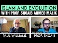

# Islam and evolution with Professor Shoaib Ahmed Malik (2021-12-09)

## Description

Professor Shoaib A Malik discusses his book Islam and Evolution Al-Ghazālī and the Modern Evolutionary Paradigm. Dr. Shoaib is Professor of the Natural Sciences at Zayed University, Dubai. He studies the intersection of science, Islam and philosophy. His book on Islam and evolution can be read for FREE here: https://www.academia.edu/47762640/Islam_and_Evolution_Al_Ghaz%C4%81l%C4%AB_and_the_Modern_Evolutionary_Paradigm?fbclid=IwAR02r9Yvza45zHtQyIa_lBxlsD7qAjyRNCytyPbibspfsD83PE6iea5vMOU

Chapters:
0:00 - Intro
0:23 - Topic of the Stream
0:55 - Information about the Guest
2:22 - Overview of the presentation
4:42 - Creationism vs Intelligent Design
5:34 - Evolution: A Basic Outline
10:51 - Do Biologists deny evolution?
20:49 - Approach to the relationship between Islam and Evolution
22:02 - Two Filter Tests for evolution in Islam
24:58 - Four Positions on evolution
25:32 - Creationism
27:58 - No Exceptions
28:41 - Human Exceptionalism
30:06 - At what time did Adam PBUH exist?
33:04 - Adam Exceptionalism
46:50 - Quranic vs Scientific Perspective
54:48 - Signs of Design in Creation
(Paul's "No Design 🙄" memes)
1:00:25 - Theological Validity:
Metaphysical Compatibility
1:01:40 - Concept of Randomness
1:05:15 - Scriptural Comparability
1:07:28 - Intelligent Design
1:26:39 - Closing Statements

You Can Support My Work on Patreon:
https://www.patreon.com/Bloggingtheology

My Paypal Link: 
https://www.paypal.com/paypalme/bloggingtheology?locale.x=en_GB

Follow me on Twitter:
https://twitter.com/freemonotheist

## Summary of [Islam and evolution with Professor Shoaib Ahmed Malik](https://www.youtube.com/watch?v=rmRH80lj9UM)

*This summary is AI generated - there may be inaccuracies. *

### [00:00:00](https://www.youtube.com/watch?v=rmRH80lj9UM&t=0) - [01:00:00](https://www.youtube.com/watch?v=rmRH80lj9UM&t=3600)

, Professor Shoaib Ahmed Malik discusses how Muslims can approach the issue of evolution. He argues that, provided neo-darwinism is true, most of it can be embraced by a Muslim. If either of these two filters are not met, then something must change in the science.

**[00:00:00](https://www.youtube.com/watch?v=rmRH80lj9UM&t=0)** In this 1-hour YouTube video, Dr. Shoaib Ahmed Malik discusses Islam and evolution with Professor Shelby Schafer from Rootlegged Science and Religion Series. Malik addresses the main points of his book, Islam and Evolution, including a basic overview of the science of evolution, a social media controversy surrounding scientists who question neo-Darwinism, and four positions from which to dialogue about Islam and evolution. He then introduces four theological positions from which to discuss Islam and evolution. Finally, he discusses intelligent design, clarifying the difference between it and creationism.
* **[00:05:00](https://www.youtube.com/watch?v=rmRH80lj9UM&t=300)* Discusses three propositions of evolution - deep time, common ancestry, and the mechanisms of evolution. It explains that, according to these propositions, the earth is very old and that all biological entities are interconnected in a family-like network dating back to the beginning of life.  also discusses the concept of genetics, which was discovered after Darwin's death.
* **[00:10:00](https://www.youtube.com/watch?v=rmRH80lj9UM&t=600)* Discusses controversy surrounding the theory of evolution, specifically the idea that it is a theory in crisis. Professor Shoaib Ahmed Malik discusses how some scientists, known as the "third way," believe that evolution is not supported by evidence and is instead based on faith. He also discusses how these same scientists believe that creationism and intelligent design are not scientific because they invoke supernatural interventions to explain the origins of biological complexity.
* **[00:15:00](https://www.youtube.com/watch?v=rmRH80lj9UM&t=900)** The three scholars interviewed in the article all agree that evolution has occurred, but disagree on what mechanisms are responsible. The extended evolutionary synthesis (third way) is supported by all three interviewees, while the traditional new dharmas are supported by one interviewee.
* **[00:20:00](https://www.youtube.com/watch?v=rmRH80lj9UM&t=1200)** Shoaib Ahmed Malik discusses how Muslims can approach the issue of evolution, discussing two approaches - one where evolution is evaluated on its own merits, and another where theological concerns are taken into account. He argues that, provided neo-darwinism is true, most of it can be embraced by a Muslim. If either of these two filters are not met, then something must change in the science.
* **[00:25:00](https://www.youtube.com/watch?v=rmRH80lj9UM&t=1500)* Discusses different positions on the theory of evolution, and provides a brief explanation of creationism and human exceptionalism. Creationism is the position that everything was created by God, while human exceptionalism is the belief that humans are the only ones who are exempt from the process of evolution.  then goes on to discuss the position of human exceptionism, which maintains that Adam and Eve were the first humans and were created miraculously.
* **[00:30:00](https://www.youtube.com/watch?v=rmRH80lj9UM&t=1800)** The professor provides a brief overview of the three positions on Islam and evolution, noting that adamic exceptionism is a recent position. He goes on to say that while the Quran may highlight a theological conception of the human being, scientists are still looking at human beings through a biological lens.
* **[00:35:00](https://www.youtube.com/watch?v=rmRH80lj9UM&t=2100)* Discusses slam's perspective on evolution and how it conflicts with biblical teachings. The Qur'an states that humans were created from a single pair of Adam and Eve, and that Jesus is just like Adam. These teachings do not conflict with macroevolution, as Adam and Eve were created distinctly and Adam was born miraculously without a father.
* **[00:40:00](https://www.youtube.com/watch?v=rmRH80lj9UM&t=2400)** Islam believes that Adam and Eve were created miraculously, and all humans can be traced back to them. Evolutionary biology is difficult to accept because there are only two people who could have come up with a whole population, and because of genetic bottlenecks, this is not possible if there are other human-like entities that coexisted with Adam and Eve at the time. However, it is possible that these entities are still Adam's descendants and that they are compatible with scripture that they are children of Adam.
* **[00:45:00](https://www.youtube.com/watch?v=rmRH80lj9UM&t=2700)** Shoaib Ahmed Malik discusses the compatibility of Islam and evolution, citing Quranic verses and Hadith. He argues that because the Quranic worldview presupposes continuous supernatural activity, it conflicts with modern science's understanding of the cosmos as a self-contained set of patterns.
* **[00:50:00](https://www.youtube.com/watch?v=rmRH80lj9UM&t=3000)** Professor Malik discusses how Islamic theology and science differ in regards to the metaphysical. He asserts that although there are theoretical distinctions between the two, in practice there is overlap. He concludes by saying that scientists shouldn't have a worry about mixing their faith and science.
* **[00:55:00](https://www.youtube.com/watch?v=rmRH80lj9UM&t=3300)** , Professor Shoaib Ahmed Malik discusses how Muslims believe that there is design in nature, even if science denies it. He also points out that there is a tension between science and religion, as science denies teleology while religion affirms it.
### [01:00:00](https://www.youtube.com/watch?v=rmRH80lj9UM&t=3600) - [01:30:00](https://www.youtube.com/watch?v=rmRH80lj9UM&t=5400)

"Islam and evolution with Professor Shoaib Ahmed Malik", Malik discusses how Islam and evolution are compatible. He explains that while there is scriptural evidence which supports the theory of evolution, there is also evidence which supports the theory of intelligent design. He makes it clear that from a calamity perspective critiquing ID does not equate to critiquing neo-Darwinism. Malik finishes by saying that from a theological perspective, contingency is sufficient for proving the existence of God.

**[01:00:00](https://www.youtube.com/watch?v=rmRH80lj9UM&t=3600)** , Professor Shoaib Ahmed Malik discusses the theological validity of evolution. He notes that there are two possible interpretations of randomness-epistemic and ontological. He goes on to say that, for Muslims, ontological randomness is accepted because there are physical gaps in nature that God could have created miraculously. He also points out that evolution is just a methodology, and can be counted among the atheistic frameworks.
* **[01:05:00](https://www.youtube.com/watch?v=rmRH80lj9UM&t=3900)* Discusses how Islam and evolution are compatible. Professor Shoaib Ahmed Malik explains that while there is scriptural evidence which supports the theory of evolution, there is also evidence which supports the theory of intelligent design.
* **[01:10:00](https://www.youtube.com/watch?v=rmRH80lj9UM&t=4200)** Professor Shoaib Ahmed Malik discusses the Islamic perspective on the design argument, which is that it does not equate to critiquing the Quran. He goes on to say that from a calamity perspective critiquing ID does not equate to critiquing the Quran. He makes it clear that from a calamity perspective critiquing ID does not equate to critiquing neo-Darwinism. He discusses three scientific discoveries that reveal the mind behind the universe and how they are not just focused on neo-Darwinism. He finishes by saying that from a theological perspective, contingency is sufficient for proving the existence of God.
* **[01:15:00](https://www.youtube.com/watch?v=rmRH80lj9UM&t=4500)** Professor Shoaib Ahmed Malik discusses the Islamic view of evolution and how it does not reject the idea of design in nature, but instead rests on the contingency argument. He goes on to say that the proposal of intelligent design is not the same thing as believing in apparent design, which is something Christians and atheists agree on.  finishes with a discussion of the proposal's implications for the origins of life.
* **[01:20:00](https://www.youtube.com/watch?v=rmRH80lj9UM&t=4800)**  "Islam and evolution with Professor Shoaib Ahmed Malik" discusses how all of the major religions, including Islam, affirm the existence of miracles and things which cannot be explained through science. Malik argues that, because science can explain certain aspects of nature, it does not invalidate the existence of design. He suggests that, when people find an explanation for the order of life, their faith would not be shaken.
* **[01:25:00](https://www.youtube.com/watch?v=rmRH80lj9UM&t=5100)** The presenter, Professor Shoaib Ahmed Malik, discusses Islam and evolution with a careful and nuanced approach. He discusses how Islamic theology and scientific understanding of nature can work together, and addresses some potential dangers of an indiscriminate acceptance of evolutionary theory. He ends the talk by giving out his email address and encouraging viewers to check out his book on the topic.
* **[01:30:00](https://www.youtube.com/watch?v=rmRH80lj9UM&t=5400)** Professor Shoaib Ahmed Malik discusses the relationship between Islam and evolution, pointing out that Muslims may have evolved from earlier religious beliefs.

## Full transcript with timestamps

[0:00:02](https://youtu.be/rmRH80lj9UM?t=2) hello everyone and welcome to blogging  
[0:00:05](https://youtu.be/rmRH80lj9UM?t=5) theology and today i have a very  
[0:00:07](https://youtu.be/rmRH80lj9UM?t=7) distinguished uh guest dr  
[0:00:10](https://youtu.be/rmRH80lj9UM?t=10) ahmed malik welcome to blogging theology  
[0:00:12](https://youtu.be/rmRH80lj9UM?t=12) sir  
[0:00:14](https://youtu.be/rmRH80lj9UM?t=14) thank you very much paul i appreciate  
[0:00:15](https://youtu.be/rmRH80lj9UM?t=15) you inviting me to vlogging theology  
[0:00:18](https://youtu.be/rmRH80lj9UM?t=18) well and uh this is a this is a very  
[0:00:21](https://youtu.be/rmRH80lj9UM?t=21) special um video i think uh in this  
[0:00:23](https://youtu.be/rmRH80lj9UM?t=23) video um dr schaefer is going to be  
[0:00:26](https://youtu.be/rmRH80lj9UM?t=26) discussing his recent work uh a book  
[0:00:28](https://youtu.be/rmRH80lj9UM?t=28) entitled islam and evolution  
[0:00:31](https://youtu.be/rmRH80lj9UM?t=31) al ghazali and the modern evolutionary  
[0:00:34](https://youtu.be/rmRH80lj9UM?t=34) paradigms published by rootlegged  
[0:00:36](https://youtu.be/rmRH80lj9UM?t=36) science and religion series  
[0:00:38](https://youtu.be/rmRH80lj9UM?t=38) by the way and uh dr shelby very  
[0:00:40](https://youtu.be/rmRH80lj9UM?t=40) generously agreed to put a link to  
[0:00:43](https://youtu.be/rmRH80lj9UM?t=43) his book which is available free of  
[0:00:45](https://youtu.be/rmRH80lj9UM?t=45) charge quite legally in the description  
[0:00:48](https://youtu.be/rmRH80lj9UM?t=48) below so you can download it and read it  
[0:00:50](https://youtu.be/rmRH80lj9UM?t=50) the uh the rootledge publishers are okay  
[0:00:52](https://youtu.be/rmRH80lj9UM?t=52) with that um so um dr shobe is  
[0:00:57](https://youtu.be/rmRH80lj9UM?t=57) a professor and he is assistant  
[0:00:59](https://youtu.be/rmRH80lj9UM?t=59) professor of the natural sciences at  
[0:01:02](https://youtu.be/rmRH80lj9UM?t=62) zayed university in dubai  
[0:01:04](https://youtu.be/rmRH80lj9UM?t=64) and he researches exclusively on the  
[0:01:07](https://youtu.be/rmRH80lj9UM?t=67) topics of science and religion atheism  
[0:01:10](https://youtu.be/rmRH80lj9UM?t=70) and islamic theology and he's a  
[0:01:13](https://youtu.be/rmRH80lj9UM?t=73) specialist uh clearly a specialist on  
[0:01:16](https://youtu.be/rmRH80lj9UM?t=76) islam and evolution and this is an  
[0:01:18](https://youtu.be/rmRH80lj9UM?t=78) incredibly controversial subject amongst  
[0:01:20](https://youtu.be/rmRH80lj9UM?t=80) muslims and also amongst christians and  
[0:01:22](https://youtu.be/rmRH80lj9UM?t=82) many jews as well and this book is i've  
[0:01:26](https://youtu.be/rmRH80lj9UM?t=86) read the endorsements on the back and  
[0:01:28](https://youtu.be/rmRH80lj9UM?t=88) i'll let you have a look some of the  
[0:01:30](https://youtu.be/rmRH80lj9UM?t=90) leading scholars in the world have read  
[0:01:31](https://youtu.be/rmRH80lj9UM?t=91) this book and endorse it muslim scholars  
[0:01:34](https://youtu.be/rmRH80lj9UM?t=94) and top academics and specialists at  
[0:01:36](https://youtu.be/rmRH80lj9UM?t=96) oxford university and other universities  
[0:01:38](https://youtu.be/rmRH80lj9UM?t=98) have read this and give it glowing  
[0:01:40](https://youtu.be/rmRH80lj9UM?t=100) commendations so this really is a very  
[0:01:42](https://youtu.be/rmRH80lj9UM?t=102) mainstream academic work uh tackling  
[0:01:45](https://youtu.be/rmRH80lj9UM?t=105) head-on the whole issue of islam and  
[0:01:47](https://youtu.be/rmRH80lj9UM?t=107) evolution  
[0:01:48](https://youtu.be/rmRH80lj9UM?t=108) so without any more ado i'll hand over  
[0:01:51](https://youtu.be/rmRH80lj9UM?t=111) um the show to dr shope who will take us  
[0:01:54](https://youtu.be/rmRH80lj9UM?t=114) through islam and evolution with a  
[0:01:56](https://youtu.be/rmRH80lj9UM?t=116) series of slides  
[0:01:58](https://youtu.be/rmRH80lj9UM?t=118) and and a talk about it so over to you  
[0:02:01](https://youtu.be/rmRH80lj9UM?t=121) sir  
[0:02:02](https://youtu.be/rmRH80lj9UM?t=122) thank you very much paul i appreciate it  
[0:02:04](https://youtu.be/rmRH80lj9UM?t=124) so um  
[0:02:05](https://youtu.be/rmRH80lj9UM?t=125) as paul kindly mentioned his  
[0:02:08](https://youtu.be/rmRH80lj9UM?t=128) introduction i mostly focus on the  
[0:02:10](https://youtu.be/rmRH80lj9UM?t=130) interaction of science and religion and  
[0:02:12](https://youtu.be/rmRH80lj9UM?t=132) what i'm about to present is just a a  
[0:02:15](https://youtu.be/rmRH80lj9UM?t=135) summary of my own book  
[0:02:17](https://youtu.be/rmRH80lj9UM?t=137) that was released this year with  
[0:02:19](https://youtu.be/rmRH80lj9UM?t=139) rutledge  
[0:02:20](https://youtu.be/rmRH80lj9UM?t=140) back in may um so this is the overview  
[0:02:23](https://youtu.be/rmRH80lj9UM?t=143) uh of the presentation as you can see on  
[0:02:26](https://youtu.be/rmRH80lj9UM?t=146) the right hand side that's the front  
[0:02:28](https://youtu.be/rmRH80lj9UM?t=148) cover of my book it's open access that  
[0:02:30](https://youtu.be/rmRH80lj9UM?t=150) means you can download it for free and  
[0:02:31](https://youtu.be/rmRH80lj9UM?t=151) legally somebody paid for it  
[0:02:34](https://youtu.be/rmRH80lj9UM?t=154) for to be available anywhere in the  
[0:02:36](https://youtu.be/rmRH80lj9UM?t=156) world um so no matter where you are it  
[0:02:39](https://youtu.be/rmRH80lj9UM?t=159) is an accessible item that has no  
[0:02:42](https://youtu.be/rmRH80lj9UM?t=162) paywalls behind it it's absolutely free  
[0:02:44](https://youtu.be/rmRH80lj9UM?t=164) you can now as a pdf so um  
[0:02:46](https://youtu.be/rmRH80lj9UM?t=166) for today's conversation what i'd like  
[0:02:48](https://youtu.be/rmRH80lj9UM?t=168) to do is just go over  
[0:02:50](https://youtu.be/rmRH80lj9UM?t=170) six main areas uh just to kind of clear  
[0:02:53](https://youtu.be/rmRH80lj9UM?t=173) the air and then you know hopefully  
[0:02:55](https://youtu.be/rmRH80lj9UM?t=175) build up my uh case for what i think  
[0:02:59](https://youtu.be/rmRH80lj9UM?t=179) can be made sense of when it comes to  
[0:03:00](https://youtu.be/rmRH80lj9UM?t=180) the topic of islamic evolution so first  
[0:03:02](https://youtu.be/rmRH80lj9UM?t=182) and foremost i'd like to just provide a  
[0:03:04](https://youtu.be/rmRH80lj9UM?t=184) very basic overview of the science  
[0:03:06](https://youtu.be/rmRH80lj9UM?t=186) evolution so what do we mean by  
[0:03:08](https://youtu.be/rmRH80lj9UM?t=188) evolution when we're talking about in  
[0:03:09](https://youtu.be/rmRH80lj9UM?t=189) this context because whenever i say the  
[0:03:11](https://youtu.be/rmRH80lj9UM?t=191) word evolution people automatically  
[0:03:13](https://youtu.be/rmRH80lj9UM?t=193) think naturalism atheism fascism  
[0:03:16](https://youtu.be/rmRH80lj9UM?t=196) whatever have you so i just want to kind  
[0:03:17](https://youtu.be/rmRH80lj9UM?t=197) of provide a baseline that we can all  
[0:03:19](https://youtu.be/rmRH80lj9UM?t=199) work with  
[0:03:20](https://youtu.be/rmRH80lj9UM?t=200) following that i then want to move on to  
[0:03:23](https://youtu.be/rmRH80lj9UM?t=203) um  
[0:03:26](https://youtu.be/rmRH80lj9UM?t=206) a social media controversy where people  
[0:03:29](https://youtu.be/rmRH80lj9UM?t=209) are referring to a certain group of  
[0:03:31](https://youtu.be/rmRH80lj9UM?t=211) scientists to say hang on there's a  
[0:03:32](https://youtu.be/rmRH80lj9UM?t=212) bunch of scientists here  
[0:03:34](https://youtu.be/rmRH80lj9UM?t=214) behind this movement that are  
[0:03:36](https://youtu.be/rmRH80lj9UM?t=216) questioning neo-darwinism therefore  
[0:03:38](https://youtu.be/rmRH80lj9UM?t=218) evolution is a theory in crisis so i  
[0:03:41](https://youtu.be/rmRH80lj9UM?t=221) want to address that and knit that in  
[0:03:42](https://youtu.be/rmRH80lj9UM?t=222) the bud before we go any further because  
[0:03:44](https://youtu.be/rmRH80lj9UM?t=224) there is a huge misconception in that in  
[0:03:47](https://youtu.be/rmRH80lj9UM?t=227) in that articulation that i want to  
[0:03:49](https://youtu.be/rmRH80lj9UM?t=229) clarify here i'll then um highlight the  
[0:03:52](https://youtu.be/rmRH80lj9UM?t=232) approach that i've taken in this piece  
[0:03:54](https://youtu.be/rmRH80lj9UM?t=234) of work um and it's by no means  
[0:03:56](https://youtu.be/rmRH80lj9UM?t=236) definitive i welcome other approaches  
[0:03:59](https://youtu.be/rmRH80lj9UM?t=239) but i'm just clarifying how i have  
[0:04:01](https://youtu.be/rmRH80lj9UM?t=241) entertained the discussion  
[0:04:02](https://youtu.be/rmRH80lj9UM?t=242) and then um i'd introduce  
[0:04:05](https://youtu.be/rmRH80lj9UM?t=245) four positions which i created when i  
[0:04:08](https://youtu.be/rmRH80lj9UM?t=248) was going through the literature so if  
[0:04:09](https://youtu.be/rmRH80lj9UM?t=249) you if you read about the various um  
[0:04:12](https://youtu.be/rmRH80lj9UM?t=252) opinions you know the people have  
[0:04:13](https://youtu.be/rmRH80lj9UM?t=253) written on the topic of psalm resolution  
[0:04:15](https://youtu.be/rmRH80lj9UM?t=255) i went through that and i said okay  
[0:04:16](https://youtu.be/rmRH80lj9UM?t=256) these are four positions that we can  
[0:04:18](https://youtu.be/rmRH80lj9UM?t=258) identify and then yeah through which we  
[0:04:20](https://youtu.be/rmRH80lj9UM?t=260) can make uh you know which we can  
[0:04:22](https://youtu.be/rmRH80lj9UM?t=262) navigate the conversation of islam and  
[0:04:23](https://youtu.be/rmRH80lj9UM?t=263) illusion i then move on to what i  
[0:04:26](https://youtu.be/rmRH80lj9UM?t=266) believe are theologically valid  
[0:04:28](https://youtu.be/rmRH80lj9UM?t=268) positions out of these four and finally  
[0:04:30](https://youtu.be/rmRH80lj9UM?t=270) because paul stressed that he would like  
[0:04:31](https://youtu.be/rmRH80lj9UM?t=271) to go through intelligent design um i've  
[0:04:34](https://youtu.be/rmRH80lj9UM?t=274) introduced that there as well so we can  
[0:04:35](https://youtu.be/rmRH80lj9UM?t=275) go over um how i think intelligent  
[0:04:38](https://youtu.be/rmRH80lj9UM?t=278) design works in this  
[0:04:40](https://youtu.be/rmRH80lj9UM?t=280) conversation and also you said to me  
[0:04:42](https://youtu.be/rmRH80lj9UM?t=282) before we started there's a difference  
[0:04:44](https://youtu.be/rmRH80lj9UM?t=284) in your view between intelligent design  
[0:04:46](https://youtu.be/rmRH80lj9UM?t=286) as a theory as an approach and  
[0:04:48](https://youtu.be/rmRH80lj9UM?t=288) creationism which is something distinct  
[0:04:51](https://youtu.be/rmRH80lj9UM?t=291) uh and uh you're going to clarify the  
[0:04:52](https://youtu.be/rmRH80lj9UM?t=292) difference between creationism and  
[0:04:53](https://youtu.be/rmRH80lj9UM?t=293) intelligent design perhaps sure so just  
[0:04:56](https://youtu.be/rmRH80lj9UM?t=296) to be clear that the distinction between  
[0:04:58](https://youtu.be/rmRH80lj9UM?t=298) creationism and intelligent design is  
[0:05:00](https://youtu.be/rmRH80lj9UM?t=300) not something that i have carved out it  
[0:05:02](https://youtu.be/rmRH80lj9UM?t=302) is the id proponents themselves have  
[0:05:04](https://youtu.be/rmRH80lj9UM?t=304) covered up they make it very clear that  
[0:05:06](https://youtu.be/rmRH80lj9UM?t=306) they are not creationists they make it  
[0:05:08](https://youtu.be/rmRH80lj9UM?t=308) very clear in their own works and  
[0:05:11](https://youtu.be/rmRH80lj9UM?t=311) creationists themselves have tried to  
[0:05:13](https://youtu.be/rmRH80lj9UM?t=313) move away from intelligent design so  
[0:05:15](https://youtu.be/rmRH80lj9UM?t=315) it's not a it's not that they're  
[0:05:16](https://youtu.be/rmRH80lj9UM?t=316) synonymous it's that there are very  
[0:05:18](https://youtu.be/rmRH80lj9UM?t=318) clear stipulations of what is  
[0:05:19](https://youtu.be/rmRH80lj9UM?t=319) intelligent design and what is um uh  
[0:05:22](https://youtu.be/rmRH80lj9UM?t=322) creationism though they're not they're  
[0:05:23](https://youtu.be/rmRH80lj9UM?t=323) not necessarily opposing one another but  
[0:05:26](https://youtu.be/rmRH80lj9UM?t=326) members are very clear in drawing the  
[0:05:28](https://youtu.be/rmRH80lj9UM?t=328) boundaries between the two but we'll get  
[0:05:29](https://youtu.be/rmRH80lj9UM?t=329) to that uh we're beating the punchline  
[0:05:31](https://youtu.be/rmRH80lj9UM?t=331) yeah yeah cool all right okay so um  
[0:05:34](https://youtu.be/rmRH80lj9UM?t=334) let's start off with a basic outline of  
[0:05:37](https://youtu.be/rmRH80lj9UM?t=337) what we mean by evolution so the way i  
[0:05:40](https://youtu.be/rmRH80lj9UM?t=340) try to simplify this for for the wider  
[0:05:42](https://youtu.be/rmRH80lj9UM?t=342) audience is through three propositions  
[0:05:45](https://youtu.be/rmRH80lj9UM?t=345) deep time common ancestry and then the  
[0:05:48](https://youtu.be/rmRH80lj9UM?t=348) mechanisms or the mechanics of evolution  
[0:05:50](https://youtu.be/rmRH80lj9UM?t=350) for me if these are enough to kind of  
[0:05:53](https://youtu.be/rmRH80lj9UM?t=353) get the conversation starting  
[0:05:55](https://youtu.be/rmRH80lj9UM?t=355) i don't go into any further detail about  
[0:05:57](https://youtu.be/rmRH80lj9UM?t=357) the the the android and you know the  
[0:06:00](https://youtu.be/rmRH80lj9UM?t=360) viruses the dna for me that that's  
[0:06:02](https://youtu.be/rmRH80lj9UM?t=362) irrelevant i just want to explain enough  
[0:06:04](https://youtu.be/rmRH80lj9UM?t=364) of the science so that we can start  
[0:06:06](https://youtu.be/rmRH80lj9UM?t=366) engaging with the theological  
[0:06:08](https://youtu.be/rmRH80lj9UM?t=368) conversation so i'm not interested in  
[0:06:10](https://youtu.be/rmRH80lj9UM?t=370) going into science further than these  
[0:06:12](https://youtu.be/rmRH80lj9UM?t=372) three propositions so with that said let  
[0:06:15](https://youtu.be/rmRH80lj9UM?t=375) me explain what these three propositions  
[0:06:16](https://youtu.be/rmRH80lj9UM?t=376) are  
[0:06:17](https://youtu.be/rmRH80lj9UM?t=377) evolution requires that the earth is  
[0:06:20](https://youtu.be/rmRH80lj9UM?t=380) really old a concept known as deep time  
[0:06:22](https://youtu.be/rmRH80lj9UM?t=382) previously i mean if you go back a  
[0:06:24](https://youtu.be/rmRH80lj9UM?t=384) couple hundred years ago people thought  
[0:06:26](https://youtu.be/rmRH80lj9UM?t=386) that the earth was around six to ten  
[0:06:28](https://youtu.be/rmRH80lj9UM?t=388) thousand years right mostly because of  
[0:06:30](https://youtu.be/rmRH80lj9UM?t=390) uh  
[0:06:31](https://youtu.be/rmRH80lj9UM?t=391) archbishop james usher who kind of you  
[0:06:33](https://youtu.be/rmRH80lj9UM?t=393) know went through the patriarchs uh in  
[0:06:35](https://youtu.be/rmRH80lj9UM?t=395) the bible and kind of guesstimated that  
[0:06:38](https://youtu.be/rmRH80lj9UM?t=398) the bible indicates that the earth is  
[0:06:40](https://youtu.be/rmRH80lj9UM?t=400) around six to ten thousand years old and  
[0:06:43](https://youtu.be/rmRH80lj9UM?t=403) and even in quranic translations even  
[0:06:45](https://youtu.be/rmRH80lj9UM?t=405) even a modern one that i read you know  
[0:06:47](https://youtu.be/rmRH80lj9UM?t=407) seven years ago i still see in brackets  
[0:06:49](https://youtu.be/rmRH80lj9UM?t=409) six thousand years ago so you do see  
[0:06:52](https://youtu.be/rmRH80lj9UM?t=412) these this you do see these um  
[0:06:54](https://youtu.be/rmRH80lj9UM?t=414) in contemporary works within quranic  
[0:06:57](https://youtu.be/rmRH80lj9UM?t=417) translations um so the idea that the  
[0:07:00](https://youtu.be/rmRH80lj9UM?t=420) time that time is much much older than  
[0:07:02](https://youtu.be/rmRH80lj9UM?t=422) we anticipated is the concept known as  
[0:07:05](https://youtu.be/rmRH80lj9UM?t=425) deep time so that's the first  
[0:07:06](https://youtu.be/rmRH80lj9UM?t=426) proposition of evolution  
[0:07:08](https://youtu.be/rmRH80lj9UM?t=428) the second proposition of evolution is  
[0:07:09](https://youtu.be/rmRH80lj9UM?t=429) what makes this a distinctive theory in  
[0:07:12](https://youtu.be/rmRH80lj9UM?t=432) comparison to anything that we've  
[0:07:14](https://youtu.be/rmRH80lj9UM?t=434) entertained in the past in the past  
[0:07:16](https://youtu.be/rmRH80lj9UM?t=436) there was this general understanding  
[0:07:18](https://youtu.be/rmRH80lj9UM?t=438) at least  
[0:07:19](https://youtu.be/rmRH80lj9UM?t=439) across the three abrahamic faiths that  
[0:07:21](https://youtu.be/rmRH80lj9UM?t=441) god created each species separately and  
[0:07:24](https://youtu.be/rmRH80lj9UM?t=444) instantaneously so humans boom  
[0:07:26](https://youtu.be/rmRH80lj9UM?t=446) instantaneous creation lions boom  
[0:07:28](https://youtu.be/rmRH80lj9UM?t=448) instantaneous creation cats boom  
[0:07:29](https://youtu.be/rmRH80lj9UM?t=449) instantaneous creation right  
[0:07:32](https://youtu.be/rmRH80lj9UM?t=452) in chapter one don't you where god  
[0:07:34](https://youtu.be/rmRH80lj9UM?t=454) creates in in six or seven days rests on  
[0:07:36](https://youtu.be/rmRH80lj9UM?t=456) the last day he creates this this he  
[0:07:38](https://youtu.be/rmRH80lj9UM?t=458) creates that and the next day he cares  
[0:07:40](https://youtu.be/rmRH80lj9UM?t=460) in 24 hour periods quite distinctively  
[0:07:42](https://youtu.be/rmRH80lj9UM?t=462) uh in that time frame so yeah sorry  
[0:07:45](https://youtu.be/rmRH80lj9UM?t=465) that's right yeah that's right yeah so  
[0:07:47](https://youtu.be/rmRH80lj9UM?t=467) um now that is what is challenged by the  
[0:07:50](https://youtu.be/rmRH80lj9UM?t=470) thea revolution um charles darwin was  
[0:07:53](https://youtu.be/rmRH80lj9UM?t=473) not the first person who kind of came up  
[0:07:54](https://youtu.be/rmRH80lj9UM?t=474) with the idea but he gave it a very  
[0:07:55](https://youtu.be/rmRH80lj9UM?t=475) clear explanation but in a nutshell  
[0:07:57](https://youtu.be/rmRH80lj9UM?t=477) common ancestry says that just like all  
[0:08:00](https://youtu.be/rmRH80lj9UM?t=480) of us have a mother and father our  
[0:08:01](https://youtu.be/rmRH80lj9UM?t=481) mothers our parents they have a mother  
[0:08:03](https://youtu.be/rmRH80lj9UM?t=483) and father our grandparents our mother  
[0:08:04](https://youtu.be/rmRH80lj9UM?t=484) and father and if we keep going back  
[0:08:06](https://youtu.be/rmRH80lj9UM?t=486) with this family tree network evolution  
[0:08:08](https://youtu.be/rmRH80lj9UM?t=488) just takes it to the next step they just  
[0:08:10](https://youtu.be/rmRH80lj9UM?t=490) say that just like you have a family  
[0:08:12](https://youtu.be/rmRH80lj9UM?t=492) tree network within your family there's  
[0:08:14](https://youtu.be/rmRH80lj9UM?t=494) also a family network when it comes to  
[0:08:16](https://youtu.be/rmRH80lj9UM?t=496) all biological life  
[0:08:18](https://youtu.be/rmRH80lj9UM?t=498) which means that humans bugs  
[0:08:20](https://youtu.be/rmRH80lj9UM?t=500) leopards cheetahs trees whatever have  
[0:08:23](https://youtu.be/rmRH80lj9UM?t=503) you anything that's biologically  
[0:08:24](https://youtu.be/rmRH80lj9UM?t=504) existing or has existed in the past is  
[0:08:27](https://youtu.be/rmRH80lj9UM?t=507) connected in this biohistorical lineage  
[0:08:30](https://youtu.be/rmRH80lj9UM?t=510) since the beginning of life three and a  
[0:08:32](https://youtu.be/rmRH80lj9UM?t=512) half billion years ago so common  
[0:08:33](https://youtu.be/rmRH80lj9UM?t=513) ancestry in a nutshell is  
[0:08:35](https://youtu.be/rmRH80lj9UM?t=515) every biological entity is somehow  
[0:08:38](https://youtu.be/rmRH80lj9UM?t=518) connected in this family-like network  
[0:08:41](https://youtu.be/rmRH80lj9UM?t=521) that's what common ancestry means and  
[0:08:43](https://youtu.be/rmRH80lj9UM?t=523) and this is where you get the concept of  
[0:08:44](https://youtu.be/rmRH80lj9UM?t=524) mac revolution species evolving into  
[0:08:47](https://youtu.be/rmRH80lj9UM?t=527) other things over time right  
[0:08:49](https://youtu.be/rmRH80lj9UM?t=529) so um did you want to say anything or  
[0:08:50](https://youtu.be/rmRH80lj9UM?t=530) anything to that point that's great so  
[0:08:52](https://youtu.be/rmRH80lj9UM?t=532) far thank you great okay and then the  
[0:08:54](https://youtu.be/rmRH80lj9UM?t=534) final thing and this is the this is the  
[0:08:56](https://youtu.be/rmRH80lj9UM?t=536) part of evolution which gives it a  
[0:08:58](https://youtu.be/rmRH80lj9UM?t=538) darwinistic rendition  
[0:09:01](https://youtu.be/rmRH80lj9UM?t=541) the mechanisms of evolution so what what  
[0:09:03](https://youtu.be/rmRH80lj9UM?t=543) is it that makes evolution tick what is  
[0:09:05](https://youtu.be/rmRH80lj9UM?t=545) the engine of evolution um in charles  
[0:09:09](https://youtu.be/rmRH80lj9UM?t=549) darwin's time when he when he proposed  
[0:09:11](https://youtu.be/rmRH80lj9UM?t=551) this theory we have to make it very  
[0:09:13](https://youtu.be/rmRH80lj9UM?t=553) clear that the concept of genes did not  
[0:09:15](https://youtu.be/rmRH80lj9UM?t=555) exist in his time it simply did not  
[0:09:18](https://youtu.be/rmRH80lj9UM?t=558) exist so when he first proposed the  
[0:09:20](https://youtu.be/rmRH80lj9UM?t=560) theory of evolution all he proposed was  
[0:09:23](https://youtu.be/rmRH80lj9UM?t=563) this idea of natural selection that when  
[0:09:25](https://youtu.be/rmRH80lj9UM?t=565) you have you know a given number of  
[0:09:27](https://youtu.be/rmRH80lj9UM?t=567) species in a particular climate  
[0:09:29](https://youtu.be/rmRH80lj9UM?t=569) the the species that can acclimatize or  
[0:09:32](https://youtu.be/rmRH80lj9UM?t=572) adapt to that environment will survive  
[0:09:34](https://youtu.be/rmRH80lj9UM?t=574) and species that cannot adapt to that  
[0:09:36](https://youtu.be/rmRH80lj9UM?t=576) environment will eventually die off so  
[0:09:38](https://youtu.be/rmRH80lj9UM?t=578) the the natural settings are like a  
[0:09:41](https://youtu.be/rmRH80lj9UM?t=581) filter and whatever is able to get  
[0:09:43](https://youtu.be/rmRH80lj9UM?t=583) through lives on what doesn't get  
[0:09:45](https://youtu.be/rmRH80lj9UM?t=585) through dies out that's natural  
[0:09:47](https://youtu.be/rmRH80lj9UM?t=587) selection in a nutshell  
[0:09:48](https://youtu.be/rmRH80lj9UM?t=588) now eventually after darwin's death in  
[0:09:51](https://youtu.be/rmRH80lj9UM?t=591) the 20th century um the idea of genetics  
[0:09:54](https://youtu.be/rmRH80lj9UM?t=594) came to  
[0:09:56](https://youtu.be/rmRH80lj9UM?t=596) the scientific surface  
[0:09:57](https://youtu.be/rmRH80lj9UM?t=597) and they eventually found out that  
[0:09:59](https://youtu.be/rmRH80lj9UM?t=599) actually this concept of genes and  
[0:10:01](https://youtu.be/rmRH80lj9UM?t=601) random mutations in your in your  
[0:10:04](https://youtu.be/rmRH80lj9UM?t=604) explaining inheritance and variation  
[0:10:06](https://youtu.be/rmRH80lj9UM?t=606) this can be plugged into the theory of  
[0:10:08](https://youtu.be/rmRH80lj9UM?t=608) evolution and when natural selection and  
[0:10:11](https://youtu.be/rmRH80lj9UM?t=611) random mutation  
[0:10:12](https://youtu.be/rmRH80lj9UM?t=612) uh were merged along with a few other  
[0:10:14](https://youtu.be/rmRH80lj9UM?t=614) things  
[0:10:15](https://youtu.be/rmRH80lj9UM?t=615) this is what came to be known as  
[0:10:18](https://youtu.be/rmRH80lj9UM?t=618) neo-darwinism or the modern synthesis so  
[0:10:21](https://youtu.be/rmRH80lj9UM?t=621) darwinism is just natural selection  
[0:10:23](https://youtu.be/rmRH80lj9UM?t=623) neo-darwinism is natural selection plus  
[0:10:26](https://youtu.be/rmRH80lj9UM?t=626) random mutation and this is the  
[0:10:28](https://youtu.be/rmRH80lj9UM?t=628) definition of evolution that i will be  
[0:10:31](https://youtu.be/rmRH80lj9UM?t=631) using whenever i talk about it for the  
[0:10:33](https://youtu.be/rmRH80lj9UM?t=633) rest of the presentation okay good very  
[0:10:36](https://youtu.be/rmRH80lj9UM?t=636) clear very clear so far yeah so  
[0:10:38](https://youtu.be/rmRH80lj9UM?t=638) always keep in mind that whenever we now  
[0:10:40](https://youtu.be/rmRH80lj9UM?t=640) talk about evolution these three  
[0:10:42](https://youtu.be/rmRH80lj9UM?t=642) propositions must constantly spring in  
[0:10:44](https://youtu.be/rmRH80lj9UM?t=644) your mind deep time common ancestry and  
[0:10:46](https://youtu.be/rmRH80lj9UM?t=646) then the mechanics are natural selection  
[0:10:48](https://youtu.be/rmRH80lj9UM?t=648) plus random mutation okay  
[0:10:51](https://youtu.be/rmRH80lj9UM?t=651) so with evolution cleared out in terms  
[0:10:53](https://youtu.be/rmRH80lj9UM?t=653) of how i've defined it and how most  
[0:10:55](https://youtu.be/rmRH80lj9UM?t=655) people define it right  
[0:10:57](https://youtu.be/rmRH80lj9UM?t=657) there is now a social media controversy  
[0:11:00](https://youtu.be/rmRH80lj9UM?t=660) uh that i've experienced in many  
[0:11:02](https://youtu.be/rmRH80lj9UM?t=662) different facebook groups i know that  
[0:11:03](https://youtu.be/rmRH80lj9UM?t=663) there's twitter there's this new thing  
[0:11:05](https://youtu.be/rmRH80lj9UM?t=665) called clubhouse i'm not in any of those  
[0:11:07](https://youtu.be/rmRH80lj9UM?t=667) right i just prefer to stick to facebook  
[0:11:09](https://youtu.be/rmRH80lj9UM?t=669) call me old-fashioned but that's just me  
[0:11:11](https://youtu.be/rmRH80lj9UM?t=671) right i just don't have the time old  
[0:11:13](https://youtu.be/rmRH80lj9UM?t=673) fashioned but it might be the sanest  
[0:11:14](https://youtu.be/rmRH80lj9UM?t=674) thing to do i've been on clubhouse  
[0:11:16](https://youtu.be/rmRH80lj9UM?t=676) it could be it could be dangerous  
[0:11:19](https://youtu.be/rmRH80lj9UM?t=679) all right okay no i mean like um  
[0:11:21](https://youtu.be/rmRH80lj9UM?t=681) apparently there's more there's like  
[0:11:22](https://youtu.be/rmRH80lj9UM?t=682) what is it instagram there's snapchat  
[0:11:24](https://youtu.be/rmRH80lj9UM?t=684) there's all these other social medias  
[0:11:26](https://youtu.be/rmRH80lj9UM?t=686) right  
[0:11:27](https://youtu.be/rmRH80lj9UM?t=687) yeah and my mind is already so invested  
[0:11:30](https://youtu.be/rmRH80lj9UM?t=690) into just university work and academic  
[0:11:32](https://youtu.be/rmRH80lj9UM?t=692) life i don't have the time to invest in  
[0:11:34](https://youtu.be/rmRH80lj9UM?t=694) my time in anything else  
[0:11:36](https://youtu.be/rmRH80lj9UM?t=696) yeah yeah it just sucks your time up  
[0:11:38](https://youtu.be/rmRH80lj9UM?t=698) anyways from what i'm sure that this is  
[0:11:41](https://youtu.be/rmRH80lj9UM?t=701) going to be replicated in other social  
[0:11:42](https://youtu.be/rmRH80lj9UM?t=702) media platforms but on facebook i have  
[0:11:45](https://youtu.be/rmRH80lj9UM?t=705) come to see that many people refer to a  
[0:11:48](https://youtu.be/rmRH80lj9UM?t=708) group of scientists um known as the  
[0:11:51](https://youtu.be/rmRH80lj9UM?t=711) third way right or uh they embody a  
[0:11:54](https://youtu.be/rmRH80lj9UM?t=714) movement known as the extended  
[0:11:56](https://youtu.be/rmRH80lj9UM?t=716) evolutionary synthesis and they refer to  
[0:11:58](https://youtu.be/rmRH80lj9UM?t=718) these scientists to say hang on all of  
[0:12:00](https://youtu.be/rmRH80lj9UM?t=720) these are you know famous phd you know  
[0:12:04](https://youtu.be/rmRH80lj9UM?t=724) professors they are top of their field  
[0:12:06](https://youtu.be/rmRH80lj9UM?t=726) they have all the credentials that you  
[0:12:08](https://youtu.be/rmRH80lj9UM?t=728) would expect from you know leading  
[0:12:10](https://youtu.be/rmRH80lj9UM?t=730) scientists yet they are against  
[0:12:12](https://youtu.be/rmRH80lj9UM?t=732) darwinism they are against neo-darwinism  
[0:12:15](https://youtu.be/rmRH80lj9UM?t=735) therefore evolution is a theory in  
[0:12:18](https://youtu.be/rmRH80lj9UM?t=738) crisis and we don't need to  
[0:12:20](https://youtu.be/rmRH80lj9UM?t=740) turn this into a worry anymore and as a  
[0:12:23](https://youtu.be/rmRH80lj9UM?t=743) result of that  
[0:12:24](https://youtu.be/rmRH80lj9UM?t=744) people you know um get fictitious on on  
[0:12:27](https://youtu.be/rmRH80lj9UM?t=747) social media now what i would like to do  
[0:12:30](https://youtu.be/rmRH80lj9UM?t=750) is clarify this misconception from the  
[0:12:32](https://youtu.be/rmRH80lj9UM?t=752) very beginning because i've actually  
[0:12:34](https://youtu.be/rmRH80lj9UM?t=754) contacted these people personally i've  
[0:12:37](https://youtu.be/rmRH80lj9UM?t=757) sent them emails and asked them what  
[0:12:39](https://youtu.be/rmRH80lj9UM?t=759) exactly is your position because people  
[0:12:41](https://youtu.be/rmRH80lj9UM?t=761) are saying that you don't believe in  
[0:12:43](https://youtu.be/rmRH80lj9UM?t=763) evolution anymore so this is the um the  
[0:12:46](https://youtu.be/rmRH80lj9UM?t=766) website the third way and this is what  
[0:12:48](https://youtu.be/rmRH80lj9UM?t=768) i'm referring to here so if you click on  
[0:12:50](https://youtu.be/rmRH80lj9UM?t=770) the third way if you search for third  
[0:12:51](https://youtu.be/rmRH80lj9UM?t=771) one on google you'll find their website  
[0:12:54](https://youtu.be/rmRH80lj9UM?t=774) okay now  
[0:12:56](https://youtu.be/rmRH80lj9UM?t=776) here is an email this is a you know a  
[0:12:58](https://youtu.be/rmRH80lj9UM?t=778) sample email but i sent the same thing  
[0:12:59](https://youtu.be/rmRH80lj9UM?t=779) by just changing the name to all the  
[0:13:01](https://youtu.be/rmRH80lj9UM?t=781) professors i just listed out earlier  
[0:13:03](https://youtu.be/rmRH80lj9UM?t=783) hello dear professor shapiro i hope  
[0:13:05](https://youtu.be/rmRH80lj9UM?t=785) you're well my name is shuiv and i  
[0:13:06](https://youtu.be/rmRH80lj9UM?t=786) research in the intersection of science  
[0:13:08](https://youtu.be/rmRH80lj9UM?t=788) religion i recently published on islam  
[0:13:10](https://youtu.be/rmRH80lj9UM?t=790) revolution  
[0:13:11](https://youtu.be/rmRH80lj9UM?t=791) i recently came across  
[0:13:13](https://youtu.be/rmRH80lj9UM?t=793) videos by creations in which your name  
[0:13:15](https://youtu.be/rmRH80lj9UM?t=795) along with others was mentioned a lot  
[0:13:17](https://youtu.be/rmRH80lj9UM?t=797) creationists use your name and works to  
[0:13:19](https://youtu.be/rmRH80lj9UM?t=799) promote the idea that neo-darwinism  
[0:13:22](https://youtu.be/rmRH80lj9UM?t=802) which they create evolution is a theory  
[0:13:24](https://youtu.be/rmRH80lj9UM?t=804) in crisis and therefore is false however  
[0:13:27](https://youtu.be/rmRH80lj9UM?t=807) when i went through your work it seems  
[0:13:29](https://youtu.be/rmRH80lj9UM?t=809) you're questioning the mechanics of  
[0:13:30](https://youtu.be/rmRH80lj9UM?t=810) neutralism not common ancestry so are  
[0:13:33](https://youtu.be/rmRH80lj9UM?t=813) you still an evolutionist just not a new  
[0:13:35](https://youtu.be/rmRH80lj9UM?t=815) darwinist am i correct in understanding  
[0:13:37](https://youtu.be/rmRH80lj9UM?t=817) your position regards shuev and i sent  
[0:13:40](https://youtu.be/rmRH80lj9UM?t=820) this email  
[0:13:41](https://youtu.be/rmRH80lj9UM?t=821) to all five people well to all four  
[0:13:44](https://youtu.be/rmRH80lj9UM?t=824) people i'll explain why four not five  
[0:13:46](https://youtu.be/rmRH80lj9UM?t=826) it's because uh the fifth person um  
[0:13:51](https://youtu.be/rmRH80lj9UM?t=831) she passed them in 2011.  
[0:13:53](https://youtu.be/rmRH80lj9UM?t=833) so this is the response that i got  
[0:13:56](https://youtu.be/rmRH80lj9UM?t=836) you are correct  
[0:13:57](https://youtu.be/rmRH80lj9UM?t=837) my position is that evolution by descent  
[0:13:59](https://youtu.be/rmRH80lj9UM?t=839) with modification is true but the  
[0:14:02](https://youtu.be/rmRH80lj9UM?t=842) modifications do not occur randomly and  
[0:14:05](https://youtu.be/rmRH80lj9UM?t=845) gradually as proposed by the modern  
[0:14:06](https://youtu.be/rmRH80lj9UM?t=846) synthesis i.e neo-darwinism  
[0:14:09](https://youtu.be/rmRH80lj9UM?t=849) creationism intelligent design are not  
[0:14:10](https://youtu.be/rmRH80lj9UM?t=850) scientific because they invoke  
[0:14:12](https://youtu.be/rmRH80lj9UM?t=852) supernatural interventions to explain  
[0:14:15](https://youtu.be/rmRH80lj9UM?t=855) the origins of biological complexity  
[0:14:17](https://youtu.be/rmRH80lj9UM?t=857) while science is limited to natural  
[0:14:19](https://youtu.be/rmRH80lj9UM?t=859) explanations attaches of paper and press  
[0:14:21](https://youtu.be/rmRH80lj9UM?t=861) that lays the position on detail please  
[0:14:23](https://youtu.be/rmRH80lj9UM?t=863) confirm receipt best wishes james  
[0:14:26](https://youtu.be/rmRH80lj9UM?t=866) shapiro and he's written a book on the  
[0:14:28](https://youtu.be/rmRH80lj9UM?t=868) subject matter and that's the book there  
[0:14:30](https://youtu.be/rmRH80lj9UM?t=870) on the bottom right corner  
[0:14:32](https://youtu.be/rmRH80lj9UM?t=872) so you can clearly see that james  
[0:14:34](https://youtu.be/rmRH80lj9UM?t=874) shapiro is not denying that evolution  
[0:14:36](https://youtu.be/rmRH80lj9UM?t=876) occur  
[0:14:37](https://youtu.be/rmRH80lj9UM?t=877) what he is simply intending is that the  
[0:14:39](https://youtu.be/rmRH80lj9UM?t=879) mechanics of neo-darwinism  
[0:14:41](https://youtu.be/rmRH80lj9UM?t=881) he doesn't agree with  
[0:14:43](https://youtu.be/rmRH80lj9UM?t=883) that's all he's saying  
[0:14:44](https://youtu.be/rmRH80lj9UM?t=884) and the same and you will see the same  
[0:14:46](https://youtu.be/rmRH80lj9UM?t=886) line of responses with others this is  
[0:14:48](https://youtu.be/rmRH80lj9UM?t=888) professor dennis noble  
[0:14:50](https://youtu.be/rmRH80lj9UM?t=890) right he says dear schweb yes you have  
[0:14:52](https://youtu.be/rmRH80lj9UM?t=892) understood correctly i am questioning  
[0:14:54](https://youtu.be/rmRH80lj9UM?t=894) the biological processes that neo-darwin  
[0:14:57](https://youtu.be/rmRH80lj9UM?t=897) think near darwinis think are completely  
[0:14:58](https://youtu.be/rmRH80lj9UM?t=898) sufficient to explain evolution  
[0:15:00](https://youtu.be/rmRH80lj9UM?t=900) i am also saying that some of the bases  
[0:15:03](https://youtu.be/rmRH80lj9UM?t=903) of neutrons are factually incorrect and  
[0:15:05](https://youtu.be/rmRH80lj9UM?t=905) my word can be found here  
[0:15:07](https://youtu.be/rmRH80lj9UM?t=907) so you see again the same response is  
[0:15:09](https://youtu.be/rmRH80lj9UM?t=909) happening there they are evolutionists  
[0:15:11](https://youtu.be/rmRH80lj9UM?t=911) they're just not agreeing with the  
[0:15:13](https://youtu.be/rmRH80lj9UM?t=913) mechanisms  
[0:15:14](https://youtu.be/rmRH80lj9UM?t=914) of neo-darwinism  
[0:15:17](https://youtu.be/rmRH80lj9UM?t=917) certain truck can we just go back to  
[0:15:18](https://youtu.be/rmRH80lj9UM?t=918) that i just want to note here professor  
[0:15:20](https://youtu.be/rmRH80lj9UM?t=920) dennis noble says in my book dance to  
[0:15:22](https://youtu.be/rmRH80lj9UM?t=922) the tune of life i also explain  
[0:15:24](https://youtu.be/rmRH80lj9UM?t=924) why i don't go along with the militant  
[0:15:26](https://youtu.be/rmRH80lj9UM?t=926) atheists like dawkins and coyne who use  
[0:15:29](https://youtu.be/rmRH80lj9UM?t=929) neo-darwinist interpretations of  
[0:15:31](https://youtu.be/rmRH80lj9UM?t=931) evolution to attack religion  
[0:15:33](https://youtu.be/rmRH80lj9UM?t=933) i am agnostic  
[0:15:35](https://youtu.be/rmRH80lj9UM?t=935) so  
[0:15:36](https://youtu.be/rmRH80lj9UM?t=936) isn't this chap but wasn't he the  
[0:15:38](https://youtu.be/rmRH80lj9UM?t=938) supervisor of richard dawkins at oxford  
[0:15:40](https://youtu.be/rmRH80lj9UM?t=940) uh originally um so i'm not sure about  
[0:15:43](https://youtu.be/rmRH80lj9UM?t=943) those details  
[0:15:44](https://youtu.be/rmRH80lj9UM?t=944) anyway is it interesting that he  
[0:15:46](https://youtu.be/rmRH80lj9UM?t=946) distances himself quite quite clearly  
[0:15:48](https://youtu.be/rmRH80lj9UM?t=948) there from uh atheist scientists who use  
[0:15:51](https://youtu.be/rmRH80lj9UM?t=951) their science so to speak to attack  
[0:15:52](https://youtu.be/rmRH80lj9UM?t=952) religion yeah exactly yeah so  
[0:15:55](https://youtu.be/rmRH80lj9UM?t=955) i mean very clearly put  
[0:15:57](https://youtu.be/rmRH80lj9UM?t=957) this is professor eve jablanca eva  
[0:15:59](https://youtu.be/rmRH80lj9UM?t=959) blanca she wrote evolution in four  
[0:16:01](https://youtu.be/rmRH80lj9UM?t=961) dimensions um and this is what she says  
[0:16:05](https://youtu.be/rmRH80lj9UM?t=965) just here's wave i'm an evolutionary  
[0:16:07](https://youtu.be/rmRH80lj9UM?t=967) biologist and a great admirer of darwin  
[0:16:10](https://youtu.be/rmRH80lj9UM?t=970) these creationists are shameless  
[0:16:11](https://youtu.be/rmRH80lj9UM?t=971) manipulators and liars or idiots or both  
[0:16:15](https://youtu.be/rmRH80lj9UM?t=975) you understand my position perfectly all  
[0:16:17](https://youtu.be/rmRH80lj9UM?t=977) the best yeah  
[0:16:19](https://youtu.be/rmRH80lj9UM?t=979) very nuanced response there  
[0:16:21](https://youtu.be/rmRH80lj9UM?t=981) no no i asked her i i sent her email do  
[0:16:23](https://youtu.be/rmRH80lj9UM?t=983) you want to mince your words a little  
[0:16:24](https://youtu.be/rmRH80lj9UM?t=984) bit she's like nope because i'm  
[0:16:26](https://youtu.be/rmRH80lj9UM?t=986) basically she she was frustrated that  
[0:16:29](https://youtu.be/rmRH80lj9UM?t=989) her work is being used to to articulate  
[0:16:32](https://youtu.be/rmRH80lj9UM?t=992) because i'm assuming this is not the  
[0:16:33](https://youtu.be/rmRH80lj9UM?t=993) first time  
[0:16:34](https://youtu.be/rmRH80lj9UM?t=994) she really  
[0:16:39](https://youtu.be/rmRH80lj9UM?t=999) so and then uh now uh professor uh  
[0:16:42](https://youtu.be/rmRH80lj9UM?t=1002) masatoshi he's if i if my calculations  
[0:16:45](https://youtu.be/rmRH80lj9UM?t=1005) are correct he's around 80 to 90 years  
[0:16:47](https://youtu.be/rmRH80lj9UM?t=1007) old at the moment so i didn't expect him  
[0:16:49](https://youtu.be/rmRH80lj9UM?t=1009) to respond to me but i think if he's  
[0:16:51](https://youtu.be/rmRH80lj9UM?t=1011) japanese that probably he's still quite  
[0:16:53](https://youtu.be/rmRH80lj9UM?t=1013) a young man by japanese  
[0:16:54](https://youtu.be/rmRH80lj9UM?t=1014) yeah yeah yeah so i mean i of course i  
[0:16:57](https://youtu.be/rmRH80lj9UM?t=1017) mean like i whenever i mean when i when  
[0:16:59](https://youtu.be/rmRH80lj9UM?t=1019) i send these emails i was gambling i  
[0:17:01](https://youtu.be/rmRH80lj9UM?t=1021) never expected response but the fact  
[0:17:03](https://youtu.be/rmRH80lj9UM?t=1023) that three of them responded i mean i'm  
[0:17:04](https://youtu.be/rmRH80lj9UM?t=1024) more than happy with that but uh  
[0:17:06](https://youtu.be/rmRH80lj9UM?t=1026) professor  
[0:17:07](https://youtu.be/rmRH80lj9UM?t=1027) professor masatoshi he has written a  
[0:17:09](https://youtu.be/rmRH80lj9UM?t=1029) whole book on evolution explaining that  
[0:17:11](https://youtu.be/rmRH80lj9UM?t=1031) he just disagrees with the mechanisms of  
[0:17:14](https://youtu.be/rmRH80lj9UM?t=1034) neo-darwin and he actually articulates  
[0:17:16](https://youtu.be/rmRH80lj9UM?t=1036) his own position in this material  
[0:17:18](https://youtu.be/rmRH80lj9UM?t=1038) so again it is not that evolution has  
[0:17:21](https://youtu.be/rmRH80lj9UM?t=1041) not occurred it's that they're  
[0:17:22](https://youtu.be/rmRH80lj9UM?t=1042) disagreeing with the mechanisms of  
[0:17:24](https://youtu.be/rmRH80lj9UM?t=1044) neo-darwinism and finally professor um  
[0:17:28](https://youtu.be/rmRH80lj9UM?t=1048) lynn margulis this is a this is actually  
[0:17:31](https://youtu.be/rmRH80lj9UM?t=1051) a an article in which she was  
[0:17:33](https://youtu.be/rmRH80lj9UM?t=1053) interviewed uh recorded on discover  
[0:17:35](https://youtu.be/rmRH80lj9UM?t=1055) magazine and it was published i think  
[0:17:36](https://youtu.be/rmRH80lj9UM?t=1056) it's a couple months before she died  
[0:17:38](https://youtu.be/rmRH80lj9UM?t=1058) uh and there were a couple and this you  
[0:17:39](https://youtu.be/rmRH80lj9UM?t=1059) know this article has you know uh  
[0:17:41](https://youtu.be/rmRH80lj9UM?t=1061) several questions that was that was  
[0:17:43](https://youtu.be/rmRH80lj9UM?t=1063) asked of her and the black ones so the  
[0:17:46](https://youtu.be/rmRH80lj9UM?t=1066) bold ones are the questions and then the  
[0:17:48](https://youtu.be/rmRH80lj9UM?t=1068) non-bold are the other responses so um  
[0:17:51](https://youtu.be/rmRH80lj9UM?t=1071) if you can read the first one it says  
[0:17:52](https://youtu.be/rmRH80lj9UM?t=1072) most scientists say there is no  
[0:17:54](https://youtu.be/rmRH80lj9UM?t=1074) controversy over the evolution would you  
[0:17:56](https://youtu.be/rmRH80lj9UM?t=1076) disagree why do you disagree  
[0:17:58](https://youtu.be/rmRH80lj9UM?t=1078) she says all scientists agree that  
[0:18:00](https://youtu.be/rmRH80lj9UM?t=1080) evolution has occurred  
[0:18:02](https://youtu.be/rmRH80lj9UM?t=1082) so common ancestry is true  
[0:18:05](https://youtu.be/rmRH80lj9UM?t=1085) that all life comes from common ancestry  
[0:18:08](https://youtu.be/rmRH80lj9UM?t=1088) that there has been extension and that  
[0:18:09](https://youtu.be/rmRH80lj9UM?t=1089) new taxa new biological groups have  
[0:18:12](https://youtu.be/rmRH80lj9UM?t=1092) arisen the question is  
[0:18:15](https://youtu.be/rmRH80lj9UM?t=1095) is natural selection enough to explain  
[0:18:18](https://youtu.be/rmRH80lj9UM?t=1098) evolution is it the driver of evolution  
[0:18:21](https://youtu.be/rmRH80lj9UM?t=1101) and then if you follow the next one  
[0:18:22](https://youtu.be/rmRH80lj9UM?t=1102) so by natural selection  
[0:18:24](https://youtu.be/rmRH80lj9UM?t=1104) she means allah darwin is that right  
[0:18:28](https://youtu.be/rmRH80lj9UM?t=1108) yeah  
[0:18:29](https://youtu.be/rmRH80lj9UM?t=1109) these people are questioning the new  
[0:18:31](https://youtu.be/rmRH80lj9UM?t=1111) dominus  
[0:18:32](https://youtu.be/rmRH80lj9UM?t=1112) rendition of evolution  
[0:18:34](https://youtu.be/rmRH80lj9UM?t=1114) right  
[0:18:35](https://youtu.be/rmRH80lj9UM?t=1115) and you don't believe that natural sex  
[0:18:36](https://youtu.be/rmRH80lj9UM?t=1116) is the answer this is the issue i have  
[0:18:39](https://youtu.be/rmRH80lj9UM?t=1119) with neo-darwinists they teach that what  
[0:18:41](https://youtu.be/rmRH80lj9UM?t=1121) is generating novelty is the  
[0:18:42](https://youtu.be/rmRH80lj9UM?t=1122) accumulation of random mutations in dna  
[0:18:44](https://youtu.be/rmRH80lj9UM?t=1124) in a direction set by natural selection  
[0:18:46](https://youtu.be/rmRH80lj9UM?t=1126) if you want bigger abs you keep  
[0:18:48](https://youtu.be/rmRH80lj9UM?t=1128) selecting the hands that are laying the  
[0:18:49](https://youtu.be/rmRH80lj9UM?t=1129) biggest ends hence and you keep and you  
[0:18:52](https://youtu.be/rmRH80lj9UM?t=1132) get bigger and bigger eggs but you also  
[0:18:54](https://youtu.be/rmRH80lj9UM?t=1134) get hands with defective feathers and  
[0:18:55](https://youtu.be/rmRH80lj9UM?t=1135) wobbly legs natural selection eliminates  
[0:18:57](https://youtu.be/rmRH80lj9UM?t=1137) and maybe maintains but it doesn't  
[0:18:59](https://youtu.be/rmRH80lj9UM?t=1139) create  
[0:19:00](https://youtu.be/rmRH80lj9UM?t=1140) so  
[0:19:01](https://youtu.be/rmRH80lj9UM?t=1141) then it was asked of her that mendel  
[0:19:04](https://youtu.be/rmRH80lj9UM?t=1144) missed something was darwin wrong i'd  
[0:19:06](https://youtu.be/rmRH80lj9UM?t=1146) say both are incomplete  
[0:19:08](https://youtu.be/rmRH80lj9UM?t=1148) right so i don't want to go to the rest  
[0:19:10](https://youtu.be/rmRH80lj9UM?t=1150) of the answer i mean people can read  
[0:19:11](https://youtu.be/rmRH80lj9UM?t=1151) that around time but the idea here is  
[0:19:14](https://youtu.be/rmRH80lj9UM?t=1154) that all of these scholars you know who  
[0:19:16](https://youtu.be/rmRH80lj9UM?t=1156) were who are or were leaders in their  
[0:19:18](https://youtu.be/rmRH80lj9UM?t=1158) fields are pretty much articulating that  
[0:19:21](https://youtu.be/rmRH80lj9UM?t=1161) they don't have a problem with evolution  
[0:19:23](https://youtu.be/rmRH80lj9UM?t=1163) in terms of common ancestry what they  
[0:19:25](https://youtu.be/rmRH80lj9UM?t=1165) simply have a problem with is the  
[0:19:27](https://youtu.be/rmRH80lj9UM?t=1167) mechanisms of evolution and that is why  
[0:19:30](https://youtu.be/rmRH80lj9UM?t=1170) this paper is a very important paper  
[0:19:33](https://youtu.be/rmRH80lj9UM?t=1173) that appeared in nature  
[0:19:35](https://youtu.be/rmRH80lj9UM?t=1175) the the headlines say does evolutionary  
[0:19:38](https://youtu.be/rmRH80lj9UM?t=1178) theory need everything now people read  
[0:19:39](https://youtu.be/rmRH80lj9UM?t=1179) just the headlines and think whoa  
[0:19:41](https://youtu.be/rmRH80lj9UM?t=1181) evolution is a theory in crisis  
[0:19:43](https://youtu.be/rmRH80lj9UM?t=1183) but if you read the subtitle very  
[0:19:45](https://youtu.be/rmRH80lj9UM?t=1185) carefully researchers are divided over  
[0:19:48](https://youtu.be/rmRH80lj9UM?t=1188) what processes  
[0:19:50](https://youtu.be/rmRH80lj9UM?t=1190) should be considered fundamental  
[0:19:52](https://youtu.be/rmRH80lj9UM?t=1192) and this is where you see the split  
[0:19:54](https://youtu.be/rmRH80lj9UM?t=1194) between  
[0:19:54](https://youtu.be/rmRH80lj9UM?t=1194) this new movement called the extended  
[0:19:56](https://youtu.be/rmRH80lj9UM?t=1196) evolutionary synthesis or the third way  
[0:19:59](https://youtu.be/rmRH80lj9UM?t=1199) and then your traditional new dharmas  
[0:20:02](https://youtu.be/rmRH80lj9UM?t=1202) that's what this paper is about it  
[0:20:03](https://youtu.be/rmRH80lj9UM?t=1203) articulates both opinions but none of  
[0:20:05](https://youtu.be/rmRH80lj9UM?t=1205) them no matter which side you're on  
[0:20:07](https://youtu.be/rmRH80lj9UM?t=1207) neither of them reject common ancestry  
[0:20:12](https://youtu.be/rmRH80lj9UM?t=1212) so my take home message from all of this  
[0:20:15](https://youtu.be/rmRH80lj9UM?t=1215) is evolutionary balls agree that  
[0:20:17](https://youtu.be/rmRH80lj9UM?t=1217) evolution has occurred but they disagree  
[0:20:19](https://youtu.be/rmRH80lj9UM?t=1219) over the mechanics and that is fine  
[0:20:22](https://youtu.be/rmRH80lj9UM?t=1222) in science you have no  
[0:20:24](https://youtu.be/rmRH80lj9UM?t=1224) it's obvious that you're going to have  
[0:20:25](https://youtu.be/rmRH80lj9UM?t=1225) disagreements just like every human  
[0:20:28](https://youtu.be/rmRH80lj9UM?t=1228) activity we have difference of opinions  
[0:20:30](https://youtu.be/rmRH80lj9UM?t=1230) in religion we have different opinions  
[0:20:32](https://youtu.be/rmRH80lj9UM?t=1232) in science but the core features are  
[0:20:34](https://youtu.be/rmRH80lj9UM?t=1234) maintained  
[0:20:35](https://youtu.be/rmRH80lj9UM?t=1235) the core features are maker so that is  
[0:20:38](https://youtu.be/rmRH80lj9UM?t=1238) something i wanted to clarify before i  
[0:20:41](https://youtu.be/rmRH80lj9UM?t=1241) go to the next day so yeah did you want  
[0:20:42](https://youtu.be/rmRH80lj9UM?t=1242) to ask anything  
[0:20:44](https://youtu.be/rmRH80lj9UM?t=1244) all clear so far i'll hold my fire on  
[0:20:45](https://youtu.be/rmRH80lj9UM?t=1245) this until later okay okay all right  
[0:20:48](https://youtu.be/rmRH80lj9UM?t=1248) okay so now i'd like to articulate my  
[0:20:51](https://youtu.be/rmRH80lj9UM?t=1251) approach when it when it comes to now  
[0:20:54](https://youtu.be/rmRH80lj9UM?t=1254) addressing the interface of islam and  
[0:20:56](https://youtu.be/rmRH80lj9UM?t=1256) evolution so people can  
[0:20:58](https://youtu.be/rmRH80lj9UM?t=1258) you know go at it in multiple ways so  
[0:21:01](https://youtu.be/rmRH80lj9UM?t=1261) i've highlighted two there people some  
[0:21:03](https://youtu.be/rmRH80lj9UM?t=1263) people say let me first evaluate  
[0:21:05](https://youtu.be/rmRH80lj9UM?t=1265) evolution on its own merit so i will  
[0:21:07](https://youtu.be/rmRH80lj9UM?t=1267) evaluate the science evolution and the  
[0:21:10](https://youtu.be/rmRH80lj9UM?t=1270) moment i find holes in it i don't need  
[0:21:11](https://youtu.be/rmRH80lj9UM?t=1271) to worry about it because it has holes  
[0:21:13](https://youtu.be/rmRH80lj9UM?t=1273) and i don't believe it's a solid theory  
[0:21:15](https://youtu.be/rmRH80lj9UM?t=1275) therefore it's not an issue that i need  
[0:21:16](https://youtu.be/rmRH80lj9UM?t=1276) to worry about anymore and that's fine  
[0:21:18](https://youtu.be/rmRH80lj9UM?t=1278) if that's your methodology no problem  
[0:21:20](https://youtu.be/rmRH80lj9UM?t=1280) um the other another approach is you go  
[0:21:23](https://youtu.be/rmRH80lj9UM?t=1283) to the theological style right so what  
[0:21:26](https://youtu.be/rmRH80lj9UM?t=1286) extent can you  
[0:21:28](https://youtu.be/rmRH80lj9UM?t=1288) engage with income in terms of  
[0:21:30](https://youtu.be/rmRH80lj9UM?t=1290) theological nuances is there any space  
[0:21:32](https://youtu.be/rmRH80lj9UM?t=1292) for evolution in there now my approach  
[0:21:35](https://youtu.be/rmRH80lj9UM?t=1295) is more of the second kind what i simply  
[0:21:37](https://youtu.be/rmRH80lj9UM?t=1297) do is let me take evolution as a given  
[0:21:40](https://youtu.be/rmRH80lj9UM?t=1300) so i'm not gonna question evolution i'm  
[0:21:41](https://youtu.be/rmRH80lj9UM?t=1301) gonna say it's true as is all right  
[0:21:44](https://youtu.be/rmRH80lj9UM?t=1304) let's say it's true as is  
[0:21:46](https://youtu.be/rmRH80lj9UM?t=1306) if that's the case how far can we  
[0:21:49](https://youtu.be/rmRH80lj9UM?t=1309) theologically embrace evolution assuming  
[0:21:52](https://youtu.be/rmRH80lj9UM?t=1312) neo-darwin and evolution is true so i'm  
[0:21:53](https://youtu.be/rmRH80lj9UM?t=1313) not even going to the extended evolution  
[0:21:55](https://youtu.be/rmRH80lj9UM?t=1315) synthesis i'm saying if neo-darwinism is  
[0:21:56](https://youtu.be/rmRH80lj9UM?t=1316) true how much of it can i embrace as a  
[0:21:59](https://youtu.be/rmRH80lj9UM?t=1319) muslim  
[0:22:00](https://youtu.be/rmRH80lj9UM?t=1320) and so um  
[0:22:03](https://youtu.be/rmRH80lj9UM?t=1323) there are two questions that i need to  
[0:22:05](https://youtu.be/rmRH80lj9UM?t=1325) address  
[0:22:06](https://youtu.be/rmRH80lj9UM?t=1326) to be able to uh  
[0:22:08](https://youtu.be/rmRH80lj9UM?t=1328) satisfy my theological um uh  
[0:22:11](https://youtu.be/rmRH80lj9UM?t=1331) satisfaction right and those two are one  
[0:22:15](https://youtu.be/rmRH80lj9UM?t=1335) can god do a process like what what new  
[0:22:18](https://youtu.be/rmRH80lj9UM?t=1338) darwin says because people have a  
[0:22:20](https://youtu.be/rmRH80lj9UM?t=1340) problem with natural selection and  
[0:22:21](https://youtu.be/rmRH80lj9UM?t=1341) people have a problem they're an  
[0:22:22](https://youtu.be/rmRH80lj9UM?t=1342) imitation god can do things by  
[0:22:24](https://youtu.be/rmRH80lj9UM?t=1344) randomness that makes for a very  
[0:22:27](https://youtu.be/rmRH80lj9UM?t=1347) i mean  
[0:22:29](https://youtu.be/rmRH80lj9UM?t=1349) it's a vulgar to say this but they think  
[0:22:31](https://youtu.be/rmRH80lj9UM?t=1351) it's a stupid god  
[0:22:32](https://youtu.be/rmRH80lj9UM?t=1352) but that's that's not but that's what  
[0:22:34](https://youtu.be/rmRH80lj9UM?t=1354) how people think when they think of  
[0:22:35](https://youtu.be/rmRH80lj9UM?t=1355) randomness right the second question is  
[0:22:38](https://youtu.be/rmRH80lj9UM?t=1358) does this theory conflict anything in my  
[0:22:40](https://youtu.be/rmRH80lj9UM?t=1360) scripture  
[0:22:41](https://youtu.be/rmRH80lj9UM?t=1361) if both of these two filter tests are  
[0:22:44](https://youtu.be/rmRH80lj9UM?t=1364) passed this theory is fine  
[0:22:46](https://youtu.be/rmRH80lj9UM?t=1366) that's it  
[0:22:47](https://youtu.be/rmRH80lj9UM?t=1367) if these two  
[0:22:48](https://youtu.be/rmRH80lj9UM?t=1368) questions are not passed then something  
[0:22:50](https://youtu.be/rmRH80lj9UM?t=1370) has to change from the science but these  
[0:22:52](https://youtu.be/rmRH80lj9UM?t=1372) are the these are the two filters that i  
[0:22:55](https://youtu.be/rmRH80lj9UM?t=1375) need to engage to see whether it is  
[0:22:57](https://youtu.be/rmRH80lj9UM?t=1377) compatible with islam or not which is  
[0:22:59](https://youtu.be/rmRH80lj9UM?t=1379) why i personally believe  
[0:23:01](https://youtu.be/rmRH80lj9UM?t=1381) that this issue must be addressed from a  
[0:23:04](https://youtu.be/rmRH80lj9UM?t=1384) theological angle  
[0:23:06](https://youtu.be/rmRH80lj9UM?t=1386) not from a scientific it has to be a  
[0:23:08](https://youtu.be/rmRH80lj9UM?t=1388) theological  
[0:23:09](https://youtu.be/rmRH80lj9UM?t=1389) concern which is why i make my  
[0:23:12](https://youtu.be/rmRH80lj9UM?t=1392) presumptions very clear i come at this  
[0:23:15](https://youtu.be/rmRH80lj9UM?t=1395) conversation as a sunni muslim  
[0:23:18](https://youtu.be/rmRH80lj9UM?t=1398) that means i have certain presumptions  
[0:23:20](https://youtu.be/rmRH80lj9UM?t=1400) about the nature of god the nature of  
[0:23:22](https://youtu.be/rmRH80lj9UM?t=1402) creation and the uh the the nature of  
[0:23:24](https://youtu.be/rmRH80lj9UM?t=1404) that interaction between god and  
[0:23:26](https://youtu.be/rmRH80lj9UM?t=1406) creation  
[0:23:27](https://youtu.be/rmRH80lj9UM?t=1407) um and i  
[0:23:29](https://youtu.be/rmRH80lj9UM?t=1409) adopt scripture with a particular  
[0:23:31](https://youtu.be/rmRH80lj9UM?t=1411) mindset and i make those presumptions  
[0:23:33](https://youtu.be/rmRH80lj9UM?t=1413) crystal clear in my book i'm not hiding  
[0:23:35](https://youtu.be/rmRH80lj9UM?t=1415) behind anything i make it yeah you just  
[0:23:37](https://youtu.be/rmRH80lj9UM?t=1417) make it very very i notice that it's  
[0:23:39](https://youtu.be/rmRH80lj9UM?t=1419) very very clear your your assumptions be  
[0:23:41](https://youtu.be/rmRH80lj9UM?t=1421) some positions and so on in the book so  
[0:23:42](https://youtu.be/rmRH80lj9UM?t=1422) that's commendable but we're we're not  
[0:23:44](https://youtu.be/rmRH80lj9UM?t=1424) being covertly influenced by a set of  
[0:23:46](https://youtu.be/rmRH80lj9UM?t=1426) assumptions you're very open yeah  
[0:23:48](https://youtu.be/rmRH80lj9UM?t=1428) yeah so i make a crystal clear so  
[0:23:50](https://youtu.be/rmRH80lj9UM?t=1430) my first response is when i whenever i  
[0:23:53](https://youtu.be/rmRH80lj9UM?t=1433) speak to people when it comes to summon  
[0:23:54](https://youtu.be/rmRH80lj9UM?t=1434) revolution my first question to them is  
[0:23:56](https://youtu.be/rmRH80lj9UM?t=1436) which theological school are you coming  
[0:23:58](https://youtu.be/rmRH80lj9UM?t=1438) from because if i can understand that  
[0:24:00](https://youtu.be/rmRH80lj9UM?t=1440) then i can kind of guess how you're  
[0:24:01](https://youtu.be/rmRH80lj9UM?t=1441) going to interpret xyz theory  
[0:24:04](https://youtu.be/rmRH80lj9UM?t=1444) so if you're shiri and you adopt a  
[0:24:06](https://youtu.be/rmRH80lj9UM?t=1446) certain metaphysical baggage that's fine  
[0:24:07](https://youtu.be/rmRH80lj9UM?t=1447) that's that's your position there if  
[0:24:09](https://youtu.be/rmRH80lj9UM?t=1449) you're sunni which of the counts do you  
[0:24:11](https://youtu.be/rmRH80lj9UM?t=1451) follow now within sunni school there are  
[0:24:13](https://youtu.be/rmRH80lj9UM?t=1453) three schools that come under this  
[0:24:14](https://youtu.be/rmRH80lj9UM?t=1454) narrative ashadism maturitism and the  
[0:24:16](https://youtu.be/rmRH80lj9UM?t=1456) salafi or athari school whatever have  
[0:24:18](https://youtu.be/rmRH80lj9UM?t=1458) you they have their respective  
[0:24:20](https://youtu.be/rmRH80lj9UM?t=1460) differences some major some minor issues  
[0:24:23](https://youtu.be/rmRH80lj9UM?t=1463) i am not going into this conversation  
[0:24:25](https://youtu.be/rmRH80lj9UM?t=1465) with those polemical differences on  
[0:24:27](https://youtu.be/rmRH80lj9UM?t=1467) board i don't engage with those  
[0:24:28](https://youtu.be/rmRH80lj9UM?t=1468) differences i simply say the usher id  
[0:24:31](https://youtu.be/rmRH80lj9UM?t=1471) theology is what i'm adopting through  
[0:24:33](https://youtu.be/rmRH80lj9UM?t=1473) the lens of america's ali hence the  
[0:24:35](https://youtu.be/rmRH80lj9UM?t=1475) subtitle  
[0:24:36](https://youtu.be/rmRH80lj9UM?t=1476) and the modern revolution paradigm so  
[0:24:38](https://youtu.be/rmRH80lj9UM?t=1478) that is the approach that i'm taking and  
[0:24:40](https://youtu.be/rmRH80lj9UM?t=1480) i hope that people can see that if you  
[0:24:42](https://youtu.be/rmRH80lj9UM?t=1482) even if you disagree with the ashrae  
[0:24:44](https://youtu.be/rmRH80lj9UM?t=1484) approach as long as you understand this  
[0:24:46](https://youtu.be/rmRH80lj9UM?t=1486) is a valid sunni model this is the the  
[0:24:49](https://youtu.be/rmRH80lj9UM?t=1489) conclusion that i'm going to be arriving  
[0:24:51](https://youtu.be/rmRH80lj9UM?t=1491) at through this framework  
[0:24:53](https://youtu.be/rmRH80lj9UM?t=1493) yep okay we're good to go that's fine so  
[0:24:55](https://youtu.be/rmRH80lj9UM?t=1495) far  
[0:24:56](https://youtu.be/rmRH80lj9UM?t=1496) cool okay right so now now let me you  
[0:24:59](https://youtu.be/rmRH80lj9UM?t=1499) know um express the the four positions  
[0:25:02](https://youtu.be/rmRH80lj9UM?t=1502) that i carved out while i was um diving  
[0:25:05](https://youtu.be/rmRH80lj9UM?t=1505) through the literature  
[0:25:07](https://youtu.be/rmRH80lj9UM?t=1507) so  
[0:25:07](https://youtu.be/rmRH80lj9UM?t=1507) in my opinion uh this is the best way to  
[0:25:11](https://youtu.be/rmRH80lj9UM?t=1511) kind of differentiate the various  
[0:25:13](https://youtu.be/rmRH80lj9UM?t=1513) positions that are out there and it all  
[0:25:15](https://youtu.be/rmRH80lj9UM?t=1515) has to do with what people believe is or  
[0:25:18](https://youtu.be/rmRH80lj9UM?t=1518) isn't part of common ancestry okay so i  
[0:25:22](https://youtu.be/rmRH80lj9UM?t=1522) there are four positions here  
[0:25:23](https://youtu.be/rmRH80lj9UM?t=1523) creationism human exceptionalism adamic  
[0:25:25](https://youtu.be/rmRH80lj9UM?t=1525) exceptions and no exceptions so i'm  
[0:25:27](https://youtu.be/rmRH80lj9UM?t=1527) going to explain creationism and no  
[0:25:28](https://youtu.be/rmRH80lj9UM?t=1528) acceptance first because they're the  
[0:25:29](https://youtu.be/rmRH80lj9UM?t=1529) easiest then i'll get to the positions  
[0:25:31](https://youtu.be/rmRH80lj9UM?t=1531) in between  
[0:25:32](https://youtu.be/rmRH80lj9UM?t=1532) creationism is simply the antithesis of  
[0:25:36](https://youtu.be/rmRH80lj9UM?t=1536) evolution  
[0:25:37](https://youtu.be/rmRH80lj9UM?t=1537) it simply says  
[0:25:38](https://youtu.be/rmRH80lj9UM?t=1538) that god created everything  
[0:25:41](https://youtu.be/rmRH80lj9UM?t=1541) instantaneously so there is no like  
[0:25:43](https://youtu.be/rmRH80lj9UM?t=1543) biological connection with us and  
[0:25:45](https://youtu.be/rmRH80lj9UM?t=1545) monkeys or us and plants or whatever  
[0:25:48](https://youtu.be/rmRH80lj9UM?t=1548) have you everything is distinctively  
[0:25:51](https://youtu.be/rmRH80lj9UM?t=1551) created by god and directly created by  
[0:25:53](https://youtu.be/rmRH80lj9UM?t=1553) god no question end of that's it right  
[0:25:56](https://youtu.be/rmRH80lj9UM?t=1556) now i just want to make a point here  
[0:25:58](https://youtu.be/rmRH80lj9UM?t=1558) because i think people need to be aware  
[0:26:00](https://youtu.be/rmRH80lj9UM?t=1560) of this nuance creationism has a broad  
[0:26:03](https://youtu.be/rmRH80lj9UM?t=1563) meaning and it has a narrow meaning  
[0:26:06](https://youtu.be/rmRH80lj9UM?t=1566) broadly creationism means that god  
[0:26:08](https://youtu.be/rmRH80lj9UM?t=1568) created the world in that case i'm a  
[0:26:10](https://youtu.be/rmRH80lj9UM?t=1570) creationist in that case i'm a creator  
[0:26:11](https://youtu.be/rmRH80lj9UM?t=1571) and there's always a reason to find that  
[0:26:12](https://youtu.be/rmRH80lj9UM?t=1572) because uh this word croatia has bounded  
[0:26:14](https://youtu.be/rmRH80lj9UM?t=1574) around it always struck me that every  
[0:26:16](https://youtu.be/rmRH80lj9UM?t=1576) believer in god's by definition is a  
[0:26:18](https://youtu.be/rmRH80lj9UM?t=1578) creationist exactly exactly  
[0:26:20](https://youtu.be/rmRH80lj9UM?t=1580) you have this kind of remote deity who  
[0:26:22](https://youtu.be/rmRH80lj9UM?t=1582) just created the universe and let the  
[0:26:24](https://youtu.be/rmRH80lj9UM?t=1584) universe get on with it but if you're  
[0:26:25](https://youtu.be/rmRH80lj9UM?t=1585) from the abrahamic face you've got to be  
[0:26:27](https://youtu.be/rmRH80lj9UM?t=1587) a creationist because you believe god  
[0:26:29](https://youtu.be/rmRH80lj9UM?t=1589) not only created the universe but was  
[0:26:30](https://youtu.be/rmRH80lj9UM?t=1590) involved in uh creating everything  
[0:26:33](https://youtu.be/rmRH80lj9UM?t=1593) literally everything including ourselves  
[0:26:35](https://youtu.be/rmRH80lj9UM?t=1595) so we're all creationists  
[0:26:37](https://youtu.be/rmRH80lj9UM?t=1597) but that broader definition but the  
[0:26:39](https://youtu.be/rmRH80lj9UM?t=1599) narrow one you're positing says no no no  
[0:26:42](https://youtu.be/rmRH80lj9UM?t=1602) god created everything that we see  
[0:26:44](https://youtu.be/rmRH80lj9UM?t=1604) distinctively supernaturally  
[0:26:45](https://youtu.be/rmRH80lj9UM?t=1605) miraculously as it is without any macro  
[0:26:48](https://youtu.be/rmRH80lj9UM?t=1608) evolution which also could be a  
[0:26:50](https://youtu.be/rmRH80lj9UM?t=1610) god-guided process of course but but  
[0:26:52](https://youtu.be/rmRH80lj9UM?t=1612) that is not involved at all so exactly  
[0:26:55](https://youtu.be/rmRH80lj9UM?t=1615) you mean in this restricted narrowest  
[0:26:57](https://youtu.be/rmRH80lj9UM?t=1617) sense of a supernatural miraculous  
[0:26:59](https://youtu.be/rmRH80lj9UM?t=1619) creation of every insect every monkey  
[0:27:02](https://youtu.be/rmRH80lj9UM?t=1622) every dinosaur forever  
[0:27:04](https://youtu.be/rmRH80lj9UM?t=1624) yeah that's exactly it and ironically  
[0:27:08](https://youtu.be/rmRH80lj9UM?t=1628) the person who stresses on this  
[0:27:10](https://youtu.be/rmRH80lj9UM?t=1630) distinction is an atheist michael ruse  
[0:27:13](https://youtu.be/rmRH80lj9UM?t=1633) he makes it  
[0:27:14](https://youtu.be/rmRH80lj9UM?t=1634) he tries to make it clear for people to  
[0:27:17](https://youtu.be/rmRH80lj9UM?t=1637) make sure they understand this that  
[0:27:19](https://youtu.be/rmRH80lj9UM?t=1639) creationism the big creationism is  
[0:27:21](https://youtu.be/rmRH80lj9UM?t=1641) applicable to everyone anyone who  
[0:27:23](https://youtu.be/rmRH80lj9UM?t=1643) believes in god but the narrow  
[0:27:24](https://youtu.be/rmRH80lj9UM?t=1644) definition of creationism is not  
[0:27:26](https://youtu.be/rmRH80lj9UM?t=1646) necessarily applicable  
[0:27:27](https://youtu.be/rmRH80lj9UM?t=1647) so you have to be careful that when  
[0:27:29](https://youtu.be/rmRH80lj9UM?t=1649) we're talking about evolution we mean  
[0:27:31](https://youtu.be/rmRH80lj9UM?t=1651) specifically that god as you said  
[0:27:33](https://youtu.be/rmRH80lj9UM?t=1653) supernaturally created everything  
[0:27:35](https://youtu.be/rmRH80lj9UM?t=1655) distinctively without macro evolution  
[0:27:37](https://youtu.be/rmRH80lj9UM?t=1657) taking place  
[0:27:38](https://youtu.be/rmRH80lj9UM?t=1658) right so this is one position and there  
[0:27:40](https://youtu.be/rmRH80lj9UM?t=1660) are many people behind this uh position  
[0:27:43](https://youtu.be/rmRH80lj9UM?t=1663) so you can find people like zakir naik  
[0:27:45](https://youtu.be/rmRH80lj9UM?t=1665) harun yahya and a few others again these  
[0:27:47](https://youtu.be/rmRH80lj9UM?t=1667) people are are mentioned in my book i  
[0:27:49](https://youtu.be/rmRH80lj9UM?t=1669) don't need to go into the details but  
[0:27:51](https://youtu.be/rmRH80lj9UM?t=1671) just understand that this is a  
[0:27:52](https://youtu.be/rmRH80lj9UM?t=1672) fundamental rejection of manchester  
[0:27:54](https://youtu.be/rmRH80lj9UM?t=1674) united it's the anti-piece of communist  
[0:27:56](https://youtu.be/rmRH80lj9UM?t=1676) tree  
[0:27:57](https://youtu.be/rmRH80lj9UM?t=1677) on the opposing side we have the no  
[0:27:58](https://youtu.be/rmRH80lj9UM?t=1678) exceptions camp so these are a group of  
[0:28:01](https://youtu.be/rmRH80lj9UM?t=1681) muslims who believe that evolution in  
[0:28:03](https://youtu.be/rmRH80lj9UM?t=1683) its entirety can be accepted in islamic  
[0:28:05](https://youtu.be/rmRH80lj9UM?t=1685) framework in its entirety so whatever  
[0:28:08](https://youtu.be/rmRH80lj9UM?t=1688) evolution says yep we can embrace it we  
[0:28:09](https://youtu.be/rmRH80lj9UM?t=1689) can accept it and people in this camp  
[0:28:12](https://youtu.be/rmRH80lj9UM?t=1692) have no problem saying  
[0:28:14](https://youtu.be/rmRH80lj9UM?t=1694) at least most most people they have no  
[0:28:16](https://youtu.be/rmRH80lj9UM?t=1696) problem saying that adam and eve were  
[0:28:18](https://youtu.be/rmRH80lj9UM?t=1698) not miraculous creations and they had a  
[0:28:20](https://youtu.be/rmRH80lj9UM?t=1700) mother and father  
[0:28:21](https://youtu.be/rmRH80lj9UM?t=1701) they they they will go to that extent so  
[0:28:24](https://youtu.be/rmRH80lj9UM?t=1704) so we have creationism that everything  
[0:28:26](https://youtu.be/rmRH80lj9UM?t=1706) is you know directly created by god and  
[0:28:28](https://youtu.be/rmRH80lj9UM?t=1708) then we have the no exceptions cap that  
[0:28:29](https://youtu.be/rmRH80lj9UM?t=1709) everything can be plugged into the  
[0:28:31](https://youtu.be/rmRH80lj9UM?t=1711) process evolution including adam and eve  
[0:28:33](https://youtu.be/rmRH80lj9UM?t=1713) so far is that okay paul yeah yep so far  
[0:28:36](https://youtu.be/rmRH80lj9UM?t=1716) so clear  
[0:28:37](https://youtu.be/rmRH80lj9UM?t=1717) great so now let's move on to the  
[0:28:38](https://youtu.be/rmRH80lj9UM?t=1718) positions in between now the second  
[0:28:41](https://youtu.be/rmRH80lj9UM?t=1721) position here is human exceptionism and  
[0:28:43](https://youtu.be/rmRH80lj9UM?t=1723) the name is self-evident and it's very  
[0:28:45](https://youtu.be/rmRH80lj9UM?t=1725) clear to understand what it means but  
[0:28:47](https://youtu.be/rmRH80lj9UM?t=1727) it's this idea that every single entity  
[0:28:49](https://youtu.be/rmRH80lj9UM?t=1729) every single entity out there  
[0:28:52](https://youtu.be/rmRH80lj9UM?t=1732) is created by evolution no problem we  
[0:28:53](https://youtu.be/rmRH80lj9UM?t=1733) can accept that however  
[0:28:56](https://youtu.be/rmRH80lj9UM?t=1736) humans are excluded from the process and  
[0:28:58](https://youtu.be/rmRH80lj9UM?t=1738) this position maintains that adam and  
[0:29:00](https://youtu.be/rmRH80lj9UM?t=1740) eve are the first human beings and they  
[0:29:03](https://youtu.be/rmRH80lj9UM?t=1743) were miraculous creations and everything  
[0:29:05](https://youtu.be/rmRH80lj9UM?t=1745) that therefore that springs forth is  
[0:29:06](https://youtu.be/rmRH80lj9UM?t=1746) excluded from the process of evolution  
[0:29:09](https://youtu.be/rmRH80lj9UM?t=1749) so humanity is excluded from the  
[0:29:11](https://youtu.be/rmRH80lj9UM?t=1751) prosolution because adam and eve  
[0:29:13](https://youtu.be/rmRH80lj9UM?t=1753) themselves were miraculous creations and  
[0:29:15](https://youtu.be/rmRH80lj9UM?t=1755) this i show in a diagram here  
[0:29:18](https://youtu.be/rmRH80lj9UM?t=1758) so if you see this diagram this is just  
[0:29:20](https://youtu.be/rmRH80lj9UM?t=1760) you know you know the branching process  
[0:29:22](https://youtu.be/rmRH80lj9UM?t=1762) evolution and i just show three  
[0:29:23](https://youtu.be/rmRH80lj9UM?t=1763) different timelines so the left one is  
[0:29:25](https://youtu.be/rmRH80lj9UM?t=1765) over a span of 60 million years  
[0:29:28](https://youtu.be/rmRH80lj9UM?t=1768) in the past 60 million years that is the  
[0:29:30](https://youtu.be/rmRH80lj9UM?t=1770) middle one is over a span of seven  
[0:29:32](https://youtu.be/rmRH80lj9UM?t=1772) million years it shows all the hominids  
[0:29:34](https://youtu.be/rmRH80lj9UM?t=1774) uh in in the process and then finally  
[0:29:36](https://youtu.be/rmRH80lj9UM?t=1776) the third one is over the past two  
[0:29:39](https://youtu.be/rmRH80lj9UM?t=1779) million years and you can see very  
[0:29:40](https://youtu.be/rmRH80lj9UM?t=1780) clearly that you know i mean this is  
[0:29:42](https://youtu.be/rmRH80lj9UM?t=1782) just a reconstruction i'm not saying  
[0:29:44](https://youtu.be/rmRH80lj9UM?t=1784) these are absolute details but here we  
[0:29:46](https://youtu.be/rmRH80lj9UM?t=1786) see a bunch of you know hominins coming  
[0:29:48](https://youtu.be/rmRH80lj9UM?t=1788) up sprouting out neanderthals denisovans  
[0:29:50](https://youtu.be/rmRH80lj9UM?t=1790) whatever have you and adam is a  
[0:29:52](https://youtu.be/rmRH80lj9UM?t=1792) miraculous creation identified by a  
[0:29:55](https://youtu.be/rmRH80lj9UM?t=1795) white dot  
[0:29:56](https://youtu.be/rmRH80lj9UM?t=1796) and that indicates that he has no  
[0:29:58](https://youtu.be/rmRH80lj9UM?t=1798) preceding biological lineage he is a  
[0:30:01](https://youtu.be/rmRH80lj9UM?t=1801) miraculous creation and that's where  
[0:30:03](https://youtu.be/rmRH80lj9UM?t=1803) homo sapiens  
[0:30:06](https://youtu.be/rmRH80lj9UM?t=1806) so in the human exceptionalism uh field  
[0:30:08](https://youtu.be/rmRH80lj9UM?t=1808) there what age what time span are we  
[0:30:10](https://youtu.be/rmRH80lj9UM?t=1810) looking at then for the existence of  
[0:30:12](https://youtu.be/rmRH80lj9UM?t=1812) homo sapiens going back to adam is it a  
[0:30:14](https://youtu.be/rmRH80lj9UM?t=1814) hundred thousand years a million years  
[0:30:16](https://youtu.be/rmRH80lj9UM?t=1816) what's the time scale  
[0:30:18](https://youtu.be/rmRH80lj9UM?t=1818) so in in in in sunni islam there is no  
[0:30:21](https://youtu.be/rmRH80lj9UM?t=1821) scriptural indication that when adam was  
[0:30:23](https://youtu.be/rmRH80lj9UM?t=1823) created we have no we have no constraint  
[0:30:25](https://youtu.be/rmRH80lj9UM?t=1825) about seven thousand years anything that  
[0:30:26](https://youtu.be/rmRH80lj9UM?t=1826) indicates that is from biblical  
[0:30:28](https://youtu.be/rmRH80lj9UM?t=1828) literature and that is called israel  
[0:30:30](https://youtu.be/rmRH80lj9UM?t=1830) these  
[0:30:31](https://youtu.be/rmRH80lj9UM?t=1831) which are not considered valid or even  
[0:30:33](https://youtu.be/rmRH80lj9UM?t=1833) theologically binding hadith so um  
[0:30:36](https://youtu.be/rmRH80lj9UM?t=1836) there's no um indication of when he  
[0:30:39](https://youtu.be/rmRH80lj9UM?t=1839) existed according to some islam so  
[0:30:41](https://youtu.be/rmRH80lj9UM?t=1841) what's the best guess did you have a  
[0:30:42](https://youtu.be/rmRH80lj9UM?t=1842) best guess i mean you're talking about  
[0:30:43](https://youtu.be/rmRH80lj9UM?t=1843) hundreds of thousands of years or  
[0:30:46](https://youtu.be/rmRH80lj9UM?t=1846) i mean  
[0:30:47](https://youtu.be/rmRH80lj9UM?t=1847) uh  
[0:30:48](https://youtu.be/rmRH80lj9UM?t=1848) literally no guess we we don't have  
[0:30:50](https://youtu.be/rmRH80lj9UM?t=1850) anything concrete however that has not  
[0:30:52](https://youtu.be/rmRH80lj9UM?t=1852) stopped people from speculating so there  
[0:30:55](https://youtu.be/rmRH80lj9UM?t=1855) is a uh uh a professor uh yes a  
[0:30:58](https://youtu.be/rmRH80lj9UM?t=1858) professor from malaysia called say  
[0:30:59](https://youtu.be/rmRH80lj9UM?t=1859) nakabalapas he has written a book called  
[0:31:02](https://youtu.be/rmRH80lj9UM?t=1862) the justice of man um  
[0:31:04](https://youtu.be/rmRH80lj9UM?t=1864) and i forgot who the publisher is but in  
[0:31:06](https://youtu.be/rmRH80lj9UM?t=1866) that book in justice of man he kind of  
[0:31:09](https://youtu.be/rmRH80lj9UM?t=1869) does the you know the patriarchal thing  
[0:31:11](https://youtu.be/rmRH80lj9UM?t=1871) going through the patriarchs and trying  
[0:31:12](https://youtu.be/rmRH80lj9UM?t=1872) to establish languages and he estimates  
[0:31:15](https://youtu.be/rmRH80lj9UM?t=1875) if i remember correctly adam was created  
[0:31:16](https://youtu.be/rmRH80lj9UM?t=1876) around 7 600 years ago  
[0:31:19](https://youtu.be/rmRH80lj9UM?t=1879) this is his guess  
[0:31:20](https://youtu.be/rmRH80lj9UM?t=1880) okay now whether he says that that is a  
[0:31:22](https://youtu.be/rmRH80lj9UM?t=1882) theologically binding guess or not i i i  
[0:31:25](https://youtu.be/rmRH80lj9UM?t=1885) don't remember but he didn't speculate  
[0:31:27](https://youtu.be/rmRH80lj9UM?t=1887) about that he did come around the  
[0:31:29](https://youtu.be/rmRH80lj9UM?t=1889) conclusion so okay now so so this camp  
[0:31:32](https://youtu.be/rmRH80lj9UM?t=1892) makes it very clear now how do these  
[0:31:35](https://youtu.be/rmRH80lj9UM?t=1895) people reconcile islam with evolution  
[0:31:37](https://youtu.be/rmRH80lj9UM?t=1897) they'll just simply say well uh  
[0:31:40](https://youtu.be/rmRH80lj9UM?t=1900) this is his position for instance he'll  
[0:31:41](https://youtu.be/rmRH80lj9UM?t=1901) say that from a scientific angle from a  
[0:31:43](https://youtu.be/rmRH80lj9UM?t=1903) scientific rubric which does not permit  
[0:31:45](https://youtu.be/rmRH80lj9UM?t=1905) miracles under its you know umbrella  
[0:31:48](https://youtu.be/rmRH80lj9UM?t=1908) we can see a perfect seamless  
[0:31:49](https://youtu.be/rmRH80lj9UM?t=1909) continuation no problem  
[0:31:51](https://youtu.be/rmRH80lj9UM?t=1911) but from a theological angle we know  
[0:31:53](https://youtu.be/rmRH80lj9UM?t=1913) that adam was created so miraculously  
[0:31:55](https://youtu.be/rmRH80lj9UM?t=1915) now how do you how does he reconcile he  
[0:31:57](https://youtu.be/rmRH80lj9UM?t=1917) simply says when adam was created  
[0:31:59](https://youtu.be/rmRH80lj9UM?t=1919) whenever evolution was expecting to pop  
[0:32:01](https://youtu.be/rmRH80lj9UM?t=1921) forth a human-like entity adam came in  
[0:32:04](https://youtu.be/rmRH80lj9UM?t=1924) with all the right genetic physiological  
[0:32:06](https://youtu.be/rmRH80lj9UM?t=1926) data and therefore it seems like a  
[0:32:07](https://youtu.be/rmRH80lj9UM?t=1927) perfect continuation and there's no  
[0:32:09](https://youtu.be/rmRH80lj9UM?t=1929) problem with that and that's how he  
[0:32:10](https://youtu.be/rmRH80lj9UM?t=1930) comes to reconcile but i'll give you  
[0:32:12](https://youtu.be/rmRH80lj9UM?t=1932) there is a problem in terms of the  
[0:32:14](https://youtu.be/rmRH80lj9UM?t=1934) alleged divine deception because here  
[0:32:16](https://youtu.be/rmRH80lj9UM?t=1936) you have a being which has all the uh  
[0:32:18](https://youtu.be/rmRH80lj9UM?t=1938) appearances of having uh been  
[0:32:20](https://youtu.be/rmRH80lj9UM?t=1940) biologically connected with the  
[0:32:22](https://youtu.be/rmRH80lj9UM?t=1942) predecessors but in fact not so it's the  
[0:32:24](https://youtu.be/rmRH80lj9UM?t=1944) appearance is given but the reality is  
[0:32:26](https://youtu.be/rmRH80lj9UM?t=1946) the opposite in fact it's a new creation  
[0:32:28](https://youtu.be/rmRH80lj9UM?t=1948) adam  
[0:32:29](https://youtu.be/rmRH80lj9UM?t=1949) um yeah so so he he he actually tackles  
[0:32:32](https://youtu.be/rmRH80lj9UM?t=1952) that in his paper he says that if you if  
[0:32:35](https://youtu.be/rmRH80lj9UM?t=1955) you are bringing forth the the problem  
[0:32:36](https://youtu.be/rmRH80lj9UM?t=1956) of divine deception that is no longer a  
[0:32:38](https://youtu.be/rmRH80lj9UM?t=1958) scientific argument so that is outside  
[0:32:40](https://youtu.be/rmRH80lj9UM?t=1960) of the remit to begin beginning so it  
[0:32:41](https://youtu.be/rmRH80lj9UM?t=1961) will it can all be responded in the  
[0:32:43](https://youtu.be/rmRH80lj9UM?t=1963) theological plane whereas if you're  
[0:32:44](https://youtu.be/rmRH80lj9UM?t=1964) entertaining a theological plane then  
[0:32:46](https://youtu.be/rmRH80lj9UM?t=1966) that's a different story what the  
[0:32:47](https://youtu.be/rmRH80lj9UM?t=1967) science is saying but in his responses  
[0:32:49](https://youtu.be/rmRH80lj9UM?t=1969) yeah god can do that if you wanted to  
[0:32:51](https://youtu.be/rmRH80lj9UM?t=1971) there's no problem from our problems  
[0:32:53](https://youtu.be/rmRH80lj9UM?t=1973) yeah  
[0:32:55](https://youtu.be/rmRH80lj9UM?t=1975) right so  
[0:32:56](https://youtu.be/rmRH80lj9UM?t=1976) uh any questions about human accession  
[0:32:58](https://youtu.be/rmRH80lj9UM?t=1978) poll or can i want to i'm still holding  
[0:33:00](https://youtu.be/rmRH80lj9UM?t=1980) my fire  
[0:33:01](https://youtu.be/rmRH80lj9UM?t=1981) okay all right okay so the next the  
[0:33:04](https://youtu.be/rmRH80lj9UM?t=1984) third position and this is the i the  
[0:33:06](https://youtu.be/rmRH80lj9UM?t=1986) more recent position that has come to  
[0:33:08](https://youtu.be/rmRH80lj9UM?t=1988) the scene  
[0:33:09](https://youtu.be/rmRH80lj9UM?t=1989) is adamic exceptionism now this is a  
[0:33:12](https://youtu.be/rmRH80lj9UM?t=1992) term that i have given  
[0:33:14](https://youtu.be/rmRH80lj9UM?t=1994) uh to  
[0:33:15](https://youtu.be/rmRH80lj9UM?t=1995) uh  
[0:33:16](https://youtu.be/rmRH80lj9UM?t=1996) uh a position identified by david  
[0:33:19](https://youtu.be/rmRH80lj9UM?t=1999) solomon gelato now to explain this  
[0:33:21](https://youtu.be/rmRH80lj9UM?t=2001) position i just need to kind of go over  
[0:33:23](https://youtu.be/rmRH80lj9UM?t=2003) two basic principles once these are  
[0:33:25](https://youtu.be/rmRH80lj9UM?t=2005) understood then we can move on to the  
[0:33:26](https://youtu.be/rmRH80lj9UM?t=2006) position itself so the first thing is is  
[0:33:29](https://youtu.be/rmRH80lj9UM?t=2009) this idea of  
[0:33:30](https://youtu.be/rmRH80lj9UM?t=2010) which is suspending judgment  
[0:33:32](https://youtu.be/rmRH80lj9UM?t=2012) in very simple terms in when you are  
[0:33:35](https://youtu.be/rmRH80lj9UM?t=2015) making a claim about theology  
[0:33:37](https://youtu.be/rmRH80lj9UM?t=2017) particularly about things that god has  
[0:33:38](https://youtu.be/rmRH80lj9UM?t=2018) done or has not done in the past you  
[0:33:41](https://youtu.be/rmRH80lj9UM?t=2021) need very clear scriptural references  
[0:33:45](https://youtu.be/rmRH80lj9UM?t=2025) very clearly  
[0:33:46](https://youtu.be/rmRH80lj9UM?t=2026) if there's nothing in scripture you  
[0:33:48](https://youtu.be/rmRH80lj9UM?t=2028) cannot then turn it into a religious  
[0:33:50](https://youtu.be/rmRH80lj9UM?t=2030) matter let alone a theological matter  
[0:33:53](https://youtu.be/rmRH80lj9UM?t=2033) right so for this for for example um uh  
[0:33:56](https://youtu.be/rmRH80lj9UM?t=2036) paul let me ask you let me let me see if  
[0:33:58](https://youtu.be/rmRH80lj9UM?t=2038) if you know the question if you know the  
[0:33:59](https://youtu.be/rmRH80lj9UM?t=2039) answer to this question do are muslims  
[0:34:01](https://youtu.be/rmRH80lj9UM?t=2041) obligated to believe in the periodic  
[0:34:03](https://youtu.be/rmRH80lj9UM?t=2043) table  
[0:34:06](https://youtu.be/rmRH80lj9UM?t=2046) they're not obligated theologically no  
[0:34:08](https://youtu.be/rmRH80lj9UM?t=2048) yeah they're not are they obligated to  
[0:34:10](https://youtu.be/rmRH80lj9UM?t=2050) deny the periodic table  
[0:34:12](https://youtu.be/rmRH80lj9UM?t=2052) not theologically no yes yeah now if the  
[0:34:15](https://youtu.be/rmRH80lj9UM?t=2055) periodic table was mentioned in the  
[0:34:16](https://youtu.be/rmRH80lj9UM?t=2056) quran it would be an article of faith it  
[0:34:18](https://youtu.be/rmRH80lj9UM?t=2058) would absolutely  
[0:34:21](https://youtu.be/rmRH80lj9UM?t=2061) so if scripture mentions nothing then  
[0:34:24](https://youtu.be/rmRH80lj9UM?t=2064) you cannot make it into a point of  
[0:34:26](https://youtu.be/rmRH80lj9UM?t=2066) theology and you cannot make it a  
[0:34:27](https://youtu.be/rmRH80lj9UM?t=2067) religious contention so that's the work  
[0:34:29](https://youtu.be/rmRH80lj9UM?t=2069) of that's what we mean in the  
[0:34:30](https://youtu.be/rmRH80lj9UM?t=2070) theological sense  
[0:34:31](https://youtu.be/rmRH80lj9UM?t=2071) has a slightly different meaning in the  
[0:34:33](https://youtu.be/rmRH80lj9UM?t=2073) in the legal sense but this is what  
[0:34:35](https://youtu.be/rmRH80lj9UM?t=2075) means in the theological space  
[0:34:37](https://youtu.be/rmRH80lj9UM?t=2077) now the second position is the second  
[0:34:40](https://youtu.be/rmRH80lj9UM?t=2080) idea is that  
[0:34:42](https://youtu.be/rmRH80lj9UM?t=2082) the quran is highlighting a theological  
[0:34:44](https://youtu.be/rmRH80lj9UM?t=2084) conception of the human being but when  
[0:34:46](https://youtu.be/rmRH80lj9UM?t=2086) scientists are looking at human beings  
[0:34:49](https://youtu.be/rmRH80lj9UM?t=2089) they are looking at it through a  
[0:34:50](https://youtu.be/rmRH80lj9UM?t=2090) biological lens right and this these two  
[0:34:53](https://youtu.be/rmRH80lj9UM?t=2093) categories may not necessarily be the  
[0:34:56](https://youtu.be/rmRH80lj9UM?t=2096) same  
[0:34:57](https://youtu.be/rmRH80lj9UM?t=2097) they may or may not be the same that's  
[0:34:59](https://youtu.be/rmRH80lj9UM?t=2099) the thing now why is this important let  
[0:35:02](https://youtu.be/rmRH80lj9UM?t=2102) me explain  
[0:35:03](https://youtu.be/rmRH80lj9UM?t=2103) so  
[0:35:04](https://youtu.be/rmRH80lj9UM?t=2104) we know from the quran allah god refers  
[0:35:07](https://youtu.be/rmRH80lj9UM?t=2107) to uh human beings as in san as bashar  
[0:35:09](https://youtu.be/rmRH80lj9UM?t=2109) as benue adam right the kids of adam and  
[0:35:12](https://youtu.be/rmRH80lj9UM?t=2112) you know in uh the terms of insanity  
[0:35:14](https://youtu.be/rmRH80lj9UM?t=2114) that is crystal clear no one can deny  
[0:35:17](https://youtu.be/rmRH80lj9UM?t=2117) any of those categories  
[0:35:18](https://youtu.be/rmRH80lj9UM?t=2118) in scripture okay now there's also a  
[0:35:21](https://youtu.be/rmRH80lj9UM?t=2121) scientific definition which is um a  
[0:35:24](https://youtu.be/rmRH80lj9UM?t=2124) human is a bipedal hominin characterized  
[0:35:26](https://youtu.be/rmRH80lj9UM?t=2126) by whatever vertical height etc etc and  
[0:35:28](https://youtu.be/rmRH80lj9UM?t=2128) there's a bunch of biological properties  
[0:35:30](https://youtu.be/rmRH80lj9UM?t=2130) there  
[0:35:31](https://youtu.be/rmRH80lj9UM?t=2131) now the question is are these two the  
[0:35:33](https://youtu.be/rmRH80lj9UM?t=2133) same  
[0:35:34](https://youtu.be/rmRH80lj9UM?t=2134) and the  
[0:35:35](https://youtu.be/rmRH80lj9UM?t=2135) the i mean the honest answer here is we  
[0:35:38](https://youtu.be/rmRH80lj9UM?t=2138) don't know  
[0:35:39](https://youtu.be/rmRH80lj9UM?t=2139) we don't know  
[0:35:40](https://youtu.be/rmRH80lj9UM?t=2140) there might have been human beings that  
[0:35:43](https://youtu.be/rmRH80lj9UM?t=2143) are that can that just start off with  
[0:35:45](https://youtu.be/rmRH80lj9UM?t=2145) adam and eve but there might have been  
[0:35:46](https://youtu.be/rmRH80lj9UM?t=2146) human beings that were coexisting or  
[0:35:49](https://youtu.be/rmRH80lj9UM?t=2149) pre-existing uh than adam and eve so  
[0:35:51](https://youtu.be/rmRH80lj9UM?t=2151) this is the the point here now  
[0:35:55](https://youtu.be/rmRH80lj9UM?t=2155) from a theological angle  
[0:35:57](https://youtu.be/rmRH80lj9UM?t=2157) and his descendants are a theological  
[0:35:59](https://youtu.be/rmRH80lj9UM?t=2159) certainty  
[0:36:00](https://youtu.be/rmRH80lj9UM?t=2160) but there is nothing in the quran about  
[0:36:02](https://youtu.be/rmRH80lj9UM?t=2162) what co-existed with adam  
[0:36:05](https://youtu.be/rmRH80lj9UM?t=2165) could there have been other human beings  
[0:36:07](https://youtu.be/rmRH80lj9UM?t=2167) or human-like beings that were created  
[0:36:09](https://youtu.be/rmRH80lj9UM?t=2169) through evolutionary processes we don't  
[0:36:12](https://youtu.be/rmRH80lj9UM?t=2172) no  
[0:36:13](https://youtu.be/rmRH80lj9UM?t=2173) we have no clue  
[0:36:14](https://youtu.be/rmRH80lj9UM?t=2174) that is why we do tuwak of on these  
[0:36:17](https://youtu.be/rmRH80lj9UM?t=2177) other potentially human beings that  
[0:36:18](https://youtu.be/rmRH80lj9UM?t=2178) could have existed it is a reality that  
[0:36:20](https://youtu.be/rmRH80lj9UM?t=2180) could have been it is also reality that  
[0:36:22](https://youtu.be/rmRH80lj9UM?t=2182) could not have been we do not have a  
[0:36:24](https://youtu.be/rmRH80lj9UM?t=2184) scriptural basis to affirm either  
[0:36:27](https://youtu.be/rmRH80lj9UM?t=2187) position and that is why we maintain the  
[0:36:29](https://youtu.be/rmRH80lj9UM?t=2189) lock off  
[0:36:31](https://youtu.be/rmRH80lj9UM?t=2191) is that okay so far yeah i just want to  
[0:36:32](https://youtu.be/rmRH80lj9UM?t=2192) introduce uh just for the sake of  
[0:36:34](https://youtu.be/rmRH80lj9UM?t=2194) completeness a couple of quotes from the  
[0:36:36](https://youtu.be/rmRH80lj9UM?t=2196) quran um  
[0:36:37](https://youtu.be/rmRH80lj9UM?t=2197) uh for actually that you've cited in  
[0:36:39](https://youtu.be/rmRH80lj9UM?t=2199) your book page 96 uh islamic  
[0:36:41](https://youtu.be/rmRH80lj9UM?t=2201) perspectives on evolution um you say  
[0:36:44](https://youtu.be/rmRH80lj9UM?t=2204) there are verses in the quran which make  
[0:36:45](https://youtu.be/rmRH80lj9UM?t=2205) it apparent that huma humanity can be  
[0:36:47](https://youtu.be/rmRH80lj9UM?t=2207) traced down to a single couple by adam  
[0:36:50](https://youtu.be/rmRH80lj9UM?t=2210) and eve and you create a quote quran  
[0:36:52](https://youtu.be/rmRH80lj9UM?t=2212) chapter 4 verse 1 people be mindful of  
[0:36:55](https://youtu.be/rmRH80lj9UM?t=2215) your lord who created you from a single  
[0:36:58](https://youtu.be/rmRH80lj9UM?t=2218) soul  
[0:36:59](https://youtu.be/rmRH80lj9UM?t=2219) and from it created its mate and from  
[0:37:02](https://youtu.be/rmRH80lj9UM?t=2222) the pair of them but countless men and  
[0:37:04](https://youtu.be/rmRH80lj9UM?t=2224) women far and wide be mindful of god and  
[0:37:07](https://youtu.be/rmRH80lj9UM?t=2227) so on and then another  
[0:37:08](https://youtu.be/rmRH80lj9UM?t=2228) verse uh in chapter 49 verse 13 which  
[0:37:11](https://youtu.be/rmRH80lj9UM?t=2231) reads people we created you  
[0:37:14](https://youtu.be/rmRH80lj9UM?t=2234) all from a single man and a single woman  
[0:37:18](https://youtu.be/rmRH80lj9UM?t=2238) and made you into races and tribes so  
[0:37:20](https://youtu.be/rmRH80lj9UM?t=2240) that you should recognize one another  
[0:37:23](https://youtu.be/rmRH80lj9UM?t=2243) in god's eyes the most honoured of you  
[0:37:25](https://youtu.be/rmRH80lj9UM?t=2245) are the ones most mindful of him god is  
[0:37:27](https://youtu.be/rmRH80lj9UM?t=2247) all-knowing all aware  
[0:37:29](https://youtu.be/rmRH80lj9UM?t=2249) so that strikes me uh as  
[0:37:32](https://youtu.be/rmRH80lj9UM?t=2252) absolute  
[0:37:33](https://youtu.be/rmRH80lj9UM?t=2253) rock bottom certainty that god created a  
[0:37:37](https://youtu.be/rmRH80lj9UM?t=2257) single pair um historically that's a  
[0:37:40](https://youtu.be/rmRH80lj9UM?t=2260) theological statement about an actual  
[0:37:41](https://youtu.be/rmRH80lj9UM?t=2261) event in our space-time continuum and  
[0:37:44](https://youtu.be/rmRH80lj9UM?t=2264) that would appear to limit the the the  
[0:37:46](https://youtu.be/rmRH80lj9UM?t=2266) options in terms of you know can we  
[0:37:48](https://youtu.be/rmRH80lj9UM?t=2268) affirm a b c or d as as you're outlining  
[0:37:51](https://youtu.be/rmRH80lj9UM?t=2271) it yeah yeah yeah yeah so in light of  
[0:37:54](https://youtu.be/rmRH80lj9UM?t=2274) those positions that's why um  
[0:37:56](https://youtu.be/rmRH80lj9UM?t=2276) i would say this for both sunnis and  
[0:37:58](https://youtu.be/rmRH80lj9UM?t=2278) shiites i would say i can confidently  
[0:37:59](https://youtu.be/rmRH80lj9UM?t=2279) say for both camps  
[0:38:01](https://youtu.be/rmRH80lj9UM?t=2281) it's very hard to deny adam and eve as  
[0:38:04](https://youtu.be/rmRH80lj9UM?t=2284) historical figures it's very hard they  
[0:38:07](https://youtu.be/rmRH80lj9UM?t=2287) are historical realities they are  
[0:38:09](https://youtu.be/rmRH80lj9UM?t=2289) historical agents uh and that is why  
[0:38:12](https://youtu.be/rmRH80lj9UM?t=2292) they've i think both maintain that these  
[0:38:14](https://youtu.be/rmRH80lj9UM?t=2294) are real people that existed and all of  
[0:38:16](https://youtu.be/rmRH80lj9UM?t=2296) us can be traced back to them but just  
[0:38:18](https://youtu.be/rmRH80lj9UM?t=2298) also for the second completion you look  
[0:38:20](https://youtu.be/rmRH80lj9UM?t=2300) at other verses i won't quote uh in the  
[0:38:22](https://youtu.be/rmRH80lj9UM?t=2302) quran to do with animal species uh  
[0:38:24](https://youtu.be/rmRH80lj9UM?t=2304) plants and so on uh and um  
[0:38:28](https://youtu.be/rmRH80lj9UM?t=2308) you conclude and i won't go into this in  
[0:38:29](https://youtu.be/rmRH80lj9UM?t=2309) detail but these are not incompatible  
[0:38:32](https://youtu.be/rmRH80lj9UM?t=2312) with macro evolution uh the these verses  
[0:38:35](https://youtu.be/rmRH80lj9UM?t=2315) uh but the uh you they but you do talk  
[0:38:38](https://youtu.be/rmRH80lj9UM?t=2318) about adamic exceptionalism uh where it  
[0:38:41](https://youtu.be/rmRH80lj9UM?t=2321) is clear for various reasons in the  
[0:38:42](https://youtu.be/rmRH80lj9UM?t=2322) scriptures that adam and eve were  
[0:38:44](https://youtu.be/rmRH80lj9UM?t=2324) created um distinctly and it's actually  
[0:38:46](https://youtu.be/rmRH80lj9UM?t=2326) one of my favorite uh verses um in the  
[0:38:49](https://youtu.be/rmRH80lj9UM?t=2329) quran i'll just get it up here um where  
[0:38:52](https://youtu.be/rmRH80lj9UM?t=2332) you talk about uh jesus or isa piece of  
[0:38:55](https://youtu.be/rmRH80lj9UM?t=2335) your problem  
[0:38:56](https://youtu.be/rmRH80lj9UM?t=2336) um  
[0:38:57](https://youtu.be/rmRH80lj9UM?t=2337) and you say one key verse makes  
[0:38:59](https://youtu.be/rmRH80lj9UM?t=2339) interpreting adam having parents if you  
[0:39:01](https://youtu.be/rmRH80lj9UM?t=2341) were so inclined to think that difficult  
[0:39:05](https://youtu.be/rmRH80lj9UM?t=2345) is the following verse uh quran verse 3  
[0:39:07](https://youtu.be/rmRH80lj9UM?t=2347) 59 in god's eyes jesus is just like adam  
[0:39:12](https://youtu.be/rmRH80lj9UM?t=2352) he created him from dust  
[0:39:14](https://youtu.be/rmRH80lj9UM?t=2354) said to him be  
[0:39:16](https://youtu.be/rmRH80lj9UM?t=2356) and he was and you say this verses  
[0:39:19](https://youtu.be/rmRH80lj9UM?t=2359) context is uh an apparent reading that  
[0:39:21](https://youtu.be/rmRH80lj9UM?t=2361) adam was created without any parents and  
[0:39:24](https://youtu.be/rmRH80lj9UM?t=2364) you put um a very interesting hadith  
[0:39:26](https://youtu.be/rmRH80lj9UM?t=2366) which i won't uh mention but um it's uh  
[0:39:29](https://youtu.be/rmRH80lj9UM?t=2369) to do with uh two monks uh coming to the  
[0:39:32](https://youtu.be/rmRH80lj9UM?t=2372) prophet uh and uh but the context seems  
[0:39:35](https://youtu.be/rmRH80lj9UM?t=2375) to make it quite clear um that jesus was  
[0:39:38](https://youtu.be/rmRH80lj9UM?t=2378) born miraculously without a father um  
[0:39:41](https://youtu.be/rmRH80lj9UM?t=2381) and adam though was born miraculously  
[0:39:42](https://youtu.be/rmRH80lj9UM?t=2382) without a father or a mother and that's  
[0:39:44](https://youtu.be/rmRH80lj9UM?t=2384) kind of the the context of all this so  
[0:39:47](https://youtu.be/rmRH80lj9UM?t=2387) it's kind of reinforcing the point  
[0:39:49](https://youtu.be/rmRH80lj9UM?t=2389) um that you're making  
[0:39:51](https://youtu.be/rmRH80lj9UM?t=2391) yeah yeah yeah so um  
[0:39:53](https://youtu.be/rmRH80lj9UM?t=2393) anything else paul or no no that's fine  
[0:39:55](https://youtu.be/rmRH80lj9UM?t=2395) that's all for now great okay so um just  
[0:39:58](https://youtu.be/rmRH80lj9UM?t=2398) again to make it clear um  
[0:40:00](https://youtu.be/rmRH80lj9UM?t=2400) in in sunni islam it's crystal clear  
[0:40:02](https://youtu.be/rmRH80lj9UM?t=2402) that adam and eve were created  
[0:40:03](https://youtu.be/rmRH80lj9UM?t=2403) miraculously and all of us can be traced  
[0:40:05](https://youtu.be/rmRH80lj9UM?t=2405) down to the two of them there's no  
[0:40:07](https://youtu.be/rmRH80lj9UM?t=2407) denying any of that however the quran is  
[0:40:11](https://youtu.be/rmRH80lj9UM?t=2411) silent it mentions nothing about what  
[0:40:12](https://youtu.be/rmRH80lj9UM?t=2412) coexisted at the time there could or  
[0:40:14](https://youtu.be/rmRH80lj9UM?t=2414) could not have been  
[0:40:15](https://youtu.be/rmRH80lj9UM?t=2415) similar human beings or hominins or  
[0:40:18](https://youtu.be/rmRH80lj9UM?t=2418) biologically identical  
[0:40:20](https://youtu.be/rmRH80lj9UM?t=2420) things that with which  
[0:40:22](https://youtu.be/rmRH80lj9UM?t=2422) humans could have you know reproduced or  
[0:40:25](https://youtu.be/rmRH80lj9UM?t=2425) recreated with so let me make this clear  
[0:40:28](https://youtu.be/rmRH80lj9UM?t=2428) in in in a visual format  
[0:40:30](https://youtu.be/rmRH80lj9UM?t=2430) from islamic scripture we have adam and  
[0:40:31](https://youtu.be/rmRH80lj9UM?t=2431) eve and this is not as an insult i'm  
[0:40:33](https://youtu.be/rmRH80lj9UM?t=2433) just representing a male and a female  
[0:40:35](https://youtu.be/rmRH80lj9UM?t=2435) figure and then we have you know a  
[0:40:37](https://youtu.be/rmRH80lj9UM?t=2437) representation of humanity coming forth  
[0:40:39](https://youtu.be/rmRH80lj9UM?t=2439) right so  
[0:40:41](https://youtu.be/rmRH80lj9UM?t=2441) now entities posted by evolutionary  
[0:40:43](https://youtu.be/rmRH80lj9UM?t=2443) biology now the reason why um it's  
[0:40:45](https://youtu.be/rmRH80lj9UM?t=2445) difficult uh for for there to be only  
[0:40:48](https://youtu.be/rmRH80lj9UM?t=2448) two people to come up with a whole  
[0:40:49](https://youtu.be/rmRH80lj9UM?t=2449) population is because of something  
[0:40:51](https://youtu.be/rmRH80lj9UM?t=2451) called genetic bottleneck uh genetic  
[0:40:53](https://youtu.be/rmRH80lj9UM?t=2453) bottlenecks suggest that if you have  
[0:40:55](https://youtu.be/rmRH80lj9UM?t=2455) only two people or two two members of a  
[0:40:57](https://youtu.be/rmRH80lj9UM?t=2457) species they because the genetic  
[0:40:59](https://youtu.be/rmRH80lj9UM?t=2459) diversity is so low that when they have  
[0:41:01](https://youtu.be/rmRH80lj9UM?t=2461) kids and you know through ancestral  
[0:41:02](https://youtu.be/rmRH80lj9UM?t=2462) relationships there will be so many  
[0:41:04](https://youtu.be/rmRH80lj9UM?t=2464) diseases that eventually they'll die out  
[0:41:06](https://youtu.be/rmRH80lj9UM?t=2466) so  
[0:41:07](https://youtu.be/rmRH80lj9UM?t=2467) that's why this is a scientific issue to  
[0:41:10](https://youtu.be/rmRH80lj9UM?t=2470) some degree now so let's just say  
[0:41:12](https://youtu.be/rmRH80lj9UM?t=2472) assuming that there were other human  
[0:41:14](https://youtu.be/rmRH80lj9UM?t=2474) beings with that existed co-exist the  
[0:41:16](https://youtu.be/rmRH80lj9UM?t=2476) time in addition let's say if  
[0:41:18](https://youtu.be/rmRH80lj9UM?t=2478) that's the case and let's just say they  
[0:41:20](https://youtu.be/rmRH80lj9UM?t=2480) intermarried now does the quran reject  
[0:41:23](https://youtu.be/rmRH80lj9UM?t=2483) that  
[0:41:24](https://youtu.be/rmRH80lj9UM?t=2484) no it doesn't  
[0:41:25](https://youtu.be/rmRH80lj9UM?t=2485) the quran is completely silent about  
[0:41:27](https://youtu.be/rmRH80lj9UM?t=2487) what coexists at the time in adam and  
[0:41:28](https://youtu.be/rmRH80lj9UM?t=2488) eve so it is very possible that there  
[0:41:31](https://youtu.be/rmRH80lj9UM?t=2491) were human-like entities through which  
[0:41:34](https://youtu.be/rmRH80lj9UM?t=2494) um adam's descendants may have  
[0:41:37](https://youtu.be/rmRH80lj9UM?t=2497) intermingled with it is a very it's  
[0:41:39](https://youtu.be/rmRH80lj9UM?t=2499) possible it's not we're not saying that  
[0:41:41](https://youtu.be/rmRH80lj9UM?t=2501) it occurred it's saying that it's  
[0:41:43](https://youtu.be/rmRH80lj9UM?t=2503) possible it is compatible with scripture  
[0:41:45](https://youtu.be/rmRH80lj9UM?t=2505) that option is compatible  
[0:41:47](https://youtu.be/rmRH80lj9UM?t=2507) so now uh somebody very nicely i forgot  
[0:41:50](https://youtu.be/rmRH80lj9UM?t=2510) the name of the individual but he very  
[0:41:52](https://youtu.be/rmRH80lj9UM?t=2512) nicely drew this diagram for me  
[0:41:55](https://youtu.be/rmRH80lj9UM?t=2515) he did a very good job so these are all  
[0:41:56](https://youtu.be/rmRH80lj9UM?t=2516) the other hominins that you saw in the  
[0:41:58](https://youtu.be/rmRH80lj9UM?t=2518) previous uh phylo genetic trees and so  
[0:42:01](https://youtu.be/rmRH80lj9UM?t=2521) you can see here adam and eve are at the  
[0:42:03](https://youtu.be/rmRH80lj9UM?t=2523) top right in the middle of the page and  
[0:42:05](https://youtu.be/rmRH80lj9UM?t=2525) then you you see them you know uh  
[0:42:06](https://youtu.be/rmRH80lj9UM?t=2526) springing out and then all this  
[0:42:08](https://youtu.be/rmRH80lj9UM?t=2528) suggesting that there could have been  
[0:42:09](https://youtu.be/rmRH80lj9UM?t=2529) some of these hominins that interact  
[0:42:11](https://youtu.be/rmRH80lj9UM?t=2531) with humans and therefore we have some  
[0:42:13](https://youtu.be/rmRH80lj9UM?t=2533) of those genes in us which is what we  
[0:42:14](https://youtu.be/rmRH80lj9UM?t=2534) see scientifically but some human beings  
[0:42:17](https://youtu.be/rmRH80lj9UM?t=2537) like neanderthals  
[0:42:19](https://youtu.be/rmRH80lj9UM?t=2539) yeah so if you go towards europe you see  
[0:42:22](https://youtu.be/rmRH80lj9UM?t=2542) a heavier presence of neanderthal genes  
[0:42:24](https://youtu.be/rmRH80lj9UM?t=2544) if you go towards um east asia like  
[0:42:27](https://youtu.be/rmRH80lj9UM?t=2547) literally east asia we're talking about  
[0:42:28](https://youtu.be/rmRH80lj9UM?t=2548) indonesia japan  
[0:42:30](https://youtu.be/rmRH80lj9UM?t=2550) those areas you see heavier presence of  
[0:42:32](https://youtu.be/rmRH80lj9UM?t=2552) denisovan genes um so we have genes that  
[0:42:35](https://youtu.be/rmRH80lj9UM?t=2555) are isolated from one another so which  
[0:42:37](https://youtu.be/rmRH80lj9UM?t=2557) which is this which is the you know that  
[0:42:39](https://youtu.be/rmRH80lj9UM?t=2559) they may have intermediate whatever have  
[0:42:41](https://youtu.be/rmRH80lj9UM?t=2561) you now  
[0:42:42](https://youtu.be/rmRH80lj9UM?t=2562) someone may say it's possible that those  
[0:42:44](https://youtu.be/rmRH80lj9UM?t=2564) themselves are still the kids of adam  
[0:42:46](https://youtu.be/rmRH80lj9UM?t=2566) that those are descendants of adam  
[0:42:47](https://youtu.be/rmRH80lj9UM?t=2567) that's fine none of that is being denied  
[0:42:49](https://youtu.be/rmRH80lj9UM?t=2569) me i don't know why the end of those are  
[0:42:51](https://youtu.be/rmRH80lj9UM?t=2571) seen as a separate species like you know  
[0:42:52](https://youtu.be/rmRH80lj9UM?t=2572) cats and dogs they always strike me as  
[0:42:54](https://youtu.be/rmRH80lj9UM?t=2574) very humanoid but i'm not a scientist so  
[0:42:56](https://youtu.be/rmRH80lj9UM?t=2576) i don't know but  
[0:43:08](https://youtu.be/rmRH80lj9UM?t=2588) a variant um  
[0:43:10](https://youtu.be/rmRH80lj9UM?t=2590) but anyway that's a different subject  
[0:43:12](https://youtu.be/rmRH80lj9UM?t=2592) yeah we we can entertain that later on  
[0:43:14](https://youtu.be/rmRH80lj9UM?t=2594) but now i wanted to clarify one  
[0:43:16](https://youtu.be/rmRH80lj9UM?t=2596) misconception because people have you  
[0:43:18](https://youtu.be/rmRH80lj9UM?t=2598) know uh brought this up so i just wanted  
[0:43:20](https://youtu.be/rmRH80lj9UM?t=2600) to make sure this is clear  
[0:43:21](https://youtu.be/rmRH80lj9UM?t=2601) some people think that adamic  
[0:43:23](https://youtu.be/rmRH80lj9UM?t=2603) exceptionalism permits this idea that  
[0:43:26](https://youtu.be/rmRH80lj9UM?t=2606) there are human beings today that do not  
[0:43:28](https://youtu.be/rmRH80lj9UM?t=2608) treat themselves back to adam and eve so  
[0:43:30](https://youtu.be/rmRH80lj9UM?t=2610) they think of an image like this  
[0:43:32](https://youtu.be/rmRH80lj9UM?t=2612) adamic exceptionism fundamentally denies  
[0:43:34](https://youtu.be/rmRH80lj9UM?t=2614) this whatever those co  
[0:43:37](https://youtu.be/rmRH80lj9UM?t=2617) you know adamic entities were or  
[0:43:38](https://youtu.be/rmRH80lj9UM?t=2618) pre-adamic entities were they must have  
[0:43:41](https://youtu.be/rmRH80lj9UM?t=2621) died off for this thesis to have been  
[0:43:43](https://youtu.be/rmRH80lj9UM?t=2623) true they must have died off okay so we  
[0:43:46](https://youtu.be/rmRH80lj9UM?t=2626) only got human beings descendants of  
[0:43:47](https://youtu.be/rmRH80lj9UM?t=2627) adam and eve on the planet today as far  
[0:43:49](https://youtu.be/rmRH80lj9UM?t=2629) as yes  
[0:43:51](https://youtu.be/rmRH80lj9UM?t=2631) yeah now some of them can trace their  
[0:43:52](https://youtu.be/rmRH80lj9UM?t=2632) lineage back to these other entities  
[0:43:54](https://youtu.be/rmRH80lj9UM?t=2634) there's no problem with that but they  
[0:43:56](https://youtu.be/rmRH80lj9UM?t=2636) are still kids of adam  
[0:43:57](https://youtu.be/rmRH80lj9UM?t=2637) now let's say for the sake of the  
[0:43:59](https://youtu.be/rmRH80lj9UM?t=2639) example let's say aliens existed and uh  
[0:44:01](https://youtu.be/rmRH80lj9UM?t=2641) it is now imagine a world where god  
[0:44:03](https://youtu.be/rmRH80lj9UM?t=2643) created aliens with which we can  
[0:44:05](https://youtu.be/rmRH80lj9UM?t=2645) reproduce with now if i reproduce with  
[0:44:08](https://youtu.be/rmRH80lj9UM?t=2648) an alien does that mean i'm no longer a  
[0:44:09](https://youtu.be/rmRH80lj9UM?t=2649) children of adam a child of adam of  
[0:44:11](https://youtu.be/rmRH80lj9UM?t=2651) course i am my lineage still goes back  
[0:44:13](https://youtu.be/rmRH80lj9UM?t=2653) to adam the same way here just because  
[0:44:15](https://youtu.be/rmRH80lj9UM?t=2655) if interbreeding did take place your  
[0:44:18](https://youtu.be/rmRH80lj9UM?t=2658) lineage is not lost to adam and that's  
[0:44:21](https://youtu.be/rmRH80lj9UM?t=2661) the key point here  
[0:44:22](https://youtu.be/rmRH80lj9UM?t=2662) so um so i wanted to make that clear now  
[0:44:25](https://youtu.be/rmRH80lj9UM?t=2665) to sum it up was adam created  
[0:44:27](https://youtu.be/rmRH80lj9UM?t=2667) miraculously yes  
[0:44:29](https://youtu.be/rmRH80lj9UM?t=2669) was eve created miraculously yes  
[0:44:32](https://youtu.be/rmRH80lj9UM?t=2672) do all of us uh have a lineage that  
[0:44:34](https://youtu.be/rmRH80lj9UM?t=2674) traced back to adam and eve yes  
[0:44:36](https://youtu.be/rmRH80lj9UM?t=2676) did adam's descendants intermingle with  
[0:44:38](https://youtu.be/rmRH80lj9UM?t=2678) other humans sorry humans hominins at  
[0:44:40](https://youtu.be/rmRH80lj9UM?t=2680) some point  
[0:44:43](https://youtu.be/rmRH80lj9UM?t=2683) he just finds out so you're saying that  
[0:44:44](https://youtu.be/rmRH80lj9UM?t=2684) this is a responsible theological um  
[0:44:48](https://youtu.be/rmRH80lj9UM?t=2688) response to this whole question of islam  
[0:44:50](https://youtu.be/rmRH80lj9UM?t=2690) and evolution taking seriously the  
[0:44:52](https://youtu.be/rmRH80lj9UM?t=2692) scriptural evidence  
[0:44:53](https://youtu.be/rmRH80lj9UM?t=2693) for um  
[0:44:55](https://youtu.be/rmRH80lj9UM?t=2695) adam and eve being a special creation  
[0:44:57](https://youtu.be/rmRH80lj9UM?t=2697) and this is this is your view as well i  
[0:44:59](https://youtu.be/rmRH80lj9UM?t=2699) take it is it yeah so i mean i'm i'm  
[0:45:01](https://youtu.be/rmRH80lj9UM?t=2701) happy uh considering it's a valid option  
[0:45:04](https://youtu.be/rmRH80lj9UM?t=2704) so as i mentioned to you if evolution is  
[0:45:06](https://youtu.be/rmRH80lj9UM?t=2706) false i have no problem calling myself a  
[0:45:08](https://youtu.be/rmRH80lj9UM?t=2708) creationist i believe that evolution  
[0:45:10](https://youtu.be/rmRH80lj9UM?t=2710) does have have weight behind it so  
[0:45:11](https://youtu.be/rmRH80lj9UM?t=2711) therefore i'm happy being a human  
[0:45:13](https://youtu.be/rmRH80lj9UM?t=2713) exceptionist or an adamic exception is  
[0:45:14](https://youtu.be/rmRH80lj9UM?t=2714) for me it's it's okay i mean like okay i  
[0:45:17](https://youtu.be/rmRH80lj9UM?t=2717) kept my powder dry uh  
[0:45:19](https://youtu.be/rmRH80lj9UM?t=2719) something so extent um i'm just going to  
[0:45:22](https://youtu.be/rmRH80lj9UM?t=2722) um uh bring up um some views uh  
[0:45:26](https://youtu.be/rmRH80lj9UM?t=2726) oh before you do can i just sum it up  
[0:45:28](https://youtu.be/rmRH80lj9UM?t=2728) with this visual summary because i want  
[0:45:30](https://youtu.be/rmRH80lj9UM?t=2730) you to uh  
[0:45:31](https://youtu.be/rmRH80lj9UM?t=2731) carry on yes so um previously when i  
[0:45:34](https://youtu.be/rmRH80lj9UM?t=2734) showed you the same image i showed you a  
[0:45:36](https://youtu.be/rmRH80lj9UM?t=2736) white dot where adam was disconnected  
[0:45:38](https://youtu.be/rmRH80lj9UM?t=2738) from the rest of the  
[0:45:39](https://youtu.be/rmRH80lj9UM?t=2739) from the proceeding yeah here because we  
[0:45:42](https://youtu.be/rmRH80lj9UM?t=2742) don't know when adam existed right he  
[0:45:44](https://youtu.be/rmRH80lj9UM?t=2744) could have been before haida began this  
[0:45:46](https://youtu.be/rmRH80lj9UM?t=2746) so he could have been the father of  
[0:45:48](https://youtu.be/rmRH80lj9UM?t=2748) denisovans he could have been the father  
[0:45:49](https://youtu.be/rmRH80lj9UM?t=2749) neanderthals you can see that here that  
[0:45:51](https://youtu.be/rmRH80lj9UM?t=2751) he could have been the father of those  
[0:45:52](https://youtu.be/rmRH80lj9UM?t=2752) right we don't know when he existed  
[0:45:57](https://youtu.be/rmRH80lj9UM?t=2757) yeah so so none of that is is denied by  
[0:45:59](https://youtu.be/rmRH80lj9UM?t=2759) by adamic exceptionism but because we  
[0:46:02](https://youtu.be/rmRH80lj9UM?t=2762) don't know how you load the word insane  
[0:46:04](https://youtu.be/rmRH80lj9UM?t=2764) and bashar with these biological  
[0:46:06](https://youtu.be/rmRH80lj9UM?t=2766) categories these posh these  
[0:46:08](https://youtu.be/rmRH80lj9UM?t=2768) possibilities are open they're up in the  
[0:46:09](https://youtu.be/rmRH80lj9UM?t=2769) air  
[0:46:10](https://youtu.be/rmRH80lj9UM?t=2770) and that's why we say god knows best  
[0:46:12](https://youtu.be/rmRH80lj9UM?t=2772) allah  
[0:46:18](https://youtu.be/rmRH80lj9UM?t=2778) some comments by dr  
[0:46:20](https://youtu.be/rmRH80lj9UM?t=2780) akhtar who had the privilege of  
[0:46:21](https://youtu.be/rmRH80lj9UM?t=2781) interviewing on my channel actually he's  
[0:46:22](https://youtu.be/rmRH80lj9UM?t=2782) an academic at the university of oxford  
[0:46:24](https://youtu.be/rmRH80lj9UM?t=2784) he's a muslim philosopher  
[0:46:27](https://youtu.be/rmRH80lj9UM?t=2787) you can look him up on wikipedia and  
[0:46:30](https://youtu.be/rmRH80lj9UM?t=2790) he's written um a book actually i'm  
[0:46:32](https://youtu.be/rmRH80lj9UM?t=2792) saying it's amazing about islam and the  
[0:46:34](https://youtu.be/rmRH80lj9UM?t=2794) secular mind a philosophy of islam by uh  
[0:46:38](https://youtu.be/rmRH80lj9UM?t=2798) shabir akhtar as i say and  
[0:46:41](https://youtu.be/rmRH80lj9UM?t=2801) he makes some very bold statements which  
[0:46:43](https://youtu.be/rmRH80lj9UM?t=2803) um i quite like uh in his book um  
[0:46:47](https://youtu.be/rmRH80lj9UM?t=2807) and i'll just read you what he says and  
[0:46:49](https://youtu.be/rmRH80lj9UM?t=2809) he's he's basically saying the quranic  
[0:46:51](https://youtu.be/rmRH80lj9UM?t=2811) like the biblical worldview conflicts  
[0:46:54](https://youtu.be/rmRH80lj9UM?t=2814) with uh the scientific perspective okay  
[0:46:57](https://youtu.be/rmRH80lj9UM?t=2817) but but in a particular way and i'll  
[0:46:59](https://youtu.be/rmRH80lj9UM?t=2819) just read you what he says the quranic  
[0:47:01](https://youtu.be/rmRH80lj9UM?t=2821) like the biblical worldview conflicts  
[0:47:04](https://youtu.be/rmRH80lj9UM?t=2824) with the scientific perspective which  
[0:47:06](https://youtu.be/rmRH80lj9UM?t=2826) assumes that the cosmos is a  
[0:47:09](https://youtu.be/rmRH80lj9UM?t=2829) self-contained set of patterned  
[0:47:12](https://youtu.be/rmRH80lj9UM?t=2832) empirical sequences  
[0:47:14](https://youtu.be/rmRH80lj9UM?t=2834) intelligible to us in terms of natural  
[0:47:17](https://youtu.be/rmRH80lj9UM?t=2837) causality  
[0:47:19](https://youtu.be/rmRH80lj9UM?t=2839) the spatial temporal continuum is  
[0:47:22](https://youtu.be/rmRH80lj9UM?t=2842) subject to discoverable lawful  
[0:47:24](https://youtu.be/rmRH80lj9UM?t=2844) regularity so that's the kind of the  
[0:47:26](https://youtu.be/rmRH80lj9UM?t=2846) scientific worldview  
[0:47:28](https://youtu.be/rmRH80lj9UM?t=2848) but he says within science nature  
[0:47:31](https://youtu.be/rmRH80lj9UM?t=2851) remains autonomous  
[0:47:33](https://youtu.be/rmRH80lj9UM?t=2853) and self-sustaining islam however posits  
[0:47:37](https://youtu.be/rmRH80lj9UM?t=2857) an additional supernatural realm and  
[0:47:40](https://youtu.be/rmRH80lj9UM?t=2860) denies the autonomy of nature it denies  
[0:47:43](https://youtu.be/rmRH80lj9UM?t=2863) determination he quotes here 35 quran 35  
[0:47:46](https://youtu.be/rmRH80lj9UM?t=2866) 41 and the abdul um haleem translation  
[0:47:50](https://youtu.be/rmRH80lj9UM?t=2870) reads  
[0:47:51](https://youtu.be/rmRH80lj9UM?t=2871) god keeps the heavens and earth from  
[0:47:53](https://youtu.be/rmRH80lj9UM?t=2873) vanishing if they did vanish no one else  
[0:47:56](https://youtu.be/rmRH80lj9UM?t=2876) could stop them god is most forbearing  
[0:47:59](https://youtu.be/rmRH80lj9UM?t=2879) most forgiving so god keeps the heaven  
[0:48:01](https://youtu.be/rmRH80lj9UM?t=2881) and earth from vanishing then he goes on  
[0:48:03](https://youtu.be/rmRH80lj9UM?t=2883) directly  
[0:48:05](https://youtu.be/rmRH80lj9UM?t=2885) actively and continuously god sustains  
[0:48:08](https://youtu.be/rmRH80lj9UM?t=2888) the world after creating it he prevents  
[0:48:10](https://youtu.be/rmRH80lj9UM?t=2890) the lowest heaven our sky from  
[0:48:13](https://youtu.be/rmRH80lj9UM?t=2893) collapsing on sinful humanity that's a  
[0:48:16](https://youtu.be/rmRH80lj9UM?t=2896) reference to kron 2265  
[0:48:19](https://youtu.be/rmRH80lj9UM?t=2899) arranges the clouds directs the winds  
[0:48:22](https://youtu.be/rmRH80lj9UM?t=2902) they give rain and revive the dead earth  
[0:48:24](https://youtu.be/rmRH80lj9UM?t=2904) quran 35 9  
[0:48:26](https://youtu.be/rmRH80lj9UM?t=2906) holds the birds poised in mid  
[0:48:30](https://youtu.be/rmRH80lj9UM?t=2910) mid air quran 67 19 and keeps the two  
[0:48:34](https://youtu.be/rmRH80lj9UM?t=2914) c's separate quran third 25 53  
[0:48:37](https://youtu.be/rmRH80lj9UM?t=2917) and then this is actually it's a great  
[0:48:39](https://youtu.be/rmRH80lj9UM?t=2919) bit of rhetoric here and i really like  
[0:48:40](https://youtu.be/rmRH80lj9UM?t=2920) this next bit this is the last bit i'm  
[0:48:42](https://youtu.be/rmRH80lj9UM?t=2922) going to read the quranic cosmology  
[0:48:45](https://youtu.be/rmRH80lj9UM?t=2925) presupposes continuous interaction  
[0:48:48](https://youtu.be/rmRH80lj9UM?t=2928) between the natural causal world and the  
[0:48:51](https://youtu.be/rmRH80lj9UM?t=2931) supranatural realm of occult causality a  
[0:48:54](https://youtu.be/rmRH80lj9UM?t=2934) cult meaning secret we don't observe the  
[0:48:56](https://youtu.be/rmRH80lj9UM?t=2936) causality that's what the quran  
[0:48:58](https://youtu.be/rmRH80lj9UM?t=2938) presupposes he says then he says  
[0:49:01](https://youtu.be/rmRH80lj9UM?t=2941) supernatural agents routinely act within  
[0:49:05](https://youtu.be/rmRH80lj9UM?t=2945) and interpenetrate the natural world of  
[0:49:08](https://youtu.be/rmRH80lj9UM?t=2948) empirical causality  
[0:49:11](https://youtu.be/rmRH80lj9UM?t=2951) he says god is active he shapes the  
[0:49:13](https://youtu.be/rmRH80lj9UM?t=2953) embryo in the womb as he pleases quran 3  
[0:49:16](https://youtu.be/rmRH80lj9UM?t=2956) 6  
[0:49:17](https://youtu.be/rmRH80lj9UM?t=2957) and then he says in the spiritual  
[0:49:19](https://youtu.be/rmRH80lj9UM?t=2959) interaction between the two worlds  
[0:49:21](https://youtu.be/rmRH80lj9UM?t=2961) human petition prayer piety pure speech  
[0:49:25](https://youtu.be/rmRH80lj9UM?t=2965) and good deeds ascend to the unseen  
[0:49:28](https://youtu.be/rmRH80lj9UM?t=2968) world crown 22 37  
[0:49:32](https://youtu.be/rmRH80lj9UM?t=2972) this picture he says is incompatible  
[0:49:35](https://youtu.be/rmRH80lj9UM?t=2975) with empirical science  
[0:49:37](https://youtu.be/rmRH80lj9UM?t=2977) modern scientists feel obliged to reject  
[0:49:40](https://youtu.be/rmRH80lj9UM?t=2980) on principle the possible existence of  
[0:49:43](https://youtu.be/rmRH80lj9UM?t=2983) god  
[0:49:44](https://youtu.be/rmRH80lj9UM?t=2984) the devil indeed all spirits including  
[0:49:47](https://youtu.be/rmRH80lj9UM?t=2987) those of the departed dead the jinn  
[0:49:50](https://youtu.be/rmRH80lj9UM?t=2990) demons angels and other immaterial or  
[0:49:53](https://youtu.be/rmRH80lj9UM?t=2993) incorporeal entities lacking space time  
[0:49:58](https://youtu.be/rmRH80lj9UM?t=2998) coordinates  
[0:49:59](https://youtu.be/rmRH80lj9UM?t=2999) end quote i mean it's great i like the  
[0:50:02](https://youtu.be/rmRH80lj9UM?t=3002) way he juxtaposes you know demons angels  
[0:50:05](https://youtu.be/rmRH80lj9UM?t=3005) uh lacking space-time coordinates you  
[0:50:08](https://youtu.be/rmRH80lj9UM?t=3008) know uh absolutely right now i mean to  
[0:50:11](https://youtu.be/rmRH80lj9UM?t=3011) be fair he's not making uh an obstacle  
[0:50:13](https://youtu.be/rmRH80lj9UM?t=3013) obscurantist or a creationist  
[0:50:16](https://youtu.be/rmRH80lj9UM?t=3016) uh point in the narrow sense of denying  
[0:50:18](https://youtu.be/rmRH80lj9UM?t=3018) macroevolution but what he's asserting  
[0:50:21](https://youtu.be/rmRH80lj9UM?t=3021) here is the theological the  
[0:50:22](https://youtu.be/rmRH80lj9UM?t=3022) metaphysicals you've got the physical  
[0:50:24](https://youtu.be/rmRH80lj9UM?t=3024) and the metaphysical that goes beyond  
[0:50:26](https://youtu.be/rmRH80lj9UM?t=3026) the physical  
[0:50:28](https://youtu.be/rmRH80lj9UM?t=3028) he's asserting the reality of the  
[0:50:30](https://youtu.be/rmRH80lj9UM?t=3030) metaphysical world where god exists and  
[0:50:33](https://youtu.be/rmRH80lj9UM?t=3033) the interpenetr penetrability of these  
[0:50:36](https://youtu.be/rmRH80lj9UM?t=3036) dimensions i think he does that  
[0:50:38](https://youtu.be/rmRH80lj9UM?t=3038) beautifully and of course the bible is  
[0:50:39](https://youtu.be/rmRH80lj9UM?t=3039) the same  
[0:50:40](https://youtu.be/rmRH80lj9UM?t=3040) both the jewish bible and the new  
[0:50:42](https://youtu.be/rmRH80lj9UM?t=3042) testament  
[0:50:43](https://youtu.be/rmRH80lj9UM?t=3043) and so he says in that sense there is a  
[0:50:46](https://youtu.be/rmRH80lj9UM?t=3046) conflict uh with a scientific  
[0:50:47](https://youtu.be/rmRH80lj9UM?t=3047) perspective what would you say to that  
[0:50:50](https://youtu.be/rmRH80lj9UM?t=3050) right so first i want to say uh you know  
[0:50:52](https://youtu.be/rmRH80lj9UM?t=3052) how you went physical metaphysical  
[0:50:53](https://youtu.be/rmRH80lj9UM?t=3053) there's a very good friend of mine um  
[0:50:56](https://youtu.be/rmRH80lj9UM?t=3056) he says that all the time because i  
[0:50:58](https://youtu.be/rmRH80lj9UM?t=3058) stress those distinctions all the time  
[0:51:00](https://youtu.be/rmRH80lj9UM?t=3060) and you kind of reminded me of him when  
[0:51:01](https://youtu.be/rmRH80lj9UM?t=3061) you when he went like that  
[0:51:04](https://youtu.be/rmRH80lj9UM?t=3064) so but yeah um i think uh professor i  
[0:51:08](https://youtu.be/rmRH80lj9UM?t=3068) think he's made a very good point and i  
[0:51:10](https://youtu.be/rmRH80lj9UM?t=3070) think if he's criticizing anything it is  
[0:51:13](https://youtu.be/rmRH80lj9UM?t=3073) this naturalistic metaphysics that has  
[0:51:15](https://youtu.be/rmRH80lj9UM?t=3075) become predominant in the scientific  
[0:51:18](https://youtu.be/rmRH80lj9UM?t=3078) framework  
[0:51:20](https://youtu.be/rmRH80lj9UM?t=3080) now scientists scientists occupy  
[0:51:22](https://youtu.be/rmRH80lj9UM?t=3082) a range of ideas metaphysics is no  
[0:51:25](https://youtu.be/rmRH80lj9UM?t=3085) they're not metaphysically isolated  
[0:51:27](https://youtu.be/rmRH80lj9UM?t=3087) individuals they occupy some kind of  
[0:51:29](https://youtu.be/rmRH80lj9UM?t=3089) metaphysics now  
[0:51:30](https://youtu.be/rmRH80lj9UM?t=3090) there's no denying that naturalism rains  
[0:51:33](https://youtu.be/rmRH80lj9UM?t=3093) the day in most people's minds right  
[0:51:35](https://youtu.be/rmRH80lj9UM?t=3095) however we also have scientists who are  
[0:51:37](https://youtu.be/rmRH80lj9UM?t=3097) religious folks  
[0:51:38](https://youtu.be/rmRH80lj9UM?t=3098) so just because there's a scientific  
[0:51:40](https://youtu.be/rmRH80lj9UM?t=3100) theory that can be couched in the  
[0:51:41](https://youtu.be/rmRH80lj9UM?t=3101) naturalistic framework it also means  
[0:51:44](https://youtu.be/rmRH80lj9UM?t=3104) that that same theory can be counted in  
[0:51:46](https://youtu.be/rmRH80lj9UM?t=3106) a theistic framework both are possible  
[0:51:49](https://youtu.be/rmRH80lj9UM?t=3109) what your metaphysical contentions are  
[0:51:51](https://youtu.be/rmRH80lj9UM?t=3111) don't necessarily have to become the  
[0:51:53](https://youtu.be/rmRH80lj9UM?t=3113) staple diet for your scientific ideas  
[0:51:56](https://youtu.be/rmRH80lj9UM?t=3116) they're just  
[0:51:58](https://youtu.be/rmRH80lj9UM?t=3118) that's that's the reason why they're  
[0:51:59](https://youtu.be/rmRH80lj9UM?t=3119) called metaphysics they're beyond the  
[0:52:00](https://youtu.be/rmRH80lj9UM?t=3120) physical categories so if people ask me  
[0:52:04](https://youtu.be/rmRH80lj9UM?t=3124) well how can you be a muslim and an  
[0:52:06](https://youtu.be/rmRH80lj9UM?t=3126) evolutionist um or doesn't that entail  
[0:52:08](https://youtu.be/rmRH80lj9UM?t=3128) naturalism or atheism like no because  
[0:52:11](https://youtu.be/rmRH80lj9UM?t=3131) god how he made he may create the world  
[0:52:14](https://youtu.be/rmRH80lj9UM?t=3134) in any shape or form as he sees fit  
[0:52:17](https://youtu.be/rmRH80lj9UM?t=3137) so if it is if you believe in a god that  
[0:52:20](https://youtu.be/rmRH80lj9UM?t=3140) is omniscient omnipotent and can do  
[0:52:22](https://youtu.be/rmRH80lj9UM?t=3142) anything  
[0:52:23](https://youtu.be/rmRH80lj9UM?t=3143) he can create his revolution there's no  
[0:52:25](https://youtu.be/rmRH80lj9UM?t=3145) problem whatsoever right so it we have  
[0:52:27](https://youtu.be/rmRH80lj9UM?t=3147) to be very careful but when we're saying  
[0:52:30](https://youtu.be/rmRH80lj9UM?t=3150) that this is atheistic or naturalistic  
[0:52:32](https://youtu.be/rmRH80lj9UM?t=3152) we are not confusing the interpretation  
[0:52:36](https://youtu.be/rmRH80lj9UM?t=3156) of an atheist of the science versus the  
[0:52:38](https://youtu.be/rmRH80lj9UM?t=3158) science itself these are two different  
[0:52:40](https://youtu.be/rmRH80lj9UM?t=3160) things i can put the the i can put a the  
[0:52:43](https://youtu.be/rmRH80lj9UM?t=3163) theory of electrons and the theory of  
[0:52:46](https://youtu.be/rmRH80lj9UM?t=3166) atoms in an atheistic framework because  
[0:52:47](https://youtu.be/rmRH80lj9UM?t=3167) of the theistic framework the only  
[0:52:49](https://youtu.be/rmRH80lj9UM?t=3169) difference is that there is this  
[0:52:50](https://youtu.be/rmRH80lj9UM?t=3170) inter-penetrative causation  
[0:52:52](https://youtu.be/rmRH80lj9UM?t=3172) although i think theoretically you're  
[0:52:54](https://youtu.be/rmRH80lj9UM?t=3174) right of course the problem is that in  
[0:52:56](https://youtu.be/rmRH80lj9UM?t=3176) terms of the pr the propaganda war if uh  
[0:53:00](https://youtu.be/rmRH80lj9UM?t=3180) if naturalism antitheistic naturalism is  
[0:53:04](https://youtu.be/rmRH80lj9UM?t=3184) um you know um synthesized with science  
[0:53:07](https://youtu.be/rmRH80lj9UM?t=3187) which certainly is in some scientists uh  
[0:53:10](https://youtu.be/rmRH80lj9UM?t=3190) explanation of of their work richard  
[0:53:12](https://youtu.be/rmRH80lj9UM?t=3192) dawkins famously  
[0:53:14](https://youtu.be/rmRH80lj9UM?t=3194) um that can create a perceived problem  
[0:53:16](https://youtu.be/rmRH80lj9UM?t=3196) for uh people of the abrahamic faiths  
[0:53:19](https://youtu.be/rmRH80lj9UM?t=3199) because they got then deal with this  
[0:53:21](https://youtu.be/rmRH80lj9UM?t=3201) individual he was qualified clearly in  
[0:53:23](https://youtu.be/rmRH80lj9UM?t=3203) some ways to speak authoritatively but  
[0:53:26](https://youtu.be/rmRH80lj9UM?t=3206) is extending his uh purview uh  
[0:53:29](https://youtu.be/rmRH80lj9UM?t=3209) illegitimately into metaphysical realms  
[0:53:31](https://youtu.be/rmRH80lj9UM?t=3211) which his science doesn't license him to  
[0:53:32](https://youtu.be/rmRH80lj9UM?t=3212) do but he chooses to do it anyway thus  
[0:53:34](https://youtu.be/rmRH80lj9UM?t=3214) creating a public relations problem for  
[0:53:37](https://youtu.be/rmRH80lj9UM?t=3217) uh for believers in general so although  
[0:53:40](https://youtu.be/rmRH80lj9UM?t=3220) theoretical distinctions there in  
[0:53:41](https://youtu.be/rmRH80lj9UM?t=3221) practice uh in the way we see these  
[0:53:44](https://youtu.be/rmRH80lj9UM?t=3224) things operating in the world there's  
[0:53:46](https://youtu.be/rmRH80lj9UM?t=3226) still a problem is there not  
[0:53:48](https://youtu.be/rmRH80lj9UM?t=3228) yeah i mean i've i can't speak for how  
[0:53:50](https://youtu.be/rmRH80lj9UM?t=3230) scientists practice their their faith in  
[0:53:53](https://youtu.be/rmRH80lj9UM?t=3233) in their laboratories i can't speak to  
[0:53:54](https://youtu.be/rmRH80lj9UM?t=3234) all of that but what i can definitely  
[0:53:56](https://youtu.be/rmRH80lj9UM?t=3236) say is that um you have some scientists  
[0:53:58](https://youtu.be/rmRH80lj9UM?t=3238) who kind of um don't make a  
[0:54:00](https://youtu.be/rmRH80lj9UM?t=3240) differentiation sometimes do make a  
[0:54:02](https://youtu.be/rmRH80lj9UM?t=3242) differentiation they're reactive about  
[0:54:03](https://youtu.be/rmRH80lj9UM?t=3243) it um but i think what it comes down to  
[0:54:06](https://youtu.be/rmRH80lj9UM?t=3246) simply is this idea that as long as you  
[0:54:08](https://youtu.be/rmRH80lj9UM?t=3248) believe that your presumption  
[0:54:11](https://youtu.be/rmRH80lj9UM?t=3251) about the world and its nature is kept  
[0:54:13](https://youtu.be/rmRH80lj9UM?t=3253) intact i don't think scientists should  
[0:54:15](https://youtu.be/rmRH80lj9UM?t=3255) have a worry  
[0:54:16](https://youtu.be/rmRH80lj9UM?t=3256) because i personally believe that  
[0:54:18](https://youtu.be/rmRH80lj9UM?t=3258) metaphysics should not necessarily  
[0:54:20](https://youtu.be/rmRH80lj9UM?t=3260) impinge on your scientific activity in  
[0:54:23](https://youtu.be/rmRH80lj9UM?t=3263) fact in my opinion uh at least the kind  
[0:54:25](https://youtu.be/rmRH80lj9UM?t=3265) of god that i believe in i believe that  
[0:54:27](https://youtu.be/rmRH80lj9UM?t=3267) the scientific activity of an atheist  
[0:54:29](https://youtu.be/rmRH80lj9UM?t=3269) and atheist is virtually  
[0:54:30](https://youtu.be/rmRH80lj9UM?t=3270) indistinguishable perhaps uh maybe not  
[0:54:32](https://youtu.be/rmRH80lj9UM?t=3272) on the ethical side of things and maybe  
[0:54:34](https://youtu.be/rmRH80lj9UM?t=3274) if you believe in an immature soul you  
[0:54:36](https://youtu.be/rmRH80lj9UM?t=3276) may not be able to access certain  
[0:54:37](https://youtu.be/rmRH80lj9UM?t=3277) insights but apart from those two i  
[0:54:39](https://youtu.be/rmRH80lj9UM?t=3279) think there's a lot of overlap between  
[0:54:41](https://youtu.be/rmRH80lj9UM?t=3281) the two that is why you can have theists  
[0:54:43](https://youtu.be/rmRH80lj9UM?t=3283) and atheists reaching the same  
[0:54:44](https://youtu.be/rmRH80lj9UM?t=3284) conclusions and science  
[0:54:46](https://youtu.be/rmRH80lj9UM?t=3286) i i i still feel slightly uh uneasy  
[0:54:50](https://youtu.be/rmRH80lj9UM?t=3290) although i accept the theoretical point  
[0:54:51](https://youtu.be/rmRH80lj9UM?t=3291) you're you're making i mean i do a  
[0:54:53](https://youtu.be/rmRH80lj9UM?t=3293) series of um  
[0:54:55](https://youtu.be/rmRH80lj9UM?t=3295) uh posts called uh no design with a  
[0:54:57](https://youtu.be/rmRH80lj9UM?t=3297) little figure looking eyes looking up  
[0:54:59](https://youtu.be/rmRH80lj9UM?t=3299) it's meant to be an  
[0:55:00](https://youtu.be/rmRH80lj9UM?t=3300) anti-atheist point but okay so many  
[0:55:03](https://youtu.be/rmRH80lj9UM?t=3303) people when they when they when they  
[0:55:04](https://youtu.be/rmRH80lj9UM?t=3304) when when you put up my my photo that  
[0:55:07](https://youtu.be/rmRH80lj9UM?t=3307) you're speaking with me many people were  
[0:55:08](https://youtu.be/rmRH80lj9UM?t=3308) commenting no design and i'm like what  
[0:55:10](https://youtu.be/rmRH80lj9UM?t=3310) is no design i don't know what that  
[0:55:12](https://youtu.be/rmRH80lj9UM?t=3312) little now this makes sense  
[0:55:14](https://youtu.be/rmRH80lj9UM?t=3314) it's a little meme uh i created uh no no  
[0:55:16](https://youtu.be/rmRH80lj9UM?t=3316) design  
[0:55:17](https://youtu.be/rmRH80lj9UM?t=3317) with the eyes looking up it it's um it  
[0:55:20](https://youtu.be/rmRH80lj9UM?t=3320) is to uh so i put some you know  
[0:55:23](https://youtu.be/rmRH80lj9UM?t=3323) incredible pictures of of design in  
[0:55:25](https://youtu.be/rmRH80lj9UM?t=3325) nature uh up for people just to to see  
[0:55:28](https://youtu.be/rmRH80lj9UM?t=3328) because you know the crown talks about  
[0:55:30](https://youtu.be/rmRH80lj9UM?t=3330) the signs in nature and it's it's a way  
[0:55:32](https://youtu.be/rmRH80lj9UM?t=3332) it's a ironic um  
[0:55:35](https://youtu.be/rmRH80lj9UM?t=3335) you know not not terribly hurtful dig a  
[0:55:37](https://youtu.be/rmRH80lj9UM?t=3337) atheist you've just denied design but i  
[0:55:39](https://youtu.be/rmRH80lj9UM?t=3339) i mean it strikes me that when i as a  
[0:55:42](https://youtu.be/rmRH80lj9UM?t=3342) layman when i look at dna when i look at  
[0:55:44](https://youtu.be/rmRH80lj9UM?t=3344) the biological machines we now know to  
[0:55:46](https://youtu.be/rmRH80lj9UM?t=3346) exist in uh the human self for example  
[0:55:49](https://youtu.be/rmRH80lj9UM?t=3349) uh which you can actually observe them  
[0:55:51](https://youtu.be/rmRH80lj9UM?t=3351) now these are incredibly sophisticated  
[0:55:53](https://youtu.be/rmRH80lj9UM?t=3353) pieces of machinery um which um  
[0:55:56](https://youtu.be/rmRH80lj9UM?t=3356) certainly the traditional darwin uh  
[0:55:58](https://youtu.be/rmRH80lj9UM?t=3358) darwin explanation of natural selection  
[0:56:01](https://youtu.be/rmRH80lj9UM?t=3361) simply couldn't cope with that because  
[0:56:02](https://youtu.be/rmRH80lj9UM?t=3362) we're dealing here with very precise  
[0:56:05](https://youtu.be/rmRH80lj9UM?t=3365) pieces of engineering literally the  
[0:56:07](https://youtu.be/rmRH80lj9UM?t=3367) macro level of the laws of physics uh  
[0:56:09](https://youtu.be/rmRH80lj9UM?t=3369) the exquisite fine-tuning there and the  
[0:56:11](https://youtu.be/rmRH80lj9UM?t=3371) existence of the universe itself and so  
[0:56:13](https://youtu.be/rmRH80lj9UM?t=3373) on anyone going along um so  
[0:56:16](https://youtu.be/rmRH80lj9UM?t=3376) it seems to me that muslims are right or  
[0:56:18](https://youtu.be/rmRH80lj9UM?t=3378) people have faith a right to see design  
[0:56:19](https://youtu.be/rmRH80lj9UM?t=3379) there because god made the world  
[0:56:21](https://youtu.be/rmRH80lj9UM?t=3381) but it seems that science in its  
[0:56:23](https://youtu.be/rmRH80lj9UM?t=3383) methodology  
[0:56:24](https://youtu.be/rmRH80lj9UM?t=3384) uh at least in its methodology denies  
[0:56:27](https://youtu.be/rmRH80lj9UM?t=3387) design  
[0:56:28](https://youtu.be/rmRH80lj9UM?t=3388) design  
[0:56:29](https://youtu.be/rmRH80lj9UM?t=3389) it just says no it's not design  
[0:56:31](https://youtu.be/rmRH80lj9UM?t=3391) it's  
[0:56:32](https://youtu.be/rmRH80lj9UM?t=3392) a product of this macro process which is  
[0:56:35](https://youtu.be/rmRH80lj9UM?t=3395) not  
[0:56:36](https://youtu.be/rmRH80lj9UM?t=3396) teleological in other words it doesn't  
[0:56:37](https://youtu.be/rmRH80lj9UM?t=3397) have a trajectory it doesn't have an end  
[0:56:39](https://youtu.be/rmRH80lj9UM?t=3399) goal there's no foresight it seems in  
[0:56:42](https://youtu.be/rmRH80lj9UM?t=3402) that theory so there just seemed to be a  
[0:56:45](https://youtu.be/rmRH80lj9UM?t=3405) tension here but when the believer is  
[0:56:47](https://youtu.be/rmRH80lj9UM?t=3407) doing science he's both saying well  
[0:56:48](https://youtu.be/rmRH80lj9UM?t=3408) she's saying  
[0:56:50](https://youtu.be/rmRH80lj9UM?t=3410) yep i can use darwinian or neo-darwinian  
[0:56:52](https://youtu.be/rmRH80lj9UM?t=3412) explanations but i also see design but  
[0:56:56](https://youtu.be/rmRH80lj9UM?t=3416) they're not just different levels they  
[0:56:58](https://youtu.be/rmRH80lj9UM?t=3418) are speaking about the same thing design  
[0:57:00](https://youtu.be/rmRH80lj9UM?t=3420) refers to an actual designer who is  
[0:57:02](https://youtu.be/rmRH80lj9UM?t=3422) designing  
[0:57:04](https://youtu.be/rmRH80lj9UM?t=3424) dna or designing a biological machine we  
[0:57:06](https://youtu.be/rmRH80lj9UM?t=3426) see in in cells for example  
[0:57:09](https://youtu.be/rmRH80lj9UM?t=3429) how do we  
[0:57:11](https://youtu.be/rmRH80lj9UM?t=3431) did you know ignore the design  
[0:57:13](https://youtu.be/rmRH80lj9UM?t=3433) explanation and yet affirm science but  
[0:57:15](https://youtu.be/rmRH80lj9UM?t=3435) the design explanation is affirming  
[0:57:17](https://youtu.be/rmRH80lj9UM?t=3437) something intrinsic to the phenomena  
[0:57:20](https://youtu.be/rmRH80lj9UM?t=3440) being described you see what i mean it  
[0:57:22](https://youtu.be/rmRH80lj9UM?t=3442) seems to me that a certain artificial  
[0:57:24](https://youtu.be/rmRH80lj9UM?t=3444) distinction sure so um when we talk  
[0:57:28](https://youtu.be/rmRH80lj9UM?t=3448) about intelligent design i would rather  
[0:57:30](https://youtu.be/rmRH80lj9UM?t=3450) lump this conversation with that so that  
[0:57:32](https://youtu.be/rmRH80lj9UM?t=3452) it makes more sense when we get to that  
[0:57:34](https://youtu.be/rmRH80lj9UM?t=3454) point but i can definitely address your  
[0:57:36](https://youtu.be/rmRH80lj9UM?t=3456) point about teleology purpose so design  
[0:57:41](https://youtu.be/rmRH80lj9UM?t=3461) has multiple aspects to it so complexity  
[0:57:44](https://youtu.be/rmRH80lj9UM?t=3464) is a feature of design right or  
[0:57:46](https://youtu.be/rmRH80lj9UM?t=3466) something that shows consistency or  
[0:57:48](https://youtu.be/rmRH80lj9UM?t=3468) patterns is a sense of design another  
[0:57:50](https://youtu.be/rmRH80lj9UM?t=3470) aspect of design is intentionality can  
[0:57:53](https://youtu.be/rmRH80lj9UM?t=3473) you see a purpose behind it so these are  
[0:57:55](https://youtu.be/rmRH80lj9UM?t=3475) three slightly different understandings  
[0:57:57](https://youtu.be/rmRH80lj9UM?t=3477) of design right i'm addressing the last  
[0:57:59](https://youtu.be/rmRH80lj9UM?t=3479) point the idea of purposefulness right  
[0:58:01](https://youtu.be/rmRH80lj9UM?t=3481) so  
[0:58:02](https://youtu.be/rmRH80lj9UM?t=3482) from an ashrae standpoint it's it's very  
[0:58:05](https://youtu.be/rmRH80lj9UM?t=3485) clear that god can design the world or  
[0:58:07](https://youtu.be/rmRH80lj9UM?t=3487) god can organize the world where your  
[0:58:10](https://youtu.be/rmRH80lj9UM?t=3490) purpose may or may not be apparent to  
[0:58:12](https://youtu.be/rmRH80lj9UM?t=3492) you so god could create us through a  
[0:58:14](https://youtu.be/rmRH80lj9UM?t=3494) random-like process  
[0:58:16](https://youtu.be/rmRH80lj9UM?t=3496) and your purpose does not need to be  
[0:58:18](https://youtu.be/rmRH80lj9UM?t=3498) apparent to you through the natural  
[0:58:19](https://youtu.be/rmRH80lj9UM?t=3499) world in fact  
[0:58:21](https://youtu.be/rmRH80lj9UM?t=3501) i make it very clear  
[0:58:22](https://youtu.be/rmRH80lj9UM?t=3502) that your purpose is only  
[0:58:24](https://youtu.be/rmRH80lj9UM?t=3504) dictated by revelation  
[0:58:26](https://youtu.be/rmRH80lj9UM?t=3506) anything outside of revelation is your  
[0:58:28](https://youtu.be/rmRH80lj9UM?t=3508) whimsical opinion so you can construe  
[0:58:31](https://youtu.be/rmRH80lj9UM?t=3511) several speculations about why you were  
[0:58:33](https://youtu.be/rmRH80lj9UM?t=3513) created by a god once you write arrive  
[0:58:35](https://youtu.be/rmRH80lj9UM?t=3515) at the designation but in terms of what  
[0:58:37](https://youtu.be/rmRH80lj9UM?t=3517) is your purpose that can only be  
[0:58:39](https://youtu.be/rmRH80lj9UM?t=3519) affirmed through revelation  
[0:58:41](https://youtu.be/rmRH80lj9UM?t=3521) so that's what they would say on this  
[0:58:43](https://youtu.be/rmRH80lj9UM?t=3523) particular subject i wasn't talking  
[0:58:44](https://youtu.be/rmRH80lj9UM?t=3524) about the meaning and purpose in the  
[0:58:46](https://youtu.be/rmRH80lj9UM?t=3526) human life i was talking about in  
[0:58:48](https://youtu.be/rmRH80lj9UM?t=3528) biological systems like uh biological  
[0:58:50](https://youtu.be/rmRH80lj9UM?t=3530) machinery we see in excel so it's not a  
[0:58:53](https://youtu.be/rmRH80lj9UM?t=3533) question of do i understand the meaning  
[0:58:54](https://youtu.be/rmRH80lj9UM?t=3534) of that but  
[0:58:56](https://youtu.be/rmRH80lj9UM?t=3536) the the the muslim view is the chronic  
[0:58:58](https://youtu.be/rmRH80lj9UM?t=3538) view seems to be that these uh  
[0:59:00](https://youtu.be/rmRH80lj9UM?t=3540) mechanisms have intrinsic teleology to  
[0:59:02](https://youtu.be/rmRH80lj9UM?t=3542) tell a site what i mean technology i  
[0:59:04](https://youtu.be/rmRH80lj9UM?t=3544) think the greek word telos means uh  
[0:59:07](https://youtu.be/rmRH80lj9UM?t=3547) ancient greek word means uh end or  
[0:59:09](https://youtu.be/rmRH80lj9UM?t=3549) something having a goal so  
[0:59:12](https://youtu.be/rmRH80lj9UM?t=3552) teleology so there's a study of those  
[0:59:14](https://youtu.be/rmRH80lj9UM?t=3554) things that have purpose and goal-like  
[0:59:16](https://youtu.be/rmRH80lj9UM?t=3556) ends uh orientation yeah uh random they  
[0:59:19](https://youtu.be/rmRH80lj9UM?t=3559) have a trajectory which is meaningful uh  
[0:59:22](https://youtu.be/rmRH80lj9UM?t=3562) and you know has there's foresight  
[0:59:23](https://youtu.be/rmRH80lj9UM?t=3563) involved and it's moving towards a goal  
[0:59:26](https://youtu.be/rmRH80lj9UM?t=3566) um  
[0:59:27](https://youtu.be/rmRH80lj9UM?t=3567) so um  
[0:59:28](https://youtu.be/rmRH80lj9UM?t=3568) it just seems that science  
[0:59:30](https://youtu.be/rmRH80lj9UM?t=3570) as  
[0:59:31](https://youtu.be/rmRH80lj9UM?t=3571) perhaps in the west uh uh denies  
[0:59:34](https://youtu.be/rmRH80lj9UM?t=3574) teleology although it's there in  
[0:59:35](https://youtu.be/rmRH80lj9UM?t=3575) aristotle but they seem to be what they  
[0:59:37](https://youtu.be/rmRH80lj9UM?t=3577) rejected aristotle's teleology  
[0:59:39](https://youtu.be/rmRH80lj9UM?t=3579) but theologically teleology must exist  
[0:59:42](https://youtu.be/rmRH80lj9UM?t=3582) because the quran says endlessly that  
[0:59:44](https://youtu.be/rmRH80lj9UM?t=3584) god created these things these are  
[0:59:45](https://youtu.be/rmRH80lj9UM?t=3585) science these are i have to use the word  
[0:59:47](https://youtu.be/rmRH80lj9UM?t=3587) i the same word for the quran is useful  
[0:59:50](https://youtu.be/rmRH80lj9UM?t=3590) these things we see in the universe  
[0:59:51](https://youtu.be/rmRH80lj9UM?t=3591) which indicate the creative  
[0:59:54](https://youtu.be/rmRH80lj9UM?t=3594) uh design-like sorry the creative powers  
[0:59:57](https://youtu.be/rmRH80lj9UM?t=3597) of god himself as creator it just seems  
[0:59:59](https://youtu.be/rmRH80lj9UM?t=3599) i i i don't see the the conceptual  
[1:00:03](https://youtu.be/rmRH80lj9UM?t=3603) uh i don't i can't stand this  
[1:00:04](https://youtu.be/rmRH80lj9UM?t=3604) holistically it seems that science  
[1:00:06](https://youtu.be/rmRH80lj9UM?t=3606) denies what the quran affirms and  
[1:00:08](https://youtu.be/rmRH80lj9UM?t=3608) therefore there is really a conflict is  
[1:00:10](https://youtu.be/rmRH80lj9UM?t=3610) there not okay so what you just said  
[1:00:12](https://youtu.be/rmRH80lj9UM?t=3612) there i addressed in in the intelligent  
[1:00:14](https://youtu.be/rmRH80lj9UM?t=3614) design part what you just said there  
[1:00:15](https://youtu.be/rmRH80lj9UM?t=3615) right and i think this and to some  
[1:00:17](https://youtu.be/rmRH80lj9UM?t=3617) degree this also dovetails perfectly  
[1:00:19](https://youtu.be/rmRH80lj9UM?t=3619) with what i want to say in this  
[1:00:20](https://youtu.be/rmRH80lj9UM?t=3620) presentation slide so  
[1:00:22](https://youtu.be/rmRH80lj9UM?t=3622) carol yeah okay great so um now it comes  
[1:00:26](https://youtu.be/rmRH80lj9UM?t=3626) to  
[1:00:26](https://youtu.be/rmRH80lj9UM?t=3626) addressing what is and isn't  
[1:00:28](https://youtu.be/rmRH80lj9UM?t=3628) theologically valid according to the  
[1:00:30](https://youtu.be/rmRH80lj9UM?t=3630) framework that i have uh uh adopted in  
[1:00:33](https://youtu.be/rmRH80lj9UM?t=3633) my approach which is the ash id  
[1:00:35](https://youtu.be/rmRH80lj9UM?t=3635) framework adopted by imam kazali right  
[1:00:38](https://youtu.be/rmRH80lj9UM?t=3638) now just to make it very clear i have  
[1:00:40](https://youtu.be/rmRH80lj9UM?t=3640) two questions here one is it  
[1:00:42](https://youtu.be/rmRH80lj9UM?t=3642) metaphysically possible which is  
[1:00:44](https://youtu.be/rmRH80lj9UM?t=3644) specifically what i mean by that is can  
[1:00:47](https://youtu.be/rmRH80lj9UM?t=3647) god do it yes or no  
[1:00:48](https://youtu.be/rmRH80lj9UM?t=3648) and  
[1:00:49](https://youtu.be/rmRH80lj9UM?t=3649) the second question is is it  
[1:00:50](https://youtu.be/rmRH80lj9UM?t=3650) scripturally possible i.e is a  
[1:00:52](https://youtu.be/rmRH80lj9UM?t=3652) compatible scripture so these are the  
[1:00:54](https://youtu.be/rmRH80lj9UM?t=3654) two questions that i'm going to be  
[1:00:55](https://youtu.be/rmRH80lj9UM?t=3655) addressing here now the god of ushari  
[1:00:58](https://youtu.be/rmRH80lj9UM?t=3658) theology  
[1:01:00](https://youtu.be/rmRH80lj9UM?t=3660) pretty much stresses on god's  
[1:01:01](https://youtu.be/rmRH80lj9UM?t=3661) omnipotence that god can do anything as  
[1:01:03](https://youtu.be/rmRH80lj9UM?t=3663) long as as long as it is logically  
[1:01:04](https://youtu.be/rmRH80lj9UM?t=3664) possible so as long as you're not  
[1:01:07](https://youtu.be/rmRH80lj9UM?t=3667) arguing for a contradiction  
[1:01:09](https://youtu.be/rmRH80lj9UM?t=3669) it's possible that god can manifest that  
[1:01:11](https://youtu.be/rmRH80lj9UM?t=3671) choice if he wanted to do so so can god  
[1:01:14](https://youtu.be/rmRH80lj9UM?t=3674) create us to creationism human  
[1:01:16](https://youtu.be/rmRH80lj9UM?t=3676) exceptions of adamic exception or no  
[1:01:18](https://youtu.be/rmRH80lj9UM?t=3678) acceptance the answer is blatantly yes  
[1:01:20](https://youtu.be/rmRH80lj9UM?t=3680) for all possibilities he can create us  
[1:01:23](https://youtu.be/rmRH80lj9UM?t=3683) through a variety of different ways and  
[1:01:24](https://youtu.be/rmRH80lj9UM?t=3684) i think no one can i mean no one would  
[1:01:26](https://youtu.be/rmRH80lj9UM?t=3686) argue against that i think that's a very  
[1:01:28](https://youtu.be/rmRH80lj9UM?t=3688) clear understanding that metaphysically  
[1:01:30](https://youtu.be/rmRH80lj9UM?t=3690) everything is possible now to i'm going  
[1:01:33](https://youtu.be/rmRH80lj9UM?t=3693) to entertain one contention that you may  
[1:01:36](https://youtu.be/rmRH80lj9UM?t=3696) be entertaining or maybe some of your  
[1:01:38](https://youtu.be/rmRH80lj9UM?t=3698) viewers might be entertaining paul and  
[1:01:39](https://youtu.be/rmRH80lj9UM?t=3699) that is the idea of randomness right so  
[1:01:42](https://youtu.be/rmRH80lj9UM?t=3702) randomness is a very loaded term um and  
[1:01:45](https://youtu.be/rmRH80lj9UM?t=3705) in fact in my book i actually have four  
[1:01:47](https://youtu.be/rmRH80lj9UM?t=3707) philosophical concepts of randomness  
[1:01:50](https://youtu.be/rmRH80lj9UM?t=3710) right and i say only one of them is  
[1:01:52](https://youtu.be/rmRH80lj9UM?t=3712) actually in conflict with the  
[1:01:53](https://youtu.be/rmRH80lj9UM?t=3713) theological model they adopt the rest of  
[1:01:55](https://youtu.be/rmRH80lj9UM?t=3715) the three are absolutely fine now but  
[1:01:57](https://youtu.be/rmRH80lj9UM?t=3717) just briefly speaking  
[1:01:59](https://youtu.be/rmRH80lj9UM?t=3719) there's  
[1:02:00](https://youtu.be/rmRH80lj9UM?t=3720) uh an epistemic interpretation of  
[1:02:02](https://youtu.be/rmRH80lj9UM?t=3722) randomness and then there's an  
[1:02:04](https://youtu.be/rmRH80lj9UM?t=3724) ontological interpretation randomness by  
[1:02:06](https://youtu.be/rmRH80lj9UM?t=3726) epistemic i mean simply that it's due to  
[1:02:09](https://youtu.be/rmRH80lj9UM?t=3729) my inability to gather the information  
[1:02:12](https://youtu.be/rmRH80lj9UM?t=3732) right so if i have a  
[1:02:13](https://youtu.be/rmRH80lj9UM?t=3733) you know a coin toss  
[1:02:15](https://youtu.be/rmRH80lj9UM?t=3735) if i know all the variables down to  
[1:02:17](https://youtu.be/rmRH80lj9UM?t=3737) every detail i can put it exactly like a  
[1:02:20](https://youtu.be/rmRH80lj9UM?t=3740) clockwork like like a clock machine  
[1:02:22](https://youtu.be/rmRH80lj9UM?t=3742) where it's going to land heads or tails  
[1:02:24](https://youtu.be/rmRH80lj9UM?t=3744) that's because i have all the  
[1:02:25](https://youtu.be/rmRH80lj9UM?t=3745) information but of course as the limited  
[1:02:27](https://youtu.be/rmRH80lj9UM?t=3747) human being i don't necessarily have  
[1:02:29](https://youtu.be/rmRH80lj9UM?t=3749) every single detail down to the t as a  
[1:02:31](https://youtu.be/rmRH80lj9UM?t=3751) result i may or may not guess that toss  
[1:02:34](https://youtu.be/rmRH80lj9UM?t=3754) i may get it right i may not get it  
[1:02:35](https://youtu.be/rmRH80lj9UM?t=3755) right no no no  
[1:02:37](https://youtu.be/rmRH80lj9UM?t=3757) yeah you don't know enough that is an  
[1:02:38](https://youtu.be/rmRH80lj9UM?t=3758) epistemic limitation on us  
[1:02:41](https://youtu.be/rmRH80lj9UM?t=3761) right so when when scientists are saying  
[1:02:43](https://youtu.be/rmRH80lj9UM?t=3763) randomness they could it could be easily  
[1:02:45](https://youtu.be/rmRH80lj9UM?t=3765) understood as an epistemic limitation  
[1:02:48](https://youtu.be/rmRH80lj9UM?t=3768) when a mutation occurs it may be due to  
[1:02:51](https://youtu.be/rmRH80lj9UM?t=3771) several causes copying errors x-rays  
[1:02:53](https://youtu.be/rmRH80lj9UM?t=3773) whatever have you we just don't know  
[1:02:55](https://youtu.be/rmRH80lj9UM?t=3775) when how frequently occurred because  
[1:02:57](https://youtu.be/rmRH80lj9UM?t=3777) we're trying to interpret the past so we  
[1:02:59](https://youtu.be/rmRH80lj9UM?t=3779) don't necessarily have the full  
[1:03:01](https://youtu.be/rmRH80lj9UM?t=3781) information and that's fine this is  
[1:03:03](https://youtu.be/rmRH80lj9UM?t=3783) where probability and statistics  
[1:03:05](https://youtu.be/rmRH80lj9UM?t=3785) statistics comes into natural sciences  
[1:03:07](https://youtu.be/rmRH80lj9UM?t=3787) that's what what this does it is a kind  
[1:03:10](https://youtu.be/rmRH80lj9UM?t=3790) of a a way of explaining possibilities  
[1:03:12](https://youtu.be/rmRH80lj9UM?t=3792) through a probabilistic framework so  
[1:03:14](https://youtu.be/rmRH80lj9UM?t=3794) that's that's that that's that's one  
[1:03:16](https://youtu.be/rmRH80lj9UM?t=3796) interpretation  
[1:03:18](https://youtu.be/rmRH80lj9UM?t=3798) the other interpretation is ontological  
[1:03:20](https://youtu.be/rmRH80lj9UM?t=3800) where there might be physical gaps in  
[1:03:22](https://youtu.be/rmRH80lj9UM?t=3802) nature so there might be things in  
[1:03:25](https://youtu.be/rmRH80lj9UM?t=3805) creation which do not have a physical  
[1:03:27](https://youtu.be/rmRH80lj9UM?t=3807) cause miracles may be one of them right  
[1:03:30](https://youtu.be/rmRH80lj9UM?t=3810) it's not actually a physical explanation  
[1:03:32](https://youtu.be/rmRH80lj9UM?t=3812) for a miracle because it's directly  
[1:03:34](https://youtu.be/rmRH80lj9UM?t=3814) something that god does that does not  
[1:03:36](https://youtu.be/rmRH80lj9UM?t=3816) have a preceding physical cause so again  
[1:03:38](https://youtu.be/rmRH80lj9UM?t=3818) in the quran example aussie would be uh  
[1:03:40](https://youtu.be/rmRH80lj9UM?t=3820) would be jesus's uh  
[1:03:42](https://youtu.be/rmRH80lj9UM?t=3822) uh conception in the womb of mary  
[1:03:44](https://youtu.be/rmRH80lj9UM?t=3824) miraculously uh yeah yeah yeah exactly  
[1:03:46](https://youtu.be/rmRH80lj9UM?t=3826) yeah virgin birth it doesn't matter what  
[1:03:48](https://youtu.be/rmRH80lj9UM?t=3828) science scientists can't  
[1:03:50](https://youtu.be/rmRH80lj9UM?t=3830) adjudicate on that can't describe it or  
[1:03:52](https://youtu.be/rmRH80lj9UM?t=3832) explain it because it is a  
[1:03:54](https://youtu.be/rmRH80lj9UM?t=3834) outside the remit exactly  
[1:03:56](https://youtu.be/rmRH80lj9UM?t=3836) the room yeah so um in those cases we  
[1:04:00](https://youtu.be/rmRH80lj9UM?t=3840) can accept physical gaps in nature  
[1:04:02](https://youtu.be/rmRH80lj9UM?t=3842) there's no problem with that the only  
[1:04:04](https://youtu.be/rmRH80lj9UM?t=3844) kind of randoms that muslims or uh  
[1:04:07](https://youtu.be/rmRH80lj9UM?t=3847) chinese will not be able to accept is it  
[1:04:09](https://youtu.be/rmRH80lj9UM?t=3849) is the strong interpretation of  
[1:04:11](https://youtu.be/rmRH80lj9UM?t=3851) ontological randomness where this is the  
[1:04:13](https://youtu.be/rmRH80lj9UM?t=3853) idea that god is somehow a deist god or  
[1:04:16](https://youtu.be/rmRH80lj9UM?t=3856) a limited god like a kinetic model where  
[1:04:18](https://youtu.be/rmRH80lj9UM?t=3858) god limits himself to give autonomy to  
[1:04:21](https://youtu.be/rmRH80lj9UM?t=3861) creation of sorts this kind of god or  
[1:04:23](https://youtu.be/rmRH80lj9UM?t=3863) this kind of interpretation of  
[1:04:24](https://youtu.be/rmRH80lj9UM?t=3864) randomness just simply does not exist in  
[1:04:26](https://youtu.be/rmRH80lj9UM?t=3866) the muslim mindset it does not exist and  
[1:04:29](https://youtu.be/rmRH80lj9UM?t=3869) unfortunately people always resort to  
[1:04:31](https://youtu.be/rmRH80lj9UM?t=3871) this kind of thinking uh when it comes  
[1:04:33](https://youtu.be/rmRH80lj9UM?t=3873) to randomness whereas randomness can be  
[1:04:36](https://youtu.be/rmRH80lj9UM?t=3876) couched in other interpretations very  
[1:04:38](https://youtu.be/rmRH80lj9UM?t=3878) clearly in the scientific image now some  
[1:04:40](https://youtu.be/rmRH80lj9UM?t=3880) atheists press on this interpretation  
[1:04:43](https://youtu.be/rmRH80lj9UM?t=3883) because they want to kind of keep that  
[1:04:44](https://youtu.be/rmRH80lj9UM?t=3884) divide between evolution and religion  
[1:04:46](https://youtu.be/rmRH80lj9UM?t=3886) like dawkins does that's what his pencil  
[1:04:48](https://youtu.be/rmRH80lj9UM?t=3888) agenda is but we needn't be uh impressed  
[1:04:51](https://youtu.be/rmRH80lj9UM?t=3891) by that or adopt that as i said science  
[1:04:54](https://youtu.be/rmRH80lj9UM?t=3894) is is just a methodology and you can  
[1:04:57](https://youtu.be/rmRH80lj9UM?t=3897) count that methodology in an atheistic  
[1:04:59](https://youtu.be/rmRH80lj9UM?t=3899) framework as well as a theistic  
[1:05:00](https://youtu.be/rmRH80lj9UM?t=3900) framework easily and in my opinion so um  
[1:05:03](https://youtu.be/rmRH80lj9UM?t=3903) the yeah does it um anything else you  
[1:05:06](https://youtu.be/rmRH80lj9UM?t=3906) want to add to the poll right now  
[1:05:08](https://youtu.be/rmRH80lj9UM?t=3908) i'll wait to the the uh  
[1:05:09](https://youtu.be/rmRH80lj9UM?t=3909) the id section before i go further yeah  
[1:05:12](https://youtu.be/rmRH80lj9UM?t=3912) great okay so and now finally the second  
[1:05:14](https://youtu.be/rmRH80lj9UM?t=3914) question is what is scripturally  
[1:05:16](https://youtu.be/rmRH80lj9UM?t=3916) possible or compatible and in my  
[1:05:19](https://youtu.be/rmRH80lj9UM?t=3919) estimations and this is my humble  
[1:05:20](https://youtu.be/rmRH80lj9UM?t=3920) opinion creationism is compatible with  
[1:05:24](https://youtu.be/rmRH80lj9UM?t=3924) the quran so evolutionists who are  
[1:05:26](https://youtu.be/rmRH80lj9UM?t=3926) criticizing evolution is saying you're  
[1:05:28](https://youtu.be/rmRH80lj9UM?t=3928) getting going against the quran because  
[1:05:29](https://youtu.be/rmRH80lj9UM?t=3929) you don't believe  
[1:05:31](https://youtu.be/rmRH80lj9UM?t=3931) you're you're putting a lot more in the  
[1:05:32](https://youtu.be/rmRH80lj9UM?t=3932) quran than what it says if there is not  
[1:05:34](https://youtu.be/rmRH80lj9UM?t=3934) enough information  
[1:05:36](https://youtu.be/rmRH80lj9UM?t=3936) and and there is ambiguity or silence in  
[1:05:38](https://youtu.be/rmRH80lj9UM?t=3938) the quran you cannot criticize your  
[1:05:41](https://youtu.be/rmRH80lj9UM?t=3941) fellow brothers or your sisters just  
[1:05:42](https://youtu.be/rmRH80lj9UM?t=3942) because they adopt creationism so that  
[1:05:44](https://youtu.be/rmRH80lj9UM?t=3944) has to stop by the same token um the  
[1:05:47](https://youtu.be/rmRH80lj9UM?t=3947) reverse should be true as well if you  
[1:05:49](https://youtu.be/rmRH80lj9UM?t=3949) are an evolutionist right  
[1:05:51](https://youtu.be/rmRH80lj9UM?t=3951) human exceptionalism and a damage are  
[1:05:53](https://youtu.be/rmRH80lj9UM?t=3953) viable models theologically both are  
[1:05:55](https://youtu.be/rmRH80lj9UM?t=3955) fine at the end of the day so in so  
[1:05:58](https://youtu.be/rmRH80lj9UM?t=3958) given my analysis and my conclusions  
[1:06:01](https://youtu.be/rmRH80lj9UM?t=3961) whatever people believe about evolution  
[1:06:03](https://youtu.be/rmRH80lj9UM?t=3963) now is a personal opinion it cannot be a  
[1:06:05](https://youtu.be/rmRH80lj9UM?t=3965) theological conflict now some people  
[1:06:07](https://youtu.be/rmRH80lj9UM?t=3967) still see it as a theological conflict  
[1:06:08](https://youtu.be/rmRH80lj9UM?t=3968) and that's fair enough i'm more than  
[1:06:10](https://youtu.be/rmRH80lj9UM?t=3970) happy to receive criticism and then we  
[1:06:11](https://youtu.be/rmRH80lj9UM?t=3971) can have the dialogue further in fact  
[1:06:13](https://youtu.be/rmRH80lj9UM?t=3973) we're actually working on another  
[1:06:15](https://youtu.be/rmRH80lj9UM?t=3975) monograph where we look at every single  
[1:06:17](https://youtu.be/rmRH80lj9UM?t=3977) verse and every single hadith in detail  
[1:06:19](https://youtu.be/rmRH80lj9UM?t=3979) to show the various possibilities that  
[1:06:21](https://youtu.be/rmRH80lj9UM?t=3981) can coexist with those verses and that  
[1:06:23](https://youtu.be/rmRH80lj9UM?t=3983) will come out in a year or two so that's  
[1:06:25](https://youtu.be/rmRH80lj9UM?t=3985) a completely hermeneutic exercise just  
[1:06:27](https://youtu.be/rmRH80lj9UM?t=3987) to kind of um appease to people's  
[1:06:29](https://youtu.be/rmRH80lj9UM?t=3989) worries or contention about this verse  
[1:06:31](https://youtu.be/rmRH80lj9UM?t=3991) or that verse and that that's a two-year  
[1:06:33](https://youtu.be/rmRH80lj9UM?t=3993) project inshallah but um but i i've made  
[1:06:36](https://youtu.be/rmRH80lj9UM?t=3996) it very clear that uh these are the  
[1:06:39](https://youtu.be/rmRH80lj9UM?t=3999) possibilities the only thing that i  
[1:06:41](https://youtu.be/rmRH80lj9UM?t=4001) think we that at least sunday islam will  
[1:06:43](https://youtu.be/rmRH80lj9UM?t=4003) not be able to accept  
[1:06:44](https://youtu.be/rmRH80lj9UM?t=4004) is this idea that adam and eve had  
[1:06:46](https://youtu.be/rmRH80lj9UM?t=4006) parents and that is because the  
[1:06:48](https://youtu.be/rmRH80lj9UM?t=4008) scriptural indications are you know very  
[1:06:51](https://youtu.be/rmRH80lj9UM?t=4011) very very apparent uh and and it's  
[1:06:53](https://youtu.be/rmRH80lj9UM?t=4013) difficult to argue otherwise uh now this  
[1:06:56](https://youtu.be/rmRH80lj9UM?t=4016) is not to say that people who adopt this  
[1:06:58](https://youtu.be/rmRH80lj9UM?t=4018) position you know i would exclude them  
[1:07:00](https://youtu.be/rmRH80lj9UM?t=4020) out of islam i can't say that that's not  
[1:07:02](https://youtu.be/rmRH80lj9UM?t=4022) my position to say so but i'd say that  
[1:07:04](https://youtu.be/rmRH80lj9UM?t=4024) that would be a huge theological  
[1:07:05](https://youtu.be/rmRH80lj9UM?t=4025) disagreement when it comes to  
[1:07:08](https://youtu.be/rmRH80lj9UM?t=4028) it it would strike me that they were  
[1:07:09](https://youtu.be/rmRH80lj9UM?t=4029) clearly disagreeing basically with the  
[1:07:11](https://youtu.be/rmRH80lj9UM?t=4031) quran they were saying no well you say  
[1:07:14](https://youtu.be/rmRH80lj9UM?t=4034) the quran says this but well it was not  
[1:07:16](https://youtu.be/rmRH80lj9UM?t=4036) it wasn't right god got it wrong it  
[1:07:18](https://youtu.be/rmRH80lj9UM?t=4038) would be impossible  
[1:07:19](https://youtu.be/rmRH80lj9UM?t=4039) yeah so so yeah i mean like yeah but but  
[1:07:21](https://youtu.be/rmRH80lj9UM?t=4041) this is this is what i conclude in my  
[1:07:24](https://youtu.be/rmRH80lj9UM?t=4044) book  
[1:07:25](https://youtu.be/rmRH80lj9UM?t=4045) now we move on to your favorite subject  
[1:07:27](https://youtu.be/rmRH80lj9UM?t=4047) paul which is intelligent design right  
[1:07:29](https://youtu.be/rmRH80lj9UM?t=4049) okay so um let me start off with  
[1:07:32](https://youtu.be/rmRH80lj9UM?t=4052) explaining the background of intelligent  
[1:07:34](https://youtu.be/rmRH80lj9UM?t=4054) design and so i'm actually working on a  
[1:07:36](https://youtu.be/rmRH80lj9UM?t=4056) book right now on islam and intelligent  
[1:07:38](https://youtu.be/rmRH80lj9UM?t=4058) design with and hopefully will come out  
[1:07:40](https://youtu.be/rmRH80lj9UM?t=4060) with  
[1:07:43](https://youtu.be/rmRH80lj9UM?t=4063) okay yeah yeah so i mean i'm working on  
[1:07:45](https://youtu.be/rmRH80lj9UM?t=4065) six books at the moment um one of  
[1:07:47](https://youtu.be/rmRH80lj9UM?t=4067) there's a textbook one of those  
[1:07:48](https://youtu.be/rmRH80lj9UM?t=4068) intelligent design one other there's a  
[1:07:49](https://youtu.be/rmRH80lj9UM?t=4069) hermit but yeah you don't need to worry  
[1:07:50](https://youtu.be/rmRH80lj9UM?t=4070) about it  
[1:07:52](https://youtu.be/rmRH80lj9UM?t=4072) i find it difficult reading six books at  
[1:07:54](https://youtu.be/rmRH80lj9UM?t=4074) the same time  
[1:07:58](https://youtu.be/rmRH80lj9UM?t=4078) i mean because it's all related and it  
[1:07:59](https://youtu.be/rmRH80lj9UM?t=4079) all gets very interesting so you get  
[1:08:01](https://youtu.be/rmRH80lj9UM?t=4081) ideas and you kind of put them all into  
[1:08:03](https://youtu.be/rmRH80lj9UM?t=4083) a melting pot and you get you know you  
[1:08:04](https://youtu.be/rmRH80lj9UM?t=4084) can get very good outputs like that um  
[1:08:07](https://youtu.be/rmRH80lj9UM?t=4087) but let me make it clear what  
[1:08:08](https://youtu.be/rmRH80lj9UM?t=4088) intelligent design is yeah intelligent  
[1:08:11](https://youtu.be/rmRH80lj9UM?t=4091) design is a very recent movement that  
[1:08:14](https://youtu.be/rmRH80lj9UM?t=4094) started off in the 1980s in america  
[1:08:16](https://youtu.be/rmRH80lj9UM?t=4096) right it doesn't have  
[1:08:18](https://youtu.be/rmRH80lj9UM?t=4098) an origin back in the 17th century  
[1:08:20](https://youtu.be/rmRH80lj9UM?t=4100) unless you want to stretch the argument  
[1:08:22](https://youtu.be/rmRH80lj9UM?t=4102) style but as a movement it is very  
[1:08:25](https://youtu.be/rmRH80lj9UM?t=4105) distinctively a modern movement in the  
[1:08:27](https://youtu.be/rmRH80lj9UM?t=4107) states now it has many creationist  
[1:08:29](https://youtu.be/rmRH80lj9UM?t=4109) historical antecedents right so if you  
[1:08:31](https://youtu.be/rmRH80lj9UM?t=4111) look at the history of america if you  
[1:08:32](https://youtu.be/rmRH80lj9UM?t=4112) look at the history of creationism  
[1:08:34](https://youtu.be/rmRH80lj9UM?t=4114) ronald numbers has done a fantastic job  
[1:08:35](https://youtu.be/rmRH80lj9UM?t=4115) he's published several books in this  
[1:08:37](https://youtu.be/rmRH80lj9UM?t=4117) area he kind of walks you through from  
[1:08:39](https://youtu.be/rmRH80lj9UM?t=4119) 1859 to the contemporary period about  
[1:08:42](https://youtu.be/rmRH80lj9UM?t=4122) how many different creationist movements  
[1:08:43](https://youtu.be/rmRH80lj9UM?t=4123) individuals came to the picture and then  
[1:08:45](https://youtu.be/rmRH80lj9UM?t=4125) how intelligent design evolved out of  
[1:08:48](https://youtu.be/rmRH80lj9UM?t=4128) that framework now  
[1:08:50](https://youtu.be/rmRH80lj9UM?t=4130) so so let's make it clear this is a  
[1:08:52](https://youtu.be/rmRH80lj9UM?t=4132) movement that started off in the 1980s  
[1:08:54](https://youtu.be/rmRH80lj9UM?t=4134) now i just want to make sure this is  
[1:08:56](https://youtu.be/rmRH80lj9UM?t=4136) clear from the beginning because people  
[1:08:58](https://youtu.be/rmRH80lj9UM?t=4138) misunderstand when i criticize  
[1:09:00](https://youtu.be/rmRH80lj9UM?t=4140) intelligent design so i'm not let me  
[1:09:01](https://youtu.be/rmRH80lj9UM?t=4141) make it apparent i'm not a fan of id in  
[1:09:04](https://youtu.be/rmRH80lj9UM?t=4144) fact i think i you should be gunned down  
[1:09:05](https://youtu.be/rmRH80lj9UM?t=4145) from the islamic framework i think  
[1:09:07](https://youtu.be/rmRH80lj9UM?t=4147) muslims should never adopt that's my  
[1:09:08](https://youtu.be/rmRH80lj9UM?t=4148) personal opinion but i'll articulate why  
[1:09:11](https://youtu.be/rmRH80lj9UM?t=4151) now the name is very deceptive because  
[1:09:14](https://youtu.be/rmRH80lj9UM?t=4154) when you criticize intelligent design  
[1:09:17](https://youtu.be/rmRH80lj9UM?t=4157) people automatically think one of these  
[1:09:19](https://youtu.be/rmRH80lj9UM?t=4159) three things or all of them together  
[1:09:21](https://youtu.be/rmRH80lj9UM?t=4161) people think that you're rejecting that  
[1:09:22](https://youtu.be/rmRH80lj9UM?t=4162) god is intelligent  
[1:09:24](https://youtu.be/rmRH80lj9UM?t=4164) or they're thinking that you're  
[1:09:25](https://youtu.be/rmRH80lj9UM?t=4165) rejecting the god as a designer or  
[1:09:27](https://youtu.be/rmRH80lj9UM?t=4167) they're thinking that you're rejecting  
[1:09:28](https://youtu.be/rmRH80lj9UM?t=4168) the design influence of the quran that's  
[1:09:30](https://youtu.be/rmRH80lj9UM?t=4170) what you're rejecting i reject none of  
[1:09:32](https://youtu.be/rmRH80lj9UM?t=4172) those i want to make it clear i reject  
[1:09:35](https://youtu.be/rmRH80lj9UM?t=4175) none of those  
[1:09:36](https://youtu.be/rmRH80lj9UM?t=4176) but when you use  
[1:09:37](https://youtu.be/rmRH80lj9UM?t=4177) the third one the design references in  
[1:09:39](https://youtu.be/rmRH80lj9UM?t=4179) the crown yeah yeah we actually have an  
[1:09:41](https://youtu.be/rmRH80lj9UM?t=4181) article coming out with zygon um so so  
[1:09:43](https://youtu.be/rmRH80lj9UM?t=4183) i'm guest editing a special issue with  
[1:09:45](https://youtu.be/rmRH80lj9UM?t=4185) zygon which is the world's top religion  
[1:09:47](https://youtu.be/rmRH80lj9UM?t=4187) uh journal in science or religion and  
[1:09:49](https://youtu.be/rmRH80lj9UM?t=4189) it's it's we had a conference on islamic  
[1:09:51](https://youtu.be/rmRH80lj9UM?t=4191) revolution and i i have a paper that  
[1:09:54](https://youtu.be/rmRH80lj9UM?t=4194) i've co-written with sheikh hamza  
[1:09:55](https://youtu.be/rmRH80lj9UM?t=4195) karamali who's a kalam scholar uh he's  
[1:09:57](https://youtu.be/rmRH80lj9UM?t=4197) currently living in turkey and a phd  
[1:09:59](https://youtu.be/rmRH80lj9UM?t=4199) student from cardiff university  
[1:10:02](https://youtu.be/rmRH80lj9UM?t=4202) the three of us sat down and wrote a  
[1:10:03](https://youtu.be/rmRH80lj9UM?t=4203) paper on the design argument written  
[1:10:06](https://youtu.be/rmRH80lj9UM?t=4206) from a calamity framework in terms of  
[1:10:08](https://youtu.be/rmRH80lj9UM?t=4208) the quran and we make it very clear that  
[1:10:10](https://youtu.be/rmRH80lj9UM?t=4210) from a calam perspective critiquing id  
[1:10:13](https://youtu.be/rmRH80lj9UM?t=4213) does not equate to critiquing the quran  
[1:10:15](https://youtu.be/rmRH80lj9UM?t=4215) very clearly we kind of show that very  
[1:10:17](https://youtu.be/rmRH80lj9UM?t=4217) amazingly you reject the american  
[1:10:20](https://youtu.be/rmRH80lj9UM?t=4220) movement uh start the 1980s id movement  
[1:10:22](https://youtu.be/rmRH80lj9UM?t=4222) but you do to use the language in a  
[1:10:24](https://youtu.be/rmRH80lj9UM?t=4224) different context except intelligent  
[1:10:26](https://youtu.be/rmRH80lj9UM?t=4226) design  
[1:10:27](https://youtu.be/rmRH80lj9UM?t=4227) i accept there's design in the universe  
[1:10:29](https://youtu.be/rmRH80lj9UM?t=4229) i do not accept the propositional  
[1:10:30](https://youtu.be/rmRH80lj9UM?t=4230) argument of intelligent design right but  
[1:10:32](https://youtu.be/rmRH80lj9UM?t=4232) you'll come to that in a second okay  
[1:10:34](https://youtu.be/rmRH80lj9UM?t=4234) yeah yeah yeah so i want to make it  
[1:10:35](https://youtu.be/rmRH80lj9UM?t=4235) clear that i am not rejecting any of  
[1:10:38](https://youtu.be/rmRH80lj9UM?t=4238) these things because people  
[1:10:39](https://youtu.be/rmRH80lj9UM?t=4239) misunderstand me unless i make this  
[1:10:41](https://youtu.be/rmRH80lj9UM?t=4241) apparent and clear than being could you  
[1:10:43](https://youtu.be/rmRH80lj9UM?t=4243) make it clear yeah right okay so now  
[1:10:46](https://youtu.be/rmRH80lj9UM?t=4246) id is um is it's a very smart movement  
[1:10:49](https://youtu.be/rmRH80lj9UM?t=4249) right now they make it very clear in  
[1:10:52](https://youtu.be/rmRH80lj9UM?t=4252) their books i i think that particularly  
[1:10:54](https://youtu.be/rmRH80lj9UM?t=4254) lay people when i speak to them about  
[1:10:56](https://youtu.be/rmRH80lj9UM?t=4256) intelligent design i don't think that  
[1:10:57](https://youtu.be/rmRH80lj9UM?t=4257) they've actually read the books to know  
[1:10:58](https://youtu.be/rmRH80lj9UM?t=4258) enough what they're saying  
[1:11:00](https://youtu.be/rmRH80lj9UM?t=4260) id is not um arguing against deep time  
[1:11:03](https://youtu.be/rmRH80lj9UM?t=4263) so the first proposition that we're  
[1:11:04](https://youtu.be/rmRH80lj9UM?t=4264) talking about id is also not arguing  
[1:11:07](https://youtu.be/rmRH80lj9UM?t=4267) necessarily in common ancestry michael  
[1:11:09](https://youtu.be/rmRH80lj9UM?t=4269) behe for instance he accepts common  
[1:11:11](https://youtu.be/rmRH80lj9UM?t=4271) ancestry he accepts common ancestry many  
[1:11:14](https://youtu.be/rmRH80lj9UM?t=4274) people get shocked when i say that but  
[1:11:15](https://youtu.be/rmRH80lj9UM?t=4275) he accepts common ancestry  
[1:11:17](https://youtu.be/rmRH80lj9UM?t=4277) what they are specifically arguing  
[1:11:19](https://youtu.be/rmRH80lj9UM?t=4279) against  
[1:11:20](https://youtu.be/rmRH80lj9UM?t=4280) is this idea  
[1:11:22](https://youtu.be/rmRH80lj9UM?t=4282) that natural selection and random  
[1:11:24](https://youtu.be/rmRH80lj9UM?t=4284) mutation are sufficient to explain  
[1:11:27](https://youtu.be/rmRH80lj9UM?t=4287) certain biological complexities  
[1:11:31](https://youtu.be/rmRH80lj9UM?t=4291) this is their argument they're  
[1:11:32](https://youtu.be/rmRH80lj9UM?t=4292) specifically attacking the  
[1:11:34](https://youtu.be/rmRH80lj9UM?t=4294) mechanisms the same way that we saw  
[1:11:36](https://youtu.be/rmRH80lj9UM?t=4296) remember the debate between new  
[1:11:37](https://youtu.be/rmRH80lj9UM?t=4297) dominance and the extended evolution  
[1:11:38](https://youtu.be/rmRH80lj9UM?t=4298) synthesis the same thing  
[1:11:40](https://youtu.be/rmRH80lj9UM?t=4300) so  
[1:11:43](https://youtu.be/rmRH80lj9UM?t=4303) in stephen mayer he's probably the the  
[1:11:45](https://youtu.be/rmRH80lj9UM?t=4305) high priest of uh the id movements in  
[1:11:47](https://youtu.be/rmRH80lj9UM?t=4307) america that's one way putting it in his  
[1:11:49](https://youtu.be/rmRH80lj9UM?t=4309) recent book return of the god hypothesis  
[1:11:52](https://youtu.be/rmRH80lj9UM?t=4312) just published this year uh he talks  
[1:11:54](https://youtu.be/rmRH80lj9UM?t=4314) about three scientific discoveries that  
[1:11:56](https://youtu.be/rmRH80lj9UM?t=4316) reveal the mind behind the universe  
[1:11:58](https://youtu.be/rmRH80lj9UM?t=4318) um this is not all to do with  
[1:12:00](https://youtu.be/rmRH80lj9UM?t=4320) neo-darwinism this is to do with one of  
[1:12:01](https://youtu.be/rmRH80lj9UM?t=4321) them is to do with a big bang uh for  
[1:12:04](https://youtu.be/rmRH80lj9UM?t=4324) example um so this is not just focused  
[1:12:06](https://youtu.be/rmRH80lj9UM?t=4326) on um  
[1:12:08](https://youtu.be/rmRH80lj9UM?t=4328) uh neo-darwinism i want to stress that  
[1:12:10](https://youtu.be/rmRH80lj9UM?t=4330) is to do with the whole universe the  
[1:12:12](https://youtu.be/rmRH80lj9UM?t=4332) existence of the universe itself the  
[1:12:14](https://youtu.be/rmRH80lj9UM?t=4334) fine-tuning argument uh and so on and so  
[1:12:16](https://youtu.be/rmRH80lj9UM?t=4336) forth like going into his book i mean  
[1:12:19](https://youtu.be/rmRH80lj9UM?t=4339) right yeah so um uh so so intelligent  
[1:12:22](https://youtu.be/rmRH80lj9UM?t=4342) design in terms of the biological realm  
[1:12:25](https://youtu.be/rmRH80lj9UM?t=4345) they are specifically against the  
[1:12:27](https://youtu.be/rmRH80lj9UM?t=4347) mechanism that is their united front  
[1:12:29](https://youtu.be/rmRH80lj9UM?t=4349) yeah that natural selection and random  
[1:12:31](https://youtu.be/rmRH80lj9UM?t=4351) mutation on their own  
[1:12:33](https://youtu.be/rmRH80lj9UM?t=4353) yeah is insufficient as a result so this  
[1:12:35](https://youtu.be/rmRH80lj9UM?t=4355) is how their argument goes because um  
[1:12:38](https://youtu.be/rmRH80lj9UM?t=4358) you can explain biological complexities  
[1:12:40](https://youtu.be/rmRH80lj9UM?t=4360) either through a designer or through a  
[1:12:42](https://youtu.be/rmRH80lj9UM?t=4362) natural selection around mutation  
[1:12:44](https://youtu.be/rmRH80lj9UM?t=4364) natural selection are insufficient  
[1:12:46](https://youtu.be/rmRH80lj9UM?t=4366) therefore a better explanation is a  
[1:12:47](https://youtu.be/rmRH80lj9UM?t=4367) designer and they make it clear  
[1:12:50](https://youtu.be/rmRH80lj9UM?t=4370) that the designer can be anything it can  
[1:12:53](https://youtu.be/rmRH80lj9UM?t=4373) be aliens it can be this without further  
[1:12:55](https://youtu.be/rmRH80lj9UM?t=4375) now in the private world  
[1:12:57](https://youtu.be/rmRH80lj9UM?t=4377) this is only biological issues by the  
[1:12:59](https://youtu.be/rmRH80lj9UM?t=4379) way when  
[1:13:00](https://youtu.be/rmRH80lj9UM?t=4380) in may's recent book you sing with the  
[1:13:02](https://youtu.be/rmRH80lj9UM?t=4382) existence of the universe itself and the  
[1:13:03](https://youtu.be/rmRH80lj9UM?t=4383) big bang and the fine tuning of the laws  
[1:13:05](https://youtu.be/rmRH80lj9UM?t=4385) of physics so that that's not it's not  
[1:13:07](https://youtu.be/rmRH80lj9UM?t=4387) just about mechanisms it's about the big  
[1:13:10](https://youtu.be/rmRH80lj9UM?t=4390) picture too yeah yeah that's that's a  
[1:13:12](https://youtu.be/rmRH80lj9UM?t=4392) different story yeah i'm i'm focusing on  
[1:13:13](https://youtu.be/rmRH80lj9UM?t=4393) the biological right okay so there are  
[1:13:15](https://youtu.be/rmRH80lj9UM?t=4395) these biological complexities like your  
[1:13:17](https://youtu.be/rmRH80lj9UM?t=4397) dna the eye or whatever and so therefore  
[1:13:20](https://youtu.be/rmRH80lj9UM?t=4400) a better explanation is a design so this  
[1:13:22](https://youtu.be/rmRH80lj9UM?t=4402) is michael b he's example the bacterial  
[1:13:24](https://youtu.be/rmRH80lj9UM?t=4404) platform right so this is a bacteria  
[1:13:26](https://youtu.be/rmRH80lj9UM?t=4406) there's a flagellum irreducible  
[1:13:28](https://youtu.be/rmRH80lj9UM?t=4408) complexity etcetera yeah yeah yeah so  
[1:13:30](https://youtu.be/rmRH80lj9UM?t=4410) there's it looks like a motor so many  
[1:13:32](https://youtu.be/rmRH80lj9UM?t=4412) parts need to come together it is  
[1:13:34](https://youtu.be/rmRH80lj9UM?t=4414) impossible this game by natural  
[1:13:35](https://youtu.be/rmRH80lj9UM?t=4415) selection therefore a designer did it or  
[1:13:37](https://youtu.be/rmRH80lj9UM?t=4417) or a better explanation of the designers  
[1:13:39](https://youtu.be/rmRH80lj9UM?t=4419) right now for me  
[1:13:41](https://youtu.be/rmRH80lj9UM?t=4421) this is a problematic narrative now i  
[1:13:44](https://youtu.be/rmRH80lj9UM?t=4424) give i have a whole chapter intelligent  
[1:13:45](https://youtu.be/rmRH80lj9UM?t=4425) design where i completely articulate my  
[1:13:47](https://youtu.be/rmRH80lj9UM?t=4427) opinions in there right but i'm going to  
[1:13:49](https://youtu.be/rmRH80lj9UM?t=4429) summarize that here as best as i can in  
[1:13:53](https://youtu.be/rmRH80lj9UM?t=4433) theology the fundamental axiom is  
[1:13:56](https://youtu.be/rmRH80lj9UM?t=4436) contingency  
[1:13:58](https://youtu.be/rmRH80lj9UM?t=4438) now any world that god creates whether  
[1:14:00](https://youtu.be/rmRH80lj9UM?t=4440) it's this world or another world the  
[1:14:02](https://youtu.be/rmRH80lj9UM?t=4442) foundation of that creation is that it  
[1:14:05](https://youtu.be/rmRH80lj9UM?t=4445) is a contingent creation  
[1:14:07](https://youtu.be/rmRH80lj9UM?t=4447) and all contingencies go back to a  
[1:14:09](https://youtu.be/rmRH80lj9UM?t=4449) necessary being which is identified to  
[1:14:11](https://youtu.be/rmRH80lj9UM?t=4451) be with god right so this is the key  
[1:14:13](https://youtu.be/rmRH80lj9UM?t=4453) starting point  
[1:14:14](https://youtu.be/rmRH80lj9UM?t=4454) now that contingency can occupy very a  
[1:14:18](https://youtu.be/rmRH80lj9UM?t=4458) variety of descriptions it can be random  
[1:14:21](https://youtu.be/rmRH80lj9UM?t=4461) non-random it could look designed it  
[1:14:23](https://youtu.be/rmRH80lj9UM?t=4463) could look very simple it could be  
[1:14:24](https://youtu.be/rmRH80lj9UM?t=4464) completely chaotic so god could create a  
[1:14:26](https://youtu.be/rmRH80lj9UM?t=4466) world in ashrae theology where there's  
[1:14:28](https://youtu.be/rmRH80lj9UM?t=4468) no design there's total chaos that is  
[1:14:30](https://youtu.be/rmRH80lj9UM?t=4470) completely valid from an actually  
[1:14:32](https://youtu.be/rmRH80lj9UM?t=4472) theological framework absolutely valid  
[1:14:34](https://youtu.be/rmRH80lj9UM?t=4474) because the foundational starting point  
[1:14:36](https://youtu.be/rmRH80lj9UM?t=4476) is that there is a contingent entity  
[1:14:40](https://youtu.be/rmRH80lj9UM?t=4480) going back to the necessary being now  
[1:14:43](https://youtu.be/rmRH80lj9UM?t=4483) because of this because of this whether  
[1:14:45](https://youtu.be/rmRH80lj9UM?t=4485) the universe is designed or not makes no  
[1:14:47](https://youtu.be/rmRH80lj9UM?t=4487) difference in terms of proving god's  
[1:14:49](https://youtu.be/rmRH80lj9UM?t=4489) existence so i don't need a designer or  
[1:14:52](https://youtu.be/rmRH80lj9UM?t=4492) the desire the intelligent design  
[1:14:54](https://youtu.be/rmRH80lj9UM?t=4494) argument to substantiate god  
[1:14:57](https://youtu.be/rmRH80lj9UM?t=4497) all i need is contingency and that is  
[1:14:58](https://youtu.be/rmRH80lj9UM?t=4498) sufficient for my purposes  
[1:15:00](https://youtu.be/rmRH80lj9UM?t=4500) am i rejecting that the universe is  
[1:15:02](https://youtu.be/rmRH80lj9UM?t=4502) designed no i never said that the  
[1:15:05](https://youtu.be/rmRH80lj9UM?t=4505) universe is clear design their patterns  
[1:15:07](https://youtu.be/rmRH80lj9UM?t=4507) their structural  
[1:15:08](https://youtu.be/rmRH80lj9UM?t=4508) aspects of the universe i don't deny any  
[1:15:10](https://youtu.be/rmRH80lj9UM?t=4510) of that but i'm saying that my faith in  
[1:15:13](https://youtu.be/rmRH80lj9UM?t=4513) god does not resist resist uh restaurant  
[1:15:16](https://youtu.be/rmRH80lj9UM?t=4516) design it rests on the contingency  
[1:15:18](https://youtu.be/rmRH80lj9UM?t=4518) argument and this is a basic calam  
[1:15:20](https://youtu.be/rmRH80lj9UM?t=4520) foundational principle both in ashrae  
[1:15:22](https://youtu.be/rmRH80lj9UM?t=4522) clam and mata  
[1:15:24](https://youtu.be/rmRH80lj9UM?t=4524) but doesn't the quran though the quran  
[1:15:25](https://youtu.be/rmRH80lj9UM?t=4525) doesn't rest on the kalam  
[1:15:28](https://youtu.be/rmRH80lj9UM?t=4528) argument  
[1:15:29](https://youtu.be/rmRH80lj9UM?t=4529) does it or the argument contingency so  
[1:15:30](https://youtu.be/rmRH80lj9UM?t=4530) much it does rest on the ayat  
[1:15:34](https://youtu.be/rmRH80lj9UM?t=4534) this word  
[1:15:35](https://youtu.be/rmRH80lj9UM?t=4535) signs which is not just the chronic  
[1:15:37](https://youtu.be/rmRH80lj9UM?t=4537) verses but the signs of the universe it  
[1:15:39](https://youtu.be/rmRH80lj9UM?t=4539) talks about the birds the mountains the  
[1:15:41](https://youtu.be/rmRH80lj9UM?t=4541) water the animals the the rain um and so  
[1:15:44](https://youtu.be/rmRH80lj9UM?t=4544) on and so on is it not pointing to signs  
[1:15:47](https://youtu.be/rmRH80lj9UM?t=4547) of intelligent design to use our jargon  
[1:15:50](https://youtu.be/rmRH80lj9UM?t=4550) although it's not using that language  
[1:15:51](https://youtu.be/rmRH80lj9UM?t=4551) but it's it's saying that these are uh  
[1:15:54](https://youtu.be/rmRH80lj9UM?t=4554) evidences  
[1:15:56](https://youtu.be/rmRH80lj9UM?t=4556) there's strong evidences for the  
[1:15:58](https://youtu.be/rmRH80lj9UM?t=4558) existence and they're self-evident our  
[1:16:00](https://youtu.be/rmRH80lj9UM?t=4560) fitra our innate nature can recognize  
[1:16:03](https://youtu.be/rmRH80lj9UM?t=4563) these if we just open our eyes and see  
[1:16:05](https://youtu.be/rmRH80lj9UM?t=4565) them so this question of just reflecting  
[1:16:07](https://youtu.be/rmRH80lj9UM?t=4567) just  
[1:16:08](https://youtu.be/rmRH80lj9UM?t=4568) i can't use this you can't offer it  
[1:16:10](https://youtu.be/rmRH80lj9UM?t=4570) can't you see can't you observe this  
[1:16:13](https://youtu.be/rmRH80lj9UM?t=4573) universe um  
[1:16:15](https://youtu.be/rmRH80lj9UM?t=4575) and so the stress is not so much on the  
[1:16:18](https://youtu.be/rmRH80lj9UM?t=4578) contingency point but on the  
[1:16:20](https://youtu.be/rmRH80lj9UM?t=4580) the design to use modern jargon um so  
[1:16:24](https://youtu.be/rmRH80lj9UM?t=4584) it's not incidental whether or not it is  
[1:16:26](https://youtu.be/rmRH80lj9UM?t=4586) designed the quran is saying it is  
[1:16:28](https://youtu.be/rmRH80lj9UM?t=4588) designed and you can see it and you  
[1:16:30](https://youtu.be/rmRH80lj9UM?t=4590) should see it because this this leads to  
[1:16:34](https://youtu.be/rmRH80lj9UM?t=4594) to god  
[1:16:35](https://youtu.be/rmRH80lj9UM?t=4595) right  
[1:16:36](https://youtu.be/rmRH80lj9UM?t=4596) so so none of that is being negated the  
[1:16:39](https://youtu.be/rmRH80lj9UM?t=4599) fact that there is design and you can  
[1:16:40](https://youtu.be/rmRH80lj9UM?t=4600) infer from that design that there must  
[1:16:42](https://youtu.be/rmRH80lj9UM?t=4602) be some kind of designer is never  
[1:16:43](https://youtu.be/rmRH80lj9UM?t=4603) negated right but it works off the back  
[1:16:45](https://youtu.be/rmRH80lj9UM?t=4605) of contingency now that argument we  
[1:16:48](https://youtu.be/rmRH80lj9UM?t=4608) articulate in the paper that i'm talking  
[1:16:49](https://youtu.be/rmRH80lj9UM?t=4609) about which will be published in a few  
[1:16:50](https://youtu.be/rmRH80lj9UM?t=4610) months so i'll i'll just you know  
[1:16:53](https://youtu.be/rmRH80lj9UM?t=4613) postpone that conversation when that  
[1:16:55](https://youtu.be/rmRH80lj9UM?t=4615) article comes out  
[1:16:56](https://youtu.be/rmRH80lj9UM?t=4616) now so that's that's more of a  
[1:16:58](https://youtu.be/rmRH80lj9UM?t=4618) theological foundation that i'm i'm i'm  
[1:17:00](https://youtu.be/rmRH80lj9UM?t=4620) i'm looking at it from so for me  
[1:17:02](https://youtu.be/rmRH80lj9UM?t=4622) personally speaking when people because  
[1:17:05](https://youtu.be/rmRH80lj9UM?t=4625) this is the thing id advocates  
[1:17:07](https://youtu.be/rmRH80lj9UM?t=4627) themselves make it clear that id is  
[1:17:10](https://youtu.be/rmRH80lj9UM?t=4630) compatible with theism atheism and  
[1:17:12](https://youtu.be/rmRH80lj9UM?t=4632) agnosticism i'm talking about the  
[1:17:14](https://youtu.be/rmRH80lj9UM?t=4634) biological argument  
[1:17:15](https://youtu.be/rmRH80lj9UM?t=4635) so when they they themselves make that  
[1:17:18](https://youtu.be/rmRH80lj9UM?t=4638) claim why do i bother with id as a  
[1:17:20](https://youtu.be/rmRH80lj9UM?t=4640) theological argument i don't need to  
[1:17:21](https://youtu.be/rmRH80lj9UM?t=4641) bother with that i have contingency that  
[1:17:24](https://youtu.be/rmRH80lj9UM?t=4644) is my theological argument against them  
[1:17:26](https://youtu.be/rmRH80lj9UM?t=4646) now as for the proposal itself as for  
[1:17:28](https://youtu.be/rmRH80lj9UM?t=4648) the proposal itself that there's some  
[1:17:30](https://youtu.be/rmRH80lj9UM?t=4650) things that are so biologically complex  
[1:17:33](https://youtu.be/rmRH80lj9UM?t=4653) that they could not have come out of um  
[1:17:35](https://youtu.be/rmRH80lj9UM?t=4655) scientific processes or natural  
[1:17:37](https://youtu.be/rmRH80lj9UM?t=4657) processes this is a tentative proposal  
[1:17:40](https://youtu.be/rmRH80lj9UM?t=4660) which even um  
[1:17:42](https://youtu.be/rmRH80lj9UM?t=4662) what's it called christians and  
[1:17:44](https://youtu.be/rmRH80lj9UM?t=4664) agnostics have recognized in their  
[1:17:45](https://youtu.be/rmRH80lj9UM?t=4665) thesis so you're saying currently  
[1:17:47](https://youtu.be/rmRH80lj9UM?t=4667) science is not an explanation for some  
[1:17:49](https://youtu.be/rmRH80lj9UM?t=4669) of these things therefore god did it  
[1:17:51](https://youtu.be/rmRH80lj9UM?t=4671) which is as god as a gaps argument no i  
[1:17:53](https://youtu.be/rmRH80lj9UM?t=4673) i agree there is a god of the gap so you  
[1:17:55](https://youtu.be/rmRH80lj9UM?t=4675) know what what  
[1:17:56](https://youtu.be/rmRH80lj9UM?t=4676) what i'm personally saying is it's not  
[1:17:58](https://youtu.be/rmRH80lj9UM?t=4678) just  
[1:17:59](https://youtu.be/rmRH80lj9UM?t=4679) examples of extraordinary complexity uh  
[1:18:01](https://youtu.be/rmRH80lj9UM?t=4681) and and design obviously  
[1:18:03](https://youtu.be/rmRH80lj9UM?t=4683) uh in the example you gave and and the  
[1:18:05](https://youtu.be/rmRH80lj9UM?t=4685) dna and so on but also the things that  
[1:18:08](https://youtu.be/rmRH80lj9UM?t=4688) are apparently very straightforward and  
[1:18:10](https://youtu.be/rmRH80lj9UM?t=4690) simple like a glass like a a glass of  
[1:18:12](https://youtu.be/rmRH80lj9UM?t=4692) water h2o has the most miraculous  
[1:18:16](https://youtu.be/rmRH80lj9UM?t=4696) properties um without i mean videos have  
[1:18:18](https://youtu.be/rmRH80lj9UM?t=4698) been made by as a scientist in brazil  
[1:18:20](https://youtu.be/rmRH80lj9UM?t=4700) he's an expert just on the miraculous  
[1:18:22](https://youtu.be/rmRH80lj9UM?t=4702) qualities of water h2o  
[1:18:25](https://youtu.be/rmRH80lj9UM?t=4705) quite extraordinary so it's not the uh  
[1:18:27](https://youtu.be/rmRH80lj9UM?t=4707) the gaps it's the the playing the  
[1:18:29](https://youtu.be/rmRH80lj9UM?t=4709) evidence in in plain sight sure sure  
[1:18:31](https://youtu.be/rmRH80lj9UM?t=4711) it's a yeah  
[1:18:32](https://youtu.be/rmRH80lj9UM?t=4712) of uh awe  
[1:18:35](https://youtu.be/rmRH80lj9UM?t=4715) and reverence and praise to god i mean  
[1:18:36](https://youtu.be/rmRH80lj9UM?t=4716) uh for his 100 100 yeah so so but you  
[1:18:40](https://youtu.be/rmRH80lj9UM?t=4720) see that's the distinction between a  
[1:18:42](https://youtu.be/rmRH80lj9UM?t=4722) general design argument and intelligence  
[1:18:44](https://youtu.be/rmRH80lj9UM?t=4724) design  
[1:18:45](https://youtu.be/rmRH80lj9UM?t=4725) intelligent design is saying that there  
[1:18:47](https://youtu.be/rmRH80lj9UM?t=4727) are there are currently gaps that  
[1:18:49](https://youtu.be/rmRH80lj9UM?t=4729) evolutionary biology can't explain or go  
[1:18:51](https://youtu.be/rmRH80lj9UM?t=4731) there's a designer  
[1:18:52](https://youtu.be/rmRH80lj9UM?t=4732) and i'm saying that is a tentative  
[1:18:54](https://youtu.be/rmRH80lj9UM?t=4734) proposal that is not the same thing as  
[1:18:56](https://youtu.be/rmRH80lj9UM?t=4736) what you're saying that there's apparent  
[1:18:57](https://youtu.be/rmRH80lj9UM?t=4737) design i don't argue against apparent  
[1:18:59](https://youtu.be/rmRH80lj9UM?t=4739) design in nature neither does the quran  
[1:19:01](https://youtu.be/rmRH80lj9UM?t=4741) so that's that's that's something  
[1:19:03](https://youtu.be/rmRH80lj9UM?t=4743) that's helpful you there's a more  
[1:19:05](https://youtu.be/rmRH80lj9UM?t=4745) nuanced thing and i'm i'm i'm with you  
[1:19:07](https://youtu.be/rmRH80lj9UM?t=4747) now but when i  
[1:19:08](https://youtu.be/rmRH80lj9UM?t=4748) uh when i talk about design i'm talking  
[1:19:10](https://youtu.be/rmRH80lj9UM?t=4750) about in that broader sense yeah that  
[1:19:12](https://youtu.be/rmRH80lj9UM?t=4752) broader sense no one can believe  
[1:19:14](https://youtu.be/rmRH80lj9UM?t=4754) in a glass of water as well as design in  
[1:19:16](https://youtu.be/rmRH80lj9UM?t=4756) dna or the laws of physics or a flower  
[1:19:18](https://youtu.be/rmRH80lj9UM?t=4758) or a bird  
[1:19:20](https://youtu.be/rmRH80lj9UM?t=4760) it's everywhere literally everywhere but  
[1:19:22](https://youtu.be/rmRH80lj9UM?t=4762) rather than in the in those things we  
[1:19:24](https://youtu.be/rmRH80lj9UM?t=4764) can't quite explain sure yeah just  
[1:19:26](https://youtu.be/rmRH80lj9UM?t=4766) because we we're at a scientific block  
[1:19:28](https://youtu.be/rmRH80lj9UM?t=4768) does not mean then god did it and that's  
[1:19:30](https://youtu.be/rmRH80lj9UM?t=4770) a very tentative place to put your  
[1:19:32](https://youtu.be/rmRH80lj9UM?t=4772) position in now now here's the thing  
[1:19:34](https://youtu.be/rmRH80lj9UM?t=4774) people extrapolate this argument to the  
[1:19:36](https://youtu.be/rmRH80lj9UM?t=4776) origins of life that's the key thing  
[1:19:39](https://youtu.be/rmRH80lj9UM?t=4779) because evolution if it if it started  
[1:19:41](https://youtu.be/rmRH80lj9UM?t=4781) off it started off with an origin of  
[1:19:42](https://youtu.be/rmRH80lj9UM?t=4782) life scenario now in this paper which  
[1:19:45](https://youtu.be/rmRH80lj9UM?t=4785) which will be coming out in a few months  
[1:19:46](https://youtu.be/rmRH80lj9UM?t=4786) we make it very clear the quran neither  
[1:19:49](https://youtu.be/rmRH80lj9UM?t=4789) negates nor affirms the possibility that  
[1:19:52](https://youtu.be/rmRH80lj9UM?t=4792) there could have been scientific  
[1:19:53](https://youtu.be/rmRH80lj9UM?t=4793) explanation that could be a scientific  
[1:19:54](https://youtu.be/rmRH80lj9UM?t=4794) explanation for the origins of life even  
[1:19:56](https://youtu.be/rmRH80lj9UM?t=4796) the design things that you're mentioning  
[1:19:57](https://youtu.be/rmRH80lj9UM?t=4797) that the god talks about the clouds  
[1:19:59](https://youtu.be/rmRH80lj9UM?t=4799) about the rain about weather patterns  
[1:20:01](https://youtu.be/rmRH80lj9UM?t=4801) all of them have scientific explanations  
[1:20:03](https://youtu.be/rmRH80lj9UM?t=4803) all of them have it right the quran  
[1:20:04](https://youtu.be/rmRH80lj9UM?t=4804) affirms both that there are such things  
[1:20:06](https://youtu.be/rmRH80lj9UM?t=4806) as miracles which you can't explain  
[1:20:08](https://youtu.be/rmRH80lj9UM?t=4808) which you won't be able to explain and  
[1:20:10](https://youtu.be/rmRH80lj9UM?t=4810) there are things in nature that are  
[1:20:11](https://youtu.be/rmRH80lj9UM?t=4811) designed but god doesn't negate  
[1:20:12](https://youtu.be/rmRH80lj9UM?t=4812) scientific explanations for their  
[1:20:14](https://youtu.be/rmRH80lj9UM?t=4814) reality can i question that actually  
[1:20:16](https://youtu.be/rmRH80lj9UM?t=4816) well seriously mention that the science  
[1:20:18](https://youtu.be/rmRH80lj9UM?t=4818) can explain the weather and so on does  
[1:20:20](https://youtu.be/rmRH80lj9UM?t=4820) it because  
[1:20:21](https://youtu.be/rmRH80lj9UM?t=4821) doesn't science just assume  
[1:20:23](https://youtu.be/rmRH80lj9UM?t=4823) the laws of physics does it not just  
[1:20:26](https://youtu.be/rmRH80lj9UM?t=4826) assume the existence of the universe we  
[1:20:28](https://youtu.be/rmRH80lj9UM?t=4828) have does it not assume um the the  
[1:20:31](https://youtu.be/rmRH80lj9UM?t=4831) existence of of of the world in such a  
[1:20:33](https://youtu.be/rmRH80lj9UM?t=4833) way that these weather patterns can  
[1:20:35](https://youtu.be/rmRH80lj9UM?t=4835) happen does it not as i can go on there  
[1:20:37](https://youtu.be/rmRH80lj9UM?t=4837) seem to be a whole bunch of assumptions  
[1:20:39](https://youtu.be/rmRH80lj9UM?t=4839) here  
[1:20:40](https://youtu.be/rmRH80lj9UM?t=4840) and then given all that oh and now it  
[1:20:42](https://youtu.be/rmRH80lj9UM?t=4842) can explain the weather but it hasn't it  
[1:20:44](https://youtu.be/rmRH80lj9UM?t=4844) hasn't really deeply unders explained  
[1:20:46](https://youtu.be/rmRH80lj9UM?t=4846) thing it's simply at a certain level uh  
[1:20:50](https://youtu.be/rmRH80lj9UM?t=4850) described the physical processes  
[1:20:52](https://youtu.be/rmRH80lj9UM?t=4852) involved in the weather changing or  
[1:20:54](https://youtu.be/rmRH80lj9UM?t=4854) raining or something but it hasn't  
[1:20:56](https://youtu.be/rmRH80lj9UM?t=4856) actually given us a complete explanation  
[1:20:58](https://youtu.be/rmRH80lj9UM?t=4858) of anything  
[1:20:59](https://youtu.be/rmRH80lj9UM?t=4859) uh because it hasn't it hasn't even  
[1:21:01](https://youtu.be/rmRH80lj9UM?t=4861) explained why the universe exists at  
[1:21:03](https://youtu.be/rmRH80lj9UM?t=4863) this moment  
[1:21:04](https://youtu.be/rmRH80lj9UM?t=4864) all the laws of physics all also and so  
[1:21:07](https://youtu.be/rmRH80lj9UM?t=4867) on so what i mean so it's a it's a  
[1:21:09](https://youtu.be/rmRH80lj9UM?t=4869) relatively surface description whereas  
[1:21:12](https://youtu.be/rmRH80lj9UM?t=4872) it doesn't go deep down into the  
[1:21:14](https://youtu.be/rmRH80lj9UM?t=4874) totality of it which it doesn't explain  
[1:21:17](https://youtu.be/rmRH80lj9UM?t=4877) i haven't come across an explanation  
[1:21:19](https://youtu.be/rmRH80lj9UM?t=4879) that i'm aware of and it can explain all  
[1:21:21](https://youtu.be/rmRH80lj9UM?t=4881) of these things uh not a biogenesis but  
[1:21:24](https://youtu.be/rmRH80lj9UM?t=4884) uh what why the universe bothers to  
[1:21:25](https://youtu.be/rmRH80lj9UM?t=4885) exist at all at this moment why the laws  
[1:21:28](https://youtu.be/rmRH80lj9UM?t=4888) of physics are what they are in the  
[1:21:30](https://youtu.be/rmRH80lj9UM?t=4890) incredible fine j you know and so on and  
[1:21:32](https://youtu.be/rmRH80lj9UM?t=4892) so on and so on and so on  
[1:21:34](https://youtu.be/rmRH80lj9UM?t=4894) yeah so um i think we have to at least  
[1:21:37](https://youtu.be/rmRH80lj9UM?t=4897) this is my understanding right that i  
[1:21:38](https://youtu.be/rmRH80lj9UM?t=4898) think this is where the distinction  
[1:21:39](https://youtu.be/rmRH80lj9UM?t=4899) between metaphysics and science kicks in  
[1:21:41](https://youtu.be/rmRH80lj9UM?t=4901) science i don't believe is scientism is  
[1:21:44](https://youtu.be/rmRH80lj9UM?t=4904) when you believe science can solve  
[1:21:45](https://youtu.be/rmRH80lj9UM?t=4905) everything i fundamentally reject that  
[1:21:47](https://youtu.be/rmRH80lj9UM?t=4907) and i think all muslims reject that  
[1:21:48](https://youtu.be/rmRH80lj9UM?t=4908) right now if you keep science in this  
[1:21:50](https://youtu.be/rmRH80lj9UM?t=4910) place in that it is an explanation given  
[1:21:53](https://youtu.be/rmRH80lj9UM?t=4913) certain things as you said the fact that  
[1:21:55](https://youtu.be/rmRH80lj9UM?t=4915) there are laws that exist fine science  
[1:21:57](https://youtu.be/rmRH80lj9UM?t=4917) can do it and find these patterns in  
[1:21:59](https://youtu.be/rmRH80lj9UM?t=4919) nature and put scientific equations and  
[1:22:01](https://youtu.be/rmRH80lj9UM?t=4921) then map them out no problem science can  
[1:22:03](https://youtu.be/rmRH80lj9UM?t=4923) do that without an issue and and and and  
[1:22:05](https://youtu.be/rmRH80lj9UM?t=4925) that's the point that's being  
[1:22:06](https://youtu.be/rmRH80lj9UM?t=4926) articulated here just because we have a  
[1:22:08](https://youtu.be/rmRH80lj9UM?t=4928) scientific explanation for something  
[1:22:10](https://youtu.be/rmRH80lj9UM?t=4930) complex does not mean god is out of the  
[1:22:12](https://youtu.be/rmRH80lj9UM?t=4932) window because contingency is the  
[1:22:15](https://youtu.be/rmRH80lj9UM?t=4935) foundational principle here that's where  
[1:22:16](https://youtu.be/rmRH80lj9UM?t=4936) in ashrae theology whether you have  
[1:22:18](https://youtu.be/rmRH80lj9UM?t=4938) desire or not you still have god and  
[1:22:21](https://youtu.be/rmRH80lj9UM?t=4941) that and my point in this in in my book  
[1:22:23](https://youtu.be/rmRH80lj9UM?t=4943) and in my paper is design is not being  
[1:22:26](https://youtu.be/rmRH80lj9UM?t=4946) negated but the fact that these design  
[1:22:28](https://youtu.be/rmRH80lj9UM?t=4948) looking features can have scientific  
[1:22:31](https://youtu.be/rmRH80lj9UM?t=4951) explanations should not worry us or  
[1:22:33](https://youtu.be/rmRH80lj9UM?t=4953) worry our faith if one day people find  
[1:22:36](https://youtu.be/rmRH80lj9UM?t=4956) an explanation for the orders of life my  
[1:22:38](https://youtu.be/rmRH80lj9UM?t=4958) faith would not be shocked even an inch  
[1:22:41](https://youtu.be/rmRH80lj9UM?t=4961) but i know that some people they are  
[1:22:43](https://youtu.be/rmRH80lj9UM?t=4963) resting their case on this scientific  
[1:22:45](https://youtu.be/rmRH80lj9UM?t=4965) gap to prove god exists  
[1:22:48](https://youtu.be/rmRH80lj9UM?t=4968) and that is the worry that i have with  
[1:22:49](https://youtu.be/rmRH80lj9UM?t=4969) this id argument i p i  
[1:22:52](https://youtu.be/rmRH80lj9UM?t=4972) i sincerely worry for muslims who have  
[1:22:55](https://youtu.be/rmRH80lj9UM?t=4975) taken on id as a theological  
[1:22:57](https://youtu.be/rmRH80lj9UM?t=4977) construction  
[1:22:58](https://youtu.be/rmRH80lj9UM?t=4978) which is what i want i i sympathize with  
[1:23:00](https://youtu.be/rmRH80lj9UM?t=4980) them though because  
[1:23:02](https://youtu.be/rmRH80lj9UM?t=4982) with the the ascendancy the seeming  
[1:23:03](https://youtu.be/rmRH80lj9UM?t=4983) ascendancy of methods methodological  
[1:23:05](https://youtu.be/rmRH80lj9UM?t=4985) naturalism becoming  
[1:23:08](https://youtu.be/rmRH80lj9UM?t=4988) scientific now scientism with the  
[1:23:10](https://youtu.be/rmRH80lj9UM?t=4990) ascendancy of scientism id pushes back  
[1:23:13](https://youtu.be/rmRH80lj9UM?t=4993) on scientism it rejects it and says look  
[1:23:16](https://youtu.be/rmRH80lj9UM?t=4996) you can't explain everything you know  
[1:23:18](https://youtu.be/rmRH80lj9UM?t=4998) there's this there's there's this so it  
[1:23:20](https://youtu.be/rmRH80lj9UM?t=5000) looks like a a theological response to  
[1:23:23](https://youtu.be/rmRH80lj9UM?t=5003) an rejection of a critique of scientism  
[1:23:25](https://youtu.be/rmRH80lj9UM?t=5005) which muslims go yeah yeah that's great  
[1:23:28](https://youtu.be/rmRH80lj9UM?t=5008) because we need a pushback on this so i  
[1:23:29](https://youtu.be/rmRH80lj9UM?t=5009) can understand why  
[1:23:31](https://youtu.be/rmRH80lj9UM?t=5011) even if you're right why uh why it's an  
[1:23:34](https://youtu.be/rmRH80lj9UM?t=5014) ultimately unnecessary position to take  
[1:23:36](https://youtu.be/rmRH80lj9UM?t=5016) i can understand why it's so popular on  
[1:23:38](https://youtu.be/rmRH80lj9UM?t=5018) a human level  
[1:23:40](https://youtu.be/rmRH80lj9UM?t=5020) yeah i know i i mean like this is the  
[1:23:42](https://youtu.be/rmRH80lj9UM?t=5022) key thing that you're always going to  
[1:23:43](https://youtu.be/rmRH80lj9UM?t=5023) get variations and responses look  
[1:23:45](https://youtu.be/rmRH80lj9UM?t=5025) depending on which part of society  
[1:23:47](https://youtu.be/rmRH80lj9UM?t=5027) looking at academia theologians  
[1:23:48](https://youtu.be/rmRH80lj9UM?t=5028) seminaries the laity etc so you'll  
[1:23:51](https://youtu.be/rmRH80lj9UM?t=5031) always have that variation and i can see  
[1:23:53](https://youtu.be/rmRH80lj9UM?t=5033) the appeal i used to be an id advocate  
[1:23:54](https://youtu.be/rmRH80lj9UM?t=5034) eight years ago i'll make that crystal  
[1:23:56](https://youtu.be/rmRH80lj9UM?t=5036) clear so i used to be that when i  
[1:23:58](https://youtu.be/rmRH80lj9UM?t=5038) started learning theology i i i make it  
[1:24:01](https://youtu.be/rmRH80lj9UM?t=5041) very clear that i personally adopt the  
[1:24:03](https://youtu.be/rmRH80lj9UM?t=5043) uh theological model not with any like  
[1:24:06](https://youtu.be/rmRH80lj9UM?t=5046) you're wrong i'm right mentality i'm  
[1:24:08](https://youtu.be/rmRH80lj9UM?t=5048) just saying this is my position and  
[1:24:10](https://youtu.be/rmRH80lj9UM?t=5050) there are other positions okay fair  
[1:24:11](https://youtu.be/rmRH80lj9UM?t=5051) enough if that's your model fair enough  
[1:24:12](https://youtu.be/rmRH80lj9UM?t=5052) that's that's what you believe in right  
[1:24:14](https://youtu.be/rmRH80lj9UM?t=5054) so i'm i'm very tolerant about what  
[1:24:15](https://youtu.be/rmRH80lj9UM?t=5055) other people believe but i'm saying that  
[1:24:17](https://youtu.be/rmRH80lj9UM?t=5057) this is the model that i occupy and for  
[1:24:19](https://youtu.be/rmRH80lj9UM?t=5059) me if there are explanations of these  
[1:24:22](https://youtu.be/rmRH80lj9UM?t=5062) things eventually it wouldn't harm my  
[1:24:24](https://youtu.be/rmRH80lj9UM?t=5064) faith and i think we need to stop  
[1:24:26](https://youtu.be/rmRH80lj9UM?t=5066) putting basically uh this was a  
[1:24:28](https://youtu.be/rmRH80lj9UM?t=5068) conversation i was having with a few  
[1:24:29](https://youtu.be/rmRH80lj9UM?t=5069) people no i'm not gonna mention their  
[1:24:30](https://youtu.be/rmRH80lj9UM?t=5070) names but um uh  
[1:24:32](https://youtu.be/rmRH80lj9UM?t=5072) yeah so and and i made it very clear to  
[1:24:35](https://youtu.be/rmRH80lj9UM?t=5075) them and he agreed with me on this is  
[1:24:36](https://youtu.be/rmRH80lj9UM?t=5076) that um id  
[1:24:39](https://youtu.be/rmRH80lj9UM?t=5079) is it  
[1:24:41](https://youtu.be/rmRH80lj9UM?t=5081) even though it has this appeal to being  
[1:24:44](https://youtu.be/rmRH80lj9UM?t=5084) a very  
[1:24:45](https://youtu.be/rmRH80lj9UM?t=5085) intuitive answer to a lot of things the  
[1:24:48](https://youtu.be/rmRH80lj9UM?t=5088) problem with that is that it i feel this  
[1:24:50](https://youtu.be/rmRH80lj9UM?t=5090) is a science in the quran argument 2.0  
[1:24:54](https://youtu.be/rmRH80lj9UM?t=5094) where people first believed in the quran  
[1:24:56](https://youtu.be/rmRH80lj9UM?t=5096) because there are scientific miracles  
[1:24:58](https://youtu.be/rmRH80lj9UM?t=5098) the moment you show that there are no  
[1:24:59](https://youtu.be/rmRH80lj9UM?t=5099) scientific miracles or this is a very  
[1:25:00](https://youtu.be/rmRH80lj9UM?t=5100) weak argument people start reeling their  
[1:25:02](https://youtu.be/rmRH80lj9UM?t=5102) faith in hundreds of sources the most  
[1:25:04](https://youtu.be/rmRH80lj9UM?t=5104) famous uh you know apologists in the  
[1:25:07](https://youtu.be/rmRH80lj9UM?t=5107) muslim world  
[1:25:08](https://youtu.be/rmRH80lj9UM?t=5108) he had to take a u-turn on scientific  
[1:25:10](https://youtu.be/rmRH80lj9UM?t=5110) american qur'an and i believe if we  
[1:25:13](https://youtu.be/rmRH80lj9UM?t=5113) latch on i'm saying we as in the muslim  
[1:25:16](https://youtu.be/rmRH80lj9UM?t=5116) community if we latch on to id as the  
[1:25:18](https://youtu.be/rmRH80lj9UM?t=5118) next best thing in the world i believe  
[1:25:20](https://youtu.be/rmRH80lj9UM?t=5120) in a couple of decades time if there is  
[1:25:22](https://youtu.be/rmRH80lj9UM?t=5122) a you know a viable explanation for the  
[1:25:24](https://youtu.be/rmRH80lj9UM?t=5124) origins of life it will do the exact  
[1:25:26](https://youtu.be/rmRH80lj9UM?t=5126) same thing  
[1:25:28](https://youtu.be/rmRH80lj9UM?t=5128) and that's what i'm worried about  
[1:25:30](https://youtu.be/rmRH80lj9UM?t=5130) i i agree with you wholeheartedly  
[1:25:32](https://youtu.be/rmRH80lj9UM?t=5132) scientism definitely i don't accept i  
[1:25:35](https://youtu.be/rmRH80lj9UM?t=5135) believe in a soul i believe there's an  
[1:25:36](https://youtu.be/rmRH80lj9UM?t=5136) immaterial reality to us i believe that  
[1:25:38](https://youtu.be/rmRH80lj9UM?t=5138) science can't explain that i'm not  
[1:25:40](https://youtu.be/rmRH80lj9UM?t=5140) saying that science can explain  
[1:25:41](https://youtu.be/rmRH80lj9UM?t=5141) everything but i'm saying that where  
[1:25:43](https://youtu.be/rmRH80lj9UM?t=5143) there is where this openness in  
[1:25:45](https://youtu.be/rmRH80lj9UM?t=5145) scripture and your theology for  
[1:25:47](https://youtu.be/rmRH80lj9UM?t=5147) scientific explanation to take place  
[1:25:49](https://youtu.be/rmRH80lj9UM?t=5149) don't put yourself open to falsification  
[1:25:51](https://youtu.be/rmRH80lj9UM?t=5151) because that's what idea is doing  
[1:25:53](https://youtu.be/rmRH80lj9UM?t=5153) you are opening yourself unnecessarily  
[1:25:56](https://youtu.be/rmRH80lj9UM?t=5156) to falsification  
[1:25:58](https://youtu.be/rmRH80lj9UM?t=5158) and that is the danger i see fundamental  
[1:26:00](https://youtu.be/rmRH80lj9UM?t=5160) id not with the idea of this intuitive  
[1:26:02](https://youtu.be/rmRH80lj9UM?t=5162) understanding of design but the fact  
[1:26:04](https://youtu.be/rmRH80lj9UM?t=5164) this incessant that there are gaps in  
[1:26:06](https://youtu.be/rmRH80lj9UM?t=5166) nature and you have to believe that  
[1:26:08](https://youtu.be/rmRH80lj9UM?t=5168) these gaps prove god  
[1:26:10](https://youtu.be/rmRH80lj9UM?t=5170) that is the danger  
[1:26:13](https://youtu.be/rmRH80lj9UM?t=5173) that is a danger i see with id  
[1:26:15](https://youtu.be/rmRH80lj9UM?t=5175) okay that's a powerful argument there's  
[1:26:17](https://youtu.be/rmRH80lj9UM?t=5177) a powerful argument yeah  
[1:26:19](https://youtu.be/rmRH80lj9UM?t=5179) um okay um was that the the last slide  
[1:26:22](https://youtu.be/rmRH80lj9UM?t=5182) in your presentation  
[1:26:26](https://youtu.be/rmRH80lj9UM?t=5186) the most important here we are folks his  
[1:26:28](https://youtu.be/rmRH80lj9UM?t=5188) email address any questions well he's  
[1:26:30](https://youtu.be/rmRH80lj9UM?t=5190) giving you his email address  
[1:26:32](https://youtu.be/rmRH80lj9UM?t=5192) [Music]  
[1:26:34](https://youtu.be/rmRH80lj9UM?t=5194) um okay well that's uh that's very very  
[1:26:37](https://youtu.be/rmRH80lj9UM?t=5197) very interesting indeed um well thank  
[1:26:38](https://youtu.be/rmRH80lj9UM?t=5198) you very much indeed uh professor for  
[1:26:41](https://youtu.be/rmRH80lj9UM?t=5201) your time um i'm very heartened to hear  
[1:26:43](https://youtu.be/rmRH80lj9UM?t=5203) um that uh well you're working on six  
[1:26:46](https://youtu.be/rmRH80lj9UM?t=5206) books and that there's more to come from  
[1:26:48](https://youtu.be/rmRH80lj9UM?t=5208) your um highly productive pen um and  
[1:26:51](https://youtu.be/rmRH80lj9UM?t=5211) this is clearly something worth uh  
[1:26:53](https://youtu.be/rmRH80lj9UM?t=5213) watching this whole discussion and uh i  
[1:26:56](https://youtu.be/rmRH80lj9UM?t=5216) like your nuanced very nuanced approach  
[1:26:58](https://youtu.be/rmRH80lj9UM?t=5218) bringing theological perspectives as  
[1:27:00](https://youtu.be/rmRH80lj9UM?t=5220) well as a grasp of the the science uh  
[1:27:04](https://youtu.be/rmRH80lj9UM?t=5224) whether it be scientism or  
[1:27:05](https://youtu.be/rmRH80lj9UM?t=5225) methodological naturalism um  
[1:27:07](https://youtu.be/rmRH80lj9UM?t=5227) uh and it is a complicated multifaceted  
[1:27:10](https://youtu.be/rmRH80lj9UM?t=5230) subject or multi multi-disciplinary  
[1:27:12](https://youtu.be/rmRH80lj9UM?t=5232) subject  
[1:27:13](https://youtu.be/rmRH80lj9UM?t=5233) um as well um can i add to that paul  
[1:27:16](https://youtu.be/rmRH80lj9UM?t=5236) just uh just what you said here so  
[1:27:18](https://youtu.be/rmRH80lj9UM?t=5238) because of the multi-faceted nature of  
[1:27:21](https://youtu.be/rmRH80lj9UM?t=5241) this conversation i believe that the  
[1:27:23](https://youtu.be/rmRH80lj9UM?t=5243) layperson in particular is overwhelmed  
[1:27:26](https://youtu.be/rmRH80lj9UM?t=5246) with so much and i think that's why it's  
[1:27:28](https://youtu.be/rmRH80lj9UM?t=5248) very easy to kind of latch on to  
[1:27:30](https://youtu.be/rmRH80lj9UM?t=5250) easy scenarios whereas the deeper you  
[1:27:32](https://youtu.be/rmRH80lj9UM?t=5252) get the more you realize there's space  
[1:27:34](https://youtu.be/rmRH80lj9UM?t=5254) here for dialogue and frame construction  
[1:27:36](https://youtu.be/rmRH80lj9UM?t=5256) and so that's what i wanted to do  
[1:27:37](https://youtu.be/rmRH80lj9UM?t=5257) through my book and you know these  
[1:27:39](https://youtu.be/rmRH80lj9UM?t=5259) exchanges that we've been having so i  
[1:27:40](https://youtu.be/rmRH80lj9UM?t=5260) hope even if you disagree with me i  
[1:27:42](https://youtu.be/rmRH80lj9UM?t=5262) don't have a problem with people  
[1:27:43](https://youtu.be/rmRH80lj9UM?t=5263) disagreeing with me uh that's absolutely  
[1:27:45](https://youtu.be/rmRH80lj9UM?t=5265) fine but at least try to understand what  
[1:27:48](https://youtu.be/rmRH80lj9UM?t=5268) i've written and then build your you  
[1:27:49](https://youtu.be/rmRH80lj9UM?t=5269) know opinions off of that regardless of  
[1:27:51](https://youtu.be/rmRH80lj9UM?t=5271) whether you're doing that's not the  
[1:27:52](https://youtu.be/rmRH80lj9UM?t=5272) point here the point is at least just  
[1:27:54](https://youtu.be/rmRH80lj9UM?t=5274) acknowledge that there are some options  
[1:27:56](https://youtu.be/rmRH80lj9UM?t=5276) there for you and that's enough for me  
[1:27:58](https://youtu.be/rmRH80lj9UM?t=5278) to kind of settle the conversation okay  
[1:28:01](https://youtu.be/rmRH80lj9UM?t=5281) now um i've said before i said again the  
[1:28:03](https://youtu.be/rmRH80lj9UM?t=5283) uh the link to uh the book on islamic  
[1:28:06](https://youtu.be/rmRH80lj9UM?t=5286) evolution um will be in it is in the  
[1:28:08](https://youtu.be/rmRH80lj9UM?t=5288) description below um click on that you  
[1:28:11](https://youtu.be/rmRH80lj9UM?t=5291) can read the book for yourself i think  
[1:28:12](https://youtu.be/rmRH80lj9UM?t=5292) it's it was 120 quid or something in if  
[1:28:15](https://youtu.be/rmRH80lj9UM?t=5295) you would  
[1:28:16](https://youtu.be/rmRH80lj9UM?t=5296) 100 yeah uh somewhat wages some but here  
[1:28:19](https://youtu.be/rmRH80lj9UM?t=5299) uh the publishers uh quite legally are  
[1:28:21](https://youtu.be/rmRH80lj9UM?t=5301) allowing us to everyone uh in the world  
[1:28:24](https://youtu.be/rmRH80lj9UM?t=5304) to read it for free um and it's  
[1:28:26](https://youtu.be/rmRH80lj9UM?t=5306) certainly as i say there's some  
[1:28:27](https://youtu.be/rmRH80lj9UM?t=5307) fascinating oh here we go uh  
[1:28:29](https://youtu.be/rmRH80lj9UM?t=5309) endorsements on the back cover but  
[1:28:31](https://youtu.be/rmRH80lj9UM?t=5311) leading uh islamic intellectuals uh  
[1:28:33](https://youtu.be/rmRH80lj9UM?t=5313) hamza uh hamza yusuf and um dr yasser  
[1:28:37](https://youtu.be/rmRH80lj9UM?t=5317) khadi uh as well as non-muslim  
[1:28:39](https://youtu.be/rmRH80lj9UM?t=5319) intellectuals in the field of science  
[1:28:42](https://youtu.be/rmRH80lj9UM?t=5322) and faith uh from oxford and other  
[1:28:44](https://youtu.be/rmRH80lj9UM?t=5324) places as well so it's clearly um uh got  
[1:28:48](https://youtu.be/rmRH80lj9UM?t=5328) some credentials shall we say um so uh  
[1:28:51](https://youtu.be/rmRH80lj9UM?t=5331) it's worth looking at it's a long book  
[1:28:53](https://youtu.be/rmRH80lj9UM?t=5333) but um i haven't read all of that i read  
[1:28:55](https://youtu.be/rmRH80lj9UM?t=5335) selected parts of it but it's certainly  
[1:28:57](https://youtu.be/rmRH80lj9UM?t=5337) um very well written i'm readable that's  
[1:28:59](https://youtu.be/rmRH80lj9UM?t=5339) the other thing by the way it's readable  
[1:29:00](https://youtu.be/rmRH80lj9UM?t=5340) which is really important if you're  
[1:29:01](https://youtu.be/rmRH80lj9UM?t=5341) reading a long book that it's not  
[1:29:03](https://youtu.be/rmRH80lj9UM?t=5343) unreadable  
[1:29:05](https://youtu.be/rmRH80lj9UM?t=5345) initially um in the contract i signed to  
[1:29:08](https://youtu.be/rmRH80lj9UM?t=5348) a an agreement that this is supposed to  
[1:29:10](https://youtu.be/rmRH80lj9UM?t=5350) be a 90 000 word book but because i  
[1:29:12](https://youtu.be/rmRH80lj9UM?t=5352) wanted to make it accessible it ended up  
[1:29:14](https://youtu.be/rmRH80lj9UM?t=5354) becoming a 140 000 word book uh but i  
[1:29:17](https://youtu.be/rmRH80lj9UM?t=5357) did it for that reason because i wanted  
[1:29:19](https://youtu.be/rmRH80lj9UM?t=5359) anybody who had no background in any of  
[1:29:21](https://youtu.be/rmRH80lj9UM?t=5361) these conversations to be able to pick  
[1:29:23](https://youtu.be/rmRH80lj9UM?t=5363) it up like okay this this doesn't make  
[1:29:25](https://youtu.be/rmRH80lj9UM?t=5365) sense i can't read this  
[1:29:27](https://youtu.be/rmRH80lj9UM?t=5367) yes no and indeed indeed it does so um i  
[1:29:30](https://youtu.be/rmRH80lj9UM?t=5370) i think i i think i i am persuaded that  
[1:29:33](https://youtu.be/rmRH80lj9UM?t=5373) you have presented a compelling argument  
[1:29:35](https://youtu.be/rmRH80lj9UM?t=5375) uh and and that um evolution is not a  
[1:29:38](https://youtu.be/rmRH80lj9UM?t=5378) problem however evolution is understood  
[1:29:40](https://youtu.be/rmRH80lj9UM?t=5380) uh macroevolution is not a problem for  
[1:29:42](https://youtu.be/rmRH80lj9UM?t=5382) uh for muslims but there they do appear  
[1:29:44](https://youtu.be/rmRH80lj9UM?t=5384) to be one or two traps that we might  
[1:29:46](https://youtu.be/rmRH80lj9UM?t=5386) fall into  
[1:29:47](https://youtu.be/rmRH80lj9UM?t=5387) uh in if if we're not careful it seems  
[1:29:50](https://youtu.be/rmRH80lj9UM?t=5390) so um  
[1:29:51](https://youtu.be/rmRH80lj9UM?t=5391) thank you very much indeed uh for your  
[1:29:53](https://youtu.be/rmRH80lj9UM?t=5393) time sir um extraordinary uh  
[1:29:55](https://youtu.be/rmRH80lj9UM?t=5395) presentation uh much food for thought i  
[1:29:58](https://youtu.be/rmRH80lj9UM?t=5398) hope viewers will uh consider the  
[1:30:00](https://youtu.be/rmRH80lj9UM?t=5400) options maybe download the book have a  
[1:30:02](https://youtu.be/rmRH80lj9UM?t=5402) look at it and um and give us your views  
[1:30:04](https://youtu.be/rmRH80lj9UM?t=5404) please in the comments below so um  
[1:30:06](https://youtu.be/rmRH80lj9UM?t=5406) thank you very much indeed sir for your  
[1:30:08](https://youtu.be/rmRH80lj9UM?t=5408) time thank you very much for inviting me  
[1:30:09](https://youtu.be/rmRH80lj9UM?t=5409) paul i appreciate it and hope we can  
[1:30:11](https://youtu.be/rmRH80lj9UM?t=5411) talk again indeed until next time bye  
