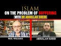

# Islam on the Problem of Suffering with Dr Abdullah Sueidi (2021-12-28)

## Description

Follow me on TikTok:
https://www.tiktok.com/@bloggingtheology?lang=en

Follow me on Twitter:
https://twitter.com/freemonotheist

You Can Support My Work on Patreon:
https://www.patreon.com/Bloggingtheology

My Paypal Link: 
https://www.paypal.com/paypalme/bloggingtheology?locale.x=en_GB

Chapters ::
0:00 - Introduction
0:17 - Background of Dr. Abdullah Sueidi
0:43 - Topic of the Discussion
1:00 - History of "The Problem of Evil"
2:14 - Atheists using the problem of evil as a central argument against God's existence
4:58 - History of the Argument of the problem of evil as presented by Atheists/Agnostics
9:26 - The Logical Problem of Evil
14:18 - The Evidential Problem of Evil
17:07 - Subjective reasons for disbelief & reconciliation of faith with suffering
19:09 - Islamic response to the argument of Problem of Evil
23:54 - Arguments for the existence of God
30:46 - Human Vestigiality argument used by Darwinian Evolutions
33:40 - Attributes of God in Islam
39:51 - Judeo-Christian vs Islamic understanding of God's nature
45:40 - God's justice on the Day of Judgement
50:45 - Suffering of Kids & Worldly life vs Afterlife
53:22 - Fate of the people who've not heard about Islam
54:25 - Muslims striving to help the needy through Zakat and Sadaqah
56:36 - Suffering/evil posing a problem for Atheists
1:06:54 - Overview & Availability of Dr. Abdullah Sueidi's Ph.D. work to the general public
1:09:13 - Book Recommendations regarding the problem of evil
1:10:18 - Wrapping Up

## Summary of [Islam on the Problem of Suffering with Dr Abdullah Sueidi](https://www.youtube.com/watch?v=p2h4eTlwz1k)

*This summary is AI generated - there may be inaccuracies. *

### [00:00:00](https://www.youtube.com/watch?v=p2h4eTlwz1k&t=0) - [01:00:00](https://www.youtube.com/watch?v=p2h4eTlwz1k&t=3600)

In this YouTube video, Dr. Abdullah Sueidi discusses Islam's view of suffering. He explains that it is based on allah's knowledge, wisdom, and power, and that those who suffer will be rewarded in the afterlife. He also notes that some atheists claim that this doctrine conflicts with their beliefs about objective moral good and evil.

**[00:00:00](https://www.youtube.com/watch?v=p2h4eTlwz1k&t=0)** The problem of suffering has been discussed by philosophers and theologians for centuries, and is one of the most disputed arguments against the existence of God. Atheists and agnostics present this argument as a powerful reason to reject belief in God.
* **[00:05:00](https://www.youtube.com/watch?v=p2h4eTlwz1k&t=300)** The video discusses the problem of evil, arguing that it is logically incoherent to believe in a god that is all-loving and omniscient and also suffers. Atheists have responded to this argument by stating that there is no point in suffering of a specific kind.
* **[00:10:00](https://www.youtube.com/watch?v=p2h4eTlwz1k&t=600)** The video discusses the problem of evil, and argues that it does not present a logical problem because there are reasons why God permits suffering to exist. William Rowe, an atheist philosopher, refutes this argument.
* **[00:15:00](https://www.youtube.com/watch?v=p2h4eTlwz1k&t=900)** Dr. Abdullah Sueidi discusses how subjective arguments against the existence of a creator can be used to negate belief in a creator. He goes on to say that these arguments are not logical or rational, but have a powerful emotional impact nonetheless. He stresses the importance of showing people that this is not an argument against the existence of a creator, but against certain attributes of a creator.
* **[00:20:00](https://www.youtube.com/watch?v=p2h4eTlwz1k&t=1200)** The atheist argument that suffering does not have a reason or wisdom behind it is called a "no-seem argument." The video argues that this argument is flawed, as humans are naturally inclined to believe in God.
* **[00:25:00](https://www.youtube.com/watch?v=p2h4eTlwz1k&t=1500)** The Islamic faith believes that everything in the universe was created by God, and that there are several proofs supporting this argument. One of these is the fine tuning of the universe. Another is the design of animals, which scientists can see and study. Finally, the Islamic faith believes that the universe was created in a specific way for a specific purpose. These proofs and arguments are becoming more and more evident with each passing day, and those who do not believe in God are missing out on an important part of reality.
* **[00:30:00](https://www.youtube.com/watch?v=p2h4eTlwz1k&t=1800)** discusses the arguments of atheists who claim that there is no wisdom behind the existence of suffering in the world. He points out that there are many attributes of God that Muslims can focus on, such as al-Hakeem, or the wisdom behind everything that God does. Additionally, henotes that allah azza can also be angry and punish.
* **[00:35:00](https://www.youtube.com/watch?v=p2h4eTlwz1k&t=2100)** discusses Islam's view of suffering, explaining that it is based on allah's knowledge, wisdom, and power. It goes on to say that, while a Muslim should not try to understand everything, they should have humility in the face of what they don't know.
* **[00:40:00](https://www.youtube.com/watch?v=p2h4eTlwz1k&t=2400)** According to Professor Jonathan Brown, there is no problem of evil in Islam, as it is simply a part of life. Muslims believe that prophets such as Habakkuk experienced hardship and suffering. This is in contrast to many Judeo-Christians, who see hardship and suffering as a sign that God is not listening or is against them.
* **[00:45:00](https://www.youtube.com/watch?v=p2h4eTlwz1k&t=2700)** Islam teaches that people will be rewarded for their sufferings in this life, and that on the day of judgement, everyone will be judged fairly. This is important to remember when experiencing hardship, as it will help ease the pain.
* **[00:50:00](https://www.youtube.com/watch?v=p2h4eTlwz1k&t=3000)** Islam teaches that those who suffer will receive a greater reward in the afterlife, and that even children who do not know about Islam can go to paradise. Some atheists claim that because Muslims do not punish those who do not know about their religion, Islam is a terrorist religion. However, the Qur'an teaches that Allah will punish those who reject His messages.
* **[00:55:00](https://www.youtube.com/watch?v=p2h4eTlwz1k&t=3300)** Islam teaches that suffering is a part of this world, and that atheists should help alleviate suffering wherever they find it. However, some atheists argue that this doctrine conflicts with their beliefs about objective moral good and evil.
### [01:00:00](https://www.youtube.com/watch?v=p2h4eTlwz1k&t=3600) - [01:10:00](https://www.youtube.com/watch?v=p2h4eTlwz1k&t=4200)

Dr. Abdullah Sueidi discusses how there is no good or evil in an atheistic worldview, and how this can lead to a lack of comfort in the face of suffering. He goes on to say that this lack of comfort is a sign that there is something wrong with the atheist's worldview. recommends Muslims read books on the topic of suffering in order to better understand it and cope with it.

**[01:00:00](https://www.youtube.com/watch?v=p2h4eTlwz1k&t=3600)** Dr. Abdullah Sueidi discusses how there is no good or evil in an atheistic worldview, and how this can lead to a lack of comfort in the face of suffering. He goes on to say that this lack of comfort is a sign that there is something wrong with the atheist's worldview.
* **[01:05:00](https://www.youtube.com/watch?v=p2h4eTlwz1k&t=3900)** recommends Muslims read books on the topic of suffering in order to better understand it and cope with it. He mentions books on the topic written by Muslims and Christians, and concludes that the problem of suffering is not a problem for Muslims, but rather for atheists and other religious groups who preach a doctrine of nihilism.
* **[01:10:00](https://www.youtube.com/watch?v=p2h4eTlwz1k&t=4200)** Dr. Abdullah Sueidi discusses Islam's perspective on suffering and how it can be overcome. He also provides a brief introduction to his channel and praises Allah for all of the struggles His believers endure.

<h2>Full transcript with timestamps: CLICK TO EXPAND</h2>

[0:00:02](https://youtu.be/p2h4eTlwz1k?t=2) Hello everyone and welcome to Blogging 
theology. Today I am delighted to talk to    
[0:00:09](https://youtu.be/p2h4eTlwz1k?t=9) Dr Abdullah Sueidi - you are most welcome Sir! 
Thank you very much it's very nice to be here.    
[0:00:17](https://youtu.be/p2h4eTlwz1k?t=17) Now Dr Abdullah Sueidi is a Swedish convert to 
Islam who holds a PhD in Islamic theology and    
[0:00:26](https://youtu.be/p2h4eTlwz1k?t=26) is a specialist in topics related to atheism. He 
has been teaching in al-Masjid an-Nabawi and the    
[0:00:34](https://youtu.be/p2h4eTlwz1k?t=34) Islamic University in Medinah and has been active 
in teaching Islam in sweden for over 15 years,    
[0:00:42](https://youtu.be/p2h4eTlwz1k?t=42) and Dr Abdullah has kindly agreed to give us an 
Islamic perspective on the problem of suffering.    
[0:00:49](https://youtu.be/p2h4eTlwz1k?t=49) This is an issue that has come up in recent 
discussions on Blogging Theology and has    
[0:00:54](https://youtu.be/p2h4eTlwz1k?t=54) been discussed by mankind since time immemorial 
anyway so i'm just wondering Dr Abdullah    
[0:01:00](https://youtu.be/p2h4eTlwz1k?t=60) if you could perhaps tell us a bit about the 
history of the problem of suffering and evil    
[0:01:06](https://youtu.be/p2h4eTlwz1k?t=66) and when the theological and philosophical 
discussions about the subject started. Yes    
[0:01:14](https://youtu.be/p2h4eTlwz1k?t=74) thank you very much. What is called today the 
problem of suffering or evil that some people    
[0:01:21](https://youtu.be/p2h4eTlwz1k?t=81) think is a really a problem I think it's 
one of the most heated top subjects in    
[0:01:28](https://youtu.be/p2h4eTlwz1k?t=88) the atheist thesis debate i think there are 
many reasons for that one of the reasons    
[0:01:34](https://youtu.be/p2h4eTlwz1k?t=94) is that every human reflecting human being that 
is like reflecting about his existence and so on    
[0:01:42](https://youtu.be/p2h4eTlwz1k?t=102) is thinking about the suffering and evil in 
the world so and i think this is something that    
[0:01:48](https://youtu.be/p2h4eTlwz1k?t=108) has been around for all of history. It's not 
only theists it's like every reflecting person    
[0:01:56](https://youtu.be/p2h4eTlwz1k?t=116) atheist, theist, polytheist, monotheist, anyone are 
thinking about these issues so I think it's    
[0:02:03](https://youtu.be/p2h4eTlwz1k?t=123) something from human nature to think about 
this these existential questions and also    
[0:02:09](https://youtu.be/p2h4eTlwz1k?t=129) we can see that the problem of evil that they 
call it the problem of evil it's one of the    
[0:02:16](https://youtu.be/p2h4eTlwz1k?t=136) most widespread arguments that atheists use 
against the belief in God. The American professor    
[0:02:22](https://youtu.be/p2h4eTlwz1k?t=142) of philosophy Michael Tully said that this is 
the central argument for atheism and also another    
[0:02:28](https://youtu.be/p2h4eTlwz1k?t=148) professor uh his philosophy Ronald Nash said 
that arguments appear and disappear about God's    
[0:02:36](https://youtu.be/p2h4eTlwz1k?t=156) existence or against God's existence but almost 
all philosophers that he knows believes that the    
[0:02:42](https://youtu.be/p2h4eTlwz1k?t=162) most serious argument against God's existence is 
what they call the problem of evil and i think    
[0:02:49](https://youtu.be/p2h4eTlwz1k?t=169) that one of the reasons of that is that this is 
something that is close to every single person    
[0:02:55](https://youtu.be/p2h4eTlwz1k?t=175) that we can feel suffering in ourselves or we can 
see people around us that suffer or that we can    
[0:03:02](https://youtu.be/p2h4eTlwz1k?t=182) just switch on television and we can see suffering. 
So it's something that is really close to people    
[0:03:07](https://youtu.be/p2h4eTlwz1k?t=187) when it comes to some arguments that atheists 
use or some things that it is talk about like    
[0:03:15](https://youtu.be/p2h4eTlwz1k?t=195) say like Lawrence Krauss is speaking about a 
universe from nothing, talking about quantum    
[0:03:19](https://youtu.be/p2h4eTlwz1k?t=199) mechanics, and cosmology and so on most people 
doesn't really understand that these things so    
[0:03:25](https://youtu.be/p2h4eTlwz1k?t=205) it's kind of a non-issue for people when it comes 
to the problem of suffering is something that is    
[0:03:30](https://youtu.be/p2h4eTlwz1k?t=210) close to to all of us and something that people 
uh really reflect upon so this is a very important    
[0:03:41](https://youtu.be/p2h4eTlwz1k?t=221) topic to tackle and to speak about and this 
is something that philosophers and theologians    
[0:03:48](https://youtu.be/p2h4eTlwz1k?t=228) has been speaking about since way back 
we can find the this is one of the most    
[0:03:56](https://youtu.be/p2h4eTlwz1k?t=236) debated top topics today there's a bibliography 
uh called theodicy and annotated by bibliography    
[0:04:06](https://youtu.be/p2h4eTlwz1k?t=246) on the problem of evil 1960 to 1990 the author 
mentions thousands of books and articles about    
[0:04:15](https://youtu.be/p2h4eTlwz1k?t=255) these issues from theis and atheists 
when they refute each other and so on so    
[0:04:20](https://youtu.be/p2h4eTlwz1k?t=260) when some people come and say like they come 
with this argument and they think it's like    
[0:04:24](https://youtu.be/p2h4eTlwz1k?t=264) a knock-down argument like this is the first 
time that they proposed this argument against    
[0:04:29](https://youtu.be/p2h4eTlwz1k?t=269) the believers and so on it's something 
that's been debated for thousands of years    
[0:04:34](https://youtu.be/p2h4eTlwz1k?t=274) the thing of suffering and evil and it's been 
like hundreds or thousands of articles and    
[0:04:41](https://youtu.be/p2h4eTlwz1k?t=281) books has been written about this 
issue so it's not something new    
[0:04:45](https://youtu.be/p2h4eTlwz1k?t=285) and i think that the defenses against this problem 
are really really strong and inshallah we will uh    
[0:04:52](https://youtu.be/p2h4eTlwz1k?t=292) speak about that later today okay inshallah so 
uh before we get to that can we just clarify what    
[0:04:59](https://youtu.be/p2h4eTlwz1k?t=299) exactly do atheists and agnostics present as the 
argument of suffering and evil against the belief    
[0:05:07](https://youtu.be/p2h4eTlwz1k?t=307) in god what is the argument or the most common 
substantive argument they present do you think    
[0:05:12](https://youtu.be/p2h4eTlwz1k?t=312) uh just so we can understand like a bit of the 
history before that uh like i said philosophers    
[0:05:19](https://youtu.be/p2h4eTlwz1k?t=319) have been speaking about this issue since way 
back plato will discuss these issues in his book    
[0:05:24](https://youtu.be/p2h4eTlwz1k?t=324) the republic and some people today a lot of 
people today they attribute this problem to    
[0:05:31](https://youtu.be/p2h4eTlwz1k?t=331) one of the greek philosophers called epicurus 
but he probably never said that he never spoke    
[0:05:38](https://youtu.be/p2h4eTlwz1k?t=338) about this problem and it was actually david 
hume the scottish philosopher in 18th century    
[0:05:45](https://youtu.be/p2h4eTlwz1k?t=345) that attributed this uh problem to epicurus 
that was one of the greek philosophers so    
[0:05:52](https://youtu.be/p2h4eTlwz1k?t=352) uh the issue of speaking about the problem 
of evil like a problem or an argument against    
[0:06:00](https://youtu.be/p2h4eTlwz1k?t=360) the belief in god came up in the age of 
enlightenment and we can see that theologians    
[0:06:08](https://youtu.be/p2h4eTlwz1k?t=368) spoke about this issue before about suffering and 
how we can believe in in suffering and so on and    
[0:06:14](https://youtu.be/p2h4eTlwz1k?t=374) believe in god because justice and so on but it 
was not like an argument against the existence    
[0:06:20](https://youtu.be/p2h4eTlwz1k?t=380) of god until the age of enlightenment and 
it was one french philosopher that wrote  
[0:06:28](https://youtu.be/p2h4eTlwz1k?t=388) a book called historical and critical dictionary 
where he mentions this argument and then leibniz    
[0:06:38](https://youtu.be/p2h4eTlwz1k?t=398) one of the german philosophers responded to the 
book in his book theodicy and this is the first    
[0:06:47](https://youtu.be/p2h4eTlwz1k?t=407) time that they mentioned this word theodicy 
it means like the justice of god theo i see    
[0:06:54](https://youtu.be/p2h4eTlwz1k?t=414) uh and then david hugh mentioned this argument 
too but it was actually in the 20th century that    
[0:07:02](https://youtu.be/p2h4eTlwz1k?t=422) philosophers started to mention this argument 
as a kind of a logical argument against the    
[0:07:09](https://youtu.be/p2h4eTlwz1k?t=429) belief in god they in the age of enlightenment 
they discussed this problem or they took it up    
[0:07:15](https://youtu.be/p2h4eTlwz1k?t=435) and they spoke about it but it was in the 20th 
century when john mackie uh australian philosopher    
[0:07:21](https://youtu.be/p2h4eTlwz1k?t=441) mentioned this problem like in a logical form and 
this is what is called the logical problem of evil    
[0:07:30](https://youtu.be/p2h4eTlwz1k?t=450) so he said that it's impossible or it's incoherent 
to believe in a god that is uh all loving    
[0:07:40](https://youtu.be/p2h4eTlwz1k?t=460) or omniscient and omnipotent and to believe in 
suffering he said this is uh it's incoherent you    
[0:07:47](https://youtu.be/p2h4eTlwz1k?t=467) can't believe in both at the same time wow that's 
a very strong wrong claim isn't it not just saying    
[0:07:52](https://youtu.be/p2h4eTlwz1k?t=472) it's a difficulty a challenge you're 
saying it's logically coherent it's    
[0:07:56](https://youtu.be/p2h4eTlwz1k?t=476) it's actually not possible a thinking 
person to have this belief then wow yeah    
[0:08:01](https://youtu.be/p2h4eTlwz1k?t=481) and this logical problem uh like i will say later 
on uh it was actually atheist philosophers like    
[0:08:08](https://youtu.be/p2h4eTlwz1k?t=488) william rowe that refuted him and he said 
that no it's not incoherent to say that    
[0:08:13](https://youtu.be/p2h4eTlwz1k?t=493) it's not incoherent to believe in that some 
sufferings can uh can occur and we believe in a    
[0:08:20](https://youtu.be/p2h4eTlwz1k?t=500) that you believe in a god that is only 
pondered omniscient and all loving    
[0:08:25](https://youtu.be/p2h4eTlwz1k?t=505) he spoke about what is called 
the evidential problem of evil    
[0:08:29](https://youtu.be/p2h4eTlwz1k?t=509) immense suffering or surplus suffering or a great 
immense of specific kind of suffering that he    
[0:08:37](https://youtu.be/p2h4eTlwz1k?t=517) believes that there is no point of that kind of 
suffering and this is actually usually what uh    
[0:08:43](https://youtu.be/p2h4eTlwz1k?t=523) the atheists are speaking about today uh usually 
uh when we saw the the discussion with dr bart    
[0:08:50](https://youtu.be/p2h4eTlwz1k?t=530) ehrman and dr brown they were speaking about 
this issue he was speaking about this issue like    
[0:08:55](https://youtu.be/p2h4eTlwz1k?t=535) okay what about kids suffering what about this and 
what about that and i think that uh dr bart ehrman    
[0:09:04](https://youtu.be/p2h4eTlwz1k?t=544) understands that you can believe in god at the 
same time that you can believe in some kind of    
[0:09:09](https://youtu.be/p2h4eTlwz1k?t=549) suffering but they're speaking about specific 
kinds of suffering and this is what is called    
[0:09:14](https://youtu.be/p2h4eTlwz1k?t=554) the evidential problem of evil and it was 
one of the philosophers called william rowe    
[0:09:22](https://youtu.be/p2h4eTlwz1k?t=562) that mentioned the problem so if we look at the 
logical problem of evil what we actually say is    
[0:09:30](https://youtu.be/p2h4eTlwz1k?t=570) if an omnipotent omni benevolent and 
omniscient god exist then evil does not    
[0:09:37](https://youtu.be/p2h4eTlwz1k?t=577) just doctor just about a question of language 
there omnipotence so we're talking about an    
[0:09:42](https://youtu.be/p2h4eTlwz1k?t=582) all-powerful that means powerful yeah and what was 
the other word benevolent all good uh all loving  
[0:09:58](https://youtu.be/p2h4eTlwz1k?t=598) so just to clarify the language there thank you 
yeah so they they speak about three attributes of    
[0:10:02](https://youtu.be/p2h4eTlwz1k?t=602) god and that he has power everything and that 
he is good and at the same time that he knows    
[0:10:08](https://youtu.be/p2h4eTlwz1k?t=608) everything he said if there is such uh god then 
evil does not exist you can't have the same at the    
[0:10:17](https://youtu.be/p2h4eTlwz1k?t=617) you can have both of the at the same time and 
then he said there is even in the world therefore    
[0:10:23](https://youtu.be/p2h4eTlwz1k?t=623) an omnipotent of the benevolent and omniscient 
god does not exist so this is the kind of    
[0:10:30](https://youtu.be/p2h4eTlwz1k?t=630) logical uh formula for for for the logical problem 
of of evil and uh this is uh quite strange that    
[0:10:39](https://youtu.be/p2h4eTlwz1k?t=639) you can say that because the first the first point 
that is making that it's impossible to believe    
[0:10:44](https://youtu.be/p2h4eTlwz1k?t=644) in all good and all-powerful and omniscient 
god and believing in evil at the same time    
[0:10:51](https://youtu.be/p2h4eTlwz1k?t=651) it's a claim he makes this claim but if you 
believe that allah or god is hakeem all wise    
[0:10:58](https://youtu.be/p2h4eTlwz1k?t=658) that he has reasons he has wisdoms for things that 
he create and something can seem to be bad at the    
[0:11:05](https://youtu.be/p2h4eTlwz1k?t=665) first time and then good things can come out 
of them and so on then the whole first sentence    
[0:11:15](https://youtu.be/p2h4eTlwz1k?t=675) outline it like that having some 
familiarity with the what the quran says    
[0:11:19](https://youtu.be/p2h4eTlwz1k?t=679) it does strike me as an odd argument uh without 
anticipating your point but it's not something is    
[0:11:24](https://youtu.be/p2h4eTlwz1k?t=684) obviously a problem from from the muslim point of 
view anyway no no and uh william rowe uh when he    
[0:11:30](https://youtu.be/p2h4eTlwz1k?t=690) wrote about this issue he said to say that 
something is incoherent it's you have to have    
[0:11:37](https://youtu.be/p2h4eTlwz1k?t=697) two statements that go against one each other so 
you say that elizabeth is taller than five foot    
[0:11:43](https://youtu.be/p2h4eTlwz1k?t=703) and elizabeth it's not taller than five foot you 
can't have the same at the same time you either    
[0:11:49](https://youtu.be/p2h4eTlwz1k?t=709) say that i have a computer in front of me or i 
don't have a computer in front of me you can't    
[0:11:53](https://youtu.be/p2h4eTlwz1k?t=713) have this uh both at the same time but he 
says that you can also say two statements    
[0:12:00](https://youtu.be/p2h4eTlwz1k?t=720) that might not appear to contradict one another 
but you have to add a third sentence to make them    
[0:12:07](https://youtu.be/p2h4eTlwz1k?t=727) incoherent so he said like an example this thing 
is red and it it's not colored at the same time so    
[0:12:15](https://youtu.be/p2h4eTlwz1k?t=735) you have to add a third sentence to say everything 
that is red is also colored and then it becomes uh    
[0:12:22](https://youtu.be/p2h4eTlwz1k?t=742) incoherent sentence so he says now if you look 
at the statement that uh mackie is talking about    
[0:12:33](https://youtu.be/p2h4eTlwz1k?t=753) then uh it's not contradictory because if you 
add this sentence what he is trying to add here    
[0:12:41](https://youtu.be/p2h4eTlwz1k?t=761) is to say that if god would exist 
and he would prevent all of evil but    
[0:12:49](https://youtu.be/p2h4eTlwz1k?t=769) you can just refute that by saying that god can 
create things in the world and have different uh    
[0:12:54](https://youtu.be/p2h4eTlwz1k?t=774) reasons or different kind of wisdoms begging 
the question isn't it he seems to be there's    
[0:13:00](https://youtu.be/p2h4eTlwz1k?t=780) an assumption there that's not stated explicitly 
you're making explicit and saying hang on actually    
[0:13:07](https://youtu.be/p2h4eTlwz1k?t=787) there may be reasons why god permits your will 
suffering to exist and therefore there's not a    
[0:13:12](https://youtu.be/p2h4eTlwz1k?t=792) incoherence or contradictoryness in there yes 
that's the whole thing and the the funny thing    
[0:13:17](https://youtu.be/p2h4eTlwz1k?t=797) is that john mc himself in his latest book that 
he wrote the miracle of theism he actually quoted    
[0:13:25](https://youtu.be/p2h4eTlwz1k?t=805) and said that the problem of evil does not 
after all show that the central doctrines    
[0:13:31](https://youtu.be/p2h4eTlwz1k?t=811) of theism are logically inconsistent with one 
another so this is the last book that he wrote    
[0:13:37](https://youtu.be/p2h4eTlwz1k?t=817) and it was published one year after his death 
and uh like i said william rowan is an atheist    
[0:13:43](https://youtu.be/p2h4eTlwz1k?t=823) philosopher he refuted that so the logical 
problem of evil is refuted by the author himself    
[0:13:50](https://youtu.be/p2h4eTlwz1k?t=830) and by other atheist philosophers so we don't 
really need to refute that argument and you can    
[0:13:58](https://youtu.be/p2h4eTlwz1k?t=838) still see that some atheists today they come and 
say oh we have the logical problem or evil one two    
[0:14:03](https://youtu.be/p2h4eTlwz1k?t=843) three epicurus said wow and so on but it's not 
an issue anymore it's it's dead in philosophy    
[0:14:10](https://youtu.be/p2h4eTlwz1k?t=850) the thing that they are speaking about today is 
the other kind of problem or evil that's called    
[0:14:15](https://youtu.be/p2h4eTlwz1k?t=855) the evidential problem of evil and the evidential 
problem of evil uh is uh it's a bit different it's    
[0:14:25](https://youtu.be/p2h4eTlwz1k?t=865) the the argument that william rowe proposed and 
he said that uh he's speaking about intense and    
[0:14:33](https://youtu.be/p2h4eTlwz1k?t=873) surplus and gracious suffering that he thinks that 
god could have prevented without thereby losing    
[0:14:39](https://youtu.be/p2h4eTlwz1k?t=879) some greater good or permitting some evil equally 
bad or worse so he's pointing at specific things    
[0:14:47](https://youtu.be/p2h4eTlwz1k?t=887) that he himself does not see to have any kind of 
we'll call in arabic hikmah any kind of wisdom    
[0:14:55](https://youtu.be/p2h4eTlwz1k?t=895) so why is this person uh suffering or why is this 
child suffering and so on and this argument can be    
[0:15:05](https://youtu.be/p2h4eTlwz1k?t=905) objective or subjective so if someone says this uh 
it's impossible to believe in god at the same time    
[0:15:16](https://youtu.be/p2h4eTlwz1k?t=916) then this is kind it's a form of the logical 
argument that was speaking of before but someone    
[0:15:20](https://youtu.be/p2h4eTlwz1k?t=920) can say i don't i can't believe in god because 
of this and that and this is actually what dr    
[0:15:27](https://youtu.be/p2h4eTlwz1k?t=927) ehrman said jesus he did not speak about uh 
you can't believe in god this is a knock down    
[0:15:34](https://youtu.be/p2h4eTlwz1k?t=934) argument against the belief in god he was 
speaking about his subjective feelings right comes    
[0:15:41](https://youtu.be/p2h4eTlwz1k?t=941) this argument and actually in his own book 
that he wrote about the the problem of evil    
[0:15:48](https://youtu.be/p2h4eTlwz1k?t=948) he said that his wife is a believing christian 
and she does not think that the problem of evil    
[0:15:56](https://youtu.be/p2h4eTlwz1k?t=956) is a problem for her faith but he believes that so 
this is his belief his subjective belief so it's    
[0:16:06](https://youtu.be/p2h4eTlwz1k?t=966) he can go and say like i can't believe 
in god like that and i believe i can say    
[0:16:11](https://youtu.be/p2h4eTlwz1k?t=971) but i can believe in the god like that so 
it's just a subjective kind of discussion    
[0:16:15](https://youtu.be/p2h4eTlwz1k?t=975) it's not an objective argument against the 
belief of god and we can actually see that  
[0:16:24](https://youtu.be/p2h4eTlwz1k?t=984) yeah just to say that although i see your point 
it's not a logical rational philosophical argument    
[0:16:30](https://youtu.be/p2h4eTlwz1k?t=990) nevertheless it has does it not rhetorical 
force it has horrible power so you you can    
[0:16:36](https://youtu.be/p2h4eTlwz1k?t=996) emotional it's emotional express his outrage 
and you can see the way he was um uh responding    
[0:16:44](https://youtu.be/p2h4eTlwz1k?t=1004) to dr brown on this issue he was clearly 
almost angry he was very agitated and upset    
[0:16:51](https://youtu.be/p2h4eTlwz1k?t=1011) and that was the power of the argument it wasn't 
intellectual it was emotional um but nevertheless    
[0:16:58](https://youtu.be/p2h4eTlwz1k?t=1018) as human beings that is a powerful reality 
it's not just a non-intellectual point it's    
[0:17:04](https://youtu.be/p2h4eTlwz1k?t=1024) a powerful reality nonetheless yes and people can 
have subjective subjective reasons for unbelief    
[0:17:11](https://youtu.be/p2h4eTlwz1k?t=1031) you can have someone that say i can't believe in 
islam because in islam it's forbidden to drink    
[0:17:17](https://youtu.be/p2h4eTlwz1k?t=1037) alcohol and eat pork and i love whiskey and eat 
bacon so it's impossible for me to believe in    
[0:17:22](https://youtu.be/p2h4eTlwz1k?t=1042) god if this is so this is a subjective reason for 
him for not believing in god but you can't really    
[0:17:29](https://youtu.be/p2h4eTlwz1k?t=1049) use it as a down argument against the 
belief in god and i think that most    
[0:17:34](https://youtu.be/p2h4eTlwz1k?t=1054) people that really speak about the problem eve 
today they're speaking about it in this way    
[0:17:40](https://youtu.be/p2h4eTlwz1k?t=1060) but they're doing it in some kind of objective 
way so they're trying to convince others to and    
[0:17:46](https://youtu.be/p2h4eTlwz1k?t=1066) that's why they become a bit like angry with other 
people when they're speaking about it and so on    
[0:17:51](https://youtu.be/p2h4eTlwz1k?t=1071) but it's really a subjective feeling 
that people have against uh belief so uh    
[0:18:01](https://youtu.be/p2h4eTlwz1k?t=1081) but we can see that billions of people around the 
world uh throughout history uh could reconcile    
[0:18:09](https://youtu.be/p2h4eTlwz1k?t=1089) this thing because suffering is not something new 
and people know that allah azzawajal oh god is  
[0:18:18](https://youtu.be/p2h4eTlwz1k?t=1098) all loving and all the seeing and all-knowing 
and so on this is not something new so    
[0:18:24](https://youtu.be/p2h4eTlwz1k?t=1104) people throughout the ages were able 
to reconcile between these things so    
[0:18:29](https://youtu.be/p2h4eTlwz1k?t=1109) when people are speaking about it today they're 
speaking about okay i can't believe in this thing    
[0:18:34](https://youtu.be/p2h4eTlwz1k?t=1114) but you can see that billions 
of people around the world can    
[0:18:38](https://youtu.be/p2h4eTlwz1k?t=1118) believe in that so when you speak about like in 
some debates like when you're speaking to dr uh    
[0:18:44](https://youtu.be/p2h4eTlwz1k?t=1124) dr brown and he's saying like how can you it was 
like like dr brown is the only one in the world    
[0:18:50](https://youtu.be/p2h4eTlwz1k?t=1130) believing in that it's like no a couple of 
billions of other people believes in that too so    
[0:18:57](https://youtu.be/p2h4eTlwz1k?t=1137) it's more that you speak about your own emotions 
about these things about suffering and so on    
[0:19:01](https://youtu.be/p2h4eTlwz1k?t=1141) that people can't really see the wisdoms behind 
this and that okay well the next question then    
[0:19:08](https://youtu.be/p2h4eTlwz1k?t=1148) inevitably becomes how can a muslim respond to the 
argument of evil and suffering presented by these    
[0:19:16](https://youtu.be/p2h4eTlwz1k?t=1156) atheists and agnostics um yeah it's very important 
to to show first that this is not really an    
[0:19:24](https://youtu.be/p2h4eTlwz1k?t=1164) argument against the existence of a creator 
it's an argument against some of the creators    
[0:19:35](https://youtu.be/p2h4eTlwz1k?t=1175) attributes so if someone said no i can't 
believe in this and this and that it    
[0:19:41](https://youtu.be/p2h4eTlwz1k?t=1181) doesn't exclude the belief in a in a creator 
that's the first thing and the second thing is    
[0:19:47](https://youtu.be/p2h4eTlwz1k?t=1187) it's really that they took three of god's 
attributes and they said no i can't it's    
[0:19:53](https://youtu.be/p2h4eTlwz1k?t=1193) like one plus one plus one i can have i can't 
believe in these three attributes at the same time    
[0:19:59](https://youtu.be/p2h4eTlwz1k?t=1199) but if you want to speak about this issue you 
have to understand the whole picture right    
[0:20:04](https://youtu.be/p2h4eTlwz1k?t=1204) understand the whole picture how we really believe 
in god we don't believe that god only have three    
[0:20:11](https://youtu.be/p2h4eTlwz1k?t=1211) attributes we believe that god have more than 
three attributes and if you can see the whole    
[0:20:16](https://youtu.be/p2h4eTlwz1k?t=1216) picture and how we look at the whole world and how 
we look about uh next world and so on then you can    
[0:20:24](https://youtu.be/p2h4eTlwz1k?t=1224) see that just taking this argument uh outside uh 
it's a bit of a problem and i can say that this    
[0:20:32](https://youtu.be/p2h4eTlwz1k?t=1232) argument that they're using is what is called a 
no-seem argument and it's to say that if i can't    
[0:20:40](https://youtu.be/p2h4eTlwz1k?t=1240) see this thing then it doesn't exist so what 
they really say is i myself can't see any real    
[0:20:47](https://youtu.be/p2h4eTlwz1k?t=1247) reason or wisdom behind such and such suffering 
so because of that there is no wisdom behind it    
[0:20:57](https://youtu.be/p2h4eTlwz1k?t=1257) this is if you break it down this is actually 
what they say i can't see any wisdom behind the    
[0:21:03](https://youtu.be/p2h4eTlwz1k?t=1263) suffering in this and this and that or this war or 
this star starvation and so on and because of that    
[0:21:12](https://youtu.be/p2h4eTlwz1k?t=1272) there is no reason or there is no system so 
using nons no cm arguments uh can be good    
[0:21:20](https://youtu.be/p2h4eTlwz1k?t=1280) sometimes if you don't have eye problems uh you 
can see and you look at the right place so if    
[0:21:29](https://youtu.be/p2h4eTlwz1k?t=1289) i go to my refrigerator now and i don't have any 
problem with my eyes and so on and i go and look    
[0:21:35](https://youtu.be/p2h4eTlwz1k?t=1295) there and i don't see any bottle of milk then i 
can conclude from that there is no bottle of milk    
[0:21:42](https://youtu.be/p2h4eTlwz1k?t=1302) there but if i was not able to see and then 
i can't use this argument and if i'm looking    
[0:21:50](https://youtu.be/p2h4eTlwz1k?t=1310) at the wrong places i can't see this too so 
if i would say no i looked at the refrigerator    
[0:21:57](https://youtu.be/p2h4eTlwz1k?t=1317) and i did not see any bottle of milk so there 
are no bottle of milks in the whole world    
[0:22:02](https://youtu.be/p2h4eTlwz1k?t=1322) no you just look at the refrigerator yeah 
you can't speak about the whole world you    
[0:22:06](https://youtu.be/p2h4eTlwz1k?t=1326) just look at one place you have to look at all 
of the things at the same time and i think that    
[0:22:13](https://youtu.be/p2h4eTlwz1k?t=1333) this is actually one of the problems here 
with the atheists because i think that    
[0:22:19](https://youtu.be/p2h4eTlwz1k?t=1339) first of all they're not able to see and they're 
not looking at the rate or the right place    
[0:22:26](https://youtu.be/p2h4eTlwz1k?t=1346) and i don't want to offend anyone but 
when i say that they're not able to see    
[0:22:31](https://youtu.be/p2h4eTlwz1k?t=1351) uh it's because if you don't believe in the 
creator first you don't believe in the existence    
[0:22:36](https://youtu.be/p2h4eTlwz1k?t=1356) of the creator then of course you will not see 
the wisdoms of the creator because you don't    
[0:22:42](https://youtu.be/p2h4eTlwz1k?t=1362) believe in his existence you have to believe in 
his existence first and then you can believe in    
[0:22:48](https://youtu.be/p2h4eTlwz1k?t=1368) his attributes or something of his wisdoms and 
so on so i think it's really a problem here    
[0:22:55](https://youtu.be/p2h4eTlwz1k?t=1375) that they don't see uh allah azza mentions this 
in the quran about non-believers when he said  
[0:23:05](https://youtu.be/p2h4eTlwz1k?t=1385) they were not able to hear nor did they sit 
not see so allah is when he says this it's    
[0:23:10](https://youtu.be/p2h4eTlwz1k?t=1390) not that they were blind they couldn't see 
things around them but they did not use their    
[0:23:16](https://youtu.be/p2h4eTlwz1k?t=1396) side in the right way so if we look at this 
issue the signs of the creator are everywhere    
[0:23:27](https://youtu.be/p2h4eTlwz1k?t=1407) all over the place at the same time the atheists 
say no i don't see any evidence of of the creator    
[0:23:34](https://youtu.be/p2h4eTlwz1k?t=1414) so if they can't see the evidences and all of 
the signs and all of the things that point to    
[0:23:40](https://youtu.be/p2h4eTlwz1k?t=1420) the creator how can we expect from them that they 
will see the wisdoms of the creator they miss the    
[0:23:48](https://youtu.be/p2h4eTlwz1k?t=1428) whole point they missed the the thing that is 
all around them all over the world like we have    
[0:23:53](https://youtu.be/p2h4eTlwz1k?t=1433) i would just mention uh four uh short arguments 
about uh for the existence of god you have the    
[0:24:00](https://youtu.be/p2h4eTlwz1k?t=1440) fit for the argument it's like allah inside of us 
uh a natural dispositional inclination to believe    
[0:24:09](https://youtu.be/p2h4eTlwz1k?t=1449) in him so we have it inside of our souls it's 
actually when philosophers today speak about    
[0:24:16](https://youtu.be/p2h4eTlwz1k?t=1456) humans some of them said that we shouldn't call 
humans homo sapiens we should call them homo    
[0:24:21](https://youtu.be/p2h4eTlwz1k?t=1461) religious because it's a part of human nature to 
believe in god and this is actually one of the    
[0:24:27](https://youtu.be/p2h4eTlwz1k?t=1467) famous oxford studies that justin barrett the 
professor of uh psychology and other professors    
[0:24:35](https://youtu.be/p2h4eTlwz1k?t=1475) made in oxford university and other universities 
and they concluded from many evidences that belief    
[0:24:43](https://youtu.be/p2h4eTlwz1k?t=1483) in god is part of human nature and this is what we 
as muslims believe in the future the prophet saws  
[0:24:51](https://youtu.be/p2h4eTlwz1k?t=1491) or every newborn baby is born on fitra we 
have this thing inside of us so the belief    
[0:24:57](https://youtu.be/p2h4eTlwz1k?t=1497) is actually inside of us we don't you have 
people that never studied theology never    
[0:25:04](https://youtu.be/p2h4eTlwz1k?t=1504) studied philosophy never studied these rational 
arguments but they had a very firm belief in god    
[0:25:11](https://youtu.be/p2h4eTlwz1k?t=1511) and i actually think that most people around 
the world never really studied theology    
[0:25:15](https://youtu.be/p2h4eTlwz1k?t=1515) and never really um studied the philosophical 
argument but they believe in god and they have    
[0:25:22](https://youtu.be/p2h4eTlwz1k?t=1522) strong faith in god because of what they felt 
so we have the iman inside of us and then uh    
[0:25:31](https://youtu.be/p2h4eTlwz1k?t=1531) the second argument argument of create creation 
uh that everything that is creator created needs    
[0:25:39](https://youtu.be/p2h4eTlwz1k?t=1539) a creator and this whole universe and everything 
inside it is created so and nothing is internal    
[0:25:46](https://youtu.be/p2h4eTlwz1k?t=1546) and this goes back to that it needs a creator 
so and we can speak about these arguments for    
[0:25:54](https://youtu.be/p2h4eTlwz1k?t=1554) a long while but it's a very compelling 
argument did you see like something    
[0:25:59](https://youtu.be/p2h4eTlwz1k?t=1559) that started to exist then it needs to have 
a creator and we can see that everything    
[0:26:06](https://youtu.be/p2h4eTlwz1k?t=1566) in the universe the whole universe itself 
started to exist so it has to have a creator    
[0:26:14](https://youtu.be/p2h4eTlwz1k?t=1574) and a third argument is the fine tuning argument 
that the creation like the universe and stars and    
[0:26:21](https://youtu.be/p2h4eTlwz1k?t=1581) planets and so on not only created but they're 
extremely fine tuned so this is something that    
[0:26:28](https://youtu.be/p2h4eTlwz1k?t=1588) we can reflect upon when we look in the 
skies and stars in the space allah says  
[0:26:39](https://youtu.be/p2h4eTlwz1k?t=1599) indeed in the creation of heavens and 
earth and the alternation of the day    
[0:26:43](https://youtu.be/p2h4eTlwz1k?t=1603) and night there are signs for people 
of reason and if we study science    
[0:26:49](https://youtu.be/p2h4eTlwz1k?t=1609) like astronomy and astrophysics and chemistry 
and so on we can also see all of these signs    
[0:26:55](https://youtu.be/p2h4eTlwz1k?t=1615) that really point to the extreme fine tuning on 
micro level and micro level on universal scale    
[0:27:05](https://youtu.be/p2h4eTlwz1k?t=1625) on atomic scale we can find the sign everywhere 
and this is and i think i just uh dr abdullah    
[0:27:14](https://youtu.be/p2h4eTlwz1k?t=1634) this argument is becoming even more impressive 
almost with each passing day as science uncovers    
[0:27:20](https://youtu.be/p2h4eTlwz1k?t=1640) and observes as you say at the micro level the 
very smallest incredible machinery in engineering    
[0:27:26](https://youtu.be/p2h4eTlwz1k?t=1646) we see and also the huge vast macro level the 
level of the universe and the laws of physics    
[0:27:31](https://youtu.be/p2h4eTlwz1k?t=1651) these disclose extraordinary design and it's 
not like we're becoming less obvious of that    
[0:27:37](https://youtu.be/p2h4eTlwz1k?t=1657) it's becoming ever more clear so the argument 
is becoming more and more powerful i think    
[0:27:42](https://youtu.be/p2h4eTlwz1k?t=1662) with each year as science uncovers more and 
more of the marvels and signs in the universe    
[0:27:47](https://youtu.be/p2h4eTlwz1k?t=1667) yes exactly and the thing is if you don't 
see that then there is something there's a    
[0:27:53](https://youtu.be/p2h4eTlwz1k?t=1673) problem with your site i don't say that you have 
a problem with seeing with your eyes but you have    
[0:27:58](https://youtu.be/p2h4eTlwz1k?t=1678) a problem with insight to understand that this 
all points to a creator and this is the argument    
[0:28:04](https://youtu.be/p2h4eTlwz1k?t=1684) i want to make that if you have problems to see 
this then of course you will have problems to see    
[0:28:09](https://youtu.be/p2h4eTlwz1k?t=1689) different wisdoms behind this and that of 
the creator because you don't even believe in    
[0:28:14](https://youtu.be/p2h4eTlwz1k?t=1694) in the creator so uh we can see the fine 
tuning everywhere in in universe and the    
[0:28:23](https://youtu.be/p2h4eTlwz1k?t=1703) fourth and last argument is the design argument 
and this is uh more about biology and allah azza    
[0:28:30](https://youtu.be/p2h4eTlwz1k?t=1710) mentions this in the quran many times for us to 
ponder reflect upon animals like the birds in    
[0:28:36](https://youtu.be/p2h4eTlwz1k?t=1716) the sky and the creation of the camels and human 
organs like eyes and lips and tongues and so on  
[0:28:48](https://youtu.be/p2h4eTlwz1k?t=1728) will show them our signs in the horizons and 
within themselves until it becomes clear to    
[0:28:54](https://youtu.be/p2h4eTlwz1k?t=1734) them that it is the truth and the thing that is 
pretty interesting here that you can even see that    
[0:29:03](https://youtu.be/p2h4eTlwz1k?t=1743) really stubborn uh darwinist atheists 
like richard dawkins when he's speaking    
[0:29:09](https://youtu.be/p2h4eTlwz1k?t=1749) about biology he said that he says that 
biology is the study of complicated things    
[0:29:14](https://youtu.be/p2h4eTlwz1k?t=1754) that have the appearance of being designed with 
a purpose so they can see they can see that    
[0:29:24](https://youtu.be/p2h4eTlwz1k?t=1764) all of these things in biology that they study    
[0:29:29](https://youtu.be/p2h4eTlwz1k?t=1769) appears to be designed uh for a purpose but 
because of their belief in darwinistic evolution    
[0:29:39](https://youtu.be/p2h4eTlwz1k?t=1779) they say it's an appearance but they can see 
it all around them and even the nobel prize    
[0:29:44](https://youtu.be/p2h4eTlwz1k?t=1784) winner uh and the discovered dna francis crick 
said biologists must constantly keep in mind    
[0:29:52](https://youtu.be/p2h4eTlwz1k?t=1792) that what they see was not designed but rather 
evolved because it's all in front of them they    
[0:29:59](https://youtu.be/p2h4eTlwz1k?t=1799) can see okay this is really the sign no no no 
wait yes it's evolved it's evolved you know so  
[0:30:10](https://youtu.be/p2h4eTlwz1k?t=1810) but the laws of physics are not evolved darwin 
has nothing to say about the laws of physics    
[0:30:15](https://youtu.be/p2h4eTlwz1k?t=1815) or the origin of life itself a biogenesis or the 
existence of consciousness or the big bang the big    
[0:30:21](https://youtu.be/p2h4eTlwz1k?t=1821) bang is not a product of darwinian evolution it 
is what it is uh even that argument only applies    
[0:30:27](https://youtu.be/p2h4eTlwz1k?t=1827) to a small faction of the universes yeah yeah but 
the thing is that they can see it in front of them    
[0:30:33](https://youtu.be/p2h4eTlwz1k?t=1833) they can see it in front of them at the same time 
they say no but yes and so on and uh here's one    
[0:30:40](https://youtu.be/p2h4eTlwz1k?t=1840) interesting thing when it comes to this thing of 
uh speaking about the wisdoms of god and so on one    
[0:30:45](https://youtu.be/p2h4eTlwz1k?t=1845) of the main arguments that people believing 
in darwinistic evolution today are using    
[0:30:50](https://youtu.be/p2h4eTlwz1k?t=1850) is what they call human vestigiality or 
rudimentary organs and when they were    
[0:30:56](https://youtu.be/p2h4eTlwz1k?t=1856) speaking about this issue about 100 years ago 
they mentioned about 200 different organs that    
[0:31:03](https://youtu.be/p2h4eTlwz1k?t=1863) they said okay this these organs have no purpose 
there's no wisdom behind them yeah they're just a    
[0:31:11](https://youtu.be/p2h4eTlwz1k?t=1871) byproduct of evolution and so on but when science 
developed they can say oh no this really actually    
[0:31:21](https://youtu.be/p2h4eTlwz1k?t=1881) has a wisdom oh oh we need it for this and 
needed for that and we need it for this    
[0:31:26](https://youtu.be/p2h4eTlwz1k?t=1886) and every single one of these rudimentary 
organs that you are speaking about has different    
[0:31:31](https://youtu.be/p2h4eTlwz1k?t=1891) functions and that might not be the function that 
scientists first thought that it was but they have    
[0:31:37](https://youtu.be/p2h4eTlwz1k?t=1897) functions and they were actually speaking you 
can see like one of the main issues they were    
[0:31:42](https://youtu.be/p2h4eTlwz1k?t=1902) speaking about in this century was what is called 
junk dna richard dawkins he mentions in his book    
[0:31:49](https://youtu.be/p2h4eTlwz1k?t=1909) great show on earth that it was published in 
2009 that 95 of dna has no function so it's    
[0:31:56](https://youtu.be/p2h4eTlwz1k?t=1916) junk dna and throughout research just the latest 
latest years they found out that 80 of this dna    
[0:32:08](https://youtu.be/p2h4eTlwz1k?t=1928) really has functions uh in the 
the scholars of the encode project    
[0:32:12](https://youtu.be/p2h4eTlwz1k?t=1932) and they say we will really i think that we will 
find out that hundred percent of dna really have    
[0:32:20](https://youtu.be/p2h4eTlwz1k?t=1940) functions so just in a couple of years to say 
no there is no wisdom with that there's no    
[0:32:26](https://youtu.be/p2h4eTlwz1k?t=1946) purpose there's no reason and then after 
a while you can see that there are reasons    
[0:32:32](https://youtu.be/p2h4eTlwz1k?t=1952) for that and there are purposes for that and 
there are wisdoms for that so we should not be  
[0:32:40](https://youtu.be/p2h4eTlwz1k?t=1960) like jump into things and say no there's no wisdom 
behind this war now or this conflict now this    
[0:32:47](https://youtu.be/p2h4eTlwz1k?t=1967) starvation you don't really know maybe you will 
see something after 10 years 20 years 100 years    
[0:32:53](https://youtu.be/p2h4eTlwz1k?t=1973) we don't have the whole picture our knowledge is 
limited but god's knowledge is encompassing god    
[0:33:02](https://youtu.be/p2h4eTlwz1k?t=1982) knows everything that was and is and will be so 
we're not really in the position to say that this    
[0:33:10](https://youtu.be/p2h4eTlwz1k?t=1990) and that does have a wisdom or does not have a 
wisdom so what you're really asking for is yeah    
[0:33:18](https://youtu.be/p2h4eTlwz1k?t=1998) it is some humility on the part of us as human 
beings as scientists when we encounter things    
[0:33:23](https://youtu.be/p2h4eTlwz1k?t=2003) we don't really understand not just to dismiss 
it as wastage or rubbish but actually say well    
[0:33:29](https://youtu.be/p2h4eTlwz1k?t=2009) maybe there's a wisdom built into nature and we 
should expect there to be an explanation one day    
[0:33:34](https://youtu.be/p2h4eTlwz1k?t=2014) and that of course is a sign of its created 
intelligence by by god of course but i just    
[0:33:39](https://youtu.be/p2h4eTlwz1k?t=2019) want to ask you you mentioned that earlier on 
the three attributes of god that are kind of    
[0:33:43](https://youtu.be/p2h4eTlwz1k?t=2023) pre-exclusively fastened on in this discussion 
but there are others particularly in the islamic    
[0:33:49](https://youtu.be/p2h4eTlwz1k?t=2029) tradition in the quran traditionally there are 99 
names of allah so what other attributes are there    
[0:33:55](https://youtu.be/p2h4eTlwz1k?t=2035) of god that muslims then um can uh focus on or 
relate or understand in a muslim response to the    
[0:34:04](https://youtu.be/p2h4eTlwz1k?t=2044) argument of evil and suffering uh as presented by 
these atheists yeah i think that uh one of the uh    
[0:34:13](https://youtu.be/p2h4eTlwz1k?t=2053) important attributes is like i said al hakeem that 
everything that allah does has a hikmah a wisdom    
[0:34:21](https://youtu.be/p2h4eTlwz1k?t=2061) and also that allah azza is not only loving 
and merciful he can also be angry and punish so    
[0:34:31](https://youtu.be/p2h4eTlwz1k?t=2071) some of the things that we can see can really 
be punishment from allah and it can also    
[0:34:38](https://youtu.be/p2h4eTlwz1k?t=2078) uh allah is a lot leaf so something can happen 
today and we might not understand the real    
[0:34:44](https://youtu.be/p2h4eTlwz1k?t=2084) reason and then after a long while allah 
azza will take up they take in front of us    
[0:34:50](https://youtu.be/p2h4eTlwz1k?t=2090) different kind of wisdoms and so on    
[0:34:53](https://youtu.be/p2h4eTlwz1k?t=2093) does that mean in english or yeah it has more 
than one uh more than one meaning uh in uh yeah    
[0:35:04](https://youtu.be/p2h4eTlwz1k?t=2104) one of the things is that allah is kind to his 
slaves and also that allah is or they can take out    
[0:35:10](https://youtu.be/p2h4eTlwz1k?t=2110) things after a while it's quite hard to to explain 
now but it's it's one of the things like if you    
[0:35:16](https://youtu.be/p2h4eTlwz1k?t=2116) look at the uh the story of yusuf alaihissalam uh 
in the end of the story he said in arabic so uh  
[0:35:29](https://youtu.be/p2h4eTlwz1k?t=2129) the whole story if you look at the story in the 
beginning and what they did to him and they his    
[0:35:34](https://youtu.be/p2h4eTlwz1k?t=2134) brothers throw in the world and so on and so 
on and so on then in the end what happened so    
[0:35:39](https://youtu.be/p2h4eTlwz1k?t=2139) if you look at the whole story if you look at 
the beginning oh this is suffering this is evil    
[0:35:45](https://youtu.be/p2h4eTlwz1k?t=2145) they are his brothers they're throwing him down 
and well and they're doing this and this and that    
[0:35:49](https://youtu.be/p2h4eTlwz1k?t=2149) but in the end what happened so you have to 
have the whole kind of story to understand uh    
[0:35:56](https://youtu.be/p2h4eTlwz1k?t=2156) this thing uh yeah so uh i think this is very 
very important that we uh have to understand    
[0:36:05](https://youtu.be/p2h4eTlwz1k?t=2165) first that our belief is based on evidences and 
arguments but there's a certain point that we also    
[0:36:16](https://youtu.be/p2h4eTlwz1k?t=2176) have to have faith in allah's hikmah and so we 
can say no we don't have blind faith in god no    
[0:36:26](https://youtu.be/p2h4eTlwz1k?t=2186) our faith is based on evidences and arguments 
uh like i mentioned the argument of creation    
[0:36:33](https://youtu.be/p2h4eTlwz1k?t=2193) argument five tuning and so on and we can 
understand from these arguments too that god have    
[0:36:39](https://youtu.be/p2h4eTlwz1k?t=2199) knowledge and wisdom and so power and so 
on but then when we understand this thing    
[0:36:47](https://youtu.be/p2h4eTlwz1k?t=2207) some things we have to stop we can say okay i 
don't really know about the wisdom i don't know    
[0:36:53](https://youtu.be/p2h4eTlwz1k?t=2213) why this person is suffering why this child this 
specific child is suffering but i believe in god    
[0:37:01](https://youtu.be/p2h4eTlwz1k?t=2221) that he has a wisdom behind that and i think that 
we have theorists we can mention different reasons    
[0:37:09](https://youtu.be/p2h4eTlwz1k?t=2229) and we can understand some things but i think if 
we go in to the micro level to try to understand    
[0:37:17](https://youtu.be/p2h4eTlwz1k?t=2237) everything i think this is a trap it's uh to 
try to understand every single wisdom behind    
[0:37:23](https://youtu.be/p2h4eTlwz1k?t=2243) every single thing it's like if someone 
is asking muslims okay why are you praying    
[0:37:30](https://youtu.be/p2h4eTlwz1k?t=2250) for are you not playing five uh okay the wisdom 
behind that is okay but why do you pray mahadev    
[0:37:37](https://youtu.be/p2h4eTlwz1k?t=2257) three raka you're going into a trap you should 
say no i believe in allah i believe in the wisdom    
[0:37:43](https://youtu.be/p2h4eTlwz1k?t=2263) of allah i believe in the knowledge of allah 
and i know that there are some wisdoms but    
[0:37:48](https://youtu.be/p2h4eTlwz1k?t=2268) i'm not quite sure maybe about this certain 
thing and i don't think that a muslim should    
[0:37:52](https://youtu.be/p2h4eTlwz1k?t=2272) be shy about saying this it's advocating is is is 
humility actually it's a humbleness uh before uh    
[0:38:02](https://youtu.be/p2h4eTlwz1k?t=2282) the unknown of what we don't know but it is known 
to one who is all wise and uh and so on so you're    
[0:38:08](https://youtu.be/p2h4eTlwz1k?t=2288) advocating humility which is a great virtue 
as well just generally we don't have to know    
[0:38:13](https://youtu.be/p2h4eTlwz1k?t=2293) everything we're not god god knows everything and 
a muslim submits to to god but i i'm just i have    
[0:38:19](https://youtu.be/p2h4eTlwz1k?t=2299) to just quite one of my one of the most striking 
verses in the quran second surah verse 155 you owe    
[0:38:25](https://youtu.be/p2h4eTlwz1k?t=2305) you who believe seek help through steadfastness 
and prayer for god is with the steadfast do not    
[0:38:31](https://youtu.be/p2h4eTlwz1k?t=2311) say that those who are killed in god's cause are 
dead they are alive though you do not realize it    
[0:38:38](https://youtu.be/p2h4eTlwz1k?t=2318) we shall certainly test you with fear and hunger 
and the loss of property lives and crops but    
[0:38:46](https://youtu.be/p2h4eTlwz1k?t=2326) give good news to those who are steadfast those 
who say when afflicted with calamity we belong to    
[0:38:52](https://youtu.be/p2h4eTlwz1k?t=2332) god and to him we shall return these will be given 
blessings and mercy from their lord and it is they    
[0:39:00](https://youtu.be/p2h4eTlwz1k?t=2340) who are rightly guided i think that i mean that 
as a as a summary amazing yeah and also the verse  
[0:39:11](https://youtu.be/p2h4eTlwz1k?t=2351) alone he is not asked about what he does 
but they would be asked so we should not ask    
[0:39:19](https://youtu.be/p2h4eTlwz1k?t=2359) allah why he does this and that 
but they should be asked and    
[0:39:23](https://youtu.be/p2h4eTlwz1k?t=2363) the whole discussion on that is made between 
allah azza and the angels so when they ask him    
[0:39:28](https://youtu.be/p2h4eTlwz1k?t=2368) why he create created human beings and so on they 
would create mischief on earth and he answered  
[0:39:37](https://youtu.be/p2h4eTlwz1k?t=2377) certainly i know what you do not know 
so if we have this basis in our religion    
[0:39:43](https://youtu.be/p2h4eTlwz1k?t=2383) and i think uh it's much easier to comprehend 
with specific things and i think that    
[0:39:51](https://youtu.be/p2h4eTlwz1k?t=2391) one of the reasons that atheists especially 
in the west that have been grown up in a judo    
[0:39:58](https://youtu.be/p2h4eTlwz1k?t=2398) judeo-christian environment is the whole rhetoric 
amongst uh christian preachers when they're saying    
[0:40:06](https://youtu.be/p2h4eTlwz1k?t=2406) that god is love god is there always emphasising 
on uh the love of god and not saying only that god    
[0:40:14](https://youtu.be/p2h4eTlwz1k?t=2414) is loving he is love yeah so if you speak about 
god in that way it's all god loves you god is    
[0:40:21](https://youtu.be/p2h4eTlwz1k?t=2421) like a heavenly father and you are his sons and he 
loves everyone he even loves the unbelievers and    
[0:40:28](https://youtu.be/p2h4eTlwz1k?t=2428) so on and then at the same time when you see that 
people are suffering immense suffering it's hard    
[0:40:35](https://youtu.be/p2h4eTlwz1k?t=2435) to reconcile them so i think it's it's kind of a 
trap when they are uh speaking that way about god    
[0:40:43](https://youtu.be/p2h4eTlwz1k?t=2443) and then uh the the atheist comes and say okay 
we can see this and this and that when muslims    
[0:40:51](https://youtu.be/p2h4eTlwz1k?t=2451) speak about god it's more like allahu akbar allah 
is greater than everything god knows everything  
[0:41:03](https://youtu.be/p2h4eTlwz1k?t=2463) he is not asked what he does and so on so 
when you have this kind of rhetoric and    
[0:41:07](https://youtu.be/p2h4eTlwz1k?t=2467) when you speak about god in that way i don't 
think that you really would have these kind of    
[0:41:12](https://youtu.be/p2h4eTlwz1k?t=2472) thoughts of the same way and that's where we can 
see that what they call today the problem of evil    
[0:41:21](https://youtu.be/p2h4eTlwz1k?t=2481) was not really a problem for muslims this morning 
i sat down with a brother and he's writing his phd    
[0:41:29](https://youtu.be/p2h4eTlwz1k?t=2489) on uh the problem of evil in islamic theology and 
he told me that he is going through the literature    
[0:41:37](https://youtu.be/p2h4eTlwz1k?t=2497) the books the old books of the the the self the 
old scholars and trying to see whether anyone    
[0:41:46](https://youtu.be/p2h4eTlwz1k?t=2506) that really thought that this was a problem 
and he said i didn't find anyone there was    
[0:41:52](https://youtu.be/p2h4eTlwz1k?t=2512) not a problem for them they were they were 
speaking about god and they saw sufferings    
[0:41:57](https://youtu.be/p2h4eTlwz1k?t=2517) and evils as a part of this dunya about this 
life this life is filled up it's a test for us    
[0:42:05](https://youtu.be/p2h4eTlwz1k?t=2525) so of course there will be suffering no one is 
like okay because of that i can't believe in    
[0:42:10](https://youtu.be/p2h4eTlwz1k?t=2530) god no it was just it's a part of life for them 
so professor jonathan brown uh said in a recent    
[0:42:17](https://youtu.be/p2h4eTlwz1k?t=2537) video he's a professor of islamic studies in the 
united states he's actually a muslim uh revert    
[0:42:24](https://youtu.be/p2h4eTlwz1k?t=2544) himself he says there's a very famous book in the 
west written by a jewish author it's been through    
[0:42:29](https://youtu.be/p2h4eTlwz1k?t=2549) so many additions called why do bad things happen 
to good people why do bad things happen to good    
[0:42:35](https://youtu.be/p2h4eTlwz1k?t=2555) people and he and this is hugely popular i read it 
years ago but um but he said in all his travels in    
[0:42:40](https://youtu.be/p2h4eTlwz1k?t=2560) bookshops around the muslim world he's never ever 
seen this book not even in one translation at all    
[0:42:46](https://youtu.be/p2h4eTlwz1k?t=2566) and he says this perhaps tells us something's 
going on here you know that this is not such a    
[0:42:51](https://youtu.be/p2h4eTlwz1k?t=2571) central crushing overwhelming existential 
problem for muslims as it clearly has been    
[0:42:57](https://youtu.be/p2h4eTlwz1k?t=2577) for many judeo-christians in the west yes and 
you can actually find like in the bible uh some    
[0:43:05](https://youtu.be/p2h4eTlwz1k?t=2585) verses where it's attributed to the prophets like 
habakkuk and so on when he's speaking to god uh    
[0:43:13](https://youtu.be/p2h4eTlwz1k?t=2593) why have you left me why don't you hear why can't 
you listen and even when they say jesus is saying  
[0:43:20](https://youtu.be/p2h4eTlwz1k?t=2600) why have you left me and so on and 
these kind of verses i think that    
[0:43:25](https://youtu.be/p2h4eTlwz1k?t=2605) it makes some people really think about these 
issues when you speak about god in this way so    
[0:43:31](https://youtu.be/p2h4eTlwz1k?t=2611) i think this is a part of the problem and i think 
when you have the whole the muslim theology and    
[0:43:38](https://youtu.be/p2h4eTlwz1k?t=2618) also the muslim world view how we look at life we 
don't look at this life as a hedonistic paradise    
[0:43:46](https://youtu.be/p2h4eTlwz1k?t=2626) that we should only strive for pleasure and this 
is it's only this life here we see that this life    
[0:43:54](https://youtu.be/p2h4eTlwz1k?t=2634) is created for us as a test and we're here to know 
our lord and to worship our lord and hardships and    
[0:44:04](https://youtu.be/p2h4eTlwz1k?t=2644) sufferings can really take people closer to allah 
and the prophet sallallahu alaihi wasallam said  
[0:44:15](https://youtu.be/p2h4eTlwz1k?t=2655) the people that was tested most were the prophets 
and then those who followed them and we can see    
[0:44:22](https://youtu.be/p2h4eTlwz1k?t=2662) that most of the followers of the prophets the 
former prophets and also the prophet muhammad    
[0:44:30](https://youtu.be/p2h4eTlwz1k?t=2670) were poor people and we can see that poor 
people suffering people are usually closer to    
[0:44:37](https://youtu.be/p2h4eTlwz1k?t=2677) religion than people that are wealthy 
and are healthy and so on allah says  
[0:44:50](https://youtu.be/p2h4eTlwz1k?t=2690) no but indeed man transgresses because 
he sees himself self-sufficient    
[0:44:57](https://youtu.be/p2h4eTlwz1k?t=2697) so when a person sees himself as self-sufficient    
[0:45:01](https://youtu.be/p2h4eTlwz1k?t=2701) i am healthy i have all this and uh i 
don't suffer then he comes away from allah    
[0:45:09](https://youtu.be/p2h4eTlwz1k?t=2709) abdullah what was that a quote from what you just 
read in arabic what was that a quote from indiana  
[0:45:24](https://youtu.be/p2h4eTlwz1k?t=2724) but indeed man transgresses because he 
sees himself self-sufficient so when people    
[0:45:30](https://youtu.be/p2h4eTlwz1k?t=2730) see themselves as self-sufficient yeah they don't 
have any hardships then they can go away from    
[0:45:38](https://youtu.be/p2h4eTlwz1k?t=2738) allah and also uh from the muslim worldview 
or how we look at life we believe that it's    
[0:45:45](https://youtu.be/p2h4eTlwz1k?t=2745) not just this life we live in an afterlife 
too and we believe that allah azzawajal is  
[0:45:53](https://youtu.be/p2h4eTlwz1k?t=2753) he is the judge that will 
judge people with justice so  
[0:46:06](https://youtu.be/p2h4eTlwz1k?t=2766) for the day of resurrection so no soul 
will be treated unjustly at all it's no    
[0:46:14](https://youtu.be/p2h4eTlwz1k?t=2774) kind of or oppression on that day    
[0:46:18](https://youtu.be/p2h4eTlwz1k?t=2778) because allah azzawajal will give every single 
soul what they deserve and allah also says  
[0:46:29](https://youtu.be/p2h4eTlwz1k?t=2789) that on the day of judgment it will be judged 
between them in truth and it will be said all    
[0:46:36](https://youtu.be/p2h4eTlwz1k?t=2796) praise to allah lord of all words so every single 
person on the day of judgement the believer and    
[0:46:43](https://youtu.be/p2h4eTlwz1k?t=2803) the non-believer will say alhamdulillah this is 
justice this every single soul will understand    
[0:46:52](https://youtu.be/p2h4eTlwz1k?t=2812) why this and that happened so uh when we see 
this and we can see that there will be justice    
[0:47:02](https://youtu.be/p2h4eTlwz1k?t=2822) and some people are suffering today but and some 
people are oppressing others and so on but in the    
[0:47:08](https://youtu.be/p2h4eTlwz1k?t=2828) next life allah azzawajal will uh judge between 
his uh slaves and yeah but that's important    
[0:47:17](https://youtu.be/p2h4eTlwz1k?t=2837) in the west uh and even actually if i'm to be 
brutally honest in many many christian churches    
[0:47:23](https://youtu.be/p2h4eTlwz1k?t=2843) this sense of the afterlife the next life the 
day of judgment where justice will be done is is    
[0:47:28](https://youtu.be/p2h4eTlwz1k?t=2848) pretty uh much missing and um i i've i've sat when 
i was a christian i've sat through sermons which    
[0:47:35](https://youtu.be/p2h4eTlwz1k?t=2855) are holy concerned with the dunya where 
there's no reference no awareness at all    
[0:47:39](https://youtu.be/p2h4eTlwz1k?t=2859) of the akira and that was normal and that was 
within a christian worshiping context and of    
[0:47:45](https://youtu.be/p2h4eTlwz1k?t=2865) course you know it's there you say they're in the 
the gospels that we have even in the new testament    
[0:47:49](https://youtu.be/p2h4eTlwz1k?t=2869) strong emphasis on the life to come as there is 
in the quran and the the sinner of course yeah and    
[0:47:57](https://youtu.be/p2h4eTlwz1k?t=2877) like we believe that god will judge people with 
justice and we also believe that people will be    
[0:48:04](https://youtu.be/p2h4eTlwz1k?t=2884) rewarded when they suffer in this life there's 
a incredible hadith that the prophet saws  
[0:48:16](https://youtu.be/p2h4eTlwz1k?t=2896) s  
[0:48:20](https://youtu.be/p2h4eTlwz1k?t=2900) on the day of resurrection when people 
who have suffered affliction are given    
[0:48:24](https://youtu.be/p2h4eTlwz1k?t=2904) their reward those who are healthy will wish 
their skins have been cut pieces with scissors    
[0:48:31](https://youtu.be/p2h4eTlwz1k?t=2911) when they were in the world so people on the day 
of judgement that were healthy will wish to be    
[0:48:40](https://youtu.be/p2h4eTlwz1k?t=2920) like the people that were suffering because they 
can see that they would have an enormous reward    
[0:48:47](https://youtu.be/p2h4eTlwz1k?t=2927) so when you look at this hadith especially if 
you're suffering now if you have a disease or    
[0:48:52](https://youtu.be/p2h4eTlwz1k?t=2932) you some one of your kids died or your parents 
died and so on and you can see that okay in this    
[0:49:01](https://youtu.be/p2h4eTlwz1k?t=2941) life it's hard but in the next life it will be 
an incredible reward and also the prophet saw    
[0:49:07](https://youtu.be/p2h4eTlwz1k?t=2947) mentioned that uh it's a reason that people get 
rid of their sins so the prophet saw saddam said  
[0:49:24](https://youtu.be/p2h4eTlwz1k?t=2964) continues to remain on the trial in respect of his 
life property and offspring until he faces allah    
[0:49:31](https://youtu.be/p2h4eTlwz1k?t=2971) the exalted with no sin record so when you are 
suffering you have problems you have problems with    
[0:49:39](https://youtu.be/p2h4eTlwz1k?t=2979) your wealth with your family and with yourself 
with your health and so on every single thing    
[0:49:47](https://youtu.be/p2h4eTlwz1k?t=2987) that happens allah azza will take away sins from 
us but we have to have patience with these things  
[0:50:07](https://youtu.be/p2h4eTlwz1k?t=3007) the magnitude of the reward goes along with 
the magnitude of the affliction when god    
[0:50:12](https://youtu.be/p2h4eTlwz1k?t=3012) who is great and glorious loves people 
he afflicts them and those who accept it    
[0:50:18](https://youtu.be/p2h4eTlwz1k?t=3018) gladly receive god's good pleasure but those 
who are displeased receive god's expression    
[0:50:25](https://youtu.be/p2h4eTlwz1k?t=3025) so being tested with suffering 
if we have patience and we  
[0:50:33](https://youtu.be/p2h4eTlwz1k?t=3033) accept these things from god then  
[0:50:37](https://youtu.be/p2h4eTlwz1k?t=3037) allah will reward us and he will be pleased 
with us and i know that some atheists say here    
[0:50:46](https://youtu.be/p2h4eTlwz1k?t=3046) okay but this this is for grown-ups what about 
all kids kids are suffering too muslim kids and    
[0:50:55](https://youtu.be/p2h4eTlwz1k?t=3055) non-muslim kids and so on firstly    
[0:50:59](https://youtu.be/p2h4eTlwz1k?t=3059) many of the scholars says that even non the 
kids of non-muslims they will go to paradise too    
[0:51:06](https://youtu.be/p2h4eTlwz1k?t=3066) so when like dr barb ehrman is speaking about 
what about all of the non-muslim kids that are    
[0:51:11](https://youtu.be/p2h4eTlwz1k?t=3071) dying of starvation and so on uh inshallah they 
will also go to to paradise and if you compare    
[0:51:19](https://youtu.be/p2h4eTlwz1k?t=3079) the suffering that some of the kids are going 
through it's it's intense suffering of course but    
[0:51:25](https://youtu.be/p2h4eTlwz1k?t=3085) it might be for a year or two years or three years 
but if they go to paradise and that's for eternity    
[0:51:32](https://youtu.be/p2h4eTlwz1k?t=3092) it's no comparison so if you look at the whole 
picture you look at this life this short life you    
[0:51:39](https://youtu.be/p2h4eTlwz1k?t=3099) look at the next life that is so much greater 
and eternal then uh then you can't really  
[0:52:09](https://youtu.be/p2h4eTlwz1k?t=3129) and then that person from 
amongst the persons of the world    
[0:52:14](https://youtu.be/p2h4eTlwz1k?t=3134) that would be brought who had led the most 
miserable life in the world from amongst the    
[0:52:20](https://youtu.be/p2h4eTlwz1k?t=3140) inmates of paradise and he will be dipped in the 
paradise and it will be said to him oh son of adam    
[0:52:27](https://youtu.be/p2h4eTlwz1k?t=3147) did you face any hardship or had any distress 
fallen to you a lot and he would say by allah    
[0:52:35](https://youtu.be/p2h4eTlwz1k?t=3155) no oh my lord never did i face any hardship or 
experience any with stress so people that are    
[0:52:43](https://youtu.be/p2h4eTlwz1k?t=3163) amazing this amazing hadith amazing idea it's 
amazing and especially this hadith gives us hope    
[0:52:52](https://youtu.be/p2h4eTlwz1k?t=3172) and gives people with suffering hope okay i have a 
chronic disease now i might never get rid of this    
[0:53:00](https://youtu.be/p2h4eTlwz1k?t=3180) disease in this life and i might i will never 
see my dead parents one more uh in time in this    
[0:53:06](https://youtu.be/p2h4eTlwz1k?t=3186) life but the reward in the next life just one dip 
in paradise and you'll forget about everything so  
[0:53:16](https://youtu.be/p2h4eTlwz1k?t=3196) it's incredible it's incredible  
[0:53:22](https://youtu.be/p2h4eTlwz1k?t=3202) another objection that some of 
the atheists mentioned is like    
[0:53:25](https://youtu.be/p2h4eTlwz1k?t=3205) okay what about all of these people that 
never heard about islam they never heard    
[0:53:28](https://youtu.be/p2h4eTlwz1k?t=3208) about the prophet saw solomon they are suffering 
in this life can they go to paradise and so on um  
[0:53:39](https://youtu.be/p2h4eTlwz1k?t=3219) we will never punish anyone except 
that we have sent a messenger    
[0:53:43](https://youtu.be/p2h4eTlwz1k?t=3223) or the message so if a person does not 
hear about islam does not hear about    
[0:53:49](https://youtu.be/p2h4eTlwz1k?t=3229) the message or that he hears 
about islam in a wrong way  
[0:53:57](https://youtu.be/p2h4eTlwz1k?t=3237) yeah yeah islam is a terrorist religion stay away 
from that he never heard about what really islam    
[0:54:04](https://youtu.be/p2h4eTlwz1k?t=3244) is then no we don't say that he will be punished 
in in the next life so if you look at that you    
[0:54:10](https://youtu.be/p2h4eTlwz1k?t=3250) can see a lot of people they might be suffering 
they never heard about islam but in the end it    
[0:54:15](https://youtu.be/p2h4eTlwz1k?t=3255) might be that they will go to to paradise too so 
if we could see that in this big picture i think    
[0:54:23](https://youtu.be/p2h4eTlwz1k?t=3263) it helps us a lot at the same time i think it's 
very important to say that when we are speaking    
[0:54:29](https://youtu.be/p2h4eTlwz1k?t=3269) about this thing now we're speaking about it in a 
theological way that does not mean that we should    
[0:54:36](https://youtu.be/p2h4eTlwz1k?t=3276) not strive to help people that are suffering so 
we say okay it's just something it's no problem    
[0:54:43](https://youtu.be/p2h4eTlwz1k?t=3283) no we should really strive we as muslims we 
should believe in god that this is from a    
[0:54:48](https://youtu.be/p2h4eTlwz1k?t=3288) hikmaiah wisdom of allah and at the same time 
we should strive to help people in need one    
[0:54:55](https://youtu.be/p2h4eTlwz1k?t=3295) of the five pillars of islam is giving zakat and 
giving zakat if you look at the different persons    
[0:55:01](https://youtu.be/p2h4eTlwz1k?t=3301) you can give zakat too it's actually many of them 
are people that have problems suffering starvation    
[0:55:09](https://youtu.be/p2h4eTlwz1k?t=3309) their poor and so on and with our zakat we 
should help them it's there are many verses    
[0:55:16](https://youtu.be/p2h4eTlwz1k?t=3316) in the quran about sadhaka too and helping 
people are needy and relieving them from from    
[0:55:24](https://youtu.be/p2h4eTlwz1k?t=3324) hardships and so on yeah and we can actually see 
that muslims are excelling in this issue i i read    
[0:55:30](https://youtu.be/p2h4eTlwz1k?t=3330) an article in huffington post uh and according to 
a poll uh there they say that muslims in britain    
[0:55:38](https://youtu.be/p2h4eTlwz1k?t=3338) are those who give most charity yeah and actually 
atheists are those who give the smallest amount of  
[0:55:47](https://youtu.be/p2h4eTlwz1k?t=3347) i read charities the front page of the times 
it said um you know of all of all the groups    
[0:55:51](https://youtu.be/p2h4eTlwz1k?t=3351) religious groups social groups 
in the united kingdom muslims    
[0:55:55](https://youtu.be/p2h4eTlwz1k?t=3355) are by far the most generous in charity and giving 
to others and giving to the poor and so on and    
[0:56:00](https://youtu.be/p2h4eTlwz1k?t=3360) yep it's it's a fact yeah i i think 
it's very interesting here because    
[0:56:05](https://youtu.be/p2h4eTlwz1k?t=3365) first of all muslims throughout history 
did not really have problems with the    
[0:56:09](https://youtu.be/p2h4eTlwz1k?t=3369) what is called the problem of evil and at the same 
time they don't have problem to reconcile between    
[0:56:13](https://youtu.be/p2h4eTlwz1k?t=3373) it and to help people that are suffering by giving 
charity and so on so it's a very balanced view    
[0:56:20](https://youtu.be/p2h4eTlwz1k?t=3380) on theology and how to act in life and how to to 
to help people at the same time that are suffering    
[0:56:29](https://youtu.be/p2h4eTlwz1k?t=3389) no it's good you know if if you pause that um 
turn the tables a bit now um because i think    
[0:56:37](https://youtu.be/p2h4eTlwz1k?t=3397) there's a real problem here and the problem isn't 
what you've said it's can suffering and evil pose    
[0:56:43](https://youtu.be/p2h4eTlwz1k?t=3403) a problem to the atheist as well because i think 
this is the real problem the problem is for the    
[0:56:49](https://youtu.be/p2h4eTlwz1k?t=3409) atheist can you perhaps explain why it's a problem 
the problem of evil and suffering i think so too    
[0:56:56](https://youtu.be/p2h4eTlwz1k?t=3416) and and i think it's very important to turn the 
table when we're speaking about this issue too    
[0:57:00](https://youtu.be/p2h4eTlwz1k?t=3420) uh because thinking about suffering like i said uh 
i think it's something that all people all around    
[0:57:06](https://youtu.be/p2h4eTlwz1k?t=3426) the world throughout history have been thinking 
about uh theists polytheists monotheists theists    
[0:57:13](https://youtu.be/p2h4eTlwz1k?t=3433) people are thinking about suffering suffering is 
a part of of this world so but i really think that    
[0:57:19](https://youtu.be/p2h4eTlwz1k?t=3439) it's a big problem for for the atheists from 
for three specific reasons the first thing    
[0:57:26](https://youtu.be/p2h4eTlwz1k?t=3446) is when you speak about the problem of evil 
uh you're actually speaking about an objective    
[0:57:35](https://youtu.be/p2h4eTlwz1k?t=3455) uh standard for what is good and bad and evil 
and not even and i will speak about that yeah    
[0:57:42](https://youtu.be/p2h4eTlwz1k?t=3462) the second thing is that when people are suffering 
uh it's really something that goes through their    
[0:57:50](https://youtu.be/p2h4eTlwz1k?t=3470) nervous system that you can feel pain is something 
that goes through your nervous system and the    
[0:57:57](https://youtu.be/p2h4eTlwz1k?t=3477) nervous system is incredibly designed and it 
really points to uh the cy nerve so it's really an    
[0:58:05](https://youtu.be/p2h4eTlwz1k?t=3485) evidence for for god's existence and the the last 
thing is how to cope with uh suffering and evil    
[0:58:13](https://youtu.be/p2h4eTlwz1k?t=3493) in the world as an atheist so let us speak about 
the first thing when we speak about the problem    
[0:58:20](https://youtu.be/p2h4eTlwz1k?t=3500) of evil let's say because this is interrupted 
i've seen stephen fry he's a very famous british    
[0:58:27](https://youtu.be/p2h4eTlwz1k?t=3507) comedian and and so on he's an atheist he says 
he's an atheist and he was going on about how evil    
[0:58:35](https://youtu.be/p2h4eTlwz1k?t=3515) suffering was he used the word evil repeatedly 
and um many people found this very very ironic    
[0:58:42](https://youtu.be/p2h4eTlwz1k?t=3522) and contradictory um just this is a real problem 
so real atheists are really saying it's evil and    
[0:58:48](https://youtu.be/p2h4eTlwz1k?t=3528) you can see stephen fry going on and on about this 
on youtube so why is that a problem for atheism    
[0:58:56](https://youtu.be/p2h4eTlwz1k?t=3536) i think that most uh most general atheists they 
have a sense inside of themselves it's a part of    
[0:59:04](https://youtu.be/p2h4eTlwz1k?t=3544) the futura the natural instinct that there are 
some objective moral goods and evils that they    
[0:59:13](https://youtu.be/p2h4eTlwz1k?t=3553) think that this and this and that are objectively 
good it's not just my opinion and the opinion in    
[0:59:19](https://youtu.be/p2h4eTlwz1k?t=3559) my culture this is good to help children that are 
starving it is a good thing to do it's not just my    
[0:59:27](https://youtu.be/p2h4eTlwz1k?t=3567) opinion that it's good it's a good thing to do and 
holocaust and so on they are evil things it's not    
[0:59:34](https://youtu.be/p2h4eTlwz1k?t=3574) just my opinion that it's evil it's evil but if 
you're an atheist you don't you can't have these    
[0:59:41](https://youtu.be/p2h4eTlwz1k?t=3581) objective moral standards because everything just 
goes down to uh to personal beliefs or feelings    
[0:59:50](https://youtu.be/p2h4eTlwz1k?t=3590) and we can see that atheists that really take the 
atheism to this extent like you can see alexander    
[0:59:58](https://youtu.be/p2h4eTlwz1k?t=3598) rosenberg he's a professor of philosophy as a 
book that is called atheist guide to reality    
[1:00:03](https://youtu.be/p2h4eTlwz1k?t=3603) and when he speaks about these issues he 
said there are no such thing as good bad    
[1:00:10](https://youtu.be/p2h4eTlwz1k?t=3610) evil and so on it's just you should do 
good things because it makes you feel good    
[1:00:15](https://youtu.be/p2h4eTlwz1k?t=3615) but there are no objective moral standards for 
good and evil in ethics atheistic worldview    
[1:00:23](https://youtu.be/p2h4eTlwz1k?t=3623) you can even see like i don't know if you read 
the books of noah harari sapiens and homo deals uh    
[1:00:31](https://youtu.be/p2h4eTlwz1k?t=3631) they're quite interesting books when he's 
speaking about these things because he's a    
[1:00:35](https://youtu.be/p2h4eTlwz1k?t=3635) real darwinistic atheist and he takes all of these 
things to uh it's he's a real nihilist so when he    
[1:00:44](https://youtu.be/p2h4eTlwz1k?t=3644) speaking about human rights he said there is 
no such thing as human rights because human    
[1:00:49](https://youtu.be/p2h4eTlwz1k?t=3649) rights are based on the belief that uh humans 
are created equal from a creator this is the    
[1:00:57](https://youtu.be/p2h4eTlwz1k?t=3657) declaration of the independence of the 
united states people are not created in    
[1:01:01](https://youtu.be/p2h4eTlwz1k?t=3661) his view they are have evolved evolved and 
they are not equal they are different people    
[1:01:07](https://youtu.be/p2h4eTlwz1k?t=3667) are different so how can you speak about human 
rights this is a metaphysical concept it's like    
[1:01:12](https://youtu.be/p2h4eTlwz1k?t=3672) we don't have any rights we're animals we're 
evolved animals so when atheists usually speak    
[1:01:19](https://youtu.be/p2h4eTlwz1k?t=3679) about these things i think they kind of go back 
to their fitrah their natural instinct that they    
[1:01:26](https://youtu.be/p2h4eTlwz1k?t=3686) are some objective moral good and evil using 
religious language yeah they're illegitimately    
[1:01:34](https://youtu.be/p2h4eTlwz1k?t=3694) borrowing some religious language of good 
and evil as metaphysical objective concepts    
[1:01:39](https://youtu.be/p2h4eTlwz1k?t=3699) whereas in fact truly as their own philosophers 
have said there is no good or evil for atheists so    
[1:01:45](https://youtu.be/p2h4eTlwz1k?t=3705) actually it's it's a bit of a um a tricky argument 
because they're borrowing religious language and    
[1:01:50](https://youtu.be/p2h4eTlwz1k?t=3710) saying oh but we're not we don't believe in 
religion they can't really do that consistently    
[1:01:55](https://youtu.be/p2h4eTlwz1k?t=3715) yeah and the the second thing is the nervous 
system why do people suffer why do we feel pain    
[1:02:01](https://youtu.be/p2h4eTlwz1k?t=3721) when i do like this because i have a nervous 
system if i would not have a nervous system    
[1:02:06](https://youtu.be/p2h4eTlwz1k?t=3726) i will not feel pain when i do this and this and 
that and i'm not a doctor so i can't speak about    
[1:02:13](https://youtu.be/p2h4eTlwz1k?t=3733) how the whole nervous system is built up and so 
on but you can just go into youtube and write    
[1:02:18](https://youtu.be/p2h4eTlwz1k?t=3738) human nervous system you can when you see these 
things it's just allahu akbar like subhanallah    
[1:02:28](https://youtu.be/p2h4eTlwz1k?t=3748) how just in a microsecond when you do like this 
you can feel straight away in a microsecond    
[1:02:34](https://youtu.be/p2h4eTlwz1k?t=3754) pain and if we would not feel pain uh we 
could lose our legs so we don't know which    
[1:02:39](https://youtu.be/p2h4eTlwz1k?t=3759) is that someone cuts off our legs and we 
don't know what's happening with us so    
[1:02:43](https://youtu.be/p2h4eTlwz1k?t=3763) it's really a signal for us that there's something 
wrong here there's something wrong in your body    
[1:02:49](https://youtu.be/p2h4eTlwz1k?t=3769) here you can feel pain here okay you should go 
to the doctor you should look it up and so on    
[1:02:54](https://youtu.be/p2h4eTlwz1k?t=3774) and this is pure design and the sign points to 
a designer so the whole thing the whole concept    
[1:03:01](https://youtu.be/p2h4eTlwz1k?t=3781) of suffering goes back to an incredibly desired 
nervous system and the third thing that i think    
[1:03:10](https://youtu.be/p2h4eTlwz1k?t=3790) it does not really disprove atheism but it's 
if you really think about the atheist worldview    
[1:03:20](https://youtu.be/p2h4eTlwz1k?t=3800) and you can see that they are suffering 
or people around them are suffering    
[1:03:24](https://youtu.be/p2h4eTlwz1k?t=3804) how can they find like uh consolidation 
or how can they find some kind of comfort    
[1:03:31](https://youtu.be/p2h4eTlwz1k?t=3811) i used to have a neighbor in sweden who was an 
atheist on a countryside when he was feeling pain    
[1:03:38](https://youtu.be/p2h4eTlwz1k?t=3818) he was old and he had chronical pains or something 
like that and he used to find comfort in saying    
[1:03:47](https://youtu.be/p2h4eTlwz1k?t=3827) well it will all go away in the crematorium when 
i die and will cover that all of my pains will go    
[1:03:53](https://youtu.be/p2h4eTlwz1k?t=3833) away this was his way to find the hope that he 
will lose pain and he's yeah in his worldview    
[1:04:02](https://youtu.be/p2h4eTlwz1k?t=3842) it's right how can he find something if we look 
at the hadith that i mentioned the ayat of allah    
[1:04:12](https://youtu.be/p2h4eTlwz1k?t=3852) and you suffer you can really feel like okay 
okay i can take this because it will take    
[1:04:20](https://youtu.be/p2h4eTlwz1k?t=3860) away my sins and i'll have a reward in the next 
life and so on and so on so you can feel comfort    
[1:04:27](https://youtu.be/p2h4eTlwz1k?t=3867) that god will reward us for all of these things 
but as an atheist what if you have chronic    
[1:04:34](https://youtu.be/p2h4eTlwz1k?t=3874) you feel chronic pain chronic diseases 
suffering the only thing that would take it away    
[1:04:41](https://youtu.be/p2h4eTlwz1k?t=3881) is death and it's like okay after death 
what's there it's nothing so i think that    
[1:04:49](https://youtu.be/p2h4eTlwz1k?t=3889) this is really it's really depressing if you 
really think about what atheism means it's    
[1:04:57](https://youtu.be/p2h4eTlwz1k?t=3897) depressing because okay you strive today you study 
and you work you gain money and you gain fame    
[1:05:04](https://youtu.be/p2h4eTlwz1k?t=3904) and at the moment that you die everything inc in 
accordance to your worldview finish nothing there    
[1:05:16](https://youtu.be/p2h4eTlwz1k?t=3916) and how can you you can see that people are 
suffering people oppressing others you could see    
[1:05:21](https://youtu.be/p2h4eTlwz1k?t=3921) that hitler he took over like almost the whole 
of europe he killed people by the millions and    
[1:05:28](https://youtu.be/p2h4eTlwz1k?t=3928) when the russians came close killed himself 
and he's finished we as muslims believe that    
[1:05:34](https://youtu.be/p2h4eTlwz1k?t=3934) he will be responsible allah azzawajal will have 
him responsible for his deeds and his actions    
[1:05:41](https://youtu.be/p2h4eTlwz1k?t=3941) at the same time all of these people that died 
and so on and people that die in wars and so on    
[1:05:49](https://youtu.be/p2h4eTlwz1k?t=3949) uh allah azza will make justice in 
the next life so when you believe    
[1:05:54](https://youtu.be/p2h4eTlwz1k?t=3954) in that it really gives you comfort 
and it makes you cope with the hard    
[1:05:59](https://youtu.be/p2h4eTlwz1k?t=3959) hardships of life and the sufferings of life but 
i can't really see how an atheist can feel that    
[1:06:06](https://youtu.be/p2h4eTlwz1k?t=3966) it's very hard for me so i think that the problem 
of suffering is really a problem for the atheist    
[1:06:14](https://youtu.be/p2h4eTlwz1k?t=3974) yeah and yeah this is the great great irony 
actually that this problem actually uh rebounds    
[1:06:20](https://youtu.be/p2h4eTlwz1k?t=3980) back on them with incredible force uh for 
the three reasons uh that you mentioned they    
[1:06:25](https://youtu.be/p2h4eTlwz1k?t=3985) can't complain about evil evil doesn't exist 
for them and then and they're and they're    
[1:06:30](https://youtu.be/p2h4eTlwz1k?t=3990) exquisitely designed nervous system but as best 
testimony to a designer anyway and anyway atheism    
[1:06:37](https://youtu.be/p2h4eTlwz1k?t=3997) is his hopeless nihilistic literally god forsaken 
ideology which offers no consolation or hope to    
[1:06:44](https://youtu.be/p2h4eTlwz1k?t=4004) humanity so it really uh rebounds back on 
atheism uh very painfully for them i think    
[1:06:51](https://youtu.be/p2h4eTlwz1k?t=4011) um um just i i know you your phd uh your uh uh was 
focused very much on these kinds of subjects well    
[1:07:00](https://youtu.be/p2h4eTlwz1k?t=4020) will that will that work be available to the 
general public to ask to look at at some point    
[1:07:06](https://youtu.be/p2h4eTlwz1k?t=4026) yeah inshallah i will print the book it's 
in arabic so i'll print it first i hope    
[1:07:13](https://youtu.be/p2h4eTlwz1k?t=4033) maybe in maybe two or three months 
or something like that i gave it the  
[1:07:19](https://youtu.be/p2h4eTlwz1k?t=4039) publisher and they will publish 
it i don't know exactly when but    
[1:07:22](https://youtu.be/p2h4eTlwz1k?t=4042) inshallah close and then the whole issue 
is to translate it to english because  
[1:07:33](https://youtu.be/p2h4eTlwz1k?t=4053) maybe like articles or some things from 
the book because i i think it clearly    
[1:07:40](https://youtu.be/p2h4eTlwz1k?t=4060) you have an amazing and profound uh grasp of the 
uh the issues and uh i will be very keen even if    
[1:07:48](https://youtu.be/p2h4eTlwz1k?t=4068) it's just particular chapters of the book if that 
could be done in english uh just to share with    
[1:07:54](https://youtu.be/p2h4eTlwz1k?t=4074) us although of course a lot of this is already in 
the quran it's in the hadith but but uh you know    
[1:07:59](https://youtu.be/p2h4eTlwz1k?t=4079) with the reference to particular contemporary 
uh uh advocates of atheism like richard dawkins    
[1:08:05](https://youtu.be/p2h4eTlwz1k?t=4085) and others it's useful perhaps because i 
know you mentioned them to uh read about    
[1:08:09](https://youtu.be/p2h4eTlwz1k?t=4089) in your work as well yeah and it's like what i 
spoke about today is just like it's about one hour    
[1:08:16](https://youtu.be/p2h4eTlwz1k?t=4096) uh i wrote about 50 pages in my book and like 
i said as like thousands of books and articles    
[1:08:22](https://youtu.be/p2h4eTlwz1k?t=4102) on this issue so you can in one hour you can speak 
about everything you can speak about some things    
[1:08:27](https://youtu.be/p2h4eTlwz1k?t=4107) but of course you can speak about all of these 
things in more depth and so on uh you can have    
[1:08:33](https://youtu.be/p2h4eTlwz1k?t=4113) lectures upon that and books and so on but this 
is i can say like the conclusion is that uh the    
[1:08:43](https://youtu.be/p2h4eTlwz1k?t=4123) so-called problem of evil is not a problem for a 
muslim it's not a problem for a muslim it's really    
[1:08:48](https://youtu.be/p2h4eTlwz1k?t=4128) a problem for the atheists and i think it's a bit 
of a problem too for other religions you know when    
[1:08:56](https://youtu.be/p2h4eTlwz1k?t=4136) they have a certain rhetoric forex and so on 
but it's not a problem for the muslim and and    
[1:09:02](https://youtu.be/p2h4eTlwz1k?t=4142) i think that's one of the reasons that we don't 
really see that this uh argument was widespread    
[1:09:08](https://youtu.be/p2h4eTlwz1k?t=4148) in the muslim world no no that's fascinating so 
i meant to ask are there are there any books in    
[1:09:14](https://youtu.be/p2h4eTlwz1k?t=4154) english at the moment that you would recommend 
for muslims to refer to until until your work    
[1:09:20](https://youtu.be/p2h4eTlwz1k?t=4160) is published in english um are there any books 
that you'd recommend at all that we can look at  
[1:09:27](https://youtu.be/p2h4eTlwz1k?t=4167) uh i don't really if i want to recommend a book 
for all people i would say like i would recommend    
[1:09:35](https://youtu.be/p2h4eTlwz1k?t=4175) a muslim book what i think because some of 
the books that i read for my uh for my uh  
[1:09:43](https://youtu.be/p2h4eTlwz1k?t=4183) thesis is christian books and usually 
they try to explain the whole thing with    
[1:09:49](https://youtu.be/p2h4eTlwz1k?t=4189) a lot of uh like a christian input so they're 
trying to uh evangelize at the same time    
[1:09:56](https://youtu.be/p2h4eTlwz1k?t=4196) so maybe i can write something in the comment uh 
i don't really think about anything now yeah a    
[1:10:02](https://youtu.be/p2h4eTlwz1k?t=4202) lot of books in arabic it's much easier in arabic 
but i i will think about it might write a comment    
[1:10:07](https://youtu.be/p2h4eTlwz1k?t=4207) or something like that thank you yes in arabic and 
certainly and in english as well just just uh um    
[1:10:15](https://youtu.be/p2h4eTlwz1k?t=4215) in case people wanted to develop this further well 
um well thank you very much indeed dr abdullah    
[1:10:21](https://youtu.be/p2h4eTlwz1k?t=4221) sweetie um an outstanding um if i may say so 
uh presentation contribution to this and uh i    
[1:10:28](https://youtu.be/p2h4eTlwz1k?t=4228) know i was certainly uh look back to this video 
in the future for uh further clarification so    
[1:10:34](https://youtu.be/p2h4eTlwz1k?t=4234) uh thank you so much and um are you in you 
and medina at the moment is that right yes  
[1:10:42](https://youtu.be/p2h4eTlwz1k?t=4242) and i'm very glad to be here i was 
it was very very interesting i i    
[1:10:46](https://youtu.be/p2h4eTlwz1k?t=4246) follow your channel and i look to i watch many of 
your videos it's a very interesting channel and    
[1:10:53](https://youtu.be/p2h4eTlwz1k?t=4253) may allah reward you and keep on struggling 
18 inshallah inshallah all right well thank    
[1:11:00](https://youtu.be/p2h4eTlwz1k?t=4260) you very much and uh until next time dr 
abdullah sweetie thank you take care very nice  

