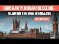

# Islam on the rise in England - Christianity in dramatic decline (2022-12-01 17:28:05+00:00)

## Description

Less than half of England and Wales population Christian, Census 2021 shows https://www.bbc.co.uk/news/uk-63792408?fbclid=IwAR2zV_vA1bYhyXXQ0Nj1hPAtFI_Mg3lp2iBYB4KaQv-bI49ljTJkoDqJrlQ

## Summary of [Islam on the rise in England - Christianity in dramatic decline](https://www.youtube.com/watch?v=R1IF9maoMj8)

*This is an AI generated summary. There may be inaccuracies. *

### [00:00:00](https://www.youtube.com/watch?v=R1IF9maoMj8&t=0) - [00:10:00](https://www.youtube.com/watch?v=R1IF9maoMj8&t=600)

discusses the recent rise in Islam in England, which is in contrast to Christianity's dramatic decline. The Englishman attributes this trend to both immigration and conversion and predicts that, in the future, Islam will become the main focus of monotheistic energy in Britain.

**[00:00:00](https://www.youtube.com/watch?v=R1IF9maoMj8&t=0)** The BBC reports that, according to the 2021 Census, fewer than half of people in England and Wales describe themselves as Christian - a 10-year change. Meanwhile, the number of people who identify as Muslim has increased by 43%.
* **[00:05:00](https://www.youtube.com/watch?v=R1IF9maoMj8&t=300)** discusses the recent rise in Islam in England, which is in contrast to Christianity's dramatic decline. Murad, a Christian scholar, writes that the reasons for this trend are both immigration and conversion. He points out that, historically speaking, Islam has roots in the Middle East, which is significant given that Christianity has been accepted as part of British history.
* **[00:10:00](https://www.youtube.com/watch?v=R1IF9maoMj8&t=600)** an Englishman discusses the increasing popularity of Islam in his country and the corresponding decline in Christianity. He predicts that, in the future, Islam will become the main focus of monotheistic energy in Britain.

## Full transcript with timestamps

[0:00:03](https://youtu.be/R1IF9maoMj8?t=3) Some rather astonishing religious news hit the 
headlines yesterday here in the UK and I want to    
[0:00:10](https://youtu.be/R1IF9maoMj8?t=10) focus on how it affects Christians and Muslims 
here the BBC reported quote for the first time    
[0:00:17](https://youtu.be/R1IF9maoMj8?t=17) fewer than half of people in England and Wales 
describe themselves as Christian the census    
[0:00:24](https://youtu.be/R1IF9maoMj8?t=24) 2021 has revealed the proportion of people who 
said they were Christian was 46.2 percent down    
[0:00:34](https://youtu.be/R1IF9maoMj8?t=34) from 59.3 percent in the last census in 2011 
that's 10 years ago in contrast the number    
[0:00:43](https://youtu.be/R1IF9maoMj8?t=43) who said they had no religion increased to 
37.2 percent of the population up from a    
[0:00:51](https://youtu.be/R1IF9maoMj8?t=51) quarter and interestingly those identifying as 
Muslim Rose from 4.9 in 2011 to 6.5 last year    
[0:01:03](https://youtu.be/R1IF9maoMj8?t=63) now the census is carried out every 10 
years by the office for National statistics    
[0:01:10](https://youtu.be/R1IF9maoMj8?t=70) Professor Linda Woodhead commented ticking no 
religion does not mean having no beliefs she    
[0:01:17](https://youtu.be/R1IF9maoMj8?t=77) said and Linda is Professor of religious 
studies at King's College here in London    
[0:01:23](https://youtu.be/R1IF9maoMj8?t=83) she said some will be atheists a lot would 
be agnostic they just say I don't really    
[0:01:29](https://youtu.be/R1IF9maoMj8?t=89) know and some will be spiritual and be doing 
spiritual Things She Said Scotland's census    
[0:01:36](https://youtu.be/R1IF9maoMj8?t=96) by the way was due to take place last year but 
was delayed by a year due to the covid pandemic    
[0:01:44](https://youtu.be/R1IF9maoMj8?t=104) now in another report in the guardian we 
read the census revealed a 5.5 million    
[0:01:52](https://youtu.be/R1IF9maoMj8?t=112) four in the number of people who describe 
themselves as Christian now that's a 17 full    
[0:02:00](https://youtu.be/R1IF9maoMj8?t=120) and a 1.2 million rise in the number of people 
who say they follow Islam bringing the Muslim    
[0:02:08](https://youtu.be/R1IF9maoMj8?t=128) population to 3.9 million now that's a 43 increase 
in the number of people who identify as Muslim    
[0:02:17](https://youtu.be/R1IF9maoMj8?t=137) uh the guardian says it's the first time in 
a census of England and Wales that fewer than    
[0:02:24](https://youtu.be/R1IF9maoMj8?t=144) half the population have described themselves as 
Christian so it's the first time in history that    
[0:02:31](https://youtu.be/R1IF9maoMj8?t=151) uh less than half the population call themselves 
Christians it's a very significant watershed    
[0:02:37](https://youtu.be/R1IF9maoMj8?t=157) moment so according to the new census to summarize 
there are nearly four million Muslims in England    
[0:02:46](https://youtu.be/R1IF9maoMj8?t=166) and Wales and all this despite the negative 
media coverage of Islam in the popular press    
[0:02:54](https://youtu.be/R1IF9maoMj8?t=174) Five Pillars the Muslim news site in 
the UK says and I quote that London    
[0:03:00](https://youtu.be/R1IF9maoMj8?t=180) is the place London is the place with 
the highest concentration of Muslims    
[0:03:06](https://youtu.be/R1IF9maoMj8?t=186) 15 percent of malandanas describe themselves 
as Muslim up from 12.6 in 2021 that's just    
[0:03:15](https://youtu.be/R1IF9maoMj8?t=195) last year from 12 to 15 this means that over 
1.3 million Muslims are living in London alone  
[0:03:27](https://youtu.be/R1IF9maoMj8?t=207) commenting on this uh latest Census Data the 
Muslim Council of Britain Secretary General Zara    
[0:03:34](https://youtu.be/R1IF9maoMj8?t=214) Muhammad said and I quote while our nation has an 
increasingly aging population the contribution to    
[0:03:42](https://youtu.be/R1IF9maoMj8?t=222) the workforce of a youthful Muslim population 
remains a strategic National Asset the last    
[0:03:50](https://youtu.be/R1IF9maoMj8?t=230) decade has seen more second and third generation 
Muslims confident of our faith and place in    
[0:03:57](https://youtu.be/R1IF9maoMj8?t=237) society contributing immensely to the economic 
recovery and vitality of our nation and quote    
[0:04:07](https://youtu.be/R1IF9maoMj8?t=247) now why should this matter to The Wider Muslim 
population what relevance does Islam have well    
[0:04:15](https://youtu.be/R1IF9maoMj8?t=255) I'd like to introduce you to a man called Henry 
stubb and I'm going to be reading uh from this    
[0:04:22](https://youtu.be/R1IF9maoMj8?t=262) marvelous book called uh traveling home essays 
on Islam and Europe by Abdul Hakeem who teaches    
[0:04:29](https://youtu.be/R1IF9maoMj8?t=269) uh Islam at the University of Cambridge and 
um in his book on page 85 he introduces us    
[0:04:37](https://youtu.be/R1IF9maoMj8?t=277) to Henry's stub he was a physician a doctor to 
James the first James the first who died in 1625    
[0:04:46](https://youtu.be/R1IF9maoMj8?t=286) was King of England and he famously of course 
produced the King James version of the Bible    
[0:04:53](https://youtu.be/R1IF9maoMj8?t=293) that's why it's called the King James version of 
the Bible so Henry stubb was his uh his physician    
[0:04:59](https://youtu.be/R1IF9maoMj8?t=299) and he wrote uh Stubbs wrote the first 
according to Tim winter here Abdul Hakim    
[0:05:05](https://youtu.be/R1IF9maoMj8?t=305) Murad the first appreciative biography of 
the Prophet ever written by a Christian    
[0:05:12](https://youtu.be/R1IF9maoMj8?t=312) and this indicates he writes the real 
convergence of which the real conversions which    
[0:05:19](https://youtu.be/R1IF9maoMj8?t=319) his contemporaries noticed between Islam and a 
certain kind of puritanism puritanism was the the    
[0:05:27](https://youtu.be/R1IF9maoMj8?t=327) kind of movement of the day of kind of Evangelical 
renewal in the church and um Henry Stubbs writes    
[0:05:35](https://youtu.be/R1IF9maoMj8?t=335) the following and it's kind of the Old English 
but I'd like to share it with you he writes this    
[0:05:40](https://youtu.be/R1IF9maoMj8?t=340) is the sum of muhammadan religion that's what 
he means by Islam on the one hand not clogging    
[0:05:48](https://youtu.be/R1IF9maoMj8?t=348) men's Faith with the necessity of believing a 
number of obtrusive Notions which they cannot    
[0:05:55](https://youtu.be/R1IF9maoMj8?t=355) comprehend and which are often contradictory to 
the dictates of reason and Common Sense nor on    
[0:06:04](https://youtu.be/R1IF9maoMj8?t=364) the other hand loading them with the performance 
of many Troublesome expensive and superstitious    
[0:06:11](https://youtu.be/R1IF9maoMj8?t=371) ceremonies yet in joining a Jew observance of 
religious worship as the surest method to keep    
[0:06:21](https://youtu.be/R1IF9maoMj8?t=381) men in the bounds of their Duty both to God and 
man end quote now the uh this is taken from his    
[0:06:30](https://youtu.be/R1IF9maoMj8?t=390) book Stubbs book which is amazingly entitled an 
account of the rise and progress of muhammadanism    
[0:06:37](https://youtu.be/R1IF9maoMj8?t=397) and a Vindication of him and his religion from 
the culminaries of the Christians now comrie is    
[0:06:46](https://youtu.be/R1IF9maoMj8?t=406) as a way of saying the malicious misrepresentation 
the lies of the Christians now he is a Christian    
[0:06:52](https://youtu.be/R1IF9maoMj8?t=412) of course himself it's interesting the this idea 
of Christian lies what one perhaps can still find    
[0:06:58](https://youtu.be/R1IF9maoMj8?t=418) this at Speaker's Corner where Islam is routinely 
misrepresented uh quite often maliciously by uh    
[0:07:06](https://youtu.be/R1IF9maoMj8?t=426) the Christian missionaries there I don't mean to 
say that all missionaries are like that of course    
[0:07:10](https://youtu.be/R1IF9maoMj8?t=430) so this is a fascinating uh insight into the 
earliest appreciation in England we have of    
[0:07:17](https://youtu.be/R1IF9maoMj8?t=437) Islam from a very senior and distinguished 
scholar physician to the king himself I    
[0:07:23](https://youtu.be/R1IF9maoMj8?t=443) wonder if he had conversations with King James 
about uh Islam who knows so this tells us that    
[0:07:33](https://youtu.be/R1IF9maoMj8?t=453) he was aware stops US aware of the similarity 
between the beliefs of Islam and his own    
[0:07:39](https://youtu.be/R1IF9maoMj8?t=459) Unitarian Christianity and he can be seen 
as part of a growing Tradition at this time    
[0:07:45](https://youtu.be/R1IF9maoMj8?t=465) expressing a dissatisfaction with the intellectual 
inconsistencies of trinitarianism as he saw it and    
[0:07:54](https://youtu.be/R1IF9maoMj8?t=474) he's seeking to discover the original Unitarian 
roots of the Christian tradition in the Middle    
[0:08:02](https://youtu.be/R1IF9maoMj8?t=482) East and this is very interesting because 
he identifies Islam with this and of course    
[0:08:07](https://youtu.be/R1IF9maoMj8?t=487) we can go back to Moses and then to Jesus and to 
Muhammad peace be upon them all all of them from    
[0:08:13](https://youtu.be/R1IF9maoMj8?t=493) the Middle East from the same part of the world 
and so even this early on there was a awareness    
[0:08:19](https://youtu.be/R1IF9maoMj8?t=499) in some courses in England or the authenticity 
and the truth of Islam so this is the relevance    
[0:08:26](https://youtu.be/R1IF9maoMj8?t=506) really of Islam it's a calling back uh to the ab 
the faith of Moses Abraham Jesus and Muhammad of    
[0:08:34](https://youtu.be/R1IF9maoMj8?t=514) course peace be upon them all I believe in 
one God a Unitarian Faith a god of Mercy a    
[0:08:40](https://youtu.be/R1IF9maoMj8?t=520) God of Justice a god of love and so on and this 
is part of English History it's not alien to it    
[0:08:47](https://youtu.be/R1IF9maoMj8?t=527) um and all of these religions as I say find their 
Roots the historical roots in the Middle East    
[0:08:52](https://youtu.be/R1IF9maoMj8?t=532) so if we have accepted Christianity as part of 
our history in England then Islam is no less a    
[0:08:59](https://youtu.be/R1IF9maoMj8?t=539) part of the historical uh Heritage as well so um 
there we are I just wanted to share with amazing    
[0:09:06](https://youtu.be/R1IF9maoMj8?t=546) news Islam is the one religion uh major world 
religion in Britain that is Bucking the trend    
[0:09:11](https://youtu.be/R1IF9maoMj8?t=551) and is increasing its adherence quite dramatically 
mainly of course through immigration but not just    
[0:09:18](https://youtu.be/R1IF9maoMj8?t=558) through immigration also through uh conversion 
there are hundreds of thousands at least of    
[0:09:24](https://youtu.be/R1IF9maoMj8?t=564) English people who have converted to Islam 
and there's a steady stream of people who    
[0:09:30](https://youtu.be/R1IF9maoMj8?t=570) are converting to the faith particularly and 
interestingly amongst women who are attracted    
[0:09:36](https://youtu.be/R1IF9maoMj8?t=576) to the values of the faith the Dignity of women 
of course is a key theme in Islam spoken of in    
[0:09:41](https://youtu.be/R1IF9maoMj8?t=581) the Quran and in the death of the Prophet himself 
upon whom be peace and this attracts many women    
[0:09:48](https://youtu.be/R1IF9maoMj8?t=588) um over against the materialism and the 
sexualization of gender and and their own    
[0:09:53](https://youtu.be/R1IF9maoMj8?t=593) sex of course that they see in wider Society so um 
this census result is a very interesting news um    
[0:10:01](https://youtu.be/R1IF9maoMj8?t=601) the the inexorable I think the inexual decline of 
Christianity in Britain and the rise of Islam and    
[0:10:08](https://youtu.be/R1IF9maoMj8?t=608) other um spiritualities as well not just Islam but 
Islam is by far the most significant um increase    
[0:10:15](https://youtu.be/R1IF9maoMj8?t=615) I think of all and uh and it remains it will 
in the future I think become the main um focus    
[0:10:24](https://youtu.be/R1IF9maoMj8?t=624) of monotheistic energy in Britain as the other 
abrahamic faiths uh decline anyway till next time  
