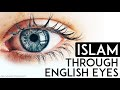

# Islam through English Eyes (2021-10-19)

## Description

I read from Islam and the Destiny of Man by Gai Eaton https://www.amazon.co.uk/Islam-Destiny-Man-Charles-Eaton/dp/0946621470/ref=sr_1_1?crid=1D8VRZ08CRV9H&dchild=1&keywords=islam+and+the+destiny+of+man&qid=1634674474&sprefix=islam+and+%2Caps%2C186&sr=8-1

## Summary of [Islam through English Eyes](https://www.youtube.com/watch?v=LzlnZvWcHEs)

*This summary is AI generated - there may be inaccuracies. *

### [00:00:00](https://www.youtube.com/watch?v=LzlnZvWcHEs&t=0) - [00:15:00](https://www.youtube.com/watch?v=LzlnZvWcHEs&t=900)

This video provides a brief overview of some of the main teachings of Islam, with a focus on the Islamic understanding of science. It points out that the prophet Muhammad did not promote blind praise of him, but instead asked for a clear understanding of his teachings.

**[00:00:00](https://www.youtube.com/watch?v=LzlnZvWcHEs&t=0)** British writer Gai Eaton wrote about the effects of grief on those who lose loved ones, and the importance of accepting God's will.
* **[00:05:00](https://www.youtube.com/watch?v=LzlnZvWcHEs&t=300)** The video discusses how guilt and religion can be unhealthy, and how death can be a reality that is either all or nothing. It goes on to say that Islam teaches man to accept reality and to remember his place in the universe.
* **[00:10:00](https://www.youtube.com/watch?v=LzlnZvWcHEs&t=600)** Islam is a religion with a deep philosophical and spiritual foundation. Its teachings emphasize the importance of following the path of Muhammad (PBUH), the last and most perfect messenger of God. Muslims believe that Muhammad's example can be emulation by humans, and that his virtues should be imitated. This video provides a brief overview of some of the main teachings of Islam.
* **[00:15:00](https://www.youtube.com/watch?v=LzlnZvWcHEs&t=900)** The videos in this YouTube channel discuss the Islamic perspective on various scientific topics. One of the videos, "Islam through English Eyes," discusses the concept of tauheed, or the Islamic understanding of science. The video points out that the prophet Muhammad did not promote blind praise of him, but instead asked for a clear understanding of his teachings. The other videos in the channel discuss different aspects of Islamic culture and beliefs.

## Full transcript with timestamps

[0:00:06](https://youtu.be/LzlnZvWcHEs?t=6) I just wanted to share with you some 
gems from a British writer Gai Eaton    
[0:00:10](https://youtu.be/LzlnZvWcHEs?t=10) who died in 2010. He was a convert to islam and 
he had been a muslim for over 50 years when he    
[0:00:18](https://youtu.be/LzlnZvWcHEs?t=18) sadly passed away he was also an historian wrote 
many books and a popular speaker and he worked    
[0:00:25](https://youtu.be/LzlnZvWcHEs?t=25) also at regents park mosque in 
london for many years as well    
[0:00:29](https://youtu.be/LzlnZvWcHEs?t=29) and i want to quote some of these absolute gems 
uh from some of his books uh one of my favorite    
[0:00:36](https://youtu.be/LzlnZvWcHEs?t=36) books actually is a book he wrote called Islam 
and the Destiny of Man and in there he wrote    
[0:00:42](https://youtu.be/LzlnZvWcHEs?t=42) the modern westerner persuaded that he has a 
right to think for himself and imagining that he    
[0:00:49](https://youtu.be/LzlnZvWcHEs?t=49) exercises this right is unwilling to acknowledge 
that his every thought has been shaped by cultural    
[0:00:56](https://youtu.be/LzlnZvWcHEs?t=56) and historical influences and that his opinions 
fit like pieces of a jigsaw puzzle into a pattern    
[0:01:04](https://youtu.be/LzlnZvWcHEs?t=64) which has nothing random about it that's an 
amazing quote i mean he's saying that we all like    
[0:01:10](https://youtu.be/LzlnZvWcHEs?t=70) in the west like to think uh for ourselves and 
uh and that we do that and we exercise this right    
[0:01:15](https://youtu.be/LzlnZvWcHEs?t=75) and in fact but in fact we end up thinking 
pretty much the same on most issues i mean of    
[0:01:21](https://youtu.be/LzlnZvWcHEs?t=81) the day whether it be politically correct issues 
or other issues so in fact it's a bit of a myth    
[0:01:27](https://youtu.be/LzlnZvWcHEs?t=87) that we all do think for ourselves we all think 
within the box rather than outside of it usually    
[0:01:32](https://youtu.be/LzlnZvWcHEs?t=92) in another quote from the same book he wrote about 
the agnostic very profound insight the agnostic    
[0:01:39](https://youtu.be/LzlnZvWcHEs?t=99) has a very curious notion of religion he is 
convinced that a man who says i believe in god    
[0:01:46](https://youtu.be/LzlnZvWcHEs?t=106) should at once become perfect if this does not 
happen then the believer must be a fraud and a    
[0:01:53](https://youtu.be/LzlnZvWcHEs?t=113) hypocrite he thinks that adherence to a religion 
is the end of the road whereas it is in fact only    
[0:02:01](https://youtu.be/LzlnZvWcHEs?t=121) the beginning of a very long and sometimes very 
rough road he looks for consistency in religious    
[0:02:09](https://youtu.be/LzlnZvWcHEs?t=129) people however aware he may be of inconsistencies 
in himself very true very true and this next quote    
[0:02:18](https://youtu.be/LzlnZvWcHEs?t=138) from the same book is such a beautiful couple of 
sentences that really it's just stunning i want    
[0:02:23](https://youtu.be/LzlnZvWcHEs?t=143) to share this with you people are not always what 
they say they are or even what they think they are    
[0:02:33](https://youtu.be/LzlnZvWcHEs?t=153) but there is one who sees us objectively 
and have and we have reason to be thankful    
[0:02:40](https://youtu.be/LzlnZvWcHEs?t=160) that he is called the merciful the compassionate 
the forgiving that's a beautiful quote    
[0:02:48](https://youtu.be/LzlnZvWcHEs?t=168) and the next one i must say made me feel rather 
awkward and uneasy when i read it he wrote in    
[0:02:55](https://youtu.be/LzlnZvWcHEs?t=175) the same book a man might spend a lifetime reading 
spiritual books and studying the writings of the    
[0:03:02](https://youtu.be/LzlnZvWcHEs?t=182) great mystics he might feel that he has penetrated 
the secrets of the heavens and the earth    
[0:03:08](https://youtu.be/LzlnZvWcHEs?t=188) but unless this knowledge was incorporated into 
his very nature and transformed him it was sterile    
[0:03:18](https://youtu.be/LzlnZvWcHEs?t=198) i began to suspect that a simple man of faith 
praying to god with little understanding but    
[0:03:25](https://youtu.be/LzlnZvWcHEs?t=205) with a full heart might be worth more than the 
most learned student of the spiritual sciences    
[0:03:34](https://youtu.be/LzlnZvWcHEs?t=214) wow painful very true very true and here's a 
quote from another of his books king of the castle    
[0:03:42](https://youtu.be/LzlnZvWcHEs?t=222) choice and responsibility in the modern 
world where he wrote men who scorn the idea    
[0:03:50](https://youtu.be/LzlnZvWcHEs?t=230) of submission to the divine will are outraged 
by the notion of a god who requires submission    
[0:03:58](https://youtu.be/LzlnZvWcHEs?t=238) are among the first to demand 
total submission to the process    
[0:04:02](https://youtu.be/LzlnZvWcHEs?t=242) in which we are involved and seem to attach a kind 
of moral imperative to willing participation in it    
[0:04:11](https://youtu.be/LzlnZvWcHEs?t=251) any other attitude so they say is reactionary or 
escapist or anti-social perhaps after all they    
[0:04:19](https://youtu.be/LzlnZvWcHEs?t=259) have found a divinity to worship and if they have 
the only charitable comment must be god help them  
[0:04:31](https://youtu.be/LzlnZvWcHEs?t=271) and here's another quote from the same book 
which speaks of our human condition uh people who    
[0:04:38](https://youtu.be/LzlnZvWcHEs?t=278) lose people we love of grief and so 
on and he writes in king of the castle    
[0:04:45](https://youtu.be/LzlnZvWcHEs?t=285) we are all of us exposed to grief the 
people we love die as we shall ourselves    
[0:04:52](https://youtu.be/LzlnZvWcHEs?t=292) in due course expectations are disappointed 
and ambitions are thwarted by circumstance    
[0:05:02](https://youtu.be/LzlnZvWcHEs?t=302) finally there are some who insist upon 
feeling guilty over the ill they have done    
[0:05:07](https://youtu.be/LzlnZvWcHEs?t=307) or simply on account of the ugliness which they 
perceive in their own souls a solution of a kind    
[0:05:15](https://youtu.be/LzlnZvWcHEs?t=315) has been found to this problem in the 
form of sedatives and antidepressant drugs    
[0:05:22](https://youtu.be/LzlnZvWcHEs?t=322) so that many human experiences which used to 
be accepted as an integral part of human life    
[0:05:29](https://youtu.be/LzlnZvWcHEs?t=329) are now defined and dealt with as medical 
problems the widow who grieves for a beloved    
[0:05:37](https://youtu.be/LzlnZvWcHEs?t=337) husband becomes a case as does the man sadden by 
the recollection of the napalm or high explosives    
[0:05:46](https://youtu.be/LzlnZvWcHEs?t=346) he has dropped on civilian populations one had 
thought that guilt was away however indirect    
[0:05:54](https://youtu.be/LzlnZvWcHEs?t=354) in which we might perceive the nature of reality 
and the laws which govern our human experience    
[0:06:02](https://youtu.be/LzlnZvWcHEs?t=362) but it is now an illness that can be 
cured death however remains incurable    
[0:06:10](https://youtu.be/LzlnZvWcHEs?t=370) though we might be embarrassed by victorian death 
bed scenes or the practices of mourning people    
[0:06:16](https://youtu.be/LzlnZvWcHEs?t=376) a morning among people less sophisticated than 
ourselves the fact of death tells us so much    
[0:06:23](https://youtu.be/LzlnZvWcHEs?t=383) about the realities of our condition that to 
ignore it or try to forget it is to be unaware    
[0:06:30](https://youtu.be/LzlnZvWcHEs?t=390) of the most important thing we need to know 
about our situation as living creatures    
[0:06:38](https://youtu.be/LzlnZvWcHEs?t=398) equally to witness and participate in 
the dying of our fellow men and women    
[0:06:43](https://youtu.be/LzlnZvWcHEs?t=403) is to learn what we are and if we have 
any wisdom at all to draw conclusions    
[0:06:50](https://youtu.be/LzlnZvWcHEs?t=410) which must in their way affect our 
every thought and our every act  
[0:06:59](https://youtu.be/LzlnZvWcHEs?t=419) it speaks for itself  
[0:07:03](https://youtu.be/LzlnZvWcHEs?t=423) and in a much much shorter passage back 
in the islam and destiny a man book    
[0:07:08](https://youtu.be/LzlnZvWcHEs?t=428) he says religion cannot survive whole 
and effective when it is confined to one    
[0:07:16](https://youtu.be/LzlnZvWcHEs?t=436) single compartment of life and education death is 
either all or it is nothing either it dwarfs all    
[0:07:27](https://youtu.be/LzlnZvWcHEs?t=447) profane studies or it is dwarfed by them i really 
like that statement the theology used to be called    
[0:07:35](https://youtu.be/LzlnZvWcHEs?t=455) of course the queen of the sciences uh and now 
of course it's uh threatened to be abolished in    
[0:07:41](https://youtu.be/LzlnZvWcHEs?t=461) many university uh departments in the uk anyway 
but he says religion cannot survive whole and    
[0:07:48](https://youtu.be/LzlnZvWcHEs?t=468) effective when it's confined to one part of life 
like you know your leisure time what you do on the    
[0:07:53](https://youtu.be/LzlnZvWcHEs?t=473) weekend or something is either everything or it's 
nothing the muslims get this christians used to    
[0:08:00](https://youtu.be/LzlnZvWcHEs?t=480) get this not anymore i tend to find but muslims 
if there's one thing that muslims can teach the    
[0:08:06](https://youtu.be/LzlnZvWcHEs?t=486) west and teach christians too is that religion is 
either everything and not just a private thing but    
[0:08:13](https://youtu.be/LzlnZvWcHEs?t=493) includes politics it includes uh divine law and 
our spirituality and everything all it is nothing    
[0:08:20](https://youtu.be/LzlnZvWcHEs?t=500) anyway on to another quote and this is this 
is a nice one one of the fundamental themes of    
[0:08:28](https://youtu.be/LzlnZvWcHEs?t=508) the quran is man's flight from reality given the 
basic premise that god is and that his being both    
[0:08:37](https://youtu.be/LzlnZvWcHEs?t=517) transcends and encompasses all existence 
then unbelief is precisely such a flight    
[0:08:45](https://youtu.be/LzlnZvWcHEs?t=525) men and women throughout the centuries have tried 
at every opportunity to evade total reality and to    
[0:08:52](https://youtu.be/LzlnZvWcHEs?t=532) take refuge in little corners of private darkness 
even at the simplest everyday level there is    
[0:08:59](https://youtu.be/LzlnZvWcHEs?t=539) constant avoidance of the thought of death 
there is evasion of our inward solitaryness    
[0:09:06](https://youtu.be/LzlnZvWcHEs?t=546) which no amount of conviviality can entirely 
overcome and there is a refusal to acknowledge our    
[0:09:14](https://youtu.be/LzlnZvWcHEs?t=554) limitations and our sins not only is it the innate 
tendency of fallen man to forget god but there    
[0:09:23](https://youtu.be/LzlnZvWcHEs?t=563) comes about a luxuriant growth of forgetfulness 
in every sphere wow powerful words powerful words  
[0:09:36](https://youtu.be/LzlnZvWcHEs?t=576) i like this one this is uh particularly good just 
one sentence from islam and the destiny of man    
[0:09:44](https://youtu.be/LzlnZvWcHEs?t=584) there are strengths and virtues in a 
polygamous marriage as there are in a    
[0:09:50](https://youtu.be/LzlnZvWcHEs?t=590) monogamous one and it was muhammad's destiny 
to demonstrate both in their perfection    
[0:09:57](https://youtu.be/LzlnZvWcHEs?t=597) in that amazing their strengths and virtues in 
polygamous marriage as there are in monogamous    
[0:10:03](https://youtu.be/LzlnZvWcHEs?t=603) ones but it was muhammad's destiny to demonstrate 
both in their perfection because he was married    
[0:10:09](https://youtu.be/LzlnZvWcHEs?t=609) to his first wife for i think it was 25 years 
monogamously in a beautiful marriage and then    
[0:10:16](https://youtu.be/LzlnZvWcHEs?t=616) after her sad demise he had polygamous marriages 
of course for various reasons often political  
[0:10:25](https://youtu.be/LzlnZvWcHEs?t=625) and here we have um a lovely uh paragraph from 
islam and the destiny of man about the quran    
[0:10:34](https://youtu.be/LzlnZvWcHEs?t=634) the quran set on a shelf with other books has a 
function entirely different to theirs and exists    
[0:10:42](https://youtu.be/LzlnZvWcHEs?t=642) in a different dimension wow what an opening 
sentence it moves an illiterate shepherd to tears    
[0:10:49](https://youtu.be/LzlnZvWcHEs?t=649) when recited to him and it has shaped the lives 
of millions of simple people over the course of    
[0:10:56](https://youtu.be/LzlnZvWcHEs?t=656) almost 14 centuries it has nourished some of the 
most powerful intellects known to the human record    
[0:11:05](https://youtu.be/LzlnZvWcHEs?t=665) it has stopped sophisticates in their tracks and 
made saints of them and it has been the source of    
[0:11:12](https://youtu.be/LzlnZvWcHEs?t=672) the most subtle philosophy and of an art which 
expresses its deepest meaning in visual terms    
[0:11:21](https://youtu.be/LzlnZvWcHEs?t=681) it has brought the wandering tribes of mankind 
together in communities and civilizations upon    
[0:11:28](https://youtu.be/LzlnZvWcHEs?t=688) which its imprint is apparent even 
to the most casual observer wow  
[0:11:38](https://youtu.be/LzlnZvWcHEs?t=698) and this next quote is about how do people imitate 
muhammad and he writes this in islam and the    
[0:11:45](https://youtu.be/LzlnZvWcHEs?t=705) destiny of man to love muhammad is one thing but 
to imitate him to try to be like him is another    
[0:11:54](https://youtu.be/LzlnZvWcHEs?t=714) he was the last messenger and the last prophet so 
how can we expect to imitate what by definition    
[0:12:02](https://youtu.be/LzlnZvWcHEs?t=722) is unique and unrepeatable in the first place 
his virtues are to be imitated and they were    
[0:12:10](https://youtu.be/LzlnZvWcHEs?t=730) providentially exemplified in the extraordinary 
variety of human experience through which he    
[0:12:16](https://youtu.be/LzlnZvWcHEs?t=736) passed in his 62 years of life he was an orphan 
yet he knew the warmth of parental love through    
[0:12:24](https://youtu.be/LzlnZvWcHEs?t=744) his grandfather's devoted care for him he was 
the faithful husband of one wife for many years    
[0:12:31](https://youtu.be/LzlnZvWcHEs?t=751) and after her death the tender and considerate 
husband of many wives he was the father of    
[0:12:38](https://youtu.be/LzlnZvWcHEs?t=758) children who gave him the greatest joy this world 
has to offer and he saw all but one of them die    
[0:12:47](https://youtu.be/LzlnZvWcHEs?t=767) he had been a shepherd and a merchant when young 
and he became a ruler a statesman a military    
[0:12:55](https://youtu.be/LzlnZvWcHEs?t=775) commander and a law giver he loved his native 
city and was driven from it into exile finally    
[0:13:03](https://youtu.be/LzlnZvWcHEs?t=783) to return home in triumph and set an example 
of clemency which has no equal in human history    
[0:13:13](https://youtu.be/LzlnZvWcHEs?t=793) not only do we know almost everything he did 
we know the exact manner in which he did it    
[0:13:21](https://youtu.be/LzlnZvWcHEs?t=801) and that's some islam and the destiny of man 
i like that sentence where he writes guy eaton    
[0:13:27](https://youtu.be/LzlnZvWcHEs?t=807) he loved his native city and was driven from it 
into exile he went to medina of course finally    
[0:13:33](https://youtu.be/LzlnZvWcHEs?t=813) to return home in triumph and he set an example 
of clemency of mercy so when he had total power    
[0:13:40](https://youtu.be/LzlnZvWcHEs?t=820) he could have crushed his enemies destroyed 
them killed them but he showed them mercy and    
[0:13:47](https://youtu.be/LzlnZvWcHEs?t=827) guidance says this has no equal in human history 
absolutely extraordinary absolutely extraordinary    
[0:13:56](https://youtu.be/LzlnZvWcHEs?t=836) and just a couple more because i could go on 
over hours uh two more short ones and this    
[0:14:01](https://youtu.be/LzlnZvWcHEs?t=841) again is typical of guy eaton's just amazing 
ability to write brilliant prose condensed    
[0:14:07](https://youtu.be/LzlnZvWcHEs?t=847) spiritually powerful and and a way to change 
our perceptions of reality and this is this is    
[0:14:13](https://youtu.be/LzlnZvWcHEs?t=853) one such example from islam in the destiny 
of man just a few brief sentences he writes    
[0:14:20](https://youtu.be/LzlnZvWcHEs?t=860) the muslim does not feel dwarfed by the 
immensities of nature because he knows    
[0:14:25](https://youtu.be/LzlnZvWcHEs?t=865) himself to be the vice regent of god standing 
upright in the midst of such immensities    
[0:14:33](https://youtu.be/LzlnZvWcHEs?t=873) we those small in stature see the stars they do 
not see us we hold them within our consciousness    
[0:14:43](https://youtu.be/LzlnZvWcHEs?t=883) and measure them in accordance with our knowledge 
they know us not we master them in their courses    
[0:14:52](https://youtu.be/LzlnZvWcHEs?t=892) immensity cannot know itself only in human 
consciousness can such a concept exist wow  
[0:15:05](https://youtu.be/LzlnZvWcHEs?t=905) and maybe just one last one and this uh is quite 
hard hitting this one game from islam and the    
[0:15:12](https://youtu.be/LzlnZvWcHEs?t=912) destiny of man about science and scientists if the 
term science has any precise meaning relating it    
[0:15:21](https://youtu.be/LzlnZvWcHEs?t=921) to knowledge of the real then it is the science of 
tauheed it could be said and with good reason that    
[0:15:28](https://youtu.be/LzlnZvWcHEs?t=928) the cafe should never be permitted to approach the 
physical sciences or to involve himself in them    
[0:15:36](https://youtu.be/LzlnZvWcHEs?t=936) whoa what's going getting out here he does not 
possess the key to them and he is therefore    
[0:15:42](https://youtu.be/LzlnZvWcHEs?t=942) bound to go astray and to lead others astray he 
divides when he should unite and his fragmented    
[0:15:50](https://youtu.be/LzlnZvWcHEs?t=950) mind deals only with fragments it is little wonder 
that he splits the atom with devastating results    
[0:16:01](https://youtu.be/LzlnZvWcHEs?t=961) those who know nothing of the principle 
are incompetent to study its manifestations    
[0:16:07](https://youtu.be/LzlnZvWcHEs?t=967) then he quotes in the quran pursue not that of 
which thou hast no knowledge surely hearing and    
[0:16:16](https://youtu.be/LzlnZvWcHEs?t=976) sight and heart all these shall be called to 
account that's surah 17 verse 36 powerful words    
[0:16:26](https://youtu.be/LzlnZvWcHEs?t=986) we will never hear them anywhere in the media 
or in our orthodox knowledge uh extraordinary    
[0:16:34](https://youtu.be/LzlnZvWcHEs?t=994) and then the penultimate one a beautiful paragraph 
this the sunnah of the prophet provides not only    
[0:16:43](https://youtu.be/LzlnZvWcHEs?t=1003) a framework but also as it were a network 
of channels into which the believers will    
[0:16:50](https://youtu.be/LzlnZvWcHEs?t=1010) enters and through which it flows smoothly both 
guided and guarded it is not his way the muslims    
[0:16:59](https://youtu.be/LzlnZvWcHEs?t=1019) way to cut new channels for his volative life 
through the recalcitrant materials of this world    
[0:17:06](https://youtu.be/LzlnZvWcHEs?t=1026) against the grain of things at first sight 
one might expect this to produce a tedious    
[0:17:13](https://youtu.be/LzlnZvWcHEs?t=1033) uniformity all the evidence indicates that it 
does nothing of the kind and anyone who has    
[0:17:21](https://youtu.be/LzlnZvWcHEs?t=1041) had close contact with good and pious muslims 
will know that although they live within    
[0:17:26](https://youtu.be/LzlnZvWcHEs?t=1046) a shared pattern of belief and behavior 
they are often more sharply differentiated    
[0:17:33](https://youtu.be/LzlnZvWcHEs?t=1053) one from another than our profane people their 
characters strong and their individualities more    
[0:17:40](https://youtu.be/LzlnZvWcHEs?t=1060) clearly delineated they have modeled themselves 
upon a transcendent norm of inexhaustible richness    
[0:17:50](https://youtu.be/LzlnZvWcHEs?t=1070) whereas profane people have taken as their model 
the fashions of the time to put it another way    
[0:17:57](https://youtu.be/LzlnZvWcHEs?t=1077) the great virtues and it is the prophet's virtues 
that the believer strives to imitate can it seems    
[0:18:05](https://youtu.be/LzlnZvWcHEs?t=1085) be expressed through human nature in countless 
different ways whereas worldly fashion induces    
[0:18:13](https://youtu.be/LzlnZvWcHEs?t=1093) uniformity in media advertisements one fashion 
model looks very much like another how true    
[0:18:23](https://youtu.be/LzlnZvWcHEs?t=1103) and the last sentence here from his 
book islam and the destiny of man    
[0:18:28](https://youtu.be/LzlnZvWcHEs?t=1108) god gave to adam and to his descendants the gift 
of intelligence asking in return not for blind    
[0:18:36](https://youtu.be/LzlnZvWcHEs?t=1116) praise but for a lucid and joyful understanding 
of the nature of all things and their source  
[0:18:47](https://youtu.be/LzlnZvWcHEs?t=1127) that's enough for now i could have quoted 
literally endless paragraphs uh his books are    
[0:18:52](https://youtu.be/LzlnZvWcHEs?t=1132) full of gems like that just wants to share 
a few of them here today until next time  
